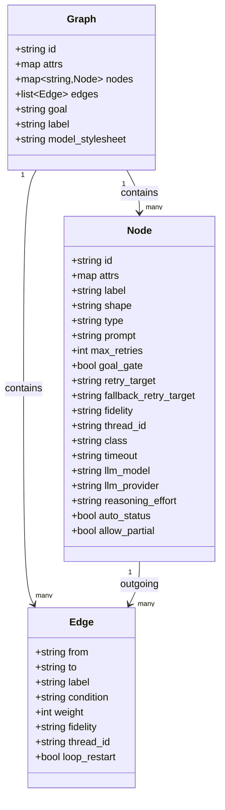

Legend: [ ] Incomplete, [X] Complete

Evidence rule (adopted from the golden sample sprint plan):
- Any checklist item may be marked [X] only once it includes:
  - The exact verification command(s) (wrapped with backticks)
  - The command exit code(s)
  - Paths to the produced artifacts (logs, fixtures, screenshots, `.scratch` transcripts)
- Evidence should live under `.scratch/verification/SPRINT-001/...` and be linked from the checklist item.

# Sprint #001 - Attractor PHP: 100% NLSpec Parity (Attractor + Coding Agent Loop + Unified LLM)

## Objective
Implement a PHP library (plus minimal CLI + optional HTTP mode) that fully satisfies ALL requirements in these Natural Language Specs:
- `attractor-spec.md`
- `coding-agent-loop-spec.md`
- `unified-llm-spec.md`

"Done" means the Definition-of-Done checklists in all three specs are 100% checked, and the cross-provider parity matrices and smoke tests pass.

## Context
This repository currently contains NLSpecs only (no PHP runtime, no composer project, no tests). The deliverable is therefore a from-scratch implementation and a verification harness that can prove spec parity.

## Inputs (Authoritative Specs)
- Attractor runner spec: `./attractor-spec.md`
- Coding agent loop spec: `./coding-agent-loop-spec.md`
- Unified LLM client spec: `./unified-llm-spec.md`

## Non-Goals (Explicit)
- Building a full UI product (IDE plugin, web dashboard) beyond what's required for validation.
- Supporting every possible LLM provider. Only OpenAI, Anthropic, and Gemini are required by NLSpec.
- Implementing DOT features outside the strict subset defined in `attractor-spec.md`.

## Current State Snapshot (2026-02-25)
- Repo has specs + LICENSE/README.
- No `composer.json`, `src/`, or test harness exists.
- No `docs/sprints/` existed prior to this sprint doc.

## Golden Sample Review (SPRINT-047-google-oauth.md)
What is excellent about the golden sample sprint plan:
- Evidence-first checklisting: it treats verification as a first-class deliverable, not an afterthought.
- Concrete commands + artifact paths: every item is verifiable and produces durable proof under `.scratch/verification/...`.
- Positive and negative tests: it anticipates failure modes and enshrines them as regression tests.
- Track-based sequencing: it forces prerequisite work (wiring, scaffolding) before dependent work (UI/e2e).
- Explicit execution order and acceptance closure: the plan makes it hard to "declare done" without passing gates.

Opportunities for improvement we will avoid in this sprint:
- Duplication: the sample repeats similar checklist items across multiple sections; we will keep a single canonical checklist per deliverable and link to it from execution phases.
- Over-indexing on implementation detail too early: for this repo, we need to lock public contracts and test harnesses first, then fill in internals.

Enhancements adopted into THIS sprint plan:
- `.scratch/verification/SPRINT-001/...` evidence tree from day 1.
- Cross-feature parity matrices from each NLSpec become runnable test suites, not just tables.
- Each track includes: scope, required tests, negative tests, and explicit evidence artifacts.

## Architectural Approach (PHP)
The three NLSpecs form a dependency stack:
1. Unified LLM Client (foundation): provider routing, streaming, tool calling, retries, content model.
2. Coding Agent Loop (built on Unified LLM): tool execution + system prompts + events + subagents.
3. Attractor Runner (built on either Unified LLM and/or Agent Loop via CodergenBackend): DOT pipelines, handlers, checkpoints, human gates.

Implementation strategy:
- Build as a single composer monorepo with three top-level namespaces:
  - `Attractor\LLM\` (unified client)
  - `Attractor\Agent\` (coding agent loop)
  - `Attractor\Pipeline\` (Attractor runner)
- Make async a first-class capability (to satisfy streaming + concurrency requirements) while offering sync convenience wrappers.

Recommended runtime/deps (decisions can be revisited during Track A):
- PHP >= 8.3
- Async/event loop: `amphp/amp` + `amphp/http-client` (or equivalent)
- JSON schema validation: `opis/json-schema` (or equivalent)
- CLI host app: `symfony/console`
- Tests: `phpunit/phpunit`

## Repository Layout (Planned)
- `src/LLM/...` unified LLM SDK
- `src/Agent/...` coding agent loop
- `src/Pipeline/...` Attractor runner
- `bin/attractor` minimal CLI
- `tests/unit/...` fast unit tests
- `tests/integration/...` adapter translation tests (mock HTTP)
- `tests/e2e/...` end-to-end tests (optionally gated by real API keys)
- `examples/pipelines/*.dot` reference pipelines for parity matrix
- `.scratch/verification/SPRINT-001/...` evidence artifacts

## Mermaid Diagrams (Verified Syntax)

### Domain Model (Attractor Graph)


### Execution Flow (Attractor Runner)
```mermaid
flowchart TD
  A[Parse DOT] --> B[Apply Transforms]
  B --> C[Validate / Lint]
  C -->|ERROR diagnostics| X[Abort]
  C --> D[Initialize Run Dir + Context + Checkpoint]
  D --> E[Find Start Node]
  E --> F{Terminal Node?}
  F -->|yes| G[Check Goal Gates]
  G -->|unsatisfied + retry target| E
  G -->|satisfied| Z[Finalize + Return]
  F -->|no| H[Execute Handler (with retry policy)]
  H --> I[Write artifacts: prompt.md/response.md/status.json]
  I --> J[Merge context_updates; set outcome/preferred_label]
  J --> K[Save checkpoint.json]
  K --> L[Select Next Edge]
  L --> M{loop_restart?}
  M -->|yes| N[Restart run w/ fresh logs_root]
  M -->|no| E
```

### Agentic Loop (Coding Agent Loop)
```mermaid
flowchart TD
  S[submit(user_input)] --> A[Build system prompt layers]
  A --> B[Unified LLM Client.complete()]
  B --> C{tool_calls?}
  C -->|no| D[Emit ASSISTANT_TEXT_END; session IDLE]
  C -->|yes| E[Dispatch tools via ToolRegistry + ExecutionEnvironment]
  E --> F[Truncate tool output for LLM; emit TOOL_CALL_END with FULL output]
  F --> G[Append ToolResultsTurn]
  G --> H[Drain steering; loop detection]
  H --> B
```

## Execution Order
Track A -> Track B -> Track C -> Track D -> Track E.

## Track A - Project Scaffolding and Dev Harness (P0)
Goal: establish a PHP project that can prove parity via tests, evidence artifacts, and reproducible commands.

- [ ] A1 - Composer + Autoload + Baseline Tooling
  - Scope:
    - Add `composer.json` with PSR-4 autoload for `Attractor\\`.
    - Add dev deps for tests + static analysis + formatting.
    - Add `composer` scripts: `test`, `lint`, `fmt`, `ci`.
  - Verification:
    - `composer validate` (exit 0)
    - `composer test` (exit 0)

- [ ] A2 - Test Harness Skeleton + Evidence Tree
  - Scope:
    - Create `.scratch/verification/SPRINT-001/README.md` describing evidence conventions.
    - Create `tests/` layout and a trivial test to validate harness.
  - Verification:
    - `composer test` (exit 0)

- [ ] A3 - HTTP Mocking + Fixture Strategy
  - Scope:
    - Pick an HTTP mocking strategy for adapter tests (e.g., mock HTTP client transport).
    - Define golden fixtures for provider request/response/stream translations.

## Track B - Unified LLM Client (Foundation)
Goal: implement `unified-llm-spec.md` end-to-end with OpenAI/Anthropic/Gemini adapters, streaming, tools, retries, caching metadata, and parity tests.

- [ ] B1 - Core Types + Client Routing + Middleware (Spec Sections 2-3)
  - Scope:
    - Implement types: `Message`, `ContentPart`, `Request`, `Response`, `Usage`, `FinishReason`, `StreamEvent`, and error hierarchy.
    - Implement `Client` with provider routing and middleware chain.
    - Implement module-level default client.

- [ ] B2 - Provider Utilities Layer
  - Scope:
    - HTTP client wrapper with timeouts.
    - SSE parser utilities for OpenAI/Anthropic/Gemini.
    - Base64 helpers + local file ingestion for IMAGE/AUDIO/DOCUMENT parts.
    - JSON schema validation helper.

- [ ] B3 - OpenAI Adapter (Responses API)
  - Scope:
    - Implement request translation to `/v1/responses` with `instructions`, `input`, tool calls/results.
    - Implement response parsing into unified `Response`.
    - Implement streaming SSE -> StreamEvent mapping.
    - Populate reasoning token usage from Responses usage details.

- [ ] B4 - Anthropic Adapter (Messages API)
  - Scope:
    - Strict alternation merging.
    - Tool use + tool_result handling.
    - Thinking and redacted_thinking round-trip (signature preserved).
    - Streaming SSE -> StreamEvent mapping.
    - Prompt caching: inject `cache_control` blocks when enabled; manage beta headers.

- [ ] B5 - Gemini Adapter (GenerateContent)
  - Scope:
    - Translate to Gemini content model; synthetic tool call IDs mapping.
    - Streaming (SSE or NDJSON) -> StreamEvent mapping.
    - Usage metadata mapping including thoughtsTokenCount.

- [ ] B6 - High-Level API (Layer 4): `generate()`, `stream()`, `generate_object()`
  - Scope:
    - Enforce prompt/messages mutual exclusion.
    - Tool loop for active tools with `max_tool_rounds`.
    - Parallel tool execution and batched tool result continuation.
    - StepResult tracking including usage aggregation.
    - `generate_object()` JSON parse + schema validate; raise `NoObjectGeneratedError`.

- [ ] B7 - Unified LLM Parity Matrix Test Suite
  - Scope:
    - Implement the `8.9 Cross-Provider Parity` matrix as runnable tests.
    - Provide integration smoke test gated by env vars for real API keys.

## Track C - Coding Agent Loop
Goal: implement `coding-agent-loop-spec.md` end-to-end, using Unified LLM Client directly (`Client.complete()` / `Client.stream()`), with provider-aligned tool profiles, truncation, events, and subagents.

- [ ] C1 - Session + History + EventEmitter
  - Scope:
    - Implement `Session`, `SessionConfig`, turn types, lifecycle transitions.
    - Implement event kinds from spec and deliver via async iterator or callback.

- [ ] C2 - ExecutionEnvironment Interface + LocalExecutionEnvironment
  - Scope:
    - Implement filesystem ops, grep/glob, and command execution with timeout + process group kill.
    - Implement env var filtering defaults.

- [ ] C3 - ToolRegistry + Shared Core Tools
  - Scope:
    - Implement tools: `read_file`, `write_file`, `edit_file`, `shell`, `grep`, `glob`.
    - Implement OpenAI `apply_patch` v4a (Appendix A) parser + applier.
    - Argument parsing and JSON schema validation.

- [ ] C4 - Truncation Pipeline + TOOL_CALL_END Full Output
  - Scope:
    - Character truncation FIRST + line truncation SECOND.
    - Head/tail truncation markers exactly as spec.

- [ ] C5 - Provider Profiles (OpenAI/Anthropic/Gemini)
  - Scope:
    - Tool definitions aligned with provider conventions.
    - System prompt layering: provider base + env context + tool docs + project docs + user overrides.
    - Project doc discovery rules (AGENTS.md always, provider-specific files conditionally).

- [ ] C6 - Steering + Loop Detection
  - Scope:
    - `steer()` and `follow_up()` queues and injection semantics.
    - Loop detection (pattern lengths 1-3) -> SteeringTurn warning.

- [ ] C7 - Subagents
  - Scope:
    - Implement `spawn_agent`, `send_input`, `wait`, `close_agent` tools.
    - Depth limiting default 1.
    - Shared execution environment but isolated histories.

- [ ] C8 - Cross-Provider Parity Matrix + Smoke Test
  - Scope:
    - Turn the `9.12` matrix + `9.13` smoke test into runnable suites.

## Track D - Attractor Pipeline Runner
Goal: implement `attractor-spec.md` end-to-end: DOT parsing subset, validation/linting, transforms, handlers, context/checkpoints, model stylesheet, conditions, retries, events, and optional HTTP server mode.

- [ ] D1 - DOT Tokenizer/Parser (Subset)
  - Scope:
    - Implement strict DOT subset parsing with comment stripping, multiline attrs, defaults, chained edges, subgraphs flattening.
    - Enforce identifier constraints.

- [ ] D2 - Graph Model + Defaults + Subgraph Class Derivation
  - Scope:
    - In-memory model (`Graph`, `Node`, `Edge`).
    - Apply node/edge defaults per scope.
    - Derive classes from subgraph labels per spec.

- [ ] D3 - Model Stylesheet Parser + Transform
  - Scope:
    - Parse grammar, apply specificity, explicit attrs override.
    - Integrate into preparation pipeline before validation.

- [ ] D4 - Validation/Linting Diagnostics + validate_or_raise()
  - Scope:
    - Implement built-in lint rules from Section 7.
    - Support custom lint rules.

- [ ] D5 - Condition Language Parser/Evaluator
  - Scope:
    - Implement `=` / `!=` and `&&` clauses.
    - Implement variable resolution (`outcome`, `preferred_label`, `context.*`).

- [ ] D6 - Runtime State: Context, Outcome, Checkpoint, ArtifactStore
  - Scope:
    - Thread-safe Context + clone() semantics.
    - Outcome + status.json contract (Appendix C).
    - Checkpoint save/load + resume behavior including fidelity downgrade.
    - ArtifactStore with file backing >100KB.

- [ ] D7 - Engine Core: traversal, goal gates, retries, edge selection
  - Scope:
    - Run lifecycle: parse -> validate -> init -> execute -> finalize.
    - Deterministic edge selection priority and normalization.
    - Retry policy, backoff presets, jitter.
    - Failure routing and loop_restart behavior.

- [ ] D8 - Handler Registry + Built-in Handlers
  - Scope:
    - start/exit, codergen, wait.human, conditional, tool, parallel, parallel.fan_in, stack.manager_loop.
    - Parallel join policies: wait_all, k_of_n, first_success, quorum.
    - Error policies: fail_fast, continue, ignore.
    - Custom handler registration.

- [ ] D9 - Transforms and Extensibility
  - Scope:
    - Transform interface + built-ins: variable expansion, stylesheet.
    - Execution-time preamble transform for non-full fidelity modes.

- [ ] D10 - Observability: Event Stream + Tool Call Hooks
  - Scope:
    - Emit event kinds from Section 9.6.
    - Implement `tool_hooks.pre`/`tool_hooks.post` around LLM tool calls (when codergen backend supports tools).

- [ ] D11 - Optional HTTP Server Mode
  - Scope:
    - Minimal endpoints per Section 9.5 including SSE events.
    - Operate human gates remotely.

- [ ] D12 - Attractor Cross-Feature Parity Matrix + Smoke Test
  - Scope:
    - Implement Section 11.12 matrix as runnable tests.
    - Implement Section 11.13 smoke test with a real LLM callback (gated by env vars).

## Track E - End-to-End Integration and Docs
Goal: prove the three layers interoperate (Unified LLM -> Agent Loop -> Attractor CodergenBackend) and provide examples.

- [ ] E1 - CodergenBackend Implementations
  - Scope:
    - `UnifiedLlmCodergenBackend`: single-turn LLM call.
    - `AgentLoopCodergenBackend`: run a Session to allow tool-use coding agent behavior.
    - Thread reuse keyed by Attractor fidelity/thread_id rules.

- [ ] E2 - Example Pipelines
  - Scope:
    - Add `examples/pipelines/` DOT files covering: linear, conditional, retries, goal gates, wait.human, parallel+fan-in, tool nodes, manager loop.

- [ ] E3 - Documentation
  - Scope:
    - README update: how to run CLI, how to run tests, how to configure providers.
    - Developer docs: adapters, tool profiles, DOT DSL subset.

- [ ] E4 - Release Checklist
  - Scope:
    - Ensure all three NLSpec DoD checklists are fully checked and backed by evidence artifacts.

## Test Strategy
- Unit tests: pure parsing/translation/selection logic (fast, deterministic).
- Integration tests: mock HTTP transports for provider adapters; golden fixtures for stream parsing.
- E2E tests:
  - Gated by env vars: `OPENAI_API_KEY`, `ANTHROPIC_API_KEY`, `GEMINI_API_KEY`.
  - Must run smoke tests described in each NLSpec.
- Negative tests are required: invalid DOT, unknown tools, invalid tool args, timeout behavior, auth errors.

## Risks and Mitigations
- Provider API drift (2026 reality): isolate adapters, use fixtures, and keep provider_options escape hatch.
- PHP async complexity: pick one event loop library early; provide sync wrappers.
- Streaming correctness: build SSE parsers with exhaustive fixture tests.
- Process control portability: implement POSIX-first; document Windows limitations if needed.

## Appendix A - Spec Coverage Checklists
This appendix is the working "100%" contract: every item must be [X] before declaring done.

### A.1 Unified LLM Client: DoD Checklist (from `unified-llm-spec.md` Section 8)
- [ ] 8.1 Core Infrastructure
- [ ] 8.2 Provider Adapters
- [ ] 8.3 Message & Content Model
- [ ] 8.4 Generation
- [ ] 8.5 Reasoning Tokens
- [ ] 8.6 Prompt Caching
- [ ] 8.7 Tool Calling
- [ ] 8.8 Error Handling & Retry
- [ ] 8.9 Cross-Provider Parity
- [ ] 8.10 Integration Smoke Test

### A.2 Coding Agent Loop: DoD Checklist (from `coding-agent-loop-spec.md` Section 9)
- [ ] 9.1 Core Loop
- [ ] 9.2 Provider Profiles
- [ ] 9.3 Tool Execution
- [ ] 9.4 Execution Environment
- [ ] 9.5 Tool Output Truncation
- [ ] 9.6 Steering
- [ ] 9.7 Reasoning Effort
- [ ] 9.8 System Prompts
- [ ] 9.9 Subagents
- [ ] 9.10 Event System
- [ ] 9.11 Error Handling
- [ ] 9.12 Cross-Provider Parity Matrix
- [ ] 9.13 Integration Smoke Test

### A.3 Attractor Runner: DoD Checklist (from `attractor-spec.md` Section 11)
- [ ] 11.1 DOT Parsing
- [ ] 11.2 Validation and Linting
- [ ] 11.3 Execution Engine
- [ ] 11.4 Goal Gate Enforcement
- [ ] 11.5 Retry Logic
- [ ] 11.6 Node Handlers
- [ ] 11.7 State and Context
- [ ] 11.8 Human-in-the-Loop
- [ ] 11.9 Condition Expressions
- [ ] 11.10 Model Stylesheet
- [ ] 11.11 Transforms and Extensibility
- [ ] 11.12 Cross-Feature Parity Matrix
- [ ] 11.13 Integration Smoke Test
