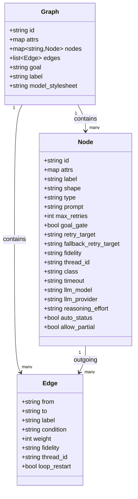

Legend: [ ] Incomplete, [X] Complete

Evidence rule (adopted from the golden sample sprint plan):
- Any checklist item may be marked [X] only once it includes:
  - The exact verification command(s) (wrapped with backticks)
  - The command exit code(s)
  - Paths to the produced artifacts (logs, fixtures, screenshots, `.scratch` transcripts)
- Evidence should live under `.scratch/verification/SPRINT-001/...` and be linked from the checklist item.

# Sprint #001 - Attractor PHP: 100% NLSpec Parity (Attractor + Coding Agent Loop + Unified LLM)

## Objective
Implement a PHP library (plus minimal CLI + optional HTTP mode) that fully satisfies ALL requirements in these Natural Language Specs:
- `attractor-spec.md`
- `coding-agent-loop-spec.md`
- `unified-llm-spec.md`

"Done" means the Definition-of-Done checklists in all three specs are 100% checked, and the cross-provider parity matrices and smoke tests pass.

## Context
This repository currently contains NLSpecs only (no PHP runtime, no composer project, no tests). The deliverable is therefore a from-scratch implementation and a verification harness that can prove spec parity.

## Inputs (Authoritative Specs)
- Attractor runner spec: `./attractor-spec.md`
- Coding agent loop spec: `./coding-agent-loop-spec.md`
- Unified LLM client spec: `./unified-llm-spec.md`

## Non-Goals (Explicit)
- Building a full UI product (IDE plugin, web dashboard) beyond what's required for validation.
- Supporting every possible LLM provider. Only OpenAI, Anthropic, and Gemini are required by NLSpec.
- Implementing DOT features outside the strict subset defined in `attractor-spec.md`.

## Current State Snapshot (2026-02-25)
- Repo has specs + LICENSE/README.
- No `composer.json`, `src/`, or test harness exists.
- No `docs/sprints/` existed prior to this sprint doc.

## Prerequisites (Execution Environment)
This sprint requires a working local PHP toolchain and a few OS-level utilities. Track A will make these explicit and add a `composer`-based developer workflow.

Minimum (required):
- `php` (>= 8.3) + `composer`
- `git`
- A POSIX-like runtime for process-group kill semantics (macOS/Linux). If Windows support is required, we must design an alternative to SIGTERM/SIGKILL early.

Strongly recommended:
- `rg` (ripgrep) for grep-backed tools
- `timeout` (GNU coreutils) or an equivalent timeout wrapper for deterministic CI
- `graphviz` (optional) for rendering `.dot` graphs to SVG/PNG in docs/tests

## Golden Sample Review (SPRINT-047-google-oauth.md)
What is excellent about the golden sample sprint plan:
- Evidence-first checklisting: it treats verification as a first-class deliverable, not an afterthought.
- Concrete commands + artifact paths: every item is verifiable and produces durable proof under `.scratch/verification/...`.
- Positive and negative tests: it anticipates failure modes and enshrines them as regression tests.
- Track-based sequencing: it forces prerequisite work (wiring, scaffolding) before dependent work (UI/e2e).
- Explicit execution order and acceptance closure: the plan makes it hard to "declare done" without passing gates.

Opportunities for improvement we will avoid in this sprint:
- Duplication: the sample repeats similar checklist items across multiple sections; we will keep a single canonical checklist per deliverable and link to it from execution phases.
- Over-indexing on implementation detail too early: for this repo, we need to lock public contracts and test harnesses first, then fill in internals.

Enhancements adopted into THIS sprint plan:
- `.scratch/verification/SPRINT-001/...` evidence tree from day 1.
- Cross-feature parity matrices from each NLSpec become runnable test suites, not just tables.
- Each track includes: scope, required tests, negative tests, and explicit evidence artifacts.

## Architectural Approach (PHP)
The three NLSpecs form a dependency stack:
1. Unified LLM Client (foundation): provider routing, streaming, tool calling, retries, content model.
2. Coding Agent Loop (built on Unified LLM): tool execution + system prompts + events + subagents.
3. Attractor Runner (built on either Unified LLM and/or Agent Loop via CodergenBackend): DOT pipelines, handlers, checkpoints, human gates.

Implementation strategy:
- Build as a single composer monorepo with three top-level namespaces:
  - `Attractor\LLM\` (unified client)
  - `Attractor\Agent\` (coding agent loop)
  - `Attractor\Pipeline\` (Attractor runner)
- Make async a first-class capability (to satisfy streaming + concurrency requirements) while offering sync convenience wrappers.

Recommended runtime/deps (decisions can be revisited during Track A):
- PHP >= 8.3
- Async/event loop: `amphp/amp` + `amphp/http-client` (or equivalent)
- JSON schema validation: `opis/json-schema` (or equivalent)
- CLI host app: `symfony/console`
- Tests: `phpunit/phpunit`

## Proposed Public API Contracts (Draft)
This section makes the planned public surface area explicit so implementation can proceed top-down with testable contracts.

### Unified LLM Client (`Attractor\LLM`)
Core entry points:
```php
namespace Attractor\LLM;

interface ProviderAdapter {
    public function name(): string;
    public function complete(Request $request): Response;

    /** @return \Traversable<StreamEvent> */
    public function stream(Request $request): \Traversable;
}

final class Client {
    public static function fromEnv(): self;
    public function __construct(?string $defaultProvider = null);
    public function registerAdapter(ProviderAdapter $adapter): void;
    public function complete(Request $request): Response;

    /** @return \Traversable<StreamEvent> */
    public function stream(Request $request): \Traversable;
}
```

High-level functions (Layer 4) (exact names TBD, but must implement spec semantics):
```php
namespace Attractor\LLM;

final class HighLevel {
    public static function generate(GenerateParams $params): GenerateResult;

    /** @return \Traversable<StreamEvent> */
    public static function stream(StreamParams $params): \Traversable;

    /** @return GenerateObjectResult<T> */
    public static function generateObject(GenerateObjectParams $params): GenerateObjectResult;
}
```

Environment variable contract (from `unified-llm-spec.md` Section 2.2):
- OpenAI: `OPENAI_API_KEY` (+ `OPENAI_BASE_URL`, `OPENAI_ORG_ID`, `OPENAI_PROJECT_ID`)
- Anthropic: `ANTHROPIC_API_KEY` (+ `ANTHROPIC_BASE_URL`)
- Gemini: `GEMINI_API_KEY` (+ `GEMINI_BASE_URL`)
- Optional fallback: `GOOGLE_API_KEY` may be accepted as a fallback for `GEMINI_API_KEY`

### Coding Agent Loop (`Attractor\Agent`)
```php
namespace Attractor\Agent;

interface ProviderProfile {
    public function id(): string;       // openai|anthropic|gemini
    public function model(): string;
    public function tools(): array;     // list<ToolDefinition>
    public function buildSystemPrompt(ExecutionEnvironment $env, ProjectDocs $docs): string;
    public function providerOptions(): ?array;
    public function toolRegistry(): ToolRegistry;

    public function supportsParallelToolCalls(): bool;
    public function contextWindowSize(): int;
}

interface ExecutionEnvironment {
    public function workingDirectory(): string;
    public function readFile(string $path, ?int $offset = null, ?int $limit = null): string;
    public function writeFile(string $path, string $content): void;
    public function fileExists(string $path): bool;
    public function execCommand(string $command, int $timeoutMs, ?string $workingDir = null, ?array $envVars = null): ExecResult;
    public function grep(string $pattern, string $path, GrepOptions $options): string;
    public function glob(string $pattern, string $path): array;
}

final class Session {
    public function __construct(
        ProviderProfile $profile,
        ExecutionEnvironment $env,
        \Attractor\LLM\Client $llm,
        ?SessionConfig $config = null,
        ?EventEmitter $events = null
    );

    public function submit(string $input): SessionResult;
    public function steer(string $message): void;
    public function followUp(string $message): void;
    public function close(): void;
}
```

### Attractor Runner (`Attractor\Pipeline`)
```php
namespace Attractor\Pipeline;

interface Handler {
    public function execute(Node $node, Context $context, Graph $graph, string $logsRoot): Outcome;
}

interface CodergenBackend {
    /** @return string|Outcome */
    public function run(Node $node, string $prompt, Context $context);
}

interface Interviewer {
    public function ask(Question $question): Answer;
    public function askMultiple(array $questions): array; // list<Answer>
    public function inform(string $message, string $stage): void;
}

final class Runner {
    public function __construct(
        HandlerRegistry $handlers,
        TransformRegistry $transforms,
        Validator $validator,
        Interviewer $interviewer
    );

    public function parseDot(string $dotSource): Graph;
    public function validate(Graph $graph): array; // list<Diagnostic>
    public function run(Graph $graph, RunnerConfig $config): PipelineOutcome;
    public function resume(string $logsRoot, RunnerConfig $config): PipelineOutcome;
}
```

## Planned File/Namespace Map (Concrete Targets)
This is the suggested initial skeleton; exact filenames can change, but the boundaries should hold.

- `src/LLM/Client.php`, `src/LLM/ProviderAdapter.php`, `src/LLM/HighLevel.php`
- `src/LLM/Adapters/OpenAIResponsesAdapter.php`, `src/LLM/Adapters/AnthropicMessagesAdapter.php`, `src/LLM/Adapters/GeminiAdapter.php`, `src/LLM/Adapters/OpenAICompatibleAdapter.php`
- `src/LLM/Types/*` (`Message`, `ContentPart`, `Request`, `Response`, `Usage`, `StreamEvent`, etc.)
- `src/LLM/Tools/*` (`Tool`, `ToolCall`, `ToolResult`, `ToolChoice`, etc.)
- `src/LLM/Errors/*` (error taxonomy per spec Section 6)
- `src/LLM/Streaming/*` (SSE/NDJSON parsing and normalization)

- `src/Agent/Session.php`, `src/Agent/SessionConfig.php`, `src/Agent/SessionEvent.php`
- `src/Agent/Profiles/*` (OpenAI/Anthropic/Gemini profiles)
- `src/Agent/Tools/*` (ToolRegistry + core tools + apply_patch/edit_file)
- `src/Agent/Exec/*` (ExecutionEnvironment, LocalExecutionEnvironment, wrappers)
- `src/Agent/Subagents/*` (Subagent manager + tools)

- `src/Pipeline/Dot/*` (tokenizer/parser for DOT subset)
- `src/Pipeline/Model/*` (Graph/Node/Edge)
- `src/Pipeline/Stylesheet/*` (parser + transform)
- `src/Pipeline/Validation/*` (lint rules + diagnostics)
- `src/Pipeline/Runtime/*` (Context, Outcome, Checkpoint, ArtifactStore)
- `src/Pipeline/Engine/*` (runner loop, edge selection, retry policy)
- `src/Pipeline/Handlers/*` (built-ins)
- `src/Pipeline/Human/*` (interviewers)
- `src/Pipeline/Http/*` (optional HTTP server mode)

## Repository Layout (Planned)
- `src/LLM/...` unified LLM SDK
- `src/Agent/...` coding agent loop
- `src/Pipeline/...` Attractor runner
- `bin/attractor` minimal CLI
- `tests/unit/...` fast unit tests
- `tests/integration/...` adapter translation tests (mock HTTP)
- `tests/e2e/...` end-to-end tests (optionally gated by real API keys)
- `examples/pipelines/*.dot` reference pipelines for parity matrix
- `.scratch/verification/SPRINT-001/...` evidence artifacts

## Evidence and Verification Conventions
Evidence is an explicit deliverable. During implementation, every completed checklist item should be updated with its evidence:
- Command(s) executed, wrapped in backticks
- Exit code(s)
- Artifact path(s) under `.scratch/verification/SPRINT-001/...`

Proposed evidence layout (by track):
- `.scratch/verification/SPRINT-001/track-a/...` scaffolding/tooling
- `.scratch/verification/SPRINT-001/track-b/...` unified LLM SDK
- `.scratch/verification/SPRINT-001/track-c/...` coding agent loop
- `.scratch/verification/SPRINT-001/track-d/...` Attractor runner
- `.scratch/verification/SPRINT-001/track-e/...` end-to-end integration

Proposed canonical commands (to be created in Track A):
- `composer test` (runs all non-e2e tests)
- `composer test:unit`, `composer test:integration`, `composer test:e2e`
- `composer lint` (static analysis + style checks)
- `composer fmt` (format code)
- `composer run doctor` (toolchain/version checks)

## Mermaid Diagrams (Verified Syntax)

### Domain Model (Attractor Graph)


### Execution Flow (Attractor Runner)
```mermaid
flowchart TD
  A[Parse DOT] --> B[Apply Transforms]
  B --> C[Validate / Lint]
  C -->|ERROR diagnostics| X[Abort]
  C --> D[Initialize Run Dir + Context + Checkpoint]
  D --> E[Find Start Node]
  E --> F{Terminal Node?}
  F -->|yes| G[Check Goal Gates]
  G -->|unsatisfied + retry target| E
  G -->|satisfied| Z[Finalize + Return]
  F -->|no| H[Execute Handler (with retry policy)]
  H --> I[Write artifacts: prompt.md/response.md/status.json]
  I --> J[Merge context_updates; set outcome/preferred_label]
  J --> K[Save checkpoint.json]
  K --> L[Select Next Edge]
  L --> M{loop_restart?}
  M -->|yes| N[Restart run w/ fresh logs_root]
  M -->|no| E
```

### Agentic Loop (Coding Agent Loop)
```mermaid
flowchart TD
  S[submit(user_input)] --> A[Build system prompt layers]
  A --> B[Unified LLM Client.complete()]
  B --> C{tool_calls?}
  C -->|no| D[Emit ASSISTANT_TEXT_END; session IDLE]
  C -->|yes| E[Dispatch tools via ToolRegistry + ExecutionEnvironment]
  E --> F[Truncate tool output for LLM; emit TOOL_CALL_END with FULL output]
  F --> G[Append ToolResultsTurn]
  G --> H[Drain steering; loop detection]
  H --> B
```

## Execution Order
Track A -> Track B -> Track C -> Track D -> Track E.

## Track A - Project Scaffolding and Dev Harness (P0)
Goal: establish a PHP project that can prove parity via tests, evidence artifacts, and reproducible commands.

- [ ] A0 - Developer Environment Bootstrap
  - Scope:
    - Document and validate required toolchain (`php`, `composer`, OS utilities).
    - Add a `composer run doctor` (or equivalent) script that checks tool availability and versions.
  - Verification:
    - `composer run doctor` (exit 0)

- [ ] A1 - Composer + Autoload + Baseline Tooling
  - Scope:
    - Add `composer.json` with PSR-4 autoload for `Attractor\\`.
    - Add dev deps for tests + static analysis + formatting.
    - Add `composer` scripts: `test`, `lint`, `fmt`, `ci`.
  - Verification:
    - `composer validate` (exit 0)
    - `composer test` (exit 0)

- [ ] A2 - Test Harness Skeleton + Evidence Tree
  - Scope:
    - Create `.scratch/verification/SPRINT-001/README.md` describing evidence conventions.
    - Create `tests/` layout and a trivial test to validate harness.
  - Verification:
    - `composer test` (exit 0)

- [ ] A3 - HTTP Mocking + Fixture Strategy
  - Scope:
    - Pick an HTTP mocking strategy for adapter tests (e.g., mock HTTP client transport).
    - Define golden fixtures for provider request/response/stream translations.

## Track B - Unified LLM Client (Foundation)
Goal: implement `unified-llm-spec.md` end-to-end with OpenAI/Anthropic/Gemini adapters, streaming, tools, retries, caching metadata, and parity tests.

- [ ] B1 - Core Types + Client Routing + Middleware (Spec Sections 2-3)
  - Scope:
    - Implement types: `Message`, `ContentPart`, `Request`, `Response`, `Usage`, `FinishReason`, `StreamEvent`, and error hierarchy.
    - Implement `Client` with provider routing and middleware chain.
    - Implement module-level default client.

- [ ] B2 - Provider Utilities Layer
  - Scope:
    - HTTP client wrapper with timeouts.
    - SSE parser utilities for OpenAI/Anthropic/Gemini.
    - Base64 helpers + local file ingestion for IMAGE/AUDIO/DOCUMENT parts.
    - JSON schema validation helper.

- [ ] B3 - OpenAI Adapter (Responses API)
  - Scope:
    - Implement request translation to `/v1/responses` with `instructions`, `input`, tool calls/results.
    - Implement response parsing into unified `Response`.
    - Implement streaming SSE -> StreamEvent mapping.
    - Populate reasoning token usage from Responses usage details.

- [ ] B4 - Anthropic Adapter (Messages API)
  - Scope:
    - Strict alternation merging.
    - Tool use + tool_result handling.
    - Thinking and redacted_thinking round-trip (signature preserved).
    - Streaming SSE -> StreamEvent mapping.
    - Prompt caching: inject `cache_control` blocks when enabled; manage beta headers.

- [ ] B5 - Gemini Adapter (GenerateContent)
  - Scope:
    - Translate to Gemini content model; synthetic tool call IDs mapping.
    - Streaming (SSE or NDJSON) -> StreamEvent mapping.
    - Usage metadata mapping including thoughtsTokenCount.

- [ ] B6 - High-Level API (Layer 4): `generate()`, `stream()`, `generate_object()`
  - Scope:
    - Enforce prompt/messages mutual exclusion.
    - Tool loop for active tools with `max_tool_rounds`.
    - Parallel tool execution and batched tool result continuation.
    - StepResult tracking including usage aggregation.
    - `generate_object()` JSON parse + schema validate; raise `NoObjectGeneratedError`.

- [ ] B7 - Unified LLM Parity Matrix Test Suite
  - Scope:
    - Implement the `8.9 Cross-Provider Parity` matrix as runnable tests.
    - Provide integration smoke test gated by env vars for real API keys.

## Track C - Coding Agent Loop
Goal: implement `coding-agent-loop-spec.md` end-to-end, using Unified LLM Client directly (`Client.complete()` / `Client.stream()`), with provider-aligned tool profiles, truncation, events, and subagents.

- [ ] C1 - Session + History + EventEmitter
  - Scope:
    - Implement `Session`, `SessionConfig`, turn types, lifecycle transitions.
    - Implement event kinds from spec and deliver via async iterator or callback.

- [ ] C2 - ExecutionEnvironment Interface + LocalExecutionEnvironment
  - Scope:
    - Implement filesystem ops, grep/glob, and command execution with timeout + process group kill.
    - Implement env var filtering defaults.

- [ ] C3 - ToolRegistry + Shared Core Tools
  - Scope:
    - Implement tools: `read_file`, `write_file`, `edit_file`, `shell`, `grep`, `glob`.
    - Implement OpenAI `apply_patch` v4a (Appendix A) parser + applier.
    - Argument parsing and JSON schema validation.

- [ ] C4 - Truncation Pipeline + TOOL_CALL_END Full Output
  - Scope:
    - Character truncation FIRST + line truncation SECOND.
    - Head/tail truncation markers exactly as spec.

- [ ] C5 - Provider Profiles (OpenAI/Anthropic/Gemini)
  - Scope:
    - Tool definitions aligned with provider conventions.
    - System prompt layering: provider base + env context + tool docs + project docs + user overrides.
    - Project doc discovery rules (AGENTS.md always, provider-specific files conditionally).

- [ ] C6 - Steering + Loop Detection
  - Scope:
    - `steer()` and `follow_up()` queues and injection semantics.
    - Loop detection (pattern lengths 1-3) -> SteeringTurn warning.

- [ ] C7 - Subagents
  - Scope:
    - Implement `spawn_agent`, `send_input`, `wait`, `close_agent` tools.
    - Depth limiting default 1.
    - Shared execution environment but isolated histories.

- [ ] C8 - Cross-Provider Parity Matrix + Smoke Test
  - Scope:
    - Turn the `9.12` matrix + `9.13` smoke test into runnable suites.

## Track D - Attractor Pipeline Runner
Goal: implement `attractor-spec.md` end-to-end: DOT parsing subset, validation/linting, transforms, handlers, context/checkpoints, model stylesheet, conditions, retries, events, and optional HTTP server mode.

- [ ] D1 - DOT Tokenizer/Parser (Subset)
  - Scope:
    - Implement strict DOT subset parsing with comment stripping, multiline attrs, defaults, chained edges, subgraphs flattening.
    - Enforce identifier constraints.

- [ ] D2 - Graph Model + Defaults + Subgraph Class Derivation
  - Scope:
    - In-memory model (`Graph`, `Node`, `Edge`).
    - Apply node/edge defaults per scope.
    - Derive classes from subgraph labels per spec.

- [ ] D3 - Model Stylesheet Parser + Transform
  - Scope:
    - Parse grammar, apply specificity, explicit attrs override.
    - Integrate into preparation pipeline before validation.

- [ ] D4 - Validation/Linting Diagnostics + validate_or_raise()
  - Scope:
    - Implement built-in lint rules from Section 7.
    - Support custom lint rules.

- [ ] D5 - Condition Language Parser/Evaluator
  - Scope:
    - Implement `=` / `!=` and `&&` clauses.
    - Implement variable resolution (`outcome`, `preferred_label`, `context.*`).

- [ ] D6 - Runtime State: Context, Outcome, Checkpoint, ArtifactStore
  - Scope:
    - Thread-safe Context + clone() semantics.
    - Outcome + status.json contract (Appendix C).
    - Checkpoint save/load + resume behavior including fidelity downgrade.
    - ArtifactStore with file backing >100KB.

- [ ] D7 - Engine Core: traversal, goal gates, retries, edge selection
  - Scope:
    - Run lifecycle: parse -> validate -> init -> execute -> finalize.
    - Deterministic edge selection priority and normalization.
    - Retry policy, backoff presets, jitter.
    - Failure routing and loop_restart behavior.

- [ ] D8 - Handler Registry + Built-in Handlers
  - Scope:
    - start/exit, codergen, wait.human, conditional, tool, parallel, parallel.fan_in, stack.manager_loop.
    - Parallel join policies: wait_all, k_of_n, first_success, quorum.
    - Error policies: fail_fast, continue, ignore.
    - Custom handler registration.

- [ ] D9 - Transforms and Extensibility
  - Scope:
    - Transform interface + built-ins: variable expansion, stylesheet.
    - Execution-time preamble transform for non-full fidelity modes.

- [ ] D10 - Observability: Event Stream + Tool Call Hooks
  - Scope:
    - Emit event kinds from Section 9.6.
    - Implement `tool_hooks.pre`/`tool_hooks.post` around LLM tool calls (when codergen backend supports tools).

- [ ] D11 - Optional HTTP Server Mode
  - Scope:
    - Minimal endpoints per Section 9.5 including SSE events.
    - Operate human gates remotely.

- [ ] D12 - Attractor Cross-Feature Parity Matrix + Smoke Test
  - Scope:
    - Implement Section 11.12 matrix as runnable tests.
    - Implement Section 11.13 smoke test with a real LLM callback (gated by env vars).

## Track E - End-to-End Integration and Docs
Goal: prove the three layers interoperate (Unified LLM -> Agent Loop -> Attractor CodergenBackend) and provide examples.

- [ ] E1 - CodergenBackend Implementations
  - Scope:
    - `UnifiedLlmCodergenBackend`: single-turn LLM call.
    - `AgentLoopCodergenBackend`: run a Session to allow tool-use coding agent behavior.
    - Thread reuse keyed by Attractor fidelity/thread_id rules.

- [ ] E2 - Example Pipelines
  - Scope:
    - Add `examples/pipelines/` DOT files covering: linear, conditional, retries, goal gates, wait.human, parallel+fan-in, tool nodes, manager loop.

- [ ] E3 - Documentation
  - Scope:
    - README update: how to run CLI, how to run tests, how to configure providers.
    - Developer docs: adapters, tool profiles, DOT DSL subset.

- [ ] E4 - Release Checklist
  - Scope:
    - Ensure all three NLSpec DoD checklists are fully checked and backed by evidence artifacts.

## Test Strategy
- Unit tests: pure parsing/translation/selection logic (fast, deterministic).
- Integration tests: mock HTTP transports for provider adapters; golden fixtures for stream parsing.
- E2E tests:
  - Gated by env vars: `OPENAI_API_KEY`, `ANTHROPIC_API_KEY`, `GEMINI_API_KEY`.
  - Must run smoke tests described in each NLSpec.
- Negative tests are required: invalid DOT, unknown tools, invalid tool args, timeout behavior, auth errors.

## Risks and Mitigations
- Provider API drift (2026 reality): isolate adapters, use fixtures, and keep provider_options escape hatch.
- PHP async complexity: pick one event loop library early; provide sync wrappers.
- Streaming correctness: build SSE parsers with exhaustive fixture tests.
- Process control portability: implement POSIX-first; document Windows limitations if needed.

## Appendix A - Spec Coverage Checklists
This appendix is the working "100%" contract: every item must be [X] before declaring done.

### A.1 Unified LLM Client: Definition of Done (verbatim checklist)

#### 8.1 Core Infrastructure
- [ ] `Client` can be constructed from environment variables (`Client.from_env()`)
- [ ] `Client` can be constructed programmatically with explicit adapter instances
- [ ] Provider routing works: requests are dispatched to the correct adapter based on `provider` field
- [ ] Default provider is used when `provider` is omitted from a request
- [ ] `ConfigurationError` is raised when no provider is configured and no default is set
- [ ] Middleware chain executes in correct order (request: registration order, response: reverse order)
- [ ] Module-level default client works (`set_default_client()` and implicit lazy initialization)
- [ ] Model catalog is populated with current models and `get_model_info()` / `list_models()` return correct data

#### 8.2 Provider Adapters
For EACH provider (OpenAI, Anthropic, Gemini), verify:
- [ ] Adapter uses the provider's **native API** (OpenAI: Responses API, Anthropic: Messages API, Gemini: Gemini API) -- NOT a compatibility shim
- [ ] Authentication works (API key from env var or explicit config)
- [ ] `complete()` sends a request and returns a correctly populated `Response`
- [ ] `stream()` returns an async iterator of correctly typed `StreamEvent` objects
- [ ] System messages are extracted/handled per provider convention
- [ ] All 5 roles (SYSTEM, USER, ASSISTANT, TOOL, DEVELOPER) are translated correctly
- [ ] `provider_options` escape hatch passes through provider-specific parameters
- [ ] Beta headers are supported (especially Anthropic's `anthropic-beta` header)
- [ ] HTTP errors are translated to the correct error hierarchy types
- [ ] `Retry-After` headers are parsed and set on the error object

#### 8.3 Message & Content Model
- [ ] Messages with text-only content work across all providers
- [ ] **Image input works**: images sent as URL, base64 data, and local file path are correctly translated per provider
- [ ] Audio and document content parts are handled (or gracefully rejected if provider doesn't support them)
- [ ] Tool call content parts round-trip correctly (assistant message with tool calls -> tool result messages -> next assistant message)
- [ ] Thinking blocks (Anthropic) are preserved and round-tripped with signatures intact
- [ ] Redacted thinking blocks are passed through verbatim
- [ ] Multimodal messages (text + images in the same message) work

#### 8.4 Generation
- [ ] `generate()` works with a simple text `prompt`
- [ ] `generate()` works with a full `messages` list
- [ ] `generate()` rejects when both `prompt` and `messages` are provided
- [ ] `stream()` yields `TEXT_DELTA` events that concatenate to the full response text
- [ ] `stream()` yields `STREAM_START` and `FINISH` events with correct metadata
- [ ] Streaming follows the start/delta/end pattern for text segments
- [ ] `generate_object()` returns parsed, validated structured output
- [ ] `generate_object()` raises `NoObjectGeneratedError` on parse/validation failure
- [ ] Cancellation via abort signal works for both `generate()` and `stream()`
- [ ] Timeouts work (total timeout and per-step timeout)

#### 8.5 Reasoning Tokens
- [ ] OpenAI reasoning models (GPT-5.2 series, etc.) return `reasoning_tokens` in `Usage` via the Responses API
- [ ] `reasoning_effort` parameter is passed through correctly to OpenAI reasoning models
- [ ] Anthropic extended thinking blocks are returned as `THINKING` content parts when enabled
- [ ] Thinking block `signature` field is preserved for round-tripping
- [ ] Gemini thinking tokens (`thoughtsTokenCount`) are mapped to `reasoning_tokens` in `Usage`
- [ ] `Usage` correctly reports `reasoning_tokens` as distinct from `output_tokens`

#### 8.6 Prompt Caching
- [ ] **OpenAI**: caching works automatically via the Responses API (no client-side configuration needed)
- [ ] **OpenAI**: `Usage.cache_read_tokens` is populated from `usage.prompt_tokens_details.cached_tokens`
- [ ] **Anthropic**: adapter automatically injects `cache_control` breakpoints on the system prompt, tool definitions, and conversation prefix
- [ ] **Anthropic**: `prompt-caching-2024-07-31` beta header is included automatically when cache_control is present
- [ ] **Anthropic**: `Usage.cache_read_tokens` and `Usage.cache_write_tokens` are populated correctly
- [ ] **Anthropic**: automatic caching can be disabled via `provider_options.anthropic.auto_cache = false`
- [ ] **Gemini**: automatic prefix caching works (no client-side configuration needed)
- [ ] **Gemini**: `Usage.cache_read_tokens` is populated from `usageMetadata.cachedContentTokenCount`
- [ ] Multi-turn agentic session: verify that turn 5+ shows significant cache_read_tokens (>50% of input tokens) for all three providers

#### 8.7 Tool Calling
- [ ] Tools with `execute` handlers (active tools) trigger automatic tool execution loops
- [ ] Tools without `execute` handlers (passive tools) return tool calls to the caller without looping
- [ ] `max_tool_rounds` is respected: loop stops after the configured number of rounds
- [ ] `max_tool_rounds = 0` disables automatic execution entirely
- [ ] **Parallel tool calls**: when the model returns N tool calls in one response, all N are executed concurrently
- [ ] **Parallel tool results**: all N results are sent back in a single continuation request (not one at a time)
- [ ] Tool execution errors are sent to the model as error results (`is_error = true`), not raised as exceptions
- [ ] Unknown tool calls (model calls a tool not in definitions) send an error result, not an exception
- [ ] `ToolChoice` modes (auto, none, required, named) are translated correctly per provider
- [ ] Tool call argument JSON is parsed and validated before passing to execute handlers
- [ ] `StepResult` objects track each step's tool calls, results, and usage

#### 8.8 Error Handling & Retry
- [ ] All errors in the hierarchy are raised for the correct HTTP status codes (see Section 6.4 table)
- [ ] `retryable` flag is set correctly on each error type
- [ ] Exponential backoff with jitter works: delays increase correctly per attempt
- [ ] `Retry-After` header overrides calculated backoff when present (and within `max_delay`)
- [ ] `max_retries = 0` disables automatic retries
- [ ] Rate limit errors (429) are retried transparently
- [ ] Non-retryable errors (401, 403, 404) are raised immediately without retry
- [ ] Retries apply per-step, not to the entire multi-step operation
- [ ] Streaming does not retry after partial data has been delivered

#### 8.9 Cross-Provider Parity
Run this validation matrix -- each cell must pass:

| Test Case                                | OpenAI | Anthropic | Gemini |
|------------------------------------------|--------|-----------|--------|
| Simple text generation                   | [ ]    | [ ]       | [ ]    |
| Streaming text generation                | [ ]    | [ ]       | [ ]    |
| Image input (base64)                     | [ ]    | [ ]       | [ ]    |
| Image input (URL)                        | [ ]    | [ ]       | [ ]    |
| Single tool call + execution             | [ ]    | [ ]       | [ ]    |
| Multiple parallel tool calls             | [ ]    | [ ]       | [ ]    |
| Multi-step tool loop (3+ rounds)         | [ ]    | [ ]       | [ ]    |
| Streaming with tool calls                | [ ]    | [ ]       | [ ]    |
| Structured output (generate_object)      | [ ]    | [ ]       | [ ]    |
| Reasoning/thinking token reporting       | [ ]    | [ ]       | [ ]    |
| Error handling (invalid API key -> 401)  | [ ]    | [ ]       | [ ]    |
| Error handling (rate limit -> 429)       | [ ]    | [ ]       | [ ]    |
| Usage token counts are accurate          | [ ]    | [ ]       | [ ]    |
| Prompt caching (cache_read_tokens > 0 on turn 2+) | [ ] | [ ]  | [ ]    |
| Provider-specific options pass through   | [ ]    | [ ]       | [ ]    |

#### 8.10 Integration Smoke Test
The ultimate validation: run this end-to-end test against all three providers with real API keys.

```
-- 1. Basic generation across all providers
FOR EACH provider IN ["anthropic", "openai", "gemini"]:
    result = generate(
        model = get_latest_model(provider).id,
        prompt = "Say hello in one sentence.",
        max_tokens = 100,
        provider = provider
    )
    ASSERT result.text is not empty
    ASSERT result.usage.input_tokens > 0
    ASSERT result.usage.output_tokens > 0
    ASSERT result.finish_reason.reason == "stop"

-- 2. Streaming
stream_result = stream(model = "claude-opus-4-6", prompt = "Write a haiku.")
text_chunks = []
FOR EACH event IN stream_result:
    IF event.type == TEXT_DELTA:
        text_chunks.APPEND(event.delta)
ASSERT JOIN(text_chunks) == stream_result.response().text

-- 3. Tool calling with parallel execution
result = generate(
    model = "claude-opus-4-6",
    prompt = "What is the weather in San Francisco and New York?",
    tools = [weather_tool],    -- tool that returns mock weather data
    max_tool_rounds = 3
)
ASSERT LENGTH(result.steps) >= 2               -- at least: initial call + after tool results
ASSERT result.text contains "San Francisco"
ASSERT result.text contains "New York"

-- 4. Image input
result = generate(
    model = "claude-opus-4-6",
    messages = [Message(role=USER, content=[
        ContentPart(kind=TEXT, text="What do you see?"),
        ContentPart(kind=IMAGE, image=ImageData(data=<png_bytes>, media_type="image/png"))
    ])]
)
ASSERT result.text is not empty

-- 5. Structured output
result = generate_object(
    model = "gpt-5.2",
    prompt = "Extract: Alice is 30 years old",
    schema = {"type":"object", "properties":{"name":{"type":"string"},"age":{"type":"integer"}}, "required":["name","age"]}
)
ASSERT result.output.name == "Alice"
ASSERT result.output.age == 30

-- 6. Error handling
TRY:
    generate(model = "nonexistent-model-xyz", prompt = "test", provider = "openai")
    FAIL("Should have raised an error")
CATCH NotFoundError:
    PASS   -- correct error type
```

### A.2 Coding Agent Loop: Definition of Done (verbatim checklist)

#### 9.1 Core Loop
- [ ] Session can be created with a ProviderProfile and ExecutionEnvironment
- [ ] `process_input()` runs the agentic loop: LLM call -> tool execution -> loop until natural completion
- [ ] Natural completion: model responds with text only (no tool calls) and the loop exits
- [ ] Round limits: `max_tool_rounds_per_input` stops the loop when reached
- [ ] Session turn limits: `max_turns` stops the loop across all inputs
- [ ] Abort signal: cancellation stops the loop, kills running processes, transitions to CLOSED
- [ ] Loop detection: consecutive identical tool call patterns trigger a warning SteeringTurn
- [ ] Multiple sequential inputs work: submit, wait for completion, submit again

#### 9.2 Provider Profiles
- [ ] OpenAI profile provides codex-rs-aligned tools including `apply_patch` (v4a format)
- [ ] Anthropic profile provides Claude Code-aligned tools including `edit_file` (old_string/new_string)
- [ ] Gemini profile provides gemini-cli-aligned tools
- [ ] Each profile produces a provider-specific system prompt covering identity, tool usage, and coding guidance
- [ ] Custom tools can be registered on top of any profile
- [ ] Tool name collisions resolved: custom registration overrides profile defaults

#### 9.3 Tool Execution
- [ ] Tool calls are dispatched through the ToolRegistry
- [ ] Unknown tool calls return an error result to the LLM (not an exception)
- [ ] Tool argument JSON is parsed and validated against the tool's parameter schema
- [ ] Tool execution errors are caught and returned as error results (`is_error = true`)
- [ ] Parallel tool execution works when the profile's `supports_parallel_tool_calls` is true

#### 9.4 Execution Environment
- [ ] `LocalExecutionEnvironment` implements all file and command operations
- [ ] Command timeout default is 10 seconds
- [ ] Command timeout is overridable per-call via the shell tool's `timeout_ms` parameter
- [ ] Timed-out commands: process group receives SIGTERM, then SIGKILL after 2 seconds
- [ ] Environment variable filtering excludes sensitive variables (`*_API_KEY`, `*_SECRET`, etc.) by default
- [ ] The `ExecutionEnvironment` interface is implementable by consumers for custom environments (Docker, K8s, WASM, SSH)

#### 9.5 Tool Output Truncation
- [ ] Character-based truncation runs FIRST on all tool outputs (handles pathological cases like 10MB single-line CSVs)
- [ ] Line-based truncation runs SECOND where configured (shell: 256, grep: 200, glob: 500)
- [ ] Truncation inserts a visible marker: `[WARNING: Tool output was truncated. N characters removed...]`
- [ ] The full untruncated output is available via the `TOOL_CALL_END` event
- [ ] Default character limits match the table in Section 5.2 (read_file: 50k, shell: 30k, grep: 20k, etc.)
- [ ] Both character and line limits are overridable via `SessionConfig`

#### 9.6 Steering
- [ ] `steer()` queues a message that is injected after the current tool round
- [ ] `follow_up()` queues a message that is processed after the current input completes
- [ ] Steering messages appear as SteeringTurn in the history
- [ ] SteeringTurns are converted to user-role messages for the LLM

#### 9.7 Reasoning Effort
- [ ] `reasoning_effort` is passed through to the LLM SDK Request
- [ ] Changing `reasoning_effort` mid-session takes effect on the next LLM call
- [ ] Valid values: "low", "medium", "high", null (provider default) (certain providers might have other options like `xhigh`)

#### 9.8 System Prompts
- [ ] System prompt includes provider-specific base instructions
- [ ] System prompt includes environment context (platform, git, working dir, date, model info)
- [ ] System prompt includes tool descriptions from the active profile
- [ ] Project documentation files (AGENTS.md + provider-specific files) are discovered and included
- [ ] User instruction overrides are appended last (highest priority)
- [ ] Only relevant project files are loaded (e.g., Anthropic profile loads CLAUDE.md, not GEMINI.md)

#### 9.9 Subagents
- [ ] Subagents can be spawned with a scoped task via the `spawn_agent` tool
- [ ] Subagents share the parent's execution environment (same filesystem)
- [ ] Subagents maintain independent conversation history
- [ ] Depth limiting prevents recursive spawning (default max depth: 1)
- [ ] Subagent results are returned to the parent as tool results
- [ ] `send_input`, `wait`, and `close_agent` tools work correctly

#### 9.10 Event System
- [ ] All event kinds listed in Section 2.9 are emitted at the correct times
- [ ] Events are delivered via async iterator or language-appropriate equivalent
- [ ] `TOOL_CALL_END` events carry full untruncated tool output
- [ ] Session lifecycle events (SESSION_START, SESSION_END) bracket the session

#### 9.11 Error Handling
- [ ] Tool execution errors -> error result sent to LLM (model can recover)
- [ ] LLM API transient errors (429, 500-503) -> retry with backoff (handled by Unified LLM SDK layer)
- [ ] Authentication errors -> surface immediately, no retry, session transitions to CLOSED
- [ ] Context window overflow -> emit warning event (no automatic compaction)
- [ ] Graceful shutdown: abort signal -> cancel LLM stream -> kill running processes -> flush events -> emit SESSION_END

#### 9.12 Cross-Provider Parity Matrix
Run this validation matrix -- each cell must pass:

| Test Case                                    | OpenAI | Anthropic | Gemini |
|----------------------------------------------|--------|-----------|--------|
| Simple file creation task                    | [ ]    | [ ]       | [ ]    |
| Read file, then edit it                      | [ ]    | [ ]       | [ ]    |
| Multi-file edit in one session               | [ ]    | [ ]       | [ ]    |
| Shell command execution                      | [ ]    | [ ]       | [ ]    |
| Shell command timeout handling               | [ ]    | [ ]       | [ ]    |
| Grep + glob to find files                    | [ ]    | [ ]       | [ ]    |
| Multi-step task (read -> analyze -> edit)    | [ ]    | [ ]       | [ ]    |
| Tool output truncation (large file)          | [ ]    | [ ]       | [ ]    |
| Parallel tool calls (if supported)           | [ ]    | [ ]       | [ ]    |
| Steering mid-task                            | [ ]    | [ ]       | [ ]    |
| Reasoning effort change                      | [ ]    | [ ]       | [ ]    |
| Subagent spawn and wait                      | [ ]    | [ ]       | [ ]    |
| Loop detection triggers warning              | [ ]    | [ ]       | [ ]    |
| Error recovery (tool fails, model retries)   | [ ]    | [ ]       | [ ]    |
| Provider-specific editing format works       | [ ]    | [ ]       | [ ]    |

#### 9.13 Integration Smoke Test
End-to-end test with real API keys:

```
FOR EACH profile IN [openai_profile, anthropic_profile, gemini_profile]:
    env = LocalExecutionEnvironment(working_dir = temp_directory())
    session = Session(profile, env)

    -- 1. Simple file creation
    session.submit("Create a file called hello.py that prints 'Hello World'")
    ASSERT env.file_exists("hello.py")
    ASSERT env.read_file("hello.py") CONTAINS "Hello"

    -- 2. Read and edit
    session.submit("Read hello.py and add a second print statement that says 'Goodbye'")
    content = env.read_file("hello.py")
    ASSERT content CONTAINS "Hello"
    ASSERT content CONTAINS "Goodbye"

    -- 3. Shell execution
    session.submit("Run hello.py and show the output")
    -- Verify the agent executed the command (check event stream for shell tool call)

    -- 4. Truncation verification
    env.write_file("big.txt", REPEAT("x", 100000))
    session.submit("Read big.txt")
    -- Verify TOOL_CALL_END event has full 100k chars
    -- Verify the ToolResult sent to LLM has truncation marker

    -- 5. Steering
    session.submit("Create a Flask web application with multiple routes")
    session.steer("Actually, just create a single /health endpoint for now")
    -- Verify the agent adjusts its approach

    -- 6. Subagent
    session.submit("Spawn a subagent to write tests for hello.py, then review its output")
    -- Verify subagent tool calls appear in the event stream

    -- 7. Timeout handling
    session.submit("Run 'sleep 30' with the default timeout")
    -- Verify the command times out after 10s and the agent handles it gracefully
```

### A.3 Attractor Runner: Definition of Done (verbatim checklist)

#### 11.1 DOT Parsing
- [ ] Parser accepts the supported DOT subset (digraph with graph/node/edge attribute blocks)
- [ ] Graph-level attributes (`goal`, `label`, `model_stylesheet`) are extracted correctly
- [ ] Node attributes are parsed including multi-line attribute blocks (attributes spanning multiple lines within `[...]`)
- [ ] Edge attributes (`label`, `condition`, `weight`) are parsed correctly
- [ ] Chained edges (`A -> B -> C`) produce individual edges for each pair
- [ ] Node/edge default blocks (`node [...]`, `edge [...]`) apply to subsequent declarations
- [ ] Subgraph blocks are flattened (contents kept, wrapper removed)
- [ ] `class` attribute on nodes merges in attributes from the stylesheet
- [ ] Quoted and unquoted attribute values both work
- [ ] Comments (`//` and `/* */`) are stripped before parsing

#### 11.2 Validation and Linting
- [ ] Exactly one start node (shape=Mdiamond) is required
- [ ] Exactly one exit node (shape=Msquare) is required
- [ ] Start node has no incoming edges
- [ ] Exit node has no outgoing edges
- [ ] All nodes are reachable from start (no orphans)
- [ ] All edges reference valid node IDs
- [ ] Codergen nodes (shape=box) have non-empty `prompt` attribute (warning if missing)
- [ ] Condition expressions on edges parse without errors
- [ ] `validate_or_raise()` throws on error-severity violations
- [ ] Lint results include rule name, severity (error/warning), node/edge ID, and message

#### 11.3 Execution Engine
- [ ] Engine resolves the start node and begins execution there
- [ ] Each node's handler is resolved via shape-to-handler-type mapping
- [ ] Handler is called with (node, context, graph, logs_root) and returns an Outcome
- [ ] Outcome is written to `{logs_root}/{node_id}/status.json`
- [ ] Edge selection follows the 5-step priority: condition match -> preferred label -> suggested IDs -> weight -> lexical
- [ ] Engine loops: execute node -> select edge -> advance to next node -> repeat
- [ ] Terminal node (shape=Msquare) stops execution
- [ ] Pipeline outcome is "success" if all goal_gate nodes succeeded, "fail" otherwise

#### 11.4 Goal Gate Enforcement
- [ ] Nodes with `goal_gate=true` are tracked throughout execution
- [ ] Before allowing exit via a terminal node, the engine checks all goal gate nodes have status SUCCESS
- [ ] If any goal gate node has not succeeded, the engine routes to `retry_target` (if configured) instead of exiting
- [ ] If no retry_target and goal gates unsatisfied, pipeline outcome is "fail"

#### 11.5 Retry Logic
- [ ] Nodes with `max_retries > 0` are retried on RETRY or FAIL outcomes
- [ ] Retry count is tracked per-node and respects the configured limit
- [ ] Backoff between retries works (constant, linear, or exponential as configured)
- [ ] Jitter is applied to backoff delays when configured
- [ ] After retry exhaustion, the node's final outcome is used for edge selection

#### 11.6 Node Handlers
- [ ] **Start handler:** Returns SUCCESS immediately (no-op)
- [ ] **Exit handler:** Returns SUCCESS immediately (no-op, engine checks goal gates)
- [ ] **Codergen handler:** Expands `$goal` in prompt, calls `CodergenBackend.run()`, writes prompt.md and response.md to stage dir
- [ ] **Wait.human handler:** Presents outgoing edge labels as choices to the interviewer, returns selected label as preferred_label
- [ ] **Conditional handler:** Passes through; engine evaluates edge conditions against outcome/context
- [ ] **Parallel handler:** Fans out to multiple target nodes concurrently (or sequentially as fallback)
- [ ] **Fan-in handler:** Waits for all parallel branches to complete before proceeding
- [ ] **Tool handler:** Executes configured tool/command and returns result
- [ ] Custom handlers can be registered by type string

#### 11.7 State and Context
- [ ] Context is a key-value store accessible to all handlers
- [ ] Handlers can read context and return `context_updates` in the Outcome
- [ ] Context updates are merged after each node execution
- [ ] Checkpoint is saved after each node completion (current_node, completed_nodes, context, retry counts)
- [ ] Resume from checkpoint: load checkpoint -> restore state -> continue from current_node
- [ ] Artifacts are written to `{logs_root}/{node_id}/` (prompt.md, response.md, status.json)

#### 11.8 Human-in-the-Loop
- [ ] Interviewer interface works: `ask(question) -> Answer`
- [ ] Question supports types: SINGLE_SELECT, MULTI_SELECT, FREE_TEXT, CONFIRM
- [ ] AutoApproveInterviewer always selects the first option (for automation/testing)
- [ ] ConsoleInterviewer prompts in terminal and reads user input
- [ ] CallbackInterviewer delegates to a provided function
- [ ] QueueInterviewer reads from a pre-filled answer queue (for testing)

#### 11.9 Condition Expressions
- [ ] `=` (equals) operator works for string comparison
- [ ] `!=` (not equals) operator works
- [ ] `&&` (AND) conjunction works with multiple clauses
- [ ] `outcome` variable resolves to the current node's outcome status
- [ ] `preferred_label` variable resolves to the outcome's preferred label
- [ ] `context.*` variables resolve to context values (missing keys = empty string)
- [ ] Empty condition always evaluates to true (unconditional edge)

#### 11.10 Model Stylesheet
- [ ] Stylesheet is parsed from the graph's `model_stylesheet` attribute
- [ ] Selectors by shape name work (e.g., `box { model = "claude-opus-4-6" }`)
- [ ] Selectors by class name work (e.g., `.fast { model = "gemini-3-flash-preview" }`)
- [ ] Selectors by node ID work (e.g., `#review { reasoning_effort = "high" }`)
- [ ] Specificity order: universal < shape < class < ID
- [ ] Stylesheet properties are overridden by explicit node attributes

#### 11.11 Transforms and Extensibility
- [ ] AST transforms can modify the Graph between parsing and validation
- [ ] Transform interface: `transform(graph) -> graph`
- [ ] Built-in variable expansion transform replaces `$goal` in prompts
- [ ] Custom transforms can be registered and run in order
- [ ] HTTP server mode (if implemented): POST /run starts pipeline, GET /status checks state, POST /answer submits human input

#### 11.12 Cross-Feature Parity Matrix
Run this validation matrix -- each cell must pass:

| Test Case                                        | Pass |
|--------------------------------------------------|------|
| Parse a simple linear pipeline (start -> A -> B -> done) | [ ] |
| Parse a pipeline with graph-level attributes (goal, label) | [ ] |
| Parse multi-line node attributes                 | [ ] |
| Validate: missing start node -> error            | [ ] |
| Validate: missing exit node -> error             | [ ] |
| Validate: orphan node -> warning                 | [ ] |
| Execute a linear 3-node pipeline end-to-end      | [ ] |
| Execute with conditional branching (success/fail paths) | [ ] |
| Execute with retry on failure (max_retries=2)    | [ ] |
| Goal gate blocks exit when unsatisfied            | [ ] |
| Goal gate allows exit when all satisfied          | [ ] |
| Wait.human presents choices and routes on selection | [ ] |
| Edge selection: condition match wins over weight  | [ ] |
| Edge selection: weight breaks ties for unconditional edges | [ ] |
| Edge selection: lexical tiebreak as final fallback | [ ] |
| Context updates from one node are visible to the next | [ ] |
| Checkpoint save and resume produces same result   | [ ] |
| Stylesheet applies model override to nodes by shape | [ ] |
| Prompt variable expansion ($goal) works           | [ ] |
| Parallel fan-out and fan-in complete correctly    | [ ] |
| Custom handler registration and execution works   | [ ] |
| Pipeline with 10+ nodes completes without errors  | [ ] |

#### 11.13 Integration Smoke Test
End-to-end test with a real LLM callback:

```
-- Test pipeline: plan -> implement -> review -> done
DOT = """
digraph test_pipeline {
    graph [goal="Create a hello world Python script"]

    start       [shape=Mdiamond]
    plan        [shape=box, prompt="Plan how to create a hello world script for: $goal"]
    implement   [shape=box, prompt="Write the code based on the plan", goal_gate=true]
    review      [shape=box, prompt="Review the code for correctness"]
    done        [shape=Msquare]

    start -> plan
    plan -> implement
    implement -> review [condition="outcome=success"]
    implement -> plan   [condition="outcome=fail", label="Retry"]
    review -> done      [condition="outcome=success"]
    review -> implement [condition="outcome=fail", label="Fix"]
}
"""

-- 1. Parse
graph = parse_dot(DOT)
ASSERT graph.goal == "Create a hello world Python script"
ASSERT LENGTH(graph.nodes) == 5
ASSERT LENGTH(edges_total(graph)) == 6

-- 2. Validate
lint_results = validate(graph)
ASSERT no error-severity results in lint_results

-- 3. Execute with LLM callback
context = Context()
outcome = run_pipeline(graph, context, llm_callback = real_llm_callback)

-- 4. Verify
ASSERT outcome.status == "success"
ASSERT "implement" in outcome.completed_nodes
ASSERT artifacts_exist(logs_root, "plan", ["prompt.md", "response.md", "status.json"])
ASSERT artifacts_exist(logs_root, "implement", ["prompt.md", "response.md", "status.json"])
ASSERT artifacts_exist(logs_root, "review", ["prompt.md", "response.md", "status.json"])

-- 5. Verify goal gate
ASSERT goal_gate_satisfied(graph, outcome, "implement")

-- 6. Verify checkpoint
checkpoint = load_checkpoint(logs_root)
ASSERT checkpoint.current_node == "done"
ASSERT "plan" IN checkpoint.completed_nodes
ASSERT "implement" IN checkpoint.completed_nodes
ASSERT "review" IN checkpoint.completed_nodes
```

## Appendix B - Full Spec Coverage (Beyond DoD)
The NLSpecs contain requirements outside the Definition-of-Done sections (especially around architecture, defaults, and execution semantics). This appendix is a guardrail to ensure we achieve true 100% spec coverage, not just \"DoD coverage\".

### B.1 Unified LLM Client (Beyond Section 8)
- [ ] (Track B) Enforce tool naming constraints (`[a-zA-Z][a-zA-Z0-9_]*`, max 64 chars) and JSON Schema root type `object` (spec Section 5.1)
- [ ] (Track B) Role translation matches the table in `unified-llm-spec.md` Section 3.2, including DEVELOPER merging semantics for Anthropic/Gemini
- [ ] (Track B) `Response` convenience accessors exist (`text`, `tool_calls`, `reasoning`) and are used consistently (spec Section 3.7)
- [ ] (Track B) `Usage` supports addition semantics for multi-step aggregation (spec Section 3.9)
- [ ] (Track B) `StreamEventType` includes and can emit `PROVIDER_EVENT` passthrough events for unrecognized provider stream chunks (spec Section 3.13-3.14)
- [ ] (Track B) Anthropic strict alternation: consecutive same-role messages are merged by combining content arrays (spec Section 7.3)
- [ ] (Track B) Gemini synthetic tool-call IDs are generated and mapped back to function names for responses (spec Section 7.3)
- [ ] (Track B) RateLimitInfo is populated from response headers where available (spec Section 3.12)
- [ ] (Track B) Implement `OpenAICompatibleAdapter` for third-party OpenAI-compatible Chat Completions endpoints (spec Section 7.10)
- [ ] (Track B) Provider Quirks Table in Section 7.8 is treated as required adapter behavior, not optional documentation

### B.2 Coding Agent Loop (Beyond Section 9)
- [ ] (Track C) Provider alignment principle is honored: document provenance of base system prompts/tool defs and keep them provider-specific (spec Section 3.1)
- [ ] (Track C) `read_file` returns line-numbered output in `NNN | content` format, and respects `offset`/`limit` (spec Section 3.3)
- [ ] (Track C) `edit_file` enforces exact-match semantics, errors on non-unique matches unless `replace_all=true`, and may attempt fuzzy matching with explicit reporting (spec Section 3.3)
- [ ] (Track C) `shell` runs in a new process group and enforces timeout with SIGTERM then SIGKILL-after-2s; timeout message matches spec (spec Sections 3.3, 5.4)
- [ ] (Track C) Environment variable filtering defaults match the spec patterns and allow overriding policy (spec Section 4.2)
- [ ] (Track C) Tool output truncation markers and head/tail behavior match spec (Sections 5.1-5.3) and full untruncated output is available via `TOOL_CALL_END`
- [ ] (Track C) Context window awareness warning emitted at ~80% using 1 token ~= 4 chars heuristic (spec Section 5.5)
- [ ] (Track C) System prompt layering is implemented exactly as described (spec Section 6.1), including git-context snapshot at session start (spec Section 6.4)
- [ ] (Track C) Project doc discovery rules implemented: root-to-cwd precedence, provider-specific file selection, and 32KB byte budget with truncation marker (spec Section 6.5)
- [ ] (Track C) Default provider timeouts align with profile expectations (OpenAI ~10s, Anthropic ~120s per Claude Code convention) (spec Sections 3.4-3.6)

### B.3 Attractor Pipeline Runner (Beyond Section 11)
- [ ] (Track D) Start-node resolution follows spec: shape=Mdiamond, else id `start`/`Start` (spec Section 3.2, lint rule table)
- [ ] (Track D) Terminal-node rule matches spec/lints: shape=Msquare or id matching `exit`/`end` (spec Section 7.2)
- [ ] (Track D) Edge-label normalization strips accelerator prefixes (`[Y] `, `Y) `, `Y - `), trims, lowercases (spec Section 3.3)
- [ ] (Track D) Failure routing order implemented (fail edge -> retry_target -> fallback_retry_target -> terminate) (spec Section 3.7)
- [ ] (Track D) Context fidelity modes implemented (`full`, `truncate`, `compact`, `summary:*`) with resolution precedence (edge > node > graph > default) and thread-key resolution order (spec Section 5.4)
- [ ] (Track D) Resume behavior fidelity downgrade: if resuming after a `full` node, first resumed node uses `summary:high` because sessions are not serializable (spec Section 5.3)
- [ ] (Track D) ArtifactStore implemented with 100KB file-backing threshold and run-dir `artifacts/` layout (spec Section 5.5-5.6)
- [ ] (Track D) Run directory structure includes `manifest.json` and per-node stage dirs with prompt/response/status (spec Section 5.6)
- [ ] (Track D) Status file contract matches Appendix C exactly; `auto_status=true` synthesis matches the spec text (Appendix C)
- [ ] (Track D) Parallel handler implements join policies `wait_all`, `k_of_n`, `first_success`, `quorum` and error policies `fail_fast`, `continue`, `ignore` (spec Section 4.8)
- [ ] (Track D) Fan-in handler heuristic ranking matches spec (status rank then score then id) and LLM-based evaluation path is supported (spec Section 4.9)
- [ ] (Track D) Tool call hooks `tool_hooks.pre`/`tool_hooks.post` implemented around LLM tool calls with env-var + stdin JSON contract (spec Section 9.7)
- [ ] (Track D) Observability events enumerated in Section 9.6 are emitted at the correct times and are consumable via observer and stream patterns
- [ ] (Track D) HTTP server mode endpoints (Section 9.5) implemented if we claim HTTP mode parity; otherwise explicitly mark HTTP mode as out-of-scope and remove it from the \"done\" contract
- [ ] (Track D) Error categories in Appendix D are implemented as a first-class classification used by retry policy decisions (retryable vs terminal vs pipeline)
