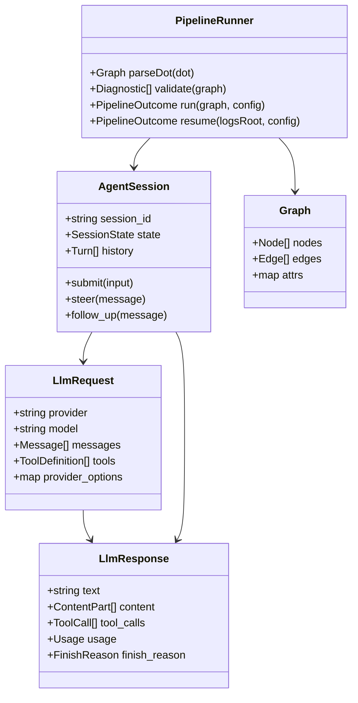
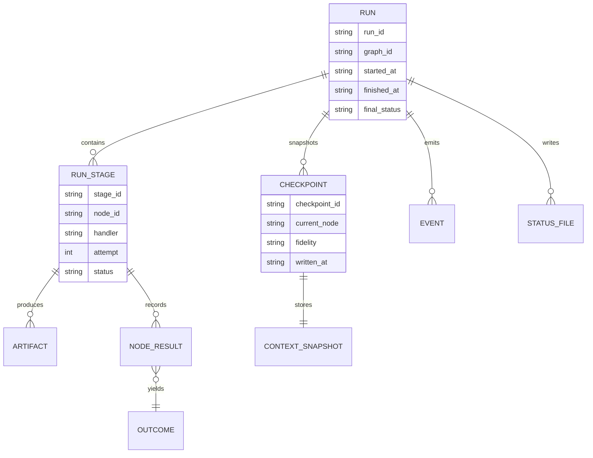
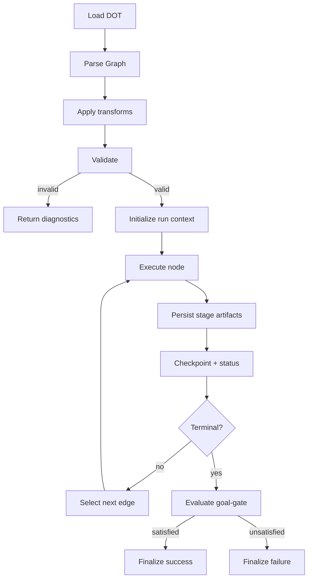
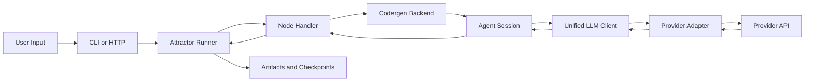
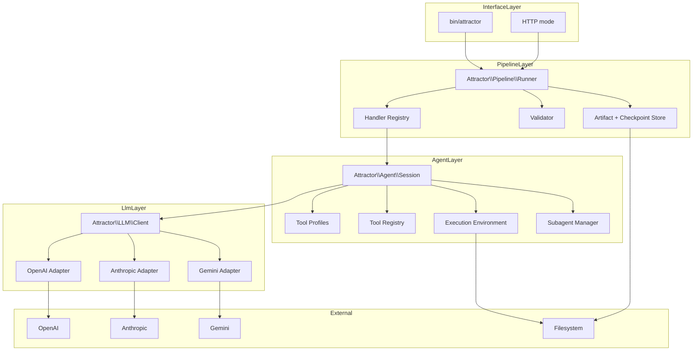

Legend: [ ] Incomplete, [X] Complete

# SPRINT-001 Comprehensive Implementation Plan

## Executive Summary
This plan is the implementation program for `docs/sprints/SPRINT-001-attractor-php-nlspec-parity.md`.
It is organized as phase-gated checklists with explicit verification placeholders, acceptance criteria, and detailed positive/negative tests.

## Review Findings From Source Sprint Document
- The source sprint document defines the correct product objective and architecture boundaries across Unified LLM, Coding Agent Loop, and Attractor Runner.
- The source sprint document is broad enough to execute, but implementation ownership is spread across multiple long sections and is hard to run as a day-to-day checklist.
- Existing planning artifacts include many pre-marked complete items; this comprehensive plan resets implementation tasks to `[ ]` so status can be kept in sync with verifiable evidence.

## Scope
Implement full NLSpec parity for:
- `unified-llm-spec.md`
- `coding-agent-loop-spec.md`
- `attractor-spec.md`

## Planning Status Snapshot
- Planning baseline established on 2026-02-25.
- All implementation checklist items in this plan start as `[ ]` and are promoted to `[X]` only after evidence is attached.

## Evidence Contract
- Evidence root: `.scratch/verification/SPRINT-001/`
- Each checklist item must be followed by a verification block and kept current.
- Acceptable evidence includes: executed command list, exit codes, artifact paths, and concise reasoning.

Standard verification placeholder format (required under every checklist item):
```text
{verification: pending; commands: ; exit_codes: ; artifacts: ; notes: }
```

## Execution Order
1. Phase 0: Foundations and verification harness
2. Phase 1: Unified LLM parity implementation
3. Phase 2: Coding Agent Loop parity implementation
4. Phase 3: Attractor Runner parity implementation
5. Phase 4: Cross-layer integration, closure, and release readiness

## Phase 0 - Foundations and Verification Harness
### Deliverables
- [ ] P0-1 Build a requirement inventory that maps every NLSpec section and DoD item to planned implementation files and tests.
```text
{verification: pending; commands: ; exit_codes: ; artifacts: ; notes: }
```
- [ ] P0-2 Normalize developer commands (`build`, `lint`, `test`, `test:unit`, `test:integration`, `test:e2e`, provider smoke) so execution is deterministic in local mode.
```text
{verification: pending; commands: ; exit_codes: ; artifacts: ; notes: }
```
- [ ] P0-3 Standardize `.scratch/verification/SPRINT-001/` directory layout by phase and subsystem.
```text
{verification: pending; commands: ; exit_codes: ; artifacts: ; notes: }
```
- [ ] P0-4 Add reusable `.scratch` probes for parser behavior, stream normalization, checkpoint serialization, and tool execution edge cases.
```text
{verification: pending; commands: ; exit_codes: ; artifacts: ; notes: }
```
- [ ] P0-5 Define fixture conventions for deterministic provider adapter tests (request, response, and streaming chunks).
```text
{verification: pending; commands: ; exit_codes: ; artifacts: ; notes: }
```
- [ ] P0-6 Ensure `docs/ADR.md` records architecture-impacting sequencing decisions before implementation begins.
```text
{verification: pending; commands: ; exit_codes: ; artifacts: ; notes: }
```
- [ ] P0-7 Verify appendix mermaid diagrams render with `mmdc` and archive outputs under `.scratch/verification/SPRINT-001/planning/mermaid/`.
```text
{verification: pending; commands: ; exit_codes: ; artifacts: ; notes: }
```

### Acceptance Criteria
- [ ] AC0-1 Every spec requirement has at least one linked implementation task and one linked verification path.
```text
{verification: pending; commands: ; exit_codes: ; artifacts: ; notes: }
```
- [ ] AC0-2 Deterministic local build, lint, and test commands execute without provider credentials.
```text
{verification: pending; commands: ; exit_codes: ; artifacts: ; notes: }
```
- [ ] AC0-3 Evidence artifacts are reproducible and discoverable by phase and subsystem.
```text
{verification: pending; commands: ; exit_codes: ; artifacts: ; notes: }
```

### Positive Test Cases
- [ ] P0-T1 Validate requirement inventory completeness by checking each DoD section resolves to at least one test file path.
```text
{verification: pending; commands: ; exit_codes: ; artifacts: ; notes: }
```
- [ ] P0-T2 Run deterministic suite and confirm unit/integration/e2e deterministic groups execute in expected order.
```text
{verification: pending; commands: ; exit_codes: ; artifacts: ; notes: }
```
- [ ] P0-T3 Confirm mermaid appendix renders produce non-empty SVG outputs for all five diagrams.
```text
{verification: pending; commands: ; exit_codes: ; artifacts: ; notes: }
```

### Negative Test Cases
- [ ] P0-N1 Remove one evidence artifact path from a completion log and confirm the verification audit fails.
```text
{verification: pending; commands: ; exit_codes: ; artifacts: ; notes: }
```
- [ ] P0-N2 Introduce an unmapped requirement in the inventory and confirm traceability checks report a gap.
```text
{verification: pending; commands: ; exit_codes: ; artifacts: ; notes: }
```
- [ ] P0-N3 Introduce a malformed mermaid snippet and confirm render verification catches the failure.
```text
{verification: pending; commands: ; exit_codes: ; artifacts: ; notes: }
```

## Phase 1 - Unified LLM Client Parity
### Deliverables
- [ ] P1-1 Finalize unified core data model (`Message`, `ContentPart`, `Request`, `Response`, `Usage`, `StreamEvent`, `ToolCall`, `ToolResult`, error types).
```text
{verification: pending; commands: ; exit_codes: ; artifacts: ; notes: }
```
- [ ] P1-2 Implement provider routing and default provider behavior in `Client`, including middleware ordering guarantees.
```text
{verification: pending; commands: ; exit_codes: ; artifacts: ; notes: }
```
- [ ] P1-3 Complete OpenAI native adapter request/response translation and streaming normalization.
```text
{verification: pending; commands: ; exit_codes: ; artifacts: ; notes: }
```
- [ ] P1-4 Complete Anthropic native adapter translation, thinking-content preservation, and streaming normalization.
```text
{verification: pending; commands: ; exit_codes: ; artifacts: ; notes: }
```
- [ ] P1-5 Complete Gemini native adapter translation, synthetic tool-call ID handling, and streaming normalization.
```text
{verification: pending; commands: ; exit_codes: ; artifacts: ; notes: }
```
- [ ] P1-6 Implement high-level APIs (`generate`, `stream`, `generate_object`, `stream_object`) with strict input validation.
```text
{verification: pending; commands: ; exit_codes: ; artifacts: ; notes: }
```
- [ ] P1-7 Implement active/passive tool workflows, multi-call batching, and continuation behavior across providers.
```text
{verification: pending; commands: ; exit_codes: ; artifacts: ; notes: }
```
- [ ] P1-8 Implement structured output validation paths and deterministic error mapping for invalid generated objects.
```text
{verification: pending; commands: ; exit_codes: ; artifacts: ; notes: }
```
- [ ] P1-9 Implement multimodal translation coverage for text + image URL + base64 + local file path inputs.
```text
{verification: pending; commands: ; exit_codes: ; artifacts: ; notes: }
```
- [ ] P1-10 Implement usage metadata mapping parity, including provider reasoning/thinking token fields.
```text
{verification: pending; commands: ; exit_codes: ; artifacts: ; notes: }
```
- [ ] P1-11 Implement deterministic cross-provider parity matrix tests using fixture-backed transports.
```text
{verification: pending; commands: ; exit_codes: ; artifacts: ; notes: }
```
- [ ] P1-12 Implement provider smoke tests that execute only when provider credentials are present.
```text
{verification: pending; commands: ; exit_codes: ; artifacts: ; notes: }
```

### Acceptance Criteria
- [ ] AC1-1 Adapter translation tests pass for OpenAI, Anthropic, and Gemini in deterministic mode.
```text
{verification: pending; commands: ; exit_codes: ; artifacts: ; notes: }
```
- [ ] AC1-2 Streaming event sequences are normalized and validated for start, delta, and finish transitions.
```text
{verification: pending; commands: ; exit_codes: ; artifacts: ; notes: }
```
- [ ] AC1-3 Tool-calling loops work for single-call and parallel-call responses with consistent continuation behavior.
```text
{verification: pending; commands: ; exit_codes: ; artifacts: ; notes: }
```
- [ ] AC1-4 Structured output paths fail safely with explicit typed errors for parse/schema violations.
```text
{verification: pending; commands: ; exit_codes: ; artifacts: ; notes: }
```
- [ ] AC1-5 Provider smoke tests succeed in environments where credentials are available.
```text
{verification: pending; commands: ; exit_codes: ; artifacts: ; notes: }
```

### Positive Test Cases
- [ ] P1-T1 Simple prompt generation produces non-empty output and usage metadata for each provider adapter (fixture-backed).
```text
{verification: pending; commands: ; exit_codes: ; artifacts: ; notes: }
```
- [ ] P1-T2 Streaming text deltas concatenate to final response text and retain finish metadata.
```text
{verification: pending; commands: ; exit_codes: ; artifacts: ; notes: }
```
- [ ] P1-T3 Two-tool parallel call response executes both tool handlers and submits consolidated tool results in one continuation step.
```text
{verification: pending; commands: ; exit_codes: ; artifacts: ; notes: }
```
- [ ] P1-T4 `generate_object` returns schema-valid object for a constrained extraction prompt.
```text
{verification: pending; commands: ; exit_codes: ; artifacts: ; notes: }
```
- [ ] P1-T5 Multimodal message with text + image path translates correctly per provider contract.
```text
{verification: pending; commands: ; exit_codes: ; artifacts: ; notes: }
```

### Negative Test Cases
- [ ] P1-N1 Missing provider configuration returns a deterministic configuration error.
```text
{verification: pending; commands: ; exit_codes: ; artifacts: ; notes: }
```
- [ ] P1-N2 Unknown tool requested by model yields tool-error result instead of crashing generation.
```text
{verification: pending; commands: ; exit_codes: ; artifacts: ; notes: }
```
- [ ] P1-N3 Invalid generated JSON for `generate_object` produces parse/validation error with captured raw payload context.
```text
{verification: pending; commands: ; exit_codes: ; artifacts: ; notes: }
```
- [ ] P1-N4 Malformed stream chunk is surfaced through provider passthrough handling while preserving stream integrity.
```text
{verification: pending; commands: ; exit_codes: ; artifacts: ; notes: }
```
- [ ] P1-N5 Unsupported multimodal part for a provider is rejected gracefully with explicit error type.
```text
{verification: pending; commands: ; exit_codes: ; artifacts: ; notes: }
```

## Phase 2 - Coding Agent Loop Parity
### Deliverables
- [ ] P2-1 Finalize `Session` lifecycle state machine and history turn model.
```text
{verification: pending; commands: ; exit_codes: ; artifacts: ; notes: }
```
- [ ] P2-2 Finalize orchestration loop (`LLM call -> tool dispatch -> continuation -> natural completion`) with bounded rounds.
```text
{verification: pending; commands: ; exit_codes: ; artifacts: ; notes: }
```
- [ ] P2-3 Finalize provider profiles (OpenAI, Anthropic, Gemini) with provider-specific prompt layering and tool definitions.
```text
{verification: pending; commands: ; exit_codes: ; artifacts: ; notes: }
```
- [ ] P2-4 Finalize `ExecutionEnvironment` contract and `LocalExecutionEnvironment` filesystem/process behaviors.
```text
{verification: pending; commands: ; exit_codes: ; artifacts: ; notes: }
```
- [ ] P2-5 Finalize core tools (`read_file`, `write_file`, `edit_file`, `shell`, `grep`, `glob`) with schema-validated arguments.
```text
{verification: pending; commands: ; exit_codes: ; artifacts: ; notes: }
```
- [ ] P2-6 Finalize OpenAI-style `apply_patch` workflow and conflict/error reporting semantics.
```text
{verification: pending; commands: ; exit_codes: ; artifacts: ; notes: }
```
- [ ] P2-7 Finalize output truncation behavior with explicit marker insertion and full-output retention in tool-end events.
```text
{verification: pending; commands: ; exit_codes: ; artifacts: ; notes: }
```
- [ ] P2-8 Finalize steering and follow-up queues and their injection points in the execution loop.
```text
{verification: pending; commands: ; exit_codes: ; artifacts: ; notes: }
```
- [ ] P2-9 Finalize repeated-call loop detection heuristics and warning-turn behavior.
```text
{verification: pending; commands: ; exit_codes: ; artifacts: ; notes: }
```
- [ ] P2-10 Finalize subagent lifecycle (`spawn`, `send_input`, `wait`, `close`) with recursion depth constraints.
```text
{verification: pending; commands: ; exit_codes: ; artifacts: ; notes: }
```
- [ ] P2-11 Finalize event bus surface and deterministic event ordering assertions.
```text
{verification: pending; commands: ; exit_codes: ; artifacts: ; notes: }
```
- [ ] P2-12 Finalize deterministic cross-provider parity tests for the agent loop using fake adapters and fake execution environments.
```text
{verification: pending; commands: ; exit_codes: ; artifacts: ; notes: }
```

### Acceptance Criteria
- [ ] AC2-1 Sessions complete naturally on assistant text and stop safely at configured boundaries.
```text
{verification: pending; commands: ; exit_codes: ; artifacts: ; notes: }
```
- [ ] AC2-2 Tool failures are represented as tool-error results and session state remains consistent.
```text
{verification: pending; commands: ; exit_codes: ; artifacts: ; notes: }
```
- [ ] AC2-3 Event ordering is deterministic across equivalent deterministic inputs.
```text
{verification: pending; commands: ; exit_codes: ; artifacts: ; notes: }
```
- [ ] AC2-4 Steering and follow-up commands alter subsequent behavior at the documented injection points.
```text
{verification: pending; commands: ; exit_codes: ; artifacts: ; notes: }
```
- [ ] AC2-5 Subagents are isolated by history while sharing environment access as defined by profile/tool policy.
```text
{verification: pending; commands: ; exit_codes: ; artifacts: ; notes: }
```

### Positive Test Cases
- [ ] P2-T1 Multi-turn coding session performs file read, patch, shell verification, and assistant completion with correct turn history.
```text
{verification: pending; commands: ; exit_codes: ; artifacts: ; notes: }
```
- [ ] P2-T2 Two parallel tool calls complete and merge into one continuation with deterministic result ordering.
```text
{verification: pending; commands: ; exit_codes: ; artifacts: ; notes: }
```
- [ ] P2-T3 Steering message inserted mid-loop changes next tool selection behavior.
```text
{verification: pending; commands: ; exit_codes: ; artifacts: ; notes: }
```
- [ ] P2-T4 Subagent completes delegated task and returns output to parent session for final response.
```text
{verification: pending; commands: ; exit_codes: ; artifacts: ; notes: }
```
- [ ] P2-T5 Tool-end event contains full output while model-facing content reflects truncation policy.
```text
{verification: pending; commands: ; exit_codes: ; artifacts: ; notes: }
```

### Negative Test Cases
- [ ] P2-N1 Unknown tool call from model returns deterministic error tool result and loop continues.
```text
{verification: pending; commands: ; exit_codes: ; artifacts: ; notes: }
```
- [ ] P2-N2 `edit_file` ambiguity results in clear conflict error with no file mutation.
```text
{verification: pending; commands: ; exit_codes: ; artifacts: ; notes: }
```
- [ ] P2-N3 Process execution failure returns typed tool error and emits complete event telemetry.
```text
{verification: pending; commands: ; exit_codes: ; artifacts: ; notes: }
```
- [ ] P2-N4 Recursive subagent depth overflow is rejected and recorded as safe tool error.
```text
{verification: pending; commands: ; exit_codes: ; artifacts: ; notes: }
```
- [ ] P2-N5 Repeated call-pattern loop triggers warning turn and preserves session operability.
```text
{verification: pending; commands: ; exit_codes: ; artifacts: ; notes: }
```

## Phase 3 - Attractor Runner Parity
### Deliverables
- [ ] P3-1 Finalize DOT subset parser coverage for graph/node/edge declarations, defaults, chained edges, and subgraph flattening.
```text
{verification: pending; commands: ; exit_codes: ; artifacts: ; notes: }
```
- [ ] P3-2 Finalize graph model default propagation and class inheritance behavior from subgraphs and labels.
```text
{verification: pending; commands: ; exit_codes: ; artifacts: ; notes: }
```
- [ ] P3-3 Finalize model stylesheet parsing, selector specificity, and deterministic attribute application order.
```text
{verification: pending; commands: ; exit_codes: ; artifacts: ; notes: }
```
- [ ] P3-4 Finalize lint diagnostics and strict validation gates with severity-aware reporting.
```text
{verification: pending; commands: ; exit_codes: ; artifacts: ; notes: }
```
- [ ] P3-5 Finalize condition expression parsing/evaluation for outcome labels and context variables.
```text
{verification: pending; commands: ; exit_codes: ; artifacts: ; notes: }
```
- [ ] P3-6 Finalize runtime state model (`Context`, `Outcome`, checkpoint model, artifact persistence).
```text
{verification: pending; commands: ; exit_codes: ; artifacts: ; notes: }
```
- [ ] P3-7 Finalize engine traversal ordering, retry routing, goal-gate handling, and node transition determinism.
```text
{verification: pending; commands: ; exit_codes: ; artifacts: ; notes: }
```
- [ ] P3-8 Finalize checkpoint resume semantics, including fidelity transitions and status reconstruction.
```text
{verification: pending; commands: ; exit_codes: ; artifacts: ; notes: }
```
- [ ] P3-9 Finalize built-in handler set (`start`, `exit`, `codergen`, `wait.human`, `conditional`, `parallel`, `fan.in`, `tool`, `manager.loop`).
```text
{verification: pending; commands: ; exit_codes: ; artifacts: ; notes: }
```
- [ ] P3-10 Finalize interviewer implementations (`AutoApprove`, `Console`, `Callback`, `Queue`) and answer routing.
```text
{verification: pending; commands: ; exit_codes: ; artifacts: ; notes: }
```
- [ ] P3-11 Finalize transform pipeline ordering and extension hooks for custom transforms and lint rules.
```text
{verification: pending; commands: ; exit_codes: ; artifacts: ; notes: }
```
- [ ] P3-12 Finalize observability/event emission for pipeline lifecycle, node execution, and outcome transitions.
```text
{verification: pending; commands: ; exit_codes: ; artifacts: ; notes: }
```
- [ ] P3-13 Finalize optional HTTP mode endpoints (`run`, `status`, `answer`) and event stream behavior if included in sprint closure.
```text
{verification: pending; commands: ; exit_codes: ; artifacts: ; notes: }
```

### Acceptance Criteria
- [ ] AC3-1 DOT parsing and validation reject malformed graphs and accept compliant graphs deterministically.
```text
{verification: pending; commands: ; exit_codes: ; artifacts: ; notes: }
```
- [ ] AC3-2 Execution engine follows deterministic edge and handler selection rules for identical inputs.
```text
{verification: pending; commands: ; exit_codes: ; artifacts: ; notes: }
```
- [ ] AC3-3 Goal gates and retry/fallback paths route execution as documented by graph metadata.
```text
{verification: pending; commands: ; exit_codes: ; artifacts: ; notes: }
```
- [ ] AC3-4 Resume from checkpoint reproduces expected state and continues to valid completion.
```text
{verification: pending; commands: ; exit_codes: ; artifacts: ; notes: }
```
- [ ] AC3-5 Human-gate flows support pause/resume semantics via interviewer interfaces (and HTTP mode if in scope).
```text
{verification: pending; commands: ; exit_codes: ; artifacts: ; notes: }
```

### Positive Test Cases
- [ ] P3-T1 Parse and run linear pipeline with start -> codergen -> exit, producing expected status artifacts.
```text
{verification: pending; commands: ; exit_codes: ; artifacts: ; notes: }
```
- [ ] P3-T2 Conditional branching selects correct edge based on outcome labels and context variables.
```text
{verification: pending; commands: ; exit_codes: ; artifacts: ; notes: }
```
- [ ] P3-T3 Parallel branch execution with fan-in merge meets defined join policy and artifact ordering.
```text
{verification: pending; commands: ; exit_codes: ; artifacts: ; notes: }
```
- [ ] P3-T4 Human gate pauses run, accepts answer, and resumes to completion with preserved context.
```text
{verification: pending; commands: ; exit_codes: ; artifacts: ; notes: }
```
- [ ] P3-T5 Resume from checkpoint after interruption finishes with correct final outcome and stage audit trail.
```text
{verification: pending; commands: ; exit_codes: ; artifacts: ; notes: }
```

### Negative Test Cases
- [ ] P3-N1 Invalid DOT syntax produces deterministic parser diagnostics and no partial execution.
```text
{verification: pending; commands: ; exit_codes: ; artifacts: ; notes: }
```
- [ ] P3-N2 Unknown handler type produces validation failure with explicit node reference.
```text
{verification: pending; commands: ; exit_codes: ; artifacts: ; notes: }
```
- [ ] P3-N3 Condition expression referencing missing context path fails safely with explanatory diagnostics.
```text
{verification: pending; commands: ; exit_codes: ; artifacts: ; notes: }
```
- [ ] P3-N4 Goal gate unsatisfied with no retry target exits with failure outcome and complete status evidence.
```text
{verification: pending; commands: ; exit_codes: ; artifacts: ; notes: }
```
- [ ] P3-N5 Corrupted checkpoint payload fails resume with clear, typed error and no silent state corruption.
```text
{verification: pending; commands: ; exit_codes: ; artifacts: ; notes: }
```

## Phase 4 - Cross-Layer Integration and Closure
### Deliverables
- [ ] P4-1 Finalize codergen backend wiring for direct Unified LLM mode and Agent Loop mode.
```text
{verification: pending; commands: ; exit_codes: ; artifacts: ; notes: }
```
- [ ] P4-2 Finalize thread and fidelity behavior across multi-node runs and resume boundaries.
```text
{verification: pending; commands: ; exit_codes: ; artifacts: ; notes: }
```
- [ ] P4-3 Finalize example pipelines for linear, branching, retries, human-gate, parallel, and manager-loop scenarios.
```text
{verification: pending; commands: ; exit_codes: ; artifacts: ; notes: }
```
- [ ] P4-4 Finalize end-to-end deterministic integration suite spanning LLM -> Agent -> Pipeline boundaries.
```text
{verification: pending; commands: ; exit_codes: ; artifacts: ; notes: }
```
- [ ] P4-5 Finalize provider smoke coverage path for environments with credentials and confirm environment-gated behavior when absent.
```text
{verification: pending; commands: ; exit_codes: ; artifacts: ; notes: }
```
- [ ] P4-6 Reconcile sprint docs, runbook, and traceability matrix to remove status drift and unresolved placeholders.
```text
{verification: pending; commands: ; exit_codes: ; artifacts: ; notes: }
```
- [ ] P4-7 Record final architecture decisions and exceptions in `docs/ADR.md`.
```text
{verification: pending; commands: ; exit_codes: ; artifacts: ; notes: }
```
- [ ] P4-8 Execute closure audit proving all DoD checklists are implemented and cross-referenced to tests.
```text
{verification: pending; commands: ; exit_codes: ; artifacts: ; notes: }
```
- [ ] P4-9 Execute release-candidate full verification sequence and archive logs in `.scratch/verification/SPRINT-001/final/`.
```text
{verification: pending; commands: ; exit_codes: ; artifacts: ; notes: }
```
- [ ] P4-10 Publish final sprint closure summary with command transcripts, exit codes, and artifact links.
```text
{verification: pending; commands: ; exit_codes: ; artifacts: ; notes: }
```

### Acceptance Criteria
- [ ] AC4-1 Deterministic CI-equivalent command set passes end-to-end.
```text
{verification: pending; commands: ; exit_codes: ; artifacts: ; notes: }
```
- [ ] AC4-2 Provider smoke tests succeed when credentials are configured and skip cleanly when not configured.
```text
{verification: pending; commands: ; exit_codes: ; artifacts: ; notes: }
```
- [ ] AC4-3 Traceability matrix maps every DoD requirement to concrete tests and evidence artifacts.
```text
{verification: pending; commands: ; exit_codes: ; artifacts: ; notes: }
```
- [ ] AC4-4 Sprint plan, runbook, and ADR entries are internally consistent and audit-ready.
```text
{verification: pending; commands: ; exit_codes: ; artifacts: ; notes: }
```
- [ ] AC4-5 No unresolved placeholder markers remain in release-ready sprint documentation.
```text
{verification: pending; commands: ; exit_codes: ; artifacts: ; notes: }
```

### Positive Test Cases
- [ ] P4-T1 Run full deterministic suite and verify passing results across unit, integration, and deterministic e2e tests.
```text
{verification: pending; commands: ; exit_codes: ; artifacts: ; notes: }
```
- [ ] P4-T2 Execute complete provider smoke path in credentialed environment and verify provider-by-provider pass results.
```text
{verification: pending; commands: ; exit_codes: ; artifacts: ; notes: }
```
- [ ] P4-T3 Run sample pipeline pack and verify status manifests, checkpoints, and outputs are written for each example.
```text
{verification: pending; commands: ; exit_codes: ; artifacts: ; notes: }
```
- [ ] P4-T4 Validate doc closure audit confirms no unmapped DoD requirements remain.
```text
{verification: pending; commands: ; exit_codes: ; artifacts: ; notes: }
```
- [ ] P4-T5 Validate release summary references reproducible command transcripts and artifacts only.
```text
{verification: pending; commands: ; exit_codes: ; artifacts: ; notes: }
```

### Negative Test Cases
- [ ] P4-N1 Disable one critical test target and confirm closure audit blocks sprint completion.
```text
{verification: pending; commands: ; exit_codes: ; artifacts: ; notes: }
```
- [ ] P4-N2 Inject unresolved placeholder token into sprint docs and confirm closure checks fail.
```text
{verification: pending; commands: ; exit_codes: ; artifacts: ; notes: }
```
- [ ] P4-N3 Break one traceability row and confirm matrix verification detects the missing coverage link.
```text
{verification: pending; commands: ; exit_codes: ; artifacts: ; notes: }
```
- [ ] P4-N4 Corrupt one archived evidence log path and confirm release audit flags non-resolvable evidence.
```text
{verification: pending; commands: ; exit_codes: ; artifacts: ; notes: }
```
- [ ] P4-N5 Force one provider smoke failure and confirm summary captures provider-specific failure context and remediation path.
```text
{verification: pending; commands: ; exit_codes: ; artifacts: ; notes: }
```

## Appendix A - Core Domain Models


## Appendix B - E-R Diagram


## Appendix C - Workflow Diagram


## Appendix D - Data-Flow Diagram


## Appendix E - Architecture Diagram

