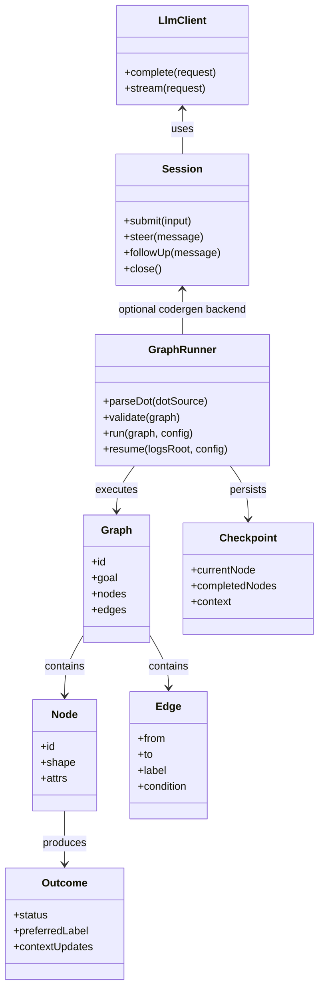
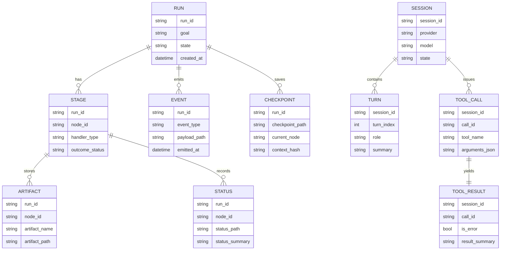
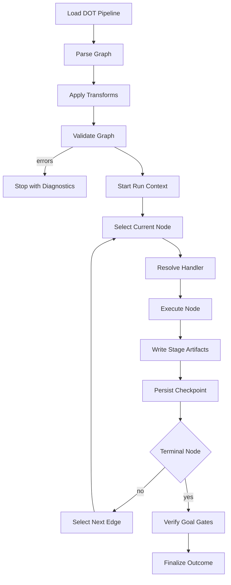
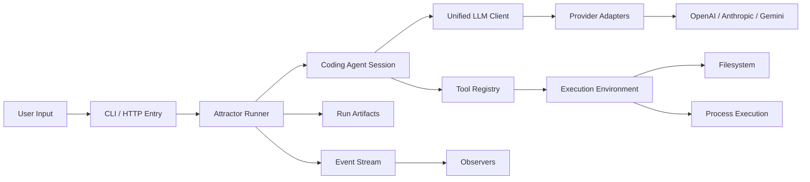
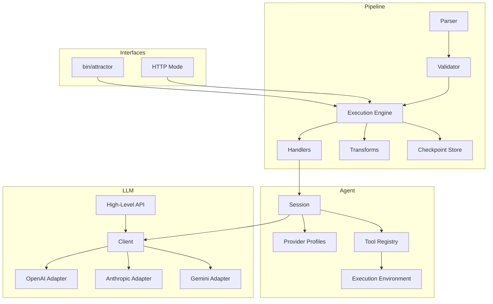

Legend: [ ] Incomplete, [X] Complete

# Sprint 001 Comprehensive Implementation Plan - Attractor PHP NLSpec Parity

## Objective
Implement and verify full parity with:
- `attractor-spec.md`
- `coding-agent-loop-spec.md`
- `unified-llm-spec.md`

## Authoritative Inputs
- [ ] Confirm `attractor-spec.md` requirements are fully enumerated in the traceability matrix.
```text
{placeholder for verification justification/reasoning and evidence log}
```
- [ ] Confirm `coding-agent-loop-spec.md` requirements are fully enumerated in the traceability matrix.
```text
{placeholder for verification justification/reasoning and evidence log}
```
- [ ] Confirm `unified-llm-spec.md` requirements are fully enumerated in the traceability matrix.
```text
{placeholder for verification justification/reasoning and evidence log}
```

## Execution Principles
- [ ] Keep all implementation checklist items as `[ ]` until evidence is attached under `.scratch/verification/SPRINT-001/`.
```text
{placeholder for verification justification/reasoning and evidence log}
```
- [ ] Record architecture decisions in `docs/ADR.md` with context, decision, and consequences.
```text
{placeholder for verification justification/reasoning and evidence log}
```
- [ ] Keep sprint completion state synchronized between this plan, runbook, and traceability matrix.
```text
{placeholder for verification justification/reasoning and evidence log}
```
- [ ] Implement directly to current NLSpec contracts with no legacy compatibility track.
```text
{placeholder for verification justification/reasoning and evidence log}
```

## Sprint Status Baseline (2026-02-25)
- [ ] Track A Foundations: 0/7 complete.
```text
{placeholder for verification justification/reasoning and evidence log}
```
- [ ] Track B Unified LLM: 0/11 complete.
```text
{placeholder for verification justification/reasoning and evidence log}
```
- [ ] Track C Coding Agent Loop: 0/10 complete.
```text
{placeholder for verification justification/reasoning and evidence log}
```
- [ ] Track D Attractor Runner: 0/13 complete.
```text
{placeholder for verification justification/reasoning and evidence log}
```
- [ ] Track E Integration and Closure: 0/8 complete.
```text
{placeholder for verification justification/reasoning and evidence log}
```

## Phase Order
1. Phase 0 - Foundations and verification harness (Track A)
2. Phase 1 - Unified LLM parity closure (Track B)
3. Phase 2 - Coding Agent Loop parity closure (Track C)
4. Phase 3 - Attractor Runner parity closure (Track D)
5. Phase 4 - Cross-layer integration, examples, and documentation closure (Track E)

## Phase 0 - Foundations and Verification Harness (Track A)
### Deliverables
- [ ] A0.1 Finalize development toolchain checks and local reproducibility commands.
```text
{placeholder for verification justification/reasoning and evidence log}
```
- [ ] A0.2 Finalize evidence directory convention and index at `.scratch/verification/SPRINT-001/README.md`.
```text
{placeholder for verification justification/reasoning and evidence log}
```
- [ ] A0.3 Finalize test command grouping for unit, integration, and end-to-end suites.
```text
{placeholder for verification justification/reasoning and evidence log}
```
- [ ] A0.4 Finalize fixture strategy for deterministic provider translation tests.
```text
{placeholder for verification justification/reasoning and evidence log}
```
- [ ] A0.5 Finalize developer documentation for setup and verification workflow.
```text
{placeholder for verification justification/reasoning and evidence log}
```
- [ ] A0.6 Add ADR entries for foundational choices used by all tracks.
```text
{placeholder for verification justification/reasoning and evidence log}
```
- [ ] A0.7 Validate mermaid appendix sources and render outputs under `.scratch/verification/SPRINT-001/planning/mermaid/`.
```text
{placeholder for verification justification/reasoning and evidence log}
```

### Positive Test Cases
- [ ] P0-T1 Toolchain check command reports all required tools available.
```text
{placeholder for verification justification/reasoning and evidence log}
```
- [ ] P0-T2 Unit test suite runs with deterministic pass results.
```text
{placeholder for verification justification/reasoning and evidence log}
```
- [ ] P0-T3 Integration suite executes using local fixtures without network calls.
```text
{placeholder for verification justification/reasoning and evidence log}
```

### Negative Test Cases
- [ ] P0-N1 Missing required tool is reported with actionable diagnostic text.
```text
{placeholder for verification justification/reasoning and evidence log}
```
- [ ] P0-N2 Evidence artifact path mismatch is detected by verification index checks.
```text
{placeholder for verification justification/reasoning and evidence log}
```

### Acceptance Criteria
- [ ] Foundation commands are reproducible and documented.
```text
{placeholder for verification justification/reasoning and evidence log}
```
- [ ] Evidence logging structure exists and is usable by all later phases.
```text
{placeholder for verification justification/reasoning and evidence log}
```
- [ ] Baseline tests run clean before feature-phase work starts.
```text
{placeholder for verification justification/reasoning and evidence log}
```

## Phase 1 - Unified LLM Parity Closure (Track B)
### Deliverables
- [ ] B1.1 Finalize unified request/response/content model types and invariants.
```text
{placeholder for verification justification/reasoning and evidence log}
```
- [ ] B1.2 Finalize provider routing, default-client behavior, and middleware execution order.
```text
{placeholder for verification justification/reasoning and evidence log}
```
- [ ] B1.3 Finalize OpenAI adapter request/response and stream event normalization.
```text
{placeholder for verification justification/reasoning and evidence log}
```
- [ ] B1.4 Finalize Anthropic adapter message translation, thinking block handling, and stream normalization.
```text
{placeholder for verification justification/reasoning and evidence log}
```
- [ ] B1.5 Finalize Gemini adapter translation, synthetic tool-call id mapping, and stream normalization.
```text
{placeholder for verification justification/reasoning and evidence log}
```
- [ ] B1.6 Finalize tool loop semantics for active vs passive tools with deterministic step results.
```text
{placeholder for verification justification/reasoning and evidence log}
```
- [ ] B1.7 Finalize structured-output generation and schema validation behavior.
```text
{placeholder for verification justification/reasoning and evidence log}
```
- [ ] B1.8 Finalize provider error mapping into unified error hierarchy.
```text
{placeholder for verification justification/reasoning and evidence log}
```
- [ ] B1.9 Finalize usage accounting fields across providers, including reasoning-related fields.
```text
{placeholder for verification justification/reasoning and evidence log}
```
- [ ] B1.10 Finalize cross-provider parity matrix tests for all required scenarios.
```text
{placeholder for verification justification/reasoning and evidence log}
```
- [ ] B1.11 Run provider-backed end-to-end verification across OpenAI, Anthropic, and Gemini.
```text
{placeholder for verification justification/reasoning and evidence log}
```

### Positive Test Cases
- [ ] P1-T1 Simple text generation returns non-empty text and usage metadata for each provider.
```text
{placeholder for verification justification/reasoning and evidence log}
```
- [ ] P1-T2 Streaming emits start, delta, and finish events in correct sequence.
```text
{placeholder for verification justification/reasoning and evidence log}
```
- [ ] P1-T3 Structured output returns schema-valid typed object.
```text
{placeholder for verification justification/reasoning and evidence log}
```
- [ ] P1-T4 Single and multi-tool execution paths return deterministic continuation behavior.
```text
{placeholder for verification justification/reasoning and evidence log}
```
- [ ] P1-T5 Multimodal message translation works for text plus image input forms.
```text
{placeholder for verification justification/reasoning and evidence log}
```

### Negative Test Cases
- [ ] P1-N1 Missing provider credentials returns configuration/authentication error path.
```text
{placeholder for verification justification/reasoning and evidence log}
```
- [ ] P1-N2 Unsupported content-part combination returns deterministic validation failure.
```text
{placeholder for verification justification/reasoning and evidence log}
```
- [ ] P1-N3 Unknown tool call returns tool-result error payload rather than uncaught exception.
```text
{placeholder for verification justification/reasoning and evidence log}
```
- [ ] P1-N4 Invalid structured-output payload returns object-generation failure.
```text
{placeholder for verification justification/reasoning and evidence log}
```
- [ ] P1-N5 Provider HTTP failure status maps to correct unified error type.
```text
{placeholder for verification justification/reasoning and evidence log}
```

### Acceptance Criteria
- [ ] Unified LLM deterministic suites pass for all three adapters.
```text
{placeholder for verification justification/reasoning and evidence log}
```
- [ ] Cross-provider parity matrix is green with evidence artifacts.
```text
{placeholder for verification justification/reasoning and evidence log}
```
- [ ] Provider-backed verification confirms behavior on live endpoints.
```text
{placeholder for verification justification/reasoning and evidence log}
```

## Phase 2 - Coding Agent Loop Parity Closure (Track C)
### Deliverables
- [ ] C2.1 Finalize session lifecycle states, turn history model, and lifecycle events.
```text
{placeholder for verification justification/reasoning and evidence log}
```
- [ ] C2.2 Finalize orchestration loop behavior from model call through tool execution to completion.
```text
{placeholder for verification justification/reasoning and evidence log}
```
- [ ] C2.3 Finalize `ExecutionEnvironment` and `LocalExecutionEnvironment` behavior for file, process, grep, and glob operations.
```text
{placeholder for verification justification/reasoning and evidence log}
```
- [ ] C2.4 Finalize provider profiles for OpenAI, Anthropic, and Gemini with provider-aligned prompts and tool bundles.
```text
{placeholder for verification justification/reasoning and evidence log}
```
- [ ] C2.5 Finalize core tools (`read_file`, `write_file`, `edit_file`, `shell`, `grep`, `glob`, provider-specific edit/patch behavior).
```text
{placeholder for verification justification/reasoning and evidence log}
```
- [ ] C2.6 Finalize truncation pipeline and full-output event payload behavior.
```text
{placeholder for verification justification/reasoning and evidence log}
```
- [ ] C2.7 Finalize steering and follow-up queues plus loop-pattern warning behavior.
```text
{placeholder for verification justification/reasoning and evidence log}
```
- [ ] C2.8 Finalize subagent lifecycle and parent-child result handoff semantics.
```text
{placeholder for verification justification/reasoning and evidence log}
```
- [ ] C2.9 Finalize deterministic parity matrix tests for provider profile behavior.
```text
{placeholder for verification justification/reasoning and evidence log}
```
- [ ] C2.10 Run provider-backed agent loop verification suites.
```text
{placeholder for verification justification/reasoning and evidence log}
```

### Positive Test Cases
- [ ] P2-T1 Session reaches natural completion with assistant output and no tool calls.
```text
{placeholder for verification justification/reasoning and evidence log}
```
- [ ] P2-T2 Session executes tool calls and completes with coherent continuation output.
```text
{placeholder for verification justification/reasoning and evidence log}
```
- [ ] P2-T3 Sequential inputs in same session preserve history and yield deterministic behavior.
```text
{placeholder for verification justification/reasoning and evidence log}
```
- [ ] P2-T4 Steering and follow-up messages are injected at the correct lifecycle points.
```text
{placeholder for verification justification/reasoning and evidence log}
```
- [ ] P2-T5 Subagent commands (`spawn`, `send_input`, `wait`, `close`) complete with expected result transfer.
```text
{placeholder for verification justification/reasoning and evidence log}
```

### Negative Test Cases
- [ ] P2-N1 Unknown tool invocation returns recoverable tool-result error payload.
```text
{placeholder for verification justification/reasoning and evidence log}
```
- [ ] P2-N2 Invalid tool argument payload fails validation with stable error message.
```text
{placeholder for verification justification/reasoning and evidence log}
```
- [ ] P2-N3 Process execution failure returns structured error output without breaking session loop.
```text
{placeholder for verification justification/reasoning and evidence log}
```
- [ ] P2-N4 Recursive subagent spawn beyond depth limit is rejected predictably.
```text
{placeholder for verification justification/reasoning and evidence log}
```
- [ ] P2-N5 Repetitive tool-call loop pattern emits warning event and remains operable.
```text
{placeholder for verification justification/reasoning and evidence log}
```

### Acceptance Criteria
- [ ] Coding Agent Loop deterministic suites pass with fake adapters and fake environments.
```text
{placeholder for verification justification/reasoning and evidence log}
```
- [ ] Provider-profile parity matrix is green with evidence artifacts.
```text
{placeholder for verification justification/reasoning and evidence log}
```
- [ ] Provider-backed verification confirms loop behavior for required scenarios.
```text
{placeholder for verification justification/reasoning and evidence log}
```

## Phase 3 - Attractor Runner Parity Closure (Track D)
### Deliverables
- [ ] D3.1 Finalize DOT subset tokenizer/parser for graph, node, and edge declarations.
```text
{placeholder for verification justification/reasoning and evidence log}
```
- [ ] D3.2 Finalize graph model plus default attribute application and subgraph flattening behavior.
```text
{placeholder for verification justification/reasoning and evidence log}
```
- [ ] D3.3 Finalize model stylesheet parser and selector specificity application.
```text
{placeholder for verification justification/reasoning and evidence log}
```
- [ ] D3.4 Finalize validation/lint diagnostics and validation failure handling.
```text
{placeholder for verification justification/reasoning and evidence log}
```
- [ ] D3.5 Finalize condition parser/evaluator for edge-selection expressions.
```text
{placeholder for verification justification/reasoning and evidence log}
```
- [ ] D3.6 Finalize runtime context, outcome, checkpoint, and artifact persistence contracts.
```text
{placeholder for verification justification/reasoning and evidence log}
```
- [ ] D3.7 Finalize engine traversal behavior, edge selection precedence, and retry-attempt counters.
```text
{placeholder for verification justification/reasoning and evidence log}
```
- [ ] D3.8 Finalize goal-gate enforcement and terminal-node completion rules.
```text
{placeholder for verification justification/reasoning and evidence log}
```
- [ ] D3.9 Finalize built-in handlers (`start`, `exit`, `codergen`, `wait.human`, `conditional`, `tool`, `parallel`, `fan_in`).
```text
{placeholder for verification justification/reasoning and evidence log}
```
- [ ] D3.10 Finalize transform pipeline and custom extension hooks.
```text
{placeholder for verification justification/reasoning and evidence log}
```
- [ ] D3.11 Finalize observability events and tool-hook contracts.
```text
{placeholder for verification justification/reasoning and evidence log}
```
- [ ] D3.12 Finalize HTTP mode endpoints for run control, status retrieval, and human answers.
```text
{placeholder for verification justification/reasoning and evidence log}
```
- [ ] D3.13 Finalize deterministic Attractor parity matrix and provider-backed end-to-end scenarios.
```text
{placeholder for verification justification/reasoning and evidence log}
```

### Positive Test Cases
- [ ] P3-T1 Valid DOT pipeline parses, validates, and executes from start to terminal node.
```text
{placeholder for verification justification/reasoning and evidence log}
```
- [ ] P3-T2 Conditioned edge selection resolves expected path with deterministic tie-breaking.
```text
{placeholder for verification justification/reasoning and evidence log}
```
- [ ] P3-T3 Goal-gate nodes enforce successful completion before terminal exit.
```text
{placeholder for verification justification/reasoning and evidence log}
```
- [ ] P3-T4 Checkpoint save and resume continue execution with consistent context state.
```text
{placeholder for verification justification/reasoning and evidence log}
```
- [ ] P3-T5 Parallel branch execution and fan-in selection rules produce deterministic outcome.
```text
{placeholder for verification justification/reasoning and evidence log}
```

### Negative Test Cases
- [ ] P3-N1 Invalid DOT syntax reports parser diagnostics and does not execute.
```text
{placeholder for verification justification/reasoning and evidence log}
```
- [ ] P3-N2 Missing required start or exit node reports validation errors.
```text
{placeholder for verification justification/reasoning and evidence log}
```
- [ ] P3-N3 Edge references unknown node id and fails validation.
```text
{placeholder for verification justification/reasoning and evidence log}
```
- [ ] P3-N4 Human-interaction node with invalid answer path returns deterministic failure outcome.
```text
{placeholder for verification justification/reasoning and evidence log}
```
- [ ] P3-N5 Handler failure persists status artifact and routes according to failure policy.
```text
{placeholder for verification justification/reasoning and evidence log}
```

### Acceptance Criteria
- [ ] Attractor deterministic suites pass across parser, validator, runtime, and handlers.
```text
{placeholder for verification justification/reasoning and evidence log}
```
- [ ] Attractor parity matrix is green with evidence artifacts.
```text
{placeholder for verification justification/reasoning and evidence log}
```
- [ ] Checkpoint/resume and observability behavior are verified end to end.
```text
{placeholder for verification justification/reasoning and evidence log}
```

## Phase 4 - Cross-Layer Integration and Closure (Track E)
### Deliverables
- [ ] E4.1 Finalize `CodergenBackend` implementations for direct LLM and Coding Agent Loop execution paths.
```text
{placeholder for verification justification/reasoning and evidence log}
```
- [ ] E4.2 Finalize end-to-end pipelines exercising linear, conditional, parallel, and human-interaction flows.
```text
{placeholder for verification justification/reasoning and evidence log}
```
- [ ] E4.3 Finalize integration tests linking Attractor Runner to Agent Loop and Unified LLM layers.
```text
{placeholder for verification justification/reasoning and evidence log}
```
- [ ] E4.4 Finalize CLI workflows for run, resume, status, and evidence artifact location output.
```text
{placeholder for verification justification/reasoning and evidence log}
```
- [ ] E4.5 Finalize documentation for architecture, usage, and troubleshooting.
```text
{placeholder for verification justification/reasoning and evidence log}
```
- [ ] E4.6 Finalize `docs/ADR.md` entries for cross-layer architecture decisions made during execution.
```text
{placeholder for verification justification/reasoning and evidence log}
```
- [ ] E4.7 Finalize parity closure review against all Definition-of-Done checklists.
```text
{placeholder for verification justification/reasoning and evidence log}
```
- [ ] E4.8 Finalize sprint closeout report with evidence index and unresolved-item check.
```text
{placeholder for verification justification/reasoning and evidence log}
```

### Positive Test Cases
- [ ] P4-T1 Attractor pipeline invoking codergen tasks through Agent Loop completes successfully.
```text
{placeholder for verification justification/reasoning and evidence log}
```
- [ ] P4-T2 End-to-end provider-backed suite succeeds for OpenAI, Anthropic, and Gemini.
```text
{placeholder for verification justification/reasoning and evidence log}
```
- [ ] P4-T3 CLI run and resume commands produce consistent stage artifacts and final summary.
```text
{placeholder for verification justification/reasoning and evidence log}
```

### Negative Test Cases
- [ ] P4-N1 Missing provider configuration in integration run produces clear and actionable diagnostics.
```text
{placeholder for verification justification/reasoning and evidence log}
```
- [ ] P4-N2 Corrupted checkpoint artifact fails resume with explicit recovery guidance.
```text
{placeholder for verification justification/reasoning and evidence log}
```
- [ ] P4-N3 Example pipeline with invalid graph semantics fails early with diagnostic context.
```text
{placeholder for verification justification/reasoning and evidence log}
```

### Acceptance Criteria
- [ ] Cross-layer integration suites are green and evidence is archived.
```text
{placeholder for verification justification/reasoning and evidence log}
```
- [ ] All sprint checklists transition to `[X]` only with attached evidence blocks.
```text
{placeholder for verification justification/reasoning and evidence log}
```
- [ ] Sprint closeout confirms parity for all three NLSpec documents.
```text
{placeholder for verification justification/reasoning and evidence log}
```

## Evidence Structure
- `.scratch/verification/SPRINT-001/phase0/`
- `.scratch/verification/SPRINT-001/phase1/`
- `.scratch/verification/SPRINT-001/phase2/`
- `.scratch/verification/SPRINT-001/phase3/`
- `.scratch/verification/SPRINT-001/phase4/`
- `.scratch/verification/SPRINT-001/planning/mermaid/`

## Implementation Command Set (Execution Reference)
- Build: `make build`
- Full test: `make test`
- Provider-backed e2e: `./bin/composer run test:e2e:provider-smoke`
- Mermaid render check: `mmdc -i <diagram>.mmd -o <diagram>.svg`

## Appendix A - Core Domain Models


## Appendix B - E-R Diagram


## Appendix C - Workflow Diagram


## Appendix D - Data-Flow Diagram


## Appendix E - Architecture Diagram

