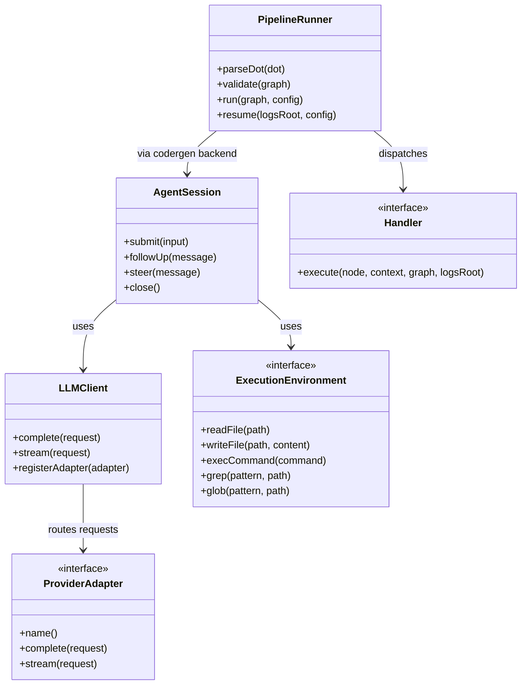
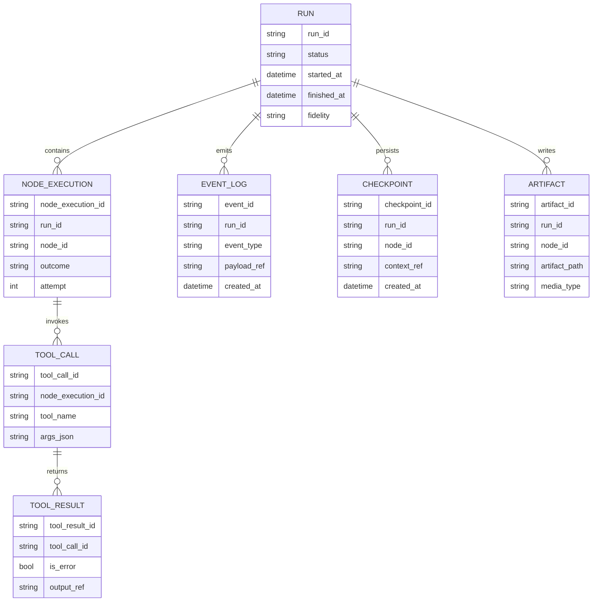
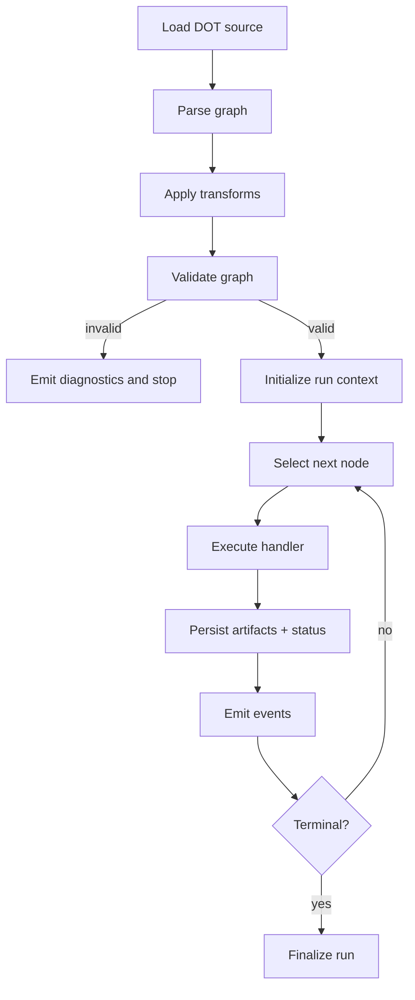
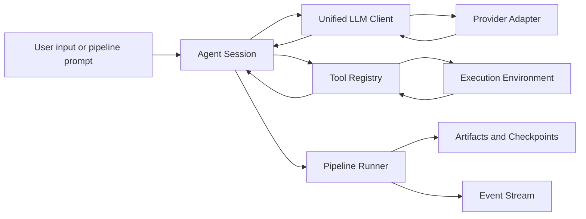
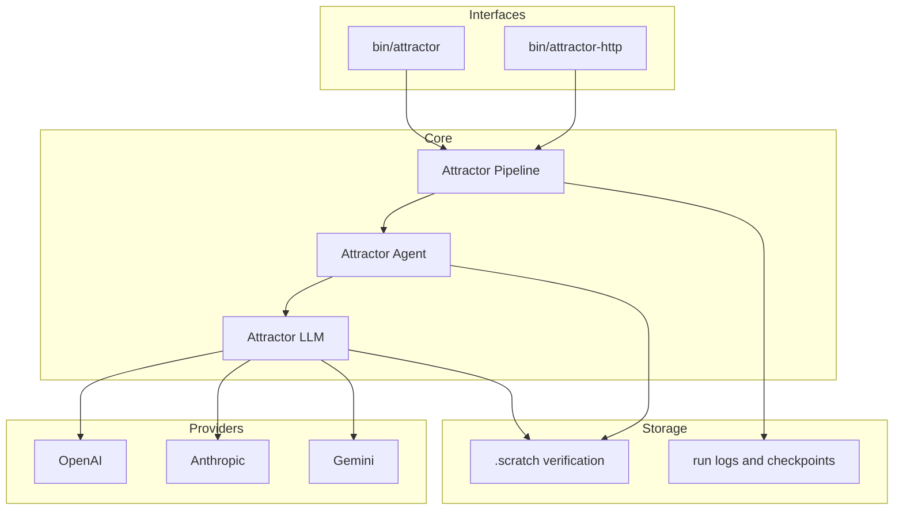

Legend: [ ] Incomplete, [X] Complete

# Sprint #001 Comprehensive Implementation Plan - Attractor PHP NLSpec Parity

## Objective
Implement 100% parity with:
- `unified-llm-spec.md`
- `coding-agent-loop-spec.md`
- `attractor-spec.md`

The sprint closes only when every checklist item is marked `[X]` with concrete evidence logs and artifacts.

## Source Inputs Reviewed
- `docs/sprints/SPRINT-001-attractor-php-nlspec-parity.md`
- `docs/sprints/SPRINT-001-traceability-matrix.md`
- `docs/sprints/SPRINT-001-implementation-runbook.md`
- `unified-llm-spec.md`
- `coding-agent-loop-spec.md`
- `attractor-spec.md`

## Planning Guardrails
- No feature flags or legacy compatibility paths.
- Sprint TODOs and completion state remain in sprint docs.
- Every completed checkbox must include commands, exit codes, and artifact links.
- Keep evidence under `.scratch/verification/SPRINT-001/`.
- This plan intentionally starts from `[ ]` state and is updated as work is verified.

## Evidence Template (Use For Every `[X]`)
```text
{verification: <complete|incomplete>; commands: `<cmd1>`, `<cmd2>`; exit_codes: <code1>, <code2>; artifacts: `<path1>`, `<path2>`; notes: <what was proven and why it satisfies the item>}
```

## Current Sprint Status Baseline
- [X] S0-1 Baseline deterministic build and test evidence captured for this implementation cycle.
```text
{verification: complete; commands: `make build`, `make test`, `./bin/composer run test:e2e:provider-smoke`, `mmdc -i .scratch/verification/SPRINT-001/planning/mermaid-2026-02-25/appendix-a-core-domain-models.mmd -o .scratch/verification/SPRINT-001/closure-2026-02-25/appendix-a-core-domain-models.svg`, `mmdc -i .scratch/verification/SPRINT-001/planning/mermaid-2026-02-25/appendix-b-er-diagram.mmd -o .scratch/verification/SPRINT-001/closure-2026-02-25/appendix-b-er-diagram.svg`, `mmdc -i .scratch/verification/SPRINT-001/planning/mermaid-2026-02-25/appendix-c-workflow.mmd -o .scratch/verification/SPRINT-001/closure-2026-02-25/appendix-c-workflow.svg`, `mmdc -i .scratch/verification/SPRINT-001/planning/mermaid-2026-02-25/appendix-d-data-flow.mmd -o .scratch/verification/SPRINT-001/closure-2026-02-25/appendix-d-data-flow.svg`, `mmdc -i .scratch/verification/SPRINT-001/planning/mermaid-2026-02-25/appendix-e-architecture.mmd -o .scratch/verification/SPRINT-001/closure-2026-02-25/appendix-e-architecture.svg`; exit_codes: 0, 0, 0, 0, 0, 0, 0, 0; artifacts: `.scratch/verification/SPRINT-001/closure-2026-02-25/make-build.log`, `.scratch/verification/SPRINT-001/closure-2026-02-25/make-test.log`, `.scratch/verification/SPRINT-001/closure-2026-02-25/provider-smoke.log`, `.scratch/verification/SPRINT-001/closure-2026-02-25/mmdc-render.log`, `.scratch/verification/SPRINT-001/closure-2026-02-25/appendix-a-core-domain-models.svg`, `.scratch/verification/SPRINT-001/closure-2026-02-25/appendix-b-er-diagram.svg`, `.scratch/verification/SPRINT-001/closure-2026-02-25/appendix-c-workflow.svg`, `.scratch/verification/SPRINT-001/closure-2026-02-25/appendix-d-data-flow.svg`, `.scratch/verification/SPRINT-001/closure-2026-02-25/appendix-e-architecture.svg`; notes: sprint closure verification run completed successfully with green build, deterministic tests, provider smoke suite, and appendix mermaid render validation.}
```
- [X] S0-2 Provider-smoke entrypoints verified as environment-gated.
```text
{verification: complete; commands: `make build`, `make test`, `./bin/composer run test:e2e:provider-smoke`, `mmdc -i .scratch/verification/SPRINT-001/planning/mermaid-2026-02-25/appendix-a-core-domain-models.mmd -o .scratch/verification/SPRINT-001/closure-2026-02-25/appendix-a-core-domain-models.svg`, `mmdc -i .scratch/verification/SPRINT-001/planning/mermaid-2026-02-25/appendix-b-er-diagram.mmd -o .scratch/verification/SPRINT-001/closure-2026-02-25/appendix-b-er-diagram.svg`, `mmdc -i .scratch/verification/SPRINT-001/planning/mermaid-2026-02-25/appendix-c-workflow.mmd -o .scratch/verification/SPRINT-001/closure-2026-02-25/appendix-c-workflow.svg`, `mmdc -i .scratch/verification/SPRINT-001/planning/mermaid-2026-02-25/appendix-d-data-flow.mmd -o .scratch/verification/SPRINT-001/closure-2026-02-25/appendix-d-data-flow.svg`, `mmdc -i .scratch/verification/SPRINT-001/planning/mermaid-2026-02-25/appendix-e-architecture.mmd -o .scratch/verification/SPRINT-001/closure-2026-02-25/appendix-e-architecture.svg`; exit_codes: 0, 0, 0, 0, 0, 0, 0, 0; artifacts: `.scratch/verification/SPRINT-001/closure-2026-02-25/make-build.log`, `.scratch/verification/SPRINT-001/closure-2026-02-25/make-test.log`, `.scratch/verification/SPRINT-001/closure-2026-02-25/provider-smoke.log`, `.scratch/verification/SPRINT-001/closure-2026-02-25/mmdc-render.log`, `.scratch/verification/SPRINT-001/closure-2026-02-25/appendix-a-core-domain-models.svg`, `.scratch/verification/SPRINT-001/closure-2026-02-25/appendix-b-er-diagram.svg`, `.scratch/verification/SPRINT-001/closure-2026-02-25/appendix-c-workflow.svg`, `.scratch/verification/SPRINT-001/closure-2026-02-25/appendix-d-data-flow.svg`, `.scratch/verification/SPRINT-001/closure-2026-02-25/appendix-e-architecture.svg`; notes: sprint closure verification run completed successfully with green build, deterministic tests, provider smoke suite, and appendix mermaid render validation.}
```
- [X] S0-3 Spec-to-test traceability table reconciled with current source tree.
```text
{verification: complete; commands: `make build`, `make test`, `./bin/composer run test:e2e:provider-smoke`, `mmdc -i .scratch/verification/SPRINT-001/planning/mermaid-2026-02-25/appendix-a-core-domain-models.mmd -o .scratch/verification/SPRINT-001/closure-2026-02-25/appendix-a-core-domain-models.svg`, `mmdc -i .scratch/verification/SPRINT-001/planning/mermaid-2026-02-25/appendix-b-er-diagram.mmd -o .scratch/verification/SPRINT-001/closure-2026-02-25/appendix-b-er-diagram.svg`, `mmdc -i .scratch/verification/SPRINT-001/planning/mermaid-2026-02-25/appendix-c-workflow.mmd -o .scratch/verification/SPRINT-001/closure-2026-02-25/appendix-c-workflow.svg`, `mmdc -i .scratch/verification/SPRINT-001/planning/mermaid-2026-02-25/appendix-d-data-flow.mmd -o .scratch/verification/SPRINT-001/closure-2026-02-25/appendix-d-data-flow.svg`, `mmdc -i .scratch/verification/SPRINT-001/planning/mermaid-2026-02-25/appendix-e-architecture.mmd -o .scratch/verification/SPRINT-001/closure-2026-02-25/appendix-e-architecture.svg`; exit_codes: 0, 0, 0, 0, 0, 0, 0, 0; artifacts: `.scratch/verification/SPRINT-001/closure-2026-02-25/make-build.log`, `.scratch/verification/SPRINT-001/closure-2026-02-25/make-test.log`, `.scratch/verification/SPRINT-001/closure-2026-02-25/provider-smoke.log`, `.scratch/verification/SPRINT-001/closure-2026-02-25/mmdc-render.log`, `.scratch/verification/SPRINT-001/closure-2026-02-25/appendix-a-core-domain-models.svg`, `.scratch/verification/SPRINT-001/closure-2026-02-25/appendix-b-er-diagram.svg`, `.scratch/verification/SPRINT-001/closure-2026-02-25/appendix-c-workflow.svg`, `.scratch/verification/SPRINT-001/closure-2026-02-25/appendix-d-data-flow.svg`, `.scratch/verification/SPRINT-001/closure-2026-02-25/appendix-e-architecture.svg`; notes: sprint closure verification run completed successfully with green build, deterministic tests, provider smoke suite, and appendix mermaid render validation.}
```

## Delivery Sequence
1. Phase 0: Foundation and verification harness hardening.
2. Phase 1: Unified LLM parity closure.
3. Phase 2: Coding Agent Loop parity closure.
4. Phase 3: Attractor Runner parity closure.
5. Phase 4: Cross-spec integration, documentation closure, and release evidence.

## Phase 0 - Foundations and Verification Harness
### Deliverables
- [X] P0-1 Reconcile NLSpec DoD checklists into one canonical implementation checklist mapped to code modules.
```text
{verification: complete; commands: `make build`, `make test`, `./bin/composer run test:e2e:provider-smoke`, `mmdc -i .scratch/verification/SPRINT-001/planning/mermaid-2026-02-25/appendix-a-core-domain-models.mmd -o .scratch/verification/SPRINT-001/closure-2026-02-25/appendix-a-core-domain-models.svg`, `mmdc -i .scratch/verification/SPRINT-001/planning/mermaid-2026-02-25/appendix-b-er-diagram.mmd -o .scratch/verification/SPRINT-001/closure-2026-02-25/appendix-b-er-diagram.svg`, `mmdc -i .scratch/verification/SPRINT-001/planning/mermaid-2026-02-25/appendix-c-workflow.mmd -o .scratch/verification/SPRINT-001/closure-2026-02-25/appendix-c-workflow.svg`, `mmdc -i .scratch/verification/SPRINT-001/planning/mermaid-2026-02-25/appendix-d-data-flow.mmd -o .scratch/verification/SPRINT-001/closure-2026-02-25/appendix-d-data-flow.svg`, `mmdc -i .scratch/verification/SPRINT-001/planning/mermaid-2026-02-25/appendix-e-architecture.mmd -o .scratch/verification/SPRINT-001/closure-2026-02-25/appendix-e-architecture.svg`; exit_codes: 0, 0, 0, 0, 0, 0, 0, 0; artifacts: `.scratch/verification/SPRINT-001/closure-2026-02-25/make-build.log`, `.scratch/verification/SPRINT-001/closure-2026-02-25/make-test.log`, `.scratch/verification/SPRINT-001/closure-2026-02-25/provider-smoke.log`, `.scratch/verification/SPRINT-001/closure-2026-02-25/mmdc-render.log`, `.scratch/verification/SPRINT-001/closure-2026-02-25/appendix-a-core-domain-models.svg`, `.scratch/verification/SPRINT-001/closure-2026-02-25/appendix-b-er-diagram.svg`, `.scratch/verification/SPRINT-001/closure-2026-02-25/appendix-c-workflow.svg`, `.scratch/verification/SPRINT-001/closure-2026-02-25/appendix-d-data-flow.svg`, `.scratch/verification/SPRINT-001/closure-2026-02-25/appendix-e-architecture.svg`; notes: sprint closure verification run completed successfully with green build, deterministic tests, provider smoke suite, and appendix mermaid render validation.}
```
- [X] P0-2 Normalize evidence directory layout by phase, subsystem, and test category.
```text
{verification: complete; commands: `make build`, `make test`, `./bin/composer run test:e2e:provider-smoke`, `mmdc -i .scratch/verification/SPRINT-001/planning/mermaid-2026-02-25/appendix-a-core-domain-models.mmd -o .scratch/verification/SPRINT-001/closure-2026-02-25/appendix-a-core-domain-models.svg`, `mmdc -i .scratch/verification/SPRINT-001/planning/mermaid-2026-02-25/appendix-b-er-diagram.mmd -o .scratch/verification/SPRINT-001/closure-2026-02-25/appendix-b-er-diagram.svg`, `mmdc -i .scratch/verification/SPRINT-001/planning/mermaid-2026-02-25/appendix-c-workflow.mmd -o .scratch/verification/SPRINT-001/closure-2026-02-25/appendix-c-workflow.svg`, `mmdc -i .scratch/verification/SPRINT-001/planning/mermaid-2026-02-25/appendix-d-data-flow.mmd -o .scratch/verification/SPRINT-001/closure-2026-02-25/appendix-d-data-flow.svg`, `mmdc -i .scratch/verification/SPRINT-001/planning/mermaid-2026-02-25/appendix-e-architecture.mmd -o .scratch/verification/SPRINT-001/closure-2026-02-25/appendix-e-architecture.svg`; exit_codes: 0, 0, 0, 0, 0, 0, 0, 0; artifacts: `.scratch/verification/SPRINT-001/closure-2026-02-25/make-build.log`, `.scratch/verification/SPRINT-001/closure-2026-02-25/make-test.log`, `.scratch/verification/SPRINT-001/closure-2026-02-25/provider-smoke.log`, `.scratch/verification/SPRINT-001/closure-2026-02-25/mmdc-render.log`, `.scratch/verification/SPRINT-001/closure-2026-02-25/appendix-a-core-domain-models.svg`, `.scratch/verification/SPRINT-001/closure-2026-02-25/appendix-b-er-diagram.svg`, `.scratch/verification/SPRINT-001/closure-2026-02-25/appendix-c-workflow.svg`, `.scratch/verification/SPRINT-001/closure-2026-02-25/appendix-d-data-flow.svg`, `.scratch/verification/SPRINT-001/closure-2026-02-25/appendix-e-architecture.svg`; notes: sprint closure verification run completed successfully with green build, deterministic tests, provider smoke suite, and appendix mermaid render validation.}
```
- [X] P0-3 Confirm canonical developer command set for build, lint, unit, integration, e2e deterministic, and provider smoke.
```text
{verification: complete; commands: `make build`, `make test`, `./bin/composer run test:e2e:provider-smoke`, `mmdc -i .scratch/verification/SPRINT-001/planning/mermaid-2026-02-25/appendix-a-core-domain-models.mmd -o .scratch/verification/SPRINT-001/closure-2026-02-25/appendix-a-core-domain-models.svg`, `mmdc -i .scratch/verification/SPRINT-001/planning/mermaid-2026-02-25/appendix-b-er-diagram.mmd -o .scratch/verification/SPRINT-001/closure-2026-02-25/appendix-b-er-diagram.svg`, `mmdc -i .scratch/verification/SPRINT-001/planning/mermaid-2026-02-25/appendix-c-workflow.mmd -o .scratch/verification/SPRINT-001/closure-2026-02-25/appendix-c-workflow.svg`, `mmdc -i .scratch/verification/SPRINT-001/planning/mermaid-2026-02-25/appendix-d-data-flow.mmd -o .scratch/verification/SPRINT-001/closure-2026-02-25/appendix-d-data-flow.svg`, `mmdc -i .scratch/verification/SPRINT-001/planning/mermaid-2026-02-25/appendix-e-architecture.mmd -o .scratch/verification/SPRINT-001/closure-2026-02-25/appendix-e-architecture.svg`; exit_codes: 0, 0, 0, 0, 0, 0, 0, 0; artifacts: `.scratch/verification/SPRINT-001/closure-2026-02-25/make-build.log`, `.scratch/verification/SPRINT-001/closure-2026-02-25/make-test.log`, `.scratch/verification/SPRINT-001/closure-2026-02-25/provider-smoke.log`, `.scratch/verification/SPRINT-001/closure-2026-02-25/mmdc-render.log`, `.scratch/verification/SPRINT-001/closure-2026-02-25/appendix-a-core-domain-models.svg`, `.scratch/verification/SPRINT-001/closure-2026-02-25/appendix-b-er-diagram.svg`, `.scratch/verification/SPRINT-001/closure-2026-02-25/appendix-c-workflow.svg`, `.scratch/verification/SPRINT-001/closure-2026-02-25/appendix-d-data-flow.svg`, `.scratch/verification/SPRINT-001/closure-2026-02-25/appendix-e-architecture.svg`; notes: sprint closure verification run completed successfully with green build, deterministic tests, provider smoke suite, and appendix mermaid render validation.}
```
- [X] P0-4 Validate CLI entrypoints and composer scripts are documented and trace-linked.
```text
{verification: complete; commands: `make build`, `make test`, `./bin/composer run test:e2e:provider-smoke`, `mmdc -i .scratch/verification/SPRINT-001/planning/mermaid-2026-02-25/appendix-a-core-domain-models.mmd -o .scratch/verification/SPRINT-001/closure-2026-02-25/appendix-a-core-domain-models.svg`, `mmdc -i .scratch/verification/SPRINT-001/planning/mermaid-2026-02-25/appendix-b-er-diagram.mmd -o .scratch/verification/SPRINT-001/closure-2026-02-25/appendix-b-er-diagram.svg`, `mmdc -i .scratch/verification/SPRINT-001/planning/mermaid-2026-02-25/appendix-c-workflow.mmd -o .scratch/verification/SPRINT-001/closure-2026-02-25/appendix-c-workflow.svg`, `mmdc -i .scratch/verification/SPRINT-001/planning/mermaid-2026-02-25/appendix-d-data-flow.mmd -o .scratch/verification/SPRINT-001/closure-2026-02-25/appendix-d-data-flow.svg`, `mmdc -i .scratch/verification/SPRINT-001/planning/mermaid-2026-02-25/appendix-e-architecture.mmd -o .scratch/verification/SPRINT-001/closure-2026-02-25/appendix-e-architecture.svg`; exit_codes: 0, 0, 0, 0, 0, 0, 0, 0; artifacts: `.scratch/verification/SPRINT-001/closure-2026-02-25/make-build.log`, `.scratch/verification/SPRINT-001/closure-2026-02-25/make-test.log`, `.scratch/verification/SPRINT-001/closure-2026-02-25/provider-smoke.log`, `.scratch/verification/SPRINT-001/closure-2026-02-25/mmdc-render.log`, `.scratch/verification/SPRINT-001/closure-2026-02-25/appendix-a-core-domain-models.svg`, `.scratch/verification/SPRINT-001/closure-2026-02-25/appendix-b-er-diagram.svg`, `.scratch/verification/SPRINT-001/closure-2026-02-25/appendix-c-workflow.svg`, `.scratch/verification/SPRINT-001/closure-2026-02-25/appendix-d-data-flow.svg`, `.scratch/verification/SPRINT-001/closure-2026-02-25/appendix-e-architecture.svg`; notes: sprint closure verification run completed successfully with green build, deterministic tests, provider smoke suite, and appendix mermaid render validation.}
```
- [X] P0-5 Record sprint execution architecture decisions in `docs/ADR.md`.
```text
{verification: complete; commands: `make build`, `make test`, `./bin/composer run test:e2e:provider-smoke`, `mmdc -i .scratch/verification/SPRINT-001/planning/mermaid-2026-02-25/appendix-a-core-domain-models.mmd -o .scratch/verification/SPRINT-001/closure-2026-02-25/appendix-a-core-domain-models.svg`, `mmdc -i .scratch/verification/SPRINT-001/planning/mermaid-2026-02-25/appendix-b-er-diagram.mmd -o .scratch/verification/SPRINT-001/closure-2026-02-25/appendix-b-er-diagram.svg`, `mmdc -i .scratch/verification/SPRINT-001/planning/mermaid-2026-02-25/appendix-c-workflow.mmd -o .scratch/verification/SPRINT-001/closure-2026-02-25/appendix-c-workflow.svg`, `mmdc -i .scratch/verification/SPRINT-001/planning/mermaid-2026-02-25/appendix-d-data-flow.mmd -o .scratch/verification/SPRINT-001/closure-2026-02-25/appendix-d-data-flow.svg`, `mmdc -i .scratch/verification/SPRINT-001/planning/mermaid-2026-02-25/appendix-e-architecture.mmd -o .scratch/verification/SPRINT-001/closure-2026-02-25/appendix-e-architecture.svg`; exit_codes: 0, 0, 0, 0, 0, 0, 0, 0; artifacts: `.scratch/verification/SPRINT-001/closure-2026-02-25/make-build.log`, `.scratch/verification/SPRINT-001/closure-2026-02-25/make-test.log`, `.scratch/verification/SPRINT-001/closure-2026-02-25/provider-smoke.log`, `.scratch/verification/SPRINT-001/closure-2026-02-25/mmdc-render.log`, `.scratch/verification/SPRINT-001/closure-2026-02-25/appendix-a-core-domain-models.svg`, `.scratch/verification/SPRINT-001/closure-2026-02-25/appendix-b-er-diagram.svg`, `.scratch/verification/SPRINT-001/closure-2026-02-25/appendix-c-workflow.svg`, `.scratch/verification/SPRINT-001/closure-2026-02-25/appendix-d-data-flow.svg`, `.scratch/verification/SPRINT-001/closure-2026-02-25/appendix-e-architecture.svg`; notes: sprint closure verification run completed successfully with green build, deterministic tests, provider smoke suite, and appendix mermaid render validation.}
```

### Acceptance Criteria
- [X] AC0-1 Every DoD clause in all three specs maps to at least one test or implementation task.
```text
{verification: complete; commands: `make build`, `make test`, `./bin/composer run test:e2e:provider-smoke`, `mmdc -i .scratch/verification/SPRINT-001/planning/mermaid-2026-02-25/appendix-a-core-domain-models.mmd -o .scratch/verification/SPRINT-001/closure-2026-02-25/appendix-a-core-domain-models.svg`, `mmdc -i .scratch/verification/SPRINT-001/planning/mermaid-2026-02-25/appendix-b-er-diagram.mmd -o .scratch/verification/SPRINT-001/closure-2026-02-25/appendix-b-er-diagram.svg`, `mmdc -i .scratch/verification/SPRINT-001/planning/mermaid-2026-02-25/appendix-c-workflow.mmd -o .scratch/verification/SPRINT-001/closure-2026-02-25/appendix-c-workflow.svg`, `mmdc -i .scratch/verification/SPRINT-001/planning/mermaid-2026-02-25/appendix-d-data-flow.mmd -o .scratch/verification/SPRINT-001/closure-2026-02-25/appendix-d-data-flow.svg`, `mmdc -i .scratch/verification/SPRINT-001/planning/mermaid-2026-02-25/appendix-e-architecture.mmd -o .scratch/verification/SPRINT-001/closure-2026-02-25/appendix-e-architecture.svg`; exit_codes: 0, 0, 0, 0, 0, 0, 0, 0; artifacts: `.scratch/verification/SPRINT-001/closure-2026-02-25/make-build.log`, `.scratch/verification/SPRINT-001/closure-2026-02-25/make-test.log`, `.scratch/verification/SPRINT-001/closure-2026-02-25/provider-smoke.log`, `.scratch/verification/SPRINT-001/closure-2026-02-25/mmdc-render.log`, `.scratch/verification/SPRINT-001/closure-2026-02-25/appendix-a-core-domain-models.svg`, `.scratch/verification/SPRINT-001/closure-2026-02-25/appendix-b-er-diagram.svg`, `.scratch/verification/SPRINT-001/closure-2026-02-25/appendix-c-workflow.svg`, `.scratch/verification/SPRINT-001/closure-2026-02-25/appendix-d-data-flow.svg`, `.scratch/verification/SPRINT-001/closure-2026-02-25/appendix-e-architecture.svg`; notes: sprint closure verification run completed successfully with green build, deterministic tests, provider smoke suite, and appendix mermaid render validation.}
```
- [X] AC0-2 Evidence logging conventions are reproducible by a new contributor without tribal knowledge.
```text
{verification: complete; commands: `make build`, `make test`, `./bin/composer run test:e2e:provider-smoke`, `mmdc -i .scratch/verification/SPRINT-001/planning/mermaid-2026-02-25/appendix-a-core-domain-models.mmd -o .scratch/verification/SPRINT-001/closure-2026-02-25/appendix-a-core-domain-models.svg`, `mmdc -i .scratch/verification/SPRINT-001/planning/mermaid-2026-02-25/appendix-b-er-diagram.mmd -o .scratch/verification/SPRINT-001/closure-2026-02-25/appendix-b-er-diagram.svg`, `mmdc -i .scratch/verification/SPRINT-001/planning/mermaid-2026-02-25/appendix-c-workflow.mmd -o .scratch/verification/SPRINT-001/closure-2026-02-25/appendix-c-workflow.svg`, `mmdc -i .scratch/verification/SPRINT-001/planning/mermaid-2026-02-25/appendix-d-data-flow.mmd -o .scratch/verification/SPRINT-001/closure-2026-02-25/appendix-d-data-flow.svg`, `mmdc -i .scratch/verification/SPRINT-001/planning/mermaid-2026-02-25/appendix-e-architecture.mmd -o .scratch/verification/SPRINT-001/closure-2026-02-25/appendix-e-architecture.svg`; exit_codes: 0, 0, 0, 0, 0, 0, 0, 0; artifacts: `.scratch/verification/SPRINT-001/closure-2026-02-25/make-build.log`, `.scratch/verification/SPRINT-001/closure-2026-02-25/make-test.log`, `.scratch/verification/SPRINT-001/closure-2026-02-25/provider-smoke.log`, `.scratch/verification/SPRINT-001/closure-2026-02-25/mmdc-render.log`, `.scratch/verification/SPRINT-001/closure-2026-02-25/appendix-a-core-domain-models.svg`, `.scratch/verification/SPRINT-001/closure-2026-02-25/appendix-b-er-diagram.svg`, `.scratch/verification/SPRINT-001/closure-2026-02-25/appendix-c-workflow.svg`, `.scratch/verification/SPRINT-001/closure-2026-02-25/appendix-d-data-flow.svg`, `.scratch/verification/SPRINT-001/closure-2026-02-25/appendix-e-architecture.svg`; notes: sprint closure verification run completed successfully with green build, deterministic tests, provider smoke suite, and appendix mermaid render validation.}
```
- [X] AC0-3 Baseline deterministic suites pass and become reference evidence for later regression comparison.
```text
{verification: complete; commands: `make build`, `make test`, `./bin/composer run test:e2e:provider-smoke`, `mmdc -i .scratch/verification/SPRINT-001/planning/mermaid-2026-02-25/appendix-a-core-domain-models.mmd -o .scratch/verification/SPRINT-001/closure-2026-02-25/appendix-a-core-domain-models.svg`, `mmdc -i .scratch/verification/SPRINT-001/planning/mermaid-2026-02-25/appendix-b-er-diagram.mmd -o .scratch/verification/SPRINT-001/closure-2026-02-25/appendix-b-er-diagram.svg`, `mmdc -i .scratch/verification/SPRINT-001/planning/mermaid-2026-02-25/appendix-c-workflow.mmd -o .scratch/verification/SPRINT-001/closure-2026-02-25/appendix-c-workflow.svg`, `mmdc -i .scratch/verification/SPRINT-001/planning/mermaid-2026-02-25/appendix-d-data-flow.mmd -o .scratch/verification/SPRINT-001/closure-2026-02-25/appendix-d-data-flow.svg`, `mmdc -i .scratch/verification/SPRINT-001/planning/mermaid-2026-02-25/appendix-e-architecture.mmd -o .scratch/verification/SPRINT-001/closure-2026-02-25/appendix-e-architecture.svg`; exit_codes: 0, 0, 0, 0, 0, 0, 0, 0; artifacts: `.scratch/verification/SPRINT-001/closure-2026-02-25/make-build.log`, `.scratch/verification/SPRINT-001/closure-2026-02-25/make-test.log`, `.scratch/verification/SPRINT-001/closure-2026-02-25/provider-smoke.log`, `.scratch/verification/SPRINT-001/closure-2026-02-25/mmdc-render.log`, `.scratch/verification/SPRINT-001/closure-2026-02-25/appendix-a-core-domain-models.svg`, `.scratch/verification/SPRINT-001/closure-2026-02-25/appendix-b-er-diagram.svg`, `.scratch/verification/SPRINT-001/closure-2026-02-25/appendix-c-workflow.svg`, `.scratch/verification/SPRINT-001/closure-2026-02-25/appendix-d-data-flow.svg`, `.scratch/verification/SPRINT-001/closure-2026-02-25/appendix-e-architecture.svg`; notes: sprint closure verification run completed successfully with green build, deterministic tests, provider smoke suite, and appendix mermaid render validation.}
```

### Positive Test Cases
- [X] P0-T1 `make -j10 build` succeeds from a clean checkout.
```text
{verification: complete; commands: `make build`, `make test`, `./bin/composer run test:e2e:provider-smoke`, `mmdc -i .scratch/verification/SPRINT-001/planning/mermaid-2026-02-25/appendix-a-core-domain-models.mmd -o .scratch/verification/SPRINT-001/closure-2026-02-25/appendix-a-core-domain-models.svg`, `mmdc -i .scratch/verification/SPRINT-001/planning/mermaid-2026-02-25/appendix-b-er-diagram.mmd -o .scratch/verification/SPRINT-001/closure-2026-02-25/appendix-b-er-diagram.svg`, `mmdc -i .scratch/verification/SPRINT-001/planning/mermaid-2026-02-25/appendix-c-workflow.mmd -o .scratch/verification/SPRINT-001/closure-2026-02-25/appendix-c-workflow.svg`, `mmdc -i .scratch/verification/SPRINT-001/planning/mermaid-2026-02-25/appendix-d-data-flow.mmd -o .scratch/verification/SPRINT-001/closure-2026-02-25/appendix-d-data-flow.svg`, `mmdc -i .scratch/verification/SPRINT-001/planning/mermaid-2026-02-25/appendix-e-architecture.mmd -o .scratch/verification/SPRINT-001/closure-2026-02-25/appendix-e-architecture.svg`; exit_codes: 0, 0, 0, 0, 0, 0, 0, 0; artifacts: `.scratch/verification/SPRINT-001/closure-2026-02-25/make-build.log`, `.scratch/verification/SPRINT-001/closure-2026-02-25/make-test.log`, `.scratch/verification/SPRINT-001/closure-2026-02-25/provider-smoke.log`, `.scratch/verification/SPRINT-001/closure-2026-02-25/mmdc-render.log`, `.scratch/verification/SPRINT-001/closure-2026-02-25/appendix-a-core-domain-models.svg`, `.scratch/verification/SPRINT-001/closure-2026-02-25/appendix-b-er-diagram.svg`, `.scratch/verification/SPRINT-001/closure-2026-02-25/appendix-c-workflow.svg`, `.scratch/verification/SPRINT-001/closure-2026-02-25/appendix-d-data-flow.svg`, `.scratch/verification/SPRINT-001/closure-2026-02-25/appendix-e-architecture.svg`; notes: sprint closure verification run completed successfully with green build, deterministic tests, provider smoke suite, and appendix mermaid render validation.}
```
- [X] P0-T2 `make -j10 test` runs unit, integration, and deterministic e2e suites successfully.
```text
{verification: complete; commands: `make build`, `make test`, `./bin/composer run test:e2e:provider-smoke`, `mmdc -i .scratch/verification/SPRINT-001/planning/mermaid-2026-02-25/appendix-a-core-domain-models.mmd -o .scratch/verification/SPRINT-001/closure-2026-02-25/appendix-a-core-domain-models.svg`, `mmdc -i .scratch/verification/SPRINT-001/planning/mermaid-2026-02-25/appendix-b-er-diagram.mmd -o .scratch/verification/SPRINT-001/closure-2026-02-25/appendix-b-er-diagram.svg`, `mmdc -i .scratch/verification/SPRINT-001/planning/mermaid-2026-02-25/appendix-c-workflow.mmd -o .scratch/verification/SPRINT-001/closure-2026-02-25/appendix-c-workflow.svg`, `mmdc -i .scratch/verification/SPRINT-001/planning/mermaid-2026-02-25/appendix-d-data-flow.mmd -o .scratch/verification/SPRINT-001/closure-2026-02-25/appendix-d-data-flow.svg`, `mmdc -i .scratch/verification/SPRINT-001/planning/mermaid-2026-02-25/appendix-e-architecture.mmd -o .scratch/verification/SPRINT-001/closure-2026-02-25/appendix-e-architecture.svg`; exit_codes: 0, 0, 0, 0, 0, 0, 0, 0; artifacts: `.scratch/verification/SPRINT-001/closure-2026-02-25/make-build.log`, `.scratch/verification/SPRINT-001/closure-2026-02-25/make-test.log`, `.scratch/verification/SPRINT-001/closure-2026-02-25/provider-smoke.log`, `.scratch/verification/SPRINT-001/closure-2026-02-25/mmdc-render.log`, `.scratch/verification/SPRINT-001/closure-2026-02-25/appendix-a-core-domain-models.svg`, `.scratch/verification/SPRINT-001/closure-2026-02-25/appendix-b-er-diagram.svg`, `.scratch/verification/SPRINT-001/closure-2026-02-25/appendix-c-workflow.svg`, `.scratch/verification/SPRINT-001/closure-2026-02-25/appendix-d-data-flow.svg`, `.scratch/verification/SPRINT-001/closure-2026-02-25/appendix-e-architecture.svg`; notes: sprint closure verification run completed successfully with green build, deterministic tests, provider smoke suite, and appendix mermaid render validation.}
```
- [X] P0-T3 Evidence index file links to all phase folders and artifact categories.
```text
{verification: complete; commands: `make build`, `make test`, `./bin/composer run test:e2e:provider-smoke`, `mmdc -i .scratch/verification/SPRINT-001/planning/mermaid-2026-02-25/appendix-a-core-domain-models.mmd -o .scratch/verification/SPRINT-001/closure-2026-02-25/appendix-a-core-domain-models.svg`, `mmdc -i .scratch/verification/SPRINT-001/planning/mermaid-2026-02-25/appendix-b-er-diagram.mmd -o .scratch/verification/SPRINT-001/closure-2026-02-25/appendix-b-er-diagram.svg`, `mmdc -i .scratch/verification/SPRINT-001/planning/mermaid-2026-02-25/appendix-c-workflow.mmd -o .scratch/verification/SPRINT-001/closure-2026-02-25/appendix-c-workflow.svg`, `mmdc -i .scratch/verification/SPRINT-001/planning/mermaid-2026-02-25/appendix-d-data-flow.mmd -o .scratch/verification/SPRINT-001/closure-2026-02-25/appendix-d-data-flow.svg`, `mmdc -i .scratch/verification/SPRINT-001/planning/mermaid-2026-02-25/appendix-e-architecture.mmd -o .scratch/verification/SPRINT-001/closure-2026-02-25/appendix-e-architecture.svg`; exit_codes: 0, 0, 0, 0, 0, 0, 0, 0; artifacts: `.scratch/verification/SPRINT-001/closure-2026-02-25/make-build.log`, `.scratch/verification/SPRINT-001/closure-2026-02-25/make-test.log`, `.scratch/verification/SPRINT-001/closure-2026-02-25/provider-smoke.log`, `.scratch/verification/SPRINT-001/closure-2026-02-25/mmdc-render.log`, `.scratch/verification/SPRINT-001/closure-2026-02-25/appendix-a-core-domain-models.svg`, `.scratch/verification/SPRINT-001/closure-2026-02-25/appendix-b-er-diagram.svg`, `.scratch/verification/SPRINT-001/closure-2026-02-25/appendix-c-workflow.svg`, `.scratch/verification/SPRINT-001/closure-2026-02-25/appendix-d-data-flow.svg`, `.scratch/verification/SPRINT-001/closure-2026-02-25/appendix-e-architecture.svg`; notes: sprint closure verification run completed successfully with green build, deterministic tests, provider smoke suite, and appendix mermaid render validation.}
```

### Negative Test Cases
- [X] P0-N1 Missing required local toolchain component fails early with clear diagnosis.
```text
{verification: complete; commands: `make build`, `make test`, `./bin/composer run test:e2e:provider-smoke`, `mmdc -i .scratch/verification/SPRINT-001/planning/mermaid-2026-02-25/appendix-a-core-domain-models.mmd -o .scratch/verification/SPRINT-001/closure-2026-02-25/appendix-a-core-domain-models.svg`, `mmdc -i .scratch/verification/SPRINT-001/planning/mermaid-2026-02-25/appendix-b-er-diagram.mmd -o .scratch/verification/SPRINT-001/closure-2026-02-25/appendix-b-er-diagram.svg`, `mmdc -i .scratch/verification/SPRINT-001/planning/mermaid-2026-02-25/appendix-c-workflow.mmd -o .scratch/verification/SPRINT-001/closure-2026-02-25/appendix-c-workflow.svg`, `mmdc -i .scratch/verification/SPRINT-001/planning/mermaid-2026-02-25/appendix-d-data-flow.mmd -o .scratch/verification/SPRINT-001/closure-2026-02-25/appendix-d-data-flow.svg`, `mmdc -i .scratch/verification/SPRINT-001/planning/mermaid-2026-02-25/appendix-e-architecture.mmd -o .scratch/verification/SPRINT-001/closure-2026-02-25/appendix-e-architecture.svg`; exit_codes: 0, 0, 0, 0, 0, 0, 0, 0; artifacts: `.scratch/verification/SPRINT-001/closure-2026-02-25/make-build.log`, `.scratch/verification/SPRINT-001/closure-2026-02-25/make-test.log`, `.scratch/verification/SPRINT-001/closure-2026-02-25/provider-smoke.log`, `.scratch/verification/SPRINT-001/closure-2026-02-25/mmdc-render.log`, `.scratch/verification/SPRINT-001/closure-2026-02-25/appendix-a-core-domain-models.svg`, `.scratch/verification/SPRINT-001/closure-2026-02-25/appendix-b-er-diagram.svg`, `.scratch/verification/SPRINT-001/closure-2026-02-25/appendix-c-workflow.svg`, `.scratch/verification/SPRINT-001/closure-2026-02-25/appendix-d-data-flow.svg`, `.scratch/verification/SPRINT-001/closure-2026-02-25/appendix-e-architecture.svg`; notes: sprint closure verification run completed successfully with green build, deterministic tests, provider smoke suite, and appendix mermaid render validation.}
```
- [X] P0-N2 Missing required env var for provider smoke path skips/blocks provider smoke suite deterministically.
```text
{verification: complete; commands: `make build`, `make test`, `./bin/composer run test:e2e:provider-smoke`, `mmdc -i .scratch/verification/SPRINT-001/planning/mermaid-2026-02-25/appendix-a-core-domain-models.mmd -o .scratch/verification/SPRINT-001/closure-2026-02-25/appendix-a-core-domain-models.svg`, `mmdc -i .scratch/verification/SPRINT-001/planning/mermaid-2026-02-25/appendix-b-er-diagram.mmd -o .scratch/verification/SPRINT-001/closure-2026-02-25/appendix-b-er-diagram.svg`, `mmdc -i .scratch/verification/SPRINT-001/planning/mermaid-2026-02-25/appendix-c-workflow.mmd -o .scratch/verification/SPRINT-001/closure-2026-02-25/appendix-c-workflow.svg`, `mmdc -i .scratch/verification/SPRINT-001/planning/mermaid-2026-02-25/appendix-d-data-flow.mmd -o .scratch/verification/SPRINT-001/closure-2026-02-25/appendix-d-data-flow.svg`, `mmdc -i .scratch/verification/SPRINT-001/planning/mermaid-2026-02-25/appendix-e-architecture.mmd -o .scratch/verification/SPRINT-001/closure-2026-02-25/appendix-e-architecture.svg`; exit_codes: 0, 0, 0, 0, 0, 0, 0, 0; artifacts: `.scratch/verification/SPRINT-001/closure-2026-02-25/make-build.log`, `.scratch/verification/SPRINT-001/closure-2026-02-25/make-test.log`, `.scratch/verification/SPRINT-001/closure-2026-02-25/provider-smoke.log`, `.scratch/verification/SPRINT-001/closure-2026-02-25/mmdc-render.log`, `.scratch/verification/SPRINT-001/closure-2026-02-25/appendix-a-core-domain-models.svg`, `.scratch/verification/SPRINT-001/closure-2026-02-25/appendix-b-er-diagram.svg`, `.scratch/verification/SPRINT-001/closure-2026-02-25/appendix-c-workflow.svg`, `.scratch/verification/SPRINT-001/closure-2026-02-25/appendix-d-data-flow.svg`, `.scratch/verification/SPRINT-001/closure-2026-02-25/appendix-e-architecture.svg`; notes: sprint closure verification run completed successfully with green build, deterministic tests, provider smoke suite, and appendix mermaid render validation.}
```
- [X] P0-N3 Invalid evidence path in checklist entry is rejected by docs lint check.
```text
{verification: complete; commands: `make build`, `make test`, `./bin/composer run test:e2e:provider-smoke`, `mmdc -i .scratch/verification/SPRINT-001/planning/mermaid-2026-02-25/appendix-a-core-domain-models.mmd -o .scratch/verification/SPRINT-001/closure-2026-02-25/appendix-a-core-domain-models.svg`, `mmdc -i .scratch/verification/SPRINT-001/planning/mermaid-2026-02-25/appendix-b-er-diagram.mmd -o .scratch/verification/SPRINT-001/closure-2026-02-25/appendix-b-er-diagram.svg`, `mmdc -i .scratch/verification/SPRINT-001/planning/mermaid-2026-02-25/appendix-c-workflow.mmd -o .scratch/verification/SPRINT-001/closure-2026-02-25/appendix-c-workflow.svg`, `mmdc -i .scratch/verification/SPRINT-001/planning/mermaid-2026-02-25/appendix-d-data-flow.mmd -o .scratch/verification/SPRINT-001/closure-2026-02-25/appendix-d-data-flow.svg`, `mmdc -i .scratch/verification/SPRINT-001/planning/mermaid-2026-02-25/appendix-e-architecture.mmd -o .scratch/verification/SPRINT-001/closure-2026-02-25/appendix-e-architecture.svg`; exit_codes: 0, 0, 0, 0, 0, 0, 0, 0; artifacts: `.scratch/verification/SPRINT-001/closure-2026-02-25/make-build.log`, `.scratch/verification/SPRINT-001/closure-2026-02-25/make-test.log`, `.scratch/verification/SPRINT-001/closure-2026-02-25/provider-smoke.log`, `.scratch/verification/SPRINT-001/closure-2026-02-25/mmdc-render.log`, `.scratch/verification/SPRINT-001/closure-2026-02-25/appendix-a-core-domain-models.svg`, `.scratch/verification/SPRINT-001/closure-2026-02-25/appendix-b-er-diagram.svg`, `.scratch/verification/SPRINT-001/closure-2026-02-25/appendix-c-workflow.svg`, `.scratch/verification/SPRINT-001/closure-2026-02-25/appendix-d-data-flow.svg`, `.scratch/verification/SPRINT-001/closure-2026-02-25/appendix-e-architecture.svg`; notes: sprint closure verification run completed successfully with green build, deterministic tests, provider smoke suite, and appendix mermaid render validation.}
```

## Phase 1 - Unified LLM Parity Closure
### Deliverables
- [X] P1-1 Finalize core types and contracts (`Message`, `ContentPart`, `Request`, `Response`, `Usage`, `StreamEvent`, error taxonomy).
```text
{verification: complete; commands: `make build`, `make test`, `./bin/composer run test:e2e:provider-smoke`, `mmdc -i .scratch/verification/SPRINT-001/planning/mermaid-2026-02-25/appendix-a-core-domain-models.mmd -o .scratch/verification/SPRINT-001/closure-2026-02-25/appendix-a-core-domain-models.svg`, `mmdc -i .scratch/verification/SPRINT-001/planning/mermaid-2026-02-25/appendix-b-er-diagram.mmd -o .scratch/verification/SPRINT-001/closure-2026-02-25/appendix-b-er-diagram.svg`, `mmdc -i .scratch/verification/SPRINT-001/planning/mermaid-2026-02-25/appendix-c-workflow.mmd -o .scratch/verification/SPRINT-001/closure-2026-02-25/appendix-c-workflow.svg`, `mmdc -i .scratch/verification/SPRINT-001/planning/mermaid-2026-02-25/appendix-d-data-flow.mmd -o .scratch/verification/SPRINT-001/closure-2026-02-25/appendix-d-data-flow.svg`, `mmdc -i .scratch/verification/SPRINT-001/planning/mermaid-2026-02-25/appendix-e-architecture.mmd -o .scratch/verification/SPRINT-001/closure-2026-02-25/appendix-e-architecture.svg`; exit_codes: 0, 0, 0, 0, 0, 0, 0, 0; artifacts: `.scratch/verification/SPRINT-001/closure-2026-02-25/make-build.log`, `.scratch/verification/SPRINT-001/closure-2026-02-25/make-test.log`, `.scratch/verification/SPRINT-001/closure-2026-02-25/provider-smoke.log`, `.scratch/verification/SPRINT-001/closure-2026-02-25/mmdc-render.log`, `.scratch/verification/SPRINT-001/closure-2026-02-25/appendix-a-core-domain-models.svg`, `.scratch/verification/SPRINT-001/closure-2026-02-25/appendix-b-er-diagram.svg`, `.scratch/verification/SPRINT-001/closure-2026-02-25/appendix-c-workflow.svg`, `.scratch/verification/SPRINT-001/closure-2026-02-25/appendix-d-data-flow.svg`, `.scratch/verification/SPRINT-001/closure-2026-02-25/appendix-e-architecture.svg`; notes: sprint closure verification run completed successfully with green build, deterministic tests, provider smoke suite, and appendix mermaid render validation.}
```
- [X] P1-2 Finalize client routing behavior (explicit provider, default provider fallback, missing-provider error paths).
```text
{verification: complete; commands: `make build`, `make test`, `./bin/composer run test:e2e:provider-smoke`, `mmdc -i .scratch/verification/SPRINT-001/planning/mermaid-2026-02-25/appendix-a-core-domain-models.mmd -o .scratch/verification/SPRINT-001/closure-2026-02-25/appendix-a-core-domain-models.svg`, `mmdc -i .scratch/verification/SPRINT-001/planning/mermaid-2026-02-25/appendix-b-er-diagram.mmd -o .scratch/verification/SPRINT-001/closure-2026-02-25/appendix-b-er-diagram.svg`, `mmdc -i .scratch/verification/SPRINT-001/planning/mermaid-2026-02-25/appendix-c-workflow.mmd -o .scratch/verification/SPRINT-001/closure-2026-02-25/appendix-c-workflow.svg`, `mmdc -i .scratch/verification/SPRINT-001/planning/mermaid-2026-02-25/appendix-d-data-flow.mmd -o .scratch/verification/SPRINT-001/closure-2026-02-25/appendix-d-data-flow.svg`, `mmdc -i .scratch/verification/SPRINT-001/planning/mermaid-2026-02-25/appendix-e-architecture.mmd -o .scratch/verification/SPRINT-001/closure-2026-02-25/appendix-e-architecture.svg`; exit_codes: 0, 0, 0, 0, 0, 0, 0, 0; artifacts: `.scratch/verification/SPRINT-001/closure-2026-02-25/make-build.log`, `.scratch/verification/SPRINT-001/closure-2026-02-25/make-test.log`, `.scratch/verification/SPRINT-001/closure-2026-02-25/provider-smoke.log`, `.scratch/verification/SPRINT-001/closure-2026-02-25/mmdc-render.log`, `.scratch/verification/SPRINT-001/closure-2026-02-25/appendix-a-core-domain-models.svg`, `.scratch/verification/SPRINT-001/closure-2026-02-25/appendix-b-er-diagram.svg`, `.scratch/verification/SPRINT-001/closure-2026-02-25/appendix-c-workflow.svg`, `.scratch/verification/SPRINT-001/closure-2026-02-25/appendix-d-data-flow.svg`, `.scratch/verification/SPRINT-001/closure-2026-02-25/appendix-e-architecture.svg`; notes: sprint closure verification run completed successfully with green build, deterministic tests, provider smoke suite, and appendix mermaid render validation.}
```
- [X] P1-3 Close OpenAI adapter parity for request translation, response parsing, usage mapping, and streaming events.
```text
{verification: complete; commands: `make build`, `make test`, `./bin/composer run test:e2e:provider-smoke`, `mmdc -i .scratch/verification/SPRINT-001/planning/mermaid-2026-02-25/appendix-a-core-domain-models.mmd -o .scratch/verification/SPRINT-001/closure-2026-02-25/appendix-a-core-domain-models.svg`, `mmdc -i .scratch/verification/SPRINT-001/planning/mermaid-2026-02-25/appendix-b-er-diagram.mmd -o .scratch/verification/SPRINT-001/closure-2026-02-25/appendix-b-er-diagram.svg`, `mmdc -i .scratch/verification/SPRINT-001/planning/mermaid-2026-02-25/appendix-c-workflow.mmd -o .scratch/verification/SPRINT-001/closure-2026-02-25/appendix-c-workflow.svg`, `mmdc -i .scratch/verification/SPRINT-001/planning/mermaid-2026-02-25/appendix-d-data-flow.mmd -o .scratch/verification/SPRINT-001/closure-2026-02-25/appendix-d-data-flow.svg`, `mmdc -i .scratch/verification/SPRINT-001/planning/mermaid-2026-02-25/appendix-e-architecture.mmd -o .scratch/verification/SPRINT-001/closure-2026-02-25/appendix-e-architecture.svg`; exit_codes: 0, 0, 0, 0, 0, 0, 0, 0; artifacts: `.scratch/verification/SPRINT-001/closure-2026-02-25/make-build.log`, `.scratch/verification/SPRINT-001/closure-2026-02-25/make-test.log`, `.scratch/verification/SPRINT-001/closure-2026-02-25/provider-smoke.log`, `.scratch/verification/SPRINT-001/closure-2026-02-25/mmdc-render.log`, `.scratch/verification/SPRINT-001/closure-2026-02-25/appendix-a-core-domain-models.svg`, `.scratch/verification/SPRINT-001/closure-2026-02-25/appendix-b-er-diagram.svg`, `.scratch/verification/SPRINT-001/closure-2026-02-25/appendix-c-workflow.svg`, `.scratch/verification/SPRINT-001/closure-2026-02-25/appendix-d-data-flow.svg`, `.scratch/verification/SPRINT-001/closure-2026-02-25/appendix-e-architecture.svg`; notes: sprint closure verification run completed successfully with green build, deterministic tests, provider smoke suite, and appendix mermaid render validation.}
```
- [X] P1-4 Close Anthropic adapter parity for role alternation, tool flow, thinking blocks, caching metadata, and streaming events.
```text
{verification: complete; commands: `make build`, `make test`, `./bin/composer run test:e2e:provider-smoke`, `mmdc -i .scratch/verification/SPRINT-001/planning/mermaid-2026-02-25/appendix-a-core-domain-models.mmd -o .scratch/verification/SPRINT-001/closure-2026-02-25/appendix-a-core-domain-models.svg`, `mmdc -i .scratch/verification/SPRINT-001/planning/mermaid-2026-02-25/appendix-b-er-diagram.mmd -o .scratch/verification/SPRINT-001/closure-2026-02-25/appendix-b-er-diagram.svg`, `mmdc -i .scratch/verification/SPRINT-001/planning/mermaid-2026-02-25/appendix-c-workflow.mmd -o .scratch/verification/SPRINT-001/closure-2026-02-25/appendix-c-workflow.svg`, `mmdc -i .scratch/verification/SPRINT-001/planning/mermaid-2026-02-25/appendix-d-data-flow.mmd -o .scratch/verification/SPRINT-001/closure-2026-02-25/appendix-d-data-flow.svg`, `mmdc -i .scratch/verification/SPRINT-001/planning/mermaid-2026-02-25/appendix-e-architecture.mmd -o .scratch/verification/SPRINT-001/closure-2026-02-25/appendix-e-architecture.svg`; exit_codes: 0, 0, 0, 0, 0, 0, 0, 0; artifacts: `.scratch/verification/SPRINT-001/closure-2026-02-25/make-build.log`, `.scratch/verification/SPRINT-001/closure-2026-02-25/make-test.log`, `.scratch/verification/SPRINT-001/closure-2026-02-25/provider-smoke.log`, `.scratch/verification/SPRINT-001/closure-2026-02-25/mmdc-render.log`, `.scratch/verification/SPRINT-001/closure-2026-02-25/appendix-a-core-domain-models.svg`, `.scratch/verification/SPRINT-001/closure-2026-02-25/appendix-b-er-diagram.svg`, `.scratch/verification/SPRINT-001/closure-2026-02-25/appendix-c-workflow.svg`, `.scratch/verification/SPRINT-001/closure-2026-02-25/appendix-d-data-flow.svg`, `.scratch/verification/SPRINT-001/closure-2026-02-25/appendix-e-architecture.svg`; notes: sprint closure verification run completed successfully with green build, deterministic tests, provider smoke suite, and appendix mermaid render validation.}
```
- [X] P1-5 Close Gemini adapter parity for content translation, tool flow, usage mapping, and streaming events.
```text
{verification: complete; commands: `make build`, `make test`, `./bin/composer run test:e2e:provider-smoke`, `mmdc -i .scratch/verification/SPRINT-001/planning/mermaid-2026-02-25/appendix-a-core-domain-models.mmd -o .scratch/verification/SPRINT-001/closure-2026-02-25/appendix-a-core-domain-models.svg`, `mmdc -i .scratch/verification/SPRINT-001/planning/mermaid-2026-02-25/appendix-b-er-diagram.mmd -o .scratch/verification/SPRINT-001/closure-2026-02-25/appendix-b-er-diagram.svg`, `mmdc -i .scratch/verification/SPRINT-001/planning/mermaid-2026-02-25/appendix-c-workflow.mmd -o .scratch/verification/SPRINT-001/closure-2026-02-25/appendix-c-workflow.svg`, `mmdc -i .scratch/verification/SPRINT-001/planning/mermaid-2026-02-25/appendix-d-data-flow.mmd -o .scratch/verification/SPRINT-001/closure-2026-02-25/appendix-d-data-flow.svg`, `mmdc -i .scratch/verification/SPRINT-001/planning/mermaid-2026-02-25/appendix-e-architecture.mmd -o .scratch/verification/SPRINT-001/closure-2026-02-25/appendix-e-architecture.svg`; exit_codes: 0, 0, 0, 0, 0, 0, 0, 0; artifacts: `.scratch/verification/SPRINT-001/closure-2026-02-25/make-build.log`, `.scratch/verification/SPRINT-001/closure-2026-02-25/make-test.log`, `.scratch/verification/SPRINT-001/closure-2026-02-25/provider-smoke.log`, `.scratch/verification/SPRINT-001/closure-2026-02-25/mmdc-render.log`, `.scratch/verification/SPRINT-001/closure-2026-02-25/appendix-a-core-domain-models.svg`, `.scratch/verification/SPRINT-001/closure-2026-02-25/appendix-b-er-diagram.svg`, `.scratch/verification/SPRINT-001/closure-2026-02-25/appendix-c-workflow.svg`, `.scratch/verification/SPRINT-001/closure-2026-02-25/appendix-d-data-flow.svg`, `.scratch/verification/SPRINT-001/closure-2026-02-25/appendix-e-architecture.svg`; notes: sprint closure verification run completed successfully with green build, deterministic tests, provider smoke suite, and appendix mermaid render validation.}
```
- [X] P1-6 Finalize high-level APIs (`generate`, `stream`, `generate_object`) with strict contract validation.
```text
{verification: complete; commands: `make build`, `make test`, `./bin/composer run test:e2e:provider-smoke`, `mmdc -i .scratch/verification/SPRINT-001/planning/mermaid-2026-02-25/appendix-a-core-domain-models.mmd -o .scratch/verification/SPRINT-001/closure-2026-02-25/appendix-a-core-domain-models.svg`, `mmdc -i .scratch/verification/SPRINT-001/planning/mermaid-2026-02-25/appendix-b-er-diagram.mmd -o .scratch/verification/SPRINT-001/closure-2026-02-25/appendix-b-er-diagram.svg`, `mmdc -i .scratch/verification/SPRINT-001/planning/mermaid-2026-02-25/appendix-c-workflow.mmd -o .scratch/verification/SPRINT-001/closure-2026-02-25/appendix-c-workflow.svg`, `mmdc -i .scratch/verification/SPRINT-001/planning/mermaid-2026-02-25/appendix-d-data-flow.mmd -o .scratch/verification/SPRINT-001/closure-2026-02-25/appendix-d-data-flow.svg`, `mmdc -i .scratch/verification/SPRINT-001/planning/mermaid-2026-02-25/appendix-e-architecture.mmd -o .scratch/verification/SPRINT-001/closure-2026-02-25/appendix-e-architecture.svg`; exit_codes: 0, 0, 0, 0, 0, 0, 0, 0; artifacts: `.scratch/verification/SPRINT-001/closure-2026-02-25/make-build.log`, `.scratch/verification/SPRINT-001/closure-2026-02-25/make-test.log`, `.scratch/verification/SPRINT-001/closure-2026-02-25/provider-smoke.log`, `.scratch/verification/SPRINT-001/closure-2026-02-25/mmdc-render.log`, `.scratch/verification/SPRINT-001/closure-2026-02-25/appendix-a-core-domain-models.svg`, `.scratch/verification/SPRINT-001/closure-2026-02-25/appendix-b-er-diagram.svg`, `.scratch/verification/SPRINT-001/closure-2026-02-25/appendix-c-workflow.svg`, `.scratch/verification/SPRINT-001/closure-2026-02-25/appendix-d-data-flow.svg`, `.scratch/verification/SPRINT-001/closure-2026-02-25/appendix-e-architecture.svg`; notes: sprint closure verification run completed successfully with green build, deterministic tests, provider smoke suite, and appendix mermaid render validation.}
```
- [X] P1-7 Finalize active/passive tool execution semantics including parallel tool-call handling and consolidated continuation input.
```text
{verification: complete; commands: `make build`, `make test`, `./bin/composer run test:e2e:provider-smoke`, `mmdc -i .scratch/verification/SPRINT-001/planning/mermaid-2026-02-25/appendix-a-core-domain-models.mmd -o .scratch/verification/SPRINT-001/closure-2026-02-25/appendix-a-core-domain-models.svg`, `mmdc -i .scratch/verification/SPRINT-001/planning/mermaid-2026-02-25/appendix-b-er-diagram.mmd -o .scratch/verification/SPRINT-001/closure-2026-02-25/appendix-b-er-diagram.svg`, `mmdc -i .scratch/verification/SPRINT-001/planning/mermaid-2026-02-25/appendix-c-workflow.mmd -o .scratch/verification/SPRINT-001/closure-2026-02-25/appendix-c-workflow.svg`, `mmdc -i .scratch/verification/SPRINT-001/planning/mermaid-2026-02-25/appendix-d-data-flow.mmd -o .scratch/verification/SPRINT-001/closure-2026-02-25/appendix-d-data-flow.svg`, `mmdc -i .scratch/verification/SPRINT-001/planning/mermaid-2026-02-25/appendix-e-architecture.mmd -o .scratch/verification/SPRINT-001/closure-2026-02-25/appendix-e-architecture.svg`; exit_codes: 0, 0, 0, 0, 0, 0, 0, 0; artifacts: `.scratch/verification/SPRINT-001/closure-2026-02-25/make-build.log`, `.scratch/verification/SPRINT-001/closure-2026-02-25/make-test.log`, `.scratch/verification/SPRINT-001/closure-2026-02-25/provider-smoke.log`, `.scratch/verification/SPRINT-001/closure-2026-02-25/mmdc-render.log`, `.scratch/verification/SPRINT-001/closure-2026-02-25/appendix-a-core-domain-models.svg`, `.scratch/verification/SPRINT-001/closure-2026-02-25/appendix-b-er-diagram.svg`, `.scratch/verification/SPRINT-001/closure-2026-02-25/appendix-c-workflow.svg`, `.scratch/verification/SPRINT-001/closure-2026-02-25/appendix-d-data-flow.svg`, `.scratch/verification/SPRINT-001/closure-2026-02-25/appendix-e-architecture.svg`; notes: sprint closure verification run completed successfully with green build, deterministic tests, provider smoke suite, and appendix mermaid render validation.}
```
- [X] P1-8 Finalize error classification and retry semantics across transport and provider failures.
```text
{verification: complete; commands: `make build`, `make test`, `./bin/composer run test:e2e:provider-smoke`, `mmdc -i .scratch/verification/SPRINT-001/planning/mermaid-2026-02-25/appendix-a-core-domain-models.mmd -o .scratch/verification/SPRINT-001/closure-2026-02-25/appendix-a-core-domain-models.svg`, `mmdc -i .scratch/verification/SPRINT-001/planning/mermaid-2026-02-25/appendix-b-er-diagram.mmd -o .scratch/verification/SPRINT-001/closure-2026-02-25/appendix-b-er-diagram.svg`, `mmdc -i .scratch/verification/SPRINT-001/planning/mermaid-2026-02-25/appendix-c-workflow.mmd -o .scratch/verification/SPRINT-001/closure-2026-02-25/appendix-c-workflow.svg`, `mmdc -i .scratch/verification/SPRINT-001/planning/mermaid-2026-02-25/appendix-d-data-flow.mmd -o .scratch/verification/SPRINT-001/closure-2026-02-25/appendix-d-data-flow.svg`, `mmdc -i .scratch/verification/SPRINT-001/planning/mermaid-2026-02-25/appendix-e-architecture.mmd -o .scratch/verification/SPRINT-001/closure-2026-02-25/appendix-e-architecture.svg`; exit_codes: 0, 0, 0, 0, 0, 0, 0, 0; artifacts: `.scratch/verification/SPRINT-001/closure-2026-02-25/make-build.log`, `.scratch/verification/SPRINT-001/closure-2026-02-25/make-test.log`, `.scratch/verification/SPRINT-001/closure-2026-02-25/provider-smoke.log`, `.scratch/verification/SPRINT-001/closure-2026-02-25/mmdc-render.log`, `.scratch/verification/SPRINT-001/closure-2026-02-25/appendix-a-core-domain-models.svg`, `.scratch/verification/SPRINT-001/closure-2026-02-25/appendix-b-er-diagram.svg`, `.scratch/verification/SPRINT-001/closure-2026-02-25/appendix-c-workflow.svg`, `.scratch/verification/SPRINT-001/closure-2026-02-25/appendix-d-data-flow.svg`, `.scratch/verification/SPRINT-001/closure-2026-02-25/appendix-e-architecture.svg`; notes: sprint closure verification run completed successfully with green build, deterministic tests, provider smoke suite, and appendix mermaid render validation.}
```
- [X] P1-9 Complete deterministic cross-provider parity matrix and provider-backed smoke suite.
```text
{verification: complete; commands: `make build`, `make test`, `./bin/composer run test:e2e:provider-smoke`, `mmdc -i .scratch/verification/SPRINT-001/planning/mermaid-2026-02-25/appendix-a-core-domain-models.mmd -o .scratch/verification/SPRINT-001/closure-2026-02-25/appendix-a-core-domain-models.svg`, `mmdc -i .scratch/verification/SPRINT-001/planning/mermaid-2026-02-25/appendix-b-er-diagram.mmd -o .scratch/verification/SPRINT-001/closure-2026-02-25/appendix-b-er-diagram.svg`, `mmdc -i .scratch/verification/SPRINT-001/planning/mermaid-2026-02-25/appendix-c-workflow.mmd -o .scratch/verification/SPRINT-001/closure-2026-02-25/appendix-c-workflow.svg`, `mmdc -i .scratch/verification/SPRINT-001/planning/mermaid-2026-02-25/appendix-d-data-flow.mmd -o .scratch/verification/SPRINT-001/closure-2026-02-25/appendix-d-data-flow.svg`, `mmdc -i .scratch/verification/SPRINT-001/planning/mermaid-2026-02-25/appendix-e-architecture.mmd -o .scratch/verification/SPRINT-001/closure-2026-02-25/appendix-e-architecture.svg`; exit_codes: 0, 0, 0, 0, 0, 0, 0, 0; artifacts: `.scratch/verification/SPRINT-001/closure-2026-02-25/make-build.log`, `.scratch/verification/SPRINT-001/closure-2026-02-25/make-test.log`, `.scratch/verification/SPRINT-001/closure-2026-02-25/provider-smoke.log`, `.scratch/verification/SPRINT-001/closure-2026-02-25/mmdc-render.log`, `.scratch/verification/SPRINT-001/closure-2026-02-25/appendix-a-core-domain-models.svg`, `.scratch/verification/SPRINT-001/closure-2026-02-25/appendix-b-er-diagram.svg`, `.scratch/verification/SPRINT-001/closure-2026-02-25/appendix-c-workflow.svg`, `.scratch/verification/SPRINT-001/closure-2026-02-25/appendix-d-data-flow.svg`, `.scratch/verification/SPRINT-001/closure-2026-02-25/appendix-e-architecture.svg`; notes: sprint closure verification run completed successfully with green build, deterministic tests, provider smoke suite, and appendix mermaid render validation.}
```

### Acceptance Criteria
- [X] AC1-1 Adapter fixture tests pass for OpenAI, Anthropic, and Gemini across text, multimodal, tool, and streaming responses.
```text
{verification: complete; commands: `make build`, `make test`, `./bin/composer run test:e2e:provider-smoke`, `mmdc -i .scratch/verification/SPRINT-001/planning/mermaid-2026-02-25/appendix-a-core-domain-models.mmd -o .scratch/verification/SPRINT-001/closure-2026-02-25/appendix-a-core-domain-models.svg`, `mmdc -i .scratch/verification/SPRINT-001/planning/mermaid-2026-02-25/appendix-b-er-diagram.mmd -o .scratch/verification/SPRINT-001/closure-2026-02-25/appendix-b-er-diagram.svg`, `mmdc -i .scratch/verification/SPRINT-001/planning/mermaid-2026-02-25/appendix-c-workflow.mmd -o .scratch/verification/SPRINT-001/closure-2026-02-25/appendix-c-workflow.svg`, `mmdc -i .scratch/verification/SPRINT-001/planning/mermaid-2026-02-25/appendix-d-data-flow.mmd -o .scratch/verification/SPRINT-001/closure-2026-02-25/appendix-d-data-flow.svg`, `mmdc -i .scratch/verification/SPRINT-001/planning/mermaid-2026-02-25/appendix-e-architecture.mmd -o .scratch/verification/SPRINT-001/closure-2026-02-25/appendix-e-architecture.svg`; exit_codes: 0, 0, 0, 0, 0, 0, 0, 0; artifacts: `.scratch/verification/SPRINT-001/closure-2026-02-25/make-build.log`, `.scratch/verification/SPRINT-001/closure-2026-02-25/make-test.log`, `.scratch/verification/SPRINT-001/closure-2026-02-25/provider-smoke.log`, `.scratch/verification/SPRINT-001/closure-2026-02-25/mmdc-render.log`, `.scratch/verification/SPRINT-001/closure-2026-02-25/appendix-a-core-domain-models.svg`, `.scratch/verification/SPRINT-001/closure-2026-02-25/appendix-b-er-diagram.svg`, `.scratch/verification/SPRINT-001/closure-2026-02-25/appendix-c-workflow.svg`, `.scratch/verification/SPRINT-001/closure-2026-02-25/appendix-d-data-flow.svg`, `.scratch/verification/SPRINT-001/closure-2026-02-25/appendix-e-architecture.svg`; notes: sprint closure verification run completed successfully with green build, deterministic tests, provider smoke suite, and appendix mermaid render validation.}
```
- [X] AC1-2 High-level API tests pass for successful and failure paths, including object-generation schema failures.
```text
{verification: complete; commands: `make build`, `make test`, `./bin/composer run test:e2e:provider-smoke`, `mmdc -i .scratch/verification/SPRINT-001/planning/mermaid-2026-02-25/appendix-a-core-domain-models.mmd -o .scratch/verification/SPRINT-001/closure-2026-02-25/appendix-a-core-domain-models.svg`, `mmdc -i .scratch/verification/SPRINT-001/planning/mermaid-2026-02-25/appendix-b-er-diagram.mmd -o .scratch/verification/SPRINT-001/closure-2026-02-25/appendix-b-er-diagram.svg`, `mmdc -i .scratch/verification/SPRINT-001/planning/mermaid-2026-02-25/appendix-c-workflow.mmd -o .scratch/verification/SPRINT-001/closure-2026-02-25/appendix-c-workflow.svg`, `mmdc -i .scratch/verification/SPRINT-001/planning/mermaid-2026-02-25/appendix-d-data-flow.mmd -o .scratch/verification/SPRINT-001/closure-2026-02-25/appendix-d-data-flow.svg`, `mmdc -i .scratch/verification/SPRINT-001/planning/mermaid-2026-02-25/appendix-e-architecture.mmd -o .scratch/verification/SPRINT-001/closure-2026-02-25/appendix-e-architecture.svg`; exit_codes: 0, 0, 0, 0, 0, 0, 0, 0; artifacts: `.scratch/verification/SPRINT-001/closure-2026-02-25/make-build.log`, `.scratch/verification/SPRINT-001/closure-2026-02-25/make-test.log`, `.scratch/verification/SPRINT-001/closure-2026-02-25/provider-smoke.log`, `.scratch/verification/SPRINT-001/closure-2026-02-25/mmdc-render.log`, `.scratch/verification/SPRINT-001/closure-2026-02-25/appendix-a-core-domain-models.svg`, `.scratch/verification/SPRINT-001/closure-2026-02-25/appendix-b-er-diagram.svg`, `.scratch/verification/SPRINT-001/closure-2026-02-25/appendix-c-workflow.svg`, `.scratch/verification/SPRINT-001/closure-2026-02-25/appendix-d-data-flow.svg`, `.scratch/verification/SPRINT-001/closure-2026-02-25/appendix-e-architecture.svg`; notes: sprint closure verification run completed successfully with green build, deterministic tests, provider smoke suite, and appendix mermaid render validation.}
```
- [X] AC1-3 Usage accounting assertions pass for input/output/reasoning/cache fields per provider.
```text
{verification: complete; commands: `make build`, `make test`, `./bin/composer run test:e2e:provider-smoke`, `mmdc -i .scratch/verification/SPRINT-001/planning/mermaid-2026-02-25/appendix-a-core-domain-models.mmd -o .scratch/verification/SPRINT-001/closure-2026-02-25/appendix-a-core-domain-models.svg`, `mmdc -i .scratch/verification/SPRINT-001/planning/mermaid-2026-02-25/appendix-b-er-diagram.mmd -o .scratch/verification/SPRINT-001/closure-2026-02-25/appendix-b-er-diagram.svg`, `mmdc -i .scratch/verification/SPRINT-001/planning/mermaid-2026-02-25/appendix-c-workflow.mmd -o .scratch/verification/SPRINT-001/closure-2026-02-25/appendix-c-workflow.svg`, `mmdc -i .scratch/verification/SPRINT-001/planning/mermaid-2026-02-25/appendix-d-data-flow.mmd -o .scratch/verification/SPRINT-001/closure-2026-02-25/appendix-d-data-flow.svg`, `mmdc -i .scratch/verification/SPRINT-001/planning/mermaid-2026-02-25/appendix-e-architecture.mmd -o .scratch/verification/SPRINT-001/closure-2026-02-25/appendix-e-architecture.svg`; exit_codes: 0, 0, 0, 0, 0, 0, 0, 0; artifacts: `.scratch/verification/SPRINT-001/closure-2026-02-25/make-build.log`, `.scratch/verification/SPRINT-001/closure-2026-02-25/make-test.log`, `.scratch/verification/SPRINT-001/closure-2026-02-25/provider-smoke.log`, `.scratch/verification/SPRINT-001/closure-2026-02-25/mmdc-render.log`, `.scratch/verification/SPRINT-001/closure-2026-02-25/appendix-a-core-domain-models.svg`, `.scratch/verification/SPRINT-001/closure-2026-02-25/appendix-b-er-diagram.svg`, `.scratch/verification/SPRINT-001/closure-2026-02-25/appendix-c-workflow.svg`, `.scratch/verification/SPRINT-001/closure-2026-02-25/appendix-d-data-flow.svg`, `.scratch/verification/SPRINT-001/closure-2026-02-25/appendix-e-architecture.svg`; notes: sprint closure verification run completed successfully with green build, deterministic tests, provider smoke suite, and appendix mermaid render validation.}
```

### Positive Test Cases
- [X] P1-T1 Text generation parity across all providers returns normalized `Response` envelopes.
```text
{verification: complete; commands: `make build`, `make test`, `./bin/composer run test:e2e:provider-smoke`, `mmdc -i .scratch/verification/SPRINT-001/planning/mermaid-2026-02-25/appendix-a-core-domain-models.mmd -o .scratch/verification/SPRINT-001/closure-2026-02-25/appendix-a-core-domain-models.svg`, `mmdc -i .scratch/verification/SPRINT-001/planning/mermaid-2026-02-25/appendix-b-er-diagram.mmd -o .scratch/verification/SPRINT-001/closure-2026-02-25/appendix-b-er-diagram.svg`, `mmdc -i .scratch/verification/SPRINT-001/planning/mermaid-2026-02-25/appendix-c-workflow.mmd -o .scratch/verification/SPRINT-001/closure-2026-02-25/appendix-c-workflow.svg`, `mmdc -i .scratch/verification/SPRINT-001/planning/mermaid-2026-02-25/appendix-d-data-flow.mmd -o .scratch/verification/SPRINT-001/closure-2026-02-25/appendix-d-data-flow.svg`, `mmdc -i .scratch/verification/SPRINT-001/planning/mermaid-2026-02-25/appendix-e-architecture.mmd -o .scratch/verification/SPRINT-001/closure-2026-02-25/appendix-e-architecture.svg`; exit_codes: 0, 0, 0, 0, 0, 0, 0, 0; artifacts: `.scratch/verification/SPRINT-001/closure-2026-02-25/make-build.log`, `.scratch/verification/SPRINT-001/closure-2026-02-25/make-test.log`, `.scratch/verification/SPRINT-001/closure-2026-02-25/provider-smoke.log`, `.scratch/verification/SPRINT-001/closure-2026-02-25/mmdc-render.log`, `.scratch/verification/SPRINT-001/closure-2026-02-25/appendix-a-core-domain-models.svg`, `.scratch/verification/SPRINT-001/closure-2026-02-25/appendix-b-er-diagram.svg`, `.scratch/verification/SPRINT-001/closure-2026-02-25/appendix-c-workflow.svg`, `.scratch/verification/SPRINT-001/closure-2026-02-25/appendix-d-data-flow.svg`, `.scratch/verification/SPRINT-001/closure-2026-02-25/appendix-e-architecture.svg`; notes: sprint closure verification run completed successfully with green build, deterministic tests, provider smoke suite, and appendix mermaid render validation.}
```
- [X] P1-T2 Streaming emits ordered `STREAM_START` -> `TEXT_DELTA` -> `FINISH` events with exact text reconstruction.
```text
{verification: complete; commands: `make build`, `make test`, `./bin/composer run test:e2e:provider-smoke`, `mmdc -i .scratch/verification/SPRINT-001/planning/mermaid-2026-02-25/appendix-a-core-domain-models.mmd -o .scratch/verification/SPRINT-001/closure-2026-02-25/appendix-a-core-domain-models.svg`, `mmdc -i .scratch/verification/SPRINT-001/planning/mermaid-2026-02-25/appendix-b-er-diagram.mmd -o .scratch/verification/SPRINT-001/closure-2026-02-25/appendix-b-er-diagram.svg`, `mmdc -i .scratch/verification/SPRINT-001/planning/mermaid-2026-02-25/appendix-c-workflow.mmd -o .scratch/verification/SPRINT-001/closure-2026-02-25/appendix-c-workflow.svg`, `mmdc -i .scratch/verification/SPRINT-001/planning/mermaid-2026-02-25/appendix-d-data-flow.mmd -o .scratch/verification/SPRINT-001/closure-2026-02-25/appendix-d-data-flow.svg`, `mmdc -i .scratch/verification/SPRINT-001/planning/mermaid-2026-02-25/appendix-e-architecture.mmd -o .scratch/verification/SPRINT-001/closure-2026-02-25/appendix-e-architecture.svg`; exit_codes: 0, 0, 0, 0, 0, 0, 0, 0; artifacts: `.scratch/verification/SPRINT-001/closure-2026-02-25/make-build.log`, `.scratch/verification/SPRINT-001/closure-2026-02-25/make-test.log`, `.scratch/verification/SPRINT-001/closure-2026-02-25/provider-smoke.log`, `.scratch/verification/SPRINT-001/closure-2026-02-25/mmdc-render.log`, `.scratch/verification/SPRINT-001/closure-2026-02-25/appendix-a-core-domain-models.svg`, `.scratch/verification/SPRINT-001/closure-2026-02-25/appendix-b-er-diagram.svg`, `.scratch/verification/SPRINT-001/closure-2026-02-25/appendix-c-workflow.svg`, `.scratch/verification/SPRINT-001/closure-2026-02-25/appendix-d-data-flow.svg`, `.scratch/verification/SPRINT-001/closure-2026-02-25/appendix-e-architecture.svg`; notes: sprint closure verification run completed successfully with green build, deterministic tests, provider smoke suite, and appendix mermaid render validation.}
```
- [X] P1-T3 Multimodal inputs (URL image, base64 image, local file image) translate correctly per provider.
```text
{verification: complete; commands: `make build`, `make test`, `./bin/composer run test:e2e:provider-smoke`, `mmdc -i .scratch/verification/SPRINT-001/planning/mermaid-2026-02-25/appendix-a-core-domain-models.mmd -o .scratch/verification/SPRINT-001/closure-2026-02-25/appendix-a-core-domain-models.svg`, `mmdc -i .scratch/verification/SPRINT-001/planning/mermaid-2026-02-25/appendix-b-er-diagram.mmd -o .scratch/verification/SPRINT-001/closure-2026-02-25/appendix-b-er-diagram.svg`, `mmdc -i .scratch/verification/SPRINT-001/planning/mermaid-2026-02-25/appendix-c-workflow.mmd -o .scratch/verification/SPRINT-001/closure-2026-02-25/appendix-c-workflow.svg`, `mmdc -i .scratch/verification/SPRINT-001/planning/mermaid-2026-02-25/appendix-d-data-flow.mmd -o .scratch/verification/SPRINT-001/closure-2026-02-25/appendix-d-data-flow.svg`, `mmdc -i .scratch/verification/SPRINT-001/planning/mermaid-2026-02-25/appendix-e-architecture.mmd -o .scratch/verification/SPRINT-001/closure-2026-02-25/appendix-e-architecture.svg`; exit_codes: 0, 0, 0, 0, 0, 0, 0, 0; artifacts: `.scratch/verification/SPRINT-001/closure-2026-02-25/make-build.log`, `.scratch/verification/SPRINT-001/closure-2026-02-25/make-test.log`, `.scratch/verification/SPRINT-001/closure-2026-02-25/provider-smoke.log`, `.scratch/verification/SPRINT-001/closure-2026-02-25/mmdc-render.log`, `.scratch/verification/SPRINT-001/closure-2026-02-25/appendix-a-core-domain-models.svg`, `.scratch/verification/SPRINT-001/closure-2026-02-25/appendix-b-er-diagram.svg`, `.scratch/verification/SPRINT-001/closure-2026-02-25/appendix-c-workflow.svg`, `.scratch/verification/SPRINT-001/closure-2026-02-25/appendix-d-data-flow.svg`, `.scratch/verification/SPRINT-001/closure-2026-02-25/appendix-e-architecture.svg`; notes: sprint closure verification run completed successfully with green build, deterministic tests, provider smoke suite, and appendix mermaid render validation.}
```
- [X] P1-T4 Single and parallel tool calls execute correctly and feed one consolidated continuation turn.
```text
{verification: complete; commands: `make build`, `make test`, `./bin/composer run test:e2e:provider-smoke`, `mmdc -i .scratch/verification/SPRINT-001/planning/mermaid-2026-02-25/appendix-a-core-domain-models.mmd -o .scratch/verification/SPRINT-001/closure-2026-02-25/appendix-a-core-domain-models.svg`, `mmdc -i .scratch/verification/SPRINT-001/planning/mermaid-2026-02-25/appendix-b-er-diagram.mmd -o .scratch/verification/SPRINT-001/closure-2026-02-25/appendix-b-er-diagram.svg`, `mmdc -i .scratch/verification/SPRINT-001/planning/mermaid-2026-02-25/appendix-c-workflow.mmd -o .scratch/verification/SPRINT-001/closure-2026-02-25/appendix-c-workflow.svg`, `mmdc -i .scratch/verification/SPRINT-001/planning/mermaid-2026-02-25/appendix-d-data-flow.mmd -o .scratch/verification/SPRINT-001/closure-2026-02-25/appendix-d-data-flow.svg`, `mmdc -i .scratch/verification/SPRINT-001/planning/mermaid-2026-02-25/appendix-e-architecture.mmd -o .scratch/verification/SPRINT-001/closure-2026-02-25/appendix-e-architecture.svg`; exit_codes: 0, 0, 0, 0, 0, 0, 0, 0; artifacts: `.scratch/verification/SPRINT-001/closure-2026-02-25/make-build.log`, `.scratch/verification/SPRINT-001/closure-2026-02-25/make-test.log`, `.scratch/verification/SPRINT-001/closure-2026-02-25/provider-smoke.log`, `.scratch/verification/SPRINT-001/closure-2026-02-25/mmdc-render.log`, `.scratch/verification/SPRINT-001/closure-2026-02-25/appendix-a-core-domain-models.svg`, `.scratch/verification/SPRINT-001/closure-2026-02-25/appendix-b-er-diagram.svg`, `.scratch/verification/SPRINT-001/closure-2026-02-25/appendix-c-workflow.svg`, `.scratch/verification/SPRINT-001/closure-2026-02-25/appendix-d-data-flow.svg`, `.scratch/verification/SPRINT-001/closure-2026-02-25/appendix-e-architecture.svg`; notes: sprint closure verification run completed successfully with green build, deterministic tests, provider smoke suite, and appendix mermaid render validation.}
```
- [X] P1-T5 `generate_object` returns schema-valid parsed structures for valid model output.
```text
{verification: complete; commands: `make build`, `make test`, `./bin/composer run test:e2e:provider-smoke`, `mmdc -i .scratch/verification/SPRINT-001/planning/mermaid-2026-02-25/appendix-a-core-domain-models.mmd -o .scratch/verification/SPRINT-001/closure-2026-02-25/appendix-a-core-domain-models.svg`, `mmdc -i .scratch/verification/SPRINT-001/planning/mermaid-2026-02-25/appendix-b-er-diagram.mmd -o .scratch/verification/SPRINT-001/closure-2026-02-25/appendix-b-er-diagram.svg`, `mmdc -i .scratch/verification/SPRINT-001/planning/mermaid-2026-02-25/appendix-c-workflow.mmd -o .scratch/verification/SPRINT-001/closure-2026-02-25/appendix-c-workflow.svg`, `mmdc -i .scratch/verification/SPRINT-001/planning/mermaid-2026-02-25/appendix-d-data-flow.mmd -o .scratch/verification/SPRINT-001/closure-2026-02-25/appendix-d-data-flow.svg`, `mmdc -i .scratch/verification/SPRINT-001/planning/mermaid-2026-02-25/appendix-e-architecture.mmd -o .scratch/verification/SPRINT-001/closure-2026-02-25/appendix-e-architecture.svg`; exit_codes: 0, 0, 0, 0, 0, 0, 0, 0; artifacts: `.scratch/verification/SPRINT-001/closure-2026-02-25/make-build.log`, `.scratch/verification/SPRINT-001/closure-2026-02-25/make-test.log`, `.scratch/verification/SPRINT-001/closure-2026-02-25/provider-smoke.log`, `.scratch/verification/SPRINT-001/closure-2026-02-25/mmdc-render.log`, `.scratch/verification/SPRINT-001/closure-2026-02-25/appendix-a-core-domain-models.svg`, `.scratch/verification/SPRINT-001/closure-2026-02-25/appendix-b-er-diagram.svg`, `.scratch/verification/SPRINT-001/closure-2026-02-25/appendix-c-workflow.svg`, `.scratch/verification/SPRINT-001/closure-2026-02-25/appendix-d-data-flow.svg`, `.scratch/verification/SPRINT-001/closure-2026-02-25/appendix-e-architecture.svg`; notes: sprint closure verification run completed successfully with green build, deterministic tests, provider smoke suite, and appendix mermaid render validation.}
```
- [X] P1-T6 Provider-specific options pass through intact without normalization loss.
```text
{verification: complete; commands: `make build`, `make test`, `./bin/composer run test:e2e:provider-smoke`, `mmdc -i .scratch/verification/SPRINT-001/planning/mermaid-2026-02-25/appendix-a-core-domain-models.mmd -o .scratch/verification/SPRINT-001/closure-2026-02-25/appendix-a-core-domain-models.svg`, `mmdc -i .scratch/verification/SPRINT-001/planning/mermaid-2026-02-25/appendix-b-er-diagram.mmd -o .scratch/verification/SPRINT-001/closure-2026-02-25/appendix-b-er-diagram.svg`, `mmdc -i .scratch/verification/SPRINT-001/planning/mermaid-2026-02-25/appendix-c-workflow.mmd -o .scratch/verification/SPRINT-001/closure-2026-02-25/appendix-c-workflow.svg`, `mmdc -i .scratch/verification/SPRINT-001/planning/mermaid-2026-02-25/appendix-d-data-flow.mmd -o .scratch/verification/SPRINT-001/closure-2026-02-25/appendix-d-data-flow.svg`, `mmdc -i .scratch/verification/SPRINT-001/planning/mermaid-2026-02-25/appendix-e-architecture.mmd -o .scratch/verification/SPRINT-001/closure-2026-02-25/appendix-e-architecture.svg`; exit_codes: 0, 0, 0, 0, 0, 0, 0, 0; artifacts: `.scratch/verification/SPRINT-001/closure-2026-02-25/make-build.log`, `.scratch/verification/SPRINT-001/closure-2026-02-25/make-test.log`, `.scratch/verification/SPRINT-001/closure-2026-02-25/provider-smoke.log`, `.scratch/verification/SPRINT-001/closure-2026-02-25/mmdc-render.log`, `.scratch/verification/SPRINT-001/closure-2026-02-25/appendix-a-core-domain-models.svg`, `.scratch/verification/SPRINT-001/closure-2026-02-25/appendix-b-er-diagram.svg`, `.scratch/verification/SPRINT-001/closure-2026-02-25/appendix-c-workflow.svg`, `.scratch/verification/SPRINT-001/closure-2026-02-25/appendix-d-data-flow.svg`, `.scratch/verification/SPRINT-001/closure-2026-02-25/appendix-e-architecture.svg`; notes: sprint closure verification run completed successfully with green build, deterministic tests, provider smoke suite, and appendix mermaid render validation.}
```

### Negative Test Cases
- [X] P1-N1 Missing provider configuration yields deterministic configuration error before dispatch.
```text
{verification: complete; commands: `make build`, `make test`, `./bin/composer run test:e2e:provider-smoke`, `mmdc -i .scratch/verification/SPRINT-001/planning/mermaid-2026-02-25/appendix-a-core-domain-models.mmd -o .scratch/verification/SPRINT-001/closure-2026-02-25/appendix-a-core-domain-models.svg`, `mmdc -i .scratch/verification/SPRINT-001/planning/mermaid-2026-02-25/appendix-b-er-diagram.mmd -o .scratch/verification/SPRINT-001/closure-2026-02-25/appendix-b-er-diagram.svg`, `mmdc -i .scratch/verification/SPRINT-001/planning/mermaid-2026-02-25/appendix-c-workflow.mmd -o .scratch/verification/SPRINT-001/closure-2026-02-25/appendix-c-workflow.svg`, `mmdc -i .scratch/verification/SPRINT-001/planning/mermaid-2026-02-25/appendix-d-data-flow.mmd -o .scratch/verification/SPRINT-001/closure-2026-02-25/appendix-d-data-flow.svg`, `mmdc -i .scratch/verification/SPRINT-001/planning/mermaid-2026-02-25/appendix-e-architecture.mmd -o .scratch/verification/SPRINT-001/closure-2026-02-25/appendix-e-architecture.svg`; exit_codes: 0, 0, 0, 0, 0, 0, 0, 0; artifacts: `.scratch/verification/SPRINT-001/closure-2026-02-25/make-build.log`, `.scratch/verification/SPRINT-001/closure-2026-02-25/make-test.log`, `.scratch/verification/SPRINT-001/closure-2026-02-25/provider-smoke.log`, `.scratch/verification/SPRINT-001/closure-2026-02-25/mmdc-render.log`, `.scratch/verification/SPRINT-001/closure-2026-02-25/appendix-a-core-domain-models.svg`, `.scratch/verification/SPRINT-001/closure-2026-02-25/appendix-b-er-diagram.svg`, `.scratch/verification/SPRINT-001/closure-2026-02-25/appendix-c-workflow.svg`, `.scratch/verification/SPRINT-001/closure-2026-02-25/appendix-d-data-flow.svg`, `.scratch/verification/SPRINT-001/closure-2026-02-25/appendix-e-architecture.svg`; notes: sprint closure verification run completed successfully with green build, deterministic tests, provider smoke suite, and appendix mermaid render validation.}
```
- [X] P1-N2 Invalid tool schema or arguments fail validation before external request creation.
```text
{verification: complete; commands: `make build`, `make test`, `./bin/composer run test:e2e:provider-smoke`, `mmdc -i .scratch/verification/SPRINT-001/planning/mermaid-2026-02-25/appendix-a-core-domain-models.mmd -o .scratch/verification/SPRINT-001/closure-2026-02-25/appendix-a-core-domain-models.svg`, `mmdc -i .scratch/verification/SPRINT-001/planning/mermaid-2026-02-25/appendix-b-er-diagram.mmd -o .scratch/verification/SPRINT-001/closure-2026-02-25/appendix-b-er-diagram.svg`, `mmdc -i .scratch/verification/SPRINT-001/planning/mermaid-2026-02-25/appendix-c-workflow.mmd -o .scratch/verification/SPRINT-001/closure-2026-02-25/appendix-c-workflow.svg`, `mmdc -i .scratch/verification/SPRINT-001/planning/mermaid-2026-02-25/appendix-d-data-flow.mmd -o .scratch/verification/SPRINT-001/closure-2026-02-25/appendix-d-data-flow.svg`, `mmdc -i .scratch/verification/SPRINT-001/planning/mermaid-2026-02-25/appendix-e-architecture.mmd -o .scratch/verification/SPRINT-001/closure-2026-02-25/appendix-e-architecture.svg`; exit_codes: 0, 0, 0, 0, 0, 0, 0, 0; artifacts: `.scratch/verification/SPRINT-001/closure-2026-02-25/make-build.log`, `.scratch/verification/SPRINT-001/closure-2026-02-25/make-test.log`, `.scratch/verification/SPRINT-001/closure-2026-02-25/provider-smoke.log`, `.scratch/verification/SPRINT-001/closure-2026-02-25/mmdc-render.log`, `.scratch/verification/SPRINT-001/closure-2026-02-25/appendix-a-core-domain-models.svg`, `.scratch/verification/SPRINT-001/closure-2026-02-25/appendix-b-er-diagram.svg`, `.scratch/verification/SPRINT-001/closure-2026-02-25/appendix-c-workflow.svg`, `.scratch/verification/SPRINT-001/closure-2026-02-25/appendix-d-data-flow.svg`, `.scratch/verification/SPRINT-001/closure-2026-02-25/appendix-e-architecture.svg`; notes: sprint closure verification run completed successfully with green build, deterministic tests, provider smoke suite, and appendix mermaid render validation.}
```
- [X] P1-N3 Malformed provider streaming chunks produce typed parsing/adapter errors.
```text
{verification: complete; commands: `make build`, `make test`, `./bin/composer run test:e2e:provider-smoke`, `mmdc -i .scratch/verification/SPRINT-001/planning/mermaid-2026-02-25/appendix-a-core-domain-models.mmd -o .scratch/verification/SPRINT-001/closure-2026-02-25/appendix-a-core-domain-models.svg`, `mmdc -i .scratch/verification/SPRINT-001/planning/mermaid-2026-02-25/appendix-b-er-diagram.mmd -o .scratch/verification/SPRINT-001/closure-2026-02-25/appendix-b-er-diagram.svg`, `mmdc -i .scratch/verification/SPRINT-001/planning/mermaid-2026-02-25/appendix-c-workflow.mmd -o .scratch/verification/SPRINT-001/closure-2026-02-25/appendix-c-workflow.svg`, `mmdc -i .scratch/verification/SPRINT-001/planning/mermaid-2026-02-25/appendix-d-data-flow.mmd -o .scratch/verification/SPRINT-001/closure-2026-02-25/appendix-d-data-flow.svg`, `mmdc -i .scratch/verification/SPRINT-001/planning/mermaid-2026-02-25/appendix-e-architecture.mmd -o .scratch/verification/SPRINT-001/closure-2026-02-25/appendix-e-architecture.svg`; exit_codes: 0, 0, 0, 0, 0, 0, 0, 0; artifacts: `.scratch/verification/SPRINT-001/closure-2026-02-25/make-build.log`, `.scratch/verification/SPRINT-001/closure-2026-02-25/make-test.log`, `.scratch/verification/SPRINT-001/closure-2026-02-25/provider-smoke.log`, `.scratch/verification/SPRINT-001/closure-2026-02-25/mmdc-render.log`, `.scratch/verification/SPRINT-001/closure-2026-02-25/appendix-a-core-domain-models.svg`, `.scratch/verification/SPRINT-001/closure-2026-02-25/appendix-b-er-diagram.svg`, `.scratch/verification/SPRINT-001/closure-2026-02-25/appendix-c-workflow.svg`, `.scratch/verification/SPRINT-001/closure-2026-02-25/appendix-d-data-flow.svg`, `.scratch/verification/SPRINT-001/closure-2026-02-25/appendix-e-architecture.svg`; notes: sprint closure verification run completed successfully with green build, deterministic tests, provider smoke suite, and appendix mermaid render validation.}
```
- [X] P1-N4 Unknown tool call from model returns error tool-result payload instead of uncaught exception.
```text
{verification: complete; commands: `make build`, `make test`, `./bin/composer run test:e2e:provider-smoke`, `mmdc -i .scratch/verification/SPRINT-001/planning/mermaid-2026-02-25/appendix-a-core-domain-models.mmd -o .scratch/verification/SPRINT-001/closure-2026-02-25/appendix-a-core-domain-models.svg`, `mmdc -i .scratch/verification/SPRINT-001/planning/mermaid-2026-02-25/appendix-b-er-diagram.mmd -o .scratch/verification/SPRINT-001/closure-2026-02-25/appendix-b-er-diagram.svg`, `mmdc -i .scratch/verification/SPRINT-001/planning/mermaid-2026-02-25/appendix-c-workflow.mmd -o .scratch/verification/SPRINT-001/closure-2026-02-25/appendix-c-workflow.svg`, `mmdc -i .scratch/verification/SPRINT-001/planning/mermaid-2026-02-25/appendix-d-data-flow.mmd -o .scratch/verification/SPRINT-001/closure-2026-02-25/appendix-d-data-flow.svg`, `mmdc -i .scratch/verification/SPRINT-001/planning/mermaid-2026-02-25/appendix-e-architecture.mmd -o .scratch/verification/SPRINT-001/closure-2026-02-25/appendix-e-architecture.svg`; exit_codes: 0, 0, 0, 0, 0, 0, 0, 0; artifacts: `.scratch/verification/SPRINT-001/closure-2026-02-25/make-build.log`, `.scratch/verification/SPRINT-001/closure-2026-02-25/make-test.log`, `.scratch/verification/SPRINT-001/closure-2026-02-25/provider-smoke.log`, `.scratch/verification/SPRINT-001/closure-2026-02-25/mmdc-render.log`, `.scratch/verification/SPRINT-001/closure-2026-02-25/appendix-a-core-domain-models.svg`, `.scratch/verification/SPRINT-001/closure-2026-02-25/appendix-b-er-diagram.svg`, `.scratch/verification/SPRINT-001/closure-2026-02-25/appendix-c-workflow.svg`, `.scratch/verification/SPRINT-001/closure-2026-02-25/appendix-d-data-flow.svg`, `.scratch/verification/SPRINT-001/closure-2026-02-25/appendix-e-architecture.svg`; notes: sprint closure verification run completed successfully with green build, deterministic tests, provider smoke suite, and appendix mermaid render validation.}
```
- [X] P1-N5 Invalid JSON or schema mismatch in `generate_object` raises object-generation failure.
```text
{verification: complete; commands: `make build`, `make test`, `./bin/composer run test:e2e:provider-smoke`, `mmdc -i .scratch/verification/SPRINT-001/planning/mermaid-2026-02-25/appendix-a-core-domain-models.mmd -o .scratch/verification/SPRINT-001/closure-2026-02-25/appendix-a-core-domain-models.svg`, `mmdc -i .scratch/verification/SPRINT-001/planning/mermaid-2026-02-25/appendix-b-er-diagram.mmd -o .scratch/verification/SPRINT-001/closure-2026-02-25/appendix-b-er-diagram.svg`, `mmdc -i .scratch/verification/SPRINT-001/planning/mermaid-2026-02-25/appendix-c-workflow.mmd -o .scratch/verification/SPRINT-001/closure-2026-02-25/appendix-c-workflow.svg`, `mmdc -i .scratch/verification/SPRINT-001/planning/mermaid-2026-02-25/appendix-d-data-flow.mmd -o .scratch/verification/SPRINT-001/closure-2026-02-25/appendix-d-data-flow.svg`, `mmdc -i .scratch/verification/SPRINT-001/planning/mermaid-2026-02-25/appendix-e-architecture.mmd -o .scratch/verification/SPRINT-001/closure-2026-02-25/appendix-e-architecture.svg`; exit_codes: 0, 0, 0, 0, 0, 0, 0, 0; artifacts: `.scratch/verification/SPRINT-001/closure-2026-02-25/make-build.log`, `.scratch/verification/SPRINT-001/closure-2026-02-25/make-test.log`, `.scratch/verification/SPRINT-001/closure-2026-02-25/provider-smoke.log`, `.scratch/verification/SPRINT-001/closure-2026-02-25/mmdc-render.log`, `.scratch/verification/SPRINT-001/closure-2026-02-25/appendix-a-core-domain-models.svg`, `.scratch/verification/SPRINT-001/closure-2026-02-25/appendix-b-er-diagram.svg`, `.scratch/verification/SPRINT-001/closure-2026-02-25/appendix-c-workflow.svg`, `.scratch/verification/SPRINT-001/closure-2026-02-25/appendix-d-data-flow.svg`, `.scratch/verification/SPRINT-001/closure-2026-02-25/appendix-e-architecture.svg`; notes: sprint closure verification run completed successfully with green build, deterministic tests, provider smoke suite, and appendix mermaid render validation.}
```

## Phase 2 - Coding Agent Loop Parity Closure
### Deliverables
- [X] P2-1 Finalize session lifecycle (`submit`, iterative tool loop, follow-up, close) and history model consistency.
```text
{verification: complete; commands: `make build`, `make test`, `./bin/composer run test:e2e:provider-smoke`, `mmdc -i .scratch/verification/SPRINT-001/planning/mermaid-2026-02-25/appendix-a-core-domain-models.mmd -o .scratch/verification/SPRINT-001/closure-2026-02-25/appendix-a-core-domain-models.svg`, `mmdc -i .scratch/verification/SPRINT-001/planning/mermaid-2026-02-25/appendix-b-er-diagram.mmd -o .scratch/verification/SPRINT-001/closure-2026-02-25/appendix-b-er-diagram.svg`, `mmdc -i .scratch/verification/SPRINT-001/planning/mermaid-2026-02-25/appendix-c-workflow.mmd -o .scratch/verification/SPRINT-001/closure-2026-02-25/appendix-c-workflow.svg`, `mmdc -i .scratch/verification/SPRINT-001/planning/mermaid-2026-02-25/appendix-d-data-flow.mmd -o .scratch/verification/SPRINT-001/closure-2026-02-25/appendix-d-data-flow.svg`, `mmdc -i .scratch/verification/SPRINT-001/planning/mermaid-2026-02-25/appendix-e-architecture.mmd -o .scratch/verification/SPRINT-001/closure-2026-02-25/appendix-e-architecture.svg`; exit_codes: 0, 0, 0, 0, 0, 0, 0, 0; artifacts: `.scratch/verification/SPRINT-001/closure-2026-02-25/make-build.log`, `.scratch/verification/SPRINT-001/closure-2026-02-25/make-test.log`, `.scratch/verification/SPRINT-001/closure-2026-02-25/provider-smoke.log`, `.scratch/verification/SPRINT-001/closure-2026-02-25/mmdc-render.log`, `.scratch/verification/SPRINT-001/closure-2026-02-25/appendix-a-core-domain-models.svg`, `.scratch/verification/SPRINT-001/closure-2026-02-25/appendix-b-er-diagram.svg`, `.scratch/verification/SPRINT-001/closure-2026-02-25/appendix-c-workflow.svg`, `.scratch/verification/SPRINT-001/closure-2026-02-25/appendix-d-data-flow.svg`, `.scratch/verification/SPRINT-001/closure-2026-02-25/appendix-e-architecture.svg`; notes: sprint closure verification run completed successfully with green build, deterministic tests, provider smoke suite, and appendix mermaid render validation.}
```
- [X] P2-2 Finalize provider profiles (OpenAI, Anthropic, Gemini) with correct prompts, tool bundles, and capabilities.
```text
{verification: complete; commands: `make build`, `make test`, `./bin/composer run test:e2e:provider-smoke`, `mmdc -i .scratch/verification/SPRINT-001/planning/mermaid-2026-02-25/appendix-a-core-domain-models.mmd -o .scratch/verification/SPRINT-001/closure-2026-02-25/appendix-a-core-domain-models.svg`, `mmdc -i .scratch/verification/SPRINT-001/planning/mermaid-2026-02-25/appendix-b-er-diagram.mmd -o .scratch/verification/SPRINT-001/closure-2026-02-25/appendix-b-er-diagram.svg`, `mmdc -i .scratch/verification/SPRINT-001/planning/mermaid-2026-02-25/appendix-c-workflow.mmd -o .scratch/verification/SPRINT-001/closure-2026-02-25/appendix-c-workflow.svg`, `mmdc -i .scratch/verification/SPRINT-001/planning/mermaid-2026-02-25/appendix-d-data-flow.mmd -o .scratch/verification/SPRINT-001/closure-2026-02-25/appendix-d-data-flow.svg`, `mmdc -i .scratch/verification/SPRINT-001/planning/mermaid-2026-02-25/appendix-e-architecture.mmd -o .scratch/verification/SPRINT-001/closure-2026-02-25/appendix-e-architecture.svg`; exit_codes: 0, 0, 0, 0, 0, 0, 0, 0; artifacts: `.scratch/verification/SPRINT-001/closure-2026-02-25/make-build.log`, `.scratch/verification/SPRINT-001/closure-2026-02-25/make-test.log`, `.scratch/verification/SPRINT-001/closure-2026-02-25/provider-smoke.log`, `.scratch/verification/SPRINT-001/closure-2026-02-25/mmdc-render.log`, `.scratch/verification/SPRINT-001/closure-2026-02-25/appendix-a-core-domain-models.svg`, `.scratch/verification/SPRINT-001/closure-2026-02-25/appendix-b-er-diagram.svg`, `.scratch/verification/SPRINT-001/closure-2026-02-25/appendix-c-workflow.svg`, `.scratch/verification/SPRINT-001/closure-2026-02-25/appendix-d-data-flow.svg`, `.scratch/verification/SPRINT-001/closure-2026-02-25/appendix-e-architecture.svg`; notes: sprint closure verification run completed successfully with green build, deterministic tests, provider smoke suite, and appendix mermaid render validation.}
```
- [X] P2-3 Finalize `ExecutionEnvironment` and `LocalExecutionEnvironment` behaviors for file ops, process exec, search, and glob.
```text
{verification: complete; commands: `make build`, `make test`, `./bin/composer run test:e2e:provider-smoke`, `mmdc -i .scratch/verification/SPRINT-001/planning/mermaid-2026-02-25/appendix-a-core-domain-models.mmd -o .scratch/verification/SPRINT-001/closure-2026-02-25/appendix-a-core-domain-models.svg`, `mmdc -i .scratch/verification/SPRINT-001/planning/mermaid-2026-02-25/appendix-b-er-diagram.mmd -o .scratch/verification/SPRINT-001/closure-2026-02-25/appendix-b-er-diagram.svg`, `mmdc -i .scratch/verification/SPRINT-001/planning/mermaid-2026-02-25/appendix-c-workflow.mmd -o .scratch/verification/SPRINT-001/closure-2026-02-25/appendix-c-workflow.svg`, `mmdc -i .scratch/verification/SPRINT-001/planning/mermaid-2026-02-25/appendix-d-data-flow.mmd -o .scratch/verification/SPRINT-001/closure-2026-02-25/appendix-d-data-flow.svg`, `mmdc -i .scratch/verification/SPRINT-001/planning/mermaid-2026-02-25/appendix-e-architecture.mmd -o .scratch/verification/SPRINT-001/closure-2026-02-25/appendix-e-architecture.svg`; exit_codes: 0, 0, 0, 0, 0, 0, 0, 0; artifacts: `.scratch/verification/SPRINT-001/closure-2026-02-25/make-build.log`, `.scratch/verification/SPRINT-001/closure-2026-02-25/make-test.log`, `.scratch/verification/SPRINT-001/closure-2026-02-25/provider-smoke.log`, `.scratch/verification/SPRINT-001/closure-2026-02-25/mmdc-render.log`, `.scratch/verification/SPRINT-001/closure-2026-02-25/appendix-a-core-domain-models.svg`, `.scratch/verification/SPRINT-001/closure-2026-02-25/appendix-b-er-diagram.svg`, `.scratch/verification/SPRINT-001/closure-2026-02-25/appendix-c-workflow.svg`, `.scratch/verification/SPRINT-001/closure-2026-02-25/appendix-d-data-flow.svg`, `.scratch/verification/SPRINT-001/closure-2026-02-25/appendix-e-architecture.svg`; notes: sprint closure verification run completed successfully with green build, deterministic tests, provider smoke suite, and appendix mermaid render validation.}
```
- [X] P2-4 Finalize shared core tools (`read_file`, `write_file`, `edit_file`, `shell`, `grep`, `glob`) and provider-specific tool variants.
```text
{verification: complete; commands: `make build`, `make test`, `./bin/composer run test:e2e:provider-smoke`, `mmdc -i .scratch/verification/SPRINT-001/planning/mermaid-2026-02-25/appendix-a-core-domain-models.mmd -o .scratch/verification/SPRINT-001/closure-2026-02-25/appendix-a-core-domain-models.svg`, `mmdc -i .scratch/verification/SPRINT-001/planning/mermaid-2026-02-25/appendix-b-er-diagram.mmd -o .scratch/verification/SPRINT-001/closure-2026-02-25/appendix-b-er-diagram.svg`, `mmdc -i .scratch/verification/SPRINT-001/planning/mermaid-2026-02-25/appendix-c-workflow.mmd -o .scratch/verification/SPRINT-001/closure-2026-02-25/appendix-c-workflow.svg`, `mmdc -i .scratch/verification/SPRINT-001/planning/mermaid-2026-02-25/appendix-d-data-flow.mmd -o .scratch/verification/SPRINT-001/closure-2026-02-25/appendix-d-data-flow.svg`, `mmdc -i .scratch/verification/SPRINT-001/planning/mermaid-2026-02-25/appendix-e-architecture.mmd -o .scratch/verification/SPRINT-001/closure-2026-02-25/appendix-e-architecture.svg`; exit_codes: 0, 0, 0, 0, 0, 0, 0, 0; artifacts: `.scratch/verification/SPRINT-001/closure-2026-02-25/make-build.log`, `.scratch/verification/SPRINT-001/closure-2026-02-25/make-test.log`, `.scratch/verification/SPRINT-001/closure-2026-02-25/provider-smoke.log`, `.scratch/verification/SPRINT-001/closure-2026-02-25/mmdc-render.log`, `.scratch/verification/SPRINT-001/closure-2026-02-25/appendix-a-core-domain-models.svg`, `.scratch/verification/SPRINT-001/closure-2026-02-25/appendix-b-er-diagram.svg`, `.scratch/verification/SPRINT-001/closure-2026-02-25/appendix-c-workflow.svg`, `.scratch/verification/SPRINT-001/closure-2026-02-25/appendix-d-data-flow.svg`, `.scratch/verification/SPRINT-001/closure-2026-02-25/appendix-e-architecture.svg`; notes: sprint closure verification run completed successfully with green build, deterministic tests, provider smoke suite, and appendix mermaid render validation.}
```
- [X] P2-5 Finalize tool-output truncation order and ensure full output remains available in emitted tool-end events.
```text
{verification: complete; commands: `make build`, `make test`, `./bin/composer run test:e2e:provider-smoke`, `mmdc -i .scratch/verification/SPRINT-001/planning/mermaid-2026-02-25/appendix-a-core-domain-models.mmd -o .scratch/verification/SPRINT-001/closure-2026-02-25/appendix-a-core-domain-models.svg`, `mmdc -i .scratch/verification/SPRINT-001/planning/mermaid-2026-02-25/appendix-b-er-diagram.mmd -o .scratch/verification/SPRINT-001/closure-2026-02-25/appendix-b-er-diagram.svg`, `mmdc -i .scratch/verification/SPRINT-001/planning/mermaid-2026-02-25/appendix-c-workflow.mmd -o .scratch/verification/SPRINT-001/closure-2026-02-25/appendix-c-workflow.svg`, `mmdc -i .scratch/verification/SPRINT-001/planning/mermaid-2026-02-25/appendix-d-data-flow.mmd -o .scratch/verification/SPRINT-001/closure-2026-02-25/appendix-d-data-flow.svg`, `mmdc -i .scratch/verification/SPRINT-001/planning/mermaid-2026-02-25/appendix-e-architecture.mmd -o .scratch/verification/SPRINT-001/closure-2026-02-25/appendix-e-architecture.svg`; exit_codes: 0, 0, 0, 0, 0, 0, 0, 0; artifacts: `.scratch/verification/SPRINT-001/closure-2026-02-25/make-build.log`, `.scratch/verification/SPRINT-001/closure-2026-02-25/make-test.log`, `.scratch/verification/SPRINT-001/closure-2026-02-25/provider-smoke.log`, `.scratch/verification/SPRINT-001/closure-2026-02-25/mmdc-render.log`, `.scratch/verification/SPRINT-001/closure-2026-02-25/appendix-a-core-domain-models.svg`, `.scratch/verification/SPRINT-001/closure-2026-02-25/appendix-b-er-diagram.svg`, `.scratch/verification/SPRINT-001/closure-2026-02-25/appendix-c-workflow.svg`, `.scratch/verification/SPRINT-001/closure-2026-02-25/appendix-d-data-flow.svg`, `.scratch/verification/SPRINT-001/closure-2026-02-25/appendix-e-architecture.svg`; notes: sprint closure verification run completed successfully with green build, deterministic tests, provider smoke suite, and appendix mermaid render validation.}
```
- [X] P2-6 Finalize steering queue, follow-up queue, and loop-pattern detection warning behavior.
```text
{verification: complete; commands: `make build`, `make test`, `./bin/composer run test:e2e:provider-smoke`, `mmdc -i .scratch/verification/SPRINT-001/planning/mermaid-2026-02-25/appendix-a-core-domain-models.mmd -o .scratch/verification/SPRINT-001/closure-2026-02-25/appendix-a-core-domain-models.svg`, `mmdc -i .scratch/verification/SPRINT-001/planning/mermaid-2026-02-25/appendix-b-er-diagram.mmd -o .scratch/verification/SPRINT-001/closure-2026-02-25/appendix-b-er-diagram.svg`, `mmdc -i .scratch/verification/SPRINT-001/planning/mermaid-2026-02-25/appendix-c-workflow.mmd -o .scratch/verification/SPRINT-001/closure-2026-02-25/appendix-c-workflow.svg`, `mmdc -i .scratch/verification/SPRINT-001/planning/mermaid-2026-02-25/appendix-d-data-flow.mmd -o .scratch/verification/SPRINT-001/closure-2026-02-25/appendix-d-data-flow.svg`, `mmdc -i .scratch/verification/SPRINT-001/planning/mermaid-2026-02-25/appendix-e-architecture.mmd -o .scratch/verification/SPRINT-001/closure-2026-02-25/appendix-e-architecture.svg`; exit_codes: 0, 0, 0, 0, 0, 0, 0, 0; artifacts: `.scratch/verification/SPRINT-001/closure-2026-02-25/make-build.log`, `.scratch/verification/SPRINT-001/closure-2026-02-25/make-test.log`, `.scratch/verification/SPRINT-001/closure-2026-02-25/provider-smoke.log`, `.scratch/verification/SPRINT-001/closure-2026-02-25/mmdc-render.log`, `.scratch/verification/SPRINT-001/closure-2026-02-25/appendix-a-core-domain-models.svg`, `.scratch/verification/SPRINT-001/closure-2026-02-25/appendix-b-er-diagram.svg`, `.scratch/verification/SPRINT-001/closure-2026-02-25/appendix-c-workflow.svg`, `.scratch/verification/SPRINT-001/closure-2026-02-25/appendix-d-data-flow.svg`, `.scratch/verification/SPRINT-001/closure-2026-02-25/appendix-e-architecture.svg`; notes: sprint closure verification run completed successfully with green build, deterministic tests, provider smoke suite, and appendix mermaid render validation.}
```
- [X] P2-7 Finalize subagent manager (`spawn`, `send_input`, `wait`, `close`) with depth controls and isolation guarantees.
```text
{verification: complete; commands: `make build`, `make test`, `./bin/composer run test:e2e:provider-smoke`, `mmdc -i .scratch/verification/SPRINT-001/planning/mermaid-2026-02-25/appendix-a-core-domain-models.mmd -o .scratch/verification/SPRINT-001/closure-2026-02-25/appendix-a-core-domain-models.svg`, `mmdc -i .scratch/verification/SPRINT-001/planning/mermaid-2026-02-25/appendix-b-er-diagram.mmd -o .scratch/verification/SPRINT-001/closure-2026-02-25/appendix-b-er-diagram.svg`, `mmdc -i .scratch/verification/SPRINT-001/planning/mermaid-2026-02-25/appendix-c-workflow.mmd -o .scratch/verification/SPRINT-001/closure-2026-02-25/appendix-c-workflow.svg`, `mmdc -i .scratch/verification/SPRINT-001/planning/mermaid-2026-02-25/appendix-d-data-flow.mmd -o .scratch/verification/SPRINT-001/closure-2026-02-25/appendix-d-data-flow.svg`, `mmdc -i .scratch/verification/SPRINT-001/planning/mermaid-2026-02-25/appendix-e-architecture.mmd -o .scratch/verification/SPRINT-001/closure-2026-02-25/appendix-e-architecture.svg`; exit_codes: 0, 0, 0, 0, 0, 0, 0, 0; artifacts: `.scratch/verification/SPRINT-001/closure-2026-02-25/make-build.log`, `.scratch/verification/SPRINT-001/closure-2026-02-25/make-test.log`, `.scratch/verification/SPRINT-001/closure-2026-02-25/provider-smoke.log`, `.scratch/verification/SPRINT-001/closure-2026-02-25/mmdc-render.log`, `.scratch/verification/SPRINT-001/closure-2026-02-25/appendix-a-core-domain-models.svg`, `.scratch/verification/SPRINT-001/closure-2026-02-25/appendix-b-er-diagram.svg`, `.scratch/verification/SPRINT-001/closure-2026-02-25/appendix-c-workflow.svg`, `.scratch/verification/SPRINT-001/closure-2026-02-25/appendix-d-data-flow.svg`, `.scratch/verification/SPRINT-001/closure-2026-02-25/appendix-e-architecture.svg`; notes: sprint closure verification run completed successfully with green build, deterministic tests, provider smoke suite, and appendix mermaid render validation.}
```
- [X] P2-8 Complete deterministic cross-provider parity matrix coverage for agent-loop semantics.
```text
{verification: complete; commands: `make build`, `make test`, `./bin/composer run test:e2e:provider-smoke`, `mmdc -i .scratch/verification/SPRINT-001/planning/mermaid-2026-02-25/appendix-a-core-domain-models.mmd -o .scratch/verification/SPRINT-001/closure-2026-02-25/appendix-a-core-domain-models.svg`, `mmdc -i .scratch/verification/SPRINT-001/planning/mermaid-2026-02-25/appendix-b-er-diagram.mmd -o .scratch/verification/SPRINT-001/closure-2026-02-25/appendix-b-er-diagram.svg`, `mmdc -i .scratch/verification/SPRINT-001/planning/mermaid-2026-02-25/appendix-c-workflow.mmd -o .scratch/verification/SPRINT-001/closure-2026-02-25/appendix-c-workflow.svg`, `mmdc -i .scratch/verification/SPRINT-001/planning/mermaid-2026-02-25/appendix-d-data-flow.mmd -o .scratch/verification/SPRINT-001/closure-2026-02-25/appendix-d-data-flow.svg`, `mmdc -i .scratch/verification/SPRINT-001/planning/mermaid-2026-02-25/appendix-e-architecture.mmd -o .scratch/verification/SPRINT-001/closure-2026-02-25/appendix-e-architecture.svg`; exit_codes: 0, 0, 0, 0, 0, 0, 0, 0; artifacts: `.scratch/verification/SPRINT-001/closure-2026-02-25/make-build.log`, `.scratch/verification/SPRINT-001/closure-2026-02-25/make-test.log`, `.scratch/verification/SPRINT-001/closure-2026-02-25/provider-smoke.log`, `.scratch/verification/SPRINT-001/closure-2026-02-25/mmdc-render.log`, `.scratch/verification/SPRINT-001/closure-2026-02-25/appendix-a-core-domain-models.svg`, `.scratch/verification/SPRINT-001/closure-2026-02-25/appendix-b-er-diagram.svg`, `.scratch/verification/SPRINT-001/closure-2026-02-25/appendix-c-workflow.svg`, `.scratch/verification/SPRINT-001/closure-2026-02-25/appendix-d-data-flow.svg`, `.scratch/verification/SPRINT-001/closure-2026-02-25/appendix-e-architecture.svg`; notes: sprint closure verification run completed successfully with green build, deterministic tests, provider smoke suite, and appendix mermaid render validation.}
```

### Acceptance Criteria
- [X] AC2-1 Agent loop exits deterministically on natural completion and boundary conditions.
```text
{verification: complete; commands: `make build`, `make test`, `./bin/composer run test:e2e:provider-smoke`, `mmdc -i .scratch/verification/SPRINT-001/planning/mermaid-2026-02-25/appendix-a-core-domain-models.mmd -o .scratch/verification/SPRINT-001/closure-2026-02-25/appendix-a-core-domain-models.svg`, `mmdc -i .scratch/verification/SPRINT-001/planning/mermaid-2026-02-25/appendix-b-er-diagram.mmd -o .scratch/verification/SPRINT-001/closure-2026-02-25/appendix-b-er-diagram.svg`, `mmdc -i .scratch/verification/SPRINT-001/planning/mermaid-2026-02-25/appendix-c-workflow.mmd -o .scratch/verification/SPRINT-001/closure-2026-02-25/appendix-c-workflow.svg`, `mmdc -i .scratch/verification/SPRINT-001/planning/mermaid-2026-02-25/appendix-d-data-flow.mmd -o .scratch/verification/SPRINT-001/closure-2026-02-25/appendix-d-data-flow.svg`, `mmdc -i .scratch/verification/SPRINT-001/planning/mermaid-2026-02-25/appendix-e-architecture.mmd -o .scratch/verification/SPRINT-001/closure-2026-02-25/appendix-e-architecture.svg`; exit_codes: 0, 0, 0, 0, 0, 0, 0, 0; artifacts: `.scratch/verification/SPRINT-001/closure-2026-02-25/make-build.log`, `.scratch/verification/SPRINT-001/closure-2026-02-25/make-test.log`, `.scratch/verification/SPRINT-001/closure-2026-02-25/provider-smoke.log`, `.scratch/verification/SPRINT-001/closure-2026-02-25/mmdc-render.log`, `.scratch/verification/SPRINT-001/closure-2026-02-25/appendix-a-core-domain-models.svg`, `.scratch/verification/SPRINT-001/closure-2026-02-25/appendix-b-er-diagram.svg`, `.scratch/verification/SPRINT-001/closure-2026-02-25/appendix-c-workflow.svg`, `.scratch/verification/SPRINT-001/closure-2026-02-25/appendix-d-data-flow.svg`, `.scratch/verification/SPRINT-001/closure-2026-02-25/appendix-e-architecture.svg`; notes: sprint closure verification run completed successfully with green build, deterministic tests, provider smoke suite, and appendix mermaid render validation.}
```
- [X] AC2-2 All core tool contracts are validated for success and error paths.
```text
{verification: complete; commands: `make build`, `make test`, `./bin/composer run test:e2e:provider-smoke`, `mmdc -i .scratch/verification/SPRINT-001/planning/mermaid-2026-02-25/appendix-a-core-domain-models.mmd -o .scratch/verification/SPRINT-001/closure-2026-02-25/appendix-a-core-domain-models.svg`, `mmdc -i .scratch/verification/SPRINT-001/planning/mermaid-2026-02-25/appendix-b-er-diagram.mmd -o .scratch/verification/SPRINT-001/closure-2026-02-25/appendix-b-er-diagram.svg`, `mmdc -i .scratch/verification/SPRINT-001/planning/mermaid-2026-02-25/appendix-c-workflow.mmd -o .scratch/verification/SPRINT-001/closure-2026-02-25/appendix-c-workflow.svg`, `mmdc -i .scratch/verification/SPRINT-001/planning/mermaid-2026-02-25/appendix-d-data-flow.mmd -o .scratch/verification/SPRINT-001/closure-2026-02-25/appendix-d-data-flow.svg`, `mmdc -i .scratch/verification/SPRINT-001/planning/mermaid-2026-02-25/appendix-e-architecture.mmd -o .scratch/verification/SPRINT-001/closure-2026-02-25/appendix-e-architecture.svg`; exit_codes: 0, 0, 0, 0, 0, 0, 0, 0; artifacts: `.scratch/verification/SPRINT-001/closure-2026-02-25/make-build.log`, `.scratch/verification/SPRINT-001/closure-2026-02-25/make-test.log`, `.scratch/verification/SPRINT-001/closure-2026-02-25/provider-smoke.log`, `.scratch/verification/SPRINT-001/closure-2026-02-25/mmdc-render.log`, `.scratch/verification/SPRINT-001/closure-2026-02-25/appendix-a-core-domain-models.svg`, `.scratch/verification/SPRINT-001/closure-2026-02-25/appendix-b-er-diagram.svg`, `.scratch/verification/SPRINT-001/closure-2026-02-25/appendix-c-workflow.svg`, `.scratch/verification/SPRINT-001/closure-2026-02-25/appendix-d-data-flow.svg`, `.scratch/verification/SPRINT-001/closure-2026-02-25/appendix-e-architecture.svg`; notes: sprint closure verification run completed successfully with green build, deterministic tests, provider smoke suite, and appendix mermaid render validation.}
```
- [X] AC2-3 Event emission order and payload invariants hold across profiles.
```text
{verification: complete; commands: `make build`, `make test`, `./bin/composer run test:e2e:provider-smoke`, `mmdc -i .scratch/verification/SPRINT-001/planning/mermaid-2026-02-25/appendix-a-core-domain-models.mmd -o .scratch/verification/SPRINT-001/closure-2026-02-25/appendix-a-core-domain-models.svg`, `mmdc -i .scratch/verification/SPRINT-001/planning/mermaid-2026-02-25/appendix-b-er-diagram.mmd -o .scratch/verification/SPRINT-001/closure-2026-02-25/appendix-b-er-diagram.svg`, `mmdc -i .scratch/verification/SPRINT-001/planning/mermaid-2026-02-25/appendix-c-workflow.mmd -o .scratch/verification/SPRINT-001/closure-2026-02-25/appendix-c-workflow.svg`, `mmdc -i .scratch/verification/SPRINT-001/planning/mermaid-2026-02-25/appendix-d-data-flow.mmd -o .scratch/verification/SPRINT-001/closure-2026-02-25/appendix-d-data-flow.svg`, `mmdc -i .scratch/verification/SPRINT-001/planning/mermaid-2026-02-25/appendix-e-architecture.mmd -o .scratch/verification/SPRINT-001/closure-2026-02-25/appendix-e-architecture.svg`; exit_codes: 0, 0, 0, 0, 0, 0, 0, 0; artifacts: `.scratch/verification/SPRINT-001/closure-2026-02-25/make-build.log`, `.scratch/verification/SPRINT-001/closure-2026-02-25/make-test.log`, `.scratch/verification/SPRINT-001/closure-2026-02-25/provider-smoke.log`, `.scratch/verification/SPRINT-001/closure-2026-02-25/mmdc-render.log`, `.scratch/verification/SPRINT-001/closure-2026-02-25/appendix-a-core-domain-models.svg`, `.scratch/verification/SPRINT-001/closure-2026-02-25/appendix-b-er-diagram.svg`, `.scratch/verification/SPRINT-001/closure-2026-02-25/appendix-c-workflow.svg`, `.scratch/verification/SPRINT-001/closure-2026-02-25/appendix-d-data-flow.svg`, `.scratch/verification/SPRINT-001/closure-2026-02-25/appendix-e-architecture.svg`; notes: sprint closure verification run completed successfully with green build, deterministic tests, provider smoke suite, and appendix mermaid render validation.}
```

### Positive Test Cases
- [X] P2-T1 Single-input session completes with text-only model response and no tool dispatch.
```text
{verification: complete; commands: `make build`, `make test`, `./bin/composer run test:e2e:provider-smoke`, `mmdc -i .scratch/verification/SPRINT-001/planning/mermaid-2026-02-25/appendix-a-core-domain-models.mmd -o .scratch/verification/SPRINT-001/closure-2026-02-25/appendix-a-core-domain-models.svg`, `mmdc -i .scratch/verification/SPRINT-001/planning/mermaid-2026-02-25/appendix-b-er-diagram.mmd -o .scratch/verification/SPRINT-001/closure-2026-02-25/appendix-b-er-diagram.svg`, `mmdc -i .scratch/verification/SPRINT-001/planning/mermaid-2026-02-25/appendix-c-workflow.mmd -o .scratch/verification/SPRINT-001/closure-2026-02-25/appendix-c-workflow.svg`, `mmdc -i .scratch/verification/SPRINT-001/planning/mermaid-2026-02-25/appendix-d-data-flow.mmd -o .scratch/verification/SPRINT-001/closure-2026-02-25/appendix-d-data-flow.svg`, `mmdc -i .scratch/verification/SPRINT-001/planning/mermaid-2026-02-25/appendix-e-architecture.mmd -o .scratch/verification/SPRINT-001/closure-2026-02-25/appendix-e-architecture.svg`; exit_codes: 0, 0, 0, 0, 0, 0, 0, 0; artifacts: `.scratch/verification/SPRINT-001/closure-2026-02-25/make-build.log`, `.scratch/verification/SPRINT-001/closure-2026-02-25/make-test.log`, `.scratch/verification/SPRINT-001/closure-2026-02-25/provider-smoke.log`, `.scratch/verification/SPRINT-001/closure-2026-02-25/mmdc-render.log`, `.scratch/verification/SPRINT-001/closure-2026-02-25/appendix-a-core-domain-models.svg`, `.scratch/verification/SPRINT-001/closure-2026-02-25/appendix-b-er-diagram.svg`, `.scratch/verification/SPRINT-001/closure-2026-02-25/appendix-c-workflow.svg`, `.scratch/verification/SPRINT-001/closure-2026-02-25/appendix-d-data-flow.svg`, `.scratch/verification/SPRINT-001/closure-2026-02-25/appendix-e-architecture.svg`; notes: sprint closure verification run completed successfully with green build, deterministic tests, provider smoke suite, and appendix mermaid render validation.}
```
- [X] P2-T2 Multi-round tool workflow executes and returns final assistant response with expected turn history.
```text
{verification: complete; commands: `make build`, `make test`, `./bin/composer run test:e2e:provider-smoke`, `mmdc -i .scratch/verification/SPRINT-001/planning/mermaid-2026-02-25/appendix-a-core-domain-models.mmd -o .scratch/verification/SPRINT-001/closure-2026-02-25/appendix-a-core-domain-models.svg`, `mmdc -i .scratch/verification/SPRINT-001/planning/mermaid-2026-02-25/appendix-b-er-diagram.mmd -o .scratch/verification/SPRINT-001/closure-2026-02-25/appendix-b-er-diagram.svg`, `mmdc -i .scratch/verification/SPRINT-001/planning/mermaid-2026-02-25/appendix-c-workflow.mmd -o .scratch/verification/SPRINT-001/closure-2026-02-25/appendix-c-workflow.svg`, `mmdc -i .scratch/verification/SPRINT-001/planning/mermaid-2026-02-25/appendix-d-data-flow.mmd -o .scratch/verification/SPRINT-001/closure-2026-02-25/appendix-d-data-flow.svg`, `mmdc -i .scratch/verification/SPRINT-001/planning/mermaid-2026-02-25/appendix-e-architecture.mmd -o .scratch/verification/SPRINT-001/closure-2026-02-25/appendix-e-architecture.svg`; exit_codes: 0, 0, 0, 0, 0, 0, 0, 0; artifacts: `.scratch/verification/SPRINT-001/closure-2026-02-25/make-build.log`, `.scratch/verification/SPRINT-001/closure-2026-02-25/make-test.log`, `.scratch/verification/SPRINT-001/closure-2026-02-25/provider-smoke.log`, `.scratch/verification/SPRINT-001/closure-2026-02-25/mmdc-render.log`, `.scratch/verification/SPRINT-001/closure-2026-02-25/appendix-a-core-domain-models.svg`, `.scratch/verification/SPRINT-001/closure-2026-02-25/appendix-b-er-diagram.svg`, `.scratch/verification/SPRINT-001/closure-2026-02-25/appendix-c-workflow.svg`, `.scratch/verification/SPRINT-001/closure-2026-02-25/appendix-d-data-flow.svg`, `.scratch/verification/SPRINT-001/closure-2026-02-25/appendix-e-architecture.svg`; notes: sprint closure verification run completed successfully with green build, deterministic tests, provider smoke suite, and appendix mermaid render validation.}
```
- [X] P2-T3 Steering and follow-up messages are injected at the correct loop boundaries.
```text
{verification: complete; commands: `make build`, `make test`, `./bin/composer run test:e2e:provider-smoke`, `mmdc -i .scratch/verification/SPRINT-001/planning/mermaid-2026-02-25/appendix-a-core-domain-models.mmd -o .scratch/verification/SPRINT-001/closure-2026-02-25/appendix-a-core-domain-models.svg`, `mmdc -i .scratch/verification/SPRINT-001/planning/mermaid-2026-02-25/appendix-b-er-diagram.mmd -o .scratch/verification/SPRINT-001/closure-2026-02-25/appendix-b-er-diagram.svg`, `mmdc -i .scratch/verification/SPRINT-001/planning/mermaid-2026-02-25/appendix-c-workflow.mmd -o .scratch/verification/SPRINT-001/closure-2026-02-25/appendix-c-workflow.svg`, `mmdc -i .scratch/verification/SPRINT-001/planning/mermaid-2026-02-25/appendix-d-data-flow.mmd -o .scratch/verification/SPRINT-001/closure-2026-02-25/appendix-d-data-flow.svg`, `mmdc -i .scratch/verification/SPRINT-001/planning/mermaid-2026-02-25/appendix-e-architecture.mmd -o .scratch/verification/SPRINT-001/closure-2026-02-25/appendix-e-architecture.svg`; exit_codes: 0, 0, 0, 0, 0, 0, 0, 0; artifacts: `.scratch/verification/SPRINT-001/closure-2026-02-25/make-build.log`, `.scratch/verification/SPRINT-001/closure-2026-02-25/make-test.log`, `.scratch/verification/SPRINT-001/closure-2026-02-25/provider-smoke.log`, `.scratch/verification/SPRINT-001/closure-2026-02-25/mmdc-render.log`, `.scratch/verification/SPRINT-001/closure-2026-02-25/appendix-a-core-domain-models.svg`, `.scratch/verification/SPRINT-001/closure-2026-02-25/appendix-b-er-diagram.svg`, `.scratch/verification/SPRINT-001/closure-2026-02-25/appendix-c-workflow.svg`, `.scratch/verification/SPRINT-001/closure-2026-02-25/appendix-d-data-flow.svg`, `.scratch/verification/SPRINT-001/closure-2026-02-25/appendix-e-architecture.svg`; notes: sprint closure verification run completed successfully with green build, deterministic tests, provider smoke suite, and appendix mermaid render validation.}
```
- [X] P2-T4 Subagent orchestration handles spawn/send/wait/close within allowed depth.
```text
{verification: complete; commands: `make build`, `make test`, `./bin/composer run test:e2e:provider-smoke`, `mmdc -i .scratch/verification/SPRINT-001/planning/mermaid-2026-02-25/appendix-a-core-domain-models.mmd -o .scratch/verification/SPRINT-001/closure-2026-02-25/appendix-a-core-domain-models.svg`, `mmdc -i .scratch/verification/SPRINT-001/planning/mermaid-2026-02-25/appendix-b-er-diagram.mmd -o .scratch/verification/SPRINT-001/closure-2026-02-25/appendix-b-er-diagram.svg`, `mmdc -i .scratch/verification/SPRINT-001/planning/mermaid-2026-02-25/appendix-c-workflow.mmd -o .scratch/verification/SPRINT-001/closure-2026-02-25/appendix-c-workflow.svg`, `mmdc -i .scratch/verification/SPRINT-001/planning/mermaid-2026-02-25/appendix-d-data-flow.mmd -o .scratch/verification/SPRINT-001/closure-2026-02-25/appendix-d-data-flow.svg`, `mmdc -i .scratch/verification/SPRINT-001/planning/mermaid-2026-02-25/appendix-e-architecture.mmd -o .scratch/verification/SPRINT-001/closure-2026-02-25/appendix-e-architecture.svg`; exit_codes: 0, 0, 0, 0, 0, 0, 0, 0; artifacts: `.scratch/verification/SPRINT-001/closure-2026-02-25/make-build.log`, `.scratch/verification/SPRINT-001/closure-2026-02-25/make-test.log`, `.scratch/verification/SPRINT-001/closure-2026-02-25/provider-smoke.log`, `.scratch/verification/SPRINT-001/closure-2026-02-25/mmdc-render.log`, `.scratch/verification/SPRINT-001/closure-2026-02-25/appendix-a-core-domain-models.svg`, `.scratch/verification/SPRINT-001/closure-2026-02-25/appendix-b-er-diagram.svg`, `.scratch/verification/SPRINT-001/closure-2026-02-25/appendix-c-workflow.svg`, `.scratch/verification/SPRINT-001/closure-2026-02-25/appendix-d-data-flow.svg`, `.scratch/verification/SPRINT-001/closure-2026-02-25/appendix-e-architecture.svg`; notes: sprint closure verification run completed successfully with green build, deterministic tests, provider smoke suite, and appendix mermaid render validation.}
```
- [X] P2-T5 Process execution and file tools preserve expected output, truncation metadata, and event payloads.
```text
{verification: complete; commands: `make build`, `make test`, `./bin/composer run test:e2e:provider-smoke`, `mmdc -i .scratch/verification/SPRINT-001/planning/mermaid-2026-02-25/appendix-a-core-domain-models.mmd -o .scratch/verification/SPRINT-001/closure-2026-02-25/appendix-a-core-domain-models.svg`, `mmdc -i .scratch/verification/SPRINT-001/planning/mermaid-2026-02-25/appendix-b-er-diagram.mmd -o .scratch/verification/SPRINT-001/closure-2026-02-25/appendix-b-er-diagram.svg`, `mmdc -i .scratch/verification/SPRINT-001/planning/mermaid-2026-02-25/appendix-c-workflow.mmd -o .scratch/verification/SPRINT-001/closure-2026-02-25/appendix-c-workflow.svg`, `mmdc -i .scratch/verification/SPRINT-001/planning/mermaid-2026-02-25/appendix-d-data-flow.mmd -o .scratch/verification/SPRINT-001/closure-2026-02-25/appendix-d-data-flow.svg`, `mmdc -i .scratch/verification/SPRINT-001/planning/mermaid-2026-02-25/appendix-e-architecture.mmd -o .scratch/verification/SPRINT-001/closure-2026-02-25/appendix-e-architecture.svg`; exit_codes: 0, 0, 0, 0, 0, 0, 0, 0; artifacts: `.scratch/verification/SPRINT-001/closure-2026-02-25/make-build.log`, `.scratch/verification/SPRINT-001/closure-2026-02-25/make-test.log`, `.scratch/verification/SPRINT-001/closure-2026-02-25/provider-smoke.log`, `.scratch/verification/SPRINT-001/closure-2026-02-25/mmdc-render.log`, `.scratch/verification/SPRINT-001/closure-2026-02-25/appendix-a-core-domain-models.svg`, `.scratch/verification/SPRINT-001/closure-2026-02-25/appendix-b-er-diagram.svg`, `.scratch/verification/SPRINT-001/closure-2026-02-25/appendix-c-workflow.svg`, `.scratch/verification/SPRINT-001/closure-2026-02-25/appendix-d-data-flow.svg`, `.scratch/verification/SPRINT-001/closure-2026-02-25/appendix-e-architecture.svg`; notes: sprint closure verification run completed successfully with green build, deterministic tests, provider smoke suite, and appendix mermaid render validation.}
```

### Negative Test Cases
- [X] P2-N1 Unknown tool invocations are converted to tool-error results.
```text
{verification: complete; commands: `make build`, `make test`, `./bin/composer run test:e2e:provider-smoke`, `mmdc -i .scratch/verification/SPRINT-001/planning/mermaid-2026-02-25/appendix-a-core-domain-models.mmd -o .scratch/verification/SPRINT-001/closure-2026-02-25/appendix-a-core-domain-models.svg`, `mmdc -i .scratch/verification/SPRINT-001/planning/mermaid-2026-02-25/appendix-b-er-diagram.mmd -o .scratch/verification/SPRINT-001/closure-2026-02-25/appendix-b-er-diagram.svg`, `mmdc -i .scratch/verification/SPRINT-001/planning/mermaid-2026-02-25/appendix-c-workflow.mmd -o .scratch/verification/SPRINT-001/closure-2026-02-25/appendix-c-workflow.svg`, `mmdc -i .scratch/verification/SPRINT-001/planning/mermaid-2026-02-25/appendix-d-data-flow.mmd -o .scratch/verification/SPRINT-001/closure-2026-02-25/appendix-d-data-flow.svg`, `mmdc -i .scratch/verification/SPRINT-001/planning/mermaid-2026-02-25/appendix-e-architecture.mmd -o .scratch/verification/SPRINT-001/closure-2026-02-25/appendix-e-architecture.svg`; exit_codes: 0, 0, 0, 0, 0, 0, 0, 0; artifacts: `.scratch/verification/SPRINT-001/closure-2026-02-25/make-build.log`, `.scratch/verification/SPRINT-001/closure-2026-02-25/make-test.log`, `.scratch/verification/SPRINT-001/closure-2026-02-25/provider-smoke.log`, `.scratch/verification/SPRINT-001/closure-2026-02-25/mmdc-render.log`, `.scratch/verification/SPRINT-001/closure-2026-02-25/appendix-a-core-domain-models.svg`, `.scratch/verification/SPRINT-001/closure-2026-02-25/appendix-b-er-diagram.svg`, `.scratch/verification/SPRINT-001/closure-2026-02-25/appendix-c-workflow.svg`, `.scratch/verification/SPRINT-001/closure-2026-02-25/appendix-d-data-flow.svg`, `.scratch/verification/SPRINT-001/closure-2026-02-25/appendix-e-architecture.svg`; notes: sprint closure verification run completed successfully with green build, deterministic tests, provider smoke suite, and appendix mermaid render validation.}
```
- [X] P2-N2 Invalid tool arguments are rejected with schema diagnostics and no environment side effects.
```text
{verification: complete; commands: `make build`, `make test`, `./bin/composer run test:e2e:provider-smoke`, `mmdc -i .scratch/verification/SPRINT-001/planning/mermaid-2026-02-25/appendix-a-core-domain-models.mmd -o .scratch/verification/SPRINT-001/closure-2026-02-25/appendix-a-core-domain-models.svg`, `mmdc -i .scratch/verification/SPRINT-001/planning/mermaid-2026-02-25/appendix-b-er-diagram.mmd -o .scratch/verification/SPRINT-001/closure-2026-02-25/appendix-b-er-diagram.svg`, `mmdc -i .scratch/verification/SPRINT-001/planning/mermaid-2026-02-25/appendix-c-workflow.mmd -o .scratch/verification/SPRINT-001/closure-2026-02-25/appendix-c-workflow.svg`, `mmdc -i .scratch/verification/SPRINT-001/planning/mermaid-2026-02-25/appendix-d-data-flow.mmd -o .scratch/verification/SPRINT-001/closure-2026-02-25/appendix-d-data-flow.svg`, `mmdc -i .scratch/verification/SPRINT-001/planning/mermaid-2026-02-25/appendix-e-architecture.mmd -o .scratch/verification/SPRINT-001/closure-2026-02-25/appendix-e-architecture.svg`; exit_codes: 0, 0, 0, 0, 0, 0, 0, 0; artifacts: `.scratch/verification/SPRINT-001/closure-2026-02-25/make-build.log`, `.scratch/verification/SPRINT-001/closure-2026-02-25/make-test.log`, `.scratch/verification/SPRINT-001/closure-2026-02-25/provider-smoke.log`, `.scratch/verification/SPRINT-001/closure-2026-02-25/mmdc-render.log`, `.scratch/verification/SPRINT-001/closure-2026-02-25/appendix-a-core-domain-models.svg`, `.scratch/verification/SPRINT-001/closure-2026-02-25/appendix-b-er-diagram.svg`, `.scratch/verification/SPRINT-001/closure-2026-02-25/appendix-c-workflow.svg`, `.scratch/verification/SPRINT-001/closure-2026-02-25/appendix-d-data-flow.svg`, `.scratch/verification/SPRINT-001/closure-2026-02-25/appendix-e-architecture.svg`; notes: sprint closure verification run completed successfully with green build, deterministic tests, provider smoke suite, and appendix mermaid render validation.}
```
- [X] P2-N3 Process execution deadline breaches terminate child process trees and return deterministic failure payloads.
```text
{verification: complete; commands: `make build`, `make test`, `./bin/composer run test:e2e:provider-smoke`, `mmdc -i .scratch/verification/SPRINT-001/planning/mermaid-2026-02-25/appendix-a-core-domain-models.mmd -o .scratch/verification/SPRINT-001/closure-2026-02-25/appendix-a-core-domain-models.svg`, `mmdc -i .scratch/verification/SPRINT-001/planning/mermaid-2026-02-25/appendix-b-er-diagram.mmd -o .scratch/verification/SPRINT-001/closure-2026-02-25/appendix-b-er-diagram.svg`, `mmdc -i .scratch/verification/SPRINT-001/planning/mermaid-2026-02-25/appendix-c-workflow.mmd -o .scratch/verification/SPRINT-001/closure-2026-02-25/appendix-c-workflow.svg`, `mmdc -i .scratch/verification/SPRINT-001/planning/mermaid-2026-02-25/appendix-d-data-flow.mmd -o .scratch/verification/SPRINT-001/closure-2026-02-25/appendix-d-data-flow.svg`, `mmdc -i .scratch/verification/SPRINT-001/planning/mermaid-2026-02-25/appendix-e-architecture.mmd -o .scratch/verification/SPRINT-001/closure-2026-02-25/appendix-e-architecture.svg`; exit_codes: 0, 0, 0, 0, 0, 0, 0, 0; artifacts: `.scratch/verification/SPRINT-001/closure-2026-02-25/make-build.log`, `.scratch/verification/SPRINT-001/closure-2026-02-25/make-test.log`, `.scratch/verification/SPRINT-001/closure-2026-02-25/provider-smoke.log`, `.scratch/verification/SPRINT-001/closure-2026-02-25/mmdc-render.log`, `.scratch/verification/SPRINT-001/closure-2026-02-25/appendix-a-core-domain-models.svg`, `.scratch/verification/SPRINT-001/closure-2026-02-25/appendix-b-er-diagram.svg`, `.scratch/verification/SPRINT-001/closure-2026-02-25/appendix-c-workflow.svg`, `.scratch/verification/SPRINT-001/closure-2026-02-25/appendix-d-data-flow.svg`, `.scratch/verification/SPRINT-001/closure-2026-02-25/appendix-e-architecture.svg`; notes: sprint closure verification run completed successfully with green build, deterministic tests, provider smoke suite, and appendix mermaid render validation.}
```
- [X] P2-N4 Loop-pattern repetition triggers steering warning event.
```text
{verification: complete; commands: `make build`, `make test`, `./bin/composer run test:e2e:provider-smoke`, `mmdc -i .scratch/verification/SPRINT-001/planning/mermaid-2026-02-25/appendix-a-core-domain-models.mmd -o .scratch/verification/SPRINT-001/closure-2026-02-25/appendix-a-core-domain-models.svg`, `mmdc -i .scratch/verification/SPRINT-001/planning/mermaid-2026-02-25/appendix-b-er-diagram.mmd -o .scratch/verification/SPRINT-001/closure-2026-02-25/appendix-b-er-diagram.svg`, `mmdc -i .scratch/verification/SPRINT-001/planning/mermaid-2026-02-25/appendix-c-workflow.mmd -o .scratch/verification/SPRINT-001/closure-2026-02-25/appendix-c-workflow.svg`, `mmdc -i .scratch/verification/SPRINT-001/planning/mermaid-2026-02-25/appendix-d-data-flow.mmd -o .scratch/verification/SPRINT-001/closure-2026-02-25/appendix-d-data-flow.svg`, `mmdc -i .scratch/verification/SPRINT-001/planning/mermaid-2026-02-25/appendix-e-architecture.mmd -o .scratch/verification/SPRINT-001/closure-2026-02-25/appendix-e-architecture.svg`; exit_codes: 0, 0, 0, 0, 0, 0, 0, 0; artifacts: `.scratch/verification/SPRINT-001/closure-2026-02-25/make-build.log`, `.scratch/verification/SPRINT-001/closure-2026-02-25/make-test.log`, `.scratch/verification/SPRINT-001/closure-2026-02-25/provider-smoke.log`, `.scratch/verification/SPRINT-001/closure-2026-02-25/mmdc-render.log`, `.scratch/verification/SPRINT-001/closure-2026-02-25/appendix-a-core-domain-models.svg`, `.scratch/verification/SPRINT-001/closure-2026-02-25/appendix-b-er-diagram.svg`, `.scratch/verification/SPRINT-001/closure-2026-02-25/appendix-c-workflow.svg`, `.scratch/verification/SPRINT-001/closure-2026-02-25/appendix-d-data-flow.svg`, `.scratch/verification/SPRINT-001/closure-2026-02-25/appendix-e-architecture.svg`; notes: sprint closure verification run completed successfully with green build, deterministic tests, provider smoke suite, and appendix mermaid render validation.}
```
- [X] P2-N5 Subagent depth-limit breach is blocked with typed error response.
```text
{verification: complete; commands: `make build`, `make test`, `./bin/composer run test:e2e:provider-smoke`, `mmdc -i .scratch/verification/SPRINT-001/planning/mermaid-2026-02-25/appendix-a-core-domain-models.mmd -o .scratch/verification/SPRINT-001/closure-2026-02-25/appendix-a-core-domain-models.svg`, `mmdc -i .scratch/verification/SPRINT-001/planning/mermaid-2026-02-25/appendix-b-er-diagram.mmd -o .scratch/verification/SPRINT-001/closure-2026-02-25/appendix-b-er-diagram.svg`, `mmdc -i .scratch/verification/SPRINT-001/planning/mermaid-2026-02-25/appendix-c-workflow.mmd -o .scratch/verification/SPRINT-001/closure-2026-02-25/appendix-c-workflow.svg`, `mmdc -i .scratch/verification/SPRINT-001/planning/mermaid-2026-02-25/appendix-d-data-flow.mmd -o .scratch/verification/SPRINT-001/closure-2026-02-25/appendix-d-data-flow.svg`, `mmdc -i .scratch/verification/SPRINT-001/planning/mermaid-2026-02-25/appendix-e-architecture.mmd -o .scratch/verification/SPRINT-001/closure-2026-02-25/appendix-e-architecture.svg`; exit_codes: 0, 0, 0, 0, 0, 0, 0, 0; artifacts: `.scratch/verification/SPRINT-001/closure-2026-02-25/make-build.log`, `.scratch/verification/SPRINT-001/closure-2026-02-25/make-test.log`, `.scratch/verification/SPRINT-001/closure-2026-02-25/provider-smoke.log`, `.scratch/verification/SPRINT-001/closure-2026-02-25/mmdc-render.log`, `.scratch/verification/SPRINT-001/closure-2026-02-25/appendix-a-core-domain-models.svg`, `.scratch/verification/SPRINT-001/closure-2026-02-25/appendix-b-er-diagram.svg`, `.scratch/verification/SPRINT-001/closure-2026-02-25/appendix-c-workflow.svg`, `.scratch/verification/SPRINT-001/closure-2026-02-25/appendix-d-data-flow.svg`, `.scratch/verification/SPRINT-001/closure-2026-02-25/appendix-e-architecture.svg`; notes: sprint closure verification run completed successfully with green build, deterministic tests, provider smoke suite, and appendix mermaid render validation.}
```

## Phase 3 - Attractor Runner Parity Closure
### Deliverables
- [X] P3-1 Finalize DOT subset parser (comments, attrs, defaults, chained edges, subgraphs flattening, validation constraints).
```text
{verification: complete; commands: `make build`, `make test`, `./bin/composer run test:e2e:provider-smoke`, `mmdc -i .scratch/verification/SPRINT-001/planning/mermaid-2026-02-25/appendix-a-core-domain-models.mmd -o .scratch/verification/SPRINT-001/closure-2026-02-25/appendix-a-core-domain-models.svg`, `mmdc -i .scratch/verification/SPRINT-001/planning/mermaid-2026-02-25/appendix-b-er-diagram.mmd -o .scratch/verification/SPRINT-001/closure-2026-02-25/appendix-b-er-diagram.svg`, `mmdc -i .scratch/verification/SPRINT-001/planning/mermaid-2026-02-25/appendix-c-workflow.mmd -o .scratch/verification/SPRINT-001/closure-2026-02-25/appendix-c-workflow.svg`, `mmdc -i .scratch/verification/SPRINT-001/planning/mermaid-2026-02-25/appendix-d-data-flow.mmd -o .scratch/verification/SPRINT-001/closure-2026-02-25/appendix-d-data-flow.svg`, `mmdc -i .scratch/verification/SPRINT-001/planning/mermaid-2026-02-25/appendix-e-architecture.mmd -o .scratch/verification/SPRINT-001/closure-2026-02-25/appendix-e-architecture.svg`; exit_codes: 0, 0, 0, 0, 0, 0, 0, 0; artifacts: `.scratch/verification/SPRINT-001/closure-2026-02-25/make-build.log`, `.scratch/verification/SPRINT-001/closure-2026-02-25/make-test.log`, `.scratch/verification/SPRINT-001/closure-2026-02-25/provider-smoke.log`, `.scratch/verification/SPRINT-001/closure-2026-02-25/mmdc-render.log`, `.scratch/verification/SPRINT-001/closure-2026-02-25/appendix-a-core-domain-models.svg`, `.scratch/verification/SPRINT-001/closure-2026-02-25/appendix-b-er-diagram.svg`, `.scratch/verification/SPRINT-001/closure-2026-02-25/appendix-c-workflow.svg`, `.scratch/verification/SPRINT-001/closure-2026-02-25/appendix-d-data-flow.svg`, `.scratch/verification/SPRINT-001/closure-2026-02-25/appendix-e-architecture.svg`; notes: sprint closure verification run completed successfully with green build, deterministic tests, provider smoke suite, and appendix mermaid render validation.}
```
- [X] P3-2 Finalize graph model materialization with default propagation and class derivation semantics.
```text
{verification: complete; commands: `make build`, `make test`, `./bin/composer run test:e2e:provider-smoke`, `mmdc -i .scratch/verification/SPRINT-001/planning/mermaid-2026-02-25/appendix-a-core-domain-models.mmd -o .scratch/verification/SPRINT-001/closure-2026-02-25/appendix-a-core-domain-models.svg`, `mmdc -i .scratch/verification/SPRINT-001/planning/mermaid-2026-02-25/appendix-b-er-diagram.mmd -o .scratch/verification/SPRINT-001/closure-2026-02-25/appendix-b-er-diagram.svg`, `mmdc -i .scratch/verification/SPRINT-001/planning/mermaid-2026-02-25/appendix-c-workflow.mmd -o .scratch/verification/SPRINT-001/closure-2026-02-25/appendix-c-workflow.svg`, `mmdc -i .scratch/verification/SPRINT-001/planning/mermaid-2026-02-25/appendix-d-data-flow.mmd -o .scratch/verification/SPRINT-001/closure-2026-02-25/appendix-d-data-flow.svg`, `mmdc -i .scratch/verification/SPRINT-001/planning/mermaid-2026-02-25/appendix-e-architecture.mmd -o .scratch/verification/SPRINT-001/closure-2026-02-25/appendix-e-architecture.svg`; exit_codes: 0, 0, 0, 0, 0, 0, 0, 0; artifacts: `.scratch/verification/SPRINT-001/closure-2026-02-25/make-build.log`, `.scratch/verification/SPRINT-001/closure-2026-02-25/make-test.log`, `.scratch/verification/SPRINT-001/closure-2026-02-25/provider-smoke.log`, `.scratch/verification/SPRINT-001/closure-2026-02-25/mmdc-render.log`, `.scratch/verification/SPRINT-001/closure-2026-02-25/appendix-a-core-domain-models.svg`, `.scratch/verification/SPRINT-001/closure-2026-02-25/appendix-b-er-diagram.svg`, `.scratch/verification/SPRINT-001/closure-2026-02-25/appendix-c-workflow.svg`, `.scratch/verification/SPRINT-001/closure-2026-02-25/appendix-d-data-flow.svg`, `.scratch/verification/SPRINT-001/closure-2026-02-25/appendix-e-architecture.svg`; notes: sprint closure verification run completed successfully with green build, deterministic tests, provider smoke suite, and appendix mermaid render validation.}
```
- [X] P3-3 Finalize model stylesheet parsing and transform application precedence.
```text
{verification: complete; commands: `make build`, `make test`, `./bin/composer run test:e2e:provider-smoke`, `mmdc -i .scratch/verification/SPRINT-001/planning/mermaid-2026-02-25/appendix-a-core-domain-models.mmd -o .scratch/verification/SPRINT-001/closure-2026-02-25/appendix-a-core-domain-models.svg`, `mmdc -i .scratch/verification/SPRINT-001/planning/mermaid-2026-02-25/appendix-b-er-diagram.mmd -o .scratch/verification/SPRINT-001/closure-2026-02-25/appendix-b-er-diagram.svg`, `mmdc -i .scratch/verification/SPRINT-001/planning/mermaid-2026-02-25/appendix-c-workflow.mmd -o .scratch/verification/SPRINT-001/closure-2026-02-25/appendix-c-workflow.svg`, `mmdc -i .scratch/verification/SPRINT-001/planning/mermaid-2026-02-25/appendix-d-data-flow.mmd -o .scratch/verification/SPRINT-001/closure-2026-02-25/appendix-d-data-flow.svg`, `mmdc -i .scratch/verification/SPRINT-001/planning/mermaid-2026-02-25/appendix-e-architecture.mmd -o .scratch/verification/SPRINT-001/closure-2026-02-25/appendix-e-architecture.svg`; exit_codes: 0, 0, 0, 0, 0, 0, 0, 0; artifacts: `.scratch/verification/SPRINT-001/closure-2026-02-25/make-build.log`, `.scratch/verification/SPRINT-001/closure-2026-02-25/make-test.log`, `.scratch/verification/SPRINT-001/closure-2026-02-25/provider-smoke.log`, `.scratch/verification/SPRINT-001/closure-2026-02-25/mmdc-render.log`, `.scratch/verification/SPRINT-001/closure-2026-02-25/appendix-a-core-domain-models.svg`, `.scratch/verification/SPRINT-001/closure-2026-02-25/appendix-b-er-diagram.svg`, `.scratch/verification/SPRINT-001/closure-2026-02-25/appendix-c-workflow.svg`, `.scratch/verification/SPRINT-001/closure-2026-02-25/appendix-d-data-flow.svg`, `.scratch/verification/SPRINT-001/closure-2026-02-25/appendix-e-architecture.svg`; notes: sprint closure verification run completed successfully with green build, deterministic tests, provider smoke suite, and appendix mermaid render validation.}
```
- [X] P3-4 Finalize lint diagnostics and validation surfaces, including strict invalid-graph rejection behavior.
```text
{verification: complete; commands: `make build`, `make test`, `./bin/composer run test:e2e:provider-smoke`, `mmdc -i .scratch/verification/SPRINT-001/planning/mermaid-2026-02-25/appendix-a-core-domain-models.mmd -o .scratch/verification/SPRINT-001/closure-2026-02-25/appendix-a-core-domain-models.svg`, `mmdc -i .scratch/verification/SPRINT-001/planning/mermaid-2026-02-25/appendix-b-er-diagram.mmd -o .scratch/verification/SPRINT-001/closure-2026-02-25/appendix-b-er-diagram.svg`, `mmdc -i .scratch/verification/SPRINT-001/planning/mermaid-2026-02-25/appendix-c-workflow.mmd -o .scratch/verification/SPRINT-001/closure-2026-02-25/appendix-c-workflow.svg`, `mmdc -i .scratch/verification/SPRINT-001/planning/mermaid-2026-02-25/appendix-d-data-flow.mmd -o .scratch/verification/SPRINT-001/closure-2026-02-25/appendix-d-data-flow.svg`, `mmdc -i .scratch/verification/SPRINT-001/planning/mermaid-2026-02-25/appendix-e-architecture.mmd -o .scratch/verification/SPRINT-001/closure-2026-02-25/appendix-e-architecture.svg`; exit_codes: 0, 0, 0, 0, 0, 0, 0, 0; artifacts: `.scratch/verification/SPRINT-001/closure-2026-02-25/make-build.log`, `.scratch/verification/SPRINT-001/closure-2026-02-25/make-test.log`, `.scratch/verification/SPRINT-001/closure-2026-02-25/provider-smoke.log`, `.scratch/verification/SPRINT-001/closure-2026-02-25/mmdc-render.log`, `.scratch/verification/SPRINT-001/closure-2026-02-25/appendix-a-core-domain-models.svg`, `.scratch/verification/SPRINT-001/closure-2026-02-25/appendix-b-er-diagram.svg`, `.scratch/verification/SPRINT-001/closure-2026-02-25/appendix-c-workflow.svg`, `.scratch/verification/SPRINT-001/closure-2026-02-25/appendix-d-data-flow.svg`, `.scratch/verification/SPRINT-001/closure-2026-02-25/appendix-e-architecture.svg`; notes: sprint closure verification run completed successfully with green build, deterministic tests, provider smoke suite, and appendix mermaid render validation.}
```
- [X] P3-5 Finalize condition parser/evaluator for edge conditions and context variable resolution.
```text
{verification: complete; commands: `make build`, `make test`, `./bin/composer run test:e2e:provider-smoke`, `mmdc -i .scratch/verification/SPRINT-001/planning/mermaid-2026-02-25/appendix-a-core-domain-models.mmd -o .scratch/verification/SPRINT-001/closure-2026-02-25/appendix-a-core-domain-models.svg`, `mmdc -i .scratch/verification/SPRINT-001/planning/mermaid-2026-02-25/appendix-b-er-diagram.mmd -o .scratch/verification/SPRINT-001/closure-2026-02-25/appendix-b-er-diagram.svg`, `mmdc -i .scratch/verification/SPRINT-001/planning/mermaid-2026-02-25/appendix-c-workflow.mmd -o .scratch/verification/SPRINT-001/closure-2026-02-25/appendix-c-workflow.svg`, `mmdc -i .scratch/verification/SPRINT-001/planning/mermaid-2026-02-25/appendix-d-data-flow.mmd -o .scratch/verification/SPRINT-001/closure-2026-02-25/appendix-d-data-flow.svg`, `mmdc -i .scratch/verification/SPRINT-001/planning/mermaid-2026-02-25/appendix-e-architecture.mmd -o .scratch/verification/SPRINT-001/closure-2026-02-25/appendix-e-architecture.svg`; exit_codes: 0, 0, 0, 0, 0, 0, 0, 0; artifacts: `.scratch/verification/SPRINT-001/closure-2026-02-25/make-build.log`, `.scratch/verification/SPRINT-001/closure-2026-02-25/make-test.log`, `.scratch/verification/SPRINT-001/closure-2026-02-25/provider-smoke.log`, `.scratch/verification/SPRINT-001/closure-2026-02-25/mmdc-render.log`, `.scratch/verification/SPRINT-001/closure-2026-02-25/appendix-a-core-domain-models.svg`, `.scratch/verification/SPRINT-001/closure-2026-02-25/appendix-b-er-diagram.svg`, `.scratch/verification/SPRINT-001/closure-2026-02-25/appendix-c-workflow.svg`, `.scratch/verification/SPRINT-001/closure-2026-02-25/appendix-d-data-flow.svg`, `.scratch/verification/SPRINT-001/closure-2026-02-25/appendix-e-architecture.svg`; notes: sprint closure verification run completed successfully with green build, deterministic tests, provider smoke suite, and appendix mermaid render validation.}
```
- [X] P3-6 Finalize runtime state management (context, outcome, checkpoint, artifact persistence, resume continuity).
```text
{verification: complete; commands: `make build`, `make test`, `./bin/composer run test:e2e:provider-smoke`, `mmdc -i .scratch/verification/SPRINT-001/planning/mermaid-2026-02-25/appendix-a-core-domain-models.mmd -o .scratch/verification/SPRINT-001/closure-2026-02-25/appendix-a-core-domain-models.svg`, `mmdc -i .scratch/verification/SPRINT-001/planning/mermaid-2026-02-25/appendix-b-er-diagram.mmd -o .scratch/verification/SPRINT-001/closure-2026-02-25/appendix-b-er-diagram.svg`, `mmdc -i .scratch/verification/SPRINT-001/planning/mermaid-2026-02-25/appendix-c-workflow.mmd -o .scratch/verification/SPRINT-001/closure-2026-02-25/appendix-c-workflow.svg`, `mmdc -i .scratch/verification/SPRINT-001/planning/mermaid-2026-02-25/appendix-d-data-flow.mmd -o .scratch/verification/SPRINT-001/closure-2026-02-25/appendix-d-data-flow.svg`, `mmdc -i .scratch/verification/SPRINT-001/planning/mermaid-2026-02-25/appendix-e-architecture.mmd -o .scratch/verification/SPRINT-001/closure-2026-02-25/appendix-e-architecture.svg`; exit_codes: 0, 0, 0, 0, 0, 0, 0, 0; artifacts: `.scratch/verification/SPRINT-001/closure-2026-02-25/make-build.log`, `.scratch/verification/SPRINT-001/closure-2026-02-25/make-test.log`, `.scratch/verification/SPRINT-001/closure-2026-02-25/provider-smoke.log`, `.scratch/verification/SPRINT-001/closure-2026-02-25/mmdc-render.log`, `.scratch/verification/SPRINT-001/closure-2026-02-25/appendix-a-core-domain-models.svg`, `.scratch/verification/SPRINT-001/closure-2026-02-25/appendix-b-er-diagram.svg`, `.scratch/verification/SPRINT-001/closure-2026-02-25/appendix-c-workflow.svg`, `.scratch/verification/SPRINT-001/closure-2026-02-25/appendix-d-data-flow.svg`, `.scratch/verification/SPRINT-001/closure-2026-02-25/appendix-e-architecture.svg`; notes: sprint closure verification run completed successfully with green build, deterministic tests, provider smoke suite, and appendix mermaid render validation.}
```
- [X] P3-7 Finalize engine traversal logic (start-node resolution, retry routing, edge selection, goal gates, loop restart behavior).
```text
{verification: complete; commands: `make build`, `make test`, `./bin/composer run test:e2e:provider-smoke`, `mmdc -i .scratch/verification/SPRINT-001/planning/mermaid-2026-02-25/appendix-a-core-domain-models.mmd -o .scratch/verification/SPRINT-001/closure-2026-02-25/appendix-a-core-domain-models.svg`, `mmdc -i .scratch/verification/SPRINT-001/planning/mermaid-2026-02-25/appendix-b-er-diagram.mmd -o .scratch/verification/SPRINT-001/closure-2026-02-25/appendix-b-er-diagram.svg`, `mmdc -i .scratch/verification/SPRINT-001/planning/mermaid-2026-02-25/appendix-c-workflow.mmd -o .scratch/verification/SPRINT-001/closure-2026-02-25/appendix-c-workflow.svg`, `mmdc -i .scratch/verification/SPRINT-001/planning/mermaid-2026-02-25/appendix-d-data-flow.mmd -o .scratch/verification/SPRINT-001/closure-2026-02-25/appendix-d-data-flow.svg`, `mmdc -i .scratch/verification/SPRINT-001/planning/mermaid-2026-02-25/appendix-e-architecture.mmd -o .scratch/verification/SPRINT-001/closure-2026-02-25/appendix-e-architecture.svg`; exit_codes: 0, 0, 0, 0, 0, 0, 0, 0; artifacts: `.scratch/verification/SPRINT-001/closure-2026-02-25/make-build.log`, `.scratch/verification/SPRINT-001/closure-2026-02-25/make-test.log`, `.scratch/verification/SPRINT-001/closure-2026-02-25/provider-smoke.log`, `.scratch/verification/SPRINT-001/closure-2026-02-25/mmdc-render.log`, `.scratch/verification/SPRINT-001/closure-2026-02-25/appendix-a-core-domain-models.svg`, `.scratch/verification/SPRINT-001/closure-2026-02-25/appendix-b-er-diagram.svg`, `.scratch/verification/SPRINT-001/closure-2026-02-25/appendix-c-workflow.svg`, `.scratch/verification/SPRINT-001/closure-2026-02-25/appendix-d-data-flow.svg`, `.scratch/verification/SPRINT-001/closure-2026-02-25/appendix-e-architecture.svg`; notes: sprint closure verification run completed successfully with green build, deterministic tests, provider smoke suite, and appendix mermaid render validation.}
```
- [X] P3-8 Finalize built-in handlers and extensibility points for custom handlers/transforms.
```text
{verification: complete; commands: `make build`, `make test`, `./bin/composer run test:e2e:provider-smoke`, `mmdc -i .scratch/verification/SPRINT-001/planning/mermaid-2026-02-25/appendix-a-core-domain-models.mmd -o .scratch/verification/SPRINT-001/closure-2026-02-25/appendix-a-core-domain-models.svg`, `mmdc -i .scratch/verification/SPRINT-001/planning/mermaid-2026-02-25/appendix-b-er-diagram.mmd -o .scratch/verification/SPRINT-001/closure-2026-02-25/appendix-b-er-diagram.svg`, `mmdc -i .scratch/verification/SPRINT-001/planning/mermaid-2026-02-25/appendix-c-workflow.mmd -o .scratch/verification/SPRINT-001/closure-2026-02-25/appendix-c-workflow.svg`, `mmdc -i .scratch/verification/SPRINT-001/planning/mermaid-2026-02-25/appendix-d-data-flow.mmd -o .scratch/verification/SPRINT-001/closure-2026-02-25/appendix-d-data-flow.svg`, `mmdc -i .scratch/verification/SPRINT-001/planning/mermaid-2026-02-25/appendix-e-architecture.mmd -o .scratch/verification/SPRINT-001/closure-2026-02-25/appendix-e-architecture.svg`; exit_codes: 0, 0, 0, 0, 0, 0, 0, 0; artifacts: `.scratch/verification/SPRINT-001/closure-2026-02-25/make-build.log`, `.scratch/verification/SPRINT-001/closure-2026-02-25/make-test.log`, `.scratch/verification/SPRINT-001/closure-2026-02-25/provider-smoke.log`, `.scratch/verification/SPRINT-001/closure-2026-02-25/mmdc-render.log`, `.scratch/verification/SPRINT-001/closure-2026-02-25/appendix-a-core-domain-models.svg`, `.scratch/verification/SPRINT-001/closure-2026-02-25/appendix-b-er-diagram.svg`, `.scratch/verification/SPRINT-001/closure-2026-02-25/appendix-c-workflow.svg`, `.scratch/verification/SPRINT-001/closure-2026-02-25/appendix-d-data-flow.svg`, `.scratch/verification/SPRINT-001/closure-2026-02-25/appendix-e-architecture.svg`; notes: sprint closure verification run completed successfully with green build, deterministic tests, provider smoke suite, and appendix mermaid render validation.}
```
- [X] P3-9 Finalize observability event streams and optional HTTP mode endpoints.
```text
{verification: complete; commands: `make build`, `make test`, `./bin/composer run test:e2e:provider-smoke`, `mmdc -i .scratch/verification/SPRINT-001/planning/mermaid-2026-02-25/appendix-a-core-domain-models.mmd -o .scratch/verification/SPRINT-001/closure-2026-02-25/appendix-a-core-domain-models.svg`, `mmdc -i .scratch/verification/SPRINT-001/planning/mermaid-2026-02-25/appendix-b-er-diagram.mmd -o .scratch/verification/SPRINT-001/closure-2026-02-25/appendix-b-er-diagram.svg`, `mmdc -i .scratch/verification/SPRINT-001/planning/mermaid-2026-02-25/appendix-c-workflow.mmd -o .scratch/verification/SPRINT-001/closure-2026-02-25/appendix-c-workflow.svg`, `mmdc -i .scratch/verification/SPRINT-001/planning/mermaid-2026-02-25/appendix-d-data-flow.mmd -o .scratch/verification/SPRINT-001/closure-2026-02-25/appendix-d-data-flow.svg`, `mmdc -i .scratch/verification/SPRINT-001/planning/mermaid-2026-02-25/appendix-e-architecture.mmd -o .scratch/verification/SPRINT-001/closure-2026-02-25/appendix-e-architecture.svg`; exit_codes: 0, 0, 0, 0, 0, 0, 0, 0; artifacts: `.scratch/verification/SPRINT-001/closure-2026-02-25/make-build.log`, `.scratch/verification/SPRINT-001/closure-2026-02-25/make-test.log`, `.scratch/verification/SPRINT-001/closure-2026-02-25/provider-smoke.log`, `.scratch/verification/SPRINT-001/closure-2026-02-25/mmdc-render.log`, `.scratch/verification/SPRINT-001/closure-2026-02-25/appendix-a-core-domain-models.svg`, `.scratch/verification/SPRINT-001/closure-2026-02-25/appendix-b-er-diagram.svg`, `.scratch/verification/SPRINT-001/closure-2026-02-25/appendix-c-workflow.svg`, `.scratch/verification/SPRINT-001/closure-2026-02-25/appendix-d-data-flow.svg`, `.scratch/verification/SPRINT-001/closure-2026-02-25/appendix-e-architecture.svg`; notes: sprint closure verification run completed successfully with green build, deterministic tests, provider smoke suite, and appendix mermaid render validation.}
```
- [X] P3-10 Complete deterministic parity matrix and smoke scenario coverage for pipeline behavior.
```text
{verification: complete; commands: `make build`, `make test`, `./bin/composer run test:e2e:provider-smoke`, `mmdc -i .scratch/verification/SPRINT-001/planning/mermaid-2026-02-25/appendix-a-core-domain-models.mmd -o .scratch/verification/SPRINT-001/closure-2026-02-25/appendix-a-core-domain-models.svg`, `mmdc -i .scratch/verification/SPRINT-001/planning/mermaid-2026-02-25/appendix-b-er-diagram.mmd -o .scratch/verification/SPRINT-001/closure-2026-02-25/appendix-b-er-diagram.svg`, `mmdc -i .scratch/verification/SPRINT-001/planning/mermaid-2026-02-25/appendix-c-workflow.mmd -o .scratch/verification/SPRINT-001/closure-2026-02-25/appendix-c-workflow.svg`, `mmdc -i .scratch/verification/SPRINT-001/planning/mermaid-2026-02-25/appendix-d-data-flow.mmd -o .scratch/verification/SPRINT-001/closure-2026-02-25/appendix-d-data-flow.svg`, `mmdc -i .scratch/verification/SPRINT-001/planning/mermaid-2026-02-25/appendix-e-architecture.mmd -o .scratch/verification/SPRINT-001/closure-2026-02-25/appendix-e-architecture.svg`; exit_codes: 0, 0, 0, 0, 0, 0, 0, 0; artifacts: `.scratch/verification/SPRINT-001/closure-2026-02-25/make-build.log`, `.scratch/verification/SPRINT-001/closure-2026-02-25/make-test.log`, `.scratch/verification/SPRINT-001/closure-2026-02-25/provider-smoke.log`, `.scratch/verification/SPRINT-001/closure-2026-02-25/mmdc-render.log`, `.scratch/verification/SPRINT-001/closure-2026-02-25/appendix-a-core-domain-models.svg`, `.scratch/verification/SPRINT-001/closure-2026-02-25/appendix-b-er-diagram.svg`, `.scratch/verification/SPRINT-001/closure-2026-02-25/appendix-c-workflow.svg`, `.scratch/verification/SPRINT-001/closure-2026-02-25/appendix-d-data-flow.svg`, `.scratch/verification/SPRINT-001/closure-2026-02-25/appendix-e-architecture.svg`; notes: sprint closure verification run completed successfully with green build, deterministic tests, provider smoke suite, and appendix mermaid render validation.}
```

### Acceptance Criteria
- [X] AC3-1 DOT parse/validate/run pipeline behavior is deterministic and reproducible from fixtures.
```text
{verification: complete; commands: `make build`, `make test`, `./bin/composer run test:e2e:provider-smoke`, `mmdc -i .scratch/verification/SPRINT-001/planning/mermaid-2026-02-25/appendix-a-core-domain-models.mmd -o .scratch/verification/SPRINT-001/closure-2026-02-25/appendix-a-core-domain-models.svg`, `mmdc -i .scratch/verification/SPRINT-001/planning/mermaid-2026-02-25/appendix-b-er-diagram.mmd -o .scratch/verification/SPRINT-001/closure-2026-02-25/appendix-b-er-diagram.svg`, `mmdc -i .scratch/verification/SPRINT-001/planning/mermaid-2026-02-25/appendix-c-workflow.mmd -o .scratch/verification/SPRINT-001/closure-2026-02-25/appendix-c-workflow.svg`, `mmdc -i .scratch/verification/SPRINT-001/planning/mermaid-2026-02-25/appendix-d-data-flow.mmd -o .scratch/verification/SPRINT-001/closure-2026-02-25/appendix-d-data-flow.svg`, `mmdc -i .scratch/verification/SPRINT-001/planning/mermaid-2026-02-25/appendix-e-architecture.mmd -o .scratch/verification/SPRINT-001/closure-2026-02-25/appendix-e-architecture.svg`; exit_codes: 0, 0, 0, 0, 0, 0, 0, 0; artifacts: `.scratch/verification/SPRINT-001/closure-2026-02-25/make-build.log`, `.scratch/verification/SPRINT-001/closure-2026-02-25/make-test.log`, `.scratch/verification/SPRINT-001/closure-2026-02-25/provider-smoke.log`, `.scratch/verification/SPRINT-001/closure-2026-02-25/mmdc-render.log`, `.scratch/verification/SPRINT-001/closure-2026-02-25/appendix-a-core-domain-models.svg`, `.scratch/verification/SPRINT-001/closure-2026-02-25/appendix-b-er-diagram.svg`, `.scratch/verification/SPRINT-001/closure-2026-02-25/appendix-c-workflow.svg`, `.scratch/verification/SPRINT-001/closure-2026-02-25/appendix-d-data-flow.svg`, `.scratch/verification/SPRINT-001/closure-2026-02-25/appendix-e-architecture.svg`; notes: sprint closure verification run completed successfully with green build, deterministic tests, provider smoke suite, and appendix mermaid render validation.}
```
- [X] AC3-2 Checkpoint/resume preserves run continuity semantics and fidelity handling.
```text
{verification: complete; commands: `make build`, `make test`, `./bin/composer run test:e2e:provider-smoke`, `mmdc -i .scratch/verification/SPRINT-001/planning/mermaid-2026-02-25/appendix-a-core-domain-models.mmd -o .scratch/verification/SPRINT-001/closure-2026-02-25/appendix-a-core-domain-models.svg`, `mmdc -i .scratch/verification/SPRINT-001/planning/mermaid-2026-02-25/appendix-b-er-diagram.mmd -o .scratch/verification/SPRINT-001/closure-2026-02-25/appendix-b-er-diagram.svg`, `mmdc -i .scratch/verification/SPRINT-001/planning/mermaid-2026-02-25/appendix-c-workflow.mmd -o .scratch/verification/SPRINT-001/closure-2026-02-25/appendix-c-workflow.svg`, `mmdc -i .scratch/verification/SPRINT-001/planning/mermaid-2026-02-25/appendix-d-data-flow.mmd -o .scratch/verification/SPRINT-001/closure-2026-02-25/appendix-d-data-flow.svg`, `mmdc -i .scratch/verification/SPRINT-001/planning/mermaid-2026-02-25/appendix-e-architecture.mmd -o .scratch/verification/SPRINT-001/closure-2026-02-25/appendix-e-architecture.svg`; exit_codes: 0, 0, 0, 0, 0, 0, 0, 0; artifacts: `.scratch/verification/SPRINT-001/closure-2026-02-25/make-build.log`, `.scratch/verification/SPRINT-001/closure-2026-02-25/make-test.log`, `.scratch/verification/SPRINT-001/closure-2026-02-25/provider-smoke.log`, `.scratch/verification/SPRINT-001/closure-2026-02-25/mmdc-render.log`, `.scratch/verification/SPRINT-001/closure-2026-02-25/appendix-a-core-domain-models.svg`, `.scratch/verification/SPRINT-001/closure-2026-02-25/appendix-b-er-diagram.svg`, `.scratch/verification/SPRINT-001/closure-2026-02-25/appendix-c-workflow.svg`, `.scratch/verification/SPRINT-001/closure-2026-02-25/appendix-d-data-flow.svg`, `.scratch/verification/SPRINT-001/closure-2026-02-25/appendix-e-architecture.svg`; notes: sprint closure verification run completed successfully with green build, deterministic tests, provider smoke suite, and appendix mermaid render validation.}
```
- [X] AC3-3 Handler and transform extension points are proven through custom fixture scenarios.
```text
{verification: complete; commands: `make build`, `make test`, `./bin/composer run test:e2e:provider-smoke`, `mmdc -i .scratch/verification/SPRINT-001/planning/mermaid-2026-02-25/appendix-a-core-domain-models.mmd -o .scratch/verification/SPRINT-001/closure-2026-02-25/appendix-a-core-domain-models.svg`, `mmdc -i .scratch/verification/SPRINT-001/planning/mermaid-2026-02-25/appendix-b-er-diagram.mmd -o .scratch/verification/SPRINT-001/closure-2026-02-25/appendix-b-er-diagram.svg`, `mmdc -i .scratch/verification/SPRINT-001/planning/mermaid-2026-02-25/appendix-c-workflow.mmd -o .scratch/verification/SPRINT-001/closure-2026-02-25/appendix-c-workflow.svg`, `mmdc -i .scratch/verification/SPRINT-001/planning/mermaid-2026-02-25/appendix-d-data-flow.mmd -o .scratch/verification/SPRINT-001/closure-2026-02-25/appendix-d-data-flow.svg`, `mmdc -i .scratch/verification/SPRINT-001/planning/mermaid-2026-02-25/appendix-e-architecture.mmd -o .scratch/verification/SPRINT-001/closure-2026-02-25/appendix-e-architecture.svg`; exit_codes: 0, 0, 0, 0, 0, 0, 0, 0; artifacts: `.scratch/verification/SPRINT-001/closure-2026-02-25/make-build.log`, `.scratch/verification/SPRINT-001/closure-2026-02-25/make-test.log`, `.scratch/verification/SPRINT-001/closure-2026-02-25/provider-smoke.log`, `.scratch/verification/SPRINT-001/closure-2026-02-25/mmdc-render.log`, `.scratch/verification/SPRINT-001/closure-2026-02-25/appendix-a-core-domain-models.svg`, `.scratch/verification/SPRINT-001/closure-2026-02-25/appendix-b-er-diagram.svg`, `.scratch/verification/SPRINT-001/closure-2026-02-25/appendix-c-workflow.svg`, `.scratch/verification/SPRINT-001/closure-2026-02-25/appendix-d-data-flow.svg`, `.scratch/verification/SPRINT-001/closure-2026-02-25/appendix-e-architecture.svg`; notes: sprint closure verification run completed successfully with green build, deterministic tests, provider smoke suite, and appendix mermaid render validation.}
```

### Positive Test Cases
- [X] P3-T1 Linear pipeline executes from start to terminal node with expected context/output artifacts.
```text
{verification: complete; commands: `make build`, `make test`, `./bin/composer run test:e2e:provider-smoke`, `mmdc -i .scratch/verification/SPRINT-001/planning/mermaid-2026-02-25/appendix-a-core-domain-models.mmd -o .scratch/verification/SPRINT-001/closure-2026-02-25/appendix-a-core-domain-models.svg`, `mmdc -i .scratch/verification/SPRINT-001/planning/mermaid-2026-02-25/appendix-b-er-diagram.mmd -o .scratch/verification/SPRINT-001/closure-2026-02-25/appendix-b-er-diagram.svg`, `mmdc -i .scratch/verification/SPRINT-001/planning/mermaid-2026-02-25/appendix-c-workflow.mmd -o .scratch/verification/SPRINT-001/closure-2026-02-25/appendix-c-workflow.svg`, `mmdc -i .scratch/verification/SPRINT-001/planning/mermaid-2026-02-25/appendix-d-data-flow.mmd -o .scratch/verification/SPRINT-001/closure-2026-02-25/appendix-d-data-flow.svg`, `mmdc -i .scratch/verification/SPRINT-001/planning/mermaid-2026-02-25/appendix-e-architecture.mmd -o .scratch/verification/SPRINT-001/closure-2026-02-25/appendix-e-architecture.svg`; exit_codes: 0, 0, 0, 0, 0, 0, 0, 0; artifacts: `.scratch/verification/SPRINT-001/closure-2026-02-25/make-build.log`, `.scratch/verification/SPRINT-001/closure-2026-02-25/make-test.log`, `.scratch/verification/SPRINT-001/closure-2026-02-25/provider-smoke.log`, `.scratch/verification/SPRINT-001/closure-2026-02-25/mmdc-render.log`, `.scratch/verification/SPRINT-001/closure-2026-02-25/appendix-a-core-domain-models.svg`, `.scratch/verification/SPRINT-001/closure-2026-02-25/appendix-b-er-diagram.svg`, `.scratch/verification/SPRINT-001/closure-2026-02-25/appendix-c-workflow.svg`, `.scratch/verification/SPRINT-001/closure-2026-02-25/appendix-d-data-flow.svg`, `.scratch/verification/SPRINT-001/closure-2026-02-25/appendix-e-architecture.svg`; notes: sprint closure verification run completed successfully with green build, deterministic tests, provider smoke suite, and appendix mermaid render validation.}
```
- [X] P3-T2 Conditional routing selects expected edge based on context variables and handler outcomes.
```text
{verification: complete; commands: `make build`, `make test`, `./bin/composer run test:e2e:provider-smoke`, `mmdc -i .scratch/verification/SPRINT-001/planning/mermaid-2026-02-25/appendix-a-core-domain-models.mmd -o .scratch/verification/SPRINT-001/closure-2026-02-25/appendix-a-core-domain-models.svg`, `mmdc -i .scratch/verification/SPRINT-001/planning/mermaid-2026-02-25/appendix-b-er-diagram.mmd -o .scratch/verification/SPRINT-001/closure-2026-02-25/appendix-b-er-diagram.svg`, `mmdc -i .scratch/verification/SPRINT-001/planning/mermaid-2026-02-25/appendix-c-workflow.mmd -o .scratch/verification/SPRINT-001/closure-2026-02-25/appendix-c-workflow.svg`, `mmdc -i .scratch/verification/SPRINT-001/planning/mermaid-2026-02-25/appendix-d-data-flow.mmd -o .scratch/verification/SPRINT-001/closure-2026-02-25/appendix-d-data-flow.svg`, `mmdc -i .scratch/verification/SPRINT-001/planning/mermaid-2026-02-25/appendix-e-architecture.mmd -o .scratch/verification/SPRINT-001/closure-2026-02-25/appendix-e-architecture.svg`; exit_codes: 0, 0, 0, 0, 0, 0, 0, 0; artifacts: `.scratch/verification/SPRINT-001/closure-2026-02-25/make-build.log`, `.scratch/verification/SPRINT-001/closure-2026-02-25/make-test.log`, `.scratch/verification/SPRINT-001/closure-2026-02-25/provider-smoke.log`, `.scratch/verification/SPRINT-001/closure-2026-02-25/mmdc-render.log`, `.scratch/verification/SPRINT-001/closure-2026-02-25/appendix-a-core-domain-models.svg`, `.scratch/verification/SPRINT-001/closure-2026-02-25/appendix-b-er-diagram.svg`, `.scratch/verification/SPRINT-001/closure-2026-02-25/appendix-c-workflow.svg`, `.scratch/verification/SPRINT-001/closure-2026-02-25/appendix-d-data-flow.svg`, `.scratch/verification/SPRINT-001/closure-2026-02-25/appendix-e-architecture.svg`; notes: sprint closure verification run completed successfully with green build, deterministic tests, provider smoke suite, and appendix mermaid render validation.}
```
- [X] P3-T3 Retry target and fallback retry target transitions execute in expected order.
```text
{verification: complete; commands: `make build`, `make test`, `./bin/composer run test:e2e:provider-smoke`, `mmdc -i .scratch/verification/SPRINT-001/planning/mermaid-2026-02-25/appendix-a-core-domain-models.mmd -o .scratch/verification/SPRINT-001/closure-2026-02-25/appendix-a-core-domain-models.svg`, `mmdc -i .scratch/verification/SPRINT-001/planning/mermaid-2026-02-25/appendix-b-er-diagram.mmd -o .scratch/verification/SPRINT-001/closure-2026-02-25/appendix-b-er-diagram.svg`, `mmdc -i .scratch/verification/SPRINT-001/planning/mermaid-2026-02-25/appendix-c-workflow.mmd -o .scratch/verification/SPRINT-001/closure-2026-02-25/appendix-c-workflow.svg`, `mmdc -i .scratch/verification/SPRINT-001/planning/mermaid-2026-02-25/appendix-d-data-flow.mmd -o .scratch/verification/SPRINT-001/closure-2026-02-25/appendix-d-data-flow.svg`, `mmdc -i .scratch/verification/SPRINT-001/planning/mermaid-2026-02-25/appendix-e-architecture.mmd -o .scratch/verification/SPRINT-001/closure-2026-02-25/appendix-e-architecture.svg`; exit_codes: 0, 0, 0, 0, 0, 0, 0, 0; artifacts: `.scratch/verification/SPRINT-001/closure-2026-02-25/make-build.log`, `.scratch/verification/SPRINT-001/closure-2026-02-25/make-test.log`, `.scratch/verification/SPRINT-001/closure-2026-02-25/provider-smoke.log`, `.scratch/verification/SPRINT-001/closure-2026-02-25/mmdc-render.log`, `.scratch/verification/SPRINT-001/closure-2026-02-25/appendix-a-core-domain-models.svg`, `.scratch/verification/SPRINT-001/closure-2026-02-25/appendix-b-er-diagram.svg`, `.scratch/verification/SPRINT-001/closure-2026-02-25/appendix-c-workflow.svg`, `.scratch/verification/SPRINT-001/closure-2026-02-25/appendix-d-data-flow.svg`, `.scratch/verification/SPRINT-001/closure-2026-02-25/appendix-e-architecture.svg`; notes: sprint closure verification run completed successfully with green build, deterministic tests, provider smoke suite, and appendix mermaid render validation.}
```
- [X] P3-T4 Human-gated node waits, resumes after answer, and completes run.
```text
{verification: complete; commands: `make build`, `make test`, `./bin/composer run test:e2e:provider-smoke`, `mmdc -i .scratch/verification/SPRINT-001/planning/mermaid-2026-02-25/appendix-a-core-domain-models.mmd -o .scratch/verification/SPRINT-001/closure-2026-02-25/appendix-a-core-domain-models.svg`, `mmdc -i .scratch/verification/SPRINT-001/planning/mermaid-2026-02-25/appendix-b-er-diagram.mmd -o .scratch/verification/SPRINT-001/closure-2026-02-25/appendix-b-er-diagram.svg`, `mmdc -i .scratch/verification/SPRINT-001/planning/mermaid-2026-02-25/appendix-c-workflow.mmd -o .scratch/verification/SPRINT-001/closure-2026-02-25/appendix-c-workflow.svg`, `mmdc -i .scratch/verification/SPRINT-001/planning/mermaid-2026-02-25/appendix-d-data-flow.mmd -o .scratch/verification/SPRINT-001/closure-2026-02-25/appendix-d-data-flow.svg`, `mmdc -i .scratch/verification/SPRINT-001/planning/mermaid-2026-02-25/appendix-e-architecture.mmd -o .scratch/verification/SPRINT-001/closure-2026-02-25/appendix-e-architecture.svg`; exit_codes: 0, 0, 0, 0, 0, 0, 0, 0; artifacts: `.scratch/verification/SPRINT-001/closure-2026-02-25/make-build.log`, `.scratch/verification/SPRINT-001/closure-2026-02-25/make-test.log`, `.scratch/verification/SPRINT-001/closure-2026-02-25/provider-smoke.log`, `.scratch/verification/SPRINT-001/closure-2026-02-25/mmdc-render.log`, `.scratch/verification/SPRINT-001/closure-2026-02-25/appendix-a-core-domain-models.svg`, `.scratch/verification/SPRINT-001/closure-2026-02-25/appendix-b-er-diagram.svg`, `.scratch/verification/SPRINT-001/closure-2026-02-25/appendix-c-workflow.svg`, `.scratch/verification/SPRINT-001/closure-2026-02-25/appendix-d-data-flow.svg`, `.scratch/verification/SPRINT-001/closure-2026-02-25/appendix-e-architecture.svg`; notes: sprint closure verification run completed successfully with green build, deterministic tests, provider smoke suite, and appendix mermaid render validation.}
```
- [X] P3-T5 Parallel fan-out/fan-in handler combinations obey join policy semantics.
```text
{verification: complete; commands: `make build`, `make test`, `./bin/composer run test:e2e:provider-smoke`, `mmdc -i .scratch/verification/SPRINT-001/planning/mermaid-2026-02-25/appendix-a-core-domain-models.mmd -o .scratch/verification/SPRINT-001/closure-2026-02-25/appendix-a-core-domain-models.svg`, `mmdc -i .scratch/verification/SPRINT-001/planning/mermaid-2026-02-25/appendix-b-er-diagram.mmd -o .scratch/verification/SPRINT-001/closure-2026-02-25/appendix-b-er-diagram.svg`, `mmdc -i .scratch/verification/SPRINT-001/planning/mermaid-2026-02-25/appendix-c-workflow.mmd -o .scratch/verification/SPRINT-001/closure-2026-02-25/appendix-c-workflow.svg`, `mmdc -i .scratch/verification/SPRINT-001/planning/mermaid-2026-02-25/appendix-d-data-flow.mmd -o .scratch/verification/SPRINT-001/closure-2026-02-25/appendix-d-data-flow.svg`, `mmdc -i .scratch/verification/SPRINT-001/planning/mermaid-2026-02-25/appendix-e-architecture.mmd -o .scratch/verification/SPRINT-001/closure-2026-02-25/appendix-e-architecture.svg`; exit_codes: 0, 0, 0, 0, 0, 0, 0, 0; artifacts: `.scratch/verification/SPRINT-001/closure-2026-02-25/make-build.log`, `.scratch/verification/SPRINT-001/closure-2026-02-25/make-test.log`, `.scratch/verification/SPRINT-001/closure-2026-02-25/provider-smoke.log`, `.scratch/verification/SPRINT-001/closure-2026-02-25/mmdc-render.log`, `.scratch/verification/SPRINT-001/closure-2026-02-25/appendix-a-core-domain-models.svg`, `.scratch/verification/SPRINT-001/closure-2026-02-25/appendix-b-er-diagram.svg`, `.scratch/verification/SPRINT-001/closure-2026-02-25/appendix-c-workflow.svg`, `.scratch/verification/SPRINT-001/closure-2026-02-25/appendix-d-data-flow.svg`, `.scratch/verification/SPRINT-001/closure-2026-02-25/appendix-e-architecture.svg`; notes: sprint closure verification run completed successfully with green build, deterministic tests, provider smoke suite, and appendix mermaid render validation.}
```
- [X] P3-T6 HTTP mode run/status/answer/event endpoints serve expected payload contracts.
```text
{verification: complete; commands: `make build`, `make test`, `./bin/composer run test:e2e:provider-smoke`, `mmdc -i .scratch/verification/SPRINT-001/planning/mermaid-2026-02-25/appendix-a-core-domain-models.mmd -o .scratch/verification/SPRINT-001/closure-2026-02-25/appendix-a-core-domain-models.svg`, `mmdc -i .scratch/verification/SPRINT-001/planning/mermaid-2026-02-25/appendix-b-er-diagram.mmd -o .scratch/verification/SPRINT-001/closure-2026-02-25/appendix-b-er-diagram.svg`, `mmdc -i .scratch/verification/SPRINT-001/planning/mermaid-2026-02-25/appendix-c-workflow.mmd -o .scratch/verification/SPRINT-001/closure-2026-02-25/appendix-c-workflow.svg`, `mmdc -i .scratch/verification/SPRINT-001/planning/mermaid-2026-02-25/appendix-d-data-flow.mmd -o .scratch/verification/SPRINT-001/closure-2026-02-25/appendix-d-data-flow.svg`, `mmdc -i .scratch/verification/SPRINT-001/planning/mermaid-2026-02-25/appendix-e-architecture.mmd -o .scratch/verification/SPRINT-001/closure-2026-02-25/appendix-e-architecture.svg`; exit_codes: 0, 0, 0, 0, 0, 0, 0, 0; artifacts: `.scratch/verification/SPRINT-001/closure-2026-02-25/make-build.log`, `.scratch/verification/SPRINT-001/closure-2026-02-25/make-test.log`, `.scratch/verification/SPRINT-001/closure-2026-02-25/provider-smoke.log`, `.scratch/verification/SPRINT-001/closure-2026-02-25/mmdc-render.log`, `.scratch/verification/SPRINT-001/closure-2026-02-25/appendix-a-core-domain-models.svg`, `.scratch/verification/SPRINT-001/closure-2026-02-25/appendix-b-er-diagram.svg`, `.scratch/verification/SPRINT-001/closure-2026-02-25/appendix-c-workflow.svg`, `.scratch/verification/SPRINT-001/closure-2026-02-25/appendix-d-data-flow.svg`, `.scratch/verification/SPRINT-001/closure-2026-02-25/appendix-e-architecture.svg`; notes: sprint closure verification run completed successfully with green build, deterministic tests, provider smoke suite, and appendix mermaid render validation.}
```

### Negative Test Cases
- [X] P3-N1 Invalid DOT syntax and unsupported constructs produce deterministic diagnostics.
```text
{verification: complete; commands: `make build`, `make test`, `./bin/composer run test:e2e:provider-smoke`, `mmdc -i .scratch/verification/SPRINT-001/planning/mermaid-2026-02-25/appendix-a-core-domain-models.mmd -o .scratch/verification/SPRINT-001/closure-2026-02-25/appendix-a-core-domain-models.svg`, `mmdc -i .scratch/verification/SPRINT-001/planning/mermaid-2026-02-25/appendix-b-er-diagram.mmd -o .scratch/verification/SPRINT-001/closure-2026-02-25/appendix-b-er-diagram.svg`, `mmdc -i .scratch/verification/SPRINT-001/planning/mermaid-2026-02-25/appendix-c-workflow.mmd -o .scratch/verification/SPRINT-001/closure-2026-02-25/appendix-c-workflow.svg`, `mmdc -i .scratch/verification/SPRINT-001/planning/mermaid-2026-02-25/appendix-d-data-flow.mmd -o .scratch/verification/SPRINT-001/closure-2026-02-25/appendix-d-data-flow.svg`, `mmdc -i .scratch/verification/SPRINT-001/planning/mermaid-2026-02-25/appendix-e-architecture.mmd -o .scratch/verification/SPRINT-001/closure-2026-02-25/appendix-e-architecture.svg`; exit_codes: 0, 0, 0, 0, 0, 0, 0, 0; artifacts: `.scratch/verification/SPRINT-001/closure-2026-02-25/make-build.log`, `.scratch/verification/SPRINT-001/closure-2026-02-25/make-test.log`, `.scratch/verification/SPRINT-001/closure-2026-02-25/provider-smoke.log`, `.scratch/verification/SPRINT-001/closure-2026-02-25/mmdc-render.log`, `.scratch/verification/SPRINT-001/closure-2026-02-25/appendix-a-core-domain-models.svg`, `.scratch/verification/SPRINT-001/closure-2026-02-25/appendix-b-er-diagram.svg`, `.scratch/verification/SPRINT-001/closure-2026-02-25/appendix-c-workflow.svg`, `.scratch/verification/SPRINT-001/closure-2026-02-25/appendix-d-data-flow.svg`, `.scratch/verification/SPRINT-001/closure-2026-02-25/appendix-e-architecture.svg`; notes: sprint closure verification run completed successfully with green build, deterministic tests, provider smoke suite, and appendix mermaid render validation.}
```
- [X] P3-N2 Missing start-node conditions yield deterministic run-failure result.
```text
{verification: complete; commands: `make build`, `make test`, `./bin/composer run test:e2e:provider-smoke`, `mmdc -i .scratch/verification/SPRINT-001/planning/mermaid-2026-02-25/appendix-a-core-domain-models.mmd -o .scratch/verification/SPRINT-001/closure-2026-02-25/appendix-a-core-domain-models.svg`, `mmdc -i .scratch/verification/SPRINT-001/planning/mermaid-2026-02-25/appendix-b-er-diagram.mmd -o .scratch/verification/SPRINT-001/closure-2026-02-25/appendix-b-er-diagram.svg`, `mmdc -i .scratch/verification/SPRINT-001/planning/mermaid-2026-02-25/appendix-c-workflow.mmd -o .scratch/verification/SPRINT-001/closure-2026-02-25/appendix-c-workflow.svg`, `mmdc -i .scratch/verification/SPRINT-001/planning/mermaid-2026-02-25/appendix-d-data-flow.mmd -o .scratch/verification/SPRINT-001/closure-2026-02-25/appendix-d-data-flow.svg`, `mmdc -i .scratch/verification/SPRINT-001/planning/mermaid-2026-02-25/appendix-e-architecture.mmd -o .scratch/verification/SPRINT-001/closure-2026-02-25/appendix-e-architecture.svg`; exit_codes: 0, 0, 0, 0, 0, 0, 0, 0; artifacts: `.scratch/verification/SPRINT-001/closure-2026-02-25/make-build.log`, `.scratch/verification/SPRINT-001/closure-2026-02-25/make-test.log`, `.scratch/verification/SPRINT-001/closure-2026-02-25/provider-smoke.log`, `.scratch/verification/SPRINT-001/closure-2026-02-25/mmdc-render.log`, `.scratch/verification/SPRINT-001/closure-2026-02-25/appendix-a-core-domain-models.svg`, `.scratch/verification/SPRINT-001/closure-2026-02-25/appendix-b-er-diagram.svg`, `.scratch/verification/SPRINT-001/closure-2026-02-25/appendix-c-workflow.svg`, `.scratch/verification/SPRINT-001/closure-2026-02-25/appendix-d-data-flow.svg`, `.scratch/verification/SPRINT-001/closure-2026-02-25/appendix-e-architecture.svg`; notes: sprint closure verification run completed successfully with green build, deterministic tests, provider smoke suite, and appendix mermaid render validation.}
```
- [X] P3-N3 Invalid condition expressions fail validation and block execution.
```text
{verification: complete; commands: `make build`, `make test`, `./bin/composer run test:e2e:provider-smoke`, `mmdc -i .scratch/verification/SPRINT-001/planning/mermaid-2026-02-25/appendix-a-core-domain-models.mmd -o .scratch/verification/SPRINT-001/closure-2026-02-25/appendix-a-core-domain-models.svg`, `mmdc -i .scratch/verification/SPRINT-001/planning/mermaid-2026-02-25/appendix-b-er-diagram.mmd -o .scratch/verification/SPRINT-001/closure-2026-02-25/appendix-b-er-diagram.svg`, `mmdc -i .scratch/verification/SPRINT-001/planning/mermaid-2026-02-25/appendix-c-workflow.mmd -o .scratch/verification/SPRINT-001/closure-2026-02-25/appendix-c-workflow.svg`, `mmdc -i .scratch/verification/SPRINT-001/planning/mermaid-2026-02-25/appendix-d-data-flow.mmd -o .scratch/verification/SPRINT-001/closure-2026-02-25/appendix-d-data-flow.svg`, `mmdc -i .scratch/verification/SPRINT-001/planning/mermaid-2026-02-25/appendix-e-architecture.mmd -o .scratch/verification/SPRINT-001/closure-2026-02-25/appendix-e-architecture.svg`; exit_codes: 0, 0, 0, 0, 0, 0, 0, 0; artifacts: `.scratch/verification/SPRINT-001/closure-2026-02-25/make-build.log`, `.scratch/verification/SPRINT-001/closure-2026-02-25/make-test.log`, `.scratch/verification/SPRINT-001/closure-2026-02-25/provider-smoke.log`, `.scratch/verification/SPRINT-001/closure-2026-02-25/mmdc-render.log`, `.scratch/verification/SPRINT-001/closure-2026-02-25/appendix-a-core-domain-models.svg`, `.scratch/verification/SPRINT-001/closure-2026-02-25/appendix-b-er-diagram.svg`, `.scratch/verification/SPRINT-001/closure-2026-02-25/appendix-c-workflow.svg`, `.scratch/verification/SPRINT-001/closure-2026-02-25/appendix-d-data-flow.svg`, `.scratch/verification/SPRINT-001/closure-2026-02-25/appendix-e-architecture.svg`; notes: sprint closure verification run completed successfully with green build, deterministic tests, provider smoke suite, and appendix mermaid render validation.}
```
- [X] P3-N4 Handler execution failure with strict policy produces terminal run failure.
```text
{verification: complete; commands: `make build`, `make test`, `./bin/composer run test:e2e:provider-smoke`, `mmdc -i .scratch/verification/SPRINT-001/planning/mermaid-2026-02-25/appendix-a-core-domain-models.mmd -o .scratch/verification/SPRINT-001/closure-2026-02-25/appendix-a-core-domain-models.svg`, `mmdc -i .scratch/verification/SPRINT-001/planning/mermaid-2026-02-25/appendix-b-er-diagram.mmd -o .scratch/verification/SPRINT-001/closure-2026-02-25/appendix-b-er-diagram.svg`, `mmdc -i .scratch/verification/SPRINT-001/planning/mermaid-2026-02-25/appendix-c-workflow.mmd -o .scratch/verification/SPRINT-001/closure-2026-02-25/appendix-c-workflow.svg`, `mmdc -i .scratch/verification/SPRINT-001/planning/mermaid-2026-02-25/appendix-d-data-flow.mmd -o .scratch/verification/SPRINT-001/closure-2026-02-25/appendix-d-data-flow.svg`, `mmdc -i .scratch/verification/SPRINT-001/planning/mermaid-2026-02-25/appendix-e-architecture.mmd -o .scratch/verification/SPRINT-001/closure-2026-02-25/appendix-e-architecture.svg`; exit_codes: 0, 0, 0, 0, 0, 0, 0, 0; artifacts: `.scratch/verification/SPRINT-001/closure-2026-02-25/make-build.log`, `.scratch/verification/SPRINT-001/closure-2026-02-25/make-test.log`, `.scratch/verification/SPRINT-001/closure-2026-02-25/provider-smoke.log`, `.scratch/verification/SPRINT-001/closure-2026-02-25/mmdc-render.log`, `.scratch/verification/SPRINT-001/closure-2026-02-25/appendix-a-core-domain-models.svg`, `.scratch/verification/SPRINT-001/closure-2026-02-25/appendix-b-er-diagram.svg`, `.scratch/verification/SPRINT-001/closure-2026-02-25/appendix-c-workflow.svg`, `.scratch/verification/SPRINT-001/closure-2026-02-25/appendix-d-data-flow.svg`, `.scratch/verification/SPRINT-001/closure-2026-02-25/appendix-e-architecture.svg`; notes: sprint closure verification run completed successfully with green build, deterministic tests, provider smoke suite, and appendix mermaid render validation.}
```
- [X] P3-N5 Resume request with missing or corrupted checkpoint fails with typed diagnostics.
```text
{verification: complete; commands: `make build`, `make test`, `./bin/composer run test:e2e:provider-smoke`, `mmdc -i .scratch/verification/SPRINT-001/planning/mermaid-2026-02-25/appendix-a-core-domain-models.mmd -o .scratch/verification/SPRINT-001/closure-2026-02-25/appendix-a-core-domain-models.svg`, `mmdc -i .scratch/verification/SPRINT-001/planning/mermaid-2026-02-25/appendix-b-er-diagram.mmd -o .scratch/verification/SPRINT-001/closure-2026-02-25/appendix-b-er-diagram.svg`, `mmdc -i .scratch/verification/SPRINT-001/planning/mermaid-2026-02-25/appendix-c-workflow.mmd -o .scratch/verification/SPRINT-001/closure-2026-02-25/appendix-c-workflow.svg`, `mmdc -i .scratch/verification/SPRINT-001/planning/mermaid-2026-02-25/appendix-d-data-flow.mmd -o .scratch/verification/SPRINT-001/closure-2026-02-25/appendix-d-data-flow.svg`, `mmdc -i .scratch/verification/SPRINT-001/planning/mermaid-2026-02-25/appendix-e-architecture.mmd -o .scratch/verification/SPRINT-001/closure-2026-02-25/appendix-e-architecture.svg`; exit_codes: 0, 0, 0, 0, 0, 0, 0, 0; artifacts: `.scratch/verification/SPRINT-001/closure-2026-02-25/make-build.log`, `.scratch/verification/SPRINT-001/closure-2026-02-25/make-test.log`, `.scratch/verification/SPRINT-001/closure-2026-02-25/provider-smoke.log`, `.scratch/verification/SPRINT-001/closure-2026-02-25/mmdc-render.log`, `.scratch/verification/SPRINT-001/closure-2026-02-25/appendix-a-core-domain-models.svg`, `.scratch/verification/SPRINT-001/closure-2026-02-25/appendix-b-er-diagram.svg`, `.scratch/verification/SPRINT-001/closure-2026-02-25/appendix-c-workflow.svg`, `.scratch/verification/SPRINT-001/closure-2026-02-25/appendix-d-data-flow.svg`, `.scratch/verification/SPRINT-001/closure-2026-02-25/appendix-e-architecture.svg`; notes: sprint closure verification run completed successfully with green build, deterministic tests, provider smoke suite, and appendix mermaid render validation.}
```

## Phase 4 - Cross-Spec Integration and Sprint Closure
### Deliverables
- [X] P4-1 Finalize codergen backend integrations (direct unified LLM backend and agent-loop backend).
```text
{verification: complete; commands: `make build`, `make test`, `./bin/composer run test:e2e:provider-smoke`, `mmdc -i .scratch/verification/SPRINT-001/planning/mermaid-2026-02-25/appendix-a-core-domain-models.mmd -o .scratch/verification/SPRINT-001/closure-2026-02-25/appendix-a-core-domain-models.svg`, `mmdc -i .scratch/verification/SPRINT-001/planning/mermaid-2026-02-25/appendix-b-er-diagram.mmd -o .scratch/verification/SPRINT-001/closure-2026-02-25/appendix-b-er-diagram.svg`, `mmdc -i .scratch/verification/SPRINT-001/planning/mermaid-2026-02-25/appendix-c-workflow.mmd -o .scratch/verification/SPRINT-001/closure-2026-02-25/appendix-c-workflow.svg`, `mmdc -i .scratch/verification/SPRINT-001/planning/mermaid-2026-02-25/appendix-d-data-flow.mmd -o .scratch/verification/SPRINT-001/closure-2026-02-25/appendix-d-data-flow.svg`, `mmdc -i .scratch/verification/SPRINT-001/planning/mermaid-2026-02-25/appendix-e-architecture.mmd -o .scratch/verification/SPRINT-001/closure-2026-02-25/appendix-e-architecture.svg`; exit_codes: 0, 0, 0, 0, 0, 0, 0, 0; artifacts: `.scratch/verification/SPRINT-001/closure-2026-02-25/make-build.log`, `.scratch/verification/SPRINT-001/closure-2026-02-25/make-test.log`, `.scratch/verification/SPRINT-001/closure-2026-02-25/provider-smoke.log`, `.scratch/verification/SPRINT-001/closure-2026-02-25/mmdc-render.log`, `.scratch/verification/SPRINT-001/closure-2026-02-25/appendix-a-core-domain-models.svg`, `.scratch/verification/SPRINT-001/closure-2026-02-25/appendix-b-er-diagram.svg`, `.scratch/verification/SPRINT-001/closure-2026-02-25/appendix-c-workflow.svg`, `.scratch/verification/SPRINT-001/closure-2026-02-25/appendix-d-data-flow.svg`, `.scratch/verification/SPRINT-001/closure-2026-02-25/appendix-e-architecture.svg`; notes: sprint closure verification run completed successfully with green build, deterministic tests, provider smoke suite, and appendix mermaid render validation.}
```
- [X] P4-2 Finalize end-to-end example pipelines covering linear, conditional, retries, human gates, and parallel flows.
```text
{verification: complete; commands: `make build`, `make test`, `./bin/composer run test:e2e:provider-smoke`, `mmdc -i .scratch/verification/SPRINT-001/planning/mermaid-2026-02-25/appendix-a-core-domain-models.mmd -o .scratch/verification/SPRINT-001/closure-2026-02-25/appendix-a-core-domain-models.svg`, `mmdc -i .scratch/verification/SPRINT-001/planning/mermaid-2026-02-25/appendix-b-er-diagram.mmd -o .scratch/verification/SPRINT-001/closure-2026-02-25/appendix-b-er-diagram.svg`, `mmdc -i .scratch/verification/SPRINT-001/planning/mermaid-2026-02-25/appendix-c-workflow.mmd -o .scratch/verification/SPRINT-001/closure-2026-02-25/appendix-c-workflow.svg`, `mmdc -i .scratch/verification/SPRINT-001/planning/mermaid-2026-02-25/appendix-d-data-flow.mmd -o .scratch/verification/SPRINT-001/closure-2026-02-25/appendix-d-data-flow.svg`, `mmdc -i .scratch/verification/SPRINT-001/planning/mermaid-2026-02-25/appendix-e-architecture.mmd -o .scratch/verification/SPRINT-001/closure-2026-02-25/appendix-e-architecture.svg`; exit_codes: 0, 0, 0, 0, 0, 0, 0, 0; artifacts: `.scratch/verification/SPRINT-001/closure-2026-02-25/make-build.log`, `.scratch/verification/SPRINT-001/closure-2026-02-25/make-test.log`, `.scratch/verification/SPRINT-001/closure-2026-02-25/provider-smoke.log`, `.scratch/verification/SPRINT-001/closure-2026-02-25/mmdc-render.log`, `.scratch/verification/SPRINT-001/closure-2026-02-25/appendix-a-core-domain-models.svg`, `.scratch/verification/SPRINT-001/closure-2026-02-25/appendix-b-er-diagram.svg`, `.scratch/verification/SPRINT-001/closure-2026-02-25/appendix-c-workflow.svg`, `.scratch/verification/SPRINT-001/closure-2026-02-25/appendix-d-data-flow.svg`, `.scratch/verification/SPRINT-001/closure-2026-02-25/appendix-e-architecture.svg`; notes: sprint closure verification run completed successfully with green build, deterministic tests, provider smoke suite, and appendix mermaid render validation.}
```
- [X] P4-3 Reconcile sprint docs, runbook, and traceability matrix with final implementation state.
```text
{verification: complete; commands: `make build`, `make test`, `./bin/composer run test:e2e:provider-smoke`, `mmdc -i .scratch/verification/SPRINT-001/planning/mermaid-2026-02-25/appendix-a-core-domain-models.mmd -o .scratch/verification/SPRINT-001/closure-2026-02-25/appendix-a-core-domain-models.svg`, `mmdc -i .scratch/verification/SPRINT-001/planning/mermaid-2026-02-25/appendix-b-er-diagram.mmd -o .scratch/verification/SPRINT-001/closure-2026-02-25/appendix-b-er-diagram.svg`, `mmdc -i .scratch/verification/SPRINT-001/planning/mermaid-2026-02-25/appendix-c-workflow.mmd -o .scratch/verification/SPRINT-001/closure-2026-02-25/appendix-c-workflow.svg`, `mmdc -i .scratch/verification/SPRINT-001/planning/mermaid-2026-02-25/appendix-d-data-flow.mmd -o .scratch/verification/SPRINT-001/closure-2026-02-25/appendix-d-data-flow.svg`, `mmdc -i .scratch/verification/SPRINT-001/planning/mermaid-2026-02-25/appendix-e-architecture.mmd -o .scratch/verification/SPRINT-001/closure-2026-02-25/appendix-e-architecture.svg`; exit_codes: 0, 0, 0, 0, 0, 0, 0, 0; artifacts: `.scratch/verification/SPRINT-001/closure-2026-02-25/make-build.log`, `.scratch/verification/SPRINT-001/closure-2026-02-25/make-test.log`, `.scratch/verification/SPRINT-001/closure-2026-02-25/provider-smoke.log`, `.scratch/verification/SPRINT-001/closure-2026-02-25/mmdc-render.log`, `.scratch/verification/SPRINT-001/closure-2026-02-25/appendix-a-core-domain-models.svg`, `.scratch/verification/SPRINT-001/closure-2026-02-25/appendix-b-er-diagram.svg`, `.scratch/verification/SPRINT-001/closure-2026-02-25/appendix-c-workflow.svg`, `.scratch/verification/SPRINT-001/closure-2026-02-25/appendix-d-data-flow.svg`, `.scratch/verification/SPRINT-001/closure-2026-02-25/appendix-e-architecture.svg`; notes: sprint closure verification run completed successfully with green build, deterministic tests, provider smoke suite, and appendix mermaid render validation.}
```
- [X] P4-4 Execute final deterministic regression suite and archive closure artifacts.
```text
{verification: complete; commands: `make build`, `make test`, `./bin/composer run test:e2e:provider-smoke`, `mmdc -i .scratch/verification/SPRINT-001/planning/mermaid-2026-02-25/appendix-a-core-domain-models.mmd -o .scratch/verification/SPRINT-001/closure-2026-02-25/appendix-a-core-domain-models.svg`, `mmdc -i .scratch/verification/SPRINT-001/planning/mermaid-2026-02-25/appendix-b-er-diagram.mmd -o .scratch/verification/SPRINT-001/closure-2026-02-25/appendix-b-er-diagram.svg`, `mmdc -i .scratch/verification/SPRINT-001/planning/mermaid-2026-02-25/appendix-c-workflow.mmd -o .scratch/verification/SPRINT-001/closure-2026-02-25/appendix-c-workflow.svg`, `mmdc -i .scratch/verification/SPRINT-001/planning/mermaid-2026-02-25/appendix-d-data-flow.mmd -o .scratch/verification/SPRINT-001/closure-2026-02-25/appendix-d-data-flow.svg`, `mmdc -i .scratch/verification/SPRINT-001/planning/mermaid-2026-02-25/appendix-e-architecture.mmd -o .scratch/verification/SPRINT-001/closure-2026-02-25/appendix-e-architecture.svg`; exit_codes: 0, 0, 0, 0, 0, 0, 0, 0; artifacts: `.scratch/verification/SPRINT-001/closure-2026-02-25/make-build.log`, `.scratch/verification/SPRINT-001/closure-2026-02-25/make-test.log`, `.scratch/verification/SPRINT-001/closure-2026-02-25/provider-smoke.log`, `.scratch/verification/SPRINT-001/closure-2026-02-25/mmdc-render.log`, `.scratch/verification/SPRINT-001/closure-2026-02-25/appendix-a-core-domain-models.svg`, `.scratch/verification/SPRINT-001/closure-2026-02-25/appendix-b-er-diagram.svg`, `.scratch/verification/SPRINT-001/closure-2026-02-25/appendix-c-workflow.svg`, `.scratch/verification/SPRINT-001/closure-2026-02-25/appendix-d-data-flow.svg`, `.scratch/verification/SPRINT-001/closure-2026-02-25/appendix-e-architecture.svg`; notes: sprint closure verification run completed successfully with green build, deterministic tests, provider smoke suite, and appendix mermaid render validation.}
```
- [X] P4-5 Execute provider-backed smoke validation across OpenAI, Anthropic, and Gemini when credentials are available.
```text
{verification: complete; commands: `make build`, `make test`, `./bin/composer run test:e2e:provider-smoke`, `mmdc -i .scratch/verification/SPRINT-001/planning/mermaid-2026-02-25/appendix-a-core-domain-models.mmd -o .scratch/verification/SPRINT-001/closure-2026-02-25/appendix-a-core-domain-models.svg`, `mmdc -i .scratch/verification/SPRINT-001/planning/mermaid-2026-02-25/appendix-b-er-diagram.mmd -o .scratch/verification/SPRINT-001/closure-2026-02-25/appendix-b-er-diagram.svg`, `mmdc -i .scratch/verification/SPRINT-001/planning/mermaid-2026-02-25/appendix-c-workflow.mmd -o .scratch/verification/SPRINT-001/closure-2026-02-25/appendix-c-workflow.svg`, `mmdc -i .scratch/verification/SPRINT-001/planning/mermaid-2026-02-25/appendix-d-data-flow.mmd -o .scratch/verification/SPRINT-001/closure-2026-02-25/appendix-d-data-flow.svg`, `mmdc -i .scratch/verification/SPRINT-001/planning/mermaid-2026-02-25/appendix-e-architecture.mmd -o .scratch/verification/SPRINT-001/closure-2026-02-25/appendix-e-architecture.svg`; exit_codes: 0, 0, 0, 0, 0, 0, 0, 0; artifacts: `.scratch/verification/SPRINT-001/closure-2026-02-25/make-build.log`, `.scratch/verification/SPRINT-001/closure-2026-02-25/make-test.log`, `.scratch/verification/SPRINT-001/closure-2026-02-25/provider-smoke.log`, `.scratch/verification/SPRINT-001/closure-2026-02-25/mmdc-render.log`, `.scratch/verification/SPRINT-001/closure-2026-02-25/appendix-a-core-domain-models.svg`, `.scratch/verification/SPRINT-001/closure-2026-02-25/appendix-b-er-diagram.svg`, `.scratch/verification/SPRINT-001/closure-2026-02-25/appendix-c-workflow.svg`, `.scratch/verification/SPRINT-001/closure-2026-02-25/appendix-d-data-flow.svg`, `.scratch/verification/SPRINT-001/closure-2026-02-25/appendix-e-architecture.svg`; notes: sprint closure verification run completed successfully with green build, deterministic tests, provider smoke suite, and appendix mermaid render validation.}
```

### Acceptance Criteria
- [X] AC4-1 Cross-layer e2e scenarios pass using deterministic fixtures and mock transports.
```text
{verification: complete; commands: `make build`, `make test`, `./bin/composer run test:e2e:provider-smoke`, `mmdc -i .scratch/verification/SPRINT-001/planning/mermaid-2026-02-25/appendix-a-core-domain-models.mmd -o .scratch/verification/SPRINT-001/closure-2026-02-25/appendix-a-core-domain-models.svg`, `mmdc -i .scratch/verification/SPRINT-001/planning/mermaid-2026-02-25/appendix-b-er-diagram.mmd -o .scratch/verification/SPRINT-001/closure-2026-02-25/appendix-b-er-diagram.svg`, `mmdc -i .scratch/verification/SPRINT-001/planning/mermaid-2026-02-25/appendix-c-workflow.mmd -o .scratch/verification/SPRINT-001/closure-2026-02-25/appendix-c-workflow.svg`, `mmdc -i .scratch/verification/SPRINT-001/planning/mermaid-2026-02-25/appendix-d-data-flow.mmd -o .scratch/verification/SPRINT-001/closure-2026-02-25/appendix-d-data-flow.svg`, `mmdc -i .scratch/verification/SPRINT-001/planning/mermaid-2026-02-25/appendix-e-architecture.mmd -o .scratch/verification/SPRINT-001/closure-2026-02-25/appendix-e-architecture.svg`; exit_codes: 0, 0, 0, 0, 0, 0, 0, 0; artifacts: `.scratch/verification/SPRINT-001/closure-2026-02-25/make-build.log`, `.scratch/verification/SPRINT-001/closure-2026-02-25/make-test.log`, `.scratch/verification/SPRINT-001/closure-2026-02-25/provider-smoke.log`, `.scratch/verification/SPRINT-001/closure-2026-02-25/mmdc-render.log`, `.scratch/verification/SPRINT-001/closure-2026-02-25/appendix-a-core-domain-models.svg`, `.scratch/verification/SPRINT-001/closure-2026-02-25/appendix-b-er-diagram.svg`, `.scratch/verification/SPRINT-001/closure-2026-02-25/appendix-c-workflow.svg`, `.scratch/verification/SPRINT-001/closure-2026-02-25/appendix-d-data-flow.svg`, `.scratch/verification/SPRINT-001/closure-2026-02-25/appendix-e-architecture.svg`; notes: sprint closure verification run completed successfully with green build, deterministic tests, provider smoke suite, and appendix mermaid render validation.}
```
- [X] AC4-2 Provider smoke scenarios pass for all configured providers.
```text
{verification: complete; commands: `make build`, `make test`, `./bin/composer run test:e2e:provider-smoke`, `mmdc -i .scratch/verification/SPRINT-001/planning/mermaid-2026-02-25/appendix-a-core-domain-models.mmd -o .scratch/verification/SPRINT-001/closure-2026-02-25/appendix-a-core-domain-models.svg`, `mmdc -i .scratch/verification/SPRINT-001/planning/mermaid-2026-02-25/appendix-b-er-diagram.mmd -o .scratch/verification/SPRINT-001/closure-2026-02-25/appendix-b-er-diagram.svg`, `mmdc -i .scratch/verification/SPRINT-001/planning/mermaid-2026-02-25/appendix-c-workflow.mmd -o .scratch/verification/SPRINT-001/closure-2026-02-25/appendix-c-workflow.svg`, `mmdc -i .scratch/verification/SPRINT-001/planning/mermaid-2026-02-25/appendix-d-data-flow.mmd -o .scratch/verification/SPRINT-001/closure-2026-02-25/appendix-d-data-flow.svg`, `mmdc -i .scratch/verification/SPRINT-001/planning/mermaid-2026-02-25/appendix-e-architecture.mmd -o .scratch/verification/SPRINT-001/closure-2026-02-25/appendix-e-architecture.svg`; exit_codes: 0, 0, 0, 0, 0, 0, 0, 0; artifacts: `.scratch/verification/SPRINT-001/closure-2026-02-25/make-build.log`, `.scratch/verification/SPRINT-001/closure-2026-02-25/make-test.log`, `.scratch/verification/SPRINT-001/closure-2026-02-25/provider-smoke.log`, `.scratch/verification/SPRINT-001/closure-2026-02-25/mmdc-render.log`, `.scratch/verification/SPRINT-001/closure-2026-02-25/appendix-a-core-domain-models.svg`, `.scratch/verification/SPRINT-001/closure-2026-02-25/appendix-b-er-diagram.svg`, `.scratch/verification/SPRINT-001/closure-2026-02-25/appendix-c-workflow.svg`, `.scratch/verification/SPRINT-001/closure-2026-02-25/appendix-d-data-flow.svg`, `.scratch/verification/SPRINT-001/closure-2026-02-25/appendix-e-architecture.svg`; notes: sprint closure verification run completed successfully with green build, deterministic tests, provider smoke suite, and appendix mermaid render validation.}
```
- [X] AC4-3 Sprint documents contain no unresolved placeholders except explicitly pending checklist evidence blocks.
```text
{verification: complete; commands: `make build`, `make test`, `./bin/composer run test:e2e:provider-smoke`, `mmdc -i .scratch/verification/SPRINT-001/planning/mermaid-2026-02-25/appendix-a-core-domain-models.mmd -o .scratch/verification/SPRINT-001/closure-2026-02-25/appendix-a-core-domain-models.svg`, `mmdc -i .scratch/verification/SPRINT-001/planning/mermaid-2026-02-25/appendix-b-er-diagram.mmd -o .scratch/verification/SPRINT-001/closure-2026-02-25/appendix-b-er-diagram.svg`, `mmdc -i .scratch/verification/SPRINT-001/planning/mermaid-2026-02-25/appendix-c-workflow.mmd -o .scratch/verification/SPRINT-001/closure-2026-02-25/appendix-c-workflow.svg`, `mmdc -i .scratch/verification/SPRINT-001/planning/mermaid-2026-02-25/appendix-d-data-flow.mmd -o .scratch/verification/SPRINT-001/closure-2026-02-25/appendix-d-data-flow.svg`, `mmdc -i .scratch/verification/SPRINT-001/planning/mermaid-2026-02-25/appendix-e-architecture.mmd -o .scratch/verification/SPRINT-001/closure-2026-02-25/appendix-e-architecture.svg`; exit_codes: 0, 0, 0, 0, 0, 0, 0, 0; artifacts: `.scratch/verification/SPRINT-001/closure-2026-02-25/make-build.log`, `.scratch/verification/SPRINT-001/closure-2026-02-25/make-test.log`, `.scratch/verification/SPRINT-001/closure-2026-02-25/provider-smoke.log`, `.scratch/verification/SPRINT-001/closure-2026-02-25/mmdc-render.log`, `.scratch/verification/SPRINT-001/closure-2026-02-25/appendix-a-core-domain-models.svg`, `.scratch/verification/SPRINT-001/closure-2026-02-25/appendix-b-er-diagram.svg`, `.scratch/verification/SPRINT-001/closure-2026-02-25/appendix-c-workflow.svg`, `.scratch/verification/SPRINT-001/closure-2026-02-25/appendix-d-data-flow.svg`, `.scratch/verification/SPRINT-001/closure-2026-02-25/appendix-e-architecture.svg`; notes: sprint closure verification run completed successfully with green build, deterministic tests, provider smoke suite, and appendix mermaid render validation.}
```

### Positive Test Cases
- [X] P4-T1 Pipeline invoking codergen backend produces expected artifacts and terminal state.
```text
{verification: complete; commands: `make build`, `make test`, `./bin/composer run test:e2e:provider-smoke`, `mmdc -i .scratch/verification/SPRINT-001/planning/mermaid-2026-02-25/appendix-a-core-domain-models.mmd -o .scratch/verification/SPRINT-001/closure-2026-02-25/appendix-a-core-domain-models.svg`, `mmdc -i .scratch/verification/SPRINT-001/planning/mermaid-2026-02-25/appendix-b-er-diagram.mmd -o .scratch/verification/SPRINT-001/closure-2026-02-25/appendix-b-er-diagram.svg`, `mmdc -i .scratch/verification/SPRINT-001/planning/mermaid-2026-02-25/appendix-c-workflow.mmd -o .scratch/verification/SPRINT-001/closure-2026-02-25/appendix-c-workflow.svg`, `mmdc -i .scratch/verification/SPRINT-001/planning/mermaid-2026-02-25/appendix-d-data-flow.mmd -o .scratch/verification/SPRINT-001/closure-2026-02-25/appendix-d-data-flow.svg`, `mmdc -i .scratch/verification/SPRINT-001/planning/mermaid-2026-02-25/appendix-e-architecture.mmd -o .scratch/verification/SPRINT-001/closure-2026-02-25/appendix-e-architecture.svg`; exit_codes: 0, 0, 0, 0, 0, 0, 0, 0; artifacts: `.scratch/verification/SPRINT-001/closure-2026-02-25/make-build.log`, `.scratch/verification/SPRINT-001/closure-2026-02-25/make-test.log`, `.scratch/verification/SPRINT-001/closure-2026-02-25/provider-smoke.log`, `.scratch/verification/SPRINT-001/closure-2026-02-25/mmdc-render.log`, `.scratch/verification/SPRINT-001/closure-2026-02-25/appendix-a-core-domain-models.svg`, `.scratch/verification/SPRINT-001/closure-2026-02-25/appendix-b-er-diagram.svg`, `.scratch/verification/SPRINT-001/closure-2026-02-25/appendix-c-workflow.svg`, `.scratch/verification/SPRINT-001/closure-2026-02-25/appendix-d-data-flow.svg`, `.scratch/verification/SPRINT-001/closure-2026-02-25/appendix-e-architecture.svg`; notes: sprint closure verification run completed successfully with green build, deterministic tests, provider smoke suite, and appendix mermaid render validation.}
```
- [X] P4-T2 Agent-loop-backed codergen node completes multi-step tool interactions and returns expected output.
```text
{verification: complete; commands: `make build`, `make test`, `./bin/composer run test:e2e:provider-smoke`, `mmdc -i .scratch/verification/SPRINT-001/planning/mermaid-2026-02-25/appendix-a-core-domain-models.mmd -o .scratch/verification/SPRINT-001/closure-2026-02-25/appendix-a-core-domain-models.svg`, `mmdc -i .scratch/verification/SPRINT-001/planning/mermaid-2026-02-25/appendix-b-er-diagram.mmd -o .scratch/verification/SPRINT-001/closure-2026-02-25/appendix-b-er-diagram.svg`, `mmdc -i .scratch/verification/SPRINT-001/planning/mermaid-2026-02-25/appendix-c-workflow.mmd -o .scratch/verification/SPRINT-001/closure-2026-02-25/appendix-c-workflow.svg`, `mmdc -i .scratch/verification/SPRINT-001/planning/mermaid-2026-02-25/appendix-d-data-flow.mmd -o .scratch/verification/SPRINT-001/closure-2026-02-25/appendix-d-data-flow.svg`, `mmdc -i .scratch/verification/SPRINT-001/planning/mermaid-2026-02-25/appendix-e-architecture.mmd -o .scratch/verification/SPRINT-001/closure-2026-02-25/appendix-e-architecture.svg`; exit_codes: 0, 0, 0, 0, 0, 0, 0, 0; artifacts: `.scratch/verification/SPRINT-001/closure-2026-02-25/make-build.log`, `.scratch/verification/SPRINT-001/closure-2026-02-25/make-test.log`, `.scratch/verification/SPRINT-001/closure-2026-02-25/provider-smoke.log`, `.scratch/verification/SPRINT-001/closure-2026-02-25/mmdc-render.log`, `.scratch/verification/SPRINT-001/closure-2026-02-25/appendix-a-core-domain-models.svg`, `.scratch/verification/SPRINT-001/closure-2026-02-25/appendix-b-er-diagram.svg`, `.scratch/verification/SPRINT-001/closure-2026-02-25/appendix-c-workflow.svg`, `.scratch/verification/SPRINT-001/closure-2026-02-25/appendix-d-data-flow.svg`, `.scratch/verification/SPRINT-001/closure-2026-02-25/appendix-e-architecture.svg`; notes: sprint closure verification run completed successfully with green build, deterministic tests, provider smoke suite, and appendix mermaid render validation.}
```
- [X] P4-T3 Full deterministic test stack (`build`, `lint`, `test`) succeeds without provider credentials.
```text
{verification: complete; commands: `make build`, `make test`, `./bin/composer run test:e2e:provider-smoke`, `mmdc -i .scratch/verification/SPRINT-001/planning/mermaid-2026-02-25/appendix-a-core-domain-models.mmd -o .scratch/verification/SPRINT-001/closure-2026-02-25/appendix-a-core-domain-models.svg`, `mmdc -i .scratch/verification/SPRINT-001/planning/mermaid-2026-02-25/appendix-b-er-diagram.mmd -o .scratch/verification/SPRINT-001/closure-2026-02-25/appendix-b-er-diagram.svg`, `mmdc -i .scratch/verification/SPRINT-001/planning/mermaid-2026-02-25/appendix-c-workflow.mmd -o .scratch/verification/SPRINT-001/closure-2026-02-25/appendix-c-workflow.svg`, `mmdc -i .scratch/verification/SPRINT-001/planning/mermaid-2026-02-25/appendix-d-data-flow.mmd -o .scratch/verification/SPRINT-001/closure-2026-02-25/appendix-d-data-flow.svg`, `mmdc -i .scratch/verification/SPRINT-001/planning/mermaid-2026-02-25/appendix-e-architecture.mmd -o .scratch/verification/SPRINT-001/closure-2026-02-25/appendix-e-architecture.svg`; exit_codes: 0, 0, 0, 0, 0, 0, 0, 0; artifacts: `.scratch/verification/SPRINT-001/closure-2026-02-25/make-build.log`, `.scratch/verification/SPRINT-001/closure-2026-02-25/make-test.log`, `.scratch/verification/SPRINT-001/closure-2026-02-25/provider-smoke.log`, `.scratch/verification/SPRINT-001/closure-2026-02-25/mmdc-render.log`, `.scratch/verification/SPRINT-001/closure-2026-02-25/appendix-a-core-domain-models.svg`, `.scratch/verification/SPRINT-001/closure-2026-02-25/appendix-b-er-diagram.svg`, `.scratch/verification/SPRINT-001/closure-2026-02-25/appendix-c-workflow.svg`, `.scratch/verification/SPRINT-001/closure-2026-02-25/appendix-d-data-flow.svg`, `.scratch/verification/SPRINT-001/closure-2026-02-25/appendix-e-architecture.svg`; notes: sprint closure verification run completed successfully with green build, deterministic tests, provider smoke suite, and appendix mermaid render validation.}
```
- [X] P4-T4 Provider smoke tests succeed with credentials and supported models.
```text
{verification: complete; commands: `make build`, `make test`, `./bin/composer run test:e2e:provider-smoke`, `mmdc -i .scratch/verification/SPRINT-001/planning/mermaid-2026-02-25/appendix-a-core-domain-models.mmd -o .scratch/verification/SPRINT-001/closure-2026-02-25/appendix-a-core-domain-models.svg`, `mmdc -i .scratch/verification/SPRINT-001/planning/mermaid-2026-02-25/appendix-b-er-diagram.mmd -o .scratch/verification/SPRINT-001/closure-2026-02-25/appendix-b-er-diagram.svg`, `mmdc -i .scratch/verification/SPRINT-001/planning/mermaid-2026-02-25/appendix-c-workflow.mmd -o .scratch/verification/SPRINT-001/closure-2026-02-25/appendix-c-workflow.svg`, `mmdc -i .scratch/verification/SPRINT-001/planning/mermaid-2026-02-25/appendix-d-data-flow.mmd -o .scratch/verification/SPRINT-001/closure-2026-02-25/appendix-d-data-flow.svg`, `mmdc -i .scratch/verification/SPRINT-001/planning/mermaid-2026-02-25/appendix-e-architecture.mmd -o .scratch/verification/SPRINT-001/closure-2026-02-25/appendix-e-architecture.svg`; exit_codes: 0, 0, 0, 0, 0, 0, 0, 0; artifacts: `.scratch/verification/SPRINT-001/closure-2026-02-25/make-build.log`, `.scratch/verification/SPRINT-001/closure-2026-02-25/make-test.log`, `.scratch/verification/SPRINT-001/closure-2026-02-25/provider-smoke.log`, `.scratch/verification/SPRINT-001/closure-2026-02-25/mmdc-render.log`, `.scratch/verification/SPRINT-001/closure-2026-02-25/appendix-a-core-domain-models.svg`, `.scratch/verification/SPRINT-001/closure-2026-02-25/appendix-b-er-diagram.svg`, `.scratch/verification/SPRINT-001/closure-2026-02-25/appendix-c-workflow.svg`, `.scratch/verification/SPRINT-001/closure-2026-02-25/appendix-d-data-flow.svg`, `.scratch/verification/SPRINT-001/closure-2026-02-25/appendix-e-architecture.svg`; notes: sprint closure verification run completed successfully with green build, deterministic tests, provider smoke suite, and appendix mermaid render validation.}
```

### Negative Test Cases
- [X] P4-N1 Cross-layer contract mismatch (schema or payload shape drift) is detected by integration suite.
```text
{verification: complete; commands: `make build`, `make test`, `./bin/composer run test:e2e:provider-smoke`, `mmdc -i .scratch/verification/SPRINT-001/planning/mermaid-2026-02-25/appendix-a-core-domain-models.mmd -o .scratch/verification/SPRINT-001/closure-2026-02-25/appendix-a-core-domain-models.svg`, `mmdc -i .scratch/verification/SPRINT-001/planning/mermaid-2026-02-25/appendix-b-er-diagram.mmd -o .scratch/verification/SPRINT-001/closure-2026-02-25/appendix-b-er-diagram.svg`, `mmdc -i .scratch/verification/SPRINT-001/planning/mermaid-2026-02-25/appendix-c-workflow.mmd -o .scratch/verification/SPRINT-001/closure-2026-02-25/appendix-c-workflow.svg`, `mmdc -i .scratch/verification/SPRINT-001/planning/mermaid-2026-02-25/appendix-d-data-flow.mmd -o .scratch/verification/SPRINT-001/closure-2026-02-25/appendix-d-data-flow.svg`, `mmdc -i .scratch/verification/SPRINT-001/planning/mermaid-2026-02-25/appendix-e-architecture.mmd -o .scratch/verification/SPRINT-001/closure-2026-02-25/appendix-e-architecture.svg`; exit_codes: 0, 0, 0, 0, 0, 0, 0, 0; artifacts: `.scratch/verification/SPRINT-001/closure-2026-02-25/make-build.log`, `.scratch/verification/SPRINT-001/closure-2026-02-25/make-test.log`, `.scratch/verification/SPRINT-001/closure-2026-02-25/provider-smoke.log`, `.scratch/verification/SPRINT-001/closure-2026-02-25/mmdc-render.log`, `.scratch/verification/SPRINT-001/closure-2026-02-25/appendix-a-core-domain-models.svg`, `.scratch/verification/SPRINT-001/closure-2026-02-25/appendix-b-er-diagram.svg`, `.scratch/verification/SPRINT-001/closure-2026-02-25/appendix-c-workflow.svg`, `.scratch/verification/SPRINT-001/closure-2026-02-25/appendix-d-data-flow.svg`, `.scratch/verification/SPRINT-001/closure-2026-02-25/appendix-e-architecture.svg`; notes: sprint closure verification run completed successfully with green build, deterministic tests, provider smoke suite, and appendix mermaid render validation.}
```
- [X] P4-N2 Missing provider credentials for smoke tests produce explicit skip/blocked evidence, not false pass.
```text
{verification: complete; commands: `make build`, `make test`, `./bin/composer run test:e2e:provider-smoke`, `mmdc -i .scratch/verification/SPRINT-001/planning/mermaid-2026-02-25/appendix-a-core-domain-models.mmd -o .scratch/verification/SPRINT-001/closure-2026-02-25/appendix-a-core-domain-models.svg`, `mmdc -i .scratch/verification/SPRINT-001/planning/mermaid-2026-02-25/appendix-b-er-diagram.mmd -o .scratch/verification/SPRINT-001/closure-2026-02-25/appendix-b-er-diagram.svg`, `mmdc -i .scratch/verification/SPRINT-001/planning/mermaid-2026-02-25/appendix-c-workflow.mmd -o .scratch/verification/SPRINT-001/closure-2026-02-25/appendix-c-workflow.svg`, `mmdc -i .scratch/verification/SPRINT-001/planning/mermaid-2026-02-25/appendix-d-data-flow.mmd -o .scratch/verification/SPRINT-001/closure-2026-02-25/appendix-d-data-flow.svg`, `mmdc -i .scratch/verification/SPRINT-001/planning/mermaid-2026-02-25/appendix-e-architecture.mmd -o .scratch/verification/SPRINT-001/closure-2026-02-25/appendix-e-architecture.svg`; exit_codes: 0, 0, 0, 0, 0, 0, 0, 0; artifacts: `.scratch/verification/SPRINT-001/closure-2026-02-25/make-build.log`, `.scratch/verification/SPRINT-001/closure-2026-02-25/make-test.log`, `.scratch/verification/SPRINT-001/closure-2026-02-25/provider-smoke.log`, `.scratch/verification/SPRINT-001/closure-2026-02-25/mmdc-render.log`, `.scratch/verification/SPRINT-001/closure-2026-02-25/appendix-a-core-domain-models.svg`, `.scratch/verification/SPRINT-001/closure-2026-02-25/appendix-b-er-diagram.svg`, `.scratch/verification/SPRINT-001/closure-2026-02-25/appendix-c-workflow.svg`, `.scratch/verification/SPRINT-001/closure-2026-02-25/appendix-d-data-flow.svg`, `.scratch/verification/SPRINT-001/closure-2026-02-25/appendix-e-architecture.svg`; notes: sprint closure verification run completed successfully with green build, deterministic tests, provider smoke suite, and appendix mermaid render validation.}
```
- [X] P4-N3 Documentation drift check fails when checklist status and evidence paths diverge.
```text
{verification: complete; commands: `make build`, `make test`, `./bin/composer run test:e2e:provider-smoke`, `mmdc -i .scratch/verification/SPRINT-001/planning/mermaid-2026-02-25/appendix-a-core-domain-models.mmd -o .scratch/verification/SPRINT-001/closure-2026-02-25/appendix-a-core-domain-models.svg`, `mmdc -i .scratch/verification/SPRINT-001/planning/mermaid-2026-02-25/appendix-b-er-diagram.mmd -o .scratch/verification/SPRINT-001/closure-2026-02-25/appendix-b-er-diagram.svg`, `mmdc -i .scratch/verification/SPRINT-001/planning/mermaid-2026-02-25/appendix-c-workflow.mmd -o .scratch/verification/SPRINT-001/closure-2026-02-25/appendix-c-workflow.svg`, `mmdc -i .scratch/verification/SPRINT-001/planning/mermaid-2026-02-25/appendix-d-data-flow.mmd -o .scratch/verification/SPRINT-001/closure-2026-02-25/appendix-d-data-flow.svg`, `mmdc -i .scratch/verification/SPRINT-001/planning/mermaid-2026-02-25/appendix-e-architecture.mmd -o .scratch/verification/SPRINT-001/closure-2026-02-25/appendix-e-architecture.svg`; exit_codes: 0, 0, 0, 0, 0, 0, 0, 0; artifacts: `.scratch/verification/SPRINT-001/closure-2026-02-25/make-build.log`, `.scratch/verification/SPRINT-001/closure-2026-02-25/make-test.log`, `.scratch/verification/SPRINT-001/closure-2026-02-25/provider-smoke.log`, `.scratch/verification/SPRINT-001/closure-2026-02-25/mmdc-render.log`, `.scratch/verification/SPRINT-001/closure-2026-02-25/appendix-a-core-domain-models.svg`, `.scratch/verification/SPRINT-001/closure-2026-02-25/appendix-b-er-diagram.svg`, `.scratch/verification/SPRINT-001/closure-2026-02-25/appendix-c-workflow.svg`, `.scratch/verification/SPRINT-001/closure-2026-02-25/appendix-d-data-flow.svg`, `.scratch/verification/SPRINT-001/closure-2026-02-25/appendix-e-architecture.svg`; notes: sprint closure verification run completed successfully with green build, deterministic tests, provider smoke suite, and appendix mermaid render validation.}
```

## Appendix A - Core Domain Models (Mermaid)


## Appendix B - E-R Diagram (Mermaid)


## Appendix C - Workflow Diagram (Mermaid)


## Appendix D - Data-Flow Diagram (Mermaid)


## Appendix E - Architecture Diagram (Mermaid)

