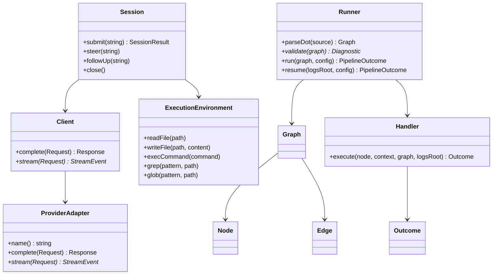
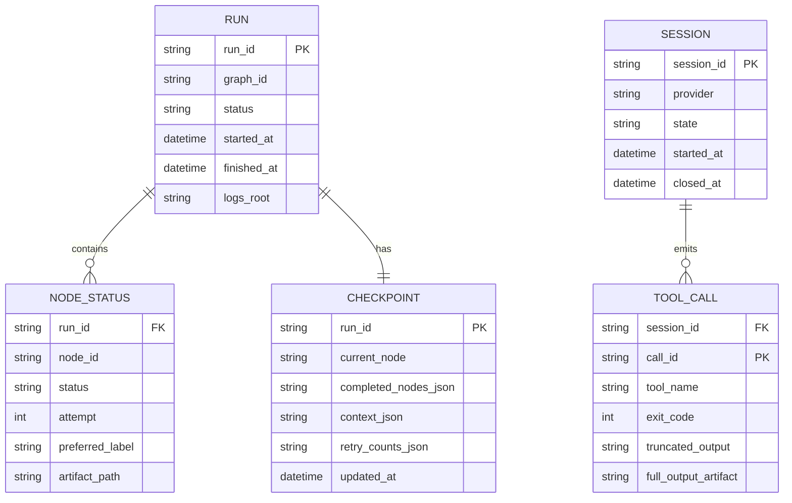
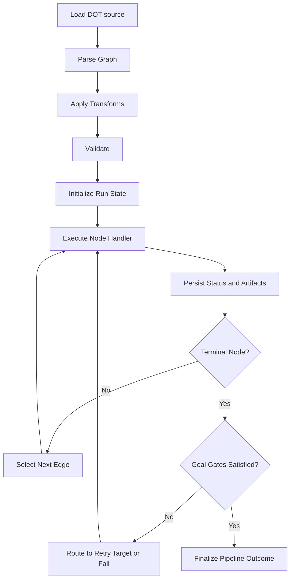
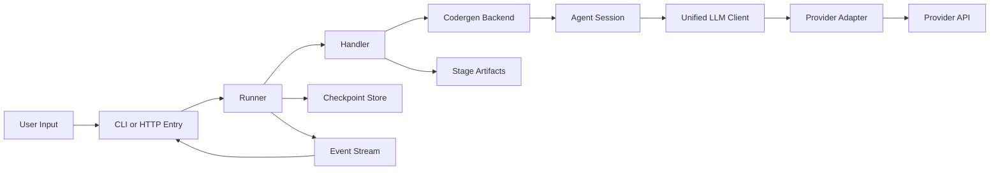
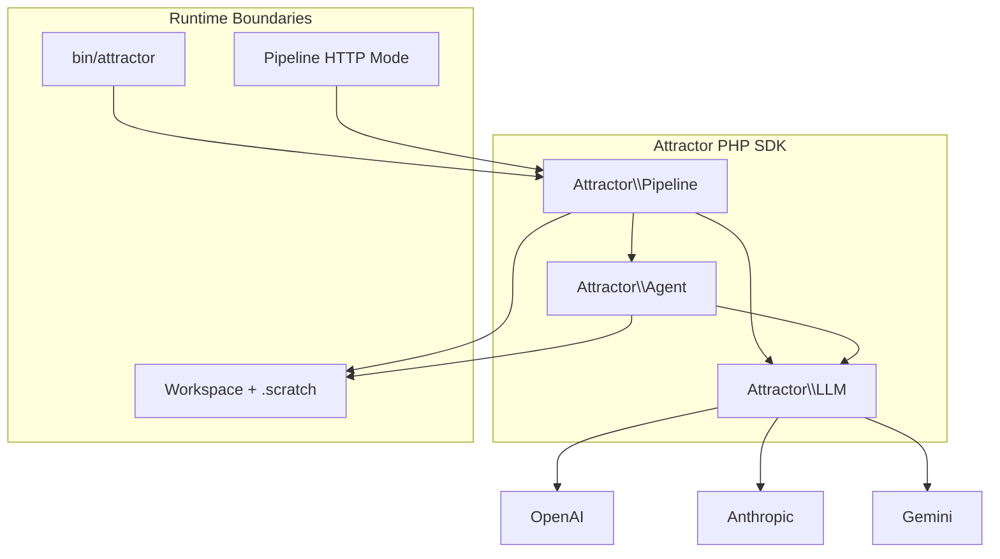

Legend: [ ] Incomplete, [X] Complete

# SPRINT-001 Comprehensive Implementation Plan

## Executive Summary
This plan converts `docs/sprints/SPRINT-001-attractor-php-nlspec-parity.md` into an implementation-first execution program.
It is phase-gated, test-driven, and evidence-driven across three product domains:
- Unified LLM client (`Attractor\\LLM`)
- Coding agent loop (`Attractor\\Agent`)
- Attractor pipeline runner (`Attractor\\Pipeline`)

## Review Summary From Source Sprint Document
- The source sprint document defines the right objective: full parity with `unified-llm-spec.md`, `coding-agent-loop-spec.md`, and `attractor-spec.md`.
- The source sprint document includes all major workstreams, but execution detail is distributed across very large sections and is hard to run as a day-to-day implementation checklist.
- The source sprint document includes completion state markers; this plan resets execution to an implementation checklist so teams can execute, verify, and close each work item with evidence.

## Scope
Implement full NLSpec parity for:
- `unified-llm-spec.md`
- `coding-agent-loop-spec.md`
- `attractor-spec.md`

## Non-Goals
- Expanding provider support beyond OpenAI, Anthropic, and Gemini for this sprint.
- Adding UI surfaces beyond required CLI and minimal HTTP mode.
- Defining follow-on sprint scope not required to close SPRINT-001.

## Evidence Contract
- Evidence root: `.scratch/verification/SPRINT-001/`
- Every checklist item must be closed only with commands, exit codes, artifacts, and reasoning.
- Evidence artifacts must be organized by `phase/<phase-id>/<subsystem>/...`.
- If an item is partially implemented, it remains `[ ]` until evidence proves acceptance criteria are met.

Standard verification placeholder for every checklist item:
```
{verification: pending; commands: ; exit_codes: ; artifacts: ; notes: }
```

## Phase Sequencing
1. Phase 0: Foundation and traceability
2. Phase 1: Unified LLM parity
3. Phase 2: Coding agent loop parity
4. Phase 3: Attractor runner parity
5. Phase 4: Cross-domain integration and release readiness
6. Phase 5: Closure audit and sprint finalization

## Phase 0 - Foundation and Traceability
### Deliverables
- [ ] P0-1 Build a requirement inventory mapping every NLSpec requirement to owner, target files, and deterministic tests.
```
{verification: pending; commands: ; exit_codes: ; artifacts: ; notes: }
```
- [ ] P0-2 Normalize local developer commands (`build`, `lint`, `test`, `test:unit`, `test:integration`, `test:e2e`, provider smoke) so execution is deterministic.
```
{verification: pending; commands: ; exit_codes: ; artifacts: ; notes: }
```
- [ ] P0-3 Standardize `.scratch/verification/SPRINT-001/` structure and add an evidence index with expected artifact names.
```
{verification: pending; commands: ; exit_codes: ; artifacts: ; notes: }
```
- [ ] P0-4 Define deterministic fixture conventions for provider requests, responses, and stream chunks.
```
{verification: pending; commands: ; exit_codes: ; artifacts: ; notes: }
```
- [ ] P0-5 Add reusable `.scratch` probes for parser behavior, checkpoint serialization, stream normalization, and tool execution edge cases.
```
{verification: pending; commands: ; exit_codes: ; artifacts: ; notes: }
```
- [ ] P0-6 Record architecture-impacting sequencing decisions in `docs/ADR.md` before Phase 1 coding begins.
```
{verification: pending; commands: ; exit_codes: ; artifacts: ; notes: }
```

### Positive Test Coverage
1. PT-P0-01: Requirement inventory can be traversed from spec item -> implementation path -> test path -> evidence path with no orphaned requirement.
2. PT-P0-02: Baseline build and deterministic tests run with no provider credentials.
3. PT-P0-03: Evidence index links to real files and every referenced artifact path exists.

### Negative Test Coverage
1. NT-P0-01: Missing mapping entries in requirement inventory fail the traceability audit.
2. NT-P0-02: Misnamed artifact paths in evidence index are detected by verification checks.
3. NT-P0-03: Fixture schema violations (malformed request/response fixture payload) fail fast in fixture loaders.

### Acceptance Criteria
- [ ] AC-P0-1 Every NLSpec requirement has at least one linked implementation task and one linked verification path.
```
{verification: pending; commands: ; exit_codes: ; artifacts: ; notes: }
```
- [ ] AC-P0-2 Deterministic local build/lint/test flows execute in a clean environment without provider credentials.
```
{verification: pending; commands: ; exit_codes: ; artifacts: ; notes: }
```
- [ ] AC-P0-3 Evidence artifacts are reproducible and discoverable by phase and subsystem.
```
{verification: pending; commands: ; exit_codes: ; artifacts: ; notes: }
```

## Phase 1 - Unified LLM Client Parity
### Deliverables
- [ ] P1-1 Finalize unified types (`Message`, `ContentPart`, `Request`, `Response`, `Usage`, `StreamEvent`) and error hierarchy.
```
{verification: pending; commands: ; exit_codes: ; artifacts: ; notes: }
```
- [ ] P1-2 Finalize `Client` provider routing, middleware ordering, and module-level default client lifecycle.
```
{verification: pending; commands: ; exit_codes: ; artifacts: ; notes: }
```
- [ ] P1-3 Complete OpenAI Responses adapter translation (request, response, stream event normalization).
```
{verification: pending; commands: ; exit_codes: ; artifacts: ; notes: }
```
- [ ] P1-4 Complete Anthropic Messages adapter translation, including strict message alternation and thinking block round-trip.
```
{verification: pending; commands: ; exit_codes: ; artifacts: ; notes: }
```
- [ ] P1-5 Complete Gemini adapter translation and synthetic tool-call ID mapping.
```
{verification: pending; commands: ; exit_codes: ; artifacts: ; notes: }
```
- [ ] P1-6 Implement high-level API (`generate`, `stream`, `generate_object`) including multi-step tool continuation and structured output validation.
```
{verification: pending; commands: ; exit_codes: ; artifacts: ; notes: }
```
- [ ] P1-7 Complete cross-provider parity matrix tests and env-gated provider smoke tests.
```
{verification: pending; commands: ; exit_codes: ; artifacts: ; notes: }
```

### Positive Test Coverage
1. PT-P1-01: Text generation succeeds for OpenAI, Anthropic, and Gemini with consistent normalized response structure.
2. PT-P1-02: Streaming emits start, delta, and finish events in normalized order; concatenated deltas equal final response text.
3. PT-P1-03: Tool loop executes active tools and returns passive tool calls without implicit execution.
4. PT-P1-04: Structured generation returns schema-validated object payload with typed accessors.
5. PT-P1-05: Multimodal payloads (text+image URL, text+image base64, local file image) translate correctly per provider.

### Negative Test Coverage
1. NT-P1-01: Providing both `prompt` and `messages` fails validation with explicit user-facing error type.
2. NT-P1-02: Unknown tool requested by model returns tool-error result payload instead of crashing.
3. NT-P1-03: Invalid generated JSON for `generate_object` raises parse/validation error with raw payload context.
4. NT-P1-04: Malformed stream chunk is surfaced as provider event while preserving stream integrity.
5. NT-P1-05: Unsupported multimodal part for a provider is rejected with explicit capability error.

### Acceptance Criteria
- [ ] AC-P1-1 Deterministic adapter translation and stream normalization tests pass for all three providers in fixture mode.
```
{verification: pending; commands: ; exit_codes: ; artifacts: ; notes: }
```
- [ ] AC-P1-2 Unified LLM parity matrix is fully implemented as runnable tests and passes in deterministic mode.
```
{verification: pending; commands: ; exit_codes: ; artifacts: ; notes: }
```
- [ ] AC-P1-3 Env-gated provider smoke tests pass when credentials are present.
```
{verification: pending; commands: ; exit_codes: ; artifacts: ; notes: }
```

## Phase 2 - Coding Agent Loop Parity
### Deliverables
- [ ] P2-1 Finalize `Session` lifecycle state machine, turn history model, and event emission ordering.
```
{verification: pending; commands: ; exit_codes: ; artifacts: ; notes: }
```
- [ ] P2-2 Finalize orchestration loop (`LLM call -> tool dispatch -> continuation -> natural completion`) with bounded rounds and turn limits.
```
{verification: pending; commands: ; exit_codes: ; artifacts: ; notes: }
```
- [ ] P2-3 Finalize provider profiles (OpenAI, Anthropic, Gemini) with provider-aligned tool definitions and prompt layering.
```
{verification: pending; commands: ; exit_codes: ; artifacts: ; notes: }
```
- [ ] P2-4 Finalize `ExecutionEnvironment` contract and `LocalExecutionEnvironment` filesystem/process behaviors including process group termination.
```
{verification: pending; commands: ; exit_codes: ; artifacts: ; notes: }
```
- [ ] P2-5 Finalize core tools (`read_file`, `write_file`, `edit_file`, `shell`, `grep`, `glob`) with schema-validated argument handling.
```
{verification: pending; commands: ; exit_codes: ; artifacts: ; notes: }
```
- [ ] P2-6 Finalize OpenAI-style `apply_patch` workflow and conflict/error reporting semantics.
```
{verification: pending; commands: ; exit_codes: ; artifacts: ; notes: }
```
- [ ] P2-7 Finalize output truncation behavior with explicit marker insertion and full-output retention in tool-end events.
```
{verification: pending; commands: ; exit_codes: ; artifacts: ; notes: }
```
- [ ] P2-8 Finalize steering (`steer`, `follow_up`), loop-pattern detection, and subagent tool family (`spawn_agent`, `send_input`, `wait`, `close_agent`).
```
{verification: pending; commands: ; exit_codes: ; artifacts: ; notes: }
```

### Positive Test Coverage
1. PT-P2-01: Single-input and multi-input sessions complete naturally with correct history and event ordering.
2. PT-P2-02: Tool dispatch executes provider-compatible tool schemas and returns modeled tool results.
3. PT-P2-03: Large-output tool execution preserves complete output in tool-end events while sending bounded output to model turn.
4. PT-P2-04: Steering inserted mid-execution changes subsequent model behavior without corrupting turn chronology.
5. PT-P2-05: Subagent lifecycle supports spawn, input, wait, and close with depth limits enforced.

### Negative Test Coverage
1. NT-P2-01: Unknown tool call returns structured error tool result instead of uncaught exception.
2. NT-P2-02: Invalid JSON tool arguments fail validation and are reported as tool errors.
3. NT-P2-03: Long-running shell process exceeds execution deadline and process group termination is verified.
4. NT-P2-04: Non-unique `edit_file` match without explicit override returns deterministic error.
5. NT-P2-05: Recursive subagent spawning beyond depth limit is blocked with explicit error result.

### Acceptance Criteria
- [ ] AC-P2-1 Coding-agent parity matrix passes deterministically with fake adapter profiles.
```
{verification: pending; commands: ; exit_codes: ; artifacts: ; notes: }
```
- [ ] AC-P2-2 Process execution control, truncation behavior, and event payload integrity are covered by deterministic tests.
```
{verification: pending; commands: ; exit_codes: ; artifacts: ; notes: }
```
- [ ] AC-P2-3 Provider-aligned prompt/tool behavior is validated through profile-specific test fixtures.
```
{verification: pending; commands: ; exit_codes: ; artifacts: ; notes: }
```

## Phase 3 - Attractor Pipeline Runner Parity
### Deliverables
- [ ] P3-1 Finalize DOT subset tokenizer/parser with comment stripping, multiline attributes, defaults, chained edges, and subgraph flattening.
```
{verification: pending; commands: ; exit_codes: ; artifacts: ; notes: }
```
- [ ] P3-2 Finalize graph model defaults and model stylesheet application with selector specificity.
```
{verification: pending; commands: ; exit_codes: ; artifacts: ; notes: }
```
- [ ] P3-3 Finalize validation and lint diagnostics including severity, node/edge targeting, and machine-readable rule IDs.
```
{verification: pending; commands: ; exit_codes: ; artifacts: ; notes: }
```
- [ ] P3-4 Finalize condition expression parser/evaluator and deterministic edge-selection priority rules.
```
{verification: pending; commands: ; exit_codes: ; artifacts: ; notes: }
```
- [ ] P3-5 Finalize runtime state (`Context`, `Outcome`, checkpoint, artifact store) with deterministic resume semantics.
```
{verification: pending; commands: ; exit_codes: ; artifacts: ; notes: }
```
- [ ] P3-6 Finalize handler registry and built-ins (`start`, `exit`, `codergen`, `wait.human`, `conditional`, `tool`, `parallel`, `parallel.fan_in`, `stack.manager_loop`).
```
{verification: pending; commands: ; exit_codes: ; artifacts: ; notes: }
```
- [ ] P3-7 Finalize observability event stream and tool hook invocation contracts.
```
{verification: pending; commands: ; exit_codes: ; artifacts: ; notes: }
```
- [ ] P3-8 Finalize minimal HTTP mode (`POST /run`, `GET /status`, `POST /answer`, SSE status stream) and run-state persistence.
```
{verification: pending; commands: ; exit_codes: ; artifacts: ; notes: }
```

### Positive Test Coverage
1. PT-P3-01: DOT parser accepts supported grammar including chained edges, defaults, and stylesheet references.
2. PT-P3-02: Linear and branching graphs execute correctly with deterministic edge-selection outcomes.
3. PT-P3-03: Goal-gated graph blocks terminal completion until goal nodes return success.
4. PT-P3-04: Checkpoint save/resume reproduces equivalent final outcome and stage artifacts.
5. PT-P3-05: Parallel fan-out and fan-in complete with supported join policies and deterministic winner selection rules.
6. PT-P3-06: HTTP mode run can pause on human gate and continue after answer submission.

### Negative Test Coverage
1. NT-P3-01: Missing start node or missing exit node produces validation error with rule IDs.
2. NT-P3-02: Edge references unknown node ID and fails validation.
3. NT-P3-03: Invalid condition expression fails parse and reports node/edge location.
4. NT-P3-04: Corrupt checkpoint payload is rejected with clear resume failure diagnostics.
5. NT-P3-05: Unsupported handler type fails fast with typed error and stage context.
6. NT-P3-06: HTTP answer submitted for unknown run ID returns explicit not-found error payload.

### Acceptance Criteria
- [ ] AC-P3-1 Attractor parity matrix passes deterministically using simulated codergen backend and automated interviewer.
```
{verification: pending; commands: ; exit_codes: ; artifacts: ; notes: }
```
- [ ] AC-P3-2 Checkpoint/resume and artifact persistence semantics are covered by deterministic integration tests.
```
{verification: pending; commands: ; exit_codes: ; artifacts: ; notes: }
```
- [ ] AC-P3-3 HTTP mode behavior is verified end-to-end for run, status, answer, and SSE streaming paths.
```
{verification: pending; commands: ; exit_codes: ; artifacts: ; notes: }
```

## Phase 4 - Cross-Domain Integration and Release Readiness
### Deliverables
- [ ] P4-1 Finalize `UnifiedLlmCodergenBackend` and `AgentLoopCodergenBackend` implementations and selection rules.
```
{verification: pending; commands: ; exit_codes: ; artifacts: ; notes: }
```
- [ ] P4-2 Add example pipelines for linear flow, conditional routing, human gates, parallel fan-out/fan-in, and manager loop workflows.
```
{verification: pending; commands: ; exit_codes: ; artifacts: ; notes: }
```
- [ ] P4-3 Finalize CLI commands and docs for parse, validate, run, resume, and HTTP mode flows.
```
{verification: pending; commands: ; exit_codes: ; artifacts: ; notes: }
```
- [ ] P4-4 Finalize traceability matrix linking every DoD item to implementation test(s) and evidence artifact(s).
```
{verification: pending; commands: ; exit_codes: ; artifacts: ; notes: }
```
- [ ] P4-5 Build deterministic cross-domain integration suite covering Unified LLM -> Agent -> Runner chains.
```
{verification: pending; commands: ; exit_codes: ; artifacts: ; notes: }
```
- [ ] P4-6 Execute env-gated provider smoke suite for OpenAI, Anthropic, and Gemini and archive output artifacts.
```
{verification: pending; commands: ; exit_codes: ; artifacts: ; notes: }
```

### Positive Test Coverage
1. PT-P4-01: Runner using Unified LLM backend executes a multi-node codergen pipeline to success.
2. PT-P4-02: Runner using Agent backend executes a tool-using codergen stage and persists stage artifacts.
3. PT-P4-03: CLI parse/validate/run/resume commands produce expected outputs for bundled example pipelines.
4. PT-P4-04: Deterministic integration suite passes with mock/fake adapters and no provider credentials.
5. PT-P4-05: Provider smoke suite passes for all configured providers when credentials are available.

### Negative Test Coverage
1. NT-P4-01: Missing provider credentials skip smoke suite with explicit skip reason and no false pass.
2. NT-P4-02: Invalid provider model id surfaces provider error and does not corrupt run-state persistence.
3. NT-P4-03: Broken example pipeline fixture fails parse/validate tests and blocks release readiness closure.
4. NT-P4-04: Mismatched traceability links (test path or artifact path missing) fail closure audit.

### Acceptance Criteria
- [ ] AC-P4-1 All deterministic suites pass via a single CI-safe command sequence.
```
{verification: pending; commands: ; exit_codes: ; artifacts: ; notes: }
```
- [ ] AC-P4-2 Env-gated provider smoke suite passes for all available provider credentials.
```
{verification: pending; commands: ; exit_codes: ; artifacts: ; notes: }
```
- [ ] AC-P4-3 Traceability matrix proves no uncovered DoD items remain.
```
{verification: pending; commands: ; exit_codes: ; artifacts: ; notes: }
```

## Phase 5 - Closure Audit and Sprint Finalization
### Deliverables
- [ ] P5-1 Reconcile source sprint checklist state with real implementation and evidence artifacts.
```
{verification: pending; commands: ; exit_codes: ; artifacts: ; notes: }
```
- [ ] P5-2 Run final regression pack and archive logs under `.scratch/verification/SPRINT-001/final/`.
```
{verification: pending; commands: ; exit_codes: ; artifacts: ; notes: }
```
- [ ] P5-3 Validate all appendix mermaid diagrams render and archive render outputs.
```
{verification: pending; commands: ; exit_codes: ; artifacts: ; notes: }
```
- [ ] P5-4 Produce sprint closure summary with unresolved risks, known limitations, and follow-on work items.
```
{verification: pending; commands: ; exit_codes: ; artifacts: ; notes: }
```

### Positive Test Coverage
1. PT-P5-01: Final regression pack reproduces deterministic pass status from clean workspace.
2. PT-P5-02: Evidence index references only existing files and includes command exit codes.
3. PT-P5-03: Mermaid render outputs are valid SVG files for all required diagrams.

### Negative Test Coverage
1. NT-P5-01: Any unresolved placeholder or missing evidence block fails closure audit.
2. NT-P5-02: Any checklist item marked `[X]` without command/exit/artifact evidence fails closure audit.
3. NT-P5-03: Any diagram render failure blocks sprint closure.

### Acceptance Criteria
- [ ] AC-P5-1 Sprint checklists reflect real implementation status with evidence-backed completion markers.
```
{verification: pending; commands: ; exit_codes: ; artifacts: ; notes: }
```
- [ ] AC-P5-2 Final regression and smoke evidence bundles are complete, reproducible, and indexed.
```
{verification: pending; commands: ; exit_codes: ; artifacts: ; notes: }
```
- [ ] AC-P5-3 Closure report is published with explicit residual risk register and follow-on scope.
```
{verification: pending; commands: ; exit_codes: ; artifacts: ; notes: }
```

## Detailed Cross-Provider and Cross-Feature Test Matrix

### Unified LLM Matrix
1. Simple generation (`text` only) across OpenAI, Anthropic, Gemini.
2. Streamed generation event ordering and response reconstruction.
3. Tool loop with one tool call and multi-tool parallel call set.
4. Structured generation with schema validation.
5. Multimodal input translation (URL image, base64 image, file image).
6. Provider options pass-through semantics.

### Coding Agent Loop Matrix
1. File read/edit/write workflow in one session.
2. Command execution with captured output and non-zero exit handling.
3. Grep/glob discovery workflow on multi-file workspace.
4. Truncation marker correctness plus full-output retention in tool-end events.
5. Steering/follow-up sequencing across active session rounds.
6. Subagent task delegation and parent-child result handoff.

### Attractor Runner Matrix
1. DOT parse and validate for linear, branching, and stylesheet graphs.
2. Goal-gated branch behavior with success and failure paths.
3. Deterministic edge selection with condition, label, weight, lexical tie-breakers.
4. Checkpoint save/resume equivalence for multi-node runs.
5. Parallel/fan-in policy behavior across join-policy permutations.
6. HTTP run/status/answer/SSE lifecycle behavior.

### End-to-End Matrix
1. Unified LLM backend inside codergen handler in multi-stage pipeline.
2. Agent backend inside codergen handler with tool-based code change.
3. Example pipeline pack execution from CLI parse to final artifacts.
4. Provider smoke execution for all configured providers.

## Risks and Mitigations
- Provider API drift risk: isolate provider-specific translation logic and lock deterministic fixtures to normalized contracts.
- Cross-layer contract drift risk: require traceability matrix checks in each phase gate.
- Resume fidelity risk: run checkpoint equivalence tests on each runner release candidate.
- Evidence drift risk: closure audit blocks completion markers without command/exit/artifact evidence.

## Appendix A - Core Domain Models


## Appendix B - E-R Diagram


## Appendix C - Workflow Diagram


## Appendix D - Data-Flow Diagram


## Appendix E - Architecture Diagram

