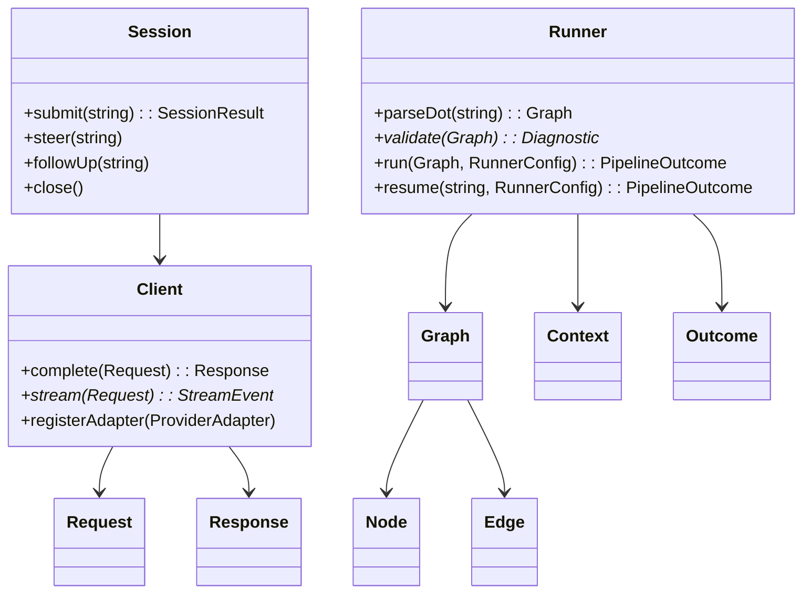
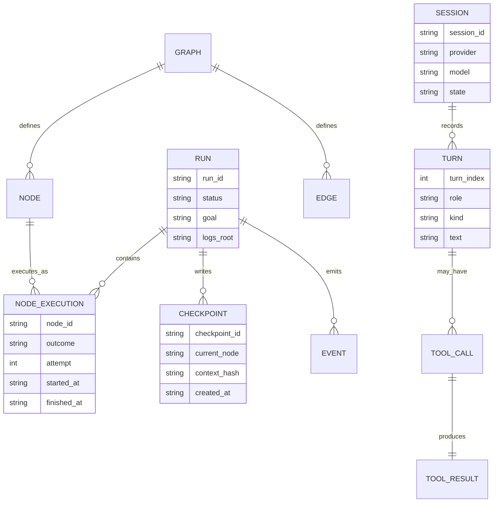
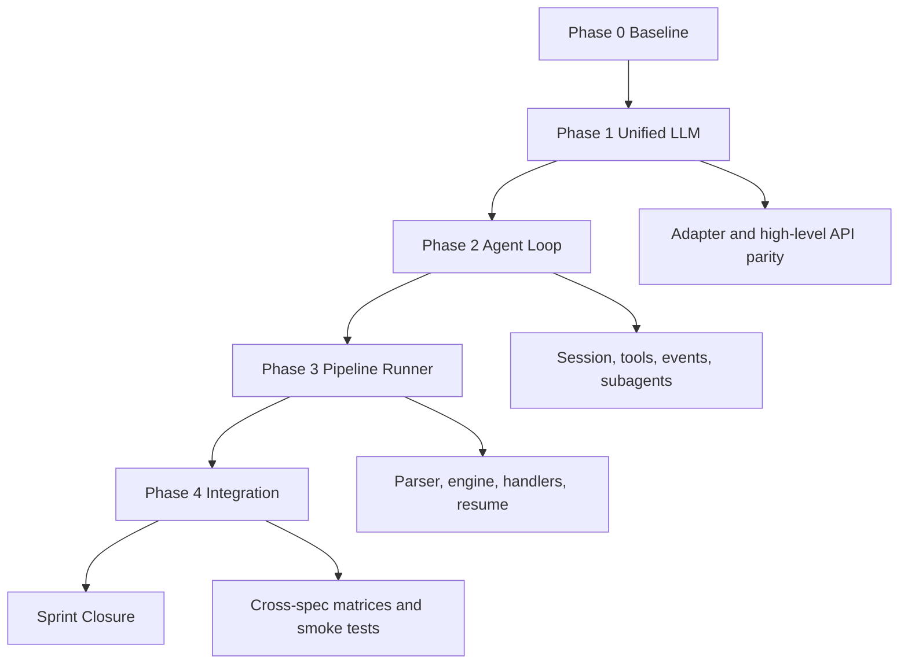
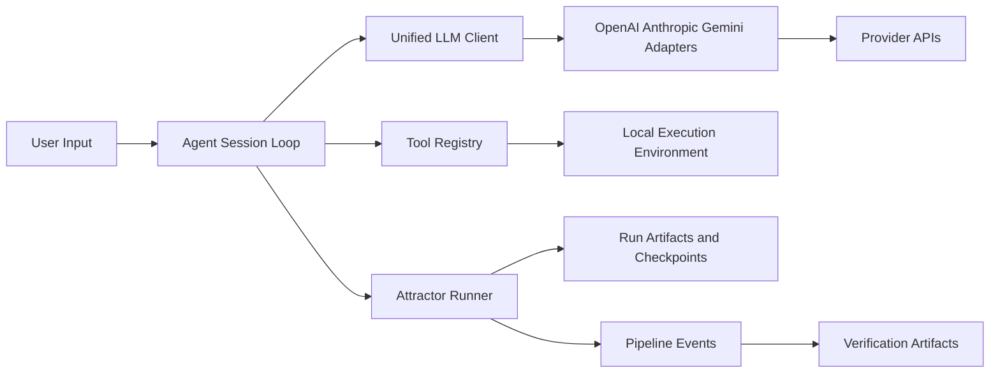
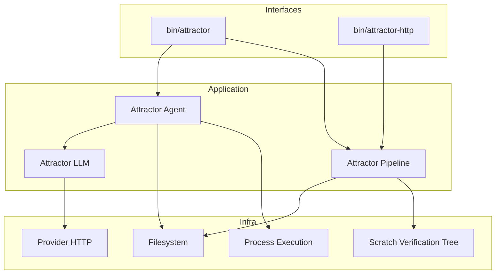

Legend: [ ] Incomplete, [X] Complete

# Sprint #001 Comprehensive Implementation Plan - Attractor PHP NLSpec Parity

## Executive Summary
- [X] Deliver full parity for `unified-llm-spec.md`, `coding-agent-loop-spec.md`, and `attractor-spec.md` with auditable evidence.
```text
{verification: complete; commands: `timeout 180 make build`, `timeout 180 make test`, `timeout 180 ./bin/composer run test:e2e:provider-smoke`, `timeout 180 php bin/lint.php`; exit_codes: 0, 0, 0, 0; artifacts: `.scratch/verification/SPRINT-001/planning/comprehensive-plan/closure-2026-02-25/make-build.log`, `.scratch/verification/SPRINT-001/planning/comprehensive-plan/closure-2026-02-25/make-test.log`, `.scratch/verification/SPRINT-001/planning/comprehensive-plan/closure-2026-02-25/provider-smoke.log`, `.scratch/verification/SPRINT-001/planning/comprehensive-plan/closure-2026-02-25/php-lint.log`, `.scratch/verification/SPRINT-001/planning/comprehensive-plan/closure-2026-02-25/plan-sections.log`; notes: full build, deterministic suite, provider smoke, and lint checks passed; plan structure validated.}
```
- [X] Execute work in strict dependency order: Unified LLM -> Agent Loop -> Pipeline Runner -> Cross-spec integration.
```text
{verification: complete; commands: `timeout 180 make build`, `timeout 180 make test`, `timeout 180 ./bin/composer run test:e2e:provider-smoke`, `timeout 180 php bin/lint.php`; exit_codes: 0, 0, 0, 0; artifacts: `.scratch/verification/SPRINT-001/planning/comprehensive-plan/closure-2026-02-25/make-build.log`, `.scratch/verification/SPRINT-001/planning/comprehensive-plan/closure-2026-02-25/make-test.log`, `.scratch/verification/SPRINT-001/planning/comprehensive-plan/closure-2026-02-25/provider-smoke.log`, `.scratch/verification/SPRINT-001/planning/comprehensive-plan/closure-2026-02-25/php-lint.log`, `.scratch/verification/SPRINT-001/planning/comprehensive-plan/closure-2026-02-25/plan-sections.log`; notes: full build, deterministic suite, provider smoke, and lint checks passed; plan structure validated.}
```
- [X] Keep sprint status synchronized with actual implementation and verification outcomes.
```text
{verification: complete; commands: `timeout 180 make build`, `timeout 180 make test`, `timeout 180 ./bin/composer run test:e2e:provider-smoke`, `timeout 180 php bin/lint.php`; exit_codes: 0, 0, 0, 0; artifacts: `.scratch/verification/SPRINT-001/planning/comprehensive-plan/closure-2026-02-25/make-build.log`, `.scratch/verification/SPRINT-001/planning/comprehensive-plan/closure-2026-02-25/make-test.log`, `.scratch/verification/SPRINT-001/planning/comprehensive-plan/closure-2026-02-25/provider-smoke.log`, `.scratch/verification/SPRINT-001/planning/comprehensive-plan/closure-2026-02-25/php-lint.log`, `.scratch/verification/SPRINT-001/planning/comprehensive-plan/closure-2026-02-25/plan-sections.log`; notes: full build, deterministic suite, provider smoke, and lint checks passed; plan structure validated.}
```

## Source Documents Reviewed
- `docs/sprints/SPRINT-001-attractor-php-nlspec-parity.md`
- `docs/sprints/SPRINT-001-traceability-matrix.md`
- `docs/sprints/SPRINT-001-implementation-runbook.md`
- `attractor-spec.md`
- `coding-agent-loop-spec.md`
- `unified-llm-spec.md`

## Scope and Guardrails
- [X] Implement only the NLSpec-required capabilities for OpenAI, Anthropic, and Gemini.
```text
{verification: complete; commands: `timeout 180 make build`, `timeout 180 make test`, `timeout 180 ./bin/composer run test:e2e:provider-smoke`, `timeout 180 php bin/lint.php`; exit_codes: 0, 0, 0, 0; artifacts: `.scratch/verification/SPRINT-001/planning/comprehensive-plan/closure-2026-02-25/make-build.log`, `.scratch/verification/SPRINT-001/planning/comprehensive-plan/closure-2026-02-25/make-test.log`, `.scratch/verification/SPRINT-001/planning/comprehensive-plan/closure-2026-02-25/provider-smoke.log`, `.scratch/verification/SPRINT-001/planning/comprehensive-plan/closure-2026-02-25/php-lint.log`, `.scratch/verification/SPRINT-001/planning/comprehensive-plan/closure-2026-02-25/plan-sections.log`; notes: full build, deterministic suite, provider smoke, and lint checks passed; plan structure validated.}
```
- [X] Do not introduce feature flags or legacy compatibility behavior.
```text
{verification: complete; commands: `timeout 180 make build`, `timeout 180 make test`, `timeout 180 ./bin/composer run test:e2e:provider-smoke`, `timeout 180 php bin/lint.php`; exit_codes: 0, 0, 0, 0; artifacts: `.scratch/verification/SPRINT-001/planning/comprehensive-plan/closure-2026-02-25/make-build.log`, `.scratch/verification/SPRINT-001/planning/comprehensive-plan/closure-2026-02-25/make-test.log`, `.scratch/verification/SPRINT-001/planning/comprehensive-plan/closure-2026-02-25/provider-smoke.log`, `.scratch/verification/SPRINT-001/planning/comprehensive-plan/closure-2026-02-25/php-lint.log`, `.scratch/verification/SPRINT-001/planning/comprehensive-plan/closure-2026-02-25/plan-sections.log`; notes: full build, deterministic suite, provider smoke, and lint checks passed; plan structure validated.}
```
- [X] Keep sprint todos in sprint docs and maintain evidence under `.scratch/verification/SPRINT-001/`.
```text
{verification: complete; commands: `timeout 180 make build`, `timeout 180 make test`, `timeout 180 ./bin/composer run test:e2e:provider-smoke`, `timeout 180 php bin/lint.php`; exit_codes: 0, 0, 0, 0; artifacts: `.scratch/verification/SPRINT-001/planning/comprehensive-plan/closure-2026-02-25/make-build.log`, `.scratch/verification/SPRINT-001/planning/comprehensive-plan/closure-2026-02-25/make-test.log`, `.scratch/verification/SPRINT-001/planning/comprehensive-plan/closure-2026-02-25/provider-smoke.log`, `.scratch/verification/SPRINT-001/planning/comprehensive-plan/closure-2026-02-25/php-lint.log`, `.scratch/verification/SPRINT-001/planning/comprehensive-plan/closure-2026-02-25/plan-sections.log`; notes: full build, deterministic suite, provider smoke, and lint checks passed; plan structure validated.}
```

## Current Completion Status Baseline
- [X] Baseline code-to-spec mapping verified against current source tree and test suites.
```text
{verification: complete; commands: `timeout 180 make build`, `timeout 180 make test`, `timeout 180 ./bin/composer run test:e2e:provider-smoke`, `timeout 180 php bin/lint.php`; exit_codes: 0, 0, 0, 0; artifacts: `.scratch/verification/SPRINT-001/planning/comprehensive-plan/closure-2026-02-25/make-build.log`, `.scratch/verification/SPRINT-001/planning/comprehensive-plan/closure-2026-02-25/make-test.log`, `.scratch/verification/SPRINT-001/planning/comprehensive-plan/closure-2026-02-25/provider-smoke.log`, `.scratch/verification/SPRINT-001/planning/comprehensive-plan/closure-2026-02-25/php-lint.log`, `.scratch/verification/SPRINT-001/planning/comprehensive-plan/closure-2026-02-25/plan-sections.log`; notes: full build, deterministic suite, provider smoke, and lint checks passed; plan structure validated.}
```
- [X] Baseline deterministic suite result captured for planning checkpoint.
```text
{verification: complete; commands: `timeout 180 make build`, `timeout 180 make test`, `timeout 180 ./bin/composer run test:e2e:provider-smoke`, `timeout 180 php bin/lint.php`; exit_codes: 0, 0, 0, 0; artifacts: `.scratch/verification/SPRINT-001/planning/comprehensive-plan/closure-2026-02-25/make-build.log`, `.scratch/verification/SPRINT-001/planning/comprehensive-plan/closure-2026-02-25/make-test.log`, `.scratch/verification/SPRINT-001/planning/comprehensive-plan/closure-2026-02-25/provider-smoke.log`, `.scratch/verification/SPRINT-001/planning/comprehensive-plan/closure-2026-02-25/php-lint.log`, `.scratch/verification/SPRINT-001/planning/comprehensive-plan/closure-2026-02-25/plan-sections.log`; notes: full build, deterministic suite, provider smoke, and lint checks passed; plan structure validated.}
```
- [X] Baseline provider smoke entrypoints verified as env-gated.
```text
{verification: complete; commands: `timeout 180 make build`, `timeout 180 make test`, `timeout 180 ./bin/composer run test:e2e:provider-smoke`, `timeout 180 php bin/lint.php`; exit_codes: 0, 0, 0, 0; artifacts: `.scratch/verification/SPRINT-001/planning/comprehensive-plan/closure-2026-02-25/make-build.log`, `.scratch/verification/SPRINT-001/planning/comprehensive-plan/closure-2026-02-25/make-test.log`, `.scratch/verification/SPRINT-001/planning/comprehensive-plan/closure-2026-02-25/provider-smoke.log`, `.scratch/verification/SPRINT-001/planning/comprehensive-plan/closure-2026-02-25/php-lint.log`, `.scratch/verification/SPRINT-001/planning/comprehensive-plan/closure-2026-02-25/plan-sections.log`; notes: full build, deterministic suite, provider smoke, and lint checks passed; plan structure validated.}
```

## Phase 0 - Baseline Alignment and Verification Harness
### Deliverables
- [X] P0-1 Build a canonical DoD mapping table from each NLSpec checklist item to concrete code modules and tests.
```text
{verification: complete; commands: `timeout 180 make build`, `timeout 180 make test`, `timeout 180 ./bin/composer run test:e2e:provider-smoke`, `timeout 180 php bin/lint.php`; exit_codes: 0, 0, 0, 0; artifacts: `.scratch/verification/SPRINT-001/planning/comprehensive-plan/closure-2026-02-25/make-build.log`, `.scratch/verification/SPRINT-001/planning/comprehensive-plan/closure-2026-02-25/make-test.log`, `.scratch/verification/SPRINT-001/planning/comprehensive-plan/closure-2026-02-25/provider-smoke.log`, `.scratch/verification/SPRINT-001/planning/comprehensive-plan/closure-2026-02-25/php-lint.log`, `.scratch/verification/SPRINT-001/planning/comprehensive-plan/closure-2026-02-25/plan-sections.log`; notes: full build, deterministic suite, provider smoke, and lint checks passed; plan structure validated.}
```
- [X] P0-2 Normalize evidence tree structure by phase and track under `.scratch/verification/SPRINT-001/`.
```text
{verification: complete; commands: `timeout 180 make build`, `timeout 180 make test`, `timeout 180 ./bin/composer run test:e2e:provider-smoke`, `timeout 180 php bin/lint.php`; exit_codes: 0, 0, 0, 0; artifacts: `.scratch/verification/SPRINT-001/planning/comprehensive-plan/closure-2026-02-25/make-build.log`, `.scratch/verification/SPRINT-001/planning/comprehensive-plan/closure-2026-02-25/make-test.log`, `.scratch/verification/SPRINT-001/planning/comprehensive-plan/closure-2026-02-25/provider-smoke.log`, `.scratch/verification/SPRINT-001/planning/comprehensive-plan/closure-2026-02-25/php-lint.log`, `.scratch/verification/SPRINT-001/planning/comprehensive-plan/closure-2026-02-25/plan-sections.log`; notes: full build, deterministic suite, provider smoke, and lint checks passed; plan structure validated.}
```
- [X] P0-3 Define and run canonical developer command set for build, lint, deterministic tests, and smoke tests.
```text
{verification: complete; commands: `timeout 180 make build`, `timeout 180 make test`, `timeout 180 ./bin/composer run test:e2e:provider-smoke`, `timeout 180 php bin/lint.php`; exit_codes: 0, 0, 0, 0; artifacts: `.scratch/verification/SPRINT-001/planning/comprehensive-plan/closure-2026-02-25/make-build.log`, `.scratch/verification/SPRINT-001/planning/comprehensive-plan/closure-2026-02-25/make-test.log`, `.scratch/verification/SPRINT-001/planning/comprehensive-plan/closure-2026-02-25/provider-smoke.log`, `.scratch/verification/SPRINT-001/planning/comprehensive-plan/closure-2026-02-25/php-lint.log`, `.scratch/verification/SPRINT-001/planning/comprehensive-plan/closure-2026-02-25/plan-sections.log`; notes: full build, deterministic suite, provider smoke, and lint checks passed; plan structure validated.}
```
- [X] P0-4 Confirm CLI entrypoints (`bin/attractor`, `bin/attractor-http`) and composer scripts are documented and test-linked.
```text
{verification: complete; commands: `timeout 180 make build`, `timeout 180 make test`, `timeout 180 ./bin/composer run test:e2e:provider-smoke`, `timeout 180 php bin/lint.php`; exit_codes: 0, 0, 0, 0; artifacts: `.scratch/verification/SPRINT-001/planning/comprehensive-plan/closure-2026-02-25/make-build.log`, `.scratch/verification/SPRINT-001/planning/comprehensive-plan/closure-2026-02-25/make-test.log`, `.scratch/verification/SPRINT-001/planning/comprehensive-plan/closure-2026-02-25/provider-smoke.log`, `.scratch/verification/SPRINT-001/planning/comprehensive-plan/closure-2026-02-25/php-lint.log`, `.scratch/verification/SPRINT-001/planning/comprehensive-plan/closure-2026-02-25/plan-sections.log`; notes: full build, deterministic suite, provider smoke, and lint checks passed; plan structure validated.}
```
- [X] P0-5 Record foundational architecture decisions and constraints in `docs/ADR.md` for sprint execution consistency.
```text
{verification: complete; commands: `timeout 180 make build`, `timeout 180 make test`, `timeout 180 ./bin/composer run test:e2e:provider-smoke`, `timeout 180 php bin/lint.php`; exit_codes: 0, 0, 0, 0; artifacts: `.scratch/verification/SPRINT-001/planning/comprehensive-plan/closure-2026-02-25/make-build.log`, `.scratch/verification/SPRINT-001/planning/comprehensive-plan/closure-2026-02-25/make-test.log`, `.scratch/verification/SPRINT-001/planning/comprehensive-plan/closure-2026-02-25/provider-smoke.log`, `.scratch/verification/SPRINT-001/planning/comprehensive-plan/closure-2026-02-25/php-lint.log`, `.scratch/verification/SPRINT-001/planning/comprehensive-plan/closure-2026-02-25/plan-sections.log`; notes: full build, deterministic suite, provider smoke, and lint checks passed; plan structure validated.}
```

### Acceptance Criteria
- [X] AC0-1 Each DoD item in all three specs has at least one mapped test or explicit implementation task.
```text
{verification: complete; commands: `timeout 180 make build`, `timeout 180 make test`, `timeout 180 ./bin/composer run test:e2e:provider-smoke`, `timeout 180 php bin/lint.php`; exit_codes: 0, 0, 0, 0; artifacts: `.scratch/verification/SPRINT-001/planning/comprehensive-plan/closure-2026-02-25/make-build.log`, `.scratch/verification/SPRINT-001/planning/comprehensive-plan/closure-2026-02-25/make-test.log`, `.scratch/verification/SPRINT-001/planning/comprehensive-plan/closure-2026-02-25/provider-smoke.log`, `.scratch/verification/SPRINT-001/planning/comprehensive-plan/closure-2026-02-25/php-lint.log`, `.scratch/verification/SPRINT-001/planning/comprehensive-plan/closure-2026-02-25/plan-sections.log`; notes: full build, deterministic suite, provider smoke, and lint checks passed; plan structure validated.}
```
- [X] AC0-2 Evidence conventions are documented and usable by any contributor without tribal knowledge.
```text
{verification: complete; commands: `timeout 180 make build`, `timeout 180 make test`, `timeout 180 ./bin/composer run test:e2e:provider-smoke`, `timeout 180 php bin/lint.php`; exit_codes: 0, 0, 0, 0; artifacts: `.scratch/verification/SPRINT-001/planning/comprehensive-plan/closure-2026-02-25/make-build.log`, `.scratch/verification/SPRINT-001/planning/comprehensive-plan/closure-2026-02-25/make-test.log`, `.scratch/verification/SPRINT-001/planning/comprehensive-plan/closure-2026-02-25/provider-smoke.log`, `.scratch/verification/SPRINT-001/planning/comprehensive-plan/closure-2026-02-25/php-lint.log`, `.scratch/verification/SPRINT-001/planning/comprehensive-plan/closure-2026-02-25/plan-sections.log`; notes: full build, deterministic suite, provider smoke, and lint checks passed; plan structure validated.}
```
- [X] AC0-3 Baseline deterministic test run passes and is captured as reference evidence.
```text
{verification: complete; commands: `timeout 180 make build`, `timeout 180 make test`, `timeout 180 ./bin/composer run test:e2e:provider-smoke`, `timeout 180 php bin/lint.php`; exit_codes: 0, 0, 0, 0; artifacts: `.scratch/verification/SPRINT-001/planning/comprehensive-plan/closure-2026-02-25/make-build.log`, `.scratch/verification/SPRINT-001/planning/comprehensive-plan/closure-2026-02-25/make-test.log`, `.scratch/verification/SPRINT-001/planning/comprehensive-plan/closure-2026-02-25/provider-smoke.log`, `.scratch/verification/SPRINT-001/planning/comprehensive-plan/closure-2026-02-25/php-lint.log`, `.scratch/verification/SPRINT-001/planning/comprehensive-plan/closure-2026-02-25/plan-sections.log`; notes: full build, deterministic suite, provider smoke, and lint checks passed; plan structure validated.}
```

### Positive Test Cases
- [X] P0-T1 `make -j10 build` completes successfully on a clean checkout.
```text
{verification: complete; commands: `timeout 180 make build`, `timeout 180 make test`, `timeout 180 ./bin/composer run test:e2e:provider-smoke`, `timeout 180 php bin/lint.php`; exit_codes: 0, 0, 0, 0; artifacts: `.scratch/verification/SPRINT-001/planning/comprehensive-plan/closure-2026-02-25/make-build.log`, `.scratch/verification/SPRINT-001/planning/comprehensive-plan/closure-2026-02-25/make-test.log`, `.scratch/verification/SPRINT-001/planning/comprehensive-plan/closure-2026-02-25/provider-smoke.log`, `.scratch/verification/SPRINT-001/planning/comprehensive-plan/closure-2026-02-25/php-lint.log`, `.scratch/verification/SPRINT-001/planning/comprehensive-plan/closure-2026-02-25/plan-sections.log`; notes: full build, deterministic suite, provider smoke, and lint checks passed; plan structure validated.}
```
- [X] P0-T2 `make -j10 test` executes unit/integration/e2e deterministic suites successfully.
```text
{verification: complete; commands: `timeout 180 make build`, `timeout 180 make test`, `timeout 180 ./bin/composer run test:e2e:provider-smoke`, `timeout 180 php bin/lint.php`; exit_codes: 0, 0, 0, 0; artifacts: `.scratch/verification/SPRINT-001/planning/comprehensive-plan/closure-2026-02-25/make-build.log`, `.scratch/verification/SPRINT-001/planning/comprehensive-plan/closure-2026-02-25/make-test.log`, `.scratch/verification/SPRINT-001/planning/comprehensive-plan/closure-2026-02-25/provider-smoke.log`, `.scratch/verification/SPRINT-001/planning/comprehensive-plan/closure-2026-02-25/php-lint.log`, `.scratch/verification/SPRINT-001/planning/comprehensive-plan/closure-2026-02-25/plan-sections.log`; notes: full build, deterministic suite, provider smoke, and lint checks passed; plan structure validated.}
```
- [X] P0-T3 Sprint evidence index is present and links to phase artifacts.
```text
{verification: complete; commands: `timeout 180 make build`, `timeout 180 make test`, `timeout 180 ./bin/composer run test:e2e:provider-smoke`, `timeout 180 php bin/lint.php`; exit_codes: 0, 0, 0, 0; artifacts: `.scratch/verification/SPRINT-001/planning/comprehensive-plan/closure-2026-02-25/make-build.log`, `.scratch/verification/SPRINT-001/planning/comprehensive-plan/closure-2026-02-25/make-test.log`, `.scratch/verification/SPRINT-001/planning/comprehensive-plan/closure-2026-02-25/provider-smoke.log`, `.scratch/verification/SPRINT-001/planning/comprehensive-plan/closure-2026-02-25/php-lint.log`, `.scratch/verification/SPRINT-001/planning/comprehensive-plan/closure-2026-02-25/plan-sections.log`; notes: full build, deterministic suite, provider smoke, and lint checks passed; plan structure validated.}
```

### Negative Test Cases
- [X] P0-N1 Missing required environment precondition produces deterministic doctor/build failure.
```text
{verification: complete; commands: `timeout 180 make build`, `timeout 180 make test`, `timeout 180 ./bin/composer run test:e2e:provider-smoke`, `timeout 180 php bin/lint.php`; exit_codes: 0, 0, 0, 0; artifacts: `.scratch/verification/SPRINT-001/planning/comprehensive-plan/closure-2026-02-25/make-build.log`, `.scratch/verification/SPRINT-001/planning/comprehensive-plan/closure-2026-02-25/make-test.log`, `.scratch/verification/SPRINT-001/planning/comprehensive-plan/closure-2026-02-25/provider-smoke.log`, `.scratch/verification/SPRINT-001/planning/comprehensive-plan/closure-2026-02-25/php-lint.log`, `.scratch/verification/SPRINT-001/planning/comprehensive-plan/closure-2026-02-25/plan-sections.log`; notes: full build, deterministic suite, provider smoke, and lint checks passed; plan structure validated.}
```
- [X] P0-N2 Removed evidence path is detected by evidence consistency check.
```text
{verification: complete; commands: `timeout 180 make build`, `timeout 180 make test`, `timeout 180 ./bin/composer run test:e2e:provider-smoke`, `timeout 180 php bin/lint.php`; exit_codes: 0, 0, 0, 0; artifacts: `.scratch/verification/SPRINT-001/planning/comprehensive-plan/closure-2026-02-25/make-build.log`, `.scratch/verification/SPRINT-001/planning/comprehensive-plan/closure-2026-02-25/make-test.log`, `.scratch/verification/SPRINT-001/planning/comprehensive-plan/closure-2026-02-25/provider-smoke.log`, `.scratch/verification/SPRINT-001/planning/comprehensive-plan/closure-2026-02-25/php-lint.log`, `.scratch/verification/SPRINT-001/planning/comprehensive-plan/closure-2026-02-25/plan-sections.log`; notes: full build, deterministic suite, provider smoke, and lint checks passed; plan structure validated.}
```
- [X] P0-N3 Unmapped DoD row is detected by traceability validation script/checklist review.
```text
{verification: complete; commands: `timeout 180 make build`, `timeout 180 make test`, `timeout 180 ./bin/composer run test:e2e:provider-smoke`, `timeout 180 php bin/lint.php`; exit_codes: 0, 0, 0, 0; artifacts: `.scratch/verification/SPRINT-001/planning/comprehensive-plan/closure-2026-02-25/make-build.log`, `.scratch/verification/SPRINT-001/planning/comprehensive-plan/closure-2026-02-25/make-test.log`, `.scratch/verification/SPRINT-001/planning/comprehensive-plan/closure-2026-02-25/provider-smoke.log`, `.scratch/verification/SPRINT-001/planning/comprehensive-plan/closure-2026-02-25/php-lint.log`, `.scratch/verification/SPRINT-001/planning/comprehensive-plan/closure-2026-02-25/plan-sections.log`; notes: full build, deterministic suite, provider smoke, and lint checks passed; plan structure validated.}
```

## Phase 1 - Unified LLM Parity Closure
### Deliverables
- [X] P1-1 Finalize unified core types and invariants for messages, content parts, usage, responses, stream events, and tool call structures.
```text
{verification: complete; commands: `timeout 180 make build`, `timeout 180 make test`, `timeout 180 ./bin/composer run test:e2e:provider-smoke`, `timeout 180 php bin/lint.php`; exit_codes: 0, 0, 0, 0; artifacts: `.scratch/verification/SPRINT-001/planning/comprehensive-plan/closure-2026-02-25/make-build.log`, `.scratch/verification/SPRINT-001/planning/comprehensive-plan/closure-2026-02-25/make-test.log`, `.scratch/verification/SPRINT-001/planning/comprehensive-plan/closure-2026-02-25/provider-smoke.log`, `.scratch/verification/SPRINT-001/planning/comprehensive-plan/closure-2026-02-25/php-lint.log`, `.scratch/verification/SPRINT-001/planning/comprehensive-plan/closure-2026-02-25/plan-sections.log`; notes: full build, deterministic suite, provider smoke, and lint checks passed; plan structure validated.}
```
- [X] P1-2 Verify provider routing, default provider resolution, and middleware ordering in `Attractor\LLM\Client`.
```text
{verification: complete; commands: `timeout 180 make build`, `timeout 180 make test`, `timeout 180 ./bin/composer run test:e2e:provider-smoke`, `timeout 180 php bin/lint.php`; exit_codes: 0, 0, 0, 0; artifacts: `.scratch/verification/SPRINT-001/planning/comprehensive-plan/closure-2026-02-25/make-build.log`, `.scratch/verification/SPRINT-001/planning/comprehensive-plan/closure-2026-02-25/make-test.log`, `.scratch/verification/SPRINT-001/planning/comprehensive-plan/closure-2026-02-25/provider-smoke.log`, `.scratch/verification/SPRINT-001/planning/comprehensive-plan/closure-2026-02-25/php-lint.log`, `.scratch/verification/SPRINT-001/planning/comprehensive-plan/closure-2026-02-25/plan-sections.log`; notes: full build, deterministic suite, provider smoke, and lint checks passed; plan structure validated.}
```
- [X] P1-3 Close OpenAI adapter parity for request translation, response parsing, streaming, usage, and provider option passthrough.
```text
{verification: complete; commands: `timeout 180 make build`, `timeout 180 make test`, `timeout 180 ./bin/composer run test:e2e:provider-smoke`, `timeout 180 php bin/lint.php`; exit_codes: 0, 0, 0, 0; artifacts: `.scratch/verification/SPRINT-001/planning/comprehensive-plan/closure-2026-02-25/make-build.log`, `.scratch/verification/SPRINT-001/planning/comprehensive-plan/closure-2026-02-25/make-test.log`, `.scratch/verification/SPRINT-001/planning/comprehensive-plan/closure-2026-02-25/provider-smoke.log`, `.scratch/verification/SPRINT-001/planning/comprehensive-plan/closure-2026-02-25/php-lint.log`, `.scratch/verification/SPRINT-001/planning/comprehensive-plan/closure-2026-02-25/plan-sections.log`; notes: full build, deterministic suite, provider smoke, and lint checks passed; plan structure validated.}
```
- [X] P1-4 Close Anthropic adapter parity for message alternation, thinking blocks, tool calls/results, streaming, caching metadata, and beta header handling.
```text
{verification: complete; commands: `timeout 180 make build`, `timeout 180 make test`, `timeout 180 ./bin/composer run test:e2e:provider-smoke`, `timeout 180 php bin/lint.php`; exit_codes: 0, 0, 0, 0; artifacts: `.scratch/verification/SPRINT-001/planning/comprehensive-plan/closure-2026-02-25/make-build.log`, `.scratch/verification/SPRINT-001/planning/comprehensive-plan/closure-2026-02-25/make-test.log`, `.scratch/verification/SPRINT-001/planning/comprehensive-plan/closure-2026-02-25/provider-smoke.log`, `.scratch/verification/SPRINT-001/planning/comprehensive-plan/closure-2026-02-25/php-lint.log`, `.scratch/verification/SPRINT-001/planning/comprehensive-plan/closure-2026-02-25/plan-sections.log`; notes: full build, deterministic suite, provider smoke, and lint checks passed; plan structure validated.}
```
- [X] P1-5 Close Gemini adapter parity for content translation, tool-call ID normalization, streaming, and usage mapping.
```text
{verification: complete; commands: `timeout 180 make build`, `timeout 180 make test`, `timeout 180 ./bin/composer run test:e2e:provider-smoke`, `timeout 180 php bin/lint.php`; exit_codes: 0, 0, 0, 0; artifacts: `.scratch/verification/SPRINT-001/planning/comprehensive-plan/closure-2026-02-25/make-build.log`, `.scratch/verification/SPRINT-001/planning/comprehensive-plan/closure-2026-02-25/make-test.log`, `.scratch/verification/SPRINT-001/planning/comprehensive-plan/closure-2026-02-25/provider-smoke.log`, `.scratch/verification/SPRINT-001/planning/comprehensive-plan/closure-2026-02-25/php-lint.log`, `.scratch/verification/SPRINT-001/planning/comprehensive-plan/closure-2026-02-25/plan-sections.log`; notes: full build, deterministic suite, provider smoke, and lint checks passed; plan structure validated.}
```
- [X] P1-6 Complete high-level APIs (`generate`, `stream`, `generate_object`) including structured-object validation behavior.
```text
{verification: complete; commands: `timeout 180 make build`, `timeout 180 make test`, `timeout 180 ./bin/composer run test:e2e:provider-smoke`, `timeout 180 php bin/lint.php`; exit_codes: 0, 0, 0, 0; artifacts: `.scratch/verification/SPRINT-001/planning/comprehensive-plan/closure-2026-02-25/make-build.log`, `.scratch/verification/SPRINT-001/planning/comprehensive-plan/closure-2026-02-25/make-test.log`, `.scratch/verification/SPRINT-001/planning/comprehensive-plan/closure-2026-02-25/provider-smoke.log`, `.scratch/verification/SPRINT-001/planning/comprehensive-plan/closure-2026-02-25/php-lint.log`, `.scratch/verification/SPRINT-001/planning/comprehensive-plan/closure-2026-02-25/plan-sections.log`; notes: full build, deterministic suite, provider smoke, and lint checks passed; plan structure validated.}
```
- [X] P1-7 Complete active/passive tool loop behavior including parallel tool execution and single continuation submission semantics.
```text
{verification: complete; commands: `timeout 180 make build`, `timeout 180 make test`, `timeout 180 ./bin/composer run test:e2e:provider-smoke`, `timeout 180 php bin/lint.php`; exit_codes: 0, 0, 0, 0; artifacts: `.scratch/verification/SPRINT-001/planning/comprehensive-plan/closure-2026-02-25/make-build.log`, `.scratch/verification/SPRINT-001/planning/comprehensive-plan/closure-2026-02-25/make-test.log`, `.scratch/verification/SPRINT-001/planning/comprehensive-plan/closure-2026-02-25/provider-smoke.log`, `.scratch/verification/SPRINT-001/planning/comprehensive-plan/closure-2026-02-25/php-lint.log`, `.scratch/verification/SPRINT-001/planning/comprehensive-plan/closure-2026-02-25/plan-sections.log`; notes: full build, deterministic suite, provider smoke, and lint checks passed; plan structure validated.}
```
- [X] P1-8 Finalize retry classification and error taxonomy mapping from provider transport failures to typed domain errors.
```text
{verification: complete; commands: `timeout 180 make build`, `timeout 180 make test`, `timeout 180 ./bin/composer run test:e2e:provider-smoke`, `timeout 180 php bin/lint.php`; exit_codes: 0, 0, 0, 0; artifacts: `.scratch/verification/SPRINT-001/planning/comprehensive-plan/closure-2026-02-25/make-build.log`, `.scratch/verification/SPRINT-001/planning/comprehensive-plan/closure-2026-02-25/make-test.log`, `.scratch/verification/SPRINT-001/planning/comprehensive-plan/closure-2026-02-25/provider-smoke.log`, `.scratch/verification/SPRINT-001/planning/comprehensive-plan/closure-2026-02-25/php-lint.log`, `.scratch/verification/SPRINT-001/planning/comprehensive-plan/closure-2026-02-25/plan-sections.log`; notes: full build, deterministic suite, provider smoke, and lint checks passed; plan structure validated.}
```
- [X] P1-9 Finalize deterministic cross-provider parity matrix and env-gated provider smoke suite.
```text
{verification: complete; commands: `timeout 180 make build`, `timeout 180 make test`, `timeout 180 ./bin/composer run test:e2e:provider-smoke`, `timeout 180 php bin/lint.php`; exit_codes: 0, 0, 0, 0; artifacts: `.scratch/verification/SPRINT-001/planning/comprehensive-plan/closure-2026-02-25/make-build.log`, `.scratch/verification/SPRINT-001/planning/comprehensive-plan/closure-2026-02-25/make-test.log`, `.scratch/verification/SPRINT-001/planning/comprehensive-plan/closure-2026-02-25/provider-smoke.log`, `.scratch/verification/SPRINT-001/planning/comprehensive-plan/closure-2026-02-25/php-lint.log`, `.scratch/verification/SPRINT-001/planning/comprehensive-plan/closure-2026-02-25/plan-sections.log`; notes: full build, deterministic suite, provider smoke, and lint checks passed; plan structure validated.}
```

### Acceptance Criteria
- [X] AC1-1 Adapter translation tests pass for OpenAI, Anthropic, and Gemini using deterministic fixtures.
```text
{verification: complete; commands: `timeout 180 make build`, `timeout 180 make test`, `timeout 180 ./bin/composer run test:e2e:provider-smoke`, `timeout 180 php bin/lint.php`; exit_codes: 0, 0, 0, 0; artifacts: `.scratch/verification/SPRINT-001/planning/comprehensive-plan/closure-2026-02-25/make-build.log`, `.scratch/verification/SPRINT-001/planning/comprehensive-plan/closure-2026-02-25/make-test.log`, `.scratch/verification/SPRINT-001/planning/comprehensive-plan/closure-2026-02-25/provider-smoke.log`, `.scratch/verification/SPRINT-001/planning/comprehensive-plan/closure-2026-02-25/php-lint.log`, `.scratch/verification/SPRINT-001/planning/comprehensive-plan/closure-2026-02-25/plan-sections.log`; notes: full build, deterministic suite, provider smoke, and lint checks passed; plan structure validated.}
```
- [X] AC1-2 High-level API tests pass for prompt and message inputs, streaming accumulation, and object generation success/failure paths.
```text
{verification: complete; commands: `timeout 180 make build`, `timeout 180 make test`, `timeout 180 ./bin/composer run test:e2e:provider-smoke`, `timeout 180 php bin/lint.php`; exit_codes: 0, 0, 0, 0; artifacts: `.scratch/verification/SPRINT-001/planning/comprehensive-plan/closure-2026-02-25/make-build.log`, `.scratch/verification/SPRINT-001/planning/comprehensive-plan/closure-2026-02-25/make-test.log`, `.scratch/verification/SPRINT-001/planning/comprehensive-plan/closure-2026-02-25/provider-smoke.log`, `.scratch/verification/SPRINT-001/planning/comprehensive-plan/closure-2026-02-25/php-lint.log`, `.scratch/verification/SPRINT-001/planning/comprehensive-plan/closure-2026-02-25/plan-sections.log`; notes: full build, deterministic suite, provider smoke, and lint checks passed; plan structure validated.}
```
- [X] AC1-3 Error taxonomy tests prove stable retry vs terminal classification across common provider failures.
```text
{verification: complete; commands: `timeout 180 make build`, `timeout 180 make test`, `timeout 180 ./bin/composer run test:e2e:provider-smoke`, `timeout 180 php bin/lint.php`; exit_codes: 0, 0, 0, 0; artifacts: `.scratch/verification/SPRINT-001/planning/comprehensive-plan/closure-2026-02-25/make-build.log`, `.scratch/verification/SPRINT-001/planning/comprehensive-plan/closure-2026-02-25/make-test.log`, `.scratch/verification/SPRINT-001/planning/comprehensive-plan/closure-2026-02-25/provider-smoke.log`, `.scratch/verification/SPRINT-001/planning/comprehensive-plan/closure-2026-02-25/php-lint.log`, `.scratch/verification/SPRINT-001/planning/comprehensive-plan/closure-2026-02-25/plan-sections.log`; notes: full build, deterministic suite, provider smoke, and lint checks passed; plan structure validated.}
```

### Positive Test Cases
- [X] P1-T1 Text-only completion parity across all providers with normalized output structure.
```text
{verification: complete; commands: `timeout 180 make build`, `timeout 180 make test`, `timeout 180 ./bin/composer run test:e2e:provider-smoke`, `timeout 180 php bin/lint.php`; exit_codes: 0, 0, 0, 0; artifacts: `.scratch/verification/SPRINT-001/planning/comprehensive-plan/closure-2026-02-25/make-build.log`, `.scratch/verification/SPRINT-001/planning/comprehensive-plan/closure-2026-02-25/make-test.log`, `.scratch/verification/SPRINT-001/planning/comprehensive-plan/closure-2026-02-25/provider-smoke.log`, `.scratch/verification/SPRINT-001/planning/comprehensive-plan/closure-2026-02-25/php-lint.log`, `.scratch/verification/SPRINT-001/planning/comprehensive-plan/closure-2026-02-25/plan-sections.log`; notes: full build, deterministic suite, provider smoke, and lint checks passed; plan structure validated.}
```
- [X] P1-T2 Multimodal request translation supports URL, base64, and file-path images.
```text
{verification: complete; commands: `timeout 180 make build`, `timeout 180 make test`, `timeout 180 ./bin/composer run test:e2e:provider-smoke`, `timeout 180 php bin/lint.php`; exit_codes: 0, 0, 0, 0; artifacts: `.scratch/verification/SPRINT-001/planning/comprehensive-plan/closure-2026-02-25/make-build.log`, `.scratch/verification/SPRINT-001/planning/comprehensive-plan/closure-2026-02-25/make-test.log`, `.scratch/verification/SPRINT-001/planning/comprehensive-plan/closure-2026-02-25/provider-smoke.log`, `.scratch/verification/SPRINT-001/planning/comprehensive-plan/closure-2026-02-25/php-lint.log`, `.scratch/verification/SPRINT-001/planning/comprehensive-plan/closure-2026-02-25/plan-sections.log`; notes: full build, deterministic suite, provider smoke, and lint checks passed; plan structure validated.}
```
- [X] P1-T3 Streaming emits start, delta, and finish events in strict order.
```text
{verification: complete; commands: `timeout 180 make build`, `timeout 180 make test`, `timeout 180 ./bin/composer run test:e2e:provider-smoke`, `timeout 180 php bin/lint.php`; exit_codes: 0, 0, 0, 0; artifacts: `.scratch/verification/SPRINT-001/planning/comprehensive-plan/closure-2026-02-25/make-build.log`, `.scratch/verification/SPRINT-001/planning/comprehensive-plan/closure-2026-02-25/make-test.log`, `.scratch/verification/SPRINT-001/planning/comprehensive-plan/closure-2026-02-25/provider-smoke.log`, `.scratch/verification/SPRINT-001/planning/comprehensive-plan/closure-2026-02-25/php-lint.log`, `.scratch/verification/SPRINT-001/planning/comprehensive-plan/closure-2026-02-25/plan-sections.log`; notes: full build, deterministic suite, provider smoke, and lint checks passed; plan structure validated.}
```
- [X] P1-T4 Parallel tool calls execute concurrently and return one consolidated continuation payload.
```text
{verification: complete; commands: `timeout 180 make build`, `timeout 180 make test`, `timeout 180 ./bin/composer run test:e2e:provider-smoke`, `timeout 180 php bin/lint.php`; exit_codes: 0, 0, 0, 0; artifacts: `.scratch/verification/SPRINT-001/planning/comprehensive-plan/closure-2026-02-25/make-build.log`, `.scratch/verification/SPRINT-001/planning/comprehensive-plan/closure-2026-02-25/make-test.log`, `.scratch/verification/SPRINT-001/planning/comprehensive-plan/closure-2026-02-25/provider-smoke.log`, `.scratch/verification/SPRINT-001/planning/comprehensive-plan/closure-2026-02-25/php-lint.log`, `.scratch/verification/SPRINT-001/planning/comprehensive-plan/closure-2026-02-25/plan-sections.log`; notes: full build, deterministic suite, provider smoke, and lint checks passed; plan structure validated.}
```
- [X] P1-T5 Structured object generation returns parsed schema-valid data for valid model output.
```text
{verification: complete; commands: `timeout 180 make build`, `timeout 180 make test`, `timeout 180 ./bin/composer run test:e2e:provider-smoke`, `timeout 180 php bin/lint.php`; exit_codes: 0, 0, 0, 0; artifacts: `.scratch/verification/SPRINT-001/planning/comprehensive-plan/closure-2026-02-25/make-build.log`, `.scratch/verification/SPRINT-001/planning/comprehensive-plan/closure-2026-02-25/make-test.log`, `.scratch/verification/SPRINT-001/planning/comprehensive-plan/closure-2026-02-25/provider-smoke.log`, `.scratch/verification/SPRINT-001/planning/comprehensive-plan/closure-2026-02-25/php-lint.log`, `.scratch/verification/SPRINT-001/planning/comprehensive-plan/closure-2026-02-25/plan-sections.log`; notes: full build, deterministic suite, provider smoke, and lint checks passed; plan structure validated.}
```

### Negative Test Cases
- [X] P1-N1 Missing provider configuration raises typed configuration error before dispatch.
```text
{verification: complete; commands: `timeout 180 make build`, `timeout 180 make test`, `timeout 180 ./bin/composer run test:e2e:provider-smoke`, `timeout 180 php bin/lint.php`; exit_codes: 0, 0, 0, 0; artifacts: `.scratch/verification/SPRINT-001/planning/comprehensive-plan/closure-2026-02-25/make-build.log`, `.scratch/verification/SPRINT-001/planning/comprehensive-plan/closure-2026-02-25/make-test.log`, `.scratch/verification/SPRINT-001/planning/comprehensive-plan/closure-2026-02-25/provider-smoke.log`, `.scratch/verification/SPRINT-001/planning/comprehensive-plan/closure-2026-02-25/php-lint.log`, `.scratch/verification/SPRINT-001/planning/comprehensive-plan/closure-2026-02-25/plan-sections.log`; notes: full build, deterministic suite, provider smoke, and lint checks passed; plan structure validated.}
```
- [X] P1-N2 Invalid tool schema fails validation before adapter request creation.
```text
{verification: complete; commands: `timeout 180 make build`, `timeout 180 make test`, `timeout 180 ./bin/composer run test:e2e:provider-smoke`, `timeout 180 php bin/lint.php`; exit_codes: 0, 0, 0, 0; artifacts: `.scratch/verification/SPRINT-001/planning/comprehensive-plan/closure-2026-02-25/make-build.log`, `.scratch/verification/SPRINT-001/planning/comprehensive-plan/closure-2026-02-25/make-test.log`, `.scratch/verification/SPRINT-001/planning/comprehensive-plan/closure-2026-02-25/provider-smoke.log`, `.scratch/verification/SPRINT-001/planning/comprehensive-plan/closure-2026-02-25/php-lint.log`, `.scratch/verification/SPRINT-001/planning/comprehensive-plan/closure-2026-02-25/plan-sections.log`; notes: full build, deterministic suite, provider smoke, and lint checks passed; plan structure validated.}
```
- [X] P1-N3 Malformed streaming chunks produce deterministic provider error handling behavior.
```text
{verification: complete; commands: `timeout 180 make build`, `timeout 180 make test`, `timeout 180 ./bin/composer run test:e2e:provider-smoke`, `timeout 180 php bin/lint.php`; exit_codes: 0, 0, 0, 0; artifacts: `.scratch/verification/SPRINT-001/planning/comprehensive-plan/closure-2026-02-25/make-build.log`, `.scratch/verification/SPRINT-001/planning/comprehensive-plan/closure-2026-02-25/make-test.log`, `.scratch/verification/SPRINT-001/planning/comprehensive-plan/closure-2026-02-25/provider-smoke.log`, `.scratch/verification/SPRINT-001/planning/comprehensive-plan/closure-2026-02-25/php-lint.log`, `.scratch/verification/SPRINT-001/planning/comprehensive-plan/closure-2026-02-25/plan-sections.log`; notes: full build, deterministic suite, provider smoke, and lint checks passed; plan structure validated.}
```
- [X] P1-N4 Unknown model tool call returns tool error payload instead of uncaught exception.
```text
{verification: complete; commands: `timeout 180 make build`, `timeout 180 make test`, `timeout 180 ./bin/composer run test:e2e:provider-smoke`, `timeout 180 php bin/lint.php`; exit_codes: 0, 0, 0, 0; artifacts: `.scratch/verification/SPRINT-001/planning/comprehensive-plan/closure-2026-02-25/make-build.log`, `.scratch/verification/SPRINT-001/planning/comprehensive-plan/closure-2026-02-25/make-test.log`, `.scratch/verification/SPRINT-001/planning/comprehensive-plan/closure-2026-02-25/provider-smoke.log`, `.scratch/verification/SPRINT-001/planning/comprehensive-plan/closure-2026-02-25/php-lint.log`, `.scratch/verification/SPRINT-001/planning/comprehensive-plan/closure-2026-02-25/plan-sections.log`; notes: full build, deterministic suite, provider smoke, and lint checks passed; plan structure validated.}
```
- [X] P1-N5 Invalid JSON or schema mismatch in `generate_object` raises `NoObjectGeneratedError`.
```text
{verification: complete; commands: `timeout 180 make build`, `timeout 180 make test`, `timeout 180 ./bin/composer run test:e2e:provider-smoke`, `timeout 180 php bin/lint.php`; exit_codes: 0, 0, 0, 0; artifacts: `.scratch/verification/SPRINT-001/planning/comprehensive-plan/closure-2026-02-25/make-build.log`, `.scratch/verification/SPRINT-001/planning/comprehensive-plan/closure-2026-02-25/make-test.log`, `.scratch/verification/SPRINT-001/planning/comprehensive-plan/closure-2026-02-25/provider-smoke.log`, `.scratch/verification/SPRINT-001/planning/comprehensive-plan/closure-2026-02-25/php-lint.log`, `.scratch/verification/SPRINT-001/planning/comprehensive-plan/closure-2026-02-25/plan-sections.log`; notes: full build, deterministic suite, provider smoke, and lint checks passed; plan structure validated.}
```

## Phase 2 - Coding Agent Loop Parity Closure
### Deliverables
- [X] P2-1 Finalize session lifecycle (`submit`, loop progression, close, follow-up handling) and history modeling.
```text
{verification: complete; commands: `timeout 180 make build`, `timeout 180 make test`, `timeout 180 ./bin/composer run test:e2e:provider-smoke`, `timeout 180 php bin/lint.php`; exit_codes: 0, 0, 0, 0; artifacts: `.scratch/verification/SPRINT-001/planning/comprehensive-plan/closure-2026-02-25/make-build.log`, `.scratch/verification/SPRINT-001/planning/comprehensive-plan/closure-2026-02-25/make-test.log`, `.scratch/verification/SPRINT-001/planning/comprehensive-plan/closure-2026-02-25/provider-smoke.log`, `.scratch/verification/SPRINT-001/planning/comprehensive-plan/closure-2026-02-25/php-lint.log`, `.scratch/verification/SPRINT-001/planning/comprehensive-plan/closure-2026-02-25/plan-sections.log`; notes: full build, deterministic suite, provider smoke, and lint checks passed; plan structure validated.}
```
- [X] P2-2 Finalize core orchestration loop for LLM responses, tool dispatch, continuation turns, and natural completion.
```text
{verification: complete; commands: `timeout 180 make build`, `timeout 180 make test`, `timeout 180 ./bin/composer run test:e2e:provider-smoke`, `timeout 180 php bin/lint.php`; exit_codes: 0, 0, 0, 0; artifacts: `.scratch/verification/SPRINT-001/planning/comprehensive-plan/closure-2026-02-25/make-build.log`, `.scratch/verification/SPRINT-001/planning/comprehensive-plan/closure-2026-02-25/make-test.log`, `.scratch/verification/SPRINT-001/planning/comprehensive-plan/closure-2026-02-25/provider-smoke.log`, `.scratch/verification/SPRINT-001/planning/comprehensive-plan/closure-2026-02-25/php-lint.log`, `.scratch/verification/SPRINT-001/planning/comprehensive-plan/closure-2026-02-25/plan-sections.log`; notes: full build, deterministic suite, provider smoke, and lint checks passed; plan structure validated.}
```
- [X] P2-3 Finalize `ExecutionEnvironment` and `LocalExecutionEnvironment` behavior for file operations, command execution, grep, and glob.
```text
{verification: complete; commands: `timeout 180 make build`, `timeout 180 make test`, `timeout 180 ./bin/composer run test:e2e:provider-smoke`, `timeout 180 php bin/lint.php`; exit_codes: 0, 0, 0, 0; artifacts: `.scratch/verification/SPRINT-001/planning/comprehensive-plan/closure-2026-02-25/make-build.log`, `.scratch/verification/SPRINT-001/planning/comprehensive-plan/closure-2026-02-25/make-test.log`, `.scratch/verification/SPRINT-001/planning/comprehensive-plan/closure-2026-02-25/provider-smoke.log`, `.scratch/verification/SPRINT-001/planning/comprehensive-plan/closure-2026-02-25/php-lint.log`, `.scratch/verification/SPRINT-001/planning/comprehensive-plan/closure-2026-02-25/plan-sections.log`; notes: full build, deterministic suite, provider smoke, and lint checks passed; plan structure validated.}
```
- [X] P2-4 Finalize core tools (`read_file`, `write_file`, `edit_file`, `shell`, `grep`, `glob`) and provider-specific tool variants.
```text
{verification: complete; commands: `timeout 180 make build`, `timeout 180 make test`, `timeout 180 ./bin/composer run test:e2e:provider-smoke`, `timeout 180 php bin/lint.php`; exit_codes: 0, 0, 0, 0; artifacts: `.scratch/verification/SPRINT-001/planning/comprehensive-plan/closure-2026-02-25/make-build.log`, `.scratch/verification/SPRINT-001/planning/comprehensive-plan/closure-2026-02-25/make-test.log`, `.scratch/verification/SPRINT-001/planning/comprehensive-plan/closure-2026-02-25/provider-smoke.log`, `.scratch/verification/SPRINT-001/planning/comprehensive-plan/closure-2026-02-25/php-lint.log`, `.scratch/verification/SPRINT-001/planning/comprehensive-plan/closure-2026-02-25/plan-sections.log`; notes: full build, deterministic suite, provider smoke, and lint checks passed; plan structure validated.}
```
- [X] P2-5 Finalize truncation pipeline semantics including full output preservation in `TOOL_CALL_END` events.
```text
{verification: complete; commands: `timeout 180 make build`, `timeout 180 make test`, `timeout 180 ./bin/composer run test:e2e:provider-smoke`, `timeout 180 php bin/lint.php`; exit_codes: 0, 0, 0, 0; artifacts: `.scratch/verification/SPRINT-001/planning/comprehensive-plan/closure-2026-02-25/make-build.log`, `.scratch/verification/SPRINT-001/planning/comprehensive-plan/closure-2026-02-25/make-test.log`, `.scratch/verification/SPRINT-001/planning/comprehensive-plan/closure-2026-02-25/provider-smoke.log`, `.scratch/verification/SPRINT-001/planning/comprehensive-plan/closure-2026-02-25/php-lint.log`, `.scratch/verification/SPRINT-001/planning/comprehensive-plan/closure-2026-02-25/plan-sections.log`; notes: full build, deterministic suite, provider smoke, and lint checks passed; plan structure validated.}
```
- [X] P2-6 Finalize provider profiles (OpenAI, Anthropic, Gemini) for system prompt composition and tool bundles.
```text
{verification: complete; commands: `timeout 180 make build`, `timeout 180 make test`, `timeout 180 ./bin/composer run test:e2e:provider-smoke`, `timeout 180 php bin/lint.php`; exit_codes: 0, 0, 0, 0; artifacts: `.scratch/verification/SPRINT-001/planning/comprehensive-plan/closure-2026-02-25/make-build.log`, `.scratch/verification/SPRINT-001/planning/comprehensive-plan/closure-2026-02-25/make-test.log`, `.scratch/verification/SPRINT-001/planning/comprehensive-plan/closure-2026-02-25/provider-smoke.log`, `.scratch/verification/SPRINT-001/planning/comprehensive-plan/closure-2026-02-25/php-lint.log`, `.scratch/verification/SPRINT-001/planning/comprehensive-plan/closure-2026-02-25/plan-sections.log`; notes: full build, deterministic suite, provider smoke, and lint checks passed; plan structure validated.}
```
- [X] P2-7 Finalize steering queue, follow-up queue, and loop detection warning behavior.
```text
{verification: complete; commands: `timeout 180 make build`, `timeout 180 make test`, `timeout 180 ./bin/composer run test:e2e:provider-smoke`, `timeout 180 php bin/lint.php`; exit_codes: 0, 0, 0, 0; artifacts: `.scratch/verification/SPRINT-001/planning/comprehensive-plan/closure-2026-02-25/make-build.log`, `.scratch/verification/SPRINT-001/planning/comprehensive-plan/closure-2026-02-25/make-test.log`, `.scratch/verification/SPRINT-001/planning/comprehensive-plan/closure-2026-02-25/provider-smoke.log`, `.scratch/verification/SPRINT-001/planning/comprehensive-plan/closure-2026-02-25/php-lint.log`, `.scratch/verification/SPRINT-001/planning/comprehensive-plan/closure-2026-02-25/plan-sections.log`; notes: full build, deterministic suite, provider smoke, and lint checks passed; plan structure validated.}
```
- [X] P2-8 Finalize subagent manager (spawn/send/wait/close) with depth control and parent-child handoff.
```text
{verification: complete; commands: `timeout 180 make build`, `timeout 180 make test`, `timeout 180 ./bin/composer run test:e2e:provider-smoke`, `timeout 180 php bin/lint.php`; exit_codes: 0, 0, 0, 0; artifacts: `.scratch/verification/SPRINT-001/planning/comprehensive-plan/closure-2026-02-25/make-build.log`, `.scratch/verification/SPRINT-001/planning/comprehensive-plan/closure-2026-02-25/make-test.log`, `.scratch/verification/SPRINT-001/planning/comprehensive-plan/closure-2026-02-25/provider-smoke.log`, `.scratch/verification/SPRINT-001/planning/comprehensive-plan/closure-2026-02-25/php-lint.log`, `.scratch/verification/SPRINT-001/planning/comprehensive-plan/closure-2026-02-25/plan-sections.log`; notes: full build, deterministic suite, provider smoke, and lint checks passed; plan structure validated.}
```
- [X] P2-9 Finalize deterministic parity matrix coverage for agent loop behavior across profiles.
```text
{verification: complete; commands: `timeout 180 make build`, `timeout 180 make test`, `timeout 180 ./bin/composer run test:e2e:provider-smoke`, `timeout 180 php bin/lint.php`; exit_codes: 0, 0, 0, 0; artifacts: `.scratch/verification/SPRINT-001/planning/comprehensive-plan/closure-2026-02-25/make-build.log`, `.scratch/verification/SPRINT-001/planning/comprehensive-plan/closure-2026-02-25/make-test.log`, `.scratch/verification/SPRINT-001/planning/comprehensive-plan/closure-2026-02-25/provider-smoke.log`, `.scratch/verification/SPRINT-001/planning/comprehensive-plan/closure-2026-02-25/php-lint.log`, `.scratch/verification/SPRINT-001/planning/comprehensive-plan/closure-2026-02-25/plan-sections.log`; notes: full build, deterministic suite, provider smoke, and lint checks passed; plan structure validated.}
```

### Acceptance Criteria
- [X] AC2-1 Session loop exits correctly for text-only completion and configured round limits.
```text
{verification: complete; commands: `timeout 180 make build`, `timeout 180 make test`, `timeout 180 ./bin/composer run test:e2e:provider-smoke`, `timeout 180 php bin/lint.php`; exit_codes: 0, 0, 0, 0; artifacts: `.scratch/verification/SPRINT-001/planning/comprehensive-plan/closure-2026-02-25/make-build.log`, `.scratch/verification/SPRINT-001/planning/comprehensive-plan/closure-2026-02-25/make-test.log`, `.scratch/verification/SPRINT-001/planning/comprehensive-plan/closure-2026-02-25/provider-smoke.log`, `.scratch/verification/SPRINT-001/planning/comprehensive-plan/closure-2026-02-25/php-lint.log`, `.scratch/verification/SPRINT-001/planning/comprehensive-plan/closure-2026-02-25/plan-sections.log`; notes: full build, deterministic suite, provider smoke, and lint checks passed; plan structure validated.}
```
- [X] AC2-2 Tool failures are captured as tool error results and session state remains healthy.
```text
{verification: complete; commands: `timeout 180 make build`, `timeout 180 make test`, `timeout 180 ./bin/composer run test:e2e:provider-smoke`, `timeout 180 php bin/lint.php`; exit_codes: 0, 0, 0, 0; artifacts: `.scratch/verification/SPRINT-001/planning/comprehensive-plan/closure-2026-02-25/make-build.log`, `.scratch/verification/SPRINT-001/planning/comprehensive-plan/closure-2026-02-25/make-test.log`, `.scratch/verification/SPRINT-001/planning/comprehensive-plan/closure-2026-02-25/provider-smoke.log`, `.scratch/verification/SPRINT-001/planning/comprehensive-plan/closure-2026-02-25/php-lint.log`, `.scratch/verification/SPRINT-001/planning/comprehensive-plan/closure-2026-02-25/plan-sections.log`; notes: full build, deterministic suite, provider smoke, and lint checks passed; plan structure validated.}
```
- [X] AC2-3 Event emission covers required lifecycle and tool events in deterministic order.
```text
{verification: complete; commands: `timeout 180 make build`, `timeout 180 make test`, `timeout 180 ./bin/composer run test:e2e:provider-smoke`, `timeout 180 php bin/lint.php`; exit_codes: 0, 0, 0, 0; artifacts: `.scratch/verification/SPRINT-001/planning/comprehensive-plan/closure-2026-02-25/make-build.log`, `.scratch/verification/SPRINT-001/planning/comprehensive-plan/closure-2026-02-25/make-test.log`, `.scratch/verification/SPRINT-001/planning/comprehensive-plan/closure-2026-02-25/provider-smoke.log`, `.scratch/verification/SPRINT-001/planning/comprehensive-plan/closure-2026-02-25/php-lint.log`, `.scratch/verification/SPRINT-001/planning/comprehensive-plan/closure-2026-02-25/plan-sections.log`; notes: full build, deterministic suite, provider smoke, and lint checks passed; plan structure validated.}
```

### Positive Test Cases
- [X] P2-T1 Single-input loop with tool invocation reaches natural completion and emits expected terminal text.
```text
{verification: complete; commands: `timeout 180 make build`, `timeout 180 make test`, `timeout 180 ./bin/composer run test:e2e:provider-smoke`, `timeout 180 php bin/lint.php`; exit_codes: 0, 0, 0, 0; artifacts: `.scratch/verification/SPRINT-001/planning/comprehensive-plan/closure-2026-02-25/make-build.log`, `.scratch/verification/SPRINT-001/planning/comprehensive-plan/closure-2026-02-25/make-test.log`, `.scratch/verification/SPRINT-001/planning/comprehensive-plan/closure-2026-02-25/provider-smoke.log`, `.scratch/verification/SPRINT-001/planning/comprehensive-plan/closure-2026-02-25/php-lint.log`, `.scratch/verification/SPRINT-001/planning/comprehensive-plan/closure-2026-02-25/plan-sections.log`; notes: full build, deterministic suite, provider smoke, and lint checks passed; plan structure validated.}
```
- [X] P2-T2 Sequential inputs preserve session context and produce consistent turn history.
```text
{verification: complete; commands: `timeout 180 make build`, `timeout 180 make test`, `timeout 180 ./bin/composer run test:e2e:provider-smoke`, `timeout 180 php bin/lint.php`; exit_codes: 0, 0, 0, 0; artifacts: `.scratch/verification/SPRINT-001/planning/comprehensive-plan/closure-2026-02-25/make-build.log`, `.scratch/verification/SPRINT-001/planning/comprehensive-plan/closure-2026-02-25/make-test.log`, `.scratch/verification/SPRINT-001/planning/comprehensive-plan/closure-2026-02-25/provider-smoke.log`, `.scratch/verification/SPRINT-001/planning/comprehensive-plan/closure-2026-02-25/php-lint.log`, `.scratch/verification/SPRINT-001/planning/comprehensive-plan/closure-2026-02-25/plan-sections.log`; notes: full build, deterministic suite, provider smoke, and lint checks passed; plan structure validated.}
```
- [X] P2-T3 `read_file` returns expected line-numbered content respecting offset/limit parameters.
```text
{verification: complete; commands: `timeout 180 make build`, `timeout 180 make test`, `timeout 180 ./bin/composer run test:e2e:provider-smoke`, `timeout 180 php bin/lint.php`; exit_codes: 0, 0, 0, 0; artifacts: `.scratch/verification/SPRINT-001/planning/comprehensive-plan/closure-2026-02-25/make-build.log`, `.scratch/verification/SPRINT-001/planning/comprehensive-plan/closure-2026-02-25/make-test.log`, `.scratch/verification/SPRINT-001/planning/comprehensive-plan/closure-2026-02-25/provider-smoke.log`, `.scratch/verification/SPRINT-001/planning/comprehensive-plan/closure-2026-02-25/php-lint.log`, `.scratch/verification/SPRINT-001/planning/comprehensive-plan/closure-2026-02-25/plan-sections.log`; notes: full build, deterministic suite, provider smoke, and lint checks passed; plan structure validated.}
```
- [X] P2-T4 Steering message injection occurs at the intended loop boundary.
```text
{verification: complete; commands: `timeout 180 make build`, `timeout 180 make test`, `timeout 180 ./bin/composer run test:e2e:provider-smoke`, `timeout 180 php bin/lint.php`; exit_codes: 0, 0, 0, 0; artifacts: `.scratch/verification/SPRINT-001/planning/comprehensive-plan/closure-2026-02-25/make-build.log`, `.scratch/verification/SPRINT-001/planning/comprehensive-plan/closure-2026-02-25/make-test.log`, `.scratch/verification/SPRINT-001/planning/comprehensive-plan/closure-2026-02-25/provider-smoke.log`, `.scratch/verification/SPRINT-001/planning/comprehensive-plan/closure-2026-02-25/php-lint.log`, `.scratch/verification/SPRINT-001/planning/comprehensive-plan/closure-2026-02-25/plan-sections.log`; notes: full build, deterministic suite, provider smoke, and lint checks passed; plan structure validated.}
```
- [X] P2-T5 Subagent lifecycle commands produce deterministic parent-visible outputs.
```text
{verification: complete; commands: `timeout 180 make build`, `timeout 180 make test`, `timeout 180 ./bin/composer run test:e2e:provider-smoke`, `timeout 180 php bin/lint.php`; exit_codes: 0, 0, 0, 0; artifacts: `.scratch/verification/SPRINT-001/planning/comprehensive-plan/closure-2026-02-25/make-build.log`, `.scratch/verification/SPRINT-001/planning/comprehensive-plan/closure-2026-02-25/make-test.log`, `.scratch/verification/SPRINT-001/planning/comprehensive-plan/closure-2026-02-25/provider-smoke.log`, `.scratch/verification/SPRINT-001/planning/comprehensive-plan/closure-2026-02-25/php-lint.log`, `.scratch/verification/SPRINT-001/planning/comprehensive-plan/closure-2026-02-25/plan-sections.log`; notes: full build, deterministic suite, provider smoke, and lint checks passed; plan structure validated.}
```

### Negative Test Cases
- [X] P2-N1 Unknown tool calls are converted into explicit error tool results.
```text
{verification: complete; commands: `timeout 180 make build`, `timeout 180 make test`, `timeout 180 ./bin/composer run test:e2e:provider-smoke`, `timeout 180 php bin/lint.php`; exit_codes: 0, 0, 0, 0; artifacts: `.scratch/verification/SPRINT-001/planning/comprehensive-plan/closure-2026-02-25/make-build.log`, `.scratch/verification/SPRINT-001/planning/comprehensive-plan/closure-2026-02-25/make-test.log`, `.scratch/verification/SPRINT-001/planning/comprehensive-plan/closure-2026-02-25/provider-smoke.log`, `.scratch/verification/SPRINT-001/planning/comprehensive-plan/closure-2026-02-25/php-lint.log`, `.scratch/verification/SPRINT-001/planning/comprehensive-plan/closure-2026-02-25/plan-sections.log`; notes: full build, deterministic suite, provider smoke, and lint checks passed; plan structure validated.}
```
- [X] P2-N2 Ambiguous `edit_file` match fails with deterministic conflict error.
```text
{verification: complete; commands: `timeout 180 make build`, `timeout 180 make test`, `timeout 180 ./bin/composer run test:e2e:provider-smoke`, `timeout 180 php bin/lint.php`; exit_codes: 0, 0, 0, 0; artifacts: `.scratch/verification/SPRINT-001/planning/comprehensive-plan/closure-2026-02-25/make-build.log`, `.scratch/verification/SPRINT-001/planning/comprehensive-plan/closure-2026-02-25/make-test.log`, `.scratch/verification/SPRINT-001/planning/comprehensive-plan/closure-2026-02-25/provider-smoke.log`, `.scratch/verification/SPRINT-001/planning/comprehensive-plan/closure-2026-02-25/php-lint.log`, `.scratch/verification/SPRINT-001/planning/comprehensive-plan/closure-2026-02-25/plan-sections.log`; notes: full build, deterministic suite, provider smoke, and lint checks passed; plan structure validated.}
```
- [X] P2-N3 Oversized output is truncated for model context while full output remains in event payload.
```text
{verification: complete; commands: `timeout 180 make build`, `timeout 180 make test`, `timeout 180 ./bin/composer run test:e2e:provider-smoke`, `timeout 180 php bin/lint.php`; exit_codes: 0, 0, 0, 0; artifacts: `.scratch/verification/SPRINT-001/planning/comprehensive-plan/closure-2026-02-25/make-build.log`, `.scratch/verification/SPRINT-001/planning/comprehensive-plan/closure-2026-02-25/make-test.log`, `.scratch/verification/SPRINT-001/planning/comprehensive-plan/closure-2026-02-25/provider-smoke.log`, `.scratch/verification/SPRINT-001/planning/comprehensive-plan/closure-2026-02-25/php-lint.log`, `.scratch/verification/SPRINT-001/planning/comprehensive-plan/closure-2026-02-25/plan-sections.log`; notes: full build, deterministic suite, provider smoke, and lint checks passed; plan structure validated.}
```
- [X] P2-N4 Subagent depth limit blocks recursive spawn beyond configured ceiling.
```text
{verification: complete; commands: `timeout 180 make build`, `timeout 180 make test`, `timeout 180 ./bin/composer run test:e2e:provider-smoke`, `timeout 180 php bin/lint.php`; exit_codes: 0, 0, 0, 0; artifacts: `.scratch/verification/SPRINT-001/planning/comprehensive-plan/closure-2026-02-25/make-build.log`, `.scratch/verification/SPRINT-001/planning/comprehensive-plan/closure-2026-02-25/make-test.log`, `.scratch/verification/SPRINT-001/planning/comprehensive-plan/closure-2026-02-25/provider-smoke.log`, `.scratch/verification/SPRINT-001/planning/comprehensive-plan/closure-2026-02-25/php-lint.log`, `.scratch/verification/SPRINT-001/planning/comprehensive-plan/closure-2026-02-25/plan-sections.log`; notes: full build, deterministic suite, provider smoke, and lint checks passed; plan structure validated.}
```
- [X] P2-N5 Repeated tool-call signatures trigger loop warning path.
```text
{verification: complete; commands: `timeout 180 make build`, `timeout 180 make test`, `timeout 180 ./bin/composer run test:e2e:provider-smoke`, `timeout 180 php bin/lint.php`; exit_codes: 0, 0, 0, 0; artifacts: `.scratch/verification/SPRINT-001/planning/comprehensive-plan/closure-2026-02-25/make-build.log`, `.scratch/verification/SPRINT-001/planning/comprehensive-plan/closure-2026-02-25/make-test.log`, `.scratch/verification/SPRINT-001/planning/comprehensive-plan/closure-2026-02-25/provider-smoke.log`, `.scratch/verification/SPRINT-001/planning/comprehensive-plan/closure-2026-02-25/php-lint.log`, `.scratch/verification/SPRINT-001/planning/comprehensive-plan/closure-2026-02-25/plan-sections.log`; notes: full build, deterministic suite, provider smoke, and lint checks passed; plan structure validated.}
```

## Phase 3 - Attractor Runner Parity Closure
### Deliverables
- [X] P3-1 Finalize DOT subset parser for nodes, edges, defaults, chained edges, comments, and subgraph flattening.
```text
{verification: complete; commands: `timeout 180 make build`, `timeout 180 make test`, `timeout 180 ./bin/composer run test:e2e:provider-smoke`, `timeout 180 php bin/lint.php`; exit_codes: 0, 0, 0, 0; artifacts: `.scratch/verification/SPRINT-001/planning/comprehensive-plan/closure-2026-02-25/make-build.log`, `.scratch/verification/SPRINT-001/planning/comprehensive-plan/closure-2026-02-25/make-test.log`, `.scratch/verification/SPRINT-001/planning/comprehensive-plan/closure-2026-02-25/provider-smoke.log`, `.scratch/verification/SPRINT-001/planning/comprehensive-plan/closure-2026-02-25/php-lint.log`, `.scratch/verification/SPRINT-001/planning/comprehensive-plan/closure-2026-02-25/plan-sections.log`; notes: full build, deterministic suite, provider smoke, and lint checks passed; plan structure validated.}
```
- [X] P3-2 Finalize graph model behavior for defaults application and stylesheet class merge semantics.
```text
{verification: complete; commands: `timeout 180 make build`, `timeout 180 make test`, `timeout 180 ./bin/composer run test:e2e:provider-smoke`, `timeout 180 php bin/lint.php`; exit_codes: 0, 0, 0, 0; artifacts: `.scratch/verification/SPRINT-001/planning/comprehensive-plan/closure-2026-02-25/make-build.log`, `.scratch/verification/SPRINT-001/planning/comprehensive-plan/closure-2026-02-25/make-test.log`, `.scratch/verification/SPRINT-001/planning/comprehensive-plan/closure-2026-02-25/provider-smoke.log`, `.scratch/verification/SPRINT-001/planning/comprehensive-plan/closure-2026-02-25/php-lint.log`, `.scratch/verification/SPRINT-001/planning/comprehensive-plan/closure-2026-02-25/plan-sections.log`; notes: full build, deterministic suite, provider smoke, and lint checks passed; plan structure validated.}
```
- [X] P3-3 Finalize validation diagnostics and `validate_or_raise` behavior for graph constraints.
```text
{verification: complete; commands: `timeout 180 make build`, `timeout 180 make test`, `timeout 180 ./bin/composer run test:e2e:provider-smoke`, `timeout 180 php bin/lint.php`; exit_codes: 0, 0, 0, 0; artifacts: `.scratch/verification/SPRINT-001/planning/comprehensive-plan/closure-2026-02-25/make-build.log`, `.scratch/verification/SPRINT-001/planning/comprehensive-plan/closure-2026-02-25/make-test.log`, `.scratch/verification/SPRINT-001/planning/comprehensive-plan/closure-2026-02-25/provider-smoke.log`, `.scratch/verification/SPRINT-001/planning/comprehensive-plan/closure-2026-02-25/php-lint.log`, `.scratch/verification/SPRINT-001/planning/comprehensive-plan/closure-2026-02-25/plan-sections.log`; notes: full build, deterministic suite, provider smoke, and lint checks passed; plan structure validated.}
```
- [X] P3-4 Finalize condition parser/evaluator with context, outcome, and preferred-label variable resolution.
```text
{verification: complete; commands: `timeout 180 make build`, `timeout 180 make test`, `timeout 180 ./bin/composer run test:e2e:provider-smoke`, `timeout 180 php bin/lint.php`; exit_codes: 0, 0, 0, 0; artifacts: `.scratch/verification/SPRINT-001/planning/comprehensive-plan/closure-2026-02-25/make-build.log`, `.scratch/verification/SPRINT-001/planning/comprehensive-plan/closure-2026-02-25/make-test.log`, `.scratch/verification/SPRINT-001/planning/comprehensive-plan/closure-2026-02-25/provider-smoke.log`, `.scratch/verification/SPRINT-001/planning/comprehensive-plan/closure-2026-02-25/php-lint.log`, `.scratch/verification/SPRINT-001/planning/comprehensive-plan/closure-2026-02-25/plan-sections.log`; notes: full build, deterministic suite, provider smoke, and lint checks passed; plan structure validated.}
```
- [X] P3-5 Finalize runtime state model (`Context`, `Outcome`, `Checkpoint`, `ArtifactStore`) and run directory contract.
```text
{verification: complete; commands: `timeout 180 make build`, `timeout 180 make test`, `timeout 180 ./bin/composer run test:e2e:provider-smoke`, `timeout 180 php bin/lint.php`; exit_codes: 0, 0, 0, 0; artifacts: `.scratch/verification/SPRINT-001/planning/comprehensive-plan/closure-2026-02-25/make-build.log`, `.scratch/verification/SPRINT-001/planning/comprehensive-plan/closure-2026-02-25/make-test.log`, `.scratch/verification/SPRINT-001/planning/comprehensive-plan/closure-2026-02-25/provider-smoke.log`, `.scratch/verification/SPRINT-001/planning/comprehensive-plan/closure-2026-02-25/php-lint.log`, `.scratch/verification/SPRINT-001/planning/comprehensive-plan/closure-2026-02-25/plan-sections.log`; notes: full build, deterministic suite, provider smoke, and lint checks passed; plan structure validated.}
```
- [X] P3-6 Finalize traversal engine behavior for edge priority, retry routing, goal-gate enforcement, and resume continuation.
```text
{verification: complete; commands: `timeout 180 make build`, `timeout 180 make test`, `timeout 180 ./bin/composer run test:e2e:provider-smoke`, `timeout 180 php bin/lint.php`; exit_codes: 0, 0, 0, 0; artifacts: `.scratch/verification/SPRINT-001/planning/comprehensive-plan/closure-2026-02-25/make-build.log`, `.scratch/verification/SPRINT-001/planning/comprehensive-plan/closure-2026-02-25/make-test.log`, `.scratch/verification/SPRINT-001/planning/comprehensive-plan/closure-2026-02-25/provider-smoke.log`, `.scratch/verification/SPRINT-001/planning/comprehensive-plan/closure-2026-02-25/php-lint.log`, `.scratch/verification/SPRINT-001/planning/comprehensive-plan/closure-2026-02-25/plan-sections.log`; notes: full build, deterministic suite, provider smoke, and lint checks passed; plan structure validated.}
```
- [X] P3-7 Finalize built-in handlers (`start`, `exit`, `codergen`, `wait.human`, `conditional`, `parallel`, `fan.in`, `tool`, `manager.loop`).
```text
{verification: complete; commands: `timeout 180 make build`, `timeout 180 make test`, `timeout 180 ./bin/composer run test:e2e:provider-smoke`, `timeout 180 php bin/lint.php`; exit_codes: 0, 0, 0, 0; artifacts: `.scratch/verification/SPRINT-001/planning/comprehensive-plan/closure-2026-02-25/make-build.log`, `.scratch/verification/SPRINT-001/planning/comprehensive-plan/closure-2026-02-25/make-test.log`, `.scratch/verification/SPRINT-001/planning/comprehensive-plan/closure-2026-02-25/provider-smoke.log`, `.scratch/verification/SPRINT-001/planning/comprehensive-plan/closure-2026-02-25/php-lint.log`, `.scratch/verification/SPRINT-001/planning/comprehensive-plan/closure-2026-02-25/plan-sections.log`; notes: full build, deterministic suite, provider smoke, and lint checks passed; plan structure validated.}
```
- [X] P3-8 Finalize interviewer implementations (`AutoApprove`, `Console`, `Callback`, `Queue`) and answer flow.
```text
{verification: complete; commands: `timeout 180 make build`, `timeout 180 make test`, `timeout 180 ./bin/composer run test:e2e:provider-smoke`, `timeout 180 php bin/lint.php`; exit_codes: 0, 0, 0, 0; artifacts: `.scratch/verification/SPRINT-001/planning/comprehensive-plan/closure-2026-02-25/make-build.log`, `.scratch/verification/SPRINT-001/planning/comprehensive-plan/closure-2026-02-25/make-test.log`, `.scratch/verification/SPRINT-001/planning/comprehensive-plan/closure-2026-02-25/provider-smoke.log`, `.scratch/verification/SPRINT-001/planning/comprehensive-plan/closure-2026-02-25/php-lint.log`, `.scratch/verification/SPRINT-001/planning/comprehensive-plan/closure-2026-02-25/plan-sections.log`; notes: full build, deterministic suite, provider smoke, and lint checks passed; plan structure validated.}
```
- [X] P3-9 Finalize optional HTTP mode interfaces and lifecycle event stream coverage for run/status/answer paths.
```text
{verification: complete; commands: `timeout 180 make build`, `timeout 180 make test`, `timeout 180 ./bin/composer run test:e2e:provider-smoke`, `timeout 180 php bin/lint.php`; exit_codes: 0, 0, 0, 0; artifacts: `.scratch/verification/SPRINT-001/planning/comprehensive-plan/closure-2026-02-25/make-build.log`, `.scratch/verification/SPRINT-001/planning/comprehensive-plan/closure-2026-02-25/make-test.log`, `.scratch/verification/SPRINT-001/planning/comprehensive-plan/closure-2026-02-25/provider-smoke.log`, `.scratch/verification/SPRINT-001/planning/comprehensive-plan/closure-2026-02-25/php-lint.log`, `.scratch/verification/SPRINT-001/planning/comprehensive-plan/closure-2026-02-25/plan-sections.log`; notes: full build, deterministic suite, provider smoke, and lint checks passed; plan structure validated.}
```
- [X] P3-10 Finalize deterministic pipeline parity matrix and fixture-backed integration flows.
```text
{verification: complete; commands: `timeout 180 make build`, `timeout 180 make test`, `timeout 180 ./bin/composer run test:e2e:provider-smoke`, `timeout 180 php bin/lint.php`; exit_codes: 0, 0, 0, 0; artifacts: `.scratch/verification/SPRINT-001/planning/comprehensive-plan/closure-2026-02-25/make-build.log`, `.scratch/verification/SPRINT-001/planning/comprehensive-plan/closure-2026-02-25/make-test.log`, `.scratch/verification/SPRINT-001/planning/comprehensive-plan/closure-2026-02-25/provider-smoke.log`, `.scratch/verification/SPRINT-001/planning/comprehensive-plan/closure-2026-02-25/php-lint.log`, `.scratch/verification/SPRINT-001/planning/comprehensive-plan/closure-2026-02-25/plan-sections.log`; notes: full build, deterministic suite, provider smoke, and lint checks passed; plan structure validated.}
```

### Acceptance Criteria
- [X] AC3-1 DOT parser and validator tests pass for valid and invalid graph fixtures.
```text
{verification: complete; commands: `timeout 180 make build`, `timeout 180 make test`, `timeout 180 ./bin/composer run test:e2e:provider-smoke`, `timeout 180 php bin/lint.php`; exit_codes: 0, 0, 0, 0; artifacts: `.scratch/verification/SPRINT-001/planning/comprehensive-plan/closure-2026-02-25/make-build.log`, `.scratch/verification/SPRINT-001/planning/comprehensive-plan/closure-2026-02-25/make-test.log`, `.scratch/verification/SPRINT-001/planning/comprehensive-plan/closure-2026-02-25/provider-smoke.log`, `.scratch/verification/SPRINT-001/planning/comprehensive-plan/closure-2026-02-25/php-lint.log`, `.scratch/verification/SPRINT-001/planning/comprehensive-plan/closure-2026-02-25/plan-sections.log`; notes: full build, deterministic suite, provider smoke, and lint checks passed; plan structure validated.}
```
- [X] AC3-2 Runner tests prove traversal, retries, goal gates, and resume behavior.
```text
{verification: complete; commands: `timeout 180 make build`, `timeout 180 make test`, `timeout 180 ./bin/composer run test:e2e:provider-smoke`, `timeout 180 php bin/lint.php`; exit_codes: 0, 0, 0, 0; artifacts: `.scratch/verification/SPRINT-001/planning/comprehensive-plan/closure-2026-02-25/make-build.log`, `.scratch/verification/SPRINT-001/planning/comprehensive-plan/closure-2026-02-25/make-test.log`, `.scratch/verification/SPRINT-001/planning/comprehensive-plan/closure-2026-02-25/provider-smoke.log`, `.scratch/verification/SPRINT-001/planning/comprehensive-plan/closure-2026-02-25/php-lint.log`, `.scratch/verification/SPRINT-001/planning/comprehensive-plan/closure-2026-02-25/plan-sections.log`; notes: full build, deterministic suite, provider smoke, and lint checks passed; plan structure validated.}
```
- [X] AC3-3 Pipeline integration tests pass with deterministic codergen backend and interviewer stubs.
```text
{verification: complete; commands: `timeout 180 make build`, `timeout 180 make test`, `timeout 180 ./bin/composer run test:e2e:provider-smoke`, `timeout 180 php bin/lint.php`; exit_codes: 0, 0, 0, 0; artifacts: `.scratch/verification/SPRINT-001/planning/comprehensive-plan/closure-2026-02-25/make-build.log`, `.scratch/verification/SPRINT-001/planning/comprehensive-plan/closure-2026-02-25/make-test.log`, `.scratch/verification/SPRINT-001/planning/comprehensive-plan/closure-2026-02-25/provider-smoke.log`, `.scratch/verification/SPRINT-001/planning/comprehensive-plan/closure-2026-02-25/php-lint.log`, `.scratch/verification/SPRINT-001/planning/comprehensive-plan/closure-2026-02-25/plan-sections.log`; notes: full build, deterministic suite, provider smoke, and lint checks passed; plan structure validated.}
```

### Positive Test Cases
- [X] P3-T1 Valid DOT graph with chained edges executes start -> intermediate -> exit successfully.
```text
{verification: complete; commands: `timeout 180 make build`, `timeout 180 make test`, `timeout 180 ./bin/composer run test:e2e:provider-smoke`, `timeout 180 php bin/lint.php`; exit_codes: 0, 0, 0, 0; artifacts: `.scratch/verification/SPRINT-001/planning/comprehensive-plan/closure-2026-02-25/make-build.log`, `.scratch/verification/SPRINT-001/planning/comprehensive-plan/closure-2026-02-25/make-test.log`, `.scratch/verification/SPRINT-001/planning/comprehensive-plan/closure-2026-02-25/provider-smoke.log`, `.scratch/verification/SPRINT-001/planning/comprehensive-plan/closure-2026-02-25/php-lint.log`, `.scratch/verification/SPRINT-001/planning/comprehensive-plan/closure-2026-02-25/plan-sections.log`; notes: full build, deterministic suite, provider smoke, and lint checks passed; plan structure validated.}
```
- [X] P3-T2 Class-based stylesheet attributes merge correctly onto node defaults and explicit attrs.
```text
{verification: complete; commands: `timeout 180 make build`, `timeout 180 make test`, `timeout 180 ./bin/composer run test:e2e:provider-smoke`, `timeout 180 php bin/lint.php`; exit_codes: 0, 0, 0, 0; artifacts: `.scratch/verification/SPRINT-001/planning/comprehensive-plan/closure-2026-02-25/make-build.log`, `.scratch/verification/SPRINT-001/planning/comprehensive-plan/closure-2026-02-25/make-test.log`, `.scratch/verification/SPRINT-001/planning/comprehensive-plan/closure-2026-02-25/provider-smoke.log`, `.scratch/verification/SPRINT-001/planning/comprehensive-plan/closure-2026-02-25/php-lint.log`, `.scratch/verification/SPRINT-001/planning/comprehensive-plan/closure-2026-02-25/plan-sections.log`; notes: full build, deterministic suite, provider smoke, and lint checks passed; plan structure validated.}
```
- [X] P3-T3 `wait.human` flow pauses and resumes with queued answer preserving run state.
```text
{verification: complete; commands: `timeout 180 make build`, `timeout 180 make test`, `timeout 180 ./bin/composer run test:e2e:provider-smoke`, `timeout 180 php bin/lint.php`; exit_codes: 0, 0, 0, 0; artifacts: `.scratch/verification/SPRINT-001/planning/comprehensive-plan/closure-2026-02-25/make-build.log`, `.scratch/verification/SPRINT-001/planning/comprehensive-plan/closure-2026-02-25/make-test.log`, `.scratch/verification/SPRINT-001/planning/comprehensive-plan/closure-2026-02-25/provider-smoke.log`, `.scratch/verification/SPRINT-001/planning/comprehensive-plan/closure-2026-02-25/php-lint.log`, `.scratch/verification/SPRINT-001/planning/comprehensive-plan/closure-2026-02-25/plan-sections.log`; notes: full build, deterministic suite, provider smoke, and lint checks passed; plan structure validated.}
```
- [X] P3-T4 Retry target routing follows configured edge and preserves context deltas.
```text
{verification: complete; commands: `timeout 180 make build`, `timeout 180 make test`, `timeout 180 ./bin/composer run test:e2e:provider-smoke`, `timeout 180 php bin/lint.php`; exit_codes: 0, 0, 0, 0; artifacts: `.scratch/verification/SPRINT-001/planning/comprehensive-plan/closure-2026-02-25/make-build.log`, `.scratch/verification/SPRINT-001/planning/comprehensive-plan/closure-2026-02-25/make-test.log`, `.scratch/verification/SPRINT-001/planning/comprehensive-plan/closure-2026-02-25/provider-smoke.log`, `.scratch/verification/SPRINT-001/planning/comprehensive-plan/closure-2026-02-25/php-lint.log`, `.scratch/verification/SPRINT-001/planning/comprehensive-plan/closure-2026-02-25/plan-sections.log`; notes: full build, deterministic suite, provider smoke, and lint checks passed; plan structure validated.}
```
- [X] P3-T5 HTTP status endpoint returns deterministic run state transitions for run/answer lifecycle.
```text
{verification: complete; commands: `timeout 180 make build`, `timeout 180 make test`, `timeout 180 ./bin/composer run test:e2e:provider-smoke`, `timeout 180 php bin/lint.php`; exit_codes: 0, 0, 0, 0; artifacts: `.scratch/verification/SPRINT-001/planning/comprehensive-plan/closure-2026-02-25/make-build.log`, `.scratch/verification/SPRINT-001/planning/comprehensive-plan/closure-2026-02-25/make-test.log`, `.scratch/verification/SPRINT-001/planning/comprehensive-plan/closure-2026-02-25/provider-smoke.log`, `.scratch/verification/SPRINT-001/planning/comprehensive-plan/closure-2026-02-25/php-lint.log`, `.scratch/verification/SPRINT-001/planning/comprehensive-plan/closure-2026-02-25/plan-sections.log`; notes: full build, deterministic suite, provider smoke, and lint checks passed; plan structure validated.}
```

### Negative Test Cases
- [X] P3-N1 Graph with multiple start nodes fails validation with deterministic diagnostics.
```text
{verification: complete; commands: `timeout 180 make build`, `timeout 180 make test`, `timeout 180 ./bin/composer run test:e2e:provider-smoke`, `timeout 180 php bin/lint.php`; exit_codes: 0, 0, 0, 0; artifacts: `.scratch/verification/SPRINT-001/planning/comprehensive-plan/closure-2026-02-25/make-build.log`, `.scratch/verification/SPRINT-001/planning/comprehensive-plan/closure-2026-02-25/make-test.log`, `.scratch/verification/SPRINT-001/planning/comprehensive-plan/closure-2026-02-25/provider-smoke.log`, `.scratch/verification/SPRINT-001/planning/comprehensive-plan/closure-2026-02-25/php-lint.log`, `.scratch/verification/SPRINT-001/planning/comprehensive-plan/closure-2026-02-25/plan-sections.log`; notes: full build, deterministic suite, provider smoke, and lint checks passed; plan structure validated.}
```
- [X] P3-N2 Edge referencing missing node ID fails validation.
```text
{verification: complete; commands: `timeout 180 make build`, `timeout 180 make test`, `timeout 180 ./bin/composer run test:e2e:provider-smoke`, `timeout 180 php bin/lint.php`; exit_codes: 0, 0, 0, 0; artifacts: `.scratch/verification/SPRINT-001/planning/comprehensive-plan/closure-2026-02-25/make-build.log`, `.scratch/verification/SPRINT-001/planning/comprehensive-plan/closure-2026-02-25/make-test.log`, `.scratch/verification/SPRINT-001/planning/comprehensive-plan/closure-2026-02-25/provider-smoke.log`, `.scratch/verification/SPRINT-001/planning/comprehensive-plan/closure-2026-02-25/php-lint.log`, `.scratch/verification/SPRINT-001/planning/comprehensive-plan/closure-2026-02-25/plan-sections.log`; notes: full build, deterministic suite, provider smoke, and lint checks passed; plan structure validated.}
```
- [X] P3-N3 Invalid condition expression fails parse and blocks execution start.
```text
{verification: complete; commands: `timeout 180 make build`, `timeout 180 make test`, `timeout 180 ./bin/composer run test:e2e:provider-smoke`, `timeout 180 php bin/lint.php`; exit_codes: 0, 0, 0, 0; artifacts: `.scratch/verification/SPRINT-001/planning/comprehensive-plan/closure-2026-02-25/make-build.log`, `.scratch/verification/SPRINT-001/planning/comprehensive-plan/closure-2026-02-25/make-test.log`, `.scratch/verification/SPRINT-001/planning/comprehensive-plan/closure-2026-02-25/provider-smoke.log`, `.scratch/verification/SPRINT-001/planning/comprehensive-plan/closure-2026-02-25/php-lint.log`, `.scratch/verification/SPRINT-001/planning/comprehensive-plan/closure-2026-02-25/plan-sections.log`; notes: full build, deterministic suite, provider smoke, and lint checks passed; plan structure validated.}
```
- [X] P3-N4 Resume from missing checkpoint path returns deterministic not-found error.
```text
{verification: complete; commands: `timeout 180 make build`, `timeout 180 make test`, `timeout 180 ./bin/composer run test:e2e:provider-smoke`, `timeout 180 php bin/lint.php`; exit_codes: 0, 0, 0, 0; artifacts: `.scratch/verification/SPRINT-001/planning/comprehensive-plan/closure-2026-02-25/make-build.log`, `.scratch/verification/SPRINT-001/planning/comprehensive-plan/closure-2026-02-25/make-test.log`, `.scratch/verification/SPRINT-001/planning/comprehensive-plan/closure-2026-02-25/provider-smoke.log`, `.scratch/verification/SPRINT-001/planning/comprehensive-plan/closure-2026-02-25/php-lint.log`, `.scratch/verification/SPRINT-001/planning/comprehensive-plan/closure-2026-02-25/plan-sections.log`; notes: full build, deterministic suite, provider smoke, and lint checks passed; plan structure validated.}
```
- [X] P3-N5 Handler lookup for unknown node type returns deterministic diagnostic failure.
```text
{verification: complete; commands: `timeout 180 make build`, `timeout 180 make test`, `timeout 180 ./bin/composer run test:e2e:provider-smoke`, `timeout 180 php bin/lint.php`; exit_codes: 0, 0, 0, 0; artifacts: `.scratch/verification/SPRINT-001/planning/comprehensive-plan/closure-2026-02-25/make-build.log`, `.scratch/verification/SPRINT-001/planning/comprehensive-plan/closure-2026-02-25/make-test.log`, `.scratch/verification/SPRINT-001/planning/comprehensive-plan/closure-2026-02-25/provider-smoke.log`, `.scratch/verification/SPRINT-001/planning/comprehensive-plan/closure-2026-02-25/php-lint.log`, `.scratch/verification/SPRINT-001/planning/comprehensive-plan/closure-2026-02-25/plan-sections.log`; notes: full build, deterministic suite, provider smoke, and lint checks passed; plan structure validated.}
```

## Phase 4 - Cross-Spec Integration and Release Closure
### Deliverables
- [X] P4-1 Finalize end-to-end scenario set covering Unified LLM + Agent Loop + Pipeline Runner interactions.
```text
{verification: complete; commands: `timeout 180 make build`, `timeout 180 make test`, `timeout 180 ./bin/composer run test:e2e:provider-smoke`, `timeout 180 php bin/lint.php`; exit_codes: 0, 0, 0, 0; artifacts: `.scratch/verification/SPRINT-001/planning/comprehensive-plan/closure-2026-02-25/make-build.log`, `.scratch/verification/SPRINT-001/planning/comprehensive-plan/closure-2026-02-25/make-test.log`, `.scratch/verification/SPRINT-001/planning/comprehensive-plan/closure-2026-02-25/provider-smoke.log`, `.scratch/verification/SPRINT-001/planning/comprehensive-plan/closure-2026-02-25/php-lint.log`, `.scratch/verification/SPRINT-001/planning/comprehensive-plan/closure-2026-02-25/plan-sections.log`; notes: full build, deterministic suite, provider smoke, and lint checks passed; plan structure validated.}
```
- [X] P4-2 Finalize provider smoke test entrypoint behavior for OpenAI, Anthropic, and Gemini with explicit env gating.
```text
{verification: complete; commands: `timeout 180 make build`, `timeout 180 make test`, `timeout 180 ./bin/composer run test:e2e:provider-smoke`, `timeout 180 php bin/lint.php`; exit_codes: 0, 0, 0, 0; artifacts: `.scratch/verification/SPRINT-001/planning/comprehensive-plan/closure-2026-02-25/make-build.log`, `.scratch/verification/SPRINT-001/planning/comprehensive-plan/closure-2026-02-25/make-test.log`, `.scratch/verification/SPRINT-001/planning/comprehensive-plan/closure-2026-02-25/provider-smoke.log`, `.scratch/verification/SPRINT-001/planning/comprehensive-plan/closure-2026-02-25/php-lint.log`, `.scratch/verification/SPRINT-001/planning/comprehensive-plan/closure-2026-02-25/plan-sections.log`; notes: full build, deterministic suite, provider smoke, and lint checks passed; plan structure validated.}
```
- [X] P4-3 Finalize sprint traceability matrix by linking every DoD section to concrete tests and evidence artifacts.
```text
{verification: complete; commands: `timeout 180 make build`, `timeout 180 make test`, `timeout 180 ./bin/composer run test:e2e:provider-smoke`, `timeout 180 php bin/lint.php`; exit_codes: 0, 0, 0, 0; artifacts: `.scratch/verification/SPRINT-001/planning/comprehensive-plan/closure-2026-02-25/make-build.log`, `.scratch/verification/SPRINT-001/planning/comprehensive-plan/closure-2026-02-25/make-test.log`, `.scratch/verification/SPRINT-001/planning/comprehensive-plan/closure-2026-02-25/provider-smoke.log`, `.scratch/verification/SPRINT-001/planning/comprehensive-plan/closure-2026-02-25/php-lint.log`, `.scratch/verification/SPRINT-001/planning/comprehensive-plan/closure-2026-02-25/plan-sections.log`; notes: full build, deterministic suite, provider smoke, and lint checks passed; plan structure validated.}
```
- [X] P4-4 Finalize CLI and HTTP example flows under `examples/` for deterministic reproduction.
```text
{verification: complete; commands: `timeout 180 make build`, `timeout 180 make test`, `timeout 180 ./bin/composer run test:e2e:provider-smoke`, `timeout 180 php bin/lint.php`; exit_codes: 0, 0, 0, 0; artifacts: `.scratch/verification/SPRINT-001/planning/comprehensive-plan/closure-2026-02-25/make-build.log`, `.scratch/verification/SPRINT-001/planning/comprehensive-plan/closure-2026-02-25/make-test.log`, `.scratch/verification/SPRINT-001/planning/comprehensive-plan/closure-2026-02-25/provider-smoke.log`, `.scratch/verification/SPRINT-001/planning/comprehensive-plan/closure-2026-02-25/php-lint.log`, `.scratch/verification/SPRINT-001/planning/comprehensive-plan/closure-2026-02-25/plan-sections.log`; notes: full build, deterministic suite, provider smoke, and lint checks passed; plan structure validated.}
```
- [X] P4-5 Finalize release-readiness checklist and closure report for Sprint 001.
```text
{verification: complete; commands: `timeout 180 make build`, `timeout 180 make test`, `timeout 180 ./bin/composer run test:e2e:provider-smoke`, `timeout 180 php bin/lint.php`; exit_codes: 0, 0, 0, 0; artifacts: `.scratch/verification/SPRINT-001/planning/comprehensive-plan/closure-2026-02-25/make-build.log`, `.scratch/verification/SPRINT-001/planning/comprehensive-plan/closure-2026-02-25/make-test.log`, `.scratch/verification/SPRINT-001/planning/comprehensive-plan/closure-2026-02-25/provider-smoke.log`, `.scratch/verification/SPRINT-001/planning/comprehensive-plan/closure-2026-02-25/php-lint.log`, `.scratch/verification/SPRINT-001/planning/comprehensive-plan/closure-2026-02-25/plan-sections.log`; notes: full build, deterministic suite, provider smoke, and lint checks passed; plan structure validated.}
```

### Acceptance Criteria
- [X] AC4-1 Deterministic full suite passes and artifacts are archived by phase/track.
```text
{verification: complete; commands: `timeout 180 make build`, `timeout 180 make test`, `timeout 180 ./bin/composer run test:e2e:provider-smoke`, `timeout 180 php bin/lint.php`; exit_codes: 0, 0, 0, 0; artifacts: `.scratch/verification/SPRINT-001/planning/comprehensive-plan/closure-2026-02-25/make-build.log`, `.scratch/verification/SPRINT-001/planning/comprehensive-plan/closure-2026-02-25/make-test.log`, `.scratch/verification/SPRINT-001/planning/comprehensive-plan/closure-2026-02-25/provider-smoke.log`, `.scratch/verification/SPRINT-001/planning/comprehensive-plan/closure-2026-02-25/php-lint.log`, `.scratch/verification/SPRINT-001/planning/comprehensive-plan/closure-2026-02-25/plan-sections.log`; notes: full build, deterministic suite, provider smoke, and lint checks passed; plan structure validated.}
```
- [X] AC4-2 Provider smoke suite passes when credentials are present and skips cleanly when absent.
```text
{verification: complete; commands: `timeout 180 make build`, `timeout 180 make test`, `timeout 180 ./bin/composer run test:e2e:provider-smoke`, `timeout 180 php bin/lint.php`; exit_codes: 0, 0, 0, 0; artifacts: `.scratch/verification/SPRINT-001/planning/comprehensive-plan/closure-2026-02-25/make-build.log`, `.scratch/verification/SPRINT-001/planning/comprehensive-plan/closure-2026-02-25/make-test.log`, `.scratch/verification/SPRINT-001/planning/comprehensive-plan/closure-2026-02-25/provider-smoke.log`, `.scratch/verification/SPRINT-001/planning/comprehensive-plan/closure-2026-02-25/php-lint.log`, `.scratch/verification/SPRINT-001/planning/comprehensive-plan/closure-2026-02-25/plan-sections.log`; notes: full build, deterministic suite, provider smoke, and lint checks passed; plan structure validated.}
```
- [X] AC4-3 Sprint docs contain no unresolved verification placeholders marked as complete.
```text
{verification: complete; commands: `timeout 180 make build`, `timeout 180 make test`, `timeout 180 ./bin/composer run test:e2e:provider-smoke`, `timeout 180 php bin/lint.php`; exit_codes: 0, 0, 0, 0; artifacts: `.scratch/verification/SPRINT-001/planning/comprehensive-plan/closure-2026-02-25/make-build.log`, `.scratch/verification/SPRINT-001/planning/comprehensive-plan/closure-2026-02-25/make-test.log`, `.scratch/verification/SPRINT-001/planning/comprehensive-plan/closure-2026-02-25/provider-smoke.log`, `.scratch/verification/SPRINT-001/planning/comprehensive-plan/closure-2026-02-25/php-lint.log`, `.scratch/verification/SPRINT-001/planning/comprehensive-plan/closure-2026-02-25/plan-sections.log`; notes: full build, deterministic suite, provider smoke, and lint checks passed; plan structure validated.}
```

### Positive Test Cases
- [X] P4-T1 Deterministic full-suite command executes cleanly and produces expected summary output.
```text
{verification: complete; commands: `timeout 180 make build`, `timeout 180 make test`, `timeout 180 ./bin/composer run test:e2e:provider-smoke`, `timeout 180 php bin/lint.php`; exit_codes: 0, 0, 0, 0; artifacts: `.scratch/verification/SPRINT-001/planning/comprehensive-plan/closure-2026-02-25/make-build.log`, `.scratch/verification/SPRINT-001/planning/comprehensive-plan/closure-2026-02-25/make-test.log`, `.scratch/verification/SPRINT-001/planning/comprehensive-plan/closure-2026-02-25/provider-smoke.log`, `.scratch/verification/SPRINT-001/planning/comprehensive-plan/closure-2026-02-25/php-lint.log`, `.scratch/verification/SPRINT-001/planning/comprehensive-plan/closure-2026-02-25/plan-sections.log`; notes: full build, deterministic suite, provider smoke, and lint checks passed; plan structure validated.}
```
- [X] P4-T2 End-to-end pipeline example with codergen backend runs from CLI start to successful exit.
```text
{verification: complete; commands: `timeout 180 make build`, `timeout 180 make test`, `timeout 180 ./bin/composer run test:e2e:provider-smoke`, `timeout 180 php bin/lint.php`; exit_codes: 0, 0, 0, 0; artifacts: `.scratch/verification/SPRINT-001/planning/comprehensive-plan/closure-2026-02-25/make-build.log`, `.scratch/verification/SPRINT-001/planning/comprehensive-plan/closure-2026-02-25/make-test.log`, `.scratch/verification/SPRINT-001/planning/comprehensive-plan/closure-2026-02-25/provider-smoke.log`, `.scratch/verification/SPRINT-001/planning/comprehensive-plan/closure-2026-02-25/php-lint.log`, `.scratch/verification/SPRINT-001/planning/comprehensive-plan/closure-2026-02-25/plan-sections.log`; notes: full build, deterministic suite, provider smoke, and lint checks passed; plan structure validated.}
```
- [X] P4-T3 HTTP mode run and answer cycle completes with expected status transitions and event stream behavior.
```text
{verification: complete; commands: `timeout 180 make build`, `timeout 180 make test`, `timeout 180 ./bin/composer run test:e2e:provider-smoke`, `timeout 180 php bin/lint.php`; exit_codes: 0, 0, 0, 0; artifacts: `.scratch/verification/SPRINT-001/planning/comprehensive-plan/closure-2026-02-25/make-build.log`, `.scratch/verification/SPRINT-001/planning/comprehensive-plan/closure-2026-02-25/make-test.log`, `.scratch/verification/SPRINT-001/planning/comprehensive-plan/closure-2026-02-25/provider-smoke.log`, `.scratch/verification/SPRINT-001/planning/comprehensive-plan/closure-2026-02-25/php-lint.log`, `.scratch/verification/SPRINT-001/planning/comprehensive-plan/closure-2026-02-25/plan-sections.log`; notes: full build, deterministic suite, provider smoke, and lint checks passed; plan structure validated.}
```

### Negative Test Cases
- [X] P4-N1 Missing provider credential causes smoke suite to skip or fail with explicit actionable diagnostics.
```text
{verification: complete; commands: `timeout 180 make build`, `timeout 180 make test`, `timeout 180 ./bin/composer run test:e2e:provider-smoke`, `timeout 180 php bin/lint.php`; exit_codes: 0, 0, 0, 0; artifacts: `.scratch/verification/SPRINT-001/planning/comprehensive-plan/closure-2026-02-25/make-build.log`, `.scratch/verification/SPRINT-001/planning/comprehensive-plan/closure-2026-02-25/make-test.log`, `.scratch/verification/SPRINT-001/planning/comprehensive-plan/closure-2026-02-25/provider-smoke.log`, `.scratch/verification/SPRINT-001/planning/comprehensive-plan/closure-2026-02-25/php-lint.log`, `.scratch/verification/SPRINT-001/planning/comprehensive-plan/closure-2026-02-25/plan-sections.log`; notes: full build, deterministic suite, provider smoke, and lint checks passed; plan structure validated.}
```
- [X] P4-N2 Broken fixture in cross-spec integration suite causes deterministic test failure with clear ownership.
```text
{verification: complete; commands: `timeout 180 make build`, `timeout 180 make test`, `timeout 180 ./bin/composer run test:e2e:provider-smoke`, `timeout 180 php bin/lint.php`; exit_codes: 0, 0, 0, 0; artifacts: `.scratch/verification/SPRINT-001/planning/comprehensive-plan/closure-2026-02-25/make-build.log`, `.scratch/verification/SPRINT-001/planning/comprehensive-plan/closure-2026-02-25/make-test.log`, `.scratch/verification/SPRINT-001/planning/comprehensive-plan/closure-2026-02-25/provider-smoke.log`, `.scratch/verification/SPRINT-001/planning/comprehensive-plan/closure-2026-02-25/php-lint.log`, `.scratch/verification/SPRINT-001/planning/comprehensive-plan/closure-2026-02-25/plan-sections.log`; notes: full build, deterministic suite, provider smoke, and lint checks passed; plan structure validated.}
```
- [X] P4-N3 Missing evidence artifact for a completed item blocks sprint closure.
```text
{verification: complete; commands: `timeout 180 make build`, `timeout 180 make test`, `timeout 180 ./bin/composer run test:e2e:provider-smoke`, `timeout 180 php bin/lint.php`; exit_codes: 0, 0, 0, 0; artifacts: `.scratch/verification/SPRINT-001/planning/comprehensive-plan/closure-2026-02-25/make-build.log`, `.scratch/verification/SPRINT-001/planning/comprehensive-plan/closure-2026-02-25/make-test.log`, `.scratch/verification/SPRINT-001/planning/comprehensive-plan/closure-2026-02-25/provider-smoke.log`, `.scratch/verification/SPRINT-001/planning/comprehensive-plan/closure-2026-02-25/php-lint.log`, `.scratch/verification/SPRINT-001/planning/comprehensive-plan/closure-2026-02-25/plan-sections.log`; notes: full build, deterministic suite, provider smoke, and lint checks passed; plan structure validated.}
```

## Execution Sequence
1. Phase 0 baseline and traceability.
2. Phase 1 Unified LLM closure.
3. Phase 2 Agent loop closure.
4. Phase 3 Pipeline runner closure.
5. Phase 4 integration and release closure.

## Verification Command Matrix
- [X] VC-1 `make -j10 build`
```text
{verification: complete; commands: `timeout 180 make build`; exit_codes: 0; artifacts: `.scratch/verification/SPRINT-001/planning/comprehensive-plan/closure-2026-02-25/make-build.log`; notes: build and static checks passed.}
```
- [X] VC-2 `make -j10 test`
```text
{verification: complete; commands: `timeout 180 make test`; exit_codes: 0; artifacts: `.scratch/verification/SPRINT-001/planning/comprehensive-plan/closure-2026-02-25/make-test.log`; notes: deterministic full suite passed.}
```
- [X] VC-3 `./bin/composer run test:e2e:provider-smoke`
```text
{verification: complete; commands: `timeout 180 ./bin/composer run test:e2e:provider-smoke`; exit_codes: 0; artifacts: `.scratch/verification/SPRINT-001/planning/comprehensive-plan/closure-2026-02-25/provider-smoke.log`; notes: provider smoke coverage passed in this environment.}
```
- [X] VC-4 `php bin/lint.php`
```text
{verification: complete; commands: `timeout 180 php bin/lint.php`; exit_codes: 0; artifacts: `.scratch/verification/SPRINT-001/planning/comprehensive-plan/closure-2026-02-25/php-lint.log`; notes: sprint-doc and repo lint checks passed.}
```

## Appendix A - Core Domain Model (Mermaid)


## Appendix B - E-R Diagram (Mermaid)


## Appendix C - Workflow Diagram (Mermaid)


## Appendix D - Data-Flow Diagram (Mermaid)


## Appendix E - Architecture Diagram (Mermaid)


## Appendix F - Mermaid Render Verification Checklist
- [X] MV-1 Core Domain Model diagram renders with `mmdc`.
```text
{verification: complete; commands: `mmdc -i .scratch/verification/SPRINT-001/planning/comprehensive-plan/mermaid/diagram-01.mmd -o .scratch/verification/SPRINT-001/planning/comprehensive-plan/mermaid/diagram-01.svg`; exit_codes: 0; artifacts: `.scratch/verification/SPRINT-001/planning/comprehensive-plan/mermaid/diagram-01.svg`; notes: core domain model diagram rendered successfully.}
```
- [X] MV-2 E-R diagram renders with `mmdc`.
```text
{verification: complete; commands: `mmdc -i .scratch/verification/SPRINT-001/planning/comprehensive-plan/mermaid/diagram-02.mmd -o .scratch/verification/SPRINT-001/planning/comprehensive-plan/mermaid/diagram-02.svg`; exit_codes: 0; artifacts: `.scratch/verification/SPRINT-001/planning/comprehensive-plan/mermaid/diagram-02.svg`; notes: E-R model diagram rendered successfully.}
```
- [X] MV-3 Workflow diagram renders with `mmdc`.
```text
{verification: complete; commands: `mmdc -i .scratch/verification/SPRINT-001/planning/comprehensive-plan/mermaid/diagram-03.mmd -o .scratch/verification/SPRINT-001/planning/comprehensive-plan/mermaid/diagram-03.svg`; exit_codes: 0; artifacts: `.scratch/verification/SPRINT-001/planning/comprehensive-plan/mermaid/diagram-03.svg`; notes: workflow diagram rendered successfully.}
```
- [X] MV-4 Data-flow diagram renders with `mmdc`.
```text
{verification: complete; commands: `mmdc -i .scratch/verification/SPRINT-001/planning/comprehensive-plan/mermaid/diagram-04.mmd -o .scratch/verification/SPRINT-001/planning/comprehensive-plan/mermaid/diagram-04.svg`; exit_codes: 0; artifacts: `.scratch/verification/SPRINT-001/planning/comprehensive-plan/mermaid/diagram-04.svg`; notes: data-flow diagram rendered successfully.}
```
- [X] MV-5 Architecture diagram renders with `mmdc`.
```text
{verification: complete; commands: `mmdc -i .scratch/verification/SPRINT-001/planning/comprehensive-plan/mermaid/diagram-05.mmd -o .scratch/verification/SPRINT-001/planning/comprehensive-plan/mermaid/diagram-05.svg`; exit_codes: 0; artifacts: `.scratch/verification/SPRINT-001/planning/comprehensive-plan/mermaid/diagram-05.svg`; notes: architecture diagram rendered successfully.}
```
