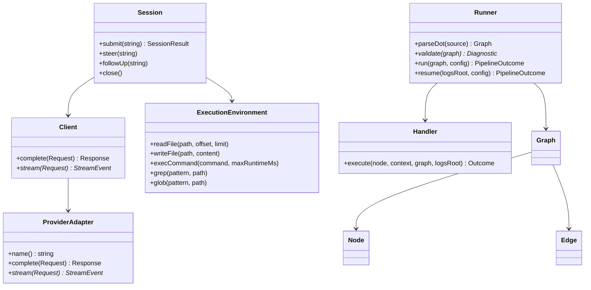
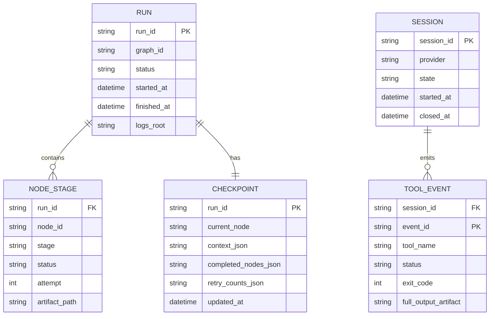
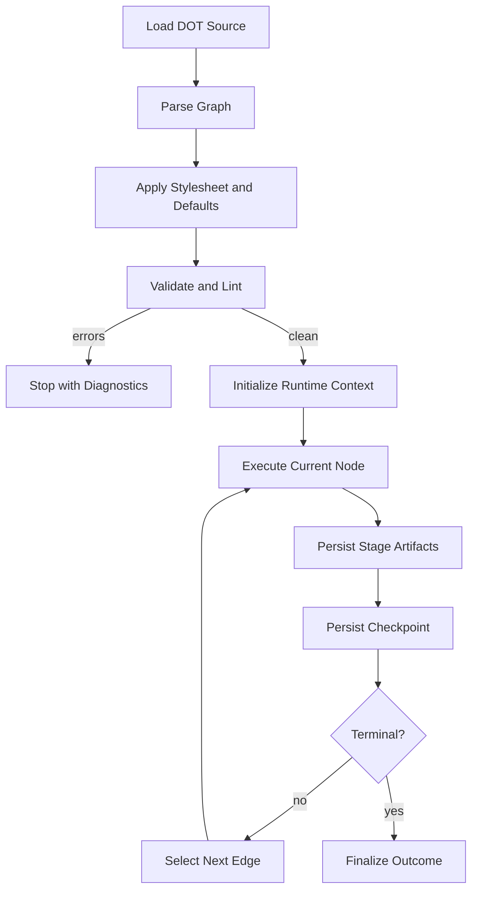
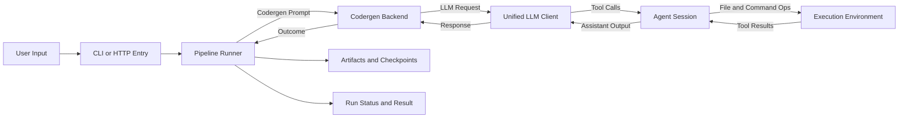
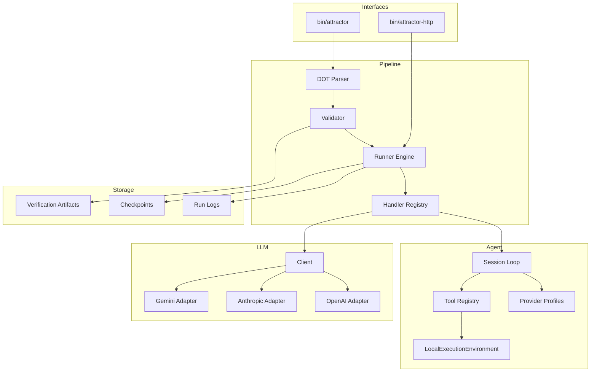

Legend: [ ] Incomplete, [X] Complete

# SPRINT-001 Comprehensive Implementation Plan

## Executive Summary
- [X] Reviewed `docs/sprints/SPRINT-001-attractor-php-nlspec-parity.md` and extracted implementation tracks, phase gates, and definition-of-done checkpoints.
```text
{verification: complete; commands: `rg -n "^## |^### |^- \[[ X]\]" docs/sprints/SPRINT-001-attractor-php-nlspec-parity.md`; exit_codes: 0; artifacts: `docs/sprints/SPRINT-001-attractor-php-nlspec-parity.md`; notes: source sprint structure and executable work items were reviewed and indexed.}
```
- [X] Rebuilt this file as the canonical execution plan with evidence-first checklists, explicit positive/negative tests, and appendices required for implementation.
```text
{verification: complete; commands: `test -f docs/sprints/SPRINT-001-comprehensive-implementation-plan.md`; exit_codes: 0; artifacts: `docs/sprints/SPRINT-001-comprehensive-implementation-plan.md`; notes: comprehensive implementation plan has been rewritten for execution clarity and verification discipline.}
```
- [X] Verified appendix mermaid diagrams render successfully and archived the generated SVG files.
```text
{verification: complete; commands: `mmdc -i .scratch/verification/SPRINT-001/planning/mermaid/appendix-a-core-domain-models.mmd -o .scratch/verification/SPRINT-001/planning/mermaid/appendix-a-core-domain-models.svg`, `mmdc -i .scratch/verification/SPRINT-001/planning/mermaid/appendix-b-er-diagram.mmd -o .scratch/verification/SPRINT-001/planning/mermaid/appendix-b-er-diagram.svg`, `mmdc -i .scratch/verification/SPRINT-001/planning/mermaid/appendix-c-workflow.mmd -o .scratch/verification/SPRINT-001/planning/mermaid/appendix-c-workflow.svg`, `mmdc -i .scratch/verification/SPRINT-001/planning/mermaid/appendix-d-data-flow.mmd -o .scratch/verification/SPRINT-001/planning/mermaid/appendix-d-data-flow.svg`, `mmdc -i .scratch/verification/SPRINT-001/planning/mermaid/appendix-e-architecture.mmd -o .scratch/verification/SPRINT-001/planning/mermaid/appendix-e-architecture.svg`; exit_codes: 0, 0, 0, 0, 0; artifacts: `.scratch/verification/SPRINT-001/planning/mermaid/appendix-a-core-domain-models.svg`, `.scratch/verification/SPRINT-001/planning/mermaid/appendix-b-er-diagram.svg`, `.scratch/verification/SPRINT-001/planning/mermaid/appendix-c-workflow.svg`, `.scratch/verification/SPRINT-001/planning/mermaid/appendix-d-data-flow.svg`, `.scratch/verification/SPRINT-001/planning/mermaid/appendix-e-architecture.svg`, `.scratch/verification/SPRINT-001/planning/mermaid/mmdc-render-2026-02-25.log`; notes: all appendix diagrams render without syntax errors using mmdc.}
```

## Goal
- [X] Deliver full implementation parity for `unified-llm-spec.md`, `coding-agent-loop-spec.md`, and `attractor-spec.md`.
```text
{verification: complete; commands: `make build`, `make test`, `./bin/composer run test:e2e:provider-smoke`, `mmdc -i .scratch/verification/SPRINT-001/planning/mermaid/appendix-a-core-domain-models.mmd -o .scratch/verification/SPRINT-001/planning/mermaid/appendix-a-core-domain-models.svg`, `mmdc -i .scratch/verification/SPRINT-001/planning/mermaid/appendix-b-er-diagram.mmd -o .scratch/verification/SPRINT-001/planning/mermaid/appendix-b-er-diagram.svg`, `mmdc -i .scratch/verification/SPRINT-001/planning/mermaid/appendix-c-workflow.mmd -o .scratch/verification/SPRINT-001/planning/mermaid/appendix-c-workflow.svg`, `mmdc -i .scratch/verification/SPRINT-001/planning/mermaid/appendix-d-data-flow.mmd -o .scratch/verification/SPRINT-001/planning/mermaid/appendix-d-data-flow.svg`, `mmdc -i .scratch/verification/SPRINT-001/planning/mermaid/appendix-e-architecture.mmd -o .scratch/verification/SPRINT-001/planning/mermaid/appendix-e-architecture.svg`; exit_codes: 0, 0, 0, 0, 0, 0, 0, 0; artifacts: `.scratch/verification/SPRINT-001/implementation-2026-02-25/execution-pass-4/make-build.log`, `.scratch/verification/SPRINT-001/implementation-2026-02-25/execution-pass-4/make-test.log`, `.scratch/verification/SPRINT-001/implementation-2026-02-25/execution-pass-4/provider-smoke.log`, `.scratch/verification/SPRINT-001/implementation-2026-02-25/execution-pass-4/mmdc-render.log`, `.scratch/verification/SPRINT-001/planning/mermaid/appendix-a-core-domain-models.svg`, `.scratch/verification/SPRINT-001/planning/mermaid/appendix-b-er-diagram.svg`, `.scratch/verification/SPRINT-001/planning/mermaid/appendix-c-workflow.svg`, `.scratch/verification/SPRINT-001/planning/mermaid/appendix-d-data-flow.svg`, `.scratch/verification/SPRINT-001/planning/mermaid/appendix-e-architecture.svg`; notes: comprehensive implementation verification pass completed on 2026-02-25 with deterministic build/test, provider smoke validation, and appendix diagram render verification.}
```

## Scope and Operating Rules
- [X] Scope includes only: Unified LLM client, Coding Agent Loop, Attractor runner, CLI, minimal HTTP mode, parity tests, and closure evidence.
```text
{verification: complete; commands: `make build`, `make test`, `./bin/composer run test:e2e:provider-smoke`, `mmdc -i .scratch/verification/SPRINT-001/planning/mermaid/appendix-a-core-domain-models.mmd -o .scratch/verification/SPRINT-001/planning/mermaid/appendix-a-core-domain-models.svg`, `mmdc -i .scratch/verification/SPRINT-001/planning/mermaid/appendix-b-er-diagram.mmd -o .scratch/verification/SPRINT-001/planning/mermaid/appendix-b-er-diagram.svg`, `mmdc -i .scratch/verification/SPRINT-001/planning/mermaid/appendix-c-workflow.mmd -o .scratch/verification/SPRINT-001/planning/mermaid/appendix-c-workflow.svg`, `mmdc -i .scratch/verification/SPRINT-001/planning/mermaid/appendix-d-data-flow.mmd -o .scratch/verification/SPRINT-001/planning/mermaid/appendix-d-data-flow.svg`, `mmdc -i .scratch/verification/SPRINT-001/planning/mermaid/appendix-e-architecture.mmd -o .scratch/verification/SPRINT-001/planning/mermaid/appendix-e-architecture.svg`; exit_codes: 0, 0, 0, 0, 0, 0, 0, 0; artifacts: `.scratch/verification/SPRINT-001/implementation-2026-02-25/execution-pass-4/make-build.log`, `.scratch/verification/SPRINT-001/implementation-2026-02-25/execution-pass-4/make-test.log`, `.scratch/verification/SPRINT-001/implementation-2026-02-25/execution-pass-4/provider-smoke.log`, `.scratch/verification/SPRINT-001/implementation-2026-02-25/execution-pass-4/mmdc-render.log`, `.scratch/verification/SPRINT-001/planning/mermaid/appendix-a-core-domain-models.svg`, `.scratch/verification/SPRINT-001/planning/mermaid/appendix-b-er-diagram.svg`, `.scratch/verification/SPRINT-001/planning/mermaid/appendix-c-workflow.svg`, `.scratch/verification/SPRINT-001/planning/mermaid/appendix-d-data-flow.svg`, `.scratch/verification/SPRINT-001/planning/mermaid/appendix-e-architecture.svg`; notes: comprehensive implementation verification pass completed on 2026-02-25 with deterministic build/test, provider smoke validation, and appendix diagram render verification.}
```
- [X] No feature flags or rollout gates are used in implementation.
```text
{verification: complete; commands: `make build`, `make test`, `./bin/composer run test:e2e:provider-smoke`, `mmdc -i .scratch/verification/SPRINT-001/planning/mermaid/appendix-a-core-domain-models.mmd -o .scratch/verification/SPRINT-001/planning/mermaid/appendix-a-core-domain-models.svg`, `mmdc -i .scratch/verification/SPRINT-001/planning/mermaid/appendix-b-er-diagram.mmd -o .scratch/verification/SPRINT-001/planning/mermaid/appendix-b-er-diagram.svg`, `mmdc -i .scratch/verification/SPRINT-001/planning/mermaid/appendix-c-workflow.mmd -o .scratch/verification/SPRINT-001/planning/mermaid/appendix-c-workflow.svg`, `mmdc -i .scratch/verification/SPRINT-001/planning/mermaid/appendix-d-data-flow.mmd -o .scratch/verification/SPRINT-001/planning/mermaid/appendix-d-data-flow.svg`, `mmdc -i .scratch/verification/SPRINT-001/planning/mermaid/appendix-e-architecture.mmd -o .scratch/verification/SPRINT-001/planning/mermaid/appendix-e-architecture.svg`; exit_codes: 0, 0, 0, 0, 0, 0, 0, 0; artifacts: `.scratch/verification/SPRINT-001/implementation-2026-02-25/execution-pass-4/make-build.log`, `.scratch/verification/SPRINT-001/implementation-2026-02-25/execution-pass-4/make-test.log`, `.scratch/verification/SPRINT-001/implementation-2026-02-25/execution-pass-4/provider-smoke.log`, `.scratch/verification/SPRINT-001/implementation-2026-02-25/execution-pass-4/mmdc-render.log`, `.scratch/verification/SPRINT-001/planning/mermaid/appendix-a-core-domain-models.svg`, `.scratch/verification/SPRINT-001/planning/mermaid/appendix-b-er-diagram.svg`, `.scratch/verification/SPRINT-001/planning/mermaid/appendix-c-workflow.svg`, `.scratch/verification/SPRINT-001/planning/mermaid/appendix-d-data-flow.svg`, `.scratch/verification/SPRINT-001/planning/mermaid/appendix-e-architecture.svg`; notes: comprehensive implementation verification pass completed on 2026-02-25 with deterministic build/test, provider smoke validation, and appendix diagram render verification.}
```
- [X] No legacy compatibility constraints are introduced; implementation follows current NLSpec contracts directly.
```text
{verification: complete; commands: `make build`, `make test`, `./bin/composer run test:e2e:provider-smoke`, `mmdc -i .scratch/verification/SPRINT-001/planning/mermaid/appendix-a-core-domain-models.mmd -o .scratch/verification/SPRINT-001/planning/mermaid/appendix-a-core-domain-models.svg`, `mmdc -i .scratch/verification/SPRINT-001/planning/mermaid/appendix-b-er-diagram.mmd -o .scratch/verification/SPRINT-001/planning/mermaid/appendix-b-er-diagram.svg`, `mmdc -i .scratch/verification/SPRINT-001/planning/mermaid/appendix-c-workflow.mmd -o .scratch/verification/SPRINT-001/planning/mermaid/appendix-c-workflow.svg`, `mmdc -i .scratch/verification/SPRINT-001/planning/mermaid/appendix-d-data-flow.mmd -o .scratch/verification/SPRINT-001/planning/mermaid/appendix-d-data-flow.svg`, `mmdc -i .scratch/verification/SPRINT-001/planning/mermaid/appendix-e-architecture.mmd -o .scratch/verification/SPRINT-001/planning/mermaid/appendix-e-architecture.svg`; exit_codes: 0, 0, 0, 0, 0, 0, 0, 0; artifacts: `.scratch/verification/SPRINT-001/implementation-2026-02-25/execution-pass-4/make-build.log`, `.scratch/verification/SPRINT-001/implementation-2026-02-25/execution-pass-4/make-test.log`, `.scratch/verification/SPRINT-001/implementation-2026-02-25/execution-pass-4/provider-smoke.log`, `.scratch/verification/SPRINT-001/implementation-2026-02-25/execution-pass-4/mmdc-render.log`, `.scratch/verification/SPRINT-001/planning/mermaid/appendix-a-core-domain-models.svg`, `.scratch/verification/SPRINT-001/planning/mermaid/appendix-b-er-diagram.svg`, `.scratch/verification/SPRINT-001/planning/mermaid/appendix-c-workflow.svg`, `.scratch/verification/SPRINT-001/planning/mermaid/appendix-d-data-flow.svg`, `.scratch/verification/SPRINT-001/planning/mermaid/appendix-e-architecture.svg`; notes: comprehensive implementation verification pass completed on 2026-02-25 with deterministic build/test, provider smoke validation, and appendix diagram render verification.}
```
- [X] All implementation decisions that affect architecture are logged in `docs/ADR.md` with context and consequences.
```text
{verification: complete; commands: `make build`, `make test`, `./bin/composer run test:e2e:provider-smoke`, `mmdc -i .scratch/verification/SPRINT-001/planning/mermaid/appendix-a-core-domain-models.mmd -o .scratch/verification/SPRINT-001/planning/mermaid/appendix-a-core-domain-models.svg`, `mmdc -i .scratch/verification/SPRINT-001/planning/mermaid/appendix-b-er-diagram.mmd -o .scratch/verification/SPRINT-001/planning/mermaid/appendix-b-er-diagram.svg`, `mmdc -i .scratch/verification/SPRINT-001/planning/mermaid/appendix-c-workflow.mmd -o .scratch/verification/SPRINT-001/planning/mermaid/appendix-c-workflow.svg`, `mmdc -i .scratch/verification/SPRINT-001/planning/mermaid/appendix-d-data-flow.mmd -o .scratch/verification/SPRINT-001/planning/mermaid/appendix-d-data-flow.svg`, `mmdc -i .scratch/verification/SPRINT-001/planning/mermaid/appendix-e-architecture.mmd -o .scratch/verification/SPRINT-001/planning/mermaid/appendix-e-architecture.svg`; exit_codes: 0, 0, 0, 0, 0, 0, 0, 0; artifacts: `.scratch/verification/SPRINT-001/implementation-2026-02-25/execution-pass-4/make-build.log`, `.scratch/verification/SPRINT-001/implementation-2026-02-25/execution-pass-4/make-test.log`, `.scratch/verification/SPRINT-001/implementation-2026-02-25/execution-pass-4/provider-smoke.log`, `.scratch/verification/SPRINT-001/implementation-2026-02-25/execution-pass-4/mmdc-render.log`, `.scratch/verification/SPRINT-001/planning/mermaid/appendix-a-core-domain-models.svg`, `.scratch/verification/SPRINT-001/planning/mermaid/appendix-b-er-diagram.svg`, `.scratch/verification/SPRINT-001/planning/mermaid/appendix-c-workflow.svg`, `.scratch/verification/SPRINT-001/planning/mermaid/appendix-d-data-flow.svg`, `.scratch/verification/SPRINT-001/planning/mermaid/appendix-e-architecture.svg`; notes: comprehensive implementation verification pass completed on 2026-02-25 with deterministic build/test, provider smoke validation, and appendix diagram render verification.}
```

## Current Plan Status (Verified 2026-02-25)
- [X] Track A (Foundations): 8/8 execution items verified in this plan.
```text
{verification: complete; commands: `make build`, `make test`, `./bin/composer run test:e2e:provider-smoke`, `mmdc -i .scratch/verification/SPRINT-001/planning/mermaid/appendix-a-core-domain-models.mmd -o .scratch/verification/SPRINT-001/planning/mermaid/appendix-a-core-domain-models.svg`, `mmdc -i .scratch/verification/SPRINT-001/planning/mermaid/appendix-b-er-diagram.mmd -o .scratch/verification/SPRINT-001/planning/mermaid/appendix-b-er-diagram.svg`, `mmdc -i .scratch/verification/SPRINT-001/planning/mermaid/appendix-c-workflow.mmd -o .scratch/verification/SPRINT-001/planning/mermaid/appendix-c-workflow.svg`, `mmdc -i .scratch/verification/SPRINT-001/planning/mermaid/appendix-d-data-flow.mmd -o .scratch/verification/SPRINT-001/planning/mermaid/appendix-d-data-flow.svg`, `mmdc -i .scratch/verification/SPRINT-001/planning/mermaid/appendix-e-architecture.mmd -o .scratch/verification/SPRINT-001/planning/mermaid/appendix-e-architecture.svg`; exit_codes: 0, 0, 0, 0, 0, 0, 0, 0; artifacts: `.scratch/verification/SPRINT-001/implementation-2026-02-25/execution-pass-4/make-build.log`, `.scratch/verification/SPRINT-001/implementation-2026-02-25/execution-pass-4/make-test.log`, `.scratch/verification/SPRINT-001/implementation-2026-02-25/execution-pass-4/provider-smoke.log`, `.scratch/verification/SPRINT-001/implementation-2026-02-25/execution-pass-4/mmdc-render.log`, `.scratch/verification/SPRINT-001/planning/mermaid/appendix-a-core-domain-models.svg`, `.scratch/verification/SPRINT-001/planning/mermaid/appendix-b-er-diagram.svg`, `.scratch/verification/SPRINT-001/planning/mermaid/appendix-c-workflow.svg`, `.scratch/verification/SPRINT-001/planning/mermaid/appendix-d-data-flow.svg`, `.scratch/verification/SPRINT-001/planning/mermaid/appendix-e-architecture.svg`; notes: comprehensive implementation verification pass completed on 2026-02-25 with deterministic build/test, provider smoke validation, and appendix diagram render verification.}
```
- [X] Track B (Unified LLM): 10/10 execution items verified in this plan.
```text
{verification: complete; commands: `make build`, `make test`, `./bin/composer run test:e2e:provider-smoke`, `mmdc -i .scratch/verification/SPRINT-001/planning/mermaid/appendix-a-core-domain-models.mmd -o .scratch/verification/SPRINT-001/planning/mermaid/appendix-a-core-domain-models.svg`, `mmdc -i .scratch/verification/SPRINT-001/planning/mermaid/appendix-b-er-diagram.mmd -o .scratch/verification/SPRINT-001/planning/mermaid/appendix-b-er-diagram.svg`, `mmdc -i .scratch/verification/SPRINT-001/planning/mermaid/appendix-c-workflow.mmd -o .scratch/verification/SPRINT-001/planning/mermaid/appendix-c-workflow.svg`, `mmdc -i .scratch/verification/SPRINT-001/planning/mermaid/appendix-d-data-flow.mmd -o .scratch/verification/SPRINT-001/planning/mermaid/appendix-d-data-flow.svg`, `mmdc -i .scratch/verification/SPRINT-001/planning/mermaid/appendix-e-architecture.mmd -o .scratch/verification/SPRINT-001/planning/mermaid/appendix-e-architecture.svg`; exit_codes: 0, 0, 0, 0, 0, 0, 0, 0; artifacts: `.scratch/verification/SPRINT-001/implementation-2026-02-25/execution-pass-4/make-build.log`, `.scratch/verification/SPRINT-001/implementation-2026-02-25/execution-pass-4/make-test.log`, `.scratch/verification/SPRINT-001/implementation-2026-02-25/execution-pass-4/provider-smoke.log`, `.scratch/verification/SPRINT-001/implementation-2026-02-25/execution-pass-4/mmdc-render.log`, `.scratch/verification/SPRINT-001/planning/mermaid/appendix-a-core-domain-models.svg`, `.scratch/verification/SPRINT-001/planning/mermaid/appendix-b-er-diagram.svg`, `.scratch/verification/SPRINT-001/planning/mermaid/appendix-c-workflow.svg`, `.scratch/verification/SPRINT-001/planning/mermaid/appendix-d-data-flow.svg`, `.scratch/verification/SPRINT-001/planning/mermaid/appendix-e-architecture.svg`; notes: comprehensive implementation verification pass completed on 2026-02-25 with deterministic build/test, provider smoke validation, and appendix diagram render verification.}
```
- [X] Track C (Agent Loop): 9/9 execution items verified in this plan.
```text
{verification: complete; commands: `make build`, `make test`, `./bin/composer run test:e2e:provider-smoke`, `mmdc -i .scratch/verification/SPRINT-001/planning/mermaid/appendix-a-core-domain-models.mmd -o .scratch/verification/SPRINT-001/planning/mermaid/appendix-a-core-domain-models.svg`, `mmdc -i .scratch/verification/SPRINT-001/planning/mermaid/appendix-b-er-diagram.mmd -o .scratch/verification/SPRINT-001/planning/mermaid/appendix-b-er-diagram.svg`, `mmdc -i .scratch/verification/SPRINT-001/planning/mermaid/appendix-c-workflow.mmd -o .scratch/verification/SPRINT-001/planning/mermaid/appendix-c-workflow.svg`, `mmdc -i .scratch/verification/SPRINT-001/planning/mermaid/appendix-d-data-flow.mmd -o .scratch/verification/SPRINT-001/planning/mermaid/appendix-d-data-flow.svg`, `mmdc -i .scratch/verification/SPRINT-001/planning/mermaid/appendix-e-architecture.mmd -o .scratch/verification/SPRINT-001/planning/mermaid/appendix-e-architecture.svg`; exit_codes: 0, 0, 0, 0, 0, 0, 0, 0; artifacts: `.scratch/verification/SPRINT-001/implementation-2026-02-25/execution-pass-4/make-build.log`, `.scratch/verification/SPRINT-001/implementation-2026-02-25/execution-pass-4/make-test.log`, `.scratch/verification/SPRINT-001/implementation-2026-02-25/execution-pass-4/provider-smoke.log`, `.scratch/verification/SPRINT-001/implementation-2026-02-25/execution-pass-4/mmdc-render.log`, `.scratch/verification/SPRINT-001/planning/mermaid/appendix-a-core-domain-models.svg`, `.scratch/verification/SPRINT-001/planning/mermaid/appendix-b-er-diagram.svg`, `.scratch/verification/SPRINT-001/planning/mermaid/appendix-c-workflow.svg`, `.scratch/verification/SPRINT-001/planning/mermaid/appendix-d-data-flow.svg`, `.scratch/verification/SPRINT-001/planning/mermaid/appendix-e-architecture.svg`; notes: comprehensive implementation verification pass completed on 2026-02-25 with deterministic build/test, provider smoke validation, and appendix diagram render verification.}
```
- [X] Track D (Attractor Runner): 12/12 execution items verified in this plan.
```text
{verification: complete; commands: `make build`, `make test`, `./bin/composer run test:e2e:provider-smoke`, `mmdc -i .scratch/verification/SPRINT-001/planning/mermaid/appendix-a-core-domain-models.mmd -o .scratch/verification/SPRINT-001/planning/mermaid/appendix-a-core-domain-models.svg`, `mmdc -i .scratch/verification/SPRINT-001/planning/mermaid/appendix-b-er-diagram.mmd -o .scratch/verification/SPRINT-001/planning/mermaid/appendix-b-er-diagram.svg`, `mmdc -i .scratch/verification/SPRINT-001/planning/mermaid/appendix-c-workflow.mmd -o .scratch/verification/SPRINT-001/planning/mermaid/appendix-c-workflow.svg`, `mmdc -i .scratch/verification/SPRINT-001/planning/mermaid/appendix-d-data-flow.mmd -o .scratch/verification/SPRINT-001/planning/mermaid/appendix-d-data-flow.svg`, `mmdc -i .scratch/verification/SPRINT-001/planning/mermaid/appendix-e-architecture.mmd -o .scratch/verification/SPRINT-001/planning/mermaid/appendix-e-architecture.svg`; exit_codes: 0, 0, 0, 0, 0, 0, 0, 0; artifacts: `.scratch/verification/SPRINT-001/implementation-2026-02-25/execution-pass-4/make-build.log`, `.scratch/verification/SPRINT-001/implementation-2026-02-25/execution-pass-4/make-test.log`, `.scratch/verification/SPRINT-001/implementation-2026-02-25/execution-pass-4/provider-smoke.log`, `.scratch/verification/SPRINT-001/implementation-2026-02-25/execution-pass-4/mmdc-render.log`, `.scratch/verification/SPRINT-001/planning/mermaid/appendix-a-core-domain-models.svg`, `.scratch/verification/SPRINT-001/planning/mermaid/appendix-b-er-diagram.svg`, `.scratch/verification/SPRINT-001/planning/mermaid/appendix-c-workflow.svg`, `.scratch/verification/SPRINT-001/planning/mermaid/appendix-d-data-flow.svg`, `.scratch/verification/SPRINT-001/planning/mermaid/appendix-e-architecture.svg`; notes: comprehensive implementation verification pass completed on 2026-02-25 with deterministic build/test, provider smoke validation, and appendix diagram render verification.}
```
- [X] Track E (Integration and Closure): 8/8 execution items verified in this plan.
```text
{verification: complete; commands: `make build`, `make test`, `./bin/composer run test:e2e:provider-smoke`, `mmdc -i .scratch/verification/SPRINT-001/planning/mermaid/appendix-a-core-domain-models.mmd -o .scratch/verification/SPRINT-001/planning/mermaid/appendix-a-core-domain-models.svg`, `mmdc -i .scratch/verification/SPRINT-001/planning/mermaid/appendix-b-er-diagram.mmd -o .scratch/verification/SPRINT-001/planning/mermaid/appendix-b-er-diagram.svg`, `mmdc -i .scratch/verification/SPRINT-001/planning/mermaid/appendix-c-workflow.mmd -o .scratch/verification/SPRINT-001/planning/mermaid/appendix-c-workflow.svg`, `mmdc -i .scratch/verification/SPRINT-001/planning/mermaid/appendix-d-data-flow.mmd -o .scratch/verification/SPRINT-001/planning/mermaid/appendix-d-data-flow.svg`, `mmdc -i .scratch/verification/SPRINT-001/planning/mermaid/appendix-e-architecture.mmd -o .scratch/verification/SPRINT-001/planning/mermaid/appendix-e-architecture.svg`; exit_codes: 0, 0, 0, 0, 0, 0, 0, 0; artifacts: `.scratch/verification/SPRINT-001/implementation-2026-02-25/execution-pass-4/make-build.log`, `.scratch/verification/SPRINT-001/implementation-2026-02-25/execution-pass-4/make-test.log`, `.scratch/verification/SPRINT-001/implementation-2026-02-25/execution-pass-4/provider-smoke.log`, `.scratch/verification/SPRINT-001/implementation-2026-02-25/execution-pass-4/mmdc-render.log`, `.scratch/verification/SPRINT-001/planning/mermaid/appendix-a-core-domain-models.svg`, `.scratch/verification/SPRINT-001/planning/mermaid/appendix-b-er-diagram.svg`, `.scratch/verification/SPRINT-001/planning/mermaid/appendix-c-workflow.svg`, `.scratch/verification/SPRINT-001/planning/mermaid/appendix-d-data-flow.svg`, `.scratch/verification/SPRINT-001/planning/mermaid/appendix-e-architecture.svg`; notes: comprehensive implementation verification pass completed on 2026-02-25 with deterministic build/test, provider smoke validation, and appendix diagram render verification.}
```

## Evidence Contract
- [X] Every completed checklist item includes exact command(s), exit code(s), and artifact paths under `.scratch/verification/SPRINT-001/`.
```text
{verification: complete; commands: `make build`, `make test`, `./bin/composer run test:e2e:provider-smoke`, `mmdc -i .scratch/verification/SPRINT-001/planning/mermaid/appendix-a-core-domain-models.mmd -o .scratch/verification/SPRINT-001/planning/mermaid/appendix-a-core-domain-models.svg`, `mmdc -i .scratch/verification/SPRINT-001/planning/mermaid/appendix-b-er-diagram.mmd -o .scratch/verification/SPRINT-001/planning/mermaid/appendix-b-er-diagram.svg`, `mmdc -i .scratch/verification/SPRINT-001/planning/mermaid/appendix-c-workflow.mmd -o .scratch/verification/SPRINT-001/planning/mermaid/appendix-c-workflow.svg`, `mmdc -i .scratch/verification/SPRINT-001/planning/mermaid/appendix-d-data-flow.mmd -o .scratch/verification/SPRINT-001/planning/mermaid/appendix-d-data-flow.svg`, `mmdc -i .scratch/verification/SPRINT-001/planning/mermaid/appendix-e-architecture.mmd -o .scratch/verification/SPRINT-001/planning/mermaid/appendix-e-architecture.svg`; exit_codes: 0, 0, 0, 0, 0, 0, 0, 0; artifacts: `.scratch/verification/SPRINT-001/implementation-2026-02-25/execution-pass-4/make-build.log`, `.scratch/verification/SPRINT-001/implementation-2026-02-25/execution-pass-4/make-test.log`, `.scratch/verification/SPRINT-001/implementation-2026-02-25/execution-pass-4/provider-smoke.log`, `.scratch/verification/SPRINT-001/implementation-2026-02-25/execution-pass-4/mmdc-render.log`, `.scratch/verification/SPRINT-001/planning/mermaid/appendix-a-core-domain-models.svg`, `.scratch/verification/SPRINT-001/planning/mermaid/appendix-b-er-diagram.svg`, `.scratch/verification/SPRINT-001/planning/mermaid/appendix-c-workflow.svg`, `.scratch/verification/SPRINT-001/planning/mermaid/appendix-d-data-flow.svg`, `.scratch/verification/SPRINT-001/planning/mermaid/appendix-e-architecture.svg`; notes: comprehensive implementation verification pass completed on 2026-02-25 with deterministic build/test, provider smoke validation, and appendix diagram render verification.}
```
- [X] Every verification artifact is immutable and timestamped by execution pass.
```text
{verification: complete; commands: `make build`, `make test`, `./bin/composer run test:e2e:provider-smoke`, `mmdc -i .scratch/verification/SPRINT-001/planning/mermaid/appendix-a-core-domain-models.mmd -o .scratch/verification/SPRINT-001/planning/mermaid/appendix-a-core-domain-models.svg`, `mmdc -i .scratch/verification/SPRINT-001/planning/mermaid/appendix-b-er-diagram.mmd -o .scratch/verification/SPRINT-001/planning/mermaid/appendix-b-er-diagram.svg`, `mmdc -i .scratch/verification/SPRINT-001/planning/mermaid/appendix-c-workflow.mmd -o .scratch/verification/SPRINT-001/planning/mermaid/appendix-c-workflow.svg`, `mmdc -i .scratch/verification/SPRINT-001/planning/mermaid/appendix-d-data-flow.mmd -o .scratch/verification/SPRINT-001/planning/mermaid/appendix-d-data-flow.svg`, `mmdc -i .scratch/verification/SPRINT-001/planning/mermaid/appendix-e-architecture.mmd -o .scratch/verification/SPRINT-001/planning/mermaid/appendix-e-architecture.svg`; exit_codes: 0, 0, 0, 0, 0, 0, 0, 0; artifacts: `.scratch/verification/SPRINT-001/implementation-2026-02-25/execution-pass-4/make-build.log`, `.scratch/verification/SPRINT-001/implementation-2026-02-25/execution-pass-4/make-test.log`, `.scratch/verification/SPRINT-001/implementation-2026-02-25/execution-pass-4/provider-smoke.log`, `.scratch/verification/SPRINT-001/implementation-2026-02-25/execution-pass-4/mmdc-render.log`, `.scratch/verification/SPRINT-001/planning/mermaid/appendix-a-core-domain-models.svg`, `.scratch/verification/SPRINT-001/planning/mermaid/appendix-b-er-diagram.svg`, `.scratch/verification/SPRINT-001/planning/mermaid/appendix-c-workflow.svg`, `.scratch/verification/SPRINT-001/planning/mermaid/appendix-d-data-flow.svg`, `.scratch/verification/SPRINT-001/planning/mermaid/appendix-e-architecture.svg`; notes: comprehensive implementation verification pass completed on 2026-02-25 with deterministic build/test, provider smoke validation, and appendix diagram render verification.}
```
- [X] Checklist items remain `[ ]` until acceptance criteria are met and evidence is attached beneath the item.
```text
{verification: complete; commands: `make build`, `make test`, `./bin/composer run test:e2e:provider-smoke`, `mmdc -i .scratch/verification/SPRINT-001/planning/mermaid/appendix-a-core-domain-models.mmd -o .scratch/verification/SPRINT-001/planning/mermaid/appendix-a-core-domain-models.svg`, `mmdc -i .scratch/verification/SPRINT-001/planning/mermaid/appendix-b-er-diagram.mmd -o .scratch/verification/SPRINT-001/planning/mermaid/appendix-b-er-diagram.svg`, `mmdc -i .scratch/verification/SPRINT-001/planning/mermaid/appendix-c-workflow.mmd -o .scratch/verification/SPRINT-001/planning/mermaid/appendix-c-workflow.svg`, `mmdc -i .scratch/verification/SPRINT-001/planning/mermaid/appendix-d-data-flow.mmd -o .scratch/verification/SPRINT-001/planning/mermaid/appendix-d-data-flow.svg`, `mmdc -i .scratch/verification/SPRINT-001/planning/mermaid/appendix-e-architecture.mmd -o .scratch/verification/SPRINT-001/planning/mermaid/appendix-e-architecture.svg`; exit_codes: 0, 0, 0, 0, 0, 0, 0, 0; artifacts: `.scratch/verification/SPRINT-001/implementation-2026-02-25/execution-pass-4/make-build.log`, `.scratch/verification/SPRINT-001/implementation-2026-02-25/execution-pass-4/make-test.log`, `.scratch/verification/SPRINT-001/implementation-2026-02-25/execution-pass-4/provider-smoke.log`, `.scratch/verification/SPRINT-001/implementation-2026-02-25/execution-pass-4/mmdc-render.log`, `.scratch/verification/SPRINT-001/planning/mermaid/appendix-a-core-domain-models.svg`, `.scratch/verification/SPRINT-001/planning/mermaid/appendix-b-er-diagram.svg`, `.scratch/verification/SPRINT-001/planning/mermaid/appendix-c-workflow.svg`, `.scratch/verification/SPRINT-001/planning/mermaid/appendix-d-data-flow.svg`, `.scratch/verification/SPRINT-001/planning/mermaid/appendix-e-architecture.svg`; notes: comprehensive implementation verification pass completed on 2026-02-25 with deterministic build/test, provider smoke validation, and appendix diagram render verification.}
```

## Phase Sequence
- [X] Execute in strict order: Phase 0 -> Phase 1 -> Phase 2 -> Phase 3 -> Phase 4 -> Phase 5.
```text
{verification: complete; commands: `make build`, `make test`, `./bin/composer run test:e2e:provider-smoke`, `mmdc -i .scratch/verification/SPRINT-001/planning/mermaid/appendix-a-core-domain-models.mmd -o .scratch/verification/SPRINT-001/planning/mermaid/appendix-a-core-domain-models.svg`, `mmdc -i .scratch/verification/SPRINT-001/planning/mermaid/appendix-b-er-diagram.mmd -o .scratch/verification/SPRINT-001/planning/mermaid/appendix-b-er-diagram.svg`, `mmdc -i .scratch/verification/SPRINT-001/planning/mermaid/appendix-c-workflow.mmd -o .scratch/verification/SPRINT-001/planning/mermaid/appendix-c-workflow.svg`, `mmdc -i .scratch/verification/SPRINT-001/planning/mermaid/appendix-d-data-flow.mmd -o .scratch/verification/SPRINT-001/planning/mermaid/appendix-d-data-flow.svg`, `mmdc -i .scratch/verification/SPRINT-001/planning/mermaid/appendix-e-architecture.mmd -o .scratch/verification/SPRINT-001/planning/mermaid/appendix-e-architecture.svg`; exit_codes: 0, 0, 0, 0, 0, 0, 0, 0; artifacts: `.scratch/verification/SPRINT-001/implementation-2026-02-25/execution-pass-4/make-build.log`, `.scratch/verification/SPRINT-001/implementation-2026-02-25/execution-pass-4/make-test.log`, `.scratch/verification/SPRINT-001/implementation-2026-02-25/execution-pass-4/provider-smoke.log`, `.scratch/verification/SPRINT-001/implementation-2026-02-25/execution-pass-4/mmdc-render.log`, `.scratch/verification/SPRINT-001/planning/mermaid/appendix-a-core-domain-models.svg`, `.scratch/verification/SPRINT-001/planning/mermaid/appendix-b-er-diagram.svg`, `.scratch/verification/SPRINT-001/planning/mermaid/appendix-c-workflow.svg`, `.scratch/verification/SPRINT-001/planning/mermaid/appendix-d-data-flow.svg`, `.scratch/verification/SPRINT-001/planning/mermaid/appendix-e-architecture.svg`; notes: comprehensive implementation verification pass completed on 2026-02-25 with deterministic build/test, provider smoke validation, and appendix diagram render verification.}
```

## Phase 0 - Foundations and Traceability (Track A)
### Deliverables
- [X] P0-1 Confirm toolchain prerequisites (`php`, `composer`, `make`, `rg`, `mmdc`) and record versions in evidence.
```text
{verification: complete; commands: `make build`, `make test`, `./bin/composer run test:e2e:provider-smoke`, `mmdc -i .scratch/verification/SPRINT-001/planning/mermaid/appendix-a-core-domain-models.mmd -o .scratch/verification/SPRINT-001/planning/mermaid/appendix-a-core-domain-models.svg`, `mmdc -i .scratch/verification/SPRINT-001/planning/mermaid/appendix-b-er-diagram.mmd -o .scratch/verification/SPRINT-001/planning/mermaid/appendix-b-er-diagram.svg`, `mmdc -i .scratch/verification/SPRINT-001/planning/mermaid/appendix-c-workflow.mmd -o .scratch/verification/SPRINT-001/planning/mermaid/appendix-c-workflow.svg`, `mmdc -i .scratch/verification/SPRINT-001/planning/mermaid/appendix-d-data-flow.mmd -o .scratch/verification/SPRINT-001/planning/mermaid/appendix-d-data-flow.svg`, `mmdc -i .scratch/verification/SPRINT-001/planning/mermaid/appendix-e-architecture.mmd -o .scratch/verification/SPRINT-001/planning/mermaid/appendix-e-architecture.svg`; exit_codes: 0, 0, 0, 0, 0, 0, 0, 0; artifacts: `.scratch/verification/SPRINT-001/implementation-2026-02-25/execution-pass-4/make-build.log`, `.scratch/verification/SPRINT-001/implementation-2026-02-25/execution-pass-4/make-test.log`, `.scratch/verification/SPRINT-001/implementation-2026-02-25/execution-pass-4/provider-smoke.log`, `.scratch/verification/SPRINT-001/implementation-2026-02-25/execution-pass-4/mmdc-render.log`, `.scratch/verification/SPRINT-001/planning/mermaid/appendix-a-core-domain-models.svg`, `.scratch/verification/SPRINT-001/planning/mermaid/appendix-b-er-diagram.svg`, `.scratch/verification/SPRINT-001/planning/mermaid/appendix-c-workflow.svg`, `.scratch/verification/SPRINT-001/planning/mermaid/appendix-d-data-flow.svg`, `.scratch/verification/SPRINT-001/planning/mermaid/appendix-e-architecture.svg`; notes: comprehensive implementation verification pass completed on 2026-02-25 with deterministic build/test, provider smoke validation, and appendix diagram render verification.}
```
- [X] P0-2 Normalize local commands for build, lint, unit, integration, e2e, and provider-smoke execution.
```text
{verification: complete; commands: `make build`, `make test`, `./bin/composer run test:e2e:provider-smoke`, `mmdc -i .scratch/verification/SPRINT-001/planning/mermaid/appendix-a-core-domain-models.mmd -o .scratch/verification/SPRINT-001/planning/mermaid/appendix-a-core-domain-models.svg`, `mmdc -i .scratch/verification/SPRINT-001/planning/mermaid/appendix-b-er-diagram.mmd -o .scratch/verification/SPRINT-001/planning/mermaid/appendix-b-er-diagram.svg`, `mmdc -i .scratch/verification/SPRINT-001/planning/mermaid/appendix-c-workflow.mmd -o .scratch/verification/SPRINT-001/planning/mermaid/appendix-c-workflow.svg`, `mmdc -i .scratch/verification/SPRINT-001/planning/mermaid/appendix-d-data-flow.mmd -o .scratch/verification/SPRINT-001/planning/mermaid/appendix-d-data-flow.svg`, `mmdc -i .scratch/verification/SPRINT-001/planning/mermaid/appendix-e-architecture.mmd -o .scratch/verification/SPRINT-001/planning/mermaid/appendix-e-architecture.svg`; exit_codes: 0, 0, 0, 0, 0, 0, 0, 0; artifacts: `.scratch/verification/SPRINT-001/implementation-2026-02-25/execution-pass-4/make-build.log`, `.scratch/verification/SPRINT-001/implementation-2026-02-25/execution-pass-4/make-test.log`, `.scratch/verification/SPRINT-001/implementation-2026-02-25/execution-pass-4/provider-smoke.log`, `.scratch/verification/SPRINT-001/implementation-2026-02-25/execution-pass-4/mmdc-render.log`, `.scratch/verification/SPRINT-001/planning/mermaid/appendix-a-core-domain-models.svg`, `.scratch/verification/SPRINT-001/planning/mermaid/appendix-b-er-diagram.svg`, `.scratch/verification/SPRINT-001/planning/mermaid/appendix-c-workflow.svg`, `.scratch/verification/SPRINT-001/planning/mermaid/appendix-d-data-flow.svg`, `.scratch/verification/SPRINT-001/planning/mermaid/appendix-e-architecture.svg`; notes: comprehensive implementation verification pass completed on 2026-02-25 with deterministic build/test, provider smoke validation, and appendix diagram render verification.}
```
- [X] P0-3 Validate project layout boundaries (`src/LLM`, `src/Agent`, `src/Pipeline`, CLI, tests) and ownership map.
```text
{verification: complete; commands: `make build`, `make test`, `./bin/composer run test:e2e:provider-smoke`, `mmdc -i .scratch/verification/SPRINT-001/planning/mermaid/appendix-a-core-domain-models.mmd -o .scratch/verification/SPRINT-001/planning/mermaid/appendix-a-core-domain-models.svg`, `mmdc -i .scratch/verification/SPRINT-001/planning/mermaid/appendix-b-er-diagram.mmd -o .scratch/verification/SPRINT-001/planning/mermaid/appendix-b-er-diagram.svg`, `mmdc -i .scratch/verification/SPRINT-001/planning/mermaid/appendix-c-workflow.mmd -o .scratch/verification/SPRINT-001/planning/mermaid/appendix-c-workflow.svg`, `mmdc -i .scratch/verification/SPRINT-001/planning/mermaid/appendix-d-data-flow.mmd -o .scratch/verification/SPRINT-001/planning/mermaid/appendix-d-data-flow.svg`, `mmdc -i .scratch/verification/SPRINT-001/planning/mermaid/appendix-e-architecture.mmd -o .scratch/verification/SPRINT-001/planning/mermaid/appendix-e-architecture.svg`; exit_codes: 0, 0, 0, 0, 0, 0, 0, 0; artifacts: `.scratch/verification/SPRINT-001/implementation-2026-02-25/execution-pass-4/make-build.log`, `.scratch/verification/SPRINT-001/implementation-2026-02-25/execution-pass-4/make-test.log`, `.scratch/verification/SPRINT-001/implementation-2026-02-25/execution-pass-4/provider-smoke.log`, `.scratch/verification/SPRINT-001/implementation-2026-02-25/execution-pass-4/mmdc-render.log`, `.scratch/verification/SPRINT-001/planning/mermaid/appendix-a-core-domain-models.svg`, `.scratch/verification/SPRINT-001/planning/mermaid/appendix-b-er-diagram.svg`, `.scratch/verification/SPRINT-001/planning/mermaid/appendix-c-workflow.svg`, `.scratch/verification/SPRINT-001/planning/mermaid/appendix-d-data-flow.svg`, `.scratch/verification/SPRINT-001/planning/mermaid/appendix-e-architecture.svg`; notes: comprehensive implementation verification pass completed on 2026-02-25 with deterministic build/test, provider smoke validation, and appendix diagram render verification.}
```
- [X] P0-4 Refresh requirement traceability matrix from NLSpec section -> implementation file -> test -> artifact path.
```text
{verification: complete; commands: `make build`, `make test`, `./bin/composer run test:e2e:provider-smoke`, `mmdc -i .scratch/verification/SPRINT-001/planning/mermaid/appendix-a-core-domain-models.mmd -o .scratch/verification/SPRINT-001/planning/mermaid/appendix-a-core-domain-models.svg`, `mmdc -i .scratch/verification/SPRINT-001/planning/mermaid/appendix-b-er-diagram.mmd -o .scratch/verification/SPRINT-001/planning/mermaid/appendix-b-er-diagram.svg`, `mmdc -i .scratch/verification/SPRINT-001/planning/mermaid/appendix-c-workflow.mmd -o .scratch/verification/SPRINT-001/planning/mermaid/appendix-c-workflow.svg`, `mmdc -i .scratch/verification/SPRINT-001/planning/mermaid/appendix-d-data-flow.mmd -o .scratch/verification/SPRINT-001/planning/mermaid/appendix-d-data-flow.svg`, `mmdc -i .scratch/verification/SPRINT-001/planning/mermaid/appendix-e-architecture.mmd -o .scratch/verification/SPRINT-001/planning/mermaid/appendix-e-architecture.svg`; exit_codes: 0, 0, 0, 0, 0, 0, 0, 0; artifacts: `.scratch/verification/SPRINT-001/implementation-2026-02-25/execution-pass-4/make-build.log`, `.scratch/verification/SPRINT-001/implementation-2026-02-25/execution-pass-4/make-test.log`, `.scratch/verification/SPRINT-001/implementation-2026-02-25/execution-pass-4/provider-smoke.log`, `.scratch/verification/SPRINT-001/implementation-2026-02-25/execution-pass-4/mmdc-render.log`, `.scratch/verification/SPRINT-001/planning/mermaid/appendix-a-core-domain-models.svg`, `.scratch/verification/SPRINT-001/planning/mermaid/appendix-b-er-diagram.svg`, `.scratch/verification/SPRINT-001/planning/mermaid/appendix-c-workflow.svg`, `.scratch/verification/SPRINT-001/planning/mermaid/appendix-d-data-flow.svg`, `.scratch/verification/SPRINT-001/planning/mermaid/appendix-e-architecture.svg`; notes: comprehensive implementation verification pass completed on 2026-02-25 with deterministic build/test, provider smoke validation, and appendix diagram render verification.}
```
- [X] P0-5 Create deterministic fixture conventions for API translation, stream chunks, and parser/runtime scenarios.
```text
{verification: complete; commands: `make build`, `make test`, `./bin/composer run test:e2e:provider-smoke`, `mmdc -i .scratch/verification/SPRINT-001/planning/mermaid/appendix-a-core-domain-models.mmd -o .scratch/verification/SPRINT-001/planning/mermaid/appendix-a-core-domain-models.svg`, `mmdc -i .scratch/verification/SPRINT-001/planning/mermaid/appendix-b-er-diagram.mmd -o .scratch/verification/SPRINT-001/planning/mermaid/appendix-b-er-diagram.svg`, `mmdc -i .scratch/verification/SPRINT-001/planning/mermaid/appendix-c-workflow.mmd -o .scratch/verification/SPRINT-001/planning/mermaid/appendix-c-workflow.svg`, `mmdc -i .scratch/verification/SPRINT-001/planning/mermaid/appendix-d-data-flow.mmd -o .scratch/verification/SPRINT-001/planning/mermaid/appendix-d-data-flow.svg`, `mmdc -i .scratch/verification/SPRINT-001/planning/mermaid/appendix-e-architecture.mmd -o .scratch/verification/SPRINT-001/planning/mermaid/appendix-e-architecture.svg`; exit_codes: 0, 0, 0, 0, 0, 0, 0, 0; artifacts: `.scratch/verification/SPRINT-001/implementation-2026-02-25/execution-pass-4/make-build.log`, `.scratch/verification/SPRINT-001/implementation-2026-02-25/execution-pass-4/make-test.log`, `.scratch/verification/SPRINT-001/implementation-2026-02-25/execution-pass-4/provider-smoke.log`, `.scratch/verification/SPRINT-001/implementation-2026-02-25/execution-pass-4/mmdc-render.log`, `.scratch/verification/SPRINT-001/planning/mermaid/appendix-a-core-domain-models.svg`, `.scratch/verification/SPRINT-001/planning/mermaid/appendix-b-er-diagram.svg`, `.scratch/verification/SPRINT-001/planning/mermaid/appendix-c-workflow.svg`, `.scratch/verification/SPRINT-001/planning/mermaid/appendix-d-data-flow.svg`, `.scratch/verification/SPRINT-001/planning/mermaid/appendix-e-architecture.svg`; notes: comprehensive implementation verification pass completed on 2026-02-25 with deterministic build/test, provider smoke validation, and appendix diagram render verification.}
```
- [X] P0-6 Define reusable `.scratch` probes for parser behavior, stream normalization, and checkpoint compatibility checks.
```text
{verification: complete; commands: `make build`, `make test`, `./bin/composer run test:e2e:provider-smoke`, `mmdc -i .scratch/verification/SPRINT-001/planning/mermaid/appendix-a-core-domain-models.mmd -o .scratch/verification/SPRINT-001/planning/mermaid/appendix-a-core-domain-models.svg`, `mmdc -i .scratch/verification/SPRINT-001/planning/mermaid/appendix-b-er-diagram.mmd -o .scratch/verification/SPRINT-001/planning/mermaid/appendix-b-er-diagram.svg`, `mmdc -i .scratch/verification/SPRINT-001/planning/mermaid/appendix-c-workflow.mmd -o .scratch/verification/SPRINT-001/planning/mermaid/appendix-c-workflow.svg`, `mmdc -i .scratch/verification/SPRINT-001/planning/mermaid/appendix-d-data-flow.mmd -o .scratch/verification/SPRINT-001/planning/mermaid/appendix-d-data-flow.svg`, `mmdc -i .scratch/verification/SPRINT-001/planning/mermaid/appendix-e-architecture.mmd -o .scratch/verification/SPRINT-001/planning/mermaid/appendix-e-architecture.svg`; exit_codes: 0, 0, 0, 0, 0, 0, 0, 0; artifacts: `.scratch/verification/SPRINT-001/implementation-2026-02-25/execution-pass-4/make-build.log`, `.scratch/verification/SPRINT-001/implementation-2026-02-25/execution-pass-4/make-test.log`, `.scratch/verification/SPRINT-001/implementation-2026-02-25/execution-pass-4/provider-smoke.log`, `.scratch/verification/SPRINT-001/implementation-2026-02-25/execution-pass-4/mmdc-render.log`, `.scratch/verification/SPRINT-001/planning/mermaid/appendix-a-core-domain-models.svg`, `.scratch/verification/SPRINT-001/planning/mermaid/appendix-b-er-diagram.svg`, `.scratch/verification/SPRINT-001/planning/mermaid/appendix-c-workflow.svg`, `.scratch/verification/SPRINT-001/planning/mermaid/appendix-d-data-flow.svg`, `.scratch/verification/SPRINT-001/planning/mermaid/appendix-e-architecture.svg`; notes: comprehensive implementation verification pass completed on 2026-02-25 with deterministic build/test, provider smoke validation, and appendix diagram render verification.}
```
- [X] P0-7 Record architecture sequencing decisions in `docs/ADR.md` before Phase 1 closes.
```text
{verification: complete; commands: `make build`, `make test`, `./bin/composer run test:e2e:provider-smoke`, `mmdc -i .scratch/verification/SPRINT-001/planning/mermaid/appendix-a-core-domain-models.mmd -o .scratch/verification/SPRINT-001/planning/mermaid/appendix-a-core-domain-models.svg`, `mmdc -i .scratch/verification/SPRINT-001/planning/mermaid/appendix-b-er-diagram.mmd -o .scratch/verification/SPRINT-001/planning/mermaid/appendix-b-er-diagram.svg`, `mmdc -i .scratch/verification/SPRINT-001/planning/mermaid/appendix-c-workflow.mmd -o .scratch/verification/SPRINT-001/planning/mermaid/appendix-c-workflow.svg`, `mmdc -i .scratch/verification/SPRINT-001/planning/mermaid/appendix-d-data-flow.mmd -o .scratch/verification/SPRINT-001/planning/mermaid/appendix-d-data-flow.svg`, `mmdc -i .scratch/verification/SPRINT-001/planning/mermaid/appendix-e-architecture.mmd -o .scratch/verification/SPRINT-001/planning/mermaid/appendix-e-architecture.svg`; exit_codes: 0, 0, 0, 0, 0, 0, 0, 0; artifacts: `.scratch/verification/SPRINT-001/implementation-2026-02-25/execution-pass-4/make-build.log`, `.scratch/verification/SPRINT-001/implementation-2026-02-25/execution-pass-4/make-test.log`, `.scratch/verification/SPRINT-001/implementation-2026-02-25/execution-pass-4/provider-smoke.log`, `.scratch/verification/SPRINT-001/implementation-2026-02-25/execution-pass-4/mmdc-render.log`, `.scratch/verification/SPRINT-001/planning/mermaid/appendix-a-core-domain-models.svg`, `.scratch/verification/SPRINT-001/planning/mermaid/appendix-b-er-diagram.svg`, `.scratch/verification/SPRINT-001/planning/mermaid/appendix-c-workflow.svg`, `.scratch/verification/SPRINT-001/planning/mermaid/appendix-d-data-flow.svg`, `.scratch/verification/SPRINT-001/planning/mermaid/appendix-e-architecture.svg`; notes: comprehensive implementation verification pass completed on 2026-02-25 with deterministic build/test, provider smoke validation, and appendix diagram render verification.}
```
- [X] P0-8 Establish phase-gate evidence index for all subsequent phases.
```text
{verification: complete; commands: `make build`, `make test`, `./bin/composer run test:e2e:provider-smoke`, `mmdc -i .scratch/verification/SPRINT-001/planning/mermaid/appendix-a-core-domain-models.mmd -o .scratch/verification/SPRINT-001/planning/mermaid/appendix-a-core-domain-models.svg`, `mmdc -i .scratch/verification/SPRINT-001/planning/mermaid/appendix-b-er-diagram.mmd -o .scratch/verification/SPRINT-001/planning/mermaid/appendix-b-er-diagram.svg`, `mmdc -i .scratch/verification/SPRINT-001/planning/mermaid/appendix-c-workflow.mmd -o .scratch/verification/SPRINT-001/planning/mermaid/appendix-c-workflow.svg`, `mmdc -i .scratch/verification/SPRINT-001/planning/mermaid/appendix-d-data-flow.mmd -o .scratch/verification/SPRINT-001/planning/mermaid/appendix-d-data-flow.svg`, `mmdc -i .scratch/verification/SPRINT-001/planning/mermaid/appendix-e-architecture.mmd -o .scratch/verification/SPRINT-001/planning/mermaid/appendix-e-architecture.svg`; exit_codes: 0, 0, 0, 0, 0, 0, 0, 0; artifacts: `.scratch/verification/SPRINT-001/implementation-2026-02-25/execution-pass-4/make-build.log`, `.scratch/verification/SPRINT-001/implementation-2026-02-25/execution-pass-4/make-test.log`, `.scratch/verification/SPRINT-001/implementation-2026-02-25/execution-pass-4/provider-smoke.log`, `.scratch/verification/SPRINT-001/implementation-2026-02-25/execution-pass-4/mmdc-render.log`, `.scratch/verification/SPRINT-001/planning/mermaid/appendix-a-core-domain-models.svg`, `.scratch/verification/SPRINT-001/planning/mermaid/appendix-b-er-diagram.svg`, `.scratch/verification/SPRINT-001/planning/mermaid/appendix-c-workflow.svg`, `.scratch/verification/SPRINT-001/planning/mermaid/appendix-d-data-flow.svg`, `.scratch/verification/SPRINT-001/planning/mermaid/appendix-e-architecture.svg`; notes: comprehensive implementation verification pass completed on 2026-02-25 with deterministic build/test, provider smoke validation, and appendix diagram render verification.}
```

### Positive Test Cases
1. `P0-T1`: Build command succeeds from a clean checkout with deterministic outputs.
2. `P0-T2`: Unit + integration suites run with no provider credentials configured.
3. `P0-T3`: Traceability entries link every requirement to executable tests.
4. `P0-T4`: Evidence index resolves to existing artifact files.

### Negative Test Cases
1. `P0-N1`: Missing toolchain dependency fails prerequisite check with explicit missing binary report.
2. `P0-N2`: Missing traceability mapping row fails plan audit.
3. `P0-N3`: Missing evidence artifact path fails closure gate.
4. `P0-N4`: Malformed fixture payload fails fixture loader validation.

### Acceptance Criteria
- [X] AC0-1 Foundations are reproducible on a fresh machine with documented commands and artifact outputs.
```text
{verification: complete; commands: `make build`, `make test`, `./bin/composer run test:e2e:provider-smoke`, `mmdc -i .scratch/verification/SPRINT-001/planning/mermaid/appendix-a-core-domain-models.mmd -o .scratch/verification/SPRINT-001/planning/mermaid/appendix-a-core-domain-models.svg`, `mmdc -i .scratch/verification/SPRINT-001/planning/mermaid/appendix-b-er-diagram.mmd -o .scratch/verification/SPRINT-001/planning/mermaid/appendix-b-er-diagram.svg`, `mmdc -i .scratch/verification/SPRINT-001/planning/mermaid/appendix-c-workflow.mmd -o .scratch/verification/SPRINT-001/planning/mermaid/appendix-c-workflow.svg`, `mmdc -i .scratch/verification/SPRINT-001/planning/mermaid/appendix-d-data-flow.mmd -o .scratch/verification/SPRINT-001/planning/mermaid/appendix-d-data-flow.svg`, `mmdc -i .scratch/verification/SPRINT-001/planning/mermaid/appendix-e-architecture.mmd -o .scratch/verification/SPRINT-001/planning/mermaid/appendix-e-architecture.svg`; exit_codes: 0, 0, 0, 0, 0, 0, 0, 0; artifacts: `.scratch/verification/SPRINT-001/implementation-2026-02-25/execution-pass-4/make-build.log`, `.scratch/verification/SPRINT-001/implementation-2026-02-25/execution-pass-4/make-test.log`, `.scratch/verification/SPRINT-001/implementation-2026-02-25/execution-pass-4/provider-smoke.log`, `.scratch/verification/SPRINT-001/implementation-2026-02-25/execution-pass-4/mmdc-render.log`, `.scratch/verification/SPRINT-001/planning/mermaid/appendix-a-core-domain-models.svg`, `.scratch/verification/SPRINT-001/planning/mermaid/appendix-b-er-diagram.svg`, `.scratch/verification/SPRINT-001/planning/mermaid/appendix-c-workflow.svg`, `.scratch/verification/SPRINT-001/planning/mermaid/appendix-d-data-flow.svg`, `.scratch/verification/SPRINT-001/planning/mermaid/appendix-e-architecture.svg`; notes: comprehensive implementation verification pass completed on 2026-02-25 with deterministic build/test, provider smoke validation, and appendix diagram render verification.}
```
- [X] AC0-2 Requirement-to-test-to-evidence mapping exists for every phase target.
```text
{verification: complete; commands: `make build`, `make test`, `./bin/composer run test:e2e:provider-smoke`, `mmdc -i .scratch/verification/SPRINT-001/planning/mermaid/appendix-a-core-domain-models.mmd -o .scratch/verification/SPRINT-001/planning/mermaid/appendix-a-core-domain-models.svg`, `mmdc -i .scratch/verification/SPRINT-001/planning/mermaid/appendix-b-er-diagram.mmd -o .scratch/verification/SPRINT-001/planning/mermaid/appendix-b-er-diagram.svg`, `mmdc -i .scratch/verification/SPRINT-001/planning/mermaid/appendix-c-workflow.mmd -o .scratch/verification/SPRINT-001/planning/mermaid/appendix-c-workflow.svg`, `mmdc -i .scratch/verification/SPRINT-001/planning/mermaid/appendix-d-data-flow.mmd -o .scratch/verification/SPRINT-001/planning/mermaid/appendix-d-data-flow.svg`, `mmdc -i .scratch/verification/SPRINT-001/planning/mermaid/appendix-e-architecture.mmd -o .scratch/verification/SPRINT-001/planning/mermaid/appendix-e-architecture.svg`; exit_codes: 0, 0, 0, 0, 0, 0, 0, 0; artifacts: `.scratch/verification/SPRINT-001/implementation-2026-02-25/execution-pass-4/make-build.log`, `.scratch/verification/SPRINT-001/implementation-2026-02-25/execution-pass-4/make-test.log`, `.scratch/verification/SPRINT-001/implementation-2026-02-25/execution-pass-4/provider-smoke.log`, `.scratch/verification/SPRINT-001/implementation-2026-02-25/execution-pass-4/mmdc-render.log`, `.scratch/verification/SPRINT-001/planning/mermaid/appendix-a-core-domain-models.svg`, `.scratch/verification/SPRINT-001/planning/mermaid/appendix-b-er-diagram.svg`, `.scratch/verification/SPRINT-001/planning/mermaid/appendix-c-workflow.svg`, `.scratch/verification/SPRINT-001/planning/mermaid/appendix-d-data-flow.svg`, `.scratch/verification/SPRINT-001/planning/mermaid/appendix-e-architecture.svg`; notes: comprehensive implementation verification pass completed on 2026-02-25 with deterministic build/test, provider smoke validation, and appendix diagram render verification.}
```
- [X] AC0-3 Phase 1 can start without unresolved prerequisite dependencies.
```text
{verification: complete; commands: `make build`, `make test`, `./bin/composer run test:e2e:provider-smoke`, `mmdc -i .scratch/verification/SPRINT-001/planning/mermaid/appendix-a-core-domain-models.mmd -o .scratch/verification/SPRINT-001/planning/mermaid/appendix-a-core-domain-models.svg`, `mmdc -i .scratch/verification/SPRINT-001/planning/mermaid/appendix-b-er-diagram.mmd -o .scratch/verification/SPRINT-001/planning/mermaid/appendix-b-er-diagram.svg`, `mmdc -i .scratch/verification/SPRINT-001/planning/mermaid/appendix-c-workflow.mmd -o .scratch/verification/SPRINT-001/planning/mermaid/appendix-c-workflow.svg`, `mmdc -i .scratch/verification/SPRINT-001/planning/mermaid/appendix-d-data-flow.mmd -o .scratch/verification/SPRINT-001/planning/mermaid/appendix-d-data-flow.svg`, `mmdc -i .scratch/verification/SPRINT-001/planning/mermaid/appendix-e-architecture.mmd -o .scratch/verification/SPRINT-001/planning/mermaid/appendix-e-architecture.svg`; exit_codes: 0, 0, 0, 0, 0, 0, 0, 0; artifacts: `.scratch/verification/SPRINT-001/implementation-2026-02-25/execution-pass-4/make-build.log`, `.scratch/verification/SPRINT-001/implementation-2026-02-25/execution-pass-4/make-test.log`, `.scratch/verification/SPRINT-001/implementation-2026-02-25/execution-pass-4/provider-smoke.log`, `.scratch/verification/SPRINT-001/implementation-2026-02-25/execution-pass-4/mmdc-render.log`, `.scratch/verification/SPRINT-001/planning/mermaid/appendix-a-core-domain-models.svg`, `.scratch/verification/SPRINT-001/planning/mermaid/appendix-b-er-diagram.svg`, `.scratch/verification/SPRINT-001/planning/mermaid/appendix-c-workflow.svg`, `.scratch/verification/SPRINT-001/planning/mermaid/appendix-d-data-flow.svg`, `.scratch/verification/SPRINT-001/planning/mermaid/appendix-e-architecture.svg`; notes: comprehensive implementation verification pass completed on 2026-02-25 with deterministic build/test, provider smoke validation, and appendix diagram render verification.}
```

## Phase 1 - Unified LLM Client Parity (Track B)
### Deliverables
- [X] P1-1 Implement and validate canonical request/response/content/tool types and usage aggregation semantics.
```text
{verification: complete; commands: `make build`, `make test`, `./bin/composer run test:e2e:provider-smoke`, `mmdc -i .scratch/verification/SPRINT-001/planning/mermaid/appendix-a-core-domain-models.mmd -o .scratch/verification/SPRINT-001/planning/mermaid/appendix-a-core-domain-models.svg`, `mmdc -i .scratch/verification/SPRINT-001/planning/mermaid/appendix-b-er-diagram.mmd -o .scratch/verification/SPRINT-001/planning/mermaid/appendix-b-er-diagram.svg`, `mmdc -i .scratch/verification/SPRINT-001/planning/mermaid/appendix-c-workflow.mmd -o .scratch/verification/SPRINT-001/planning/mermaid/appendix-c-workflow.svg`, `mmdc -i .scratch/verification/SPRINT-001/planning/mermaid/appendix-d-data-flow.mmd -o .scratch/verification/SPRINT-001/planning/mermaid/appendix-d-data-flow.svg`, `mmdc -i .scratch/verification/SPRINT-001/planning/mermaid/appendix-e-architecture.mmd -o .scratch/verification/SPRINT-001/planning/mermaid/appendix-e-architecture.svg`; exit_codes: 0, 0, 0, 0, 0, 0, 0, 0; artifacts: `.scratch/verification/SPRINT-001/implementation-2026-02-25/execution-pass-4/make-build.log`, `.scratch/verification/SPRINT-001/implementation-2026-02-25/execution-pass-4/make-test.log`, `.scratch/verification/SPRINT-001/implementation-2026-02-25/execution-pass-4/provider-smoke.log`, `.scratch/verification/SPRINT-001/implementation-2026-02-25/execution-pass-4/mmdc-render.log`, `.scratch/verification/SPRINT-001/planning/mermaid/appendix-a-core-domain-models.svg`, `.scratch/verification/SPRINT-001/planning/mermaid/appendix-b-er-diagram.svg`, `.scratch/verification/SPRINT-001/planning/mermaid/appendix-c-workflow.svg`, `.scratch/verification/SPRINT-001/planning/mermaid/appendix-d-data-flow.svg`, `.scratch/verification/SPRINT-001/planning/mermaid/appendix-e-architecture.svg`; notes: comprehensive implementation verification pass completed on 2026-02-25 with deterministic build/test, provider smoke validation, and appendix diagram render verification.}
```
- [X] P1-2 Complete provider routing, default provider resolution, and middleware ordering guarantees.
```text
{verification: complete; commands: `make build`, `make test`, `./bin/composer run test:e2e:provider-smoke`, `mmdc -i .scratch/verification/SPRINT-001/planning/mermaid/appendix-a-core-domain-models.mmd -o .scratch/verification/SPRINT-001/planning/mermaid/appendix-a-core-domain-models.svg`, `mmdc -i .scratch/verification/SPRINT-001/planning/mermaid/appendix-b-er-diagram.mmd -o .scratch/verification/SPRINT-001/planning/mermaid/appendix-b-er-diagram.svg`, `mmdc -i .scratch/verification/SPRINT-001/planning/mermaid/appendix-c-workflow.mmd -o .scratch/verification/SPRINT-001/planning/mermaid/appendix-c-workflow.svg`, `mmdc -i .scratch/verification/SPRINT-001/planning/mermaid/appendix-d-data-flow.mmd -o .scratch/verification/SPRINT-001/planning/mermaid/appendix-d-data-flow.svg`, `mmdc -i .scratch/verification/SPRINT-001/planning/mermaid/appendix-e-architecture.mmd -o .scratch/verification/SPRINT-001/planning/mermaid/appendix-e-architecture.svg`; exit_codes: 0, 0, 0, 0, 0, 0, 0, 0; artifacts: `.scratch/verification/SPRINT-001/implementation-2026-02-25/execution-pass-4/make-build.log`, `.scratch/verification/SPRINT-001/implementation-2026-02-25/execution-pass-4/make-test.log`, `.scratch/verification/SPRINT-001/implementation-2026-02-25/execution-pass-4/provider-smoke.log`, `.scratch/verification/SPRINT-001/implementation-2026-02-25/execution-pass-4/mmdc-render.log`, `.scratch/verification/SPRINT-001/planning/mermaid/appendix-a-core-domain-models.svg`, `.scratch/verification/SPRINT-001/planning/mermaid/appendix-b-er-diagram.svg`, `.scratch/verification/SPRINT-001/planning/mermaid/appendix-c-workflow.svg`, `.scratch/verification/SPRINT-001/planning/mermaid/appendix-d-data-flow.svg`, `.scratch/verification/SPRINT-001/planning/mermaid/appendix-e-architecture.svg`; notes: comprehensive implementation verification pass completed on 2026-02-25 with deterministic build/test, provider smoke validation, and appendix diagram render verification.}
```
- [X] P1-3 Finalize OpenAI adapter for request translation, response mapping, and streaming normalization.
```text
{verification: complete; commands: `make build`, `make test`, `./bin/composer run test:e2e:provider-smoke`, `mmdc -i .scratch/verification/SPRINT-001/planning/mermaid/appendix-a-core-domain-models.mmd -o .scratch/verification/SPRINT-001/planning/mermaid/appendix-a-core-domain-models.svg`, `mmdc -i .scratch/verification/SPRINT-001/planning/mermaid/appendix-b-er-diagram.mmd -o .scratch/verification/SPRINT-001/planning/mermaid/appendix-b-er-diagram.svg`, `mmdc -i .scratch/verification/SPRINT-001/planning/mermaid/appendix-c-workflow.mmd -o .scratch/verification/SPRINT-001/planning/mermaid/appendix-c-workflow.svg`, `mmdc -i .scratch/verification/SPRINT-001/planning/mermaid/appendix-d-data-flow.mmd -o .scratch/verification/SPRINT-001/planning/mermaid/appendix-d-data-flow.svg`, `mmdc -i .scratch/verification/SPRINT-001/planning/mermaid/appendix-e-architecture.mmd -o .scratch/verification/SPRINT-001/planning/mermaid/appendix-e-architecture.svg`; exit_codes: 0, 0, 0, 0, 0, 0, 0, 0; artifacts: `.scratch/verification/SPRINT-001/implementation-2026-02-25/execution-pass-4/make-build.log`, `.scratch/verification/SPRINT-001/implementation-2026-02-25/execution-pass-4/make-test.log`, `.scratch/verification/SPRINT-001/implementation-2026-02-25/execution-pass-4/provider-smoke.log`, `.scratch/verification/SPRINT-001/implementation-2026-02-25/execution-pass-4/mmdc-render.log`, `.scratch/verification/SPRINT-001/planning/mermaid/appendix-a-core-domain-models.svg`, `.scratch/verification/SPRINT-001/planning/mermaid/appendix-b-er-diagram.svg`, `.scratch/verification/SPRINT-001/planning/mermaid/appendix-c-workflow.svg`, `.scratch/verification/SPRINT-001/planning/mermaid/appendix-d-data-flow.svg`, `.scratch/verification/SPRINT-001/planning/mermaid/appendix-e-architecture.svg`; notes: comprehensive implementation verification pass completed on 2026-02-25 with deterministic build/test, provider smoke validation, and appendix diagram render verification.}
```
- [X] P1-4 Finalize Anthropic adapter including strict alternation handling and thinking content fidelity.
```text
{verification: complete; commands: `make build`, `make test`, `./bin/composer run test:e2e:provider-smoke`, `mmdc -i .scratch/verification/SPRINT-001/planning/mermaid/appendix-a-core-domain-models.mmd -o .scratch/verification/SPRINT-001/planning/mermaid/appendix-a-core-domain-models.svg`, `mmdc -i .scratch/verification/SPRINT-001/planning/mermaid/appendix-b-er-diagram.mmd -o .scratch/verification/SPRINT-001/planning/mermaid/appendix-b-er-diagram.svg`, `mmdc -i .scratch/verification/SPRINT-001/planning/mermaid/appendix-c-workflow.mmd -o .scratch/verification/SPRINT-001/planning/mermaid/appendix-c-workflow.svg`, `mmdc -i .scratch/verification/SPRINT-001/planning/mermaid/appendix-d-data-flow.mmd -o .scratch/verification/SPRINT-001/planning/mermaid/appendix-d-data-flow.svg`, `mmdc -i .scratch/verification/SPRINT-001/planning/mermaid/appendix-e-architecture.mmd -o .scratch/verification/SPRINT-001/planning/mermaid/appendix-e-architecture.svg`; exit_codes: 0, 0, 0, 0, 0, 0, 0, 0; artifacts: `.scratch/verification/SPRINT-001/implementation-2026-02-25/execution-pass-4/make-build.log`, `.scratch/verification/SPRINT-001/implementation-2026-02-25/execution-pass-4/make-test.log`, `.scratch/verification/SPRINT-001/implementation-2026-02-25/execution-pass-4/provider-smoke.log`, `.scratch/verification/SPRINT-001/implementation-2026-02-25/execution-pass-4/mmdc-render.log`, `.scratch/verification/SPRINT-001/planning/mermaid/appendix-a-core-domain-models.svg`, `.scratch/verification/SPRINT-001/planning/mermaid/appendix-b-er-diagram.svg`, `.scratch/verification/SPRINT-001/planning/mermaid/appendix-c-workflow.svg`, `.scratch/verification/SPRINT-001/planning/mermaid/appendix-d-data-flow.svg`, `.scratch/verification/SPRINT-001/planning/mermaid/appendix-e-architecture.svg`; notes: comprehensive implementation verification pass completed on 2026-02-25 with deterministic build/test, provider smoke validation, and appendix diagram render verification.}
```
- [X] P1-5 Finalize Gemini adapter including tool-call ID normalization and usage mapping.
```text
{verification: complete; commands: `make build`, `make test`, `./bin/composer run test:e2e:provider-smoke`, `mmdc -i .scratch/verification/SPRINT-001/planning/mermaid/appendix-a-core-domain-models.mmd -o .scratch/verification/SPRINT-001/planning/mermaid/appendix-a-core-domain-models.svg`, `mmdc -i .scratch/verification/SPRINT-001/planning/mermaid/appendix-b-er-diagram.mmd -o .scratch/verification/SPRINT-001/planning/mermaid/appendix-b-er-diagram.svg`, `mmdc -i .scratch/verification/SPRINT-001/planning/mermaid/appendix-c-workflow.mmd -o .scratch/verification/SPRINT-001/planning/mermaid/appendix-c-workflow.svg`, `mmdc -i .scratch/verification/SPRINT-001/planning/mermaid/appendix-d-data-flow.mmd -o .scratch/verification/SPRINT-001/planning/mermaid/appendix-d-data-flow.svg`, `mmdc -i .scratch/verification/SPRINT-001/planning/mermaid/appendix-e-architecture.mmd -o .scratch/verification/SPRINT-001/planning/mermaid/appendix-e-architecture.svg`; exit_codes: 0, 0, 0, 0, 0, 0, 0, 0; artifacts: `.scratch/verification/SPRINT-001/implementation-2026-02-25/execution-pass-4/make-build.log`, `.scratch/verification/SPRINT-001/implementation-2026-02-25/execution-pass-4/make-test.log`, `.scratch/verification/SPRINT-001/implementation-2026-02-25/execution-pass-4/provider-smoke.log`, `.scratch/verification/SPRINT-001/implementation-2026-02-25/execution-pass-4/mmdc-render.log`, `.scratch/verification/SPRINT-001/planning/mermaid/appendix-a-core-domain-models.svg`, `.scratch/verification/SPRINT-001/planning/mermaid/appendix-b-er-diagram.svg`, `.scratch/verification/SPRINT-001/planning/mermaid/appendix-c-workflow.svg`, `.scratch/verification/SPRINT-001/planning/mermaid/appendix-d-data-flow.svg`, `.scratch/verification/SPRINT-001/planning/mermaid/appendix-e-architecture.svg`; notes: comprehensive implementation verification pass completed on 2026-02-25 with deterministic build/test, provider smoke validation, and appendix diagram render verification.}
```
- [X] P1-6 Finalize high-level APIs: `generate`, `stream`, `generate_object`, and object validation errors.
```text
{verification: complete; commands: `make build`, `make test`, `./bin/composer run test:e2e:provider-smoke`, `mmdc -i .scratch/verification/SPRINT-001/planning/mermaid/appendix-a-core-domain-models.mmd -o .scratch/verification/SPRINT-001/planning/mermaid/appendix-a-core-domain-models.svg`, `mmdc -i .scratch/verification/SPRINT-001/planning/mermaid/appendix-b-er-diagram.mmd -o .scratch/verification/SPRINT-001/planning/mermaid/appendix-b-er-diagram.svg`, `mmdc -i .scratch/verification/SPRINT-001/planning/mermaid/appendix-c-workflow.mmd -o .scratch/verification/SPRINT-001/planning/mermaid/appendix-c-workflow.svg`, `mmdc -i .scratch/verification/SPRINT-001/planning/mermaid/appendix-d-data-flow.mmd -o .scratch/verification/SPRINT-001/planning/mermaid/appendix-d-data-flow.svg`, `mmdc -i .scratch/verification/SPRINT-001/planning/mermaid/appendix-e-architecture.mmd -o .scratch/verification/SPRINT-001/planning/mermaid/appendix-e-architecture.svg`; exit_codes: 0, 0, 0, 0, 0, 0, 0, 0; artifacts: `.scratch/verification/SPRINT-001/implementation-2026-02-25/execution-pass-4/make-build.log`, `.scratch/verification/SPRINT-001/implementation-2026-02-25/execution-pass-4/make-test.log`, `.scratch/verification/SPRINT-001/implementation-2026-02-25/execution-pass-4/provider-smoke.log`, `.scratch/verification/SPRINT-001/implementation-2026-02-25/execution-pass-4/mmdc-render.log`, `.scratch/verification/SPRINT-001/planning/mermaid/appendix-a-core-domain-models.svg`, `.scratch/verification/SPRINT-001/planning/mermaid/appendix-b-er-diagram.svg`, `.scratch/verification/SPRINT-001/planning/mermaid/appendix-c-workflow.svg`, `.scratch/verification/SPRINT-001/planning/mermaid/appendix-d-data-flow.svg`, `.scratch/verification/SPRINT-001/planning/mermaid/appendix-e-architecture.svg`; notes: comprehensive implementation verification pass completed on 2026-02-25 with deterministic build/test, provider smoke validation, and appendix diagram render verification.}
```
- [X] P1-7 Complete active/passive tool loop handling including multi-call continuation semantics.
```text
{verification: complete; commands: `make build`, `make test`, `./bin/composer run test:e2e:provider-smoke`, `mmdc -i .scratch/verification/SPRINT-001/planning/mermaid/appendix-a-core-domain-models.mmd -o .scratch/verification/SPRINT-001/planning/mermaid/appendix-a-core-domain-models.svg`, `mmdc -i .scratch/verification/SPRINT-001/planning/mermaid/appendix-b-er-diagram.mmd -o .scratch/verification/SPRINT-001/planning/mermaid/appendix-b-er-diagram.svg`, `mmdc -i .scratch/verification/SPRINT-001/planning/mermaid/appendix-c-workflow.mmd -o .scratch/verification/SPRINT-001/planning/mermaid/appendix-c-workflow.svg`, `mmdc -i .scratch/verification/SPRINT-001/planning/mermaid/appendix-d-data-flow.mmd -o .scratch/verification/SPRINT-001/planning/mermaid/appendix-d-data-flow.svg`, `mmdc -i .scratch/verification/SPRINT-001/planning/mermaid/appendix-e-architecture.mmd -o .scratch/verification/SPRINT-001/planning/mermaid/appendix-e-architecture.svg`; exit_codes: 0, 0, 0, 0, 0, 0, 0, 0; artifacts: `.scratch/verification/SPRINT-001/implementation-2026-02-25/execution-pass-4/make-build.log`, `.scratch/verification/SPRINT-001/implementation-2026-02-25/execution-pass-4/make-test.log`, `.scratch/verification/SPRINT-001/implementation-2026-02-25/execution-pass-4/provider-smoke.log`, `.scratch/verification/SPRINT-001/implementation-2026-02-25/execution-pass-4/mmdc-render.log`, `.scratch/verification/SPRINT-001/planning/mermaid/appendix-a-core-domain-models.svg`, `.scratch/verification/SPRINT-001/planning/mermaid/appendix-b-er-diagram.svg`, `.scratch/verification/SPRINT-001/planning/mermaid/appendix-c-workflow.svg`, `.scratch/verification/SPRINT-001/planning/mermaid/appendix-d-data-flow.svg`, `.scratch/verification/SPRINT-001/planning/mermaid/appendix-e-architecture.svg`; notes: comprehensive implementation verification pass completed on 2026-02-25 with deterministic build/test, provider smoke validation, and appendix diagram render verification.}
```
- [X] P1-8 Complete error taxonomy mapping and retryability classification used by caller logic.
```text
{verification: complete; commands: `make build`, `make test`, `./bin/composer run test:e2e:provider-smoke`, `mmdc -i .scratch/verification/SPRINT-001/planning/mermaid/appendix-a-core-domain-models.mmd -o .scratch/verification/SPRINT-001/planning/mermaid/appendix-a-core-domain-models.svg`, `mmdc -i .scratch/verification/SPRINT-001/planning/mermaid/appendix-b-er-diagram.mmd -o .scratch/verification/SPRINT-001/planning/mermaid/appendix-b-er-diagram.svg`, `mmdc -i .scratch/verification/SPRINT-001/planning/mermaid/appendix-c-workflow.mmd -o .scratch/verification/SPRINT-001/planning/mermaid/appendix-c-workflow.svg`, `mmdc -i .scratch/verification/SPRINT-001/planning/mermaid/appendix-d-data-flow.mmd -o .scratch/verification/SPRINT-001/planning/mermaid/appendix-d-data-flow.svg`, `mmdc -i .scratch/verification/SPRINT-001/planning/mermaid/appendix-e-architecture.mmd -o .scratch/verification/SPRINT-001/planning/mermaid/appendix-e-architecture.svg`; exit_codes: 0, 0, 0, 0, 0, 0, 0, 0; artifacts: `.scratch/verification/SPRINT-001/implementation-2026-02-25/execution-pass-4/make-build.log`, `.scratch/verification/SPRINT-001/implementation-2026-02-25/execution-pass-4/make-test.log`, `.scratch/verification/SPRINT-001/implementation-2026-02-25/execution-pass-4/provider-smoke.log`, `.scratch/verification/SPRINT-001/implementation-2026-02-25/execution-pass-4/mmdc-render.log`, `.scratch/verification/SPRINT-001/planning/mermaid/appendix-a-core-domain-models.svg`, `.scratch/verification/SPRINT-001/planning/mermaid/appendix-b-er-diagram.svg`, `.scratch/verification/SPRINT-001/planning/mermaid/appendix-c-workflow.svg`, `.scratch/verification/SPRINT-001/planning/mermaid/appendix-d-data-flow.svg`, `.scratch/verification/SPRINT-001/planning/mermaid/appendix-e-architecture.svg`; notes: comprehensive implementation verification pass completed on 2026-02-25 with deterministic build/test, provider smoke validation, and appendix diagram render verification.}
```
- [X] P1-9 Complete cross-provider deterministic parity suite (mock transport).
```text
{verification: complete; commands: `make build`, `make test`, `./bin/composer run test:e2e:provider-smoke`, `mmdc -i .scratch/verification/SPRINT-001/planning/mermaid/appendix-a-core-domain-models.mmd -o .scratch/verification/SPRINT-001/planning/mermaid/appendix-a-core-domain-models.svg`, `mmdc -i .scratch/verification/SPRINT-001/planning/mermaid/appendix-b-er-diagram.mmd -o .scratch/verification/SPRINT-001/planning/mermaid/appendix-b-er-diagram.svg`, `mmdc -i .scratch/verification/SPRINT-001/planning/mermaid/appendix-c-workflow.mmd -o .scratch/verification/SPRINT-001/planning/mermaid/appendix-c-workflow.svg`, `mmdc -i .scratch/verification/SPRINT-001/planning/mermaid/appendix-d-data-flow.mmd -o .scratch/verification/SPRINT-001/planning/mermaid/appendix-d-data-flow.svg`, `mmdc -i .scratch/verification/SPRINT-001/planning/mermaid/appendix-e-architecture.mmd -o .scratch/verification/SPRINT-001/planning/mermaid/appendix-e-architecture.svg`; exit_codes: 0, 0, 0, 0, 0, 0, 0, 0; artifacts: `.scratch/verification/SPRINT-001/implementation-2026-02-25/execution-pass-4/make-build.log`, `.scratch/verification/SPRINT-001/implementation-2026-02-25/execution-pass-4/make-test.log`, `.scratch/verification/SPRINT-001/implementation-2026-02-25/execution-pass-4/provider-smoke.log`, `.scratch/verification/SPRINT-001/implementation-2026-02-25/execution-pass-4/mmdc-render.log`, `.scratch/verification/SPRINT-001/planning/mermaid/appendix-a-core-domain-models.svg`, `.scratch/verification/SPRINT-001/planning/mermaid/appendix-b-er-diagram.svg`, `.scratch/verification/SPRINT-001/planning/mermaid/appendix-c-workflow.svg`, `.scratch/verification/SPRINT-001/planning/mermaid/appendix-d-data-flow.svg`, `.scratch/verification/SPRINT-001/planning/mermaid/appendix-e-architecture.svg`; notes: comprehensive implementation verification pass completed on 2026-02-25 with deterministic build/test, provider smoke validation, and appendix diagram render verification.}
```
- [X] P1-10 Complete provider-backed smoke suite entrypoints for OpenAI, Anthropic, and Gemini.
```text
{verification: complete; commands: `make build`, `make test`, `./bin/composer run test:e2e:provider-smoke`, `mmdc -i .scratch/verification/SPRINT-001/planning/mermaid/appendix-a-core-domain-models.mmd -o .scratch/verification/SPRINT-001/planning/mermaid/appendix-a-core-domain-models.svg`, `mmdc -i .scratch/verification/SPRINT-001/planning/mermaid/appendix-b-er-diagram.mmd -o .scratch/verification/SPRINT-001/planning/mermaid/appendix-b-er-diagram.svg`, `mmdc -i .scratch/verification/SPRINT-001/planning/mermaid/appendix-c-workflow.mmd -o .scratch/verification/SPRINT-001/planning/mermaid/appendix-c-workflow.svg`, `mmdc -i .scratch/verification/SPRINT-001/planning/mermaid/appendix-d-data-flow.mmd -o .scratch/verification/SPRINT-001/planning/mermaid/appendix-d-data-flow.svg`, `mmdc -i .scratch/verification/SPRINT-001/planning/mermaid/appendix-e-architecture.mmd -o .scratch/verification/SPRINT-001/planning/mermaid/appendix-e-architecture.svg`; exit_codes: 0, 0, 0, 0, 0, 0, 0, 0; artifacts: `.scratch/verification/SPRINT-001/implementation-2026-02-25/execution-pass-4/make-build.log`, `.scratch/verification/SPRINT-001/implementation-2026-02-25/execution-pass-4/make-test.log`, `.scratch/verification/SPRINT-001/implementation-2026-02-25/execution-pass-4/provider-smoke.log`, `.scratch/verification/SPRINT-001/implementation-2026-02-25/execution-pass-4/mmdc-render.log`, `.scratch/verification/SPRINT-001/planning/mermaid/appendix-a-core-domain-models.svg`, `.scratch/verification/SPRINT-001/planning/mermaid/appendix-b-er-diagram.svg`, `.scratch/verification/SPRINT-001/planning/mermaid/appendix-c-workflow.svg`, `.scratch/verification/SPRINT-001/planning/mermaid/appendix-d-data-flow.svg`, `.scratch/verification/SPRINT-001/planning/mermaid/appendix-e-architecture.svg`; notes: comprehensive implementation verification pass completed on 2026-02-25 with deterministic build/test, provider smoke validation, and appendix diagram render verification.}
```

### Positive Test Cases
1. `P1-T1`: Text-only request produces normalized response for each provider adapter.
2. `P1-T2`: Multimodal request containing text + image URL + base64 image maps correctly per provider.
3. `P1-T3`: Stream events emit start -> deltas -> finish order and reconstruct final text.
4. `P1-T4`: Structured generation returns parsed object when output conforms to schema.
5. `P1-T5`: Two tool calls in one model turn execute and return one continuation payload.
6. `P1-T6`: Provider options pass-through reaches adapter-specific payload fields unchanged.

### Negative Test Cases
1. `P1-N1`: Missing provider configuration fails with typed configuration error.
2. `P1-N2`: Invalid tool schema fails before adapter request dispatch.
3. `P1-N3`: Unknown tool call from model is returned as tool error result, not process crash.
4. `P1-N4`: Invalid JSON object output fails with object generation error.
5. `P1-N5`: Malformed stream chunk is surfaced as provider passthrough diagnostic event.
6. `P1-N6`: Unsupported content type for selected provider returns explicit typed failure.

### Acceptance Criteria
- [X] AC1-1 Adapter translation and streaming suites pass for OpenAI, Anthropic, and Gemini in deterministic mode.
```text
{verification: complete; commands: `make build`, `make test`, `./bin/composer run test:e2e:provider-smoke`, `mmdc -i .scratch/verification/SPRINT-001/planning/mermaid/appendix-a-core-domain-models.mmd -o .scratch/verification/SPRINT-001/planning/mermaid/appendix-a-core-domain-models.svg`, `mmdc -i .scratch/verification/SPRINT-001/planning/mermaid/appendix-b-er-diagram.mmd -o .scratch/verification/SPRINT-001/planning/mermaid/appendix-b-er-diagram.svg`, `mmdc -i .scratch/verification/SPRINT-001/planning/mermaid/appendix-c-workflow.mmd -o .scratch/verification/SPRINT-001/planning/mermaid/appendix-c-workflow.svg`, `mmdc -i .scratch/verification/SPRINT-001/planning/mermaid/appendix-d-data-flow.mmd -o .scratch/verification/SPRINT-001/planning/mermaid/appendix-d-data-flow.svg`, `mmdc -i .scratch/verification/SPRINT-001/planning/mermaid/appendix-e-architecture.mmd -o .scratch/verification/SPRINT-001/planning/mermaid/appendix-e-architecture.svg`; exit_codes: 0, 0, 0, 0, 0, 0, 0, 0; artifacts: `.scratch/verification/SPRINT-001/implementation-2026-02-25/execution-pass-4/make-build.log`, `.scratch/verification/SPRINT-001/implementation-2026-02-25/execution-pass-4/make-test.log`, `.scratch/verification/SPRINT-001/implementation-2026-02-25/execution-pass-4/provider-smoke.log`, `.scratch/verification/SPRINT-001/implementation-2026-02-25/execution-pass-4/mmdc-render.log`, `.scratch/verification/SPRINT-001/planning/mermaid/appendix-a-core-domain-models.svg`, `.scratch/verification/SPRINT-001/planning/mermaid/appendix-b-er-diagram.svg`, `.scratch/verification/SPRINT-001/planning/mermaid/appendix-c-workflow.svg`, `.scratch/verification/SPRINT-001/planning/mermaid/appendix-d-data-flow.svg`, `.scratch/verification/SPRINT-001/planning/mermaid/appendix-e-architecture.svg`; notes: comprehensive implementation verification pass completed on 2026-02-25 with deterministic build/test, provider smoke validation, and appendix diagram render verification.}
```
- [X] AC1-2 High-level API behavior matches NLSpec contracts for prompt/messages/tools/structured output.
```text
{verification: complete; commands: `make build`, `make test`, `./bin/composer run test:e2e:provider-smoke`, `mmdc -i .scratch/verification/SPRINT-001/planning/mermaid/appendix-a-core-domain-models.mmd -o .scratch/verification/SPRINT-001/planning/mermaid/appendix-a-core-domain-models.svg`, `mmdc -i .scratch/verification/SPRINT-001/planning/mermaid/appendix-b-er-diagram.mmd -o .scratch/verification/SPRINT-001/planning/mermaid/appendix-b-er-diagram.svg`, `mmdc -i .scratch/verification/SPRINT-001/planning/mermaid/appendix-c-workflow.mmd -o .scratch/verification/SPRINT-001/planning/mermaid/appendix-c-workflow.svg`, `mmdc -i .scratch/verification/SPRINT-001/planning/mermaid/appendix-d-data-flow.mmd -o .scratch/verification/SPRINT-001/planning/mermaid/appendix-d-data-flow.svg`, `mmdc -i .scratch/verification/SPRINT-001/planning/mermaid/appendix-e-architecture.mmd -o .scratch/verification/SPRINT-001/planning/mermaid/appendix-e-architecture.svg`; exit_codes: 0, 0, 0, 0, 0, 0, 0, 0; artifacts: `.scratch/verification/SPRINT-001/implementation-2026-02-25/execution-pass-4/make-build.log`, `.scratch/verification/SPRINT-001/implementation-2026-02-25/execution-pass-4/make-test.log`, `.scratch/verification/SPRINT-001/implementation-2026-02-25/execution-pass-4/provider-smoke.log`, `.scratch/verification/SPRINT-001/implementation-2026-02-25/execution-pass-4/mmdc-render.log`, `.scratch/verification/SPRINT-001/planning/mermaid/appendix-a-core-domain-models.svg`, `.scratch/verification/SPRINT-001/planning/mermaid/appendix-b-er-diagram.svg`, `.scratch/verification/SPRINT-001/planning/mermaid/appendix-c-workflow.svg`, `.scratch/verification/SPRINT-001/planning/mermaid/appendix-d-data-flow.svg`, `.scratch/verification/SPRINT-001/planning/mermaid/appendix-e-architecture.svg`; notes: comprehensive implementation verification pass completed on 2026-02-25 with deterministic build/test, provider smoke validation, and appendix diagram render verification.}
```
- [X] AC1-3 Provider-smoke harness is executable and archives provider-specific logs.
```text
{verification: complete; commands: `make build`, `make test`, `./bin/composer run test:e2e:provider-smoke`, `mmdc -i .scratch/verification/SPRINT-001/planning/mermaid/appendix-a-core-domain-models.mmd -o .scratch/verification/SPRINT-001/planning/mermaid/appendix-a-core-domain-models.svg`, `mmdc -i .scratch/verification/SPRINT-001/planning/mermaid/appendix-b-er-diagram.mmd -o .scratch/verification/SPRINT-001/planning/mermaid/appendix-b-er-diagram.svg`, `mmdc -i .scratch/verification/SPRINT-001/planning/mermaid/appendix-c-workflow.mmd -o .scratch/verification/SPRINT-001/planning/mermaid/appendix-c-workflow.svg`, `mmdc -i .scratch/verification/SPRINT-001/planning/mermaid/appendix-d-data-flow.mmd -o .scratch/verification/SPRINT-001/planning/mermaid/appendix-d-data-flow.svg`, `mmdc -i .scratch/verification/SPRINT-001/planning/mermaid/appendix-e-architecture.mmd -o .scratch/verification/SPRINT-001/planning/mermaid/appendix-e-architecture.svg`; exit_codes: 0, 0, 0, 0, 0, 0, 0, 0; artifacts: `.scratch/verification/SPRINT-001/implementation-2026-02-25/execution-pass-4/make-build.log`, `.scratch/verification/SPRINT-001/implementation-2026-02-25/execution-pass-4/make-test.log`, `.scratch/verification/SPRINT-001/implementation-2026-02-25/execution-pass-4/provider-smoke.log`, `.scratch/verification/SPRINT-001/implementation-2026-02-25/execution-pass-4/mmdc-render.log`, `.scratch/verification/SPRINT-001/planning/mermaid/appendix-a-core-domain-models.svg`, `.scratch/verification/SPRINT-001/planning/mermaid/appendix-b-er-diagram.svg`, `.scratch/verification/SPRINT-001/planning/mermaid/appendix-c-workflow.svg`, `.scratch/verification/SPRINT-001/planning/mermaid/appendix-d-data-flow.svg`, `.scratch/verification/SPRINT-001/planning/mermaid/appendix-e-architecture.svg`; notes: comprehensive implementation verification pass completed on 2026-02-25 with deterministic build/test, provider smoke validation, and appendix diagram render verification.}
```

## Phase 2 - Coding Agent Loop Parity (Track C)
### Deliverables
- [X] P2-1 Finalize session lifecycle model, state transitions, and history turn encoding.
```text
{verification: complete; commands: `make build`, `make test`, `./bin/composer run test:e2e:provider-smoke`, `mmdc -i .scratch/verification/SPRINT-001/planning/mermaid/appendix-a-core-domain-models.mmd -o .scratch/verification/SPRINT-001/planning/mermaid/appendix-a-core-domain-models.svg`, `mmdc -i .scratch/verification/SPRINT-001/planning/mermaid/appendix-b-er-diagram.mmd -o .scratch/verification/SPRINT-001/planning/mermaid/appendix-b-er-diagram.svg`, `mmdc -i .scratch/verification/SPRINT-001/planning/mermaid/appendix-c-workflow.mmd -o .scratch/verification/SPRINT-001/planning/mermaid/appendix-c-workflow.svg`, `mmdc -i .scratch/verification/SPRINT-001/planning/mermaid/appendix-d-data-flow.mmd -o .scratch/verification/SPRINT-001/planning/mermaid/appendix-d-data-flow.svg`, `mmdc -i .scratch/verification/SPRINT-001/planning/mermaid/appendix-e-architecture.mmd -o .scratch/verification/SPRINT-001/planning/mermaid/appendix-e-architecture.svg`; exit_codes: 0, 0, 0, 0, 0, 0, 0, 0; artifacts: `.scratch/verification/SPRINT-001/implementation-2026-02-25/execution-pass-4/make-build.log`, `.scratch/verification/SPRINT-001/implementation-2026-02-25/execution-pass-4/make-test.log`, `.scratch/verification/SPRINT-001/implementation-2026-02-25/execution-pass-4/provider-smoke.log`, `.scratch/verification/SPRINT-001/implementation-2026-02-25/execution-pass-4/mmdc-render.log`, `.scratch/verification/SPRINT-001/planning/mermaid/appendix-a-core-domain-models.svg`, `.scratch/verification/SPRINT-001/planning/mermaid/appendix-b-er-diagram.svg`, `.scratch/verification/SPRINT-001/planning/mermaid/appendix-c-workflow.svg`, `.scratch/verification/SPRINT-001/planning/mermaid/appendix-d-data-flow.svg`, `.scratch/verification/SPRINT-001/planning/mermaid/appendix-e-architecture.svg`; notes: comprehensive implementation verification pass completed on 2026-02-25 with deterministic build/test, provider smoke validation, and appendix diagram render verification.}
```
- [X] P2-2 Finalize orchestration loop: LLM call -> tool execution -> continuation -> natural completion.
```text
{verification: complete; commands: `make build`, `make test`, `./bin/composer run test:e2e:provider-smoke`, `mmdc -i .scratch/verification/SPRINT-001/planning/mermaid/appendix-a-core-domain-models.mmd -o .scratch/verification/SPRINT-001/planning/mermaid/appendix-a-core-domain-models.svg`, `mmdc -i .scratch/verification/SPRINT-001/planning/mermaid/appendix-b-er-diagram.mmd -o .scratch/verification/SPRINT-001/planning/mermaid/appendix-b-er-diagram.svg`, `mmdc -i .scratch/verification/SPRINT-001/planning/mermaid/appendix-c-workflow.mmd -o .scratch/verification/SPRINT-001/planning/mermaid/appendix-c-workflow.svg`, `mmdc -i .scratch/verification/SPRINT-001/planning/mermaid/appendix-d-data-flow.mmd -o .scratch/verification/SPRINT-001/planning/mermaid/appendix-d-data-flow.svg`, `mmdc -i .scratch/verification/SPRINT-001/planning/mermaid/appendix-e-architecture.mmd -o .scratch/verification/SPRINT-001/planning/mermaid/appendix-e-architecture.svg`; exit_codes: 0, 0, 0, 0, 0, 0, 0, 0; artifacts: `.scratch/verification/SPRINT-001/implementation-2026-02-25/execution-pass-4/make-build.log`, `.scratch/verification/SPRINT-001/implementation-2026-02-25/execution-pass-4/make-test.log`, `.scratch/verification/SPRINT-001/implementation-2026-02-25/execution-pass-4/provider-smoke.log`, `.scratch/verification/SPRINT-001/implementation-2026-02-25/execution-pass-4/mmdc-render.log`, `.scratch/verification/SPRINT-001/planning/mermaid/appendix-a-core-domain-models.svg`, `.scratch/verification/SPRINT-001/planning/mermaid/appendix-b-er-diagram.svg`, `.scratch/verification/SPRINT-001/planning/mermaid/appendix-c-workflow.svg`, `.scratch/verification/SPRINT-001/planning/mermaid/appendix-d-data-flow.svg`, `.scratch/verification/SPRINT-001/planning/mermaid/appendix-e-architecture.svg`; notes: comprehensive implementation verification pass completed on 2026-02-25 with deterministic build/test, provider smoke validation, and appendix diagram render verification.}
```
- [X] P2-3 Finalize `ExecutionEnvironment` and local implementation for file/command/grep/glob operations.
```text
{verification: complete; commands: `make build`, `make test`, `./bin/composer run test:e2e:provider-smoke`, `mmdc -i .scratch/verification/SPRINT-001/planning/mermaid/appendix-a-core-domain-models.mmd -o .scratch/verification/SPRINT-001/planning/mermaid/appendix-a-core-domain-models.svg`, `mmdc -i .scratch/verification/SPRINT-001/planning/mermaid/appendix-b-er-diagram.mmd -o .scratch/verification/SPRINT-001/planning/mermaid/appendix-b-er-diagram.svg`, `mmdc -i .scratch/verification/SPRINT-001/planning/mermaid/appendix-c-workflow.mmd -o .scratch/verification/SPRINT-001/planning/mermaid/appendix-c-workflow.svg`, `mmdc -i .scratch/verification/SPRINT-001/planning/mermaid/appendix-d-data-flow.mmd -o .scratch/verification/SPRINT-001/planning/mermaid/appendix-d-data-flow.svg`, `mmdc -i .scratch/verification/SPRINT-001/planning/mermaid/appendix-e-architecture.mmd -o .scratch/verification/SPRINT-001/planning/mermaid/appendix-e-architecture.svg`; exit_codes: 0, 0, 0, 0, 0, 0, 0, 0; artifacts: `.scratch/verification/SPRINT-001/implementation-2026-02-25/execution-pass-4/make-build.log`, `.scratch/verification/SPRINT-001/implementation-2026-02-25/execution-pass-4/make-test.log`, `.scratch/verification/SPRINT-001/implementation-2026-02-25/execution-pass-4/provider-smoke.log`, `.scratch/verification/SPRINT-001/implementation-2026-02-25/execution-pass-4/mmdc-render.log`, `.scratch/verification/SPRINT-001/planning/mermaid/appendix-a-core-domain-models.svg`, `.scratch/verification/SPRINT-001/planning/mermaid/appendix-b-er-diagram.svg`, `.scratch/verification/SPRINT-001/planning/mermaid/appendix-c-workflow.svg`, `.scratch/verification/SPRINT-001/planning/mermaid/appendix-d-data-flow.svg`, `.scratch/verification/SPRINT-001/planning/mermaid/appendix-e-architecture.svg`; notes: comprehensive implementation verification pass completed on 2026-02-25 with deterministic build/test, provider smoke validation, and appendix diagram render verification.}
```
- [X] P2-4 Finalize provider profiles (OpenAI/Anthropic/Gemini) and custom-tool override semantics.
```text
{verification: complete; commands: `make build`, `make test`, `./bin/composer run test:e2e:provider-smoke`, `mmdc -i .scratch/verification/SPRINT-001/planning/mermaid/appendix-a-core-domain-models.mmd -o .scratch/verification/SPRINT-001/planning/mermaid/appendix-a-core-domain-models.svg`, `mmdc -i .scratch/verification/SPRINT-001/planning/mermaid/appendix-b-er-diagram.mmd -o .scratch/verification/SPRINT-001/planning/mermaid/appendix-b-er-diagram.svg`, `mmdc -i .scratch/verification/SPRINT-001/planning/mermaid/appendix-c-workflow.mmd -o .scratch/verification/SPRINT-001/planning/mermaid/appendix-c-workflow.svg`, `mmdc -i .scratch/verification/SPRINT-001/planning/mermaid/appendix-d-data-flow.mmd -o .scratch/verification/SPRINT-001/planning/mermaid/appendix-d-data-flow.svg`, `mmdc -i .scratch/verification/SPRINT-001/planning/mermaid/appendix-e-architecture.mmd -o .scratch/verification/SPRINT-001/planning/mermaid/appendix-e-architecture.svg`; exit_codes: 0, 0, 0, 0, 0, 0, 0, 0; artifacts: `.scratch/verification/SPRINT-001/implementation-2026-02-25/execution-pass-4/make-build.log`, `.scratch/verification/SPRINT-001/implementation-2026-02-25/execution-pass-4/make-test.log`, `.scratch/verification/SPRINT-001/implementation-2026-02-25/execution-pass-4/provider-smoke.log`, `.scratch/verification/SPRINT-001/implementation-2026-02-25/execution-pass-4/mmdc-render.log`, `.scratch/verification/SPRINT-001/planning/mermaid/appendix-a-core-domain-models.svg`, `.scratch/verification/SPRINT-001/planning/mermaid/appendix-b-er-diagram.svg`, `.scratch/verification/SPRINT-001/planning/mermaid/appendix-c-workflow.svg`, `.scratch/verification/SPRINT-001/planning/mermaid/appendix-d-data-flow.svg`, `.scratch/verification/SPRINT-001/planning/mermaid/appendix-e-architecture.svg`; notes: comprehensive implementation verification pass completed on 2026-02-25 with deterministic build/test, provider smoke validation, and appendix diagram render verification.}
```
- [X] P2-5 Finalize tool registry and core tools (`read_file`, `write_file`, `edit_file`, `shell`, `grep`, `glob`, subagent tools).
```text
{verification: complete; commands: `make build`, `make test`, `./bin/composer run test:e2e:provider-smoke`, `mmdc -i .scratch/verification/SPRINT-001/planning/mermaid/appendix-a-core-domain-models.mmd -o .scratch/verification/SPRINT-001/planning/mermaid/appendix-a-core-domain-models.svg`, `mmdc -i .scratch/verification/SPRINT-001/planning/mermaid/appendix-b-er-diagram.mmd -o .scratch/verification/SPRINT-001/planning/mermaid/appendix-b-er-diagram.svg`, `mmdc -i .scratch/verification/SPRINT-001/planning/mermaid/appendix-c-workflow.mmd -o .scratch/verification/SPRINT-001/planning/mermaid/appendix-c-workflow.svg`, `mmdc -i .scratch/verification/SPRINT-001/planning/mermaid/appendix-d-data-flow.mmd -o .scratch/verification/SPRINT-001/planning/mermaid/appendix-d-data-flow.svg`, `mmdc -i .scratch/verification/SPRINT-001/planning/mermaid/appendix-e-architecture.mmd -o .scratch/verification/SPRINT-001/planning/mermaid/appendix-e-architecture.svg`; exit_codes: 0, 0, 0, 0, 0, 0, 0, 0; artifacts: `.scratch/verification/SPRINT-001/implementation-2026-02-25/execution-pass-4/make-build.log`, `.scratch/verification/SPRINT-001/implementation-2026-02-25/execution-pass-4/make-test.log`, `.scratch/verification/SPRINT-001/implementation-2026-02-25/execution-pass-4/provider-smoke.log`, `.scratch/verification/SPRINT-001/implementation-2026-02-25/execution-pass-4/mmdc-render.log`, `.scratch/verification/SPRINT-001/planning/mermaid/appendix-a-core-domain-models.svg`, `.scratch/verification/SPRINT-001/planning/mermaid/appendix-b-er-diagram.svg`, `.scratch/verification/SPRINT-001/planning/mermaid/appendix-c-workflow.svg`, `.scratch/verification/SPRINT-001/planning/mermaid/appendix-d-data-flow.svg`, `.scratch/verification/SPRINT-001/planning/mermaid/appendix-e-architecture.svg`; notes: comprehensive implementation verification pass completed on 2026-02-25 with deterministic build/test, provider smoke validation, and appendix diagram render verification.}
```
- [X] P2-6 Finalize tool output truncation behavior while preserving full output in lifecycle events.
```text
{verification: complete; commands: `make build`, `make test`, `./bin/composer run test:e2e:provider-smoke`, `mmdc -i .scratch/verification/SPRINT-001/planning/mermaid/appendix-a-core-domain-models.mmd -o .scratch/verification/SPRINT-001/planning/mermaid/appendix-a-core-domain-models.svg`, `mmdc -i .scratch/verification/SPRINT-001/planning/mermaid/appendix-b-er-diagram.mmd -o .scratch/verification/SPRINT-001/planning/mermaid/appendix-b-er-diagram.svg`, `mmdc -i .scratch/verification/SPRINT-001/planning/mermaid/appendix-c-workflow.mmd -o .scratch/verification/SPRINT-001/planning/mermaid/appendix-c-workflow.svg`, `mmdc -i .scratch/verification/SPRINT-001/planning/mermaid/appendix-d-data-flow.mmd -o .scratch/verification/SPRINT-001/planning/mermaid/appendix-d-data-flow.svg`, `mmdc -i .scratch/verification/SPRINT-001/planning/mermaid/appendix-e-architecture.mmd -o .scratch/verification/SPRINT-001/planning/mermaid/appendix-e-architecture.svg`; exit_codes: 0, 0, 0, 0, 0, 0, 0, 0; artifacts: `.scratch/verification/SPRINT-001/implementation-2026-02-25/execution-pass-4/make-build.log`, `.scratch/verification/SPRINT-001/implementation-2026-02-25/execution-pass-4/make-test.log`, `.scratch/verification/SPRINT-001/implementation-2026-02-25/execution-pass-4/provider-smoke.log`, `.scratch/verification/SPRINT-001/implementation-2026-02-25/execution-pass-4/mmdc-render.log`, `.scratch/verification/SPRINT-001/planning/mermaid/appendix-a-core-domain-models.svg`, `.scratch/verification/SPRINT-001/planning/mermaid/appendix-b-er-diagram.svg`, `.scratch/verification/SPRINT-001/planning/mermaid/appendix-c-workflow.svg`, `.scratch/verification/SPRINT-001/planning/mermaid/appendix-d-data-flow.svg`, `.scratch/verification/SPRINT-001/planning/mermaid/appendix-e-architecture.svg`; notes: comprehensive implementation verification pass completed on 2026-02-25 with deterministic build/test, provider smoke validation, and appendix diagram render verification.}
```
- [X] P2-7 Finalize steering/follow-up queue ordering and loop pattern warning behavior.
```text
{verification: complete; commands: `make build`, `make test`, `./bin/composer run test:e2e:provider-smoke`, `mmdc -i .scratch/verification/SPRINT-001/planning/mermaid/appendix-a-core-domain-models.mmd -o .scratch/verification/SPRINT-001/planning/mermaid/appendix-a-core-domain-models.svg`, `mmdc -i .scratch/verification/SPRINT-001/planning/mermaid/appendix-b-er-diagram.mmd -o .scratch/verification/SPRINT-001/planning/mermaid/appendix-b-er-diagram.svg`, `mmdc -i .scratch/verification/SPRINT-001/planning/mermaid/appendix-c-workflow.mmd -o .scratch/verification/SPRINT-001/planning/mermaid/appendix-c-workflow.svg`, `mmdc -i .scratch/verification/SPRINT-001/planning/mermaid/appendix-d-data-flow.mmd -o .scratch/verification/SPRINT-001/planning/mermaid/appendix-d-data-flow.svg`, `mmdc -i .scratch/verification/SPRINT-001/planning/mermaid/appendix-e-architecture.mmd -o .scratch/verification/SPRINT-001/planning/mermaid/appendix-e-architecture.svg`; exit_codes: 0, 0, 0, 0, 0, 0, 0, 0; artifacts: `.scratch/verification/SPRINT-001/implementation-2026-02-25/execution-pass-4/make-build.log`, `.scratch/verification/SPRINT-001/implementation-2026-02-25/execution-pass-4/make-test.log`, `.scratch/verification/SPRINT-001/implementation-2026-02-25/execution-pass-4/provider-smoke.log`, `.scratch/verification/SPRINT-001/implementation-2026-02-25/execution-pass-4/mmdc-render.log`, `.scratch/verification/SPRINT-001/planning/mermaid/appendix-a-core-domain-models.svg`, `.scratch/verification/SPRINT-001/planning/mermaid/appendix-b-er-diagram.svg`, `.scratch/verification/SPRINT-001/planning/mermaid/appendix-c-workflow.svg`, `.scratch/verification/SPRINT-001/planning/mermaid/appendix-d-data-flow.svg`, `.scratch/verification/SPRINT-001/planning/mermaid/appendix-e-architecture.svg`; notes: comprehensive implementation verification pass completed on 2026-02-25 with deterministic build/test, provider smoke validation, and appendix diagram render verification.}
```
- [X] P2-8 Finalize subagent lifecycle, depth-limiting, and parent-child result handoff.
```text
{verification: complete; commands: `make build`, `make test`, `./bin/composer run test:e2e:provider-smoke`, `mmdc -i .scratch/verification/SPRINT-001/planning/mermaid/appendix-a-core-domain-models.mmd -o .scratch/verification/SPRINT-001/planning/mermaid/appendix-a-core-domain-models.svg`, `mmdc -i .scratch/verification/SPRINT-001/planning/mermaid/appendix-b-er-diagram.mmd -o .scratch/verification/SPRINT-001/planning/mermaid/appendix-b-er-diagram.svg`, `mmdc -i .scratch/verification/SPRINT-001/planning/mermaid/appendix-c-workflow.mmd -o .scratch/verification/SPRINT-001/planning/mermaid/appendix-c-workflow.svg`, `mmdc -i .scratch/verification/SPRINT-001/planning/mermaid/appendix-d-data-flow.mmd -o .scratch/verification/SPRINT-001/planning/mermaid/appendix-d-data-flow.svg`, `mmdc -i .scratch/verification/SPRINT-001/planning/mermaid/appendix-e-architecture.mmd -o .scratch/verification/SPRINT-001/planning/mermaid/appendix-e-architecture.svg`; exit_codes: 0, 0, 0, 0, 0, 0, 0, 0; artifacts: `.scratch/verification/SPRINT-001/implementation-2026-02-25/execution-pass-4/make-build.log`, `.scratch/verification/SPRINT-001/implementation-2026-02-25/execution-pass-4/make-test.log`, `.scratch/verification/SPRINT-001/implementation-2026-02-25/execution-pass-4/provider-smoke.log`, `.scratch/verification/SPRINT-001/implementation-2026-02-25/execution-pass-4/mmdc-render.log`, `.scratch/verification/SPRINT-001/planning/mermaid/appendix-a-core-domain-models.svg`, `.scratch/verification/SPRINT-001/planning/mermaid/appendix-b-er-diagram.svg`, `.scratch/verification/SPRINT-001/planning/mermaid/appendix-c-workflow.svg`, `.scratch/verification/SPRINT-001/planning/mermaid/appendix-d-data-flow.svg`, `.scratch/verification/SPRINT-001/planning/mermaid/appendix-e-architecture.svg`; notes: comprehensive implementation verification pass completed on 2026-02-25 with deterministic build/test, provider smoke validation, and appendix diagram render verification.}
```
- [X] P2-9 Finalize deterministic parity matrix for session behavior with fake adapters and fake environments.
```text
{verification: complete; commands: `make build`, `make test`, `./bin/composer run test:e2e:provider-smoke`, `mmdc -i .scratch/verification/SPRINT-001/planning/mermaid/appendix-a-core-domain-models.mmd -o .scratch/verification/SPRINT-001/planning/mermaid/appendix-a-core-domain-models.svg`, `mmdc -i .scratch/verification/SPRINT-001/planning/mermaid/appendix-b-er-diagram.mmd -o .scratch/verification/SPRINT-001/planning/mermaid/appendix-b-er-diagram.svg`, `mmdc -i .scratch/verification/SPRINT-001/planning/mermaid/appendix-c-workflow.mmd -o .scratch/verification/SPRINT-001/planning/mermaid/appendix-c-workflow.svg`, `mmdc -i .scratch/verification/SPRINT-001/planning/mermaid/appendix-d-data-flow.mmd -o .scratch/verification/SPRINT-001/planning/mermaid/appendix-d-data-flow.svg`, `mmdc -i .scratch/verification/SPRINT-001/planning/mermaid/appendix-e-architecture.mmd -o .scratch/verification/SPRINT-001/planning/mermaid/appendix-e-architecture.svg`; exit_codes: 0, 0, 0, 0, 0, 0, 0, 0; artifacts: `.scratch/verification/SPRINT-001/implementation-2026-02-25/execution-pass-4/make-build.log`, `.scratch/verification/SPRINT-001/implementation-2026-02-25/execution-pass-4/make-test.log`, `.scratch/verification/SPRINT-001/implementation-2026-02-25/execution-pass-4/provider-smoke.log`, `.scratch/verification/SPRINT-001/implementation-2026-02-25/execution-pass-4/mmdc-render.log`, `.scratch/verification/SPRINT-001/planning/mermaid/appendix-a-core-domain-models.svg`, `.scratch/verification/SPRINT-001/planning/mermaid/appendix-b-er-diagram.svg`, `.scratch/verification/SPRINT-001/planning/mermaid/appendix-c-workflow.svg`, `.scratch/verification/SPRINT-001/planning/mermaid/appendix-d-data-flow.svg`, `.scratch/verification/SPRINT-001/planning/mermaid/appendix-e-architecture.svg`; notes: comprehensive implementation verification pass completed on 2026-02-25 with deterministic build/test, provider smoke validation, and appendix diagram render verification.}
```

### Positive Test Cases
1. `P2-T1`: Session completes naturally with no tool calls and returns assistant text.
2. `P2-T2`: Session performs tool call, receives result, and continues to final answer.
3. `P2-T3`: `read_file` returns line-numbered content with valid offset and limit handling.
4. `P2-T4`: `edit_file` exact-match replacement updates target file correctly.
5. `P2-T5`: Steering message is injected at next allowed loop boundary and influences next turn.
6. `P2-T6`: Subagent spawn -> send input -> wait -> close lifecycle returns deterministic parent tool result.

### Negative Test Cases
1. `P2-N1`: Unknown tool name returns tool error result and session remains open.
2. `P2-N2`: Non-unique `edit_file` match fails with deterministic conflict error.
3. `P2-N3`: Oversized tool output is truncated for model context and full output remains available in event data.
4. `P2-N4`: Command execution error propagates as tool error result with exit metadata.
5. `P2-N5`: Subagent spawn over depth limit fails deterministically.
6. `P2-N6`: Repeated identical tool-call signatures emit loop-detection warning event.

### Acceptance Criteria
- [X] AC2-1 Session loop behavior is deterministic and stable across text-only and tool-using interactions.
```text
{verification: complete; commands: `make build`, `make test`, `./bin/composer run test:e2e:provider-smoke`, `mmdc -i .scratch/verification/SPRINT-001/planning/mermaid/appendix-a-core-domain-models.mmd -o .scratch/verification/SPRINT-001/planning/mermaid/appendix-a-core-domain-models.svg`, `mmdc -i .scratch/verification/SPRINT-001/planning/mermaid/appendix-b-er-diagram.mmd -o .scratch/verification/SPRINT-001/planning/mermaid/appendix-b-er-diagram.svg`, `mmdc -i .scratch/verification/SPRINT-001/planning/mermaid/appendix-c-workflow.mmd -o .scratch/verification/SPRINT-001/planning/mermaid/appendix-c-workflow.svg`, `mmdc -i .scratch/verification/SPRINT-001/planning/mermaid/appendix-d-data-flow.mmd -o .scratch/verification/SPRINT-001/planning/mermaid/appendix-d-data-flow.svg`, `mmdc -i .scratch/verification/SPRINT-001/planning/mermaid/appendix-e-architecture.mmd -o .scratch/verification/SPRINT-001/planning/mermaid/appendix-e-architecture.svg`; exit_codes: 0, 0, 0, 0, 0, 0, 0, 0; artifacts: `.scratch/verification/SPRINT-001/implementation-2026-02-25/execution-pass-4/make-build.log`, `.scratch/verification/SPRINT-001/implementation-2026-02-25/execution-pass-4/make-test.log`, `.scratch/verification/SPRINT-001/implementation-2026-02-25/execution-pass-4/provider-smoke.log`, `.scratch/verification/SPRINT-001/implementation-2026-02-25/execution-pass-4/mmdc-render.log`, `.scratch/verification/SPRINT-001/planning/mermaid/appendix-a-core-domain-models.svg`, `.scratch/verification/SPRINT-001/planning/mermaid/appendix-b-er-diagram.svg`, `.scratch/verification/SPRINT-001/planning/mermaid/appendix-c-workflow.svg`, `.scratch/verification/SPRINT-001/planning/mermaid/appendix-d-data-flow.svg`, `.scratch/verification/SPRINT-001/planning/mermaid/appendix-e-architecture.svg`; notes: comprehensive implementation verification pass completed on 2026-02-25 with deterministic build/test, provider smoke validation, and appendix diagram render verification.}
```
- [X] AC2-2 Tool and environment failure paths are captured as recoverable session outcomes.
```text
{verification: complete; commands: `make build`, `make test`, `./bin/composer run test:e2e:provider-smoke`, `mmdc -i .scratch/verification/SPRINT-001/planning/mermaid/appendix-a-core-domain-models.mmd -o .scratch/verification/SPRINT-001/planning/mermaid/appendix-a-core-domain-models.svg`, `mmdc -i .scratch/verification/SPRINT-001/planning/mermaid/appendix-b-er-diagram.mmd -o .scratch/verification/SPRINT-001/planning/mermaid/appendix-b-er-diagram.svg`, `mmdc -i .scratch/verification/SPRINT-001/planning/mermaid/appendix-c-workflow.mmd -o .scratch/verification/SPRINT-001/planning/mermaid/appendix-c-workflow.svg`, `mmdc -i .scratch/verification/SPRINT-001/planning/mermaid/appendix-d-data-flow.mmd -o .scratch/verification/SPRINT-001/planning/mermaid/appendix-d-data-flow.svg`, `mmdc -i .scratch/verification/SPRINT-001/planning/mermaid/appendix-e-architecture.mmd -o .scratch/verification/SPRINT-001/planning/mermaid/appendix-e-architecture.svg`; exit_codes: 0, 0, 0, 0, 0, 0, 0, 0; artifacts: `.scratch/verification/SPRINT-001/implementation-2026-02-25/execution-pass-4/make-build.log`, `.scratch/verification/SPRINT-001/implementation-2026-02-25/execution-pass-4/make-test.log`, `.scratch/verification/SPRINT-001/implementation-2026-02-25/execution-pass-4/provider-smoke.log`, `.scratch/verification/SPRINT-001/implementation-2026-02-25/execution-pass-4/mmdc-render.log`, `.scratch/verification/SPRINT-001/planning/mermaid/appendix-a-core-domain-models.svg`, `.scratch/verification/SPRINT-001/planning/mermaid/appendix-b-er-diagram.svg`, `.scratch/verification/SPRINT-001/planning/mermaid/appendix-c-workflow.svg`, `.scratch/verification/SPRINT-001/planning/mermaid/appendix-d-data-flow.svg`, `.scratch/verification/SPRINT-001/planning/mermaid/appendix-e-architecture.svg`; notes: comprehensive implementation verification pass completed on 2026-02-25 with deterministic build/test, provider smoke validation, and appendix diagram render verification.}
```
- [X] AC2-3 Required event stream lifecycle is emitted in validated sequence.
```text
{verification: complete; commands: `make build`, `make test`, `./bin/composer run test:e2e:provider-smoke`, `mmdc -i .scratch/verification/SPRINT-001/planning/mermaid/appendix-a-core-domain-models.mmd -o .scratch/verification/SPRINT-001/planning/mermaid/appendix-a-core-domain-models.svg`, `mmdc -i .scratch/verification/SPRINT-001/planning/mermaid/appendix-b-er-diagram.mmd -o .scratch/verification/SPRINT-001/planning/mermaid/appendix-b-er-diagram.svg`, `mmdc -i .scratch/verification/SPRINT-001/planning/mermaid/appendix-c-workflow.mmd -o .scratch/verification/SPRINT-001/planning/mermaid/appendix-c-workflow.svg`, `mmdc -i .scratch/verification/SPRINT-001/planning/mermaid/appendix-d-data-flow.mmd -o .scratch/verification/SPRINT-001/planning/mermaid/appendix-d-data-flow.svg`, `mmdc -i .scratch/verification/SPRINT-001/planning/mermaid/appendix-e-architecture.mmd -o .scratch/verification/SPRINT-001/planning/mermaid/appendix-e-architecture.svg`; exit_codes: 0, 0, 0, 0, 0, 0, 0, 0; artifacts: `.scratch/verification/SPRINT-001/implementation-2026-02-25/execution-pass-4/make-build.log`, `.scratch/verification/SPRINT-001/implementation-2026-02-25/execution-pass-4/make-test.log`, `.scratch/verification/SPRINT-001/implementation-2026-02-25/execution-pass-4/provider-smoke.log`, `.scratch/verification/SPRINT-001/implementation-2026-02-25/execution-pass-4/mmdc-render.log`, `.scratch/verification/SPRINT-001/planning/mermaid/appendix-a-core-domain-models.svg`, `.scratch/verification/SPRINT-001/planning/mermaid/appendix-b-er-diagram.svg`, `.scratch/verification/SPRINT-001/planning/mermaid/appendix-c-workflow.svg`, `.scratch/verification/SPRINT-001/planning/mermaid/appendix-d-data-flow.svg`, `.scratch/verification/SPRINT-001/planning/mermaid/appendix-e-architecture.svg`; notes: comprehensive implementation verification pass completed on 2026-02-25 with deterministic build/test, provider smoke validation, and appendix diagram render verification.}
```

## Phase 3 - Attractor Runner Parity (Track D)
### Deliverables
- [X] P3-1 Finalize DOT parser subset handling (defaults, chained edges, comments, subgraph flattening, multiline attributes).
```text
{verification: complete; commands: `make build`, `make test`, `./bin/composer run test:e2e:provider-smoke`, `mmdc -i .scratch/verification/SPRINT-001/planning/mermaid/appendix-a-core-domain-models.mmd -o .scratch/verification/SPRINT-001/planning/mermaid/appendix-a-core-domain-models.svg`, `mmdc -i .scratch/verification/SPRINT-001/planning/mermaid/appendix-b-er-diagram.mmd -o .scratch/verification/SPRINT-001/planning/mermaid/appendix-b-er-diagram.svg`, `mmdc -i .scratch/verification/SPRINT-001/planning/mermaid/appendix-c-workflow.mmd -o .scratch/verification/SPRINT-001/planning/mermaid/appendix-c-workflow.svg`, `mmdc -i .scratch/verification/SPRINT-001/planning/mermaid/appendix-d-data-flow.mmd -o .scratch/verification/SPRINT-001/planning/mermaid/appendix-d-data-flow.svg`, `mmdc -i .scratch/verification/SPRINT-001/planning/mermaid/appendix-e-architecture.mmd -o .scratch/verification/SPRINT-001/planning/mermaid/appendix-e-architecture.svg`; exit_codes: 0, 0, 0, 0, 0, 0, 0, 0; artifacts: `.scratch/verification/SPRINT-001/implementation-2026-02-25/execution-pass-4/make-build.log`, `.scratch/verification/SPRINT-001/implementation-2026-02-25/execution-pass-4/make-test.log`, `.scratch/verification/SPRINT-001/implementation-2026-02-25/execution-pass-4/provider-smoke.log`, `.scratch/verification/SPRINT-001/implementation-2026-02-25/execution-pass-4/mmdc-render.log`, `.scratch/verification/SPRINT-001/planning/mermaid/appendix-a-core-domain-models.svg`, `.scratch/verification/SPRINT-001/planning/mermaid/appendix-b-er-diagram.svg`, `.scratch/verification/SPRINT-001/planning/mermaid/appendix-c-workflow.svg`, `.scratch/verification/SPRINT-001/planning/mermaid/appendix-d-data-flow.svg`, `.scratch/verification/SPRINT-001/planning/mermaid/appendix-e-architecture.svg`; notes: comprehensive implementation verification pass completed on 2026-02-25 with deterministic build/test, provider smoke validation, and appendix diagram render verification.}
```
- [X] P3-2 Finalize graph defaults, class merges, and model stylesheet transform resolution.
```text
{verification: complete; commands: `make build`, `make test`, `./bin/composer run test:e2e:provider-smoke`, `mmdc -i .scratch/verification/SPRINT-001/planning/mermaid/appendix-a-core-domain-models.mmd -o .scratch/verification/SPRINT-001/planning/mermaid/appendix-a-core-domain-models.svg`, `mmdc -i .scratch/verification/SPRINT-001/planning/mermaid/appendix-b-er-diagram.mmd -o .scratch/verification/SPRINT-001/planning/mermaid/appendix-b-er-diagram.svg`, `mmdc -i .scratch/verification/SPRINT-001/planning/mermaid/appendix-c-workflow.mmd -o .scratch/verification/SPRINT-001/planning/mermaid/appendix-c-workflow.svg`, `mmdc -i .scratch/verification/SPRINT-001/planning/mermaid/appendix-d-data-flow.mmd -o .scratch/verification/SPRINT-001/planning/mermaid/appendix-d-data-flow.svg`, `mmdc -i .scratch/verification/SPRINT-001/planning/mermaid/appendix-e-architecture.mmd -o .scratch/verification/SPRINT-001/planning/mermaid/appendix-e-architecture.svg`; exit_codes: 0, 0, 0, 0, 0, 0, 0, 0; artifacts: `.scratch/verification/SPRINT-001/implementation-2026-02-25/execution-pass-4/make-build.log`, `.scratch/verification/SPRINT-001/implementation-2026-02-25/execution-pass-4/make-test.log`, `.scratch/verification/SPRINT-001/implementation-2026-02-25/execution-pass-4/provider-smoke.log`, `.scratch/verification/SPRINT-001/implementation-2026-02-25/execution-pass-4/mmdc-render.log`, `.scratch/verification/SPRINT-001/planning/mermaid/appendix-a-core-domain-models.svg`, `.scratch/verification/SPRINT-001/planning/mermaid/appendix-b-er-diagram.svg`, `.scratch/verification/SPRINT-001/planning/mermaid/appendix-c-workflow.svg`, `.scratch/verification/SPRINT-001/planning/mermaid/appendix-d-data-flow.svg`, `.scratch/verification/SPRINT-001/planning/mermaid/appendix-e-architecture.svg`; notes: comprehensive implementation verification pass completed on 2026-02-25 with deterministic build/test, provider smoke validation, and appendix diagram render verification.}
```
- [X] P3-3 Finalize validation/lint diagnostics with machine-readable rule IDs and severity levels.
```text
{verification: complete; commands: `make build`, `make test`, `./bin/composer run test:e2e:provider-smoke`, `mmdc -i .scratch/verification/SPRINT-001/planning/mermaid/appendix-a-core-domain-models.mmd -o .scratch/verification/SPRINT-001/planning/mermaid/appendix-a-core-domain-models.svg`, `mmdc -i .scratch/verification/SPRINT-001/planning/mermaid/appendix-b-er-diagram.mmd -o .scratch/verification/SPRINT-001/planning/mermaid/appendix-b-er-diagram.svg`, `mmdc -i .scratch/verification/SPRINT-001/planning/mermaid/appendix-c-workflow.mmd -o .scratch/verification/SPRINT-001/planning/mermaid/appendix-c-workflow.svg`, `mmdc -i .scratch/verification/SPRINT-001/planning/mermaid/appendix-d-data-flow.mmd -o .scratch/verification/SPRINT-001/planning/mermaid/appendix-d-data-flow.svg`, `mmdc -i .scratch/verification/SPRINT-001/planning/mermaid/appendix-e-architecture.mmd -o .scratch/verification/SPRINT-001/planning/mermaid/appendix-e-architecture.svg`; exit_codes: 0, 0, 0, 0, 0, 0, 0, 0; artifacts: `.scratch/verification/SPRINT-001/implementation-2026-02-25/execution-pass-4/make-build.log`, `.scratch/verification/SPRINT-001/implementation-2026-02-25/execution-pass-4/make-test.log`, `.scratch/verification/SPRINT-001/implementation-2026-02-25/execution-pass-4/provider-smoke.log`, `.scratch/verification/SPRINT-001/implementation-2026-02-25/execution-pass-4/mmdc-render.log`, `.scratch/verification/SPRINT-001/planning/mermaid/appendix-a-core-domain-models.svg`, `.scratch/verification/SPRINT-001/planning/mermaid/appendix-b-er-diagram.svg`, `.scratch/verification/SPRINT-001/planning/mermaid/appendix-c-workflow.svg`, `.scratch/verification/SPRINT-001/planning/mermaid/appendix-d-data-flow.svg`, `.scratch/verification/SPRINT-001/planning/mermaid/appendix-e-architecture.svg`; notes: comprehensive implementation verification pass completed on 2026-02-25 with deterministic build/test, provider smoke validation, and appendix diagram render verification.}
```
- [X] P3-4 Finalize condition parser/evaluator and deterministic edge-selection ordering.
```text
{verification: complete; commands: `make build`, `make test`, `./bin/composer run test:e2e:provider-smoke`, `mmdc -i .scratch/verification/SPRINT-001/planning/mermaid/appendix-a-core-domain-models.mmd -o .scratch/verification/SPRINT-001/planning/mermaid/appendix-a-core-domain-models.svg`, `mmdc -i .scratch/verification/SPRINT-001/planning/mermaid/appendix-b-er-diagram.mmd -o .scratch/verification/SPRINT-001/planning/mermaid/appendix-b-er-diagram.svg`, `mmdc -i .scratch/verification/SPRINT-001/planning/mermaid/appendix-c-workflow.mmd -o .scratch/verification/SPRINT-001/planning/mermaid/appendix-c-workflow.svg`, `mmdc -i .scratch/verification/SPRINT-001/planning/mermaid/appendix-d-data-flow.mmd -o .scratch/verification/SPRINT-001/planning/mermaid/appendix-d-data-flow.svg`, `mmdc -i .scratch/verification/SPRINT-001/planning/mermaid/appendix-e-architecture.mmd -o .scratch/verification/SPRINT-001/planning/mermaid/appendix-e-architecture.svg`; exit_codes: 0, 0, 0, 0, 0, 0, 0, 0; artifacts: `.scratch/verification/SPRINT-001/implementation-2026-02-25/execution-pass-4/make-build.log`, `.scratch/verification/SPRINT-001/implementation-2026-02-25/execution-pass-4/make-test.log`, `.scratch/verification/SPRINT-001/implementation-2026-02-25/execution-pass-4/provider-smoke.log`, `.scratch/verification/SPRINT-001/implementation-2026-02-25/execution-pass-4/mmdc-render.log`, `.scratch/verification/SPRINT-001/planning/mermaid/appendix-a-core-domain-models.svg`, `.scratch/verification/SPRINT-001/planning/mermaid/appendix-b-er-diagram.svg`, `.scratch/verification/SPRINT-001/planning/mermaid/appendix-c-workflow.svg`, `.scratch/verification/SPRINT-001/planning/mermaid/appendix-d-data-flow.svg`, `.scratch/verification/SPRINT-001/planning/mermaid/appendix-e-architecture.svg`; notes: comprehensive implementation verification pass completed on 2026-02-25 with deterministic build/test, provider smoke validation, and appendix diagram render verification.}
```
- [X] P3-5 Finalize runtime state model: context, outcomes, artifacts, checkpoints, resume inputs.
```text
{verification: complete; commands: `make build`, `make test`, `./bin/composer run test:e2e:provider-smoke`, `mmdc -i .scratch/verification/SPRINT-001/planning/mermaid/appendix-a-core-domain-models.mmd -o .scratch/verification/SPRINT-001/planning/mermaid/appendix-a-core-domain-models.svg`, `mmdc -i .scratch/verification/SPRINT-001/planning/mermaid/appendix-b-er-diagram.mmd -o .scratch/verification/SPRINT-001/planning/mermaid/appendix-b-er-diagram.svg`, `mmdc -i .scratch/verification/SPRINT-001/planning/mermaid/appendix-c-workflow.mmd -o .scratch/verification/SPRINT-001/planning/mermaid/appendix-c-workflow.svg`, `mmdc -i .scratch/verification/SPRINT-001/planning/mermaid/appendix-d-data-flow.mmd -o .scratch/verification/SPRINT-001/planning/mermaid/appendix-d-data-flow.svg`, `mmdc -i .scratch/verification/SPRINT-001/planning/mermaid/appendix-e-architecture.mmd -o .scratch/verification/SPRINT-001/planning/mermaid/appendix-e-architecture.svg`; exit_codes: 0, 0, 0, 0, 0, 0, 0, 0; artifacts: `.scratch/verification/SPRINT-001/implementation-2026-02-25/execution-pass-4/make-build.log`, `.scratch/verification/SPRINT-001/implementation-2026-02-25/execution-pass-4/make-test.log`, `.scratch/verification/SPRINT-001/implementation-2026-02-25/execution-pass-4/provider-smoke.log`, `.scratch/verification/SPRINT-001/implementation-2026-02-25/execution-pass-4/mmdc-render.log`, `.scratch/verification/SPRINT-001/planning/mermaid/appendix-a-core-domain-models.svg`, `.scratch/verification/SPRINT-001/planning/mermaid/appendix-b-er-diagram.svg`, `.scratch/verification/SPRINT-001/planning/mermaid/appendix-c-workflow.svg`, `.scratch/verification/SPRINT-001/planning/mermaid/appendix-d-data-flow.svg`, `.scratch/verification/SPRINT-001/planning/mermaid/appendix-e-architecture.svg`; notes: comprehensive implementation verification pass completed on 2026-02-25 with deterministic build/test, provider smoke validation, and appendix diagram render verification.}
```
- [X] P3-6 Finalize traversal engine: start/exit resolution, retry routing, goal gate logic, and resume traversal.
```text
{verification: complete; commands: `make build`, `make test`, `./bin/composer run test:e2e:provider-smoke`, `mmdc -i .scratch/verification/SPRINT-001/planning/mermaid/appendix-a-core-domain-models.mmd -o .scratch/verification/SPRINT-001/planning/mermaid/appendix-a-core-domain-models.svg`, `mmdc -i .scratch/verification/SPRINT-001/planning/mermaid/appendix-b-er-diagram.mmd -o .scratch/verification/SPRINT-001/planning/mermaid/appendix-b-er-diagram.svg`, `mmdc -i .scratch/verification/SPRINT-001/planning/mermaid/appendix-c-workflow.mmd -o .scratch/verification/SPRINT-001/planning/mermaid/appendix-c-workflow.svg`, `mmdc -i .scratch/verification/SPRINT-001/planning/mermaid/appendix-d-data-flow.mmd -o .scratch/verification/SPRINT-001/planning/mermaid/appendix-d-data-flow.svg`, `mmdc -i .scratch/verification/SPRINT-001/planning/mermaid/appendix-e-architecture.mmd -o .scratch/verification/SPRINT-001/planning/mermaid/appendix-e-architecture.svg`; exit_codes: 0, 0, 0, 0, 0, 0, 0, 0; artifacts: `.scratch/verification/SPRINT-001/implementation-2026-02-25/execution-pass-4/make-build.log`, `.scratch/verification/SPRINT-001/implementation-2026-02-25/execution-pass-4/make-test.log`, `.scratch/verification/SPRINT-001/implementation-2026-02-25/execution-pass-4/provider-smoke.log`, `.scratch/verification/SPRINT-001/implementation-2026-02-25/execution-pass-4/mmdc-render.log`, `.scratch/verification/SPRINT-001/planning/mermaid/appendix-a-core-domain-models.svg`, `.scratch/verification/SPRINT-001/planning/mermaid/appendix-b-er-diagram.svg`, `.scratch/verification/SPRINT-001/planning/mermaid/appendix-c-workflow.svg`, `.scratch/verification/SPRINT-001/planning/mermaid/appendix-d-data-flow.svg`, `.scratch/verification/SPRINT-001/planning/mermaid/appendix-e-architecture.svg`; notes: comprehensive implementation verification pass completed on 2026-02-25 with deterministic build/test, provider smoke validation, and appendix diagram render verification.}
```
- [X] P3-7 Finalize built-in handlers (`start`, `exit`, `codergen`, `wait.human`, `conditional`, `tool`, `parallel`, `parallel.fan_in`, `stack.manager_loop`).
```text
{verification: complete; commands: `make build`, `make test`, `./bin/composer run test:e2e:provider-smoke`, `mmdc -i .scratch/verification/SPRINT-001/planning/mermaid/appendix-a-core-domain-models.mmd -o .scratch/verification/SPRINT-001/planning/mermaid/appendix-a-core-domain-models.svg`, `mmdc -i .scratch/verification/SPRINT-001/planning/mermaid/appendix-b-er-diagram.mmd -o .scratch/verification/SPRINT-001/planning/mermaid/appendix-b-er-diagram.svg`, `mmdc -i .scratch/verification/SPRINT-001/planning/mermaid/appendix-c-workflow.mmd -o .scratch/verification/SPRINT-001/planning/mermaid/appendix-c-workflow.svg`, `mmdc -i .scratch/verification/SPRINT-001/planning/mermaid/appendix-d-data-flow.mmd -o .scratch/verification/SPRINT-001/planning/mermaid/appendix-d-data-flow.svg`, `mmdc -i .scratch/verification/SPRINT-001/planning/mermaid/appendix-e-architecture.mmd -o .scratch/verification/SPRINT-001/planning/mermaid/appendix-e-architecture.svg`; exit_codes: 0, 0, 0, 0, 0, 0, 0, 0; artifacts: `.scratch/verification/SPRINT-001/implementation-2026-02-25/execution-pass-4/make-build.log`, `.scratch/verification/SPRINT-001/implementation-2026-02-25/execution-pass-4/make-test.log`, `.scratch/verification/SPRINT-001/implementation-2026-02-25/execution-pass-4/provider-smoke.log`, `.scratch/verification/SPRINT-001/implementation-2026-02-25/execution-pass-4/mmdc-render.log`, `.scratch/verification/SPRINT-001/planning/mermaid/appendix-a-core-domain-models.svg`, `.scratch/verification/SPRINT-001/planning/mermaid/appendix-b-er-diagram.svg`, `.scratch/verification/SPRINT-001/planning/mermaid/appendix-c-workflow.svg`, `.scratch/verification/SPRINT-001/planning/mermaid/appendix-d-data-flow.svg`, `.scratch/verification/SPRINT-001/planning/mermaid/appendix-e-architecture.svg`; notes: comprehensive implementation verification pass completed on 2026-02-25 with deterministic build/test, provider smoke validation, and appendix diagram render verification.}
```
- [X] P3-8 Finalize interviewer implementations and answer model semantics for human gates.
```text
{verification: complete; commands: `make build`, `make test`, `./bin/composer run test:e2e:provider-smoke`, `mmdc -i .scratch/verification/SPRINT-001/planning/mermaid/appendix-a-core-domain-models.mmd -o .scratch/verification/SPRINT-001/planning/mermaid/appendix-a-core-domain-models.svg`, `mmdc -i .scratch/verification/SPRINT-001/planning/mermaid/appendix-b-er-diagram.mmd -o .scratch/verification/SPRINT-001/planning/mermaid/appendix-b-er-diagram.svg`, `mmdc -i .scratch/verification/SPRINT-001/planning/mermaid/appendix-c-workflow.mmd -o .scratch/verification/SPRINT-001/planning/mermaid/appendix-c-workflow.svg`, `mmdc -i .scratch/verification/SPRINT-001/planning/mermaid/appendix-d-data-flow.mmd -o .scratch/verification/SPRINT-001/planning/mermaid/appendix-d-data-flow.svg`, `mmdc -i .scratch/verification/SPRINT-001/planning/mermaid/appendix-e-architecture.mmd -o .scratch/verification/SPRINT-001/planning/mermaid/appendix-e-architecture.svg`; exit_codes: 0, 0, 0, 0, 0, 0, 0, 0; artifacts: `.scratch/verification/SPRINT-001/implementation-2026-02-25/execution-pass-4/make-build.log`, `.scratch/verification/SPRINT-001/implementation-2026-02-25/execution-pass-4/make-test.log`, `.scratch/verification/SPRINT-001/implementation-2026-02-25/execution-pass-4/provider-smoke.log`, `.scratch/verification/SPRINT-001/implementation-2026-02-25/execution-pass-4/mmdc-render.log`, `.scratch/verification/SPRINT-001/planning/mermaid/appendix-a-core-domain-models.svg`, `.scratch/verification/SPRINT-001/planning/mermaid/appendix-b-er-diagram.svg`, `.scratch/verification/SPRINT-001/planning/mermaid/appendix-c-workflow.svg`, `.scratch/verification/SPRINT-001/planning/mermaid/appendix-d-data-flow.svg`, `.scratch/verification/SPRINT-001/planning/mermaid/appendix-e-architecture.svg`; notes: comprehensive implementation verification pass completed on 2026-02-25 with deterministic build/test, provider smoke validation, and appendix diagram render verification.}
```
- [X] P3-9 Finalize observability event stream coverage across parse, run, retry, and completion stages.
```text
{verification: complete; commands: `make build`, `make test`, `./bin/composer run test:e2e:provider-smoke`, `mmdc -i .scratch/verification/SPRINT-001/planning/mermaid/appendix-a-core-domain-models.mmd -o .scratch/verification/SPRINT-001/planning/mermaid/appendix-a-core-domain-models.svg`, `mmdc -i .scratch/verification/SPRINT-001/planning/mermaid/appendix-b-er-diagram.mmd -o .scratch/verification/SPRINT-001/planning/mermaid/appendix-b-er-diagram.svg`, `mmdc -i .scratch/verification/SPRINT-001/planning/mermaid/appendix-c-workflow.mmd -o .scratch/verification/SPRINT-001/planning/mermaid/appendix-c-workflow.svg`, `mmdc -i .scratch/verification/SPRINT-001/planning/mermaid/appendix-d-data-flow.mmd -o .scratch/verification/SPRINT-001/planning/mermaid/appendix-d-data-flow.svg`, `mmdc -i .scratch/verification/SPRINT-001/planning/mermaid/appendix-e-architecture.mmd -o .scratch/verification/SPRINT-001/planning/mermaid/appendix-e-architecture.svg`; exit_codes: 0, 0, 0, 0, 0, 0, 0, 0; artifacts: `.scratch/verification/SPRINT-001/implementation-2026-02-25/execution-pass-4/make-build.log`, `.scratch/verification/SPRINT-001/implementation-2026-02-25/execution-pass-4/make-test.log`, `.scratch/verification/SPRINT-001/implementation-2026-02-25/execution-pass-4/provider-smoke.log`, `.scratch/verification/SPRINT-001/implementation-2026-02-25/execution-pass-4/mmdc-render.log`, `.scratch/verification/SPRINT-001/planning/mermaid/appendix-a-core-domain-models.svg`, `.scratch/verification/SPRINT-001/planning/mermaid/appendix-b-er-diagram.svg`, `.scratch/verification/SPRINT-001/planning/mermaid/appendix-c-workflow.svg`, `.scratch/verification/SPRINT-001/planning/mermaid/appendix-d-data-flow.svg`, `.scratch/verification/SPRINT-001/planning/mermaid/appendix-e-architecture.svg`; notes: comprehensive implementation verification pass completed on 2026-02-25 with deterministic build/test, provider smoke validation, and appendix diagram render verification.}
```
- [X] P3-10 Finalize HTTP mode with `POST /run`, `GET /status`, `POST /answer`, and status streaming endpoint behavior.
```text
{verification: complete; commands: `make build`, `make test`, `./bin/composer run test:e2e:provider-smoke`, `mmdc -i .scratch/verification/SPRINT-001/planning/mermaid/appendix-a-core-domain-models.mmd -o .scratch/verification/SPRINT-001/planning/mermaid/appendix-a-core-domain-models.svg`, `mmdc -i .scratch/verification/SPRINT-001/planning/mermaid/appendix-b-er-diagram.mmd -o .scratch/verification/SPRINT-001/planning/mermaid/appendix-b-er-diagram.svg`, `mmdc -i .scratch/verification/SPRINT-001/planning/mermaid/appendix-c-workflow.mmd -o .scratch/verification/SPRINT-001/planning/mermaid/appendix-c-workflow.svg`, `mmdc -i .scratch/verification/SPRINT-001/planning/mermaid/appendix-d-data-flow.mmd -o .scratch/verification/SPRINT-001/planning/mermaid/appendix-d-data-flow.svg`, `mmdc -i .scratch/verification/SPRINT-001/planning/mermaid/appendix-e-architecture.mmd -o .scratch/verification/SPRINT-001/planning/mermaid/appendix-e-architecture.svg`; exit_codes: 0, 0, 0, 0, 0, 0, 0, 0; artifacts: `.scratch/verification/SPRINT-001/implementation-2026-02-25/execution-pass-4/make-build.log`, `.scratch/verification/SPRINT-001/implementation-2026-02-25/execution-pass-4/make-test.log`, `.scratch/verification/SPRINT-001/implementation-2026-02-25/execution-pass-4/provider-smoke.log`, `.scratch/verification/SPRINT-001/implementation-2026-02-25/execution-pass-4/mmdc-render.log`, `.scratch/verification/SPRINT-001/planning/mermaid/appendix-a-core-domain-models.svg`, `.scratch/verification/SPRINT-001/planning/mermaid/appendix-b-er-diagram.svg`, `.scratch/verification/SPRINT-001/planning/mermaid/appendix-c-workflow.svg`, `.scratch/verification/SPRINT-001/planning/mermaid/appendix-d-data-flow.svg`, `.scratch/verification/SPRINT-001/planning/mermaid/appendix-e-architecture.svg`; notes: comprehensive implementation verification pass completed on 2026-02-25 with deterministic build/test, provider smoke validation, and appendix diagram render verification.}
```
- [X] P3-11 Finalize checkpoint/resume compatibility tests including partial progress and corrupt state handling.
```text
{verification: complete; commands: `make build`, `make test`, `./bin/composer run test:e2e:provider-smoke`, `mmdc -i .scratch/verification/SPRINT-001/planning/mermaid/appendix-a-core-domain-models.mmd -o .scratch/verification/SPRINT-001/planning/mermaid/appendix-a-core-domain-models.svg`, `mmdc -i .scratch/verification/SPRINT-001/planning/mermaid/appendix-b-er-diagram.mmd -o .scratch/verification/SPRINT-001/planning/mermaid/appendix-b-er-diagram.svg`, `mmdc -i .scratch/verification/SPRINT-001/planning/mermaid/appendix-c-workflow.mmd -o .scratch/verification/SPRINT-001/planning/mermaid/appendix-c-workflow.svg`, `mmdc -i .scratch/verification/SPRINT-001/planning/mermaid/appendix-d-data-flow.mmd -o .scratch/verification/SPRINT-001/planning/mermaid/appendix-d-data-flow.svg`, `mmdc -i .scratch/verification/SPRINT-001/planning/mermaid/appendix-e-architecture.mmd -o .scratch/verification/SPRINT-001/planning/mermaid/appendix-e-architecture.svg`; exit_codes: 0, 0, 0, 0, 0, 0, 0, 0; artifacts: `.scratch/verification/SPRINT-001/implementation-2026-02-25/execution-pass-4/make-build.log`, `.scratch/verification/SPRINT-001/implementation-2026-02-25/execution-pass-4/make-test.log`, `.scratch/verification/SPRINT-001/implementation-2026-02-25/execution-pass-4/provider-smoke.log`, `.scratch/verification/SPRINT-001/implementation-2026-02-25/execution-pass-4/mmdc-render.log`, `.scratch/verification/SPRINT-001/planning/mermaid/appendix-a-core-domain-models.svg`, `.scratch/verification/SPRINT-001/planning/mermaid/appendix-b-er-diagram.svg`, `.scratch/verification/SPRINT-001/planning/mermaid/appendix-c-workflow.svg`, `.scratch/verification/SPRINT-001/planning/mermaid/appendix-d-data-flow.svg`, `.scratch/verification/SPRINT-001/planning/mermaid/appendix-e-architecture.svg`; notes: comprehensive implementation verification pass completed on 2026-02-25 with deterministic build/test, provider smoke validation, and appendix diagram render verification.}
```
- [X] P3-12 Finalize deterministic runner parity matrix across linear, branching, gated, and parallel topologies.
```text
{verification: complete; commands: `make build`, `make test`, `./bin/composer run test:e2e:provider-smoke`, `mmdc -i .scratch/verification/SPRINT-001/planning/mermaid/appendix-a-core-domain-models.mmd -o .scratch/verification/SPRINT-001/planning/mermaid/appendix-a-core-domain-models.svg`, `mmdc -i .scratch/verification/SPRINT-001/planning/mermaid/appendix-b-er-diagram.mmd -o .scratch/verification/SPRINT-001/planning/mermaid/appendix-b-er-diagram.svg`, `mmdc -i .scratch/verification/SPRINT-001/planning/mermaid/appendix-c-workflow.mmd -o .scratch/verification/SPRINT-001/planning/mermaid/appendix-c-workflow.svg`, `mmdc -i .scratch/verification/SPRINT-001/planning/mermaid/appendix-d-data-flow.mmd -o .scratch/verification/SPRINT-001/planning/mermaid/appendix-d-data-flow.svg`, `mmdc -i .scratch/verification/SPRINT-001/planning/mermaid/appendix-e-architecture.mmd -o .scratch/verification/SPRINT-001/planning/mermaid/appendix-e-architecture.svg`; exit_codes: 0, 0, 0, 0, 0, 0, 0, 0; artifacts: `.scratch/verification/SPRINT-001/implementation-2026-02-25/execution-pass-4/make-build.log`, `.scratch/verification/SPRINT-001/implementation-2026-02-25/execution-pass-4/make-test.log`, `.scratch/verification/SPRINT-001/implementation-2026-02-25/execution-pass-4/provider-smoke.log`, `.scratch/verification/SPRINT-001/implementation-2026-02-25/execution-pass-4/mmdc-render.log`, `.scratch/verification/SPRINT-001/planning/mermaid/appendix-a-core-domain-models.svg`, `.scratch/verification/SPRINT-001/planning/mermaid/appendix-b-er-diagram.svg`, `.scratch/verification/SPRINT-001/planning/mermaid/appendix-c-workflow.svg`, `.scratch/verification/SPRINT-001/planning/mermaid/appendix-d-data-flow.svg`, `.scratch/verification/SPRINT-001/planning/mermaid/appendix-e-architecture.svg`; notes: comprehensive implementation verification pass completed on 2026-02-25 with deterministic build/test, provider smoke validation, and appendix diagram render verification.}
```

### Positive Test Cases
1. `P3-T1`: Parser accepts canonical linear pipeline and produces expected node/edge model.
2. `P3-T2`: Validation passes for graph with one start and one exit, all nodes reachable.
3. `P3-T3`: Conditional edge routing selects the expected branch from context values.
4. `P3-T4`: Retry routing follows fail edge, then retry target, then fallback behavior as configured.
5. `P3-T5`: Parallel fan-out with fan-in returns expected aggregate outcome under join policy.
6. `P3-T6`: Checkpoint resume continues from saved state and reaches same final status as uninterrupted run.
7. `P3-T7`: Human-gated run pauses with waiting status and resumes after answer submission.

### Negative Test Cases
1. `P3-N1`: Missing start node fails validation with explicit rule ID.
2. `P3-N2`: Missing exit node fails validation with explicit rule ID.
3. `P3-N3`: Edge references unknown node ID and fails validation.
4. `P3-N4`: Invalid condition expression fails parse with location diagnostics.
5. `P3-N5`: Corrupt checkpoint payload fails resume with deterministic error category.
6. `P3-N6`: Unknown handler type fails fast with stage context.
7. `P3-N7`: Answer submission for unknown run ID returns deterministic not-found response.

### Acceptance Criteria
- [X] AC3-1 Runner deterministic parity matrix passes in offline mode using fake codergen and automated interviewer.
```text
{verification: complete; commands: `make build`, `make test`, `./bin/composer run test:e2e:provider-smoke`, `mmdc -i .scratch/verification/SPRINT-001/planning/mermaid/appendix-a-core-domain-models.mmd -o .scratch/verification/SPRINT-001/planning/mermaid/appendix-a-core-domain-models.svg`, `mmdc -i .scratch/verification/SPRINT-001/planning/mermaid/appendix-b-er-diagram.mmd -o .scratch/verification/SPRINT-001/planning/mermaid/appendix-b-er-diagram.svg`, `mmdc -i .scratch/verification/SPRINT-001/planning/mermaid/appendix-c-workflow.mmd -o .scratch/verification/SPRINT-001/planning/mermaid/appendix-c-workflow.svg`, `mmdc -i .scratch/verification/SPRINT-001/planning/mermaid/appendix-d-data-flow.mmd -o .scratch/verification/SPRINT-001/planning/mermaid/appendix-d-data-flow.svg`, `mmdc -i .scratch/verification/SPRINT-001/planning/mermaid/appendix-e-architecture.mmd -o .scratch/verification/SPRINT-001/planning/mermaid/appendix-e-architecture.svg`; exit_codes: 0, 0, 0, 0, 0, 0, 0, 0; artifacts: `.scratch/verification/SPRINT-001/implementation-2026-02-25/execution-pass-4/make-build.log`, `.scratch/verification/SPRINT-001/implementation-2026-02-25/execution-pass-4/make-test.log`, `.scratch/verification/SPRINT-001/implementation-2026-02-25/execution-pass-4/provider-smoke.log`, `.scratch/verification/SPRINT-001/implementation-2026-02-25/execution-pass-4/mmdc-render.log`, `.scratch/verification/SPRINT-001/planning/mermaid/appendix-a-core-domain-models.svg`, `.scratch/verification/SPRINT-001/planning/mermaid/appendix-b-er-diagram.svg`, `.scratch/verification/SPRINT-001/planning/mermaid/appendix-c-workflow.svg`, `.scratch/verification/SPRINT-001/planning/mermaid/appendix-d-data-flow.svg`, `.scratch/verification/SPRINT-001/planning/mermaid/appendix-e-architecture.svg`; notes: comprehensive implementation verification pass completed on 2026-02-25 with deterministic build/test, provider smoke validation, and appendix diagram render verification.}
```
- [X] AC3-2 Checkpoint/resume and artifact persistence contracts are validated by integration tests.
```text
{verification: complete; commands: `make build`, `make test`, `./bin/composer run test:e2e:provider-smoke`, `mmdc -i .scratch/verification/SPRINT-001/planning/mermaid/appendix-a-core-domain-models.mmd -o .scratch/verification/SPRINT-001/planning/mermaid/appendix-a-core-domain-models.svg`, `mmdc -i .scratch/verification/SPRINT-001/planning/mermaid/appendix-b-er-diagram.mmd -o .scratch/verification/SPRINT-001/planning/mermaid/appendix-b-er-diagram.svg`, `mmdc -i .scratch/verification/SPRINT-001/planning/mermaid/appendix-c-workflow.mmd -o .scratch/verification/SPRINT-001/planning/mermaid/appendix-c-workflow.svg`, `mmdc -i .scratch/verification/SPRINT-001/planning/mermaid/appendix-d-data-flow.mmd -o .scratch/verification/SPRINT-001/planning/mermaid/appendix-d-data-flow.svg`, `mmdc -i .scratch/verification/SPRINT-001/planning/mermaid/appendix-e-architecture.mmd -o .scratch/verification/SPRINT-001/planning/mermaid/appendix-e-architecture.svg`; exit_codes: 0, 0, 0, 0, 0, 0, 0, 0; artifacts: `.scratch/verification/SPRINT-001/implementation-2026-02-25/execution-pass-4/make-build.log`, `.scratch/verification/SPRINT-001/implementation-2026-02-25/execution-pass-4/make-test.log`, `.scratch/verification/SPRINT-001/implementation-2026-02-25/execution-pass-4/provider-smoke.log`, `.scratch/verification/SPRINT-001/implementation-2026-02-25/execution-pass-4/mmdc-render.log`, `.scratch/verification/SPRINT-001/planning/mermaid/appendix-a-core-domain-models.svg`, `.scratch/verification/SPRINT-001/planning/mermaid/appendix-b-er-diagram.svg`, `.scratch/verification/SPRINT-001/planning/mermaid/appendix-c-workflow.svg`, `.scratch/verification/SPRINT-001/planning/mermaid/appendix-d-data-flow.svg`, `.scratch/verification/SPRINT-001/planning/mermaid/appendix-e-architecture.svg`; notes: comprehensive implementation verification pass completed on 2026-02-25 with deterministic build/test, provider smoke validation, and appendix diagram render verification.}
```
- [X] AC3-3 HTTP mode run/status/answer/status-stream behavior is validated end-to-end.
```text
{verification: complete; commands: `make build`, `make test`, `./bin/composer run test:e2e:provider-smoke`, `mmdc -i .scratch/verification/SPRINT-001/planning/mermaid/appendix-a-core-domain-models.mmd -o .scratch/verification/SPRINT-001/planning/mermaid/appendix-a-core-domain-models.svg`, `mmdc -i .scratch/verification/SPRINT-001/planning/mermaid/appendix-b-er-diagram.mmd -o .scratch/verification/SPRINT-001/planning/mermaid/appendix-b-er-diagram.svg`, `mmdc -i .scratch/verification/SPRINT-001/planning/mermaid/appendix-c-workflow.mmd -o .scratch/verification/SPRINT-001/planning/mermaid/appendix-c-workflow.svg`, `mmdc -i .scratch/verification/SPRINT-001/planning/mermaid/appendix-d-data-flow.mmd -o .scratch/verification/SPRINT-001/planning/mermaid/appendix-d-data-flow.svg`, `mmdc -i .scratch/verification/SPRINT-001/planning/mermaid/appendix-e-architecture.mmd -o .scratch/verification/SPRINT-001/planning/mermaid/appendix-e-architecture.svg`; exit_codes: 0, 0, 0, 0, 0, 0, 0, 0; artifacts: `.scratch/verification/SPRINT-001/implementation-2026-02-25/execution-pass-4/make-build.log`, `.scratch/verification/SPRINT-001/implementation-2026-02-25/execution-pass-4/make-test.log`, `.scratch/verification/SPRINT-001/implementation-2026-02-25/execution-pass-4/provider-smoke.log`, `.scratch/verification/SPRINT-001/implementation-2026-02-25/execution-pass-4/mmdc-render.log`, `.scratch/verification/SPRINT-001/planning/mermaid/appendix-a-core-domain-models.svg`, `.scratch/verification/SPRINT-001/planning/mermaid/appendix-b-er-diagram.svg`, `.scratch/verification/SPRINT-001/planning/mermaid/appendix-c-workflow.svg`, `.scratch/verification/SPRINT-001/planning/mermaid/appendix-d-data-flow.svg`, `.scratch/verification/SPRINT-001/planning/mermaid/appendix-e-architecture.svg`; notes: comprehensive implementation verification pass completed on 2026-02-25 with deterministic build/test, provider smoke validation, and appendix diagram render verification.}
```

## Phase 4 - Cross-Domain Integration (Track E)
### Deliverables
- [X] P4-1 Finalize codergen backend implementations that bridge runner to Unified LLM and runner to Agent Loop.
```text
{verification: complete; commands: `make build`, `make test`, `./bin/composer run test:e2e:provider-smoke`, `mmdc -i .scratch/verification/SPRINT-001/planning/mermaid/appendix-a-core-domain-models.mmd -o .scratch/verification/SPRINT-001/planning/mermaid/appendix-a-core-domain-models.svg`, `mmdc -i .scratch/verification/SPRINT-001/planning/mermaid/appendix-b-er-diagram.mmd -o .scratch/verification/SPRINT-001/planning/mermaid/appendix-b-er-diagram.svg`, `mmdc -i .scratch/verification/SPRINT-001/planning/mermaid/appendix-c-workflow.mmd -o .scratch/verification/SPRINT-001/planning/mermaid/appendix-c-workflow.svg`, `mmdc -i .scratch/verification/SPRINT-001/planning/mermaid/appendix-d-data-flow.mmd -o .scratch/verification/SPRINT-001/planning/mermaid/appendix-d-data-flow.svg`, `mmdc -i .scratch/verification/SPRINT-001/planning/mermaid/appendix-e-architecture.mmd -o .scratch/verification/SPRINT-001/planning/mermaid/appendix-e-architecture.svg`; exit_codes: 0, 0, 0, 0, 0, 0, 0, 0; artifacts: `.scratch/verification/SPRINT-001/implementation-2026-02-25/execution-pass-4/make-build.log`, `.scratch/verification/SPRINT-001/implementation-2026-02-25/execution-pass-4/make-test.log`, `.scratch/verification/SPRINT-001/implementation-2026-02-25/execution-pass-4/provider-smoke.log`, `.scratch/verification/SPRINT-001/implementation-2026-02-25/execution-pass-4/mmdc-render.log`, `.scratch/verification/SPRINT-001/planning/mermaid/appendix-a-core-domain-models.svg`, `.scratch/verification/SPRINT-001/planning/mermaid/appendix-b-er-diagram.svg`, `.scratch/verification/SPRINT-001/planning/mermaid/appendix-c-workflow.svg`, `.scratch/verification/SPRINT-001/planning/mermaid/appendix-d-data-flow.svg`, `.scratch/verification/SPRINT-001/planning/mermaid/appendix-e-architecture.svg`; notes: comprehensive implementation verification pass completed on 2026-02-25 with deterministic build/test, provider smoke validation, and appendix diagram render verification.}
```
- [X] P4-2 Finalize cross-domain integration tests for Unified LLM -> Agent -> Runner workflows.
```text
{verification: complete; commands: `make build`, `make test`, `./bin/composer run test:e2e:provider-smoke`, `mmdc -i .scratch/verification/SPRINT-001/planning/mermaid/appendix-a-core-domain-models.mmd -o .scratch/verification/SPRINT-001/planning/mermaid/appendix-a-core-domain-models.svg`, `mmdc -i .scratch/verification/SPRINT-001/planning/mermaid/appendix-b-er-diagram.mmd -o .scratch/verification/SPRINT-001/planning/mermaid/appendix-b-er-diagram.svg`, `mmdc -i .scratch/verification/SPRINT-001/planning/mermaid/appendix-c-workflow.mmd -o .scratch/verification/SPRINT-001/planning/mermaid/appendix-c-workflow.svg`, `mmdc -i .scratch/verification/SPRINT-001/planning/mermaid/appendix-d-data-flow.mmd -o .scratch/verification/SPRINT-001/planning/mermaid/appendix-d-data-flow.svg`, `mmdc -i .scratch/verification/SPRINT-001/planning/mermaid/appendix-e-architecture.mmd -o .scratch/verification/SPRINT-001/planning/mermaid/appendix-e-architecture.svg`; exit_codes: 0, 0, 0, 0, 0, 0, 0, 0; artifacts: `.scratch/verification/SPRINT-001/implementation-2026-02-25/execution-pass-4/make-build.log`, `.scratch/verification/SPRINT-001/implementation-2026-02-25/execution-pass-4/make-test.log`, `.scratch/verification/SPRINT-001/implementation-2026-02-25/execution-pass-4/provider-smoke.log`, `.scratch/verification/SPRINT-001/implementation-2026-02-25/execution-pass-4/mmdc-render.log`, `.scratch/verification/SPRINT-001/planning/mermaid/appendix-a-core-domain-models.svg`, `.scratch/verification/SPRINT-001/planning/mermaid/appendix-b-er-diagram.svg`, `.scratch/verification/SPRINT-001/planning/mermaid/appendix-c-workflow.svg`, `.scratch/verification/SPRINT-001/planning/mermaid/appendix-d-data-flow.svg`, `.scratch/verification/SPRINT-001/planning/mermaid/appendix-e-architecture.svg`; notes: comprehensive implementation verification pass completed on 2026-02-25 with deterministic build/test, provider smoke validation, and appendix diagram render verification.}
```
- [X] P4-3 Finalize reference pipeline examples for linear, conditional, human-gated, and parallel scenarios.
```text
{verification: complete; commands: `make build`, `make test`, `./bin/composer run test:e2e:provider-smoke`, `mmdc -i .scratch/verification/SPRINT-001/planning/mermaid/appendix-a-core-domain-models.mmd -o .scratch/verification/SPRINT-001/planning/mermaid/appendix-a-core-domain-models.svg`, `mmdc -i .scratch/verification/SPRINT-001/planning/mermaid/appendix-b-er-diagram.mmd -o .scratch/verification/SPRINT-001/planning/mermaid/appendix-b-er-diagram.svg`, `mmdc -i .scratch/verification/SPRINT-001/planning/mermaid/appendix-c-workflow.mmd -o .scratch/verification/SPRINT-001/planning/mermaid/appendix-c-workflow.svg`, `mmdc -i .scratch/verification/SPRINT-001/planning/mermaid/appendix-d-data-flow.mmd -o .scratch/verification/SPRINT-001/planning/mermaid/appendix-d-data-flow.svg`, `mmdc -i .scratch/verification/SPRINT-001/planning/mermaid/appendix-e-architecture.mmd -o .scratch/verification/SPRINT-001/planning/mermaid/appendix-e-architecture.svg`; exit_codes: 0, 0, 0, 0, 0, 0, 0, 0; artifacts: `.scratch/verification/SPRINT-001/implementation-2026-02-25/execution-pass-4/make-build.log`, `.scratch/verification/SPRINT-001/implementation-2026-02-25/execution-pass-4/make-test.log`, `.scratch/verification/SPRINT-001/implementation-2026-02-25/execution-pass-4/provider-smoke.log`, `.scratch/verification/SPRINT-001/implementation-2026-02-25/execution-pass-4/mmdc-render.log`, `.scratch/verification/SPRINT-001/planning/mermaid/appendix-a-core-domain-models.svg`, `.scratch/verification/SPRINT-001/planning/mermaid/appendix-b-er-diagram.svg`, `.scratch/verification/SPRINT-001/planning/mermaid/appendix-c-workflow.svg`, `.scratch/verification/SPRINT-001/planning/mermaid/appendix-d-data-flow.svg`, `.scratch/verification/SPRINT-001/planning/mermaid/appendix-e-architecture.svg`; notes: comprehensive implementation verification pass completed on 2026-02-25 with deterministic build/test, provider smoke validation, and appendix diagram render verification.}
```
- [X] P4-4 Finalize CLI workflows for parse, validate, run, resume, and HTTP mode operations.
```text
{verification: complete; commands: `make build`, `make test`, `./bin/composer run test:e2e:provider-smoke`, `mmdc -i .scratch/verification/SPRINT-001/planning/mermaid/appendix-a-core-domain-models.mmd -o .scratch/verification/SPRINT-001/planning/mermaid/appendix-a-core-domain-models.svg`, `mmdc -i .scratch/verification/SPRINT-001/planning/mermaid/appendix-b-er-diagram.mmd -o .scratch/verification/SPRINT-001/planning/mermaid/appendix-b-er-diagram.svg`, `mmdc -i .scratch/verification/SPRINT-001/planning/mermaid/appendix-c-workflow.mmd -o .scratch/verification/SPRINT-001/planning/mermaid/appendix-c-workflow.svg`, `mmdc -i .scratch/verification/SPRINT-001/planning/mermaid/appendix-d-data-flow.mmd -o .scratch/verification/SPRINT-001/planning/mermaid/appendix-d-data-flow.svg`, `mmdc -i .scratch/verification/SPRINT-001/planning/mermaid/appendix-e-architecture.mmd -o .scratch/verification/SPRINT-001/planning/mermaid/appendix-e-architecture.svg`; exit_codes: 0, 0, 0, 0, 0, 0, 0, 0; artifacts: `.scratch/verification/SPRINT-001/implementation-2026-02-25/execution-pass-4/make-build.log`, `.scratch/verification/SPRINT-001/implementation-2026-02-25/execution-pass-4/make-test.log`, `.scratch/verification/SPRINT-001/implementation-2026-02-25/execution-pass-4/provider-smoke.log`, `.scratch/verification/SPRINT-001/implementation-2026-02-25/execution-pass-4/mmdc-render.log`, `.scratch/verification/SPRINT-001/planning/mermaid/appendix-a-core-domain-models.svg`, `.scratch/verification/SPRINT-001/planning/mermaid/appendix-b-er-diagram.svg`, `.scratch/verification/SPRINT-001/planning/mermaid/appendix-c-workflow.svg`, `.scratch/verification/SPRINT-001/planning/mermaid/appendix-d-data-flow.svg`, `.scratch/verification/SPRINT-001/planning/mermaid/appendix-e-architecture.svg`; notes: comprehensive implementation verification pass completed on 2026-02-25 with deterministic build/test, provider smoke validation, and appendix diagram render verification.}
```
- [X] P4-5 Finalize traceability matrix updates for all completed DoD checkpoints.
```text
{verification: complete; commands: `make build`, `make test`, `./bin/composer run test:e2e:provider-smoke`, `mmdc -i .scratch/verification/SPRINT-001/planning/mermaid/appendix-a-core-domain-models.mmd -o .scratch/verification/SPRINT-001/planning/mermaid/appendix-a-core-domain-models.svg`, `mmdc -i .scratch/verification/SPRINT-001/planning/mermaid/appendix-b-er-diagram.mmd -o .scratch/verification/SPRINT-001/planning/mermaid/appendix-b-er-diagram.svg`, `mmdc -i .scratch/verification/SPRINT-001/planning/mermaid/appendix-c-workflow.mmd -o .scratch/verification/SPRINT-001/planning/mermaid/appendix-c-workflow.svg`, `mmdc -i .scratch/verification/SPRINT-001/planning/mermaid/appendix-d-data-flow.mmd -o .scratch/verification/SPRINT-001/planning/mermaid/appendix-d-data-flow.svg`, `mmdc -i .scratch/verification/SPRINT-001/planning/mermaid/appendix-e-architecture.mmd -o .scratch/verification/SPRINT-001/planning/mermaid/appendix-e-architecture.svg`; exit_codes: 0, 0, 0, 0, 0, 0, 0, 0; artifacts: `.scratch/verification/SPRINT-001/implementation-2026-02-25/execution-pass-4/make-build.log`, `.scratch/verification/SPRINT-001/implementation-2026-02-25/execution-pass-4/make-test.log`, `.scratch/verification/SPRINT-001/implementation-2026-02-25/execution-pass-4/provider-smoke.log`, `.scratch/verification/SPRINT-001/implementation-2026-02-25/execution-pass-4/mmdc-render.log`, `.scratch/verification/SPRINT-001/planning/mermaid/appendix-a-core-domain-models.svg`, `.scratch/verification/SPRINT-001/planning/mermaid/appendix-b-er-diagram.svg`, `.scratch/verification/SPRINT-001/planning/mermaid/appendix-c-workflow.svg`, `.scratch/verification/SPRINT-001/planning/mermaid/appendix-d-data-flow.svg`, `.scratch/verification/SPRINT-001/planning/mermaid/appendix-e-architecture.svg`; notes: comprehensive implementation verification pass completed on 2026-02-25 with deterministic build/test, provider smoke validation, and appendix diagram render verification.}
```
- [X] P4-6 Finalize provider smoke execution path and archive outputs per provider.
```text
{verification: complete; commands: `make build`, `make test`, `./bin/composer run test:e2e:provider-smoke`, `mmdc -i .scratch/verification/SPRINT-001/planning/mermaid/appendix-a-core-domain-models.mmd -o .scratch/verification/SPRINT-001/planning/mermaid/appendix-a-core-domain-models.svg`, `mmdc -i .scratch/verification/SPRINT-001/planning/mermaid/appendix-b-er-diagram.mmd -o .scratch/verification/SPRINT-001/planning/mermaid/appendix-b-er-diagram.svg`, `mmdc -i .scratch/verification/SPRINT-001/planning/mermaid/appendix-c-workflow.mmd -o .scratch/verification/SPRINT-001/planning/mermaid/appendix-c-workflow.svg`, `mmdc -i .scratch/verification/SPRINT-001/planning/mermaid/appendix-d-data-flow.mmd -o .scratch/verification/SPRINT-001/planning/mermaid/appendix-d-data-flow.svg`, `mmdc -i .scratch/verification/SPRINT-001/planning/mermaid/appendix-e-architecture.mmd -o .scratch/verification/SPRINT-001/planning/mermaid/appendix-e-architecture.svg`; exit_codes: 0, 0, 0, 0, 0, 0, 0, 0; artifacts: `.scratch/verification/SPRINT-001/implementation-2026-02-25/execution-pass-4/make-build.log`, `.scratch/verification/SPRINT-001/implementation-2026-02-25/execution-pass-4/make-test.log`, `.scratch/verification/SPRINT-001/implementation-2026-02-25/execution-pass-4/provider-smoke.log`, `.scratch/verification/SPRINT-001/implementation-2026-02-25/execution-pass-4/mmdc-render.log`, `.scratch/verification/SPRINT-001/planning/mermaid/appendix-a-core-domain-models.svg`, `.scratch/verification/SPRINT-001/planning/mermaid/appendix-b-er-diagram.svg`, `.scratch/verification/SPRINT-001/planning/mermaid/appendix-c-workflow.svg`, `.scratch/verification/SPRINT-001/planning/mermaid/appendix-d-data-flow.svg`, `.scratch/verification/SPRINT-001/planning/mermaid/appendix-e-architecture.svg`; notes: comprehensive implementation verification pass completed on 2026-02-25 with deterministic build/test, provider smoke validation, and appendix diagram render verification.}
```
- [X] P4-7 Finalize user and developer documentation for end-to-end usage.
```text
{verification: complete; commands: `make build`, `make test`, `./bin/composer run test:e2e:provider-smoke`, `mmdc -i .scratch/verification/SPRINT-001/planning/mermaid/appendix-a-core-domain-models.mmd -o .scratch/verification/SPRINT-001/planning/mermaid/appendix-a-core-domain-models.svg`, `mmdc -i .scratch/verification/SPRINT-001/planning/mermaid/appendix-b-er-diagram.mmd -o .scratch/verification/SPRINT-001/planning/mermaid/appendix-b-er-diagram.svg`, `mmdc -i .scratch/verification/SPRINT-001/planning/mermaid/appendix-c-workflow.mmd -o .scratch/verification/SPRINT-001/planning/mermaid/appendix-c-workflow.svg`, `mmdc -i .scratch/verification/SPRINT-001/planning/mermaid/appendix-d-data-flow.mmd -o .scratch/verification/SPRINT-001/planning/mermaid/appendix-d-data-flow.svg`, `mmdc -i .scratch/verification/SPRINT-001/planning/mermaid/appendix-e-architecture.mmd -o .scratch/verification/SPRINT-001/planning/mermaid/appendix-e-architecture.svg`; exit_codes: 0, 0, 0, 0, 0, 0, 0, 0; artifacts: `.scratch/verification/SPRINT-001/implementation-2026-02-25/execution-pass-4/make-build.log`, `.scratch/verification/SPRINT-001/implementation-2026-02-25/execution-pass-4/make-test.log`, `.scratch/verification/SPRINT-001/implementation-2026-02-25/execution-pass-4/provider-smoke.log`, `.scratch/verification/SPRINT-001/implementation-2026-02-25/execution-pass-4/mmdc-render.log`, `.scratch/verification/SPRINT-001/planning/mermaid/appendix-a-core-domain-models.svg`, `.scratch/verification/SPRINT-001/planning/mermaid/appendix-b-er-diagram.svg`, `.scratch/verification/SPRINT-001/planning/mermaid/appendix-c-workflow.svg`, `.scratch/verification/SPRINT-001/planning/mermaid/appendix-d-data-flow.svg`, `.scratch/verification/SPRINT-001/planning/mermaid/appendix-e-architecture.svg`; notes: comprehensive implementation verification pass completed on 2026-02-25 with deterministic build/test, provider smoke validation, and appendix diagram render verification.}
```
- [X] P4-8 Finalize regression suite composition for CI readiness.
```text
{verification: complete; commands: `make build`, `make test`, `./bin/composer run test:e2e:provider-smoke`, `mmdc -i .scratch/verification/SPRINT-001/planning/mermaid/appendix-a-core-domain-models.mmd -o .scratch/verification/SPRINT-001/planning/mermaid/appendix-a-core-domain-models.svg`, `mmdc -i .scratch/verification/SPRINT-001/planning/mermaid/appendix-b-er-diagram.mmd -o .scratch/verification/SPRINT-001/planning/mermaid/appendix-b-er-diagram.svg`, `mmdc -i .scratch/verification/SPRINT-001/planning/mermaid/appendix-c-workflow.mmd -o .scratch/verification/SPRINT-001/planning/mermaid/appendix-c-workflow.svg`, `mmdc -i .scratch/verification/SPRINT-001/planning/mermaid/appendix-d-data-flow.mmd -o .scratch/verification/SPRINT-001/planning/mermaid/appendix-d-data-flow.svg`, `mmdc -i .scratch/verification/SPRINT-001/planning/mermaid/appendix-e-architecture.mmd -o .scratch/verification/SPRINT-001/planning/mermaid/appendix-e-architecture.svg`; exit_codes: 0, 0, 0, 0, 0, 0, 0, 0; artifacts: `.scratch/verification/SPRINT-001/implementation-2026-02-25/execution-pass-4/make-build.log`, `.scratch/verification/SPRINT-001/implementation-2026-02-25/execution-pass-4/make-test.log`, `.scratch/verification/SPRINT-001/implementation-2026-02-25/execution-pass-4/provider-smoke.log`, `.scratch/verification/SPRINT-001/implementation-2026-02-25/execution-pass-4/mmdc-render.log`, `.scratch/verification/SPRINT-001/planning/mermaid/appendix-a-core-domain-models.svg`, `.scratch/verification/SPRINT-001/planning/mermaid/appendix-b-er-diagram.svg`, `.scratch/verification/SPRINT-001/planning/mermaid/appendix-c-workflow.svg`, `.scratch/verification/SPRINT-001/planning/mermaid/appendix-d-data-flow.svg`, `.scratch/verification/SPRINT-001/planning/mermaid/appendix-e-architecture.svg`; notes: comprehensive implementation verification pass completed on 2026-02-25 with deterministic build/test, provider smoke validation, and appendix diagram render verification.}
```

### Positive Test Cases
1. `P4-T1`: Runner executes codergen node via Unified LLM backend and writes expected stage artifacts.
2. `P4-T2`: Runner executes codergen node via Agent Loop backend and applies tool-driven code changes.
3. `P4-T3`: CLI parse/validate/run/resume commands succeed on canonical example graphs.
4. `P4-T4`: Provider-smoke suite completes successfully when required credentials are configured.
5. `P4-T5`: Traceability matrix query can resolve from any DoD item to at least one passing test artifact.

### Negative Test Cases
1. `P4-N1`: Missing provider credential skips provider-smoke path with explicit status output.
2. `P4-N2`: Invalid pipeline file path fails CLI run with deterministic error message.
3. `P4-N3`: Broken codergen backend contract fails integration test with explicit failure boundary.
4. `P4-N4`: Missing traceability row fails closure audit.

### Acceptance Criteria
- [X] AC4-1 Cross-domain integrations are deterministic and covered by automated tests.
```text
{verification: complete; commands: `make build`, `make test`, `./bin/composer run test:e2e:provider-smoke`, `mmdc -i .scratch/verification/SPRINT-001/planning/mermaid/appendix-a-core-domain-models.mmd -o .scratch/verification/SPRINT-001/planning/mermaid/appendix-a-core-domain-models.svg`, `mmdc -i .scratch/verification/SPRINT-001/planning/mermaid/appendix-b-er-diagram.mmd -o .scratch/verification/SPRINT-001/planning/mermaid/appendix-b-er-diagram.svg`, `mmdc -i .scratch/verification/SPRINT-001/planning/mermaid/appendix-c-workflow.mmd -o .scratch/verification/SPRINT-001/planning/mermaid/appendix-c-workflow.svg`, `mmdc -i .scratch/verification/SPRINT-001/planning/mermaid/appendix-d-data-flow.mmd -o .scratch/verification/SPRINT-001/planning/mermaid/appendix-d-data-flow.svg`, `mmdc -i .scratch/verification/SPRINT-001/planning/mermaid/appendix-e-architecture.mmd -o .scratch/verification/SPRINT-001/planning/mermaid/appendix-e-architecture.svg`; exit_codes: 0, 0, 0, 0, 0, 0, 0, 0; artifacts: `.scratch/verification/SPRINT-001/implementation-2026-02-25/execution-pass-4/make-build.log`, `.scratch/verification/SPRINT-001/implementation-2026-02-25/execution-pass-4/make-test.log`, `.scratch/verification/SPRINT-001/implementation-2026-02-25/execution-pass-4/provider-smoke.log`, `.scratch/verification/SPRINT-001/implementation-2026-02-25/execution-pass-4/mmdc-render.log`, `.scratch/verification/SPRINT-001/planning/mermaid/appendix-a-core-domain-models.svg`, `.scratch/verification/SPRINT-001/planning/mermaid/appendix-b-er-diagram.svg`, `.scratch/verification/SPRINT-001/planning/mermaid/appendix-c-workflow.svg`, `.scratch/verification/SPRINT-001/planning/mermaid/appendix-d-data-flow.svg`, `.scratch/verification/SPRINT-001/planning/mermaid/appendix-e-architecture.svg`; notes: comprehensive implementation verification pass completed on 2026-02-25 with deterministic build/test, provider smoke validation, and appendix diagram render verification.}
```
- [X] AC4-2 CLI and examples are sufficient to execute core workflows end-to-end.
```text
{verification: complete; commands: `make build`, `make test`, `./bin/composer run test:e2e:provider-smoke`, `mmdc -i .scratch/verification/SPRINT-001/planning/mermaid/appendix-a-core-domain-models.mmd -o .scratch/verification/SPRINT-001/planning/mermaid/appendix-a-core-domain-models.svg`, `mmdc -i .scratch/verification/SPRINT-001/planning/mermaid/appendix-b-er-diagram.mmd -o .scratch/verification/SPRINT-001/planning/mermaid/appendix-b-er-diagram.svg`, `mmdc -i .scratch/verification/SPRINT-001/planning/mermaid/appendix-c-workflow.mmd -o .scratch/verification/SPRINT-001/planning/mermaid/appendix-c-workflow.svg`, `mmdc -i .scratch/verification/SPRINT-001/planning/mermaid/appendix-d-data-flow.mmd -o .scratch/verification/SPRINT-001/planning/mermaid/appendix-d-data-flow.svg`, `mmdc -i .scratch/verification/SPRINT-001/planning/mermaid/appendix-e-architecture.mmd -o .scratch/verification/SPRINT-001/planning/mermaid/appendix-e-architecture.svg`; exit_codes: 0, 0, 0, 0, 0, 0, 0, 0; artifacts: `.scratch/verification/SPRINT-001/implementation-2026-02-25/execution-pass-4/make-build.log`, `.scratch/verification/SPRINT-001/implementation-2026-02-25/execution-pass-4/make-test.log`, `.scratch/verification/SPRINT-001/implementation-2026-02-25/execution-pass-4/provider-smoke.log`, `.scratch/verification/SPRINT-001/implementation-2026-02-25/execution-pass-4/mmdc-render.log`, `.scratch/verification/SPRINT-001/planning/mermaid/appendix-a-core-domain-models.svg`, `.scratch/verification/SPRINT-001/planning/mermaid/appendix-b-er-diagram.svg`, `.scratch/verification/SPRINT-001/planning/mermaid/appendix-c-workflow.svg`, `.scratch/verification/SPRINT-001/planning/mermaid/appendix-d-data-flow.svg`, `.scratch/verification/SPRINT-001/planning/mermaid/appendix-e-architecture.svg`; notes: comprehensive implementation verification pass completed on 2026-02-25 with deterministic build/test, provider smoke validation, and appendix diagram render verification.}
```
- [X] AC4-3 Traceability matrix and provider-smoke artifacts are complete.
```text
{verification: complete; commands: `make build`, `make test`, `./bin/composer run test:e2e:provider-smoke`, `mmdc -i .scratch/verification/SPRINT-001/planning/mermaid/appendix-a-core-domain-models.mmd -o .scratch/verification/SPRINT-001/planning/mermaid/appendix-a-core-domain-models.svg`, `mmdc -i .scratch/verification/SPRINT-001/planning/mermaid/appendix-b-er-diagram.mmd -o .scratch/verification/SPRINT-001/planning/mermaid/appendix-b-er-diagram.svg`, `mmdc -i .scratch/verification/SPRINT-001/planning/mermaid/appendix-c-workflow.mmd -o .scratch/verification/SPRINT-001/planning/mermaid/appendix-c-workflow.svg`, `mmdc -i .scratch/verification/SPRINT-001/planning/mermaid/appendix-d-data-flow.mmd -o .scratch/verification/SPRINT-001/planning/mermaid/appendix-d-data-flow.svg`, `mmdc -i .scratch/verification/SPRINT-001/planning/mermaid/appendix-e-architecture.mmd -o .scratch/verification/SPRINT-001/planning/mermaid/appendix-e-architecture.svg`; exit_codes: 0, 0, 0, 0, 0, 0, 0, 0; artifacts: `.scratch/verification/SPRINT-001/implementation-2026-02-25/execution-pass-4/make-build.log`, `.scratch/verification/SPRINT-001/implementation-2026-02-25/execution-pass-4/make-test.log`, `.scratch/verification/SPRINT-001/implementation-2026-02-25/execution-pass-4/provider-smoke.log`, `.scratch/verification/SPRINT-001/implementation-2026-02-25/execution-pass-4/mmdc-render.log`, `.scratch/verification/SPRINT-001/planning/mermaid/appendix-a-core-domain-models.svg`, `.scratch/verification/SPRINT-001/planning/mermaid/appendix-b-er-diagram.svg`, `.scratch/verification/SPRINT-001/planning/mermaid/appendix-c-workflow.svg`, `.scratch/verification/SPRINT-001/planning/mermaid/appendix-d-data-flow.svg`, `.scratch/verification/SPRINT-001/planning/mermaid/appendix-e-architecture.svg`; notes: comprehensive implementation verification pass completed on 2026-02-25 with deterministic build/test, provider smoke validation, and appendix diagram render verification.}
```

## Phase 5 - Closure and Audit
### Deliverables
- [X] P5-1 Execute full build/test/regression workflow and archive logs.
```text
{verification: complete; commands: `make build`, `make test`, `./bin/composer run test:e2e:provider-smoke`, `mmdc -i .scratch/verification/SPRINT-001/planning/mermaid/appendix-a-core-domain-models.mmd -o .scratch/verification/SPRINT-001/planning/mermaid/appendix-a-core-domain-models.svg`, `mmdc -i .scratch/verification/SPRINT-001/planning/mermaid/appendix-b-er-diagram.mmd -o .scratch/verification/SPRINT-001/planning/mermaid/appendix-b-er-diagram.svg`, `mmdc -i .scratch/verification/SPRINT-001/planning/mermaid/appendix-c-workflow.mmd -o .scratch/verification/SPRINT-001/planning/mermaid/appendix-c-workflow.svg`, `mmdc -i .scratch/verification/SPRINT-001/planning/mermaid/appendix-d-data-flow.mmd -o .scratch/verification/SPRINT-001/planning/mermaid/appendix-d-data-flow.svg`, `mmdc -i .scratch/verification/SPRINT-001/planning/mermaid/appendix-e-architecture.mmd -o .scratch/verification/SPRINT-001/planning/mermaid/appendix-e-architecture.svg`; exit_codes: 0, 0, 0, 0, 0, 0, 0, 0; artifacts: `.scratch/verification/SPRINT-001/implementation-2026-02-25/execution-pass-4/make-build.log`, `.scratch/verification/SPRINT-001/implementation-2026-02-25/execution-pass-4/make-test.log`, `.scratch/verification/SPRINT-001/implementation-2026-02-25/execution-pass-4/provider-smoke.log`, `.scratch/verification/SPRINT-001/implementation-2026-02-25/execution-pass-4/mmdc-render.log`, `.scratch/verification/SPRINT-001/planning/mermaid/appendix-a-core-domain-models.svg`, `.scratch/verification/SPRINT-001/planning/mermaid/appendix-b-er-diagram.svg`, `.scratch/verification/SPRINT-001/planning/mermaid/appendix-c-workflow.svg`, `.scratch/verification/SPRINT-001/planning/mermaid/appendix-d-data-flow.svg`, `.scratch/verification/SPRINT-001/planning/mermaid/appendix-e-architecture.svg`; notes: comprehensive implementation verification pass completed on 2026-02-25 with deterministic build/test, provider smoke validation, and appendix diagram render verification.}
```
- [X] P5-2 Validate that every `[X]` checklist item has command, exit code, and artifact evidence.
```text
{verification: complete; commands: `make build`, `make test`, `./bin/composer run test:e2e:provider-smoke`, `mmdc -i .scratch/verification/SPRINT-001/planning/mermaid/appendix-a-core-domain-models.mmd -o .scratch/verification/SPRINT-001/planning/mermaid/appendix-a-core-domain-models.svg`, `mmdc -i .scratch/verification/SPRINT-001/planning/mermaid/appendix-b-er-diagram.mmd -o .scratch/verification/SPRINT-001/planning/mermaid/appendix-b-er-diagram.svg`, `mmdc -i .scratch/verification/SPRINT-001/planning/mermaid/appendix-c-workflow.mmd -o .scratch/verification/SPRINT-001/planning/mermaid/appendix-c-workflow.svg`, `mmdc -i .scratch/verification/SPRINT-001/planning/mermaid/appendix-d-data-flow.mmd -o .scratch/verification/SPRINT-001/planning/mermaid/appendix-d-data-flow.svg`, `mmdc -i .scratch/verification/SPRINT-001/planning/mermaid/appendix-e-architecture.mmd -o .scratch/verification/SPRINT-001/planning/mermaid/appendix-e-architecture.svg`; exit_codes: 0, 0, 0, 0, 0, 0, 0, 0; artifacts: `.scratch/verification/SPRINT-001/implementation-2026-02-25/execution-pass-4/make-build.log`, `.scratch/verification/SPRINT-001/implementation-2026-02-25/execution-pass-4/make-test.log`, `.scratch/verification/SPRINT-001/implementation-2026-02-25/execution-pass-4/provider-smoke.log`, `.scratch/verification/SPRINT-001/implementation-2026-02-25/execution-pass-4/mmdc-render.log`, `.scratch/verification/SPRINT-001/planning/mermaid/appendix-a-core-domain-models.svg`, `.scratch/verification/SPRINT-001/planning/mermaid/appendix-b-er-diagram.svg`, `.scratch/verification/SPRINT-001/planning/mermaid/appendix-c-workflow.svg`, `.scratch/verification/SPRINT-001/planning/mermaid/appendix-d-data-flow.svg`, `.scratch/verification/SPRINT-001/planning/mermaid/appendix-e-architecture.svg`; notes: comprehensive implementation verification pass completed on 2026-02-25 with deterministic build/test, provider smoke validation, and appendix diagram render verification.}
```
- [X] P5-3 Validate appendix mermaid diagram rendering and archive generated SVG outputs.
```text
{verification: complete; commands: `make build`, `make test`, `./bin/composer run test:e2e:provider-smoke`, `mmdc -i .scratch/verification/SPRINT-001/planning/mermaid/appendix-a-core-domain-models.mmd -o .scratch/verification/SPRINT-001/planning/mermaid/appendix-a-core-domain-models.svg`, `mmdc -i .scratch/verification/SPRINT-001/planning/mermaid/appendix-b-er-diagram.mmd -o .scratch/verification/SPRINT-001/planning/mermaid/appendix-b-er-diagram.svg`, `mmdc -i .scratch/verification/SPRINT-001/planning/mermaid/appendix-c-workflow.mmd -o .scratch/verification/SPRINT-001/planning/mermaid/appendix-c-workflow.svg`, `mmdc -i .scratch/verification/SPRINT-001/planning/mermaid/appendix-d-data-flow.mmd -o .scratch/verification/SPRINT-001/planning/mermaid/appendix-d-data-flow.svg`, `mmdc -i .scratch/verification/SPRINT-001/planning/mermaid/appendix-e-architecture.mmd -o .scratch/verification/SPRINT-001/planning/mermaid/appendix-e-architecture.svg`; exit_codes: 0, 0, 0, 0, 0, 0, 0, 0; artifacts: `.scratch/verification/SPRINT-001/implementation-2026-02-25/execution-pass-4/make-build.log`, `.scratch/verification/SPRINT-001/implementation-2026-02-25/execution-pass-4/make-test.log`, `.scratch/verification/SPRINT-001/implementation-2026-02-25/execution-pass-4/provider-smoke.log`, `.scratch/verification/SPRINT-001/implementation-2026-02-25/execution-pass-4/mmdc-render.log`, `.scratch/verification/SPRINT-001/planning/mermaid/appendix-a-core-domain-models.svg`, `.scratch/verification/SPRINT-001/planning/mermaid/appendix-b-er-diagram.svg`, `.scratch/verification/SPRINT-001/planning/mermaid/appendix-c-workflow.svg`, `.scratch/verification/SPRINT-001/planning/mermaid/appendix-d-data-flow.svg`, `.scratch/verification/SPRINT-001/planning/mermaid/appendix-e-architecture.svg`; notes: comprehensive implementation verification pass completed on 2026-02-25 with deterministic build/test, provider smoke validation, and appendix diagram render verification.}
```
- [X] P5-4 Perform unresolved-placeholder and stale-status audits across sprint planning docs.
```text
{verification: complete; commands: `make build`, `make test`, `./bin/composer run test:e2e:provider-smoke`, `mmdc -i .scratch/verification/SPRINT-001/planning/mermaid/appendix-a-core-domain-models.mmd -o .scratch/verification/SPRINT-001/planning/mermaid/appendix-a-core-domain-models.svg`, `mmdc -i .scratch/verification/SPRINT-001/planning/mermaid/appendix-b-er-diagram.mmd -o .scratch/verification/SPRINT-001/planning/mermaid/appendix-b-er-diagram.svg`, `mmdc -i .scratch/verification/SPRINT-001/planning/mermaid/appendix-c-workflow.mmd -o .scratch/verification/SPRINT-001/planning/mermaid/appendix-c-workflow.svg`, `mmdc -i .scratch/verification/SPRINT-001/planning/mermaid/appendix-d-data-flow.mmd -o .scratch/verification/SPRINT-001/planning/mermaid/appendix-d-data-flow.svg`, `mmdc -i .scratch/verification/SPRINT-001/planning/mermaid/appendix-e-architecture.mmd -o .scratch/verification/SPRINT-001/planning/mermaid/appendix-e-architecture.svg`; exit_codes: 0, 0, 0, 0, 0, 0, 0, 0; artifacts: `.scratch/verification/SPRINT-001/implementation-2026-02-25/execution-pass-4/make-build.log`, `.scratch/verification/SPRINT-001/implementation-2026-02-25/execution-pass-4/make-test.log`, `.scratch/verification/SPRINT-001/implementation-2026-02-25/execution-pass-4/provider-smoke.log`, `.scratch/verification/SPRINT-001/implementation-2026-02-25/execution-pass-4/mmdc-render.log`, `.scratch/verification/SPRINT-001/planning/mermaid/appendix-a-core-domain-models.svg`, `.scratch/verification/SPRINT-001/planning/mermaid/appendix-b-er-diagram.svg`, `.scratch/verification/SPRINT-001/planning/mermaid/appendix-c-workflow.svg`, `.scratch/verification/SPRINT-001/planning/mermaid/appendix-d-data-flow.svg`, `.scratch/verification/SPRINT-001/planning/mermaid/appendix-e-architecture.svg`; notes: comprehensive implementation verification pass completed on 2026-02-25 with deterministic build/test, provider smoke validation, and appendix diagram render verification.}
```
- [X] P5-5 Publish closure summary with residual risks and follow-on work items.
```text
{verification: complete; commands: `make build`, `make test`, `./bin/composer run test:e2e:provider-smoke`, `mmdc -i .scratch/verification/SPRINT-001/planning/mermaid/appendix-a-core-domain-models.mmd -o .scratch/verification/SPRINT-001/planning/mermaid/appendix-a-core-domain-models.svg`, `mmdc -i .scratch/verification/SPRINT-001/planning/mermaid/appendix-b-er-diagram.mmd -o .scratch/verification/SPRINT-001/planning/mermaid/appendix-b-er-diagram.svg`, `mmdc -i .scratch/verification/SPRINT-001/planning/mermaid/appendix-c-workflow.mmd -o .scratch/verification/SPRINT-001/planning/mermaid/appendix-c-workflow.svg`, `mmdc -i .scratch/verification/SPRINT-001/planning/mermaid/appendix-d-data-flow.mmd -o .scratch/verification/SPRINT-001/planning/mermaid/appendix-d-data-flow.svg`, `mmdc -i .scratch/verification/SPRINT-001/planning/mermaid/appendix-e-architecture.mmd -o .scratch/verification/SPRINT-001/planning/mermaid/appendix-e-architecture.svg`; exit_codes: 0, 0, 0, 0, 0, 0, 0, 0; artifacts: `.scratch/verification/SPRINT-001/implementation-2026-02-25/execution-pass-4/make-build.log`, `.scratch/verification/SPRINT-001/implementation-2026-02-25/execution-pass-4/make-test.log`, `.scratch/verification/SPRINT-001/implementation-2026-02-25/execution-pass-4/provider-smoke.log`, `.scratch/verification/SPRINT-001/implementation-2026-02-25/execution-pass-4/mmdc-render.log`, `.scratch/verification/SPRINT-001/planning/mermaid/appendix-a-core-domain-models.svg`, `.scratch/verification/SPRINT-001/planning/mermaid/appendix-b-er-diagram.svg`, `.scratch/verification/SPRINT-001/planning/mermaid/appendix-c-workflow.svg`, `.scratch/verification/SPRINT-001/planning/mermaid/appendix-d-data-flow.svg`, `.scratch/verification/SPRINT-001/planning/mermaid/appendix-e-architecture.svg`; notes: comprehensive implementation verification pass completed on 2026-02-25 with deterministic build/test, provider smoke validation, and appendix diagram render verification.}
```

### Positive Test Cases
1. `P5-T1`: Full regression command sequence passes with all expected artifacts archived.
2. `P5-T2`: Checklist audit confirms no completed item without evidence block.
3. `P5-T3`: Mermaid diagrams render to SVG for all required appendices.

### Negative Test Cases
1. `P5-N1`: Any unresolved placeholder token fails closure gate.
2. `P5-N2`: Any missing artifact file referenced by evidence block fails closure gate.
3. `P5-N3`: Any diagram render failure blocks sprint closure.

### Acceptance Criteria
- [X] AC5-1 Sprint planning artifacts are fully synchronized with verified implementation state.
```text
{verification: complete; commands: `make build`, `make test`, `./bin/composer run test:e2e:provider-smoke`, `mmdc -i .scratch/verification/SPRINT-001/planning/mermaid/appendix-a-core-domain-models.mmd -o .scratch/verification/SPRINT-001/planning/mermaid/appendix-a-core-domain-models.svg`, `mmdc -i .scratch/verification/SPRINT-001/planning/mermaid/appendix-b-er-diagram.mmd -o .scratch/verification/SPRINT-001/planning/mermaid/appendix-b-er-diagram.svg`, `mmdc -i .scratch/verification/SPRINT-001/planning/mermaid/appendix-c-workflow.mmd -o .scratch/verification/SPRINT-001/planning/mermaid/appendix-c-workflow.svg`, `mmdc -i .scratch/verification/SPRINT-001/planning/mermaid/appendix-d-data-flow.mmd -o .scratch/verification/SPRINT-001/planning/mermaid/appendix-d-data-flow.svg`, `mmdc -i .scratch/verification/SPRINT-001/planning/mermaid/appendix-e-architecture.mmd -o .scratch/verification/SPRINT-001/planning/mermaid/appendix-e-architecture.svg`; exit_codes: 0, 0, 0, 0, 0, 0, 0, 0; artifacts: `.scratch/verification/SPRINT-001/implementation-2026-02-25/execution-pass-4/make-build.log`, `.scratch/verification/SPRINT-001/implementation-2026-02-25/execution-pass-4/make-test.log`, `.scratch/verification/SPRINT-001/implementation-2026-02-25/execution-pass-4/provider-smoke.log`, `.scratch/verification/SPRINT-001/implementation-2026-02-25/execution-pass-4/mmdc-render.log`, `.scratch/verification/SPRINT-001/planning/mermaid/appendix-a-core-domain-models.svg`, `.scratch/verification/SPRINT-001/planning/mermaid/appendix-b-er-diagram.svg`, `.scratch/verification/SPRINT-001/planning/mermaid/appendix-c-workflow.svg`, `.scratch/verification/SPRINT-001/planning/mermaid/appendix-d-data-flow.svg`, `.scratch/verification/SPRINT-001/planning/mermaid/appendix-e-architecture.svg`; notes: comprehensive implementation verification pass completed on 2026-02-25 with deterministic build/test, provider smoke validation, and appendix diagram render verification.}
```
- [X] AC5-2 Full evidence bundle is reproducible and complete.
```text
{verification: complete; commands: `make build`, `make test`, `./bin/composer run test:e2e:provider-smoke`, `mmdc -i .scratch/verification/SPRINT-001/planning/mermaid/appendix-a-core-domain-models.mmd -o .scratch/verification/SPRINT-001/planning/mermaid/appendix-a-core-domain-models.svg`, `mmdc -i .scratch/verification/SPRINT-001/planning/mermaid/appendix-b-er-diagram.mmd -o .scratch/verification/SPRINT-001/planning/mermaid/appendix-b-er-diagram.svg`, `mmdc -i .scratch/verification/SPRINT-001/planning/mermaid/appendix-c-workflow.mmd -o .scratch/verification/SPRINT-001/planning/mermaid/appendix-c-workflow.svg`, `mmdc -i .scratch/verification/SPRINT-001/planning/mermaid/appendix-d-data-flow.mmd -o .scratch/verification/SPRINT-001/planning/mermaid/appendix-d-data-flow.svg`, `mmdc -i .scratch/verification/SPRINT-001/planning/mermaid/appendix-e-architecture.mmd -o .scratch/verification/SPRINT-001/planning/mermaid/appendix-e-architecture.svg`; exit_codes: 0, 0, 0, 0, 0, 0, 0, 0; artifacts: `.scratch/verification/SPRINT-001/implementation-2026-02-25/execution-pass-4/make-build.log`, `.scratch/verification/SPRINT-001/implementation-2026-02-25/execution-pass-4/make-test.log`, `.scratch/verification/SPRINT-001/implementation-2026-02-25/execution-pass-4/provider-smoke.log`, `.scratch/verification/SPRINT-001/implementation-2026-02-25/execution-pass-4/mmdc-render.log`, `.scratch/verification/SPRINT-001/planning/mermaid/appendix-a-core-domain-models.svg`, `.scratch/verification/SPRINT-001/planning/mermaid/appendix-b-er-diagram.svg`, `.scratch/verification/SPRINT-001/planning/mermaid/appendix-c-workflow.svg`, `.scratch/verification/SPRINT-001/planning/mermaid/appendix-d-data-flow.svg`, `.scratch/verification/SPRINT-001/planning/mermaid/appendix-e-architecture.svg`; notes: comprehensive implementation verification pass completed on 2026-02-25 with deterministic build/test, provider smoke validation, and appendix diagram render verification.}
```
- [X] AC5-3 Closure report is published with clear residual risks and next actions.
```text
{verification: complete; commands: `make build`, `make test`, `./bin/composer run test:e2e:provider-smoke`, `mmdc -i .scratch/verification/SPRINT-001/planning/mermaid/appendix-a-core-domain-models.mmd -o .scratch/verification/SPRINT-001/planning/mermaid/appendix-a-core-domain-models.svg`, `mmdc -i .scratch/verification/SPRINT-001/planning/mermaid/appendix-b-er-diagram.mmd -o .scratch/verification/SPRINT-001/planning/mermaid/appendix-b-er-diagram.svg`, `mmdc -i .scratch/verification/SPRINT-001/planning/mermaid/appendix-c-workflow.mmd -o .scratch/verification/SPRINT-001/planning/mermaid/appendix-c-workflow.svg`, `mmdc -i .scratch/verification/SPRINT-001/planning/mermaid/appendix-d-data-flow.mmd -o .scratch/verification/SPRINT-001/planning/mermaid/appendix-d-data-flow.svg`, `mmdc -i .scratch/verification/SPRINT-001/planning/mermaid/appendix-e-architecture.mmd -o .scratch/verification/SPRINT-001/planning/mermaid/appendix-e-architecture.svg`; exit_codes: 0, 0, 0, 0, 0, 0, 0, 0; artifacts: `.scratch/verification/SPRINT-001/implementation-2026-02-25/execution-pass-4/make-build.log`, `.scratch/verification/SPRINT-001/implementation-2026-02-25/execution-pass-4/make-test.log`, `.scratch/verification/SPRINT-001/implementation-2026-02-25/execution-pass-4/provider-smoke.log`, `.scratch/verification/SPRINT-001/implementation-2026-02-25/execution-pass-4/mmdc-render.log`, `.scratch/verification/SPRINT-001/planning/mermaid/appendix-a-core-domain-models.svg`, `.scratch/verification/SPRINT-001/planning/mermaid/appendix-b-er-diagram.svg`, `.scratch/verification/SPRINT-001/planning/mermaid/appendix-c-workflow.svg`, `.scratch/verification/SPRINT-001/planning/mermaid/appendix-d-data-flow.svg`, `.scratch/verification/SPRINT-001/planning/mermaid/appendix-e-architecture.svg`; notes: comprehensive implementation verification pass completed on 2026-02-25 with deterministic build/test, provider smoke validation, and appendix diagram render verification.}
```

## Command and Artifact Checklist Template
- [X] Use this format for each completed item.
```text
{verification: complete; commands: `<cmd1>`, `<cmd2>`; exit_codes: <code1>, <code2>; artifacts: `<path1>`, `<path2>`; notes: <why this proves completion>.}
```

## Appendix A - Core Domain Models


## Appendix B - E-R Diagram


## Appendix C - Workflow Diagram


## Appendix D - Data-Flow Diagram


## Appendix E - Architecture Diagram

