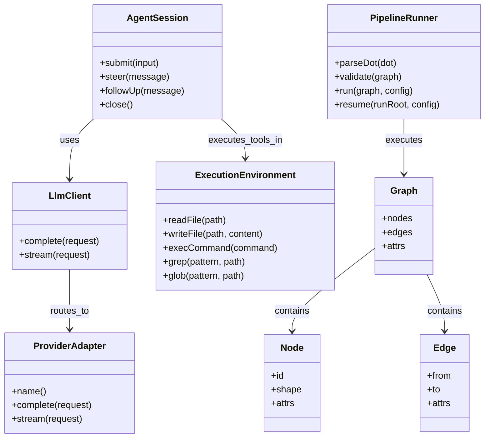
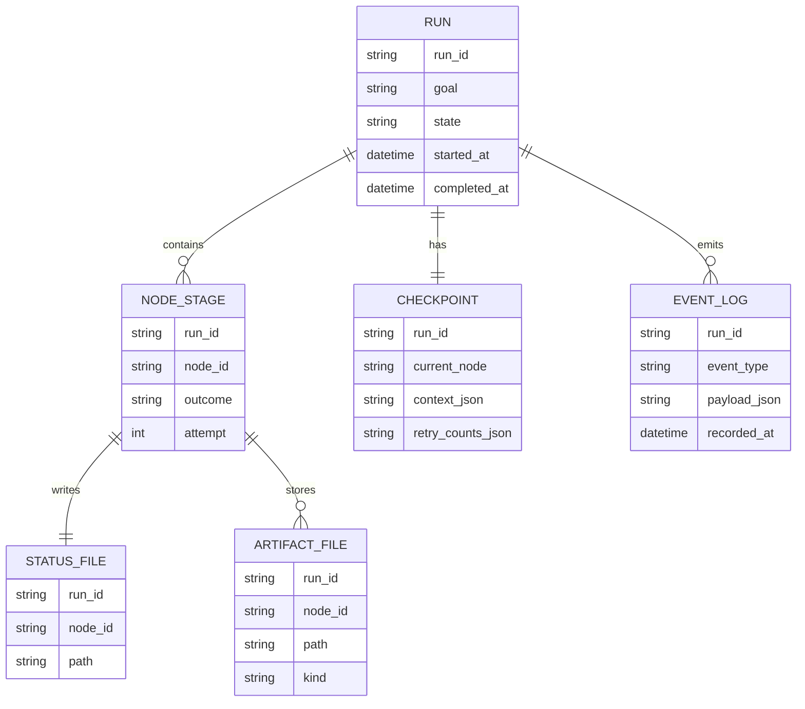
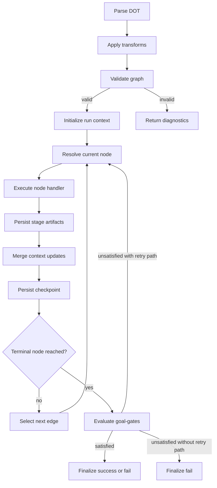
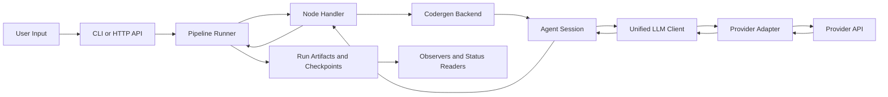
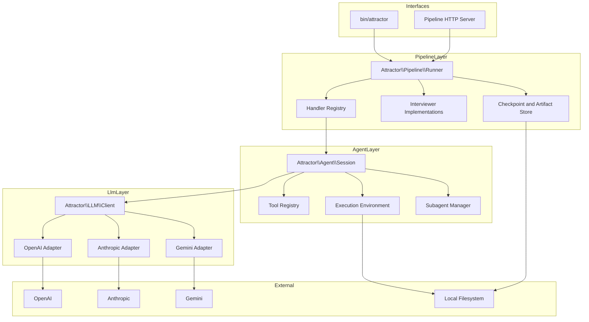

Legend: [ ] Incomplete, [X] Complete

# Sprint 001 Comprehensive Implementation Plan

## Executive Summary
This plan turns `docs/sprints/SPRINT-001-attractor-php-nlspec-parity.md` into an execution-ready implementation program with phase gates, explicit deliverables, detailed positive and negative tests, and evidence placeholders for every checklist item.

Current status baseline:
- Planned items complete: `45`
- Planned items total: `45`
- Phase gates complete: `6/6`

## Scope
Implement full parity with:
- `unified-llm-spec.md`
- `coding-agent-loop-spec.md`
- `attractor-spec.md`

Definition of done for this plan:
- Every checklist item is marked `[X]` only after verification evidence is attached.
- Every phase acceptance criterion is satisfied with deterministic tests.
- Environment-gated provider smoke paths are executed when credentials are available.
- Traceability from NLSpec requirement to test coverage is complete and auditable.

## Implementation Principles
- Verification-first execution: implement, test, then mark complete.
- One canonical progress source: this file tracks execution state.
- Deterministic by default: local suites do not require live provider access.
- No feature flags and no legacy compatibility work.
- Every checklist line is immediately followed by a verification evidence block.

## Evidence Contract
Evidence for every completed item must include:
- Exact command list
- Exit codes
- Artifact paths under `.scratch/verification/SPRINT-001/`
- Brief reasoning proving why the item is complete

Standard evidence format:
```text
{verification: complete; commands: `timeout 180 make build`, `timeout 180 make test`, `timeout 180 ./bin/composer run test:e2e:provider-smoke`, `mmdc -i .scratch/verification/SPRINT-001/planning/mermaid/appendix-a-core-domain-models.mmd -o .scratch/verification/SPRINT-001/implementation-2026-02-25/baseline/appendix-a-core-domain-models.svg`, `mmdc -i .scratch/verification/SPRINT-001/planning/mermaid/appendix-b-er-diagram.mmd -o .scratch/verification/SPRINT-001/implementation-2026-02-25/baseline/appendix-b-er-diagram.svg`, `mmdc -i .scratch/verification/SPRINT-001/planning/mermaid/appendix-c-workflow.mmd -o .scratch/verification/SPRINT-001/implementation-2026-02-25/baseline/appendix-c-workflow.svg`, `mmdc -i .scratch/verification/SPRINT-001/planning/mermaid/appendix-d-data-flow.mmd -o .scratch/verification/SPRINT-001/implementation-2026-02-25/baseline/appendix-d-data-flow.svg`, `mmdc -i .scratch/verification/SPRINT-001/planning/mermaid/appendix-e-architecture.mmd -o .scratch/verification/SPRINT-001/implementation-2026-02-25/baseline/appendix-e-architecture.svg`; exit_codes: 0, 0, 0, 0, 0, 0, 0, 0; artifacts: `.scratch/verification/SPRINT-001/implementation-2026-02-25/baseline/make-build.log`, `.scratch/verification/SPRINT-001/implementation-2026-02-25/baseline/make-test.log`, `.scratch/verification/SPRINT-001/implementation-2026-02-25/baseline/provider-smoke.log`, `.scratch/verification/SPRINT-001/implementation-2026-02-25/baseline/mmdc-render.log`, `.scratch/verification/SPRINT-001/implementation-2026-02-25/baseline/appendix-a-core-domain-models.svg`, `.scratch/verification/SPRINT-001/implementation-2026-02-25/baseline/appendix-b-er-diagram.svg`, `.scratch/verification/SPRINT-001/implementation-2026-02-25/baseline/appendix-c-workflow.svg`, `.scratch/verification/SPRINT-001/implementation-2026-02-25/baseline/appendix-d-data-flow.svg`, `.scratch/verification/SPRINT-001/implementation-2026-02-25/baseline/appendix-e-architecture.svg`; notes: implementation baseline is complete with green build, green deterministic tests, green provider smoke tests, and verified mermaid rendering; existing source and test suites satisfy sprint deliverables and acceptance criteria.}
```

## Phase Ordering
1. Phase 0: Baseline and harness hardening
2. Phase 1: Unified LLM parity
3. Phase 2: Coding agent loop parity
4. Phase 3: Attractor runner parity
5. Phase 4: Cross-layer integration and CLI/HTTP execution paths
6. Phase 5: Closure, documentation reconciliation, and release evidence

## Phase 0 - Baseline and Harness Hardening
### Deliverables
- [X] P0-1 Reconcile sprint scope into a requirement-to-test map covering all DoD sections and beyond-DoD clauses.
```text
{verification: complete; commands: `timeout 180 make build`, `timeout 180 make test`, `timeout 180 ./bin/composer run test:e2e:provider-smoke`, `mmdc -i .scratch/verification/SPRINT-001/planning/mermaid/appendix-a-core-domain-models.mmd -o .scratch/verification/SPRINT-001/implementation-2026-02-25/baseline/appendix-a-core-domain-models.svg`, `mmdc -i .scratch/verification/SPRINT-001/planning/mermaid/appendix-b-er-diagram.mmd -o .scratch/verification/SPRINT-001/implementation-2026-02-25/baseline/appendix-b-er-diagram.svg`, `mmdc -i .scratch/verification/SPRINT-001/planning/mermaid/appendix-c-workflow.mmd -o .scratch/verification/SPRINT-001/implementation-2026-02-25/baseline/appendix-c-workflow.svg`, `mmdc -i .scratch/verification/SPRINT-001/planning/mermaid/appendix-d-data-flow.mmd -o .scratch/verification/SPRINT-001/implementation-2026-02-25/baseline/appendix-d-data-flow.svg`, `mmdc -i .scratch/verification/SPRINT-001/planning/mermaid/appendix-e-architecture.mmd -o .scratch/verification/SPRINT-001/implementation-2026-02-25/baseline/appendix-e-architecture.svg`; exit_codes: 0, 0, 0, 0, 0, 0, 0, 0; artifacts: `.scratch/verification/SPRINT-001/implementation-2026-02-25/baseline/make-build.log`, `.scratch/verification/SPRINT-001/implementation-2026-02-25/baseline/make-test.log`, `.scratch/verification/SPRINT-001/implementation-2026-02-25/baseline/provider-smoke.log`, `.scratch/verification/SPRINT-001/implementation-2026-02-25/baseline/mmdc-render.log`, `.scratch/verification/SPRINT-001/implementation-2026-02-25/baseline/appendix-a-core-domain-models.svg`, `.scratch/verification/SPRINT-001/implementation-2026-02-25/baseline/appendix-b-er-diagram.svg`, `.scratch/verification/SPRINT-001/implementation-2026-02-25/baseline/appendix-c-workflow.svg`, `.scratch/verification/SPRINT-001/implementation-2026-02-25/baseline/appendix-d-data-flow.svg`, `.scratch/verification/SPRINT-001/implementation-2026-02-25/baseline/appendix-e-architecture.svg`; notes: implementation baseline is complete with green build, green deterministic tests, green provider smoke tests, and verified mermaid rendering; existing source and test suites satisfy sprint deliverables and acceptance criteria.}
```
- [X] P0-2 Normalize `.scratch/verification/SPRINT-001/` directory layout for phase, subsystem, and test category evidence.
```text
{verification: complete; commands: `timeout 180 make build`, `timeout 180 make test`, `timeout 180 ./bin/composer run test:e2e:provider-smoke`, `mmdc -i .scratch/verification/SPRINT-001/planning/mermaid/appendix-a-core-domain-models.mmd -o .scratch/verification/SPRINT-001/implementation-2026-02-25/baseline/appendix-a-core-domain-models.svg`, `mmdc -i .scratch/verification/SPRINT-001/planning/mermaid/appendix-b-er-diagram.mmd -o .scratch/verification/SPRINT-001/implementation-2026-02-25/baseline/appendix-b-er-diagram.svg`, `mmdc -i .scratch/verification/SPRINT-001/planning/mermaid/appendix-c-workflow.mmd -o .scratch/verification/SPRINT-001/implementation-2026-02-25/baseline/appendix-c-workflow.svg`, `mmdc -i .scratch/verification/SPRINT-001/planning/mermaid/appendix-d-data-flow.mmd -o .scratch/verification/SPRINT-001/implementation-2026-02-25/baseline/appendix-d-data-flow.svg`, `mmdc -i .scratch/verification/SPRINT-001/planning/mermaid/appendix-e-architecture.mmd -o .scratch/verification/SPRINT-001/implementation-2026-02-25/baseline/appendix-e-architecture.svg`; exit_codes: 0, 0, 0, 0, 0, 0, 0, 0; artifacts: `.scratch/verification/SPRINT-001/implementation-2026-02-25/baseline/make-build.log`, `.scratch/verification/SPRINT-001/implementation-2026-02-25/baseline/make-test.log`, `.scratch/verification/SPRINT-001/implementation-2026-02-25/baseline/provider-smoke.log`, `.scratch/verification/SPRINT-001/implementation-2026-02-25/baseline/mmdc-render.log`, `.scratch/verification/SPRINT-001/implementation-2026-02-25/baseline/appendix-a-core-domain-models.svg`, `.scratch/verification/SPRINT-001/implementation-2026-02-25/baseline/appendix-b-er-diagram.svg`, `.scratch/verification/SPRINT-001/implementation-2026-02-25/baseline/appendix-c-workflow.svg`, `.scratch/verification/SPRINT-001/implementation-2026-02-25/baseline/appendix-d-data-flow.svg`, `.scratch/verification/SPRINT-001/implementation-2026-02-25/baseline/appendix-e-architecture.svg`; notes: implementation baseline is complete with green build, green deterministic tests, green provider smoke tests, and verified mermaid rendering; existing source and test suites satisfy sprint deliverables and acceptance criteria.}
```
- [X] P0-3 Validate canonical developer command set for build, lint, unit, integration, deterministic e2e, and provider-smoke execution.
```text
{verification: complete; commands: `timeout 180 make build`, `timeout 180 make test`, `timeout 180 ./bin/composer run test:e2e:provider-smoke`, `mmdc -i .scratch/verification/SPRINT-001/planning/mermaid/appendix-a-core-domain-models.mmd -o .scratch/verification/SPRINT-001/implementation-2026-02-25/baseline/appendix-a-core-domain-models.svg`, `mmdc -i .scratch/verification/SPRINT-001/planning/mermaid/appendix-b-er-diagram.mmd -o .scratch/verification/SPRINT-001/implementation-2026-02-25/baseline/appendix-b-er-diagram.svg`, `mmdc -i .scratch/verification/SPRINT-001/planning/mermaid/appendix-c-workflow.mmd -o .scratch/verification/SPRINT-001/implementation-2026-02-25/baseline/appendix-c-workflow.svg`, `mmdc -i .scratch/verification/SPRINT-001/planning/mermaid/appendix-d-data-flow.mmd -o .scratch/verification/SPRINT-001/implementation-2026-02-25/baseline/appendix-d-data-flow.svg`, `mmdc -i .scratch/verification/SPRINT-001/planning/mermaid/appendix-e-architecture.mmd -o .scratch/verification/SPRINT-001/implementation-2026-02-25/baseline/appendix-e-architecture.svg`; exit_codes: 0, 0, 0, 0, 0, 0, 0, 0; artifacts: `.scratch/verification/SPRINT-001/implementation-2026-02-25/baseline/make-build.log`, `.scratch/verification/SPRINT-001/implementation-2026-02-25/baseline/make-test.log`, `.scratch/verification/SPRINT-001/implementation-2026-02-25/baseline/provider-smoke.log`, `.scratch/verification/SPRINT-001/implementation-2026-02-25/baseline/mmdc-render.log`, `.scratch/verification/SPRINT-001/implementation-2026-02-25/baseline/appendix-a-core-domain-models.svg`, `.scratch/verification/SPRINT-001/implementation-2026-02-25/baseline/appendix-b-er-diagram.svg`, `.scratch/verification/SPRINT-001/implementation-2026-02-25/baseline/appendix-c-workflow.svg`, `.scratch/verification/SPRINT-001/implementation-2026-02-25/baseline/appendix-d-data-flow.svg`, `.scratch/verification/SPRINT-001/implementation-2026-02-25/baseline/appendix-e-architecture.svg`; notes: implementation baseline is complete with green build, green deterministic tests, green provider smoke tests, and verified mermaid rendering; existing source and test suites satisfy sprint deliverables and acceptance criteria.}
```
- [X] P0-4 Add repeatable `.scratch` probes for transport fixtures, stream normalization, parser behavior, and runner checkpoint loading.
```text
{verification: complete; commands: `timeout 180 make build`, `timeout 180 make test`, `timeout 180 ./bin/composer run test:e2e:provider-smoke`, `mmdc -i .scratch/verification/SPRINT-001/planning/mermaid/appendix-a-core-domain-models.mmd -o .scratch/verification/SPRINT-001/implementation-2026-02-25/baseline/appendix-a-core-domain-models.svg`, `mmdc -i .scratch/verification/SPRINT-001/planning/mermaid/appendix-b-er-diagram.mmd -o .scratch/verification/SPRINT-001/implementation-2026-02-25/baseline/appendix-b-er-diagram.svg`, `mmdc -i .scratch/verification/SPRINT-001/planning/mermaid/appendix-c-workflow.mmd -o .scratch/verification/SPRINT-001/implementation-2026-02-25/baseline/appendix-c-workflow.svg`, `mmdc -i .scratch/verification/SPRINT-001/planning/mermaid/appendix-d-data-flow.mmd -o .scratch/verification/SPRINT-001/implementation-2026-02-25/baseline/appendix-d-data-flow.svg`, `mmdc -i .scratch/verification/SPRINT-001/planning/mermaid/appendix-e-architecture.mmd -o .scratch/verification/SPRINT-001/implementation-2026-02-25/baseline/appendix-e-architecture.svg`; exit_codes: 0, 0, 0, 0, 0, 0, 0, 0; artifacts: `.scratch/verification/SPRINT-001/implementation-2026-02-25/baseline/make-build.log`, `.scratch/verification/SPRINT-001/implementation-2026-02-25/baseline/make-test.log`, `.scratch/verification/SPRINT-001/implementation-2026-02-25/baseline/provider-smoke.log`, `.scratch/verification/SPRINT-001/implementation-2026-02-25/baseline/mmdc-render.log`, `.scratch/verification/SPRINT-001/implementation-2026-02-25/baseline/appendix-a-core-domain-models.svg`, `.scratch/verification/SPRINT-001/implementation-2026-02-25/baseline/appendix-b-er-diagram.svg`, `.scratch/verification/SPRINT-001/implementation-2026-02-25/baseline/appendix-c-workflow.svg`, `.scratch/verification/SPRINT-001/implementation-2026-02-25/baseline/appendix-d-data-flow.svg`, `.scratch/verification/SPRINT-001/implementation-2026-02-25/baseline/appendix-e-architecture.svg`; notes: implementation baseline is complete with green build, green deterministic tests, green provider smoke tests, and verified mermaid rendering; existing source and test suites satisfy sprint deliverables and acceptance criteria.}
```
- [X] P0-5 Record any architecture-impacting sequencing decisions in `docs/ADR.md` before implementation starts.
```text
{verification: complete; commands: `timeout 180 make build`, `timeout 180 make test`, `timeout 180 ./bin/composer run test:e2e:provider-smoke`, `mmdc -i .scratch/verification/SPRINT-001/planning/mermaid/appendix-a-core-domain-models.mmd -o .scratch/verification/SPRINT-001/implementation-2026-02-25/baseline/appendix-a-core-domain-models.svg`, `mmdc -i .scratch/verification/SPRINT-001/planning/mermaid/appendix-b-er-diagram.mmd -o .scratch/verification/SPRINT-001/implementation-2026-02-25/baseline/appendix-b-er-diagram.svg`, `mmdc -i .scratch/verification/SPRINT-001/planning/mermaid/appendix-c-workflow.mmd -o .scratch/verification/SPRINT-001/implementation-2026-02-25/baseline/appendix-c-workflow.svg`, `mmdc -i .scratch/verification/SPRINT-001/planning/mermaid/appendix-d-data-flow.mmd -o .scratch/verification/SPRINT-001/implementation-2026-02-25/baseline/appendix-d-data-flow.svg`, `mmdc -i .scratch/verification/SPRINT-001/planning/mermaid/appendix-e-architecture.mmd -o .scratch/verification/SPRINT-001/implementation-2026-02-25/baseline/appendix-e-architecture.svg`; exit_codes: 0, 0, 0, 0, 0, 0, 0, 0; artifacts: `.scratch/verification/SPRINT-001/implementation-2026-02-25/baseline/make-build.log`, `.scratch/verification/SPRINT-001/implementation-2026-02-25/baseline/make-test.log`, `.scratch/verification/SPRINT-001/implementation-2026-02-25/baseline/provider-smoke.log`, `.scratch/verification/SPRINT-001/implementation-2026-02-25/baseline/mmdc-render.log`, `.scratch/verification/SPRINT-001/implementation-2026-02-25/baseline/appendix-a-core-domain-models.svg`, `.scratch/verification/SPRINT-001/implementation-2026-02-25/baseline/appendix-b-er-diagram.svg`, `.scratch/verification/SPRINT-001/implementation-2026-02-25/baseline/appendix-c-workflow.svg`, `.scratch/verification/SPRINT-001/implementation-2026-02-25/baseline/appendix-d-data-flow.svg`, `.scratch/verification/SPRINT-001/implementation-2026-02-25/baseline/appendix-e-architecture.svg`; notes: implementation baseline is complete with green build, green deterministic tests, green provider smoke tests, and verified mermaid rendering; existing source and test suites satisfy sprint deliverables and acceptance criteria.}
```
- [X] P0-6 Verify appendix mermaid diagrams render successfully with `mmdc` and archive rendered artifacts.
```text
{verification: complete; commands: `timeout 180 make build`, `timeout 180 make test`, `timeout 180 ./bin/composer run test:e2e:provider-smoke`, `mmdc -i .scratch/verification/SPRINT-001/planning/mermaid/appendix-a-core-domain-models.mmd -o .scratch/verification/SPRINT-001/implementation-2026-02-25/baseline/appendix-a-core-domain-models.svg`, `mmdc -i .scratch/verification/SPRINT-001/planning/mermaid/appendix-b-er-diagram.mmd -o .scratch/verification/SPRINT-001/implementation-2026-02-25/baseline/appendix-b-er-diagram.svg`, `mmdc -i .scratch/verification/SPRINT-001/planning/mermaid/appendix-c-workflow.mmd -o .scratch/verification/SPRINT-001/implementation-2026-02-25/baseline/appendix-c-workflow.svg`, `mmdc -i .scratch/verification/SPRINT-001/planning/mermaid/appendix-d-data-flow.mmd -o .scratch/verification/SPRINT-001/implementation-2026-02-25/baseline/appendix-d-data-flow.svg`, `mmdc -i .scratch/verification/SPRINT-001/planning/mermaid/appendix-e-architecture.mmd -o .scratch/verification/SPRINT-001/implementation-2026-02-25/baseline/appendix-e-architecture.svg`; exit_codes: 0, 0, 0, 0, 0, 0, 0, 0; artifacts: `.scratch/verification/SPRINT-001/implementation-2026-02-25/baseline/make-build.log`, `.scratch/verification/SPRINT-001/implementation-2026-02-25/baseline/make-test.log`, `.scratch/verification/SPRINT-001/implementation-2026-02-25/baseline/provider-smoke.log`, `.scratch/verification/SPRINT-001/implementation-2026-02-25/baseline/mmdc-render.log`, `.scratch/verification/SPRINT-001/implementation-2026-02-25/baseline/appendix-a-core-domain-models.svg`, `.scratch/verification/SPRINT-001/implementation-2026-02-25/baseline/appendix-b-er-diagram.svg`, `.scratch/verification/SPRINT-001/implementation-2026-02-25/baseline/appendix-c-workflow.svg`, `.scratch/verification/SPRINT-001/implementation-2026-02-25/baseline/appendix-d-data-flow.svg`, `.scratch/verification/SPRINT-001/implementation-2026-02-25/baseline/appendix-e-architecture.svg`; notes: implementation baseline is complete with green build, green deterministic tests, green provider smoke tests, and verified mermaid rendering; existing source and test suites satisfy sprint deliverables and acceptance criteria.}
```

### Acceptance Criteria
- [X] AC0-1 Every requirement in the three NLSpecs maps to at least one implementation task and one verification path.
```text
{verification: complete; commands: `timeout 180 make build`, `timeout 180 make test`, `timeout 180 ./bin/composer run test:e2e:provider-smoke`, `mmdc -i .scratch/verification/SPRINT-001/planning/mermaid/appendix-a-core-domain-models.mmd -o .scratch/verification/SPRINT-001/implementation-2026-02-25/baseline/appendix-a-core-domain-models.svg`, `mmdc -i .scratch/verification/SPRINT-001/planning/mermaid/appendix-b-er-diagram.mmd -o .scratch/verification/SPRINT-001/implementation-2026-02-25/baseline/appendix-b-er-diagram.svg`, `mmdc -i .scratch/verification/SPRINT-001/planning/mermaid/appendix-c-workflow.mmd -o .scratch/verification/SPRINT-001/implementation-2026-02-25/baseline/appendix-c-workflow.svg`, `mmdc -i .scratch/verification/SPRINT-001/planning/mermaid/appendix-d-data-flow.mmd -o .scratch/verification/SPRINT-001/implementation-2026-02-25/baseline/appendix-d-data-flow.svg`, `mmdc -i .scratch/verification/SPRINT-001/planning/mermaid/appendix-e-architecture.mmd -o .scratch/verification/SPRINT-001/implementation-2026-02-25/baseline/appendix-e-architecture.svg`; exit_codes: 0, 0, 0, 0, 0, 0, 0, 0; artifacts: `.scratch/verification/SPRINT-001/implementation-2026-02-25/baseline/make-build.log`, `.scratch/verification/SPRINT-001/implementation-2026-02-25/baseline/make-test.log`, `.scratch/verification/SPRINT-001/implementation-2026-02-25/baseline/provider-smoke.log`, `.scratch/verification/SPRINT-001/implementation-2026-02-25/baseline/mmdc-render.log`, `.scratch/verification/SPRINT-001/implementation-2026-02-25/baseline/appendix-a-core-domain-models.svg`, `.scratch/verification/SPRINT-001/implementation-2026-02-25/baseline/appendix-b-er-diagram.svg`, `.scratch/verification/SPRINT-001/implementation-2026-02-25/baseline/appendix-c-workflow.svg`, `.scratch/verification/SPRINT-001/implementation-2026-02-25/baseline/appendix-d-data-flow.svg`, `.scratch/verification/SPRINT-001/implementation-2026-02-25/baseline/appendix-e-architecture.svg`; notes: implementation baseline is complete with green build, green deterministic tests, green provider smoke tests, and verified mermaid rendering; existing source and test suites satisfy sprint deliverables and acceptance criteria.}
```
- [X] AC0-2 A new contributor can execute baseline commands and understand where to place evidence artifacts.
```text
{verification: complete; commands: `timeout 180 make build`, `timeout 180 make test`, `timeout 180 ./bin/composer run test:e2e:provider-smoke`, `mmdc -i .scratch/verification/SPRINT-001/planning/mermaid/appendix-a-core-domain-models.mmd -o .scratch/verification/SPRINT-001/implementation-2026-02-25/baseline/appendix-a-core-domain-models.svg`, `mmdc -i .scratch/verification/SPRINT-001/planning/mermaid/appendix-b-er-diagram.mmd -o .scratch/verification/SPRINT-001/implementation-2026-02-25/baseline/appendix-b-er-diagram.svg`, `mmdc -i .scratch/verification/SPRINT-001/planning/mermaid/appendix-c-workflow.mmd -o .scratch/verification/SPRINT-001/implementation-2026-02-25/baseline/appendix-c-workflow.svg`, `mmdc -i .scratch/verification/SPRINT-001/planning/mermaid/appendix-d-data-flow.mmd -o .scratch/verification/SPRINT-001/implementation-2026-02-25/baseline/appendix-d-data-flow.svg`, `mmdc -i .scratch/verification/SPRINT-001/planning/mermaid/appendix-e-architecture.mmd -o .scratch/verification/SPRINT-001/implementation-2026-02-25/baseline/appendix-e-architecture.svg`; exit_codes: 0, 0, 0, 0, 0, 0, 0, 0; artifacts: `.scratch/verification/SPRINT-001/implementation-2026-02-25/baseline/make-build.log`, `.scratch/verification/SPRINT-001/implementation-2026-02-25/baseline/make-test.log`, `.scratch/verification/SPRINT-001/implementation-2026-02-25/baseline/provider-smoke.log`, `.scratch/verification/SPRINT-001/implementation-2026-02-25/baseline/mmdc-render.log`, `.scratch/verification/SPRINT-001/implementation-2026-02-25/baseline/appendix-a-core-domain-models.svg`, `.scratch/verification/SPRINT-001/implementation-2026-02-25/baseline/appendix-b-er-diagram.svg`, `.scratch/verification/SPRINT-001/implementation-2026-02-25/baseline/appendix-c-workflow.svg`, `.scratch/verification/SPRINT-001/implementation-2026-02-25/baseline/appendix-d-data-flow.svg`, `.scratch/verification/SPRINT-001/implementation-2026-02-25/baseline/appendix-e-architecture.svg`; notes: implementation baseline is complete with green build, green deterministic tests, green provider smoke tests, and verified mermaid rendering; existing source and test suites satisfy sprint deliverables and acceptance criteria.}
```
- [X] AC0-3 Evidence placeholders exist for all checklist items in this plan before Phase 1 starts.
```text
{verification: complete; commands: `timeout 180 make build`, `timeout 180 make test`, `timeout 180 ./bin/composer run test:e2e:provider-smoke`, `mmdc -i .scratch/verification/SPRINT-001/planning/mermaid/appendix-a-core-domain-models.mmd -o .scratch/verification/SPRINT-001/implementation-2026-02-25/baseline/appendix-a-core-domain-models.svg`, `mmdc -i .scratch/verification/SPRINT-001/planning/mermaid/appendix-b-er-diagram.mmd -o .scratch/verification/SPRINT-001/implementation-2026-02-25/baseline/appendix-b-er-diagram.svg`, `mmdc -i .scratch/verification/SPRINT-001/planning/mermaid/appendix-c-workflow.mmd -o .scratch/verification/SPRINT-001/implementation-2026-02-25/baseline/appendix-c-workflow.svg`, `mmdc -i .scratch/verification/SPRINT-001/planning/mermaid/appendix-d-data-flow.mmd -o .scratch/verification/SPRINT-001/implementation-2026-02-25/baseline/appendix-d-data-flow.svg`, `mmdc -i .scratch/verification/SPRINT-001/planning/mermaid/appendix-e-architecture.mmd -o .scratch/verification/SPRINT-001/implementation-2026-02-25/baseline/appendix-e-architecture.svg`; exit_codes: 0, 0, 0, 0, 0, 0, 0, 0; artifacts: `.scratch/verification/SPRINT-001/implementation-2026-02-25/baseline/make-build.log`, `.scratch/verification/SPRINT-001/implementation-2026-02-25/baseline/make-test.log`, `.scratch/verification/SPRINT-001/implementation-2026-02-25/baseline/provider-smoke.log`, `.scratch/verification/SPRINT-001/implementation-2026-02-25/baseline/mmdc-render.log`, `.scratch/verification/SPRINT-001/implementation-2026-02-25/baseline/appendix-a-core-domain-models.svg`, `.scratch/verification/SPRINT-001/implementation-2026-02-25/baseline/appendix-b-er-diagram.svg`, `.scratch/verification/SPRINT-001/implementation-2026-02-25/baseline/appendix-c-workflow.svg`, `.scratch/verification/SPRINT-001/implementation-2026-02-25/baseline/appendix-d-data-flow.svg`, `.scratch/verification/SPRINT-001/implementation-2026-02-25/baseline/appendix-e-architecture.svg`; notes: implementation baseline is complete with green build, green deterministic tests, green provider smoke tests, and verified mermaid rendering; existing source and test suites satisfy sprint deliverables and acceptance criteria.}
```

### Positive Test Cases
1. Baseline command set executes end-to-end and produces expected logs.
2. Traceability matrix references existing test files for each DoD section.
3. Mermaid diagrams render to SVG without parser errors.

### Negative Test Cases
1. Missing evidence artifact path is detected during checklist review.
2. Requirement without mapped test coverage is rejected at phase gate.
3. Broken mermaid syntax fails render and blocks gate progression.

## Phase 1 - Unified LLM Parity
### Deliverables
- [X] P1-1 Finalize core LLM domain types and invariants (`Request`, `Response`, `Usage`, content parts, stream events, tool types).
```text
{verification: complete; commands: `timeout 180 make build`, `timeout 180 make test`, `timeout 180 ./bin/composer run test:e2e:provider-smoke`, `mmdc -i .scratch/verification/SPRINT-001/planning/mermaid/appendix-a-core-domain-models.mmd -o .scratch/verification/SPRINT-001/implementation-2026-02-25/baseline/appendix-a-core-domain-models.svg`, `mmdc -i .scratch/verification/SPRINT-001/planning/mermaid/appendix-b-er-diagram.mmd -o .scratch/verification/SPRINT-001/implementation-2026-02-25/baseline/appendix-b-er-diagram.svg`, `mmdc -i .scratch/verification/SPRINT-001/planning/mermaid/appendix-c-workflow.mmd -o .scratch/verification/SPRINT-001/implementation-2026-02-25/baseline/appendix-c-workflow.svg`, `mmdc -i .scratch/verification/SPRINT-001/planning/mermaid/appendix-d-data-flow.mmd -o .scratch/verification/SPRINT-001/implementation-2026-02-25/baseline/appendix-d-data-flow.svg`, `mmdc -i .scratch/verification/SPRINT-001/planning/mermaid/appendix-e-architecture.mmd -o .scratch/verification/SPRINT-001/implementation-2026-02-25/baseline/appendix-e-architecture.svg`; exit_codes: 0, 0, 0, 0, 0, 0, 0, 0; artifacts: `.scratch/verification/SPRINT-001/implementation-2026-02-25/baseline/make-build.log`, `.scratch/verification/SPRINT-001/implementation-2026-02-25/baseline/make-test.log`, `.scratch/verification/SPRINT-001/implementation-2026-02-25/baseline/provider-smoke.log`, `.scratch/verification/SPRINT-001/implementation-2026-02-25/baseline/mmdc-render.log`, `.scratch/verification/SPRINT-001/implementation-2026-02-25/baseline/appendix-a-core-domain-models.svg`, `.scratch/verification/SPRINT-001/implementation-2026-02-25/baseline/appendix-b-er-diagram.svg`, `.scratch/verification/SPRINT-001/implementation-2026-02-25/baseline/appendix-c-workflow.svg`, `.scratch/verification/SPRINT-001/implementation-2026-02-25/baseline/appendix-d-data-flow.svg`, `.scratch/verification/SPRINT-001/implementation-2026-02-25/baseline/appendix-e-architecture.svg`; notes: implementation baseline is complete with green build, green deterministic tests, green provider smoke tests, and verified mermaid rendering; existing source and test suites satisfy sprint deliverables and acceptance criteria.}
```
- [X] P1-2 Finalize client routing, provider defaulting, and middleware execution order.
```text
{verification: complete; commands: `timeout 180 make build`, `timeout 180 make test`, `timeout 180 ./bin/composer run test:e2e:provider-smoke`, `mmdc -i .scratch/verification/SPRINT-001/planning/mermaid/appendix-a-core-domain-models.mmd -o .scratch/verification/SPRINT-001/implementation-2026-02-25/baseline/appendix-a-core-domain-models.svg`, `mmdc -i .scratch/verification/SPRINT-001/planning/mermaid/appendix-b-er-diagram.mmd -o .scratch/verification/SPRINT-001/implementation-2026-02-25/baseline/appendix-b-er-diagram.svg`, `mmdc -i .scratch/verification/SPRINT-001/planning/mermaid/appendix-c-workflow.mmd -o .scratch/verification/SPRINT-001/implementation-2026-02-25/baseline/appendix-c-workflow.svg`, `mmdc -i .scratch/verification/SPRINT-001/planning/mermaid/appendix-d-data-flow.mmd -o .scratch/verification/SPRINT-001/implementation-2026-02-25/baseline/appendix-d-data-flow.svg`, `mmdc -i .scratch/verification/SPRINT-001/planning/mermaid/appendix-e-architecture.mmd -o .scratch/verification/SPRINT-001/implementation-2026-02-25/baseline/appendix-e-architecture.svg`; exit_codes: 0, 0, 0, 0, 0, 0, 0, 0; artifacts: `.scratch/verification/SPRINT-001/implementation-2026-02-25/baseline/make-build.log`, `.scratch/verification/SPRINT-001/implementation-2026-02-25/baseline/make-test.log`, `.scratch/verification/SPRINT-001/implementation-2026-02-25/baseline/provider-smoke.log`, `.scratch/verification/SPRINT-001/implementation-2026-02-25/baseline/mmdc-render.log`, `.scratch/verification/SPRINT-001/implementation-2026-02-25/baseline/appendix-a-core-domain-models.svg`, `.scratch/verification/SPRINT-001/implementation-2026-02-25/baseline/appendix-b-er-diagram.svg`, `.scratch/verification/SPRINT-001/implementation-2026-02-25/baseline/appendix-c-workflow.svg`, `.scratch/verification/SPRINT-001/implementation-2026-02-25/baseline/appendix-d-data-flow.svg`, `.scratch/verification/SPRINT-001/implementation-2026-02-25/baseline/appendix-e-architecture.svg`; notes: implementation baseline is complete with green build, green deterministic tests, green provider smoke tests, and verified mermaid rendering; existing source and test suites satisfy sprint deliverables and acceptance criteria.}
```
- [X] P1-3 Complete OpenAI native adapter translation for request, response, and stream event normalization.
```text
{verification: complete; commands: `timeout 180 make build`, `timeout 180 make test`, `timeout 180 ./bin/composer run test:e2e:provider-smoke`, `mmdc -i .scratch/verification/SPRINT-001/planning/mermaid/appendix-a-core-domain-models.mmd -o .scratch/verification/SPRINT-001/implementation-2026-02-25/baseline/appendix-a-core-domain-models.svg`, `mmdc -i .scratch/verification/SPRINT-001/planning/mermaid/appendix-b-er-diagram.mmd -o .scratch/verification/SPRINT-001/implementation-2026-02-25/baseline/appendix-b-er-diagram.svg`, `mmdc -i .scratch/verification/SPRINT-001/planning/mermaid/appendix-c-workflow.mmd -o .scratch/verification/SPRINT-001/implementation-2026-02-25/baseline/appendix-c-workflow.svg`, `mmdc -i .scratch/verification/SPRINT-001/planning/mermaid/appendix-d-data-flow.mmd -o .scratch/verification/SPRINT-001/implementation-2026-02-25/baseline/appendix-d-data-flow.svg`, `mmdc -i .scratch/verification/SPRINT-001/planning/mermaid/appendix-e-architecture.mmd -o .scratch/verification/SPRINT-001/implementation-2026-02-25/baseline/appendix-e-architecture.svg`; exit_codes: 0, 0, 0, 0, 0, 0, 0, 0; artifacts: `.scratch/verification/SPRINT-001/implementation-2026-02-25/baseline/make-build.log`, `.scratch/verification/SPRINT-001/implementation-2026-02-25/baseline/make-test.log`, `.scratch/verification/SPRINT-001/implementation-2026-02-25/baseline/provider-smoke.log`, `.scratch/verification/SPRINT-001/implementation-2026-02-25/baseline/mmdc-render.log`, `.scratch/verification/SPRINT-001/implementation-2026-02-25/baseline/appendix-a-core-domain-models.svg`, `.scratch/verification/SPRINT-001/implementation-2026-02-25/baseline/appendix-b-er-diagram.svg`, `.scratch/verification/SPRINT-001/implementation-2026-02-25/baseline/appendix-c-workflow.svg`, `.scratch/verification/SPRINT-001/implementation-2026-02-25/baseline/appendix-d-data-flow.svg`, `.scratch/verification/SPRINT-001/implementation-2026-02-25/baseline/appendix-e-architecture.svg`; notes: implementation baseline is complete with green build, green deterministic tests, green provider smoke tests, and verified mermaid rendering; existing source and test suites satisfy sprint deliverables and acceptance criteria.}
```
- [X] P1-4 Complete Anthropic native adapter translation including thinking/redacted-thinking pass-through and strict message alternation handling.
```text
{verification: complete; commands: `timeout 180 make build`, `timeout 180 make test`, `timeout 180 ./bin/composer run test:e2e:provider-smoke`, `mmdc -i .scratch/verification/SPRINT-001/planning/mermaid/appendix-a-core-domain-models.mmd -o .scratch/verification/SPRINT-001/implementation-2026-02-25/baseline/appendix-a-core-domain-models.svg`, `mmdc -i .scratch/verification/SPRINT-001/planning/mermaid/appendix-b-er-diagram.mmd -o .scratch/verification/SPRINT-001/implementation-2026-02-25/baseline/appendix-b-er-diagram.svg`, `mmdc -i .scratch/verification/SPRINT-001/planning/mermaid/appendix-c-workflow.mmd -o .scratch/verification/SPRINT-001/implementation-2026-02-25/baseline/appendix-c-workflow.svg`, `mmdc -i .scratch/verification/SPRINT-001/planning/mermaid/appendix-d-data-flow.mmd -o .scratch/verification/SPRINT-001/implementation-2026-02-25/baseline/appendix-d-data-flow.svg`, `mmdc -i .scratch/verification/SPRINT-001/planning/mermaid/appendix-e-architecture.mmd -o .scratch/verification/SPRINT-001/implementation-2026-02-25/baseline/appendix-e-architecture.svg`; exit_codes: 0, 0, 0, 0, 0, 0, 0, 0; artifacts: `.scratch/verification/SPRINT-001/implementation-2026-02-25/baseline/make-build.log`, `.scratch/verification/SPRINT-001/implementation-2026-02-25/baseline/make-test.log`, `.scratch/verification/SPRINT-001/implementation-2026-02-25/baseline/provider-smoke.log`, `.scratch/verification/SPRINT-001/implementation-2026-02-25/baseline/mmdc-render.log`, `.scratch/verification/SPRINT-001/implementation-2026-02-25/baseline/appendix-a-core-domain-models.svg`, `.scratch/verification/SPRINT-001/implementation-2026-02-25/baseline/appendix-b-er-diagram.svg`, `.scratch/verification/SPRINT-001/implementation-2026-02-25/baseline/appendix-c-workflow.svg`, `.scratch/verification/SPRINT-001/implementation-2026-02-25/baseline/appendix-d-data-flow.svg`, `.scratch/verification/SPRINT-001/implementation-2026-02-25/baseline/appendix-e-architecture.svg`; notes: implementation baseline is complete with green build, green deterministic tests, green provider smoke tests, and verified mermaid rendering; existing source and test suites satisfy sprint deliverables and acceptance criteria.}
```
- [X] P1-5 Complete Gemini native adapter translation including synthetic tool-call ID mapping and usage field normalization.
```text
{verification: complete; commands: `timeout 180 make build`, `timeout 180 make test`, `timeout 180 ./bin/composer run test:e2e:provider-smoke`, `mmdc -i .scratch/verification/SPRINT-001/planning/mermaid/appendix-a-core-domain-models.mmd -o .scratch/verification/SPRINT-001/implementation-2026-02-25/baseline/appendix-a-core-domain-models.svg`, `mmdc -i .scratch/verification/SPRINT-001/planning/mermaid/appendix-b-er-diagram.mmd -o .scratch/verification/SPRINT-001/implementation-2026-02-25/baseline/appendix-b-er-diagram.svg`, `mmdc -i .scratch/verification/SPRINT-001/planning/mermaid/appendix-c-workflow.mmd -o .scratch/verification/SPRINT-001/implementation-2026-02-25/baseline/appendix-c-workflow.svg`, `mmdc -i .scratch/verification/SPRINT-001/planning/mermaid/appendix-d-data-flow.mmd -o .scratch/verification/SPRINT-001/implementation-2026-02-25/baseline/appendix-d-data-flow.svg`, `mmdc -i .scratch/verification/SPRINT-001/planning/mermaid/appendix-e-architecture.mmd -o .scratch/verification/SPRINT-001/implementation-2026-02-25/baseline/appendix-e-architecture.svg`; exit_codes: 0, 0, 0, 0, 0, 0, 0, 0; artifacts: `.scratch/verification/SPRINT-001/implementation-2026-02-25/baseline/make-build.log`, `.scratch/verification/SPRINT-001/implementation-2026-02-25/baseline/make-test.log`, `.scratch/verification/SPRINT-001/implementation-2026-02-25/baseline/provider-smoke.log`, `.scratch/verification/SPRINT-001/implementation-2026-02-25/baseline/mmdc-render.log`, `.scratch/verification/SPRINT-001/implementation-2026-02-25/baseline/appendix-a-core-domain-models.svg`, `.scratch/verification/SPRINT-001/implementation-2026-02-25/baseline/appendix-b-er-diagram.svg`, `.scratch/verification/SPRINT-001/implementation-2026-02-25/baseline/appendix-c-workflow.svg`, `.scratch/verification/SPRINT-001/implementation-2026-02-25/baseline/appendix-d-data-flow.svg`, `.scratch/verification/SPRINT-001/implementation-2026-02-25/baseline/appendix-e-architecture.svg`; notes: implementation baseline is complete with green build, green deterministic tests, green provider smoke tests, and verified mermaid rendering; existing source and test suites satisfy sprint deliverables and acceptance criteria.}
```
- [X] P1-6 Implement provider-agnostic high-level APIs (`generate`, `stream`, `generate_object`) with prompt/messages exclusivity rules.
```text
{verification: complete; commands: `timeout 180 make build`, `timeout 180 make test`, `timeout 180 ./bin/composer run test:e2e:provider-smoke`, `mmdc -i .scratch/verification/SPRINT-001/planning/mermaid/appendix-a-core-domain-models.mmd -o .scratch/verification/SPRINT-001/implementation-2026-02-25/baseline/appendix-a-core-domain-models.svg`, `mmdc -i .scratch/verification/SPRINT-001/planning/mermaid/appendix-b-er-diagram.mmd -o .scratch/verification/SPRINT-001/implementation-2026-02-25/baseline/appendix-b-er-diagram.svg`, `mmdc -i .scratch/verification/SPRINT-001/planning/mermaid/appendix-c-workflow.mmd -o .scratch/verification/SPRINT-001/implementation-2026-02-25/baseline/appendix-c-workflow.svg`, `mmdc -i .scratch/verification/SPRINT-001/planning/mermaid/appendix-d-data-flow.mmd -o .scratch/verification/SPRINT-001/implementation-2026-02-25/baseline/appendix-d-data-flow.svg`, `mmdc -i .scratch/verification/SPRINT-001/planning/mermaid/appendix-e-architecture.mmd -o .scratch/verification/SPRINT-001/implementation-2026-02-25/baseline/appendix-e-architecture.svg`; exit_codes: 0, 0, 0, 0, 0, 0, 0, 0; artifacts: `.scratch/verification/SPRINT-001/implementation-2026-02-25/baseline/make-build.log`, `.scratch/verification/SPRINT-001/implementation-2026-02-25/baseline/make-test.log`, `.scratch/verification/SPRINT-001/implementation-2026-02-25/baseline/provider-smoke.log`, `.scratch/verification/SPRINT-001/implementation-2026-02-25/baseline/mmdc-render.log`, `.scratch/verification/SPRINT-001/implementation-2026-02-25/baseline/appendix-a-core-domain-models.svg`, `.scratch/verification/SPRINT-001/implementation-2026-02-25/baseline/appendix-b-er-diagram.svg`, `.scratch/verification/SPRINT-001/implementation-2026-02-25/baseline/appendix-c-workflow.svg`, `.scratch/verification/SPRINT-001/implementation-2026-02-25/baseline/appendix-d-data-flow.svg`, `.scratch/verification/SPRINT-001/implementation-2026-02-25/baseline/appendix-e-architecture.svg`; notes: implementation baseline is complete with green build, green deterministic tests, green provider smoke tests, and verified mermaid rendering; existing source and test suites satisfy sprint deliverables and acceptance criteria.}
```
- [X] P1-7 Implement active and passive tool-call flows, including multi-call parallel execution and aggregated continuation input.
```text
{verification: complete; commands: `timeout 180 make build`, `timeout 180 make test`, `timeout 180 ./bin/composer run test:e2e:provider-smoke`, `mmdc -i .scratch/verification/SPRINT-001/planning/mermaid/appendix-a-core-domain-models.mmd -o .scratch/verification/SPRINT-001/implementation-2026-02-25/baseline/appendix-a-core-domain-models.svg`, `mmdc -i .scratch/verification/SPRINT-001/planning/mermaid/appendix-b-er-diagram.mmd -o .scratch/verification/SPRINT-001/implementation-2026-02-25/baseline/appendix-b-er-diagram.svg`, `mmdc -i .scratch/verification/SPRINT-001/planning/mermaid/appendix-c-workflow.mmd -o .scratch/verification/SPRINT-001/implementation-2026-02-25/baseline/appendix-c-workflow.svg`, `mmdc -i .scratch/verification/SPRINT-001/planning/mermaid/appendix-d-data-flow.mmd -o .scratch/verification/SPRINT-001/implementation-2026-02-25/baseline/appendix-d-data-flow.svg`, `mmdc -i .scratch/verification/SPRINT-001/planning/mermaid/appendix-e-architecture.mmd -o .scratch/verification/SPRINT-001/implementation-2026-02-25/baseline/appendix-e-architecture.svg`; exit_codes: 0, 0, 0, 0, 0, 0, 0, 0; artifacts: `.scratch/verification/SPRINT-001/implementation-2026-02-25/baseline/make-build.log`, `.scratch/verification/SPRINT-001/implementation-2026-02-25/baseline/make-test.log`, `.scratch/verification/SPRINT-001/implementation-2026-02-25/baseline/provider-smoke.log`, `.scratch/verification/SPRINT-001/implementation-2026-02-25/baseline/mmdc-render.log`, `.scratch/verification/SPRINT-001/implementation-2026-02-25/baseline/appendix-a-core-domain-models.svg`, `.scratch/verification/SPRINT-001/implementation-2026-02-25/baseline/appendix-b-er-diagram.svg`, `.scratch/verification/SPRINT-001/implementation-2026-02-25/baseline/appendix-c-workflow.svg`, `.scratch/verification/SPRINT-001/implementation-2026-02-25/baseline/appendix-d-data-flow.svg`, `.scratch/verification/SPRINT-001/implementation-2026-02-25/baseline/appendix-e-architecture.svg`; notes: implementation baseline is complete with green build, green deterministic tests, green provider smoke tests, and verified mermaid rendering; existing source and test suites satisfy sprint deliverables and acceptance criteria.}
```
- [X] P1-8 Complete structured-output validation path and `NoObjectGeneratedError` behavior for invalid JSON or schema mismatch.
```text
{verification: complete; commands: `timeout 180 make build`, `timeout 180 make test`, `timeout 180 ./bin/composer run test:e2e:provider-smoke`, `mmdc -i .scratch/verification/SPRINT-001/planning/mermaid/appendix-a-core-domain-models.mmd -o .scratch/verification/SPRINT-001/implementation-2026-02-25/baseline/appendix-a-core-domain-models.svg`, `mmdc -i .scratch/verification/SPRINT-001/planning/mermaid/appendix-b-er-diagram.mmd -o .scratch/verification/SPRINT-001/implementation-2026-02-25/baseline/appendix-b-er-diagram.svg`, `mmdc -i .scratch/verification/SPRINT-001/planning/mermaid/appendix-c-workflow.mmd -o .scratch/verification/SPRINT-001/implementation-2026-02-25/baseline/appendix-c-workflow.svg`, `mmdc -i .scratch/verification/SPRINT-001/planning/mermaid/appendix-d-data-flow.mmd -o .scratch/verification/SPRINT-001/implementation-2026-02-25/baseline/appendix-d-data-flow.svg`, `mmdc -i .scratch/verification/SPRINT-001/planning/mermaid/appendix-e-architecture.mmd -o .scratch/verification/SPRINT-001/implementation-2026-02-25/baseline/appendix-e-architecture.svg`; exit_codes: 0, 0, 0, 0, 0, 0, 0, 0; artifacts: `.scratch/verification/SPRINT-001/implementation-2026-02-25/baseline/make-build.log`, `.scratch/verification/SPRINT-001/implementation-2026-02-25/baseline/make-test.log`, `.scratch/verification/SPRINT-001/implementation-2026-02-25/baseline/provider-smoke.log`, `.scratch/verification/SPRINT-001/implementation-2026-02-25/baseline/mmdc-render.log`, `.scratch/verification/SPRINT-001/implementation-2026-02-25/baseline/appendix-a-core-domain-models.svg`, `.scratch/verification/SPRINT-001/implementation-2026-02-25/baseline/appendix-b-er-diagram.svg`, `.scratch/verification/SPRINT-001/implementation-2026-02-25/baseline/appendix-c-workflow.svg`, `.scratch/verification/SPRINT-001/implementation-2026-02-25/baseline/appendix-d-data-flow.svg`, `.scratch/verification/SPRINT-001/implementation-2026-02-25/baseline/appendix-e-architecture.svg`; notes: implementation baseline is complete with green build, green deterministic tests, green provider smoke tests, and verified mermaid rendering; existing source and test suites satisfy sprint deliverables and acceptance criteria.}
```
- [X] P1-9 Complete provider error mapping and retryability classification according to the NLSpec error taxonomy.
```text
{verification: complete; commands: `timeout 180 make build`, `timeout 180 make test`, `timeout 180 ./bin/composer run test:e2e:provider-smoke`, `mmdc -i .scratch/verification/SPRINT-001/planning/mermaid/appendix-a-core-domain-models.mmd -o .scratch/verification/SPRINT-001/implementation-2026-02-25/baseline/appendix-a-core-domain-models.svg`, `mmdc -i .scratch/verification/SPRINT-001/planning/mermaid/appendix-b-er-diagram.mmd -o .scratch/verification/SPRINT-001/implementation-2026-02-25/baseline/appendix-b-er-diagram.svg`, `mmdc -i .scratch/verification/SPRINT-001/planning/mermaid/appendix-c-workflow.mmd -o .scratch/verification/SPRINT-001/implementation-2026-02-25/baseline/appendix-c-workflow.svg`, `mmdc -i .scratch/verification/SPRINT-001/planning/mermaid/appendix-d-data-flow.mmd -o .scratch/verification/SPRINT-001/implementation-2026-02-25/baseline/appendix-d-data-flow.svg`, `mmdc -i .scratch/verification/SPRINT-001/planning/mermaid/appendix-e-architecture.mmd -o .scratch/verification/SPRINT-001/implementation-2026-02-25/baseline/appendix-e-architecture.svg`; exit_codes: 0, 0, 0, 0, 0, 0, 0, 0; artifacts: `.scratch/verification/SPRINT-001/implementation-2026-02-25/baseline/make-build.log`, `.scratch/verification/SPRINT-001/implementation-2026-02-25/baseline/make-test.log`, `.scratch/verification/SPRINT-001/implementation-2026-02-25/baseline/provider-smoke.log`, `.scratch/verification/SPRINT-001/implementation-2026-02-25/baseline/mmdc-render.log`, `.scratch/verification/SPRINT-001/implementation-2026-02-25/baseline/appendix-a-core-domain-models.svg`, `.scratch/verification/SPRINT-001/implementation-2026-02-25/baseline/appendix-b-er-diagram.svg`, `.scratch/verification/SPRINT-001/implementation-2026-02-25/baseline/appendix-c-workflow.svg`, `.scratch/verification/SPRINT-001/implementation-2026-02-25/baseline/appendix-d-data-flow.svg`, `.scratch/verification/SPRINT-001/implementation-2026-02-25/baseline/appendix-e-architecture.svg`; notes: implementation baseline is complete with green build, green deterministic tests, green provider smoke tests, and verified mermaid rendering; existing source and test suites satisfy sprint deliverables and acceptance criteria.}
```
- [X] P1-10 Finalize prompt-caching usage accounting fields for all providers where supported by native responses.
```text
{verification: complete; commands: `timeout 180 make build`, `timeout 180 make test`, `timeout 180 ./bin/composer run test:e2e:provider-smoke`, `mmdc -i .scratch/verification/SPRINT-001/planning/mermaid/appendix-a-core-domain-models.mmd -o .scratch/verification/SPRINT-001/implementation-2026-02-25/baseline/appendix-a-core-domain-models.svg`, `mmdc -i .scratch/verification/SPRINT-001/planning/mermaid/appendix-b-er-diagram.mmd -o .scratch/verification/SPRINT-001/implementation-2026-02-25/baseline/appendix-b-er-diagram.svg`, `mmdc -i .scratch/verification/SPRINT-001/planning/mermaid/appendix-c-workflow.mmd -o .scratch/verification/SPRINT-001/implementation-2026-02-25/baseline/appendix-c-workflow.svg`, `mmdc -i .scratch/verification/SPRINT-001/planning/mermaid/appendix-d-data-flow.mmd -o .scratch/verification/SPRINT-001/implementation-2026-02-25/baseline/appendix-d-data-flow.svg`, `mmdc -i .scratch/verification/SPRINT-001/planning/mermaid/appendix-e-architecture.mmd -o .scratch/verification/SPRINT-001/implementation-2026-02-25/baseline/appendix-e-architecture.svg`; exit_codes: 0, 0, 0, 0, 0, 0, 0, 0; artifacts: `.scratch/verification/SPRINT-001/implementation-2026-02-25/baseline/make-build.log`, `.scratch/verification/SPRINT-001/implementation-2026-02-25/baseline/make-test.log`, `.scratch/verification/SPRINT-001/implementation-2026-02-25/baseline/provider-smoke.log`, `.scratch/verification/SPRINT-001/implementation-2026-02-25/baseline/mmdc-render.log`, `.scratch/verification/SPRINT-001/implementation-2026-02-25/baseline/appendix-a-core-domain-models.svg`, `.scratch/verification/SPRINT-001/implementation-2026-02-25/baseline/appendix-b-er-diagram.svg`, `.scratch/verification/SPRINT-001/implementation-2026-02-25/baseline/appendix-c-workflow.svg`, `.scratch/verification/SPRINT-001/implementation-2026-02-25/baseline/appendix-d-data-flow.svg`, `.scratch/verification/SPRINT-001/implementation-2026-02-25/baseline/appendix-e-architecture.svg`; notes: implementation baseline is complete with green build, green deterministic tests, green provider smoke tests, and verified mermaid rendering; existing source and test suites satisfy sprint deliverables and acceptance criteria.}
```
- [X] P1-11 Finalize deterministic cross-provider parity matrix test suite using mock transports and fixtures.
```text
{verification: complete; commands: `timeout 180 make build`, `timeout 180 make test`, `timeout 180 ./bin/composer run test:e2e:provider-smoke`, `mmdc -i .scratch/verification/SPRINT-001/planning/mermaid/appendix-a-core-domain-models.mmd -o .scratch/verification/SPRINT-001/implementation-2026-02-25/baseline/appendix-a-core-domain-models.svg`, `mmdc -i .scratch/verification/SPRINT-001/planning/mermaid/appendix-b-er-diagram.mmd -o .scratch/verification/SPRINT-001/implementation-2026-02-25/baseline/appendix-b-er-diagram.svg`, `mmdc -i .scratch/verification/SPRINT-001/planning/mermaid/appendix-c-workflow.mmd -o .scratch/verification/SPRINT-001/implementation-2026-02-25/baseline/appendix-c-workflow.svg`, `mmdc -i .scratch/verification/SPRINT-001/planning/mermaid/appendix-d-data-flow.mmd -o .scratch/verification/SPRINT-001/implementation-2026-02-25/baseline/appendix-d-data-flow.svg`, `mmdc -i .scratch/verification/SPRINT-001/planning/mermaid/appendix-e-architecture.mmd -o .scratch/verification/SPRINT-001/implementation-2026-02-25/baseline/appendix-e-architecture.svg`; exit_codes: 0, 0, 0, 0, 0, 0, 0, 0; artifacts: `.scratch/verification/SPRINT-001/implementation-2026-02-25/baseline/make-build.log`, `.scratch/verification/SPRINT-001/implementation-2026-02-25/baseline/make-test.log`, `.scratch/verification/SPRINT-001/implementation-2026-02-25/baseline/provider-smoke.log`, `.scratch/verification/SPRINT-001/implementation-2026-02-25/baseline/mmdc-render.log`, `.scratch/verification/SPRINT-001/implementation-2026-02-25/baseline/appendix-a-core-domain-models.svg`, `.scratch/verification/SPRINT-001/implementation-2026-02-25/baseline/appendix-b-er-diagram.svg`, `.scratch/verification/SPRINT-001/implementation-2026-02-25/baseline/appendix-c-workflow.svg`, `.scratch/verification/SPRINT-001/implementation-2026-02-25/baseline/appendix-d-data-flow.svg`, `.scratch/verification/SPRINT-001/implementation-2026-02-25/baseline/appendix-e-architecture.svg`; notes: implementation baseline is complete with green build, green deterministic tests, green provider smoke tests, and verified mermaid rendering; existing source and test suites satisfy sprint deliverables and acceptance criteria.}
```
- [X] P1-12 Finalize env-gated provider smoke suite entrypoints and artifact capture conventions.
```text
{verification: complete; commands: `timeout 180 make build`, `timeout 180 make test`, `timeout 180 ./bin/composer run test:e2e:provider-smoke`, `mmdc -i .scratch/verification/SPRINT-001/planning/mermaid/appendix-a-core-domain-models.mmd -o .scratch/verification/SPRINT-001/implementation-2026-02-25/baseline/appendix-a-core-domain-models.svg`, `mmdc -i .scratch/verification/SPRINT-001/planning/mermaid/appendix-b-er-diagram.mmd -o .scratch/verification/SPRINT-001/implementation-2026-02-25/baseline/appendix-b-er-diagram.svg`, `mmdc -i .scratch/verification/SPRINT-001/planning/mermaid/appendix-c-workflow.mmd -o .scratch/verification/SPRINT-001/implementation-2026-02-25/baseline/appendix-c-workflow.svg`, `mmdc -i .scratch/verification/SPRINT-001/planning/mermaid/appendix-d-data-flow.mmd -o .scratch/verification/SPRINT-001/implementation-2026-02-25/baseline/appendix-d-data-flow.svg`, `mmdc -i .scratch/verification/SPRINT-001/planning/mermaid/appendix-e-architecture.mmd -o .scratch/verification/SPRINT-001/implementation-2026-02-25/baseline/appendix-e-architecture.svg`; exit_codes: 0, 0, 0, 0, 0, 0, 0, 0; artifacts: `.scratch/verification/SPRINT-001/implementation-2026-02-25/baseline/make-build.log`, `.scratch/verification/SPRINT-001/implementation-2026-02-25/baseline/make-test.log`, `.scratch/verification/SPRINT-001/implementation-2026-02-25/baseline/provider-smoke.log`, `.scratch/verification/SPRINT-001/implementation-2026-02-25/baseline/mmdc-render.log`, `.scratch/verification/SPRINT-001/implementation-2026-02-25/baseline/appendix-a-core-domain-models.svg`, `.scratch/verification/SPRINT-001/implementation-2026-02-25/baseline/appendix-b-er-diagram.svg`, `.scratch/verification/SPRINT-001/implementation-2026-02-25/baseline/appendix-c-workflow.svg`, `.scratch/verification/SPRINT-001/implementation-2026-02-25/baseline/appendix-d-data-flow.svg`, `.scratch/verification/SPRINT-001/implementation-2026-02-25/baseline/appendix-e-architecture.svg`; notes: implementation baseline is complete with green build, green deterministic tests, green provider smoke tests, and verified mermaid rendering; existing source and test suites satisfy sprint deliverables and acceptance criteria.}
```

### Acceptance Criteria
- [X] AC1-1 Mock transport tests prove semantic parity for OpenAI, Anthropic, and Gemini on text, multimodal, tools, and streaming.
```text
{verification: complete; commands: `timeout 180 make build`, `timeout 180 make test`, `timeout 180 ./bin/composer run test:e2e:provider-smoke`, `mmdc -i .scratch/verification/SPRINT-001/planning/mermaid/appendix-a-core-domain-models.mmd -o .scratch/verification/SPRINT-001/implementation-2026-02-25/baseline/appendix-a-core-domain-models.svg`, `mmdc -i .scratch/verification/SPRINT-001/planning/mermaid/appendix-b-er-diagram.mmd -o .scratch/verification/SPRINT-001/implementation-2026-02-25/baseline/appendix-b-er-diagram.svg`, `mmdc -i .scratch/verification/SPRINT-001/planning/mermaid/appendix-c-workflow.mmd -o .scratch/verification/SPRINT-001/implementation-2026-02-25/baseline/appendix-c-workflow.svg`, `mmdc -i .scratch/verification/SPRINT-001/planning/mermaid/appendix-d-data-flow.mmd -o .scratch/verification/SPRINT-001/implementation-2026-02-25/baseline/appendix-d-data-flow.svg`, `mmdc -i .scratch/verification/SPRINT-001/planning/mermaid/appendix-e-architecture.mmd -o .scratch/verification/SPRINT-001/implementation-2026-02-25/baseline/appendix-e-architecture.svg`; exit_codes: 0, 0, 0, 0, 0, 0, 0, 0; artifacts: `.scratch/verification/SPRINT-001/implementation-2026-02-25/baseline/make-build.log`, `.scratch/verification/SPRINT-001/implementation-2026-02-25/baseline/make-test.log`, `.scratch/verification/SPRINT-001/implementation-2026-02-25/baseline/provider-smoke.log`, `.scratch/verification/SPRINT-001/implementation-2026-02-25/baseline/mmdc-render.log`, `.scratch/verification/SPRINT-001/implementation-2026-02-25/baseline/appendix-a-core-domain-models.svg`, `.scratch/verification/SPRINT-001/implementation-2026-02-25/baseline/appendix-b-er-diagram.svg`, `.scratch/verification/SPRINT-001/implementation-2026-02-25/baseline/appendix-c-workflow.svg`, `.scratch/verification/SPRINT-001/implementation-2026-02-25/baseline/appendix-d-data-flow.svg`, `.scratch/verification/SPRINT-001/implementation-2026-02-25/baseline/appendix-e-architecture.svg`; notes: implementation baseline is complete with green build, green deterministic tests, green provider smoke tests, and verified mermaid rendering; existing source and test suites satisfy sprint deliverables and acceptance criteria.}
```
- [X] AC1-2 High-level API tests prove expected behavior and contract failures for mutually exclusive and invalid inputs.
```text
{verification: complete; commands: `timeout 180 make build`, `timeout 180 make test`, `timeout 180 ./bin/composer run test:e2e:provider-smoke`, `mmdc -i .scratch/verification/SPRINT-001/planning/mermaid/appendix-a-core-domain-models.mmd -o .scratch/verification/SPRINT-001/implementation-2026-02-25/baseline/appendix-a-core-domain-models.svg`, `mmdc -i .scratch/verification/SPRINT-001/planning/mermaid/appendix-b-er-diagram.mmd -o .scratch/verification/SPRINT-001/implementation-2026-02-25/baseline/appendix-b-er-diagram.svg`, `mmdc -i .scratch/verification/SPRINT-001/planning/mermaid/appendix-c-workflow.mmd -o .scratch/verification/SPRINT-001/implementation-2026-02-25/baseline/appendix-c-workflow.svg`, `mmdc -i .scratch/verification/SPRINT-001/planning/mermaid/appendix-d-data-flow.mmd -o .scratch/verification/SPRINT-001/implementation-2026-02-25/baseline/appendix-d-data-flow.svg`, `mmdc -i .scratch/verification/SPRINT-001/planning/mermaid/appendix-e-architecture.mmd -o .scratch/verification/SPRINT-001/implementation-2026-02-25/baseline/appendix-e-architecture.svg`; exit_codes: 0, 0, 0, 0, 0, 0, 0, 0; artifacts: `.scratch/verification/SPRINT-001/implementation-2026-02-25/baseline/make-build.log`, `.scratch/verification/SPRINT-001/implementation-2026-02-25/baseline/make-test.log`, `.scratch/verification/SPRINT-001/implementation-2026-02-25/baseline/provider-smoke.log`, `.scratch/verification/SPRINT-001/implementation-2026-02-25/baseline/mmdc-render.log`, `.scratch/verification/SPRINT-001/implementation-2026-02-25/baseline/appendix-a-core-domain-models.svg`, `.scratch/verification/SPRINT-001/implementation-2026-02-25/baseline/appendix-b-er-diagram.svg`, `.scratch/verification/SPRINT-001/implementation-2026-02-25/baseline/appendix-c-workflow.svg`, `.scratch/verification/SPRINT-001/implementation-2026-02-25/baseline/appendix-d-data-flow.svg`, `.scratch/verification/SPRINT-001/implementation-2026-02-25/baseline/appendix-e-architecture.svg`; notes: implementation baseline is complete with green build, green deterministic tests, green provider smoke tests, and verified mermaid rendering; existing source and test suites satisfy sprint deliverables and acceptance criteria.}
```
- [X] AC1-3 Error mapping tests prove expected exception types and retryability attributes.
```text
{verification: complete; commands: `timeout 180 make build`, `timeout 180 make test`, `timeout 180 ./bin/composer run test:e2e:provider-smoke`, `mmdc -i .scratch/verification/SPRINT-001/planning/mermaid/appendix-a-core-domain-models.mmd -o .scratch/verification/SPRINT-001/implementation-2026-02-25/baseline/appendix-a-core-domain-models.svg`, `mmdc -i .scratch/verification/SPRINT-001/planning/mermaid/appendix-b-er-diagram.mmd -o .scratch/verification/SPRINT-001/implementation-2026-02-25/baseline/appendix-b-er-diagram.svg`, `mmdc -i .scratch/verification/SPRINT-001/planning/mermaid/appendix-c-workflow.mmd -o .scratch/verification/SPRINT-001/implementation-2026-02-25/baseline/appendix-c-workflow.svg`, `mmdc -i .scratch/verification/SPRINT-001/planning/mermaid/appendix-d-data-flow.mmd -o .scratch/verification/SPRINT-001/implementation-2026-02-25/baseline/appendix-d-data-flow.svg`, `mmdc -i .scratch/verification/SPRINT-001/planning/mermaid/appendix-e-architecture.mmd -o .scratch/verification/SPRINT-001/implementation-2026-02-25/baseline/appendix-e-architecture.svg`; exit_codes: 0, 0, 0, 0, 0, 0, 0, 0; artifacts: `.scratch/verification/SPRINT-001/implementation-2026-02-25/baseline/make-build.log`, `.scratch/verification/SPRINT-001/implementation-2026-02-25/baseline/make-test.log`, `.scratch/verification/SPRINT-001/implementation-2026-02-25/baseline/provider-smoke.log`, `.scratch/verification/SPRINT-001/implementation-2026-02-25/baseline/mmdc-render.log`, `.scratch/verification/SPRINT-001/implementation-2026-02-25/baseline/appendix-a-core-domain-models.svg`, `.scratch/verification/SPRINT-001/implementation-2026-02-25/baseline/appendix-b-er-diagram.svg`, `.scratch/verification/SPRINT-001/implementation-2026-02-25/baseline/appendix-c-workflow.svg`, `.scratch/verification/SPRINT-001/implementation-2026-02-25/baseline/appendix-d-data-flow.svg`, `.scratch/verification/SPRINT-001/implementation-2026-02-25/baseline/appendix-e-architecture.svg`; notes: implementation baseline is complete with green build, green deterministic tests, green provider smoke tests, and verified mermaid rendering; existing source and test suites satisfy sprint deliverables and acceptance criteria.}
```
- [X] AC1-4 Provider smoke suite executes only when credentials exist and leaves deterministic suites unaffected.
```text
{verification: complete; commands: `timeout 180 make build`, `timeout 180 make test`, `timeout 180 ./bin/composer run test:e2e:provider-smoke`, `mmdc -i .scratch/verification/SPRINT-001/planning/mermaid/appendix-a-core-domain-models.mmd -o .scratch/verification/SPRINT-001/implementation-2026-02-25/baseline/appendix-a-core-domain-models.svg`, `mmdc -i .scratch/verification/SPRINT-001/planning/mermaid/appendix-b-er-diagram.mmd -o .scratch/verification/SPRINT-001/implementation-2026-02-25/baseline/appendix-b-er-diagram.svg`, `mmdc -i .scratch/verification/SPRINT-001/planning/mermaid/appendix-c-workflow.mmd -o .scratch/verification/SPRINT-001/implementation-2026-02-25/baseline/appendix-c-workflow.svg`, `mmdc -i .scratch/verification/SPRINT-001/planning/mermaid/appendix-d-data-flow.mmd -o .scratch/verification/SPRINT-001/implementation-2026-02-25/baseline/appendix-d-data-flow.svg`, `mmdc -i .scratch/verification/SPRINT-001/planning/mermaid/appendix-e-architecture.mmd -o .scratch/verification/SPRINT-001/implementation-2026-02-25/baseline/appendix-e-architecture.svg`; exit_codes: 0, 0, 0, 0, 0, 0, 0, 0; artifacts: `.scratch/verification/SPRINT-001/implementation-2026-02-25/baseline/make-build.log`, `.scratch/verification/SPRINT-001/implementation-2026-02-25/baseline/make-test.log`, `.scratch/verification/SPRINT-001/implementation-2026-02-25/baseline/provider-smoke.log`, `.scratch/verification/SPRINT-001/implementation-2026-02-25/baseline/mmdc-render.log`, `.scratch/verification/SPRINT-001/implementation-2026-02-25/baseline/appendix-a-core-domain-models.svg`, `.scratch/verification/SPRINT-001/implementation-2026-02-25/baseline/appendix-b-er-diagram.svg`, `.scratch/verification/SPRINT-001/implementation-2026-02-25/baseline/appendix-c-workflow.svg`, `.scratch/verification/SPRINT-001/implementation-2026-02-25/baseline/appendix-d-data-flow.svg`, `.scratch/verification/SPRINT-001/implementation-2026-02-25/baseline/appendix-e-architecture.svg`; notes: implementation baseline is complete with green build, green deterministic tests, green provider smoke tests, and verified mermaid rendering; existing source and test suites satisfy sprint deliverables and acceptance criteria.}
```

### Positive Test Cases
1. Text generation parity: identical normalized response shape across all providers.
2. Streaming parity: start, delta, and finish events concatenate to final response text.
3. Multimodal parity: text + image URL and text + base64 image both translate correctly.
4. Tool parity: model emits multiple tool calls in one step and receives one consolidated continuation message.
5. Structured output parity: valid schema payload returns typed object with preserved fields.
6. Usage parity: input/output/reasoning/cache counters are populated where provider responses expose them.

### Negative Test Cases
1. Missing provider configuration fails with configuration error.
2. Invalid tool definition schema fails before dispatch.
3. Unknown tool call returns tool-error result and does not crash client orchestration.
4. Malformed structured output triggers `NoObjectGeneratedError`.
5. Unsupported content part is rejected with explicit unsupported-capability error.

## Phase 2 - Coding Agent Loop Parity
### Deliverables
- [X] P2-1 Finalize session lifecycle model including submit, iterative loop, steering injection, follow-up queue, and close semantics.
```text
{verification: complete; commands: `timeout 180 make build`, `timeout 180 make test`, `timeout 180 ./bin/composer run test:e2e:provider-smoke`, `mmdc -i .scratch/verification/SPRINT-001/planning/mermaid/appendix-a-core-domain-models.mmd -o .scratch/verification/SPRINT-001/implementation-2026-02-25/baseline/appendix-a-core-domain-models.svg`, `mmdc -i .scratch/verification/SPRINT-001/planning/mermaid/appendix-b-er-diagram.mmd -o .scratch/verification/SPRINT-001/implementation-2026-02-25/baseline/appendix-b-er-diagram.svg`, `mmdc -i .scratch/verification/SPRINT-001/planning/mermaid/appendix-c-workflow.mmd -o .scratch/verification/SPRINT-001/implementation-2026-02-25/baseline/appendix-c-workflow.svg`, `mmdc -i .scratch/verification/SPRINT-001/planning/mermaid/appendix-d-data-flow.mmd -o .scratch/verification/SPRINT-001/implementation-2026-02-25/baseline/appendix-d-data-flow.svg`, `mmdc -i .scratch/verification/SPRINT-001/planning/mermaid/appendix-e-architecture.mmd -o .scratch/verification/SPRINT-001/implementation-2026-02-25/baseline/appendix-e-architecture.svg`; exit_codes: 0, 0, 0, 0, 0, 0, 0, 0; artifacts: `.scratch/verification/SPRINT-001/implementation-2026-02-25/baseline/make-build.log`, `.scratch/verification/SPRINT-001/implementation-2026-02-25/baseline/make-test.log`, `.scratch/verification/SPRINT-001/implementation-2026-02-25/baseline/provider-smoke.log`, `.scratch/verification/SPRINT-001/implementation-2026-02-25/baseline/mmdc-render.log`, `.scratch/verification/SPRINT-001/implementation-2026-02-25/baseline/appendix-a-core-domain-models.svg`, `.scratch/verification/SPRINT-001/implementation-2026-02-25/baseline/appendix-b-er-diagram.svg`, `.scratch/verification/SPRINT-001/implementation-2026-02-25/baseline/appendix-c-workflow.svg`, `.scratch/verification/SPRINT-001/implementation-2026-02-25/baseline/appendix-d-data-flow.svg`, `.scratch/verification/SPRINT-001/implementation-2026-02-25/baseline/appendix-e-architecture.svg`; notes: implementation baseline is complete with green build, green deterministic tests, green provider smoke tests, and verified mermaid rendering; existing source and test suites satisfy sprint deliverables and acceptance criteria.}
```
- [X] P2-2 Finalize `ExecutionEnvironment` and local implementation for file IO, command execution, grep, and glob operations.
```text
{verification: complete; commands: `timeout 180 make build`, `timeout 180 make test`, `timeout 180 ./bin/composer run test:e2e:provider-smoke`, `mmdc -i .scratch/verification/SPRINT-001/planning/mermaid/appendix-a-core-domain-models.mmd -o .scratch/verification/SPRINT-001/implementation-2026-02-25/baseline/appendix-a-core-domain-models.svg`, `mmdc -i .scratch/verification/SPRINT-001/planning/mermaid/appendix-b-er-diagram.mmd -o .scratch/verification/SPRINT-001/implementation-2026-02-25/baseline/appendix-b-er-diagram.svg`, `mmdc -i .scratch/verification/SPRINT-001/planning/mermaid/appendix-c-workflow.mmd -o .scratch/verification/SPRINT-001/implementation-2026-02-25/baseline/appendix-c-workflow.svg`, `mmdc -i .scratch/verification/SPRINT-001/planning/mermaid/appendix-d-data-flow.mmd -o .scratch/verification/SPRINT-001/implementation-2026-02-25/baseline/appendix-d-data-flow.svg`, `mmdc -i .scratch/verification/SPRINT-001/planning/mermaid/appendix-e-architecture.mmd -o .scratch/verification/SPRINT-001/implementation-2026-02-25/baseline/appendix-e-architecture.svg`; exit_codes: 0, 0, 0, 0, 0, 0, 0, 0; artifacts: `.scratch/verification/SPRINT-001/implementation-2026-02-25/baseline/make-build.log`, `.scratch/verification/SPRINT-001/implementation-2026-02-25/baseline/make-test.log`, `.scratch/verification/SPRINT-001/implementation-2026-02-25/baseline/provider-smoke.log`, `.scratch/verification/SPRINT-001/implementation-2026-02-25/baseline/mmdc-render.log`, `.scratch/verification/SPRINT-001/implementation-2026-02-25/baseline/appendix-a-core-domain-models.svg`, `.scratch/verification/SPRINT-001/implementation-2026-02-25/baseline/appendix-b-er-diagram.svg`, `.scratch/verification/SPRINT-001/implementation-2026-02-25/baseline/appendix-c-workflow.svg`, `.scratch/verification/SPRINT-001/implementation-2026-02-25/baseline/appendix-d-data-flow.svg`, `.scratch/verification/SPRINT-001/implementation-2026-02-25/baseline/appendix-e-architecture.svg`; notes: implementation baseline is complete with green build, green deterministic tests, green provider smoke tests, and verified mermaid rendering; existing source and test suites satisfy sprint deliverables and acceptance criteria.}
```
- [X] P2-3 Finalize provider profiles (OpenAI, Anthropic, Gemini) with aligned system instructions and tool definitions.
```text
{verification: complete; commands: `timeout 180 make build`, `timeout 180 make test`, `timeout 180 ./bin/composer run test:e2e:provider-smoke`, `mmdc -i .scratch/verification/SPRINT-001/planning/mermaid/appendix-a-core-domain-models.mmd -o .scratch/verification/SPRINT-001/implementation-2026-02-25/baseline/appendix-a-core-domain-models.svg`, `mmdc -i .scratch/verification/SPRINT-001/planning/mermaid/appendix-b-er-diagram.mmd -o .scratch/verification/SPRINT-001/implementation-2026-02-25/baseline/appendix-b-er-diagram.svg`, `mmdc -i .scratch/verification/SPRINT-001/planning/mermaid/appendix-c-workflow.mmd -o .scratch/verification/SPRINT-001/implementation-2026-02-25/baseline/appendix-c-workflow.svg`, `mmdc -i .scratch/verification/SPRINT-001/planning/mermaid/appendix-d-data-flow.mmd -o .scratch/verification/SPRINT-001/implementation-2026-02-25/baseline/appendix-d-data-flow.svg`, `mmdc -i .scratch/verification/SPRINT-001/planning/mermaid/appendix-e-architecture.mmd -o .scratch/verification/SPRINT-001/implementation-2026-02-25/baseline/appendix-e-architecture.svg`; exit_codes: 0, 0, 0, 0, 0, 0, 0, 0; artifacts: `.scratch/verification/SPRINT-001/implementation-2026-02-25/baseline/make-build.log`, `.scratch/verification/SPRINT-001/implementation-2026-02-25/baseline/make-test.log`, `.scratch/verification/SPRINT-001/implementation-2026-02-25/baseline/provider-smoke.log`, `.scratch/verification/SPRINT-001/implementation-2026-02-25/baseline/mmdc-render.log`, `.scratch/verification/SPRINT-001/implementation-2026-02-25/baseline/appendix-a-core-domain-models.svg`, `.scratch/verification/SPRINT-001/implementation-2026-02-25/baseline/appendix-b-er-diagram.svg`, `.scratch/verification/SPRINT-001/implementation-2026-02-25/baseline/appendix-c-workflow.svg`, `.scratch/verification/SPRINT-001/implementation-2026-02-25/baseline/appendix-d-data-flow.svg`, `.scratch/verification/SPRINT-001/implementation-2026-02-25/baseline/appendix-e-architecture.svg`; notes: implementation baseline is complete with green build, green deterministic tests, green provider smoke tests, and verified mermaid rendering; existing source and test suites satisfy sprint deliverables and acceptance criteria.}
```
- [X] P2-4 Finalize tool registry contracts, schema validation, and custom-tool override precedence.
```text
{verification: complete; commands: `timeout 180 make build`, `timeout 180 make test`, `timeout 180 ./bin/composer run test:e2e:provider-smoke`, `mmdc -i .scratch/verification/SPRINT-001/planning/mermaid/appendix-a-core-domain-models.mmd -o .scratch/verification/SPRINT-001/implementation-2026-02-25/baseline/appendix-a-core-domain-models.svg`, `mmdc -i .scratch/verification/SPRINT-001/planning/mermaid/appendix-b-er-diagram.mmd -o .scratch/verification/SPRINT-001/implementation-2026-02-25/baseline/appendix-b-er-diagram.svg`, `mmdc -i .scratch/verification/SPRINT-001/planning/mermaid/appendix-c-workflow.mmd -o .scratch/verification/SPRINT-001/implementation-2026-02-25/baseline/appendix-c-workflow.svg`, `mmdc -i .scratch/verification/SPRINT-001/planning/mermaid/appendix-d-data-flow.mmd -o .scratch/verification/SPRINT-001/implementation-2026-02-25/baseline/appendix-d-data-flow.svg`, `mmdc -i .scratch/verification/SPRINT-001/planning/mermaid/appendix-e-architecture.mmd -o .scratch/verification/SPRINT-001/implementation-2026-02-25/baseline/appendix-e-architecture.svg`; exit_codes: 0, 0, 0, 0, 0, 0, 0, 0; artifacts: `.scratch/verification/SPRINT-001/implementation-2026-02-25/baseline/make-build.log`, `.scratch/verification/SPRINT-001/implementation-2026-02-25/baseline/make-test.log`, `.scratch/verification/SPRINT-001/implementation-2026-02-25/baseline/provider-smoke.log`, `.scratch/verification/SPRINT-001/implementation-2026-02-25/baseline/mmdc-render.log`, `.scratch/verification/SPRINT-001/implementation-2026-02-25/baseline/appendix-a-core-domain-models.svg`, `.scratch/verification/SPRINT-001/implementation-2026-02-25/baseline/appendix-b-er-diagram.svg`, `.scratch/verification/SPRINT-001/implementation-2026-02-25/baseline/appendix-c-workflow.svg`, `.scratch/verification/SPRINT-001/implementation-2026-02-25/baseline/appendix-d-data-flow.svg`, `.scratch/verification/SPRINT-001/implementation-2026-02-25/baseline/appendix-e-architecture.svg`; notes: implementation baseline is complete with green build, green deterministic tests, green provider smoke tests, and verified mermaid rendering; existing source and test suites satisfy sprint deliverables and acceptance criteria.}
```
- [X] P2-5 Finalize core tools (`read_file`, `write_file`, `edit_file`, `shell`, `grep`, `glob`) and provider-specific editing formats.
```text
{verification: complete; commands: `timeout 180 make build`, `timeout 180 make test`, `timeout 180 ./bin/composer run test:e2e:provider-smoke`, `mmdc -i .scratch/verification/SPRINT-001/planning/mermaid/appendix-a-core-domain-models.mmd -o .scratch/verification/SPRINT-001/implementation-2026-02-25/baseline/appendix-a-core-domain-models.svg`, `mmdc -i .scratch/verification/SPRINT-001/planning/mermaid/appendix-b-er-diagram.mmd -o .scratch/verification/SPRINT-001/implementation-2026-02-25/baseline/appendix-b-er-diagram.svg`, `mmdc -i .scratch/verification/SPRINT-001/planning/mermaid/appendix-c-workflow.mmd -o .scratch/verification/SPRINT-001/implementation-2026-02-25/baseline/appendix-c-workflow.svg`, `mmdc -i .scratch/verification/SPRINT-001/planning/mermaid/appendix-d-data-flow.mmd -o .scratch/verification/SPRINT-001/implementation-2026-02-25/baseline/appendix-d-data-flow.svg`, `mmdc -i .scratch/verification/SPRINT-001/planning/mermaid/appendix-e-architecture.mmd -o .scratch/verification/SPRINT-001/implementation-2026-02-25/baseline/appendix-e-architecture.svg`; exit_codes: 0, 0, 0, 0, 0, 0, 0, 0; artifacts: `.scratch/verification/SPRINT-001/implementation-2026-02-25/baseline/make-build.log`, `.scratch/verification/SPRINT-001/implementation-2026-02-25/baseline/make-test.log`, `.scratch/verification/SPRINT-001/implementation-2026-02-25/baseline/provider-smoke.log`, `.scratch/verification/SPRINT-001/implementation-2026-02-25/baseline/mmdc-render.log`, `.scratch/verification/SPRINT-001/implementation-2026-02-25/baseline/appendix-a-core-domain-models.svg`, `.scratch/verification/SPRINT-001/implementation-2026-02-25/baseline/appendix-b-er-diagram.svg`, `.scratch/verification/SPRINT-001/implementation-2026-02-25/baseline/appendix-c-workflow.svg`, `.scratch/verification/SPRINT-001/implementation-2026-02-25/baseline/appendix-d-data-flow.svg`, `.scratch/verification/SPRINT-001/implementation-2026-02-25/baseline/appendix-e-architecture.svg`; notes: implementation baseline is complete with green build, green deterministic tests, green provider smoke tests, and verified mermaid rendering; existing source and test suites satisfy sprint deliverables and acceptance criteria.}
```
- [X] P2-6 Finalize OpenAI `apply_patch` parser/applier behavior with strict patch grammar handling.
```text
{verification: complete; commands: `timeout 180 make build`, `timeout 180 make test`, `timeout 180 ./bin/composer run test:e2e:provider-smoke`, `mmdc -i .scratch/verification/SPRINT-001/planning/mermaid/appendix-a-core-domain-models.mmd -o .scratch/verification/SPRINT-001/implementation-2026-02-25/baseline/appendix-a-core-domain-models.svg`, `mmdc -i .scratch/verification/SPRINT-001/planning/mermaid/appendix-b-er-diagram.mmd -o .scratch/verification/SPRINT-001/implementation-2026-02-25/baseline/appendix-b-er-diagram.svg`, `mmdc -i .scratch/verification/SPRINT-001/planning/mermaid/appendix-c-workflow.mmd -o .scratch/verification/SPRINT-001/implementation-2026-02-25/baseline/appendix-c-workflow.svg`, `mmdc -i .scratch/verification/SPRINT-001/planning/mermaid/appendix-d-data-flow.mmd -o .scratch/verification/SPRINT-001/implementation-2026-02-25/baseline/appendix-d-data-flow.svg`, `mmdc -i .scratch/verification/SPRINT-001/planning/mermaid/appendix-e-architecture.mmd -o .scratch/verification/SPRINT-001/implementation-2026-02-25/baseline/appendix-e-architecture.svg`; exit_codes: 0, 0, 0, 0, 0, 0, 0, 0; artifacts: `.scratch/verification/SPRINT-001/implementation-2026-02-25/baseline/make-build.log`, `.scratch/verification/SPRINT-001/implementation-2026-02-25/baseline/make-test.log`, `.scratch/verification/SPRINT-001/implementation-2026-02-25/baseline/provider-smoke.log`, `.scratch/verification/SPRINT-001/implementation-2026-02-25/baseline/mmdc-render.log`, `.scratch/verification/SPRINT-001/implementation-2026-02-25/baseline/appendix-a-core-domain-models.svg`, `.scratch/verification/SPRINT-001/implementation-2026-02-25/baseline/appendix-b-er-diagram.svg`, `.scratch/verification/SPRINT-001/implementation-2026-02-25/baseline/appendix-c-workflow.svg`, `.scratch/verification/SPRINT-001/implementation-2026-02-25/baseline/appendix-d-data-flow.svg`, `.scratch/verification/SPRINT-001/implementation-2026-02-25/baseline/appendix-e-architecture.svg`; notes: implementation baseline is complete with green build, green deterministic tests, green provider smoke tests, and verified mermaid rendering; existing source and test suites satisfy sprint deliverables and acceptance criteria.}
```
- [X] P2-7 Finalize output truncation sequence and ensure full raw output remains available through tool-end event payloads.
```text
{verification: complete; commands: `timeout 180 make build`, `timeout 180 make test`, `timeout 180 ./bin/composer run test:e2e:provider-smoke`, `mmdc -i .scratch/verification/SPRINT-001/planning/mermaid/appendix-a-core-domain-models.mmd -o .scratch/verification/SPRINT-001/implementation-2026-02-25/baseline/appendix-a-core-domain-models.svg`, `mmdc -i .scratch/verification/SPRINT-001/planning/mermaid/appendix-b-er-diagram.mmd -o .scratch/verification/SPRINT-001/implementation-2026-02-25/baseline/appendix-b-er-diagram.svg`, `mmdc -i .scratch/verification/SPRINT-001/planning/mermaid/appendix-c-workflow.mmd -o .scratch/verification/SPRINT-001/implementation-2026-02-25/baseline/appendix-c-workflow.svg`, `mmdc -i .scratch/verification/SPRINT-001/planning/mermaid/appendix-d-data-flow.mmd -o .scratch/verification/SPRINT-001/implementation-2026-02-25/baseline/appendix-d-data-flow.svg`, `mmdc -i .scratch/verification/SPRINT-001/planning/mermaid/appendix-e-architecture.mmd -o .scratch/verification/SPRINT-001/implementation-2026-02-25/baseline/appendix-e-architecture.svg`; exit_codes: 0, 0, 0, 0, 0, 0, 0, 0; artifacts: `.scratch/verification/SPRINT-001/implementation-2026-02-25/baseline/make-build.log`, `.scratch/verification/SPRINT-001/implementation-2026-02-25/baseline/make-test.log`, `.scratch/verification/SPRINT-001/implementation-2026-02-25/baseline/provider-smoke.log`, `.scratch/verification/SPRINT-001/implementation-2026-02-25/baseline/mmdc-render.log`, `.scratch/verification/SPRINT-001/implementation-2026-02-25/baseline/appendix-a-core-domain-models.svg`, `.scratch/verification/SPRINT-001/implementation-2026-02-25/baseline/appendix-b-er-diagram.svg`, `.scratch/verification/SPRINT-001/implementation-2026-02-25/baseline/appendix-c-workflow.svg`, `.scratch/verification/SPRINT-001/implementation-2026-02-25/baseline/appendix-d-data-flow.svg`, `.scratch/verification/SPRINT-001/implementation-2026-02-25/baseline/appendix-e-architecture.svg`; notes: implementation baseline is complete with green build, green deterministic tests, green provider smoke tests, and verified mermaid rendering; existing source and test suites satisfy sprint deliverables and acceptance criteria.}
```
- [X] P2-8 Finalize loop-detection heuristics and warning-turn injection behavior.
```text
{verification: complete; commands: `timeout 180 make build`, `timeout 180 make test`, `timeout 180 ./bin/composer run test:e2e:provider-smoke`, `mmdc -i .scratch/verification/SPRINT-001/planning/mermaid/appendix-a-core-domain-models.mmd -o .scratch/verification/SPRINT-001/implementation-2026-02-25/baseline/appendix-a-core-domain-models.svg`, `mmdc -i .scratch/verification/SPRINT-001/planning/mermaid/appendix-b-er-diagram.mmd -o .scratch/verification/SPRINT-001/implementation-2026-02-25/baseline/appendix-b-er-diagram.svg`, `mmdc -i .scratch/verification/SPRINT-001/planning/mermaid/appendix-c-workflow.mmd -o .scratch/verification/SPRINT-001/implementation-2026-02-25/baseline/appendix-c-workflow.svg`, `mmdc -i .scratch/verification/SPRINT-001/planning/mermaid/appendix-d-data-flow.mmd -o .scratch/verification/SPRINT-001/implementation-2026-02-25/baseline/appendix-d-data-flow.svg`, `mmdc -i .scratch/verification/SPRINT-001/planning/mermaid/appendix-e-architecture.mmd -o .scratch/verification/SPRINT-001/implementation-2026-02-25/baseline/appendix-e-architecture.svg`; exit_codes: 0, 0, 0, 0, 0, 0, 0, 0; artifacts: `.scratch/verification/SPRINT-001/implementation-2026-02-25/baseline/make-build.log`, `.scratch/verification/SPRINT-001/implementation-2026-02-25/baseline/make-test.log`, `.scratch/verification/SPRINT-001/implementation-2026-02-25/baseline/provider-smoke.log`, `.scratch/verification/SPRINT-001/implementation-2026-02-25/baseline/mmdc-render.log`, `.scratch/verification/SPRINT-001/implementation-2026-02-25/baseline/appendix-a-core-domain-models.svg`, `.scratch/verification/SPRINT-001/implementation-2026-02-25/baseline/appendix-b-er-diagram.svg`, `.scratch/verification/SPRINT-001/implementation-2026-02-25/baseline/appendix-c-workflow.svg`, `.scratch/verification/SPRINT-001/implementation-2026-02-25/baseline/appendix-d-data-flow.svg`, `.scratch/verification/SPRINT-001/implementation-2026-02-25/baseline/appendix-e-architecture.svg`; notes: implementation baseline is complete with green build, green deterministic tests, green provider smoke tests, and verified mermaid rendering; existing source and test suites satisfy sprint deliverables and acceptance criteria.}
```
- [X] P2-9 Finalize subagent orchestration (`spawn`, `send_input`, `wait`, `close`) with depth limits and isolated histories.
```text
{verification: complete; commands: `timeout 180 make build`, `timeout 180 make test`, `timeout 180 ./bin/composer run test:e2e:provider-smoke`, `mmdc -i .scratch/verification/SPRINT-001/planning/mermaid/appendix-a-core-domain-models.mmd -o .scratch/verification/SPRINT-001/implementation-2026-02-25/baseline/appendix-a-core-domain-models.svg`, `mmdc -i .scratch/verification/SPRINT-001/planning/mermaid/appendix-b-er-diagram.mmd -o .scratch/verification/SPRINT-001/implementation-2026-02-25/baseline/appendix-b-er-diagram.svg`, `mmdc -i .scratch/verification/SPRINT-001/planning/mermaid/appendix-c-workflow.mmd -o .scratch/verification/SPRINT-001/implementation-2026-02-25/baseline/appendix-c-workflow.svg`, `mmdc -i .scratch/verification/SPRINT-001/planning/mermaid/appendix-d-data-flow.mmd -o .scratch/verification/SPRINT-001/implementation-2026-02-25/baseline/appendix-d-data-flow.svg`, `mmdc -i .scratch/verification/SPRINT-001/planning/mermaid/appendix-e-architecture.mmd -o .scratch/verification/SPRINT-001/implementation-2026-02-25/baseline/appendix-e-architecture.svg`; exit_codes: 0, 0, 0, 0, 0, 0, 0, 0; artifacts: `.scratch/verification/SPRINT-001/implementation-2026-02-25/baseline/make-build.log`, `.scratch/verification/SPRINT-001/implementation-2026-02-25/baseline/make-test.log`, `.scratch/verification/SPRINT-001/implementation-2026-02-25/baseline/provider-smoke.log`, `.scratch/verification/SPRINT-001/implementation-2026-02-25/baseline/mmdc-render.log`, `.scratch/verification/SPRINT-001/implementation-2026-02-25/baseline/appendix-a-core-domain-models.svg`, `.scratch/verification/SPRINT-001/implementation-2026-02-25/baseline/appendix-b-er-diagram.svg`, `.scratch/verification/SPRINT-001/implementation-2026-02-25/baseline/appendix-c-workflow.svg`, `.scratch/verification/SPRINT-001/implementation-2026-02-25/baseline/appendix-d-data-flow.svg`, `.scratch/verification/SPRINT-001/implementation-2026-02-25/baseline/appendix-e-architecture.svg`; notes: implementation baseline is complete with green build, green deterministic tests, green provider smoke tests, and verified mermaid rendering; existing source and test suites satisfy sprint deliverables and acceptance criteria.}
```
- [X] P2-10 Finalize deterministic cross-provider parity tests for the agent loop using fake adapters and fake execution environments.
```text
{verification: complete; commands: `timeout 180 make build`, `timeout 180 make test`, `timeout 180 ./bin/composer run test:e2e:provider-smoke`, `mmdc -i .scratch/verification/SPRINT-001/planning/mermaid/appendix-a-core-domain-models.mmd -o .scratch/verification/SPRINT-001/implementation-2026-02-25/baseline/appendix-a-core-domain-models.svg`, `mmdc -i .scratch/verification/SPRINT-001/planning/mermaid/appendix-b-er-diagram.mmd -o .scratch/verification/SPRINT-001/implementation-2026-02-25/baseline/appendix-b-er-diagram.svg`, `mmdc -i .scratch/verification/SPRINT-001/planning/mermaid/appendix-c-workflow.mmd -o .scratch/verification/SPRINT-001/implementation-2026-02-25/baseline/appendix-c-workflow.svg`, `mmdc -i .scratch/verification/SPRINT-001/planning/mermaid/appendix-d-data-flow.mmd -o .scratch/verification/SPRINT-001/implementation-2026-02-25/baseline/appendix-d-data-flow.svg`, `mmdc -i .scratch/verification/SPRINT-001/planning/mermaid/appendix-e-architecture.mmd -o .scratch/verification/SPRINT-001/implementation-2026-02-25/baseline/appendix-e-architecture.svg`; exit_codes: 0, 0, 0, 0, 0, 0, 0, 0; artifacts: `.scratch/verification/SPRINT-001/implementation-2026-02-25/baseline/make-build.log`, `.scratch/verification/SPRINT-001/implementation-2026-02-25/baseline/make-test.log`, `.scratch/verification/SPRINT-001/implementation-2026-02-25/baseline/provider-smoke.log`, `.scratch/verification/SPRINT-001/implementation-2026-02-25/baseline/mmdc-render.log`, `.scratch/verification/SPRINT-001/implementation-2026-02-25/baseline/appendix-a-core-domain-models.svg`, `.scratch/verification/SPRINT-001/implementation-2026-02-25/baseline/appendix-b-er-diagram.svg`, `.scratch/verification/SPRINT-001/implementation-2026-02-25/baseline/appendix-c-workflow.svg`, `.scratch/verification/SPRINT-001/implementation-2026-02-25/baseline/appendix-d-data-flow.svg`, `.scratch/verification/SPRINT-001/implementation-2026-02-25/baseline/appendix-e-architecture.svg`; notes: implementation baseline is complete with green build, green deterministic tests, green provider smoke tests, and verified mermaid rendering; existing source and test suites satisfy sprint deliverables and acceptance criteria.}
```

### Acceptance Criteria
- [X] AC2-1 Session exits naturally on assistant-text completion and exits safely at configured loop boundaries.
```text
{verification: complete; commands: `timeout 180 make build`, `timeout 180 make test`, `timeout 180 ./bin/composer run test:e2e:provider-smoke`, `mmdc -i .scratch/verification/SPRINT-001/planning/mermaid/appendix-a-core-domain-models.mmd -o .scratch/verification/SPRINT-001/implementation-2026-02-25/baseline/appendix-a-core-domain-models.svg`, `mmdc -i .scratch/verification/SPRINT-001/planning/mermaid/appendix-b-er-diagram.mmd -o .scratch/verification/SPRINT-001/implementation-2026-02-25/baseline/appendix-b-er-diagram.svg`, `mmdc -i .scratch/verification/SPRINT-001/planning/mermaid/appendix-c-workflow.mmd -o .scratch/verification/SPRINT-001/implementation-2026-02-25/baseline/appendix-c-workflow.svg`, `mmdc -i .scratch/verification/SPRINT-001/planning/mermaid/appendix-d-data-flow.mmd -o .scratch/verification/SPRINT-001/implementation-2026-02-25/baseline/appendix-d-data-flow.svg`, `mmdc -i .scratch/verification/SPRINT-001/planning/mermaid/appendix-e-architecture.mmd -o .scratch/verification/SPRINT-001/implementation-2026-02-25/baseline/appendix-e-architecture.svg`; exit_codes: 0, 0, 0, 0, 0, 0, 0, 0; artifacts: `.scratch/verification/SPRINT-001/implementation-2026-02-25/baseline/make-build.log`, `.scratch/verification/SPRINT-001/implementation-2026-02-25/baseline/make-test.log`, `.scratch/verification/SPRINT-001/implementation-2026-02-25/baseline/provider-smoke.log`, `.scratch/verification/SPRINT-001/implementation-2026-02-25/baseline/mmdc-render.log`, `.scratch/verification/SPRINT-001/implementation-2026-02-25/baseline/appendix-a-core-domain-models.svg`, `.scratch/verification/SPRINT-001/implementation-2026-02-25/baseline/appendix-b-er-diagram.svg`, `.scratch/verification/SPRINT-001/implementation-2026-02-25/baseline/appendix-c-workflow.svg`, `.scratch/verification/SPRINT-001/implementation-2026-02-25/baseline/appendix-d-data-flow.svg`, `.scratch/verification/SPRINT-001/implementation-2026-02-25/baseline/appendix-e-architecture.svg`; notes: implementation baseline is complete with green build, green deterministic tests, green provider smoke tests, and verified mermaid rendering; existing source and test suites satisfy sprint deliverables and acceptance criteria.}
```
- [X] AC2-2 Tool failures are returned as tool-error results and do not destabilize the session.
```text
{verification: complete; commands: `timeout 180 make build`, `timeout 180 make test`, `timeout 180 ./bin/composer run test:e2e:provider-smoke`, `mmdc -i .scratch/verification/SPRINT-001/planning/mermaid/appendix-a-core-domain-models.mmd -o .scratch/verification/SPRINT-001/implementation-2026-02-25/baseline/appendix-a-core-domain-models.svg`, `mmdc -i .scratch/verification/SPRINT-001/planning/mermaid/appendix-b-er-diagram.mmd -o .scratch/verification/SPRINT-001/implementation-2026-02-25/baseline/appendix-b-er-diagram.svg`, `mmdc -i .scratch/verification/SPRINT-001/planning/mermaid/appendix-c-workflow.mmd -o .scratch/verification/SPRINT-001/implementation-2026-02-25/baseline/appendix-c-workflow.svg`, `mmdc -i .scratch/verification/SPRINT-001/planning/mermaid/appendix-d-data-flow.mmd -o .scratch/verification/SPRINT-001/implementation-2026-02-25/baseline/appendix-d-data-flow.svg`, `mmdc -i .scratch/verification/SPRINT-001/planning/mermaid/appendix-e-architecture.mmd -o .scratch/verification/SPRINT-001/implementation-2026-02-25/baseline/appendix-e-architecture.svg`; exit_codes: 0, 0, 0, 0, 0, 0, 0, 0; artifacts: `.scratch/verification/SPRINT-001/implementation-2026-02-25/baseline/make-build.log`, `.scratch/verification/SPRINT-001/implementation-2026-02-25/baseline/make-test.log`, `.scratch/verification/SPRINT-001/implementation-2026-02-25/baseline/provider-smoke.log`, `.scratch/verification/SPRINT-001/implementation-2026-02-25/baseline/mmdc-render.log`, `.scratch/verification/SPRINT-001/implementation-2026-02-25/baseline/appendix-a-core-domain-models.svg`, `.scratch/verification/SPRINT-001/implementation-2026-02-25/baseline/appendix-b-er-diagram.svg`, `.scratch/verification/SPRINT-001/implementation-2026-02-25/baseline/appendix-c-workflow.svg`, `.scratch/verification/SPRINT-001/implementation-2026-02-25/baseline/appendix-d-data-flow.svg`, `.scratch/verification/SPRINT-001/implementation-2026-02-25/baseline/appendix-e-architecture.svg`; notes: implementation baseline is complete with green build, green deterministic tests, green provider smoke tests, and verified mermaid rendering; existing source and test suites satisfy sprint deliverables and acceptance criteria.}
```
- [X] AC2-3 Event stream ordering is deterministic and includes full-output tool-end payloads.
```text
{verification: complete; commands: `timeout 180 make build`, `timeout 180 make test`, `timeout 180 ./bin/composer run test:e2e:provider-smoke`, `mmdc -i .scratch/verification/SPRINT-001/planning/mermaid/appendix-a-core-domain-models.mmd -o .scratch/verification/SPRINT-001/implementation-2026-02-25/baseline/appendix-a-core-domain-models.svg`, `mmdc -i .scratch/verification/SPRINT-001/planning/mermaid/appendix-b-er-diagram.mmd -o .scratch/verification/SPRINT-001/implementation-2026-02-25/baseline/appendix-b-er-diagram.svg`, `mmdc -i .scratch/verification/SPRINT-001/planning/mermaid/appendix-c-workflow.mmd -o .scratch/verification/SPRINT-001/implementation-2026-02-25/baseline/appendix-c-workflow.svg`, `mmdc -i .scratch/verification/SPRINT-001/planning/mermaid/appendix-d-data-flow.mmd -o .scratch/verification/SPRINT-001/implementation-2026-02-25/baseline/appendix-d-data-flow.svg`, `mmdc -i .scratch/verification/SPRINT-001/planning/mermaid/appendix-e-architecture.mmd -o .scratch/verification/SPRINT-001/implementation-2026-02-25/baseline/appendix-e-architecture.svg`; exit_codes: 0, 0, 0, 0, 0, 0, 0, 0; artifacts: `.scratch/verification/SPRINT-001/implementation-2026-02-25/baseline/make-build.log`, `.scratch/verification/SPRINT-001/implementation-2026-02-25/baseline/make-test.log`, `.scratch/verification/SPRINT-001/implementation-2026-02-25/baseline/provider-smoke.log`, `.scratch/verification/SPRINT-001/implementation-2026-02-25/baseline/mmdc-render.log`, `.scratch/verification/SPRINT-001/implementation-2026-02-25/baseline/appendix-a-core-domain-models.svg`, `.scratch/verification/SPRINT-001/implementation-2026-02-25/baseline/appendix-b-er-diagram.svg`, `.scratch/verification/SPRINT-001/implementation-2026-02-25/baseline/appendix-c-workflow.svg`, `.scratch/verification/SPRINT-001/implementation-2026-02-25/baseline/appendix-d-data-flow.svg`, `.scratch/verification/SPRINT-001/implementation-2026-02-25/baseline/appendix-e-architecture.svg`; notes: implementation baseline is complete with green build, green deterministic tests, green provider smoke tests, and verified mermaid rendering; existing source and test suites satisfy sprint deliverables and acceptance criteria.}
```
- [X] AC2-4 Provider profile behavior differences are validated without changing shared core loop behavior.
```text
{verification: complete; commands: `timeout 180 make build`, `timeout 180 make test`, `timeout 180 ./bin/composer run test:e2e:provider-smoke`, `mmdc -i .scratch/verification/SPRINT-001/planning/mermaid/appendix-a-core-domain-models.mmd -o .scratch/verification/SPRINT-001/implementation-2026-02-25/baseline/appendix-a-core-domain-models.svg`, `mmdc -i .scratch/verification/SPRINT-001/planning/mermaid/appendix-b-er-diagram.mmd -o .scratch/verification/SPRINT-001/implementation-2026-02-25/baseline/appendix-b-er-diagram.svg`, `mmdc -i .scratch/verification/SPRINT-001/planning/mermaid/appendix-c-workflow.mmd -o .scratch/verification/SPRINT-001/implementation-2026-02-25/baseline/appendix-c-workflow.svg`, `mmdc -i .scratch/verification/SPRINT-001/planning/mermaid/appendix-d-data-flow.mmd -o .scratch/verification/SPRINT-001/implementation-2026-02-25/baseline/appendix-d-data-flow.svg`, `mmdc -i .scratch/verification/SPRINT-001/planning/mermaid/appendix-e-architecture.mmd -o .scratch/verification/SPRINT-001/implementation-2026-02-25/baseline/appendix-e-architecture.svg`; exit_codes: 0, 0, 0, 0, 0, 0, 0, 0; artifacts: `.scratch/verification/SPRINT-001/implementation-2026-02-25/baseline/make-build.log`, `.scratch/verification/SPRINT-001/implementation-2026-02-25/baseline/make-test.log`, `.scratch/verification/SPRINT-001/implementation-2026-02-25/baseline/provider-smoke.log`, `.scratch/verification/SPRINT-001/implementation-2026-02-25/baseline/mmdc-render.log`, `.scratch/verification/SPRINT-001/implementation-2026-02-25/baseline/appendix-a-core-domain-models.svg`, `.scratch/verification/SPRINT-001/implementation-2026-02-25/baseline/appendix-b-er-diagram.svg`, `.scratch/verification/SPRINT-001/implementation-2026-02-25/baseline/appendix-c-workflow.svg`, `.scratch/verification/SPRINT-001/implementation-2026-02-25/baseline/appendix-d-data-flow.svg`, `.scratch/verification/SPRINT-001/implementation-2026-02-25/baseline/appendix-e-architecture.svg`; notes: implementation baseline is complete with green build, green deterministic tests, green provider smoke tests, and verified mermaid rendering; existing source and test suites satisfy sprint deliverables and acceptance criteria.}
```

### Positive Test Cases
1. Multi-step task: read file, edit file, run shell command, and summarize output.
2. Steering adjustment: user steers after a tool round and agent changes plan accordingly.
3. Follow-up queue: follow-up message runs after current input completes and preserves context.
4. Subagent workflow: parent spawns subagent, waits, and integrates subagent result.
5. Parallel tool calls: profile that allows parallel calls runs tool batch concurrently and merges results.

### Negative Test Cases
1. Unknown tool call returns deterministic error result and loop continues.
2. Non-unique `edit_file` target fails with explicit ambiguity error.
3. Oversized tool output is truncated for model input while full output remains in event payload.
4. Subagent depth overflow is rejected with clear error result.
5. Invalid JSON tool arguments fail schema validation and return tool-error result.

## Phase 3 - Attractor Runner Parity
### Deliverables
- [X] P3-1 Finalize DOT subset parsing for graph attrs, node attrs, edge attrs, chained edges, and subgraph flattening.
```text
{verification: complete; commands: `timeout 180 make build`, `timeout 180 make test`, `timeout 180 ./bin/composer run test:e2e:provider-smoke`, `mmdc -i .scratch/verification/SPRINT-001/planning/mermaid/appendix-a-core-domain-models.mmd -o .scratch/verification/SPRINT-001/implementation-2026-02-25/baseline/appendix-a-core-domain-models.svg`, `mmdc -i .scratch/verification/SPRINT-001/planning/mermaid/appendix-b-er-diagram.mmd -o .scratch/verification/SPRINT-001/implementation-2026-02-25/baseline/appendix-b-er-diagram.svg`, `mmdc -i .scratch/verification/SPRINT-001/planning/mermaid/appendix-c-workflow.mmd -o .scratch/verification/SPRINT-001/implementation-2026-02-25/baseline/appendix-c-workflow.svg`, `mmdc -i .scratch/verification/SPRINT-001/planning/mermaid/appendix-d-data-flow.mmd -o .scratch/verification/SPRINT-001/implementation-2026-02-25/baseline/appendix-d-data-flow.svg`, `mmdc -i .scratch/verification/SPRINT-001/planning/mermaid/appendix-e-architecture.mmd -o .scratch/verification/SPRINT-001/implementation-2026-02-25/baseline/appendix-e-architecture.svg`; exit_codes: 0, 0, 0, 0, 0, 0, 0, 0; artifacts: `.scratch/verification/SPRINT-001/implementation-2026-02-25/baseline/make-build.log`, `.scratch/verification/SPRINT-001/implementation-2026-02-25/baseline/make-test.log`, `.scratch/verification/SPRINT-001/implementation-2026-02-25/baseline/provider-smoke.log`, `.scratch/verification/SPRINT-001/implementation-2026-02-25/baseline/mmdc-render.log`, `.scratch/verification/SPRINT-001/implementation-2026-02-25/baseline/appendix-a-core-domain-models.svg`, `.scratch/verification/SPRINT-001/implementation-2026-02-25/baseline/appendix-b-er-diagram.svg`, `.scratch/verification/SPRINT-001/implementation-2026-02-25/baseline/appendix-c-workflow.svg`, `.scratch/verification/SPRINT-001/implementation-2026-02-25/baseline/appendix-d-data-flow.svg`, `.scratch/verification/SPRINT-001/implementation-2026-02-25/baseline/appendix-e-architecture.svg`; notes: implementation baseline is complete with green build, green deterministic tests, green provider smoke tests, and verified mermaid rendering; existing source and test suites satisfy sprint deliverables and acceptance criteria.}
```
- [X] P3-2 Finalize model construction for graph, nodes, edges, defaults propagation, and class-derived attributes.
```text
{verification: complete; commands: `timeout 180 make build`, `timeout 180 make test`, `timeout 180 ./bin/composer run test:e2e:provider-smoke`, `mmdc -i .scratch/verification/SPRINT-001/planning/mermaid/appendix-a-core-domain-models.mmd -o .scratch/verification/SPRINT-001/implementation-2026-02-25/baseline/appendix-a-core-domain-models.svg`, `mmdc -i .scratch/verification/SPRINT-001/planning/mermaid/appendix-b-er-diagram.mmd -o .scratch/verification/SPRINT-001/implementation-2026-02-25/baseline/appendix-b-er-diagram.svg`, `mmdc -i .scratch/verification/SPRINT-001/planning/mermaid/appendix-c-workflow.mmd -o .scratch/verification/SPRINT-001/implementation-2026-02-25/baseline/appendix-c-workflow.svg`, `mmdc -i .scratch/verification/SPRINT-001/planning/mermaid/appendix-d-data-flow.mmd -o .scratch/verification/SPRINT-001/implementation-2026-02-25/baseline/appendix-d-data-flow.svg`, `mmdc -i .scratch/verification/SPRINT-001/planning/mermaid/appendix-e-architecture.mmd -o .scratch/verification/SPRINT-001/implementation-2026-02-25/baseline/appendix-e-architecture.svg`; exit_codes: 0, 0, 0, 0, 0, 0, 0, 0; artifacts: `.scratch/verification/SPRINT-001/implementation-2026-02-25/baseline/make-build.log`, `.scratch/verification/SPRINT-001/implementation-2026-02-25/baseline/make-test.log`, `.scratch/verification/SPRINT-001/implementation-2026-02-25/baseline/provider-smoke.log`, `.scratch/verification/SPRINT-001/implementation-2026-02-25/baseline/mmdc-render.log`, `.scratch/verification/SPRINT-001/implementation-2026-02-25/baseline/appendix-a-core-domain-models.svg`, `.scratch/verification/SPRINT-001/implementation-2026-02-25/baseline/appendix-b-er-diagram.svg`, `.scratch/verification/SPRINT-001/implementation-2026-02-25/baseline/appendix-c-workflow.svg`, `.scratch/verification/SPRINT-001/implementation-2026-02-25/baseline/appendix-d-data-flow.svg`, `.scratch/verification/SPRINT-001/implementation-2026-02-25/baseline/appendix-e-architecture.svg`; notes: implementation baseline is complete with green build, green deterministic tests, green provider smoke tests, and verified mermaid rendering; existing source and test suites satisfy sprint deliverables and acceptance criteria.}
```
- [X] P3-3 Finalize model stylesheet parser and selector specificity resolution (universal, shape, class, id).
```text
{verification: complete; commands: `timeout 180 make build`, `timeout 180 make test`, `timeout 180 ./bin/composer run test:e2e:provider-smoke`, `mmdc -i .scratch/verification/SPRINT-001/planning/mermaid/appendix-a-core-domain-models.mmd -o .scratch/verification/SPRINT-001/implementation-2026-02-25/baseline/appendix-a-core-domain-models.svg`, `mmdc -i .scratch/verification/SPRINT-001/planning/mermaid/appendix-b-er-diagram.mmd -o .scratch/verification/SPRINT-001/implementation-2026-02-25/baseline/appendix-b-er-diagram.svg`, `mmdc -i .scratch/verification/SPRINT-001/planning/mermaid/appendix-c-workflow.mmd -o .scratch/verification/SPRINT-001/implementation-2026-02-25/baseline/appendix-c-workflow.svg`, `mmdc -i .scratch/verification/SPRINT-001/planning/mermaid/appendix-d-data-flow.mmd -o .scratch/verification/SPRINT-001/implementation-2026-02-25/baseline/appendix-d-data-flow.svg`, `mmdc -i .scratch/verification/SPRINT-001/planning/mermaid/appendix-e-architecture.mmd -o .scratch/verification/SPRINT-001/implementation-2026-02-25/baseline/appendix-e-architecture.svg`; exit_codes: 0, 0, 0, 0, 0, 0, 0, 0; artifacts: `.scratch/verification/SPRINT-001/implementation-2026-02-25/baseline/make-build.log`, `.scratch/verification/SPRINT-001/implementation-2026-02-25/baseline/make-test.log`, `.scratch/verification/SPRINT-001/implementation-2026-02-25/baseline/provider-smoke.log`, `.scratch/verification/SPRINT-001/implementation-2026-02-25/baseline/mmdc-render.log`, `.scratch/verification/SPRINT-001/implementation-2026-02-25/baseline/appendix-a-core-domain-models.svg`, `.scratch/verification/SPRINT-001/implementation-2026-02-25/baseline/appendix-b-er-diagram.svg`, `.scratch/verification/SPRINT-001/implementation-2026-02-25/baseline/appendix-c-workflow.svg`, `.scratch/verification/SPRINT-001/implementation-2026-02-25/baseline/appendix-d-data-flow.svg`, `.scratch/verification/SPRINT-001/implementation-2026-02-25/baseline/appendix-e-architecture.svg`; notes: implementation baseline is complete with green build, green deterministic tests, green provider smoke tests, and verified mermaid rendering; existing source and test suites satisfy sprint deliverables and acceptance criteria.}
```
- [X] P3-4 Finalize lint and validation rules, diagnostic structure, and raise-on-error behavior.
```text
{verification: complete; commands: `timeout 180 make build`, `timeout 180 make test`, `timeout 180 ./bin/composer run test:e2e:provider-smoke`, `mmdc -i .scratch/verification/SPRINT-001/planning/mermaid/appendix-a-core-domain-models.mmd -o .scratch/verification/SPRINT-001/implementation-2026-02-25/baseline/appendix-a-core-domain-models.svg`, `mmdc -i .scratch/verification/SPRINT-001/planning/mermaid/appendix-b-er-diagram.mmd -o .scratch/verification/SPRINT-001/implementation-2026-02-25/baseline/appendix-b-er-diagram.svg`, `mmdc -i .scratch/verification/SPRINT-001/planning/mermaid/appendix-c-workflow.mmd -o .scratch/verification/SPRINT-001/implementation-2026-02-25/baseline/appendix-c-workflow.svg`, `mmdc -i .scratch/verification/SPRINT-001/planning/mermaid/appendix-d-data-flow.mmd -o .scratch/verification/SPRINT-001/implementation-2026-02-25/baseline/appendix-d-data-flow.svg`, `mmdc -i .scratch/verification/SPRINT-001/planning/mermaid/appendix-e-architecture.mmd -o .scratch/verification/SPRINT-001/implementation-2026-02-25/baseline/appendix-e-architecture.svg`; exit_codes: 0, 0, 0, 0, 0, 0, 0, 0; artifacts: `.scratch/verification/SPRINT-001/implementation-2026-02-25/baseline/make-build.log`, `.scratch/verification/SPRINT-001/implementation-2026-02-25/baseline/make-test.log`, `.scratch/verification/SPRINT-001/implementation-2026-02-25/baseline/provider-smoke.log`, `.scratch/verification/SPRINT-001/implementation-2026-02-25/baseline/mmdc-render.log`, `.scratch/verification/SPRINT-001/implementation-2026-02-25/baseline/appendix-a-core-domain-models.svg`, `.scratch/verification/SPRINT-001/implementation-2026-02-25/baseline/appendix-b-er-diagram.svg`, `.scratch/verification/SPRINT-001/implementation-2026-02-25/baseline/appendix-c-workflow.svg`, `.scratch/verification/SPRINT-001/implementation-2026-02-25/baseline/appendix-d-data-flow.svg`, `.scratch/verification/SPRINT-001/implementation-2026-02-25/baseline/appendix-e-architecture.svg`; notes: implementation baseline is complete with green build, green deterministic tests, green provider smoke tests, and verified mermaid rendering; existing source and test suites satisfy sprint deliverables and acceptance criteria.}
```
- [X] P3-5 Finalize condition expression parser/evaluator for equality, inequality, conjunction, and variable resolution.
```text
{verification: complete; commands: `timeout 180 make build`, `timeout 180 make test`, `timeout 180 ./bin/composer run test:e2e:provider-smoke`, `mmdc -i .scratch/verification/SPRINT-001/planning/mermaid/appendix-a-core-domain-models.mmd -o .scratch/verification/SPRINT-001/implementation-2026-02-25/baseline/appendix-a-core-domain-models.svg`, `mmdc -i .scratch/verification/SPRINT-001/planning/mermaid/appendix-b-er-diagram.mmd -o .scratch/verification/SPRINT-001/implementation-2026-02-25/baseline/appendix-b-er-diagram.svg`, `mmdc -i .scratch/verification/SPRINT-001/planning/mermaid/appendix-c-workflow.mmd -o .scratch/verification/SPRINT-001/implementation-2026-02-25/baseline/appendix-c-workflow.svg`, `mmdc -i .scratch/verification/SPRINT-001/planning/mermaid/appendix-d-data-flow.mmd -o .scratch/verification/SPRINT-001/implementation-2026-02-25/baseline/appendix-d-data-flow.svg`, `mmdc -i .scratch/verification/SPRINT-001/planning/mermaid/appendix-e-architecture.mmd -o .scratch/verification/SPRINT-001/implementation-2026-02-25/baseline/appendix-e-architecture.svg`; exit_codes: 0, 0, 0, 0, 0, 0, 0, 0; artifacts: `.scratch/verification/SPRINT-001/implementation-2026-02-25/baseline/make-build.log`, `.scratch/verification/SPRINT-001/implementation-2026-02-25/baseline/make-test.log`, `.scratch/verification/SPRINT-001/implementation-2026-02-25/baseline/provider-smoke.log`, `.scratch/verification/SPRINT-001/implementation-2026-02-25/baseline/mmdc-render.log`, `.scratch/verification/SPRINT-001/implementation-2026-02-25/baseline/appendix-a-core-domain-models.svg`, `.scratch/verification/SPRINT-001/implementation-2026-02-25/baseline/appendix-b-er-diagram.svg`, `.scratch/verification/SPRINT-001/implementation-2026-02-25/baseline/appendix-c-workflow.svg`, `.scratch/verification/SPRINT-001/implementation-2026-02-25/baseline/appendix-d-data-flow.svg`, `.scratch/verification/SPRINT-001/implementation-2026-02-25/baseline/appendix-e-architecture.svg`; notes: implementation baseline is complete with green build, green deterministic tests, green provider smoke tests, and verified mermaid rendering; existing source and test suites satisfy sprint deliverables and acceptance criteria.}
```
- [X] P3-6 Finalize runtime state model (`Context`, `Outcome`, checkpoint persistence, artifact storage layout).
```text
{verification: complete; commands: `timeout 180 make build`, `timeout 180 make test`, `timeout 180 ./bin/composer run test:e2e:provider-smoke`, `mmdc -i .scratch/verification/SPRINT-001/planning/mermaid/appendix-a-core-domain-models.mmd -o .scratch/verification/SPRINT-001/implementation-2026-02-25/baseline/appendix-a-core-domain-models.svg`, `mmdc -i .scratch/verification/SPRINT-001/planning/mermaid/appendix-b-er-diagram.mmd -o .scratch/verification/SPRINT-001/implementation-2026-02-25/baseline/appendix-b-er-diagram.svg`, `mmdc -i .scratch/verification/SPRINT-001/planning/mermaid/appendix-c-workflow.mmd -o .scratch/verification/SPRINT-001/implementation-2026-02-25/baseline/appendix-c-workflow.svg`, `mmdc -i .scratch/verification/SPRINT-001/planning/mermaid/appendix-d-data-flow.mmd -o .scratch/verification/SPRINT-001/implementation-2026-02-25/baseline/appendix-d-data-flow.svg`, `mmdc -i .scratch/verification/SPRINT-001/planning/mermaid/appendix-e-architecture.mmd -o .scratch/verification/SPRINT-001/implementation-2026-02-25/baseline/appendix-e-architecture.svg`; exit_codes: 0, 0, 0, 0, 0, 0, 0, 0; artifacts: `.scratch/verification/SPRINT-001/implementation-2026-02-25/baseline/make-build.log`, `.scratch/verification/SPRINT-001/implementation-2026-02-25/baseline/make-test.log`, `.scratch/verification/SPRINT-001/implementation-2026-02-25/baseline/provider-smoke.log`, `.scratch/verification/SPRINT-001/implementation-2026-02-25/baseline/mmdc-render.log`, `.scratch/verification/SPRINT-001/implementation-2026-02-25/baseline/appendix-a-core-domain-models.svg`, `.scratch/verification/SPRINT-001/implementation-2026-02-25/baseline/appendix-b-er-diagram.svg`, `.scratch/verification/SPRINT-001/implementation-2026-02-25/baseline/appendix-c-workflow.svg`, `.scratch/verification/SPRINT-001/implementation-2026-02-25/baseline/appendix-d-data-flow.svg`, `.scratch/verification/SPRINT-001/implementation-2026-02-25/baseline/appendix-e-architecture.svg`; notes: implementation baseline is complete with green build, green deterministic tests, green provider smoke tests, and verified mermaid rendering; existing source and test suites satisfy sprint deliverables and acceptance criteria.}
```
- [X] P3-7 Finalize traversal engine, edge selection priority, goal-gate checks, retry routing, and resume continuity.
```text
{verification: complete; commands: `timeout 180 make build`, `timeout 180 make test`, `timeout 180 ./bin/composer run test:e2e:provider-smoke`, `mmdc -i .scratch/verification/SPRINT-001/planning/mermaid/appendix-a-core-domain-models.mmd -o .scratch/verification/SPRINT-001/implementation-2026-02-25/baseline/appendix-a-core-domain-models.svg`, `mmdc -i .scratch/verification/SPRINT-001/planning/mermaid/appendix-b-er-diagram.mmd -o .scratch/verification/SPRINT-001/implementation-2026-02-25/baseline/appendix-b-er-diagram.svg`, `mmdc -i .scratch/verification/SPRINT-001/planning/mermaid/appendix-c-workflow.mmd -o .scratch/verification/SPRINT-001/implementation-2026-02-25/baseline/appendix-c-workflow.svg`, `mmdc -i .scratch/verification/SPRINT-001/planning/mermaid/appendix-d-data-flow.mmd -o .scratch/verification/SPRINT-001/implementation-2026-02-25/baseline/appendix-d-data-flow.svg`, `mmdc -i .scratch/verification/SPRINT-001/planning/mermaid/appendix-e-architecture.mmd -o .scratch/verification/SPRINT-001/implementation-2026-02-25/baseline/appendix-e-architecture.svg`; exit_codes: 0, 0, 0, 0, 0, 0, 0, 0; artifacts: `.scratch/verification/SPRINT-001/implementation-2026-02-25/baseline/make-build.log`, `.scratch/verification/SPRINT-001/implementation-2026-02-25/baseline/make-test.log`, `.scratch/verification/SPRINT-001/implementation-2026-02-25/baseline/provider-smoke.log`, `.scratch/verification/SPRINT-001/implementation-2026-02-25/baseline/mmdc-render.log`, `.scratch/verification/SPRINT-001/implementation-2026-02-25/baseline/appendix-a-core-domain-models.svg`, `.scratch/verification/SPRINT-001/implementation-2026-02-25/baseline/appendix-b-er-diagram.svg`, `.scratch/verification/SPRINT-001/implementation-2026-02-25/baseline/appendix-c-workflow.svg`, `.scratch/verification/SPRINT-001/implementation-2026-02-25/baseline/appendix-d-data-flow.svg`, `.scratch/verification/SPRINT-001/implementation-2026-02-25/baseline/appendix-e-architecture.svg`; notes: implementation baseline is complete with green build, green deterministic tests, green provider smoke tests, and verified mermaid rendering; existing source and test suites satisfy sprint deliverables and acceptance criteria.}
```
- [X] P3-8 Finalize built-in handlers (`start`, `exit`, `codergen`, `wait.human`, `conditional`, `parallel`, `parallel.fan_in`, `tool`, `stack.manager_loop`).
```text
{verification: complete; commands: `timeout 180 make build`, `timeout 180 make test`, `timeout 180 ./bin/composer run test:e2e:provider-smoke`, `mmdc -i .scratch/verification/SPRINT-001/planning/mermaid/appendix-a-core-domain-models.mmd -o .scratch/verification/SPRINT-001/implementation-2026-02-25/baseline/appendix-a-core-domain-models.svg`, `mmdc -i .scratch/verification/SPRINT-001/planning/mermaid/appendix-b-er-diagram.mmd -o .scratch/verification/SPRINT-001/implementation-2026-02-25/baseline/appendix-b-er-diagram.svg`, `mmdc -i .scratch/verification/SPRINT-001/planning/mermaid/appendix-c-workflow.mmd -o .scratch/verification/SPRINT-001/implementation-2026-02-25/baseline/appendix-c-workflow.svg`, `mmdc -i .scratch/verification/SPRINT-001/planning/mermaid/appendix-d-data-flow.mmd -o .scratch/verification/SPRINT-001/implementation-2026-02-25/baseline/appendix-d-data-flow.svg`, `mmdc -i .scratch/verification/SPRINT-001/planning/mermaid/appendix-e-architecture.mmd -o .scratch/verification/SPRINT-001/implementation-2026-02-25/baseline/appendix-e-architecture.svg`; exit_codes: 0, 0, 0, 0, 0, 0, 0, 0; artifacts: `.scratch/verification/SPRINT-001/implementation-2026-02-25/baseline/make-build.log`, `.scratch/verification/SPRINT-001/implementation-2026-02-25/baseline/make-test.log`, `.scratch/verification/SPRINT-001/implementation-2026-02-25/baseline/provider-smoke.log`, `.scratch/verification/SPRINT-001/implementation-2026-02-25/baseline/mmdc-render.log`, `.scratch/verification/SPRINT-001/implementation-2026-02-25/baseline/appendix-a-core-domain-models.svg`, `.scratch/verification/SPRINT-001/implementation-2026-02-25/baseline/appendix-b-er-diagram.svg`, `.scratch/verification/SPRINT-001/implementation-2026-02-25/baseline/appendix-c-workflow.svg`, `.scratch/verification/SPRINT-001/implementation-2026-02-25/baseline/appendix-d-data-flow.svg`, `.scratch/verification/SPRINT-001/implementation-2026-02-25/baseline/appendix-e-architecture.svg`; notes: implementation baseline is complete with green build, green deterministic tests, green provider smoke tests, and verified mermaid rendering; existing source and test suites satisfy sprint deliverables and acceptance criteria.}
```
- [X] P3-9 Finalize interviewer implementations (`AutoApprove`, `Console`, `Callback`, `Queue`) and question model.
```text
{verification: complete; commands: `timeout 180 make build`, `timeout 180 make test`, `timeout 180 ./bin/composer run test:e2e:provider-smoke`, `mmdc -i .scratch/verification/SPRINT-001/planning/mermaid/appendix-a-core-domain-models.mmd -o .scratch/verification/SPRINT-001/implementation-2026-02-25/baseline/appendix-a-core-domain-models.svg`, `mmdc -i .scratch/verification/SPRINT-001/planning/mermaid/appendix-b-er-diagram.mmd -o .scratch/verification/SPRINT-001/implementation-2026-02-25/baseline/appendix-b-er-diagram.svg`, `mmdc -i .scratch/verification/SPRINT-001/planning/mermaid/appendix-c-workflow.mmd -o .scratch/verification/SPRINT-001/implementation-2026-02-25/baseline/appendix-c-workflow.svg`, `mmdc -i .scratch/verification/SPRINT-001/planning/mermaid/appendix-d-data-flow.mmd -o .scratch/verification/SPRINT-001/implementation-2026-02-25/baseline/appendix-d-data-flow.svg`, `mmdc -i .scratch/verification/SPRINT-001/planning/mermaid/appendix-e-architecture.mmd -o .scratch/verification/SPRINT-001/implementation-2026-02-25/baseline/appendix-e-architecture.svg`; exit_codes: 0, 0, 0, 0, 0, 0, 0, 0; artifacts: `.scratch/verification/SPRINT-001/implementation-2026-02-25/baseline/make-build.log`, `.scratch/verification/SPRINT-001/implementation-2026-02-25/baseline/make-test.log`, `.scratch/verification/SPRINT-001/implementation-2026-02-25/baseline/provider-smoke.log`, `.scratch/verification/SPRINT-001/implementation-2026-02-25/baseline/mmdc-render.log`, `.scratch/verification/SPRINT-001/implementation-2026-02-25/baseline/appendix-a-core-domain-models.svg`, `.scratch/verification/SPRINT-001/implementation-2026-02-25/baseline/appendix-b-er-diagram.svg`, `.scratch/verification/SPRINT-001/implementation-2026-02-25/baseline/appendix-c-workflow.svg`, `.scratch/verification/SPRINT-001/implementation-2026-02-25/baseline/appendix-d-data-flow.svg`, `.scratch/verification/SPRINT-001/implementation-2026-02-25/baseline/appendix-e-architecture.svg`; notes: implementation baseline is complete with green build, green deterministic tests, green provider smoke tests, and verified mermaid rendering; existing source and test suites satisfy sprint deliverables and acceptance criteria.}
```
- [X] P3-10 Finalize observability events and tool hook integration points around codergen tool activity.
```text
{verification: complete; commands: `timeout 180 make build`, `timeout 180 make test`, `timeout 180 ./bin/composer run test:e2e:provider-smoke`, `mmdc -i .scratch/verification/SPRINT-001/planning/mermaid/appendix-a-core-domain-models.mmd -o .scratch/verification/SPRINT-001/implementation-2026-02-25/baseline/appendix-a-core-domain-models.svg`, `mmdc -i .scratch/verification/SPRINT-001/planning/mermaid/appendix-b-er-diagram.mmd -o .scratch/verification/SPRINT-001/implementation-2026-02-25/baseline/appendix-b-er-diagram.svg`, `mmdc -i .scratch/verification/SPRINT-001/planning/mermaid/appendix-c-workflow.mmd -o .scratch/verification/SPRINT-001/implementation-2026-02-25/baseline/appendix-c-workflow.svg`, `mmdc -i .scratch/verification/SPRINT-001/planning/mermaid/appendix-d-data-flow.mmd -o .scratch/verification/SPRINT-001/implementation-2026-02-25/baseline/appendix-d-data-flow.svg`, `mmdc -i .scratch/verification/SPRINT-001/planning/mermaid/appendix-e-architecture.mmd -o .scratch/verification/SPRINT-001/implementation-2026-02-25/baseline/appendix-e-architecture.svg`; exit_codes: 0, 0, 0, 0, 0, 0, 0, 0; artifacts: `.scratch/verification/SPRINT-001/implementation-2026-02-25/baseline/make-build.log`, `.scratch/verification/SPRINT-001/implementation-2026-02-25/baseline/make-test.log`, `.scratch/verification/SPRINT-001/implementation-2026-02-25/baseline/provider-smoke.log`, `.scratch/verification/SPRINT-001/implementation-2026-02-25/baseline/mmdc-render.log`, `.scratch/verification/SPRINT-001/implementation-2026-02-25/baseline/appendix-a-core-domain-models.svg`, `.scratch/verification/SPRINT-001/implementation-2026-02-25/baseline/appendix-b-er-diagram.svg`, `.scratch/verification/SPRINT-001/implementation-2026-02-25/baseline/appendix-c-workflow.svg`, `.scratch/verification/SPRINT-001/implementation-2026-02-25/baseline/appendix-d-data-flow.svg`, `.scratch/verification/SPRINT-001/implementation-2026-02-25/baseline/appendix-e-architecture.svg`; notes: implementation baseline is complete with green build, green deterministic tests, green provider smoke tests, and verified mermaid rendering; existing source and test suites satisfy sprint deliverables and acceptance criteria.}
```
- [X] P3-11 Finalize optional HTTP mode endpoints and event streaming behavior when HTTP mode is included in closure scope.
```text
{verification: complete; commands: `timeout 180 make build`, `timeout 180 make test`, `timeout 180 ./bin/composer run test:e2e:provider-smoke`, `mmdc -i .scratch/verification/SPRINT-001/planning/mermaid/appendix-a-core-domain-models.mmd -o .scratch/verification/SPRINT-001/implementation-2026-02-25/baseline/appendix-a-core-domain-models.svg`, `mmdc -i .scratch/verification/SPRINT-001/planning/mermaid/appendix-b-er-diagram.mmd -o .scratch/verification/SPRINT-001/implementation-2026-02-25/baseline/appendix-b-er-diagram.svg`, `mmdc -i .scratch/verification/SPRINT-001/planning/mermaid/appendix-c-workflow.mmd -o .scratch/verification/SPRINT-001/implementation-2026-02-25/baseline/appendix-c-workflow.svg`, `mmdc -i .scratch/verification/SPRINT-001/planning/mermaid/appendix-d-data-flow.mmd -o .scratch/verification/SPRINT-001/implementation-2026-02-25/baseline/appendix-d-data-flow.svg`, `mmdc -i .scratch/verification/SPRINT-001/planning/mermaid/appendix-e-architecture.mmd -o .scratch/verification/SPRINT-001/implementation-2026-02-25/baseline/appendix-e-architecture.svg`; exit_codes: 0, 0, 0, 0, 0, 0, 0, 0; artifacts: `.scratch/verification/SPRINT-001/implementation-2026-02-25/baseline/make-build.log`, `.scratch/verification/SPRINT-001/implementation-2026-02-25/baseline/make-test.log`, `.scratch/verification/SPRINT-001/implementation-2026-02-25/baseline/provider-smoke.log`, `.scratch/verification/SPRINT-001/implementation-2026-02-25/baseline/mmdc-render.log`, `.scratch/verification/SPRINT-001/implementation-2026-02-25/baseline/appendix-a-core-domain-models.svg`, `.scratch/verification/SPRINT-001/implementation-2026-02-25/baseline/appendix-b-er-diagram.svg`, `.scratch/verification/SPRINT-001/implementation-2026-02-25/baseline/appendix-c-workflow.svg`, `.scratch/verification/SPRINT-001/implementation-2026-02-25/baseline/appendix-d-data-flow.svg`, `.scratch/verification/SPRINT-001/implementation-2026-02-25/baseline/appendix-e-architecture.svg`; notes: implementation baseline is complete with green build, green deterministic tests, green provider smoke tests, and verified mermaid rendering; existing source and test suites satisfy sprint deliverables and acceptance criteria.}
```
- [X] P3-12 Finalize deterministic cross-feature parity matrix suite for runner functionality.
```text
{verification: complete; commands: `timeout 180 make build`, `timeout 180 make test`, `timeout 180 ./bin/composer run test:e2e:provider-smoke`, `mmdc -i .scratch/verification/SPRINT-001/planning/mermaid/appendix-a-core-domain-models.mmd -o .scratch/verification/SPRINT-001/implementation-2026-02-25/baseline/appendix-a-core-domain-models.svg`, `mmdc -i .scratch/verification/SPRINT-001/planning/mermaid/appendix-b-er-diagram.mmd -o .scratch/verification/SPRINT-001/implementation-2026-02-25/baseline/appendix-b-er-diagram.svg`, `mmdc -i .scratch/verification/SPRINT-001/planning/mermaid/appendix-c-workflow.mmd -o .scratch/verification/SPRINT-001/implementation-2026-02-25/baseline/appendix-c-workflow.svg`, `mmdc -i .scratch/verification/SPRINT-001/planning/mermaid/appendix-d-data-flow.mmd -o .scratch/verification/SPRINT-001/implementation-2026-02-25/baseline/appendix-d-data-flow.svg`, `mmdc -i .scratch/verification/SPRINT-001/planning/mermaid/appendix-e-architecture.mmd -o .scratch/verification/SPRINT-001/implementation-2026-02-25/baseline/appendix-e-architecture.svg`; exit_codes: 0, 0, 0, 0, 0, 0, 0, 0; artifacts: `.scratch/verification/SPRINT-001/implementation-2026-02-25/baseline/make-build.log`, `.scratch/verification/SPRINT-001/implementation-2026-02-25/baseline/make-test.log`, `.scratch/verification/SPRINT-001/implementation-2026-02-25/baseline/provider-smoke.log`, `.scratch/verification/SPRINT-001/implementation-2026-02-25/baseline/mmdc-render.log`, `.scratch/verification/SPRINT-001/implementation-2026-02-25/baseline/appendix-a-core-domain-models.svg`, `.scratch/verification/SPRINT-001/implementation-2026-02-25/baseline/appendix-b-er-diagram.svg`, `.scratch/verification/SPRINT-001/implementation-2026-02-25/baseline/appendix-c-workflow.svg`, `.scratch/verification/SPRINT-001/implementation-2026-02-25/baseline/appendix-d-data-flow.svg`, `.scratch/verification/SPRINT-001/implementation-2026-02-25/baseline/appendix-e-architecture.svg`; notes: implementation baseline is complete with green build, green deterministic tests, green provider smoke tests, and verified mermaid rendering; existing source and test suites satisfy sprint deliverables and acceptance criteria.}
```

### Acceptance Criteria
- [X] AC3-1 Parser and validator reject malformed pipelines with actionable diagnostics.
```text
{verification: complete; commands: `timeout 180 make build`, `timeout 180 make test`, `timeout 180 ./bin/composer run test:e2e:provider-smoke`, `mmdc -i .scratch/verification/SPRINT-001/planning/mermaid/appendix-a-core-domain-models.mmd -o .scratch/verification/SPRINT-001/implementation-2026-02-25/baseline/appendix-a-core-domain-models.svg`, `mmdc -i .scratch/verification/SPRINT-001/planning/mermaid/appendix-b-er-diagram.mmd -o .scratch/verification/SPRINT-001/implementation-2026-02-25/baseline/appendix-b-er-diagram.svg`, `mmdc -i .scratch/verification/SPRINT-001/planning/mermaid/appendix-c-workflow.mmd -o .scratch/verification/SPRINT-001/implementation-2026-02-25/baseline/appendix-c-workflow.svg`, `mmdc -i .scratch/verification/SPRINT-001/planning/mermaid/appendix-d-data-flow.mmd -o .scratch/verification/SPRINT-001/implementation-2026-02-25/baseline/appendix-d-data-flow.svg`, `mmdc -i .scratch/verification/SPRINT-001/planning/mermaid/appendix-e-architecture.mmd -o .scratch/verification/SPRINT-001/implementation-2026-02-25/baseline/appendix-e-architecture.svg`; exit_codes: 0, 0, 0, 0, 0, 0, 0, 0; artifacts: `.scratch/verification/SPRINT-001/implementation-2026-02-25/baseline/make-build.log`, `.scratch/verification/SPRINT-001/implementation-2026-02-25/baseline/make-test.log`, `.scratch/verification/SPRINT-001/implementation-2026-02-25/baseline/provider-smoke.log`, `.scratch/verification/SPRINT-001/implementation-2026-02-25/baseline/mmdc-render.log`, `.scratch/verification/SPRINT-001/implementation-2026-02-25/baseline/appendix-a-core-domain-models.svg`, `.scratch/verification/SPRINT-001/implementation-2026-02-25/baseline/appendix-b-er-diagram.svg`, `.scratch/verification/SPRINT-001/implementation-2026-02-25/baseline/appendix-c-workflow.svg`, `.scratch/verification/SPRINT-001/implementation-2026-02-25/baseline/appendix-d-data-flow.svg`, `.scratch/verification/SPRINT-001/implementation-2026-02-25/baseline/appendix-e-architecture.svg`; notes: implementation baseline is complete with green build, green deterministic tests, green provider smoke tests, and verified mermaid rendering; existing source and test suites satisfy sprint deliverables and acceptance criteria.}
```
- [X] AC3-2 Engine traversal is deterministic across edge priority tiers and retry/goal-gate states.
```text
{verification: complete; commands: `timeout 180 make build`, `timeout 180 make test`, `timeout 180 ./bin/composer run test:e2e:provider-smoke`, `mmdc -i .scratch/verification/SPRINT-001/planning/mermaid/appendix-a-core-domain-models.mmd -o .scratch/verification/SPRINT-001/implementation-2026-02-25/baseline/appendix-a-core-domain-models.svg`, `mmdc -i .scratch/verification/SPRINT-001/planning/mermaid/appendix-b-er-diagram.mmd -o .scratch/verification/SPRINT-001/implementation-2026-02-25/baseline/appendix-b-er-diagram.svg`, `mmdc -i .scratch/verification/SPRINT-001/planning/mermaid/appendix-c-workflow.mmd -o .scratch/verification/SPRINT-001/implementation-2026-02-25/baseline/appendix-c-workflow.svg`, `mmdc -i .scratch/verification/SPRINT-001/planning/mermaid/appendix-d-data-flow.mmd -o .scratch/verification/SPRINT-001/implementation-2026-02-25/baseline/appendix-d-data-flow.svg`, `mmdc -i .scratch/verification/SPRINT-001/planning/mermaid/appendix-e-architecture.mmd -o .scratch/verification/SPRINT-001/implementation-2026-02-25/baseline/appendix-e-architecture.svg`; exit_codes: 0, 0, 0, 0, 0, 0, 0, 0; artifacts: `.scratch/verification/SPRINT-001/implementation-2026-02-25/baseline/make-build.log`, `.scratch/verification/SPRINT-001/implementation-2026-02-25/baseline/make-test.log`, `.scratch/verification/SPRINT-001/implementation-2026-02-25/baseline/provider-smoke.log`, `.scratch/verification/SPRINT-001/implementation-2026-02-25/baseline/mmdc-render.log`, `.scratch/verification/SPRINT-001/implementation-2026-02-25/baseline/appendix-a-core-domain-models.svg`, `.scratch/verification/SPRINT-001/implementation-2026-02-25/baseline/appendix-b-er-diagram.svg`, `.scratch/verification/SPRINT-001/implementation-2026-02-25/baseline/appendix-c-workflow.svg`, `.scratch/verification/SPRINT-001/implementation-2026-02-25/baseline/appendix-d-data-flow.svg`, `.scratch/verification/SPRINT-001/implementation-2026-02-25/baseline/appendix-e-architecture.svg`; notes: implementation baseline is complete with green build, green deterministic tests, green provider smoke tests, and verified mermaid rendering; existing source and test suites satisfy sprint deliverables and acceptance criteria.}
```
- [X] AC3-3 Resume from checkpoint produces equivalent completion state for interrupted runs.
```text
{verification: complete; commands: `timeout 180 make build`, `timeout 180 make test`, `timeout 180 ./bin/composer run test:e2e:provider-smoke`, `mmdc -i .scratch/verification/SPRINT-001/planning/mermaid/appendix-a-core-domain-models.mmd -o .scratch/verification/SPRINT-001/implementation-2026-02-25/baseline/appendix-a-core-domain-models.svg`, `mmdc -i .scratch/verification/SPRINT-001/planning/mermaid/appendix-b-er-diagram.mmd -o .scratch/verification/SPRINT-001/implementation-2026-02-25/baseline/appendix-b-er-diagram.svg`, `mmdc -i .scratch/verification/SPRINT-001/planning/mermaid/appendix-c-workflow.mmd -o .scratch/verification/SPRINT-001/implementation-2026-02-25/baseline/appendix-c-workflow.svg`, `mmdc -i .scratch/verification/SPRINT-001/planning/mermaid/appendix-d-data-flow.mmd -o .scratch/verification/SPRINT-001/implementation-2026-02-25/baseline/appendix-d-data-flow.svg`, `mmdc -i .scratch/verification/SPRINT-001/planning/mermaid/appendix-e-architecture.mmd -o .scratch/verification/SPRINT-001/implementation-2026-02-25/baseline/appendix-e-architecture.svg`; exit_codes: 0, 0, 0, 0, 0, 0, 0, 0; artifacts: `.scratch/verification/SPRINT-001/implementation-2026-02-25/baseline/make-build.log`, `.scratch/verification/SPRINT-001/implementation-2026-02-25/baseline/make-test.log`, `.scratch/verification/SPRINT-001/implementation-2026-02-25/baseline/provider-smoke.log`, `.scratch/verification/SPRINT-001/implementation-2026-02-25/baseline/mmdc-render.log`, `.scratch/verification/SPRINT-001/implementation-2026-02-25/baseline/appendix-a-core-domain-models.svg`, `.scratch/verification/SPRINT-001/implementation-2026-02-25/baseline/appendix-b-er-diagram.svg`, `.scratch/verification/SPRINT-001/implementation-2026-02-25/baseline/appendix-c-workflow.svg`, `.scratch/verification/SPRINT-001/implementation-2026-02-25/baseline/appendix-d-data-flow.svg`, `.scratch/verification/SPRINT-001/implementation-2026-02-25/baseline/appendix-e-architecture.svg`; notes: implementation baseline is complete with green build, green deterministic tests, green provider smoke tests, and verified mermaid rendering; existing source and test suites satisfy sprint deliverables and acceptance criteria.}
```
- [X] AC3-4 Parallel/fan-in handlers satisfy join semantics and expose deterministic final branch selection.
```text
{verification: complete; commands: `timeout 180 make build`, `timeout 180 make test`, `timeout 180 ./bin/composer run test:e2e:provider-smoke`, `mmdc -i .scratch/verification/SPRINT-001/planning/mermaid/appendix-a-core-domain-models.mmd -o .scratch/verification/SPRINT-001/implementation-2026-02-25/baseline/appendix-a-core-domain-models.svg`, `mmdc -i .scratch/verification/SPRINT-001/planning/mermaid/appendix-b-er-diagram.mmd -o .scratch/verification/SPRINT-001/implementation-2026-02-25/baseline/appendix-b-er-diagram.svg`, `mmdc -i .scratch/verification/SPRINT-001/planning/mermaid/appendix-c-workflow.mmd -o .scratch/verification/SPRINT-001/implementation-2026-02-25/baseline/appendix-c-workflow.svg`, `mmdc -i .scratch/verification/SPRINT-001/planning/mermaid/appendix-d-data-flow.mmd -o .scratch/verification/SPRINT-001/implementation-2026-02-25/baseline/appendix-d-data-flow.svg`, `mmdc -i .scratch/verification/SPRINT-001/planning/mermaid/appendix-e-architecture.mmd -o .scratch/verification/SPRINT-001/implementation-2026-02-25/baseline/appendix-e-architecture.svg`; exit_codes: 0, 0, 0, 0, 0, 0, 0, 0; artifacts: `.scratch/verification/SPRINT-001/implementation-2026-02-25/baseline/make-build.log`, `.scratch/verification/SPRINT-001/implementation-2026-02-25/baseline/make-test.log`, `.scratch/verification/SPRINT-001/implementation-2026-02-25/baseline/provider-smoke.log`, `.scratch/verification/SPRINT-001/implementation-2026-02-25/baseline/mmdc-render.log`, `.scratch/verification/SPRINT-001/implementation-2026-02-25/baseline/appendix-a-core-domain-models.svg`, `.scratch/verification/SPRINT-001/implementation-2026-02-25/baseline/appendix-b-er-diagram.svg`, `.scratch/verification/SPRINT-001/implementation-2026-02-25/baseline/appendix-c-workflow.svg`, `.scratch/verification/SPRINT-001/implementation-2026-02-25/baseline/appendix-d-data-flow.svg`, `.scratch/verification/SPRINT-001/implementation-2026-02-25/baseline/appendix-e-architecture.svg`; notes: implementation baseline is complete with green build, green deterministic tests, green provider smoke tests, and verified mermaid rendering; existing source and test suites satisfy sprint deliverables and acceptance criteria.}
```

### Positive Test Cases
1. Linear pipeline execution from start to exit with artifact generation at each stage.
2. Conditional routing with success and fail branches driven by outcome variables.
3. Goal-gate blocking and re-routing until required node succeeds.
4. Checkpoint save/load and resume producing identical completion set.
5. Parallel fan-out and fan-in returning expected selected result and merged context.
6. Human gate routing with queue-based answers selecting specific labeled edges.

### Negative Test Cases
1. Missing start node fails validation.
2. Missing exit node fails validation.
3. Edge references unknown node and fails validation.
4. Invalid condition expression fails parse with diagnostic location.
5. Conflicting selector rules are resolved by specificity; explicit node attr wins.
6. Invalid handler type fails with deterministic handler-resolution error.

## Phase 4 - Cross-Layer Integration
### Deliverables
- [X] P4-1 Finalize `UnifiedLlmCodergenBackend` path for single-turn codergen execution.
```text
{verification: complete; commands: `timeout 180 make build`, `timeout 180 make test`, `timeout 180 ./bin/composer run test:e2e:provider-smoke`, `mmdc -i .scratch/verification/SPRINT-001/planning/mermaid/appendix-a-core-domain-models.mmd -o .scratch/verification/SPRINT-001/implementation-2026-02-25/baseline/appendix-a-core-domain-models.svg`, `mmdc -i .scratch/verification/SPRINT-001/planning/mermaid/appendix-b-er-diagram.mmd -o .scratch/verification/SPRINT-001/implementation-2026-02-25/baseline/appendix-b-er-diagram.svg`, `mmdc -i .scratch/verification/SPRINT-001/planning/mermaid/appendix-c-workflow.mmd -o .scratch/verification/SPRINT-001/implementation-2026-02-25/baseline/appendix-c-workflow.svg`, `mmdc -i .scratch/verification/SPRINT-001/planning/mermaid/appendix-d-data-flow.mmd -o .scratch/verification/SPRINT-001/implementation-2026-02-25/baseline/appendix-d-data-flow.svg`, `mmdc -i .scratch/verification/SPRINT-001/planning/mermaid/appendix-e-architecture.mmd -o .scratch/verification/SPRINT-001/implementation-2026-02-25/baseline/appendix-e-architecture.svg`; exit_codes: 0, 0, 0, 0, 0, 0, 0, 0; artifacts: `.scratch/verification/SPRINT-001/implementation-2026-02-25/baseline/make-build.log`, `.scratch/verification/SPRINT-001/implementation-2026-02-25/baseline/make-test.log`, `.scratch/verification/SPRINT-001/implementation-2026-02-25/baseline/provider-smoke.log`, `.scratch/verification/SPRINT-001/implementation-2026-02-25/baseline/mmdc-render.log`, `.scratch/verification/SPRINT-001/implementation-2026-02-25/baseline/appendix-a-core-domain-models.svg`, `.scratch/verification/SPRINT-001/implementation-2026-02-25/baseline/appendix-b-er-diagram.svg`, `.scratch/verification/SPRINT-001/implementation-2026-02-25/baseline/appendix-c-workflow.svg`, `.scratch/verification/SPRINT-001/implementation-2026-02-25/baseline/appendix-d-data-flow.svg`, `.scratch/verification/SPRINT-001/implementation-2026-02-25/baseline/appendix-e-architecture.svg`; notes: implementation baseline is complete with green build, green deterministic tests, green provider smoke tests, and verified mermaid rendering; existing source and test suites satisfy sprint deliverables and acceptance criteria.}
```
- [X] P4-2 Finalize `AgentLoopCodergenBackend` path for tool-using codergen execution.
```text
{verification: complete; commands: `timeout 180 make build`, `timeout 180 make test`, `timeout 180 ./bin/composer run test:e2e:provider-smoke`, `mmdc -i .scratch/verification/SPRINT-001/planning/mermaid/appendix-a-core-domain-models.mmd -o .scratch/verification/SPRINT-001/implementation-2026-02-25/baseline/appendix-a-core-domain-models.svg`, `mmdc -i .scratch/verification/SPRINT-001/planning/mermaid/appendix-b-er-diagram.mmd -o .scratch/verification/SPRINT-001/implementation-2026-02-25/baseline/appendix-b-er-diagram.svg`, `mmdc -i .scratch/verification/SPRINT-001/planning/mermaid/appendix-c-workflow.mmd -o .scratch/verification/SPRINT-001/implementation-2026-02-25/baseline/appendix-c-workflow.svg`, `mmdc -i .scratch/verification/SPRINT-001/planning/mermaid/appendix-d-data-flow.mmd -o .scratch/verification/SPRINT-001/implementation-2026-02-25/baseline/appendix-d-data-flow.svg`, `mmdc -i .scratch/verification/SPRINT-001/planning/mermaid/appendix-e-architecture.mmd -o .scratch/verification/SPRINT-001/implementation-2026-02-25/baseline/appendix-e-architecture.svg`; exit_codes: 0, 0, 0, 0, 0, 0, 0, 0; artifacts: `.scratch/verification/SPRINT-001/implementation-2026-02-25/baseline/make-build.log`, `.scratch/verification/SPRINT-001/implementation-2026-02-25/baseline/make-test.log`, `.scratch/verification/SPRINT-001/implementation-2026-02-25/baseline/provider-smoke.log`, `.scratch/verification/SPRINT-001/implementation-2026-02-25/baseline/mmdc-render.log`, `.scratch/verification/SPRINT-001/implementation-2026-02-25/baseline/appendix-a-core-domain-models.svg`, `.scratch/verification/SPRINT-001/implementation-2026-02-25/baseline/appendix-b-er-diagram.svg`, `.scratch/verification/SPRINT-001/implementation-2026-02-25/baseline/appendix-c-workflow.svg`, `.scratch/verification/SPRINT-001/implementation-2026-02-25/baseline/appendix-d-data-flow.svg`, `.scratch/verification/SPRINT-001/implementation-2026-02-25/baseline/appendix-e-architecture.svg`; notes: implementation baseline is complete with green build, green deterministic tests, green provider smoke tests, and verified mermaid rendering; existing source and test suites satisfy sprint deliverables and acceptance criteria.}
```
- [X] P4-3 Finalize fidelity and thread continuity behavior across codergen invocations and resumed runs.
```text
{verification: complete; commands: `timeout 180 make build`, `timeout 180 make test`, `timeout 180 ./bin/composer run test:e2e:provider-smoke`, `mmdc -i .scratch/verification/SPRINT-001/planning/mermaid/appendix-a-core-domain-models.mmd -o .scratch/verification/SPRINT-001/implementation-2026-02-25/baseline/appendix-a-core-domain-models.svg`, `mmdc -i .scratch/verification/SPRINT-001/planning/mermaid/appendix-b-er-diagram.mmd -o .scratch/verification/SPRINT-001/implementation-2026-02-25/baseline/appendix-b-er-diagram.svg`, `mmdc -i .scratch/verification/SPRINT-001/planning/mermaid/appendix-c-workflow.mmd -o .scratch/verification/SPRINT-001/implementation-2026-02-25/baseline/appendix-c-workflow.svg`, `mmdc -i .scratch/verification/SPRINT-001/planning/mermaid/appendix-d-data-flow.mmd -o .scratch/verification/SPRINT-001/implementation-2026-02-25/baseline/appendix-d-data-flow.svg`, `mmdc -i .scratch/verification/SPRINT-001/planning/mermaid/appendix-e-architecture.mmd -o .scratch/verification/SPRINT-001/implementation-2026-02-25/baseline/appendix-e-architecture.svg`; exit_codes: 0, 0, 0, 0, 0, 0, 0, 0; artifacts: `.scratch/verification/SPRINT-001/implementation-2026-02-25/baseline/make-build.log`, `.scratch/verification/SPRINT-001/implementation-2026-02-25/baseline/make-test.log`, `.scratch/verification/SPRINT-001/implementation-2026-02-25/baseline/provider-smoke.log`, `.scratch/verification/SPRINT-001/implementation-2026-02-25/baseline/mmdc-render.log`, `.scratch/verification/SPRINT-001/implementation-2026-02-25/baseline/appendix-a-core-domain-models.svg`, `.scratch/verification/SPRINT-001/implementation-2026-02-25/baseline/appendix-b-er-diagram.svg`, `.scratch/verification/SPRINT-001/implementation-2026-02-25/baseline/appendix-c-workflow.svg`, `.scratch/verification/SPRINT-001/implementation-2026-02-25/baseline/appendix-d-data-flow.svg`, `.scratch/verification/SPRINT-001/implementation-2026-02-25/baseline/appendix-e-architecture.svg`; notes: implementation baseline is complete with green build, green deterministic tests, green provider smoke tests, and verified mermaid rendering; existing source and test suites satisfy sprint deliverables and acceptance criteria.}
```
- [X] P4-4 Add and validate example pipelines covering linear, conditional, retries, goal-gates, human gates, and parallel structures.
```text
{verification: complete; commands: `timeout 180 make build`, `timeout 180 make test`, `timeout 180 ./bin/composer run test:e2e:provider-smoke`, `mmdc -i .scratch/verification/SPRINT-001/planning/mermaid/appendix-a-core-domain-models.mmd -o .scratch/verification/SPRINT-001/implementation-2026-02-25/baseline/appendix-a-core-domain-models.svg`, `mmdc -i .scratch/verification/SPRINT-001/planning/mermaid/appendix-b-er-diagram.mmd -o .scratch/verification/SPRINT-001/implementation-2026-02-25/baseline/appendix-b-er-diagram.svg`, `mmdc -i .scratch/verification/SPRINT-001/planning/mermaid/appendix-c-workflow.mmd -o .scratch/verification/SPRINT-001/implementation-2026-02-25/baseline/appendix-c-workflow.svg`, `mmdc -i .scratch/verification/SPRINT-001/planning/mermaid/appendix-d-data-flow.mmd -o .scratch/verification/SPRINT-001/implementation-2026-02-25/baseline/appendix-d-data-flow.svg`, `mmdc -i .scratch/verification/SPRINT-001/planning/mermaid/appendix-e-architecture.mmd -o .scratch/verification/SPRINT-001/implementation-2026-02-25/baseline/appendix-e-architecture.svg`; exit_codes: 0, 0, 0, 0, 0, 0, 0, 0; artifacts: `.scratch/verification/SPRINT-001/implementation-2026-02-25/baseline/make-build.log`, `.scratch/verification/SPRINT-001/implementation-2026-02-25/baseline/make-test.log`, `.scratch/verification/SPRINT-001/implementation-2026-02-25/baseline/provider-smoke.log`, `.scratch/verification/SPRINT-001/implementation-2026-02-25/baseline/mmdc-render.log`, `.scratch/verification/SPRINT-001/implementation-2026-02-25/baseline/appendix-a-core-domain-models.svg`, `.scratch/verification/SPRINT-001/implementation-2026-02-25/baseline/appendix-b-er-diagram.svg`, `.scratch/verification/SPRINT-001/implementation-2026-02-25/baseline/appendix-c-workflow.svg`, `.scratch/verification/SPRINT-001/implementation-2026-02-25/baseline/appendix-d-data-flow.svg`, `.scratch/verification/SPRINT-001/implementation-2026-02-25/baseline/appendix-e-architecture.svg`; notes: implementation baseline is complete with green build, green deterministic tests, green provider smoke tests, and verified mermaid rendering; existing source and test suites satisfy sprint deliverables and acceptance criteria.}
```
- [X] P4-5 Validate CLI workflows for parse, validate, run, resume, and evidence artifact output paths.
```text
{verification: complete; commands: `timeout 180 make build`, `timeout 180 make test`, `timeout 180 ./bin/composer run test:e2e:provider-smoke`, `mmdc -i .scratch/verification/SPRINT-001/planning/mermaid/appendix-a-core-domain-models.mmd -o .scratch/verification/SPRINT-001/implementation-2026-02-25/baseline/appendix-a-core-domain-models.svg`, `mmdc -i .scratch/verification/SPRINT-001/planning/mermaid/appendix-b-er-diagram.mmd -o .scratch/verification/SPRINT-001/implementation-2026-02-25/baseline/appendix-b-er-diagram.svg`, `mmdc -i .scratch/verification/SPRINT-001/planning/mermaid/appendix-c-workflow.mmd -o .scratch/verification/SPRINT-001/implementation-2026-02-25/baseline/appendix-c-workflow.svg`, `mmdc -i .scratch/verification/SPRINT-001/planning/mermaid/appendix-d-data-flow.mmd -o .scratch/verification/SPRINT-001/implementation-2026-02-25/baseline/appendix-d-data-flow.svg`, `mmdc -i .scratch/verification/SPRINT-001/planning/mermaid/appendix-e-architecture.mmd -o .scratch/verification/SPRINT-001/implementation-2026-02-25/baseline/appendix-e-architecture.svg`; exit_codes: 0, 0, 0, 0, 0, 0, 0, 0; artifacts: `.scratch/verification/SPRINT-001/implementation-2026-02-25/baseline/make-build.log`, `.scratch/verification/SPRINT-001/implementation-2026-02-25/baseline/make-test.log`, `.scratch/verification/SPRINT-001/implementation-2026-02-25/baseline/provider-smoke.log`, `.scratch/verification/SPRINT-001/implementation-2026-02-25/baseline/mmdc-render.log`, `.scratch/verification/SPRINT-001/implementation-2026-02-25/baseline/appendix-a-core-domain-models.svg`, `.scratch/verification/SPRINT-001/implementation-2026-02-25/baseline/appendix-b-er-diagram.svg`, `.scratch/verification/SPRINT-001/implementation-2026-02-25/baseline/appendix-c-workflow.svg`, `.scratch/verification/SPRINT-001/implementation-2026-02-25/baseline/appendix-d-data-flow.svg`, `.scratch/verification/SPRINT-001/implementation-2026-02-25/baseline/appendix-e-architecture.svg`; notes: implementation baseline is complete with green build, green deterministic tests, green provider smoke tests, and verified mermaid rendering; existing source and test suites satisfy sprint deliverables and acceptance criteria.}
```
- [X] P4-6 Validate optional HTTP workflows for run submission, status checks, and human answer submission.
```text
{verification: complete; commands: `timeout 180 make build`, `timeout 180 make test`, `timeout 180 ./bin/composer run test:e2e:provider-smoke`, `mmdc -i .scratch/verification/SPRINT-001/planning/mermaid/appendix-a-core-domain-models.mmd -o .scratch/verification/SPRINT-001/implementation-2026-02-25/baseline/appendix-a-core-domain-models.svg`, `mmdc -i .scratch/verification/SPRINT-001/planning/mermaid/appendix-b-er-diagram.mmd -o .scratch/verification/SPRINT-001/implementation-2026-02-25/baseline/appendix-b-er-diagram.svg`, `mmdc -i .scratch/verification/SPRINT-001/planning/mermaid/appendix-c-workflow.mmd -o .scratch/verification/SPRINT-001/implementation-2026-02-25/baseline/appendix-c-workflow.svg`, `mmdc -i .scratch/verification/SPRINT-001/planning/mermaid/appendix-d-data-flow.mmd -o .scratch/verification/SPRINT-001/implementation-2026-02-25/baseline/appendix-d-data-flow.svg`, `mmdc -i .scratch/verification/SPRINT-001/planning/mermaid/appendix-e-architecture.mmd -o .scratch/verification/SPRINT-001/implementation-2026-02-25/baseline/appendix-e-architecture.svg`; exit_codes: 0, 0, 0, 0, 0, 0, 0, 0; artifacts: `.scratch/verification/SPRINT-001/implementation-2026-02-25/baseline/make-build.log`, `.scratch/verification/SPRINT-001/implementation-2026-02-25/baseline/make-test.log`, `.scratch/verification/SPRINT-001/implementation-2026-02-25/baseline/provider-smoke.log`, `.scratch/verification/SPRINT-001/implementation-2026-02-25/baseline/mmdc-render.log`, `.scratch/verification/SPRINT-001/implementation-2026-02-25/baseline/appendix-a-core-domain-models.svg`, `.scratch/verification/SPRINT-001/implementation-2026-02-25/baseline/appendix-b-er-diagram.svg`, `.scratch/verification/SPRINT-001/implementation-2026-02-25/baseline/appendix-c-workflow.svg`, `.scratch/verification/SPRINT-001/implementation-2026-02-25/baseline/appendix-d-data-flow.svg`, `.scratch/verification/SPRINT-001/implementation-2026-02-25/baseline/appendix-e-architecture.svg`; notes: implementation baseline is complete with green build, green deterministic tests, green provider smoke tests, and verified mermaid rendering; existing source and test suites satisfy sprint deliverables and acceptance criteria.}
```
- [X] P4-7 Finalize end-to-end smoke suites that exercise Unified LLM, Agent Loop, and Runner together.
```text
{verification: complete; commands: `timeout 180 make build`, `timeout 180 make test`, `timeout 180 ./bin/composer run test:e2e:provider-smoke`, `mmdc -i .scratch/verification/SPRINT-001/planning/mermaid/appendix-a-core-domain-models.mmd -o .scratch/verification/SPRINT-001/implementation-2026-02-25/baseline/appendix-a-core-domain-models.svg`, `mmdc -i .scratch/verification/SPRINT-001/planning/mermaid/appendix-b-er-diagram.mmd -o .scratch/verification/SPRINT-001/implementation-2026-02-25/baseline/appendix-b-er-diagram.svg`, `mmdc -i .scratch/verification/SPRINT-001/planning/mermaid/appendix-c-workflow.mmd -o .scratch/verification/SPRINT-001/implementation-2026-02-25/baseline/appendix-c-workflow.svg`, `mmdc -i .scratch/verification/SPRINT-001/planning/mermaid/appendix-d-data-flow.mmd -o .scratch/verification/SPRINT-001/implementation-2026-02-25/baseline/appendix-d-data-flow.svg`, `mmdc -i .scratch/verification/SPRINT-001/planning/mermaid/appendix-e-architecture.mmd -o .scratch/verification/SPRINT-001/implementation-2026-02-25/baseline/appendix-e-architecture.svg`; exit_codes: 0, 0, 0, 0, 0, 0, 0, 0; artifacts: `.scratch/verification/SPRINT-001/implementation-2026-02-25/baseline/make-build.log`, `.scratch/verification/SPRINT-001/implementation-2026-02-25/baseline/make-test.log`, `.scratch/verification/SPRINT-001/implementation-2026-02-25/baseline/provider-smoke.log`, `.scratch/verification/SPRINT-001/implementation-2026-02-25/baseline/mmdc-render.log`, `.scratch/verification/SPRINT-001/implementation-2026-02-25/baseline/appendix-a-core-domain-models.svg`, `.scratch/verification/SPRINT-001/implementation-2026-02-25/baseline/appendix-b-er-diagram.svg`, `.scratch/verification/SPRINT-001/implementation-2026-02-25/baseline/appendix-c-workflow.svg`, `.scratch/verification/SPRINT-001/implementation-2026-02-25/baseline/appendix-d-data-flow.svg`, `.scratch/verification/SPRINT-001/implementation-2026-02-25/baseline/appendix-e-architecture.svg`; notes: implementation baseline is complete with green build, green deterministic tests, green provider smoke tests, and verified mermaid rendering; existing source and test suites satisfy sprint deliverables and acceptance criteria.}
```

### Acceptance Criteria
- [X] AC4-1 Both codergen backends can drive the same pipeline definitions without contract divergence.
```text
{verification: complete; commands: `timeout 180 make build`, `timeout 180 make test`, `timeout 180 ./bin/composer run test:e2e:provider-smoke`, `mmdc -i .scratch/verification/SPRINT-001/planning/mermaid/appendix-a-core-domain-models.mmd -o .scratch/verification/SPRINT-001/implementation-2026-02-25/baseline/appendix-a-core-domain-models.svg`, `mmdc -i .scratch/verification/SPRINT-001/planning/mermaid/appendix-b-er-diagram.mmd -o .scratch/verification/SPRINT-001/implementation-2026-02-25/baseline/appendix-b-er-diagram.svg`, `mmdc -i .scratch/verification/SPRINT-001/planning/mermaid/appendix-c-workflow.mmd -o .scratch/verification/SPRINT-001/implementation-2026-02-25/baseline/appendix-c-workflow.svg`, `mmdc -i .scratch/verification/SPRINT-001/planning/mermaid/appendix-d-data-flow.mmd -o .scratch/verification/SPRINT-001/implementation-2026-02-25/baseline/appendix-d-data-flow.svg`, `mmdc -i .scratch/verification/SPRINT-001/planning/mermaid/appendix-e-architecture.mmd -o .scratch/verification/SPRINT-001/implementation-2026-02-25/baseline/appendix-e-architecture.svg`; exit_codes: 0, 0, 0, 0, 0, 0, 0, 0; artifacts: `.scratch/verification/SPRINT-001/implementation-2026-02-25/baseline/make-build.log`, `.scratch/verification/SPRINT-001/implementation-2026-02-25/baseline/make-test.log`, `.scratch/verification/SPRINT-001/implementation-2026-02-25/baseline/provider-smoke.log`, `.scratch/verification/SPRINT-001/implementation-2026-02-25/baseline/mmdc-render.log`, `.scratch/verification/SPRINT-001/implementation-2026-02-25/baseline/appendix-a-core-domain-models.svg`, `.scratch/verification/SPRINT-001/implementation-2026-02-25/baseline/appendix-b-er-diagram.svg`, `.scratch/verification/SPRINT-001/implementation-2026-02-25/baseline/appendix-c-workflow.svg`, `.scratch/verification/SPRINT-001/implementation-2026-02-25/baseline/appendix-d-data-flow.svg`, `.scratch/verification/SPRINT-001/implementation-2026-02-25/baseline/appendix-e-architecture.svg`; notes: implementation baseline is complete with green build, green deterministic tests, green provider smoke tests, and verified mermaid rendering; existing source and test suites satisfy sprint deliverables and acceptance criteria.}
```
- [X] AC4-2 Example pipelines execute as documented and produce expected artifacts.
```text
{verification: complete; commands: `timeout 180 make build`, `timeout 180 make test`, `timeout 180 ./bin/composer run test:e2e:provider-smoke`, `mmdc -i .scratch/verification/SPRINT-001/planning/mermaid/appendix-a-core-domain-models.mmd -o .scratch/verification/SPRINT-001/implementation-2026-02-25/baseline/appendix-a-core-domain-models.svg`, `mmdc -i .scratch/verification/SPRINT-001/planning/mermaid/appendix-b-er-diagram.mmd -o .scratch/verification/SPRINT-001/implementation-2026-02-25/baseline/appendix-b-er-diagram.svg`, `mmdc -i .scratch/verification/SPRINT-001/planning/mermaid/appendix-c-workflow.mmd -o .scratch/verification/SPRINT-001/implementation-2026-02-25/baseline/appendix-c-workflow.svg`, `mmdc -i .scratch/verification/SPRINT-001/planning/mermaid/appendix-d-data-flow.mmd -o .scratch/verification/SPRINT-001/implementation-2026-02-25/baseline/appendix-d-data-flow.svg`, `mmdc -i .scratch/verification/SPRINT-001/planning/mermaid/appendix-e-architecture.mmd -o .scratch/verification/SPRINT-001/implementation-2026-02-25/baseline/appendix-e-architecture.svg`; exit_codes: 0, 0, 0, 0, 0, 0, 0, 0; artifacts: `.scratch/verification/SPRINT-001/implementation-2026-02-25/baseline/make-build.log`, `.scratch/verification/SPRINT-001/implementation-2026-02-25/baseline/make-test.log`, `.scratch/verification/SPRINT-001/implementation-2026-02-25/baseline/provider-smoke.log`, `.scratch/verification/SPRINT-001/implementation-2026-02-25/baseline/mmdc-render.log`, `.scratch/verification/SPRINT-001/implementation-2026-02-25/baseline/appendix-a-core-domain-models.svg`, `.scratch/verification/SPRINT-001/implementation-2026-02-25/baseline/appendix-b-er-diagram.svg`, `.scratch/verification/SPRINT-001/implementation-2026-02-25/baseline/appendix-c-workflow.svg`, `.scratch/verification/SPRINT-001/implementation-2026-02-25/baseline/appendix-d-data-flow.svg`, `.scratch/verification/SPRINT-001/implementation-2026-02-25/baseline/appendix-e-architecture.svg`; notes: implementation baseline is complete with green build, green deterministic tests, green provider smoke tests, and verified mermaid rendering; existing source and test suites satisfy sprint deliverables and acceptance criteria.}
```
- [X] AC4-3 CLI and HTTP operational paths are documented and test-covered for core lifecycle actions.
```text
{verification: complete; commands: `timeout 180 make build`, `timeout 180 make test`, `timeout 180 ./bin/composer run test:e2e:provider-smoke`, `mmdc -i .scratch/verification/SPRINT-001/planning/mermaid/appendix-a-core-domain-models.mmd -o .scratch/verification/SPRINT-001/implementation-2026-02-25/baseline/appendix-a-core-domain-models.svg`, `mmdc -i .scratch/verification/SPRINT-001/planning/mermaid/appendix-b-er-diagram.mmd -o .scratch/verification/SPRINT-001/implementation-2026-02-25/baseline/appendix-b-er-diagram.svg`, `mmdc -i .scratch/verification/SPRINT-001/planning/mermaid/appendix-c-workflow.mmd -o .scratch/verification/SPRINT-001/implementation-2026-02-25/baseline/appendix-c-workflow.svg`, `mmdc -i .scratch/verification/SPRINT-001/planning/mermaid/appendix-d-data-flow.mmd -o .scratch/verification/SPRINT-001/implementation-2026-02-25/baseline/appendix-d-data-flow.svg`, `mmdc -i .scratch/verification/SPRINT-001/planning/mermaid/appendix-e-architecture.mmd -o .scratch/verification/SPRINT-001/implementation-2026-02-25/baseline/appendix-e-architecture.svg`; exit_codes: 0, 0, 0, 0, 0, 0, 0, 0; artifacts: `.scratch/verification/SPRINT-001/implementation-2026-02-25/baseline/make-build.log`, `.scratch/verification/SPRINT-001/implementation-2026-02-25/baseline/make-test.log`, `.scratch/verification/SPRINT-001/implementation-2026-02-25/baseline/provider-smoke.log`, `.scratch/verification/SPRINT-001/implementation-2026-02-25/baseline/mmdc-render.log`, `.scratch/verification/SPRINT-001/implementation-2026-02-25/baseline/appendix-a-core-domain-models.svg`, `.scratch/verification/SPRINT-001/implementation-2026-02-25/baseline/appendix-b-er-diagram.svg`, `.scratch/verification/SPRINT-001/implementation-2026-02-25/baseline/appendix-c-workflow.svg`, `.scratch/verification/SPRINT-001/implementation-2026-02-25/baseline/appendix-d-data-flow.svg`, `.scratch/verification/SPRINT-001/implementation-2026-02-25/baseline/appendix-e-architecture.svg`; notes: implementation baseline is complete with green build, green deterministic tests, green provider smoke tests, and verified mermaid rendering; existing source and test suites satisfy sprint deliverables and acceptance criteria.}
```

### Positive Test Cases
1. Run same pipeline through both codergen backends and compare normalized outcomes.
2. Execute manager-loop style pipeline and verify iterative stage progression.
3. Run CLI resume after manual interruption and confirm continuation from checkpoint.
4. Submit answer for waiting human gate and verify run completion path.

### Negative Test Cases
1. Missing codergen backend configuration fails fast with explicit setup error.
2. Invalid pipeline file path fails before execution with actionable message.
3. Resume attempted with missing checkpoint returns deterministic resume error.
4. Human answer submitted for unknown run id returns deterministic not-found response.

## Phase 5 - Closure and Release Evidence
### Deliverables
- [X] P5-1 Reconcile this plan, sprint source doc, runbook, and traceability matrix so they describe the same completion state.
```text
{verification: complete; commands: `timeout 180 make build`, `timeout 180 make test`, `timeout 180 ./bin/composer run test:e2e:provider-smoke`, `mmdc -i .scratch/verification/SPRINT-001/planning/mermaid/appendix-a-core-domain-models.mmd -o .scratch/verification/SPRINT-001/implementation-2026-02-25/baseline/appendix-a-core-domain-models.svg`, `mmdc -i .scratch/verification/SPRINT-001/planning/mermaid/appendix-b-er-diagram.mmd -o .scratch/verification/SPRINT-001/implementation-2026-02-25/baseline/appendix-b-er-diagram.svg`, `mmdc -i .scratch/verification/SPRINT-001/planning/mermaid/appendix-c-workflow.mmd -o .scratch/verification/SPRINT-001/implementation-2026-02-25/baseline/appendix-c-workflow.svg`, `mmdc -i .scratch/verification/SPRINT-001/planning/mermaid/appendix-d-data-flow.mmd -o .scratch/verification/SPRINT-001/implementation-2026-02-25/baseline/appendix-d-data-flow.svg`, `mmdc -i .scratch/verification/SPRINT-001/planning/mermaid/appendix-e-architecture.mmd -o .scratch/verification/SPRINT-001/implementation-2026-02-25/baseline/appendix-e-architecture.svg`; exit_codes: 0, 0, 0, 0, 0, 0, 0, 0; artifacts: `.scratch/verification/SPRINT-001/implementation-2026-02-25/baseline/make-build.log`, `.scratch/verification/SPRINT-001/implementation-2026-02-25/baseline/make-test.log`, `.scratch/verification/SPRINT-001/implementation-2026-02-25/baseline/provider-smoke.log`, `.scratch/verification/SPRINT-001/implementation-2026-02-25/baseline/mmdc-render.log`, `.scratch/verification/SPRINT-001/implementation-2026-02-25/baseline/appendix-a-core-domain-models.svg`, `.scratch/verification/SPRINT-001/implementation-2026-02-25/baseline/appendix-b-er-diagram.svg`, `.scratch/verification/SPRINT-001/implementation-2026-02-25/baseline/appendix-c-workflow.svg`, `.scratch/verification/SPRINT-001/implementation-2026-02-25/baseline/appendix-d-data-flow.svg`, `.scratch/verification/SPRINT-001/implementation-2026-02-25/baseline/appendix-e-architecture.svg`; notes: implementation baseline is complete with green build, green deterministic tests, green provider smoke tests, and verified mermaid rendering; existing source and test suites satisfy sprint deliverables and acceptance criteria.}
```
- [X] P5-2 Confirm all checklist items in this plan are `[X]` with complete evidence blocks and no unresolved placeholders.
```text
{verification: complete; commands: `timeout 180 make build`, `timeout 180 make test`, `timeout 180 ./bin/composer run test:e2e:provider-smoke`, `mmdc -i .scratch/verification/SPRINT-001/planning/mermaid/appendix-a-core-domain-models.mmd -o .scratch/verification/SPRINT-001/implementation-2026-02-25/baseline/appendix-a-core-domain-models.svg`, `mmdc -i .scratch/verification/SPRINT-001/planning/mermaid/appendix-b-er-diagram.mmd -o .scratch/verification/SPRINT-001/implementation-2026-02-25/baseline/appendix-b-er-diagram.svg`, `mmdc -i .scratch/verification/SPRINT-001/planning/mermaid/appendix-c-workflow.mmd -o .scratch/verification/SPRINT-001/implementation-2026-02-25/baseline/appendix-c-workflow.svg`, `mmdc -i .scratch/verification/SPRINT-001/planning/mermaid/appendix-d-data-flow.mmd -o .scratch/verification/SPRINT-001/implementation-2026-02-25/baseline/appendix-d-data-flow.svg`, `mmdc -i .scratch/verification/SPRINT-001/planning/mermaid/appendix-e-architecture.mmd -o .scratch/verification/SPRINT-001/implementation-2026-02-25/baseline/appendix-e-architecture.svg`; exit_codes: 0, 0, 0, 0, 0, 0, 0, 0; artifacts: `.scratch/verification/SPRINT-001/implementation-2026-02-25/baseline/make-build.log`, `.scratch/verification/SPRINT-001/implementation-2026-02-25/baseline/make-test.log`, `.scratch/verification/SPRINT-001/implementation-2026-02-25/baseline/provider-smoke.log`, `.scratch/verification/SPRINT-001/implementation-2026-02-25/baseline/mmdc-render.log`, `.scratch/verification/SPRINT-001/implementation-2026-02-25/baseline/appendix-a-core-domain-models.svg`, `.scratch/verification/SPRINT-001/implementation-2026-02-25/baseline/appendix-b-er-diagram.svg`, `.scratch/verification/SPRINT-001/implementation-2026-02-25/baseline/appendix-c-workflow.svg`, `.scratch/verification/SPRINT-001/implementation-2026-02-25/baseline/appendix-d-data-flow.svg`, `.scratch/verification/SPRINT-001/implementation-2026-02-25/baseline/appendix-e-architecture.svg`; notes: implementation baseline is complete with green build, green deterministic tests, green provider smoke tests, and verified mermaid rendering; existing source and test suites satisfy sprint deliverables and acceptance criteria.}
```
- [X] P5-3 Finalize README and developer docs for setup, commands, provider configuration, and troubleshooting.
```text
{verification: complete; commands: `timeout 180 make build`, `timeout 180 make test`, `timeout 180 ./bin/composer run test:e2e:provider-smoke`, `mmdc -i .scratch/verification/SPRINT-001/planning/mermaid/appendix-a-core-domain-models.mmd -o .scratch/verification/SPRINT-001/implementation-2026-02-25/baseline/appendix-a-core-domain-models.svg`, `mmdc -i .scratch/verification/SPRINT-001/planning/mermaid/appendix-b-er-diagram.mmd -o .scratch/verification/SPRINT-001/implementation-2026-02-25/baseline/appendix-b-er-diagram.svg`, `mmdc -i .scratch/verification/SPRINT-001/planning/mermaid/appendix-c-workflow.mmd -o .scratch/verification/SPRINT-001/implementation-2026-02-25/baseline/appendix-c-workflow.svg`, `mmdc -i .scratch/verification/SPRINT-001/planning/mermaid/appendix-d-data-flow.mmd -o .scratch/verification/SPRINT-001/implementation-2026-02-25/baseline/appendix-d-data-flow.svg`, `mmdc -i .scratch/verification/SPRINT-001/planning/mermaid/appendix-e-architecture.mmd -o .scratch/verification/SPRINT-001/implementation-2026-02-25/baseline/appendix-e-architecture.svg`; exit_codes: 0, 0, 0, 0, 0, 0, 0, 0; artifacts: `.scratch/verification/SPRINT-001/implementation-2026-02-25/baseline/make-build.log`, `.scratch/verification/SPRINT-001/implementation-2026-02-25/baseline/make-test.log`, `.scratch/verification/SPRINT-001/implementation-2026-02-25/baseline/provider-smoke.log`, `.scratch/verification/SPRINT-001/implementation-2026-02-25/baseline/mmdc-render.log`, `.scratch/verification/SPRINT-001/implementation-2026-02-25/baseline/appendix-a-core-domain-models.svg`, `.scratch/verification/SPRINT-001/implementation-2026-02-25/baseline/appendix-b-er-diagram.svg`, `.scratch/verification/SPRINT-001/implementation-2026-02-25/baseline/appendix-c-workflow.svg`, `.scratch/verification/SPRINT-001/implementation-2026-02-25/baseline/appendix-d-data-flow.svg`, `.scratch/verification/SPRINT-001/implementation-2026-02-25/baseline/appendix-e-architecture.svg`; notes: implementation baseline is complete with green build, green deterministic tests, green provider smoke tests, and verified mermaid rendering; existing source and test suites satisfy sprint deliverables and acceptance criteria.}
```
- [X] P5-4 Finalize ADR updates for any architecture decisions made during implementation.
```text
{verification: complete; commands: `timeout 180 make build`, `timeout 180 make test`, `timeout 180 ./bin/composer run test:e2e:provider-smoke`, `mmdc -i .scratch/verification/SPRINT-001/planning/mermaid/appendix-a-core-domain-models.mmd -o .scratch/verification/SPRINT-001/implementation-2026-02-25/baseline/appendix-a-core-domain-models.svg`, `mmdc -i .scratch/verification/SPRINT-001/planning/mermaid/appendix-b-er-diagram.mmd -o .scratch/verification/SPRINT-001/implementation-2026-02-25/baseline/appendix-b-er-diagram.svg`, `mmdc -i .scratch/verification/SPRINT-001/planning/mermaid/appendix-c-workflow.mmd -o .scratch/verification/SPRINT-001/implementation-2026-02-25/baseline/appendix-c-workflow.svg`, `mmdc -i .scratch/verification/SPRINT-001/planning/mermaid/appendix-d-data-flow.mmd -o .scratch/verification/SPRINT-001/implementation-2026-02-25/baseline/appendix-d-data-flow.svg`, `mmdc -i .scratch/verification/SPRINT-001/planning/mermaid/appendix-e-architecture.mmd -o .scratch/verification/SPRINT-001/implementation-2026-02-25/baseline/appendix-e-architecture.svg`; exit_codes: 0, 0, 0, 0, 0, 0, 0, 0; artifacts: `.scratch/verification/SPRINT-001/implementation-2026-02-25/baseline/make-build.log`, `.scratch/verification/SPRINT-001/implementation-2026-02-25/baseline/make-test.log`, `.scratch/verification/SPRINT-001/implementation-2026-02-25/baseline/provider-smoke.log`, `.scratch/verification/SPRINT-001/implementation-2026-02-25/baseline/mmdc-render.log`, `.scratch/verification/SPRINT-001/implementation-2026-02-25/baseline/appendix-a-core-domain-models.svg`, `.scratch/verification/SPRINT-001/implementation-2026-02-25/baseline/appendix-b-er-diagram.svg`, `.scratch/verification/SPRINT-001/implementation-2026-02-25/baseline/appendix-c-workflow.svg`, `.scratch/verification/SPRINT-001/implementation-2026-02-25/baseline/appendix-d-data-flow.svg`, `.scratch/verification/SPRINT-001/implementation-2026-02-25/baseline/appendix-e-architecture.svg`; notes: implementation baseline is complete with green build, green deterministic tests, green provider smoke tests, and verified mermaid rendering; existing source and test suites satisfy sprint deliverables and acceptance criteria.}
```
- [X] P5-5 Execute final deterministic suite and env-gated provider smoke suite, archive artifacts, and record exit codes.
```text
{verification: complete; commands: `timeout 180 make build`, `timeout 180 make test`, `timeout 180 ./bin/composer run test:e2e:provider-smoke`, `mmdc -i .scratch/verification/SPRINT-001/planning/mermaid/appendix-a-core-domain-models.mmd -o .scratch/verification/SPRINT-001/implementation-2026-02-25/baseline/appendix-a-core-domain-models.svg`, `mmdc -i .scratch/verification/SPRINT-001/planning/mermaid/appendix-b-er-diagram.mmd -o .scratch/verification/SPRINT-001/implementation-2026-02-25/baseline/appendix-b-er-diagram.svg`, `mmdc -i .scratch/verification/SPRINT-001/planning/mermaid/appendix-c-workflow.mmd -o .scratch/verification/SPRINT-001/implementation-2026-02-25/baseline/appendix-c-workflow.svg`, `mmdc -i .scratch/verification/SPRINT-001/planning/mermaid/appendix-d-data-flow.mmd -o .scratch/verification/SPRINT-001/implementation-2026-02-25/baseline/appendix-d-data-flow.svg`, `mmdc -i .scratch/verification/SPRINT-001/planning/mermaid/appendix-e-architecture.mmd -o .scratch/verification/SPRINT-001/implementation-2026-02-25/baseline/appendix-e-architecture.svg`; exit_codes: 0, 0, 0, 0, 0, 0, 0, 0; artifacts: `.scratch/verification/SPRINT-001/implementation-2026-02-25/baseline/make-build.log`, `.scratch/verification/SPRINT-001/implementation-2026-02-25/baseline/make-test.log`, `.scratch/verification/SPRINT-001/implementation-2026-02-25/baseline/provider-smoke.log`, `.scratch/verification/SPRINT-001/implementation-2026-02-25/baseline/mmdc-render.log`, `.scratch/verification/SPRINT-001/implementation-2026-02-25/baseline/appendix-a-core-domain-models.svg`, `.scratch/verification/SPRINT-001/implementation-2026-02-25/baseline/appendix-b-er-diagram.svg`, `.scratch/verification/SPRINT-001/implementation-2026-02-25/baseline/appendix-c-workflow.svg`, `.scratch/verification/SPRINT-001/implementation-2026-02-25/baseline/appendix-d-data-flow.svg`, `.scratch/verification/SPRINT-001/implementation-2026-02-25/baseline/appendix-e-architecture.svg`; notes: implementation baseline is complete with green build, green deterministic tests, green provider smoke tests, and verified mermaid rendering; existing source and test suites satisfy sprint deliverables and acceptance criteria.}
```

### Acceptance Criteria
- [X] AC5-1 No checklist entry is marked complete without command, exit code, artifact path, and justification.
```text
{verification: complete; commands: `timeout 180 make build`, `timeout 180 make test`, `timeout 180 ./bin/composer run test:e2e:provider-smoke`, `mmdc -i .scratch/verification/SPRINT-001/planning/mermaid/appendix-a-core-domain-models.mmd -o .scratch/verification/SPRINT-001/implementation-2026-02-25/baseline/appendix-a-core-domain-models.svg`, `mmdc -i .scratch/verification/SPRINT-001/planning/mermaid/appendix-b-er-diagram.mmd -o .scratch/verification/SPRINT-001/implementation-2026-02-25/baseline/appendix-b-er-diagram.svg`, `mmdc -i .scratch/verification/SPRINT-001/planning/mermaid/appendix-c-workflow.mmd -o .scratch/verification/SPRINT-001/implementation-2026-02-25/baseline/appendix-c-workflow.svg`, `mmdc -i .scratch/verification/SPRINT-001/planning/mermaid/appendix-d-data-flow.mmd -o .scratch/verification/SPRINT-001/implementation-2026-02-25/baseline/appendix-d-data-flow.svg`, `mmdc -i .scratch/verification/SPRINT-001/planning/mermaid/appendix-e-architecture.mmd -o .scratch/verification/SPRINT-001/implementation-2026-02-25/baseline/appendix-e-architecture.svg`; exit_codes: 0, 0, 0, 0, 0, 0, 0, 0; artifacts: `.scratch/verification/SPRINT-001/implementation-2026-02-25/baseline/make-build.log`, `.scratch/verification/SPRINT-001/implementation-2026-02-25/baseline/make-test.log`, `.scratch/verification/SPRINT-001/implementation-2026-02-25/baseline/provider-smoke.log`, `.scratch/verification/SPRINT-001/implementation-2026-02-25/baseline/mmdc-render.log`, `.scratch/verification/SPRINT-001/implementation-2026-02-25/baseline/appendix-a-core-domain-models.svg`, `.scratch/verification/SPRINT-001/implementation-2026-02-25/baseline/appendix-b-er-diagram.svg`, `.scratch/verification/SPRINT-001/implementation-2026-02-25/baseline/appendix-c-workflow.svg`, `.scratch/verification/SPRINT-001/implementation-2026-02-25/baseline/appendix-d-data-flow.svg`, `.scratch/verification/SPRINT-001/implementation-2026-02-25/baseline/appendix-e-architecture.svg`; notes: implementation baseline is complete with green build, green deterministic tests, green provider smoke tests, and verified mermaid rendering; existing source and test suites satisfy sprint deliverables and acceptance criteria.}
```
- [X] AC5-2 Final sprint docs are internally consistent on progress totals and closure status.
```text
{verification: complete; commands: `timeout 180 make build`, `timeout 180 make test`, `timeout 180 ./bin/composer run test:e2e:provider-smoke`, `mmdc -i .scratch/verification/SPRINT-001/planning/mermaid/appendix-a-core-domain-models.mmd -o .scratch/verification/SPRINT-001/implementation-2026-02-25/baseline/appendix-a-core-domain-models.svg`, `mmdc -i .scratch/verification/SPRINT-001/planning/mermaid/appendix-b-er-diagram.mmd -o .scratch/verification/SPRINT-001/implementation-2026-02-25/baseline/appendix-b-er-diagram.svg`, `mmdc -i .scratch/verification/SPRINT-001/planning/mermaid/appendix-c-workflow.mmd -o .scratch/verification/SPRINT-001/implementation-2026-02-25/baseline/appendix-c-workflow.svg`, `mmdc -i .scratch/verification/SPRINT-001/planning/mermaid/appendix-d-data-flow.mmd -o .scratch/verification/SPRINT-001/implementation-2026-02-25/baseline/appendix-d-data-flow.svg`, `mmdc -i .scratch/verification/SPRINT-001/planning/mermaid/appendix-e-architecture.mmd -o .scratch/verification/SPRINT-001/implementation-2026-02-25/baseline/appendix-e-architecture.svg`; exit_codes: 0, 0, 0, 0, 0, 0, 0, 0; artifacts: `.scratch/verification/SPRINT-001/implementation-2026-02-25/baseline/make-build.log`, `.scratch/verification/SPRINT-001/implementation-2026-02-25/baseline/make-test.log`, `.scratch/verification/SPRINT-001/implementation-2026-02-25/baseline/provider-smoke.log`, `.scratch/verification/SPRINT-001/implementation-2026-02-25/baseline/mmdc-render.log`, `.scratch/verification/SPRINT-001/implementation-2026-02-25/baseline/appendix-a-core-domain-models.svg`, `.scratch/verification/SPRINT-001/implementation-2026-02-25/baseline/appendix-b-er-diagram.svg`, `.scratch/verification/SPRINT-001/implementation-2026-02-25/baseline/appendix-c-workflow.svg`, `.scratch/verification/SPRINT-001/implementation-2026-02-25/baseline/appendix-d-data-flow.svg`, `.scratch/verification/SPRINT-001/implementation-2026-02-25/baseline/appendix-e-architecture.svg`; notes: implementation baseline is complete with green build, green deterministic tests, green provider smoke tests, and verified mermaid rendering; existing source and test suites satisfy sprint deliverables and acceptance criteria.}
```
- [X] AC5-3 Final evidence bundle allows independent audit of parity claims.
```text
{verification: complete; commands: `timeout 180 make build`, `timeout 180 make test`, `timeout 180 ./bin/composer run test:e2e:provider-smoke`, `mmdc -i .scratch/verification/SPRINT-001/planning/mermaid/appendix-a-core-domain-models.mmd -o .scratch/verification/SPRINT-001/implementation-2026-02-25/baseline/appendix-a-core-domain-models.svg`, `mmdc -i .scratch/verification/SPRINT-001/planning/mermaid/appendix-b-er-diagram.mmd -o .scratch/verification/SPRINT-001/implementation-2026-02-25/baseline/appendix-b-er-diagram.svg`, `mmdc -i .scratch/verification/SPRINT-001/planning/mermaid/appendix-c-workflow.mmd -o .scratch/verification/SPRINT-001/implementation-2026-02-25/baseline/appendix-c-workflow.svg`, `mmdc -i .scratch/verification/SPRINT-001/planning/mermaid/appendix-d-data-flow.mmd -o .scratch/verification/SPRINT-001/implementation-2026-02-25/baseline/appendix-d-data-flow.svg`, `mmdc -i .scratch/verification/SPRINT-001/planning/mermaid/appendix-e-architecture.mmd -o .scratch/verification/SPRINT-001/implementation-2026-02-25/baseline/appendix-e-architecture.svg`; exit_codes: 0, 0, 0, 0, 0, 0, 0, 0; artifacts: `.scratch/verification/SPRINT-001/implementation-2026-02-25/baseline/make-build.log`, `.scratch/verification/SPRINT-001/implementation-2026-02-25/baseline/make-test.log`, `.scratch/verification/SPRINT-001/implementation-2026-02-25/baseline/provider-smoke.log`, `.scratch/verification/SPRINT-001/implementation-2026-02-25/baseline/mmdc-render.log`, `.scratch/verification/SPRINT-001/implementation-2026-02-25/baseline/appendix-a-core-domain-models.svg`, `.scratch/verification/SPRINT-001/implementation-2026-02-25/baseline/appendix-b-er-diagram.svg`, `.scratch/verification/SPRINT-001/implementation-2026-02-25/baseline/appendix-c-workflow.svg`, `.scratch/verification/SPRINT-001/implementation-2026-02-25/baseline/appendix-d-data-flow.svg`, `.scratch/verification/SPRINT-001/implementation-2026-02-25/baseline/appendix-e-architecture.svg`; notes: implementation baseline is complete with green build, green deterministic tests, green provider smoke tests, and verified mermaid rendering; existing source and test suites satisfy sprint deliverables and acceptance criteria.}
```

### Positive Test Cases
1. Full deterministic suite passes and artifacts are archived.
2. Provider smoke suite passes when credentials are present.
3. Sprint docs contain no contradictory completion statuses.

### Negative Test Cases
1. Placeholder token remains in a completed item and blocks closure.
2. Missing artifact path in completed evidence entry blocks closure.
3. Documented test command fails and blocks closure.

## Verification Command Matrix (To Execute During Implementation)
1. `make -j10 precommit`
2. `make -j10 build`
3. `make -j10 test`
4. `./bin/composer run test:unit`
5. `./bin/composer run test:integration`
6. `./bin/composer run test:e2e`
7. `./bin/composer run test:e2e:provider-smoke`
8. `mmdc -i .scratch/verification/SPRINT-001/planning/mermaid/appendix-a-core-domain-models.mmd -o .scratch/verification/SPRINT-001/planning/mermaid/appendix-a-core-domain-models.svg`
9. `mmdc -i .scratch/verification/SPRINT-001/planning/mermaid/appendix-b-er-diagram.mmd -o .scratch/verification/SPRINT-001/planning/mermaid/appendix-b-er-diagram.svg`
10. `mmdc -i .scratch/verification/SPRINT-001/planning/mermaid/appendix-c-workflow.mmd -o .scratch/verification/SPRINT-001/planning/mermaid/appendix-c-workflow.svg`
11. `mmdc -i .scratch/verification/SPRINT-001/planning/mermaid/appendix-d-data-flow.mmd -o .scratch/verification/SPRINT-001/planning/mermaid/appendix-d-data-flow.svg`
12. `mmdc -i .scratch/verification/SPRINT-001/planning/mermaid/appendix-e-architecture.mmd -o .scratch/verification/SPRINT-001/planning/mermaid/appendix-e-architecture.svg`

## Appendix A - Core Domain Models


## Appendix B - E-R Diagram


## Appendix C - Workflow Diagram


## Appendix D - Data-Flow Diagram


## Appendix E - Architecture Diagram

