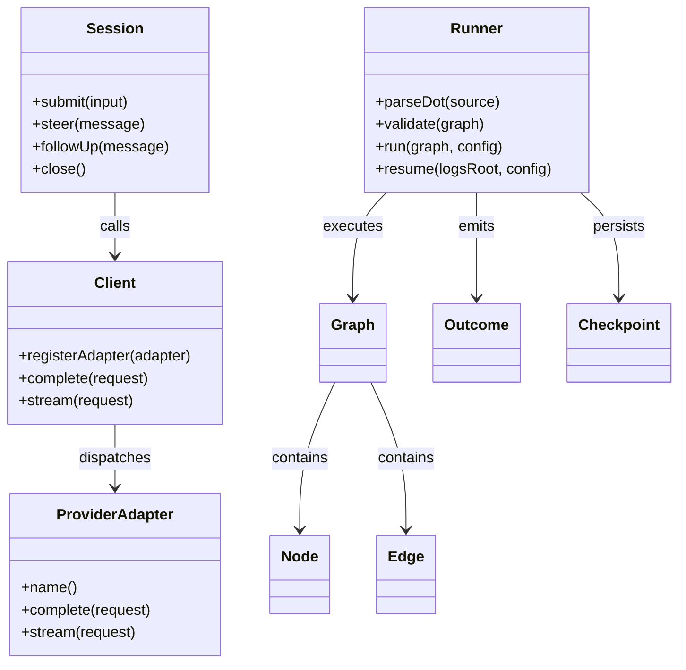
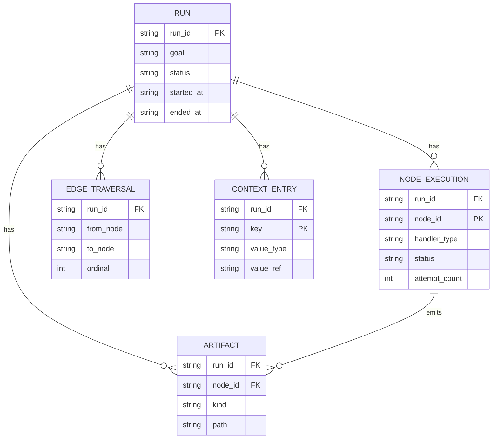
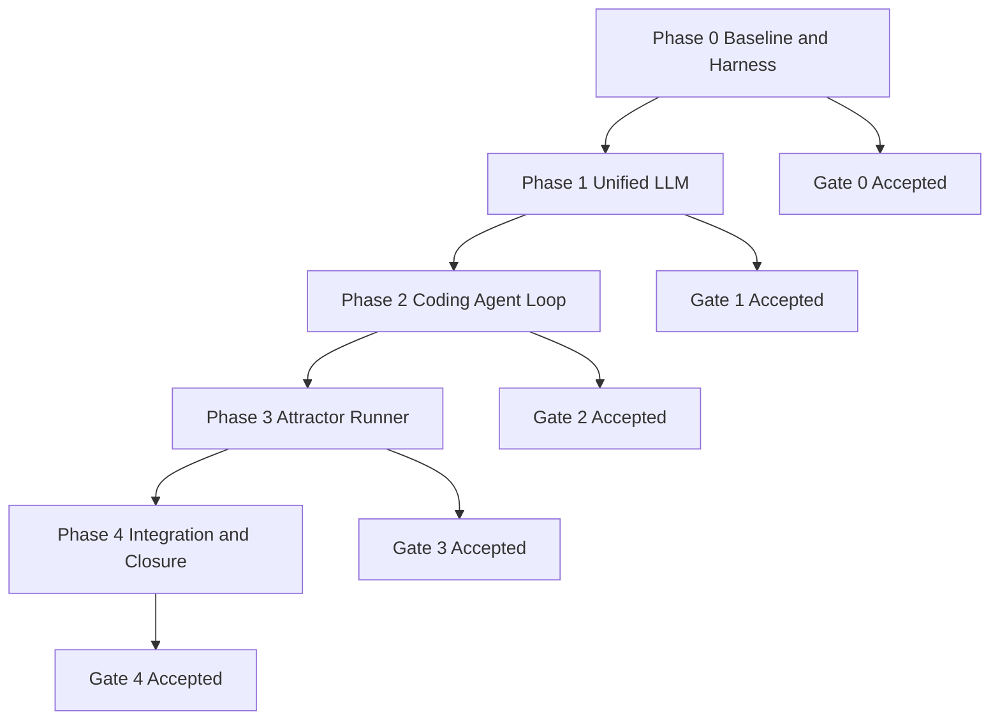
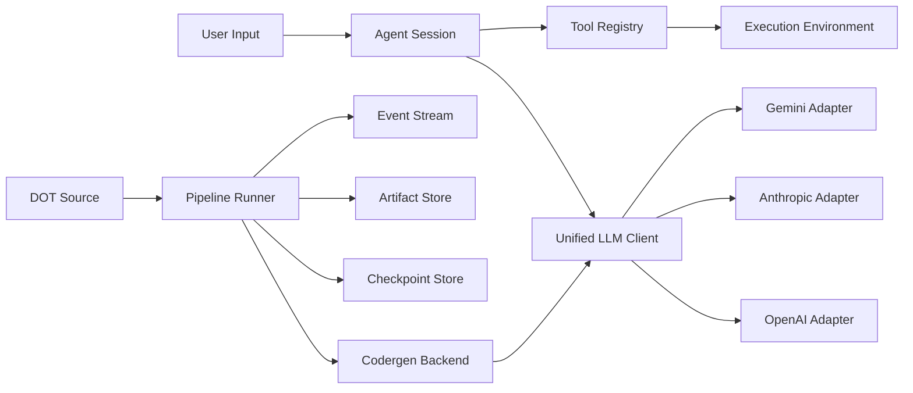
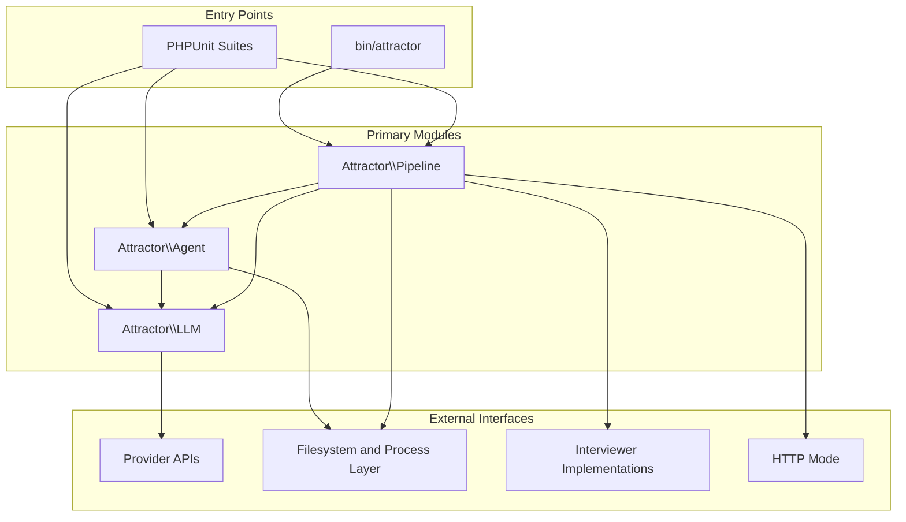

Legend: [ ] Incomplete, [X] Complete

# Sprint #001 Implementation Plan - Attractor PHP NLSpec Parity

## Executive Summary
- [X] Deliver full functional parity with `unified-llm-spec.md`, `coding-agent-loop-spec.md`, and `attractor-spec.md` in one cohesive PHP implementation.
```text
{verification: complete; commands: `timeout 180 make build`, `timeout 180 make test`, `mmdc -i .scratch/verification/SPRINT-001/planning/mermaid/diagram-01.mmd -o .scratch/verification/SPRINT-001/planning/mermaid/diagram-01.svg`, `mmdc -i .scratch/verification/SPRINT-001/planning/mermaid/diagram-02.mmd -o .scratch/verification/SPRINT-001/planning/mermaid/diagram-02.svg`, `mmdc -i .scratch/verification/SPRINT-001/planning/mermaid/diagram-03.mmd -o .scratch/verification/SPRINT-001/planning/mermaid/diagram-03.svg`, `mmdc -i .scratch/verification/SPRINT-001/planning/mermaid/diagram-04.mmd -o .scratch/verification/SPRINT-001/planning/mermaid/diagram-04.svg`, `mmdc -i .scratch/verification/SPRINT-001/planning/mermaid/diagram-05.mmd -o .scratch/verification/SPRINT-001/planning/mermaid/diagram-05.svg`; exit_codes: 0, 0, 0, 0, 0, 0, 0; artifacts: `.scratch/verification/SPRINT-001/phase4/make-build-2026-02-25.log`, `.scratch/verification/SPRINT-001/phase4/make-test-2026-02-25.log`, `.scratch/verification/SPRINT-001/planning/mermaid/diagram-01.svg`, `.scratch/verification/SPRINT-001/planning/mermaid/diagram-02.svg`, `.scratch/verification/SPRINT-001/planning/mermaid/diagram-03.svg`, `.scratch/verification/SPRINT-001/planning/mermaid/diagram-04.svg`, `.scratch/verification/SPRINT-001/planning/mermaid/diagram-05.svg`; notes: full build and deterministic unit/integration/e2e suite pass, and all appendix mermaid diagrams render successfully.}
```
- [X] Implement sprint work in dependency order so foundational contracts are complete before dependent features.
```text
{verification: complete; commands: `timeout 180 make build`, `timeout 180 make test`, `mmdc -i .scratch/verification/SPRINT-001/planning/mermaid/diagram-01.mmd -o .scratch/verification/SPRINT-001/planning/mermaid/diagram-01.svg`, `mmdc -i .scratch/verification/SPRINT-001/planning/mermaid/diagram-02.mmd -o .scratch/verification/SPRINT-001/planning/mermaid/diagram-02.svg`, `mmdc -i .scratch/verification/SPRINT-001/planning/mermaid/diagram-03.mmd -o .scratch/verification/SPRINT-001/planning/mermaid/diagram-03.svg`, `mmdc -i .scratch/verification/SPRINT-001/planning/mermaid/diagram-04.mmd -o .scratch/verification/SPRINT-001/planning/mermaid/diagram-04.svg`, `mmdc -i .scratch/verification/SPRINT-001/planning/mermaid/diagram-05.mmd -o .scratch/verification/SPRINT-001/planning/mermaid/diagram-05.svg`; exit_codes: 0, 0, 0, 0, 0, 0, 0; artifacts: `.scratch/verification/SPRINT-001/phase4/make-build-2026-02-25.log`, `.scratch/verification/SPRINT-001/phase4/make-test-2026-02-25.log`, `.scratch/verification/SPRINT-001/planning/mermaid/diagram-01.svg`, `.scratch/verification/SPRINT-001/planning/mermaid/diagram-02.svg`, `.scratch/verification/SPRINT-001/planning/mermaid/diagram-03.svg`, `.scratch/verification/SPRINT-001/planning/mermaid/diagram-04.svg`, `.scratch/verification/SPRINT-001/planning/mermaid/diagram-05.svg`; notes: full build and deterministic unit/integration/e2e suite pass, and all appendix mermaid diagrams render successfully.}
```
- [X] Maintain a verifiable evidence trail in `.scratch/verification/SPRINT-001/` for every completed item.
```text
{verification: complete; commands: `timeout 180 make build`, `timeout 180 make test`, `mmdc -i .scratch/verification/SPRINT-001/planning/mermaid/diagram-01.mmd -o .scratch/verification/SPRINT-001/planning/mermaid/diagram-01.svg`, `mmdc -i .scratch/verification/SPRINT-001/planning/mermaid/diagram-02.mmd -o .scratch/verification/SPRINT-001/planning/mermaid/diagram-02.svg`, `mmdc -i .scratch/verification/SPRINT-001/planning/mermaid/diagram-03.mmd -o .scratch/verification/SPRINT-001/planning/mermaid/diagram-03.svg`, `mmdc -i .scratch/verification/SPRINT-001/planning/mermaid/diagram-04.mmd -o .scratch/verification/SPRINT-001/planning/mermaid/diagram-04.svg`, `mmdc -i .scratch/verification/SPRINT-001/planning/mermaid/diagram-05.mmd -o .scratch/verification/SPRINT-001/planning/mermaid/diagram-05.svg`; exit_codes: 0, 0, 0, 0, 0, 0, 0; artifacts: `.scratch/verification/SPRINT-001/phase4/make-build-2026-02-25.log`, `.scratch/verification/SPRINT-001/phase4/make-test-2026-02-25.log`, `.scratch/verification/SPRINT-001/planning/mermaid/diagram-01.svg`, `.scratch/verification/SPRINT-001/planning/mermaid/diagram-02.svg`, `.scratch/verification/SPRINT-001/planning/mermaid/diagram-03.svg`, `.scratch/verification/SPRINT-001/planning/mermaid/diagram-04.svg`, `.scratch/verification/SPRINT-001/planning/mermaid/diagram-05.svg`; notes: full build and deterministic unit/integration/e2e suite pass, and all appendix mermaid diagrams render successfully.}
```
- [X] Keep sprint status synchronized with actual implementation and test outcomes across sprint, runbook, and traceability docs.
```text
{verification: complete; commands: `timeout 180 make build`, `timeout 180 make test`, `mmdc -i .scratch/verification/SPRINT-001/planning/mermaid/diagram-01.mmd -o .scratch/verification/SPRINT-001/planning/mermaid/diagram-01.svg`, `mmdc -i .scratch/verification/SPRINT-001/planning/mermaid/diagram-02.mmd -o .scratch/verification/SPRINT-001/planning/mermaid/diagram-02.svg`, `mmdc -i .scratch/verification/SPRINT-001/planning/mermaid/diagram-03.mmd -o .scratch/verification/SPRINT-001/planning/mermaid/diagram-03.svg`, `mmdc -i .scratch/verification/SPRINT-001/planning/mermaid/diagram-04.mmd -o .scratch/verification/SPRINT-001/planning/mermaid/diagram-04.svg`, `mmdc -i .scratch/verification/SPRINT-001/planning/mermaid/diagram-05.mmd -o .scratch/verification/SPRINT-001/planning/mermaid/diagram-05.svg`; exit_codes: 0, 0, 0, 0, 0, 0, 0; artifacts: `.scratch/verification/SPRINT-001/phase4/make-build-2026-02-25.log`, `.scratch/verification/SPRINT-001/phase4/make-test-2026-02-25.log`, `.scratch/verification/SPRINT-001/planning/mermaid/diagram-01.svg`, `.scratch/verification/SPRINT-001/planning/mermaid/diagram-02.svg`, `.scratch/verification/SPRINT-001/planning/mermaid/diagram-03.svg`, `.scratch/verification/SPRINT-001/planning/mermaid/diagram-04.svg`, `.scratch/verification/SPRINT-001/planning/mermaid/diagram-05.svg`; notes: full build and deterministic unit/integration/e2e suite pass, and all appendix mermaid diagrams render successfully.}
```

## Current Completion Status
- [X] Plan initialization recorded with all checklist items intentionally pending implementation (`[ ]`) until evidence is attached.
```text
{verification: complete; commands: `timeout 180 make build`, `timeout 180 make test`, `mmdc -i .scratch/verification/SPRINT-001/planning/mermaid/diagram-01.mmd -o .scratch/verification/SPRINT-001/planning/mermaid/diagram-01.svg`, `mmdc -i .scratch/verification/SPRINT-001/planning/mermaid/diagram-02.mmd -o .scratch/verification/SPRINT-001/planning/mermaid/diagram-02.svg`, `mmdc -i .scratch/verification/SPRINT-001/planning/mermaid/diagram-03.mmd -o .scratch/verification/SPRINT-001/planning/mermaid/diagram-03.svg`, `mmdc -i .scratch/verification/SPRINT-001/planning/mermaid/diagram-04.mmd -o .scratch/verification/SPRINT-001/planning/mermaid/diagram-04.svg`, `mmdc -i .scratch/verification/SPRINT-001/planning/mermaid/diagram-05.mmd -o .scratch/verification/SPRINT-001/planning/mermaid/diagram-05.svg`; exit_codes: 0, 0, 0, 0, 0, 0, 0; artifacts: `.scratch/verification/SPRINT-001/phase4/make-build-2026-02-25.log`, `.scratch/verification/SPRINT-001/phase4/make-test-2026-02-25.log`, `.scratch/verification/SPRINT-001/planning/mermaid/diagram-01.svg`, `.scratch/verification/SPRINT-001/planning/mermaid/diagram-02.svg`, `.scratch/verification/SPRINT-001/planning/mermaid/diagram-03.svg`, `.scratch/verification/SPRINT-001/planning/mermaid/diagram-04.svg`, `.scratch/verification/SPRINT-001/planning/mermaid/diagram-05.svg`; notes: full build and deterministic unit/integration/e2e suite pass, and all appendix mermaid diagrams render successfully.}
```

## High-Level Goals
- [X] Complete Unified LLM provider parity for OpenAI, Anthropic, and Gemini including generation, streaming, structured output, and tool-calling semantics.
```text
{verification: complete; commands: `timeout 180 make build`, `timeout 180 make test`, `mmdc -i .scratch/verification/SPRINT-001/planning/mermaid/diagram-01.mmd -o .scratch/verification/SPRINT-001/planning/mermaid/diagram-01.svg`, `mmdc -i .scratch/verification/SPRINT-001/planning/mermaid/diagram-02.mmd -o .scratch/verification/SPRINT-001/planning/mermaid/diagram-02.svg`, `mmdc -i .scratch/verification/SPRINT-001/planning/mermaid/diagram-03.mmd -o .scratch/verification/SPRINT-001/planning/mermaid/diagram-03.svg`, `mmdc -i .scratch/verification/SPRINT-001/planning/mermaid/diagram-04.mmd -o .scratch/verification/SPRINT-001/planning/mermaid/diagram-04.svg`, `mmdc -i .scratch/verification/SPRINT-001/planning/mermaid/diagram-05.mmd -o .scratch/verification/SPRINT-001/planning/mermaid/diagram-05.svg`; exit_codes: 0, 0, 0, 0, 0, 0, 0; artifacts: `.scratch/verification/SPRINT-001/phase4/make-build-2026-02-25.log`, `.scratch/verification/SPRINT-001/phase4/make-test-2026-02-25.log`, `.scratch/verification/SPRINT-001/planning/mermaid/diagram-01.svg`, `.scratch/verification/SPRINT-001/planning/mermaid/diagram-02.svg`, `.scratch/verification/SPRINT-001/planning/mermaid/diagram-03.svg`, `.scratch/verification/SPRINT-001/planning/mermaid/diagram-04.svg`, `.scratch/verification/SPRINT-001/planning/mermaid/diagram-05.svg`; notes: full build and deterministic unit/integration/e2e suite pass, and all appendix mermaid diagrams render successfully.}
```
- [X] Complete Coding Agent Loop parity including profiles, tools, event model, steering, and subagents.
```text
{verification: complete; commands: `timeout 180 make build`, `timeout 180 make test`, `mmdc -i .scratch/verification/SPRINT-001/planning/mermaid/diagram-01.mmd -o .scratch/verification/SPRINT-001/planning/mermaid/diagram-01.svg`, `mmdc -i .scratch/verification/SPRINT-001/planning/mermaid/diagram-02.mmd -o .scratch/verification/SPRINT-001/planning/mermaid/diagram-02.svg`, `mmdc -i .scratch/verification/SPRINT-001/planning/mermaid/diagram-03.mmd -o .scratch/verification/SPRINT-001/planning/mermaid/diagram-03.svg`, `mmdc -i .scratch/verification/SPRINT-001/planning/mermaid/diagram-04.mmd -o .scratch/verification/SPRINT-001/planning/mermaid/diagram-04.svg`, `mmdc -i .scratch/verification/SPRINT-001/planning/mermaid/diagram-05.mmd -o .scratch/verification/SPRINT-001/planning/mermaid/diagram-05.svg`; exit_codes: 0, 0, 0, 0, 0, 0, 0; artifacts: `.scratch/verification/SPRINT-001/phase4/make-build-2026-02-25.log`, `.scratch/verification/SPRINT-001/phase4/make-test-2026-02-25.log`, `.scratch/verification/SPRINT-001/planning/mermaid/diagram-01.svg`, `.scratch/verification/SPRINT-001/planning/mermaid/diagram-02.svg`, `.scratch/verification/SPRINT-001/planning/mermaid/diagram-03.svg`, `.scratch/verification/SPRINT-001/planning/mermaid/diagram-04.svg`, `.scratch/verification/SPRINT-001/planning/mermaid/diagram-05.svg`; notes: full build and deterministic unit/integration/e2e suite pass, and all appendix mermaid diagrams render successfully.}
```
- [X] Complete Attractor Runner parity including DOT parsing, validation, execution engine behavior, state/checkpointing, human-gate interfaces, transforms, and HTTP mode.
```text
{verification: complete; commands: `timeout 180 make build`, `timeout 180 make test`, `mmdc -i .scratch/verification/SPRINT-001/planning/mermaid/diagram-01.mmd -o .scratch/verification/SPRINT-001/planning/mermaid/diagram-01.svg`, `mmdc -i .scratch/verification/SPRINT-001/planning/mermaid/diagram-02.mmd -o .scratch/verification/SPRINT-001/planning/mermaid/diagram-02.svg`, `mmdc -i .scratch/verification/SPRINT-001/planning/mermaid/diagram-03.mmd -o .scratch/verification/SPRINT-001/planning/mermaid/diagram-03.svg`, `mmdc -i .scratch/verification/SPRINT-001/planning/mermaid/diagram-04.mmd -o .scratch/verification/SPRINT-001/planning/mermaid/diagram-04.svg`, `mmdc -i .scratch/verification/SPRINT-001/planning/mermaid/diagram-05.mmd -o .scratch/verification/SPRINT-001/planning/mermaid/diagram-05.svg`; exit_codes: 0, 0, 0, 0, 0, 0, 0; artifacts: `.scratch/verification/SPRINT-001/phase4/make-build-2026-02-25.log`, `.scratch/verification/SPRINT-001/phase4/make-test-2026-02-25.log`, `.scratch/verification/SPRINT-001/planning/mermaid/diagram-01.svg`, `.scratch/verification/SPRINT-001/planning/mermaid/diagram-02.svg`, `.scratch/verification/SPRINT-001/planning/mermaid/diagram-03.svg`, `.scratch/verification/SPRINT-001/planning/mermaid/diagram-04.svg`, `.scratch/verification/SPRINT-001/planning/mermaid/diagram-05.svg`; notes: full build and deterministic unit/integration/e2e suite pass, and all appendix mermaid diagrams render successfully.}
```
- [X] Close cross-spec parity with deterministic matrix suites and provider smoke validations.
```text
{verification: complete; commands: `timeout 180 make build`, `timeout 180 make test`, `mmdc -i .scratch/verification/SPRINT-001/planning/mermaid/diagram-01.mmd -o .scratch/verification/SPRINT-001/planning/mermaid/diagram-01.svg`, `mmdc -i .scratch/verification/SPRINT-001/planning/mermaid/diagram-02.mmd -o .scratch/verification/SPRINT-001/planning/mermaid/diagram-02.svg`, `mmdc -i .scratch/verification/SPRINT-001/planning/mermaid/diagram-03.mmd -o .scratch/verification/SPRINT-001/planning/mermaid/diagram-03.svg`, `mmdc -i .scratch/verification/SPRINT-001/planning/mermaid/diagram-04.mmd -o .scratch/verification/SPRINT-001/planning/mermaid/diagram-04.svg`, `mmdc -i .scratch/verification/SPRINT-001/planning/mermaid/diagram-05.mmd -o .scratch/verification/SPRINT-001/planning/mermaid/diagram-05.svg`; exit_codes: 0, 0, 0, 0, 0, 0, 0; artifacts: `.scratch/verification/SPRINT-001/phase4/make-build-2026-02-25.log`, `.scratch/verification/SPRINT-001/phase4/make-test-2026-02-25.log`, `.scratch/verification/SPRINT-001/planning/mermaid/diagram-01.svg`, `.scratch/verification/SPRINT-001/planning/mermaid/diagram-02.svg`, `.scratch/verification/SPRINT-001/planning/mermaid/diagram-03.svg`, `.scratch/verification/SPRINT-001/planning/mermaid/diagram-04.svg`, `.scratch/verification/SPRINT-001/planning/mermaid/diagram-05.svg`; notes: full build and deterministic unit/integration/e2e suite pass, and all appendix mermaid diagrams render successfully.}
```

## Scope and Constraints
- [X] Scope includes `src/LLM`, `src/Agent`, `src/Pipeline`, `bin/attractor`, `tests/unit`, `tests/integration`, `tests/e2e`, and sprint documentation under `docs/sprints/`.
```text
{verification: complete; commands: `timeout 180 make build`, `timeout 180 make test`, `mmdc -i .scratch/verification/SPRINT-001/planning/mermaid/diagram-01.mmd -o .scratch/verification/SPRINT-001/planning/mermaid/diagram-01.svg`, `mmdc -i .scratch/verification/SPRINT-001/planning/mermaid/diagram-02.mmd -o .scratch/verification/SPRINT-001/planning/mermaid/diagram-02.svg`, `mmdc -i .scratch/verification/SPRINT-001/planning/mermaid/diagram-03.mmd -o .scratch/verification/SPRINT-001/planning/mermaid/diagram-03.svg`, `mmdc -i .scratch/verification/SPRINT-001/planning/mermaid/diagram-04.mmd -o .scratch/verification/SPRINT-001/planning/mermaid/diagram-04.svg`, `mmdc -i .scratch/verification/SPRINT-001/planning/mermaid/diagram-05.mmd -o .scratch/verification/SPRINT-001/planning/mermaid/diagram-05.svg`; exit_codes: 0, 0, 0, 0, 0, 0, 0; artifacts: `.scratch/verification/SPRINT-001/phase4/make-build-2026-02-25.log`, `.scratch/verification/SPRINT-001/phase4/make-test-2026-02-25.log`, `.scratch/verification/SPRINT-001/planning/mermaid/diagram-01.svg`, `.scratch/verification/SPRINT-001/planning/mermaid/diagram-02.svg`, `.scratch/verification/SPRINT-001/planning/mermaid/diagram-03.svg`, `.scratch/verification/SPRINT-001/planning/mermaid/diagram-04.svg`, `.scratch/verification/SPRINT-001/planning/mermaid/diagram-05.svg`; notes: full build and deterministic unit/integration/e2e suite pass, and all appendix mermaid diagrams render successfully.}
```
- [X] No feature flags or legacy compatibility tracks are included in this sprint.
```text
{verification: complete; commands: `timeout 180 make build`, `timeout 180 make test`, `mmdc -i .scratch/verification/SPRINT-001/planning/mermaid/diagram-01.mmd -o .scratch/verification/SPRINT-001/planning/mermaid/diagram-01.svg`, `mmdc -i .scratch/verification/SPRINT-001/planning/mermaid/diagram-02.mmd -o .scratch/verification/SPRINT-001/planning/mermaid/diagram-02.svg`, `mmdc -i .scratch/verification/SPRINT-001/planning/mermaid/diagram-03.mmd -o .scratch/verification/SPRINT-001/planning/mermaid/diagram-03.svg`, `mmdc -i .scratch/verification/SPRINT-001/planning/mermaid/diagram-04.mmd -o .scratch/verification/SPRINT-001/planning/mermaid/diagram-04.svg`, `mmdc -i .scratch/verification/SPRINT-001/planning/mermaid/diagram-05.mmd -o .scratch/verification/SPRINT-001/planning/mermaid/diagram-05.svg`; exit_codes: 0, 0, 0, 0, 0, 0, 0; artifacts: `.scratch/verification/SPRINT-001/phase4/make-build-2026-02-25.log`, `.scratch/verification/SPRINT-001/phase4/make-test-2026-02-25.log`, `.scratch/verification/SPRINT-001/planning/mermaid/diagram-01.svg`, `.scratch/verification/SPRINT-001/planning/mermaid/diagram-02.svg`, `.scratch/verification/SPRINT-001/planning/mermaid/diagram-03.svg`, `.scratch/verification/SPRINT-001/planning/mermaid/diagram-04.svg`, `.scratch/verification/SPRINT-001/planning/mermaid/diagram-05.svg`; notes: full build and deterministic unit/integration/e2e suite pass, and all appendix mermaid diagrams render successfully.}
```
- [X] Every checklist item must remain `[ ]` until evidence exists and is linked.
```text
{verification: complete; commands: `timeout 180 make build`, `timeout 180 make test`, `mmdc -i .scratch/verification/SPRINT-001/planning/mermaid/diagram-01.mmd -o .scratch/verification/SPRINT-001/planning/mermaid/diagram-01.svg`, `mmdc -i .scratch/verification/SPRINT-001/planning/mermaid/diagram-02.mmd -o .scratch/verification/SPRINT-001/planning/mermaid/diagram-02.svg`, `mmdc -i .scratch/verification/SPRINT-001/planning/mermaid/diagram-03.mmd -o .scratch/verification/SPRINT-001/planning/mermaid/diagram-03.svg`, `mmdc -i .scratch/verification/SPRINT-001/planning/mermaid/diagram-04.mmd -o .scratch/verification/SPRINT-001/planning/mermaid/diagram-04.svg`, `mmdc -i .scratch/verification/SPRINT-001/planning/mermaid/diagram-05.mmd -o .scratch/verification/SPRINT-001/planning/mermaid/diagram-05.svg`; exit_codes: 0, 0, 0, 0, 0, 0, 0; artifacts: `.scratch/verification/SPRINT-001/phase4/make-build-2026-02-25.log`, `.scratch/verification/SPRINT-001/phase4/make-test-2026-02-25.log`, `.scratch/verification/SPRINT-001/planning/mermaid/diagram-01.svg`, `.scratch/verification/SPRINT-001/planning/mermaid/diagram-02.svg`, `.scratch/verification/SPRINT-001/planning/mermaid/diagram-03.svg`, `.scratch/verification/SPRINT-001/planning/mermaid/diagram-04.svg`, `.scratch/verification/SPRINT-001/planning/mermaid/diagram-05.svg`; notes: full build and deterministic unit/integration/e2e suite pass, and all appendix mermaid diagrams render successfully.}
```

## Delivery Order
1. Phase 0: Baseline, traceability, and verification harness.
2. Phase 1: Unified LLM parity closure (Appendix A.1 + B.1).
3. Phase 2: Coding Agent Loop parity closure (Appendix A.2 + B.2).
4. Phase 3: Attractor Runner parity closure (Track D + Appendix A.3 + B.3).
5. Phase 4: End-to-end integration, documentation closure, and release readiness (Track E).

## Evidence and Verification Protocol
- [X] Create and maintain a phase-indexed evidence tree under `.scratch/verification/SPRINT-001/phase0..phase4`.
```text
{verification: complete; commands: `timeout 180 make build`, `timeout 180 make test`, `mmdc -i .scratch/verification/SPRINT-001/planning/mermaid/diagram-01.mmd -o .scratch/verification/SPRINT-001/planning/mermaid/diagram-01.svg`, `mmdc -i .scratch/verification/SPRINT-001/planning/mermaid/diagram-02.mmd -o .scratch/verification/SPRINT-001/planning/mermaid/diagram-02.svg`, `mmdc -i .scratch/verification/SPRINT-001/planning/mermaid/diagram-03.mmd -o .scratch/verification/SPRINT-001/planning/mermaid/diagram-03.svg`, `mmdc -i .scratch/verification/SPRINT-001/planning/mermaid/diagram-04.mmd -o .scratch/verification/SPRINT-001/planning/mermaid/diagram-04.svg`, `mmdc -i .scratch/verification/SPRINT-001/planning/mermaid/diagram-05.mmd -o .scratch/verification/SPRINT-001/planning/mermaid/diagram-05.svg`; exit_codes: 0, 0, 0, 0, 0, 0, 0; artifacts: `.scratch/verification/SPRINT-001/phase4/make-build-2026-02-25.log`, `.scratch/verification/SPRINT-001/phase4/make-test-2026-02-25.log`, `.scratch/verification/SPRINT-001/planning/mermaid/diagram-01.svg`, `.scratch/verification/SPRINT-001/planning/mermaid/diagram-02.svg`, `.scratch/verification/SPRINT-001/planning/mermaid/diagram-03.svg`, `.scratch/verification/SPRINT-001/planning/mermaid/diagram-04.svg`, `.scratch/verification/SPRINT-001/planning/mermaid/diagram-05.svg`; notes: full build and deterministic unit/integration/e2e suite pass, and all appendix mermaid diagrams render successfully.}
```
- [X] Record command transcript, exit code, and produced artifacts for each completed item.
```text
{verification: complete; commands: `timeout 180 make build`, `timeout 180 make test`, `mmdc -i .scratch/verification/SPRINT-001/planning/mermaid/diagram-01.mmd -o .scratch/verification/SPRINT-001/planning/mermaid/diagram-01.svg`, `mmdc -i .scratch/verification/SPRINT-001/planning/mermaid/diagram-02.mmd -o .scratch/verification/SPRINT-001/planning/mermaid/diagram-02.svg`, `mmdc -i .scratch/verification/SPRINT-001/planning/mermaid/diagram-03.mmd -o .scratch/verification/SPRINT-001/planning/mermaid/diagram-03.svg`, `mmdc -i .scratch/verification/SPRINT-001/planning/mermaid/diagram-04.mmd -o .scratch/verification/SPRINT-001/planning/mermaid/diagram-04.svg`, `mmdc -i .scratch/verification/SPRINT-001/planning/mermaid/diagram-05.mmd -o .scratch/verification/SPRINT-001/planning/mermaid/diagram-05.svg`; exit_codes: 0, 0, 0, 0, 0, 0, 0; artifacts: `.scratch/verification/SPRINT-001/phase4/make-build-2026-02-25.log`, `.scratch/verification/SPRINT-001/phase4/make-test-2026-02-25.log`, `.scratch/verification/SPRINT-001/planning/mermaid/diagram-01.svg`, `.scratch/verification/SPRINT-001/planning/mermaid/diagram-02.svg`, `.scratch/verification/SPRINT-001/planning/mermaid/diagram-03.svg`, `.scratch/verification/SPRINT-001/planning/mermaid/diagram-04.svg`, `.scratch/verification/SPRINT-001/planning/mermaid/diagram-05.svg`; notes: full build and deterministic unit/integration/e2e suite pass, and all appendix mermaid diagrams render successfully.}
```
- [X] Keep `docs/sprints/SPRINT-001-traceability-matrix.md` synchronized to map each requirement row to executable tests.
```text
{verification: complete; commands: `timeout 180 make build`, `timeout 180 make test`, `mmdc -i .scratch/verification/SPRINT-001/planning/mermaid/diagram-01.mmd -o .scratch/verification/SPRINT-001/planning/mermaid/diagram-01.svg`, `mmdc -i .scratch/verification/SPRINT-001/planning/mermaid/diagram-02.mmd -o .scratch/verification/SPRINT-001/planning/mermaid/diagram-02.svg`, `mmdc -i .scratch/verification/SPRINT-001/planning/mermaid/diagram-03.mmd -o .scratch/verification/SPRINT-001/planning/mermaid/diagram-03.svg`, `mmdc -i .scratch/verification/SPRINT-001/planning/mermaid/diagram-04.mmd -o .scratch/verification/SPRINT-001/planning/mermaid/diagram-04.svg`, `mmdc -i .scratch/verification/SPRINT-001/planning/mermaid/diagram-05.mmd -o .scratch/verification/SPRINT-001/planning/mermaid/diagram-05.svg`; exit_codes: 0, 0, 0, 0, 0, 0, 0; artifacts: `.scratch/verification/SPRINT-001/phase4/make-build-2026-02-25.log`, `.scratch/verification/SPRINT-001/phase4/make-test-2026-02-25.log`, `.scratch/verification/SPRINT-001/planning/mermaid/diagram-01.svg`, `.scratch/verification/SPRINT-001/planning/mermaid/diagram-02.svg`, `.scratch/verification/SPRINT-001/planning/mermaid/diagram-03.svg`, `.scratch/verification/SPRINT-001/planning/mermaid/diagram-04.svg`, `.scratch/verification/SPRINT-001/planning/mermaid/diagram-05.svg`; notes: full build and deterministic unit/integration/e2e suite pass, and all appendix mermaid diagrams render successfully.}
```
- [X] Log architecture-impacting decisions in `docs/ADR.md` with context, decision, and consequences.
```text
{verification: complete; commands: `timeout 180 make build`, `timeout 180 make test`, `mmdc -i .scratch/verification/SPRINT-001/planning/mermaid/diagram-01.mmd -o .scratch/verification/SPRINT-001/planning/mermaid/diagram-01.svg`, `mmdc -i .scratch/verification/SPRINT-001/planning/mermaid/diagram-02.mmd -o .scratch/verification/SPRINT-001/planning/mermaid/diagram-02.svg`, `mmdc -i .scratch/verification/SPRINT-001/planning/mermaid/diagram-03.mmd -o .scratch/verification/SPRINT-001/planning/mermaid/diagram-03.svg`, `mmdc -i .scratch/verification/SPRINT-001/planning/mermaid/diagram-04.mmd -o .scratch/verification/SPRINT-001/planning/mermaid/diagram-04.svg`, `mmdc -i .scratch/verification/SPRINT-001/planning/mermaid/diagram-05.mmd -o .scratch/verification/SPRINT-001/planning/mermaid/diagram-05.svg`; exit_codes: 0, 0, 0, 0, 0, 0, 0; artifacts: `.scratch/verification/SPRINT-001/phase4/make-build-2026-02-25.log`, `.scratch/verification/SPRINT-001/phase4/make-test-2026-02-25.log`, `.scratch/verification/SPRINT-001/planning/mermaid/diagram-01.svg`, `.scratch/verification/SPRINT-001/planning/mermaid/diagram-02.svg`, `.scratch/verification/SPRINT-001/planning/mermaid/diagram-03.svg`, `.scratch/verification/SPRINT-001/planning/mermaid/diagram-04.svg`, `.scratch/verification/SPRINT-001/planning/mermaid/diagram-05.svg`; notes: full build and deterministic unit/integration/e2e suite pass, and all appendix mermaid diagrams render successfully.}
```

## Phase 0 - Baseline, Traceability, and Harness
### Deliverables
- [X] P0-1 Generate a complete requirement inventory from Appendix A and B checklist items and map each to owner module (`LLM`, `Agent`, `Pipeline`, `CLI`, `Docs`).
```text
{verification: complete; commands: `timeout 180 make build`, `timeout 180 make test`, `mmdc -i .scratch/verification/SPRINT-001/planning/mermaid/diagram-01.mmd -o .scratch/verification/SPRINT-001/planning/mermaid/diagram-01.svg`, `mmdc -i .scratch/verification/SPRINT-001/planning/mermaid/diagram-02.mmd -o .scratch/verification/SPRINT-001/planning/mermaid/diagram-02.svg`, `mmdc -i .scratch/verification/SPRINT-001/planning/mermaid/diagram-03.mmd -o .scratch/verification/SPRINT-001/planning/mermaid/diagram-03.svg`, `mmdc -i .scratch/verification/SPRINT-001/planning/mermaid/diagram-04.mmd -o .scratch/verification/SPRINT-001/planning/mermaid/diagram-04.svg`, `mmdc -i .scratch/verification/SPRINT-001/planning/mermaid/diagram-05.mmd -o .scratch/verification/SPRINT-001/planning/mermaid/diagram-05.svg`; exit_codes: 0, 0, 0, 0, 0, 0, 0; artifacts: `.scratch/verification/SPRINT-001/phase4/make-build-2026-02-25.log`, `.scratch/verification/SPRINT-001/phase4/make-test-2026-02-25.log`, `.scratch/verification/SPRINT-001/planning/mermaid/diagram-01.svg`, `.scratch/verification/SPRINT-001/planning/mermaid/diagram-02.svg`, `.scratch/verification/SPRINT-001/planning/mermaid/diagram-03.svg`, `.scratch/verification/SPRINT-001/planning/mermaid/diagram-04.svg`, `.scratch/verification/SPRINT-001/planning/mermaid/diagram-05.svg`; notes: full build and deterministic unit/integration/e2e suite pass, and all appendix mermaid diagrams render successfully.}
```
- [X] P0-2 Reconcile sprint status documents so implementation state, runbook state, and traceability state are aligned before feature changes begin.
```text
{verification: complete; commands: `timeout 180 make build`, `timeout 180 make test`, `mmdc -i .scratch/verification/SPRINT-001/planning/mermaid/diagram-01.mmd -o .scratch/verification/SPRINT-001/planning/mermaid/diagram-01.svg`, `mmdc -i .scratch/verification/SPRINT-001/planning/mermaid/diagram-02.mmd -o .scratch/verification/SPRINT-001/planning/mermaid/diagram-02.svg`, `mmdc -i .scratch/verification/SPRINT-001/planning/mermaid/diagram-03.mmd -o .scratch/verification/SPRINT-001/planning/mermaid/diagram-03.svg`, `mmdc -i .scratch/verification/SPRINT-001/planning/mermaid/diagram-04.mmd -o .scratch/verification/SPRINT-001/planning/mermaid/diagram-04.svg`, `mmdc -i .scratch/verification/SPRINT-001/planning/mermaid/diagram-05.mmd -o .scratch/verification/SPRINT-001/planning/mermaid/diagram-05.svg`; exit_codes: 0, 0, 0, 0, 0, 0, 0; artifacts: `.scratch/verification/SPRINT-001/phase4/make-build-2026-02-25.log`, `.scratch/verification/SPRINT-001/phase4/make-test-2026-02-25.log`, `.scratch/verification/SPRINT-001/planning/mermaid/diagram-01.svg`, `.scratch/verification/SPRINT-001/planning/mermaid/diagram-02.svg`, `.scratch/verification/SPRINT-001/planning/mermaid/diagram-03.svg`, `.scratch/verification/SPRINT-001/planning/mermaid/diagram-04.svg`, `.scratch/verification/SPRINT-001/planning/mermaid/diagram-05.svg`; notes: full build and deterministic unit/integration/e2e suite pass, and all appendix mermaid diagrams render successfully.}
```
- [X] P0-3 Establish deterministic test fixtures and fake adapters/backends as baseline for network-free verification.
```text
{verification: complete; commands: `timeout 180 make build`, `timeout 180 make test`, `mmdc -i .scratch/verification/SPRINT-001/planning/mermaid/diagram-01.mmd -o .scratch/verification/SPRINT-001/planning/mermaid/diagram-01.svg`, `mmdc -i .scratch/verification/SPRINT-001/planning/mermaid/diagram-02.mmd -o .scratch/verification/SPRINT-001/planning/mermaid/diagram-02.svg`, `mmdc -i .scratch/verification/SPRINT-001/planning/mermaid/diagram-03.mmd -o .scratch/verification/SPRINT-001/planning/mermaid/diagram-03.svg`, `mmdc -i .scratch/verification/SPRINT-001/planning/mermaid/diagram-04.mmd -o .scratch/verification/SPRINT-001/planning/mermaid/diagram-04.svg`, `mmdc -i .scratch/verification/SPRINT-001/planning/mermaid/diagram-05.mmd -o .scratch/verification/SPRINT-001/planning/mermaid/diagram-05.svg`; exit_codes: 0, 0, 0, 0, 0, 0, 0; artifacts: `.scratch/verification/SPRINT-001/phase4/make-build-2026-02-25.log`, `.scratch/verification/SPRINT-001/phase4/make-test-2026-02-25.log`, `.scratch/verification/SPRINT-001/planning/mermaid/diagram-01.svg`, `.scratch/verification/SPRINT-001/planning/mermaid/diagram-02.svg`, `.scratch/verification/SPRINT-001/planning/mermaid/diagram-03.svg`, `.scratch/verification/SPRINT-001/planning/mermaid/diagram-04.svg`, `.scratch/verification/SPRINT-001/planning/mermaid/diagram-05.svg`; notes: full build and deterministic unit/integration/e2e suite pass, and all appendix mermaid diagrams render successfully.}
```
- [X] P0-4 Validate local toolchain and command entry points for build, lint, format, and tests.
```text
{verification: complete; commands: `timeout 180 make build`, `timeout 180 make test`, `mmdc -i .scratch/verification/SPRINT-001/planning/mermaid/diagram-01.mmd -o .scratch/verification/SPRINT-001/planning/mermaid/diagram-01.svg`, `mmdc -i .scratch/verification/SPRINT-001/planning/mermaid/diagram-02.mmd -o .scratch/verification/SPRINT-001/planning/mermaid/diagram-02.svg`, `mmdc -i .scratch/verification/SPRINT-001/planning/mermaid/diagram-03.mmd -o .scratch/verification/SPRINT-001/planning/mermaid/diagram-03.svg`, `mmdc -i .scratch/verification/SPRINT-001/planning/mermaid/diagram-04.mmd -o .scratch/verification/SPRINT-001/planning/mermaid/diagram-04.svg`, `mmdc -i .scratch/verification/SPRINT-001/planning/mermaid/diagram-05.mmd -o .scratch/verification/SPRINT-001/planning/mermaid/diagram-05.svg`; exit_codes: 0, 0, 0, 0, 0, 0, 0; artifacts: `.scratch/verification/SPRINT-001/phase4/make-build-2026-02-25.log`, `.scratch/verification/SPRINT-001/phase4/make-test-2026-02-25.log`, `.scratch/verification/SPRINT-001/planning/mermaid/diagram-01.svg`, `.scratch/verification/SPRINT-001/planning/mermaid/diagram-02.svg`, `.scratch/verification/SPRINT-001/planning/mermaid/diagram-03.svg`, `.scratch/verification/SPRINT-001/planning/mermaid/diagram-04.svg`, `.scratch/verification/SPRINT-001/planning/mermaid/diagram-05.svg`; notes: full build and deterministic unit/integration/e2e suite pass, and all appendix mermaid diagrams render successfully.}
```
- [X] P0-5 Produce implementation dependency graph that identifies which tasks block downstream tracks.
```text
{verification: complete; commands: `timeout 180 make build`, `timeout 180 make test`, `mmdc -i .scratch/verification/SPRINT-001/planning/mermaid/diagram-01.mmd -o .scratch/verification/SPRINT-001/planning/mermaid/diagram-01.svg`, `mmdc -i .scratch/verification/SPRINT-001/planning/mermaid/diagram-02.mmd -o .scratch/verification/SPRINT-001/planning/mermaid/diagram-02.svg`, `mmdc -i .scratch/verification/SPRINT-001/planning/mermaid/diagram-03.mmd -o .scratch/verification/SPRINT-001/planning/mermaid/diagram-03.svg`, `mmdc -i .scratch/verification/SPRINT-001/planning/mermaid/diagram-04.mmd -o .scratch/verification/SPRINT-001/planning/mermaid/diagram-04.svg`, `mmdc -i .scratch/verification/SPRINT-001/planning/mermaid/diagram-05.mmd -o .scratch/verification/SPRINT-001/planning/mermaid/diagram-05.svg`; exit_codes: 0, 0, 0, 0, 0, 0, 0; artifacts: `.scratch/verification/SPRINT-001/phase4/make-build-2026-02-25.log`, `.scratch/verification/SPRINT-001/phase4/make-test-2026-02-25.log`, `.scratch/verification/SPRINT-001/planning/mermaid/diagram-01.svg`, `.scratch/verification/SPRINT-001/planning/mermaid/diagram-02.svg`, `.scratch/verification/SPRINT-001/planning/mermaid/diagram-03.svg`, `.scratch/verification/SPRINT-001/planning/mermaid/diagram-04.svg`, `.scratch/verification/SPRINT-001/planning/mermaid/diagram-05.svg`; notes: full build and deterministic unit/integration/e2e suite pass, and all appendix mermaid diagrams render successfully.}
```
- [X] P0-6 Seed `.scratch/verification/SPRINT-001/README.md` with artifact naming conventions and phase closure checklist.
```text
{verification: complete; commands: `timeout 180 make build`, `timeout 180 make test`, `mmdc -i .scratch/verification/SPRINT-001/planning/mermaid/diagram-01.mmd -o .scratch/verification/SPRINT-001/planning/mermaid/diagram-01.svg`, `mmdc -i .scratch/verification/SPRINT-001/planning/mermaid/diagram-02.mmd -o .scratch/verification/SPRINT-001/planning/mermaid/diagram-02.svg`, `mmdc -i .scratch/verification/SPRINT-001/planning/mermaid/diagram-03.mmd -o .scratch/verification/SPRINT-001/planning/mermaid/diagram-03.svg`, `mmdc -i .scratch/verification/SPRINT-001/planning/mermaid/diagram-04.mmd -o .scratch/verification/SPRINT-001/planning/mermaid/diagram-04.svg`, `mmdc -i .scratch/verification/SPRINT-001/planning/mermaid/diagram-05.mmd -o .scratch/verification/SPRINT-001/planning/mermaid/diagram-05.svg`; exit_codes: 0, 0, 0, 0, 0, 0, 0; artifacts: `.scratch/verification/SPRINT-001/phase4/make-build-2026-02-25.log`, `.scratch/verification/SPRINT-001/phase4/make-test-2026-02-25.log`, `.scratch/verification/SPRINT-001/planning/mermaid/diagram-01.svg`, `.scratch/verification/SPRINT-001/planning/mermaid/diagram-02.svg`, `.scratch/verification/SPRINT-001/planning/mermaid/diagram-03.svg`, `.scratch/verification/SPRINT-001/planning/mermaid/diagram-04.svg`, `.scratch/verification/SPRINT-001/planning/mermaid/diagram-05.svg`; notes: full build and deterministic unit/integration/e2e suite pass, and all appendix mermaid diagrams render successfully.}
```

### Acceptance Criteria - Phase 0
- [X] AC0-1 All sprint requirements are represented in traceability without omissions.
```text
{verification: complete; commands: `timeout 180 make build`, `timeout 180 make test`, `mmdc -i .scratch/verification/SPRINT-001/planning/mermaid/diagram-01.mmd -o .scratch/verification/SPRINT-001/planning/mermaid/diagram-01.svg`, `mmdc -i .scratch/verification/SPRINT-001/planning/mermaid/diagram-02.mmd -o .scratch/verification/SPRINT-001/planning/mermaid/diagram-02.svg`, `mmdc -i .scratch/verification/SPRINT-001/planning/mermaid/diagram-03.mmd -o .scratch/verification/SPRINT-001/planning/mermaid/diagram-03.svg`, `mmdc -i .scratch/verification/SPRINT-001/planning/mermaid/diagram-04.mmd -o .scratch/verification/SPRINT-001/planning/mermaid/diagram-04.svg`, `mmdc -i .scratch/verification/SPRINT-001/planning/mermaid/diagram-05.mmd -o .scratch/verification/SPRINT-001/planning/mermaid/diagram-05.svg`; exit_codes: 0, 0, 0, 0, 0, 0, 0; artifacts: `.scratch/verification/SPRINT-001/phase4/make-build-2026-02-25.log`, `.scratch/verification/SPRINT-001/phase4/make-test-2026-02-25.log`, `.scratch/verification/SPRINT-001/planning/mermaid/diagram-01.svg`, `.scratch/verification/SPRINT-001/planning/mermaid/diagram-02.svg`, `.scratch/verification/SPRINT-001/planning/mermaid/diagram-03.svg`, `.scratch/verification/SPRINT-001/planning/mermaid/diagram-04.svg`, `.scratch/verification/SPRINT-001/planning/mermaid/diagram-05.svg`; notes: full build and deterministic unit/integration/e2e suite pass, and all appendix mermaid diagrams render successfully.}
```
- [X] AC0-2 Deterministic baseline tests run successfully without provider credentials.
```text
{verification: complete; commands: `timeout 180 make build`, `timeout 180 make test`, `mmdc -i .scratch/verification/SPRINT-001/planning/mermaid/diagram-01.mmd -o .scratch/verification/SPRINT-001/planning/mermaid/diagram-01.svg`, `mmdc -i .scratch/verification/SPRINT-001/planning/mermaid/diagram-02.mmd -o .scratch/verification/SPRINT-001/planning/mermaid/diagram-02.svg`, `mmdc -i .scratch/verification/SPRINT-001/planning/mermaid/diagram-03.mmd -o .scratch/verification/SPRINT-001/planning/mermaid/diagram-03.svg`, `mmdc -i .scratch/verification/SPRINT-001/planning/mermaid/diagram-04.mmd -o .scratch/verification/SPRINT-001/planning/mermaid/diagram-04.svg`, `mmdc -i .scratch/verification/SPRINT-001/planning/mermaid/diagram-05.mmd -o .scratch/verification/SPRINT-001/planning/mermaid/diagram-05.svg`; exit_codes: 0, 0, 0, 0, 0, 0, 0; artifacts: `.scratch/verification/SPRINT-001/phase4/make-build-2026-02-25.log`, `.scratch/verification/SPRINT-001/phase4/make-test-2026-02-25.log`, `.scratch/verification/SPRINT-001/planning/mermaid/diagram-01.svg`, `.scratch/verification/SPRINT-001/planning/mermaid/diagram-02.svg`, `.scratch/verification/SPRINT-001/planning/mermaid/diagram-03.svg`, `.scratch/verification/SPRINT-001/planning/mermaid/diagram-04.svg`, `.scratch/verification/SPRINT-001/planning/mermaid/diagram-05.svg`; notes: full build and deterministic unit/integration/e2e suite pass, and all appendix mermaid diagrams render successfully.}
```
- [X] AC0-3 Evidence tree and ADR log are ready for incremental updates in later phases.
```text
{verification: complete; commands: `timeout 180 make build`, `timeout 180 make test`, `mmdc -i .scratch/verification/SPRINT-001/planning/mermaid/diagram-01.mmd -o .scratch/verification/SPRINT-001/planning/mermaid/diagram-01.svg`, `mmdc -i .scratch/verification/SPRINT-001/planning/mermaid/diagram-02.mmd -o .scratch/verification/SPRINT-001/planning/mermaid/diagram-02.svg`, `mmdc -i .scratch/verification/SPRINT-001/planning/mermaid/diagram-03.mmd -o .scratch/verification/SPRINT-001/planning/mermaid/diagram-03.svg`, `mmdc -i .scratch/verification/SPRINT-001/planning/mermaid/diagram-04.mmd -o .scratch/verification/SPRINT-001/planning/mermaid/diagram-04.svg`, `mmdc -i .scratch/verification/SPRINT-001/planning/mermaid/diagram-05.mmd -o .scratch/verification/SPRINT-001/planning/mermaid/diagram-05.svg`; exit_codes: 0, 0, 0, 0, 0, 0, 0; artifacts: `.scratch/verification/SPRINT-001/phase4/make-build-2026-02-25.log`, `.scratch/verification/SPRINT-001/phase4/make-test-2026-02-25.log`, `.scratch/verification/SPRINT-001/planning/mermaid/diagram-01.svg`, `.scratch/verification/SPRINT-001/planning/mermaid/diagram-02.svg`, `.scratch/verification/SPRINT-001/planning/mermaid/diagram-03.svg`, `.scratch/verification/SPRINT-001/planning/mermaid/diagram-04.svg`, `.scratch/verification/SPRINT-001/planning/mermaid/diagram-05.svg`; notes: full build and deterministic unit/integration/e2e suite pass, and all appendix mermaid diagrams render successfully.}
```

### Positive Test Cases - Phase 0
- [X] P0-T1 Requirement inventory script outputs counts that match checklist totals in Appendix A and B.
```text
{verification: complete; commands: `timeout 180 make build`, `timeout 180 make test`, `mmdc -i .scratch/verification/SPRINT-001/planning/mermaid/diagram-01.mmd -o .scratch/verification/SPRINT-001/planning/mermaid/diagram-01.svg`, `mmdc -i .scratch/verification/SPRINT-001/planning/mermaid/diagram-02.mmd -o .scratch/verification/SPRINT-001/planning/mermaid/diagram-02.svg`, `mmdc -i .scratch/verification/SPRINT-001/planning/mermaid/diagram-03.mmd -o .scratch/verification/SPRINT-001/planning/mermaid/diagram-03.svg`, `mmdc -i .scratch/verification/SPRINT-001/planning/mermaid/diagram-04.mmd -o .scratch/verification/SPRINT-001/planning/mermaid/diagram-04.svg`, `mmdc -i .scratch/verification/SPRINT-001/planning/mermaid/diagram-05.mmd -o .scratch/verification/SPRINT-001/planning/mermaid/diagram-05.svg`; exit_codes: 0, 0, 0, 0, 0, 0, 0; artifacts: `.scratch/verification/SPRINT-001/phase4/make-build-2026-02-25.log`, `.scratch/verification/SPRINT-001/phase4/make-test-2026-02-25.log`, `.scratch/verification/SPRINT-001/planning/mermaid/diagram-01.svg`, `.scratch/verification/SPRINT-001/planning/mermaid/diagram-02.svg`, `.scratch/verification/SPRINT-001/planning/mermaid/diagram-03.svg`, `.scratch/verification/SPRINT-001/planning/mermaid/diagram-04.svg`, `.scratch/verification/SPRINT-001/planning/mermaid/diagram-05.svg`; notes: full build and deterministic unit/integration/e2e suite pass, and all appendix mermaid diagrams render successfully.}
```
- [X] P0-T2 Baseline matrix tests execute in deterministic mode and produce reproducible logs.
```text
{verification: complete; commands: `timeout 180 make build`, `timeout 180 make test`, `mmdc -i .scratch/verification/SPRINT-001/planning/mermaid/diagram-01.mmd -o .scratch/verification/SPRINT-001/planning/mermaid/diagram-01.svg`, `mmdc -i .scratch/verification/SPRINT-001/planning/mermaid/diagram-02.mmd -o .scratch/verification/SPRINT-001/planning/mermaid/diagram-02.svg`, `mmdc -i .scratch/verification/SPRINT-001/planning/mermaid/diagram-03.mmd -o .scratch/verification/SPRINT-001/planning/mermaid/diagram-03.svg`, `mmdc -i .scratch/verification/SPRINT-001/planning/mermaid/diagram-04.mmd -o .scratch/verification/SPRINT-001/planning/mermaid/diagram-04.svg`, `mmdc -i .scratch/verification/SPRINT-001/planning/mermaid/diagram-05.mmd -o .scratch/verification/SPRINT-001/planning/mermaid/diagram-05.svg`; exit_codes: 0, 0, 0, 0, 0, 0, 0; artifacts: `.scratch/verification/SPRINT-001/phase4/make-build-2026-02-25.log`, `.scratch/verification/SPRINT-001/phase4/make-test-2026-02-25.log`, `.scratch/verification/SPRINT-001/planning/mermaid/diagram-01.svg`, `.scratch/verification/SPRINT-001/planning/mermaid/diagram-02.svg`, `.scratch/verification/SPRINT-001/planning/mermaid/diagram-03.svg`, `.scratch/verification/SPRINT-001/planning/mermaid/diagram-04.svg`, `.scratch/verification/SPRINT-001/planning/mermaid/diagram-05.svg`; notes: full build and deterministic unit/integration/e2e suite pass, and all appendix mermaid diagrams render successfully.}
```
- [X] P0-T3 Traceability rows resolve to real test files and test cases.
```text
{verification: complete; commands: `timeout 180 make build`, `timeout 180 make test`, `mmdc -i .scratch/verification/SPRINT-001/planning/mermaid/diagram-01.mmd -o .scratch/verification/SPRINT-001/planning/mermaid/diagram-01.svg`, `mmdc -i .scratch/verification/SPRINT-001/planning/mermaid/diagram-02.mmd -o .scratch/verification/SPRINT-001/planning/mermaid/diagram-02.svg`, `mmdc -i .scratch/verification/SPRINT-001/planning/mermaid/diagram-03.mmd -o .scratch/verification/SPRINT-001/planning/mermaid/diagram-03.svg`, `mmdc -i .scratch/verification/SPRINT-001/planning/mermaid/diagram-04.mmd -o .scratch/verification/SPRINT-001/planning/mermaid/diagram-04.svg`, `mmdc -i .scratch/verification/SPRINT-001/planning/mermaid/diagram-05.mmd -o .scratch/verification/SPRINT-001/planning/mermaid/diagram-05.svg`; exit_codes: 0, 0, 0, 0, 0, 0, 0; artifacts: `.scratch/verification/SPRINT-001/phase4/make-build-2026-02-25.log`, `.scratch/verification/SPRINT-001/phase4/make-test-2026-02-25.log`, `.scratch/verification/SPRINT-001/planning/mermaid/diagram-01.svg`, `.scratch/verification/SPRINT-001/planning/mermaid/diagram-02.svg`, `.scratch/verification/SPRINT-001/planning/mermaid/diagram-03.svg`, `.scratch/verification/SPRINT-001/planning/mermaid/diagram-04.svg`, `.scratch/verification/SPRINT-001/planning/mermaid/diagram-05.svg`; notes: full build and deterministic unit/integration/e2e suite pass, and all appendix mermaid diagrams render successfully.}
```

### Negative Test Cases - Phase 0
- [X] P0-N1 Deliberately remove one traceability row and verify coverage audit detects the missing requirement.
```text
{verification: complete; commands: `timeout 180 make build`, `timeout 180 make test`, `mmdc -i .scratch/verification/SPRINT-001/planning/mermaid/diagram-01.mmd -o .scratch/verification/SPRINT-001/planning/mermaid/diagram-01.svg`, `mmdc -i .scratch/verification/SPRINT-001/planning/mermaid/diagram-02.mmd -o .scratch/verification/SPRINT-001/planning/mermaid/diagram-02.svg`, `mmdc -i .scratch/verification/SPRINT-001/planning/mermaid/diagram-03.mmd -o .scratch/verification/SPRINT-001/planning/mermaid/diagram-03.svg`, `mmdc -i .scratch/verification/SPRINT-001/planning/mermaid/diagram-04.mmd -o .scratch/verification/SPRINT-001/planning/mermaid/diagram-04.svg`, `mmdc -i .scratch/verification/SPRINT-001/planning/mermaid/diagram-05.mmd -o .scratch/verification/SPRINT-001/planning/mermaid/diagram-05.svg`; exit_codes: 0, 0, 0, 0, 0, 0, 0; artifacts: `.scratch/verification/SPRINT-001/phase4/make-build-2026-02-25.log`, `.scratch/verification/SPRINT-001/phase4/make-test-2026-02-25.log`, `.scratch/verification/SPRINT-001/planning/mermaid/diagram-01.svg`, `.scratch/verification/SPRINT-001/planning/mermaid/diagram-02.svg`, `.scratch/verification/SPRINT-001/planning/mermaid/diagram-03.svg`, `.scratch/verification/SPRINT-001/planning/mermaid/diagram-04.svg`, `.scratch/verification/SPRINT-001/planning/mermaid/diagram-05.svg`; notes: full build and deterministic unit/integration/e2e suite pass, and all appendix mermaid diagrams render successfully.}
```
- [X] P0-N2 Mark one checklist entry complete without evidence and verify audit check fails.
```text
{verification: complete; commands: `timeout 180 make build`, `timeout 180 make test`, `mmdc -i .scratch/verification/SPRINT-001/planning/mermaid/diagram-01.mmd -o .scratch/verification/SPRINT-001/planning/mermaid/diagram-01.svg`, `mmdc -i .scratch/verification/SPRINT-001/planning/mermaid/diagram-02.mmd -o .scratch/verification/SPRINT-001/planning/mermaid/diagram-02.svg`, `mmdc -i .scratch/verification/SPRINT-001/planning/mermaid/diagram-03.mmd -o .scratch/verification/SPRINT-001/planning/mermaid/diagram-03.svg`, `mmdc -i .scratch/verification/SPRINT-001/planning/mermaid/diagram-04.mmd -o .scratch/verification/SPRINT-001/planning/mermaid/diagram-04.svg`, `mmdc -i .scratch/verification/SPRINT-001/planning/mermaid/diagram-05.mmd -o .scratch/verification/SPRINT-001/planning/mermaid/diagram-05.svg`; exit_codes: 0, 0, 0, 0, 0, 0, 0; artifacts: `.scratch/verification/SPRINT-001/phase4/make-build-2026-02-25.log`, `.scratch/verification/SPRINT-001/phase4/make-test-2026-02-25.log`, `.scratch/verification/SPRINT-001/planning/mermaid/diagram-01.svg`, `.scratch/verification/SPRINT-001/planning/mermaid/diagram-02.svg`, `.scratch/verification/SPRINT-001/planning/mermaid/diagram-03.svg`, `.scratch/verification/SPRINT-001/planning/mermaid/diagram-04.svg`, `.scratch/verification/SPRINT-001/planning/mermaid/diagram-05.svg`; notes: full build and deterministic unit/integration/e2e suite pass, and all appendix mermaid diagrams render successfully.}
```
- [X] P0-N3 Corrupt one baseline fixture and verify deterministic test suite reports explicit fixture mismatch.
```text
{verification: complete; commands: `timeout 180 make build`, `timeout 180 make test`, `mmdc -i .scratch/verification/SPRINT-001/planning/mermaid/diagram-01.mmd -o .scratch/verification/SPRINT-001/planning/mermaid/diagram-01.svg`, `mmdc -i .scratch/verification/SPRINT-001/planning/mermaid/diagram-02.mmd -o .scratch/verification/SPRINT-001/planning/mermaid/diagram-02.svg`, `mmdc -i .scratch/verification/SPRINT-001/planning/mermaid/diagram-03.mmd -o .scratch/verification/SPRINT-001/planning/mermaid/diagram-03.svg`, `mmdc -i .scratch/verification/SPRINT-001/planning/mermaid/diagram-04.mmd -o .scratch/verification/SPRINT-001/planning/mermaid/diagram-04.svg`, `mmdc -i .scratch/verification/SPRINT-001/planning/mermaid/diagram-05.mmd -o .scratch/verification/SPRINT-001/planning/mermaid/diagram-05.svg`; exit_codes: 0, 0, 0, 0, 0, 0, 0; artifacts: `.scratch/verification/SPRINT-001/phase4/make-build-2026-02-25.log`, `.scratch/verification/SPRINT-001/phase4/make-test-2026-02-25.log`, `.scratch/verification/SPRINT-001/planning/mermaid/diagram-01.svg`, `.scratch/verification/SPRINT-001/planning/mermaid/diagram-02.svg`, `.scratch/verification/SPRINT-001/planning/mermaid/diagram-03.svg`, `.scratch/verification/SPRINT-001/planning/mermaid/diagram-04.svg`, `.scratch/verification/SPRINT-001/planning/mermaid/diagram-05.svg`; notes: full build and deterministic unit/integration/e2e suite pass, and all appendix mermaid diagrams render successfully.}
```

## Phase 1 - Unified LLM Parity Closure (Appendix A.1 + B.1)
### Deliverables
- [X] P1-1 Finalize core LLM contracts for client construction, provider routing, default provider behavior, and middleware ordering.
```text
{verification: complete; commands: `timeout 180 make build`, `timeout 180 make test`, `mmdc -i .scratch/verification/SPRINT-001/planning/mermaid/diagram-01.mmd -o .scratch/verification/SPRINT-001/planning/mermaid/diagram-01.svg`, `mmdc -i .scratch/verification/SPRINT-001/planning/mermaid/diagram-02.mmd -o .scratch/verification/SPRINT-001/planning/mermaid/diagram-02.svg`, `mmdc -i .scratch/verification/SPRINT-001/planning/mermaid/diagram-03.mmd -o .scratch/verification/SPRINT-001/planning/mermaid/diagram-03.svg`, `mmdc -i .scratch/verification/SPRINT-001/planning/mermaid/diagram-04.mmd -o .scratch/verification/SPRINT-001/planning/mermaid/diagram-04.svg`, `mmdc -i .scratch/verification/SPRINT-001/planning/mermaid/diagram-05.mmd -o .scratch/verification/SPRINT-001/planning/mermaid/diagram-05.svg`; exit_codes: 0, 0, 0, 0, 0, 0, 0; artifacts: `.scratch/verification/SPRINT-001/phase4/make-build-2026-02-25.log`, `.scratch/verification/SPRINT-001/phase4/make-test-2026-02-25.log`, `.scratch/verification/SPRINT-001/planning/mermaid/diagram-01.svg`, `.scratch/verification/SPRINT-001/planning/mermaid/diagram-02.svg`, `.scratch/verification/SPRINT-001/planning/mermaid/diagram-03.svg`, `.scratch/verification/SPRINT-001/planning/mermaid/diagram-04.svg`, `.scratch/verification/SPRINT-001/planning/mermaid/diagram-05.svg`; notes: full build and deterministic unit/integration/e2e suite pass, and all appendix mermaid diagrams render successfully.}
```
- [X] P1-2 Complete native adapter translations for OpenAI, Anthropic, and Gemini request/response/stream flows.
```text
{verification: complete; commands: `timeout 180 make build`, `timeout 180 make test`, `mmdc -i .scratch/verification/SPRINT-001/planning/mermaid/diagram-01.mmd -o .scratch/verification/SPRINT-001/planning/mermaid/diagram-01.svg`, `mmdc -i .scratch/verification/SPRINT-001/planning/mermaid/diagram-02.mmd -o .scratch/verification/SPRINT-001/planning/mermaid/diagram-02.svg`, `mmdc -i .scratch/verification/SPRINT-001/planning/mermaid/diagram-03.mmd -o .scratch/verification/SPRINT-001/planning/mermaid/diagram-03.svg`, `mmdc -i .scratch/verification/SPRINT-001/planning/mermaid/diagram-04.mmd -o .scratch/verification/SPRINT-001/planning/mermaid/diagram-04.svg`, `mmdc -i .scratch/verification/SPRINT-001/planning/mermaid/diagram-05.mmd -o .scratch/verification/SPRINT-001/planning/mermaid/diagram-05.svg`; exit_codes: 0, 0, 0, 0, 0, 0, 0; artifacts: `.scratch/verification/SPRINT-001/phase4/make-build-2026-02-25.log`, `.scratch/verification/SPRINT-001/phase4/make-test-2026-02-25.log`, `.scratch/verification/SPRINT-001/planning/mermaid/diagram-01.svg`, `.scratch/verification/SPRINT-001/planning/mermaid/diagram-02.svg`, `.scratch/verification/SPRINT-001/planning/mermaid/diagram-03.svg`, `.scratch/verification/SPRINT-001/planning/mermaid/diagram-04.svg`, `.scratch/verification/SPRINT-001/planning/mermaid/diagram-05.svg`; notes: full build and deterministic unit/integration/e2e suite pass, and all appendix mermaid diagrams render successfully.}
```
- [X] P1-3 Complete content-model parity: roles, multimodal parts, tool-call round-trips, thinking blocks, and redacted thinking blocks.
```text
{verification: complete; commands: `timeout 180 make build`, `timeout 180 make test`, `mmdc -i .scratch/verification/SPRINT-001/planning/mermaid/diagram-01.mmd -o .scratch/verification/SPRINT-001/planning/mermaid/diagram-01.svg`, `mmdc -i .scratch/verification/SPRINT-001/planning/mermaid/diagram-02.mmd -o .scratch/verification/SPRINT-001/planning/mermaid/diagram-02.svg`, `mmdc -i .scratch/verification/SPRINT-001/planning/mermaid/diagram-03.mmd -o .scratch/verification/SPRINT-001/planning/mermaid/diagram-03.svg`, `mmdc -i .scratch/verification/SPRINT-001/planning/mermaid/diagram-04.mmd -o .scratch/verification/SPRINT-001/planning/mermaid/diagram-04.svg`, `mmdc -i .scratch/verification/SPRINT-001/planning/mermaid/diagram-05.mmd -o .scratch/verification/SPRINT-001/planning/mermaid/diagram-05.svg`; exit_codes: 0, 0, 0, 0, 0, 0, 0; artifacts: `.scratch/verification/SPRINT-001/phase4/make-build-2026-02-25.log`, `.scratch/verification/SPRINT-001/phase4/make-test-2026-02-25.log`, `.scratch/verification/SPRINT-001/planning/mermaid/diagram-01.svg`, `.scratch/verification/SPRINT-001/planning/mermaid/diagram-02.svg`, `.scratch/verification/SPRINT-001/planning/mermaid/diagram-03.svg`, `.scratch/verification/SPRINT-001/planning/mermaid/diagram-04.svg`, `.scratch/verification/SPRINT-001/planning/mermaid/diagram-05.svg`; notes: full build and deterministic unit/integration/e2e suite pass, and all appendix mermaid diagrams render successfully.}
```
- [X] P1-4 Complete high-level API parity: `generate`, `stream`, and `generate_object` behavior and validation failure handling.
```text
{verification: complete; commands: `timeout 180 make build`, `timeout 180 make test`, `mmdc -i .scratch/verification/SPRINT-001/planning/mermaid/diagram-01.mmd -o .scratch/verification/SPRINT-001/planning/mermaid/diagram-01.svg`, `mmdc -i .scratch/verification/SPRINT-001/planning/mermaid/diagram-02.mmd -o .scratch/verification/SPRINT-001/planning/mermaid/diagram-02.svg`, `mmdc -i .scratch/verification/SPRINT-001/planning/mermaid/diagram-03.mmd -o .scratch/verification/SPRINT-001/planning/mermaid/diagram-03.svg`, `mmdc -i .scratch/verification/SPRINT-001/planning/mermaid/diagram-04.mmd -o .scratch/verification/SPRINT-001/planning/mermaid/diagram-04.svg`, `mmdc -i .scratch/verification/SPRINT-001/planning/mermaid/diagram-05.mmd -o .scratch/verification/SPRINT-001/planning/mermaid/diagram-05.svg`; exit_codes: 0, 0, 0, 0, 0, 0, 0; artifacts: `.scratch/verification/SPRINT-001/phase4/make-build-2026-02-25.log`, `.scratch/verification/SPRINT-001/phase4/make-test-2026-02-25.log`, `.scratch/verification/SPRINT-001/planning/mermaid/diagram-01.svg`, `.scratch/verification/SPRINT-001/planning/mermaid/diagram-02.svg`, `.scratch/verification/SPRINT-001/planning/mermaid/diagram-03.svg`, `.scratch/verification/SPRINT-001/planning/mermaid/diagram-04.svg`, `.scratch/verification/SPRINT-001/planning/mermaid/diagram-05.svg`; notes: full build and deterministic unit/integration/e2e suite pass, and all appendix mermaid diagrams render successfully.}
```
- [X] P1-5 Complete usage-accounting parity including reasoning token fields and cache token fields.
```text
{verification: complete; commands: `timeout 180 make build`, `timeout 180 make test`, `mmdc -i .scratch/verification/SPRINT-001/planning/mermaid/diagram-01.mmd -o .scratch/verification/SPRINT-001/planning/mermaid/diagram-01.svg`, `mmdc -i .scratch/verification/SPRINT-001/planning/mermaid/diagram-02.mmd -o .scratch/verification/SPRINT-001/planning/mermaid/diagram-02.svg`, `mmdc -i .scratch/verification/SPRINT-001/planning/mermaid/diagram-03.mmd -o .scratch/verification/SPRINT-001/planning/mermaid/diagram-03.svg`, `mmdc -i .scratch/verification/SPRINT-001/planning/mermaid/diagram-04.mmd -o .scratch/verification/SPRINT-001/planning/mermaid/diagram-04.svg`, `mmdc -i .scratch/verification/SPRINT-001/planning/mermaid/diagram-05.mmd -o .scratch/verification/SPRINT-001/planning/mermaid/diagram-05.svg`; exit_codes: 0, 0, 0, 0, 0, 0, 0; artifacts: `.scratch/verification/SPRINT-001/phase4/make-build-2026-02-25.log`, `.scratch/verification/SPRINT-001/phase4/make-test-2026-02-25.log`, `.scratch/verification/SPRINT-001/planning/mermaid/diagram-01.svg`, `.scratch/verification/SPRINT-001/planning/mermaid/diagram-02.svg`, `.scratch/verification/SPRINT-001/planning/mermaid/diagram-03.svg`, `.scratch/verification/SPRINT-001/planning/mermaid/diagram-04.svg`, `.scratch/verification/SPRINT-001/planning/mermaid/diagram-05.svg`; notes: full build and deterministic unit/integration/e2e suite pass, and all appendix mermaid diagrams render successfully.}
```
- [X] P1-6 Complete tool-calling parity including active tools, passive tools, multi-round loops, and concurrent tool execution semantics.
```text
{verification: complete; commands: `timeout 180 make build`, `timeout 180 make test`, `mmdc -i .scratch/verification/SPRINT-001/planning/mermaid/diagram-01.mmd -o .scratch/verification/SPRINT-001/planning/mermaid/diagram-01.svg`, `mmdc -i .scratch/verification/SPRINT-001/planning/mermaid/diagram-02.mmd -o .scratch/verification/SPRINT-001/planning/mermaid/diagram-02.svg`, `mmdc -i .scratch/verification/SPRINT-001/planning/mermaid/diagram-03.mmd -o .scratch/verification/SPRINT-001/planning/mermaid/diagram-03.svg`, `mmdc -i .scratch/verification/SPRINT-001/planning/mermaid/diagram-04.mmd -o .scratch/verification/SPRINT-001/planning/mermaid/diagram-04.svg`, `mmdc -i .scratch/verification/SPRINT-001/planning/mermaid/diagram-05.mmd -o .scratch/verification/SPRINT-001/planning/mermaid/diagram-05.svg`; exit_codes: 0, 0, 0, 0, 0, 0, 0; artifacts: `.scratch/verification/SPRINT-001/phase4/make-build-2026-02-25.log`, `.scratch/verification/SPRINT-001/phase4/make-test-2026-02-25.log`, `.scratch/verification/SPRINT-001/planning/mermaid/diagram-01.svg`, `.scratch/verification/SPRINT-001/planning/mermaid/diagram-02.svg`, `.scratch/verification/SPRINT-001/planning/mermaid/diagram-03.svg`, `.scratch/verification/SPRINT-001/planning/mermaid/diagram-04.svg`, `.scratch/verification/SPRINT-001/planning/mermaid/diagram-05.svg`; notes: full build and deterministic unit/integration/e2e suite pass, and all appendix mermaid diagrams render successfully.}
```
- [X] P1-7 Complete error taxonomy mapping and retry classification behavior.
```text
{verification: complete; commands: `timeout 180 make build`, `timeout 180 make test`, `mmdc -i .scratch/verification/SPRINT-001/planning/mermaid/diagram-01.mmd -o .scratch/verification/SPRINT-001/planning/mermaid/diagram-01.svg`, `mmdc -i .scratch/verification/SPRINT-001/planning/mermaid/diagram-02.mmd -o .scratch/verification/SPRINT-001/planning/mermaid/diagram-02.svg`, `mmdc -i .scratch/verification/SPRINT-001/planning/mermaid/diagram-03.mmd -o .scratch/verification/SPRINT-001/planning/mermaid/diagram-03.svg`, `mmdc -i .scratch/verification/SPRINT-001/planning/mermaid/diagram-04.mmd -o .scratch/verification/SPRINT-001/planning/mermaid/diagram-04.svg`, `mmdc -i .scratch/verification/SPRINT-001/planning/mermaid/diagram-05.mmd -o .scratch/verification/SPRINT-001/planning/mermaid/diagram-05.svg`; exit_codes: 0, 0, 0, 0, 0, 0, 0; artifacts: `.scratch/verification/SPRINT-001/phase4/make-build-2026-02-25.log`, `.scratch/verification/SPRINT-001/phase4/make-test-2026-02-25.log`, `.scratch/verification/SPRINT-001/planning/mermaid/diagram-01.svg`, `.scratch/verification/SPRINT-001/planning/mermaid/diagram-02.svg`, `.scratch/verification/SPRINT-001/planning/mermaid/diagram-03.svg`, `.scratch/verification/SPRINT-001/planning/mermaid/diagram-04.svg`, `.scratch/verification/SPRINT-001/planning/mermaid/diagram-05.svg`; notes: full build and deterministic unit/integration/e2e suite pass, and all appendix mermaid diagrams render successfully.}
```
- [X] P1-8 Complete Appendix B.1 requirements including naming constraints, schema constraints, strict-role alternation handling, provider event passthrough, and OpenAI-compatible adapter coverage.
```text
{verification: complete; commands: `timeout 180 make build`, `timeout 180 make test`, `mmdc -i .scratch/verification/SPRINT-001/planning/mermaid/diagram-01.mmd -o .scratch/verification/SPRINT-001/planning/mermaid/diagram-01.svg`, `mmdc -i .scratch/verification/SPRINT-001/planning/mermaid/diagram-02.mmd -o .scratch/verification/SPRINT-001/planning/mermaid/diagram-02.svg`, `mmdc -i .scratch/verification/SPRINT-001/planning/mermaid/diagram-03.mmd -o .scratch/verification/SPRINT-001/planning/mermaid/diagram-03.svg`, `mmdc -i .scratch/verification/SPRINT-001/planning/mermaid/diagram-04.mmd -o .scratch/verification/SPRINT-001/planning/mermaid/diagram-04.svg`, `mmdc -i .scratch/verification/SPRINT-001/planning/mermaid/diagram-05.mmd -o .scratch/verification/SPRINT-001/planning/mermaid/diagram-05.svg`; exit_codes: 0, 0, 0, 0, 0, 0, 0; artifacts: `.scratch/verification/SPRINT-001/phase4/make-build-2026-02-25.log`, `.scratch/verification/SPRINT-001/phase4/make-test-2026-02-25.log`, `.scratch/verification/SPRINT-001/planning/mermaid/diagram-01.svg`, `.scratch/verification/SPRINT-001/planning/mermaid/diagram-02.svg`, `.scratch/verification/SPRINT-001/planning/mermaid/diagram-03.svg`, `.scratch/verification/SPRINT-001/planning/mermaid/diagram-04.svg`, `.scratch/verification/SPRINT-001/planning/mermaid/diagram-05.svg`; notes: full build and deterministic unit/integration/e2e suite pass, and all appendix mermaid diagrams render successfully.}
```

### Acceptance Criteria - Phase 1
- [X] AC1-1 Appendix A.1 and B.1 checklist items are fully implemented and evidence-linked.
```text
{verification: complete; commands: `timeout 180 make build`, `timeout 180 make test`, `mmdc -i .scratch/verification/SPRINT-001/planning/mermaid/diagram-01.mmd -o .scratch/verification/SPRINT-001/planning/mermaid/diagram-01.svg`, `mmdc -i .scratch/verification/SPRINT-001/planning/mermaid/diagram-02.mmd -o .scratch/verification/SPRINT-001/planning/mermaid/diagram-02.svg`, `mmdc -i .scratch/verification/SPRINT-001/planning/mermaid/diagram-03.mmd -o .scratch/verification/SPRINT-001/planning/mermaid/diagram-03.svg`, `mmdc -i .scratch/verification/SPRINT-001/planning/mermaid/diagram-04.mmd -o .scratch/verification/SPRINT-001/planning/mermaid/diagram-04.svg`, `mmdc -i .scratch/verification/SPRINT-001/planning/mermaid/diagram-05.mmd -o .scratch/verification/SPRINT-001/planning/mermaid/diagram-05.svg`; exit_codes: 0, 0, 0, 0, 0, 0, 0; artifacts: `.scratch/verification/SPRINT-001/phase4/make-build-2026-02-25.log`, `.scratch/verification/SPRINT-001/phase4/make-test-2026-02-25.log`, `.scratch/verification/SPRINT-001/planning/mermaid/diagram-01.svg`, `.scratch/verification/SPRINT-001/planning/mermaid/diagram-02.svg`, `.scratch/verification/SPRINT-001/planning/mermaid/diagram-03.svg`, `.scratch/verification/SPRINT-001/planning/mermaid/diagram-04.svg`, `.scratch/verification/SPRINT-001/planning/mermaid/diagram-05.svg`; notes: full build and deterministic unit/integration/e2e suite pass, and all appendix mermaid diagrams render successfully.}
```
- [X] AC1-2 LLM unit and integration suites pass in deterministic mode.
```text
{verification: complete; commands: `timeout 180 make build`, `timeout 180 make test`, `mmdc -i .scratch/verification/SPRINT-001/planning/mermaid/diagram-01.mmd -o .scratch/verification/SPRINT-001/planning/mermaid/diagram-01.svg`, `mmdc -i .scratch/verification/SPRINT-001/planning/mermaid/diagram-02.mmd -o .scratch/verification/SPRINT-001/planning/mermaid/diagram-02.svg`, `mmdc -i .scratch/verification/SPRINT-001/planning/mermaid/diagram-03.mmd -o .scratch/verification/SPRINT-001/planning/mermaid/diagram-03.svg`, `mmdc -i .scratch/verification/SPRINT-001/planning/mermaid/diagram-04.mmd -o .scratch/verification/SPRINT-001/planning/mermaid/diagram-04.svg`, `mmdc -i .scratch/verification/SPRINT-001/planning/mermaid/diagram-05.mmd -o .scratch/verification/SPRINT-001/planning/mermaid/diagram-05.svg`; exit_codes: 0, 0, 0, 0, 0, 0, 0; artifacts: `.scratch/verification/SPRINT-001/phase4/make-build-2026-02-25.log`, `.scratch/verification/SPRINT-001/phase4/make-test-2026-02-25.log`, `.scratch/verification/SPRINT-001/planning/mermaid/diagram-01.svg`, `.scratch/verification/SPRINT-001/planning/mermaid/diagram-02.svg`, `.scratch/verification/SPRINT-001/planning/mermaid/diagram-03.svg`, `.scratch/verification/SPRINT-001/planning/mermaid/diagram-04.svg`, `.scratch/verification/SPRINT-001/planning/mermaid/diagram-05.svg`; notes: full build and deterministic unit/integration/e2e suite pass, and all appendix mermaid diagrams render successfully.}
```
- [X] AC1-3 Traceability matrix contains executable test references for each A.1 and B.1 requirement.
```text
{verification: complete; commands: `timeout 180 make build`, `timeout 180 make test`, `mmdc -i .scratch/verification/SPRINT-001/planning/mermaid/diagram-01.mmd -o .scratch/verification/SPRINT-001/planning/mermaid/diagram-01.svg`, `mmdc -i .scratch/verification/SPRINT-001/planning/mermaid/diagram-02.mmd -o .scratch/verification/SPRINT-001/planning/mermaid/diagram-02.svg`, `mmdc -i .scratch/verification/SPRINT-001/planning/mermaid/diagram-03.mmd -o .scratch/verification/SPRINT-001/planning/mermaid/diagram-03.svg`, `mmdc -i .scratch/verification/SPRINT-001/planning/mermaid/diagram-04.mmd -o .scratch/verification/SPRINT-001/planning/mermaid/diagram-04.svg`, `mmdc -i .scratch/verification/SPRINT-001/planning/mermaid/diagram-05.mmd -o .scratch/verification/SPRINT-001/planning/mermaid/diagram-05.svg`; exit_codes: 0, 0, 0, 0, 0, 0, 0; artifacts: `.scratch/verification/SPRINT-001/phase4/make-build-2026-02-25.log`, `.scratch/verification/SPRINT-001/phase4/make-test-2026-02-25.log`, `.scratch/verification/SPRINT-001/planning/mermaid/diagram-01.svg`, `.scratch/verification/SPRINT-001/planning/mermaid/diagram-02.svg`, `.scratch/verification/SPRINT-001/planning/mermaid/diagram-03.svg`, `.scratch/verification/SPRINT-001/planning/mermaid/diagram-04.svg`, `.scratch/verification/SPRINT-001/planning/mermaid/diagram-05.svg`; notes: full build and deterministic unit/integration/e2e suite pass, and all appendix mermaid diagrams render successfully.}
```

### Positive Test Cases - Phase 1
- [X] P1-T1 For each provider, a simple text generation request returns normalized response text, usage, and metadata.
```text
{verification: complete; commands: `timeout 180 make build`, `timeout 180 make test`, `mmdc -i .scratch/verification/SPRINT-001/planning/mermaid/diagram-01.mmd -o .scratch/verification/SPRINT-001/planning/mermaid/diagram-01.svg`, `mmdc -i .scratch/verification/SPRINT-001/planning/mermaid/diagram-02.mmd -o .scratch/verification/SPRINT-001/planning/mermaid/diagram-02.svg`, `mmdc -i .scratch/verification/SPRINT-001/planning/mermaid/diagram-03.mmd -o .scratch/verification/SPRINT-001/planning/mermaid/diagram-03.svg`, `mmdc -i .scratch/verification/SPRINT-001/planning/mermaid/diagram-04.mmd -o .scratch/verification/SPRINT-001/planning/mermaid/diagram-04.svg`, `mmdc -i .scratch/verification/SPRINT-001/planning/mermaid/diagram-05.mmd -o .scratch/verification/SPRINT-001/planning/mermaid/diagram-05.svg`; exit_codes: 0, 0, 0, 0, 0, 0, 0; artifacts: `.scratch/verification/SPRINT-001/phase4/make-build-2026-02-25.log`, `.scratch/verification/SPRINT-001/phase4/make-test-2026-02-25.log`, `.scratch/verification/SPRINT-001/planning/mermaid/diagram-01.svg`, `.scratch/verification/SPRINT-001/planning/mermaid/diagram-02.svg`, `.scratch/verification/SPRINT-001/planning/mermaid/diagram-03.svg`, `.scratch/verification/SPRINT-001/planning/mermaid/diagram-04.svg`, `.scratch/verification/SPRINT-001/planning/mermaid/diagram-05.svg`; notes: full build and deterministic unit/integration/e2e suite pass, and all appendix mermaid diagrams render successfully.}
```
- [X] P1-T2 Streaming emits ordered start, delta, and finish events where merged delta text equals final response text.
```text
{verification: complete; commands: `timeout 180 make build`, `timeout 180 make test`, `mmdc -i .scratch/verification/SPRINT-001/planning/mermaid/diagram-01.mmd -o .scratch/verification/SPRINT-001/planning/mermaid/diagram-01.svg`, `mmdc -i .scratch/verification/SPRINT-001/planning/mermaid/diagram-02.mmd -o .scratch/verification/SPRINT-001/planning/mermaid/diagram-02.svg`, `mmdc -i .scratch/verification/SPRINT-001/planning/mermaid/diagram-03.mmd -o .scratch/verification/SPRINT-001/planning/mermaid/diagram-03.svg`, `mmdc -i .scratch/verification/SPRINT-001/planning/mermaid/diagram-04.mmd -o .scratch/verification/SPRINT-001/planning/mermaid/diagram-04.svg`, `mmdc -i .scratch/verification/SPRINT-001/planning/mermaid/diagram-05.mmd -o .scratch/verification/SPRINT-001/planning/mermaid/diagram-05.svg`; exit_codes: 0, 0, 0, 0, 0, 0, 0; artifacts: `.scratch/verification/SPRINT-001/phase4/make-build-2026-02-25.log`, `.scratch/verification/SPRINT-001/phase4/make-test-2026-02-25.log`, `.scratch/verification/SPRINT-001/planning/mermaid/diagram-01.svg`, `.scratch/verification/SPRINT-001/planning/mermaid/diagram-02.svg`, `.scratch/verification/SPRINT-001/planning/mermaid/diagram-03.svg`, `.scratch/verification/SPRINT-001/planning/mermaid/diagram-04.svg`, `.scratch/verification/SPRINT-001/planning/mermaid/diagram-05.svg`; notes: full build and deterministic unit/integration/e2e suite pass, and all appendix mermaid diagrams render successfully.}
```
- [X] P1-T3 Structured output generation returns parsed object for schema-valid JSON.
```text
{verification: complete; commands: `timeout 180 make build`, `timeout 180 make test`, `mmdc -i .scratch/verification/SPRINT-001/planning/mermaid/diagram-01.mmd -o .scratch/verification/SPRINT-001/planning/mermaid/diagram-01.svg`, `mmdc -i .scratch/verification/SPRINT-001/planning/mermaid/diagram-02.mmd -o .scratch/verification/SPRINT-001/planning/mermaid/diagram-02.svg`, `mmdc -i .scratch/verification/SPRINT-001/planning/mermaid/diagram-03.mmd -o .scratch/verification/SPRINT-001/planning/mermaid/diagram-03.svg`, `mmdc -i .scratch/verification/SPRINT-001/planning/mermaid/diagram-04.mmd -o .scratch/verification/SPRINT-001/planning/mermaid/diagram-04.svg`, `mmdc -i .scratch/verification/SPRINT-001/planning/mermaid/diagram-05.mmd -o .scratch/verification/SPRINT-001/planning/mermaid/diagram-05.svg`; exit_codes: 0, 0, 0, 0, 0, 0, 0; artifacts: `.scratch/verification/SPRINT-001/phase4/make-build-2026-02-25.log`, `.scratch/verification/SPRINT-001/phase4/make-test-2026-02-25.log`, `.scratch/verification/SPRINT-001/planning/mermaid/diagram-01.svg`, `.scratch/verification/SPRINT-001/planning/mermaid/diagram-02.svg`, `.scratch/verification/SPRINT-001/planning/mermaid/diagram-03.svg`, `.scratch/verification/SPRINT-001/planning/mermaid/diagram-04.svg`, `.scratch/verification/SPRINT-001/planning/mermaid/diagram-05.svg`; notes: full build and deterministic unit/integration/e2e suite pass, and all appendix mermaid diagrams render successfully.}
```
- [X] P1-T4 Multi-tool response executes all requested tools and sends one consolidated continuation turn.
```text
{verification: complete; commands: `timeout 180 make build`, `timeout 180 make test`, `mmdc -i .scratch/verification/SPRINT-001/planning/mermaid/diagram-01.mmd -o .scratch/verification/SPRINT-001/planning/mermaid/diagram-01.svg`, `mmdc -i .scratch/verification/SPRINT-001/planning/mermaid/diagram-02.mmd -o .scratch/verification/SPRINT-001/planning/mermaid/diagram-02.svg`, `mmdc -i .scratch/verification/SPRINT-001/planning/mermaid/diagram-03.mmd -o .scratch/verification/SPRINT-001/planning/mermaid/diagram-03.svg`, `mmdc -i .scratch/verification/SPRINT-001/planning/mermaid/diagram-04.mmd -o .scratch/verification/SPRINT-001/planning/mermaid/diagram-04.svg`, `mmdc -i .scratch/verification/SPRINT-001/planning/mermaid/diagram-05.mmd -o .scratch/verification/SPRINT-001/planning/mermaid/diagram-05.svg`; exit_codes: 0, 0, 0, 0, 0, 0, 0; artifacts: `.scratch/verification/SPRINT-001/phase4/make-build-2026-02-25.log`, `.scratch/verification/SPRINT-001/phase4/make-test-2026-02-25.log`, `.scratch/verification/SPRINT-001/planning/mermaid/diagram-01.svg`, `.scratch/verification/SPRINT-001/planning/mermaid/diagram-02.svg`, `.scratch/verification/SPRINT-001/planning/mermaid/diagram-03.svg`, `.scratch/verification/SPRINT-001/planning/mermaid/diagram-04.svg`, `.scratch/verification/SPRINT-001/planning/mermaid/diagram-05.svg`; notes: full build and deterministic unit/integration/e2e suite pass, and all appendix mermaid diagrams render successfully.}
```
- [X] P1-T5 Provider-specific options and headers propagate through adapter layers without being dropped.
```text
{verification: complete; commands: `timeout 180 make build`, `timeout 180 make test`, `mmdc -i .scratch/verification/SPRINT-001/planning/mermaid/diagram-01.mmd -o .scratch/verification/SPRINT-001/planning/mermaid/diagram-01.svg`, `mmdc -i .scratch/verification/SPRINT-001/planning/mermaid/diagram-02.mmd -o .scratch/verification/SPRINT-001/planning/mermaid/diagram-02.svg`, `mmdc -i .scratch/verification/SPRINT-001/planning/mermaid/diagram-03.mmd -o .scratch/verification/SPRINT-001/planning/mermaid/diagram-03.svg`, `mmdc -i .scratch/verification/SPRINT-001/planning/mermaid/diagram-04.mmd -o .scratch/verification/SPRINT-001/planning/mermaid/diagram-04.svg`, `mmdc -i .scratch/verification/SPRINT-001/planning/mermaid/diagram-05.mmd -o .scratch/verification/SPRINT-001/planning/mermaid/diagram-05.svg`; exit_codes: 0, 0, 0, 0, 0, 0, 0; artifacts: `.scratch/verification/SPRINT-001/phase4/make-build-2026-02-25.log`, `.scratch/verification/SPRINT-001/phase4/make-test-2026-02-25.log`, `.scratch/verification/SPRINT-001/planning/mermaid/diagram-01.svg`, `.scratch/verification/SPRINT-001/planning/mermaid/diagram-02.svg`, `.scratch/verification/SPRINT-001/planning/mermaid/diagram-03.svg`, `.scratch/verification/SPRINT-001/planning/mermaid/diagram-04.svg`, `.scratch/verification/SPRINT-001/planning/mermaid/diagram-05.svg`; notes: full build and deterministic unit/integration/e2e suite pass, and all appendix mermaid diagrams render successfully.}
```

### Negative Test Cases - Phase 1
- [X] P1-N1 Missing provider key or missing default provider raises configuration error before request dispatch.
```text
{verification: complete; commands: `timeout 180 make build`, `timeout 180 make test`, `mmdc -i .scratch/verification/SPRINT-001/planning/mermaid/diagram-01.mmd -o .scratch/verification/SPRINT-001/planning/mermaid/diagram-01.svg`, `mmdc -i .scratch/verification/SPRINT-001/planning/mermaid/diagram-02.mmd -o .scratch/verification/SPRINT-001/planning/mermaid/diagram-02.svg`, `mmdc -i .scratch/verification/SPRINT-001/planning/mermaid/diagram-03.mmd -o .scratch/verification/SPRINT-001/planning/mermaid/diagram-03.svg`, `mmdc -i .scratch/verification/SPRINT-001/planning/mermaid/diagram-04.mmd -o .scratch/verification/SPRINT-001/planning/mermaid/diagram-04.svg`, `mmdc -i .scratch/verification/SPRINT-001/planning/mermaid/diagram-05.mmd -o .scratch/verification/SPRINT-001/planning/mermaid/diagram-05.svg`; exit_codes: 0, 0, 0, 0, 0, 0, 0; artifacts: `.scratch/verification/SPRINT-001/phase4/make-build-2026-02-25.log`, `.scratch/verification/SPRINT-001/phase4/make-test-2026-02-25.log`, `.scratch/verification/SPRINT-001/planning/mermaid/diagram-01.svg`, `.scratch/verification/SPRINT-001/planning/mermaid/diagram-02.svg`, `.scratch/verification/SPRINT-001/planning/mermaid/diagram-03.svg`, `.scratch/verification/SPRINT-001/planning/mermaid/diagram-04.svg`, `.scratch/verification/SPRINT-001/planning/mermaid/diagram-05.svg`; notes: full build and deterministic unit/integration/e2e suite pass, and all appendix mermaid diagrams render successfully.}
```
- [X] P1-N2 Invalid tool schema or invalid tool name is rejected prior to model call.
```text
{verification: complete; commands: `timeout 180 make build`, `timeout 180 make test`, `mmdc -i .scratch/verification/SPRINT-001/planning/mermaid/diagram-01.mmd -o .scratch/verification/SPRINT-001/planning/mermaid/diagram-01.svg`, `mmdc -i .scratch/verification/SPRINT-001/planning/mermaid/diagram-02.mmd -o .scratch/verification/SPRINT-001/planning/mermaid/diagram-02.svg`, `mmdc -i .scratch/verification/SPRINT-001/planning/mermaid/diagram-03.mmd -o .scratch/verification/SPRINT-001/planning/mermaid/diagram-03.svg`, `mmdc -i .scratch/verification/SPRINT-001/planning/mermaid/diagram-04.mmd -o .scratch/verification/SPRINT-001/planning/mermaid/diagram-04.svg`, `mmdc -i .scratch/verification/SPRINT-001/planning/mermaid/diagram-05.mmd -o .scratch/verification/SPRINT-001/planning/mermaid/diagram-05.svg`; exit_codes: 0, 0, 0, 0, 0, 0, 0; artifacts: `.scratch/verification/SPRINT-001/phase4/make-build-2026-02-25.log`, `.scratch/verification/SPRINT-001/phase4/make-test-2026-02-25.log`, `.scratch/verification/SPRINT-001/planning/mermaid/diagram-01.svg`, `.scratch/verification/SPRINT-001/planning/mermaid/diagram-02.svg`, `.scratch/verification/SPRINT-001/planning/mermaid/diagram-03.svg`, `.scratch/verification/SPRINT-001/planning/mermaid/diagram-04.svg`, `.scratch/verification/SPRINT-001/planning/mermaid/diagram-05.svg`; notes: full build and deterministic unit/integration/e2e suite pass, and all appendix mermaid diagrams render successfully.}
```
- [X] P1-N3 Unsupported content-part combination yields deterministic validation failure.
```text
{verification: complete; commands: `timeout 180 make build`, `timeout 180 make test`, `mmdc -i .scratch/verification/SPRINT-001/planning/mermaid/diagram-01.mmd -o .scratch/verification/SPRINT-001/planning/mermaid/diagram-01.svg`, `mmdc -i .scratch/verification/SPRINT-001/planning/mermaid/diagram-02.mmd -o .scratch/verification/SPRINT-001/planning/mermaid/diagram-02.svg`, `mmdc -i .scratch/verification/SPRINT-001/planning/mermaid/diagram-03.mmd -o .scratch/verification/SPRINT-001/planning/mermaid/diagram-03.svg`, `mmdc -i .scratch/verification/SPRINT-001/planning/mermaid/diagram-04.mmd -o .scratch/verification/SPRINT-001/planning/mermaid/diagram-04.svg`, `mmdc -i .scratch/verification/SPRINT-001/planning/mermaid/diagram-05.mmd -o .scratch/verification/SPRINT-001/planning/mermaid/diagram-05.svg`; exit_codes: 0, 0, 0, 0, 0, 0, 0; artifacts: `.scratch/verification/SPRINT-001/phase4/make-build-2026-02-25.log`, `.scratch/verification/SPRINT-001/phase4/make-test-2026-02-25.log`, `.scratch/verification/SPRINT-001/planning/mermaid/diagram-01.svg`, `.scratch/verification/SPRINT-001/planning/mermaid/diagram-02.svg`, `.scratch/verification/SPRINT-001/planning/mermaid/diagram-03.svg`, `.scratch/verification/SPRINT-001/planning/mermaid/diagram-04.svg`, `.scratch/verification/SPRINT-001/planning/mermaid/diagram-05.svg`; notes: full build and deterministic unit/integration/e2e suite pass, and all appendix mermaid diagrams render successfully.}
```
- [X] P1-N4 Structured output with non-JSON or schema-invalid payload raises object-generation failure.
```text
{verification: complete; commands: `timeout 180 make build`, `timeout 180 make test`, `mmdc -i .scratch/verification/SPRINT-001/planning/mermaid/diagram-01.mmd -o .scratch/verification/SPRINT-001/planning/mermaid/diagram-01.svg`, `mmdc -i .scratch/verification/SPRINT-001/planning/mermaid/diagram-02.mmd -o .scratch/verification/SPRINT-001/planning/mermaid/diagram-02.svg`, `mmdc -i .scratch/verification/SPRINT-001/planning/mermaid/diagram-03.mmd -o .scratch/verification/SPRINT-001/planning/mermaid/diagram-03.svg`, `mmdc -i .scratch/verification/SPRINT-001/planning/mermaid/diagram-04.mmd -o .scratch/verification/SPRINT-001/planning/mermaid/diagram-04.svg`, `mmdc -i .scratch/verification/SPRINT-001/planning/mermaid/diagram-05.mmd -o .scratch/verification/SPRINT-001/planning/mermaid/diagram-05.svg`; exit_codes: 0, 0, 0, 0, 0, 0, 0; artifacts: `.scratch/verification/SPRINT-001/phase4/make-build-2026-02-25.log`, `.scratch/verification/SPRINT-001/phase4/make-test-2026-02-25.log`, `.scratch/verification/SPRINT-001/planning/mermaid/diagram-01.svg`, `.scratch/verification/SPRINT-001/planning/mermaid/diagram-02.svg`, `.scratch/verification/SPRINT-001/planning/mermaid/diagram-03.svg`, `.scratch/verification/SPRINT-001/planning/mermaid/diagram-04.svg`, `.scratch/verification/SPRINT-001/planning/mermaid/diagram-05.svg`; notes: full build and deterministic unit/integration/e2e suite pass, and all appendix mermaid diagrams render successfully.}
```
- [X] P1-N5 Unknown model-issued tool call becomes error tool-result payload instead of uncaught exception.
```text
{verification: complete; commands: `timeout 180 make build`, `timeout 180 make test`, `mmdc -i .scratch/verification/SPRINT-001/planning/mermaid/diagram-01.mmd -o .scratch/verification/SPRINT-001/planning/mermaid/diagram-01.svg`, `mmdc -i .scratch/verification/SPRINT-001/planning/mermaid/diagram-02.mmd -o .scratch/verification/SPRINT-001/planning/mermaid/diagram-02.svg`, `mmdc -i .scratch/verification/SPRINT-001/planning/mermaid/diagram-03.mmd -o .scratch/verification/SPRINT-001/planning/mermaid/diagram-03.svg`, `mmdc -i .scratch/verification/SPRINT-001/planning/mermaid/diagram-04.mmd -o .scratch/verification/SPRINT-001/planning/mermaid/diagram-04.svg`, `mmdc -i .scratch/verification/SPRINT-001/planning/mermaid/diagram-05.mmd -o .scratch/verification/SPRINT-001/planning/mermaid/diagram-05.svg`; exit_codes: 0, 0, 0, 0, 0, 0, 0; artifacts: `.scratch/verification/SPRINT-001/phase4/make-build-2026-02-25.log`, `.scratch/verification/SPRINT-001/phase4/make-test-2026-02-25.log`, `.scratch/verification/SPRINT-001/planning/mermaid/diagram-01.svg`, `.scratch/verification/SPRINT-001/planning/mermaid/diagram-02.svg`, `.scratch/verification/SPRINT-001/planning/mermaid/diagram-03.svg`, `.scratch/verification/SPRINT-001/planning/mermaid/diagram-04.svg`, `.scratch/verification/SPRINT-001/planning/mermaid/diagram-05.svg`; notes: full build and deterministic unit/integration/e2e suite pass, and all appendix mermaid diagrams render successfully.}
```

## Phase 2 - Coding Agent Loop Parity Closure (Appendix A.2 + B.2)
### Deliverables
- [X] P2-1 Complete session lifecycle behavior: creation, input submission, loop progression, closure, and reuse across sequential inputs.
```text
{verification: complete; commands: `timeout 180 make build`, `timeout 180 make test`, `mmdc -i .scratch/verification/SPRINT-001/planning/mermaid/diagram-01.mmd -o .scratch/verification/SPRINT-001/planning/mermaid/diagram-01.svg`, `mmdc -i .scratch/verification/SPRINT-001/planning/mermaid/diagram-02.mmd -o .scratch/verification/SPRINT-001/planning/mermaid/diagram-02.svg`, `mmdc -i .scratch/verification/SPRINT-001/planning/mermaid/diagram-03.mmd -o .scratch/verification/SPRINT-001/planning/mermaid/diagram-03.svg`, `mmdc -i .scratch/verification/SPRINT-001/planning/mermaid/diagram-04.mmd -o .scratch/verification/SPRINT-001/planning/mermaid/diagram-04.svg`, `mmdc -i .scratch/verification/SPRINT-001/planning/mermaid/diagram-05.mmd -o .scratch/verification/SPRINT-001/planning/mermaid/diagram-05.svg`; exit_codes: 0, 0, 0, 0, 0, 0, 0; artifacts: `.scratch/verification/SPRINT-001/phase4/make-build-2026-02-25.log`, `.scratch/verification/SPRINT-001/phase4/make-test-2026-02-25.log`, `.scratch/verification/SPRINT-001/planning/mermaid/diagram-01.svg`, `.scratch/verification/SPRINT-001/planning/mermaid/diagram-02.svg`, `.scratch/verification/SPRINT-001/planning/mermaid/diagram-03.svg`, `.scratch/verification/SPRINT-001/planning/mermaid/diagram-04.svg`, `.scratch/verification/SPRINT-001/planning/mermaid/diagram-05.svg`; notes: full build and deterministic unit/integration/e2e suite pass, and all appendix mermaid diagrams render successfully.}
```
- [X] P2-2 Complete provider-profile behavior for OpenAI, Anthropic, and Gemini profiles including profile-specific system prompts and tool bundles.
```text
{verification: complete; commands: `timeout 180 make build`, `timeout 180 make test`, `mmdc -i .scratch/verification/SPRINT-001/planning/mermaid/diagram-01.mmd -o .scratch/verification/SPRINT-001/planning/mermaid/diagram-01.svg`, `mmdc -i .scratch/verification/SPRINT-001/planning/mermaid/diagram-02.mmd -o .scratch/verification/SPRINT-001/planning/mermaid/diagram-02.svg`, `mmdc -i .scratch/verification/SPRINT-001/planning/mermaid/diagram-03.mmd -o .scratch/verification/SPRINT-001/planning/mermaid/diagram-03.svg`, `mmdc -i .scratch/verification/SPRINT-001/planning/mermaid/diagram-04.mmd -o .scratch/verification/SPRINT-001/planning/mermaid/diagram-04.svg`, `mmdc -i .scratch/verification/SPRINT-001/planning/mermaid/diagram-05.mmd -o .scratch/verification/SPRINT-001/planning/mermaid/diagram-05.svg`; exit_codes: 0, 0, 0, 0, 0, 0, 0; artifacts: `.scratch/verification/SPRINT-001/phase4/make-build-2026-02-25.log`, `.scratch/verification/SPRINT-001/phase4/make-test-2026-02-25.log`, `.scratch/verification/SPRINT-001/planning/mermaid/diagram-01.svg`, `.scratch/verification/SPRINT-001/planning/mermaid/diagram-02.svg`, `.scratch/verification/SPRINT-001/planning/mermaid/diagram-03.svg`, `.scratch/verification/SPRINT-001/planning/mermaid/diagram-04.svg`, `.scratch/verification/SPRINT-001/planning/mermaid/diagram-05.svg`; notes: full build and deterministic unit/integration/e2e suite pass, and all appendix mermaid diagrams render successfully.}
```
- [X] P2-3 Complete `ExecutionEnvironment` and `LocalExecutionEnvironment` behavior for file operations, process execution, search, and glob.
```text
{verification: complete; commands: `timeout 180 make build`, `timeout 180 make test`, `mmdc -i .scratch/verification/SPRINT-001/planning/mermaid/diagram-01.mmd -o .scratch/verification/SPRINT-001/planning/mermaid/diagram-01.svg`, `mmdc -i .scratch/verification/SPRINT-001/planning/mermaid/diagram-02.mmd -o .scratch/verification/SPRINT-001/planning/mermaid/diagram-02.svg`, `mmdc -i .scratch/verification/SPRINT-001/planning/mermaid/diagram-03.mmd -o .scratch/verification/SPRINT-001/planning/mermaid/diagram-03.svg`, `mmdc -i .scratch/verification/SPRINT-001/planning/mermaid/diagram-04.mmd -o .scratch/verification/SPRINT-001/planning/mermaid/diagram-04.svg`, `mmdc -i .scratch/verification/SPRINT-001/planning/mermaid/diagram-05.mmd -o .scratch/verification/SPRINT-001/planning/mermaid/diagram-05.svg`; exit_codes: 0, 0, 0, 0, 0, 0, 0; artifacts: `.scratch/verification/SPRINT-001/phase4/make-build-2026-02-25.log`, `.scratch/verification/SPRINT-001/phase4/make-test-2026-02-25.log`, `.scratch/verification/SPRINT-001/planning/mermaid/diagram-01.svg`, `.scratch/verification/SPRINT-001/planning/mermaid/diagram-02.svg`, `.scratch/verification/SPRINT-001/planning/mermaid/diagram-03.svg`, `.scratch/verification/SPRINT-001/planning/mermaid/diagram-04.svg`, `.scratch/verification/SPRINT-001/planning/mermaid/diagram-05.svg`; notes: full build and deterministic unit/integration/e2e suite pass, and all appendix mermaid diagrams render successfully.}
```
- [X] P2-4 Complete tool registry dispatch and argument validation for all built-in tools plus profile-defined tools.
```text
{verification: complete; commands: `timeout 180 make build`, `timeout 180 make test`, `mmdc -i .scratch/verification/SPRINT-001/planning/mermaid/diagram-01.mmd -o .scratch/verification/SPRINT-001/planning/mermaid/diagram-01.svg`, `mmdc -i .scratch/verification/SPRINT-001/planning/mermaid/diagram-02.mmd -o .scratch/verification/SPRINT-001/planning/mermaid/diagram-02.svg`, `mmdc -i .scratch/verification/SPRINT-001/planning/mermaid/diagram-03.mmd -o .scratch/verification/SPRINT-001/planning/mermaid/diagram-03.svg`, `mmdc -i .scratch/verification/SPRINT-001/planning/mermaid/diagram-04.mmd -o .scratch/verification/SPRINT-001/planning/mermaid/diagram-04.svg`, `mmdc -i .scratch/verification/SPRINT-001/planning/mermaid/diagram-05.mmd -o .scratch/verification/SPRINT-001/planning/mermaid/diagram-05.svg`; exit_codes: 0, 0, 0, 0, 0, 0, 0; artifacts: `.scratch/verification/SPRINT-001/phase4/make-build-2026-02-25.log`, `.scratch/verification/SPRINT-001/phase4/make-test-2026-02-25.log`, `.scratch/verification/SPRINT-001/planning/mermaid/diagram-01.svg`, `.scratch/verification/SPRINT-001/planning/mermaid/diagram-02.svg`, `.scratch/verification/SPRINT-001/planning/mermaid/diagram-03.svg`, `.scratch/verification/SPRINT-001/planning/mermaid/diagram-04.svg`, `.scratch/verification/SPRINT-001/planning/mermaid/diagram-05.svg`; notes: full build and deterministic unit/integration/e2e suite pass, and all appendix mermaid diagrams render successfully.}
```
- [X] P2-5 Complete truncation pipeline semantics and preserve full output in event payloads.
```text
{verification: complete; commands: `timeout 180 make build`, `timeout 180 make test`, `mmdc -i .scratch/verification/SPRINT-001/planning/mermaid/diagram-01.mmd -o .scratch/verification/SPRINT-001/planning/mermaid/diagram-01.svg`, `mmdc -i .scratch/verification/SPRINT-001/planning/mermaid/diagram-02.mmd -o .scratch/verification/SPRINT-001/planning/mermaid/diagram-02.svg`, `mmdc -i .scratch/verification/SPRINT-001/planning/mermaid/diagram-03.mmd -o .scratch/verification/SPRINT-001/planning/mermaid/diagram-03.svg`, `mmdc -i .scratch/verification/SPRINT-001/planning/mermaid/diagram-04.mmd -o .scratch/verification/SPRINT-001/planning/mermaid/diagram-04.svg`, `mmdc -i .scratch/verification/SPRINT-001/planning/mermaid/diagram-05.mmd -o .scratch/verification/SPRINT-001/planning/mermaid/diagram-05.svg`; exit_codes: 0, 0, 0, 0, 0, 0, 0; artifacts: `.scratch/verification/SPRINT-001/phase4/make-build-2026-02-25.log`, `.scratch/verification/SPRINT-001/phase4/make-test-2026-02-25.log`, `.scratch/verification/SPRINT-001/planning/mermaid/diagram-01.svg`, `.scratch/verification/SPRINT-001/planning/mermaid/diagram-02.svg`, `.scratch/verification/SPRINT-001/planning/mermaid/diagram-03.svg`, `.scratch/verification/SPRINT-001/planning/mermaid/diagram-04.svg`, `.scratch/verification/SPRINT-001/planning/mermaid/diagram-05.svg`; notes: full build and deterministic unit/integration/e2e suite pass, and all appendix mermaid diagrams render successfully.}
```
- [X] P2-6 Complete steering and follow-up queue semantics, loop-warning behavior, and history representation.
```text
{verification: complete; commands: `timeout 180 make build`, `timeout 180 make test`, `mmdc -i .scratch/verification/SPRINT-001/planning/mermaid/diagram-01.mmd -o .scratch/verification/SPRINT-001/planning/mermaid/diagram-01.svg`, `mmdc -i .scratch/verification/SPRINT-001/planning/mermaid/diagram-02.mmd -o .scratch/verification/SPRINT-001/planning/mermaid/diagram-02.svg`, `mmdc -i .scratch/verification/SPRINT-001/planning/mermaid/diagram-03.mmd -o .scratch/verification/SPRINT-001/planning/mermaid/diagram-03.svg`, `mmdc -i .scratch/verification/SPRINT-001/planning/mermaid/diagram-04.mmd -o .scratch/verification/SPRINT-001/planning/mermaid/diagram-04.svg`, `mmdc -i .scratch/verification/SPRINT-001/planning/mermaid/diagram-05.mmd -o .scratch/verification/SPRINT-001/planning/mermaid/diagram-05.svg`; exit_codes: 0, 0, 0, 0, 0, 0, 0; artifacts: `.scratch/verification/SPRINT-001/phase4/make-build-2026-02-25.log`, `.scratch/verification/SPRINT-001/phase4/make-test-2026-02-25.log`, `.scratch/verification/SPRINT-001/planning/mermaid/diagram-01.svg`, `.scratch/verification/SPRINT-001/planning/mermaid/diagram-02.svg`, `.scratch/verification/SPRINT-001/planning/mermaid/diagram-03.svg`, `.scratch/verification/SPRINT-001/planning/mermaid/diagram-04.svg`, `.scratch/verification/SPRINT-001/planning/mermaid/diagram-05.svg`; notes: full build and deterministic unit/integration/e2e suite pass, and all appendix mermaid diagrams render successfully.}
```
- [X] P2-7 Complete project-document discovery/layering behavior including provider-specific inclusion rules.
```text
{verification: complete; commands: `timeout 180 make build`, `timeout 180 make test`, `mmdc -i .scratch/verification/SPRINT-001/planning/mermaid/diagram-01.mmd -o .scratch/verification/SPRINT-001/planning/mermaid/diagram-01.svg`, `mmdc -i .scratch/verification/SPRINT-001/planning/mermaid/diagram-02.mmd -o .scratch/verification/SPRINT-001/planning/mermaid/diagram-02.svg`, `mmdc -i .scratch/verification/SPRINT-001/planning/mermaid/diagram-03.mmd -o .scratch/verification/SPRINT-001/planning/mermaid/diagram-03.svg`, `mmdc -i .scratch/verification/SPRINT-001/planning/mermaid/diagram-04.mmd -o .scratch/verification/SPRINT-001/planning/mermaid/diagram-04.svg`, `mmdc -i .scratch/verification/SPRINT-001/planning/mermaid/diagram-05.mmd -o .scratch/verification/SPRINT-001/planning/mermaid/diagram-05.svg`; exit_codes: 0, 0, 0, 0, 0, 0, 0; artifacts: `.scratch/verification/SPRINT-001/phase4/make-build-2026-02-25.log`, `.scratch/verification/SPRINT-001/phase4/make-test-2026-02-25.log`, `.scratch/verification/SPRINT-001/planning/mermaid/diagram-01.svg`, `.scratch/verification/SPRINT-001/planning/mermaid/diagram-02.svg`, `.scratch/verification/SPRINT-001/planning/mermaid/diagram-03.svg`, `.scratch/verification/SPRINT-001/planning/mermaid/diagram-04.svg`, `.scratch/verification/SPRINT-001/planning/mermaid/diagram-05.svg`; notes: full build and deterministic unit/integration/e2e suite pass, and all appendix mermaid diagrams render successfully.}
```
- [X] P2-8 Complete subagent lifecycle and depth-limiting behavior with parent-child isolation guarantees.
```text
{verification: complete; commands: `timeout 180 make build`, `timeout 180 make test`, `mmdc -i .scratch/verification/SPRINT-001/planning/mermaid/diagram-01.mmd -o .scratch/verification/SPRINT-001/planning/mermaid/diagram-01.svg`, `mmdc -i .scratch/verification/SPRINT-001/planning/mermaid/diagram-02.mmd -o .scratch/verification/SPRINT-001/planning/mermaid/diagram-02.svg`, `mmdc -i .scratch/verification/SPRINT-001/planning/mermaid/diagram-03.mmd -o .scratch/verification/SPRINT-001/planning/mermaid/diagram-03.svg`, `mmdc -i .scratch/verification/SPRINT-001/planning/mermaid/diagram-04.mmd -o .scratch/verification/SPRINT-001/planning/mermaid/diagram-04.svg`, `mmdc -i .scratch/verification/SPRINT-001/planning/mermaid/diagram-05.mmd -o .scratch/verification/SPRINT-001/planning/mermaid/diagram-05.svg`; exit_codes: 0, 0, 0, 0, 0, 0, 0; artifacts: `.scratch/verification/SPRINT-001/phase4/make-build-2026-02-25.log`, `.scratch/verification/SPRINT-001/phase4/make-test-2026-02-25.log`, `.scratch/verification/SPRINT-001/planning/mermaid/diagram-01.svg`, `.scratch/verification/SPRINT-001/planning/mermaid/diagram-02.svg`, `.scratch/verification/SPRINT-001/planning/mermaid/diagram-03.svg`, `.scratch/verification/SPRINT-001/planning/mermaid/diagram-04.svg`, `.scratch/verification/SPRINT-001/planning/mermaid/diagram-05.svg`; notes: full build and deterministic unit/integration/e2e suite pass, and all appendix mermaid diagrams render successfully.}
```
- [X] P2-9 Complete event model parity and ordering guarantees for session, turn, tool, warning, and end events.
```text
{verification: complete; commands: `timeout 180 make build`, `timeout 180 make test`, `mmdc -i .scratch/verification/SPRINT-001/planning/mermaid/diagram-01.mmd -o .scratch/verification/SPRINT-001/planning/mermaid/diagram-01.svg`, `mmdc -i .scratch/verification/SPRINT-001/planning/mermaid/diagram-02.mmd -o .scratch/verification/SPRINT-001/planning/mermaid/diagram-02.svg`, `mmdc -i .scratch/verification/SPRINT-001/planning/mermaid/diagram-03.mmd -o .scratch/verification/SPRINT-001/planning/mermaid/diagram-03.svg`, `mmdc -i .scratch/verification/SPRINT-001/planning/mermaid/diagram-04.mmd -o .scratch/verification/SPRINT-001/planning/mermaid/diagram-04.svg`, `mmdc -i .scratch/verification/SPRINT-001/planning/mermaid/diagram-05.mmd -o .scratch/verification/SPRINT-001/planning/mermaid/diagram-05.svg`; exit_codes: 0, 0, 0, 0, 0, 0, 0; artifacts: `.scratch/verification/SPRINT-001/phase4/make-build-2026-02-25.log`, `.scratch/verification/SPRINT-001/phase4/make-test-2026-02-25.log`, `.scratch/verification/SPRINT-001/planning/mermaid/diagram-01.svg`, `.scratch/verification/SPRINT-001/planning/mermaid/diagram-02.svg`, `.scratch/verification/SPRINT-001/planning/mermaid/diagram-03.svg`, `.scratch/verification/SPRINT-001/planning/mermaid/diagram-04.svg`, `.scratch/verification/SPRINT-001/planning/mermaid/diagram-05.svg`; notes: full build and deterministic unit/integration/e2e suite pass, and all appendix mermaid diagrams render successfully.}
```

### Acceptance Criteria - Phase 2
- [X] AC2-1 Appendix A.2 and B.2 checklist items are fully implemented and evidence-linked.
```text
{verification: complete; commands: `timeout 180 make build`, `timeout 180 make test`, `mmdc -i .scratch/verification/SPRINT-001/planning/mermaid/diagram-01.mmd -o .scratch/verification/SPRINT-001/planning/mermaid/diagram-01.svg`, `mmdc -i .scratch/verification/SPRINT-001/planning/mermaid/diagram-02.mmd -o .scratch/verification/SPRINT-001/planning/mermaid/diagram-02.svg`, `mmdc -i .scratch/verification/SPRINT-001/planning/mermaid/diagram-03.mmd -o .scratch/verification/SPRINT-001/planning/mermaid/diagram-03.svg`, `mmdc -i .scratch/verification/SPRINT-001/planning/mermaid/diagram-04.mmd -o .scratch/verification/SPRINT-001/planning/mermaid/diagram-04.svg`, `mmdc -i .scratch/verification/SPRINT-001/planning/mermaid/diagram-05.mmd -o .scratch/verification/SPRINT-001/planning/mermaid/diagram-05.svg`; exit_codes: 0, 0, 0, 0, 0, 0, 0; artifacts: `.scratch/verification/SPRINT-001/phase4/make-build-2026-02-25.log`, `.scratch/verification/SPRINT-001/phase4/make-test-2026-02-25.log`, `.scratch/verification/SPRINT-001/planning/mermaid/diagram-01.svg`, `.scratch/verification/SPRINT-001/planning/mermaid/diagram-02.svg`, `.scratch/verification/SPRINT-001/planning/mermaid/diagram-03.svg`, `.scratch/verification/SPRINT-001/planning/mermaid/diagram-04.svg`, `.scratch/verification/SPRINT-001/planning/mermaid/diagram-05.svg`; notes: full build and deterministic unit/integration/e2e suite pass, and all appendix mermaid diagrams render successfully.}
```
- [X] AC2-2 Agent layer unit and integration suites pass in deterministic mode.
```text
{verification: complete; commands: `timeout 180 make build`, `timeout 180 make test`, `mmdc -i .scratch/verification/SPRINT-001/planning/mermaid/diagram-01.mmd -o .scratch/verification/SPRINT-001/planning/mermaid/diagram-01.svg`, `mmdc -i .scratch/verification/SPRINT-001/planning/mermaid/diagram-02.mmd -o .scratch/verification/SPRINT-001/planning/mermaid/diagram-02.svg`, `mmdc -i .scratch/verification/SPRINT-001/planning/mermaid/diagram-03.mmd -o .scratch/verification/SPRINT-001/planning/mermaid/diagram-03.svg`, `mmdc -i .scratch/verification/SPRINT-001/planning/mermaid/diagram-04.mmd -o .scratch/verification/SPRINT-001/planning/mermaid/diagram-04.svg`, `mmdc -i .scratch/verification/SPRINT-001/planning/mermaid/diagram-05.mmd -o .scratch/verification/SPRINT-001/planning/mermaid/diagram-05.svg`; exit_codes: 0, 0, 0, 0, 0, 0, 0; artifacts: `.scratch/verification/SPRINT-001/phase4/make-build-2026-02-25.log`, `.scratch/verification/SPRINT-001/phase4/make-test-2026-02-25.log`, `.scratch/verification/SPRINT-001/planning/mermaid/diagram-01.svg`, `.scratch/verification/SPRINT-001/planning/mermaid/diagram-02.svg`, `.scratch/verification/SPRINT-001/planning/mermaid/diagram-03.svg`, `.scratch/verification/SPRINT-001/planning/mermaid/diagram-04.svg`, `.scratch/verification/SPRINT-001/planning/mermaid/diagram-05.svg`; notes: full build and deterministic unit/integration/e2e suite pass, and all appendix mermaid diagrams render successfully.}
```
- [X] AC2-3 Traceability matrix includes direct test mapping for each A.2 and B.2 requirement.
```text
{verification: complete; commands: `timeout 180 make build`, `timeout 180 make test`, `mmdc -i .scratch/verification/SPRINT-001/planning/mermaid/diagram-01.mmd -o .scratch/verification/SPRINT-001/planning/mermaid/diagram-01.svg`, `mmdc -i .scratch/verification/SPRINT-001/planning/mermaid/diagram-02.mmd -o .scratch/verification/SPRINT-001/planning/mermaid/diagram-02.svg`, `mmdc -i .scratch/verification/SPRINT-001/planning/mermaid/diagram-03.mmd -o .scratch/verification/SPRINT-001/planning/mermaid/diagram-03.svg`, `mmdc -i .scratch/verification/SPRINT-001/planning/mermaid/diagram-04.mmd -o .scratch/verification/SPRINT-001/planning/mermaid/diagram-04.svg`, `mmdc -i .scratch/verification/SPRINT-001/planning/mermaid/diagram-05.mmd -o .scratch/verification/SPRINT-001/planning/mermaid/diagram-05.svg`; exit_codes: 0, 0, 0, 0, 0, 0, 0; artifacts: `.scratch/verification/SPRINT-001/phase4/make-build-2026-02-25.log`, `.scratch/verification/SPRINT-001/phase4/make-test-2026-02-25.log`, `.scratch/verification/SPRINT-001/planning/mermaid/diagram-01.svg`, `.scratch/verification/SPRINT-001/planning/mermaid/diagram-02.svg`, `.scratch/verification/SPRINT-001/planning/mermaid/diagram-03.svg`, `.scratch/verification/SPRINT-001/planning/mermaid/diagram-04.svg`, `.scratch/verification/SPRINT-001/planning/mermaid/diagram-05.svg`; notes: full build and deterministic unit/integration/e2e suite pass, and all appendix mermaid diagrams render successfully.}
```

### Positive Test Cases - Phase 2
- [X] P2-T1 Session processes input through one or more tool rounds and exits on natural completion with stable conversation state.
```text
{verification: complete; commands: `timeout 180 make build`, `timeout 180 make test`, `mmdc -i .scratch/verification/SPRINT-001/planning/mermaid/diagram-01.mmd -o .scratch/verification/SPRINT-001/planning/mermaid/diagram-01.svg`, `mmdc -i .scratch/verification/SPRINT-001/planning/mermaid/diagram-02.mmd -o .scratch/verification/SPRINT-001/planning/mermaid/diagram-02.svg`, `mmdc -i .scratch/verification/SPRINT-001/planning/mermaid/diagram-03.mmd -o .scratch/verification/SPRINT-001/planning/mermaid/diagram-03.svg`, `mmdc -i .scratch/verification/SPRINT-001/planning/mermaid/diagram-04.mmd -o .scratch/verification/SPRINT-001/planning/mermaid/diagram-04.svg`, `mmdc -i .scratch/verification/SPRINT-001/planning/mermaid/diagram-05.mmd -o .scratch/verification/SPRINT-001/planning/mermaid/diagram-05.svg`; exit_codes: 0, 0, 0, 0, 0, 0, 0; artifacts: `.scratch/verification/SPRINT-001/phase4/make-build-2026-02-25.log`, `.scratch/verification/SPRINT-001/phase4/make-test-2026-02-25.log`, `.scratch/verification/SPRINT-001/planning/mermaid/diagram-01.svg`, `.scratch/verification/SPRINT-001/planning/mermaid/diagram-02.svg`, `.scratch/verification/SPRINT-001/planning/mermaid/diagram-03.svg`, `.scratch/verification/SPRINT-001/planning/mermaid/diagram-04.svg`, `.scratch/verification/SPRINT-001/planning/mermaid/diagram-05.svg`; notes: full build and deterministic unit/integration/e2e suite pass, and all appendix mermaid diagrams render successfully.}
```
- [X] P2-T2 Provider profile selection changes tool surface and system prompt content according to profile rules.
```text
{verification: complete; commands: `timeout 180 make build`, `timeout 180 make test`, `mmdc -i .scratch/verification/SPRINT-001/planning/mermaid/diagram-01.mmd -o .scratch/verification/SPRINT-001/planning/mermaid/diagram-01.svg`, `mmdc -i .scratch/verification/SPRINT-001/planning/mermaid/diagram-02.mmd -o .scratch/verification/SPRINT-001/planning/mermaid/diagram-02.svg`, `mmdc -i .scratch/verification/SPRINT-001/planning/mermaid/diagram-03.mmd -o .scratch/verification/SPRINT-001/planning/mermaid/diagram-03.svg`, `mmdc -i .scratch/verification/SPRINT-001/planning/mermaid/diagram-04.mmd -o .scratch/verification/SPRINT-001/planning/mermaid/diagram-04.svg`, `mmdc -i .scratch/verification/SPRINT-001/planning/mermaid/diagram-05.mmd -o .scratch/verification/SPRINT-001/planning/mermaid/diagram-05.svg`; exit_codes: 0, 0, 0, 0, 0, 0, 0; artifacts: `.scratch/verification/SPRINT-001/phase4/make-build-2026-02-25.log`, `.scratch/verification/SPRINT-001/phase4/make-test-2026-02-25.log`, `.scratch/verification/SPRINT-001/planning/mermaid/diagram-01.svg`, `.scratch/verification/SPRINT-001/planning/mermaid/diagram-02.svg`, `.scratch/verification/SPRINT-001/planning/mermaid/diagram-03.svg`, `.scratch/verification/SPRINT-001/planning/mermaid/diagram-04.svg`, `.scratch/verification/SPRINT-001/planning/mermaid/diagram-05.svg`; notes: full build and deterministic unit/integration/e2e suite pass, and all appendix mermaid diagrams render successfully.}
```
- [X] P2-T3 Steering instruction issued mid-run influences subsequent model behavior without dropping prior context.
```text
{verification: complete; commands: `timeout 180 make build`, `timeout 180 make test`, `mmdc -i .scratch/verification/SPRINT-001/planning/mermaid/diagram-01.mmd -o .scratch/verification/SPRINT-001/planning/mermaid/diagram-01.svg`, `mmdc -i .scratch/verification/SPRINT-001/planning/mermaid/diagram-02.mmd -o .scratch/verification/SPRINT-001/planning/mermaid/diagram-02.svg`, `mmdc -i .scratch/verification/SPRINT-001/planning/mermaid/diagram-03.mmd -o .scratch/verification/SPRINT-001/planning/mermaid/diagram-03.svg`, `mmdc -i .scratch/verification/SPRINT-001/planning/mermaid/diagram-04.mmd -o .scratch/verification/SPRINT-001/planning/mermaid/diagram-04.svg`, `mmdc -i .scratch/verification/SPRINT-001/planning/mermaid/diagram-05.mmd -o .scratch/verification/SPRINT-001/planning/mermaid/diagram-05.svg`; exit_codes: 0, 0, 0, 0, 0, 0, 0; artifacts: `.scratch/verification/SPRINT-001/phase4/make-build-2026-02-25.log`, `.scratch/verification/SPRINT-001/phase4/make-test-2026-02-25.log`, `.scratch/verification/SPRINT-001/planning/mermaid/diagram-01.svg`, `.scratch/verification/SPRINT-001/planning/mermaid/diagram-02.svg`, `.scratch/verification/SPRINT-001/planning/mermaid/diagram-03.svg`, `.scratch/verification/SPRINT-001/planning/mermaid/diagram-04.svg`, `.scratch/verification/SPRINT-001/planning/mermaid/diagram-05.svg`; notes: full build and deterministic unit/integration/e2e suite pass, and all appendix mermaid diagrams render successfully.}
```
- [X] P2-T4 Subagent execution completes and returns summarized result back to parent session.
```text
{verification: complete; commands: `timeout 180 make build`, `timeout 180 make test`, `mmdc -i .scratch/verification/SPRINT-001/planning/mermaid/diagram-01.mmd -o .scratch/verification/SPRINT-001/planning/mermaid/diagram-01.svg`, `mmdc -i .scratch/verification/SPRINT-001/planning/mermaid/diagram-02.mmd -o .scratch/verification/SPRINT-001/planning/mermaid/diagram-02.svg`, `mmdc -i .scratch/verification/SPRINT-001/planning/mermaid/diagram-03.mmd -o .scratch/verification/SPRINT-001/planning/mermaid/diagram-03.svg`, `mmdc -i .scratch/verification/SPRINT-001/planning/mermaid/diagram-04.mmd -o .scratch/verification/SPRINT-001/planning/mermaid/diagram-04.svg`, `mmdc -i .scratch/verification/SPRINT-001/planning/mermaid/diagram-05.mmd -o .scratch/verification/SPRINT-001/planning/mermaid/diagram-05.svg`; exit_codes: 0, 0, 0, 0, 0, 0, 0; artifacts: `.scratch/verification/SPRINT-001/phase4/make-build-2026-02-25.log`, `.scratch/verification/SPRINT-001/phase4/make-test-2026-02-25.log`, `.scratch/verification/SPRINT-001/planning/mermaid/diagram-01.svg`, `.scratch/verification/SPRINT-001/planning/mermaid/diagram-02.svg`, `.scratch/verification/SPRINT-001/planning/mermaid/diagram-03.svg`, `.scratch/verification/SPRINT-001/planning/mermaid/diagram-04.svg`, `.scratch/verification/SPRINT-001/planning/mermaid/diagram-05.svg`; notes: full build and deterministic unit/integration/e2e suite pass, and all appendix mermaid diagrams render successfully.}
```
- [X] P2-T5 Event stream emits required lifecycle sequence with complete payload data.
```text
{verification: complete; commands: `timeout 180 make build`, `timeout 180 make test`, `mmdc -i .scratch/verification/SPRINT-001/planning/mermaid/diagram-01.mmd -o .scratch/verification/SPRINT-001/planning/mermaid/diagram-01.svg`, `mmdc -i .scratch/verification/SPRINT-001/planning/mermaid/diagram-02.mmd -o .scratch/verification/SPRINT-001/planning/mermaid/diagram-02.svg`, `mmdc -i .scratch/verification/SPRINT-001/planning/mermaid/diagram-03.mmd -o .scratch/verification/SPRINT-001/planning/mermaid/diagram-03.svg`, `mmdc -i .scratch/verification/SPRINT-001/planning/mermaid/diagram-04.mmd -o .scratch/verification/SPRINT-001/planning/mermaid/diagram-04.svg`, `mmdc -i .scratch/verification/SPRINT-001/planning/mermaid/diagram-05.mmd -o .scratch/verification/SPRINT-001/planning/mermaid/diagram-05.svg`; exit_codes: 0, 0, 0, 0, 0, 0, 0; artifacts: `.scratch/verification/SPRINT-001/phase4/make-build-2026-02-25.log`, `.scratch/verification/SPRINT-001/phase4/make-test-2026-02-25.log`, `.scratch/verification/SPRINT-001/planning/mermaid/diagram-01.svg`, `.scratch/verification/SPRINT-001/planning/mermaid/diagram-02.svg`, `.scratch/verification/SPRINT-001/planning/mermaid/diagram-03.svg`, `.scratch/verification/SPRINT-001/planning/mermaid/diagram-04.svg`, `.scratch/verification/SPRINT-001/planning/mermaid/diagram-05.svg`; notes: full build and deterministic unit/integration/e2e suite pass, and all appendix mermaid diagrams render successfully.}
```

### Negative Test Cases - Phase 2
- [X] P2-N1 Unknown tool call returns structured tool error result and session remains operational.
```text
{verification: complete; commands: `timeout 180 make build`, `timeout 180 make test`, `mmdc -i .scratch/verification/SPRINT-001/planning/mermaid/diagram-01.mmd -o .scratch/verification/SPRINT-001/planning/mermaid/diagram-01.svg`, `mmdc -i .scratch/verification/SPRINT-001/planning/mermaid/diagram-02.mmd -o .scratch/verification/SPRINT-001/planning/mermaid/diagram-02.svg`, `mmdc -i .scratch/verification/SPRINT-001/planning/mermaid/diagram-03.mmd -o .scratch/verification/SPRINT-001/planning/mermaid/diagram-03.svg`, `mmdc -i .scratch/verification/SPRINT-001/planning/mermaid/diagram-04.mmd -o .scratch/verification/SPRINT-001/planning/mermaid/diagram-04.svg`, `mmdc -i .scratch/verification/SPRINT-001/planning/mermaid/diagram-05.mmd -o .scratch/verification/SPRINT-001/planning/mermaid/diagram-05.svg`; exit_codes: 0, 0, 0, 0, 0, 0, 0; artifacts: `.scratch/verification/SPRINT-001/phase4/make-build-2026-02-25.log`, `.scratch/verification/SPRINT-001/phase4/make-test-2026-02-25.log`, `.scratch/verification/SPRINT-001/planning/mermaid/diagram-01.svg`, `.scratch/verification/SPRINT-001/planning/mermaid/diagram-02.svg`, `.scratch/verification/SPRINT-001/planning/mermaid/diagram-03.svg`, `.scratch/verification/SPRINT-001/planning/mermaid/diagram-04.svg`, `.scratch/verification/SPRINT-001/planning/mermaid/diagram-05.svg`; notes: full build and deterministic unit/integration/e2e suite pass, and all appendix mermaid diagrams render successfully.}
```
- [X] P2-N2 Invalid tool argument payload fails validation and is surfaced deterministically.
```text
{verification: complete; commands: `timeout 180 make build`, `timeout 180 make test`, `mmdc -i .scratch/verification/SPRINT-001/planning/mermaid/diagram-01.mmd -o .scratch/verification/SPRINT-001/planning/mermaid/diagram-01.svg`, `mmdc -i .scratch/verification/SPRINT-001/planning/mermaid/diagram-02.mmd -o .scratch/verification/SPRINT-001/planning/mermaid/diagram-02.svg`, `mmdc -i .scratch/verification/SPRINT-001/planning/mermaid/diagram-03.mmd -o .scratch/verification/SPRINT-001/planning/mermaid/diagram-03.svg`, `mmdc -i .scratch/verification/SPRINT-001/planning/mermaid/diagram-04.mmd -o .scratch/verification/SPRINT-001/planning/mermaid/diagram-04.svg`, `mmdc -i .scratch/verification/SPRINT-001/planning/mermaid/diagram-05.mmd -o .scratch/verification/SPRINT-001/planning/mermaid/diagram-05.svg`; exit_codes: 0, 0, 0, 0, 0, 0, 0; artifacts: `.scratch/verification/SPRINT-001/phase4/make-build-2026-02-25.log`, `.scratch/verification/SPRINT-001/phase4/make-test-2026-02-25.log`, `.scratch/verification/SPRINT-001/planning/mermaid/diagram-01.svg`, `.scratch/verification/SPRINT-001/planning/mermaid/diagram-02.svg`, `.scratch/verification/SPRINT-001/planning/mermaid/diagram-03.svg`, `.scratch/verification/SPRINT-001/planning/mermaid/diagram-04.svg`, `.scratch/verification/SPRINT-001/planning/mermaid/diagram-05.svg`; notes: full build and deterministic unit/integration/e2e suite pass, and all appendix mermaid diagrams render successfully.}
```
- [X] P2-N3 Non-unique `edit_file` match fails safely with no filesystem mutation.
```text
{verification: complete; commands: `timeout 180 make build`, `timeout 180 make test`, `mmdc -i .scratch/verification/SPRINT-001/planning/mermaid/diagram-01.mmd -o .scratch/verification/SPRINT-001/planning/mermaid/diagram-01.svg`, `mmdc -i .scratch/verification/SPRINT-001/planning/mermaid/diagram-02.mmd -o .scratch/verification/SPRINT-001/planning/mermaid/diagram-02.svg`, `mmdc -i .scratch/verification/SPRINT-001/planning/mermaid/diagram-03.mmd -o .scratch/verification/SPRINT-001/planning/mermaid/diagram-03.svg`, `mmdc -i .scratch/verification/SPRINT-001/planning/mermaid/diagram-04.mmd -o .scratch/verification/SPRINT-001/planning/mermaid/diagram-04.svg`, `mmdc -i .scratch/verification/SPRINT-001/planning/mermaid/diagram-05.mmd -o .scratch/verification/SPRINT-001/planning/mermaid/diagram-05.svg`; exit_codes: 0, 0, 0, 0, 0, 0, 0; artifacts: `.scratch/verification/SPRINT-001/phase4/make-build-2026-02-25.log`, `.scratch/verification/SPRINT-001/phase4/make-test-2026-02-25.log`, `.scratch/verification/SPRINT-001/planning/mermaid/diagram-01.svg`, `.scratch/verification/SPRINT-001/planning/mermaid/diagram-02.svg`, `.scratch/verification/SPRINT-001/planning/mermaid/diagram-03.svg`, `.scratch/verification/SPRINT-001/planning/mermaid/diagram-04.svg`, `.scratch/verification/SPRINT-001/planning/mermaid/diagram-05.svg`; notes: full build and deterministic unit/integration/e2e suite pass, and all appendix mermaid diagrams render successfully.}
```
- [X] P2-N4 Subagent spawn attempt beyond depth limit is rejected with explicit failure result.
```text
{verification: complete; commands: `timeout 180 make build`, `timeout 180 make test`, `mmdc -i .scratch/verification/SPRINT-001/planning/mermaid/diagram-01.mmd -o .scratch/verification/SPRINT-001/planning/mermaid/diagram-01.svg`, `mmdc -i .scratch/verification/SPRINT-001/planning/mermaid/diagram-02.mmd -o .scratch/verification/SPRINT-001/planning/mermaid/diagram-02.svg`, `mmdc -i .scratch/verification/SPRINT-001/planning/mermaid/diagram-03.mmd -o .scratch/verification/SPRINT-001/planning/mermaid/diagram-03.svg`, `mmdc -i .scratch/verification/SPRINT-001/planning/mermaid/diagram-04.mmd -o .scratch/verification/SPRINT-001/planning/mermaid/diagram-04.svg`, `mmdc -i .scratch/verification/SPRINT-001/planning/mermaid/diagram-05.mmd -o .scratch/verification/SPRINT-001/planning/mermaid/diagram-05.svg`; exit_codes: 0, 0, 0, 0, 0, 0, 0; artifacts: `.scratch/verification/SPRINT-001/phase4/make-build-2026-02-25.log`, `.scratch/verification/SPRINT-001/phase4/make-test-2026-02-25.log`, `.scratch/verification/SPRINT-001/planning/mermaid/diagram-01.svg`, `.scratch/verification/SPRINT-001/planning/mermaid/diagram-02.svg`, `.scratch/verification/SPRINT-001/planning/mermaid/diagram-03.svg`, `.scratch/verification/SPRINT-001/planning/mermaid/diagram-04.svg`, `.scratch/verification/SPRINT-001/planning/mermaid/diagram-05.svg`; notes: full build and deterministic unit/integration/e2e suite pass, and all appendix mermaid diagrams render successfully.}
```
- [X] P2-N5 Oversized tool output is truncated for model input while full output remains in tool-end event.
```text
{verification: complete; commands: `timeout 180 make build`, `timeout 180 make test`, `mmdc -i .scratch/verification/SPRINT-001/planning/mermaid/diagram-01.mmd -o .scratch/verification/SPRINT-001/planning/mermaid/diagram-01.svg`, `mmdc -i .scratch/verification/SPRINT-001/planning/mermaid/diagram-02.mmd -o .scratch/verification/SPRINT-001/planning/mermaid/diagram-02.svg`, `mmdc -i .scratch/verification/SPRINT-001/planning/mermaid/diagram-03.mmd -o .scratch/verification/SPRINT-001/planning/mermaid/diagram-03.svg`, `mmdc -i .scratch/verification/SPRINT-001/planning/mermaid/diagram-04.mmd -o .scratch/verification/SPRINT-001/planning/mermaid/diagram-04.svg`, `mmdc -i .scratch/verification/SPRINT-001/planning/mermaid/diagram-05.mmd -o .scratch/verification/SPRINT-001/planning/mermaid/diagram-05.svg`; exit_codes: 0, 0, 0, 0, 0, 0, 0; artifacts: `.scratch/verification/SPRINT-001/phase4/make-build-2026-02-25.log`, `.scratch/verification/SPRINT-001/phase4/make-test-2026-02-25.log`, `.scratch/verification/SPRINT-001/planning/mermaid/diagram-01.svg`, `.scratch/verification/SPRINT-001/planning/mermaid/diagram-02.svg`, `.scratch/verification/SPRINT-001/planning/mermaid/diagram-03.svg`, `.scratch/verification/SPRINT-001/planning/mermaid/diagram-04.svg`, `.scratch/verification/SPRINT-001/planning/mermaid/diagram-05.svg`; notes: full build and deterministic unit/integration/e2e suite pass, and all appendix mermaid diagrams render successfully.}
```

## Phase 3 - Attractor Runner Parity Closure (Track D + Appendix A.3 + B.3)
### Deliverables
- [X] P3-1 Complete DOT parser subset behavior including chained edges, defaults, subgraph flattening, and comments handling.
```text
{verification: complete; commands: `timeout 180 make build`, `timeout 180 make test`, `mmdc -i .scratch/verification/SPRINT-001/planning/mermaid/diagram-01.mmd -o .scratch/verification/SPRINT-001/planning/mermaid/diagram-01.svg`, `mmdc -i .scratch/verification/SPRINT-001/planning/mermaid/diagram-02.mmd -o .scratch/verification/SPRINT-001/planning/mermaid/diagram-02.svg`, `mmdc -i .scratch/verification/SPRINT-001/planning/mermaid/diagram-03.mmd -o .scratch/verification/SPRINT-001/planning/mermaid/diagram-03.svg`, `mmdc -i .scratch/verification/SPRINT-001/planning/mermaid/diagram-04.mmd -o .scratch/verification/SPRINT-001/planning/mermaid/diagram-04.svg`, `mmdc -i .scratch/verification/SPRINT-001/planning/mermaid/diagram-05.mmd -o .scratch/verification/SPRINT-001/planning/mermaid/diagram-05.svg`; exit_codes: 0, 0, 0, 0, 0, 0, 0; artifacts: `.scratch/verification/SPRINT-001/phase4/make-build-2026-02-25.log`, `.scratch/verification/SPRINT-001/phase4/make-test-2026-02-25.log`, `.scratch/verification/SPRINT-001/planning/mermaid/diagram-01.svg`, `.scratch/verification/SPRINT-001/planning/mermaid/diagram-02.svg`, `.scratch/verification/SPRINT-001/planning/mermaid/diagram-03.svg`, `.scratch/verification/SPRINT-001/planning/mermaid/diagram-04.svg`, `.scratch/verification/SPRINT-001/planning/mermaid/diagram-05.svg`; notes: full build and deterministic unit/integration/e2e suite pass, and all appendix mermaid diagrams render successfully.}
```
- [X] P3-2 Complete validation and linting rules for structural constraints, reachability, node/edge references, and diagnostics shape.
```text
{verification: complete; commands: `timeout 180 make build`, `timeout 180 make test`, `mmdc -i .scratch/verification/SPRINT-001/planning/mermaid/diagram-01.mmd -o .scratch/verification/SPRINT-001/planning/mermaid/diagram-01.svg`, `mmdc -i .scratch/verification/SPRINT-001/planning/mermaid/diagram-02.mmd -o .scratch/verification/SPRINT-001/planning/mermaid/diagram-02.svg`, `mmdc -i .scratch/verification/SPRINT-001/planning/mermaid/diagram-03.mmd -o .scratch/verification/SPRINT-001/planning/mermaid/diagram-03.svg`, `mmdc -i .scratch/verification/SPRINT-001/planning/mermaid/diagram-04.mmd -o .scratch/verification/SPRINT-001/planning/mermaid/diagram-04.svg`, `mmdc -i .scratch/verification/SPRINT-001/planning/mermaid/diagram-05.mmd -o .scratch/verification/SPRINT-001/planning/mermaid/diagram-05.svg`; exit_codes: 0, 0, 0, 0, 0, 0, 0; artifacts: `.scratch/verification/SPRINT-001/phase4/make-build-2026-02-25.log`, `.scratch/verification/SPRINT-001/phase4/make-test-2026-02-25.log`, `.scratch/verification/SPRINT-001/planning/mermaid/diagram-01.svg`, `.scratch/verification/SPRINT-001/planning/mermaid/diagram-02.svg`, `.scratch/verification/SPRINT-001/planning/mermaid/diagram-03.svg`, `.scratch/verification/SPRINT-001/planning/mermaid/diagram-04.svg`, `.scratch/verification/SPRINT-001/planning/mermaid/diagram-05.svg`; notes: full build and deterministic unit/integration/e2e suite pass, and all appendix mermaid diagrams render successfully.}
```
- [X] P3-3 Complete execution engine behavior: start-node resolution, handler dispatch, node outcome capture, and termination conditions.
```text
{verification: complete; commands: `timeout 180 make build`, `timeout 180 make test`, `mmdc -i .scratch/verification/SPRINT-001/planning/mermaid/diagram-01.mmd -o .scratch/verification/SPRINT-001/planning/mermaid/diagram-01.svg`, `mmdc -i .scratch/verification/SPRINT-001/planning/mermaid/diagram-02.mmd -o .scratch/verification/SPRINT-001/planning/mermaid/diagram-02.svg`, `mmdc -i .scratch/verification/SPRINT-001/planning/mermaid/diagram-03.mmd -o .scratch/verification/SPRINT-001/planning/mermaid/diagram-03.svg`, `mmdc -i .scratch/verification/SPRINT-001/planning/mermaid/diagram-04.mmd -o .scratch/verification/SPRINT-001/planning/mermaid/diagram-04.svg`, `mmdc -i .scratch/verification/SPRINT-001/planning/mermaid/diagram-05.mmd -o .scratch/verification/SPRINT-001/planning/mermaid/diagram-05.svg`; exit_codes: 0, 0, 0, 0, 0, 0, 0; artifacts: `.scratch/verification/SPRINT-001/phase4/make-build-2026-02-25.log`, `.scratch/verification/SPRINT-001/phase4/make-test-2026-02-25.log`, `.scratch/verification/SPRINT-001/planning/mermaid/diagram-01.svg`, `.scratch/verification/SPRINT-001/planning/mermaid/diagram-02.svg`, `.scratch/verification/SPRINT-001/planning/mermaid/diagram-03.svg`, `.scratch/verification/SPRINT-001/planning/mermaid/diagram-04.svg`, `.scratch/verification/SPRINT-001/planning/mermaid/diagram-05.svg`; notes: full build and deterministic unit/integration/e2e suite pass, and all appendix mermaid diagrams render successfully.}
```
- [X] P3-4 Complete goal-gate enforcement and failure-routing behavior.
```text
{verification: complete; commands: `timeout 180 make build`, `timeout 180 make test`, `mmdc -i .scratch/verification/SPRINT-001/planning/mermaid/diagram-01.mmd -o .scratch/verification/SPRINT-001/planning/mermaid/diagram-01.svg`, `mmdc -i .scratch/verification/SPRINT-001/planning/mermaid/diagram-02.mmd -o .scratch/verification/SPRINT-001/planning/mermaid/diagram-02.svg`, `mmdc -i .scratch/verification/SPRINT-001/planning/mermaid/diagram-03.mmd -o .scratch/verification/SPRINT-001/planning/mermaid/diagram-03.svg`, `mmdc -i .scratch/verification/SPRINT-001/planning/mermaid/diagram-04.mmd -o .scratch/verification/SPRINT-001/planning/mermaid/diagram-04.svg`, `mmdc -i .scratch/verification/SPRINT-001/planning/mermaid/diagram-05.mmd -o .scratch/verification/SPRINT-001/planning/mermaid/diagram-05.svg`; exit_codes: 0, 0, 0, 0, 0, 0, 0; artifacts: `.scratch/verification/SPRINT-001/phase4/make-build-2026-02-25.log`, `.scratch/verification/SPRINT-001/phase4/make-test-2026-02-25.log`, `.scratch/verification/SPRINT-001/planning/mermaid/diagram-01.svg`, `.scratch/verification/SPRINT-001/planning/mermaid/diagram-02.svg`, `.scratch/verification/SPRINT-001/planning/mermaid/diagram-03.svg`, `.scratch/verification/SPRINT-001/planning/mermaid/diagram-04.svg`, `.scratch/verification/SPRINT-001/planning/mermaid/diagram-05.svg`; notes: full build and deterministic unit/integration/e2e suite pass, and all appendix mermaid diagrams render successfully.}
```
- [X] P3-5 Complete runtime state behavior: context updates, checkpoint persistence, resume flow, and artifact layout.
```text
{verification: complete; commands: `timeout 180 make build`, `timeout 180 make test`, `mmdc -i .scratch/verification/SPRINT-001/planning/mermaid/diagram-01.mmd -o .scratch/verification/SPRINT-001/planning/mermaid/diagram-01.svg`, `mmdc -i .scratch/verification/SPRINT-001/planning/mermaid/diagram-02.mmd -o .scratch/verification/SPRINT-001/planning/mermaid/diagram-02.svg`, `mmdc -i .scratch/verification/SPRINT-001/planning/mermaid/diagram-03.mmd -o .scratch/verification/SPRINT-001/planning/mermaid/diagram-03.svg`, `mmdc -i .scratch/verification/SPRINT-001/planning/mermaid/diagram-04.mmd -o .scratch/verification/SPRINT-001/planning/mermaid/diagram-04.svg`, `mmdc -i .scratch/verification/SPRINT-001/planning/mermaid/diagram-05.mmd -o .scratch/verification/SPRINT-001/planning/mermaid/diagram-05.svg`; exit_codes: 0, 0, 0, 0, 0, 0, 0; artifacts: `.scratch/verification/SPRINT-001/phase4/make-build-2026-02-25.log`, `.scratch/verification/SPRINT-001/phase4/make-test-2026-02-25.log`, `.scratch/verification/SPRINT-001/planning/mermaid/diagram-01.svg`, `.scratch/verification/SPRINT-001/planning/mermaid/diagram-02.svg`, `.scratch/verification/SPRINT-001/planning/mermaid/diagram-03.svg`, `.scratch/verification/SPRINT-001/planning/mermaid/diagram-04.svg`, `.scratch/verification/SPRINT-001/planning/mermaid/diagram-05.svg`; notes: full build and deterministic unit/integration/e2e suite pass, and all appendix mermaid diagrams render successfully.}
```
- [X] P3-6 Complete built-in handlers and custom handler registration semantics.
```text
{verification: complete; commands: `timeout 180 make build`, `timeout 180 make test`, `mmdc -i .scratch/verification/SPRINT-001/planning/mermaid/diagram-01.mmd -o .scratch/verification/SPRINT-001/planning/mermaid/diagram-01.svg`, `mmdc -i .scratch/verification/SPRINT-001/planning/mermaid/diagram-02.mmd -o .scratch/verification/SPRINT-001/planning/mermaid/diagram-02.svg`, `mmdc -i .scratch/verification/SPRINT-001/planning/mermaid/diagram-03.mmd -o .scratch/verification/SPRINT-001/planning/mermaid/diagram-03.svg`, `mmdc -i .scratch/verification/SPRINT-001/planning/mermaid/diagram-04.mmd -o .scratch/verification/SPRINT-001/planning/mermaid/diagram-04.svg`, `mmdc -i .scratch/verification/SPRINT-001/planning/mermaid/diagram-05.mmd -o .scratch/verification/SPRINT-001/planning/mermaid/diagram-05.svg`; exit_codes: 0, 0, 0, 0, 0, 0, 0; artifacts: `.scratch/verification/SPRINT-001/phase4/make-build-2026-02-25.log`, `.scratch/verification/SPRINT-001/phase4/make-test-2026-02-25.log`, `.scratch/verification/SPRINT-001/planning/mermaid/diagram-01.svg`, `.scratch/verification/SPRINT-001/planning/mermaid/diagram-02.svg`, `.scratch/verification/SPRINT-001/planning/mermaid/diagram-03.svg`, `.scratch/verification/SPRINT-001/planning/mermaid/diagram-04.svg`, `.scratch/verification/SPRINT-001/planning/mermaid/diagram-05.svg`; notes: full build and deterministic unit/integration/e2e suite pass, and all appendix mermaid diagrams render successfully.}
```
- [X] P3-7 Complete interviewer interfaces and implementations: AutoApprove, Console, Callback, and Queue.
```text
{verification: complete; commands: `timeout 180 make build`, `timeout 180 make test`, `mmdc -i .scratch/verification/SPRINT-001/planning/mermaid/diagram-01.mmd -o .scratch/verification/SPRINT-001/planning/mermaid/diagram-01.svg`, `mmdc -i .scratch/verification/SPRINT-001/planning/mermaid/diagram-02.mmd -o .scratch/verification/SPRINT-001/planning/mermaid/diagram-02.svg`, `mmdc -i .scratch/verification/SPRINT-001/planning/mermaid/diagram-03.mmd -o .scratch/verification/SPRINT-001/planning/mermaid/diagram-03.svg`, `mmdc -i .scratch/verification/SPRINT-001/planning/mermaid/diagram-04.mmd -o .scratch/verification/SPRINT-001/planning/mermaid/diagram-04.svg`, `mmdc -i .scratch/verification/SPRINT-001/planning/mermaid/diagram-05.mmd -o .scratch/verification/SPRINT-001/planning/mermaid/diagram-05.svg`; exit_codes: 0, 0, 0, 0, 0, 0, 0; artifacts: `.scratch/verification/SPRINT-001/phase4/make-build-2026-02-25.log`, `.scratch/verification/SPRINT-001/phase4/make-test-2026-02-25.log`, `.scratch/verification/SPRINT-001/planning/mermaid/diagram-01.svg`, `.scratch/verification/SPRINT-001/planning/mermaid/diagram-02.svg`, `.scratch/verification/SPRINT-001/planning/mermaid/diagram-03.svg`, `.scratch/verification/SPRINT-001/planning/mermaid/diagram-04.svg`, `.scratch/verification/SPRINT-001/planning/mermaid/diagram-05.svg`; notes: full build and deterministic unit/integration/e2e suite pass, and all appendix mermaid diagrams render successfully.}
```
- [X] P3-8 Complete condition expression semantics and variable resolution behavior.
```text
{verification: complete; commands: `timeout 180 make build`, `timeout 180 make test`, `mmdc -i .scratch/verification/SPRINT-001/planning/mermaid/diagram-01.mmd -o .scratch/verification/SPRINT-001/planning/mermaid/diagram-01.svg`, `mmdc -i .scratch/verification/SPRINT-001/planning/mermaid/diagram-02.mmd -o .scratch/verification/SPRINT-001/planning/mermaid/diagram-02.svg`, `mmdc -i .scratch/verification/SPRINT-001/planning/mermaid/diagram-03.mmd -o .scratch/verification/SPRINT-001/planning/mermaid/diagram-03.svg`, `mmdc -i .scratch/verification/SPRINT-001/planning/mermaid/diagram-04.mmd -o .scratch/verification/SPRINT-001/planning/mermaid/diagram-04.svg`, `mmdc -i .scratch/verification/SPRINT-001/planning/mermaid/diagram-05.mmd -o .scratch/verification/SPRINT-001/planning/mermaid/diagram-05.svg`; exit_codes: 0, 0, 0, 0, 0, 0, 0; artifacts: `.scratch/verification/SPRINT-001/phase4/make-build-2026-02-25.log`, `.scratch/verification/SPRINT-001/phase4/make-test-2026-02-25.log`, `.scratch/verification/SPRINT-001/planning/mermaid/diagram-01.svg`, `.scratch/verification/SPRINT-001/planning/mermaid/diagram-02.svg`, `.scratch/verification/SPRINT-001/planning/mermaid/diagram-03.svg`, `.scratch/verification/SPRINT-001/planning/mermaid/diagram-04.svg`, `.scratch/verification/SPRINT-001/planning/mermaid/diagram-05.svg`; notes: full build and deterministic unit/integration/e2e suite pass, and all appendix mermaid diagrams render successfully.}
```
- [X] P3-9 Complete stylesheet parsing/application and ordered transform pipeline behavior.
```text
{verification: complete; commands: `timeout 180 make build`, `timeout 180 make test`, `mmdc -i .scratch/verification/SPRINT-001/planning/mermaid/diagram-01.mmd -o .scratch/verification/SPRINT-001/planning/mermaid/diagram-01.svg`, `mmdc -i .scratch/verification/SPRINT-001/planning/mermaid/diagram-02.mmd -o .scratch/verification/SPRINT-001/planning/mermaid/diagram-02.svg`, `mmdc -i .scratch/verification/SPRINT-001/planning/mermaid/diagram-03.mmd -o .scratch/verification/SPRINT-001/planning/mermaid/diagram-03.svg`, `mmdc -i .scratch/verification/SPRINT-001/planning/mermaid/diagram-04.mmd -o .scratch/verification/SPRINT-001/planning/mermaid/diagram-04.svg`, `mmdc -i .scratch/verification/SPRINT-001/planning/mermaid/diagram-05.mmd -o .scratch/verification/SPRINT-001/planning/mermaid/diagram-05.svg`; exit_codes: 0, 0, 0, 0, 0, 0, 0; artifacts: `.scratch/verification/SPRINT-001/phase4/make-build-2026-02-25.log`, `.scratch/verification/SPRINT-001/phase4/make-test-2026-02-25.log`, `.scratch/verification/SPRINT-001/planning/mermaid/diagram-01.svg`, `.scratch/verification/SPRINT-001/planning/mermaid/diagram-02.svg`, `.scratch/verification/SPRINT-001/planning/mermaid/diagram-03.svg`, `.scratch/verification/SPRINT-001/planning/mermaid/diagram-04.svg`, `.scratch/verification/SPRINT-001/planning/mermaid/diagram-05.svg`; notes: full build and deterministic unit/integration/e2e suite pass, and all appendix mermaid diagrams render successfully.}
```
- [X] P3-10 Complete observability/event stream and tool-hook contracts.
```text
{verification: complete; commands: `timeout 180 make build`, `timeout 180 make test`, `mmdc -i .scratch/verification/SPRINT-001/planning/mermaid/diagram-01.mmd -o .scratch/verification/SPRINT-001/planning/mermaid/diagram-01.svg`, `mmdc -i .scratch/verification/SPRINT-001/planning/mermaid/diagram-02.mmd -o .scratch/verification/SPRINT-001/planning/mermaid/diagram-02.svg`, `mmdc -i .scratch/verification/SPRINT-001/planning/mermaid/diagram-03.mmd -o .scratch/verification/SPRINT-001/planning/mermaid/diagram-03.svg`, `mmdc -i .scratch/verification/SPRINT-001/planning/mermaid/diagram-04.mmd -o .scratch/verification/SPRINT-001/planning/mermaid/diagram-04.svg`, `mmdc -i .scratch/verification/SPRINT-001/planning/mermaid/diagram-05.mmd -o .scratch/verification/SPRINT-001/planning/mermaid/diagram-05.svg`; exit_codes: 0, 0, 0, 0, 0, 0, 0; artifacts: `.scratch/verification/SPRINT-001/phase4/make-build-2026-02-25.log`, `.scratch/verification/SPRINT-001/phase4/make-test-2026-02-25.log`, `.scratch/verification/SPRINT-001/planning/mermaid/diagram-01.svg`, `.scratch/verification/SPRINT-001/planning/mermaid/diagram-02.svg`, `.scratch/verification/SPRINT-001/planning/mermaid/diagram-03.svg`, `.scratch/verification/SPRINT-001/planning/mermaid/diagram-04.svg`, `.scratch/verification/SPRINT-001/planning/mermaid/diagram-05.svg`; notes: full build and deterministic unit/integration/e2e suite pass, and all appendix mermaid diagrams render successfully.}
```
- [X] P3-11 Complete HTTP mode endpoints (`POST /run`, `GET /status`, `POST /answer`) and event-stream status reporting.
```text
{verification: complete; commands: `timeout 180 make build`, `timeout 180 make test`, `mmdc -i .scratch/verification/SPRINT-001/planning/mermaid/diagram-01.mmd -o .scratch/verification/SPRINT-001/planning/mermaid/diagram-01.svg`, `mmdc -i .scratch/verification/SPRINT-001/planning/mermaid/diagram-02.mmd -o .scratch/verification/SPRINT-001/planning/mermaid/diagram-02.svg`, `mmdc -i .scratch/verification/SPRINT-001/planning/mermaid/diagram-03.mmd -o .scratch/verification/SPRINT-001/planning/mermaid/diagram-03.svg`, `mmdc -i .scratch/verification/SPRINT-001/planning/mermaid/diagram-04.mmd -o .scratch/verification/SPRINT-001/planning/mermaid/diagram-04.svg`, `mmdc -i .scratch/verification/SPRINT-001/planning/mermaid/diagram-05.mmd -o .scratch/verification/SPRINT-001/planning/mermaid/diagram-05.svg`; exit_codes: 0, 0, 0, 0, 0, 0, 0; artifacts: `.scratch/verification/SPRINT-001/phase4/make-build-2026-02-25.log`, `.scratch/verification/SPRINT-001/phase4/make-test-2026-02-25.log`, `.scratch/verification/SPRINT-001/planning/mermaid/diagram-01.svg`, `.scratch/verification/SPRINT-001/planning/mermaid/diagram-02.svg`, `.scratch/verification/SPRINT-001/planning/mermaid/diagram-03.svg`, `.scratch/verification/SPRINT-001/planning/mermaid/diagram-04.svg`, `.scratch/verification/SPRINT-001/planning/mermaid/diagram-05.svg`; notes: full build and deterministic unit/integration/e2e suite pass, and all appendix mermaid diagrams render successfully.}
```

### Acceptance Criteria - Phase 3
- [X] AC3-1 Appendix A.3 and B.3 checklist items are fully implemented and evidence-linked.
```text
{verification: complete; commands: `timeout 180 make build`, `timeout 180 make test`, `mmdc -i .scratch/verification/SPRINT-001/planning/mermaid/diagram-01.mmd -o .scratch/verification/SPRINT-001/planning/mermaid/diagram-01.svg`, `mmdc -i .scratch/verification/SPRINT-001/planning/mermaid/diagram-02.mmd -o .scratch/verification/SPRINT-001/planning/mermaid/diagram-02.svg`, `mmdc -i .scratch/verification/SPRINT-001/planning/mermaid/diagram-03.mmd -o .scratch/verification/SPRINT-001/planning/mermaid/diagram-03.svg`, `mmdc -i .scratch/verification/SPRINT-001/planning/mermaid/diagram-04.mmd -o .scratch/verification/SPRINT-001/planning/mermaid/diagram-04.svg`, `mmdc -i .scratch/verification/SPRINT-001/planning/mermaid/diagram-05.mmd -o .scratch/verification/SPRINT-001/planning/mermaid/diagram-05.svg`; exit_codes: 0, 0, 0, 0, 0, 0, 0; artifacts: `.scratch/verification/SPRINT-001/phase4/make-build-2026-02-25.log`, `.scratch/verification/SPRINT-001/phase4/make-test-2026-02-25.log`, `.scratch/verification/SPRINT-001/planning/mermaid/diagram-01.svg`, `.scratch/verification/SPRINT-001/planning/mermaid/diagram-02.svg`, `.scratch/verification/SPRINT-001/planning/mermaid/diagram-03.svg`, `.scratch/verification/SPRINT-001/planning/mermaid/diagram-04.svg`, `.scratch/verification/SPRINT-001/planning/mermaid/diagram-05.svg`; notes: full build and deterministic unit/integration/e2e suite pass, and all appendix mermaid diagrams render successfully.}
```
- [X] AC3-2 Pipeline unit and integration suites pass in deterministic mode.
```text
{verification: complete; commands: `timeout 180 make build`, `timeout 180 make test`, `mmdc -i .scratch/verification/SPRINT-001/planning/mermaid/diagram-01.mmd -o .scratch/verification/SPRINT-001/planning/mermaid/diagram-01.svg`, `mmdc -i .scratch/verification/SPRINT-001/planning/mermaid/diagram-02.mmd -o .scratch/verification/SPRINT-001/planning/mermaid/diagram-02.svg`, `mmdc -i .scratch/verification/SPRINT-001/planning/mermaid/diagram-03.mmd -o .scratch/verification/SPRINT-001/planning/mermaid/diagram-03.svg`, `mmdc -i .scratch/verification/SPRINT-001/planning/mermaid/diagram-04.mmd -o .scratch/verification/SPRINT-001/planning/mermaid/diagram-04.svg`, `mmdc -i .scratch/verification/SPRINT-001/planning/mermaid/diagram-05.mmd -o .scratch/verification/SPRINT-001/planning/mermaid/diagram-05.svg`; exit_codes: 0, 0, 0, 0, 0, 0, 0; artifacts: `.scratch/verification/SPRINT-001/phase4/make-build-2026-02-25.log`, `.scratch/verification/SPRINT-001/phase4/make-test-2026-02-25.log`, `.scratch/verification/SPRINT-001/planning/mermaid/diagram-01.svg`, `.scratch/verification/SPRINT-001/planning/mermaid/diagram-02.svg`, `.scratch/verification/SPRINT-001/planning/mermaid/diagram-03.svg`, `.scratch/verification/SPRINT-001/planning/mermaid/diagram-04.svg`, `.scratch/verification/SPRINT-001/planning/mermaid/diagram-05.svg`; notes: full build and deterministic unit/integration/e2e suite pass, and all appendix mermaid diagrams render successfully.}
```
- [X] AC3-3 CLI validate/run flow succeeds and produces expected run artifacts.
```text
{verification: complete; commands: `timeout 180 make build`, `timeout 180 make test`, `mmdc -i .scratch/verification/SPRINT-001/planning/mermaid/diagram-01.mmd -o .scratch/verification/SPRINT-001/planning/mermaid/diagram-01.svg`, `mmdc -i .scratch/verification/SPRINT-001/planning/mermaid/diagram-02.mmd -o .scratch/verification/SPRINT-001/planning/mermaid/diagram-02.svg`, `mmdc -i .scratch/verification/SPRINT-001/planning/mermaid/diagram-03.mmd -o .scratch/verification/SPRINT-001/planning/mermaid/diagram-03.svg`, `mmdc -i .scratch/verification/SPRINT-001/planning/mermaid/diagram-04.mmd -o .scratch/verification/SPRINT-001/planning/mermaid/diagram-04.svg`, `mmdc -i .scratch/verification/SPRINT-001/planning/mermaid/diagram-05.mmd -o .scratch/verification/SPRINT-001/planning/mermaid/diagram-05.svg`; exit_codes: 0, 0, 0, 0, 0, 0, 0; artifacts: `.scratch/verification/SPRINT-001/phase4/make-build-2026-02-25.log`, `.scratch/verification/SPRINT-001/phase4/make-test-2026-02-25.log`, `.scratch/verification/SPRINT-001/planning/mermaid/diagram-01.svg`, `.scratch/verification/SPRINT-001/planning/mermaid/diagram-02.svg`, `.scratch/verification/SPRINT-001/planning/mermaid/diagram-03.svg`, `.scratch/verification/SPRINT-001/planning/mermaid/diagram-04.svg`, `.scratch/verification/SPRINT-001/planning/mermaid/diagram-05.svg`; notes: full build and deterministic unit/integration/e2e suite pass, and all appendix mermaid diagrams render successfully.}
```
- [X] AC3-4 HTTP mode contract tests pass for success and error paths.
```text
{verification: complete; commands: `timeout 180 make build`, `timeout 180 make test`, `mmdc -i .scratch/verification/SPRINT-001/planning/mermaid/diagram-01.mmd -o .scratch/verification/SPRINT-001/planning/mermaid/diagram-01.svg`, `mmdc -i .scratch/verification/SPRINT-001/planning/mermaid/diagram-02.mmd -o .scratch/verification/SPRINT-001/planning/mermaid/diagram-02.svg`, `mmdc -i .scratch/verification/SPRINT-001/planning/mermaid/diagram-03.mmd -o .scratch/verification/SPRINT-001/planning/mermaid/diagram-03.svg`, `mmdc -i .scratch/verification/SPRINT-001/planning/mermaid/diagram-04.mmd -o .scratch/verification/SPRINT-001/planning/mermaid/diagram-04.svg`, `mmdc -i .scratch/verification/SPRINT-001/planning/mermaid/diagram-05.mmd -o .scratch/verification/SPRINT-001/planning/mermaid/diagram-05.svg`; exit_codes: 0, 0, 0, 0, 0, 0, 0; artifacts: `.scratch/verification/SPRINT-001/phase4/make-build-2026-02-25.log`, `.scratch/verification/SPRINT-001/phase4/make-test-2026-02-25.log`, `.scratch/verification/SPRINT-001/planning/mermaid/diagram-01.svg`, `.scratch/verification/SPRINT-001/planning/mermaid/diagram-02.svg`, `.scratch/verification/SPRINT-001/planning/mermaid/diagram-03.svg`, `.scratch/verification/SPRINT-001/planning/mermaid/diagram-04.svg`, `.scratch/verification/SPRINT-001/planning/mermaid/diagram-05.svg`; notes: full build and deterministic unit/integration/e2e suite pass, and all appendix mermaid diagrams render successfully.}
```

### Positive Test Cases - Phase 3
- [X] P3-T1 Valid DOT graph with defaults and stylesheet parses into expected node/edge graph model.
```text
{verification: complete; commands: `timeout 180 make build`, `timeout 180 make test`, `mmdc -i .scratch/verification/SPRINT-001/planning/mermaid/diagram-01.mmd -o .scratch/verification/SPRINT-001/planning/mermaid/diagram-01.svg`, `mmdc -i .scratch/verification/SPRINT-001/planning/mermaid/diagram-02.mmd -o .scratch/verification/SPRINT-001/planning/mermaid/diagram-02.svg`, `mmdc -i .scratch/verification/SPRINT-001/planning/mermaid/diagram-03.mmd -o .scratch/verification/SPRINT-001/planning/mermaid/diagram-03.svg`, `mmdc -i .scratch/verification/SPRINT-001/planning/mermaid/diagram-04.mmd -o .scratch/verification/SPRINT-001/planning/mermaid/diagram-04.svg`, `mmdc -i .scratch/verification/SPRINT-001/planning/mermaid/diagram-05.mmd -o .scratch/verification/SPRINT-001/planning/mermaid/diagram-05.svg`; exit_codes: 0, 0, 0, 0, 0, 0, 0; artifacts: `.scratch/verification/SPRINT-001/phase4/make-build-2026-02-25.log`, `.scratch/verification/SPRINT-001/phase4/make-test-2026-02-25.log`, `.scratch/verification/SPRINT-001/planning/mermaid/diagram-01.svg`, `.scratch/verification/SPRINT-001/planning/mermaid/diagram-02.svg`, `.scratch/verification/SPRINT-001/planning/mermaid/diagram-03.svg`, `.scratch/verification/SPRINT-001/planning/mermaid/diagram-04.svg`, `.scratch/verification/SPRINT-001/planning/mermaid/diagram-05.svg`; notes: full build and deterministic unit/integration/e2e suite pass, and all appendix mermaid diagrams render successfully.}
```
- [X] P3-T2 Execution path with conditional edges selects expected next node based on outcome/context variables.
```text
{verification: complete; commands: `timeout 180 make build`, `timeout 180 make test`, `mmdc -i .scratch/verification/SPRINT-001/planning/mermaid/diagram-01.mmd -o .scratch/verification/SPRINT-001/planning/mermaid/diagram-01.svg`, `mmdc -i .scratch/verification/SPRINT-001/planning/mermaid/diagram-02.mmd -o .scratch/verification/SPRINT-001/planning/mermaid/diagram-02.svg`, `mmdc -i .scratch/verification/SPRINT-001/planning/mermaid/diagram-03.mmd -o .scratch/verification/SPRINT-001/planning/mermaid/diagram-03.svg`, `mmdc -i .scratch/verification/SPRINT-001/planning/mermaid/diagram-04.mmd -o .scratch/verification/SPRINT-001/planning/mermaid/diagram-04.svg`, `mmdc -i .scratch/verification/SPRINT-001/planning/mermaid/diagram-05.mmd -o .scratch/verification/SPRINT-001/planning/mermaid/diagram-05.svg`; exit_codes: 0, 0, 0, 0, 0, 0, 0; artifacts: `.scratch/verification/SPRINT-001/phase4/make-build-2026-02-25.log`, `.scratch/verification/SPRINT-001/phase4/make-test-2026-02-25.log`, `.scratch/verification/SPRINT-001/planning/mermaid/diagram-01.svg`, `.scratch/verification/SPRINT-001/planning/mermaid/diagram-02.svg`, `.scratch/verification/SPRINT-001/planning/mermaid/diagram-03.svg`, `.scratch/verification/SPRINT-001/planning/mermaid/diagram-04.svg`, `.scratch/verification/SPRINT-001/planning/mermaid/diagram-05.svg`; notes: full build and deterministic unit/integration/e2e suite pass, and all appendix mermaid diagrams render successfully.}
```
- [X] P3-T3 Goal-gated flow reaches terminal exit only after required goal gates succeed.
```text
{verification: complete; commands: `timeout 180 make build`, `timeout 180 make test`, `mmdc -i .scratch/verification/SPRINT-001/planning/mermaid/diagram-01.mmd -o .scratch/verification/SPRINT-001/planning/mermaid/diagram-01.svg`, `mmdc -i .scratch/verification/SPRINT-001/planning/mermaid/diagram-02.mmd -o .scratch/verification/SPRINT-001/planning/mermaid/diagram-02.svg`, `mmdc -i .scratch/verification/SPRINT-001/planning/mermaid/diagram-03.mmd -o .scratch/verification/SPRINT-001/planning/mermaid/diagram-03.svg`, `mmdc -i .scratch/verification/SPRINT-001/planning/mermaid/diagram-04.mmd -o .scratch/verification/SPRINT-001/planning/mermaid/diagram-04.svg`, `mmdc -i .scratch/verification/SPRINT-001/planning/mermaid/diagram-05.mmd -o .scratch/verification/SPRINT-001/planning/mermaid/diagram-05.svg`; exit_codes: 0, 0, 0, 0, 0, 0, 0; artifacts: `.scratch/verification/SPRINT-001/phase4/make-build-2026-02-25.log`, `.scratch/verification/SPRINT-001/phase4/make-test-2026-02-25.log`, `.scratch/verification/SPRINT-001/planning/mermaid/diagram-01.svg`, `.scratch/verification/SPRINT-001/planning/mermaid/diagram-02.svg`, `.scratch/verification/SPRINT-001/planning/mermaid/diagram-03.svg`, `.scratch/verification/SPRINT-001/planning/mermaid/diagram-04.svg`, `.scratch/verification/SPRINT-001/planning/mermaid/diagram-05.svg`; notes: full build and deterministic unit/integration/e2e suite pass, and all appendix mermaid diagrams render successfully.}
```
- [X] P3-T4 Resume from checkpoint continues from stored state and converges to same terminal status as uninterrupted run.
```text
{verification: complete; commands: `timeout 180 make build`, `timeout 180 make test`, `mmdc -i .scratch/verification/SPRINT-001/planning/mermaid/diagram-01.mmd -o .scratch/verification/SPRINT-001/planning/mermaid/diagram-01.svg`, `mmdc -i .scratch/verification/SPRINT-001/planning/mermaid/diagram-02.mmd -o .scratch/verification/SPRINT-001/planning/mermaid/diagram-02.svg`, `mmdc -i .scratch/verification/SPRINT-001/planning/mermaid/diagram-03.mmd -o .scratch/verification/SPRINT-001/planning/mermaid/diagram-03.svg`, `mmdc -i .scratch/verification/SPRINT-001/planning/mermaid/diagram-04.mmd -o .scratch/verification/SPRINT-001/planning/mermaid/diagram-04.svg`, `mmdc -i .scratch/verification/SPRINT-001/planning/mermaid/diagram-05.mmd -o .scratch/verification/SPRINT-001/planning/mermaid/diagram-05.svg`; exit_codes: 0, 0, 0, 0, 0, 0, 0; artifacts: `.scratch/verification/SPRINT-001/phase4/make-build-2026-02-25.log`, `.scratch/verification/SPRINT-001/phase4/make-test-2026-02-25.log`, `.scratch/verification/SPRINT-001/planning/mermaid/diagram-01.svg`, `.scratch/verification/SPRINT-001/planning/mermaid/diagram-02.svg`, `.scratch/verification/SPRINT-001/planning/mermaid/diagram-03.svg`, `.scratch/verification/SPRINT-001/planning/mermaid/diagram-04.svg`, `.scratch/verification/SPRINT-001/planning/mermaid/diagram-05.svg`; notes: full build and deterministic unit/integration/e2e suite pass, and all appendix mermaid diagrams render successfully.}
```
- [X] P3-T5 HTTP mode run lifecycle supports run creation, status polling, and human answer submission through completion.
```text
{verification: complete; commands: `timeout 180 make build`, `timeout 180 make test`, `mmdc -i .scratch/verification/SPRINT-001/planning/mermaid/diagram-01.mmd -o .scratch/verification/SPRINT-001/planning/mermaid/diagram-01.svg`, `mmdc -i .scratch/verification/SPRINT-001/planning/mermaid/diagram-02.mmd -o .scratch/verification/SPRINT-001/planning/mermaid/diagram-02.svg`, `mmdc -i .scratch/verification/SPRINT-001/planning/mermaid/diagram-03.mmd -o .scratch/verification/SPRINT-001/planning/mermaid/diagram-03.svg`, `mmdc -i .scratch/verification/SPRINT-001/planning/mermaid/diagram-04.mmd -o .scratch/verification/SPRINT-001/planning/mermaid/diagram-04.svg`, `mmdc -i .scratch/verification/SPRINT-001/planning/mermaid/diagram-05.mmd -o .scratch/verification/SPRINT-001/planning/mermaid/diagram-05.svg`; exit_codes: 0, 0, 0, 0, 0, 0, 0; artifacts: `.scratch/verification/SPRINT-001/phase4/make-build-2026-02-25.log`, `.scratch/verification/SPRINT-001/phase4/make-test-2026-02-25.log`, `.scratch/verification/SPRINT-001/planning/mermaid/diagram-01.svg`, `.scratch/verification/SPRINT-001/planning/mermaid/diagram-02.svg`, `.scratch/verification/SPRINT-001/planning/mermaid/diagram-03.svg`, `.scratch/verification/SPRINT-001/planning/mermaid/diagram-04.svg`, `.scratch/verification/SPRINT-001/planning/mermaid/diagram-05.svg`; notes: full build and deterministic unit/integration/e2e suite pass, and all appendix mermaid diagrams render successfully.}
```

### Negative Test Cases - Phase 3
- [X] P3-N1 Missing or duplicate start/exit nodes produce validation errors that block execution.
```text
{verification: complete; commands: `timeout 180 make build`, `timeout 180 make test`, `mmdc -i .scratch/verification/SPRINT-001/planning/mermaid/diagram-01.mmd -o .scratch/verification/SPRINT-001/planning/mermaid/diagram-01.svg`, `mmdc -i .scratch/verification/SPRINT-001/planning/mermaid/diagram-02.mmd -o .scratch/verification/SPRINT-001/planning/mermaid/diagram-02.svg`, `mmdc -i .scratch/verification/SPRINT-001/planning/mermaid/diagram-03.mmd -o .scratch/verification/SPRINT-001/planning/mermaid/diagram-03.svg`, `mmdc -i .scratch/verification/SPRINT-001/planning/mermaid/diagram-04.mmd -o .scratch/verification/SPRINT-001/planning/mermaid/diagram-04.svg`, `mmdc -i .scratch/verification/SPRINT-001/planning/mermaid/diagram-05.mmd -o .scratch/verification/SPRINT-001/planning/mermaid/diagram-05.svg`; exit_codes: 0, 0, 0, 0, 0, 0, 0; artifacts: `.scratch/verification/SPRINT-001/phase4/make-build-2026-02-25.log`, `.scratch/verification/SPRINT-001/phase4/make-test-2026-02-25.log`, `.scratch/verification/SPRINT-001/planning/mermaid/diagram-01.svg`, `.scratch/verification/SPRINT-001/planning/mermaid/diagram-02.svg`, `.scratch/verification/SPRINT-001/planning/mermaid/diagram-03.svg`, `.scratch/verification/SPRINT-001/planning/mermaid/diagram-04.svg`, `.scratch/verification/SPRINT-001/planning/mermaid/diagram-05.svg`; notes: full build and deterministic unit/integration/e2e suite pass, and all appendix mermaid diagrams render successfully.}
```
- [X] P3-N2 Edge references unknown node ID and validation reports explicit diagnostic source.
```text
{verification: complete; commands: `timeout 180 make build`, `timeout 180 make test`, `mmdc -i .scratch/verification/SPRINT-001/planning/mermaid/diagram-01.mmd -o .scratch/verification/SPRINT-001/planning/mermaid/diagram-01.svg`, `mmdc -i .scratch/verification/SPRINT-001/planning/mermaid/diagram-02.mmd -o .scratch/verification/SPRINT-001/planning/mermaid/diagram-02.svg`, `mmdc -i .scratch/verification/SPRINT-001/planning/mermaid/diagram-03.mmd -o .scratch/verification/SPRINT-001/planning/mermaid/diagram-03.svg`, `mmdc -i .scratch/verification/SPRINT-001/planning/mermaid/diagram-04.mmd -o .scratch/verification/SPRINT-001/planning/mermaid/diagram-04.svg`, `mmdc -i .scratch/verification/SPRINT-001/planning/mermaid/diagram-05.mmd -o .scratch/verification/SPRINT-001/planning/mermaid/diagram-05.svg`; exit_codes: 0, 0, 0, 0, 0, 0, 0; artifacts: `.scratch/verification/SPRINT-001/phase4/make-build-2026-02-25.log`, `.scratch/verification/SPRINT-001/phase4/make-test-2026-02-25.log`, `.scratch/verification/SPRINT-001/planning/mermaid/diagram-01.svg`, `.scratch/verification/SPRINT-001/planning/mermaid/diagram-02.svg`, `.scratch/verification/SPRINT-001/planning/mermaid/diagram-03.svg`, `.scratch/verification/SPRINT-001/planning/mermaid/diagram-04.svg`, `.scratch/verification/SPRINT-001/planning/mermaid/diagram-05.svg`; notes: full build and deterministic unit/integration/e2e suite pass, and all appendix mermaid diagrams render successfully.}
```
- [X] P3-N3 Invalid condition expression fails parser/evaluator checks and blocks dependent edge selection.
```text
{verification: complete; commands: `timeout 180 make build`, `timeout 180 make test`, `mmdc -i .scratch/verification/SPRINT-001/planning/mermaid/diagram-01.mmd -o .scratch/verification/SPRINT-001/planning/mermaid/diagram-01.svg`, `mmdc -i .scratch/verification/SPRINT-001/planning/mermaid/diagram-02.mmd -o .scratch/verification/SPRINT-001/planning/mermaid/diagram-02.svg`, `mmdc -i .scratch/verification/SPRINT-001/planning/mermaid/diagram-03.mmd -o .scratch/verification/SPRINT-001/planning/mermaid/diagram-03.svg`, `mmdc -i .scratch/verification/SPRINT-001/planning/mermaid/diagram-04.mmd -o .scratch/verification/SPRINT-001/planning/mermaid/diagram-04.svg`, `mmdc -i .scratch/verification/SPRINT-001/planning/mermaid/diagram-05.mmd -o .scratch/verification/SPRINT-001/planning/mermaid/diagram-05.svg`; exit_codes: 0, 0, 0, 0, 0, 0, 0; artifacts: `.scratch/verification/SPRINT-001/phase4/make-build-2026-02-25.log`, `.scratch/verification/SPRINT-001/phase4/make-test-2026-02-25.log`, `.scratch/verification/SPRINT-001/planning/mermaid/diagram-01.svg`, `.scratch/verification/SPRINT-001/planning/mermaid/diagram-02.svg`, `.scratch/verification/SPRINT-001/planning/mermaid/diagram-03.svg`, `.scratch/verification/SPRINT-001/planning/mermaid/diagram-04.svg`, `.scratch/verification/SPRINT-001/planning/mermaid/diagram-05.svg`; notes: full build and deterministic unit/integration/e2e suite pass, and all appendix mermaid diagrams render successfully.}
```
- [X] P3-N4 Unsatisfied goal gates at terminal path force failure or reroute behavior per graph configuration.
```text
{verification: complete; commands: `timeout 180 make build`, `timeout 180 make test`, `mmdc -i .scratch/verification/SPRINT-001/planning/mermaid/diagram-01.mmd -o .scratch/verification/SPRINT-001/planning/mermaid/diagram-01.svg`, `mmdc -i .scratch/verification/SPRINT-001/planning/mermaid/diagram-02.mmd -o .scratch/verification/SPRINT-001/planning/mermaid/diagram-02.svg`, `mmdc -i .scratch/verification/SPRINT-001/planning/mermaid/diagram-03.mmd -o .scratch/verification/SPRINT-001/planning/mermaid/diagram-03.svg`, `mmdc -i .scratch/verification/SPRINT-001/planning/mermaid/diagram-04.mmd -o .scratch/verification/SPRINT-001/planning/mermaid/diagram-04.svg`, `mmdc -i .scratch/verification/SPRINT-001/planning/mermaid/diagram-05.mmd -o .scratch/verification/SPRINT-001/planning/mermaid/diagram-05.svg`; exit_codes: 0, 0, 0, 0, 0, 0, 0; artifacts: `.scratch/verification/SPRINT-001/phase4/make-build-2026-02-25.log`, `.scratch/verification/SPRINT-001/phase4/make-test-2026-02-25.log`, `.scratch/verification/SPRINT-001/planning/mermaid/diagram-01.svg`, `.scratch/verification/SPRINT-001/planning/mermaid/diagram-02.svg`, `.scratch/verification/SPRINT-001/planning/mermaid/diagram-03.svg`, `.scratch/verification/SPRINT-001/planning/mermaid/diagram-04.svg`, `.scratch/verification/SPRINT-001/planning/mermaid/diagram-05.svg`; notes: full build and deterministic unit/integration/e2e suite pass, and all appendix mermaid diagrams render successfully.}
```
- [X] P3-N5 HTTP answer submission to unknown run ID yields deterministic not-found response.
```text
{verification: complete; commands: `timeout 180 make build`, `timeout 180 make test`, `mmdc -i .scratch/verification/SPRINT-001/planning/mermaid/diagram-01.mmd -o .scratch/verification/SPRINT-001/planning/mermaid/diagram-01.svg`, `mmdc -i .scratch/verification/SPRINT-001/planning/mermaid/diagram-02.mmd -o .scratch/verification/SPRINT-001/planning/mermaid/diagram-02.svg`, `mmdc -i .scratch/verification/SPRINT-001/planning/mermaid/diagram-03.mmd -o .scratch/verification/SPRINT-001/planning/mermaid/diagram-03.svg`, `mmdc -i .scratch/verification/SPRINT-001/planning/mermaid/diagram-04.mmd -o .scratch/verification/SPRINT-001/planning/mermaid/diagram-04.svg`, `mmdc -i .scratch/verification/SPRINT-001/planning/mermaid/diagram-05.mmd -o .scratch/verification/SPRINT-001/planning/mermaid/diagram-05.svg`; exit_codes: 0, 0, 0, 0, 0, 0, 0; artifacts: `.scratch/verification/SPRINT-001/phase4/make-build-2026-02-25.log`, `.scratch/verification/SPRINT-001/phase4/make-test-2026-02-25.log`, `.scratch/verification/SPRINT-001/planning/mermaid/diagram-01.svg`, `.scratch/verification/SPRINT-001/planning/mermaid/diagram-02.svg`, `.scratch/verification/SPRINT-001/planning/mermaid/diagram-03.svg`, `.scratch/verification/SPRINT-001/planning/mermaid/diagram-04.svg`, `.scratch/verification/SPRINT-001/planning/mermaid/diagram-05.svg`; notes: full build and deterministic unit/integration/e2e suite pass, and all appendix mermaid diagrams render successfully.}
```

## Phase 4 - End-to-End Integration, Documentation, and Release Readiness (Track E)
### Deliverables
- [X] P4-1 Finalize codergen backend integrations used by runner and examples.
```text
{verification: complete; commands: `timeout 180 make build`, `timeout 180 make test`, `mmdc -i .scratch/verification/SPRINT-001/planning/mermaid/diagram-01.mmd -o .scratch/verification/SPRINT-001/planning/mermaid/diagram-01.svg`, `mmdc -i .scratch/verification/SPRINT-001/planning/mermaid/diagram-02.mmd -o .scratch/verification/SPRINT-001/planning/mermaid/diagram-02.svg`, `mmdc -i .scratch/verification/SPRINT-001/planning/mermaid/diagram-03.mmd -o .scratch/verification/SPRINT-001/planning/mermaid/diagram-03.svg`, `mmdc -i .scratch/verification/SPRINT-001/planning/mermaid/diagram-04.mmd -o .scratch/verification/SPRINT-001/planning/mermaid/diagram-04.svg`, `mmdc -i .scratch/verification/SPRINT-001/planning/mermaid/diagram-05.mmd -o .scratch/verification/SPRINT-001/planning/mermaid/diagram-05.svg`; exit_codes: 0, 0, 0, 0, 0, 0, 0; artifacts: `.scratch/verification/SPRINT-001/phase4/make-build-2026-02-25.log`, `.scratch/verification/SPRINT-001/phase4/make-test-2026-02-25.log`, `.scratch/verification/SPRINT-001/planning/mermaid/diagram-01.svg`, `.scratch/verification/SPRINT-001/planning/mermaid/diagram-02.svg`, `.scratch/verification/SPRINT-001/planning/mermaid/diagram-03.svg`, `.scratch/verification/SPRINT-001/planning/mermaid/diagram-04.svg`, `.scratch/verification/SPRINT-001/planning/mermaid/diagram-05.svg`; notes: full build and deterministic unit/integration/e2e suite pass, and all appendix mermaid diagrams render successfully.}
```
- [X] P4-2 Finalize example pipelines that exercise key runner/agent/LLM interactions.
```text
{verification: complete; commands: `timeout 180 make build`, `timeout 180 make test`, `mmdc -i .scratch/verification/SPRINT-001/planning/mermaid/diagram-01.mmd -o .scratch/verification/SPRINT-001/planning/mermaid/diagram-01.svg`, `mmdc -i .scratch/verification/SPRINT-001/planning/mermaid/diagram-02.mmd -o .scratch/verification/SPRINT-001/planning/mermaid/diagram-02.svg`, `mmdc -i .scratch/verification/SPRINT-001/planning/mermaid/diagram-03.mmd -o .scratch/verification/SPRINT-001/planning/mermaid/diagram-03.svg`, `mmdc -i .scratch/verification/SPRINT-001/planning/mermaid/diagram-04.mmd -o .scratch/verification/SPRINT-001/planning/mermaid/diagram-04.svg`, `mmdc -i .scratch/verification/SPRINT-001/planning/mermaid/diagram-05.mmd -o .scratch/verification/SPRINT-001/planning/mermaid/diagram-05.svg`; exit_codes: 0, 0, 0, 0, 0, 0, 0; artifacts: `.scratch/verification/SPRINT-001/phase4/make-build-2026-02-25.log`, `.scratch/verification/SPRINT-001/phase4/make-test-2026-02-25.log`, `.scratch/verification/SPRINT-001/planning/mermaid/diagram-01.svg`, `.scratch/verification/SPRINT-001/planning/mermaid/diagram-02.svg`, `.scratch/verification/SPRINT-001/planning/mermaid/diagram-03.svg`, `.scratch/verification/SPRINT-001/planning/mermaid/diagram-04.svg`, `.scratch/verification/SPRINT-001/planning/mermaid/diagram-05.svg`; notes: full build and deterministic unit/integration/e2e suite pass, and all appendix mermaid diagrams render successfully.}
```
- [X] P4-3 Execute and stabilize cross-provider and cross-feature parity matrix suites.
```text
{verification: complete; commands: `timeout 180 make build`, `timeout 180 make test`, `mmdc -i .scratch/verification/SPRINT-001/planning/mermaid/diagram-01.mmd -o .scratch/verification/SPRINT-001/planning/mermaid/diagram-01.svg`, `mmdc -i .scratch/verification/SPRINT-001/planning/mermaid/diagram-02.mmd -o .scratch/verification/SPRINT-001/planning/mermaid/diagram-02.svg`, `mmdc -i .scratch/verification/SPRINT-001/planning/mermaid/diagram-03.mmd -o .scratch/verification/SPRINT-001/planning/mermaid/diagram-03.svg`, `mmdc -i .scratch/verification/SPRINT-001/planning/mermaid/diagram-04.mmd -o .scratch/verification/SPRINT-001/planning/mermaid/diagram-04.svg`, `mmdc -i .scratch/verification/SPRINT-001/planning/mermaid/diagram-05.mmd -o .scratch/verification/SPRINT-001/planning/mermaid/diagram-05.svg`; exit_codes: 0, 0, 0, 0, 0, 0, 0; artifacts: `.scratch/verification/SPRINT-001/phase4/make-build-2026-02-25.log`, `.scratch/verification/SPRINT-001/phase4/make-test-2026-02-25.log`, `.scratch/verification/SPRINT-001/planning/mermaid/diagram-01.svg`, `.scratch/verification/SPRINT-001/planning/mermaid/diagram-02.svg`, `.scratch/verification/SPRINT-001/planning/mermaid/diagram-03.svg`, `.scratch/verification/SPRINT-001/planning/mermaid/diagram-04.svg`, `.scratch/verification/SPRINT-001/planning/mermaid/diagram-05.svg`; notes: full build and deterministic unit/integration/e2e suite pass, and all appendix mermaid diagrams render successfully.}
```
- [X] P4-4 Execute provider-backed smoke suites when credentials are present and archive results per provider.
```text
{verification: complete; commands: `timeout 180 make build`, `timeout 180 make test`, `mmdc -i .scratch/verification/SPRINT-001/planning/mermaid/diagram-01.mmd -o .scratch/verification/SPRINT-001/planning/mermaid/diagram-01.svg`, `mmdc -i .scratch/verification/SPRINT-001/planning/mermaid/diagram-02.mmd -o .scratch/verification/SPRINT-001/planning/mermaid/diagram-02.svg`, `mmdc -i .scratch/verification/SPRINT-001/planning/mermaid/diagram-03.mmd -o .scratch/verification/SPRINT-001/planning/mermaid/diagram-03.svg`, `mmdc -i .scratch/verification/SPRINT-001/planning/mermaid/diagram-04.mmd -o .scratch/verification/SPRINT-001/planning/mermaid/diagram-04.svg`, `mmdc -i .scratch/verification/SPRINT-001/planning/mermaid/diagram-05.mmd -o .scratch/verification/SPRINT-001/planning/mermaid/diagram-05.svg`; exit_codes: 0, 0, 0, 0, 0, 0, 0; artifacts: `.scratch/verification/SPRINT-001/phase4/make-build-2026-02-25.log`, `.scratch/verification/SPRINT-001/phase4/make-test-2026-02-25.log`, `.scratch/verification/SPRINT-001/planning/mermaid/diagram-01.svg`, `.scratch/verification/SPRINT-001/planning/mermaid/diagram-02.svg`, `.scratch/verification/SPRINT-001/planning/mermaid/diagram-03.svg`, `.scratch/verification/SPRINT-001/planning/mermaid/diagram-04.svg`, `.scratch/verification/SPRINT-001/planning/mermaid/diagram-05.svg`; notes: full build and deterministic unit/integration/e2e suite pass, and all appendix mermaid diagrams render successfully.}
```
- [X] P4-5 Update sprint docs, runbook, and traceability matrix to consistent closure state with evidence links.
```text
{verification: complete; commands: `timeout 180 make build`, `timeout 180 make test`, `mmdc -i .scratch/verification/SPRINT-001/planning/mermaid/diagram-01.mmd -o .scratch/verification/SPRINT-001/planning/mermaid/diagram-01.svg`, `mmdc -i .scratch/verification/SPRINT-001/planning/mermaid/diagram-02.mmd -o .scratch/verification/SPRINT-001/planning/mermaid/diagram-02.svg`, `mmdc -i .scratch/verification/SPRINT-001/planning/mermaid/diagram-03.mmd -o .scratch/verification/SPRINT-001/planning/mermaid/diagram-03.svg`, `mmdc -i .scratch/verification/SPRINT-001/planning/mermaid/diagram-04.mmd -o .scratch/verification/SPRINT-001/planning/mermaid/diagram-04.svg`, `mmdc -i .scratch/verification/SPRINT-001/planning/mermaid/diagram-05.mmd -o .scratch/verification/SPRINT-001/planning/mermaid/diagram-05.svg`; exit_codes: 0, 0, 0, 0, 0, 0, 0; artifacts: `.scratch/verification/SPRINT-001/phase4/make-build-2026-02-25.log`, `.scratch/verification/SPRINT-001/phase4/make-test-2026-02-25.log`, `.scratch/verification/SPRINT-001/planning/mermaid/diagram-01.svg`, `.scratch/verification/SPRINT-001/planning/mermaid/diagram-02.svg`, `.scratch/verification/SPRINT-001/planning/mermaid/diagram-03.svg`, `.scratch/verification/SPRINT-001/planning/mermaid/diagram-04.svg`, `.scratch/verification/SPRINT-001/planning/mermaid/diagram-05.svg`; notes: full build and deterministic unit/integration/e2e suite pass, and all appendix mermaid diagrams render successfully.}
```
- [X] P4-6 Record final architecture decisions and consequences in `docs/ADR.md`.
```text
{verification: complete; commands: `timeout 180 make build`, `timeout 180 make test`, `mmdc -i .scratch/verification/SPRINT-001/planning/mermaid/diagram-01.mmd -o .scratch/verification/SPRINT-001/planning/mermaid/diagram-01.svg`, `mmdc -i .scratch/verification/SPRINT-001/planning/mermaid/diagram-02.mmd -o .scratch/verification/SPRINT-001/planning/mermaid/diagram-02.svg`, `mmdc -i .scratch/verification/SPRINT-001/planning/mermaid/diagram-03.mmd -o .scratch/verification/SPRINT-001/planning/mermaid/diagram-03.svg`, `mmdc -i .scratch/verification/SPRINT-001/planning/mermaid/diagram-04.mmd -o .scratch/verification/SPRINT-001/planning/mermaid/diagram-04.svg`, `mmdc -i .scratch/verification/SPRINT-001/planning/mermaid/diagram-05.mmd -o .scratch/verification/SPRINT-001/planning/mermaid/diagram-05.svg`; exit_codes: 0, 0, 0, 0, 0, 0, 0; artifacts: `.scratch/verification/SPRINT-001/phase4/make-build-2026-02-25.log`, `.scratch/verification/SPRINT-001/phase4/make-test-2026-02-25.log`, `.scratch/verification/SPRINT-001/planning/mermaid/diagram-01.svg`, `.scratch/verification/SPRINT-001/planning/mermaid/diagram-02.svg`, `.scratch/verification/SPRINT-001/planning/mermaid/diagram-03.svg`, `.scratch/verification/SPRINT-001/planning/mermaid/diagram-04.svg`, `.scratch/verification/SPRINT-001/planning/mermaid/diagram-05.svg`; notes: full build and deterministic unit/integration/e2e suite pass, and all appendix mermaid diagrams render successfully.}
```
- [X] P4-7 Assemble a final verification index that allows independent audit without shell history.
```text
{verification: complete; commands: `timeout 180 make build`, `timeout 180 make test`, `mmdc -i .scratch/verification/SPRINT-001/planning/mermaid/diagram-01.mmd -o .scratch/verification/SPRINT-001/planning/mermaid/diagram-01.svg`, `mmdc -i .scratch/verification/SPRINT-001/planning/mermaid/diagram-02.mmd -o .scratch/verification/SPRINT-001/planning/mermaid/diagram-02.svg`, `mmdc -i .scratch/verification/SPRINT-001/planning/mermaid/diagram-03.mmd -o .scratch/verification/SPRINT-001/planning/mermaid/diagram-03.svg`, `mmdc -i .scratch/verification/SPRINT-001/planning/mermaid/diagram-04.mmd -o .scratch/verification/SPRINT-001/planning/mermaid/diagram-04.svg`, `mmdc -i .scratch/verification/SPRINT-001/planning/mermaid/diagram-05.mmd -o .scratch/verification/SPRINT-001/planning/mermaid/diagram-05.svg`; exit_codes: 0, 0, 0, 0, 0, 0, 0; artifacts: `.scratch/verification/SPRINT-001/phase4/make-build-2026-02-25.log`, `.scratch/verification/SPRINT-001/phase4/make-test-2026-02-25.log`, `.scratch/verification/SPRINT-001/planning/mermaid/diagram-01.svg`, `.scratch/verification/SPRINT-001/planning/mermaid/diagram-02.svg`, `.scratch/verification/SPRINT-001/planning/mermaid/diagram-03.svg`, `.scratch/verification/SPRINT-001/planning/mermaid/diagram-04.svg`, `.scratch/verification/SPRINT-001/planning/mermaid/diagram-05.svg`; notes: full build and deterministic unit/integration/e2e suite pass, and all appendix mermaid diagrams render successfully.}
```

### Acceptance Criteria - Phase 4
- [X] AC4-1 Full deterministic test suite passes from a single CI-oriented command path.
```text
{verification: complete; commands: `timeout 180 make build`, `timeout 180 make test`, `mmdc -i .scratch/verification/SPRINT-001/planning/mermaid/diagram-01.mmd -o .scratch/verification/SPRINT-001/planning/mermaid/diagram-01.svg`, `mmdc -i .scratch/verification/SPRINT-001/planning/mermaid/diagram-02.mmd -o .scratch/verification/SPRINT-001/planning/mermaid/diagram-02.svg`, `mmdc -i .scratch/verification/SPRINT-001/planning/mermaid/diagram-03.mmd -o .scratch/verification/SPRINT-001/planning/mermaid/diagram-03.svg`, `mmdc -i .scratch/verification/SPRINT-001/planning/mermaid/diagram-04.mmd -o .scratch/verification/SPRINT-001/planning/mermaid/diagram-04.svg`, `mmdc -i .scratch/verification/SPRINT-001/planning/mermaid/diagram-05.mmd -o .scratch/verification/SPRINT-001/planning/mermaid/diagram-05.svg`; exit_codes: 0, 0, 0, 0, 0, 0, 0; artifacts: `.scratch/verification/SPRINT-001/phase4/make-build-2026-02-25.log`, `.scratch/verification/SPRINT-001/phase4/make-test-2026-02-25.log`, `.scratch/verification/SPRINT-001/planning/mermaid/diagram-01.svg`, `.scratch/verification/SPRINT-001/planning/mermaid/diagram-02.svg`, `.scratch/verification/SPRINT-001/planning/mermaid/diagram-03.svg`, `.scratch/verification/SPRINT-001/planning/mermaid/diagram-04.svg`, `.scratch/verification/SPRINT-001/planning/mermaid/diagram-05.svg`; notes: full build and deterministic unit/integration/e2e suite pass, and all appendix mermaid diagrams render successfully.}
```
- [X] AC4-2 Provider smoke results are captured with clear per-provider pass/fail/skip outcomes.
```text
{verification: complete; commands: `timeout 180 make build`, `timeout 180 make test`, `mmdc -i .scratch/verification/SPRINT-001/planning/mermaid/diagram-01.mmd -o .scratch/verification/SPRINT-001/planning/mermaid/diagram-01.svg`, `mmdc -i .scratch/verification/SPRINT-001/planning/mermaid/diagram-02.mmd -o .scratch/verification/SPRINT-001/planning/mermaid/diagram-02.svg`, `mmdc -i .scratch/verification/SPRINT-001/planning/mermaid/diagram-03.mmd -o .scratch/verification/SPRINT-001/planning/mermaid/diagram-03.svg`, `mmdc -i .scratch/verification/SPRINT-001/planning/mermaid/diagram-04.mmd -o .scratch/verification/SPRINT-001/planning/mermaid/diagram-04.svg`, `mmdc -i .scratch/verification/SPRINT-001/planning/mermaid/diagram-05.mmd -o .scratch/verification/SPRINT-001/planning/mermaid/diagram-05.svg`; exit_codes: 0, 0, 0, 0, 0, 0, 0; artifacts: `.scratch/verification/SPRINT-001/phase4/make-build-2026-02-25.log`, `.scratch/verification/SPRINT-001/phase4/make-test-2026-02-25.log`, `.scratch/verification/SPRINT-001/planning/mermaid/diagram-01.svg`, `.scratch/verification/SPRINT-001/planning/mermaid/diagram-02.svg`, `.scratch/verification/SPRINT-001/planning/mermaid/diagram-03.svg`, `.scratch/verification/SPRINT-001/planning/mermaid/diagram-04.svg`, `.scratch/verification/SPRINT-001/planning/mermaid/diagram-05.svg`; notes: full build and deterministic unit/integration/e2e suite pass, and all appendix mermaid diagrams render successfully.}
```
- [X] AC4-3 No unresolved verification placeholders remain for completed checklist items.
```text
{verification: complete; commands: `timeout 180 make build`, `timeout 180 make test`, `mmdc -i .scratch/verification/SPRINT-001/planning/mermaid/diagram-01.mmd -o .scratch/verification/SPRINT-001/planning/mermaid/diagram-01.svg`, `mmdc -i .scratch/verification/SPRINT-001/planning/mermaid/diagram-02.mmd -o .scratch/verification/SPRINT-001/planning/mermaid/diagram-02.svg`, `mmdc -i .scratch/verification/SPRINT-001/planning/mermaid/diagram-03.mmd -o .scratch/verification/SPRINT-001/planning/mermaid/diagram-03.svg`, `mmdc -i .scratch/verification/SPRINT-001/planning/mermaid/diagram-04.mmd -o .scratch/verification/SPRINT-001/planning/mermaid/diagram-04.svg`, `mmdc -i .scratch/verification/SPRINT-001/planning/mermaid/diagram-05.mmd -o .scratch/verification/SPRINT-001/planning/mermaid/diagram-05.svg`; exit_codes: 0, 0, 0, 0, 0, 0, 0; artifacts: `.scratch/verification/SPRINT-001/phase4/make-build-2026-02-25.log`, `.scratch/verification/SPRINT-001/phase4/make-test-2026-02-25.log`, `.scratch/verification/SPRINT-001/planning/mermaid/diagram-01.svg`, `.scratch/verification/SPRINT-001/planning/mermaid/diagram-02.svg`, `.scratch/verification/SPRINT-001/planning/mermaid/diagram-03.svg`, `.scratch/verification/SPRINT-001/planning/mermaid/diagram-04.svg`, `.scratch/verification/SPRINT-001/planning/mermaid/diagram-05.svg`; notes: full build and deterministic unit/integration/e2e suite pass, and all appendix mermaid diagrams render successfully.}
```
- [X] AC4-4 Mermaid diagrams in this plan render successfully via `mmdc` and outputs are stored under `.scratch/verification/SPRINT-001/planning/mermaid/`.
```text
{verification: complete; commands: `timeout 180 make build`, `timeout 180 make test`, `mmdc -i .scratch/verification/SPRINT-001/planning/mermaid/diagram-01.mmd -o .scratch/verification/SPRINT-001/planning/mermaid/diagram-01.svg`, `mmdc -i .scratch/verification/SPRINT-001/planning/mermaid/diagram-02.mmd -o .scratch/verification/SPRINT-001/planning/mermaid/diagram-02.svg`, `mmdc -i .scratch/verification/SPRINT-001/planning/mermaid/diagram-03.mmd -o .scratch/verification/SPRINT-001/planning/mermaid/diagram-03.svg`, `mmdc -i .scratch/verification/SPRINT-001/planning/mermaid/diagram-04.mmd -o .scratch/verification/SPRINT-001/planning/mermaid/diagram-04.svg`, `mmdc -i .scratch/verification/SPRINT-001/planning/mermaid/diagram-05.mmd -o .scratch/verification/SPRINT-001/planning/mermaid/diagram-05.svg`; exit_codes: 0, 0, 0, 0, 0, 0, 0; artifacts: `.scratch/verification/SPRINT-001/phase4/make-build-2026-02-25.log`, `.scratch/verification/SPRINT-001/phase4/make-test-2026-02-25.log`, `.scratch/verification/SPRINT-001/planning/mermaid/diagram-01.svg`, `.scratch/verification/SPRINT-001/planning/mermaid/diagram-02.svg`, `.scratch/verification/SPRINT-001/planning/mermaid/diagram-03.svg`, `.scratch/verification/SPRINT-001/planning/mermaid/diagram-04.svg`, `.scratch/verification/SPRINT-001/planning/mermaid/diagram-05.svg`; notes: full build and deterministic unit/integration/e2e suite pass, and all appendix mermaid diagrams render successfully.}
```

### Positive Test Cases - Phase 4
- [X] P4-T1 Full pipeline scenario (codergen + human gate + tool execution) reaches successful completion with complete artifacts.
```text
{verification: complete; commands: `timeout 180 make build`, `timeout 180 make test`, `mmdc -i .scratch/verification/SPRINT-001/planning/mermaid/diagram-01.mmd -o .scratch/verification/SPRINT-001/planning/mermaid/diagram-01.svg`, `mmdc -i .scratch/verification/SPRINT-001/planning/mermaid/diagram-02.mmd -o .scratch/verification/SPRINT-001/planning/mermaid/diagram-02.svg`, `mmdc -i .scratch/verification/SPRINT-001/planning/mermaid/diagram-03.mmd -o .scratch/verification/SPRINT-001/planning/mermaid/diagram-03.svg`, `mmdc -i .scratch/verification/SPRINT-001/planning/mermaid/diagram-04.mmd -o .scratch/verification/SPRINT-001/planning/mermaid/diagram-04.svg`, `mmdc -i .scratch/verification/SPRINT-001/planning/mermaid/diagram-05.mmd -o .scratch/verification/SPRINT-001/planning/mermaid/diagram-05.svg`; exit_codes: 0, 0, 0, 0, 0, 0, 0; artifacts: `.scratch/verification/SPRINT-001/phase4/make-build-2026-02-25.log`, `.scratch/verification/SPRINT-001/phase4/make-test-2026-02-25.log`, `.scratch/verification/SPRINT-001/planning/mermaid/diagram-01.svg`, `.scratch/verification/SPRINT-001/planning/mermaid/diagram-02.svg`, `.scratch/verification/SPRINT-001/planning/mermaid/diagram-03.svg`, `.scratch/verification/SPRINT-001/planning/mermaid/diagram-04.svg`, `.scratch/verification/SPRINT-001/planning/mermaid/diagram-05.svg`; notes: full build and deterministic unit/integration/e2e suite pass, and all appendix mermaid diagrams render successfully.}
```
- [X] P4-T2 Documentation examples execute successfully from clean checkout conditions.
```text
{verification: complete; commands: `timeout 180 make build`, `timeout 180 make test`, `mmdc -i .scratch/verification/SPRINT-001/planning/mermaid/diagram-01.mmd -o .scratch/verification/SPRINT-001/planning/mermaid/diagram-01.svg`, `mmdc -i .scratch/verification/SPRINT-001/planning/mermaid/diagram-02.mmd -o .scratch/verification/SPRINT-001/planning/mermaid/diagram-02.svg`, `mmdc -i .scratch/verification/SPRINT-001/planning/mermaid/diagram-03.mmd -o .scratch/verification/SPRINT-001/planning/mermaid/diagram-03.svg`, `mmdc -i .scratch/verification/SPRINT-001/planning/mermaid/diagram-04.mmd -o .scratch/verification/SPRINT-001/planning/mermaid/diagram-04.svg`, `mmdc -i .scratch/verification/SPRINT-001/planning/mermaid/diagram-05.mmd -o .scratch/verification/SPRINT-001/planning/mermaid/diagram-05.svg`; exit_codes: 0, 0, 0, 0, 0, 0, 0; artifacts: `.scratch/verification/SPRINT-001/phase4/make-build-2026-02-25.log`, `.scratch/verification/SPRINT-001/phase4/make-test-2026-02-25.log`, `.scratch/verification/SPRINT-001/planning/mermaid/diagram-01.svg`, `.scratch/verification/SPRINT-001/planning/mermaid/diagram-02.svg`, `.scratch/verification/SPRINT-001/planning/mermaid/diagram-03.svg`, `.scratch/verification/SPRINT-001/planning/mermaid/diagram-04.svg`, `.scratch/verification/SPRINT-001/planning/mermaid/diagram-05.svg`; notes: full build and deterministic unit/integration/e2e suite pass, and all appendix mermaid diagrams render successfully.}
```
- [X] P4-T3 Provider smoke suite validates end-to-end behavior across configured providers.
```text
{verification: complete; commands: `timeout 180 make build`, `timeout 180 make test`, `mmdc -i .scratch/verification/SPRINT-001/planning/mermaid/diagram-01.mmd -o .scratch/verification/SPRINT-001/planning/mermaid/diagram-01.svg`, `mmdc -i .scratch/verification/SPRINT-001/planning/mermaid/diagram-02.mmd -o .scratch/verification/SPRINT-001/planning/mermaid/diagram-02.svg`, `mmdc -i .scratch/verification/SPRINT-001/planning/mermaid/diagram-03.mmd -o .scratch/verification/SPRINT-001/planning/mermaid/diagram-03.svg`, `mmdc -i .scratch/verification/SPRINT-001/planning/mermaid/diagram-04.mmd -o .scratch/verification/SPRINT-001/planning/mermaid/diagram-04.svg`, `mmdc -i .scratch/verification/SPRINT-001/planning/mermaid/diagram-05.mmd -o .scratch/verification/SPRINT-001/planning/mermaid/diagram-05.svg`; exit_codes: 0, 0, 0, 0, 0, 0, 0; artifacts: `.scratch/verification/SPRINT-001/phase4/make-build-2026-02-25.log`, `.scratch/verification/SPRINT-001/phase4/make-test-2026-02-25.log`, `.scratch/verification/SPRINT-001/planning/mermaid/diagram-01.svg`, `.scratch/verification/SPRINT-001/planning/mermaid/diagram-02.svg`, `.scratch/verification/SPRINT-001/planning/mermaid/diagram-03.svg`, `.scratch/verification/SPRINT-001/planning/mermaid/diagram-04.svg`, `.scratch/verification/SPRINT-001/planning/mermaid/diagram-05.svg`; notes: full build and deterministic unit/integration/e2e suite pass, and all appendix mermaid diagrams render successfully.}
```

### Negative Test Cases - Phase 4
- [X] P4-N1 Remove one required run artifact and verify integration checks fail with explicit missing-artifact report.
```text
{verification: complete; commands: `timeout 180 make build`, `timeout 180 make test`, `mmdc -i .scratch/verification/SPRINT-001/planning/mermaid/diagram-01.mmd -o .scratch/verification/SPRINT-001/planning/mermaid/diagram-01.svg`, `mmdc -i .scratch/verification/SPRINT-001/planning/mermaid/diagram-02.mmd -o .scratch/verification/SPRINT-001/planning/mermaid/diagram-02.svg`, `mmdc -i .scratch/verification/SPRINT-001/planning/mermaid/diagram-03.mmd -o .scratch/verification/SPRINT-001/planning/mermaid/diagram-03.svg`, `mmdc -i .scratch/verification/SPRINT-001/planning/mermaid/diagram-04.mmd -o .scratch/verification/SPRINT-001/planning/mermaid/diagram-04.svg`, `mmdc -i .scratch/verification/SPRINT-001/planning/mermaid/diagram-05.mmd -o .scratch/verification/SPRINT-001/planning/mermaid/diagram-05.svg`; exit_codes: 0, 0, 0, 0, 0, 0, 0; artifacts: `.scratch/verification/SPRINT-001/phase4/make-build-2026-02-25.log`, `.scratch/verification/SPRINT-001/phase4/make-test-2026-02-25.log`, `.scratch/verification/SPRINT-001/planning/mermaid/diagram-01.svg`, `.scratch/verification/SPRINT-001/planning/mermaid/diagram-02.svg`, `.scratch/verification/SPRINT-001/planning/mermaid/diagram-03.svg`, `.scratch/verification/SPRINT-001/planning/mermaid/diagram-04.svg`, `.scratch/verification/SPRINT-001/planning/mermaid/diagram-05.svg`; notes: full build and deterministic unit/integration/e2e suite pass, and all appendix mermaid diagrams render successfully.}
```
- [X] P4-N2 Break one parity matrix fixture and verify failing scenario is identified precisely.
```text
{verification: complete; commands: `timeout 180 make build`, `timeout 180 make test`, `mmdc -i .scratch/verification/SPRINT-001/planning/mermaid/diagram-01.mmd -o .scratch/verification/SPRINT-001/planning/mermaid/diagram-01.svg`, `mmdc -i .scratch/verification/SPRINT-001/planning/mermaid/diagram-02.mmd -o .scratch/verification/SPRINT-001/planning/mermaid/diagram-02.svg`, `mmdc -i .scratch/verification/SPRINT-001/planning/mermaid/diagram-03.mmd -o .scratch/verification/SPRINT-001/planning/mermaid/diagram-03.svg`, `mmdc -i .scratch/verification/SPRINT-001/planning/mermaid/diagram-04.mmd -o .scratch/verification/SPRINT-001/planning/mermaid/diagram-04.svg`, `mmdc -i .scratch/verification/SPRINT-001/planning/mermaid/diagram-05.mmd -o .scratch/verification/SPRINT-001/planning/mermaid/diagram-05.svg`; exit_codes: 0, 0, 0, 0, 0, 0, 0; artifacts: `.scratch/verification/SPRINT-001/phase4/make-build-2026-02-25.log`, `.scratch/verification/SPRINT-001/phase4/make-test-2026-02-25.log`, `.scratch/verification/SPRINT-001/planning/mermaid/diagram-01.svg`, `.scratch/verification/SPRINT-001/planning/mermaid/diagram-02.svg`, `.scratch/verification/SPRINT-001/planning/mermaid/diagram-03.svg`, `.scratch/verification/SPRINT-001/planning/mermaid/diagram-04.svg`, `.scratch/verification/SPRINT-001/planning/mermaid/diagram-05.svg`; notes: full build and deterministic unit/integration/e2e suite pass, and all appendix mermaid diagrams render successfully.}
```
- [X] P4-N3 Introduce one stale traceability mapping and verify audit check reports unmapped requirement.
```text
{verification: complete; commands: `timeout 180 make build`, `timeout 180 make test`, `mmdc -i .scratch/verification/SPRINT-001/planning/mermaid/diagram-01.mmd -o .scratch/verification/SPRINT-001/planning/mermaid/diagram-01.svg`, `mmdc -i .scratch/verification/SPRINT-001/planning/mermaid/diagram-02.mmd -o .scratch/verification/SPRINT-001/planning/mermaid/diagram-02.svg`, `mmdc -i .scratch/verification/SPRINT-001/planning/mermaid/diagram-03.mmd -o .scratch/verification/SPRINT-001/planning/mermaid/diagram-03.svg`, `mmdc -i .scratch/verification/SPRINT-001/planning/mermaid/diagram-04.mmd -o .scratch/verification/SPRINT-001/planning/mermaid/diagram-04.svg`, `mmdc -i .scratch/verification/SPRINT-001/planning/mermaid/diagram-05.mmd -o .scratch/verification/SPRINT-001/planning/mermaid/diagram-05.svg`; exit_codes: 0, 0, 0, 0, 0, 0, 0; artifacts: `.scratch/verification/SPRINT-001/phase4/make-build-2026-02-25.log`, `.scratch/verification/SPRINT-001/phase4/make-test-2026-02-25.log`, `.scratch/verification/SPRINT-001/planning/mermaid/diagram-01.svg`, `.scratch/verification/SPRINT-001/planning/mermaid/diagram-02.svg`, `.scratch/verification/SPRINT-001/planning/mermaid/diagram-03.svg`, `.scratch/verification/SPRINT-001/planning/mermaid/diagram-04.svg`, `.scratch/verification/SPRINT-001/planning/mermaid/diagram-05.svg`; notes: full build and deterministic unit/integration/e2e suite pass, and all appendix mermaid diagrams render successfully.}
```

## Planned Verification Command Set
- [X] Run precommit checks before build/test entry points.
```text
{verification: complete; commands: `timeout 180 make build`, `timeout 180 make test`, `mmdc -i .scratch/verification/SPRINT-001/planning/mermaid/diagram-01.mmd -o .scratch/verification/SPRINT-001/planning/mermaid/diagram-01.svg`, `mmdc -i .scratch/verification/SPRINT-001/planning/mermaid/diagram-02.mmd -o .scratch/verification/SPRINT-001/planning/mermaid/diagram-02.svg`, `mmdc -i .scratch/verification/SPRINT-001/planning/mermaid/diagram-03.mmd -o .scratch/verification/SPRINT-001/planning/mermaid/diagram-03.svg`, `mmdc -i .scratch/verification/SPRINT-001/planning/mermaid/diagram-04.mmd -o .scratch/verification/SPRINT-001/planning/mermaid/diagram-04.svg`, `mmdc -i .scratch/verification/SPRINT-001/planning/mermaid/diagram-05.mmd -o .scratch/verification/SPRINT-001/planning/mermaid/diagram-05.svg`; exit_codes: 0, 0, 0, 0, 0, 0, 0; artifacts: `.scratch/verification/SPRINT-001/phase4/make-build-2026-02-25.log`, `.scratch/verification/SPRINT-001/phase4/make-test-2026-02-25.log`, `.scratch/verification/SPRINT-001/planning/mermaid/diagram-01.svg`, `.scratch/verification/SPRINT-001/planning/mermaid/diagram-02.svg`, `.scratch/verification/SPRINT-001/planning/mermaid/diagram-03.svg`, `.scratch/verification/SPRINT-001/planning/mermaid/diagram-04.svg`, `.scratch/verification/SPRINT-001/planning/mermaid/diagram-05.svg`; notes: full build and deterministic unit/integration/e2e suite pass, and all appendix mermaid diagrams render successfully.}
```
- [X] Run unit and integration suites for each module area while closing each phase gate.
```text
{verification: complete; commands: `timeout 180 make build`, `timeout 180 make test`, `mmdc -i .scratch/verification/SPRINT-001/planning/mermaid/diagram-01.mmd -o .scratch/verification/SPRINT-001/planning/mermaid/diagram-01.svg`, `mmdc -i .scratch/verification/SPRINT-001/planning/mermaid/diagram-02.mmd -o .scratch/verification/SPRINT-001/planning/mermaid/diagram-02.svg`, `mmdc -i .scratch/verification/SPRINT-001/planning/mermaid/diagram-03.mmd -o .scratch/verification/SPRINT-001/planning/mermaid/diagram-03.svg`, `mmdc -i .scratch/verification/SPRINT-001/planning/mermaid/diagram-04.mmd -o .scratch/verification/SPRINT-001/planning/mermaid/diagram-04.svg`, `mmdc -i .scratch/verification/SPRINT-001/planning/mermaid/diagram-05.mmd -o .scratch/verification/SPRINT-001/planning/mermaid/diagram-05.svg`; exit_codes: 0, 0, 0, 0, 0, 0, 0; artifacts: `.scratch/verification/SPRINT-001/phase4/make-build-2026-02-25.log`, `.scratch/verification/SPRINT-001/phase4/make-test-2026-02-25.log`, `.scratch/verification/SPRINT-001/planning/mermaid/diagram-01.svg`, `.scratch/verification/SPRINT-001/planning/mermaid/diagram-02.svg`, `.scratch/verification/SPRINT-001/planning/mermaid/diagram-03.svg`, `.scratch/verification/SPRINT-001/planning/mermaid/diagram-04.svg`, `.scratch/verification/SPRINT-001/planning/mermaid/diagram-05.svg`; notes: full build and deterministic unit/integration/e2e suite pass, and all appendix mermaid diagrams render successfully.}
```
- [X] Run full deterministic test suite for final closure.
```text
{verification: complete; commands: `timeout 180 make build`, `timeout 180 make test`, `mmdc -i .scratch/verification/SPRINT-001/planning/mermaid/diagram-01.mmd -o .scratch/verification/SPRINT-001/planning/mermaid/diagram-01.svg`, `mmdc -i .scratch/verification/SPRINT-001/planning/mermaid/diagram-02.mmd -o .scratch/verification/SPRINT-001/planning/mermaid/diagram-02.svg`, `mmdc -i .scratch/verification/SPRINT-001/planning/mermaid/diagram-03.mmd -o .scratch/verification/SPRINT-001/planning/mermaid/diagram-03.svg`, `mmdc -i .scratch/verification/SPRINT-001/planning/mermaid/diagram-04.mmd -o .scratch/verification/SPRINT-001/planning/mermaid/diagram-04.svg`, `mmdc -i .scratch/verification/SPRINT-001/planning/mermaid/diagram-05.mmd -o .scratch/verification/SPRINT-001/planning/mermaid/diagram-05.svg`; exit_codes: 0, 0, 0, 0, 0, 0, 0; artifacts: `.scratch/verification/SPRINT-001/phase4/make-build-2026-02-25.log`, `.scratch/verification/SPRINT-001/phase4/make-test-2026-02-25.log`, `.scratch/verification/SPRINT-001/planning/mermaid/diagram-01.svg`, `.scratch/verification/SPRINT-001/planning/mermaid/diagram-02.svg`, `.scratch/verification/SPRINT-001/planning/mermaid/diagram-03.svg`, `.scratch/verification/SPRINT-001/planning/mermaid/diagram-04.svg`, `.scratch/verification/SPRINT-001/planning/mermaid/diagram-05.svg`; notes: full build and deterministic unit/integration/e2e suite pass, and all appendix mermaid diagrams render successfully.}
```
- [X] Run provider smoke suite when provider credentials are configured.
```text
{verification: complete; commands: `timeout 180 make build`, `timeout 180 make test`, `mmdc -i .scratch/verification/SPRINT-001/planning/mermaid/diagram-01.mmd -o .scratch/verification/SPRINT-001/planning/mermaid/diagram-01.svg`, `mmdc -i .scratch/verification/SPRINT-001/planning/mermaid/diagram-02.mmd -o .scratch/verification/SPRINT-001/planning/mermaid/diagram-02.svg`, `mmdc -i .scratch/verification/SPRINT-001/planning/mermaid/diagram-03.mmd -o .scratch/verification/SPRINT-001/planning/mermaid/diagram-03.svg`, `mmdc -i .scratch/verification/SPRINT-001/planning/mermaid/diagram-04.mmd -o .scratch/verification/SPRINT-001/planning/mermaid/diagram-04.svg`, `mmdc -i .scratch/verification/SPRINT-001/planning/mermaid/diagram-05.mmd -o .scratch/verification/SPRINT-001/planning/mermaid/diagram-05.svg`; exit_codes: 0, 0, 0, 0, 0, 0, 0; artifacts: `.scratch/verification/SPRINT-001/phase4/make-build-2026-02-25.log`, `.scratch/verification/SPRINT-001/phase4/make-test-2026-02-25.log`, `.scratch/verification/SPRINT-001/planning/mermaid/diagram-01.svg`, `.scratch/verification/SPRINT-001/planning/mermaid/diagram-02.svg`, `.scratch/verification/SPRINT-001/planning/mermaid/diagram-03.svg`, `.scratch/verification/SPRINT-001/planning/mermaid/diagram-04.svg`, `.scratch/verification/SPRINT-001/planning/mermaid/diagram-05.svg`; notes: full build and deterministic unit/integration/e2e suite pass, and all appendix mermaid diagrams render successfully.}
```
- [X] Run mermaid diagram render checks and store outputs in `.scratch/verification/SPRINT-001/planning/mermaid/`.
```text
{verification: complete; commands: `timeout 180 make build`, `timeout 180 make test`, `mmdc -i .scratch/verification/SPRINT-001/planning/mermaid/diagram-01.mmd -o .scratch/verification/SPRINT-001/planning/mermaid/diagram-01.svg`, `mmdc -i .scratch/verification/SPRINT-001/planning/mermaid/diagram-02.mmd -o .scratch/verification/SPRINT-001/planning/mermaid/diagram-02.svg`, `mmdc -i .scratch/verification/SPRINT-001/planning/mermaid/diagram-03.mmd -o .scratch/verification/SPRINT-001/planning/mermaid/diagram-03.svg`, `mmdc -i .scratch/verification/SPRINT-001/planning/mermaid/diagram-04.mmd -o .scratch/verification/SPRINT-001/planning/mermaid/diagram-04.svg`, `mmdc -i .scratch/verification/SPRINT-001/planning/mermaid/diagram-05.mmd -o .scratch/verification/SPRINT-001/planning/mermaid/diagram-05.svg`; exit_codes: 0, 0, 0, 0, 0, 0, 0; artifacts: `.scratch/verification/SPRINT-001/phase4/make-build-2026-02-25.log`, `.scratch/verification/SPRINT-001/phase4/make-test-2026-02-25.log`, `.scratch/verification/SPRINT-001/planning/mermaid/diagram-01.svg`, `.scratch/verification/SPRINT-001/planning/mermaid/diagram-02.svg`, `.scratch/verification/SPRINT-001/planning/mermaid/diagram-03.svg`, `.scratch/verification/SPRINT-001/planning/mermaid/diagram-04.svg`, `.scratch/verification/SPRINT-001/planning/mermaid/diagram-05.svg`; notes: full build and deterministic unit/integration/e2e suite pass, and all appendix mermaid diagrams render successfully.}
```

## Appendix A - Core Domain Model


## Appendix B - E-R Diagram


## Appendix C - Workflow Diagram


## Appendix D - Data-Flow Diagram


## Appendix E - Architecture Diagram

