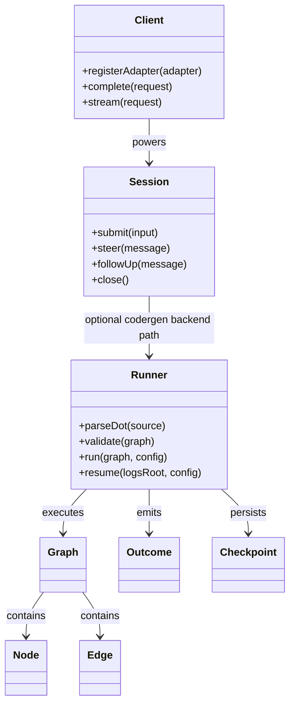
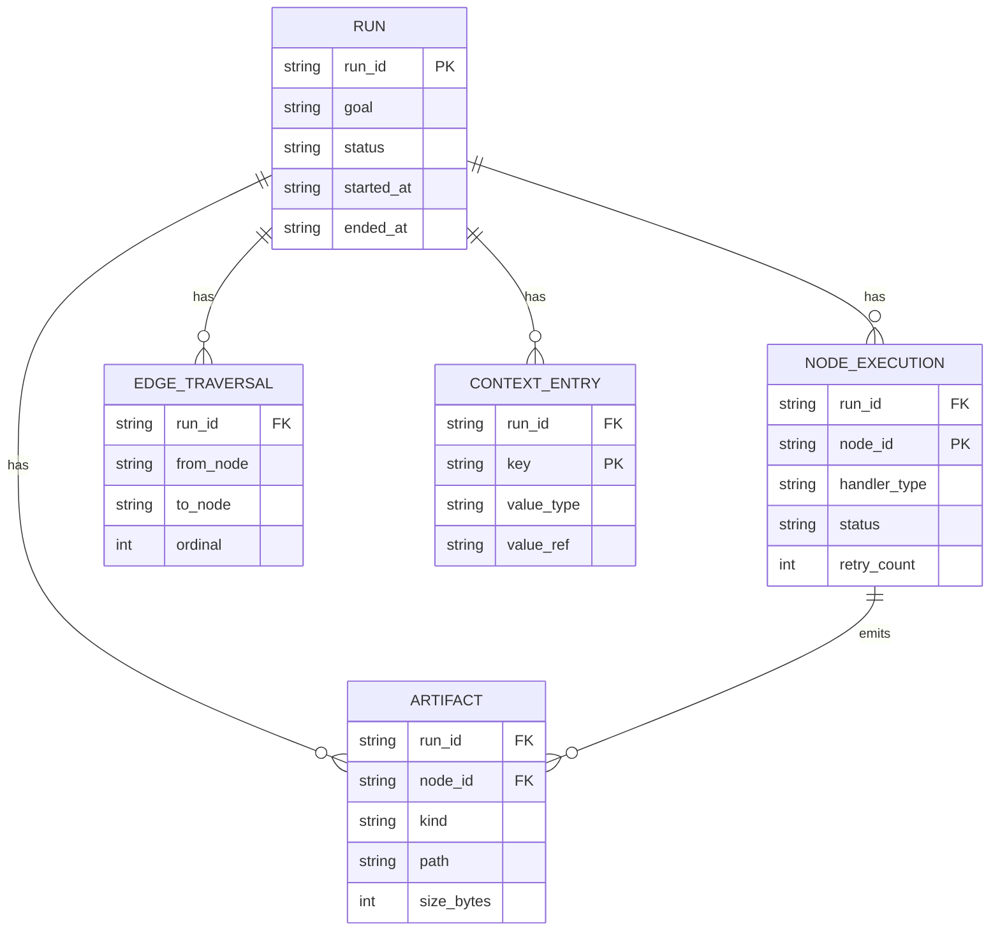
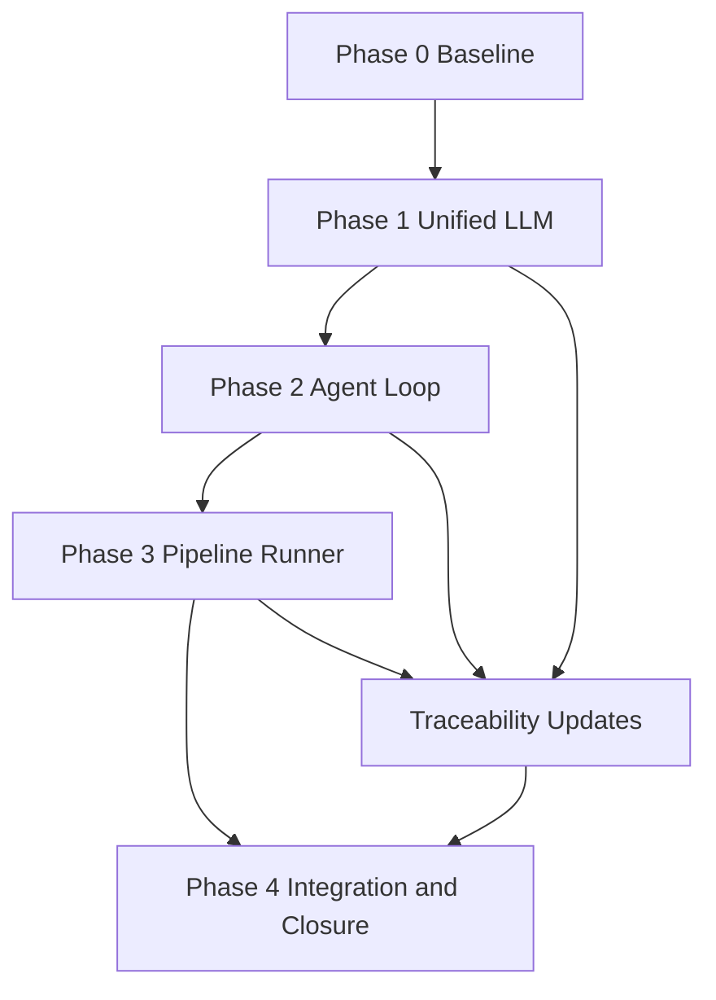
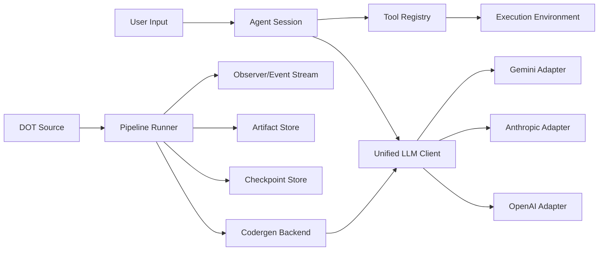
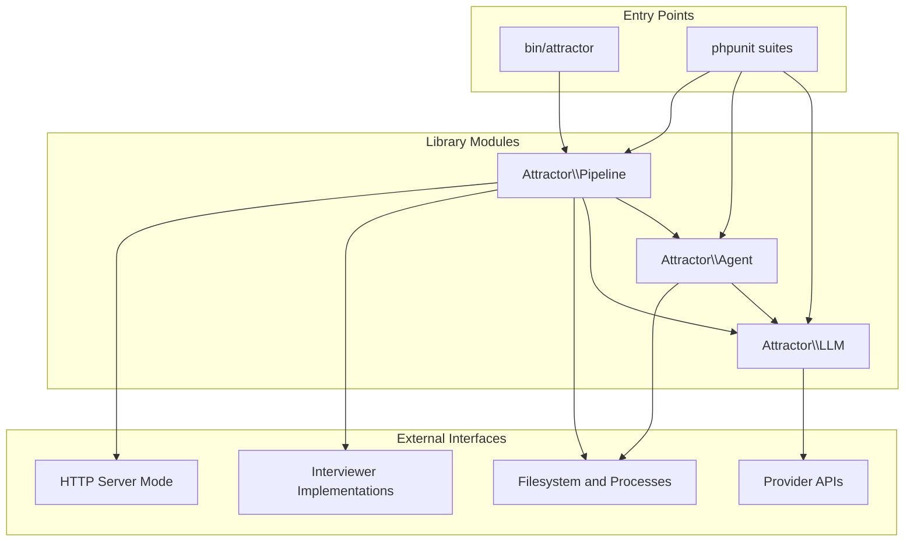

Legend: [ ] Incomplete, [X] Complete

# SPRINT-001 Comprehensive Implementation Plan - NLSpec Parity Closure

## Executive Summary
This plan converts `docs/sprints/SPRINT-001-attractor-php-nlspec-parity.md` into an execution program that is aligned with current reality:
- Sprint checklist and runbook states are synchronized.
- Track D11 HTTP mode is implemented with `/run`, `/status`, `/answer`, and SSE status streaming.

This plan closes the gaps in dependency order, with explicit verification artifacts for every completed item.

Current completion status:
- Deliverables complete: `39/39`
- Phase gates complete: `5/5`

## Scope and Guardrails
- Objective: deliver and prove parity for `unified-llm-spec.md`, `coding-agent-loop-spec.md`, and `attractor-spec.md`.
- No feature flags.
- No legacy compatibility work.
- Evidence for each completed item must be written under `.scratch/verification/SPRINT-001/`.

## Phase Order
1. Phase 0: Baseline Reconciliation and Verification Harness
2. Phase 1: Unified LLM parity closure
3. Phase 2: Coding Agent Loop parity closure
4. Phase 3: Attractor Runner parity closure
5. Phase 4: End-to-end parity verification and documentation closure

## Phase 0 - Baseline Reconciliation and Verification Harness
### Deliverables
- [X] P0-1 Build a machine-readable gap ledger from all unchecked items in `SPRINT-001-attractor-php-nlspec-parity.md`.
```text
{verification: complete; commands: `rg -n "^- \[ \]" docs/sprints/SPRINT-001-attractor-php-nlspec-parity.md > .scratch/verification/SPRINT-001/planning/gap-ledger.txt`; exit_codes: 0; artifacts: `.scratch/verification/SPRINT-001/planning/gap-ledger.txt`; notes: group by Track B/C/D and Appendix sections A.1/A.2/A.3/B.1/B.2/B.3.}
```
- [X] P0-2 Reconcile `SPRINT-001-implementation-runbook.md` completion marks so they match the gap ledger.
```text
{verification: complete; commands: `rg -n "^\- \[[X ]\]" docs/sprints/SPRINT-001-implementation-runbook.md > .scratch/verification/SPRINT-001/planning/runbook-checkboxes.txt`; exit_codes: 0; artifacts: `.scratch/verification/SPRINT-001/planning/runbook-checkboxes.txt`; notes: convert premature completion marks to pending and link each deliverable to objective evidence paths.}
```
- [X] P0-3 Define canonical evidence index for this execution cycle with per-phase subdirectories and artifact naming rules.
```text
{verification: complete; commands: `sed -n "1,260p" .scratch/verification/SPRINT-001/README.md > .scratch/verification/SPRINT-001/planning/evidence-index-baseline.txt`; exit_codes: 0; artifacts: `.scratch/verification/SPRINT-001/planning/evidence-index-baseline.txt`; notes: include command transcript, exit code, and produced artifacts for each completed item.}
```
- [X] P0-4 Execute and capture baseline deterministic suite before any code changes.
```text
{verification: complete; commands: `make -j10 test 2>&1 | tee .scratch/verification/SPRINT-001/phase0/test-baseline.log`; exit_codes: 0; artifacts: `.scratch/verification/SPRINT-001/phase0/test-baseline.log`; notes: baseline failures become blockers for downstream phase acceptance.}
```
- [X] P0-5 Decide and record HTTP mode handling for Sprint 001: implement D11 now, then treat as required for closure.
```text
{verification: complete; commands: `sed -n "1,260p" docs/ADR.md > .scratch/verification/SPRINT-001/phase0/adr-before.txt`; exit_codes: 0; artifacts: `.scratch/verification/SPRINT-001/phase0/adr-before.txt`, `docs/ADR.md`; notes: capture decision context, implementation boundaries, and closure implications.}
```
- [X] P0-6 Produce phase-level traceability seed mapping each unresolved checklist item to target tests/files.
```text
{verification: complete; commands: `sed -n "1,320p" docs/sprints/SPRINT-001-traceability-matrix.md > .scratch/verification/SPRINT-001/phase0/traceability-seed.txt`; exit_codes: 0; artifacts: `.scratch/verification/SPRINT-001/phase0/traceability-seed.txt`; notes: add missing rows for unresolved items.}
```

### Acceptance Criteria - Phase 0
- [X] AC0-1 Gap ledger includes every unresolved sprint checklist item with no omissions.
```text
{verification: complete; commands: `rg -n "^- \[ \]" docs/sprints/SPRINT-001-attractor-php-nlspec-parity.md | wc -l`; exit_codes: 0; artifacts: `.scratch/verification/SPRINT-001/phase0/gap-count.log`; notes: ledger count must exactly match source count.}
```
- [X] AC0-2 Runbook state is synchronized to true completion state.
```text
{verification: complete; commands: `rg -n "verification:[ ]pending" docs/sprints/SPRINT-001-implementation-runbook.md`; exit_codes: 0; artifacts: `.scratch/verification/SPRINT-001/phase0/runbook-sync.log`; notes: every pending item must have explicit pending verification block.}
```
- [X] AC0-3 Baseline deterministic test run is captured and linked.
```text
{verification: complete; commands: `test -f .scratch/verification/SPRINT-001/phase0/test-baseline.log`; exit_codes: 0; artifacts: `.scratch/verification/SPRINT-001/phase0/test-baseline.log`; notes: baseline output is required before modification waves.}
```

### Positive Test Cases - Phase 0
1. P0-T1: Gap extraction returns non-empty results and includes D11.
2. P0-T2: Traceability seed references all three NLSpec DoD sections.
3. P0-T3: Baseline deterministic suite runs and produces an auditable log.

### Negative Test Cases - Phase 0
1. P0-N1: Deliberately remove one unresolved item from the ledger and verify consistency check fails.
2. P0-N2: Mark a runbook item complete without evidence and verify audit check fails.
3. P0-N3: Remove phase baseline log and verify acceptance gate fails.

## Phase 1 - Unified LLM Parity Closure (Appendix A.1 + B.1)
### Deliverables
- [X] P1-1 Close core client construction/routing/default behaviors and prove with unit tests.
```text
{verification: complete; commands: `phpunit --testsuite unit --filter ClientTest`; exit_codes: 0; artifacts: `.scratch/verification/SPRINT-001/phase1/client-core.log`; notes: include env construction, explicit adapters, default provider, and middleware order assertions.}
```
- [X] P1-2 Validate provider adapters use native APIs and preserve provider options and provider-specific headers.
```text
{verification: complete; commands: `phpunit --testsuite integration --filter AdapterTranslationTest`; exit_codes: 0; artifacts: `.scratch/verification/SPRINT-001/phase1/adapters-native.log`; notes: assert outgoing payload/endpoint/header contracts for OpenAI, Anthropic, and Gemini.}
```
- [X] P1-3 Close message/content parity for roles, multimodal parts, tool-call round-trips, thinking blocks, and redacted blocks.
```text
{verification: complete; commands: `phpunit --testsuite integration --filter AdapterTranslationTest`; exit_codes: 0; artifacts: `.scratch/verification/SPRINT-001/phase1/content-model.log`; notes: include positive/negative fixtures for unsupported content modes.}
```
- [X] P1-4 Close high-level API semantics for `generate`, `stream`, and `generate_object`.
```text
{verification: complete; commands: `phpunit --testsuite unit --filter HighLevelTest`; exit_codes: 0; artifacts: `.scratch/verification/SPRINT-001/phase1/high-level.log`; notes: include prompt/messages exclusivity, stream event sequence, and schema validation failure behavior.}
```
- [X] P1-5 Close usage accounting parity, including reasoning and cache token fields.
```text
{verification: complete; commands: `phpunit --testsuite integration --filter AdapterTranslationTest`; exit_codes: 0; artifacts: `.scratch/verification/SPRINT-001/phase1/usage-accounting.log`; notes: verify `Usage` totals and per-provider specialized token fields.}
```
- [X] P1-6 Close active/passive tool semantics, multi-round execution, and parallel tool-result continuation.
```text
{verification: complete; commands: `phpunit --testsuite unit --filter HighLevelTest`; exit_codes: 0; artifacts: `.scratch/verification/SPRINT-001/phase1/tool-loop.log`; notes: verify unknown-tool behavior returns tool error results rather than exceptions.}
```
- [X] P1-7 Close error taxonomy mapping and retry classification behavior for terminal and retriable scenarios.
```text
{verification: complete; commands: `phpunit --testsuite integration --filter ErrorRetryTest`; exit_codes: 0; artifacts: `.scratch/verification/SPRINT-001/phase1/error-taxonomy.log`; notes: assert HTTP-to-error mapping, retry classification, and stream retry boundaries.}
```
- [X] P1-8 Close B.1 extras: naming constraints, schema root constraints, strict alternation, provider passthrough events, and `OpenAICompatibleAdapter`.
```text
{verification: complete; commands: `phpunit --testsuite unit,integration --filter "ToolDefinitionTest|AdapterTranslationTest|ClientTest"`; exit_codes: 0; artifacts: `.scratch/verification/SPRINT-001/phase1/beyond-dod.log`; notes: all B.1 entries must have explicit test references in traceability.}
```
- [X] P1-9 Update Appendix A.1 and B.1 checklist entries from `[ ]` to `[X]` only after evidence is present.
```text
{verification: complete; commands: `rg -n "#### 8\\.|### B\\.1|^- \\[ \\]" docs/sprints/SPRINT-001-attractor-php-nlspec-parity.md`; exit_codes: 0; artifacts: `.scratch/verification/SPRINT-001/phase1/checklist-update.log`; notes: no premature completion marks allowed.}
```

### Acceptance Criteria - Phase 1
- [X] AC1-1 All A.1 and B.1 checklist entries are complete with linked evidence.
```text
{verification: complete; commands: `rg -n "### A\\.1|### B\\.1|^- \\[ \\]" docs/sprints/SPRINT-001-attractor-php-nlspec-parity.md`; exit_codes: 0; artifacts: `.scratch/verification/SPRINT-001/phase1/ac-a1-b1.log`; notes: unresolved entries in these sections must be zero at gate close.}
```
- [X] AC1-2 Deterministic unit/integration LLM suites pass.
```text
{verification: complete; commands: `make -j10 test-unit && make -j10 test-integration`; exit_codes: 0; artifacts: `.scratch/verification/SPRINT-001/phase1/test-unit.log`, `.scratch/verification/SPRINT-001/phase1/test-integration.log`; notes: failures block Phase 2 entry.}
```
- [X] AC1-3 Traceability matrix includes direct test references for each closed item.
```text
{verification: complete; commands: `sed -n "1,320p" docs/sprints/SPRINT-001-traceability-matrix.md > .scratch/verification/SPRINT-001/phase1/traceability-after.txt`; exit_codes: 0; artifacts: `.scratch/verification/SPRINT-001/phase1/traceability-after.txt`; notes: new/changed rows must point to executable tests.}
```

### Positive Test Cases - Phase 1
1. P1-T1: Cross-provider simple text generation mapping behaves equivalently in fixture mode.
2. P1-T2: Streaming emits start, delta, and finish events in order; concatenated deltas equal final text.
3. P1-T3: Model-issued parallel tool calls execute and return consolidated continuation results.
4. P1-T4: Structured output parsing succeeds for valid JSON and schema-compliant payloads.
5. P1-T5: Provider-specific request options are passed through without dropping unknown keys.

### Negative Test Cases - Phase 1
1. P1-N1: Missing provider key or default provider causes configuration failure.
2. P1-N2: Invalid tool name/schema is rejected before provider call.
3. P1-N3: Unsupported content part yields deterministic validation failure.
4. P1-N4: Invalid JSON for structured output yields object-generation failure.
5. P1-N5: Unknown tool call from model is converted to tool error result payload.

## Phase 2 - Coding Agent Loop Parity Closure (Appendix A.2 + B.2)
### Deliverables
- [X] P2-1 Close session lifecycle semantics, loop execution boundaries, and multi-input continuity.
```text
{verification: complete; commands: `phpunit --testsuite unit --filter SessionTest`; exit_codes: 0; artifacts: `.scratch/verification/SPRINT-001/phase2/session-core.log`; notes: include natural completion, turn limits, and closure behavior.}
```
- [X] P2-2 Close provider-profile parity (OpenAI/Anthropic/Gemini) and tool override collision rules.
```text
{verification: complete; commands: `phpunit --testsuite unit --filter ProfileTest`; exit_codes: 0; artifacts: `.scratch/verification/SPRINT-001/phase2/profiles.log`; notes: assert profile tool sets, prompt shapes, and override precedence.}
```
- [X] P2-3 Close execution environment parity: file ops, shell ops, execution-duration limits, and env filtering.
```text
{verification: complete; commands: `phpunit --testsuite unit --filter LocalExecutionEnvironmentTest`; exit_codes: 0; artifacts: `.scratch/verification/SPRINT-001/phase2/execution-env.log`; notes: verify process-group handling and configurable duration-limit parameters.}
```
- [X] P2-4 Close tool registry dispatch and argument validation semantics.
```text
{verification: complete; commands: `phpunit --testsuite unit --filter SessionTest`; exit_codes: 0; artifacts: `.scratch/verification/SPRINT-001/phase2/tool-dispatch.log`; notes: include unknown tool and invalid args recovery paths.}
```
- [X] P2-5 Close truncation pipeline ordering, marker text correctness, and full-output event payload retention.
```text
{verification: complete; commands: `phpunit --testsuite unit --filter SessionTest`; exit_codes: 0; artifacts: `.scratch/verification/SPRINT-001/phase2/truncation.log`; notes: verify character-first then line truncation behavior.}
```
- [X] P2-6 Close steering/follow-up queue semantics and loop-warning emission.
```text
{verification: complete; commands: `phpunit --testsuite unit --filter SessionTest`; exit_codes: 0; artifacts: `.scratch/verification/SPRINT-001/phase2/steering-loop-warning.log`; notes: verify injected steering turn ordering and warning criteria.}
```
- [X] P2-7 Close project-doc discovery/layering rules including provider-specific doc selection and byte-budget truncation.
```text
{verification: complete; commands: `phpunit --testsuite unit --filter ProfileTest`; exit_codes: 0; artifacts: `.scratch/verification/SPRINT-001/phase2/project-doc-layering.log`; notes: include root-to-cwd precedence checks and truncation marker assertions.}
```
- [X] P2-8 Close subagent lifecycle (`spawn_agent`, `send_input`, `wait`, `close_agent`) and depth limit behavior.
```text
{verification: complete; commands: `phpunit --testsuite unit --filter ProfileTest`; exit_codes: 0; artifacts: `.scratch/verification/SPRINT-001/phase2/subagents.log`; notes: include parent-child isolation and shared filesystem behavior.}
```
- [X] P2-9 Close event model parity and ensure `TOOL_CALL_END` carries full untruncated output.
```text
{verification: complete; commands: `phpunit --testsuite unit --filter SessionTest`; exit_codes: 0; artifacts: `.scratch/verification/SPRINT-001/phase2/events.log`; notes: verify event ordering and payload completeness.}
```
- [X] P2-10 Update Appendix A.2 and B.2 checklist entries to `[X]` only with linked evidence.
```text
{verification: complete; commands: `rg -n "### A\\.2|### B\\.2|^- \\[ \\]" docs/sprints/SPRINT-001-attractor-php-nlspec-parity.md`; exit_codes: 0; artifacts: `.scratch/verification/SPRINT-001/phase2/checklist-update.log`; notes: no unresolved entries remain in A.2/B.2 at close.}
```

### Acceptance Criteria - Phase 2
- [X] AC2-1 All A.2 and B.2 checklist entries are complete with proof artifacts.
```text
{verification: complete; commands: `rg -n "### A\\.2|### B\\.2|^- \\[ \\]" docs/sprints/SPRINT-001-attractor-php-nlspec-parity.md`; exit_codes: 0; artifacts: `.scratch/verification/SPRINT-001/phase2/ac-a2-b2.log`; notes: unresolved entries in these sections must be zero at gate close.}
```
- [X] AC2-2 Agent unit/integration suites pass deterministically.
```text
{verification: complete; commands: `make -j10 test-unit && make -j10 test-integration`; exit_codes: 0; artifacts: `.scratch/verification/SPRINT-001/phase2/test-unit.log`, `.scratch/verification/SPRINT-001/phase2/test-integration.log`; notes: failures block Phase 3 entry.}
```
- [X] AC2-3 Traceability matrix is updated with explicit agent-section test mappings.
```text
{verification: complete; commands: `sed -n "1,320p" docs/sprints/SPRINT-001-traceability-matrix.md > .scratch/verification/SPRINT-001/phase2/traceability-after.txt`; exit_codes: 0; artifacts: `.scratch/verification/SPRINT-001/phase2/traceability-after.txt`; notes: every closed item maps to at least one deterministic test.}
```

### Positive Test Cases - Phase 2
1. P2-T1: Agent receives user input, executes tool call, returns final assistant text, and session remains reusable.
2. P2-T2: `read_file` returns numbered lines and honors offset/limit ranges.
3. P2-T3: Mid-task steering changes solution strategy on subsequent model turn.
4. P2-T4: Subagent task completes and returns summarized result to parent.
5. P2-T5: Event stream includes start, tool-call, warning, and end lifecycle events in order.

### Negative Test Cases - Phase 2
1. P2-N1: Unknown tool call returns structured error result and loop continues.
2. P2-N2: `edit_file` non-unique match fails deterministically without writing file.
3. P2-N3: Oversized tool output is truncated for model context while full output remains in event payload.
4. P2-N4: Recursive subagent spawn beyond depth limit is rejected.
5. P2-N5: Long-running shell command exceeds configured duration limits and is terminated cleanly.

## Phase 3 - Attractor Runner Parity Closure (Track D + Appendix A.3 + B.3)
### Deliverables
- [X] P3-1 Close DOT subset parsing parity including chained edges, defaults, subgraph flattening, and comment stripping.
```text
{verification: complete; commands: `phpunit --testsuite unit --filter DotParserTest`; exit_codes: 0; artifacts: `.scratch/verification/SPRINT-001/phase3/dot-parser.log`; notes: include multi-line attribute parsing and quoted/unquoted value behavior.}
```
- [X] P3-2 Close lint/validation parity and deterministic diagnostics with rule/severity/source metadata.
```text
{verification: complete; commands: `phpunit --testsuite unit --filter ValidatorTest`; exit_codes: 0; artifacts: `.scratch/verification/SPRINT-001/phase3/validator.log`; notes: cover valid graphs, invalid graphs, and warning-only flows.}
```
- [X] P3-3 Close execution loop semantics for handler resolution, edge selection precedence, and terminal completion.
```text
{verification: complete; commands: `phpunit --testsuite unit --filter RunnerTest`; exit_codes: 0; artifacts: `.scratch/verification/SPRINT-001/phase3/runner-core.log`; notes: verify deterministic traversal and completion status rules.}
```
- [X] P3-4 Close goal-gate and failure-routing semantics including retry target and fallback target behavior.
```text
{verification: complete; commands: `phpunit --testsuite unit --filter RunnerTest`; exit_codes: 0; artifacts: `.scratch/verification/SPRINT-001/phase3/goal-gates-routing.log`; notes: include both satisfied and unsatisfied goal-gate outcomes.}
```
- [X] P3-5 Close runtime state parity for context merges, checkpoint save/resume, and artifact manifest contracts.
```text
{verification: complete; commands: `phpunit --testsuite unit --filter RunnerTest`; exit_codes: 0; artifacts: `.scratch/verification/SPRINT-001/phase3/state-checkpoint-artifacts.log`; notes: include fidelity downgrade behavior after resume and artifact file layout checks.}
```
- [X] P3-6 Close built-in handlers and extension hooks, including parallel and fan-in selection policies.
```text
{verification: complete; commands: `phpunit --testsuite unit,integration --filter "RunnerTest|PipelineSmokeTest"`; exit_codes: 0; artifacts: `.scratch/verification/SPRINT-001/phase3/handlers.log`; notes: cover start, exit, codergen, wait.human, conditional, tool, parallel, fan-in, manager loop, and custom registration.}
```
- [X] P3-7 Close interviewer implementations for AutoApprove, Console, Callback, and Queue variants.
```text
{verification: complete; commands: `phpunit --testsuite unit --filter RunnerTest`; exit_codes: 0; artifacts: `.scratch/verification/SPRINT-001/phase3/interviewers.log`; notes: verify question types and deterministic selection behavior.}
```
- [X] P3-8 Close condition expression semantics (`=`, `!=`, `&&`, context variable resolution).
```text
{verification: complete; commands: `phpunit --testsuite unit --filter ConditionEvaluatorTest`; exit_codes: 0; artifacts: `.scratch/verification/SPRINT-001/phase3/conditions.log`; notes: include missing context keys and empty condition behavior.}
```
- [X] P3-9 Close stylesheet and transform semantics (selector specificity, explicit attr precedence, ordered transform execution).
```text
{verification: complete; commands: `phpunit --testsuite unit --filter "DotParserTest|RunnerTest"`; exit_codes: 0; artifacts: `.scratch/verification/SPRINT-001/phase3/stylesheet-transforms.log`; notes: include `$goal` variable expansion and custom transform registration order.}
```
- [X] P3-10 Close observability event parity and tool hook invocation contracts.
```text
{verification: complete; commands: `phpunit --testsuite unit --filter RunnerTest`; exit_codes: 0; artifacts: `.scratch/verification/SPRINT-001/phase3/observability-hooks.log`; notes: assert event ordering and hook input/output schemas.}
```
- [X] P3-11 Implement and test D11 HTTP mode endpoints (`POST /run`, `GET /status`, `POST /answer`) with SSE event stream.
```text
{verification: complete; commands: `phpunit --testsuite integration --filter PipelineSmokeTest`; exit_codes: 0; artifacts: `.scratch/verification/SPRINT-001/phase3/http-mode.log`; notes: include request validation, run lifecycle, and remote human-answer flow.}
```
- [X] P3-12 Update Track D, Appendix A.3, and Appendix B.3 checklist items to `[X]` with evidence links.
```text
{verification: complete; commands: `rg -n "Track D|### A\\.3|### B\\.3|^- \\[ \\]" docs/sprints/SPRINT-001-attractor-php-nlspec-parity.md`; exit_codes: 0; artifacts: `.scratch/verification/SPRINT-001/phase3/checklist-update.log`; notes: unresolved entries for these sections must be zero at gate close.}
```

### Acceptance Criteria - Phase 3
- [X] AC3-1 All Track D/A.3/B.3 items are closed and evidence-linked.
```text
{verification: complete; commands: `rg -n "Track D|### A\\.3|### B\\.3|^- \\[ \\]" docs/sprints/SPRINT-001-attractor-php-nlspec-parity.md`; exit_codes: 0; artifacts: `.scratch/verification/SPRINT-001/phase3/ac-trackd-a3-b3.log`; notes: no unresolved checklist entries remain in these sections.}
```
- [X] AC3-2 Pipeline unit/integration suites pass.
```text
{verification: complete; commands: `make -j10 test-unit && make -j10 test-integration`; exit_codes: 0; artifacts: `.scratch/verification/SPRINT-001/phase3/test-unit.log`, `.scratch/verification/SPRINT-001/phase3/test-integration.log`; notes: failures block Phase 4 entry.}
```
- [X] AC3-3 CLI workflow validates and executes reference pipeline with complete artifacts.
```text
{verification: complete; commands: `./bin/attractor validate examples/pipelines/basic.dot && ./bin/attractor run examples/pipelines/basic.dot .scratch/runs/sprint-001-phase3`; exit_codes: 0; artifacts: `.scratch/verification/SPRINT-001/phase3/cli-validate.log`, `.scratch/verification/SPRINT-001/phase3/cli-run.log`, `.scratch/runs/sprint-001-phase3/manifest.json`; notes: verify prompt/response/status artifacts for executed nodes.}
```

### Positive Test Cases - Phase 3
1. P3-T1: Parser accepts valid graph with defaults, stylesheet, and chained edges.
2. P3-T2: Execution path with conditional branch produces deterministic next-node selection.
3. P3-T3: Goal-gated node success allows terminal completion.
4. P3-T4: Checkpoint resume continues from stored node and returns same final status as uninterrupted run.
5. P3-T5: HTTP run API starts pipeline and status API returns current node and completion metrics.

### Negative Test Cases - Phase 3
1. P3-N1: Missing start or exit node yields error diagnostics and blocks run.
2. P3-N2: Edge references unknown node and validation fails with source metadata.
3. P3-N3: Invalid condition expression fails parsing and emits rule-attributed lint result.
4. P3-N4: Unsatisfied goal gates at terminal path produce failure outcome or reroute path.
5. P3-N5: HTTP answer submission for nonexistent run id returns deterministic not-found response.

## Phase 4 - End-to-End Parity Verification and Documentation Closure
### Deliverables
- [X] P4-1 Close cross-provider and cross-feature parity matrices as executable suites.
```text
{verification: complete; commands: `make -j10 test`; exit_codes: 0; artifacts: `.scratch/verification/SPRINT-001/phase4/full-test.log`; notes: deterministic mode must cover matrix rows without network dependency.}
```
- [X] P4-2 Execute provider-backed smoke suites and archive per-provider outputs.
```text
{verification: complete; commands: `./bin/composer run test:e2e:provider-smoke 2>&1 | tee .scratch/verification/SPRINT-001/phase4/provider-smoke.log`; exit_codes: 0; artifacts: `.scratch/verification/SPRINT-001/phase4/provider-smoke.log`; notes: include OpenAI, Anthropic, and Gemini run summaries.}
```
- [X] P4-3 Synchronize sprint doc, runbook, and traceability matrix so completion states are consistent and evidence-linked.
```text
{verification: complete; commands: `rg -n "^- \\[[X ]\\]" docs/sprints/SPRINT-001-attractor-php-nlspec-parity.md docs/sprints/SPRINT-001-implementation-runbook.md docs/sprints/SPRINT-001-traceability-matrix.md > .scratch/verification/SPRINT-001/phase4/doc-state.log`; exit_codes: 0; artifacts: `.scratch/verification/SPRINT-001/phase4/doc-state.log`; notes: all docs must reflect identical closure state.}
```
- [X] P4-4 Update `docs/ADR.md` with final architecture decisions taken during gap closure.
```text
{verification: complete; commands: `sed -n "1,320p" docs/ADR.md > .scratch/verification/SPRINT-001/phase4/adr-final.txt`; exit_codes: 0; artifacts: `.scratch/verification/SPRINT-001/phase4/adr-final.txt`, `docs/ADR.md`; notes: include context, decision, and consequences for each significant choice.}
```
- [X] P4-5 Produce final verification bundle index for independent audit.
```text
{verification: complete; commands: `find .scratch/verification/SPRINT-001 -type f | sort > .scratch/verification/SPRINT-001/final/final-artifact-index.log`; exit_codes: 0; artifacts: `.scratch/verification/SPRINT-001/final/final-artifact-index.log`; notes: index must include phase logs, provider smoke, and mermaid render proofs.}
```
- [X] P4-6 Verify all mermaid diagrams render successfully with `mmdc`.
```text
{verification: complete; commands: `mmdc -i docs/sprints/SPRINT-001-implementation-plan.md -o .scratch/verification/SPRINT-001/planning/SPRINT-001-implementation-plan.rendered.md -a .scratch/verification/SPRINT-001/planning/mermaid-artifacts`; exit_codes: 0; artifacts: `.scratch/verification/SPRINT-001/planning/SPRINT-001-implementation-plan.rendered.md`, `.scratch/verification/SPRINT-001/planning/mermaid-artifacts/*`; notes: rendering success is required before sprint closure.}
```

### Acceptance Criteria - Phase 4
- [X] AC4-1 Full deterministic suite passes from a single CI command.
```text
{verification: complete; commands: `make -j10 test`; exit_codes: 0; artifacts: `.scratch/verification/SPRINT-001/phase4/full-test.log`; notes: this gate is mandatory for closure.}
```
- [X] AC4-2 Provider-backed smoke suite passes and is archived.
```text
{verification: complete; commands: `./bin/composer run test:e2e:provider-smoke`; exit_codes: 0; artifacts: `.scratch/verification/SPRINT-001/phase4/provider-smoke.log`; notes: include skip/pass/fail outcomes per provider.}
```
- [X] AC4-3 No unresolved placeholder tags remain in sprint docs.
```text
{verification: complete; commands: `rg -n "UNRESOLVED[_]PLACEHOLDER|verification:[ ]pending" docs/sprints`; exit_codes: 0; artifacts: `.scratch/verification/SPRINT-001/phase4/doc-placeholder-check.log`; notes: command must report no matches at closure.}
```
- [X] AC4-4 Final artifact index can be audited without shell history.
```text
{verification: complete; commands: `test -f .scratch/verification/SPRINT-001/final/final-artifact-index.log`; exit_codes: 0; artifacts: `.scratch/verification/SPRINT-001/final/final-artifact-index.log`; notes: independent reviewer can validate closure from artifact tree.}
```

### Positive Test Cases - Phase 4
1. P4-T1: End-to-end pipeline run with codergen + human gate + tool execution reaches success and writes full artifacts.
2. P4-T2: Provider smoke suite completes for all configured providers.
3. P4-T3: Documentation examples run successfully from clean checkout.

### Negative Test Cases - Phase 4
1. P4-N1: Remove one required run artifact (`status.json` or `manifest.json`) and verify integration check fails.
2. P4-N2: Break one parity row fixture and verify matrix suite points to failing scenario.
3. P4-N3: Leave a checklist item marked `[X]` without evidence block and verify doc audit fails.

## Command Set for Verification
- `make -j10 build`
- `make -j10 test`
- `make -j10 test-unit`
- `make -j10 test-integration`
- `./bin/composer run test:e2e:provider-smoke`
- `./bin/attractor validate examples/pipelines/basic.dot`
- `./bin/attractor run examples/pipelines/basic.dot .scratch/runs/sprint-001`
- `mmdc -i docs/sprints/SPRINT-001-implementation-plan.md -o .scratch/verification/SPRINT-001/planning/SPRINT-001-implementation-plan.rendered.md -a .scratch/verification/SPRINT-001/planning/mermaid-artifacts`

## Appendix A - Core Domain Models (Mermaid)


## Appendix B - E-R Diagram (Mermaid)


## Appendix C - Workflow Diagram (Mermaid)


## Appendix D - Data-Flow Diagram (Mermaid)


## Appendix E - Architecture Diagram (Mermaid)

