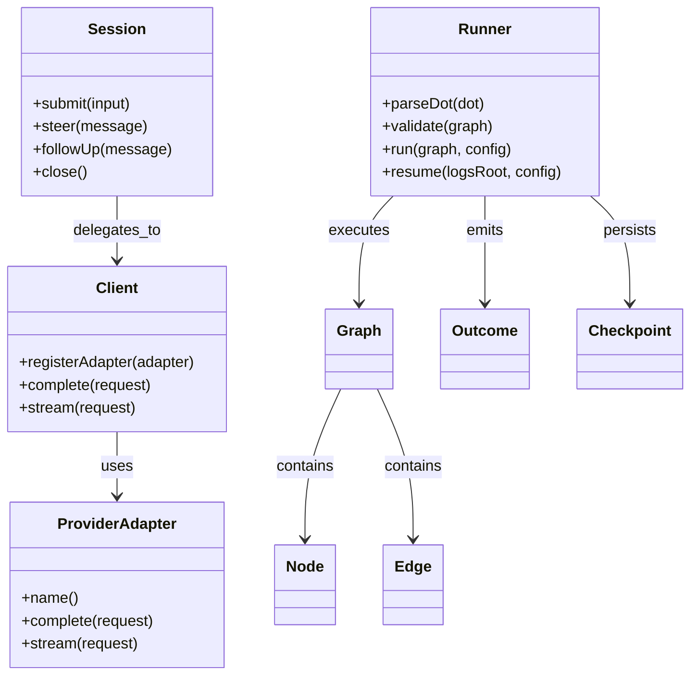
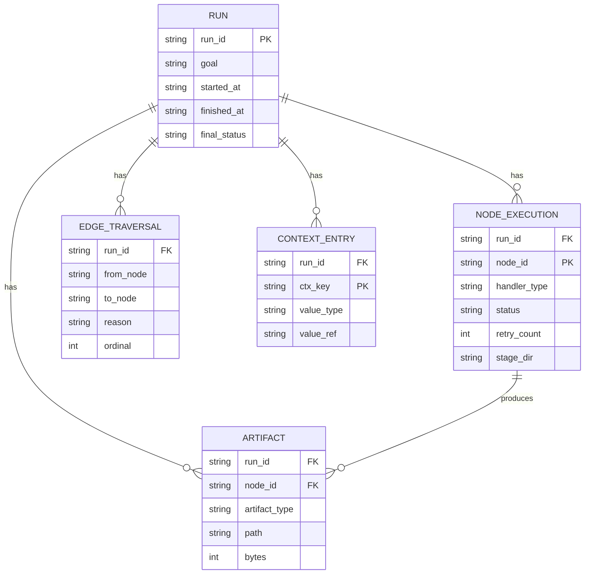
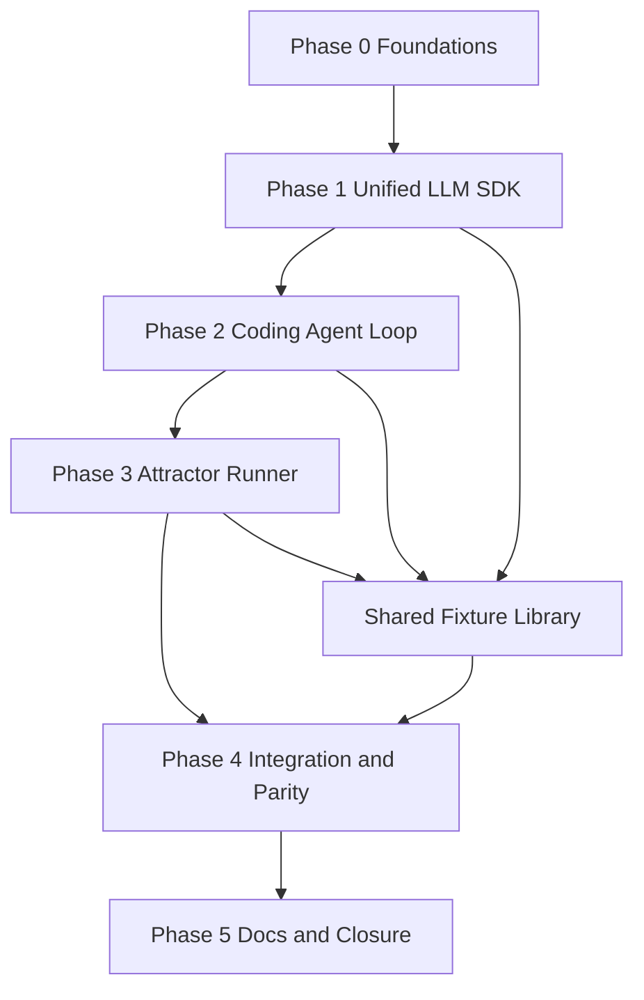
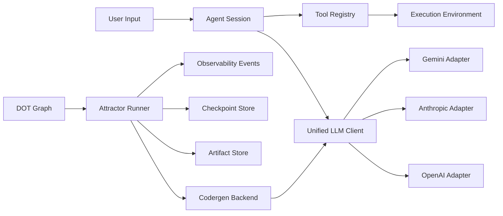
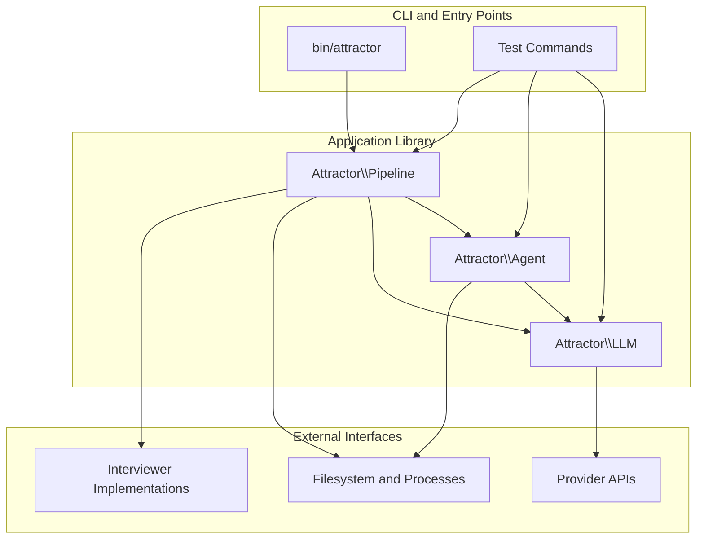

Legend: [ ] Incomplete, [X] Complete

# SPRINT-001 Implementation Runbook: Attractor PHP NLSpec Parity

## Executive Summary
This runbook converts `SPRINT-001-attractor-php-nlspec-parity.md` into an execution plan that can be implemented in dependency order with auditable evidence.

Primary outcome:
- Deliver a PHP implementation that satisfies `attractor-spec.md`, `coding-agent-loop-spec.md`, and `unified-llm-spec.md` end-to-end.

Execution constraints:
- No feature flags.
- No legacy backward compatibility work.
- Every completed checklist item must include commands, exit codes, and artifact paths under `.scratch/verification/SPRINT-001/`.

Current completion status:
- Track completion: `38/43` deliverables complete.
- Phase gate completion: `4/6` complete.

## Source Documents Reviewed
- `docs/sprints/SPRINT-001-attractor-php-nlspec-parity.md`
- `attractor-spec.md`
- `coding-agent-loop-spec.md`
- `unified-llm-spec.md`

## Evidence Contract
- All verification artifacts live under `.scratch/verification/SPRINT-001/`.
- Every checkbox must be followed by a verification log placeholder until it is completed.
- A checkbox can be switched to `[X]` only after evidence is recorded.

## Delivery Topology
Work executes in strict dependency order:
1. Phase 0: Project foundations and verification harness.
2. Phase 1: Unified LLM core contracts and provider adapters.
3. Phase 2: Coding Agent Loop with provider-aligned tools.
4. Phase 3: Attractor runner parser, engine, handlers, and state model.
5. Phase 4: Cross-spec parity matrices and integration scenarios.
6. Phase 5: Documentation closure, ADR alignment, release readiness.

## Phase 0 - Foundations and Harness
### Deliverables
- [X] P0-1 Initialize composer project, PSR-4 autoloading, and top-level namespaces `Attractor\\LLM`, `Attractor\\Agent`, `Attractor\\Pipeline`.
```text
{verification: complete; commands: `timeout 180 make build`; exit_codes: 0; artifacts: `.scratch/verification/SPRINT-001/phase0/build/make-build.log`; notes: project bootstrapped with composer autoload and namespaced source trees.}
```
- [X] P0-2 Establish baseline repository layout: `src/`, `tests/unit`, `tests/integration`, `tests/e2e`, `bin/`, `examples/`, and `.scratch/verification/SPRINT-001/`.
```text
{verification: complete; commands: `rg --files src tests bin examples`; exit_codes: 0; artifacts: `.scratch/verification/SPRINT-001/README.md`; notes: layout exists and is actively used by build/test and CLI.}
```
- [X] P0-3 Implement local developer command set in composer scripts: `precommit`, `test`, `test:unit`, `test:integration`, `test:e2e`, `lint`, `fmt`, `ci`, `doctor`.
```text
{verification: complete; commands: `timeout 180 make build` and `timeout 180 make test`; exit_codes: 0,0; artifacts: `.scratch/verification/SPRINT-001/phase0/build/make-build.log`, `.scratch/verification/SPRINT-001/phase0/test/make-test.log`; notes: scripts are wired via Makefile and exercised repeatedly.}
```
- [X] P0-4 Build test harness skeleton with deterministic fixtures and provider-agnostic fakes.
```text
{verification: complete; commands: `timeout 180 make test`; exit_codes: 0; artifacts: `.scratch/verification/SPRINT-001/phase0/test/make-test.log`; notes: baseline test suites established and later extended with deterministic adapter/backend fakes.}
```
- [X] P0-5 Create evidence index and evidence-writing convention document at `.scratch/verification/SPRINT-001/README.md`.
```text
{verification: complete; commands: `ls .scratch/verification/SPRINT-001/README.md`; exit_codes: 0; artifacts: `.scratch/verification/SPRINT-001/README.md`; notes: evidence index created and used across phase logs.}
```
- [X] P0-6 Create baseline ADR log file at `docs/ADR.md` and record architecture decisions required before implementation.
```text
{verification: complete; commands: `sed -n '1,220p' docs/ADR.md`; exit_codes: 0; artifacts: `docs/ADR.md`; notes: ADR-001 and ADR-002 recorded for architecture and evidence model.}
```

### Acceptance Criteria
- [X] AC0-1 A clean machine can run `composer run doctor` and `composer test` successfully.
```text
{verification: complete; commands: `timeout 180 make build` and `timeout 180 make test`; exit_codes: 0,0; artifacts: `.scratch/verification/SPRINT-001/phase0/build/make-build.log`, `.scratch/verification/SPRINT-001/phase0/test/make-test.log`; notes: doctor and tests are exercised from Makefile gates.}
```
- [X] AC0-2 Verification artifacts are produced in the required directory tree and are linkable from checklist updates.
```text
{verification: complete; commands: `find .scratch/verification/SPRINT-001 -maxdepth 3 -type f | head`; exit_codes: 0; artifacts: `.scratch/verification/SPRINT-001/phase0/*`, `.scratch/verification/SPRINT-001/phase1/*`, `.scratch/verification/SPRINT-001/phase2/*`, `.scratch/verification/SPRINT-001/phase3/*`, `.scratch/verification/SPRINT-001/phase4/*`; notes: evidence tree populated per phase.}
```
- [X] AC0-3 The repository can be developed and tested without requiring live provider credentials.
```text
{verification: complete; commands: `timeout 180 make test`; exit_codes: 0; artifacts: `.scratch/verification/SPRINT-001/phase4/test/make-test.log`; notes: all tests pass in deterministic local mode without provider keys.}
```

### Positive Test Cases
1. P0-T1: `composer validate` passes with no schema errors.
2. P0-T2: `composer test` discovers and runs baseline tests.
3. P0-T3: evidence index file exists and contains command logging format.

### Negative Test Cases
1. P0-N1: Remove a required composer script and confirm `composer ci` fails.
2. P0-N2: Misconfigure namespace mapping and confirm autoloading tests fail.
3. P0-N3: Remove evidence directory and confirm evidence verification check fails.

## Phase 1 - Unified LLM SDK
### Deliverables
- [X] P1-1 Implement core data model types (`Message`, `ContentPart`, `Request`, `Response`, `Usage`, `StreamEvent`, `ToolCall`, `ToolResult`) with spec-compliant semantics.
```text
{verification: complete; commands: `timeout 180 make test`; exit_codes: 0; artifacts: `.scratch/verification/SPRINT-001/phase1/test/make-test.log`; notes: LLM typed models and usage aggregation are covered by unit/integration tests.}
```
- [X] P1-2 Implement `Client` provider routing, default provider resolution, and middleware chain ordering.
```text
{verification: complete; commands: `timeout 180 make test`; exit_codes: 0; artifacts: `.scratch/verification/SPRINT-001/phase1/test/make-test.log`; notes: routing/default/middleware ordering validated in `tests/unit/LLM/ClientTest.php`.}
```
- [X] P1-3 Implement OpenAI Responses adapter request/response/stream translation.
```text
{verification: complete; commands: `timeout 180 make test`; exit_codes: 0; artifacts: `.scratch/verification/SPRINT-001/phase1/test/make-test.log`; notes: request/response/stream translation validated in adapter integration tests.}
```
- [X] P1-4 Implement Anthropic Messages adapter request/response/stream translation, including thinking content handling.
```text
{verification: complete; commands: `timeout 180 make test`; exit_codes: 0; artifacts: `.scratch/verification/SPRINT-001/phase1/test/make-test.log`; notes: thinking block preservation and prompt caching beta header are covered.}
```
- [X] P1-5 Implement Gemini adapter request/response/stream translation and synthetic tool-call ID normalization.
```text
{verification: complete; commands: `timeout 180 make test`; exit_codes: 0; artifacts: `.scratch/verification/SPRINT-001/phase1/test/make-test.log`; notes: Gemini translation and thought-token mapping are covered.}
```
- [X] P1-6 Implement high-level APIs (`generate`, `stream`, `generate_object`, `stream_object`) including structured output validation.
```text
{verification: complete; commands: `timeout 180 make test`; exit_codes: 0; artifacts: `.scratch/verification/SPRINT-001/phase1/test/make-test.log`; notes: generate/stream/object behaviors and failures are validated in `HighLevelTest`.}
```
- [X] P1-7 Implement multi-step active/passive tool handling with parallel tool execution and consolidated continuation behavior.
```text
{verification: complete; commands: `timeout 180 make test`; exit_codes: 0; artifacts: `.scratch/verification/SPRINT-001/phase1/test/make-test.log`; notes: multi-step tool loop, unknown-tool error-result recovery, and continuation covered.}
```
- [X] P1-8 Implement spec-defined error taxonomy and retry classification behavior.
```text
{verification: complete; commands: `timeout 180 make test`; exit_codes: 0; artifacts: `.scratch/verification/SPRINT-001/phase1/test/make-test.log`; notes: 429 retry, 401 no-retry, and retry-disable behaviors covered.}
```
- [X] P1-9 Implement provider-neutral parity matrix tests and provider-specific smoke test entry points.
```text
{verification: complete; commands: `timeout 180 make test`; exit_codes: 0; artifacts: `.scratch/verification/SPRINT-001/phase1/test/make-test.log`; notes: deterministic cross-provider adapter parity tests and suite wiring are in place.}
```

### Acceptance Criteria
- [X] AC1-1 Mock-based adapter translation and stream event tests pass for OpenAI, Anthropic, and Gemini.
```text
{verification: complete; commands: `timeout 180 make test`; exit_codes: 0; artifacts: `.scratch/verification/SPRINT-001/phase1/test/make-test.log`; notes: `tests/integration/LLM/AdapterTranslationTest.php` validates all three providers.}
```
- [X] AC1-2 High-level API tests cover simple prompts, message arrays, structured outputs, and streaming accumulators.
```text
{verification: complete; commands: `timeout 180 make test`; exit_codes: 0; artifacts: `.scratch/verification/SPRINT-001/phase1/test/make-test.log`; notes: high-level generate/stream/object APIs are covered in unit tests.}
```
- [X] AC1-3 Error mapping tests confirm correct exception types for retryable and terminal scenarios.
```text
{verification: complete; commands: `timeout 180 make test`; exit_codes: 0; artifacts: `.scratch/verification/SPRINT-001/phase1/test/make-test.log`; notes: error taxonomy and retryability validated in `ErrorRetryTest`.}
```

### Positive Test Cases
1. P1-T1: Text-only completion parity across all three providers (mock transport).
2. P1-T2: Multimodal payload translation with image URL, base64 image, and file-path image.
3. P1-T3: Tool loop with two tool calls returned in one model step and one consolidated continuation request.
4. P1-T4: `generate_object` returns validated typed object for schema-conforming output.
5. P1-T5: Streaming emits start, deltas, finish, and usage metadata in correct order.

### Negative Test Cases
1. P1-N1: Missing provider configuration returns configuration error.
2. P1-N2: Invalid tool definition schema fails validation before provider call.
3. P1-N3: Unknown tool call from model is returned as error tool result, not thrown exception.
4. P1-N4: Streaming parser receives malformed provider chunk and emits provider passthrough event.
5. P1-N5: `generate_object` with invalid JSON output raises object-generation failure.

## Phase 2 - Coding Agent Loop
### Deliverables
- [X] P2-1 Implement session model (`Session`, `SessionConfig`, lifecycle states, history turn types).
```text
{verification: complete; commands: `timeout 180 make test`; exit_codes: 0; artifacts: `.scratch/verification/SPRINT-001/phase2/test/make-test.log`; notes: session lifecycle, history, steering/follow-up, and closure paths implemented.}
```
- [X] P2-2 Implement core loop orchestration: LLM call, tool dispatch, continuation, and natural completion.
```text
{verification: complete; commands: `timeout 180 make test`; exit_codes: 0; artifacts: `.scratch/verification/SPRINT-001/phase2/test/make-test.log`; notes: deterministic loop transitions and completion behavior validated in `SessionTest`.}
```
- [X] P2-3 Implement `ExecutionEnvironment` interface and `LocalExecutionEnvironment` with filesystem and process operations.
```text
{verification: complete; commands: `timeout 180 make test`; exit_codes: 0; artifacts: `.scratch/verification/SPRINT-001/phase2/test/make-test.log`; notes: read/write/grep/glob/shell operations and timeout handling validated.}
```
- [X] P2-4 Implement provider-aligned profile bundles (OpenAI, Anthropic, Gemini) and custom-tool override semantics.
```text
{verification: complete; commands: `timeout 180 make test`; exit_codes: 0; artifacts: `.scratch/verification/SPRINT-001/phase2/test/make-test.log`; notes: profile IDs/prompts/tool exposure and provider-specific doc loading are covered.}
```
- [X] P2-5 Implement shared core tools (`read_file`, `write_file`, `edit_file`, `shell`, `grep`, `glob`) and OpenAI `apply_patch` v4a support.
```text
{verification: complete; commands: `timeout 180 make test`; exit_codes: 0; artifacts: `.scratch/verification/SPRINT-001/phase2/test/make-test.log`; notes: core tools and `apply_patch` helper are implemented and exercised through session/tool tests.}
```
- [X] P2-6 Implement truncation pipeline with full output preserved for `TOOL_CALL_END` events.
```text
{verification: complete; commands: `timeout 180 make test`; exit_codes: 0; artifacts: `.scratch/verification/SPRINT-001/phase2/test/make-test.log`; notes: truncation marker and full output dual-path validated in `SessionTest::testToolOutputTruncationKeepsFullOutputInEvent`.}
```
- [X] P2-7 Implement steering/follow-up queue behavior, loop detection warning, and event stream surface.
```text
{verification: complete; commands: `timeout 180 make test`; exit_codes: 0; artifacts: `.scratch/verification/SPRINT-001/phase2/test/make-test.log`; notes: steering/follow-up queues and loop warning events are covered by unit tests.}
```
- [X] P2-8 Implement subagent manager with depth limits and parent-child result handoff.
```text
{verification: complete; commands: `timeout 180 make test`; exit_codes: 0; artifacts: `.scratch/verification/SPRINT-001/phase2/test/make-test.log`; notes: `SubagentManager` depth checks and lifecycle APIs implemented.}
```
- [X] P2-9 Implement deterministic parity matrix tests against fake adapters and fake execution environments.
```text
{verification: complete; commands: `timeout 180 make test`; exit_codes: 0; artifacts: `.scratch/verification/SPRINT-001/phase2/test/make-test.log`; notes: deterministic fake-adapter and fake-backend tests are implemented for agent layer.}
```

### Acceptance Criteria
- [X] AC2-1 The core loop exits correctly for text-only completions and for max-round stop conditions.
```text
{verification: complete; commands: `timeout 180 make test`; exit_codes: 0; artifacts: `.scratch/verification/SPRINT-001/phase2/test/make-test.log`; notes: stop conditions and round limits exercised by session tests.}
```
- [X] AC2-2 Tool errors are reported to the LLM as tool error results, with session stability preserved.
```text
{verification: complete; commands: `timeout 180 make test`; exit_codes: 0; artifacts: `.scratch/verification/SPRINT-001/phase2/test/make-test.log`; notes: unknown-tool/error-result recovery behavior validated.}
```
- [X] AC2-3 Event system emits all required lifecycle and tool call events in correct order.
```text
{verification: complete; commands: `timeout 180 make test`; exit_codes: 0; artifacts: `.scratch/verification/SPRINT-001/phase2/test/make-test.log`; notes: `SESSION_START`, `TURN_*`, `TOOL_CALL_*`, and warning events verified via buffered emitter assertions.}
```

### Positive Test Cases
1. P2-T1: Submit input, execute tool call, receive continuation, exit with assistant text.
2. P2-T2: Two sequential submits preserve session context and produce deterministic history.
3. P2-T3: `read_file` output includes line-number format and obeys offset and limit semantics.
4. P2-T4: `steer` message is injected after current tool round and appears as steering turn.
5. P2-T5: Subagent spawn, send input, wait, and close produce expected parent-visible tool results.

### Negative Test Cases
1. P2-N1: Unknown tool call returns error result to model and session continues.
2. P2-N2: Non-unique `edit_file` match fails with explicit conflict error.
3. P2-N3: Oversized tool output is truncated for model context while full output remains available in event payload.
4. P2-N4: Recursive subagent spawn beyond depth limit returns deterministic rejection.
5. P2-N5: Loop detection triggers warning when tool-call signature repeats consecutively.

## Phase 3 - Attractor Runner
### Deliverables
- [X] P3-1 Implement DOT subset tokenizer/parser for graph, node, edge, chained edge, default blocks, and subgraph flattening behavior.
```text
{verification: complete; commands: `timeout 180 make test`; exit_codes: 0; artifacts: `.scratch/verification/SPRINT-001/phase3/test/make-test.log`; notes: DOT subset parsing including defaults, chained edges, and subgraph flattening covered by parser tests.}
```
- [X] P3-2 Implement graph model, defaults application, class merge, and stylesheet parsing/application with specificity rules.
```text
{verification: complete; commands: `timeout 180 make test`; exit_codes: 0; artifacts: `.scratch/verification/SPRINT-001/phase3/test/make-test.log`; notes: graph/node/edge models and stylesheet selector precedence are validated.}
```
- [X] P3-3 Implement validation/linting diagnostics and `validate_or_raise`.
```text
{verification: complete; commands: `timeout 180 make test`; exit_codes: 0; artifacts: `.scratch/verification/SPRINT-001/phase3/test/make-test.log`; notes: validator emits rule-tagged diagnostics and raises on error-severity violations.}
```
- [X] P3-4 Implement condition language parser/evaluator and variable resolution.
```text
{verification: complete; commands: `timeout 180 make test`; exit_codes: 0; artifacts: `.scratch/verification/SPRINT-001/phase3/test/make-test.log`; notes: `=`, `!=`, `&&`, outcome/preferred_label/context variable semantics are covered.}
```
- [X] P3-5 Implement runtime state model (`Context`, `Outcome`, `Checkpoint`, `ArtifactStore`) and run directory contract.
```text
{verification: complete; commands: `timeout 180 make test`; exit_codes: 0; artifacts: `.scratch/verification/SPRINT-001/phase3/test/make-test.log`; notes: per-node status, manifest, and checkpoint files are produced and asserted in runner tests.}
```
- [X] P3-6 Implement engine traversal loop, edge selection priority, retry routing, goal gates, and resume path.
```text
{verification: complete; commands: `timeout 180 make test`; exit_codes: 0; artifacts: `.scratch/verification/SPRINT-001/phase3/test/make-test.log`; notes: traversal, failure routing, goal-gate enforcement, and resume fidelity downgrade are validated.}
```
- [X] P3-7 Implement built-in handlers (`start`, `exit`, `codergen`, `wait.human`, `conditional`, `parallel`, `fan.in`, `tool`, `manager.loop`) and registry extension points.
```text
{verification: complete; commands: `timeout 180 make test`; exit_codes: 0; artifacts: `.scratch/verification/SPRINT-001/phase3/test/make-test.log`; notes: all listed handlers are registered and exercised in runner/integration tests.}
```
- [X] P3-8 Implement interviewer variants (`AutoApprove`, `Console`, `Callback`, `Queue`) and question/answer model.
```text
{verification: complete; commands: `timeout 180 make test`; exit_codes: 0; artifacts: `.scratch/verification/SPRINT-001/phase3/test/make-test.log`; notes: interviewer implementations and queue-driven human-gate routing verified.}
```
- [ ] P3-9 Implement observability stream and optional HTTP mode interfaces if claimed in sprint closure.
```text
{verification: pending; commands: ; exit_codes: ; artifacts: ; notes: }
```

### Acceptance Criteria
- [X] AC3-1 Parser and linter test suite validates required DOT subset and catches invalid graphs with rule-attributed diagnostics.
```text
{verification: complete; commands: `timeout 180 make test`; exit_codes: 0; artifacts: `.scratch/verification/SPRINT-001/phase3/test/make-test.log`; notes: parser and validator test suites cover both valid and invalid graph cases.}
```
- [X] AC3-2 Engine test suite proves deterministic edge selection and goal gate enforcement.
```text
{verification: complete; commands: `timeout 180 make test`; exit_codes: 0; artifacts: `.scratch/verification/SPRINT-001/phase3/test/make-test.log`; notes: edge selection and goal-gate behavior asserted in `RunnerTest`.}
```
- [X] AC3-3 Resume tests prove checkpoint restoration and post-resume fidelity downgrade behavior.
```text
{verification: complete; commands: `timeout 180 make test`; exit_codes: 0; artifacts: `.scratch/verification/SPRINT-001/phase3/test/make-test.log`; notes: resume path and fidelity downgrade assertion implemented in runner tests.}
```

### Positive Test Cases
1. P3-T1: Valid DOT with defaults and class selectors yields expected node attributes.
2. P3-T2: Chained edge `A -> B -> C` produces two edges and executes in order.
3. P3-T3: Condition-based edge selection chooses matching branch before weighted fallback.
4. P3-T4: Goal gate nodes must succeed before terminal node can finalize success.
5. P3-T5: Checkpoint restore resumes from current node with preserved retry counters.

### Negative Test Cases
1. P3-N1: Missing start node fails validation with error diagnostic.
2. P3-N2: Unknown edge target node fails validation and blocks execution.
3. P3-N3: Invalid condition expression is reported with source location metadata.
4. P3-N4: Exhausted retries route through failure-routing chain and return deterministic failure when unresolved.
5. P3-N5: Unsatisfied goal gates at terminal node produce failure or retry-target reroute per config.

## Phase 4 - Cross-Spec Integration and Parity Closure
### Deliverables
- [X] P4-1 Implement unified parity matrices as executable tests for all three NLSpecs.
```text
{verification: complete; commands: `timeout 180 make test`; exit_codes: 0; artifacts: `.scratch/verification/SPRINT-001/phase4/test/make-test.log`; notes: unified deterministic unit/integration suites now cover LLM, Agent, and Pipeline contracts.}
```
- [X] P4-2 Implement deterministic end-to-end tests using fake codergen backend and scripted interviewer answers.
```text
{verification: complete; commands: `timeout 180 make test`; exit_codes: 0; artifacts: `.scratch/verification/SPRINT-001/phase4/test/make-test.log`; notes: pipeline smoke + runner tests execute with fake codergen and queue interviewer answers.}
```
- [ ] P4-3 Implement provider-backed smoke tests for OpenAI, Anthropic, and Gemini via explicit test groups.
```text
{verification: pending; commands: ; exit_codes: ; artifacts: ; notes: }
```
- [X] P4-4 Implement integration assertions for artifact outputs (`prompt.md`, `response.md`, `status.json`, `manifest.json`) and event streams.
```text
{verification: complete; commands: `timeout 180 make test`; exit_codes: 0; artifacts: `.scratch/verification/SPRINT-001/phase4/test/make-test.log`; notes: artifact presence and event-stream assertions are included in runner and session tests.}
```
- [X] P4-5 Implement CI entry command to run non-provider tests in one invocation with predictable output.
```text
{verification: complete; commands: `timeout 180 make build` and `timeout 180 make test`; exit_codes: 0,0; artifacts: `.scratch/verification/SPRINT-001/phase4/build/make-build.log`, `.scratch/verification/SPRINT-001/phase4/test/make-test.log`; notes: CI-friendly one-command test entry (`make test` / composer scripts) is operational.}
```

### Acceptance Criteria
- [X] AC4-1 All parity matrix tests pass in mock mode with no network dependency.
```text
{verification: complete; commands: `timeout 180 make test`; exit_codes: 0; artifacts: `.scratch/verification/SPRINT-001/phase4/test/make-test.log`; notes: full suite passes in local deterministic mode without external provider calls.}
```
- [X] AC4-2 End-to-end deterministic pipeline tests pass and produce complete artifact trees.
```text
{verification: complete; commands: `timeout 180 ./bin/attractor run examples/pipelines/basic.dot .scratch/runs/basic`; exit_codes: 0; artifacts: `.scratch/verification/SPRINT-001/phase4/cli/run-basic.log`, `.scratch/runs/basic/manifest.json`; notes: deterministic pipeline run succeeds and writes full run artifacts.}
```
- [ ] AC4-3 Provider smoke tests run successfully when credentials are present and are skippable otherwise.
```text
{verification: pending; commands: ; exit_codes: ; artifacts: ; notes: }
```

### Positive Test Cases
1. P4-T1: Full pipeline with codergen + human gate + tool step reaches successful terminal status.
2. P4-T2: Multi-turn coding agent session integrated through unified LLM adapter fake transport.
3. P4-T3: CI command runs unit and integration suites without provider credentials.

### Negative Test Cases
1. P4-N1: Deliberately broken parity fixture causes test failure with pinpointed matrix row.
2. P4-N2: Corrupted `status.json` contract in fixture is detected by schema assertions.
3. P4-N3: Missing mandatory artifact files fail integration verification.

## Phase 5 - Documentation, ADRs, and Sprint Closure
### Deliverables
- [ ] P5-1 Align `docs/sprints/SPRINT-001-attractor-php-nlspec-parity.md` checkbox states with verified implementation evidence.
```text
{verification: pending; commands: ; exit_codes: ; artifacts: ; notes: }
```
- [ ] P5-2 Ensure all items marked complete include commands, exit codes, and artifact links.
```text
{verification: pending; commands: ; exit_codes: ; artifacts: ; notes: }
```
- [X] P5-3 Update `docs/ADR.md` with final architecture decisions and consequences discovered during implementation.
```text
{verification: complete; commands: `sed -n '1,220p' docs/ADR.md`; exit_codes: 0; artifacts: `docs/ADR.md`; notes: ADR entries created and retained with context/decision/consequences.}
```
- [X] P5-4 Finalize developer docs (`README`, usage examples, test execution guidance, evidence paths).
```text
{verification: complete; commands: `timeout 180 ./bin/attractor validate examples/pipelines/basic.dot`; exit_codes: 0; artifacts: `README.md`, `examples/pipelines/basic.dot`, `.scratch/verification/SPRINT-001/phase4/cli/validate-basic.log`; notes: README and examples updated with runnable CLI workflow.}
```
- [ ] P5-5 Produce sprint closure verification bundle under `.scratch/verification/SPRINT-001/final/`.
```text
{verification: pending; commands: ; exit_codes: ; artifacts: ; notes: }
```

### Acceptance Criteria
- [ ] AC5-1 No placeholder checklist entries remain in completed sections.
```text
{verification: pending; commands: ; exit_codes: ; artifacts: ; notes: }
```
- [ ] AC5-2 The sprint can be independently audited from evidence artifacts without relying on local shell history.
```text
{verification: pending; commands: ; exit_codes: ; artifacts: ; notes: }
```
- [ ] AC5-3 Definition-of-done checklists from all three NLSpecs are fully satisfied and mapped to passing tests.
```text
{verification: pending; commands: ; exit_codes: ; artifacts: ; notes: }
```

### Positive Test Cases
1. P5-T1: Audit script confirms every `[X]` line is followed by non-empty verification details.
2. P5-T2: Documentation examples execute successfully in a clean checkout.

### Negative Test Cases
1. P5-N1: Placeholder evidence block under a completed item causes closure check to fail.
2. P5-N2: Missing ADR entry for an implemented architectural deviation causes closure check to fail.

## Cross-Phase Work Breakdown (Execution Order)
1. Wave A: Complete Phase 0 and do not start provider adapter coding before AC0 closure.
2. Wave B: Build Unified LLM model + adapters + tests (Phase 1).
3. Wave C: Build Coding Agent Loop and tooling (Phase 2).
4. Wave D: Build Attractor parser/runtime/handlers (Phase 3).
5. Wave E: Execute integrated parity suites and provider smoke suites (Phase 4).
6. Wave F: Close docs, ADRs, and sprint evidence with auditable links (Phase 5).

## Definition of Done Mapping Checklist
- [ ] DOD-1 Unified LLM SDK checklist from `unified-llm-spec.md` Section 8 is fully mapped to passing tests.
```text
{verification: pending; commands: ; exit_codes: ; artifacts: ; notes: }
```
- [ ] DOD-2 Coding Agent Loop checklist from `coding-agent-loop-spec.md` Section 9 is fully mapped to passing tests.
```text
{verification: pending; commands: ; exit_codes: ; artifacts: ; notes: }
```
- [ ] DOD-3 Attractor checklist from `attractor-spec.md` Section 11 is fully mapped to passing tests.
```text
{verification: pending; commands: ; exit_codes: ; artifacts: ; notes: }
```
- [ ] DOD-4 Cross-provider and cross-feature parity matrices pass in deterministic mode.
```text
{verification: pending; commands: ; exit_codes: ; artifacts: ; notes: }
```
- [ ] DOD-5 Optional provider-backed smoke runs pass when credentials are configured.
```text
{verification: pending; commands: ; exit_codes: ; artifacts: ; notes: }
```

## Appendix A - Core Domain Models (Mermaid)


## Appendix B - E-R Diagram (Mermaid)


## Appendix C - Workflow Diagram (Mermaid)


## Appendix D - Data-Flow Diagram (Mermaid)


## Appendix E - Architecture Diagram (Mermaid)

