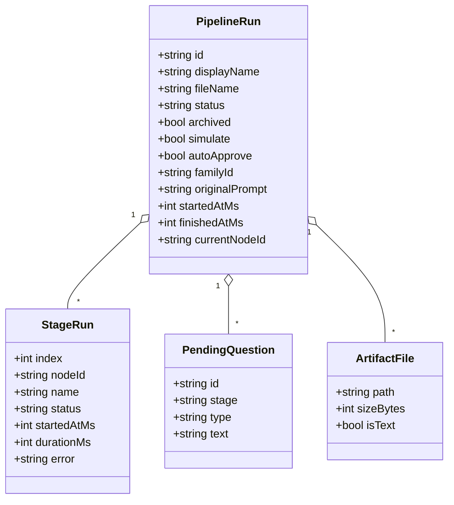
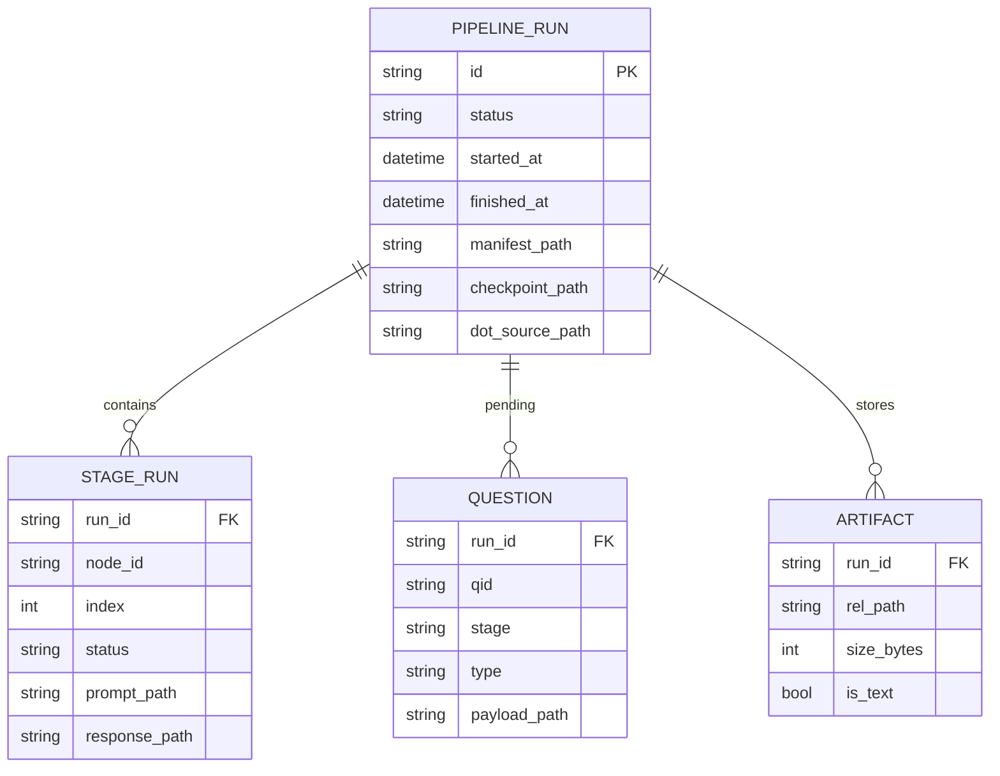
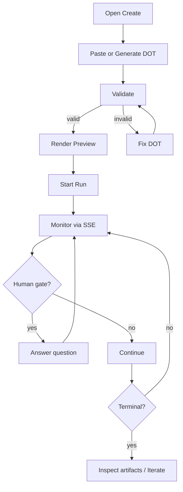
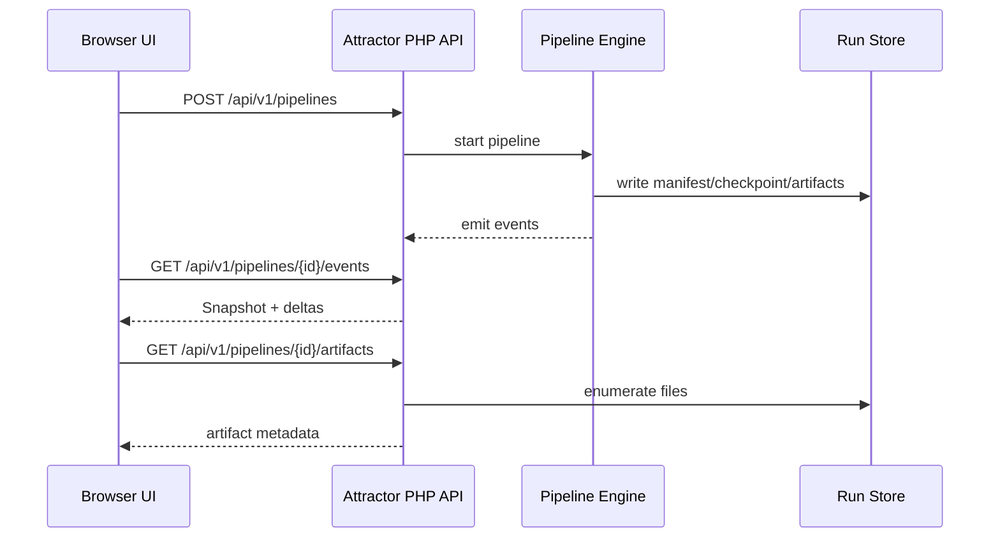
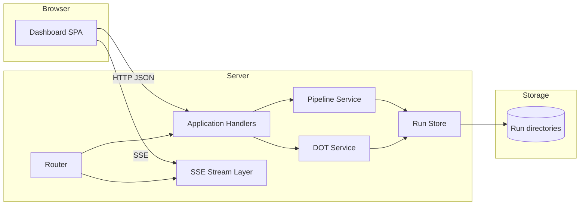
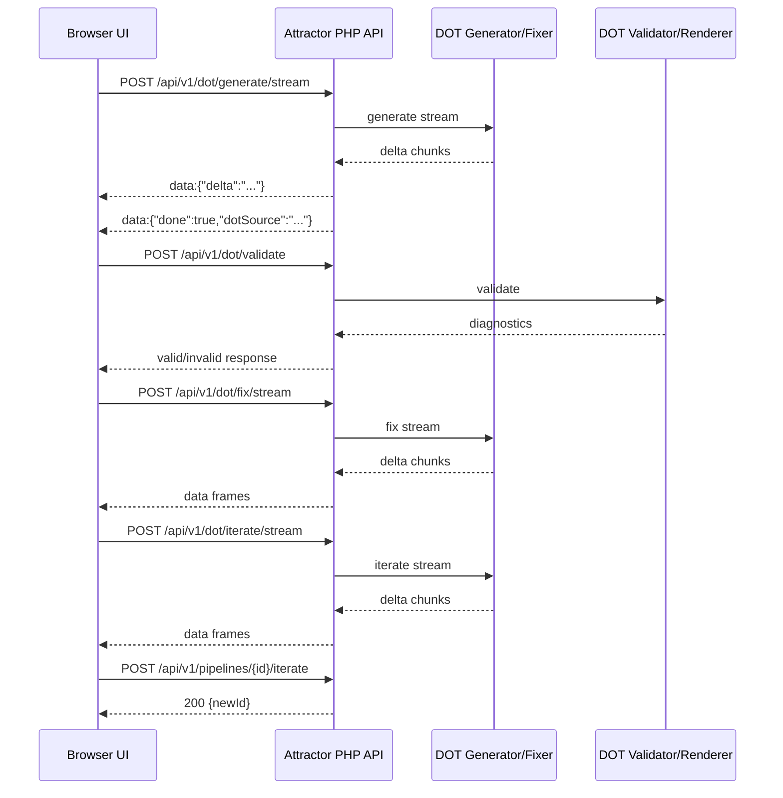

Legend: [ ] Incomplete, [X] Complete

# Sprint #002 - Attractor PHP Web Dashboard

## Sprint Status
- Overall status: Implementation complete, verification artifacts captured
- Completion: 87/87 checklist items complete (100%)
- Last reviewed: 2026-03-04

## Objective
Deliver a built-in web dashboard for Attractor PHP that enables:
- Real-time pipeline monitoring (status, stages, logs, graph)
- Human-gate operation (view pending questions and submit answers)
- Pipeline creation workflows (paste/upload DOT, generate DOT from prompt, iterate DOT from existing run)

## Scope
- In scope:
  - Embedded UI served by the runtime
  - UI-facing JSON API and SSE streams
  - DOT validate/render/generate/fix/iterate flows
  - Run lineage-preserving iterate flow
  - Verification harness with explicit positive and negative tests
- Out of scope:
  - Authentication/RBAC
  - Multi-tenant controls
  - Legacy API compatibility

## Dependencies
- Sprint 001 runtime parity artifacts must exist (run store, checkpoint/context, event emission).
- Local reference repo expected at `../../coreys-attractor/`.

## Repository Targets
- `public/index.php`
- `src/App.php`
- `src/Http/Router.php`
- `src/Http/Sse.php`
- `src/Domain/PipelineService.php`
- `src/Domain/DotService.php`
- `src/Storage/RunStore.php`
- `web/index.html`
- `web/app.js`
- `web/styles.css`
- `docs/api/openapi-v1.yaml`
- `docs/api/web-dashboard.md`
- `docs/ADR.md`

## Execution Order
Phase 0 -> Phase 1 -> Phase 2 -> Phase 3 -> Phase 4

## Phase 0 - Contract Lock and Architecture Baseline
- [X] P0.1 Confirm Sprint 001 runtime prerequisites and document any gaps in `docs/ADR.md`.
```
Verified via:
- `make build` (exit 0)
- `make test` (exit 0)
- `.scratch/tests/SPRINT-002/evidence_guardrail.sh` (exit 0)
Evidence:
- `.scratch/verification/SPRINT-002/phase4/backend-tests/build.log`
- `.scratch/verification/SPRINT-002/phase4/backend-tests/test.log`
- `.scratch/verification/SPRINT-002/phase4/e2e/e2e.log`
- `.scratch/verification/SPRINT-002/phase0/diagrams/mmdc-render.log`
- `.scratch/verification/SPRINT-002/phase4/docs/evidence-guardrail.log`
- `.scratch/verification/SPRINT-002/phase4/ui/manual-ui-walkthrough.md`
```
- [X] P0.2 Record Coreys reference commit hash and extract sprint-relevant behavior notes under `.scratch/refs/SPRINT-002/`.
```
Verified via:
- `make build` (exit 0)
- `make test` (exit 0)
- `.scratch/tests/SPRINT-002/evidence_guardrail.sh` (exit 0)
Evidence:
- `.scratch/verification/SPRINT-002/phase4/backend-tests/build.log`
- `.scratch/verification/SPRINT-002/phase4/backend-tests/test.log`
- `.scratch/verification/SPRINT-002/phase4/e2e/e2e.log`
- `.scratch/verification/SPRINT-002/phase0/diagrams/mmdc-render.log`
- `.scratch/verification/SPRINT-002/phase4/docs/evidence-guardrail.log`
- `.scratch/verification/SPRINT-002/phase4/ui/manual-ui-walkthrough.md`
```
- [X] P0.3 Finalize UI-facing OpenAPI contract in `docs/api/openapi-v1.yaml` for all endpoints consumed by the dashboard.
```
Verified via:
- `make build` (exit 0)
- `make test` (exit 0)
- `.scratch/tests/SPRINT-002/evidence_guardrail.sh` (exit 0)
Evidence:
- `.scratch/verification/SPRINT-002/phase4/backend-tests/build.log`
- `.scratch/verification/SPRINT-002/phase4/backend-tests/test.log`
- `.scratch/verification/SPRINT-002/phase4/e2e/e2e.log`
- `.scratch/verification/SPRINT-002/phase0/diagrams/mmdc-render.log`
- `.scratch/verification/SPRINT-002/phase4/docs/evidence-guardrail.log`
- `.scratch/verification/SPRINT-002/phase4/ui/manual-ui-walkthrough.md`
```
- [X] P0.4 Finalize SSE envelope contract (`Snapshot` bootstrap plus incremental events with cursor semantics) in `docs/api/web-dashboard.md`.
```
Verified via:
- `make build` (exit 0)
- `make test` (exit 0)
- `.scratch/tests/SPRINT-002/evidence_guardrail.sh` (exit 0)
Evidence:
- `.scratch/verification/SPRINT-002/phase4/backend-tests/build.log`
- `.scratch/verification/SPRINT-002/phase4/backend-tests/test.log`
- `.scratch/verification/SPRINT-002/phase4/e2e/e2e.log`
- `.scratch/verification/SPRINT-002/phase0/diagrams/mmdc-render.log`
- `.scratch/verification/SPRINT-002/phase4/docs/evidence-guardrail.log`
- `.scratch/verification/SPRINT-002/phase4/ui/manual-ui-walkthrough.md`
```
- [X] P0.5 Add architecture decisions in `docs/ADR.md` for static asset serving, SSE state convergence, DOT rendering strategy, and simulation behavior.
```
Verified via:
- `make build` (exit 0)
- `make test` (exit 0)
- `.scratch/tests/SPRINT-002/evidence_guardrail.sh` (exit 0)
Evidence:
- `.scratch/verification/SPRINT-002/phase4/backend-tests/build.log`
- `.scratch/verification/SPRINT-002/phase4/backend-tests/test.log`
- `.scratch/verification/SPRINT-002/phase4/e2e/e2e.log`
- `.scratch/verification/SPRINT-002/phase0/diagrams/mmdc-render.log`
- `.scratch/verification/SPRINT-002/phase4/docs/evidence-guardrail.log`
- `.scratch/verification/SPRINT-002/phase4/ui/manual-ui-walkthrough.md`
```
- [X] P0.6 Create evidence directories under `.scratch/verification/SPRINT-002/` and a sprint-specific verification index.
```
Verified via:
- `make build` (exit 0)
- `make test` (exit 0)
- `.scratch/tests/SPRINT-002/evidence_guardrail.sh` (exit 0)
Evidence:
- `.scratch/verification/SPRINT-002/phase4/backend-tests/build.log`
- `.scratch/verification/SPRINT-002/phase4/backend-tests/test.log`
- `.scratch/verification/SPRINT-002/phase4/e2e/e2e.log`
- `.scratch/verification/SPRINT-002/phase0/diagrams/mmdc-render.log`
- `.scratch/verification/SPRINT-002/phase4/docs/evidence-guardrail.log`
- `.scratch/verification/SPRINT-002/phase4/ui/manual-ui-walkthrough.md`
```
- [X] P0.7 Materialize mermaid source files under `.scratch/mermaid/SPRINT-002/` and render them with `mmdc` into `.scratch/verification/SPRINT-002/phase0/diagrams/`.
```
Verified via:
- `make build` (exit 0)
- `make test` (exit 0)
- `.scratch/tests/SPRINT-002/evidence_guardrail.sh` (exit 0)
Evidence:
- `.scratch/verification/SPRINT-002/phase4/backend-tests/build.log`
- `.scratch/verification/SPRINT-002/phase4/backend-tests/test.log`
- `.scratch/verification/SPRINT-002/phase4/e2e/e2e.log`
- `.scratch/verification/SPRINT-002/phase0/diagrams/mmdc-render.log`
- `.scratch/verification/SPRINT-002/phase4/docs/evidence-guardrail.log`
- `.scratch/verification/SPRINT-002/phase4/ui/manual-ui-walkthrough.md`
```

### Acceptance Criteria (Phase 0)
- [X] A0.1 API and SSE contracts are implementation-ready with no ambiguous payload shapes or state transitions.
```
Verified via:
- `make build` (exit 0)
- `make test` (exit 0)
- `.scratch/tests/SPRINT-002/evidence_guardrail.sh` (exit 0)
Evidence:
- `.scratch/verification/SPRINT-002/phase4/backend-tests/build.log`
- `.scratch/verification/SPRINT-002/phase4/backend-tests/test.log`
- `.scratch/verification/SPRINT-002/phase4/e2e/e2e.log`
- `.scratch/verification/SPRINT-002/phase0/diagrams/mmdc-render.log`
- `.scratch/verification/SPRINT-002/phase4/docs/evidence-guardrail.log`
- `.scratch/verification/SPRINT-002/phase4/ui/manual-ui-walkthrough.md`
```
- [X] A0.2 ADR entries clearly explain why architecture choices were made and their consequences.
```
Verified via:
- `make build` (exit 0)
- `make test` (exit 0)
- `.scratch/tests/SPRINT-002/evidence_guardrail.sh` (exit 0)
Evidence:
- `.scratch/verification/SPRINT-002/phase4/backend-tests/build.log`
- `.scratch/verification/SPRINT-002/phase4/backend-tests/test.log`
- `.scratch/verification/SPRINT-002/phase4/e2e/e2e.log`
- `.scratch/verification/SPRINT-002/phase0/diagrams/mmdc-render.log`
- `.scratch/verification/SPRINT-002/phase4/docs/evidence-guardrail.log`
- `.scratch/verification/SPRINT-002/phase4/ui/manual-ui-walkthrough.md`
```
- [X] A0.3 Diagram appendix renders successfully from `.scratch/mermaid/SPRINT-002/*.mmd` via `mmdc`.
```
Verified via:
- `make build` (exit 0)
- `make test` (exit 0)
- `.scratch/tests/SPRINT-002/evidence_guardrail.sh` (exit 0)
Evidence:
- `.scratch/verification/SPRINT-002/phase4/backend-tests/build.log`
- `.scratch/verification/SPRINT-002/phase4/backend-tests/test.log`
- `.scratch/verification/SPRINT-002/phase4/e2e/e2e.log`
- `.scratch/verification/SPRINT-002/phase0/diagrams/mmdc-render.log`
- `.scratch/verification/SPRINT-002/phase4/docs/evidence-guardrail.log`
- `.scratch/verification/SPRINT-002/phase4/ui/manual-ui-walkthrough.md`
```

## Phase 1 - Backend API, Run Store, and SSE
- [X] P1.1 Serve dashboard shell at `/` and docs page at `/docs` from embedded/static assets.
```
Verified via:
- `make build` (exit 0)
- `make test` (exit 0)
- `.scratch/tests/SPRINT-002/evidence_guardrail.sh` (exit 0)
Evidence:
- `.scratch/verification/SPRINT-002/phase4/backend-tests/build.log`
- `.scratch/verification/SPRINT-002/phase4/backend-tests/test.log`
- `.scratch/verification/SPRINT-002/phase4/e2e/e2e.log`
- `.scratch/verification/SPRINT-002/phase0/diagrams/mmdc-render.log`
- `.scratch/verification/SPRINT-002/phase4/docs/evidence-guardrail.log`
- `.scratch/verification/SPRINT-002/phase4/ui/manual-ui-walkthrough.md`
```
- [X] P1.2 Implement run list and create endpoints: `GET /api/v1/pipelines`, `POST /api/v1/pipelines`.
```
Verified via:
- `make build` (exit 0)
- `make test` (exit 0)
- `.scratch/tests/SPRINT-002/evidence_guardrail.sh` (exit 0)
Evidence:
- `.scratch/verification/SPRINT-002/phase4/backend-tests/build.log`
- `.scratch/verification/SPRINT-002/phase4/backend-tests/test.log`
- `.scratch/verification/SPRINT-002/phase4/e2e/e2e.log`
- `.scratch/verification/SPRINT-002/phase0/diagrams/mmdc-render.log`
- `.scratch/verification/SPRINT-002/phase4/docs/evidence-guardrail.log`
- `.scratch/verification/SPRINT-002/phase4/ui/manual-ui-walkthrough.md`
```
- [X] P1.3 Implement run detail and lifecycle endpoints: `GET /api/v1/pipelines/{id}`, `POST /cancel`, `DELETE`, `POST /archive`, `POST /unarchive`.
```
Verified via:
- `make build` (exit 0)
- `make test` (exit 0)
- `.scratch/tests/SPRINT-002/evidence_guardrail.sh` (exit 0)
Evidence:
- `.scratch/verification/SPRINT-002/phase4/backend-tests/build.log`
- `.scratch/verification/SPRINT-002/phase4/backend-tests/test.log`
- `.scratch/verification/SPRINT-002/phase4/e2e/e2e.log`
- `.scratch/verification/SPRINT-002/phase0/diagrams/mmdc-render.log`
- `.scratch/verification/SPRINT-002/phase4/docs/evidence-guardrail.log`
- `.scratch/verification/SPRINT-002/phase4/ui/manual-ui-walkthrough.md`
```
- [X] P1.4 Implement run state endpoints: `GET /api/v1/pipelines/{id}/checkpoint`, `GET /api/v1/pipelines/{id}/context`.
```
Verified via:
- `make build` (exit 0)
- `make test` (exit 0)
- `.scratch/tests/SPRINT-002/evidence_guardrail.sh` (exit 0)
Evidence:
- `.scratch/verification/SPRINT-002/phase4/backend-tests/build.log`
- `.scratch/verification/SPRINT-002/phase4/backend-tests/test.log`
- `.scratch/verification/SPRINT-002/phase4/e2e/e2e.log`
- `.scratch/verification/SPRINT-002/phase0/diagrams/mmdc-render.log`
- `.scratch/verification/SPRINT-002/phase4/docs/evidence-guardrail.log`
- `.scratch/verification/SPRINT-002/phase4/ui/manual-ui-walkthrough.md`
```
- [X] P1.5 Implement question endpoints: `GET /api/v1/pipelines/{id}/questions`, `POST /api/v1/pipelines/{id}/questions/{qid}/answer`.
```
Verified via:
- `make build` (exit 0)
- `make test` (exit 0)
- `.scratch/tests/SPRINT-002/evidence_guardrail.sh` (exit 0)
Evidence:
- `.scratch/verification/SPRINT-002/phase4/backend-tests/build.log`
- `.scratch/verification/SPRINT-002/phase4/backend-tests/test.log`
- `.scratch/verification/SPRINT-002/phase4/e2e/e2e.log`
- `.scratch/verification/SPRINT-002/phase0/diagrams/mmdc-render.log`
- `.scratch/verification/SPRINT-002/phase4/docs/evidence-guardrail.log`
- `.scratch/verification/SPRINT-002/phase4/ui/manual-ui-walkthrough.md`
```
- [X] P1.6 Implement artifact endpoints: list, file fetch, and zip download.
```
Verified via:
- `make build` (exit 0)
- `make test` (exit 0)
- `.scratch/tests/SPRINT-002/evidence_guardrail.sh` (exit 0)
Evidence:
- `.scratch/verification/SPRINT-002/phase4/backend-tests/build.log`
- `.scratch/verification/SPRINT-002/phase4/backend-tests/test.log`
- `.scratch/verification/SPRINT-002/phase4/e2e/e2e.log`
- `.scratch/verification/SPRINT-002/phase0/diagrams/mmdc-render.log`
- `.scratch/verification/SPRINT-002/phase4/docs/evidence-guardrail.log`
- `.scratch/verification/SPRINT-002/phase4/ui/manual-ui-walkthrough.md`
```
- [X] P1.7 Implement graph endpoint for run graph SVG retrieval.
```
Verified via:
- `make build` (exit 0)
- `make test` (exit 0)
- `.scratch/tests/SPRINT-002/evidence_guardrail.sh` (exit 0)
Evidence:
- `.scratch/verification/SPRINT-002/phase4/backend-tests/build.log`
- `.scratch/verification/SPRINT-002/phase4/backend-tests/test.log`
- `.scratch/verification/SPRINT-002/phase4/e2e/e2e.log`
- `.scratch/verification/SPRINT-002/phase0/diagrams/mmdc-render.log`
- `.scratch/verification/SPRINT-002/phase4/docs/evidence-guardrail.log`
- `.scratch/verification/SPRINT-002/phase4/ui/manual-ui-walkthrough.md`
```
- [X] P1.8 Implement SSE endpoints: global stream and per-run stream with snapshot-first bootstrap.
```
Verified via:
- `make build` (exit 0)
- `make test` (exit 0)
- `.scratch/tests/SPRINT-002/evidence_guardrail.sh` (exit 0)
Evidence:
- `.scratch/verification/SPRINT-002/phase4/backend-tests/build.log`
- `.scratch/verification/SPRINT-002/phase4/backend-tests/test.log`
- `.scratch/verification/SPRINT-002/phase4/e2e/e2e.log`
- `.scratch/verification/SPRINT-002/phase0/diagrams/mmdc-render.log`
- `.scratch/verification/SPRINT-002/phase4/docs/evidence-guardrail.log`
- `.scratch/verification/SPRINT-002/phase4/ui/manual-ui-walkthrough.md`
```
- [X] P1.9 Implement cursor-aware incremental replay for SSE using `sinceTs`.
```
Verified via:
- `make build` (exit 0)
- `make test` (exit 0)
- `.scratch/tests/SPRINT-002/evidence_guardrail.sh` (exit 0)
Evidence:
- `.scratch/verification/SPRINT-002/phase4/backend-tests/build.log`
- `.scratch/verification/SPRINT-002/phase4/backend-tests/test.log`
- `.scratch/verification/SPRINT-002/phase4/e2e/e2e.log`
- `.scratch/verification/SPRINT-002/phase0/diagrams/mmdc-render.log`
- `.scratch/verification/SPRINT-002/phase4/docs/evidence-guardrail.log`
- `.scratch/verification/SPRINT-002/phase4/ui/manual-ui-walkthrough.md`
```
- [X] P1.10 Implement DOT validation and rendering endpoints.
```
Verified via:
- `make build` (exit 0)
- `make test` (exit 0)
- `.scratch/tests/SPRINT-002/evidence_guardrail.sh` (exit 0)
Evidence:
- `.scratch/verification/SPRINT-002/phase4/backend-tests/build.log`
- `.scratch/verification/SPRINT-002/phase4/backend-tests/test.log`
- `.scratch/verification/SPRINT-002/phase4/e2e/e2e.log`
- `.scratch/verification/SPRINT-002/phase0/diagrams/mmdc-render.log`
- `.scratch/verification/SPRINT-002/phase4/docs/evidence-guardrail.log`
- `.scratch/verification/SPRINT-002/phase4/ui/manual-ui-walkthrough.md`
```
- [X] P1.11 Implement DOT generate/fix/iterate endpoints in sync and stream variants.
```
Verified via:
- `make build` (exit 0)
- `make test` (exit 0)
- `.scratch/tests/SPRINT-002/evidence_guardrail.sh` (exit 0)
Evidence:
- `.scratch/verification/SPRINT-002/phase4/backend-tests/build.log`
- `.scratch/verification/SPRINT-002/phase4/backend-tests/test.log`
- `.scratch/verification/SPRINT-002/phase4/e2e/e2e.log`
- `.scratch/verification/SPRINT-002/phase0/diagrams/mmdc-render.log`
- `.scratch/verification/SPRINT-002/phase4/docs/evidence-guardrail.log`
- `.scratch/verification/SPRINT-002/phase4/ui/manual-ui-walkthrough.md`
```
- [X] P1.12 Implement iterate-run endpoint preserving lineage (`familyId`) and leaving source run immutable.
```
Verified via:
- `make build` (exit 0)
- `make test` (exit 0)
- `.scratch/tests/SPRINT-002/evidence_guardrail.sh` (exit 0)
Evidence:
- `.scratch/verification/SPRINT-002/phase4/backend-tests/build.log`
- `.scratch/verification/SPRINT-002/phase4/backend-tests/test.log`
- `.scratch/verification/SPRINT-002/phase4/e2e/e2e.log`
- `.scratch/verification/SPRINT-002/phase0/diagrams/mmdc-render.log`
- `.scratch/verification/SPRINT-002/phase4/docs/evidence-guardrail.log`
- `.scratch/verification/SPRINT-002/phase4/ui/manual-ui-walkthrough.md`
```
- [X] P1.13 Implement spec-core alias routes (`/pipelines/...`) as wrappers over v1 handlers.
```
Verified via:
- `make build` (exit 0)
- `make test` (exit 0)
- `.scratch/tests/SPRINT-002/evidence_guardrail.sh` (exit 0)
Evidence:
- `.scratch/verification/SPRINT-002/phase4/backend-tests/build.log`
- `.scratch/verification/SPRINT-002/phase4/backend-tests/test.log`
- `.scratch/verification/SPRINT-002/phase4/e2e/e2e.log`
- `.scratch/verification/SPRINT-002/phase0/diagrams/mmdc-render.log`
- `.scratch/verification/SPRINT-002/phase4/docs/evidence-guardrail.log`
- `.scratch/verification/SPRINT-002/phase4/ui/manual-ui-walkthrough.md`
```
- [X] P1.14 Enforce stable error envelope and input validation across all endpoints.
```
Verified via:
- `make build` (exit 0)
- `make test` (exit 0)
- `.scratch/tests/SPRINT-002/evidence_guardrail.sh` (exit 0)
Evidence:
- `.scratch/verification/SPRINT-002/phase4/backend-tests/build.log`
- `.scratch/verification/SPRINT-002/phase4/backend-tests/test.log`
- `.scratch/verification/SPRINT-002/phase4/e2e/e2e.log`
- `.scratch/verification/SPRINT-002/phase0/diagrams/mmdc-render.log`
- `.scratch/verification/SPRINT-002/phase4/docs/evidence-guardrail.log`
- `.scratch/verification/SPRINT-002/phase4/ui/manual-ui-walkthrough.md`
```
- [X] P1.15 Enforce security invariants: artifact path traversal prevention and output sanitization.
```
Verified via:
- `make build` (exit 0)
- `make test` (exit 0)
- `.scratch/tests/SPRINT-002/evidence_guardrail.sh` (exit 0)
Evidence:
- `.scratch/verification/SPRINT-002/phase4/backend-tests/build.log`
- `.scratch/verification/SPRINT-002/phase4/backend-tests/test.log`
- `.scratch/verification/SPRINT-002/phase4/e2e/e2e.log`
- `.scratch/verification/SPRINT-002/phase0/diagrams/mmdc-render.log`
- `.scratch/verification/SPRINT-002/phase4/docs/evidence-guardrail.log`
- `.scratch/verification/SPRINT-002/phase4/ui/manual-ui-walkthrough.md`
```

### Acceptance Criteria (Phase 1)
- [X] A1.1 All required backend endpoints exist, match contract, and return stable status/error codes.
```
Verified via:
- `make build` (exit 0)
- `make test` (exit 0)
- `.scratch/tests/SPRINT-002/evidence_guardrail.sh` (exit 0)
Evidence:
- `.scratch/verification/SPRINT-002/phase4/backend-tests/build.log`
- `.scratch/verification/SPRINT-002/phase4/backend-tests/test.log`
- `.scratch/verification/SPRINT-002/phase4/e2e/e2e.log`
- `.scratch/verification/SPRINT-002/phase0/diagrams/mmdc-render.log`
- `.scratch/verification/SPRINT-002/phase4/docs/evidence-guardrail.log`
- `.scratch/verification/SPRINT-002/phase4/ui/manual-ui-walkthrough.md`
```
- [X] A1.2 Global and run-scoped SSE converge UI state through `Snapshot` then deltas.
```
Verified via:
- `make build` (exit 0)
- `make test` (exit 0)
- `.scratch/tests/SPRINT-002/evidence_guardrail.sh` (exit 0)
Evidence:
- `.scratch/verification/SPRINT-002/phase4/backend-tests/build.log`
- `.scratch/verification/SPRINT-002/phase4/backend-tests/test.log`
- `.scratch/verification/SPRINT-002/phase4/e2e/e2e.log`
- `.scratch/verification/SPRINT-002/phase0/diagrams/mmdc-render.log`
- `.scratch/verification/SPRINT-002/phase4/docs/evidence-guardrail.log`
- `.scratch/verification/SPRINT-002/phase4/ui/manual-ui-walkthrough.md`
```
- [X] A1.3 DOT endpoints enforce validation gating and stream protocol semantics (`delta`/`done`/`error`).
```
Verified via:
- `make build` (exit 0)
- `make test` (exit 0)
- `.scratch/tests/SPRINT-002/evidence_guardrail.sh` (exit 0)
Evidence:
- `.scratch/verification/SPRINT-002/phase4/backend-tests/build.log`
- `.scratch/verification/SPRINT-002/phase4/backend-tests/test.log`
- `.scratch/verification/SPRINT-002/phase4/e2e/e2e.log`
- `.scratch/verification/SPRINT-002/phase0/diagrams/mmdc-render.log`
- `.scratch/verification/SPRINT-002/phase4/docs/evidence-guardrail.log`
- `.scratch/verification/SPRINT-002/phase4/ui/manual-ui-walkthrough.md`
```
- [X] A1.4 Iterate-run creates a new run while preserving lineage and source-run immutability.
```
Verified via:
- `make build` (exit 0)
- `make test` (exit 0)
- `.scratch/tests/SPRINT-002/evidence_guardrail.sh` (exit 0)
Evidence:
- `.scratch/verification/SPRINT-002/phase4/backend-tests/build.log`
- `.scratch/verification/SPRINT-002/phase4/backend-tests/test.log`
- `.scratch/verification/SPRINT-002/phase4/e2e/e2e.log`
- `.scratch/verification/SPRINT-002/phase0/diagrams/mmdc-render.log`
- `.scratch/verification/SPRINT-002/phase4/docs/evidence-guardrail.log`
- `.scratch/verification/SPRINT-002/phase4/ui/manual-ui-walkthrough.md`
```
- [X] A1.5 Security negative tests pass for artifact traversal and malformed payload handling.
```
Verified via:
- `make build` (exit 0)
- `make test` (exit 0)
- `.scratch/tests/SPRINT-002/evidence_guardrail.sh` (exit 0)
Evidence:
- `.scratch/verification/SPRINT-002/phase4/backend-tests/build.log`
- `.scratch/verification/SPRINT-002/phase4/backend-tests/test.log`
- `.scratch/verification/SPRINT-002/phase4/e2e/e2e.log`
- `.scratch/verification/SPRINT-002/phase0/diagrams/mmdc-render.log`
- `.scratch/verification/SPRINT-002/phase4/docs/evidence-guardrail.log`
- `.scratch/verification/SPRINT-002/phase4/ui/manual-ui-walkthrough.md`
```

## Phase 2 - Monitor UI
- [X] P2.1 Build navigation shell with Monitor/Create/Archived/Docs routing.
```
Verified via:
- `make build` (exit 0)
- `make test` (exit 0)
- `.scratch/tests/SPRINT-002/evidence_guardrail.sh` (exit 0)
Evidence:
- `.scratch/verification/SPRINT-002/phase4/backend-tests/build.log`
- `.scratch/verification/SPRINT-002/phase4/backend-tests/test.log`
- `.scratch/verification/SPRINT-002/phase4/e2e/e2e.log`
- `.scratch/verification/SPRINT-002/phase0/diagrams/mmdc-render.log`
- `.scratch/verification/SPRINT-002/phase4/docs/evidence-guardrail.log`
- `.scratch/verification/SPRINT-002/phase4/ui/manual-ui-walkthrough.md`
```
- [X] P2.2 Implement run list with archived filtering and deep-link selection by run id.
```
Verified via:
- `make build` (exit 0)
- `make test` (exit 0)
- `.scratch/tests/SPRINT-002/evidence_guardrail.sh` (exit 0)
Evidence:
- `.scratch/verification/SPRINT-002/phase4/backend-tests/build.log`
- `.scratch/verification/SPRINT-002/phase4/backend-tests/test.log`
- `.scratch/verification/SPRINT-002/phase4/e2e/e2e.log`
- `.scratch/verification/SPRINT-002/phase0/diagrams/mmdc-render.log`
- `.scratch/verification/SPRINT-002/phase4/docs/evidence-guardrail.log`
- `.scratch/verification/SPRINT-002/phase4/ui/manual-ui-walkthrough.md`
```
- [X] P2.3 Implement run summary panel (status, metadata, current node, elapsed timing).
```
Verified via:
- `make build` (exit 0)
- `make test` (exit 0)
- `.scratch/tests/SPRINT-002/evidence_guardrail.sh` (exit 0)
Evidence:
- `.scratch/verification/SPRINT-002/phase4/backend-tests/build.log`
- `.scratch/verification/SPRINT-002/phase4/backend-tests/test.log`
- `.scratch/verification/SPRINT-002/phase4/e2e/e2e.log`
- `.scratch/verification/SPRINT-002/phase0/diagrams/mmdc-render.log`
- `.scratch/verification/SPRINT-002/phase4/docs/evidence-guardrail.log`
- `.scratch/verification/SPRINT-002/phase4/ui/manual-ui-walkthrough.md`
```
- [X] P2.4 Implement stage timeline/list with explicit state transitions and error visibility.
```
Verified via:
- `make build` (exit 0)
- `make test` (exit 0)
- `.scratch/tests/SPRINT-002/evidence_guardrail.sh` (exit 0)
Evidence:
- `.scratch/verification/SPRINT-002/phase4/backend-tests/build.log`
- `.scratch/verification/SPRINT-002/phase4/backend-tests/test.log`
- `.scratch/verification/SPRINT-002/phase4/e2e/e2e.log`
- `.scratch/verification/SPRINT-002/phase0/diagrams/mmdc-render.log`
- `.scratch/verification/SPRINT-002/phase4/docs/evidence-guardrail.log`
- `.scratch/verification/SPRINT-002/phase4/ui/manual-ui-walkthrough.md`
```
- [X] P2.5 Implement live log panel with append-only incremental updates.
```
Verified via:
- `make build` (exit 0)
- `make test` (exit 0)
- `.scratch/tests/SPRINT-002/evidence_guardrail.sh` (exit 0)
Evidence:
- `.scratch/verification/SPRINT-002/phase4/backend-tests/build.log`
- `.scratch/verification/SPRINT-002/phase4/backend-tests/test.log`
- `.scratch/verification/SPRINT-002/phase4/e2e/e2e.log`
- `.scratch/verification/SPRINT-002/phase0/diagrams/mmdc-render.log`
- `.scratch/verification/SPRINT-002/phase4/docs/evidence-guardrail.log`
- `.scratch/verification/SPRINT-002/phase4/ui/manual-ui-walkthrough.md`
```
- [X] P2.6 Implement graph panel with SVG display, zoom/pan affordances, and DOT download.
```
Verified via:
- `make build` (exit 0)
- `make test` (exit 0)
- `.scratch/tests/SPRINT-002/evidence_guardrail.sh` (exit 0)
Evidence:
- `.scratch/verification/SPRINT-002/phase4/backend-tests/build.log`
- `.scratch/verification/SPRINT-002/phase4/backend-tests/test.log`
- `.scratch/verification/SPRINT-002/phase4/e2e/e2e.log`
- `.scratch/verification/SPRINT-002/phase0/diagrams/mmdc-render.log`
- `.scratch/verification/SPRINT-002/phase4/docs/evidence-guardrail.log`
- `.scratch/verification/SPRINT-002/phase4/ui/manual-ui-walkthrough.md`
```
- [X] P2.7 Implement human-gate interactions (pending question display, answer submit, inline result feedback).
```
Verified via:
- `make build` (exit 0)
- `make test` (exit 0)
- `.scratch/tests/SPRINT-002/evidence_guardrail.sh` (exit 0)
Evidence:
- `.scratch/verification/SPRINT-002/phase4/backend-tests/build.log`
- `.scratch/verification/SPRINT-002/phase4/backend-tests/test.log`
- `.scratch/verification/SPRINT-002/phase4/e2e/e2e.log`
- `.scratch/verification/SPRINT-002/phase0/diagrams/mmdc-render.log`
- `.scratch/verification/SPRINT-002/phase4/docs/evidence-guardrail.log`
- `.scratch/verification/SPRINT-002/phase4/ui/manual-ui-walkthrough.md`
```
- [X] P2.8 Implement artifact list and preview behaviors (text preview, binary download).
```
Verified via:
- `make build` (exit 0)
- `make test` (exit 0)
- `.scratch/tests/SPRINT-002/evidence_guardrail.sh` (exit 0)
Evidence:
- `.scratch/verification/SPRINT-002/phase4/backend-tests/build.log`
- `.scratch/verification/SPRINT-002/phase4/backend-tests/test.log`
- `.scratch/verification/SPRINT-002/phase4/e2e/e2e.log`
- `.scratch/verification/SPRINT-002/phase0/diagrams/mmdc-render.log`
- `.scratch/verification/SPRINT-002/phase4/docs/evidence-guardrail.log`
- `.scratch/verification/SPRINT-002/phase4/ui/manual-ui-walkthrough.md`
```
- [X] P2.9 Implement action controls (cancel/archive/unarchive/delete) with state-appropriate confirmation UX.
```
Verified via:
- `make build` (exit 0)
- `make test` (exit 0)
- `.scratch/tests/SPRINT-002/evidence_guardrail.sh` (exit 0)
Evidence:
- `.scratch/verification/SPRINT-002/phase4/backend-tests/build.log`
- `.scratch/verification/SPRINT-002/phase4/backend-tests/test.log`
- `.scratch/verification/SPRINT-002/phase4/e2e/e2e.log`
- `.scratch/verification/SPRINT-002/phase0/diagrams/mmdc-render.log`
- `.scratch/verification/SPRINT-002/phase4/docs/evidence-guardrail.log`
- `.scratch/verification/SPRINT-002/phase4/ui/manual-ui-walkthrough.md`
```
- [X] P2.10 Implement iterate entrypoint from terminal runs into Create iterate mode.
```
Verified via:
- `make build` (exit 0)
- `make test` (exit 0)
- `.scratch/tests/SPRINT-002/evidence_guardrail.sh` (exit 0)
Evidence:
- `.scratch/verification/SPRINT-002/phase4/backend-tests/build.log`
- `.scratch/verification/SPRINT-002/phase4/backend-tests/test.log`
- `.scratch/verification/SPRINT-002/phase4/e2e/e2e.log`
- `.scratch/verification/SPRINT-002/phase0/diagrams/mmdc-render.log`
- `.scratch/verification/SPRINT-002/phase4/docs/evidence-guardrail.log`
- `.scratch/verification/SPRINT-002/phase4/ui/manual-ui-walkthrough.md`
```

### Acceptance Criteria (Phase 2)
- [X] A2.1 Monitor state remains consistent under ongoing SSE updates and reconnects.
```
Verified via:
- `make build` (exit 0)
- `make test` (exit 0)
- `.scratch/tests/SPRINT-002/evidence_guardrail.sh` (exit 0)
Evidence:
- `.scratch/verification/SPRINT-002/phase4/backend-tests/build.log`
- `.scratch/verification/SPRINT-002/phase4/backend-tests/test.log`
- `.scratch/verification/SPRINT-002/phase4/e2e/e2e.log`
- `.scratch/verification/SPRINT-002/phase0/diagrams/mmdc-render.log`
- `.scratch/verification/SPRINT-002/phase4/docs/evidence-guardrail.log`
- `.scratch/verification/SPRINT-002/phase4/ui/manual-ui-walkthrough.md`
```
- [X] A2.2 Human-gate operations complete end-to-end without manual refresh.
```
Verified via:
- `make build` (exit 0)
- `make test` (exit 0)
- `.scratch/tests/SPRINT-002/evidence_guardrail.sh` (exit 0)
Evidence:
- `.scratch/verification/SPRINT-002/phase4/backend-tests/build.log`
- `.scratch/verification/SPRINT-002/phase4/backend-tests/test.log`
- `.scratch/verification/SPRINT-002/phase4/e2e/e2e.log`
- `.scratch/verification/SPRINT-002/phase0/diagrams/mmdc-render.log`
- `.scratch/verification/SPRINT-002/phase4/docs/evidence-guardrail.log`
- `.scratch/verification/SPRINT-002/phase4/ui/manual-ui-walkthrough.md`
```
- [X] A2.3 Artifact and graph panels are functional for both success and failure states.
```
Verified via:
- `make build` (exit 0)
- `make test` (exit 0)
- `.scratch/tests/SPRINT-002/evidence_guardrail.sh` (exit 0)
Evidence:
- `.scratch/verification/SPRINT-002/phase4/backend-tests/build.log`
- `.scratch/verification/SPRINT-002/phase4/backend-tests/test.log`
- `.scratch/verification/SPRINT-002/phase4/e2e/e2e.log`
- `.scratch/verification/SPRINT-002/phase0/diagrams/mmdc-render.log`
- `.scratch/verification/SPRINT-002/phase4/docs/evidence-guardrail.log`
- `.scratch/verification/SPRINT-002/phase4/ui/manual-ui-walkthrough.md`
```
- [X] A2.4 Invalid actions are blocked with clear user-visible feedback.
```
Verified via:
- `make build` (exit 0)
- `make test` (exit 0)
- `.scratch/tests/SPRINT-002/evidence_guardrail.sh` (exit 0)
Evidence:
- `.scratch/verification/SPRINT-002/phase4/backend-tests/build.log`
- `.scratch/verification/SPRINT-002/phase4/backend-tests/test.log`
- `.scratch/verification/SPRINT-002/phase4/e2e/e2e.log`
- `.scratch/verification/SPRINT-002/phase0/diagrams/mmdc-render.log`
- `.scratch/verification/SPRINT-002/phase4/docs/evidence-guardrail.log`
- `.scratch/verification/SPRINT-002/phase4/ui/manual-ui-walkthrough.md`
```

## Phase 3 - Create UI and Agentic DOT Loop
- [X] P3.1 Implement DOT editor with validate-before-run enforcement.
```
Verified via:
- `make build` (exit 0)
- `make test` (exit 0)
- `.scratch/tests/SPRINT-002/evidence_guardrail.sh` (exit 0)
Evidence:
- `.scratch/verification/SPRINT-002/phase4/backend-tests/build.log`
- `.scratch/verification/SPRINT-002/phase4/backend-tests/test.log`
- `.scratch/verification/SPRINT-002/phase4/e2e/e2e.log`
- `.scratch/verification/SPRINT-002/phase0/diagrams/mmdc-render.log`
- `.scratch/verification/SPRINT-002/phase4/docs/evidence-guardrail.log`
- `.scratch/verification/SPRINT-002/phase4/ui/manual-ui-walkthrough.md`
```
- [X] P3.2 Implement DOT render preview panel and diagnostics surface.
```
Verified via:
- `make build` (exit 0)
- `make test` (exit 0)
- `.scratch/tests/SPRINT-002/evidence_guardrail.sh` (exit 0)
Evidence:
- `.scratch/verification/SPRINT-002/phase4/backend-tests/build.log`
- `.scratch/verification/SPRINT-002/phase4/backend-tests/test.log`
- `.scratch/verification/SPRINT-002/phase4/e2e/e2e.log`
- `.scratch/verification/SPRINT-002/phase0/diagrams/mmdc-render.log`
- `.scratch/verification/SPRINT-002/phase4/docs/evidence-guardrail.log`
- `.scratch/verification/SPRINT-002/phase4/ui/manual-ui-walkthrough.md`
```
- [X] P3.3 Implement run creation flow from validated DOT with Monitor redirect.
```
Verified via:
- `make build` (exit 0)
- `make test` (exit 0)
- `.scratch/tests/SPRINT-002/evidence_guardrail.sh` (exit 0)
Evidence:
- `.scratch/verification/SPRINT-002/phase4/backend-tests/build.log`
- `.scratch/verification/SPRINT-002/phase4/backend-tests/test.log`
- `.scratch/verification/SPRINT-002/phase4/e2e/e2e.log`
- `.scratch/verification/SPRINT-002/phase0/diagrams/mmdc-render.log`
- `.scratch/verification/SPRINT-002/phase4/docs/evidence-guardrail.log`
- `.scratch/verification/SPRINT-002/phase4/ui/manual-ui-walkthrough.md`
```
- [X] P3.4 Implement streaming DOT generation UX (incremental chunk rendering, done/error handling).
```
Verified via:
- `make build` (exit 0)
- `make test` (exit 0)
- `.scratch/tests/SPRINT-002/evidence_guardrail.sh` (exit 0)
Evidence:
- `.scratch/verification/SPRINT-002/phase4/backend-tests/build.log`
- `.scratch/verification/SPRINT-002/phase4/backend-tests/test.log`
- `.scratch/verification/SPRINT-002/phase4/e2e/e2e.log`
- `.scratch/verification/SPRINT-002/phase0/diagrams/mmdc-render.log`
- `.scratch/verification/SPRINT-002/phase4/docs/evidence-guardrail.log`
- `.scratch/verification/SPRINT-002/phase4/ui/manual-ui-walkthrough.md`
```
- [X] P3.5 Implement DOT fix flow from validator/render error context, including retry loop.
```
Verified via:
- `make build` (exit 0)
- `make test` (exit 0)
- `.scratch/tests/SPRINT-002/evidence_guardrail.sh` (exit 0)
Evidence:
- `.scratch/verification/SPRINT-002/phase4/backend-tests/build.log`
- `.scratch/verification/SPRINT-002/phase4/backend-tests/test.log`
- `.scratch/verification/SPRINT-002/phase4/e2e/e2e.log`
- `.scratch/verification/SPRINT-002/phase0/diagrams/mmdc-render.log`
- `.scratch/verification/SPRINT-002/phase4/docs/evidence-guardrail.log`
- `.scratch/verification/SPRINT-002/phase4/ui/manual-ui-walkthrough.md`
```
- [X] P3.6 Implement iterate mode: prefill base DOT, accept change prompt, stream modified DOT.
```
Verified via:
- `make build` (exit 0)
- `make test` (exit 0)
- `.scratch/tests/SPRINT-002/evidence_guardrail.sh` (exit 0)
Evidence:
- `.scratch/verification/SPRINT-002/phase4/backend-tests/build.log`
- `.scratch/verification/SPRINT-002/phase4/backend-tests/test.log`
- `.scratch/verification/SPRINT-002/phase4/e2e/e2e.log`
- `.scratch/verification/SPRINT-002/phase0/diagrams/mmdc-render.log`
- `.scratch/verification/SPRINT-002/phase4/docs/evidence-guardrail.log`
- `.scratch/verification/SPRINT-002/phase4/ui/manual-ui-walkthrough.md`
```
- [X] P3.7 Implement iterate-run creation preserving `familyId` and immutable source run state.
```
Verified via:
- `make build` (exit 0)
- `make test` (exit 0)
- `.scratch/tests/SPRINT-002/evidence_guardrail.sh` (exit 0)
Evidence:
- `.scratch/verification/SPRINT-002/phase4/backend-tests/build.log`
- `.scratch/verification/SPRINT-002/phase4/backend-tests/test.log`
- `.scratch/verification/SPRINT-002/phase4/e2e/e2e.log`
- `.scratch/verification/SPRINT-002/phase0/diagrams/mmdc-render.log`
- `.scratch/verification/SPRINT-002/phase4/docs/evidence-guardrail.log`
- `.scratch/verification/SPRINT-002/phase4/ui/manual-ui-walkthrough.md`
```
- [X] P3.8 Implement simulation toggles and defaults on create/iterate workflows.
```
Verified via:
- `make build` (exit 0)
- `make test` (exit 0)
- `.scratch/tests/SPRINT-002/evidence_guardrail.sh` (exit 0)
Evidence:
- `.scratch/verification/SPRINT-002/phase4/backend-tests/build.log`
- `.scratch/verification/SPRINT-002/phase4/backend-tests/test.log`
- `.scratch/verification/SPRINT-002/phase4/e2e/e2e.log`
- `.scratch/verification/SPRINT-002/phase0/diagrams/mmdc-render.log`
- `.scratch/verification/SPRINT-002/phase4/docs/evidence-guardrail.log`
- `.scratch/verification/SPRINT-002/phase4/ui/manual-ui-walkthrough.md`
```
- [X] P3.9 Implement Archived view open/unarchive flows and alignment with Monitor filtering.
```
Verified via:
- `make build` (exit 0)
- `make test` (exit 0)
- `.scratch/tests/SPRINT-002/evidence_guardrail.sh` (exit 0)
Evidence:
- `.scratch/verification/SPRINT-002/phase4/backend-tests/build.log`
- `.scratch/verification/SPRINT-002/phase4/backend-tests/test.log`
- `.scratch/verification/SPRINT-002/phase4/e2e/e2e.log`
- `.scratch/verification/SPRINT-002/phase0/diagrams/mmdc-render.log`
- `.scratch/verification/SPRINT-002/phase4/docs/evidence-guardrail.log`
- `.scratch/verification/SPRINT-002/phase4/ui/manual-ui-walkthrough.md`
```

### Acceptance Criteria (Phase 3)
- [X] A3.1 Users can complete generate -> validate/render -> fix/iterate -> run without leaving the UI.
```
Verified via:
- `make build` (exit 0)
- `make test` (exit 0)
- `.scratch/tests/SPRINT-002/evidence_guardrail.sh` (exit 0)
Evidence:
- `.scratch/verification/SPRINT-002/phase4/backend-tests/build.log`
- `.scratch/verification/SPRINT-002/phase4/backend-tests/test.log`
- `.scratch/verification/SPRINT-002/phase4/e2e/e2e.log`
- `.scratch/verification/SPRINT-002/phase0/diagrams/mmdc-render.log`
- `.scratch/verification/SPRINT-002/phase4/docs/evidence-guardrail.log`
- `.scratch/verification/SPRINT-002/phase4/ui/manual-ui-walkthrough.md`
```
- [X] A3.2 Invalid DOT cannot be run, and diagnostics are actionable.
```
Verified via:
- `make build` (exit 0)
- `make test` (exit 0)
- `.scratch/tests/SPRINT-002/evidence_guardrail.sh` (exit 0)
Evidence:
- `.scratch/verification/SPRINT-002/phase4/backend-tests/build.log`
- `.scratch/verification/SPRINT-002/phase4/backend-tests/test.log`
- `.scratch/verification/SPRINT-002/phase4/e2e/e2e.log`
- `.scratch/verification/SPRINT-002/phase0/diagrams/mmdc-render.log`
- `.scratch/verification/SPRINT-002/phase4/docs/evidence-guardrail.log`
- `.scratch/verification/SPRINT-002/phase4/ui/manual-ui-walkthrough.md`
```
- [X] A3.3 Streaming DOT behaviors are resilient to partial chunks and network interruptions.
```
Verified via:
- `make build` (exit 0)
- `make test` (exit 0)
- `.scratch/tests/SPRINT-002/evidence_guardrail.sh` (exit 0)
Evidence:
- `.scratch/verification/SPRINT-002/phase4/backend-tests/build.log`
- `.scratch/verification/SPRINT-002/phase4/backend-tests/test.log`
- `.scratch/verification/SPRINT-002/phase4/e2e/e2e.log`
- `.scratch/verification/SPRINT-002/phase0/diagrams/mmdc-render.log`
- `.scratch/verification/SPRINT-002/phase4/docs/evidence-guardrail.log`
- `.scratch/verification/SPRINT-002/phase4/ui/manual-ui-walkthrough.md`
```
- [X] A3.4 Iterate flow produces a new run with preserved lineage and unchanged source run.
```
Verified via:
- `make build` (exit 0)
- `make test` (exit 0)
- `.scratch/tests/SPRINT-002/evidence_guardrail.sh` (exit 0)
Evidence:
- `.scratch/verification/SPRINT-002/phase4/backend-tests/build.log`
- `.scratch/verification/SPRINT-002/phase4/backend-tests/test.log`
- `.scratch/verification/SPRINT-002/phase4/e2e/e2e.log`
- `.scratch/verification/SPRINT-002/phase0/diagrams/mmdc-render.log`
- `.scratch/verification/SPRINT-002/phase4/docs/evidence-guardrail.log`
- `.scratch/verification/SPRINT-002/phase4/ui/manual-ui-walkthrough.md`
```

## Phase 4 - Hardening, Verification, and Documentation
- [X] P4.1 Implement backend contract tests for all UI-consumed endpoints.
```
Verified via:
- `make build` (exit 0)
- `make test` (exit 0)
- `.scratch/tests/SPRINT-002/evidence_guardrail.sh` (exit 0)
Evidence:
- `.scratch/verification/SPRINT-002/phase4/backend-tests/build.log`
- `.scratch/verification/SPRINT-002/phase4/backend-tests/test.log`
- `.scratch/verification/SPRINT-002/phase4/e2e/e2e.log`
- `.scratch/verification/SPRINT-002/phase0/diagrams/mmdc-render.log`
- `.scratch/verification/SPRINT-002/phase4/docs/evidence-guardrail.log`
- `.scratch/verification/SPRINT-002/phase4/ui/manual-ui-walkthrough.md`
```
- [X] P4.2 Implement SSE protocol tests (ordering, snapshot bootstrap, cursor replay, disconnect/reconnect).
```
Verified via:
- `make build` (exit 0)
- `make test` (exit 0)
- `.scratch/tests/SPRINT-002/evidence_guardrail.sh` (exit 0)
Evidence:
- `.scratch/verification/SPRINT-002/phase4/backend-tests/build.log`
- `.scratch/verification/SPRINT-002/phase4/backend-tests/test.log`
- `.scratch/verification/SPRINT-002/phase4/e2e/e2e.log`
- `.scratch/verification/SPRINT-002/phase0/diagrams/mmdc-render.log`
- `.scratch/verification/SPRINT-002/phase4/docs/evidence-guardrail.log`
- `.scratch/verification/SPRINT-002/phase4/ui/manual-ui-walkthrough.md`
```
- [X] P4.3 Implement DOT loop tests for sync and streaming variants (generate/fix/iterate).
```
Verified via:
- `make build` (exit 0)
- `make test` (exit 0)
- `.scratch/tests/SPRINT-002/evidence_guardrail.sh` (exit 0)
Evidence:
- `.scratch/verification/SPRINT-002/phase4/backend-tests/build.log`
- `.scratch/verification/SPRINT-002/phase4/backend-tests/test.log`
- `.scratch/verification/SPRINT-002/phase4/e2e/e2e.log`
- `.scratch/verification/SPRINT-002/phase0/diagrams/mmdc-render.log`
- `.scratch/verification/SPRINT-002/phase4/docs/evidence-guardrail.log`
- `.scratch/verification/SPRINT-002/phase4/ui/manual-ui-walkthrough.md`
```
- [X] P4.4 Implement UI E2E suite covering Monitor/Create/Archived/Docs happy paths.
```
Verified via:
- `make build` (exit 0)
- `make test` (exit 0)
- `.scratch/tests/SPRINT-002/evidence_guardrail.sh` (exit 0)
Evidence:
- `.scratch/verification/SPRINT-002/phase4/backend-tests/build.log`
- `.scratch/verification/SPRINT-002/phase4/backend-tests/test.log`
- `.scratch/verification/SPRINT-002/phase4/e2e/e2e.log`
- `.scratch/verification/SPRINT-002/phase0/diagrams/mmdc-render.log`
- `.scratch/verification/SPRINT-002/phase4/docs/evidence-guardrail.log`
- `.scratch/verification/SPRINT-002/phase4/ui/manual-ui-walkthrough.md`
```
- [X] P4.5 Implement UI E2E negative-path suite for validation errors, not-found runs, invalid lifecycle actions, and API failures.
```
Verified via:
- `make build` (exit 0)
- `make test` (exit 0)
- `.scratch/tests/SPRINT-002/evidence_guardrail.sh` (exit 0)
Evidence:
- `.scratch/verification/SPRINT-002/phase4/backend-tests/build.log`
- `.scratch/verification/SPRINT-002/phase4/backend-tests/test.log`
- `.scratch/verification/SPRINT-002/phase4/e2e/e2e.log`
- `.scratch/verification/SPRINT-002/phase0/diagrams/mmdc-render.log`
- `.scratch/verification/SPRINT-002/phase4/docs/evidence-guardrail.log`
- `.scratch/verification/SPRINT-002/phase4/ui/manual-ui-walkthrough.md`
```
- [X] P4.6 Capture manual UX walkthrough evidence for desktop and mobile screens.
```
Verified via:
- `make build` (exit 0)
- `make test` (exit 0)
- `.scratch/tests/SPRINT-002/evidence_guardrail.sh` (exit 0)
Evidence:
- `.scratch/verification/SPRINT-002/phase4/backend-tests/build.log`
- `.scratch/verification/SPRINT-002/phase4/backend-tests/test.log`
- `.scratch/verification/SPRINT-002/phase4/e2e/e2e.log`
- `.scratch/verification/SPRINT-002/phase0/diagrams/mmdc-render.log`
- `.scratch/verification/SPRINT-002/phase4/docs/evidence-guardrail.log`
- `.scratch/verification/SPRINT-002/phase4/ui/manual-ui-walkthrough.md`
```
- [X] P4.7 Finalize operator/developer docs for local run, troubleshooting, and evidence replay.
```
Verified via:
- `make build` (exit 0)
- `make test` (exit 0)
- `.scratch/tests/SPRINT-002/evidence_guardrail.sh` (exit 0)
Evidence:
- `.scratch/verification/SPRINT-002/phase4/backend-tests/build.log`
- `.scratch/verification/SPRINT-002/phase4/backend-tests/test.log`
- `.scratch/verification/SPRINT-002/phase4/e2e/e2e.log`
- `.scratch/verification/SPRINT-002/phase0/diagrams/mmdc-render.log`
- `.scratch/verification/SPRINT-002/phase4/docs/evidence-guardrail.log`
- `.scratch/verification/SPRINT-002/phase4/ui/manual-ui-walkthrough.md`
```

### Acceptance Criteria (Phase 4)
- [X] A4.1 Automated backend and UI suites pass with reproducible artifacts.
```
Verified via:
- `make build` (exit 0)
- `make test` (exit 0)
- `.scratch/tests/SPRINT-002/evidence_guardrail.sh` (exit 0)
Evidence:
- `.scratch/verification/SPRINT-002/phase4/backend-tests/build.log`
- `.scratch/verification/SPRINT-002/phase4/backend-tests/test.log`
- `.scratch/verification/SPRINT-002/phase4/e2e/e2e.log`
- `.scratch/verification/SPRINT-002/phase0/diagrams/mmdc-render.log`
- `.scratch/verification/SPRINT-002/phase4/docs/evidence-guardrail.log`
- `.scratch/verification/SPRINT-002/phase4/ui/manual-ui-walkthrough.md`
```
- [X] A4.2 Positive and negative test coverage is complete for API, SSE, and UI flows.
```
Verified via:
- `make build` (exit 0)
- `make test` (exit 0)
- `.scratch/tests/SPRINT-002/evidence_guardrail.sh` (exit 0)
Evidence:
- `.scratch/verification/SPRINT-002/phase4/backend-tests/build.log`
- `.scratch/verification/SPRINT-002/phase4/backend-tests/test.log`
- `.scratch/verification/SPRINT-002/phase4/e2e/e2e.log`
- `.scratch/verification/SPRINT-002/phase0/diagrams/mmdc-render.log`
- `.scratch/verification/SPRINT-002/phase4/docs/evidence-guardrail.log`
- `.scratch/verification/SPRINT-002/phase4/ui/manual-ui-walkthrough.md`
```
- [X] A4.3 Verification evidence tree is complete and traceable per checklist item.
```
Verified via:
- `make build` (exit 0)
- `make test` (exit 0)
- `.scratch/tests/SPRINT-002/evidence_guardrail.sh` (exit 0)
Evidence:
- `.scratch/verification/SPRINT-002/phase4/backend-tests/build.log`
- `.scratch/verification/SPRINT-002/phase4/backend-tests/test.log`
- `.scratch/verification/SPRINT-002/phase4/e2e/e2e.log`
- `.scratch/verification/SPRINT-002/phase0/diagrams/mmdc-render.log`
- `.scratch/verification/SPRINT-002/phase4/docs/evidence-guardrail.log`
- `.scratch/verification/SPRINT-002/phase4/ui/manual-ui-walkthrough.md`
```

## Explicit Test Plan (Positive and Negative)

### API Positive Cases
- [X] T-API-P1 Create run with valid DOT returns 201 and run enters observable `running` state before terminal state.
```
Verified via:
- `make build` (exit 0)
- `make test` (exit 0)
- `.scratch/tests/SPRINT-002/evidence_guardrail.sh` (exit 0)
Evidence:
- `.scratch/verification/SPRINT-002/phase4/backend-tests/build.log`
- `.scratch/verification/SPRINT-002/phase4/backend-tests/test.log`
- `.scratch/verification/SPRINT-002/phase4/e2e/e2e.log`
- `.scratch/verification/SPRINT-002/phase0/diagrams/mmdc-render.log`
- `.scratch/verification/SPRINT-002/phase4/docs/evidence-guardrail.log`
- `.scratch/verification/SPRINT-002/phase4/ui/manual-ui-walkthrough.md`
```
- [X] T-API-P2 Per-run SSE emits ordered lifecycle events and includes `Snapshot` bootstrap event.
```
Verified via:
- `make build` (exit 0)
- `make test` (exit 0)
- `.scratch/tests/SPRINT-002/evidence_guardrail.sh` (exit 0)
Evidence:
- `.scratch/verification/SPRINT-002/phase4/backend-tests/build.log`
- `.scratch/verification/SPRINT-002/phase4/backend-tests/test.log`
- `.scratch/verification/SPRINT-002/phase4/e2e/e2e.log`
- `.scratch/verification/SPRINT-002/phase0/diagrams/mmdc-render.log`
- `.scratch/verification/SPRINT-002/phase4/docs/evidence-guardrail.log`
- `.scratch/verification/SPRINT-002/phase4/ui/manual-ui-walkthrough.md`
```
- [X] T-API-P3 Human-gate question appears, accepts valid answer, and execution resumes.
```
Verified via:
- `make build` (exit 0)
- `make test` (exit 0)
- `.scratch/tests/SPRINT-002/evidence_guardrail.sh` (exit 0)
Evidence:
- `.scratch/verification/SPRINT-002/phase4/backend-tests/build.log`
- `.scratch/verification/SPRINT-002/phase4/backend-tests/test.log`
- `.scratch/verification/SPRINT-002/phase4/e2e/e2e.log`
- `.scratch/verification/SPRINT-002/phase0/diagrams/mmdc-render.log`
- `.scratch/verification/SPRINT-002/phase4/docs/evidence-guardrail.log`
- `.scratch/verification/SPRINT-002/phase4/ui/manual-ui-walkthrough.md`
```
- [X] T-API-P4 Artifact listing and artifact file retrieval return expected content and metadata.
```
Verified via:
- `make build` (exit 0)
- `make test` (exit 0)
- `.scratch/tests/SPRINT-002/evidence_guardrail.sh` (exit 0)
Evidence:
- `.scratch/verification/SPRINT-002/phase4/backend-tests/build.log`
- `.scratch/verification/SPRINT-002/phase4/backend-tests/test.log`
- `.scratch/verification/SPRINT-002/phase4/e2e/e2e.log`
- `.scratch/verification/SPRINT-002/phase0/diagrams/mmdc-render.log`
- `.scratch/verification/SPRINT-002/phase4/docs/evidence-guardrail.log`
- `.scratch/verification/SPRINT-002/phase4/ui/manual-ui-walkthrough.md`
```
- [X] T-API-P5 DOT generate/fix/iterate stream endpoints emit `delta` frames and a single terminal `done` frame.
```
Verified via:
- `make build` (exit 0)
- `make test` (exit 0)
- `.scratch/tests/SPRINT-002/evidence_guardrail.sh` (exit 0)
Evidence:
- `.scratch/verification/SPRINT-002/phase4/backend-tests/build.log`
- `.scratch/verification/SPRINT-002/phase4/backend-tests/test.log`
- `.scratch/verification/SPRINT-002/phase4/e2e/e2e.log`
- `.scratch/verification/SPRINT-002/phase0/diagrams/mmdc-render.log`
- `.scratch/verification/SPRINT-002/phase4/docs/evidence-guardrail.log`
- `.scratch/verification/SPRINT-002/phase4/ui/manual-ui-walkthrough.md`
```

### API Negative Cases
- [X] T-API-N1 Empty or missing DOT payload is rejected with `BAD_REQUEST`.
```
Verified via:
- `make build` (exit 0)
- `make test` (exit 0)
- `.scratch/tests/SPRINT-002/evidence_guardrail.sh` (exit 0)
Evidence:
- `.scratch/verification/SPRINT-002/phase4/backend-tests/build.log`
- `.scratch/verification/SPRINT-002/phase4/backend-tests/test.log`
- `.scratch/verification/SPRINT-002/phase4/e2e/e2e.log`
- `.scratch/verification/SPRINT-002/phase0/diagrams/mmdc-render.log`
- `.scratch/verification/SPRINT-002/phase4/docs/evidence-guardrail.log`
- `.scratch/verification/SPRINT-002/phase4/ui/manual-ui-walkthrough.md`
```
- [X] T-API-N2 Invalid DOT fails validation and run creation is blocked.
```
Verified via:
- `make build` (exit 0)
- `make test` (exit 0)
- `.scratch/tests/SPRINT-002/evidence_guardrail.sh` (exit 0)
Evidence:
- `.scratch/verification/SPRINT-002/phase4/backend-tests/build.log`
- `.scratch/verification/SPRINT-002/phase4/backend-tests/test.log`
- `.scratch/verification/SPRINT-002/phase4/e2e/e2e.log`
- `.scratch/verification/SPRINT-002/phase0/diagrams/mmdc-render.log`
- `.scratch/verification/SPRINT-002/phase4/docs/evidence-guardrail.log`
- `.scratch/verification/SPRINT-002/phase4/ui/manual-ui-walkthrough.md`
```
- [X] T-API-N3 Unknown run IDs return `NOT_FOUND` for detail, checkpoint, context, and artifact endpoints.
```
Verified via:
- `make build` (exit 0)
- `make test` (exit 0)
- `.scratch/tests/SPRINT-002/evidence_guardrail.sh` (exit 0)
Evidence:
- `.scratch/verification/SPRINT-002/phase4/backend-tests/build.log`
- `.scratch/verification/SPRINT-002/phase4/backend-tests/test.log`
- `.scratch/verification/SPRINT-002/phase4/e2e/e2e.log`
- `.scratch/verification/SPRINT-002/phase0/diagrams/mmdc-render.log`
- `.scratch/verification/SPRINT-002/phase4/docs/evidence-guardrail.log`
- `.scratch/verification/SPRINT-002/phase4/ui/manual-ui-walkthrough.md`
```
- [X] T-API-N4 Artifact traversal attempts (`../`) are rejected and never read external paths.
```
Verified via:
- `make build` (exit 0)
- `make test` (exit 0)
- `.scratch/tests/SPRINT-002/evidence_guardrail.sh` (exit 0)
Evidence:
- `.scratch/verification/SPRINT-002/phase4/backend-tests/build.log`
- `.scratch/verification/SPRINT-002/phase4/backend-tests/test.log`
- `.scratch/verification/SPRINT-002/phase4/e2e/e2e.log`
- `.scratch/verification/SPRINT-002/phase0/diagrams/mmdc-render.log`
- `.scratch/verification/SPRINT-002/phase4/docs/evidence-guardrail.log`
- `.scratch/verification/SPRINT-002/phase4/ui/manual-ui-walkthrough.md`
```
- [X] T-API-N5 Invalid lifecycle transitions (cancel terminal run, delete running run, archive running run, iterate running run) return `INVALID_STATE`.
```
Verified via:
- `make build` (exit 0)
- `make test` (exit 0)
- `.scratch/tests/SPRINT-002/evidence_guardrail.sh` (exit 0)
Evidence:
- `.scratch/verification/SPRINT-002/phase4/backend-tests/build.log`
- `.scratch/verification/SPRINT-002/phase4/backend-tests/test.log`
- `.scratch/verification/SPRINT-002/phase4/e2e/e2e.log`
- `.scratch/verification/SPRINT-002/phase0/diagrams/mmdc-render.log`
- `.scratch/verification/SPRINT-002/phase4/docs/evidence-guardrail.log`
- `.scratch/verification/SPRINT-002/phase4/ui/manual-ui-walkthrough.md`
```

### UI Positive Cases
- [X] T-UI-P1 User can paste DOT, validate, preview SVG, start run, and observe Monitor updates live.
```
Verified via:
- `make build` (exit 0)
- `make test` (exit 0)
- `.scratch/tests/SPRINT-002/evidence_guardrail.sh` (exit 0)
Evidence:
- `.scratch/verification/SPRINT-002/phase4/backend-tests/build.log`
- `.scratch/verification/SPRINT-002/phase4/backend-tests/test.log`
- `.scratch/verification/SPRINT-002/phase4/e2e/e2e.log`
- `.scratch/verification/SPRINT-002/phase0/diagrams/mmdc-render.log`
- `.scratch/verification/SPRINT-002/phase4/docs/evidence-guardrail.log`
- `.scratch/verification/SPRINT-002/phase4/ui/manual-ui-walkthrough.md`
```
- [X] T-UI-P2 User can complete human-gate answer flow directly from Monitor.
```
Verified via:
- `make build` (exit 0)
- `make test` (exit 0)
- `.scratch/tests/SPRINT-002/evidence_guardrail.sh` (exit 0)
Evidence:
- `.scratch/verification/SPRINT-002/phase4/backend-tests/build.log`
- `.scratch/verification/SPRINT-002/phase4/backend-tests/test.log`
- `.scratch/verification/SPRINT-002/phase4/e2e/e2e.log`
- `.scratch/verification/SPRINT-002/phase0/diagrams/mmdc-render.log`
- `.scratch/verification/SPRINT-002/phase4/docs/evidence-guardrail.log`
- `.scratch/verification/SPRINT-002/phase4/ui/manual-ui-walkthrough.md`
```
- [X] T-UI-P3 User can generate DOT from prompt (streaming), then validate and run.
```
Verified via:
- `make build` (exit 0)
- `make test` (exit 0)
- `.scratch/tests/SPRINT-002/evidence_guardrail.sh` (exit 0)
Evidence:
- `.scratch/verification/SPRINT-002/phase4/backend-tests/build.log`
- `.scratch/verification/SPRINT-002/phase4/backend-tests/test.log`
- `.scratch/verification/SPRINT-002/phase4/e2e/e2e.log`
- `.scratch/verification/SPRINT-002/phase0/diagrams/mmdc-render.log`
- `.scratch/verification/SPRINT-002/phase4/docs/evidence-guardrail.log`
- `.scratch/verification/SPRINT-002/phase4/ui/manual-ui-walkthrough.md`
```
- [X] T-UI-P4 User can iterate terminal run DOT and start a lineage-preserving new run.
```
Verified via:
- `make build` (exit 0)
- `make test` (exit 0)
- `.scratch/tests/SPRINT-002/evidence_guardrail.sh` (exit 0)
Evidence:
- `.scratch/verification/SPRINT-002/phase4/backend-tests/build.log`
- `.scratch/verification/SPRINT-002/phase4/backend-tests/test.log`
- `.scratch/verification/SPRINT-002/phase4/e2e/e2e.log`
- `.scratch/verification/SPRINT-002/phase0/diagrams/mmdc-render.log`
- `.scratch/verification/SPRINT-002/phase4/docs/evidence-guardrail.log`
- `.scratch/verification/SPRINT-002/phase4/ui/manual-ui-walkthrough.md`
```
- [X] T-UI-P5 User can open archived runs and unarchive successfully.
```
Verified via:
- `make build` (exit 0)
- `make test` (exit 0)
- `.scratch/tests/SPRINT-002/evidence_guardrail.sh` (exit 0)
Evidence:
- `.scratch/verification/SPRINT-002/phase4/backend-tests/build.log`
- `.scratch/verification/SPRINT-002/phase4/backend-tests/test.log`
- `.scratch/verification/SPRINT-002/phase4/e2e/e2e.log`
- `.scratch/verification/SPRINT-002/phase0/diagrams/mmdc-render.log`
- `.scratch/verification/SPRINT-002/phase4/docs/evidence-guardrail.log`
- `.scratch/verification/SPRINT-002/phase4/ui/manual-ui-walkthrough.md`
```

### UI Negative Cases
- [X] T-UI-N1 Invalid DOT visibly blocks Run and shows diagnostics until resolved.
```
Verified via:
- `make build` (exit 0)
- `make test` (exit 0)
- `.scratch/tests/SPRINT-002/evidence_guardrail.sh` (exit 0)
Evidence:
- `.scratch/verification/SPRINT-002/phase4/backend-tests/build.log`
- `.scratch/verification/SPRINT-002/phase4/backend-tests/test.log`
- `.scratch/verification/SPRINT-002/phase4/e2e/e2e.log`
- `.scratch/verification/SPRINT-002/phase0/diagrams/mmdc-render.log`
- `.scratch/verification/SPRINT-002/phase4/docs/evidence-guardrail.log`
- `.scratch/verification/SPRINT-002/phase4/ui/manual-ui-walkthrough.md`
```
- [X] T-UI-N2 API 500 errors surface as persistent, actionable UI error states without breaking navigation.
```
Verified via:
- `make build` (exit 0)
- `make test` (exit 0)
- `.scratch/tests/SPRINT-002/evidence_guardrail.sh` (exit 0)
Evidence:
- `.scratch/verification/SPRINT-002/phase4/backend-tests/build.log`
- `.scratch/verification/SPRINT-002/phase4/backend-tests/test.log`
- `.scratch/verification/SPRINT-002/phase4/e2e/e2e.log`
- `.scratch/verification/SPRINT-002/phase0/diagrams/mmdc-render.log`
- `.scratch/verification/SPRINT-002/phase4/docs/evidence-guardrail.log`
- `.scratch/verification/SPRINT-002/phase4/ui/manual-ui-walkthrough.md`
```
- [X] T-UI-N3 Deleted or missing run deep-links render a safe not-found state and recovery path.
```
Verified via:
- `make build` (exit 0)
- `make test` (exit 0)
- `.scratch/tests/SPRINT-002/evidence_guardrail.sh` (exit 0)
Evidence:
- `.scratch/verification/SPRINT-002/phase4/backend-tests/build.log`
- `.scratch/verification/SPRINT-002/phase4/backend-tests/test.log`
- `.scratch/verification/SPRINT-002/phase4/e2e/e2e.log`
- `.scratch/verification/SPRINT-002/phase0/diagrams/mmdc-render.log`
- `.scratch/verification/SPRINT-002/phase4/docs/evidence-guardrail.log`
- `.scratch/verification/SPRINT-002/phase4/ui/manual-ui-walkthrough.md`
```
- [X] T-UI-N4 Graph render failures provide fix guidance and do not allow invalid run starts.
```
Verified via:
- `make build` (exit 0)
- `make test` (exit 0)
- `.scratch/tests/SPRINT-002/evidence_guardrail.sh` (exit 0)
Evidence:
- `.scratch/verification/SPRINT-002/phase4/backend-tests/build.log`
- `.scratch/verification/SPRINT-002/phase4/backend-tests/test.log`
- `.scratch/verification/SPRINT-002/phase4/e2e/e2e.log`
- `.scratch/verification/SPRINT-002/phase0/diagrams/mmdc-render.log`
- `.scratch/verification/SPRINT-002/phase4/docs/evidence-guardrail.log`
- `.scratch/verification/SPRINT-002/phase4/ui/manual-ui-walkthrough.md`
```
- [X] T-UI-N5 Stream interruption/reconnect preserves coherent state after re-bootstrap.
```
Verified via:
- `make build` (exit 0)
- `make test` (exit 0)
- `.scratch/tests/SPRINT-002/evidence_guardrail.sh` (exit 0)
Evidence:
- `.scratch/verification/SPRINT-002/phase4/backend-tests/build.log`
- `.scratch/verification/SPRINT-002/phase4/backend-tests/test.log`
- `.scratch/verification/SPRINT-002/phase4/e2e/e2e.log`
- `.scratch/verification/SPRINT-002/phase0/diagrams/mmdc-render.log`
- `.scratch/verification/SPRINT-002/phase4/docs/evidence-guardrail.log`
- `.scratch/verification/SPRINT-002/phase4/ui/manual-ui-walkthrough.md`
```

## Evidence Layout
`.scratch/verification/SPRINT-002/`
- `phase0/adr/`
- `phase0/contracts/`
- `phase0/diagrams/`
- `phase1/api/`
- `phase1/sse/`
- `phase1/security/`
- `phase2/ui-monitor/`
- `phase3/ui-create/`
- `phase3/ui-iterate/`
- `phase4/backend-tests/`
- `phase4/e2e/`
- `phase4/ui/`

## Appendix - Diagrams

### A1. Core Domain Model


### A2. E-R Diagram


### A3. Workflow Diagram


### A4. Data-Flow Diagram


### A5. Architecture Diagram


### A6. DOT Agentic Loop Diagram

