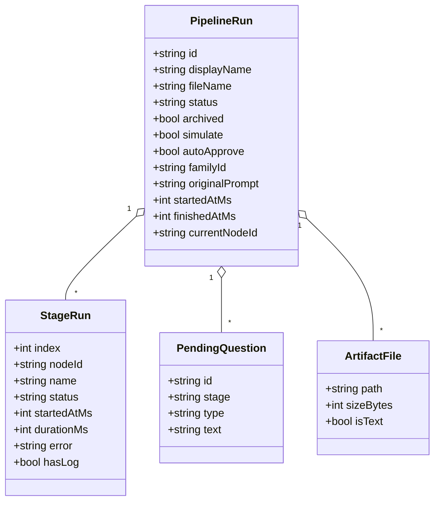
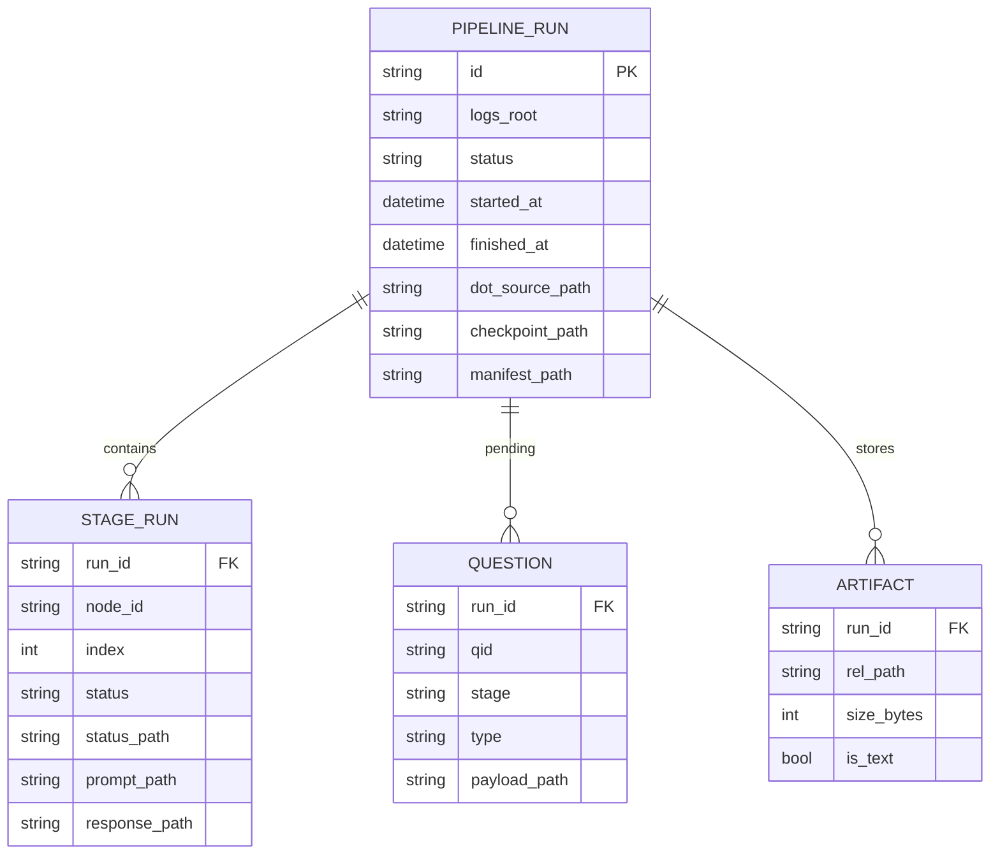
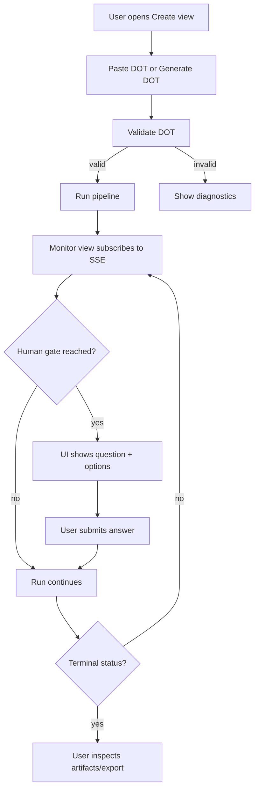
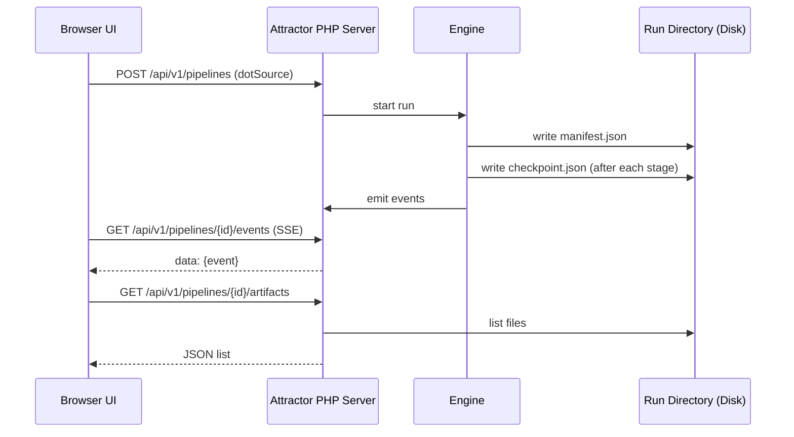
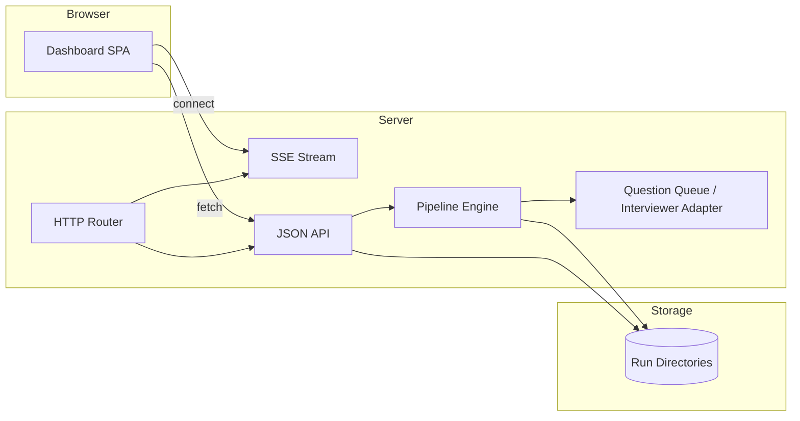

Legend: [ ] Incomplete, [X] Complete

# Sprint #002 - Attractor PHP: Web Dashboard UI (Coreys-Attractor-Inspired)

Evidence rule:
- Mark an item `[X]` only once it includes the exact verification command(s) (wrapped in backticks), exit code(s), and paths to produced artifacts (logs, fixtures, screenshots, `.scratch` transcripts) in the placeholder block directly beneath the item.
- Store evidence under `.scratch/verification/SPRINT-002/...` and link those paths in the placeholder block.

## Objective
Deliver a built-in web dashboard for Attractor PHP that enables:
- Real-time pipeline monitoring (status, stages, logs, rendered graph)
- Remote human-gate operation (view pending questions and submit answers)
- Pipeline creation workflow (paste/upload DOT and optionally generate DOT from a prompt)

This sprint explicitly uses the embedded dashboard in [`coreys-attractor`](../../coreys-attractor/README.md) as a UX and API inspiration source, while implementing behavior consistent with the Attractor NLSpec (`attractor-spec.md`) HTTP server mode and event stream requirements.

## Context
Attractor’s NLSpec makes the engine headless and UI-driven by events. It allows an HTTP server mode and requires that human gates be operable via web controls with real-time event streaming (SSE). Corey’s Attractor demonstrates a practical, dependency-light approach: a single-page dashboard served by the runtime, backed by an HTTP JSON API and SSE streams.

## Non-Goals
- Authentication/authorization, multi-user sessions, or RBAC
- Multi-tenant isolation
- A fully general-purpose “software factory UI” (IDE plugin, editor integrations)
- Legacy backwards compatibility for any prior API (there is none in this repo)

## Execution Order
Phase 0 -> Phase 1 -> Phase 2 -> Phase 3 -> Phase 4

## Product Requirements (User Flows)
1. **Create a pipeline run**
   - Paste DOT source into an editor and run it.
   - (Optional but planned) Describe a goal in natural language and generate candidate DOT.
   - Validate DOT before running and show actionable diagnostics.
2. **Monitor a pipeline run**
   - See overall run status, current node, and stage list with per-stage status.
   - See a rendered graph visualization with stage status overlays.
   - See an append-only live log of events.
3. **Operate human gates**
   - When a run pauses for human input, the UI shows the question and answer options.
   - Submitting an answer resumes execution and is reflected in the event stream.
4. **Inspect and export artifacts**
   - View per-stage artifacts (prompt/response/status) and any additional run artifacts.
   - Download all artifacts as a ZIP.
5. **Run history basics**
   - List recent runs, open an older run, and delete a run (with safeguards).

## Architectural Approach (High Level)
- **Server**: Attractor PHP runs the pipeline engine and exposes an HTTP API plus SSE endpoints for events.
- **UI**: A built-in, no-build single-page app (static HTML/CSS/JS) served at `/`, consuming the HTTP API.
- **Storage**: Use the NLSpec run directory structure as the durable “source of truth” for run state and artifacts:
  - `{logs_root}/{run_id}/manifest.json`
  - `{logs_root}/{run_id}/checkpoint.json`
  - `{logs_root}/{run_id}/{node_id}/...`
  - `{logs_root}/{run_id}/artifacts/...`

## UX Spec (Coreys-Attractor-Inspired)
This UI intentionally mirrors the flow that makes Corey’s Attractor productive while keeping the implementation dependency-light.

### Views
- **Monitor** (default): run list + run details (stages, graph, live log, artifacts, human gate controls)
- **Create**: DOT editor + validate + graph preview + run
- **Archived**: list archived runs and re-open or unarchive
- **Docs**: built-in documentation of UI + API + DOT

### Monitor View - Minimum Behaviors
- Run list shows: name, status, started time, current node, archived flag.
- Run details shows:
  - Status badge + elapsed time
  - Stage list with per-stage status and error detail
  - Graph panel (SVG) with zoom/pan and per-node status highlighting
  - Live log panel (append-only)
  - Human gate panel/modal when a question is pending
  - Artifacts viewer (list + preview + download)
- Actions (conditioned on run state):
  - Cancel (running only)
  - Archive/unarchive (terminal only)
  - Delete (terminal only, explicit confirmation)

### Create View - Minimum Behaviors
- Paste DOT, validate, preview as SVG, then run.
- Validation diagnostics must be shown inline and block run creation until fixed.

## API Shapes (Selected, Starting Point)
The OpenAPI deliverable in Phase 0 is authoritative; these examples are here to remove ambiguity for implementers and test authors.

### `PipelineListItem` (response item for `GET /api/v1/pipelines`)
```json
{
  "id": "run-1700000000000-1",
  "displayName": "Autumn Falcon",
  "fileName": "pipeline.dot",
  "status": "running",
  "archived": false,
  "simulate": false,
  "autoApprove": true,
  "familyId": "run-1700000000000-1",
  "originalPrompt": "Write and test a REST API",
  "startedAtMs": 1700000000000,
  "finishedAtMs": null,
  "currentNodeId": "plan",
  "stages": []
}
```

### `PipelineDetail` (response for `GET /api/v1/pipelines/{id}`)
```json
{
  "dotSource": "digraph P { ... }",
  "checkpoint": { "current_node": "plan", "completed_nodes": ["start"] },
  "contextSummary": { "keys": ["graph.goal", "notes"] }
}
```

### `PendingQuestion` (response item for `GET /api/v1/pipelines/{id}/questions`)
```json
{
  "id": "q-1",
  "stage": "review_gate",
  "type": "MULTIPLE_CHOICE",
  "text": "Approve changes?",
  "options": [
    { "key": "A", "label": "Approve" },
    { "key": "F", "label": "Fix" }
  ]
}
```

### SSE Event Envelope (per-run and global streams)
```json
{
  "runId": "run-1700000000000-1",
  "tsMs": 1700000000123,
  "type": "StageCompleted",
  "payload": { "nodeId": "plan", "durationMs": 1200 }
}
```

## Security and Robustness Invariants
- Artifact file routes must prevent path traversal and must not allow reading outside the run directory.
- The UI must HTML-escape any untrusted strings (LLM outputs, log lines, DOT labels) to prevent injection.
- Large text artifacts must be rendered with bounded UI (truncation + explicit “download full file” path).

## Deliverables
### Phase 0 - Contracts, IA, and Decision Log
- [ ] **P0.1 - Capture key architecture decisions in ADR**
```{placeholder for verification justification/reasoning and evidence log}```
- [ ] **P0.2 - Define the HTTP API contract (OpenAPI + written invariants)**
```{placeholder for verification justification/reasoning and evidence log}```
- [ ] **P0.3 - Define the SSE event contract (event types and JSON envelopes)**
```{placeholder for verification justification/reasoning and evidence log}```
- [ ] **P0.4 - Define UI information architecture and view-to-endpoint mapping**
```{placeholder for verification justification/reasoning and evidence log}```
- [ ] **P0.5 - Mermaid appendix diagrams render via `mmdc`**
```{placeholder for verification justification/reasoning and evidence log}```

#### Acceptance Criteria (Phase 0)
- [ ] ADR(s) exist and explicitly justify: UI stack choice, API surface choice, persistence approach, and SSE format
```{placeholder for verification justification/reasoning and evidence log}```
- [ ] OpenAPI spec covers every endpoint the UI will call, including error envelopes
```{placeholder for verification justification/reasoning and evidence log}```
- [ ] SSE contract describes ordering expectations, replay/initial snapshot behavior, and disconnect semantics
```{placeholder for verification justification/reasoning and evidence log}```
- [ ] Appendix diagrams exist and `mmdc` can render them without errors
```{placeholder for verification justification/reasoning and evidence log}```

---

### Phase 1 - Backend HTTP + SSE (UI-Serving API)
- [ ] **P1.1 - Server serves the dashboard shell at `/` (static HTML/CSS/JS)**
```{placeholder for verification justification/reasoning and evidence log}```
- [ ] **P1.2 - List runs: `GET /api/v1/pipelines`**
```{placeholder for verification justification/reasoning and evidence log}```
- [ ] **P1.3 - Create run: `POST /api/v1/pipelines`**
```{placeholder for verification justification/reasoning and evidence log}```
- [ ] **P1.4 - Get run: `GET /api/v1/pipelines/{id}`**
```{placeholder for verification justification/reasoning and evidence log}```
- [ ] **P1.5 - Cancel run: `POST /api/v1/pipelines/{id}/cancel`**
```{placeholder for verification justification/reasoning and evidence log}```
- [ ] **P1.6 - Delete run: `DELETE /api/v1/pipelines/{id}` (refuse if running)**
```{placeholder for verification justification/reasoning and evidence log}```
- [ ] **P1.7 - Per-run event stream (SSE): `GET /api/v1/pipelines/{id}/events`**
```{placeholder for verification justification/reasoning and evidence log}```
- [ ] **P1.8 - Global event stream (SSE): `GET /api/v1/events`**
```{placeholder for verification justification/reasoning and evidence log}```
- [ ] **P1.9 - List pending questions: `GET /api/v1/pipelines/{id}/questions`**
```{placeholder for verification justification/reasoning and evidence log}```
- [ ] **P1.10 - Submit answer: `POST /api/v1/pipelines/{id}/questions/{qid}/answer`**
```{placeholder for verification justification/reasoning and evidence log}```
- [ ] **P1.11 - Graph render endpoint returning SVG for a run: `GET /api/v1/pipelines/{id}/graph`**
```{placeholder for verification justification/reasoning and evidence log}```
- [ ] **P1.12 - List artifacts: `GET /api/v1/pipelines/{id}/artifacts`**
```{placeholder for verification justification/reasoning and evidence log}```
- [ ] **P1.13 - Fetch artifact file: `GET /api/v1/pipelines/{id}/artifacts/{path}`**
```{placeholder for verification justification/reasoning and evidence log}```
- [ ] **P1.14 - Download artifacts ZIP: `GET /api/v1/pipelines/{id}/artifacts.zip`**
```{placeholder for verification justification/reasoning and evidence log}```
- [ ] **P1.15 - DOT validate endpoint: `POST /api/v1/dot/validate`**
```{placeholder for verification justification/reasoning and evidence log}```
- [ ] **P1.16 - DOT render endpoint: `POST /api/v1/dot/render`**
```{placeholder for verification justification/reasoning and evidence log}```
- [ ] **P1.17 - Spec-core endpoint aliases (`/pipelines/...`) implemented as thin wrappers to the v1 API**
```{placeholder for verification justification/reasoning and evidence log}```
- [ ] **P1.18 - Robust error envelope + CORS behavior for all endpoints**
```{placeholder for verification justification/reasoning and evidence log}```
- [ ] **P1.19 - Archive/unarchive endpoints: `POST /api/v1/pipelines/{id}/archive` and `/unarchive`**
```{placeholder for verification justification/reasoning and evidence log}```
- [ ] **P1.20 - Runs listing can include/exclude archived runs (explicit contract, tested)**
```{placeholder for verification justification/reasoning and evidence log}```
- [ ] **P1.21 - Security invariants enforced for artifacts and UI-served HTML**
```{placeholder for verification justification/reasoning and evidence log}```

#### Acceptance Criteria (Phase 1)
- [ ] `GET /` returns a functional dashboard shell and loads without external network dependencies
```{placeholder for verification justification/reasoning and evidence log}```
- [ ] Creating a run persists a run directory and emits lifecycle + stage events to SSE clients
```{placeholder for verification justification/reasoning and evidence log}```
- [ ] Invalid DOT is rejected by validation endpoints with structured diagnostics and a stable error envelope
```{placeholder for verification justification/reasoning and evidence log}```
- [ ] Human-gate operations work end-to-end: pending question appears, answer submission is validated and recorded, run resumes
```{placeholder for verification justification/reasoning and evidence log}```
- [ ] Artifact file download endpoints prevent path traversal and handle binary vs text safely
```{placeholder for verification justification/reasoning and evidence log}```
- [ ] Archive/unarchive updates the run’s `archived` flag and affects listing behavior as specified
```{placeholder for verification justification/reasoning and evidence log}```

---

### Phase 2 - UI: Monitor View (Real-Time Observability)
- [ ] **P2.1 - Navigation shell + persistent theme preference**
```{placeholder for verification justification/reasoning and evidence log}```
- [ ] **P2.2 - Run list + run selection (including deep-link by run id)**
```{placeholder for verification justification/reasoning and evidence log}```
- [ ] **P2.3 - Run details panel: status, metadata, stage list**
```{placeholder for verification justification/reasoning and evidence log}```
- [ ] **P2.4 - Live log panel (append-only)**
```{placeholder for verification justification/reasoning and evidence log}```
- [ ] **P2.5 - Graph panel: rendered SVG with zoom/pan and “download .dot”**
```{placeholder for verification justification/reasoning and evidence log}```
- [ ] **P2.6 - Human-gate UI: question modal/panel with answer buttons**
```{placeholder for verification justification/reasoning and evidence log}```
- [ ] **P2.7 - Artifact viewer: list files, preview text, download binary**
```{placeholder for verification justification/reasoning and evidence log}```
- [ ] **P2.8 - Archive/unarchive + delete actions wired into the Monitor view with confirmations**
```{placeholder for verification justification/reasoning and evidence log}```

#### Acceptance Criteria (Phase 2)
- [ ] Monitor view reflects state changes in near-real-time from SSE without manual refresh
```{placeholder for verification justification/reasoning and evidence log}```
- [ ] Stage list clearly shows stage status transitions and error details when present
```{placeholder for verification justification/reasoning and evidence log}```
- [ ] Graph visualization updates when a new checkpoint is saved (or equivalent state change)
```{placeholder for verification justification/reasoning and evidence log}```
- [ ] Human-gate interaction is usable: question is visible, answer submission has immediate feedback, and pipeline continues
```{placeholder for verification justification/reasoning and evidence log}```
- [ ] Artifact viewer can preview large text artifacts safely (bounded rendering) and provides download links
```{placeholder for verification justification/reasoning and evidence log}```
- [ ] Archive/unarchive and delete are guarded by state and require explicit confirmation in the UI
```{placeholder for verification justification/reasoning and evidence log}```

---

### Phase 3 - UI: Create View + History Utilities
- [ ] **P3.1 - DOT editor with validate-before-run workflow**
```{placeholder for verification justification/reasoning and evidence log}```
- [ ] **P3.2 - Graph preview for the edited DOT (render to SVG)**
```{placeholder for verification justification/reasoning and evidence log}```
- [ ] **P3.3 - Create run from edited DOT and automatically navigate to Monitor view**
```{placeholder for verification justification/reasoning and evidence log}```
- [ ] **P3.4 - Optional: DOT generation from a natural-language prompt (streaming UI)**
```{placeholder for verification justification/reasoning and evidence log}```
- [ ] **P3.5 - Run history basics: list recent runs and delete a run with confirmation**
```{placeholder for verification justification/reasoning and evidence log}```
- [ ] **P3.6 - Built-in documentation page (`/docs`) describing UI + API + DOT**
```{placeholder for verification justification/reasoning and evidence log}```
- [ ] **P3.7 - Archived view: list archived runs and allow unarchive/open**
```{placeholder for verification justification/reasoning and evidence log}```

#### Acceptance Criteria (Phase 3)
- [ ] Users can paste DOT, validate, preview, and run without leaving the UI
```{placeholder for verification justification/reasoning and evidence log}```
- [ ] Validation failures are actionable (diagnostics point to node/edge when available) and do not start a run
```{placeholder for verification justification/reasoning and evidence log}```
- [ ] Run delete is safe: requires explicit confirmation and refuses to delete a currently running run
```{placeholder for verification justification/reasoning and evidence log}```
- [ ] `/docs` is fully served by the application and remains readable without external network access
```{placeholder for verification justification/reasoning and evidence log}```
- [ ] Archived view clearly differentiates archived runs and provides a path to restore visibility
```{placeholder for verification justification/reasoning and evidence log}```

---

### Phase 4 - Test Strategy, E2E Proof, and Documentation
- [ ] **P4.1 - Backend unit/integration tests for every API endpoint the UI calls**
```{placeholder for verification justification/reasoning and evidence log}```
- [ ] **P4.2 - SSE tests: per-run stream and global stream contracts**
```{placeholder for verification justification/reasoning and evidence log}```
- [ ] **P4.3 - Browser E2E tests covering Create, Monitor, human-gate, and artifacts flows**
```{placeholder for verification justification/reasoning and evidence log}```
- [ ] **P4.4 - Manual UX verification checklist (desktop + mobile layouts)**
```{placeholder for verification justification/reasoning and evidence log}```
- [ ] **P4.5 - Operator/developer docs: run server, run tests, troubleshoot**
```{placeholder for verification justification/reasoning and evidence log}```

#### Acceptance Criteria (Phase 4)
- [ ] All automated tests pass in CI-equivalent local runs
```{placeholder for verification justification/reasoning and evidence log}```
- [ ] E2E tests include both positive and negative cases, and failures provide useful artifacts (screenshots/logs)
```{placeholder for verification justification/reasoning and evidence log}```
- [ ] Documentation is sufficient for a new developer to run the UI locally and understand the API surface
```{placeholder for verification justification/reasoning and evidence log}```

---

## API Contract (Proposed, UI-Facing)
This section is a concrete starting point; the authoritative version must live in the OpenAPI artifact produced in Phase 0.

### Error Envelope (All non-2xx)
```json
{ "error": "human readable message", "code": "MACHINE_CODE" }
```

### Core Endpoints (Minimum)
- `GET /api/v1/pipelines` list runs (summary)
- `POST /api/v1/pipelines` create a run from DOT (and start execution)
- `GET /api/v1/pipelines/{id}` get run (includes DOT and current checkpoint summary)
- `POST /api/v1/pipelines/{id}/cancel` cancel a running run
- `DELETE /api/v1/pipelines/{id}` delete a non-running run
- `POST /api/v1/pipelines/{id}/archive` archive a terminal run
- `POST /api/v1/pipelines/{id}/unarchive` unarchive a terminal run
- `GET /api/v1/pipelines/{id}/events` per-run SSE stream
- `GET /api/v1/events` global SSE stream (aggregated)
- `GET /api/v1/pipelines/{id}/graph` rendered SVG for the run’s DOT
- `GET /api/v1/pipelines/{id}/questions` pending questions
- `POST /api/v1/pipelines/{id}/questions/{qid}/answer` submit answer
- `GET /api/v1/pipelines/{id}/artifacts` list artifact files
- `GET /api/v1/pipelines/{id}/artifacts/{path}` fetch a single artifact file
- `GET /api/v1/pipelines/{id}/artifacts.zip` download all artifacts as zip
- `POST /api/v1/dot/validate` validate DOT and return diagnostics
- `POST /api/v1/dot/render` render DOT to SVG (used by Create preview)

Spec-core aliases (non-versioned, thin wrappers around the v1 implementation):
- `POST /pipelines`
- `GET /pipelines/{id}`
- `GET /pipelines/{id}/events` (SSE)
- `POST /pipelines/{id}/cancel`
- `GET /pipelines/{id}/graph`
- `GET /pipelines/{id}/questions`
- `POST /pipelines/{id}/questions/{qid}/answer`

## Test Matrix (Explicit Positive + Negative Coverage)
The implementation must include tests proving the following scenarios.

### Backend API (Selected)
Positive cases:
1. Create run with valid DOT returns 201 + run id; run directory exists; status transitions to terminal.
2. Per-run SSE streams stage lifecycle events in order for a simple linear pipeline.
3. Human gate: pending question appears; answer submission accepts a valid option; pipeline continues.
4. Artifact list shows per-stage files; fetching a text artifact returns correct content-type and contents.
5. Graph render returns valid SVG for well-formed DOT.
6. Cancel run transitions status to `cancelled` and emits a terminal event on SSE.

Negative cases:
1. Create run rejects missing/empty `dotSource` with 400 + error envelope.
2. Validate rejects syntactically invalid DOT with diagnostics and does not start execution.
3. Fetching a nonexistent run id returns 404 + error envelope.
4. Artifact path traversal attempt (e.g. `../`) is rejected with 400/404 (stable code), and no file is read.
5. Answer submission for unknown `qid` returns 404; submission for invalid option returns 400.
6. Cancel on a terminal run is rejected with 409 + error envelope.
7. Delete on a running run is rejected with 409 + error envelope.
8. Delete on a nonexistent run id returns 404 + error envelope.
9. Archive on a running run is rejected with 409 + error envelope.
10. Unarchive on a running run is rejected with 409 + error envelope.

### UI E2E (Selected)
Positive cases:
1. Paste DOT, validate, preview, run, then observe stage updates in Monitor view via SSE.
2. When a human gate appears, the UI presents answer buttons and the pipeline proceeds after selection.
3. Artifact viewer previews prompt/response and downloads the artifacts zip.

Negative cases:
1. Invalid DOT shows a validation error and disables Run until fixed.
2. Network error (API returns 500) shows a user-visible error banner without breaking the SPA.
3. Selecting a deleted run id shows a clear not-found state and navigates safely back to the run list.

---

## Appendix (Mermaid Diagrams)

### A1. Core Domain Model (UI + API)


### A2. E-R Diagram (Durable Run Store on Disk)


### A3. Workflow (Create -> Run -> Human Gate -> Complete)


### A4. Data Flow (SSE + HTTP)


### A5. Architecture (Runtime + UI)

