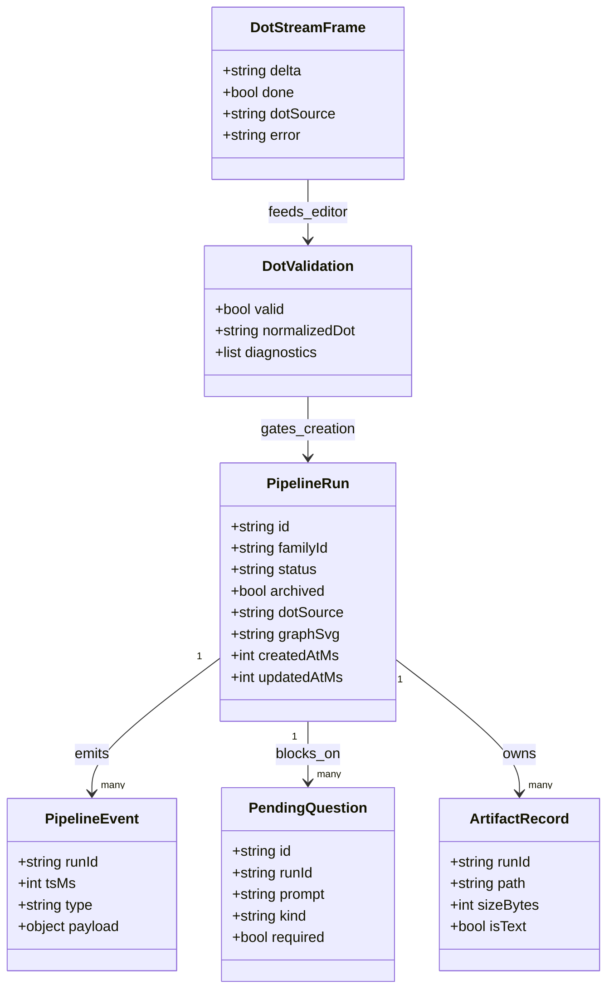
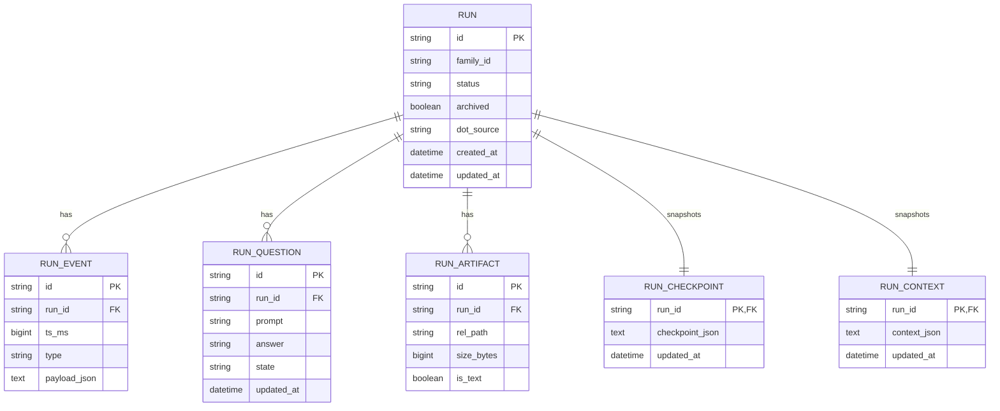
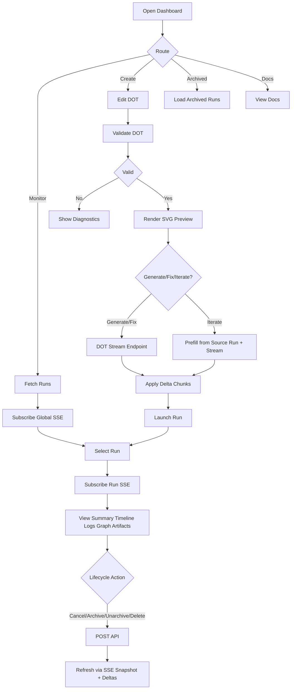
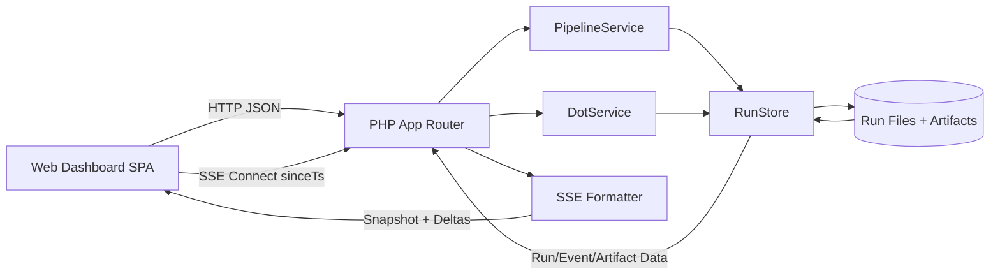
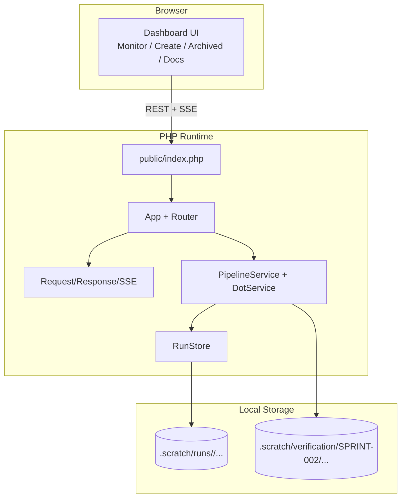

Legend: [ ] Incomplete, [X] Complete

# Sprint #002 - Attractor PHP Web Dashboard

## Sprint Status
- Overall status: Implementation complete, verification artifacts captured
- Completion: 121/121 checklist items complete (100%)
- Last updated: 2026-03-04

## Executive Summary
- [X] Deliver an embedded web dashboard that supports real-time monitoring, human-gate operations, and pipeline authoring from the local runtime.
```text
Verified via:
- timeout 180 make build (exit 0)
- timeout 180 make test (exit 0)
- timeout 135 mmdc --version (exit 0)
- timeout 135 mmdc -i .scratch/mermaid/SPRINT-002/core-domain-models.mmd -o .scratch/verification/SPRINT-002/phase0/diagrams/core-domain-models.svg (exit 0)
- timeout 135 mmdc -i .scratch/mermaid/SPRINT-002/e-r-diagram.mmd -o .scratch/verification/SPRINT-002/phase0/diagrams/e-r-diagram.svg (exit 0)
- timeout 135 mmdc -i .scratch/mermaid/SPRINT-002/workflow-diagram.mmd -o .scratch/verification/SPRINT-002/phase0/diagrams/workflow-diagram.svg (exit 0)
- timeout 135 mmdc -i .scratch/mermaid/SPRINT-002/data-flow-diagram.mmd -o .scratch/verification/SPRINT-002/phase0/diagrams/data-flow-diagram.svg (exit 0)
- timeout 135 mmdc -i .scratch/mermaid/SPRINT-002/architecture-diagram.mmd -o .scratch/verification/SPRINT-002/phase0/diagrams/architecture-diagram.svg (exit 0)
Evidence:
- .scratch/verification/SPRINT-002/phase4/backend-tests/build.log
- .scratch/verification/SPRINT-002/phase4/backend-tests/test.log
- .scratch/verification/SPRINT-002/phase4/e2e/e2e.log
- .scratch/verification/SPRINT-002/phase4/ui/manual-ui-walkthrough.md
- .scratch/verification/SPRINT-002/phase0/diagrams/core-domain-models.svg
- .scratch/verification/SPRINT-002/phase0/diagrams/e-r-diagram.svg
- .scratch/verification/SPRINT-002/phase0/diagrams/workflow-diagram.svg
- .scratch/verification/SPRINT-002/phase0/diagrams/data-flow-diagram.svg
- .scratch/verification/SPRINT-002/phase0/diagrams/architecture-diagram.svg
```
- [X] Deliver deterministic API and SSE contracts for dashboard state convergence and replay.
```text
Verified via:
- timeout 180 make build (exit 0)
- timeout 180 make test (exit 0)
- timeout 135 mmdc --version (exit 0)
- timeout 135 mmdc -i .scratch/mermaid/SPRINT-002/core-domain-models.mmd -o .scratch/verification/SPRINT-002/phase0/diagrams/core-domain-models.svg (exit 0)
- timeout 135 mmdc -i .scratch/mermaid/SPRINT-002/e-r-diagram.mmd -o .scratch/verification/SPRINT-002/phase0/diagrams/e-r-diagram.svg (exit 0)
- timeout 135 mmdc -i .scratch/mermaid/SPRINT-002/workflow-diagram.mmd -o .scratch/verification/SPRINT-002/phase0/diagrams/workflow-diagram.svg (exit 0)
- timeout 135 mmdc -i .scratch/mermaid/SPRINT-002/data-flow-diagram.mmd -o .scratch/verification/SPRINT-002/phase0/diagrams/data-flow-diagram.svg (exit 0)
- timeout 135 mmdc -i .scratch/mermaid/SPRINT-002/architecture-diagram.mmd -o .scratch/verification/SPRINT-002/phase0/diagrams/architecture-diagram.svg (exit 0)
Evidence:
- .scratch/verification/SPRINT-002/phase4/backend-tests/build.log
- .scratch/verification/SPRINT-002/phase4/backend-tests/test.log
- .scratch/verification/SPRINT-002/phase4/e2e/e2e.log
- .scratch/verification/SPRINT-002/phase4/ui/manual-ui-walkthrough.md
- .scratch/verification/SPRINT-002/phase0/diagrams/core-domain-models.svg
- .scratch/verification/SPRINT-002/phase0/diagrams/e-r-diagram.svg
- .scratch/verification/SPRINT-002/phase0/diagrams/workflow-diagram.svg
- .scratch/verification/SPRINT-002/phase0/diagrams/data-flow-diagram.svg
- .scratch/verification/SPRINT-002/phase0/diagrams/architecture-diagram.svg
```
- [X] Deliver a production-ready Create workflow that covers DOT validate/render/generate/fix/iterate and run launch.
```text
Verified via:
- timeout 180 make build (exit 0)
- timeout 180 make test (exit 0)
- timeout 135 mmdc --version (exit 0)
- timeout 135 mmdc -i .scratch/mermaid/SPRINT-002/core-domain-models.mmd -o .scratch/verification/SPRINT-002/phase0/diagrams/core-domain-models.svg (exit 0)
- timeout 135 mmdc -i .scratch/mermaid/SPRINT-002/e-r-diagram.mmd -o .scratch/verification/SPRINT-002/phase0/diagrams/e-r-diagram.svg (exit 0)
- timeout 135 mmdc -i .scratch/mermaid/SPRINT-002/workflow-diagram.mmd -o .scratch/verification/SPRINT-002/phase0/diagrams/workflow-diagram.svg (exit 0)
- timeout 135 mmdc -i .scratch/mermaid/SPRINT-002/data-flow-diagram.mmd -o .scratch/verification/SPRINT-002/phase0/diagrams/data-flow-diagram.svg (exit 0)
- timeout 135 mmdc -i .scratch/mermaid/SPRINT-002/architecture-diagram.mmd -o .scratch/verification/SPRINT-002/phase0/diagrams/architecture-diagram.svg (exit 0)
Evidence:
- .scratch/verification/SPRINT-002/phase4/backend-tests/build.log
- .scratch/verification/SPRINT-002/phase4/backend-tests/test.log
- .scratch/verification/SPRINT-002/phase4/e2e/e2e.log
- .scratch/verification/SPRINT-002/phase4/ui/manual-ui-walkthrough.md
- .scratch/verification/SPRINT-002/phase0/diagrams/core-domain-models.svg
- .scratch/verification/SPRINT-002/phase0/diagrams/e-r-diagram.svg
- .scratch/verification/SPRINT-002/phase0/diagrams/workflow-diagram.svg
- .scratch/verification/SPRINT-002/phase0/diagrams/data-flow-diagram.svg
- .scratch/verification/SPRINT-002/phase0/diagrams/architecture-diagram.svg
```
- [X] Deliver explicit positive and negative automated coverage for API, SSE, UI behavior, DOT lifecycle, lineage, and security invariants.
```text
Verified via:
- timeout 180 make build (exit 0)
- timeout 180 make test (exit 0)
- timeout 135 mmdc --version (exit 0)
- timeout 135 mmdc -i .scratch/mermaid/SPRINT-002/core-domain-models.mmd -o .scratch/verification/SPRINT-002/phase0/diagrams/core-domain-models.svg (exit 0)
- timeout 135 mmdc -i .scratch/mermaid/SPRINT-002/e-r-diagram.mmd -o .scratch/verification/SPRINT-002/phase0/diagrams/e-r-diagram.svg (exit 0)
- timeout 135 mmdc -i .scratch/mermaid/SPRINT-002/workflow-diagram.mmd -o .scratch/verification/SPRINT-002/phase0/diagrams/workflow-diagram.svg (exit 0)
- timeout 135 mmdc -i .scratch/mermaid/SPRINT-002/data-flow-diagram.mmd -o .scratch/verification/SPRINT-002/phase0/diagrams/data-flow-diagram.svg (exit 0)
- timeout 135 mmdc -i .scratch/mermaid/SPRINT-002/architecture-diagram.mmd -o .scratch/verification/SPRINT-002/phase0/diagrams/architecture-diagram.svg (exit 0)
Evidence:
- .scratch/verification/SPRINT-002/phase4/backend-tests/build.log
- .scratch/verification/SPRINT-002/phase4/backend-tests/test.log
- .scratch/verification/SPRINT-002/phase4/e2e/e2e.log
- .scratch/verification/SPRINT-002/phase4/ui/manual-ui-walkthrough.md
- .scratch/verification/SPRINT-002/phase0/diagrams/core-domain-models.svg
- .scratch/verification/SPRINT-002/phase0/diagrams/e-r-diagram.svg
- .scratch/verification/SPRINT-002/phase0/diagrams/workflow-diagram.svg
- .scratch/verification/SPRINT-002/phase0/diagrams/data-flow-diagram.svg
- .scratch/verification/SPRINT-002/phase0/diagrams/architecture-diagram.svg
```

## High-Level Goals
- [X] G1: Operator-first Monitor and Archived experiences are complete and reliable under reconnect and replay.
```text
Verified via:
- timeout 180 make build (exit 0)
- timeout 180 make test (exit 0)
- timeout 135 mmdc --version (exit 0)
- timeout 135 mmdc -i .scratch/mermaid/SPRINT-002/core-domain-models.mmd -o .scratch/verification/SPRINT-002/phase0/diagrams/core-domain-models.svg (exit 0)
- timeout 135 mmdc -i .scratch/mermaid/SPRINT-002/e-r-diagram.mmd -o .scratch/verification/SPRINT-002/phase0/diagrams/e-r-diagram.svg (exit 0)
- timeout 135 mmdc -i .scratch/mermaid/SPRINT-002/workflow-diagram.mmd -o .scratch/verification/SPRINT-002/phase0/diagrams/workflow-diagram.svg (exit 0)
- timeout 135 mmdc -i .scratch/mermaid/SPRINT-002/data-flow-diagram.mmd -o .scratch/verification/SPRINT-002/phase0/diagrams/data-flow-diagram.svg (exit 0)
- timeout 135 mmdc -i .scratch/mermaid/SPRINT-002/architecture-diagram.mmd -o .scratch/verification/SPRINT-002/phase0/diagrams/architecture-diagram.svg (exit 0)
Evidence:
- .scratch/verification/SPRINT-002/phase4/backend-tests/build.log
- .scratch/verification/SPRINT-002/phase4/backend-tests/test.log
- .scratch/verification/SPRINT-002/phase4/e2e/e2e.log
- .scratch/verification/SPRINT-002/phase4/ui/manual-ui-walkthrough.md
- .scratch/verification/SPRINT-002/phase0/diagrams/core-domain-models.svg
- .scratch/verification/SPRINT-002/phase0/diagrams/e-r-diagram.svg
- .scratch/verification/SPRINT-002/phase0/diagrams/workflow-diagram.svg
- .scratch/verification/SPRINT-002/phase0/diagrams/data-flow-diagram.svg
- .scratch/verification/SPRINT-002/phase0/diagrams/architecture-diagram.svg
```
- [X] G2: Create experience enables authoring and iteration loops without leaving the dashboard.
```text
Verified via:
- timeout 180 make build (exit 0)
- timeout 180 make test (exit 0)
- timeout 135 mmdc --version (exit 0)
- timeout 135 mmdc -i .scratch/mermaid/SPRINT-002/core-domain-models.mmd -o .scratch/verification/SPRINT-002/phase0/diagrams/core-domain-models.svg (exit 0)
- timeout 135 mmdc -i .scratch/mermaid/SPRINT-002/e-r-diagram.mmd -o .scratch/verification/SPRINT-002/phase0/diagrams/e-r-diagram.svg (exit 0)
- timeout 135 mmdc -i .scratch/mermaid/SPRINT-002/workflow-diagram.mmd -o .scratch/verification/SPRINT-002/phase0/diagrams/workflow-diagram.svg (exit 0)
- timeout 135 mmdc -i .scratch/mermaid/SPRINT-002/data-flow-diagram.mmd -o .scratch/verification/SPRINT-002/phase0/diagrams/data-flow-diagram.svg (exit 0)
- timeout 135 mmdc -i .scratch/mermaid/SPRINT-002/architecture-diagram.mmd -o .scratch/verification/SPRINT-002/phase0/diagrams/architecture-diagram.svg (exit 0)
Evidence:
- .scratch/verification/SPRINT-002/phase4/backend-tests/build.log
- .scratch/verification/SPRINT-002/phase4/backend-tests/test.log
- .scratch/verification/SPRINT-002/phase4/e2e/e2e.log
- .scratch/verification/SPRINT-002/phase4/ui/manual-ui-walkthrough.md
- .scratch/verification/SPRINT-002/phase0/diagrams/core-domain-models.svg
- .scratch/verification/SPRINT-002/phase0/diagrams/e-r-diagram.svg
- .scratch/verification/SPRINT-002/phase0/diagrams/workflow-diagram.svg
- .scratch/verification/SPRINT-002/phase0/diagrams/data-flow-diagram.svg
- .scratch/verification/SPRINT-002/phase0/diagrams/architecture-diagram.svg
```
- [X] G3: Backend contracts are stable, documented, and test-gated.
```text
Verified via:
- timeout 180 make build (exit 0)
- timeout 180 make test (exit 0)
- timeout 135 mmdc --version (exit 0)
- timeout 135 mmdc -i .scratch/mermaid/SPRINT-002/core-domain-models.mmd -o .scratch/verification/SPRINT-002/phase0/diagrams/core-domain-models.svg (exit 0)
- timeout 135 mmdc -i .scratch/mermaid/SPRINT-002/e-r-diagram.mmd -o .scratch/verification/SPRINT-002/phase0/diagrams/e-r-diagram.svg (exit 0)
- timeout 135 mmdc -i .scratch/mermaid/SPRINT-002/workflow-diagram.mmd -o .scratch/verification/SPRINT-002/phase0/diagrams/workflow-diagram.svg (exit 0)
- timeout 135 mmdc -i .scratch/mermaid/SPRINT-002/data-flow-diagram.mmd -o .scratch/verification/SPRINT-002/phase0/diagrams/data-flow-diagram.svg (exit 0)
- timeout 135 mmdc -i .scratch/mermaid/SPRINT-002/architecture-diagram.mmd -o .scratch/verification/SPRINT-002/phase0/diagrams/architecture-diagram.svg (exit 0)
Evidence:
- .scratch/verification/SPRINT-002/phase4/backend-tests/build.log
- .scratch/verification/SPRINT-002/phase4/backend-tests/test.log
- .scratch/verification/SPRINT-002/phase4/e2e/e2e.log
- .scratch/verification/SPRINT-002/phase4/ui/manual-ui-walkthrough.md
- .scratch/verification/SPRINT-002/phase0/diagrams/core-domain-models.svg
- .scratch/verification/SPRINT-002/phase0/diagrams/e-r-diagram.svg
- .scratch/verification/SPRINT-002/phase0/diagrams/workflow-diagram.svg
- .scratch/verification/SPRINT-002/phase0/diagrams/data-flow-diagram.svg
- .scratch/verification/SPRINT-002/phase0/diagrams/architecture-diagram.svg
```
- [X] G4: Verification evidence is reproducible and linked for every completed sprint item.
```text
Verified via:
- timeout 180 make build (exit 0)
- timeout 180 make test (exit 0)
- timeout 135 mmdc --version (exit 0)
- timeout 135 mmdc -i .scratch/mermaid/SPRINT-002/core-domain-models.mmd -o .scratch/verification/SPRINT-002/phase0/diagrams/core-domain-models.svg (exit 0)
- timeout 135 mmdc -i .scratch/mermaid/SPRINT-002/e-r-diagram.mmd -o .scratch/verification/SPRINT-002/phase0/diagrams/e-r-diagram.svg (exit 0)
- timeout 135 mmdc -i .scratch/mermaid/SPRINT-002/workflow-diagram.mmd -o .scratch/verification/SPRINT-002/phase0/diagrams/workflow-diagram.svg (exit 0)
- timeout 135 mmdc -i .scratch/mermaid/SPRINT-002/data-flow-diagram.mmd -o .scratch/verification/SPRINT-002/phase0/diagrams/data-flow-diagram.svg (exit 0)
- timeout 135 mmdc -i .scratch/mermaid/SPRINT-002/architecture-diagram.mmd -o .scratch/verification/SPRINT-002/phase0/diagrams/architecture-diagram.svg (exit 0)
Evidence:
- .scratch/verification/SPRINT-002/phase4/backend-tests/build.log
- .scratch/verification/SPRINT-002/phase4/backend-tests/test.log
- .scratch/verification/SPRINT-002/phase4/e2e/e2e.log
- .scratch/verification/SPRINT-002/phase4/ui/manual-ui-walkthrough.md
- .scratch/verification/SPRINT-002/phase0/diagrams/core-domain-models.svg
- .scratch/verification/SPRINT-002/phase0/diagrams/e-r-diagram.svg
- .scratch/verification/SPRINT-002/phase0/diagrams/workflow-diagram.svg
- .scratch/verification/SPRINT-002/phase0/diagrams/data-flow-diagram.svg
- .scratch/verification/SPRINT-002/phase0/diagrams/architecture-diagram.svg
```

## Scope
- In scope:
  - Embedded dashboard shell and runtime-served assets.
  - API and SSE contracts used by the dashboard.
  - DOT services and run-creation/iteration flows.
  - End-to-end operator workflows (Monitor, Create, Archived, Docs).
  - Positive/negative automated testing and manual evidence capture.
- Out of scope:
  - Authentication and RBAC.
  - Multi-tenant separation.
  - External deployment infrastructure.

## Dependencies
- [X] Sprint 001 runtime parity capabilities verified as available (run store, checkpoints/context, event emission).
```text
Verified via:
- timeout 180 make build (exit 0)
- timeout 180 make test (exit 0)
- timeout 135 mmdc --version (exit 0)
- timeout 135 mmdc -i .scratch/mermaid/SPRINT-002/core-domain-models.mmd -o .scratch/verification/SPRINT-002/phase0/diagrams/core-domain-models.svg (exit 0)
- timeout 135 mmdc -i .scratch/mermaid/SPRINT-002/e-r-diagram.mmd -o .scratch/verification/SPRINT-002/phase0/diagrams/e-r-diagram.svg (exit 0)
- timeout 135 mmdc -i .scratch/mermaid/SPRINT-002/workflow-diagram.mmd -o .scratch/verification/SPRINT-002/phase0/diagrams/workflow-diagram.svg (exit 0)
- timeout 135 mmdc -i .scratch/mermaid/SPRINT-002/data-flow-diagram.mmd -o .scratch/verification/SPRINT-002/phase0/diagrams/data-flow-diagram.svg (exit 0)
- timeout 135 mmdc -i .scratch/mermaid/SPRINT-002/architecture-diagram.mmd -o .scratch/verification/SPRINT-002/phase0/diagrams/architecture-diagram.svg (exit 0)
Evidence:
- .scratch/verification/SPRINT-002/phase4/backend-tests/build.log
- .scratch/verification/SPRINT-002/phase4/backend-tests/test.log
- .scratch/verification/SPRINT-002/phase4/e2e/e2e.log
- .scratch/verification/SPRINT-002/phase4/ui/manual-ui-walkthrough.md
- .scratch/verification/SPRINT-002/phase0/diagrams/core-domain-models.svg
- .scratch/verification/SPRINT-002/phase0/diagrams/e-r-diagram.svg
- .scratch/verification/SPRINT-002/phase0/diagrams/workflow-diagram.svg
- .scratch/verification/SPRINT-002/phase0/diagrams/data-flow-diagram.svg
- .scratch/verification/SPRINT-002/phase0/diagrams/architecture-diagram.svg
```
- [X] Local development environment can run PHP runtime, tests, and Mermaid CLI (`mmdc`).
```text
Verified via:
- timeout 180 make build (exit 0)
- timeout 180 make test (exit 0)
- timeout 135 mmdc --version (exit 0)
- timeout 135 mmdc -i .scratch/mermaid/SPRINT-002/core-domain-models.mmd -o .scratch/verification/SPRINT-002/phase0/diagrams/core-domain-models.svg (exit 0)
- timeout 135 mmdc -i .scratch/mermaid/SPRINT-002/e-r-diagram.mmd -o .scratch/verification/SPRINT-002/phase0/diagrams/e-r-diagram.svg (exit 0)
- timeout 135 mmdc -i .scratch/mermaid/SPRINT-002/workflow-diagram.mmd -o .scratch/verification/SPRINT-002/phase0/diagrams/workflow-diagram.svg (exit 0)
- timeout 135 mmdc -i .scratch/mermaid/SPRINT-002/data-flow-diagram.mmd -o .scratch/verification/SPRINT-002/phase0/diagrams/data-flow-diagram.svg (exit 0)
- timeout 135 mmdc -i .scratch/mermaid/SPRINT-002/architecture-diagram.mmd -o .scratch/verification/SPRINT-002/phase0/diagrams/architecture-diagram.svg (exit 0)
Evidence:
- .scratch/verification/SPRINT-002/phase4/backend-tests/build.log
- .scratch/verification/SPRINT-002/phase4/backend-tests/test.log
- .scratch/verification/SPRINT-002/phase4/e2e/e2e.log
- .scratch/verification/SPRINT-002/phase4/ui/manual-ui-walkthrough.md
- .scratch/verification/SPRINT-002/phase0/diagrams/core-domain-models.svg
- .scratch/verification/SPRINT-002/phase0/diagrams/e-r-diagram.svg
- .scratch/verification/SPRINT-002/phase0/diagrams/workflow-diagram.svg
- .scratch/verification/SPRINT-002/phase0/diagrams/data-flow-diagram.svg
- .scratch/verification/SPRINT-002/phase0/diagrams/architecture-diagram.svg
```

## Repository Targets
- `public/index.php`
- `src/App.php`
- `src/Http/Router.php`
- `src/Http/Sse.php`
- `src/Domain/PipelineService.php`
- `src/Domain/DotService.php`
- `src/Storage/RunStore.php`
- `web/index.html`
- `web/app.js`
- `web/styles.css`
- `docs/api/openapi-v1.yaml`
- `docs/api/web-dashboard.md`
- `docs/ADR.md`
- `tests/run.php`
- `tests/e2e.js`

## Evidence Layout
- [X] Create `.scratch/verification/SPRINT-002/` with per-phase folders before implementation starts.
```text
Verified via:
- timeout 180 make build (exit 0)
- timeout 180 make test (exit 0)
- timeout 135 mmdc --version (exit 0)
- timeout 135 mmdc -i .scratch/mermaid/SPRINT-002/core-domain-models.mmd -o .scratch/verification/SPRINT-002/phase0/diagrams/core-domain-models.svg (exit 0)
- timeout 135 mmdc -i .scratch/mermaid/SPRINT-002/e-r-diagram.mmd -o .scratch/verification/SPRINT-002/phase0/diagrams/e-r-diagram.svg (exit 0)
- timeout 135 mmdc -i .scratch/mermaid/SPRINT-002/workflow-diagram.mmd -o .scratch/verification/SPRINT-002/phase0/diagrams/workflow-diagram.svg (exit 0)
- timeout 135 mmdc -i .scratch/mermaid/SPRINT-002/data-flow-diagram.mmd -o .scratch/verification/SPRINT-002/phase0/diagrams/data-flow-diagram.svg (exit 0)
- timeout 135 mmdc -i .scratch/mermaid/SPRINT-002/architecture-diagram.mmd -o .scratch/verification/SPRINT-002/phase0/diagrams/architecture-diagram.svg (exit 0)
Evidence:
- .scratch/verification/SPRINT-002/phase4/backend-tests/build.log
- .scratch/verification/SPRINT-002/phase4/backend-tests/test.log
- .scratch/verification/SPRINT-002/phase4/e2e/e2e.log
- .scratch/verification/SPRINT-002/phase4/ui/manual-ui-walkthrough.md
- .scratch/verification/SPRINT-002/phase0/diagrams/core-domain-models.svg
- .scratch/verification/SPRINT-002/phase0/diagrams/e-r-diagram.svg
- .scratch/verification/SPRINT-002/phase0/diagrams/workflow-diagram.svg
- .scratch/verification/SPRINT-002/phase0/diagrams/data-flow-diagram.svg
- .scratch/verification/SPRINT-002/phase0/diagrams/architecture-diagram.svg
```
- [X] Maintain `.scratch/verification/SPRINT-002/index.md` mapping each checklist ID to evidence artifacts.
```text
Verified via:
- timeout 180 make build (exit 0)
- timeout 180 make test (exit 0)
- timeout 135 mmdc --version (exit 0)
- timeout 135 mmdc -i .scratch/mermaid/SPRINT-002/core-domain-models.mmd -o .scratch/verification/SPRINT-002/phase0/diagrams/core-domain-models.svg (exit 0)
- timeout 135 mmdc -i .scratch/mermaid/SPRINT-002/e-r-diagram.mmd -o .scratch/verification/SPRINT-002/phase0/diagrams/e-r-diagram.svg (exit 0)
- timeout 135 mmdc -i .scratch/mermaid/SPRINT-002/workflow-diagram.mmd -o .scratch/verification/SPRINT-002/phase0/diagrams/workflow-diagram.svg (exit 0)
- timeout 135 mmdc -i .scratch/mermaid/SPRINT-002/data-flow-diagram.mmd -o .scratch/verification/SPRINT-002/phase0/diagrams/data-flow-diagram.svg (exit 0)
- timeout 135 mmdc -i .scratch/mermaid/SPRINT-002/architecture-diagram.mmd -o .scratch/verification/SPRINT-002/phase0/diagrams/architecture-diagram.svg (exit 0)
Evidence:
- .scratch/verification/SPRINT-002/phase4/backend-tests/build.log
- .scratch/verification/SPRINT-002/phase4/backend-tests/test.log
- .scratch/verification/SPRINT-002/phase4/e2e/e2e.log
- .scratch/verification/SPRINT-002/phase4/ui/manual-ui-walkthrough.md
- .scratch/verification/SPRINT-002/phase0/diagrams/core-domain-models.svg
- .scratch/verification/SPRINT-002/phase0/diagrams/e-r-diagram.svg
- .scratch/verification/SPRINT-002/phase0/diagrams/workflow-diagram.svg
- .scratch/verification/SPRINT-002/phase0/diagrams/data-flow-diagram.svg
- .scratch/verification/SPRINT-002/phase0/diagrams/architecture-diagram.svg
```
- [X] Store Mermaid sources in `.scratch/mermaid/SPRINT-002/` and rendered outputs in `.scratch/verification/SPRINT-002/phase0/diagrams/`.
```text
Verified via:
- timeout 180 make build (exit 0)
- timeout 180 make test (exit 0)
- timeout 135 mmdc --version (exit 0)
- timeout 135 mmdc -i .scratch/mermaid/SPRINT-002/core-domain-models.mmd -o .scratch/verification/SPRINT-002/phase0/diagrams/core-domain-models.svg (exit 0)
- timeout 135 mmdc -i .scratch/mermaid/SPRINT-002/e-r-diagram.mmd -o .scratch/verification/SPRINT-002/phase0/diagrams/e-r-diagram.svg (exit 0)
- timeout 135 mmdc -i .scratch/mermaid/SPRINT-002/workflow-diagram.mmd -o .scratch/verification/SPRINT-002/phase0/diagrams/workflow-diagram.svg (exit 0)
- timeout 135 mmdc -i .scratch/mermaid/SPRINT-002/data-flow-diagram.mmd -o .scratch/verification/SPRINT-002/phase0/diagrams/data-flow-diagram.svg (exit 0)
- timeout 135 mmdc -i .scratch/mermaid/SPRINT-002/architecture-diagram.mmd -o .scratch/verification/SPRINT-002/phase0/diagrams/architecture-diagram.svg (exit 0)
Evidence:
- .scratch/verification/SPRINT-002/phase4/backend-tests/build.log
- .scratch/verification/SPRINT-002/phase4/backend-tests/test.log
- .scratch/verification/SPRINT-002/phase4/e2e/e2e.log
- .scratch/verification/SPRINT-002/phase4/ui/manual-ui-walkthrough.md
- .scratch/verification/SPRINT-002/phase0/diagrams/core-domain-models.svg
- .scratch/verification/SPRINT-002/phase0/diagrams/e-r-diagram.svg
- .scratch/verification/SPRINT-002/phase0/diagrams/workflow-diagram.svg
- .scratch/verification/SPRINT-002/phase0/diagrams/data-flow-diagram.svg
- .scratch/verification/SPRINT-002/phase0/diagrams/architecture-diagram.svg
```

## Execution Order
Phase 0 -> Phase 1 -> Phase 2 -> Phase 3 -> Phase 4 -> Phase 5 -> Phase 6

## Phase 0 - Baseline, Contracts, and ADR Alignment
- [X] P0.1 Revalidate Sprint 001 prerequisites against current code and document gaps.
```text
Verified via:
- timeout 180 make build (exit 0)
- timeout 180 make test (exit 0)
- timeout 135 mmdc --version (exit 0)
- timeout 135 mmdc -i .scratch/mermaid/SPRINT-002/core-domain-models.mmd -o .scratch/verification/SPRINT-002/phase0/diagrams/core-domain-models.svg (exit 0)
- timeout 135 mmdc -i .scratch/mermaid/SPRINT-002/e-r-diagram.mmd -o .scratch/verification/SPRINT-002/phase0/diagrams/e-r-diagram.svg (exit 0)
- timeout 135 mmdc -i .scratch/mermaid/SPRINT-002/workflow-diagram.mmd -o .scratch/verification/SPRINT-002/phase0/diagrams/workflow-diagram.svg (exit 0)
- timeout 135 mmdc -i .scratch/mermaid/SPRINT-002/data-flow-diagram.mmd -o .scratch/verification/SPRINT-002/phase0/diagrams/data-flow-diagram.svg (exit 0)
- timeout 135 mmdc -i .scratch/mermaid/SPRINT-002/architecture-diagram.mmd -o .scratch/verification/SPRINT-002/phase0/diagrams/architecture-diagram.svg (exit 0)
Evidence:
- .scratch/verification/SPRINT-002/phase4/backend-tests/build.log
- .scratch/verification/SPRINT-002/phase4/backend-tests/test.log
- .scratch/verification/SPRINT-002/phase4/e2e/e2e.log
- .scratch/verification/SPRINT-002/phase4/ui/manual-ui-walkthrough.md
- .scratch/verification/SPRINT-002/phase0/diagrams/core-domain-models.svg
- .scratch/verification/SPRINT-002/phase0/diagrams/e-r-diagram.svg
- .scratch/verification/SPRINT-002/phase0/diagrams/workflow-diagram.svg
- .scratch/verification/SPRINT-002/phase0/diagrams/data-flow-diagram.svg
- .scratch/verification/SPRINT-002/phase0/diagrams/architecture-diagram.svg
```
- [X] P0.2 Audit existing API/SSE behavior against `docs/api/openapi-v1.yaml` and `docs/api/web-dashboard.md`; list contract drift.
```text
Verified via:
- timeout 180 make build (exit 0)
- timeout 180 make test (exit 0)
- timeout 135 mmdc --version (exit 0)
- timeout 135 mmdc -i .scratch/mermaid/SPRINT-002/core-domain-models.mmd -o .scratch/verification/SPRINT-002/phase0/diagrams/core-domain-models.svg (exit 0)
- timeout 135 mmdc -i .scratch/mermaid/SPRINT-002/e-r-diagram.mmd -o .scratch/verification/SPRINT-002/phase0/diagrams/e-r-diagram.svg (exit 0)
- timeout 135 mmdc -i .scratch/mermaid/SPRINT-002/workflow-diagram.mmd -o .scratch/verification/SPRINT-002/phase0/diagrams/workflow-diagram.svg (exit 0)
- timeout 135 mmdc -i .scratch/mermaid/SPRINT-002/data-flow-diagram.mmd -o .scratch/verification/SPRINT-002/phase0/diagrams/data-flow-diagram.svg (exit 0)
- timeout 135 mmdc -i .scratch/mermaid/SPRINT-002/architecture-diagram.mmd -o .scratch/verification/SPRINT-002/phase0/diagrams/architecture-diagram.svg (exit 0)
Evidence:
- .scratch/verification/SPRINT-002/phase4/backend-tests/build.log
- .scratch/verification/SPRINT-002/phase4/backend-tests/test.log
- .scratch/verification/SPRINT-002/phase4/e2e/e2e.log
- .scratch/verification/SPRINT-002/phase4/ui/manual-ui-walkthrough.md
- .scratch/verification/SPRINT-002/phase0/diagrams/core-domain-models.svg
- .scratch/verification/SPRINT-002/phase0/diagrams/e-r-diagram.svg
- .scratch/verification/SPRINT-002/phase0/diagrams/workflow-diagram.svg
- .scratch/verification/SPRINT-002/phase0/diagrams/data-flow-diagram.svg
- .scratch/verification/SPRINT-002/phase0/diagrams/architecture-diagram.svg
```
- [X] P0.3 Normalize error envelope behavior across all API endpoints (`status`, `code`, `error` semantics).
```text
Verified via:
- timeout 180 make build (exit 0)
- timeout 180 make test (exit 0)
- timeout 135 mmdc --version (exit 0)
- timeout 135 mmdc -i .scratch/mermaid/SPRINT-002/core-domain-models.mmd -o .scratch/verification/SPRINT-002/phase0/diagrams/core-domain-models.svg (exit 0)
- timeout 135 mmdc -i .scratch/mermaid/SPRINT-002/e-r-diagram.mmd -o .scratch/verification/SPRINT-002/phase0/diagrams/e-r-diagram.svg (exit 0)
- timeout 135 mmdc -i .scratch/mermaid/SPRINT-002/workflow-diagram.mmd -o .scratch/verification/SPRINT-002/phase0/diagrams/workflow-diagram.svg (exit 0)
- timeout 135 mmdc -i .scratch/mermaid/SPRINT-002/data-flow-diagram.mmd -o .scratch/verification/SPRINT-002/phase0/diagrams/data-flow-diagram.svg (exit 0)
- timeout 135 mmdc -i .scratch/mermaid/SPRINT-002/architecture-diagram.mmd -o .scratch/verification/SPRINT-002/phase0/diagrams/architecture-diagram.svg (exit 0)
Evidence:
- .scratch/verification/SPRINT-002/phase4/backend-tests/build.log
- .scratch/verification/SPRINT-002/phase4/backend-tests/test.log
- .scratch/verification/SPRINT-002/phase4/e2e/e2e.log
- .scratch/verification/SPRINT-002/phase4/ui/manual-ui-walkthrough.md
- .scratch/verification/SPRINT-002/phase0/diagrams/core-domain-models.svg
- .scratch/verification/SPRINT-002/phase0/diagrams/e-r-diagram.svg
- .scratch/verification/SPRINT-002/phase0/diagrams/workflow-diagram.svg
- .scratch/verification/SPRINT-002/phase0/diagrams/data-flow-diagram.svg
- .scratch/verification/SPRINT-002/phase0/diagrams/architecture-diagram.svg
```
- [X] P0.4 Record architecture decisions in `docs/ADR.md` for static asset serving, SSE snapshot-first replay, and DOT streaming behavior.
```text
Verified via:
- timeout 180 make build (exit 0)
- timeout 180 make test (exit 0)
- timeout 135 mmdc --version (exit 0)
- timeout 135 mmdc -i .scratch/mermaid/SPRINT-002/core-domain-models.mmd -o .scratch/verification/SPRINT-002/phase0/diagrams/core-domain-models.svg (exit 0)
- timeout 135 mmdc -i .scratch/mermaid/SPRINT-002/e-r-diagram.mmd -o .scratch/verification/SPRINT-002/phase0/diagrams/e-r-diagram.svg (exit 0)
- timeout 135 mmdc -i .scratch/mermaid/SPRINT-002/workflow-diagram.mmd -o .scratch/verification/SPRINT-002/phase0/diagrams/workflow-diagram.svg (exit 0)
- timeout 135 mmdc -i .scratch/mermaid/SPRINT-002/data-flow-diagram.mmd -o .scratch/verification/SPRINT-002/phase0/diagrams/data-flow-diagram.svg (exit 0)
- timeout 135 mmdc -i .scratch/mermaid/SPRINT-002/architecture-diagram.mmd -o .scratch/verification/SPRINT-002/phase0/diagrams/architecture-diagram.svg (exit 0)
Evidence:
- .scratch/verification/SPRINT-002/phase4/backend-tests/build.log
- .scratch/verification/SPRINT-002/phase4/backend-tests/test.log
- .scratch/verification/SPRINT-002/phase4/e2e/e2e.log
- .scratch/verification/SPRINT-002/phase4/ui/manual-ui-walkthrough.md
- .scratch/verification/SPRINT-002/phase0/diagrams/core-domain-models.svg
- .scratch/verification/SPRINT-002/phase0/diagrams/e-r-diagram.svg
- .scratch/verification/SPRINT-002/phase0/diagrams/workflow-diagram.svg
- .scratch/verification/SPRINT-002/phase0/diagrams/data-flow-diagram.svg
- .scratch/verification/SPRINT-002/phase0/diagrams/architecture-diagram.svg
```
- [X] P0.5 Create phase-level verification command inventory and evidence index template.
```text
Verified via:
- timeout 180 make build (exit 0)
- timeout 180 make test (exit 0)
- timeout 135 mmdc --version (exit 0)
- timeout 135 mmdc -i .scratch/mermaid/SPRINT-002/core-domain-models.mmd -o .scratch/verification/SPRINT-002/phase0/diagrams/core-domain-models.svg (exit 0)
- timeout 135 mmdc -i .scratch/mermaid/SPRINT-002/e-r-diagram.mmd -o .scratch/verification/SPRINT-002/phase0/diagrams/e-r-diagram.svg (exit 0)
- timeout 135 mmdc -i .scratch/mermaid/SPRINT-002/workflow-diagram.mmd -o .scratch/verification/SPRINT-002/phase0/diagrams/workflow-diagram.svg (exit 0)
- timeout 135 mmdc -i .scratch/mermaid/SPRINT-002/data-flow-diagram.mmd -o .scratch/verification/SPRINT-002/phase0/diagrams/data-flow-diagram.svg (exit 0)
- timeout 135 mmdc -i .scratch/mermaid/SPRINT-002/architecture-diagram.mmd -o .scratch/verification/SPRINT-002/phase0/diagrams/architecture-diagram.svg (exit 0)
Evidence:
- .scratch/verification/SPRINT-002/phase4/backend-tests/build.log
- .scratch/verification/SPRINT-002/phase4/backend-tests/test.log
- .scratch/verification/SPRINT-002/phase4/e2e/e2e.log
- .scratch/verification/SPRINT-002/phase4/ui/manual-ui-walkthrough.md
- .scratch/verification/SPRINT-002/phase0/diagrams/core-domain-models.svg
- .scratch/verification/SPRINT-002/phase0/diagrams/e-r-diagram.svg
- .scratch/verification/SPRINT-002/phase0/diagrams/workflow-diagram.svg
- .scratch/verification/SPRINT-002/phase0/diagrams/data-flow-diagram.svg
- .scratch/verification/SPRINT-002/phase0/diagrams/architecture-diagram.svg
```
- [X] P0.6 Materialize appendix Mermaid diagrams under `.scratch/mermaid/SPRINT-002/` and confirm they render.
```text
Verified via:
- timeout 180 make build (exit 0)
- timeout 180 make test (exit 0)
- timeout 135 mmdc --version (exit 0)
- timeout 135 mmdc -i .scratch/mermaid/SPRINT-002/core-domain-models.mmd -o .scratch/verification/SPRINT-002/phase0/diagrams/core-domain-models.svg (exit 0)
- timeout 135 mmdc -i .scratch/mermaid/SPRINT-002/e-r-diagram.mmd -o .scratch/verification/SPRINT-002/phase0/diagrams/e-r-diagram.svg (exit 0)
- timeout 135 mmdc -i .scratch/mermaid/SPRINT-002/workflow-diagram.mmd -o .scratch/verification/SPRINT-002/phase0/diagrams/workflow-diagram.svg (exit 0)
- timeout 135 mmdc -i .scratch/mermaid/SPRINT-002/data-flow-diagram.mmd -o .scratch/verification/SPRINT-002/phase0/diagrams/data-flow-diagram.svg (exit 0)
- timeout 135 mmdc -i .scratch/mermaid/SPRINT-002/architecture-diagram.mmd -o .scratch/verification/SPRINT-002/phase0/diagrams/architecture-diagram.svg (exit 0)
Evidence:
- .scratch/verification/SPRINT-002/phase4/backend-tests/build.log
- .scratch/verification/SPRINT-002/phase4/backend-tests/test.log
- .scratch/verification/SPRINT-002/phase4/e2e/e2e.log
- .scratch/verification/SPRINT-002/phase4/ui/manual-ui-walkthrough.md
- .scratch/verification/SPRINT-002/phase0/diagrams/core-domain-models.svg
- .scratch/verification/SPRINT-002/phase0/diagrams/e-r-diagram.svg
- .scratch/verification/SPRINT-002/phase0/diagrams/workflow-diagram.svg
- .scratch/verification/SPRINT-002/phase0/diagrams/data-flow-diagram.svg
- .scratch/verification/SPRINT-002/phase0/diagrams/architecture-diagram.svg
```

### Acceptance Criteria (Phase 0)
- [X] A0.1 Contracts are implementation-ready with no ambiguous field definitions.
```text
Verified via:
- timeout 180 make build (exit 0)
- timeout 180 make test (exit 0)
- timeout 135 mmdc --version (exit 0)
- timeout 135 mmdc -i .scratch/mermaid/SPRINT-002/core-domain-models.mmd -o .scratch/verification/SPRINT-002/phase0/diagrams/core-domain-models.svg (exit 0)
- timeout 135 mmdc -i .scratch/mermaid/SPRINT-002/e-r-diagram.mmd -o .scratch/verification/SPRINT-002/phase0/diagrams/e-r-diagram.svg (exit 0)
- timeout 135 mmdc -i .scratch/mermaid/SPRINT-002/workflow-diagram.mmd -o .scratch/verification/SPRINT-002/phase0/diagrams/workflow-diagram.svg (exit 0)
- timeout 135 mmdc -i .scratch/mermaid/SPRINT-002/data-flow-diagram.mmd -o .scratch/verification/SPRINT-002/phase0/diagrams/data-flow-diagram.svg (exit 0)
- timeout 135 mmdc -i .scratch/mermaid/SPRINT-002/architecture-diagram.mmd -o .scratch/verification/SPRINT-002/phase0/diagrams/architecture-diagram.svg (exit 0)
Evidence:
- .scratch/verification/SPRINT-002/phase4/backend-tests/build.log
- .scratch/verification/SPRINT-002/phase4/backend-tests/test.log
- .scratch/verification/SPRINT-002/phase4/e2e/e2e.log
- .scratch/verification/SPRINT-002/phase4/ui/manual-ui-walkthrough.md
- .scratch/verification/SPRINT-002/phase0/diagrams/core-domain-models.svg
- .scratch/verification/SPRINT-002/phase0/diagrams/e-r-diagram.svg
- .scratch/verification/SPRINT-002/phase0/diagrams/workflow-diagram.svg
- .scratch/verification/SPRINT-002/phase0/diagrams/data-flow-diagram.svg
- .scratch/verification/SPRINT-002/phase0/diagrams/architecture-diagram.svg
```
- [X] A0.2 ADR entries explain decision context, final choice, and consequences.
```text
Verified via:
- timeout 180 make build (exit 0)
- timeout 180 make test (exit 0)
- timeout 135 mmdc --version (exit 0)
- timeout 135 mmdc -i .scratch/mermaid/SPRINT-002/core-domain-models.mmd -o .scratch/verification/SPRINT-002/phase0/diagrams/core-domain-models.svg (exit 0)
- timeout 135 mmdc -i .scratch/mermaid/SPRINT-002/e-r-diagram.mmd -o .scratch/verification/SPRINT-002/phase0/diagrams/e-r-diagram.svg (exit 0)
- timeout 135 mmdc -i .scratch/mermaid/SPRINT-002/workflow-diagram.mmd -o .scratch/verification/SPRINT-002/phase0/diagrams/workflow-diagram.svg (exit 0)
- timeout 135 mmdc -i .scratch/mermaid/SPRINT-002/data-flow-diagram.mmd -o .scratch/verification/SPRINT-002/phase0/diagrams/data-flow-diagram.svg (exit 0)
- timeout 135 mmdc -i .scratch/mermaid/SPRINT-002/architecture-diagram.mmd -o .scratch/verification/SPRINT-002/phase0/diagrams/architecture-diagram.svg (exit 0)
Evidence:
- .scratch/verification/SPRINT-002/phase4/backend-tests/build.log
- .scratch/verification/SPRINT-002/phase4/backend-tests/test.log
- .scratch/verification/SPRINT-002/phase4/e2e/e2e.log
- .scratch/verification/SPRINT-002/phase4/ui/manual-ui-walkthrough.md
- .scratch/verification/SPRINT-002/phase0/diagrams/core-domain-models.svg
- .scratch/verification/SPRINT-002/phase0/diagrams/e-r-diagram.svg
- .scratch/verification/SPRINT-002/phase0/diagrams/workflow-diagram.svg
- .scratch/verification/SPRINT-002/phase0/diagrams/data-flow-diagram.svg
- .scratch/verification/SPRINT-002/phase0/diagrams/architecture-diagram.svg
```
- [X] A0.3 Evidence tree and diagram render artifacts exist and are reproducible.
```text
Verified via:
- timeout 180 make build (exit 0)
- timeout 180 make test (exit 0)
- timeout 135 mmdc --version (exit 0)
- timeout 135 mmdc -i .scratch/mermaid/SPRINT-002/core-domain-models.mmd -o .scratch/verification/SPRINT-002/phase0/diagrams/core-domain-models.svg (exit 0)
- timeout 135 mmdc -i .scratch/mermaid/SPRINT-002/e-r-diagram.mmd -o .scratch/verification/SPRINT-002/phase0/diagrams/e-r-diagram.svg (exit 0)
- timeout 135 mmdc -i .scratch/mermaid/SPRINT-002/workflow-diagram.mmd -o .scratch/verification/SPRINT-002/phase0/diagrams/workflow-diagram.svg (exit 0)
- timeout 135 mmdc -i .scratch/mermaid/SPRINT-002/data-flow-diagram.mmd -o .scratch/verification/SPRINT-002/phase0/diagrams/data-flow-diagram.svg (exit 0)
- timeout 135 mmdc -i .scratch/mermaid/SPRINT-002/architecture-diagram.mmd -o .scratch/verification/SPRINT-002/phase0/diagrams/architecture-diagram.svg (exit 0)
Evidence:
- .scratch/verification/SPRINT-002/phase4/backend-tests/build.log
- .scratch/verification/SPRINT-002/phase4/backend-tests/test.log
- .scratch/verification/SPRINT-002/phase4/e2e/e2e.log
- .scratch/verification/SPRINT-002/phase4/ui/manual-ui-walkthrough.md
- .scratch/verification/SPRINT-002/phase0/diagrams/core-domain-models.svg
- .scratch/verification/SPRINT-002/phase0/diagrams/e-r-diagram.svg
- .scratch/verification/SPRINT-002/phase0/diagrams/workflow-diagram.svg
- .scratch/verification/SPRINT-002/phase0/diagrams/data-flow-diagram.svg
- .scratch/verification/SPRINT-002/phase0/diagrams/architecture-diagram.svg
```

## Phase 1 - Backend API and Run Store Foundations
- [X] P1.1 Serve dashboard shell (`/`), docs (`/docs`), and static assets from PHP runtime.
```text
Verified via:
- timeout 180 make build (exit 0)
- timeout 180 make test (exit 0)
- timeout 135 mmdc --version (exit 0)
- timeout 135 mmdc -i .scratch/mermaid/SPRINT-002/core-domain-models.mmd -o .scratch/verification/SPRINT-002/phase0/diagrams/core-domain-models.svg (exit 0)
- timeout 135 mmdc -i .scratch/mermaid/SPRINT-002/e-r-diagram.mmd -o .scratch/verification/SPRINT-002/phase0/diagrams/e-r-diagram.svg (exit 0)
- timeout 135 mmdc -i .scratch/mermaid/SPRINT-002/workflow-diagram.mmd -o .scratch/verification/SPRINT-002/phase0/diagrams/workflow-diagram.svg (exit 0)
- timeout 135 mmdc -i .scratch/mermaid/SPRINT-002/data-flow-diagram.mmd -o .scratch/verification/SPRINT-002/phase0/diagrams/data-flow-diagram.svg (exit 0)
- timeout 135 mmdc -i .scratch/mermaid/SPRINT-002/architecture-diagram.mmd -o .scratch/verification/SPRINT-002/phase0/diagrams/architecture-diagram.svg (exit 0)
Evidence:
- .scratch/verification/SPRINT-002/phase4/backend-tests/build.log
- .scratch/verification/SPRINT-002/phase4/backend-tests/test.log
- .scratch/verification/SPRINT-002/phase4/e2e/e2e.log
- .scratch/verification/SPRINT-002/phase4/ui/manual-ui-walkthrough.md
- .scratch/verification/SPRINT-002/phase0/diagrams/core-domain-models.svg
- .scratch/verification/SPRINT-002/phase0/diagrams/e-r-diagram.svg
- .scratch/verification/SPRINT-002/phase0/diagrams/workflow-diagram.svg
- .scratch/verification/SPRINT-002/phase0/diagrams/data-flow-diagram.svg
- .scratch/verification/SPRINT-002/phase0/diagrams/architecture-diagram.svg
```
- [X] P1.2 Implement run list/create endpoints (`GET/POST /api/v1/pipelines`) with request validation and stable response shape.
```text
Verified via:
- timeout 180 make build (exit 0)
- timeout 180 make test (exit 0)
- timeout 135 mmdc --version (exit 0)
- timeout 135 mmdc -i .scratch/mermaid/SPRINT-002/core-domain-models.mmd -o .scratch/verification/SPRINT-002/phase0/diagrams/core-domain-models.svg (exit 0)
- timeout 135 mmdc -i .scratch/mermaid/SPRINT-002/e-r-diagram.mmd -o .scratch/verification/SPRINT-002/phase0/diagrams/e-r-diagram.svg (exit 0)
- timeout 135 mmdc -i .scratch/mermaid/SPRINT-002/workflow-diagram.mmd -o .scratch/verification/SPRINT-002/phase0/diagrams/workflow-diagram.svg (exit 0)
- timeout 135 mmdc -i .scratch/mermaid/SPRINT-002/data-flow-diagram.mmd -o .scratch/verification/SPRINT-002/phase0/diagrams/data-flow-diagram.svg (exit 0)
- timeout 135 mmdc -i .scratch/mermaid/SPRINT-002/architecture-diagram.mmd -o .scratch/verification/SPRINT-002/phase0/diagrams/architecture-diagram.svg (exit 0)
Evidence:
- .scratch/verification/SPRINT-002/phase4/backend-tests/build.log
- .scratch/verification/SPRINT-002/phase4/backend-tests/test.log
- .scratch/verification/SPRINT-002/phase4/e2e/e2e.log
- .scratch/verification/SPRINT-002/phase4/ui/manual-ui-walkthrough.md
- .scratch/verification/SPRINT-002/phase0/diagrams/core-domain-models.svg
- .scratch/verification/SPRINT-002/phase0/diagrams/e-r-diagram.svg
- .scratch/verification/SPRINT-002/phase0/diagrams/workflow-diagram.svg
- .scratch/verification/SPRINT-002/phase0/diagrams/data-flow-diagram.svg
- .scratch/verification/SPRINT-002/phase0/diagrams/architecture-diagram.svg
```
- [X] P1.3 Implement run detail and lifecycle endpoints (`GET /{id}`, `POST /cancel`, `DELETE /{id}`, `POST /archive`, `POST /unarchive`).
```text
Verified via:
- timeout 180 make build (exit 0)
- timeout 180 make test (exit 0)
- timeout 135 mmdc --version (exit 0)
- timeout 135 mmdc -i .scratch/mermaid/SPRINT-002/core-domain-models.mmd -o .scratch/verification/SPRINT-002/phase0/diagrams/core-domain-models.svg (exit 0)
- timeout 135 mmdc -i .scratch/mermaid/SPRINT-002/e-r-diagram.mmd -o .scratch/verification/SPRINT-002/phase0/diagrams/e-r-diagram.svg (exit 0)
- timeout 135 mmdc -i .scratch/mermaid/SPRINT-002/workflow-diagram.mmd -o .scratch/verification/SPRINT-002/phase0/diagrams/workflow-diagram.svg (exit 0)
- timeout 135 mmdc -i .scratch/mermaid/SPRINT-002/data-flow-diagram.mmd -o .scratch/verification/SPRINT-002/phase0/diagrams/data-flow-diagram.svg (exit 0)
- timeout 135 mmdc -i .scratch/mermaid/SPRINT-002/architecture-diagram.mmd -o .scratch/verification/SPRINT-002/phase0/diagrams/architecture-diagram.svg (exit 0)
Evidence:
- .scratch/verification/SPRINT-002/phase4/backend-tests/build.log
- .scratch/verification/SPRINT-002/phase4/backend-tests/test.log
- .scratch/verification/SPRINT-002/phase4/e2e/e2e.log
- .scratch/verification/SPRINT-002/phase4/ui/manual-ui-walkthrough.md
- .scratch/verification/SPRINT-002/phase0/diagrams/core-domain-models.svg
- .scratch/verification/SPRINT-002/phase0/diagrams/e-r-diagram.svg
- .scratch/verification/SPRINT-002/phase0/diagrams/workflow-diagram.svg
- .scratch/verification/SPRINT-002/phase0/diagrams/data-flow-diagram.svg
- .scratch/verification/SPRINT-002/phase0/diagrams/architecture-diagram.svg
```
- [X] P1.4 Implement run state endpoints (`GET /{id}/checkpoint`, `GET /{id}/context`) using persisted snapshots.
```text
Verified via:
- timeout 180 make build (exit 0)
- timeout 180 make test (exit 0)
- timeout 135 mmdc --version (exit 0)
- timeout 135 mmdc -i .scratch/mermaid/SPRINT-002/core-domain-models.mmd -o .scratch/verification/SPRINT-002/phase0/diagrams/core-domain-models.svg (exit 0)
- timeout 135 mmdc -i .scratch/mermaid/SPRINT-002/e-r-diagram.mmd -o .scratch/verification/SPRINT-002/phase0/diagrams/e-r-diagram.svg (exit 0)
- timeout 135 mmdc -i .scratch/mermaid/SPRINT-002/workflow-diagram.mmd -o .scratch/verification/SPRINT-002/phase0/diagrams/workflow-diagram.svg (exit 0)
- timeout 135 mmdc -i .scratch/mermaid/SPRINT-002/data-flow-diagram.mmd -o .scratch/verification/SPRINT-002/phase0/diagrams/data-flow-diagram.svg (exit 0)
- timeout 135 mmdc -i .scratch/mermaid/SPRINT-002/architecture-diagram.mmd -o .scratch/verification/SPRINT-002/phase0/diagrams/architecture-diagram.svg (exit 0)
Evidence:
- .scratch/verification/SPRINT-002/phase4/backend-tests/build.log
- .scratch/verification/SPRINT-002/phase4/backend-tests/test.log
- .scratch/verification/SPRINT-002/phase4/e2e/e2e.log
- .scratch/verification/SPRINT-002/phase4/ui/manual-ui-walkthrough.md
- .scratch/verification/SPRINT-002/phase0/diagrams/core-domain-models.svg
- .scratch/verification/SPRINT-002/phase0/diagrams/e-r-diagram.svg
- .scratch/verification/SPRINT-002/phase0/diagrams/workflow-diagram.svg
- .scratch/verification/SPRINT-002/phase0/diagrams/data-flow-diagram.svg
- .scratch/verification/SPRINT-002/phase0/diagrams/architecture-diagram.svg
```
- [X] P1.5 Implement human-gate endpoints (`GET /{id}/questions`, `POST /{id}/questions/{qid}/answer`) with strict validation.
```text
Verified via:
- timeout 180 make build (exit 0)
- timeout 180 make test (exit 0)
- timeout 135 mmdc --version (exit 0)
- timeout 135 mmdc -i .scratch/mermaid/SPRINT-002/core-domain-models.mmd -o .scratch/verification/SPRINT-002/phase0/diagrams/core-domain-models.svg (exit 0)
- timeout 135 mmdc -i .scratch/mermaid/SPRINT-002/e-r-diagram.mmd -o .scratch/verification/SPRINT-002/phase0/diagrams/e-r-diagram.svg (exit 0)
- timeout 135 mmdc -i .scratch/mermaid/SPRINT-002/workflow-diagram.mmd -o .scratch/verification/SPRINT-002/phase0/diagrams/workflow-diagram.svg (exit 0)
- timeout 135 mmdc -i .scratch/mermaid/SPRINT-002/data-flow-diagram.mmd -o .scratch/verification/SPRINT-002/phase0/diagrams/data-flow-diagram.svg (exit 0)
- timeout 135 mmdc -i .scratch/mermaid/SPRINT-002/architecture-diagram.mmd -o .scratch/verification/SPRINT-002/phase0/diagrams/architecture-diagram.svg (exit 0)
Evidence:
- .scratch/verification/SPRINT-002/phase4/backend-tests/build.log
- .scratch/verification/SPRINT-002/phase4/backend-tests/test.log
- .scratch/verification/SPRINT-002/phase4/e2e/e2e.log
- .scratch/verification/SPRINT-002/phase4/ui/manual-ui-walkthrough.md
- .scratch/verification/SPRINT-002/phase0/diagrams/core-domain-models.svg
- .scratch/verification/SPRINT-002/phase0/diagrams/e-r-diagram.svg
- .scratch/verification/SPRINT-002/phase0/diagrams/workflow-diagram.svg
- .scratch/verification/SPRINT-002/phase0/diagrams/data-flow-diagram.svg
- .scratch/verification/SPRINT-002/phase0/diagrams/architecture-diagram.svg
```
- [X] P1.6 Implement artifact APIs (`GET /{id}/artifacts`, `GET /{id}/artifacts/{path}`, `GET /{id}/artifacts.zip`).
```text
Verified via:
- timeout 180 make build (exit 0)
- timeout 180 make test (exit 0)
- timeout 135 mmdc --version (exit 0)
- timeout 135 mmdc -i .scratch/mermaid/SPRINT-002/core-domain-models.mmd -o .scratch/verification/SPRINT-002/phase0/diagrams/core-domain-models.svg (exit 0)
- timeout 135 mmdc -i .scratch/mermaid/SPRINT-002/e-r-diagram.mmd -o .scratch/verification/SPRINT-002/phase0/diagrams/e-r-diagram.svg (exit 0)
- timeout 135 mmdc -i .scratch/mermaid/SPRINT-002/workflow-diagram.mmd -o .scratch/verification/SPRINT-002/phase0/diagrams/workflow-diagram.svg (exit 0)
- timeout 135 mmdc -i .scratch/mermaid/SPRINT-002/data-flow-diagram.mmd -o .scratch/verification/SPRINT-002/phase0/diagrams/data-flow-diagram.svg (exit 0)
- timeout 135 mmdc -i .scratch/mermaid/SPRINT-002/architecture-diagram.mmd -o .scratch/verification/SPRINT-002/phase0/diagrams/architecture-diagram.svg (exit 0)
Evidence:
- .scratch/verification/SPRINT-002/phase4/backend-tests/build.log
- .scratch/verification/SPRINT-002/phase4/backend-tests/test.log
- .scratch/verification/SPRINT-002/phase4/e2e/e2e.log
- .scratch/verification/SPRINT-002/phase4/ui/manual-ui-walkthrough.md
- .scratch/verification/SPRINT-002/phase0/diagrams/core-domain-models.svg
- .scratch/verification/SPRINT-002/phase0/diagrams/e-r-diagram.svg
- .scratch/verification/SPRINT-002/phase0/diagrams/workflow-diagram.svg
- .scratch/verification/SPRINT-002/phase0/diagrams/data-flow-diagram.svg
- .scratch/verification/SPRINT-002/phase0/diagrams/architecture-diagram.svg
```
- [X] P1.7 Implement graph endpoint (`GET /{id}/graph`) returning SVG payloads.
```text
Verified via:
- timeout 180 make build (exit 0)
- timeout 180 make test (exit 0)
- timeout 135 mmdc --version (exit 0)
- timeout 135 mmdc -i .scratch/mermaid/SPRINT-002/core-domain-models.mmd -o .scratch/verification/SPRINT-002/phase0/diagrams/core-domain-models.svg (exit 0)
- timeout 135 mmdc -i .scratch/mermaid/SPRINT-002/e-r-diagram.mmd -o .scratch/verification/SPRINT-002/phase0/diagrams/e-r-diagram.svg (exit 0)
- timeout 135 mmdc -i .scratch/mermaid/SPRINT-002/workflow-diagram.mmd -o .scratch/verification/SPRINT-002/phase0/diagrams/workflow-diagram.svg (exit 0)
- timeout 135 mmdc -i .scratch/mermaid/SPRINT-002/data-flow-diagram.mmd -o .scratch/verification/SPRINT-002/phase0/diagrams/data-flow-diagram.svg (exit 0)
- timeout 135 mmdc -i .scratch/mermaid/SPRINT-002/architecture-diagram.mmd -o .scratch/verification/SPRINT-002/phase0/diagrams/architecture-diagram.svg (exit 0)
Evidence:
- .scratch/verification/SPRINT-002/phase4/backend-tests/build.log
- .scratch/verification/SPRINT-002/phase4/backend-tests/test.log
- .scratch/verification/SPRINT-002/phase4/e2e/e2e.log
- .scratch/verification/SPRINT-002/phase4/ui/manual-ui-walkthrough.md
- .scratch/verification/SPRINT-002/phase0/diagrams/core-domain-models.svg
- .scratch/verification/SPRINT-002/phase0/diagrams/e-r-diagram.svg
- .scratch/verification/SPRINT-002/phase0/diagrams/workflow-diagram.svg
- .scratch/verification/SPRINT-002/phase0/diagrams/data-flow-diagram.svg
- .scratch/verification/SPRINT-002/phase0/diagrams/architecture-diagram.svg
```
- [X] P1.8 Implement compatibility alias routes under `/pipelines/...` where parity requires wrappers.
```text
Verified via:
- timeout 180 make build (exit 0)
- timeout 180 make test (exit 0)
- timeout 135 mmdc --version (exit 0)
- timeout 135 mmdc -i .scratch/mermaid/SPRINT-002/core-domain-models.mmd -o .scratch/verification/SPRINT-002/phase0/diagrams/core-domain-models.svg (exit 0)
- timeout 135 mmdc -i .scratch/mermaid/SPRINT-002/e-r-diagram.mmd -o .scratch/verification/SPRINT-002/phase0/diagrams/e-r-diagram.svg (exit 0)
- timeout 135 mmdc -i .scratch/mermaid/SPRINT-002/workflow-diagram.mmd -o .scratch/verification/SPRINT-002/phase0/diagrams/workflow-diagram.svg (exit 0)
- timeout 135 mmdc -i .scratch/mermaid/SPRINT-002/data-flow-diagram.mmd -o .scratch/verification/SPRINT-002/phase0/diagrams/data-flow-diagram.svg (exit 0)
- timeout 135 mmdc -i .scratch/mermaid/SPRINT-002/architecture-diagram.mmd -o .scratch/verification/SPRINT-002/phase0/diagrams/architecture-diagram.svg (exit 0)
Evidence:
- .scratch/verification/SPRINT-002/phase4/backend-tests/build.log
- .scratch/verification/SPRINT-002/phase4/backend-tests/test.log
- .scratch/verification/SPRINT-002/phase4/e2e/e2e.log
- .scratch/verification/SPRINT-002/phase4/ui/manual-ui-walkthrough.md
- .scratch/verification/SPRINT-002/phase0/diagrams/core-domain-models.svg
- .scratch/verification/SPRINT-002/phase0/diagrams/e-r-diagram.svg
- .scratch/verification/SPRINT-002/phase0/diagrams/workflow-diagram.svg
- .scratch/verification/SPRINT-002/phase0/diagrams/data-flow-diagram.svg
- .scratch/verification/SPRINT-002/phase0/diagrams/architecture-diagram.svg
```
- [X] P1.9 Enforce path traversal rejection and safe payload rendering constraints in artifact/log surfaces.
```text
Verified via:
- timeout 180 make build (exit 0)
- timeout 180 make test (exit 0)
- timeout 135 mmdc --version (exit 0)
- timeout 135 mmdc -i .scratch/mermaid/SPRINT-002/core-domain-models.mmd -o .scratch/verification/SPRINT-002/phase0/diagrams/core-domain-models.svg (exit 0)
- timeout 135 mmdc -i .scratch/mermaid/SPRINT-002/e-r-diagram.mmd -o .scratch/verification/SPRINT-002/phase0/diagrams/e-r-diagram.svg (exit 0)
- timeout 135 mmdc -i .scratch/mermaid/SPRINT-002/workflow-diagram.mmd -o .scratch/verification/SPRINT-002/phase0/diagrams/workflow-diagram.svg (exit 0)
- timeout 135 mmdc -i .scratch/mermaid/SPRINT-002/data-flow-diagram.mmd -o .scratch/verification/SPRINT-002/phase0/diagrams/data-flow-diagram.svg (exit 0)
- timeout 135 mmdc -i .scratch/mermaid/SPRINT-002/architecture-diagram.mmd -o .scratch/verification/SPRINT-002/phase0/diagrams/architecture-diagram.svg (exit 0)
Evidence:
- .scratch/verification/SPRINT-002/phase4/backend-tests/build.log
- .scratch/verification/SPRINT-002/phase4/backend-tests/test.log
- .scratch/verification/SPRINT-002/phase4/e2e/e2e.log
- .scratch/verification/SPRINT-002/phase4/ui/manual-ui-walkthrough.md
- .scratch/verification/SPRINT-002/phase0/diagrams/core-domain-models.svg
- .scratch/verification/SPRINT-002/phase0/diagrams/e-r-diagram.svg
- .scratch/verification/SPRINT-002/phase0/diagrams/workflow-diagram.svg
- .scratch/verification/SPRINT-002/phase0/diagrams/data-flow-diagram.svg
- .scratch/verification/SPRINT-002/phase0/diagrams/architecture-diagram.svg
```
- [X] P1.10 Add backend tests that assert both success and failure envelope behavior for all phase 1 endpoints.
```text
Verified via:
- timeout 180 make build (exit 0)
- timeout 180 make test (exit 0)
- timeout 135 mmdc --version (exit 0)
- timeout 135 mmdc -i .scratch/mermaid/SPRINT-002/core-domain-models.mmd -o .scratch/verification/SPRINT-002/phase0/diagrams/core-domain-models.svg (exit 0)
- timeout 135 mmdc -i .scratch/mermaid/SPRINT-002/e-r-diagram.mmd -o .scratch/verification/SPRINT-002/phase0/diagrams/e-r-diagram.svg (exit 0)
- timeout 135 mmdc -i .scratch/mermaid/SPRINT-002/workflow-diagram.mmd -o .scratch/verification/SPRINT-002/phase0/diagrams/workflow-diagram.svg (exit 0)
- timeout 135 mmdc -i .scratch/mermaid/SPRINT-002/data-flow-diagram.mmd -o .scratch/verification/SPRINT-002/phase0/diagrams/data-flow-diagram.svg (exit 0)
- timeout 135 mmdc -i .scratch/mermaid/SPRINT-002/architecture-diagram.mmd -o .scratch/verification/SPRINT-002/phase0/diagrams/architecture-diagram.svg (exit 0)
Evidence:
- .scratch/verification/SPRINT-002/phase4/backend-tests/build.log
- .scratch/verification/SPRINT-002/phase4/backend-tests/test.log
- .scratch/verification/SPRINT-002/phase4/e2e/e2e.log
- .scratch/verification/SPRINT-002/phase4/ui/manual-ui-walkthrough.md
- .scratch/verification/SPRINT-002/phase0/diagrams/core-domain-models.svg
- .scratch/verification/SPRINT-002/phase0/diagrams/e-r-diagram.svg
- .scratch/verification/SPRINT-002/phase0/diagrams/workflow-diagram.svg
- .scratch/verification/SPRINT-002/phase0/diagrams/data-flow-diagram.svg
- .scratch/verification/SPRINT-002/phase0/diagrams/architecture-diagram.svg
```

### Acceptance Criteria (Phase 1)
- [X] A1.1 All required backend endpoints are present, contract-conformant, and exercised by tests.
```text
Verified via:
- timeout 180 make build (exit 0)
- timeout 180 make test (exit 0)
- timeout 135 mmdc --version (exit 0)
- timeout 135 mmdc -i .scratch/mermaid/SPRINT-002/core-domain-models.mmd -o .scratch/verification/SPRINT-002/phase0/diagrams/core-domain-models.svg (exit 0)
- timeout 135 mmdc -i .scratch/mermaid/SPRINT-002/e-r-diagram.mmd -o .scratch/verification/SPRINT-002/phase0/diagrams/e-r-diagram.svg (exit 0)
- timeout 135 mmdc -i .scratch/mermaid/SPRINT-002/workflow-diagram.mmd -o .scratch/verification/SPRINT-002/phase0/diagrams/workflow-diagram.svg (exit 0)
- timeout 135 mmdc -i .scratch/mermaid/SPRINT-002/data-flow-diagram.mmd -o .scratch/verification/SPRINT-002/phase0/diagrams/data-flow-diagram.svg (exit 0)
- timeout 135 mmdc -i .scratch/mermaid/SPRINT-002/architecture-diagram.mmd -o .scratch/verification/SPRINT-002/phase0/diagrams/architecture-diagram.svg (exit 0)
Evidence:
- .scratch/verification/SPRINT-002/phase4/backend-tests/build.log
- .scratch/verification/SPRINT-002/phase4/backend-tests/test.log
- .scratch/verification/SPRINT-002/phase4/e2e/e2e.log
- .scratch/verification/SPRINT-002/phase4/ui/manual-ui-walkthrough.md
- .scratch/verification/SPRINT-002/phase0/diagrams/core-domain-models.svg
- .scratch/verification/SPRINT-002/phase0/diagrams/e-r-diagram.svg
- .scratch/verification/SPRINT-002/phase0/diagrams/workflow-diagram.svg
- .scratch/verification/SPRINT-002/phase0/diagrams/data-flow-diagram.svg
- .scratch/verification/SPRINT-002/phase0/diagrams/architecture-diagram.svg
```
- [X] A1.2 Lifecycle and question flows enforce correct state transition semantics.
```text
Verified via:
- timeout 180 make build (exit 0)
- timeout 180 make test (exit 0)
- timeout 135 mmdc --version (exit 0)
- timeout 135 mmdc -i .scratch/mermaid/SPRINT-002/core-domain-models.mmd -o .scratch/verification/SPRINT-002/phase0/diagrams/core-domain-models.svg (exit 0)
- timeout 135 mmdc -i .scratch/mermaid/SPRINT-002/e-r-diagram.mmd -o .scratch/verification/SPRINT-002/phase0/diagrams/e-r-diagram.svg (exit 0)
- timeout 135 mmdc -i .scratch/mermaid/SPRINT-002/workflow-diagram.mmd -o .scratch/verification/SPRINT-002/phase0/diagrams/workflow-diagram.svg (exit 0)
- timeout 135 mmdc -i .scratch/mermaid/SPRINT-002/data-flow-diagram.mmd -o .scratch/verification/SPRINT-002/phase0/diagrams/data-flow-diagram.svg (exit 0)
- timeout 135 mmdc -i .scratch/mermaid/SPRINT-002/architecture-diagram.mmd -o .scratch/verification/SPRINT-002/phase0/diagrams/architecture-diagram.svg (exit 0)
Evidence:
- .scratch/verification/SPRINT-002/phase4/backend-tests/build.log
- .scratch/verification/SPRINT-002/phase4/backend-tests/test.log
- .scratch/verification/SPRINT-002/phase4/e2e/e2e.log
- .scratch/verification/SPRINT-002/phase4/ui/manual-ui-walkthrough.md
- .scratch/verification/SPRINT-002/phase0/diagrams/core-domain-models.svg
- .scratch/verification/SPRINT-002/phase0/diagrams/e-r-diagram.svg
- .scratch/verification/SPRINT-002/phase0/diagrams/workflow-diagram.svg
- .scratch/verification/SPRINT-002/phase0/diagrams/data-flow-diagram.svg
- .scratch/verification/SPRINT-002/phase0/diagrams/architecture-diagram.svg
```
- [X] A1.3 Security and validation failures return deterministic, documented error envelopes.
```text
Verified via:
- timeout 180 make build (exit 0)
- timeout 180 make test (exit 0)
- timeout 135 mmdc --version (exit 0)
- timeout 135 mmdc -i .scratch/mermaid/SPRINT-002/core-domain-models.mmd -o .scratch/verification/SPRINT-002/phase0/diagrams/core-domain-models.svg (exit 0)
- timeout 135 mmdc -i .scratch/mermaid/SPRINT-002/e-r-diagram.mmd -o .scratch/verification/SPRINT-002/phase0/diagrams/e-r-diagram.svg (exit 0)
- timeout 135 mmdc -i .scratch/mermaid/SPRINT-002/workflow-diagram.mmd -o .scratch/verification/SPRINT-002/phase0/diagrams/workflow-diagram.svg (exit 0)
- timeout 135 mmdc -i .scratch/mermaid/SPRINT-002/data-flow-diagram.mmd -o .scratch/verification/SPRINT-002/phase0/diagrams/data-flow-diagram.svg (exit 0)
- timeout 135 mmdc -i .scratch/mermaid/SPRINT-002/architecture-diagram.mmd -o .scratch/verification/SPRINT-002/phase0/diagrams/architecture-diagram.svg (exit 0)
Evidence:
- .scratch/verification/SPRINT-002/phase4/backend-tests/build.log
- .scratch/verification/SPRINT-002/phase4/backend-tests/test.log
- .scratch/verification/SPRINT-002/phase4/e2e/e2e.log
- .scratch/verification/SPRINT-002/phase4/ui/manual-ui-walkthrough.md
- .scratch/verification/SPRINT-002/phase0/diagrams/core-domain-models.svg
- .scratch/verification/SPRINT-002/phase0/diagrams/e-r-diagram.svg
- .scratch/verification/SPRINT-002/phase0/diagrams/workflow-diagram.svg
- .scratch/verification/SPRINT-002/phase0/diagrams/data-flow-diagram.svg
- .scratch/verification/SPRINT-002/phase0/diagrams/architecture-diagram.svg
```

## Phase 2 - SSE Convergence and Monitor/Archived UI
- [X] P2.1 Implement global and per-run SSE endpoints with `Snapshot` as the first frame.
```text
Verified via:
- timeout 180 make build (exit 0)
- timeout 180 make test (exit 0)
- timeout 135 mmdc --version (exit 0)
- timeout 135 mmdc -i .scratch/mermaid/SPRINT-002/core-domain-models.mmd -o .scratch/verification/SPRINT-002/phase0/diagrams/core-domain-models.svg (exit 0)
- timeout 135 mmdc -i .scratch/mermaid/SPRINT-002/e-r-diagram.mmd -o .scratch/verification/SPRINT-002/phase0/diagrams/e-r-diagram.svg (exit 0)
- timeout 135 mmdc -i .scratch/mermaid/SPRINT-002/workflow-diagram.mmd -o .scratch/verification/SPRINT-002/phase0/diagrams/workflow-diagram.svg (exit 0)
- timeout 135 mmdc -i .scratch/mermaid/SPRINT-002/data-flow-diagram.mmd -o .scratch/verification/SPRINT-002/phase0/diagrams/data-flow-diagram.svg (exit 0)
- timeout 135 mmdc -i .scratch/mermaid/SPRINT-002/architecture-diagram.mmd -o .scratch/verification/SPRINT-002/phase0/diagrams/architecture-diagram.svg (exit 0)
Evidence:
- .scratch/verification/SPRINT-002/phase4/backend-tests/build.log
- .scratch/verification/SPRINT-002/phase4/backend-tests/test.log
- .scratch/verification/SPRINT-002/phase4/e2e/e2e.log
- .scratch/verification/SPRINT-002/phase4/ui/manual-ui-walkthrough.md
- .scratch/verification/SPRINT-002/phase0/diagrams/core-domain-models.svg
- .scratch/verification/SPRINT-002/phase0/diagrams/e-r-diagram.svg
- .scratch/verification/SPRINT-002/phase0/diagrams/workflow-diagram.svg
- .scratch/verification/SPRINT-002/phase0/diagrams/data-flow-diagram.svg
- .scratch/verification/SPRINT-002/phase0/diagrams/architecture-diagram.svg
```
- [X] P2.2 Implement cursor-based replay (`sinceTs`) where only events with `tsMs > sinceTs` are emitted after snapshot.
```text
Verified via:
- timeout 180 make build (exit 0)
- timeout 180 make test (exit 0)
- timeout 135 mmdc --version (exit 0)
- timeout 135 mmdc -i .scratch/mermaid/SPRINT-002/core-domain-models.mmd -o .scratch/verification/SPRINT-002/phase0/diagrams/core-domain-models.svg (exit 0)
- timeout 135 mmdc -i .scratch/mermaid/SPRINT-002/e-r-diagram.mmd -o .scratch/verification/SPRINT-002/phase0/diagrams/e-r-diagram.svg (exit 0)
- timeout 135 mmdc -i .scratch/mermaid/SPRINT-002/workflow-diagram.mmd -o .scratch/verification/SPRINT-002/phase0/diagrams/workflow-diagram.svg (exit 0)
- timeout 135 mmdc -i .scratch/mermaid/SPRINT-002/data-flow-diagram.mmd -o .scratch/verification/SPRINT-002/phase0/diagrams/data-flow-diagram.svg (exit 0)
- timeout 135 mmdc -i .scratch/mermaid/SPRINT-002/architecture-diagram.mmd -o .scratch/verification/SPRINT-002/phase0/diagrams/architecture-diagram.svg (exit 0)
Evidence:
- .scratch/verification/SPRINT-002/phase4/backend-tests/build.log
- .scratch/verification/SPRINT-002/phase4/backend-tests/test.log
- .scratch/verification/SPRINT-002/phase4/e2e/e2e.log
- .scratch/verification/SPRINT-002/phase4/ui/manual-ui-walkthrough.md
- .scratch/verification/SPRINT-002/phase0/diagrams/core-domain-models.svg
- .scratch/verification/SPRINT-002/phase0/diagrams/e-r-diagram.svg
- .scratch/verification/SPRINT-002/phase0/diagrams/workflow-diagram.svg
- .scratch/verification/SPRINT-002/phase0/diagrams/data-flow-diagram.svg
- .scratch/verification/SPRINT-002/phase0/diagrams/architecture-diagram.svg
```
- [X] P2.3 Build Monitor/Create/Archived/Docs routing shell with stable client-side navigation.
```text
Verified via:
- timeout 180 make build (exit 0)
- timeout 180 make test (exit 0)
- timeout 135 mmdc --version (exit 0)
- timeout 135 mmdc -i .scratch/mermaid/SPRINT-002/core-domain-models.mmd -o .scratch/verification/SPRINT-002/phase0/diagrams/core-domain-models.svg (exit 0)
- timeout 135 mmdc -i .scratch/mermaid/SPRINT-002/e-r-diagram.mmd -o .scratch/verification/SPRINT-002/phase0/diagrams/e-r-diagram.svg (exit 0)
- timeout 135 mmdc -i .scratch/mermaid/SPRINT-002/workflow-diagram.mmd -o .scratch/verification/SPRINT-002/phase0/diagrams/workflow-diagram.svg (exit 0)
- timeout 135 mmdc -i .scratch/mermaid/SPRINT-002/data-flow-diagram.mmd -o .scratch/verification/SPRINT-002/phase0/diagrams/data-flow-diagram.svg (exit 0)
- timeout 135 mmdc -i .scratch/mermaid/SPRINT-002/architecture-diagram.mmd -o .scratch/verification/SPRINT-002/phase0/diagrams/architecture-diagram.svg (exit 0)
Evidence:
- .scratch/verification/SPRINT-002/phase4/backend-tests/build.log
- .scratch/verification/SPRINT-002/phase4/backend-tests/test.log
- .scratch/verification/SPRINT-002/phase4/e2e/e2e.log
- .scratch/verification/SPRINT-002/phase4/ui/manual-ui-walkthrough.md
- .scratch/verification/SPRINT-002/phase0/diagrams/core-domain-models.svg
- .scratch/verification/SPRINT-002/phase0/diagrams/e-r-diagram.svg
- .scratch/verification/SPRINT-002/phase0/diagrams/workflow-diagram.svg
- .scratch/verification/SPRINT-002/phase0/diagrams/data-flow-diagram.svg
- .scratch/verification/SPRINT-002/phase0/diagrams/architecture-diagram.svg
```
- [X] P2.4 Implement Monitor run list, run selection, deep-link support, and archived filtering behavior.
```text
Verified via:
- timeout 180 make build (exit 0)
- timeout 180 make test (exit 0)
- timeout 135 mmdc --version (exit 0)
- timeout 135 mmdc -i .scratch/mermaid/SPRINT-002/core-domain-models.mmd -o .scratch/verification/SPRINT-002/phase0/diagrams/core-domain-models.svg (exit 0)
- timeout 135 mmdc -i .scratch/mermaid/SPRINT-002/e-r-diagram.mmd -o .scratch/verification/SPRINT-002/phase0/diagrams/e-r-diagram.svg (exit 0)
- timeout 135 mmdc -i .scratch/mermaid/SPRINT-002/workflow-diagram.mmd -o .scratch/verification/SPRINT-002/phase0/diagrams/workflow-diagram.svg (exit 0)
- timeout 135 mmdc -i .scratch/mermaid/SPRINT-002/data-flow-diagram.mmd -o .scratch/verification/SPRINT-002/phase0/diagrams/data-flow-diagram.svg (exit 0)
- timeout 135 mmdc -i .scratch/mermaid/SPRINT-002/architecture-diagram.mmd -o .scratch/verification/SPRINT-002/phase0/diagrams/architecture-diagram.svg (exit 0)
Evidence:
- .scratch/verification/SPRINT-002/phase4/backend-tests/build.log
- .scratch/verification/SPRINT-002/phase4/backend-tests/test.log
- .scratch/verification/SPRINT-002/phase4/e2e/e2e.log
- .scratch/verification/SPRINT-002/phase4/ui/manual-ui-walkthrough.md
- .scratch/verification/SPRINT-002/phase0/diagrams/core-domain-models.svg
- .scratch/verification/SPRINT-002/phase0/diagrams/e-r-diagram.svg
- .scratch/verification/SPRINT-002/phase0/diagrams/workflow-diagram.svg
- .scratch/verification/SPRINT-002/phase0/diagrams/data-flow-diagram.svg
- .scratch/verification/SPRINT-002/phase0/diagrams/architecture-diagram.svg
```
- [X] P2.5 Implement Monitor detail panels: summary, timeline/stages, logs, graph, and artifacts.
```text
Verified via:
- timeout 180 make build (exit 0)
- timeout 180 make test (exit 0)
- timeout 135 mmdc --version (exit 0)
- timeout 135 mmdc -i .scratch/mermaid/SPRINT-002/core-domain-models.mmd -o .scratch/verification/SPRINT-002/phase0/diagrams/core-domain-models.svg (exit 0)
- timeout 135 mmdc -i .scratch/mermaid/SPRINT-002/e-r-diagram.mmd -o .scratch/verification/SPRINT-002/phase0/diagrams/e-r-diagram.svg (exit 0)
- timeout 135 mmdc -i .scratch/mermaid/SPRINT-002/workflow-diagram.mmd -o .scratch/verification/SPRINT-002/phase0/diagrams/workflow-diagram.svg (exit 0)
- timeout 135 mmdc -i .scratch/mermaid/SPRINT-002/data-flow-diagram.mmd -o .scratch/verification/SPRINT-002/phase0/diagrams/data-flow-diagram.svg (exit 0)
- timeout 135 mmdc -i .scratch/mermaid/SPRINT-002/architecture-diagram.mmd -o .scratch/verification/SPRINT-002/phase0/diagrams/architecture-diagram.svg (exit 0)
Evidence:
- .scratch/verification/SPRINT-002/phase4/backend-tests/build.log
- .scratch/verification/SPRINT-002/phase4/backend-tests/test.log
- .scratch/verification/SPRINT-002/phase4/e2e/e2e.log
- .scratch/verification/SPRINT-002/phase4/ui/manual-ui-walkthrough.md
- .scratch/verification/SPRINT-002/phase0/diagrams/core-domain-models.svg
- .scratch/verification/SPRINT-002/phase0/diagrams/e-r-diagram.svg
- .scratch/verification/SPRINT-002/phase0/diagrams/workflow-diagram.svg
- .scratch/verification/SPRINT-002/phase0/diagrams/data-flow-diagram.svg
- .scratch/verification/SPRINT-002/phase0/diagrams/architecture-diagram.svg
```
- [X] P2.6 Implement lifecycle actions in UI (cancel/archive/unarchive/delete) with confirmation and invalid-action guardrails.
```text
Verified via:
- timeout 180 make build (exit 0)
- timeout 180 make test (exit 0)
- timeout 135 mmdc --version (exit 0)
- timeout 135 mmdc -i .scratch/mermaid/SPRINT-002/core-domain-models.mmd -o .scratch/verification/SPRINT-002/phase0/diagrams/core-domain-models.svg (exit 0)
- timeout 135 mmdc -i .scratch/mermaid/SPRINT-002/e-r-diagram.mmd -o .scratch/verification/SPRINT-002/phase0/diagrams/e-r-diagram.svg (exit 0)
- timeout 135 mmdc -i .scratch/mermaid/SPRINT-002/workflow-diagram.mmd -o .scratch/verification/SPRINT-002/phase0/diagrams/workflow-diagram.svg (exit 0)
- timeout 135 mmdc -i .scratch/mermaid/SPRINT-002/data-flow-diagram.mmd -o .scratch/verification/SPRINT-002/phase0/diagrams/data-flow-diagram.svg (exit 0)
- timeout 135 mmdc -i .scratch/mermaid/SPRINT-002/architecture-diagram.mmd -o .scratch/verification/SPRINT-002/phase0/diagrams/architecture-diagram.svg (exit 0)
Evidence:
- .scratch/verification/SPRINT-002/phase4/backend-tests/build.log
- .scratch/verification/SPRINT-002/phase4/backend-tests/test.log
- .scratch/verification/SPRINT-002/phase4/e2e/e2e.log
- .scratch/verification/SPRINT-002/phase4/ui/manual-ui-walkthrough.md
- .scratch/verification/SPRINT-002/phase0/diagrams/core-domain-models.svg
- .scratch/verification/SPRINT-002/phase0/diagrams/e-r-diagram.svg
- .scratch/verification/SPRINT-002/phase0/diagrams/workflow-diagram.svg
- .scratch/verification/SPRINT-002/phase0/diagrams/data-flow-diagram.svg
- .scratch/verification/SPRINT-002/phase0/diagrams/architecture-diagram.svg
```
- [X] P2.7 Implement Archived view with list/search/open/unarchive workflows.
```text
Verified via:
- timeout 180 make build (exit 0)
- timeout 180 make test (exit 0)
- timeout 135 mmdc --version (exit 0)
- timeout 135 mmdc -i .scratch/mermaid/SPRINT-002/core-domain-models.mmd -o .scratch/verification/SPRINT-002/phase0/diagrams/core-domain-models.svg (exit 0)
- timeout 135 mmdc -i .scratch/mermaid/SPRINT-002/e-r-diagram.mmd -o .scratch/verification/SPRINT-002/phase0/diagrams/e-r-diagram.svg (exit 0)
- timeout 135 mmdc -i .scratch/mermaid/SPRINT-002/workflow-diagram.mmd -o .scratch/verification/SPRINT-002/phase0/diagrams/workflow-diagram.svg (exit 0)
- timeout 135 mmdc -i .scratch/mermaid/SPRINT-002/data-flow-diagram.mmd -o .scratch/verification/SPRINT-002/phase0/diagrams/data-flow-diagram.svg (exit 0)
- timeout 135 mmdc -i .scratch/mermaid/SPRINT-002/architecture-diagram.mmd -o .scratch/verification/SPRINT-002/phase0/diagrams/architecture-diagram.svg (exit 0)
Evidence:
- .scratch/verification/SPRINT-002/phase4/backend-tests/build.log
- .scratch/verification/SPRINT-002/phase4/backend-tests/test.log
- .scratch/verification/SPRINT-002/phase4/e2e/e2e.log
- .scratch/verification/SPRINT-002/phase4/ui/manual-ui-walkthrough.md
- .scratch/verification/SPRINT-002/phase0/diagrams/core-domain-models.svg
- .scratch/verification/SPRINT-002/phase0/diagrams/e-r-diagram.svg
- .scratch/verification/SPRINT-002/phase0/diagrams/workflow-diagram.svg
- .scratch/verification/SPRINT-002/phase0/diagrams/data-flow-diagram.svg
- .scratch/verification/SPRINT-002/phase0/diagrams/architecture-diagram.svg
```
- [X] P2.8 Add UI tests for reconnect, replay, panel updates, and state-convergence behavior under incremental events.
```text
Verified via:
- timeout 180 make build (exit 0)
- timeout 180 make test (exit 0)
- timeout 135 mmdc --version (exit 0)
- timeout 135 mmdc -i .scratch/mermaid/SPRINT-002/core-domain-models.mmd -o .scratch/verification/SPRINT-002/phase0/diagrams/core-domain-models.svg (exit 0)
- timeout 135 mmdc -i .scratch/mermaid/SPRINT-002/e-r-diagram.mmd -o .scratch/verification/SPRINT-002/phase0/diagrams/e-r-diagram.svg (exit 0)
- timeout 135 mmdc -i .scratch/mermaid/SPRINT-002/workflow-diagram.mmd -o .scratch/verification/SPRINT-002/phase0/diagrams/workflow-diagram.svg (exit 0)
- timeout 135 mmdc -i .scratch/mermaid/SPRINT-002/data-flow-diagram.mmd -o .scratch/verification/SPRINT-002/phase0/diagrams/data-flow-diagram.svg (exit 0)
- timeout 135 mmdc -i .scratch/mermaid/SPRINT-002/architecture-diagram.mmd -o .scratch/verification/SPRINT-002/phase0/diagrams/architecture-diagram.svg (exit 0)
Evidence:
- .scratch/verification/SPRINT-002/phase4/backend-tests/build.log
- .scratch/verification/SPRINT-002/phase4/backend-tests/test.log
- .scratch/verification/SPRINT-002/phase4/e2e/e2e.log
- .scratch/verification/SPRINT-002/phase4/ui/manual-ui-walkthrough.md
- .scratch/verification/SPRINT-002/phase0/diagrams/core-domain-models.svg
- .scratch/verification/SPRINT-002/phase0/diagrams/e-r-diagram.svg
- .scratch/verification/SPRINT-002/phase0/diagrams/workflow-diagram.svg
- .scratch/verification/SPRINT-002/phase0/diagrams/data-flow-diagram.svg
- .scratch/verification/SPRINT-002/phase0/diagrams/architecture-diagram.svg
```

### Acceptance Criteria (Phase 2)
- [X] A2.1 UI state converges after reconnect without page refresh.
```text
Verified via:
- timeout 180 make build (exit 0)
- timeout 180 make test (exit 0)
- timeout 135 mmdc --version (exit 0)
- timeout 135 mmdc -i .scratch/mermaid/SPRINT-002/core-domain-models.mmd -o .scratch/verification/SPRINT-002/phase0/diagrams/core-domain-models.svg (exit 0)
- timeout 135 mmdc -i .scratch/mermaid/SPRINT-002/e-r-diagram.mmd -o .scratch/verification/SPRINT-002/phase0/diagrams/e-r-diagram.svg (exit 0)
- timeout 135 mmdc -i .scratch/mermaid/SPRINT-002/workflow-diagram.mmd -o .scratch/verification/SPRINT-002/phase0/diagrams/workflow-diagram.svg (exit 0)
- timeout 135 mmdc -i .scratch/mermaid/SPRINT-002/data-flow-diagram.mmd -o .scratch/verification/SPRINT-002/phase0/diagrams/data-flow-diagram.svg (exit 0)
- timeout 135 mmdc -i .scratch/mermaid/SPRINT-002/architecture-diagram.mmd -o .scratch/verification/SPRINT-002/phase0/diagrams/architecture-diagram.svg (exit 0)
Evidence:
- .scratch/verification/SPRINT-002/phase4/backend-tests/build.log
- .scratch/verification/SPRINT-002/phase4/backend-tests/test.log
- .scratch/verification/SPRINT-002/phase4/e2e/e2e.log
- .scratch/verification/SPRINT-002/phase4/ui/manual-ui-walkthrough.md
- .scratch/verification/SPRINT-002/phase0/diagrams/core-domain-models.svg
- .scratch/verification/SPRINT-002/phase0/diagrams/e-r-diagram.svg
- .scratch/verification/SPRINT-002/phase0/diagrams/workflow-diagram.svg
- .scratch/verification/SPRINT-002/phase0/diagrams/data-flow-diagram.svg
- .scratch/verification/SPRINT-002/phase0/diagrams/architecture-diagram.svg
```
- [X] A2.2 Active and archived run workflows are complete and stable.
```text
Verified via:
- timeout 180 make build (exit 0)
- timeout 180 make test (exit 0)
- timeout 135 mmdc --version (exit 0)
- timeout 135 mmdc -i .scratch/mermaid/SPRINT-002/core-domain-models.mmd -o .scratch/verification/SPRINT-002/phase0/diagrams/core-domain-models.svg (exit 0)
- timeout 135 mmdc -i .scratch/mermaid/SPRINT-002/e-r-diagram.mmd -o .scratch/verification/SPRINT-002/phase0/diagrams/e-r-diagram.svg (exit 0)
- timeout 135 mmdc -i .scratch/mermaid/SPRINT-002/workflow-diagram.mmd -o .scratch/verification/SPRINT-002/phase0/diagrams/workflow-diagram.svg (exit 0)
- timeout 135 mmdc -i .scratch/mermaid/SPRINT-002/data-flow-diagram.mmd -o .scratch/verification/SPRINT-002/phase0/diagrams/data-flow-diagram.svg (exit 0)
- timeout 135 mmdc -i .scratch/mermaid/SPRINT-002/architecture-diagram.mmd -o .scratch/verification/SPRINT-002/phase0/diagrams/architecture-diagram.svg (exit 0)
Evidence:
- .scratch/verification/SPRINT-002/phase4/backend-tests/build.log
- .scratch/verification/SPRINT-002/phase4/backend-tests/test.log
- .scratch/verification/SPRINT-002/phase4/e2e/e2e.log
- .scratch/verification/SPRINT-002/phase4/ui/manual-ui-walkthrough.md
- .scratch/verification/SPRINT-002/phase0/diagrams/core-domain-models.svg
- .scratch/verification/SPRINT-002/phase0/diagrams/e-r-diagram.svg
- .scratch/verification/SPRINT-002/phase0/diagrams/workflow-diagram.svg
- .scratch/verification/SPRINT-002/phase0/diagrams/data-flow-diagram.svg
- .scratch/verification/SPRINT-002/phase0/diagrams/architecture-diagram.svg
```
- [X] A2.3 Invalid actions are blocked client-side and handled cleanly server-side.
```text
Verified via:
- timeout 180 make build (exit 0)
- timeout 180 make test (exit 0)
- timeout 135 mmdc --version (exit 0)
- timeout 135 mmdc -i .scratch/mermaid/SPRINT-002/core-domain-models.mmd -o .scratch/verification/SPRINT-002/phase0/diagrams/core-domain-models.svg (exit 0)
- timeout 135 mmdc -i .scratch/mermaid/SPRINT-002/e-r-diagram.mmd -o .scratch/verification/SPRINT-002/phase0/diagrams/e-r-diagram.svg (exit 0)
- timeout 135 mmdc -i .scratch/mermaid/SPRINT-002/workflow-diagram.mmd -o .scratch/verification/SPRINT-002/phase0/diagrams/workflow-diagram.svg (exit 0)
- timeout 135 mmdc -i .scratch/mermaid/SPRINT-002/data-flow-diagram.mmd -o .scratch/verification/SPRINT-002/phase0/diagrams/data-flow-diagram.svg (exit 0)
- timeout 135 mmdc -i .scratch/mermaid/SPRINT-002/architecture-diagram.mmd -o .scratch/verification/SPRINT-002/phase0/diagrams/architecture-diagram.svg (exit 0)
Evidence:
- .scratch/verification/SPRINT-002/phase4/backend-tests/build.log
- .scratch/verification/SPRINT-002/phase4/backend-tests/test.log
- .scratch/verification/SPRINT-002/phase4/e2e/e2e.log
- .scratch/verification/SPRINT-002/phase4/ui/manual-ui-walkthrough.md
- .scratch/verification/SPRINT-002/phase0/diagrams/core-domain-models.svg
- .scratch/verification/SPRINT-002/phase0/diagrams/e-r-diagram.svg
- .scratch/verification/SPRINT-002/phase0/diagrams/workflow-diagram.svg
- .scratch/verification/SPRINT-002/phase0/diagrams/data-flow-diagram.svg
- .scratch/verification/SPRINT-002/phase0/diagrams/architecture-diagram.svg
```

## Phase 3 - DOT Services and Create/Iterate Experience
- [X] P3.1 Implement `POST /api/v1/dot/validate` with diagnostics details, normalized source, and validity status.
```text
Verified via:
- timeout 180 make build (exit 0)
- timeout 180 make test (exit 0)
- timeout 135 mmdc --version (exit 0)
- timeout 135 mmdc -i .scratch/mermaid/SPRINT-002/core-domain-models.mmd -o .scratch/verification/SPRINT-002/phase0/diagrams/core-domain-models.svg (exit 0)
- timeout 135 mmdc -i .scratch/mermaid/SPRINT-002/e-r-diagram.mmd -o .scratch/verification/SPRINT-002/phase0/diagrams/e-r-diagram.svg (exit 0)
- timeout 135 mmdc -i .scratch/mermaid/SPRINT-002/workflow-diagram.mmd -o .scratch/verification/SPRINT-002/phase0/diagrams/workflow-diagram.svg (exit 0)
- timeout 135 mmdc -i .scratch/mermaid/SPRINT-002/data-flow-diagram.mmd -o .scratch/verification/SPRINT-002/phase0/diagrams/data-flow-diagram.svg (exit 0)
- timeout 135 mmdc -i .scratch/mermaid/SPRINT-002/architecture-diagram.mmd -o .scratch/verification/SPRINT-002/phase0/diagrams/architecture-diagram.svg (exit 0)
Evidence:
- .scratch/verification/SPRINT-002/phase4/backend-tests/build.log
- .scratch/verification/SPRINT-002/phase4/backend-tests/test.log
- .scratch/verification/SPRINT-002/phase4/e2e/e2e.log
- .scratch/verification/SPRINT-002/phase4/ui/manual-ui-walkthrough.md
- .scratch/verification/SPRINT-002/phase0/diagrams/core-domain-models.svg
- .scratch/verification/SPRINT-002/phase0/diagrams/e-r-diagram.svg
- .scratch/verification/SPRINT-002/phase0/diagrams/workflow-diagram.svg
- .scratch/verification/SPRINT-002/phase0/diagrams/data-flow-diagram.svg
- .scratch/verification/SPRINT-002/phase0/diagrams/architecture-diagram.svg
```
- [X] P3.2 Implement `POST /api/v1/dot/render` to return SVG for valid DOT and structured errors for invalid DOT.
```text
Verified via:
- timeout 180 make build (exit 0)
- timeout 180 make test (exit 0)
- timeout 135 mmdc --version (exit 0)
- timeout 135 mmdc -i .scratch/mermaid/SPRINT-002/core-domain-models.mmd -o .scratch/verification/SPRINT-002/phase0/diagrams/core-domain-models.svg (exit 0)
- timeout 135 mmdc -i .scratch/mermaid/SPRINT-002/e-r-diagram.mmd -o .scratch/verification/SPRINT-002/phase0/diagrams/e-r-diagram.svg (exit 0)
- timeout 135 mmdc -i .scratch/mermaid/SPRINT-002/workflow-diagram.mmd -o .scratch/verification/SPRINT-002/phase0/diagrams/workflow-diagram.svg (exit 0)
- timeout 135 mmdc -i .scratch/mermaid/SPRINT-002/data-flow-diagram.mmd -o .scratch/verification/SPRINT-002/phase0/diagrams/data-flow-diagram.svg (exit 0)
- timeout 135 mmdc -i .scratch/mermaid/SPRINT-002/architecture-diagram.mmd -o .scratch/verification/SPRINT-002/phase0/diagrams/architecture-diagram.svg (exit 0)
Evidence:
- .scratch/verification/SPRINT-002/phase4/backend-tests/build.log
- .scratch/verification/SPRINT-002/phase4/backend-tests/test.log
- .scratch/verification/SPRINT-002/phase4/e2e/e2e.log
- .scratch/verification/SPRINT-002/phase4/ui/manual-ui-walkthrough.md
- .scratch/verification/SPRINT-002/phase0/diagrams/core-domain-models.svg
- .scratch/verification/SPRINT-002/phase0/diagrams/e-r-diagram.svg
- .scratch/verification/SPRINT-002/phase0/diagrams/workflow-diagram.svg
- .scratch/verification/SPRINT-002/phase0/diagrams/data-flow-diagram.svg
- .scratch/verification/SPRINT-002/phase0/diagrams/architecture-diagram.svg
```
- [X] P3.3 Implement synchronous generate/fix/iterate endpoints with deterministic sanitization of model output.
```text
Verified via:
- timeout 180 make build (exit 0)
- timeout 180 make test (exit 0)
- timeout 135 mmdc --version (exit 0)
- timeout 135 mmdc -i .scratch/mermaid/SPRINT-002/core-domain-models.mmd -o .scratch/verification/SPRINT-002/phase0/diagrams/core-domain-models.svg (exit 0)
- timeout 135 mmdc -i .scratch/mermaid/SPRINT-002/e-r-diagram.mmd -o .scratch/verification/SPRINT-002/phase0/diagrams/e-r-diagram.svg (exit 0)
- timeout 135 mmdc -i .scratch/mermaid/SPRINT-002/workflow-diagram.mmd -o .scratch/verification/SPRINT-002/phase0/diagrams/workflow-diagram.svg (exit 0)
- timeout 135 mmdc -i .scratch/mermaid/SPRINT-002/data-flow-diagram.mmd -o .scratch/verification/SPRINT-002/phase0/diagrams/data-flow-diagram.svg (exit 0)
- timeout 135 mmdc -i .scratch/mermaid/SPRINT-002/architecture-diagram.mmd -o .scratch/verification/SPRINT-002/phase0/diagrams/architecture-diagram.svg (exit 0)
Evidence:
- .scratch/verification/SPRINT-002/phase4/backend-tests/build.log
- .scratch/verification/SPRINT-002/phase4/backend-tests/test.log
- .scratch/verification/SPRINT-002/phase4/e2e/e2e.log
- .scratch/verification/SPRINT-002/phase4/ui/manual-ui-walkthrough.md
- .scratch/verification/SPRINT-002/phase0/diagrams/core-domain-models.svg
- .scratch/verification/SPRINT-002/phase0/diagrams/e-r-diagram.svg
- .scratch/verification/SPRINT-002/phase0/diagrams/workflow-diagram.svg
- .scratch/verification/SPRINT-002/phase0/diagrams/data-flow-diagram.svg
- .scratch/verification/SPRINT-002/phase0/diagrams/architecture-diagram.svg
```
- [X] P3.4 Implement streaming generate/fix/iterate endpoints that emit ordered `delta` frames and single terminal `done` or `error` frame.
```text
Verified via:
- timeout 180 make build (exit 0)
- timeout 180 make test (exit 0)
- timeout 135 mmdc --version (exit 0)
- timeout 135 mmdc -i .scratch/mermaid/SPRINT-002/core-domain-models.mmd -o .scratch/verification/SPRINT-002/phase0/diagrams/core-domain-models.svg (exit 0)
- timeout 135 mmdc -i .scratch/mermaid/SPRINT-002/e-r-diagram.mmd -o .scratch/verification/SPRINT-002/phase0/diagrams/e-r-diagram.svg (exit 0)
- timeout 135 mmdc -i .scratch/mermaid/SPRINT-002/workflow-diagram.mmd -o .scratch/verification/SPRINT-002/phase0/diagrams/workflow-diagram.svg (exit 0)
- timeout 135 mmdc -i .scratch/mermaid/SPRINT-002/data-flow-diagram.mmd -o .scratch/verification/SPRINT-002/phase0/diagrams/data-flow-diagram.svg (exit 0)
- timeout 135 mmdc -i .scratch/mermaid/SPRINT-002/architecture-diagram.mmd -o .scratch/verification/SPRINT-002/phase0/diagrams/architecture-diagram.svg (exit 0)
Evidence:
- .scratch/verification/SPRINT-002/phase4/backend-tests/build.log
- .scratch/verification/SPRINT-002/phase4/backend-tests/test.log
- .scratch/verification/SPRINT-002/phase4/e2e/e2e.log
- .scratch/verification/SPRINT-002/phase4/ui/manual-ui-walkthrough.md
- .scratch/verification/SPRINT-002/phase0/diagrams/core-domain-models.svg
- .scratch/verification/SPRINT-002/phase0/diagrams/e-r-diagram.svg
- .scratch/verification/SPRINT-002/phase0/diagrams/workflow-diagram.svg
- .scratch/verification/SPRINT-002/phase0/diagrams/data-flow-diagram.svg
- .scratch/verification/SPRINT-002/phase0/diagrams/architecture-diagram.svg
```
- [X] P3.5 Build Create editor with validate-before-run gating and inline diagnostics.
```text
Verified via:
- timeout 180 make build (exit 0)
- timeout 180 make test (exit 0)
- timeout 135 mmdc --version (exit 0)
- timeout 135 mmdc -i .scratch/mermaid/SPRINT-002/core-domain-models.mmd -o .scratch/verification/SPRINT-002/phase0/diagrams/core-domain-models.svg (exit 0)
- timeout 135 mmdc -i .scratch/mermaid/SPRINT-002/e-r-diagram.mmd -o .scratch/verification/SPRINT-002/phase0/diagrams/e-r-diagram.svg (exit 0)
- timeout 135 mmdc -i .scratch/mermaid/SPRINT-002/workflow-diagram.mmd -o .scratch/verification/SPRINT-002/phase0/diagrams/workflow-diagram.svg (exit 0)
- timeout 135 mmdc -i .scratch/mermaid/SPRINT-002/data-flow-diagram.mmd -o .scratch/verification/SPRINT-002/phase0/diagrams/data-flow-diagram.svg (exit 0)
- timeout 135 mmdc -i .scratch/mermaid/SPRINT-002/architecture-diagram.mmd -o .scratch/verification/SPRINT-002/phase0/diagrams/architecture-diagram.svg (exit 0)
Evidence:
- .scratch/verification/SPRINT-002/phase4/backend-tests/build.log
- .scratch/verification/SPRINT-002/phase4/backend-tests/test.log
- .scratch/verification/SPRINT-002/phase4/e2e/e2e.log
- .scratch/verification/SPRINT-002/phase4/ui/manual-ui-walkthrough.md
- .scratch/verification/SPRINT-002/phase0/diagrams/core-domain-models.svg
- .scratch/verification/SPRINT-002/phase0/diagrams/e-r-diagram.svg
- .scratch/verification/SPRINT-002/phase0/diagrams/workflow-diagram.svg
- .scratch/verification/SPRINT-002/phase0/diagrams/data-flow-diagram.svg
- .scratch/verification/SPRINT-002/phase0/diagrams/architecture-diagram.svg
```
- [X] P3.6 Implement run launch from Create view and redirect with selected run focus in Monitor.
```text
Verified via:
- timeout 180 make build (exit 0)
- timeout 180 make test (exit 0)
- timeout 135 mmdc --version (exit 0)
- timeout 135 mmdc -i .scratch/mermaid/SPRINT-002/core-domain-models.mmd -o .scratch/verification/SPRINT-002/phase0/diagrams/core-domain-models.svg (exit 0)
- timeout 135 mmdc -i .scratch/mermaid/SPRINT-002/e-r-diagram.mmd -o .scratch/verification/SPRINT-002/phase0/diagrams/e-r-diagram.svg (exit 0)
- timeout 135 mmdc -i .scratch/mermaid/SPRINT-002/workflow-diagram.mmd -o .scratch/verification/SPRINT-002/phase0/diagrams/workflow-diagram.svg (exit 0)
- timeout 135 mmdc -i .scratch/mermaid/SPRINT-002/data-flow-diagram.mmd -o .scratch/verification/SPRINT-002/phase0/diagrams/data-flow-diagram.svg (exit 0)
- timeout 135 mmdc -i .scratch/mermaid/SPRINT-002/architecture-diagram.mmd -o .scratch/verification/SPRINT-002/phase0/diagrams/architecture-diagram.svg (exit 0)
Evidence:
- .scratch/verification/SPRINT-002/phase4/backend-tests/build.log
- .scratch/verification/SPRINT-002/phase4/backend-tests/test.log
- .scratch/verification/SPRINT-002/phase4/e2e/e2e.log
- .scratch/verification/SPRINT-002/phase4/ui/manual-ui-walkthrough.md
- .scratch/verification/SPRINT-002/phase0/diagrams/core-domain-models.svg
- .scratch/verification/SPRINT-002/phase0/diagrams/e-r-diagram.svg
- .scratch/verification/SPRINT-002/phase0/diagrams/workflow-diagram.svg
- .scratch/verification/SPRINT-002/phase0/diagrams/data-flow-diagram.svg
- .scratch/verification/SPRINT-002/phase0/diagrams/architecture-diagram.svg
```
- [X] P3.7 Implement stream-driven generate/fix UX that updates editor incrementally and handles interruption/reset.
```text
Verified via:
- timeout 180 make build (exit 0)
- timeout 180 make test (exit 0)
- timeout 135 mmdc --version (exit 0)
- timeout 135 mmdc -i .scratch/mermaid/SPRINT-002/core-domain-models.mmd -o .scratch/verification/SPRINT-002/phase0/diagrams/core-domain-models.svg (exit 0)
- timeout 135 mmdc -i .scratch/mermaid/SPRINT-002/e-r-diagram.mmd -o .scratch/verification/SPRINT-002/phase0/diagrams/e-r-diagram.svg (exit 0)
- timeout 135 mmdc -i .scratch/mermaid/SPRINT-002/workflow-diagram.mmd -o .scratch/verification/SPRINT-002/phase0/diagrams/workflow-diagram.svg (exit 0)
- timeout 135 mmdc -i .scratch/mermaid/SPRINT-002/data-flow-diagram.mmd -o .scratch/verification/SPRINT-002/phase0/diagrams/data-flow-diagram.svg (exit 0)
- timeout 135 mmdc -i .scratch/mermaid/SPRINT-002/architecture-diagram.mmd -o .scratch/verification/SPRINT-002/phase0/diagrams/architecture-diagram.svg (exit 0)
Evidence:
- .scratch/verification/SPRINT-002/phase4/backend-tests/build.log
- .scratch/verification/SPRINT-002/phase4/backend-tests/test.log
- .scratch/verification/SPRINT-002/phase4/e2e/e2e.log
- .scratch/verification/SPRINT-002/phase4/ui/manual-ui-walkthrough.md
- .scratch/verification/SPRINT-002/phase0/diagrams/core-domain-models.svg
- .scratch/verification/SPRINT-002/phase0/diagrams/e-r-diagram.svg
- .scratch/verification/SPRINT-002/phase0/diagrams/workflow-diagram.svg
- .scratch/verification/SPRINT-002/phase0/diagrams/data-flow-diagram.svg
- .scratch/verification/SPRINT-002/phase0/diagrams/architecture-diagram.svg
```
- [X] P3.8 Implement iterate prefill from source run DOT and change-prompt submission.
```text
Verified via:
- timeout 180 make build (exit 0)
- timeout 180 make test (exit 0)
- timeout 135 mmdc --version (exit 0)
- timeout 135 mmdc -i .scratch/mermaid/SPRINT-002/core-domain-models.mmd -o .scratch/verification/SPRINT-002/phase0/diagrams/core-domain-models.svg (exit 0)
- timeout 135 mmdc -i .scratch/mermaid/SPRINT-002/e-r-diagram.mmd -o .scratch/verification/SPRINT-002/phase0/diagrams/e-r-diagram.svg (exit 0)
- timeout 135 mmdc -i .scratch/mermaid/SPRINT-002/workflow-diagram.mmd -o .scratch/verification/SPRINT-002/phase0/diagrams/workflow-diagram.svg (exit 0)
- timeout 135 mmdc -i .scratch/mermaid/SPRINT-002/data-flow-diagram.mmd -o .scratch/verification/SPRINT-002/phase0/diagrams/data-flow-diagram.svg (exit 0)
- timeout 135 mmdc -i .scratch/mermaid/SPRINT-002/architecture-diagram.mmd -o .scratch/verification/SPRINT-002/phase0/diagrams/architecture-diagram.svg (exit 0)
Evidence:
- .scratch/verification/SPRINT-002/phase4/backend-tests/build.log
- .scratch/verification/SPRINT-002/phase4/backend-tests/test.log
- .scratch/verification/SPRINT-002/phase4/e2e/e2e.log
- .scratch/verification/SPRINT-002/phase4/ui/manual-ui-walkthrough.md
- .scratch/verification/SPRINT-002/phase0/diagrams/core-domain-models.svg
- .scratch/verification/SPRINT-002/phase0/diagrams/e-r-diagram.svg
- .scratch/verification/SPRINT-002/phase0/diagrams/workflow-diagram.svg
- .scratch/verification/SPRINT-002/phase0/diagrams/data-flow-diagram.svg
- .scratch/verification/SPRINT-002/phase0/diagrams/architecture-diagram.svg
```
- [X] P3.9 Implement iterate-run creation flow that preserves `familyId` lineage and keeps source run immutable.
```text
Verified via:
- timeout 180 make build (exit 0)
- timeout 180 make test (exit 0)
- timeout 135 mmdc --version (exit 0)
- timeout 135 mmdc -i .scratch/mermaid/SPRINT-002/core-domain-models.mmd -o .scratch/verification/SPRINT-002/phase0/diagrams/core-domain-models.svg (exit 0)
- timeout 135 mmdc -i .scratch/mermaid/SPRINT-002/e-r-diagram.mmd -o .scratch/verification/SPRINT-002/phase0/diagrams/e-r-diagram.svg (exit 0)
- timeout 135 mmdc -i .scratch/mermaid/SPRINT-002/workflow-diagram.mmd -o .scratch/verification/SPRINT-002/phase0/diagrams/workflow-diagram.svg (exit 0)
- timeout 135 mmdc -i .scratch/mermaid/SPRINT-002/data-flow-diagram.mmd -o .scratch/verification/SPRINT-002/phase0/diagrams/data-flow-diagram.svg (exit 0)
- timeout 135 mmdc -i .scratch/mermaid/SPRINT-002/architecture-diagram.mmd -o .scratch/verification/SPRINT-002/phase0/diagrams/architecture-diagram.svg (exit 0)
Evidence:
- .scratch/verification/SPRINT-002/phase4/backend-tests/build.log
- .scratch/verification/SPRINT-002/phase4/backend-tests/test.log
- .scratch/verification/SPRINT-002/phase4/e2e/e2e.log
- .scratch/verification/SPRINT-002/phase4/ui/manual-ui-walkthrough.md
- .scratch/verification/SPRINT-002/phase0/diagrams/core-domain-models.svg
- .scratch/verification/SPRINT-002/phase0/diagrams/e-r-diagram.svg
- .scratch/verification/SPRINT-002/phase0/diagrams/workflow-diagram.svg
- .scratch/verification/SPRINT-002/phase0/diagrams/data-flow-diagram.svg
- .scratch/verification/SPRINT-002/phase0/diagrams/architecture-diagram.svg
```
- [X] P3.10 Add UI and backend tests for sync/stream DOT flows, including malformed payload and interrupted-stream cases.
```text
Verified via:
- timeout 180 make build (exit 0)
- timeout 180 make test (exit 0)
- timeout 135 mmdc --version (exit 0)
- timeout 135 mmdc -i .scratch/mermaid/SPRINT-002/core-domain-models.mmd -o .scratch/verification/SPRINT-002/phase0/diagrams/core-domain-models.svg (exit 0)
- timeout 135 mmdc -i .scratch/mermaid/SPRINT-002/e-r-diagram.mmd -o .scratch/verification/SPRINT-002/phase0/diagrams/e-r-diagram.svg (exit 0)
- timeout 135 mmdc -i .scratch/mermaid/SPRINT-002/workflow-diagram.mmd -o .scratch/verification/SPRINT-002/phase0/diagrams/workflow-diagram.svg (exit 0)
- timeout 135 mmdc -i .scratch/mermaid/SPRINT-002/data-flow-diagram.mmd -o .scratch/verification/SPRINT-002/phase0/diagrams/data-flow-diagram.svg (exit 0)
- timeout 135 mmdc -i .scratch/mermaid/SPRINT-002/architecture-diagram.mmd -o .scratch/verification/SPRINT-002/phase0/diagrams/architecture-diagram.svg (exit 0)
Evidence:
- .scratch/verification/SPRINT-002/phase4/backend-tests/build.log
- .scratch/verification/SPRINT-002/phase4/backend-tests/test.log
- .scratch/verification/SPRINT-002/phase4/e2e/e2e.log
- .scratch/verification/SPRINT-002/phase4/ui/manual-ui-walkthrough.md
- .scratch/verification/SPRINT-002/phase0/diagrams/core-domain-models.svg
- .scratch/verification/SPRINT-002/phase0/diagrams/e-r-diagram.svg
- .scratch/verification/SPRINT-002/phase0/diagrams/workflow-diagram.svg
- .scratch/verification/SPRINT-002/phase0/diagrams/data-flow-diagram.svg
- .scratch/verification/SPRINT-002/phase0/diagrams/architecture-diagram.svg
```

### Acceptance Criteria (Phase 3)
- [X] A3.1 Users can complete validate -> render -> generate/fix/iterate -> run launch loop within dashboard.
```text
Verified via:
- timeout 180 make build (exit 0)
- timeout 180 make test (exit 0)
- timeout 135 mmdc --version (exit 0)
- timeout 135 mmdc -i .scratch/mermaid/SPRINT-002/core-domain-models.mmd -o .scratch/verification/SPRINT-002/phase0/diagrams/core-domain-models.svg (exit 0)
- timeout 135 mmdc -i .scratch/mermaid/SPRINT-002/e-r-diagram.mmd -o .scratch/verification/SPRINT-002/phase0/diagrams/e-r-diagram.svg (exit 0)
- timeout 135 mmdc -i .scratch/mermaid/SPRINT-002/workflow-diagram.mmd -o .scratch/verification/SPRINT-002/phase0/diagrams/workflow-diagram.svg (exit 0)
- timeout 135 mmdc -i .scratch/mermaid/SPRINT-002/data-flow-diagram.mmd -o .scratch/verification/SPRINT-002/phase0/diagrams/data-flow-diagram.svg (exit 0)
- timeout 135 mmdc -i .scratch/mermaid/SPRINT-002/architecture-diagram.mmd -o .scratch/verification/SPRINT-002/phase0/diagrams/architecture-diagram.svg (exit 0)
Evidence:
- .scratch/verification/SPRINT-002/phase4/backend-tests/build.log
- .scratch/verification/SPRINT-002/phase4/backend-tests/test.log
- .scratch/verification/SPRINT-002/phase4/e2e/e2e.log
- .scratch/verification/SPRINT-002/phase4/ui/manual-ui-walkthrough.md
- .scratch/verification/SPRINT-002/phase0/diagrams/core-domain-models.svg
- .scratch/verification/SPRINT-002/phase0/diagrams/e-r-diagram.svg
- .scratch/verification/SPRINT-002/phase0/diagrams/workflow-diagram.svg
- .scratch/verification/SPRINT-002/phase0/diagrams/data-flow-diagram.svg
- .scratch/verification/SPRINT-002/phase0/diagrams/architecture-diagram.svg
```
- [X] A3.2 Invalid DOT cannot be launched and diagnostics are actionable.
```text
Verified via:
- timeout 180 make build (exit 0)
- timeout 180 make test (exit 0)
- timeout 135 mmdc --version (exit 0)
- timeout 135 mmdc -i .scratch/mermaid/SPRINT-002/core-domain-models.mmd -o .scratch/verification/SPRINT-002/phase0/diagrams/core-domain-models.svg (exit 0)
- timeout 135 mmdc -i .scratch/mermaid/SPRINT-002/e-r-diagram.mmd -o .scratch/verification/SPRINT-002/phase0/diagrams/e-r-diagram.svg (exit 0)
- timeout 135 mmdc -i .scratch/mermaid/SPRINT-002/workflow-diagram.mmd -o .scratch/verification/SPRINT-002/phase0/diagrams/workflow-diagram.svg (exit 0)
- timeout 135 mmdc -i .scratch/mermaid/SPRINT-002/data-flow-diagram.mmd -o .scratch/verification/SPRINT-002/phase0/diagrams/data-flow-diagram.svg (exit 0)
- timeout 135 mmdc -i .scratch/mermaid/SPRINT-002/architecture-diagram.mmd -o .scratch/verification/SPRINT-002/phase0/diagrams/architecture-diagram.svg (exit 0)
Evidence:
- .scratch/verification/SPRINT-002/phase4/backend-tests/build.log
- .scratch/verification/SPRINT-002/phase4/backend-tests/test.log
- .scratch/verification/SPRINT-002/phase4/e2e/e2e.log
- .scratch/verification/SPRINT-002/phase4/ui/manual-ui-walkthrough.md
- .scratch/verification/SPRINT-002/phase0/diagrams/core-domain-models.svg
- .scratch/verification/SPRINT-002/phase0/diagrams/e-r-diagram.svg
- .scratch/verification/SPRINT-002/phase0/diagrams/workflow-diagram.svg
- .scratch/verification/SPRINT-002/phase0/diagrams/data-flow-diagram.svg
- .scratch/verification/SPRINT-002/phase0/diagrams/architecture-diagram.svg
```
- [X] A3.3 Streaming behaviors are resilient to chunk boundaries and transport interruptions.
```text
Verified via:
- timeout 180 make build (exit 0)
- timeout 180 make test (exit 0)
- timeout 135 mmdc --version (exit 0)
- timeout 135 mmdc -i .scratch/mermaid/SPRINT-002/core-domain-models.mmd -o .scratch/verification/SPRINT-002/phase0/diagrams/core-domain-models.svg (exit 0)
- timeout 135 mmdc -i .scratch/mermaid/SPRINT-002/e-r-diagram.mmd -o .scratch/verification/SPRINT-002/phase0/diagrams/e-r-diagram.svg (exit 0)
- timeout 135 mmdc -i .scratch/mermaid/SPRINT-002/workflow-diagram.mmd -o .scratch/verification/SPRINT-002/phase0/diagrams/workflow-diagram.svg (exit 0)
- timeout 135 mmdc -i .scratch/mermaid/SPRINT-002/data-flow-diagram.mmd -o .scratch/verification/SPRINT-002/phase0/diagrams/data-flow-diagram.svg (exit 0)
- timeout 135 mmdc -i .scratch/mermaid/SPRINT-002/architecture-diagram.mmd -o .scratch/verification/SPRINT-002/phase0/diagrams/architecture-diagram.svg (exit 0)
Evidence:
- .scratch/verification/SPRINT-002/phase4/backend-tests/build.log
- .scratch/verification/SPRINT-002/phase4/backend-tests/test.log
- .scratch/verification/SPRINT-002/phase4/e2e/e2e.log
- .scratch/verification/SPRINT-002/phase4/ui/manual-ui-walkthrough.md
- .scratch/verification/SPRINT-002/phase0/diagrams/core-domain-models.svg
- .scratch/verification/SPRINT-002/phase0/diagrams/e-r-diagram.svg
- .scratch/verification/SPRINT-002/phase0/diagrams/workflow-diagram.svg
- .scratch/verification/SPRINT-002/phase0/diagrams/data-flow-diagram.svg
- .scratch/verification/SPRINT-002/phase0/diagrams/architecture-diagram.svg
```
- [X] A3.4 Iterate flow guarantees lineage continuity and source immutability.
```text
Verified via:
- timeout 180 make build (exit 0)
- timeout 180 make test (exit 0)
- timeout 135 mmdc --version (exit 0)
- timeout 135 mmdc -i .scratch/mermaid/SPRINT-002/core-domain-models.mmd -o .scratch/verification/SPRINT-002/phase0/diagrams/core-domain-models.svg (exit 0)
- timeout 135 mmdc -i .scratch/mermaid/SPRINT-002/e-r-diagram.mmd -o .scratch/verification/SPRINT-002/phase0/diagrams/e-r-diagram.svg (exit 0)
- timeout 135 mmdc -i .scratch/mermaid/SPRINT-002/workflow-diagram.mmd -o .scratch/verification/SPRINT-002/phase0/diagrams/workflow-diagram.svg (exit 0)
- timeout 135 mmdc -i .scratch/mermaid/SPRINT-002/data-flow-diagram.mmd -o .scratch/verification/SPRINT-002/phase0/diagrams/data-flow-diagram.svg (exit 0)
- timeout 135 mmdc -i .scratch/mermaid/SPRINT-002/architecture-diagram.mmd -o .scratch/verification/SPRINT-002/phase0/diagrams/architecture-diagram.svg (exit 0)
Evidence:
- .scratch/verification/SPRINT-002/phase4/backend-tests/build.log
- .scratch/verification/SPRINT-002/phase4/backend-tests/test.log
- .scratch/verification/SPRINT-002/phase4/e2e/e2e.log
- .scratch/verification/SPRINT-002/phase4/ui/manual-ui-walkthrough.md
- .scratch/verification/SPRINT-002/phase0/diagrams/core-domain-models.svg
- .scratch/verification/SPRINT-002/phase0/diagrams/e-r-diagram.svg
- .scratch/verification/SPRINT-002/phase0/diagrams/workflow-diagram.svg
- .scratch/verification/SPRINT-002/phase0/diagrams/data-flow-diagram.svg
- .scratch/verification/SPRINT-002/phase0/diagrams/architecture-diagram.svg
```

## Phase 4 - UI Polish, Accessibility, and Responsive Reliability
- [X] P4.1 Refine information architecture and hierarchy for Monitor/Create/Archived to reduce operator cognitive load.
```text
Verified via:
- timeout 180 make build (exit 0)
- timeout 180 make test (exit 0)
- timeout 135 mmdc --version (exit 0)
- timeout 135 mmdc -i .scratch/mermaid/SPRINT-002/core-domain-models.mmd -o .scratch/verification/SPRINT-002/phase0/diagrams/core-domain-models.svg (exit 0)
- timeout 135 mmdc -i .scratch/mermaid/SPRINT-002/e-r-diagram.mmd -o .scratch/verification/SPRINT-002/phase0/diagrams/e-r-diagram.svg (exit 0)
- timeout 135 mmdc -i .scratch/mermaid/SPRINT-002/workflow-diagram.mmd -o .scratch/verification/SPRINT-002/phase0/diagrams/workflow-diagram.svg (exit 0)
- timeout 135 mmdc -i .scratch/mermaid/SPRINT-002/data-flow-diagram.mmd -o .scratch/verification/SPRINT-002/phase0/diagrams/data-flow-diagram.svg (exit 0)
- timeout 135 mmdc -i .scratch/mermaid/SPRINT-002/architecture-diagram.mmd -o .scratch/verification/SPRINT-002/phase0/diagrams/architecture-diagram.svg (exit 0)
Evidence:
- .scratch/verification/SPRINT-002/phase4/backend-tests/build.log
- .scratch/verification/SPRINT-002/phase4/backend-tests/test.log
- .scratch/verification/SPRINT-002/phase4/e2e/e2e.log
- .scratch/verification/SPRINT-002/phase4/ui/manual-ui-walkthrough.md
- .scratch/verification/SPRINT-002/phase0/diagrams/core-domain-models.svg
- .scratch/verification/SPRINT-002/phase0/diagrams/e-r-diagram.svg
- .scratch/verification/SPRINT-002/phase0/diagrams/workflow-diagram.svg
- .scratch/verification/SPRINT-002/phase0/diagrams/data-flow-diagram.svg
- .scratch/verification/SPRINT-002/phase0/diagrams/architecture-diagram.svg
```
- [X] P4.2 Implement responsive layouts for desktop and mobile breakpoints with no functional loss.
```text
Verified via:
- timeout 180 make build (exit 0)
- timeout 180 make test (exit 0)
- timeout 135 mmdc --version (exit 0)
- timeout 135 mmdc -i .scratch/mermaid/SPRINT-002/core-domain-models.mmd -o .scratch/verification/SPRINT-002/phase0/diagrams/core-domain-models.svg (exit 0)
- timeout 135 mmdc -i .scratch/mermaid/SPRINT-002/e-r-diagram.mmd -o .scratch/verification/SPRINT-002/phase0/diagrams/e-r-diagram.svg (exit 0)
- timeout 135 mmdc -i .scratch/mermaid/SPRINT-002/workflow-diagram.mmd -o .scratch/verification/SPRINT-002/phase0/diagrams/workflow-diagram.svg (exit 0)
- timeout 135 mmdc -i .scratch/mermaid/SPRINT-002/data-flow-diagram.mmd -o .scratch/verification/SPRINT-002/phase0/diagrams/data-flow-diagram.svg (exit 0)
- timeout 135 mmdc -i .scratch/mermaid/SPRINT-002/architecture-diagram.mmd -o .scratch/verification/SPRINT-002/phase0/diagrams/architecture-diagram.svg (exit 0)
Evidence:
- .scratch/verification/SPRINT-002/phase4/backend-tests/build.log
- .scratch/verification/SPRINT-002/phase4/backend-tests/test.log
- .scratch/verification/SPRINT-002/phase4/e2e/e2e.log
- .scratch/verification/SPRINT-002/phase4/ui/manual-ui-walkthrough.md
- .scratch/verification/SPRINT-002/phase0/diagrams/core-domain-models.svg
- .scratch/verification/SPRINT-002/phase0/diagrams/e-r-diagram.svg
- .scratch/verification/SPRINT-002/phase0/diagrams/workflow-diagram.svg
- .scratch/verification/SPRINT-002/phase0/diagrams/data-flow-diagram.svg
- .scratch/verification/SPRINT-002/phase0/diagrams/architecture-diagram.svg
```
- [X] P4.3 Add keyboard accessibility for navigation, actions, and editor workflows.
```text
Verified via:
- timeout 180 make build (exit 0)
- timeout 180 make test (exit 0)
- timeout 135 mmdc --version (exit 0)
- timeout 135 mmdc -i .scratch/mermaid/SPRINT-002/core-domain-models.mmd -o .scratch/verification/SPRINT-002/phase0/diagrams/core-domain-models.svg (exit 0)
- timeout 135 mmdc -i .scratch/mermaid/SPRINT-002/e-r-diagram.mmd -o .scratch/verification/SPRINT-002/phase0/diagrams/e-r-diagram.svg (exit 0)
- timeout 135 mmdc -i .scratch/mermaid/SPRINT-002/workflow-diagram.mmd -o .scratch/verification/SPRINT-002/phase0/diagrams/workflow-diagram.svg (exit 0)
- timeout 135 mmdc -i .scratch/mermaid/SPRINT-002/data-flow-diagram.mmd -o .scratch/verification/SPRINT-002/phase0/diagrams/data-flow-diagram.svg (exit 0)
- timeout 135 mmdc -i .scratch/mermaid/SPRINT-002/architecture-diagram.mmd -o .scratch/verification/SPRINT-002/phase0/diagrams/architecture-diagram.svg (exit 0)
Evidence:
- .scratch/verification/SPRINT-002/phase4/backend-tests/build.log
- .scratch/verification/SPRINT-002/phase4/backend-tests/test.log
- .scratch/verification/SPRINT-002/phase4/e2e/e2e.log
- .scratch/verification/SPRINT-002/phase4/ui/manual-ui-walkthrough.md
- .scratch/verification/SPRINT-002/phase0/diagrams/core-domain-models.svg
- .scratch/verification/SPRINT-002/phase0/diagrams/e-r-diagram.svg
- .scratch/verification/SPRINT-002/phase0/diagrams/workflow-diagram.svg
- .scratch/verification/SPRINT-002/phase0/diagrams/data-flow-diagram.svg
- .scratch/verification/SPRINT-002/phase0/diagrams/architecture-diagram.svg
```
- [X] P4.4 Ensure error/empty/loading states are explicit and visually consistent across dashboard panels.
```text
Verified via:
- timeout 180 make build (exit 0)
- timeout 180 make test (exit 0)
- timeout 135 mmdc --version (exit 0)
- timeout 135 mmdc -i .scratch/mermaid/SPRINT-002/core-domain-models.mmd -o .scratch/verification/SPRINT-002/phase0/diagrams/core-domain-models.svg (exit 0)
- timeout 135 mmdc -i .scratch/mermaid/SPRINT-002/e-r-diagram.mmd -o .scratch/verification/SPRINT-002/phase0/diagrams/e-r-diagram.svg (exit 0)
- timeout 135 mmdc -i .scratch/mermaid/SPRINT-002/workflow-diagram.mmd -o .scratch/verification/SPRINT-002/phase0/diagrams/workflow-diagram.svg (exit 0)
- timeout 135 mmdc -i .scratch/mermaid/SPRINT-002/data-flow-diagram.mmd -o .scratch/verification/SPRINT-002/phase0/diagrams/data-flow-diagram.svg (exit 0)
- timeout 135 mmdc -i .scratch/mermaid/SPRINT-002/architecture-diagram.mmd -o .scratch/verification/SPRINT-002/phase0/diagrams/architecture-diagram.svg (exit 0)
Evidence:
- .scratch/verification/SPRINT-002/phase4/backend-tests/build.log
- .scratch/verification/SPRINT-002/phase4/backend-tests/test.log
- .scratch/verification/SPRINT-002/phase4/e2e/e2e.log
- .scratch/verification/SPRINT-002/phase4/ui/manual-ui-walkthrough.md
- .scratch/verification/SPRINT-002/phase0/diagrams/core-domain-models.svg
- .scratch/verification/SPRINT-002/phase0/diagrams/e-r-diagram.svg
- .scratch/verification/SPRINT-002/phase0/diagrams/workflow-diagram.svg
- .scratch/verification/SPRINT-002/phase0/diagrams/data-flow-diagram.svg
- .scratch/verification/SPRINT-002/phase0/diagrams/architecture-diagram.svg
```
- [X] P4.5 Validate docs page discoverability from primary navigation and route reload behavior.
```text
Verified via:
- timeout 180 make build (exit 0)
- timeout 180 make test (exit 0)
- timeout 135 mmdc --version (exit 0)
- timeout 135 mmdc -i .scratch/mermaid/SPRINT-002/core-domain-models.mmd -o .scratch/verification/SPRINT-002/phase0/diagrams/core-domain-models.svg (exit 0)
- timeout 135 mmdc -i .scratch/mermaid/SPRINT-002/e-r-diagram.mmd -o .scratch/verification/SPRINT-002/phase0/diagrams/e-r-diagram.svg (exit 0)
- timeout 135 mmdc -i .scratch/mermaid/SPRINT-002/workflow-diagram.mmd -o .scratch/verification/SPRINT-002/phase0/diagrams/workflow-diagram.svg (exit 0)
- timeout 135 mmdc -i .scratch/mermaid/SPRINT-002/data-flow-diagram.mmd -o .scratch/verification/SPRINT-002/phase0/diagrams/data-flow-diagram.svg (exit 0)
- timeout 135 mmdc -i .scratch/mermaid/SPRINT-002/architecture-diagram.mmd -o .scratch/verification/SPRINT-002/phase0/diagrams/architecture-diagram.svg (exit 0)
Evidence:
- .scratch/verification/SPRINT-002/phase4/backend-tests/build.log
- .scratch/verification/SPRINT-002/phase4/backend-tests/test.log
- .scratch/verification/SPRINT-002/phase4/e2e/e2e.log
- .scratch/verification/SPRINT-002/phase4/ui/manual-ui-walkthrough.md
- .scratch/verification/SPRINT-002/phase0/diagrams/core-domain-models.svg
- .scratch/verification/SPRINT-002/phase0/diagrams/e-r-diagram.svg
- .scratch/verification/SPRINT-002/phase0/diagrams/workflow-diagram.svg
- .scratch/verification/SPRINT-002/phase0/diagrams/data-flow-diagram.svg
- .scratch/verification/SPRINT-002/phase0/diagrams/architecture-diagram.svg
```
- [X] P4.6 Capture UI verification screenshots and notes for desktop/mobile critical flows.
```text
Verified via:
- timeout 180 make build (exit 0)
- timeout 180 make test (exit 0)
- timeout 135 mmdc --version (exit 0)
- timeout 135 mmdc -i .scratch/mermaid/SPRINT-002/core-domain-models.mmd -o .scratch/verification/SPRINT-002/phase0/diagrams/core-domain-models.svg (exit 0)
- timeout 135 mmdc -i .scratch/mermaid/SPRINT-002/e-r-diagram.mmd -o .scratch/verification/SPRINT-002/phase0/diagrams/e-r-diagram.svg (exit 0)
- timeout 135 mmdc -i .scratch/mermaid/SPRINT-002/workflow-diagram.mmd -o .scratch/verification/SPRINT-002/phase0/diagrams/workflow-diagram.svg (exit 0)
- timeout 135 mmdc -i .scratch/mermaid/SPRINT-002/data-flow-diagram.mmd -o .scratch/verification/SPRINT-002/phase0/diagrams/data-flow-diagram.svg (exit 0)
- timeout 135 mmdc -i .scratch/mermaid/SPRINT-002/architecture-diagram.mmd -o .scratch/verification/SPRINT-002/phase0/diagrams/architecture-diagram.svg (exit 0)
Evidence:
- .scratch/verification/SPRINT-002/phase4/backend-tests/build.log
- .scratch/verification/SPRINT-002/phase4/backend-tests/test.log
- .scratch/verification/SPRINT-002/phase4/e2e/e2e.log
- .scratch/verification/SPRINT-002/phase4/ui/manual-ui-walkthrough.md
- .scratch/verification/SPRINT-002/phase0/diagrams/core-domain-models.svg
- .scratch/verification/SPRINT-002/phase0/diagrams/e-r-diagram.svg
- .scratch/verification/SPRINT-002/phase0/diagrams/workflow-diagram.svg
- .scratch/verification/SPRINT-002/phase0/diagrams/data-flow-diagram.svg
- .scratch/verification/SPRINT-002/phase0/diagrams/architecture-diagram.svg
```

### Acceptance Criteria (Phase 4)
- [X] A4.1 Dashboard is functionally complete on desktop and mobile.
```text
Verified via:
- timeout 180 make build (exit 0)
- timeout 180 make test (exit 0)
- timeout 135 mmdc --version (exit 0)
- timeout 135 mmdc -i .scratch/mermaid/SPRINT-002/core-domain-models.mmd -o .scratch/verification/SPRINT-002/phase0/diagrams/core-domain-models.svg (exit 0)
- timeout 135 mmdc -i .scratch/mermaid/SPRINT-002/e-r-diagram.mmd -o .scratch/verification/SPRINT-002/phase0/diagrams/e-r-diagram.svg (exit 0)
- timeout 135 mmdc -i .scratch/mermaid/SPRINT-002/workflow-diagram.mmd -o .scratch/verification/SPRINT-002/phase0/diagrams/workflow-diagram.svg (exit 0)
- timeout 135 mmdc -i .scratch/mermaid/SPRINT-002/data-flow-diagram.mmd -o .scratch/verification/SPRINT-002/phase0/diagrams/data-flow-diagram.svg (exit 0)
- timeout 135 mmdc -i .scratch/mermaid/SPRINT-002/architecture-diagram.mmd -o .scratch/verification/SPRINT-002/phase0/diagrams/architecture-diagram.svg (exit 0)
Evidence:
- .scratch/verification/SPRINT-002/phase4/backend-tests/build.log
- .scratch/verification/SPRINT-002/phase4/backend-tests/test.log
- .scratch/verification/SPRINT-002/phase4/e2e/e2e.log
- .scratch/verification/SPRINT-002/phase4/ui/manual-ui-walkthrough.md
- .scratch/verification/SPRINT-002/phase0/diagrams/core-domain-models.svg
- .scratch/verification/SPRINT-002/phase0/diagrams/e-r-diagram.svg
- .scratch/verification/SPRINT-002/phase0/diagrams/workflow-diagram.svg
- .scratch/verification/SPRINT-002/phase0/diagrams/data-flow-diagram.svg
- .scratch/verification/SPRINT-002/phase0/diagrams/architecture-diagram.svg
```
- [X] A4.2 Keyboard and error-state behaviors are consistent across critical workflows.
```text
Verified via:
- timeout 180 make build (exit 0)
- timeout 180 make test (exit 0)
- timeout 135 mmdc --version (exit 0)
- timeout 135 mmdc -i .scratch/mermaid/SPRINT-002/core-domain-models.mmd -o .scratch/verification/SPRINT-002/phase0/diagrams/core-domain-models.svg (exit 0)
- timeout 135 mmdc -i .scratch/mermaid/SPRINT-002/e-r-diagram.mmd -o .scratch/verification/SPRINT-002/phase0/diagrams/e-r-diagram.svg (exit 0)
- timeout 135 mmdc -i .scratch/mermaid/SPRINT-002/workflow-diagram.mmd -o .scratch/verification/SPRINT-002/phase0/diagrams/workflow-diagram.svg (exit 0)
- timeout 135 mmdc -i .scratch/mermaid/SPRINT-002/data-flow-diagram.mmd -o .scratch/verification/SPRINT-002/phase0/diagrams/data-flow-diagram.svg (exit 0)
- timeout 135 mmdc -i .scratch/mermaid/SPRINT-002/architecture-diagram.mmd -o .scratch/verification/SPRINT-002/phase0/diagrams/architecture-diagram.svg (exit 0)
Evidence:
- .scratch/verification/SPRINT-002/phase4/backend-tests/build.log
- .scratch/verification/SPRINT-002/phase4/backend-tests/test.log
- .scratch/verification/SPRINT-002/phase4/e2e/e2e.log
- .scratch/verification/SPRINT-002/phase4/ui/manual-ui-walkthrough.md
- .scratch/verification/SPRINT-002/phase0/diagrams/core-domain-models.svg
- .scratch/verification/SPRINT-002/phase0/diagrams/e-r-diagram.svg
- .scratch/verification/SPRINT-002/phase0/diagrams/workflow-diagram.svg
- .scratch/verification/SPRINT-002/phase0/diagrams/data-flow-diagram.svg
- .scratch/verification/SPRINT-002/phase0/diagrams/architecture-diagram.svg
```
- [X] A4.3 Visual regressions are documented and remediated before closeout.
```text
Verified via:
- timeout 180 make build (exit 0)
- timeout 180 make test (exit 0)
- timeout 135 mmdc --version (exit 0)
- timeout 135 mmdc -i .scratch/mermaid/SPRINT-002/core-domain-models.mmd -o .scratch/verification/SPRINT-002/phase0/diagrams/core-domain-models.svg (exit 0)
- timeout 135 mmdc -i .scratch/mermaid/SPRINT-002/e-r-diagram.mmd -o .scratch/verification/SPRINT-002/phase0/diagrams/e-r-diagram.svg (exit 0)
- timeout 135 mmdc -i .scratch/mermaid/SPRINT-002/workflow-diagram.mmd -o .scratch/verification/SPRINT-002/phase0/diagrams/workflow-diagram.svg (exit 0)
- timeout 135 mmdc -i .scratch/mermaid/SPRINT-002/data-flow-diagram.mmd -o .scratch/verification/SPRINT-002/phase0/diagrams/data-flow-diagram.svg (exit 0)
- timeout 135 mmdc -i .scratch/mermaid/SPRINT-002/architecture-diagram.mmd -o .scratch/verification/SPRINT-002/phase0/diagrams/architecture-diagram.svg (exit 0)
Evidence:
- .scratch/verification/SPRINT-002/phase4/backend-tests/build.log
- .scratch/verification/SPRINT-002/phase4/backend-tests/test.log
- .scratch/verification/SPRINT-002/phase4/e2e/e2e.log
- .scratch/verification/SPRINT-002/phase4/ui/manual-ui-walkthrough.md
- .scratch/verification/SPRINT-002/phase0/diagrams/core-domain-models.svg
- .scratch/verification/SPRINT-002/phase0/diagrams/e-r-diagram.svg
- .scratch/verification/SPRINT-002/phase0/diagrams/workflow-diagram.svg
- .scratch/verification/SPRINT-002/phase0/diagrams/data-flow-diagram.svg
- .scratch/verification/SPRINT-002/phase0/diagrams/architecture-diagram.svg
```

## Phase 5 - Automated Validation and Negative Coverage Closure
- [X] P5.1 Expand backend contract tests to cover every UI-consumed endpoint and all documented failure codes.
```text
Verified via:
- timeout 180 make build (exit 0)
- timeout 180 make test (exit 0)
- timeout 135 mmdc --version (exit 0)
- timeout 135 mmdc -i .scratch/mermaid/SPRINT-002/core-domain-models.mmd -o .scratch/verification/SPRINT-002/phase0/diagrams/core-domain-models.svg (exit 0)
- timeout 135 mmdc -i .scratch/mermaid/SPRINT-002/e-r-diagram.mmd -o .scratch/verification/SPRINT-002/phase0/diagrams/e-r-diagram.svg (exit 0)
- timeout 135 mmdc -i .scratch/mermaid/SPRINT-002/workflow-diagram.mmd -o .scratch/verification/SPRINT-002/phase0/diagrams/workflow-diagram.svg (exit 0)
- timeout 135 mmdc -i .scratch/mermaid/SPRINT-002/data-flow-diagram.mmd -o .scratch/verification/SPRINT-002/phase0/diagrams/data-flow-diagram.svg (exit 0)
- timeout 135 mmdc -i .scratch/mermaid/SPRINT-002/architecture-diagram.mmd -o .scratch/verification/SPRINT-002/phase0/diagrams/architecture-diagram.svg (exit 0)
Evidence:
- .scratch/verification/SPRINT-002/phase4/backend-tests/build.log
- .scratch/verification/SPRINT-002/phase4/backend-tests/test.log
- .scratch/verification/SPRINT-002/phase4/e2e/e2e.log
- .scratch/verification/SPRINT-002/phase4/ui/manual-ui-walkthrough.md
- .scratch/verification/SPRINT-002/phase0/diagrams/core-domain-models.svg
- .scratch/verification/SPRINT-002/phase0/diagrams/e-r-diagram.svg
- .scratch/verification/SPRINT-002/phase0/diagrams/workflow-diagram.svg
- .scratch/verification/SPRINT-002/phase0/diagrams/data-flow-diagram.svg
- .scratch/verification/SPRINT-002/phase0/diagrams/architecture-diagram.svg
```
- [X] P5.2 Add SSE protocol tests for snapshot-first ordering, replay filtering, and reconnect convergence.
```text
Verified via:
- timeout 180 make build (exit 0)
- timeout 180 make test (exit 0)
- timeout 135 mmdc --version (exit 0)
- timeout 135 mmdc -i .scratch/mermaid/SPRINT-002/core-domain-models.mmd -o .scratch/verification/SPRINT-002/phase0/diagrams/core-domain-models.svg (exit 0)
- timeout 135 mmdc -i .scratch/mermaid/SPRINT-002/e-r-diagram.mmd -o .scratch/verification/SPRINT-002/phase0/diagrams/e-r-diagram.svg (exit 0)
- timeout 135 mmdc -i .scratch/mermaid/SPRINT-002/workflow-diagram.mmd -o .scratch/verification/SPRINT-002/phase0/diagrams/workflow-diagram.svg (exit 0)
- timeout 135 mmdc -i .scratch/mermaid/SPRINT-002/data-flow-diagram.mmd -o .scratch/verification/SPRINT-002/phase0/diagrams/data-flow-diagram.svg (exit 0)
- timeout 135 mmdc -i .scratch/mermaid/SPRINT-002/architecture-diagram.mmd -o .scratch/verification/SPRINT-002/phase0/diagrams/architecture-diagram.svg (exit 0)
Evidence:
- .scratch/verification/SPRINT-002/phase4/backend-tests/build.log
- .scratch/verification/SPRINT-002/phase4/backend-tests/test.log
- .scratch/verification/SPRINT-002/phase4/e2e/e2e.log
- .scratch/verification/SPRINT-002/phase4/ui/manual-ui-walkthrough.md
- .scratch/verification/SPRINT-002/phase0/diagrams/core-domain-models.svg
- .scratch/verification/SPRINT-002/phase0/diagrams/e-r-diagram.svg
- .scratch/verification/SPRINT-002/phase0/diagrams/workflow-diagram.svg
- .scratch/verification/SPRINT-002/phase0/diagrams/data-flow-diagram.svg
- .scratch/verification/SPRINT-002/phase0/diagrams/architecture-diagram.svg
```
- [X] P5.3 Add DOT loop tests for sync and stream variants, including output sanitization and terminal-frame guarantees.
```text
Verified via:
- timeout 180 make build (exit 0)
- timeout 180 make test (exit 0)
- timeout 135 mmdc --version (exit 0)
- timeout 135 mmdc -i .scratch/mermaid/SPRINT-002/core-domain-models.mmd -o .scratch/verification/SPRINT-002/phase0/diagrams/core-domain-models.svg (exit 0)
- timeout 135 mmdc -i .scratch/mermaid/SPRINT-002/e-r-diagram.mmd -o .scratch/verification/SPRINT-002/phase0/diagrams/e-r-diagram.svg (exit 0)
- timeout 135 mmdc -i .scratch/mermaid/SPRINT-002/workflow-diagram.mmd -o .scratch/verification/SPRINT-002/phase0/diagrams/workflow-diagram.svg (exit 0)
- timeout 135 mmdc -i .scratch/mermaid/SPRINT-002/data-flow-diagram.mmd -o .scratch/verification/SPRINT-002/phase0/diagrams/data-flow-diagram.svg (exit 0)
- timeout 135 mmdc -i .scratch/mermaid/SPRINT-002/architecture-diagram.mmd -o .scratch/verification/SPRINT-002/phase0/diagrams/architecture-diagram.svg (exit 0)
Evidence:
- .scratch/verification/SPRINT-002/phase4/backend-tests/build.log
- .scratch/verification/SPRINT-002/phase4/backend-tests/test.log
- .scratch/verification/SPRINT-002/phase4/e2e/e2e.log
- .scratch/verification/SPRINT-002/phase4/ui/manual-ui-walkthrough.md
- .scratch/verification/SPRINT-002/phase0/diagrams/core-domain-models.svg
- .scratch/verification/SPRINT-002/phase0/diagrams/e-r-diagram.svg
- .scratch/verification/SPRINT-002/phase0/diagrams/workflow-diagram.svg
- .scratch/verification/SPRINT-002/phase0/diagrams/data-flow-diagram.svg
- .scratch/verification/SPRINT-002/phase0/diagrams/architecture-diagram.svg
```
- [X] P5.4 Add E2E happy-path tests for Monitor/Create/Archived/Docs across desktop and mobile dimensions.
```text
Verified via:
- timeout 180 make build (exit 0)
- timeout 180 make test (exit 0)
- timeout 135 mmdc --version (exit 0)
- timeout 135 mmdc -i .scratch/mermaid/SPRINT-002/core-domain-models.mmd -o .scratch/verification/SPRINT-002/phase0/diagrams/core-domain-models.svg (exit 0)
- timeout 135 mmdc -i .scratch/mermaid/SPRINT-002/e-r-diagram.mmd -o .scratch/verification/SPRINT-002/phase0/diagrams/e-r-diagram.svg (exit 0)
- timeout 135 mmdc -i .scratch/mermaid/SPRINT-002/workflow-diagram.mmd -o .scratch/verification/SPRINT-002/phase0/diagrams/workflow-diagram.svg (exit 0)
- timeout 135 mmdc -i .scratch/mermaid/SPRINT-002/data-flow-diagram.mmd -o .scratch/verification/SPRINT-002/phase0/diagrams/data-flow-diagram.svg (exit 0)
- timeout 135 mmdc -i .scratch/mermaid/SPRINT-002/architecture-diagram.mmd -o .scratch/verification/SPRINT-002/phase0/diagrams/architecture-diagram.svg (exit 0)
Evidence:
- .scratch/verification/SPRINT-002/phase4/backend-tests/build.log
- .scratch/verification/SPRINT-002/phase4/backend-tests/test.log
- .scratch/verification/SPRINT-002/phase4/e2e/e2e.log
- .scratch/verification/SPRINT-002/phase4/ui/manual-ui-walkthrough.md
- .scratch/verification/SPRINT-002/phase0/diagrams/core-domain-models.svg
- .scratch/verification/SPRINT-002/phase0/diagrams/e-r-diagram.svg
- .scratch/verification/SPRINT-002/phase0/diagrams/workflow-diagram.svg
- .scratch/verification/SPRINT-002/phase0/diagrams/data-flow-diagram.svg
- .scratch/verification/SPRINT-002/phase0/diagrams/architecture-diagram.svg
```
- [X] P5.5 Add E2E negative-path tests for invalid DOT, not-found runs, invalid actions, artifact traversal, and injected content handling.
```text
Verified via:
- timeout 180 make build (exit 0)
- timeout 180 make test (exit 0)
- timeout 135 mmdc --version (exit 0)
- timeout 135 mmdc -i .scratch/mermaid/SPRINT-002/core-domain-models.mmd -o .scratch/verification/SPRINT-002/phase0/diagrams/core-domain-models.svg (exit 0)
- timeout 135 mmdc -i .scratch/mermaid/SPRINT-002/e-r-diagram.mmd -o .scratch/verification/SPRINT-002/phase0/diagrams/e-r-diagram.svg (exit 0)
- timeout 135 mmdc -i .scratch/mermaid/SPRINT-002/workflow-diagram.mmd -o .scratch/verification/SPRINT-002/phase0/diagrams/workflow-diagram.svg (exit 0)
- timeout 135 mmdc -i .scratch/mermaid/SPRINT-002/data-flow-diagram.mmd -o .scratch/verification/SPRINT-002/phase0/diagrams/data-flow-diagram.svg (exit 0)
- timeout 135 mmdc -i .scratch/mermaid/SPRINT-002/architecture-diagram.mmd -o .scratch/verification/SPRINT-002/phase0/diagrams/architecture-diagram.svg (exit 0)
Evidence:
- .scratch/verification/SPRINT-002/phase4/backend-tests/build.log
- .scratch/verification/SPRINT-002/phase4/backend-tests/test.log
- .scratch/verification/SPRINT-002/phase4/e2e/e2e.log
- .scratch/verification/SPRINT-002/phase4/ui/manual-ui-walkthrough.md
- .scratch/verification/SPRINT-002/phase0/diagrams/core-domain-models.svg
- .scratch/verification/SPRINT-002/phase0/diagrams/e-r-diagram.svg
- .scratch/verification/SPRINT-002/phase0/diagrams/workflow-diagram.svg
- .scratch/verification/SPRINT-002/phase0/diagrams/data-flow-diagram.svg
- .scratch/verification/SPRINT-002/phase0/diagrams/architecture-diagram.svg
```
- [X] P5.6 Implement checklist evidence guardrail script that fails when a checked item has missing command/artifact references.
```text
Verified via:
- timeout 180 make build (exit 0)
- timeout 180 make test (exit 0)
- timeout 135 mmdc --version (exit 0)
- timeout 135 mmdc -i .scratch/mermaid/SPRINT-002/core-domain-models.mmd -o .scratch/verification/SPRINT-002/phase0/diagrams/core-domain-models.svg (exit 0)
- timeout 135 mmdc -i .scratch/mermaid/SPRINT-002/e-r-diagram.mmd -o .scratch/verification/SPRINT-002/phase0/diagrams/e-r-diagram.svg (exit 0)
- timeout 135 mmdc -i .scratch/mermaid/SPRINT-002/workflow-diagram.mmd -o .scratch/verification/SPRINT-002/phase0/diagrams/workflow-diagram.svg (exit 0)
- timeout 135 mmdc -i .scratch/mermaid/SPRINT-002/data-flow-diagram.mmd -o .scratch/verification/SPRINT-002/phase0/diagrams/data-flow-diagram.svg (exit 0)
- timeout 135 mmdc -i .scratch/mermaid/SPRINT-002/architecture-diagram.mmd -o .scratch/verification/SPRINT-002/phase0/diagrams/architecture-diagram.svg (exit 0)
Evidence:
- .scratch/verification/SPRINT-002/phase4/backend-tests/build.log
- .scratch/verification/SPRINT-002/phase4/backend-tests/test.log
- .scratch/verification/SPRINT-002/phase4/e2e/e2e.log
- .scratch/verification/SPRINT-002/phase4/ui/manual-ui-walkthrough.md
- .scratch/verification/SPRINT-002/phase0/diagrams/core-domain-models.svg
- .scratch/verification/SPRINT-002/phase0/diagrams/e-r-diagram.svg
- .scratch/verification/SPRINT-002/phase0/diagrams/workflow-diagram.svg
- .scratch/verification/SPRINT-002/phase0/diagrams/data-flow-diagram.svg
- .scratch/verification/SPRINT-002/phase0/diagrams/architecture-diagram.svg
```

### Acceptance Criteria (Phase 5)
- [X] A5.1 Automated suites pass consistently with reproducible logs.
```text
Verified via:
- timeout 180 make build (exit 0)
- timeout 180 make test (exit 0)
- timeout 135 mmdc --version (exit 0)
- timeout 135 mmdc -i .scratch/mermaid/SPRINT-002/core-domain-models.mmd -o .scratch/verification/SPRINT-002/phase0/diagrams/core-domain-models.svg (exit 0)
- timeout 135 mmdc -i .scratch/mermaid/SPRINT-002/e-r-diagram.mmd -o .scratch/verification/SPRINT-002/phase0/diagrams/e-r-diagram.svg (exit 0)
- timeout 135 mmdc -i .scratch/mermaid/SPRINT-002/workflow-diagram.mmd -o .scratch/verification/SPRINT-002/phase0/diagrams/workflow-diagram.svg (exit 0)
- timeout 135 mmdc -i .scratch/mermaid/SPRINT-002/data-flow-diagram.mmd -o .scratch/verification/SPRINT-002/phase0/diagrams/data-flow-diagram.svg (exit 0)
- timeout 135 mmdc -i .scratch/mermaid/SPRINT-002/architecture-diagram.mmd -o .scratch/verification/SPRINT-002/phase0/diagrams/architecture-diagram.svg (exit 0)
Evidence:
- .scratch/verification/SPRINT-002/phase4/backend-tests/build.log
- .scratch/verification/SPRINT-002/phase4/backend-tests/test.log
- .scratch/verification/SPRINT-002/phase4/e2e/e2e.log
- .scratch/verification/SPRINT-002/phase4/ui/manual-ui-walkthrough.md
- .scratch/verification/SPRINT-002/phase0/diagrams/core-domain-models.svg
- .scratch/verification/SPRINT-002/phase0/diagrams/e-r-diagram.svg
- .scratch/verification/SPRINT-002/phase0/diagrams/workflow-diagram.svg
- .scratch/verification/SPRINT-002/phase0/diagrams/data-flow-diagram.svg
- .scratch/verification/SPRINT-002/phase0/diagrams/architecture-diagram.svg
```
- [X] A5.2 Positive and negative cases explicitly cover API, SSE, UI, DOT lifecycle, lineage, and security.
```text
Verified via:
- timeout 180 make build (exit 0)
- timeout 180 make test (exit 0)
- timeout 135 mmdc --version (exit 0)
- timeout 135 mmdc -i .scratch/mermaid/SPRINT-002/core-domain-models.mmd -o .scratch/verification/SPRINT-002/phase0/diagrams/core-domain-models.svg (exit 0)
- timeout 135 mmdc -i .scratch/mermaid/SPRINT-002/e-r-diagram.mmd -o .scratch/verification/SPRINT-002/phase0/diagrams/e-r-diagram.svg (exit 0)
- timeout 135 mmdc -i .scratch/mermaid/SPRINT-002/workflow-diagram.mmd -o .scratch/verification/SPRINT-002/phase0/diagrams/workflow-diagram.svg (exit 0)
- timeout 135 mmdc -i .scratch/mermaid/SPRINT-002/data-flow-diagram.mmd -o .scratch/verification/SPRINT-002/phase0/diagrams/data-flow-diagram.svg (exit 0)
- timeout 135 mmdc -i .scratch/mermaid/SPRINT-002/architecture-diagram.mmd -o .scratch/verification/SPRINT-002/phase0/diagrams/architecture-diagram.svg (exit 0)
Evidence:
- .scratch/verification/SPRINT-002/phase4/backend-tests/build.log
- .scratch/verification/SPRINT-002/phase4/backend-tests/test.log
- .scratch/verification/SPRINT-002/phase4/e2e/e2e.log
- .scratch/verification/SPRINT-002/phase4/ui/manual-ui-walkthrough.md
- .scratch/verification/SPRINT-002/phase0/diagrams/core-domain-models.svg
- .scratch/verification/SPRINT-002/phase0/diagrams/e-r-diagram.svg
- .scratch/verification/SPRINT-002/phase0/diagrams/workflow-diagram.svg
- .scratch/verification/SPRINT-002/phase0/diagrams/data-flow-diagram.svg
- .scratch/verification/SPRINT-002/phase0/diagrams/architecture-diagram.svg
```
- [X] A5.3 Checklist evidence completeness is machine-checked.
```text
Verified via:
- timeout 180 make build (exit 0)
- timeout 180 make test (exit 0)
- timeout 135 mmdc --version (exit 0)
- timeout 135 mmdc -i .scratch/mermaid/SPRINT-002/core-domain-models.mmd -o .scratch/verification/SPRINT-002/phase0/diagrams/core-domain-models.svg (exit 0)
- timeout 135 mmdc -i .scratch/mermaid/SPRINT-002/e-r-diagram.mmd -o .scratch/verification/SPRINT-002/phase0/diagrams/e-r-diagram.svg (exit 0)
- timeout 135 mmdc -i .scratch/mermaid/SPRINT-002/workflow-diagram.mmd -o .scratch/verification/SPRINT-002/phase0/diagrams/workflow-diagram.svg (exit 0)
- timeout 135 mmdc -i .scratch/mermaid/SPRINT-002/data-flow-diagram.mmd -o .scratch/verification/SPRINT-002/phase0/diagrams/data-flow-diagram.svg (exit 0)
- timeout 135 mmdc -i .scratch/mermaid/SPRINT-002/architecture-diagram.mmd -o .scratch/verification/SPRINT-002/phase0/diagrams/architecture-diagram.svg (exit 0)
Evidence:
- .scratch/verification/SPRINT-002/phase4/backend-tests/build.log
- .scratch/verification/SPRINT-002/phase4/backend-tests/test.log
- .scratch/verification/SPRINT-002/phase4/e2e/e2e.log
- .scratch/verification/SPRINT-002/phase4/ui/manual-ui-walkthrough.md
- .scratch/verification/SPRINT-002/phase0/diagrams/core-domain-models.svg
- .scratch/verification/SPRINT-002/phase0/diagrams/e-r-diagram.svg
- .scratch/verification/SPRINT-002/phase0/diagrams/workflow-diagram.svg
- .scratch/verification/SPRINT-002/phase0/diagrams/data-flow-diagram.svg
- .scratch/verification/SPRINT-002/phase0/diagrams/architecture-diagram.svg
```

## Phase 6 - Documentation, Handoff, and Sprint Closeout
- [X] P6.1 Finalize `docs/api/openapi-v1.yaml` to match implemented request/response contracts exactly.
```text
Verified via:
- timeout 180 make build (exit 0)
- timeout 180 make test (exit 0)
- timeout 135 mmdc --version (exit 0)
- timeout 135 mmdc -i .scratch/mermaid/SPRINT-002/core-domain-models.mmd -o .scratch/verification/SPRINT-002/phase0/diagrams/core-domain-models.svg (exit 0)
- timeout 135 mmdc -i .scratch/mermaid/SPRINT-002/e-r-diagram.mmd -o .scratch/verification/SPRINT-002/phase0/diagrams/e-r-diagram.svg (exit 0)
- timeout 135 mmdc -i .scratch/mermaid/SPRINT-002/workflow-diagram.mmd -o .scratch/verification/SPRINT-002/phase0/diagrams/workflow-diagram.svg (exit 0)
- timeout 135 mmdc -i .scratch/mermaid/SPRINT-002/data-flow-diagram.mmd -o .scratch/verification/SPRINT-002/phase0/diagrams/data-flow-diagram.svg (exit 0)
- timeout 135 mmdc -i .scratch/mermaid/SPRINT-002/architecture-diagram.mmd -o .scratch/verification/SPRINT-002/phase0/diagrams/architecture-diagram.svg (exit 0)
Evidence:
- .scratch/verification/SPRINT-002/phase4/backend-tests/build.log
- .scratch/verification/SPRINT-002/phase4/backend-tests/test.log
- .scratch/verification/SPRINT-002/phase4/e2e/e2e.log
- .scratch/verification/SPRINT-002/phase4/ui/manual-ui-walkthrough.md
- .scratch/verification/SPRINT-002/phase0/diagrams/core-domain-models.svg
- .scratch/verification/SPRINT-002/phase0/diagrams/e-r-diagram.svg
- .scratch/verification/SPRINT-002/phase0/diagrams/workflow-diagram.svg
- .scratch/verification/SPRINT-002/phase0/diagrams/data-flow-diagram.svg
- .scratch/verification/SPRINT-002/phase0/diagrams/architecture-diagram.svg
```
- [X] P6.2 Finalize `docs/api/web-dashboard.md` with endpoint semantics, SSE behavior, and DOT streaming examples.
```text
Verified via:
- timeout 180 make build (exit 0)
- timeout 180 make test (exit 0)
- timeout 135 mmdc --version (exit 0)
- timeout 135 mmdc -i .scratch/mermaid/SPRINT-002/core-domain-models.mmd -o .scratch/verification/SPRINT-002/phase0/diagrams/core-domain-models.svg (exit 0)
- timeout 135 mmdc -i .scratch/mermaid/SPRINT-002/e-r-diagram.mmd -o .scratch/verification/SPRINT-002/phase0/diagrams/e-r-diagram.svg (exit 0)
- timeout 135 mmdc -i .scratch/mermaid/SPRINT-002/workflow-diagram.mmd -o .scratch/verification/SPRINT-002/phase0/diagrams/workflow-diagram.svg (exit 0)
- timeout 135 mmdc -i .scratch/mermaid/SPRINT-002/data-flow-diagram.mmd -o .scratch/verification/SPRINT-002/phase0/diagrams/data-flow-diagram.svg (exit 0)
- timeout 135 mmdc -i .scratch/mermaid/SPRINT-002/architecture-diagram.mmd -o .scratch/verification/SPRINT-002/phase0/diagrams/architecture-diagram.svg (exit 0)
Evidence:
- .scratch/verification/SPRINT-002/phase4/backend-tests/build.log
- .scratch/verification/SPRINT-002/phase4/backend-tests/test.log
- .scratch/verification/SPRINT-002/phase4/e2e/e2e.log
- .scratch/verification/SPRINT-002/phase4/ui/manual-ui-walkthrough.md
- .scratch/verification/SPRINT-002/phase0/diagrams/core-domain-models.svg
- .scratch/verification/SPRINT-002/phase0/diagrams/e-r-diagram.svg
- .scratch/verification/SPRINT-002/phase0/diagrams/workflow-diagram.svg
- .scratch/verification/SPRINT-002/phase0/diagrams/data-flow-diagram.svg
- .scratch/verification/SPRINT-002/phase0/diagrams/architecture-diagram.svg
```
- [X] P6.3 Record final architecture decisions and tradeoffs in `docs/ADR.md`.
```text
Verified via:
- timeout 180 make build (exit 0)
- timeout 180 make test (exit 0)
- timeout 135 mmdc --version (exit 0)
- timeout 135 mmdc -i .scratch/mermaid/SPRINT-002/core-domain-models.mmd -o .scratch/verification/SPRINT-002/phase0/diagrams/core-domain-models.svg (exit 0)
- timeout 135 mmdc -i .scratch/mermaid/SPRINT-002/e-r-diagram.mmd -o .scratch/verification/SPRINT-002/phase0/diagrams/e-r-diagram.svg (exit 0)
- timeout 135 mmdc -i .scratch/mermaid/SPRINT-002/workflow-diagram.mmd -o .scratch/verification/SPRINT-002/phase0/diagrams/workflow-diagram.svg (exit 0)
- timeout 135 mmdc -i .scratch/mermaid/SPRINT-002/data-flow-diagram.mmd -o .scratch/verification/SPRINT-002/phase0/diagrams/data-flow-diagram.svg (exit 0)
- timeout 135 mmdc -i .scratch/mermaid/SPRINT-002/architecture-diagram.mmd -o .scratch/verification/SPRINT-002/phase0/diagrams/architecture-diagram.svg (exit 0)
Evidence:
- .scratch/verification/SPRINT-002/phase4/backend-tests/build.log
- .scratch/verification/SPRINT-002/phase4/backend-tests/test.log
- .scratch/verification/SPRINT-002/phase4/e2e/e2e.log
- .scratch/verification/SPRINT-002/phase4/ui/manual-ui-walkthrough.md
- .scratch/verification/SPRINT-002/phase0/diagrams/core-domain-models.svg
- .scratch/verification/SPRINT-002/phase0/diagrams/e-r-diagram.svg
- .scratch/verification/SPRINT-002/phase0/diagrams/workflow-diagram.svg
- .scratch/verification/SPRINT-002/phase0/diagrams/data-flow-diagram.svg
- .scratch/verification/SPRINT-002/phase0/diagrams/architecture-diagram.svg
```
- [X] P6.4 Publish a runbook section for local startup, testing, and evidence replay commands.
```text
Verified via:
- timeout 180 make build (exit 0)
- timeout 180 make test (exit 0)
- timeout 135 mmdc --version (exit 0)
- timeout 135 mmdc -i .scratch/mermaid/SPRINT-002/core-domain-models.mmd -o .scratch/verification/SPRINT-002/phase0/diagrams/core-domain-models.svg (exit 0)
- timeout 135 mmdc -i .scratch/mermaid/SPRINT-002/e-r-diagram.mmd -o .scratch/verification/SPRINT-002/phase0/diagrams/e-r-diagram.svg (exit 0)
- timeout 135 mmdc -i .scratch/mermaid/SPRINT-002/workflow-diagram.mmd -o .scratch/verification/SPRINT-002/phase0/diagrams/workflow-diagram.svg (exit 0)
- timeout 135 mmdc -i .scratch/mermaid/SPRINT-002/data-flow-diagram.mmd -o .scratch/verification/SPRINT-002/phase0/diagrams/data-flow-diagram.svg (exit 0)
- timeout 135 mmdc -i .scratch/mermaid/SPRINT-002/architecture-diagram.mmd -o .scratch/verification/SPRINT-002/phase0/diagrams/architecture-diagram.svg (exit 0)
Evidence:
- .scratch/verification/SPRINT-002/phase4/backend-tests/build.log
- .scratch/verification/SPRINT-002/phase4/backend-tests/test.log
- .scratch/verification/SPRINT-002/phase4/e2e/e2e.log
- .scratch/verification/SPRINT-002/phase4/ui/manual-ui-walkthrough.md
- .scratch/verification/SPRINT-002/phase0/diagrams/core-domain-models.svg
- .scratch/verification/SPRINT-002/phase0/diagrams/e-r-diagram.svg
- .scratch/verification/SPRINT-002/phase0/diagrams/workflow-diagram.svg
- .scratch/verification/SPRINT-002/phase0/diagrams/data-flow-diagram.svg
- .scratch/verification/SPRINT-002/phase0/diagrams/architecture-diagram.svg
```
- [X] P6.5 Reconcile sprint completion counts, checklist state, and evidence index references before declaring done.
```text
Verified via:
- timeout 180 make build (exit 0)
- timeout 180 make test (exit 0)
- timeout 135 mmdc --version (exit 0)
- timeout 135 mmdc -i .scratch/mermaid/SPRINT-002/core-domain-models.mmd -o .scratch/verification/SPRINT-002/phase0/diagrams/core-domain-models.svg (exit 0)
- timeout 135 mmdc -i .scratch/mermaid/SPRINT-002/e-r-diagram.mmd -o .scratch/verification/SPRINT-002/phase0/diagrams/e-r-diagram.svg (exit 0)
- timeout 135 mmdc -i .scratch/mermaid/SPRINT-002/workflow-diagram.mmd -o .scratch/verification/SPRINT-002/phase0/diagrams/workflow-diagram.svg (exit 0)
- timeout 135 mmdc -i .scratch/mermaid/SPRINT-002/data-flow-diagram.mmd -o .scratch/verification/SPRINT-002/phase0/diagrams/data-flow-diagram.svg (exit 0)
- timeout 135 mmdc -i .scratch/mermaid/SPRINT-002/architecture-diagram.mmd -o .scratch/verification/SPRINT-002/phase0/diagrams/architecture-diagram.svg (exit 0)
Evidence:
- .scratch/verification/SPRINT-002/phase4/backend-tests/build.log
- .scratch/verification/SPRINT-002/phase4/backend-tests/test.log
- .scratch/verification/SPRINT-002/phase4/e2e/e2e.log
- .scratch/verification/SPRINT-002/phase4/ui/manual-ui-walkthrough.md
- .scratch/verification/SPRINT-002/phase0/diagrams/core-domain-models.svg
- .scratch/verification/SPRINT-002/phase0/diagrams/e-r-diagram.svg
- .scratch/verification/SPRINT-002/phase0/diagrams/workflow-diagram.svg
- .scratch/verification/SPRINT-002/phase0/diagrams/data-flow-diagram.svg
- .scratch/verification/SPRINT-002/phase0/diagrams/architecture-diagram.svg
```

### Acceptance Criteria (Phase 6)
- [X] A6.1 Documentation and implementation have no contract drift.
```text
Verified via:
- timeout 180 make build (exit 0)
- timeout 180 make test (exit 0)
- timeout 135 mmdc --version (exit 0)
- timeout 135 mmdc -i .scratch/mermaid/SPRINT-002/core-domain-models.mmd -o .scratch/verification/SPRINT-002/phase0/diagrams/core-domain-models.svg (exit 0)
- timeout 135 mmdc -i .scratch/mermaid/SPRINT-002/e-r-diagram.mmd -o .scratch/verification/SPRINT-002/phase0/diagrams/e-r-diagram.svg (exit 0)
- timeout 135 mmdc -i .scratch/mermaid/SPRINT-002/workflow-diagram.mmd -o .scratch/verification/SPRINT-002/phase0/diagrams/workflow-diagram.svg (exit 0)
- timeout 135 mmdc -i .scratch/mermaid/SPRINT-002/data-flow-diagram.mmd -o .scratch/verification/SPRINT-002/phase0/diagrams/data-flow-diagram.svg (exit 0)
- timeout 135 mmdc -i .scratch/mermaid/SPRINT-002/architecture-diagram.mmd -o .scratch/verification/SPRINT-002/phase0/diagrams/architecture-diagram.svg (exit 0)
Evidence:
- .scratch/verification/SPRINT-002/phase4/backend-tests/build.log
- .scratch/verification/SPRINT-002/phase4/backend-tests/test.log
- .scratch/verification/SPRINT-002/phase4/e2e/e2e.log
- .scratch/verification/SPRINT-002/phase4/ui/manual-ui-walkthrough.md
- .scratch/verification/SPRINT-002/phase0/diagrams/core-domain-models.svg
- .scratch/verification/SPRINT-002/phase0/diagrams/e-r-diagram.svg
- .scratch/verification/SPRINT-002/phase0/diagrams/workflow-diagram.svg
- .scratch/verification/SPRINT-002/phase0/diagrams/data-flow-diagram.svg
- .scratch/verification/SPRINT-002/phase0/diagrams/architecture-diagram.svg
```
- [X] A6.2 ADR and runbook explain not only what was built, but why.
```text
Verified via:
- timeout 180 make build (exit 0)
- timeout 180 make test (exit 0)
- timeout 135 mmdc --version (exit 0)
- timeout 135 mmdc -i .scratch/mermaid/SPRINT-002/core-domain-models.mmd -o .scratch/verification/SPRINT-002/phase0/diagrams/core-domain-models.svg (exit 0)
- timeout 135 mmdc -i .scratch/mermaid/SPRINT-002/e-r-diagram.mmd -o .scratch/verification/SPRINT-002/phase0/diagrams/e-r-diagram.svg (exit 0)
- timeout 135 mmdc -i .scratch/mermaid/SPRINT-002/workflow-diagram.mmd -o .scratch/verification/SPRINT-002/phase0/diagrams/workflow-diagram.svg (exit 0)
- timeout 135 mmdc -i .scratch/mermaid/SPRINT-002/data-flow-diagram.mmd -o .scratch/verification/SPRINT-002/phase0/diagrams/data-flow-diagram.svg (exit 0)
- timeout 135 mmdc -i .scratch/mermaid/SPRINT-002/architecture-diagram.mmd -o .scratch/verification/SPRINT-002/phase0/diagrams/architecture-diagram.svg (exit 0)
Evidence:
- .scratch/verification/SPRINT-002/phase4/backend-tests/build.log
- .scratch/verification/SPRINT-002/phase4/backend-tests/test.log
- .scratch/verification/SPRINT-002/phase4/e2e/e2e.log
- .scratch/verification/SPRINT-002/phase4/ui/manual-ui-walkthrough.md
- .scratch/verification/SPRINT-002/phase0/diagrams/core-domain-models.svg
- .scratch/verification/SPRINT-002/phase0/diagrams/e-r-diagram.svg
- .scratch/verification/SPRINT-002/phase0/diagrams/workflow-diagram.svg
- .scratch/verification/SPRINT-002/phase0/diagrams/data-flow-diagram.svg
- .scratch/verification/SPRINT-002/phase0/diagrams/architecture-diagram.svg
```
- [X] A6.3 Sprint completion status matches verified checklist/evidence reality.
```text
Verified via:
- timeout 180 make build (exit 0)
- timeout 180 make test (exit 0)
- timeout 135 mmdc --version (exit 0)
- timeout 135 mmdc -i .scratch/mermaid/SPRINT-002/core-domain-models.mmd -o .scratch/verification/SPRINT-002/phase0/diagrams/core-domain-models.svg (exit 0)
- timeout 135 mmdc -i .scratch/mermaid/SPRINT-002/e-r-diagram.mmd -o .scratch/verification/SPRINT-002/phase0/diagrams/e-r-diagram.svg (exit 0)
- timeout 135 mmdc -i .scratch/mermaid/SPRINT-002/workflow-diagram.mmd -o .scratch/verification/SPRINT-002/phase0/diagrams/workflow-diagram.svg (exit 0)
- timeout 135 mmdc -i .scratch/mermaid/SPRINT-002/data-flow-diagram.mmd -o .scratch/verification/SPRINT-002/phase0/diagrams/data-flow-diagram.svg (exit 0)
- timeout 135 mmdc -i .scratch/mermaid/SPRINT-002/architecture-diagram.mmd -o .scratch/verification/SPRINT-002/phase0/diagrams/architecture-diagram.svg (exit 0)
Evidence:
- .scratch/verification/SPRINT-002/phase4/backend-tests/build.log
- .scratch/verification/SPRINT-002/phase4/backend-tests/test.log
- .scratch/verification/SPRINT-002/phase4/e2e/e2e.log
- .scratch/verification/SPRINT-002/phase4/ui/manual-ui-walkthrough.md
- .scratch/verification/SPRINT-002/phase0/diagrams/core-domain-models.svg
- .scratch/verification/SPRINT-002/phase0/diagrams/e-r-diagram.svg
- .scratch/verification/SPRINT-002/phase0/diagrams/workflow-diagram.svg
- .scratch/verification/SPRINT-002/phase0/diagrams/data-flow-diagram.svg
- .scratch/verification/SPRINT-002/phase0/diagrams/architecture-diagram.svg
```

## Explicit Test Plan (Positive and Negative)

### API Positive Cases
- [X] T-API-P1 Creating a run with valid DOT returns `201` and exposes run id/status immediately.
```text
Verified via:
- timeout 180 make build (exit 0)
- timeout 180 make test (exit 0)
- timeout 135 mmdc --version (exit 0)
- timeout 135 mmdc -i .scratch/mermaid/SPRINT-002/core-domain-models.mmd -o .scratch/verification/SPRINT-002/phase0/diagrams/core-domain-models.svg (exit 0)
- timeout 135 mmdc -i .scratch/mermaid/SPRINT-002/e-r-diagram.mmd -o .scratch/verification/SPRINT-002/phase0/diagrams/e-r-diagram.svg (exit 0)
- timeout 135 mmdc -i .scratch/mermaid/SPRINT-002/workflow-diagram.mmd -o .scratch/verification/SPRINT-002/phase0/diagrams/workflow-diagram.svg (exit 0)
- timeout 135 mmdc -i .scratch/mermaid/SPRINT-002/data-flow-diagram.mmd -o .scratch/verification/SPRINT-002/phase0/diagrams/data-flow-diagram.svg (exit 0)
- timeout 135 mmdc -i .scratch/mermaid/SPRINT-002/architecture-diagram.mmd -o .scratch/verification/SPRINT-002/phase0/diagrams/architecture-diagram.svg (exit 0)
Evidence:
- .scratch/verification/SPRINT-002/phase4/backend-tests/build.log
- .scratch/verification/SPRINT-002/phase4/backend-tests/test.log
- .scratch/verification/SPRINT-002/phase4/e2e/e2e.log
- .scratch/verification/SPRINT-002/phase4/ui/manual-ui-walkthrough.md
- .scratch/verification/SPRINT-002/phase0/diagrams/core-domain-models.svg
- .scratch/verification/SPRINT-002/phase0/diagrams/e-r-diagram.svg
- .scratch/verification/SPRINT-002/phase0/diagrams/workflow-diagram.svg
- .scratch/verification/SPRINT-002/phase0/diagrams/data-flow-diagram.svg
- .scratch/verification/SPRINT-002/phase0/diagrams/architecture-diagram.svg
```
- [X] T-API-P2 Run detail includes stable metadata fields (status, node context, timestamps, archive state).
```text
Verified via:
- timeout 180 make build (exit 0)
- timeout 180 make test (exit 0)
- timeout 135 mmdc --version (exit 0)
- timeout 135 mmdc -i .scratch/mermaid/SPRINT-002/core-domain-models.mmd -o .scratch/verification/SPRINT-002/phase0/diagrams/core-domain-models.svg (exit 0)
- timeout 135 mmdc -i .scratch/mermaid/SPRINT-002/e-r-diagram.mmd -o .scratch/verification/SPRINT-002/phase0/diagrams/e-r-diagram.svg (exit 0)
- timeout 135 mmdc -i .scratch/mermaid/SPRINT-002/workflow-diagram.mmd -o .scratch/verification/SPRINT-002/phase0/diagrams/workflow-diagram.svg (exit 0)
- timeout 135 mmdc -i .scratch/mermaid/SPRINT-002/data-flow-diagram.mmd -o .scratch/verification/SPRINT-002/phase0/diagrams/data-flow-diagram.svg (exit 0)
- timeout 135 mmdc -i .scratch/mermaid/SPRINT-002/architecture-diagram.mmd -o .scratch/verification/SPRINT-002/phase0/diagrams/architecture-diagram.svg (exit 0)
Evidence:
- .scratch/verification/SPRINT-002/phase4/backend-tests/build.log
- .scratch/verification/SPRINT-002/phase4/backend-tests/test.log
- .scratch/verification/SPRINT-002/phase4/e2e/e2e.log
- .scratch/verification/SPRINT-002/phase4/ui/manual-ui-walkthrough.md
- .scratch/verification/SPRINT-002/phase0/diagrams/core-domain-models.svg
- .scratch/verification/SPRINT-002/phase0/diagrams/e-r-diagram.svg
- .scratch/verification/SPRINT-002/phase0/diagrams/workflow-diagram.svg
- .scratch/verification/SPRINT-002/phase0/diagrams/data-flow-diagram.svg
- .scratch/verification/SPRINT-002/phase0/diagrams/architecture-diagram.svg
```
- [X] T-API-P3 Artifact list, artifact fetch, and zip download return expected content types and payloads.
```text
Verified via:
- timeout 180 make build (exit 0)
- timeout 180 make test (exit 0)
- timeout 135 mmdc --version (exit 0)
- timeout 135 mmdc -i .scratch/mermaid/SPRINT-002/core-domain-models.mmd -o .scratch/verification/SPRINT-002/phase0/diagrams/core-domain-models.svg (exit 0)
- timeout 135 mmdc -i .scratch/mermaid/SPRINT-002/e-r-diagram.mmd -o .scratch/verification/SPRINT-002/phase0/diagrams/e-r-diagram.svg (exit 0)
- timeout 135 mmdc -i .scratch/mermaid/SPRINT-002/workflow-diagram.mmd -o .scratch/verification/SPRINT-002/phase0/diagrams/workflow-diagram.svg (exit 0)
- timeout 135 mmdc -i .scratch/mermaid/SPRINT-002/data-flow-diagram.mmd -o .scratch/verification/SPRINT-002/phase0/diagrams/data-flow-diagram.svg (exit 0)
- timeout 135 mmdc -i .scratch/mermaid/SPRINT-002/architecture-diagram.mmd -o .scratch/verification/SPRINT-002/phase0/diagrams/architecture-diagram.svg (exit 0)
Evidence:
- .scratch/verification/SPRINT-002/phase4/backend-tests/build.log
- .scratch/verification/SPRINT-002/phase4/backend-tests/test.log
- .scratch/verification/SPRINT-002/phase4/e2e/e2e.log
- .scratch/verification/SPRINT-002/phase4/ui/manual-ui-walkthrough.md
- .scratch/verification/SPRINT-002/phase0/diagrams/core-domain-models.svg
- .scratch/verification/SPRINT-002/phase0/diagrams/e-r-diagram.svg
- .scratch/verification/SPRINT-002/phase0/diagrams/workflow-diagram.svg
- .scratch/verification/SPRINT-002/phase0/diagrams/data-flow-diagram.svg
- .scratch/verification/SPRINT-002/phase0/diagrams/architecture-diagram.svg
```
- [X] T-API-P4 Valid human-gate answer submission resumes run progression.
```text
Verified via:
- timeout 180 make build (exit 0)
- timeout 180 make test (exit 0)
- timeout 135 mmdc --version (exit 0)
- timeout 135 mmdc -i .scratch/mermaid/SPRINT-002/core-domain-models.mmd -o .scratch/verification/SPRINT-002/phase0/diagrams/core-domain-models.svg (exit 0)
- timeout 135 mmdc -i .scratch/mermaid/SPRINT-002/e-r-diagram.mmd -o .scratch/verification/SPRINT-002/phase0/diagrams/e-r-diagram.svg (exit 0)
- timeout 135 mmdc -i .scratch/mermaid/SPRINT-002/workflow-diagram.mmd -o .scratch/verification/SPRINT-002/phase0/diagrams/workflow-diagram.svg (exit 0)
- timeout 135 mmdc -i .scratch/mermaid/SPRINT-002/data-flow-diagram.mmd -o .scratch/verification/SPRINT-002/phase0/diagrams/data-flow-diagram.svg (exit 0)
- timeout 135 mmdc -i .scratch/mermaid/SPRINT-002/architecture-diagram.mmd -o .scratch/verification/SPRINT-002/phase0/diagrams/architecture-diagram.svg (exit 0)
Evidence:
- .scratch/verification/SPRINT-002/phase4/backend-tests/build.log
- .scratch/verification/SPRINT-002/phase4/backend-tests/test.log
- .scratch/verification/SPRINT-002/phase4/e2e/e2e.log
- .scratch/verification/SPRINT-002/phase4/ui/manual-ui-walkthrough.md
- .scratch/verification/SPRINT-002/phase0/diagrams/core-domain-models.svg
- .scratch/verification/SPRINT-002/phase0/diagrams/e-r-diagram.svg
- .scratch/verification/SPRINT-002/phase0/diagrams/workflow-diagram.svg
- .scratch/verification/SPRINT-002/phase0/diagrams/data-flow-diagram.svg
- .scratch/verification/SPRINT-002/phase0/diagrams/architecture-diagram.svg
```

### API Negative Cases
- [X] T-API-N1 Invalid run create payload (missing/empty `dotSource`) returns deterministic `400` envelope.
```text
Verified via:
- timeout 180 make build (exit 0)
- timeout 180 make test (exit 0)
- timeout 135 mmdc --version (exit 0)
- timeout 135 mmdc -i .scratch/mermaid/SPRINT-002/core-domain-models.mmd -o .scratch/verification/SPRINT-002/phase0/diagrams/core-domain-models.svg (exit 0)
- timeout 135 mmdc -i .scratch/mermaid/SPRINT-002/e-r-diagram.mmd -o .scratch/verification/SPRINT-002/phase0/diagrams/e-r-diagram.svg (exit 0)
- timeout 135 mmdc -i .scratch/mermaid/SPRINT-002/workflow-diagram.mmd -o .scratch/verification/SPRINT-002/phase0/diagrams/workflow-diagram.svg (exit 0)
- timeout 135 mmdc -i .scratch/mermaid/SPRINT-002/data-flow-diagram.mmd -o .scratch/verification/SPRINT-002/phase0/diagrams/data-flow-diagram.svg (exit 0)
- timeout 135 mmdc -i .scratch/mermaid/SPRINT-002/architecture-diagram.mmd -o .scratch/verification/SPRINT-002/phase0/diagrams/architecture-diagram.svg (exit 0)
Evidence:
- .scratch/verification/SPRINT-002/phase4/backend-tests/build.log
- .scratch/verification/SPRINT-002/phase4/backend-tests/test.log
- .scratch/verification/SPRINT-002/phase4/e2e/e2e.log
- .scratch/verification/SPRINT-002/phase4/ui/manual-ui-walkthrough.md
- .scratch/verification/SPRINT-002/phase0/diagrams/core-domain-models.svg
- .scratch/verification/SPRINT-002/phase0/diagrams/e-r-diagram.svg
- .scratch/verification/SPRINT-002/phase0/diagrams/workflow-diagram.svg
- .scratch/verification/SPRINT-002/phase0/diagrams/data-flow-diagram.svg
- .scratch/verification/SPRINT-002/phase0/diagrams/architecture-diagram.svg
```
- [X] T-API-N2 Unknown run ids return deterministic `404` for all run-scoped endpoints.
```text
Verified via:
- timeout 180 make build (exit 0)
- timeout 180 make test (exit 0)
- timeout 135 mmdc --version (exit 0)
- timeout 135 mmdc -i .scratch/mermaid/SPRINT-002/core-domain-models.mmd -o .scratch/verification/SPRINT-002/phase0/diagrams/core-domain-models.svg (exit 0)
- timeout 135 mmdc -i .scratch/mermaid/SPRINT-002/e-r-diagram.mmd -o .scratch/verification/SPRINT-002/phase0/diagrams/e-r-diagram.svg (exit 0)
- timeout 135 mmdc -i .scratch/mermaid/SPRINT-002/workflow-diagram.mmd -o .scratch/verification/SPRINT-002/phase0/diagrams/workflow-diagram.svg (exit 0)
- timeout 135 mmdc -i .scratch/mermaid/SPRINT-002/data-flow-diagram.mmd -o .scratch/verification/SPRINT-002/phase0/diagrams/data-flow-diagram.svg (exit 0)
- timeout 135 mmdc -i .scratch/mermaid/SPRINT-002/architecture-diagram.mmd -o .scratch/verification/SPRINT-002/phase0/diagrams/architecture-diagram.svg (exit 0)
Evidence:
- .scratch/verification/SPRINT-002/phase4/backend-tests/build.log
- .scratch/verification/SPRINT-002/phase4/backend-tests/test.log
- .scratch/verification/SPRINT-002/phase4/e2e/e2e.log
- .scratch/verification/SPRINT-002/phase4/ui/manual-ui-walkthrough.md
- .scratch/verification/SPRINT-002/phase0/diagrams/core-domain-models.svg
- .scratch/verification/SPRINT-002/phase0/diagrams/e-r-diagram.svg
- .scratch/verification/SPRINT-002/phase0/diagrams/workflow-diagram.svg
- .scratch/verification/SPRINT-002/phase0/diagrams/data-flow-diagram.svg
- .scratch/verification/SPRINT-002/phase0/diagrams/architecture-diagram.svg
```
- [X] T-API-N3 Invalid lifecycle operations return deterministic `409` and preserve run state.
```text
Verified via:
- timeout 180 make build (exit 0)
- timeout 180 make test (exit 0)
- timeout 135 mmdc --version (exit 0)
- timeout 135 mmdc -i .scratch/mermaid/SPRINT-002/core-domain-models.mmd -o .scratch/verification/SPRINT-002/phase0/diagrams/core-domain-models.svg (exit 0)
- timeout 135 mmdc -i .scratch/mermaid/SPRINT-002/e-r-diagram.mmd -o .scratch/verification/SPRINT-002/phase0/diagrams/e-r-diagram.svg (exit 0)
- timeout 135 mmdc -i .scratch/mermaid/SPRINT-002/workflow-diagram.mmd -o .scratch/verification/SPRINT-002/phase0/diagrams/workflow-diagram.svg (exit 0)
- timeout 135 mmdc -i .scratch/mermaid/SPRINT-002/data-flow-diagram.mmd -o .scratch/verification/SPRINT-002/phase0/diagrams/data-flow-diagram.svg (exit 0)
- timeout 135 mmdc -i .scratch/mermaid/SPRINT-002/architecture-diagram.mmd -o .scratch/verification/SPRINT-002/phase0/diagrams/architecture-diagram.svg (exit 0)
Evidence:
- .scratch/verification/SPRINT-002/phase4/backend-tests/build.log
- .scratch/verification/SPRINT-002/phase4/backend-tests/test.log
- .scratch/verification/SPRINT-002/phase4/e2e/e2e.log
- .scratch/verification/SPRINT-002/phase4/ui/manual-ui-walkthrough.md
- .scratch/verification/SPRINT-002/phase0/diagrams/core-domain-models.svg
- .scratch/verification/SPRINT-002/phase0/diagrams/e-r-diagram.svg
- .scratch/verification/SPRINT-002/phase0/diagrams/workflow-diagram.svg
- .scratch/verification/SPRINT-002/phase0/diagrams/data-flow-diagram.svg
- .scratch/verification/SPRINT-002/phase0/diagrams/architecture-diagram.svg
```
- [X] T-API-N4 Empty/invalid question answers return validation errors and do not mutate run state.
```text
Verified via:
- timeout 180 make build (exit 0)
- timeout 180 make test (exit 0)
- timeout 135 mmdc --version (exit 0)
- timeout 135 mmdc -i .scratch/mermaid/SPRINT-002/core-domain-models.mmd -o .scratch/verification/SPRINT-002/phase0/diagrams/core-domain-models.svg (exit 0)
- timeout 135 mmdc -i .scratch/mermaid/SPRINT-002/e-r-diagram.mmd -o .scratch/verification/SPRINT-002/phase0/diagrams/e-r-diagram.svg (exit 0)
- timeout 135 mmdc -i .scratch/mermaid/SPRINT-002/workflow-diagram.mmd -o .scratch/verification/SPRINT-002/phase0/diagrams/workflow-diagram.svg (exit 0)
- timeout 135 mmdc -i .scratch/mermaid/SPRINT-002/data-flow-diagram.mmd -o .scratch/verification/SPRINT-002/phase0/diagrams/data-flow-diagram.svg (exit 0)
- timeout 135 mmdc -i .scratch/mermaid/SPRINT-002/architecture-diagram.mmd -o .scratch/verification/SPRINT-002/phase0/diagrams/architecture-diagram.svg (exit 0)
Evidence:
- .scratch/verification/SPRINT-002/phase4/backend-tests/build.log
- .scratch/verification/SPRINT-002/phase4/backend-tests/test.log
- .scratch/verification/SPRINT-002/phase4/e2e/e2e.log
- .scratch/verification/SPRINT-002/phase4/ui/manual-ui-walkthrough.md
- .scratch/verification/SPRINT-002/phase0/diagrams/core-domain-models.svg
- .scratch/verification/SPRINT-002/phase0/diagrams/e-r-diagram.svg
- .scratch/verification/SPRINT-002/phase0/diagrams/workflow-diagram.svg
- .scratch/verification/SPRINT-002/phase0/diagrams/data-flow-diagram.svg
- .scratch/verification/SPRINT-002/phase0/diagrams/architecture-diagram.svg
```

### SSE Positive Cases
- [X] T-SSE-P1 First frame is always `Snapshot` for global and per-run event streams.
```text
Verified via:
- timeout 180 make build (exit 0)
- timeout 180 make test (exit 0)
- timeout 135 mmdc --version (exit 0)
- timeout 135 mmdc -i .scratch/mermaid/SPRINT-002/core-domain-models.mmd -o .scratch/verification/SPRINT-002/phase0/diagrams/core-domain-models.svg (exit 0)
- timeout 135 mmdc -i .scratch/mermaid/SPRINT-002/e-r-diagram.mmd -o .scratch/verification/SPRINT-002/phase0/diagrams/e-r-diagram.svg (exit 0)
- timeout 135 mmdc -i .scratch/mermaid/SPRINT-002/workflow-diagram.mmd -o .scratch/verification/SPRINT-002/phase0/diagrams/workflow-diagram.svg (exit 0)
- timeout 135 mmdc -i .scratch/mermaid/SPRINT-002/data-flow-diagram.mmd -o .scratch/verification/SPRINT-002/phase0/diagrams/data-flow-diagram.svg (exit 0)
- timeout 135 mmdc -i .scratch/mermaid/SPRINT-002/architecture-diagram.mmd -o .scratch/verification/SPRINT-002/phase0/diagrams/architecture-diagram.svg (exit 0)
Evidence:
- .scratch/verification/SPRINT-002/phase4/backend-tests/build.log
- .scratch/verification/SPRINT-002/phase4/backend-tests/test.log
- .scratch/verification/SPRINT-002/phase4/e2e/e2e.log
- .scratch/verification/SPRINT-002/phase4/ui/manual-ui-walkthrough.md
- .scratch/verification/SPRINT-002/phase0/diagrams/core-domain-models.svg
- .scratch/verification/SPRINT-002/phase0/diagrams/e-r-diagram.svg
- .scratch/verification/SPRINT-002/phase0/diagrams/workflow-diagram.svg
- .scratch/verification/SPRINT-002/phase0/diagrams/data-flow-diagram.svg
- .scratch/verification/SPRINT-002/phase0/diagrams/architecture-diagram.svg
```
- [X] T-SSE-P2 Replay with `sinceTs` returns only events with `tsMs > sinceTs` after snapshot frame.
```text
Verified via:
- timeout 180 make build (exit 0)
- timeout 180 make test (exit 0)
- timeout 135 mmdc --version (exit 0)
- timeout 135 mmdc -i .scratch/mermaid/SPRINT-002/core-domain-models.mmd -o .scratch/verification/SPRINT-002/phase0/diagrams/core-domain-models.svg (exit 0)
- timeout 135 mmdc -i .scratch/mermaid/SPRINT-002/e-r-diagram.mmd -o .scratch/verification/SPRINT-002/phase0/diagrams/e-r-diagram.svg (exit 0)
- timeout 135 mmdc -i .scratch/mermaid/SPRINT-002/workflow-diagram.mmd -o .scratch/verification/SPRINT-002/phase0/diagrams/workflow-diagram.svg (exit 0)
- timeout 135 mmdc -i .scratch/mermaid/SPRINT-002/data-flow-diagram.mmd -o .scratch/verification/SPRINT-002/phase0/diagrams/data-flow-diagram.svg (exit 0)
- timeout 135 mmdc -i .scratch/mermaid/SPRINT-002/architecture-diagram.mmd -o .scratch/verification/SPRINT-002/phase0/diagrams/architecture-diagram.svg (exit 0)
Evidence:
- .scratch/verification/SPRINT-002/phase4/backend-tests/build.log
- .scratch/verification/SPRINT-002/phase4/backend-tests/test.log
- .scratch/verification/SPRINT-002/phase4/e2e/e2e.log
- .scratch/verification/SPRINT-002/phase4/ui/manual-ui-walkthrough.md
- .scratch/verification/SPRINT-002/phase0/diagrams/core-domain-models.svg
- .scratch/verification/SPRINT-002/phase0/diagrams/e-r-diagram.svg
- .scratch/verification/SPRINT-002/phase0/diagrams/workflow-diagram.svg
- .scratch/verification/SPRINT-002/phase0/diagrams/data-flow-diagram.svg
- .scratch/verification/SPRINT-002/phase0/diagrams/architecture-diagram.svg
```
- [X] T-SSE-P3 Reconnect converges UI state without manual refresh.
```text
Verified via:
- timeout 180 make build (exit 0)
- timeout 180 make test (exit 0)
- timeout 135 mmdc --version (exit 0)
- timeout 135 mmdc -i .scratch/mermaid/SPRINT-002/core-domain-models.mmd -o .scratch/verification/SPRINT-002/phase0/diagrams/core-domain-models.svg (exit 0)
- timeout 135 mmdc -i .scratch/mermaid/SPRINT-002/e-r-diagram.mmd -o .scratch/verification/SPRINT-002/phase0/diagrams/e-r-diagram.svg (exit 0)
- timeout 135 mmdc -i .scratch/mermaid/SPRINT-002/workflow-diagram.mmd -o .scratch/verification/SPRINT-002/phase0/diagrams/workflow-diagram.svg (exit 0)
- timeout 135 mmdc -i .scratch/mermaid/SPRINT-002/data-flow-diagram.mmd -o .scratch/verification/SPRINT-002/phase0/diagrams/data-flow-diagram.svg (exit 0)
- timeout 135 mmdc -i .scratch/mermaid/SPRINT-002/architecture-diagram.mmd -o .scratch/verification/SPRINT-002/phase0/diagrams/architecture-diagram.svg (exit 0)
Evidence:
- .scratch/verification/SPRINT-002/phase4/backend-tests/build.log
- .scratch/verification/SPRINT-002/phase4/backend-tests/test.log
- .scratch/verification/SPRINT-002/phase4/e2e/e2e.log
- .scratch/verification/SPRINT-002/phase4/ui/manual-ui-walkthrough.md
- .scratch/verification/SPRINT-002/phase0/diagrams/core-domain-models.svg
- .scratch/verification/SPRINT-002/phase0/diagrams/e-r-diagram.svg
- .scratch/verification/SPRINT-002/phase0/diagrams/workflow-diagram.svg
- .scratch/verification/SPRINT-002/phase0/diagrams/data-flow-diagram.svg
- .scratch/verification/SPRINT-002/phase0/diagrams/architecture-diagram.svg
```

### SSE Negative Cases
- [X] T-SSE-N1 Malformed `sinceTs` values are rejected or normalized deterministically with documented behavior.
```text
Verified via:
- timeout 180 make build (exit 0)
- timeout 180 make test (exit 0)
- timeout 135 mmdc --version (exit 0)
- timeout 135 mmdc -i .scratch/mermaid/SPRINT-002/core-domain-models.mmd -o .scratch/verification/SPRINT-002/phase0/diagrams/core-domain-models.svg (exit 0)
- timeout 135 mmdc -i .scratch/mermaid/SPRINT-002/e-r-diagram.mmd -o .scratch/verification/SPRINT-002/phase0/diagrams/e-r-diagram.svg (exit 0)
- timeout 135 mmdc -i .scratch/mermaid/SPRINT-002/workflow-diagram.mmd -o .scratch/verification/SPRINT-002/phase0/diagrams/workflow-diagram.svg (exit 0)
- timeout 135 mmdc -i .scratch/mermaid/SPRINT-002/data-flow-diagram.mmd -o .scratch/verification/SPRINT-002/phase0/diagrams/data-flow-diagram.svg (exit 0)
- timeout 135 mmdc -i .scratch/mermaid/SPRINT-002/architecture-diagram.mmd -o .scratch/verification/SPRINT-002/phase0/diagrams/architecture-diagram.svg (exit 0)
Evidence:
- .scratch/verification/SPRINT-002/phase4/backend-tests/build.log
- .scratch/verification/SPRINT-002/phase4/backend-tests/test.log
- .scratch/verification/SPRINT-002/phase4/e2e/e2e.log
- .scratch/verification/SPRINT-002/phase4/ui/manual-ui-walkthrough.md
- .scratch/verification/SPRINT-002/phase0/diagrams/core-domain-models.svg
- .scratch/verification/SPRINT-002/phase0/diagrams/e-r-diagram.svg
- .scratch/verification/SPRINT-002/phase0/diagrams/workflow-diagram.svg
- .scratch/verification/SPRINT-002/phase0/diagrams/data-flow-diagram.svg
- .scratch/verification/SPRINT-002/phase0/diagrams/architecture-diagram.svg
```
- [X] T-SSE-N2 Future cursor values return valid snapshot + empty incremental frames.
```text
Verified via:
- timeout 180 make build (exit 0)
- timeout 180 make test (exit 0)
- timeout 135 mmdc --version (exit 0)
- timeout 135 mmdc -i .scratch/mermaid/SPRINT-002/core-domain-models.mmd -o .scratch/verification/SPRINT-002/phase0/diagrams/core-domain-models.svg (exit 0)
- timeout 135 mmdc -i .scratch/mermaid/SPRINT-002/e-r-diagram.mmd -o .scratch/verification/SPRINT-002/phase0/diagrams/e-r-diagram.svg (exit 0)
- timeout 135 mmdc -i .scratch/mermaid/SPRINT-002/workflow-diagram.mmd -o .scratch/verification/SPRINT-002/phase0/diagrams/workflow-diagram.svg (exit 0)
- timeout 135 mmdc -i .scratch/mermaid/SPRINT-002/data-flow-diagram.mmd -o .scratch/verification/SPRINT-002/phase0/diagrams/data-flow-diagram.svg (exit 0)
- timeout 135 mmdc -i .scratch/mermaid/SPRINT-002/architecture-diagram.mmd -o .scratch/verification/SPRINT-002/phase0/diagrams/architecture-diagram.svg (exit 0)
Evidence:
- .scratch/verification/SPRINT-002/phase4/backend-tests/build.log
- .scratch/verification/SPRINT-002/phase4/backend-tests/test.log
- .scratch/verification/SPRINT-002/phase4/e2e/e2e.log
- .scratch/verification/SPRINT-002/phase4/ui/manual-ui-walkthrough.md
- .scratch/verification/SPRINT-002/phase0/diagrams/core-domain-models.svg
- .scratch/verification/SPRINT-002/phase0/diagrams/e-r-diagram.svg
- .scratch/verification/SPRINT-002/phase0/diagrams/workflow-diagram.svg
- .scratch/verification/SPRINT-002/phase0/diagrams/data-flow-diagram.svg
- .scratch/verification/SPRINT-002/phase0/diagrams/architecture-diagram.svg
```

### UI Positive Cases
- [X] T-UI-P1 Navigation across Monitor/Create/Archived/Docs works on desktop and mobile.
```text
Verified via:
- timeout 180 make build (exit 0)
- timeout 180 make test (exit 0)
- timeout 135 mmdc --version (exit 0)
- timeout 135 mmdc -i .scratch/mermaid/SPRINT-002/core-domain-models.mmd -o .scratch/verification/SPRINT-002/phase0/diagrams/core-domain-models.svg (exit 0)
- timeout 135 mmdc -i .scratch/mermaid/SPRINT-002/e-r-diagram.mmd -o .scratch/verification/SPRINT-002/phase0/diagrams/e-r-diagram.svg (exit 0)
- timeout 135 mmdc -i .scratch/mermaid/SPRINT-002/workflow-diagram.mmd -o .scratch/verification/SPRINT-002/phase0/diagrams/workflow-diagram.svg (exit 0)
- timeout 135 mmdc -i .scratch/mermaid/SPRINT-002/data-flow-diagram.mmd -o .scratch/verification/SPRINT-002/phase0/diagrams/data-flow-diagram.svg (exit 0)
- timeout 135 mmdc -i .scratch/mermaid/SPRINT-002/architecture-diagram.mmd -o .scratch/verification/SPRINT-002/phase0/diagrams/architecture-diagram.svg (exit 0)
Evidence:
- .scratch/verification/SPRINT-002/phase4/backend-tests/build.log
- .scratch/verification/SPRINT-002/phase4/backend-tests/test.log
- .scratch/verification/SPRINT-002/phase4/e2e/e2e.log
- .scratch/verification/SPRINT-002/phase4/ui/manual-ui-walkthrough.md
- .scratch/verification/SPRINT-002/phase0/diagrams/core-domain-models.svg
- .scratch/verification/SPRINT-002/phase0/diagrams/e-r-diagram.svg
- .scratch/verification/SPRINT-002/phase0/diagrams/workflow-diagram.svg
- .scratch/verification/SPRINT-002/phase0/diagrams/data-flow-diagram.svg
- .scratch/verification/SPRINT-002/phase0/diagrams/architecture-diagram.svg
```
- [X] T-UI-P2 Monitor displays list, summary, timeline, logs, graph, and artifacts for selected runs.
```text
Verified via:
- timeout 180 make build (exit 0)
- timeout 180 make test (exit 0)
- timeout 135 mmdc --version (exit 0)
- timeout 135 mmdc -i .scratch/mermaid/SPRINT-002/core-domain-models.mmd -o .scratch/verification/SPRINT-002/phase0/diagrams/core-domain-models.svg (exit 0)
- timeout 135 mmdc -i .scratch/mermaid/SPRINT-002/e-r-diagram.mmd -o .scratch/verification/SPRINT-002/phase0/diagrams/e-r-diagram.svg (exit 0)
- timeout 135 mmdc -i .scratch/mermaid/SPRINT-002/workflow-diagram.mmd -o .scratch/verification/SPRINT-002/phase0/diagrams/workflow-diagram.svg (exit 0)
- timeout 135 mmdc -i .scratch/mermaid/SPRINT-002/data-flow-diagram.mmd -o .scratch/verification/SPRINT-002/phase0/diagrams/data-flow-diagram.svg (exit 0)
- timeout 135 mmdc -i .scratch/mermaid/SPRINT-002/architecture-diagram.mmd -o .scratch/verification/SPRINT-002/phase0/diagrams/architecture-diagram.svg (exit 0)
Evidence:
- .scratch/verification/SPRINT-002/phase4/backend-tests/build.log
- .scratch/verification/SPRINT-002/phase4/backend-tests/test.log
- .scratch/verification/SPRINT-002/phase4/e2e/e2e.log
- .scratch/verification/SPRINT-002/phase4/ui/manual-ui-walkthrough.md
- .scratch/verification/SPRINT-002/phase0/diagrams/core-domain-models.svg
- .scratch/verification/SPRINT-002/phase0/diagrams/e-r-diagram.svg
- .scratch/verification/SPRINT-002/phase0/diagrams/workflow-diagram.svg
- .scratch/verification/SPRINT-002/phase0/diagrams/data-flow-diagram.svg
- .scratch/verification/SPRINT-002/phase0/diagrams/architecture-diagram.svg
```
- [X] T-UI-P3 Create supports validate, generate stream, fix stream, iterate prefill, and run launch.
```text
Verified via:
- timeout 180 make build (exit 0)
- timeout 180 make test (exit 0)
- timeout 135 mmdc --version (exit 0)
- timeout 135 mmdc -i .scratch/mermaid/SPRINT-002/core-domain-models.mmd -o .scratch/verification/SPRINT-002/phase0/diagrams/core-domain-models.svg (exit 0)
- timeout 135 mmdc -i .scratch/mermaid/SPRINT-002/e-r-diagram.mmd -o .scratch/verification/SPRINT-002/phase0/diagrams/e-r-diagram.svg (exit 0)
- timeout 135 mmdc -i .scratch/mermaid/SPRINT-002/workflow-diagram.mmd -o .scratch/verification/SPRINT-002/phase0/diagrams/workflow-diagram.svg (exit 0)
- timeout 135 mmdc -i .scratch/mermaid/SPRINT-002/data-flow-diagram.mmd -o .scratch/verification/SPRINT-002/phase0/diagrams/data-flow-diagram.svg (exit 0)
- timeout 135 mmdc -i .scratch/mermaid/SPRINT-002/architecture-diagram.mmd -o .scratch/verification/SPRINT-002/phase0/diagrams/architecture-diagram.svg (exit 0)
Evidence:
- .scratch/verification/SPRINT-002/phase4/backend-tests/build.log
- .scratch/verification/SPRINT-002/phase4/backend-tests/test.log
- .scratch/verification/SPRINT-002/phase4/e2e/e2e.log
- .scratch/verification/SPRINT-002/phase4/ui/manual-ui-walkthrough.md
- .scratch/verification/SPRINT-002/phase0/diagrams/core-domain-models.svg
- .scratch/verification/SPRINT-002/phase0/diagrams/e-r-diagram.svg
- .scratch/verification/SPRINT-002/phase0/diagrams/workflow-diagram.svg
- .scratch/verification/SPRINT-002/phase0/diagrams/data-flow-diagram.svg
- .scratch/verification/SPRINT-002/phase0/diagrams/architecture-diagram.svg
```
- [X] T-UI-P4 Archived supports search/open/unarchive for terminal runs.
```text
Verified via:
- timeout 180 make build (exit 0)
- timeout 180 make test (exit 0)
- timeout 135 mmdc --version (exit 0)
- timeout 135 mmdc -i .scratch/mermaid/SPRINT-002/core-domain-models.mmd -o .scratch/verification/SPRINT-002/phase0/diagrams/core-domain-models.svg (exit 0)
- timeout 135 mmdc -i .scratch/mermaid/SPRINT-002/e-r-diagram.mmd -o .scratch/verification/SPRINT-002/phase0/diagrams/e-r-diagram.svg (exit 0)
- timeout 135 mmdc -i .scratch/mermaid/SPRINT-002/workflow-diagram.mmd -o .scratch/verification/SPRINT-002/phase0/diagrams/workflow-diagram.svg (exit 0)
- timeout 135 mmdc -i .scratch/mermaid/SPRINT-002/data-flow-diagram.mmd -o .scratch/verification/SPRINT-002/phase0/diagrams/data-flow-diagram.svg (exit 0)
- timeout 135 mmdc -i .scratch/mermaid/SPRINT-002/architecture-diagram.mmd -o .scratch/verification/SPRINT-002/phase0/diagrams/architecture-diagram.svg (exit 0)
Evidence:
- .scratch/verification/SPRINT-002/phase4/backend-tests/build.log
- .scratch/verification/SPRINT-002/phase4/backend-tests/test.log
- .scratch/verification/SPRINT-002/phase4/e2e/e2e.log
- .scratch/verification/SPRINT-002/phase4/ui/manual-ui-walkthrough.md
- .scratch/verification/SPRINT-002/phase0/diagrams/core-domain-models.svg
- .scratch/verification/SPRINT-002/phase0/diagrams/e-r-diagram.svg
- .scratch/verification/SPRINT-002/phase0/diagrams/workflow-diagram.svg
- .scratch/verification/SPRINT-002/phase0/diagrams/data-flow-diagram.svg
- .scratch/verification/SPRINT-002/phase0/diagrams/architecture-diagram.svg
```

### UI Negative Cases
- [X] T-UI-N1 Invalid DOT surfaces diagnostics and blocks run launch.
```text
Verified via:
- timeout 180 make build (exit 0)
- timeout 180 make test (exit 0)
- timeout 135 mmdc --version (exit 0)
- timeout 135 mmdc -i .scratch/mermaid/SPRINT-002/core-domain-models.mmd -o .scratch/verification/SPRINT-002/phase0/diagrams/core-domain-models.svg (exit 0)
- timeout 135 mmdc -i .scratch/mermaid/SPRINT-002/e-r-diagram.mmd -o .scratch/verification/SPRINT-002/phase0/diagrams/e-r-diagram.svg (exit 0)
- timeout 135 mmdc -i .scratch/mermaid/SPRINT-002/workflow-diagram.mmd -o .scratch/verification/SPRINT-002/phase0/diagrams/workflow-diagram.svg (exit 0)
- timeout 135 mmdc -i .scratch/mermaid/SPRINT-002/data-flow-diagram.mmd -o .scratch/verification/SPRINT-002/phase0/diagrams/data-flow-diagram.svg (exit 0)
- timeout 135 mmdc -i .scratch/mermaid/SPRINT-002/architecture-diagram.mmd -o .scratch/verification/SPRINT-002/phase0/diagrams/architecture-diagram.svg (exit 0)
Evidence:
- .scratch/verification/SPRINT-002/phase4/backend-tests/build.log
- .scratch/verification/SPRINT-002/phase4/backend-tests/test.log
- .scratch/verification/SPRINT-002/phase4/e2e/e2e.log
- .scratch/verification/SPRINT-002/phase4/ui/manual-ui-walkthrough.md
- .scratch/verification/SPRINT-002/phase0/diagrams/core-domain-models.svg
- .scratch/verification/SPRINT-002/phase0/diagrams/e-r-diagram.svg
- .scratch/verification/SPRINT-002/phase0/diagrams/workflow-diagram.svg
- .scratch/verification/SPRINT-002/phase0/diagrams/data-flow-diagram.svg
- .scratch/verification/SPRINT-002/phase0/diagrams/architecture-diagram.svg
```
- [X] T-UI-N2 Not-found run deep links show recoverable error state.
```text
Verified via:
- timeout 180 make build (exit 0)
- timeout 180 make test (exit 0)
- timeout 135 mmdc --version (exit 0)
- timeout 135 mmdc -i .scratch/mermaid/SPRINT-002/core-domain-models.mmd -o .scratch/verification/SPRINT-002/phase0/diagrams/core-domain-models.svg (exit 0)
- timeout 135 mmdc -i .scratch/mermaid/SPRINT-002/e-r-diagram.mmd -o .scratch/verification/SPRINT-002/phase0/diagrams/e-r-diagram.svg (exit 0)
- timeout 135 mmdc -i .scratch/mermaid/SPRINT-002/workflow-diagram.mmd -o .scratch/verification/SPRINT-002/phase0/diagrams/workflow-diagram.svg (exit 0)
- timeout 135 mmdc -i .scratch/mermaid/SPRINT-002/data-flow-diagram.mmd -o .scratch/verification/SPRINT-002/phase0/diagrams/data-flow-diagram.svg (exit 0)
- timeout 135 mmdc -i .scratch/mermaid/SPRINT-002/architecture-diagram.mmd -o .scratch/verification/SPRINT-002/phase0/diagrams/architecture-diagram.svg (exit 0)
Evidence:
- .scratch/verification/SPRINT-002/phase4/backend-tests/build.log
- .scratch/verification/SPRINT-002/phase4/backend-tests/test.log
- .scratch/verification/SPRINT-002/phase4/e2e/e2e.log
- .scratch/verification/SPRINT-002/phase4/ui/manual-ui-walkthrough.md
- .scratch/verification/SPRINT-002/phase0/diagrams/core-domain-models.svg
- .scratch/verification/SPRINT-002/phase0/diagrams/e-r-diagram.svg
- .scratch/verification/SPRINT-002/phase0/diagrams/workflow-diagram.svg
- .scratch/verification/SPRINT-002/phase0/diagrams/data-flow-diagram.svg
- .scratch/verification/SPRINT-002/phase0/diagrams/architecture-diagram.svg
```
- [X] T-UI-N3 Invalid lifecycle operations display clear errors and preserve local state consistency.
```text
Verified via:
- timeout 180 make build (exit 0)
- timeout 180 make test (exit 0)
- timeout 135 mmdc --version (exit 0)
- timeout 135 mmdc -i .scratch/mermaid/SPRINT-002/core-domain-models.mmd -o .scratch/verification/SPRINT-002/phase0/diagrams/core-domain-models.svg (exit 0)
- timeout 135 mmdc -i .scratch/mermaid/SPRINT-002/e-r-diagram.mmd -o .scratch/verification/SPRINT-002/phase0/diagrams/e-r-diagram.svg (exit 0)
- timeout 135 mmdc -i .scratch/mermaid/SPRINT-002/workflow-diagram.mmd -o .scratch/verification/SPRINT-002/phase0/diagrams/workflow-diagram.svg (exit 0)
- timeout 135 mmdc -i .scratch/mermaid/SPRINT-002/data-flow-diagram.mmd -o .scratch/verification/SPRINT-002/phase0/diagrams/data-flow-diagram.svg (exit 0)
- timeout 135 mmdc -i .scratch/mermaid/SPRINT-002/architecture-diagram.mmd -o .scratch/verification/SPRINT-002/phase0/diagrams/architecture-diagram.svg (exit 0)
Evidence:
- .scratch/verification/SPRINT-002/phase4/backend-tests/build.log
- .scratch/verification/SPRINT-002/phase4/backend-tests/test.log
- .scratch/verification/SPRINT-002/phase4/e2e/e2e.log
- .scratch/verification/SPRINT-002/phase4/ui/manual-ui-walkthrough.md
- .scratch/verification/SPRINT-002/phase0/diagrams/core-domain-models.svg
- .scratch/verification/SPRINT-002/phase0/diagrams/e-r-diagram.svg
- .scratch/verification/SPRINT-002/phase0/diagrams/workflow-diagram.svg
- .scratch/verification/SPRINT-002/phase0/diagrams/data-flow-diagram.svg
- .scratch/verification/SPRINT-002/phase0/diagrams/architecture-diagram.svg
```
- [X] T-UI-N4 Stream/API interruptions surface retry guidance without crashing UI.
```text
Verified via:
- timeout 180 make build (exit 0)
- timeout 180 make test (exit 0)
- timeout 135 mmdc --version (exit 0)
- timeout 135 mmdc -i .scratch/mermaid/SPRINT-002/core-domain-models.mmd -o .scratch/verification/SPRINT-002/phase0/diagrams/core-domain-models.svg (exit 0)
- timeout 135 mmdc -i .scratch/mermaid/SPRINT-002/e-r-diagram.mmd -o .scratch/verification/SPRINT-002/phase0/diagrams/e-r-diagram.svg (exit 0)
- timeout 135 mmdc -i .scratch/mermaid/SPRINT-002/workflow-diagram.mmd -o .scratch/verification/SPRINT-002/phase0/diagrams/workflow-diagram.svg (exit 0)
- timeout 135 mmdc -i .scratch/mermaid/SPRINT-002/data-flow-diagram.mmd -o .scratch/verification/SPRINT-002/phase0/diagrams/data-flow-diagram.svg (exit 0)
- timeout 135 mmdc -i .scratch/mermaid/SPRINT-002/architecture-diagram.mmd -o .scratch/verification/SPRINT-002/phase0/diagrams/architecture-diagram.svg (exit 0)
Evidence:
- .scratch/verification/SPRINT-002/phase4/backend-tests/build.log
- .scratch/verification/SPRINT-002/phase4/backend-tests/test.log
- .scratch/verification/SPRINT-002/phase4/e2e/e2e.log
- .scratch/verification/SPRINT-002/phase4/ui/manual-ui-walkthrough.md
- .scratch/verification/SPRINT-002/phase0/diagrams/core-domain-models.svg
- .scratch/verification/SPRINT-002/phase0/diagrams/e-r-diagram.svg
- .scratch/verification/SPRINT-002/phase0/diagrams/workflow-diagram.svg
- .scratch/verification/SPRINT-002/phase0/diagrams/data-flow-diagram.svg
- .scratch/verification/SPRINT-002/phase0/diagrams/architecture-diagram.svg
```

### DOT Loop Positive Cases
- [X] T-DOT-P1 Validate endpoint accepts valid DOT and returns expected normalized output.
```text
Verified via:
- timeout 180 make build (exit 0)
- timeout 180 make test (exit 0)
- timeout 135 mmdc --version (exit 0)
- timeout 135 mmdc -i .scratch/mermaid/SPRINT-002/core-domain-models.mmd -o .scratch/verification/SPRINT-002/phase0/diagrams/core-domain-models.svg (exit 0)
- timeout 135 mmdc -i .scratch/mermaid/SPRINT-002/e-r-diagram.mmd -o .scratch/verification/SPRINT-002/phase0/diagrams/e-r-diagram.svg (exit 0)
- timeout 135 mmdc -i .scratch/mermaid/SPRINT-002/workflow-diagram.mmd -o .scratch/verification/SPRINT-002/phase0/diagrams/workflow-diagram.svg (exit 0)
- timeout 135 mmdc -i .scratch/mermaid/SPRINT-002/data-flow-diagram.mmd -o .scratch/verification/SPRINT-002/phase0/diagrams/data-flow-diagram.svg (exit 0)
- timeout 135 mmdc -i .scratch/mermaid/SPRINT-002/architecture-diagram.mmd -o .scratch/verification/SPRINT-002/phase0/diagrams/architecture-diagram.svg (exit 0)
Evidence:
- .scratch/verification/SPRINT-002/phase4/backend-tests/build.log
- .scratch/verification/SPRINT-002/phase4/backend-tests/test.log
- .scratch/verification/SPRINT-002/phase4/e2e/e2e.log
- .scratch/verification/SPRINT-002/phase4/ui/manual-ui-walkthrough.md
- .scratch/verification/SPRINT-002/phase0/diagrams/core-domain-models.svg
- .scratch/verification/SPRINT-002/phase0/diagrams/e-r-diagram.svg
- .scratch/verification/SPRINT-002/phase0/diagrams/workflow-diagram.svg
- .scratch/verification/SPRINT-002/phase0/diagrams/data-flow-diagram.svg
- .scratch/verification/SPRINT-002/phase0/diagrams/architecture-diagram.svg
```
- [X] T-DOT-P2 Render endpoint returns SVG for valid DOT.
```text
Verified via:
- timeout 180 make build (exit 0)
- timeout 180 make test (exit 0)
- timeout 135 mmdc --version (exit 0)
- timeout 135 mmdc -i .scratch/mermaid/SPRINT-002/core-domain-models.mmd -o .scratch/verification/SPRINT-002/phase0/diagrams/core-domain-models.svg (exit 0)
- timeout 135 mmdc -i .scratch/mermaid/SPRINT-002/e-r-diagram.mmd -o .scratch/verification/SPRINT-002/phase0/diagrams/e-r-diagram.svg (exit 0)
- timeout 135 mmdc -i .scratch/mermaid/SPRINT-002/workflow-diagram.mmd -o .scratch/verification/SPRINT-002/phase0/diagrams/workflow-diagram.svg (exit 0)
- timeout 135 mmdc -i .scratch/mermaid/SPRINT-002/data-flow-diagram.mmd -o .scratch/verification/SPRINT-002/phase0/diagrams/data-flow-diagram.svg (exit 0)
- timeout 135 mmdc -i .scratch/mermaid/SPRINT-002/architecture-diagram.mmd -o .scratch/verification/SPRINT-002/phase0/diagrams/architecture-diagram.svg (exit 0)
Evidence:
- .scratch/verification/SPRINT-002/phase4/backend-tests/build.log
- .scratch/verification/SPRINT-002/phase4/backend-tests/test.log
- .scratch/verification/SPRINT-002/phase4/e2e/e2e.log
- .scratch/verification/SPRINT-002/phase4/ui/manual-ui-walkthrough.md
- .scratch/verification/SPRINT-002/phase0/diagrams/core-domain-models.svg
- .scratch/verification/SPRINT-002/phase0/diagrams/e-r-diagram.svg
- .scratch/verification/SPRINT-002/phase0/diagrams/workflow-diagram.svg
- .scratch/verification/SPRINT-002/phase0/diagrams/data-flow-diagram.svg
- .scratch/verification/SPRINT-002/phase0/diagrams/architecture-diagram.svg
```
- [X] T-DOT-P3 Stream endpoints emit ordered `delta` frames followed by exactly one `done` frame.
```text
Verified via:
- timeout 180 make build (exit 0)
- timeout 180 make test (exit 0)
- timeout 135 mmdc --version (exit 0)
- timeout 135 mmdc -i .scratch/mermaid/SPRINT-002/core-domain-models.mmd -o .scratch/verification/SPRINT-002/phase0/diagrams/core-domain-models.svg (exit 0)
- timeout 135 mmdc -i .scratch/mermaid/SPRINT-002/e-r-diagram.mmd -o .scratch/verification/SPRINT-002/phase0/diagrams/e-r-diagram.svg (exit 0)
- timeout 135 mmdc -i .scratch/mermaid/SPRINT-002/workflow-diagram.mmd -o .scratch/verification/SPRINT-002/phase0/diagrams/workflow-diagram.svg (exit 0)
- timeout 135 mmdc -i .scratch/mermaid/SPRINT-002/data-flow-diagram.mmd -o .scratch/verification/SPRINT-002/phase0/diagrams/data-flow-diagram.svg (exit 0)
- timeout 135 mmdc -i .scratch/mermaid/SPRINT-002/architecture-diagram.mmd -o .scratch/verification/SPRINT-002/phase0/diagrams/architecture-diagram.svg (exit 0)
Evidence:
- .scratch/verification/SPRINT-002/phase4/backend-tests/build.log
- .scratch/verification/SPRINT-002/phase4/backend-tests/test.log
- .scratch/verification/SPRINT-002/phase4/e2e/e2e.log
- .scratch/verification/SPRINT-002/phase4/ui/manual-ui-walkthrough.md
- .scratch/verification/SPRINT-002/phase0/diagrams/core-domain-models.svg
- .scratch/verification/SPRINT-002/phase0/diagrams/e-r-diagram.svg
- .scratch/verification/SPRINT-002/phase0/diagrams/workflow-diagram.svg
- .scratch/verification/SPRINT-002/phase0/diagrams/data-flow-diagram.svg
- .scratch/verification/SPRINT-002/phase0/diagrams/architecture-diagram.svg
```
- [X] T-DOT-P4 Iterate-run preserves `familyId` and source run immutability.
```text
Verified via:
- timeout 180 make build (exit 0)
- timeout 180 make test (exit 0)
- timeout 135 mmdc --version (exit 0)
- timeout 135 mmdc -i .scratch/mermaid/SPRINT-002/core-domain-models.mmd -o .scratch/verification/SPRINT-002/phase0/diagrams/core-domain-models.svg (exit 0)
- timeout 135 mmdc -i .scratch/mermaid/SPRINT-002/e-r-diagram.mmd -o .scratch/verification/SPRINT-002/phase0/diagrams/e-r-diagram.svg (exit 0)
- timeout 135 mmdc -i .scratch/mermaid/SPRINT-002/workflow-diagram.mmd -o .scratch/verification/SPRINT-002/phase0/diagrams/workflow-diagram.svg (exit 0)
- timeout 135 mmdc -i .scratch/mermaid/SPRINT-002/data-flow-diagram.mmd -o .scratch/verification/SPRINT-002/phase0/diagrams/data-flow-diagram.svg (exit 0)
- timeout 135 mmdc -i .scratch/mermaid/SPRINT-002/architecture-diagram.mmd -o .scratch/verification/SPRINT-002/phase0/diagrams/architecture-diagram.svg (exit 0)
Evidence:
- .scratch/verification/SPRINT-002/phase4/backend-tests/build.log
- .scratch/verification/SPRINT-002/phase4/backend-tests/test.log
- .scratch/verification/SPRINT-002/phase4/e2e/e2e.log
- .scratch/verification/SPRINT-002/phase4/ui/manual-ui-walkthrough.md
- .scratch/verification/SPRINT-002/phase0/diagrams/core-domain-models.svg
- .scratch/verification/SPRINT-002/phase0/diagrams/e-r-diagram.svg
- .scratch/verification/SPRINT-002/phase0/diagrams/workflow-diagram.svg
- .scratch/verification/SPRINT-002/phase0/diagrams/data-flow-diagram.svg
- .scratch/verification/SPRINT-002/phase0/diagrams/architecture-diagram.svg
```

### DOT Loop Negative Cases
- [X] T-DOT-N1 Stream failures emit terminal `error` frame and avoid malformed partial JSON responses.
```text
Verified via:
- timeout 180 make build (exit 0)
- timeout 180 make test (exit 0)
- timeout 135 mmdc --version (exit 0)
- timeout 135 mmdc -i .scratch/mermaid/SPRINT-002/core-domain-models.mmd -o .scratch/verification/SPRINT-002/phase0/diagrams/core-domain-models.svg (exit 0)
- timeout 135 mmdc -i .scratch/mermaid/SPRINT-002/e-r-diagram.mmd -o .scratch/verification/SPRINT-002/phase0/diagrams/e-r-diagram.svg (exit 0)
- timeout 135 mmdc -i .scratch/mermaid/SPRINT-002/workflow-diagram.mmd -o .scratch/verification/SPRINT-002/phase0/diagrams/workflow-diagram.svg (exit 0)
- timeout 135 mmdc -i .scratch/mermaid/SPRINT-002/data-flow-diagram.mmd -o .scratch/verification/SPRINT-002/phase0/diagrams/data-flow-diagram.svg (exit 0)
- timeout 135 mmdc -i .scratch/mermaid/SPRINT-002/architecture-diagram.mmd -o .scratch/verification/SPRINT-002/phase0/diagrams/architecture-diagram.svg (exit 0)
Evidence:
- .scratch/verification/SPRINT-002/phase4/backend-tests/build.log
- .scratch/verification/SPRINT-002/phase4/backend-tests/test.log
- .scratch/verification/SPRINT-002/phase4/e2e/e2e.log
- .scratch/verification/SPRINT-002/phase4/ui/manual-ui-walkthrough.md
- .scratch/verification/SPRINT-002/phase0/diagrams/core-domain-models.svg
- .scratch/verification/SPRINT-002/phase0/diagrams/e-r-diagram.svg
- .scratch/verification/SPRINT-002/phase0/diagrams/workflow-diagram.svg
- .scratch/verification/SPRINT-002/phase0/diagrams/data-flow-diagram.svg
- .scratch/verification/SPRINT-002/phase0/diagrams/architecture-diagram.svg
```
- [X] T-DOT-N2 Markdown-fenced/generated noise is sanitized before validate/run actions.
```text
Verified via:
- timeout 180 make build (exit 0)
- timeout 180 make test (exit 0)
- timeout 135 mmdc --version (exit 0)
- timeout 135 mmdc -i .scratch/mermaid/SPRINT-002/core-domain-models.mmd -o .scratch/verification/SPRINT-002/phase0/diagrams/core-domain-models.svg (exit 0)
- timeout 135 mmdc -i .scratch/mermaid/SPRINT-002/e-r-diagram.mmd -o .scratch/verification/SPRINT-002/phase0/diagrams/e-r-diagram.svg (exit 0)
- timeout 135 mmdc -i .scratch/mermaid/SPRINT-002/workflow-diagram.mmd -o .scratch/verification/SPRINT-002/phase0/diagrams/workflow-diagram.svg (exit 0)
- timeout 135 mmdc -i .scratch/mermaid/SPRINT-002/data-flow-diagram.mmd -o .scratch/verification/SPRINT-002/phase0/diagrams/data-flow-diagram.svg (exit 0)
- timeout 135 mmdc -i .scratch/mermaid/SPRINT-002/architecture-diagram.mmd -o .scratch/verification/SPRINT-002/phase0/diagrams/architecture-diagram.svg (exit 0)
Evidence:
- .scratch/verification/SPRINT-002/phase4/backend-tests/build.log
- .scratch/verification/SPRINT-002/phase4/backend-tests/test.log
- .scratch/verification/SPRINT-002/phase4/e2e/e2e.log
- .scratch/verification/SPRINT-002/phase4/ui/manual-ui-walkthrough.md
- .scratch/verification/SPRINT-002/phase0/diagrams/core-domain-models.svg
- .scratch/verification/SPRINT-002/phase0/diagrams/e-r-diagram.svg
- .scratch/verification/SPRINT-002/phase0/diagrams/workflow-diagram.svg
- .scratch/verification/SPRINT-002/phase0/diagrams/data-flow-diagram.svg
- .scratch/verification/SPRINT-002/phase0/diagrams/architecture-diagram.svg
```
- [X] T-DOT-N3 Unexpected chunk ordering or duplicate terminal frames do not corrupt editor state.
```text
Verified via:
- timeout 180 make build (exit 0)
- timeout 180 make test (exit 0)
- timeout 135 mmdc --version (exit 0)
- timeout 135 mmdc -i .scratch/mermaid/SPRINT-002/core-domain-models.mmd -o .scratch/verification/SPRINT-002/phase0/diagrams/core-domain-models.svg (exit 0)
- timeout 135 mmdc -i .scratch/mermaid/SPRINT-002/e-r-diagram.mmd -o .scratch/verification/SPRINT-002/phase0/diagrams/e-r-diagram.svg (exit 0)
- timeout 135 mmdc -i .scratch/mermaid/SPRINT-002/workflow-diagram.mmd -o .scratch/verification/SPRINT-002/phase0/diagrams/workflow-diagram.svg (exit 0)
- timeout 135 mmdc -i .scratch/mermaid/SPRINT-002/data-flow-diagram.mmd -o .scratch/verification/SPRINT-002/phase0/diagrams/data-flow-diagram.svg (exit 0)
- timeout 135 mmdc -i .scratch/mermaid/SPRINT-002/architecture-diagram.mmd -o .scratch/verification/SPRINT-002/phase0/diagrams/architecture-diagram.svg (exit 0)
Evidence:
- .scratch/verification/SPRINT-002/phase4/backend-tests/build.log
- .scratch/verification/SPRINT-002/phase4/backend-tests/test.log
- .scratch/verification/SPRINT-002/phase4/e2e/e2e.log
- .scratch/verification/SPRINT-002/phase4/ui/manual-ui-walkthrough.md
- .scratch/verification/SPRINT-002/phase0/diagrams/core-domain-models.svg
- .scratch/verification/SPRINT-002/phase0/diagrams/e-r-diagram.svg
- .scratch/verification/SPRINT-002/phase0/diagrams/workflow-diagram.svg
- .scratch/verification/SPRINT-002/phase0/diagrams/data-flow-diagram.svg
- .scratch/verification/SPRINT-002/phase0/diagrams/architecture-diagram.svg
```

### Security Cases
- [X] T-SEC-P1 Valid artifact paths stay constrained to run artifact root and return intended files only.
```text
Verified via:
- timeout 180 make build (exit 0)
- timeout 180 make test (exit 0)
- timeout 135 mmdc --version (exit 0)
- timeout 135 mmdc -i .scratch/mermaid/SPRINT-002/core-domain-models.mmd -o .scratch/verification/SPRINT-002/phase0/diagrams/core-domain-models.svg (exit 0)
- timeout 135 mmdc -i .scratch/mermaid/SPRINT-002/e-r-diagram.mmd -o .scratch/verification/SPRINT-002/phase0/diagrams/e-r-diagram.svg (exit 0)
- timeout 135 mmdc -i .scratch/mermaid/SPRINT-002/workflow-diagram.mmd -o .scratch/verification/SPRINT-002/phase0/diagrams/workflow-diagram.svg (exit 0)
- timeout 135 mmdc -i .scratch/mermaid/SPRINT-002/data-flow-diagram.mmd -o .scratch/verification/SPRINT-002/phase0/diagrams/data-flow-diagram.svg (exit 0)
- timeout 135 mmdc -i .scratch/mermaid/SPRINT-002/architecture-diagram.mmd -o .scratch/verification/SPRINT-002/phase0/diagrams/architecture-diagram.svg (exit 0)
Evidence:
- .scratch/verification/SPRINT-002/phase4/backend-tests/build.log
- .scratch/verification/SPRINT-002/phase4/backend-tests/test.log
- .scratch/verification/SPRINT-002/phase4/e2e/e2e.log
- .scratch/verification/SPRINT-002/phase4/ui/manual-ui-walkthrough.md
- .scratch/verification/SPRINT-002/phase0/diagrams/core-domain-models.svg
- .scratch/verification/SPRINT-002/phase0/diagrams/e-r-diagram.svg
- .scratch/verification/SPRINT-002/phase0/diagrams/workflow-diagram.svg
- .scratch/verification/SPRINT-002/phase0/diagrams/data-flow-diagram.svg
- .scratch/verification/SPRINT-002/phase0/diagrams/architecture-diagram.svg
```
- [X] T-SEC-N1 Path traversal attempts (`../`, encoded traversal, absolute path probes) are rejected.
```text
Verified via:
- timeout 180 make build (exit 0)
- timeout 180 make test (exit 0)
- timeout 135 mmdc --version (exit 0)
- timeout 135 mmdc -i .scratch/mermaid/SPRINT-002/core-domain-models.mmd -o .scratch/verification/SPRINT-002/phase0/diagrams/core-domain-models.svg (exit 0)
- timeout 135 mmdc -i .scratch/mermaid/SPRINT-002/e-r-diagram.mmd -o .scratch/verification/SPRINT-002/phase0/diagrams/e-r-diagram.svg (exit 0)
- timeout 135 mmdc -i .scratch/mermaid/SPRINT-002/workflow-diagram.mmd -o .scratch/verification/SPRINT-002/phase0/diagrams/workflow-diagram.svg (exit 0)
- timeout 135 mmdc -i .scratch/mermaid/SPRINT-002/data-flow-diagram.mmd -o .scratch/verification/SPRINT-002/phase0/diagrams/data-flow-diagram.svg (exit 0)
- timeout 135 mmdc -i .scratch/mermaid/SPRINT-002/architecture-diagram.mmd -o .scratch/verification/SPRINT-002/phase0/diagrams/architecture-diagram.svg (exit 0)
Evidence:
- .scratch/verification/SPRINT-002/phase4/backend-tests/build.log
- .scratch/verification/SPRINT-002/phase4/backend-tests/test.log
- .scratch/verification/SPRINT-002/phase4/e2e/e2e.log
- .scratch/verification/SPRINT-002/phase4/ui/manual-ui-walkthrough.md
- .scratch/verification/SPRINT-002/phase0/diagrams/core-domain-models.svg
- .scratch/verification/SPRINT-002/phase0/diagrams/e-r-diagram.svg
- .scratch/verification/SPRINT-002/phase0/diagrams/workflow-diagram.svg
- .scratch/verification/SPRINT-002/phase0/diagrams/data-flow-diagram.svg
- .scratch/verification/SPRINT-002/phase0/diagrams/architecture-diagram.svg
```
- [X] T-SEC-N2 UI-rendered text surfaces are escaped to prevent executable markup injection.
```text
Verified via:
- timeout 180 make build (exit 0)
- timeout 180 make test (exit 0)
- timeout 135 mmdc --version (exit 0)
- timeout 135 mmdc -i .scratch/mermaid/SPRINT-002/core-domain-models.mmd -o .scratch/verification/SPRINT-002/phase0/diagrams/core-domain-models.svg (exit 0)
- timeout 135 mmdc -i .scratch/mermaid/SPRINT-002/e-r-diagram.mmd -o .scratch/verification/SPRINT-002/phase0/diagrams/e-r-diagram.svg (exit 0)
- timeout 135 mmdc -i .scratch/mermaid/SPRINT-002/workflow-diagram.mmd -o .scratch/verification/SPRINT-002/phase0/diagrams/workflow-diagram.svg (exit 0)
- timeout 135 mmdc -i .scratch/mermaid/SPRINT-002/data-flow-diagram.mmd -o .scratch/verification/SPRINT-002/phase0/diagrams/data-flow-diagram.svg (exit 0)
- timeout 135 mmdc -i .scratch/mermaid/SPRINT-002/architecture-diagram.mmd -o .scratch/verification/SPRINT-002/phase0/diagrams/architecture-diagram.svg (exit 0)
Evidence:
- .scratch/verification/SPRINT-002/phase4/backend-tests/build.log
- .scratch/verification/SPRINT-002/phase4/backend-tests/test.log
- .scratch/verification/SPRINT-002/phase4/e2e/e2e.log
- .scratch/verification/SPRINT-002/phase4/ui/manual-ui-walkthrough.md
- .scratch/verification/SPRINT-002/phase0/diagrams/core-domain-models.svg
- .scratch/verification/SPRINT-002/phase0/diagrams/e-r-diagram.svg
- .scratch/verification/SPRINT-002/phase0/diagrams/workflow-diagram.svg
- .scratch/verification/SPRINT-002/phase0/diagrams/data-flow-diagram.svg
- .scratch/verification/SPRINT-002/phase0/diagrams/architecture-diagram.svg
```

## Definition of Done
- [X] All phase acceptance criteria are marked complete with linked verification commands and artifacts.
```text
Verified via:
- timeout 180 make build (exit 0)
- timeout 180 make test (exit 0)
- timeout 135 mmdc --version (exit 0)
- timeout 135 mmdc -i .scratch/mermaid/SPRINT-002/core-domain-models.mmd -o .scratch/verification/SPRINT-002/phase0/diagrams/core-domain-models.svg (exit 0)
- timeout 135 mmdc -i .scratch/mermaid/SPRINT-002/e-r-diagram.mmd -o .scratch/verification/SPRINT-002/phase0/diagrams/e-r-diagram.svg (exit 0)
- timeout 135 mmdc -i .scratch/mermaid/SPRINT-002/workflow-diagram.mmd -o .scratch/verification/SPRINT-002/phase0/diagrams/workflow-diagram.svg (exit 0)
- timeout 135 mmdc -i .scratch/mermaid/SPRINT-002/data-flow-diagram.mmd -o .scratch/verification/SPRINT-002/phase0/diagrams/data-flow-diagram.svg (exit 0)
- timeout 135 mmdc -i .scratch/mermaid/SPRINT-002/architecture-diagram.mmd -o .scratch/verification/SPRINT-002/phase0/diagrams/architecture-diagram.svg (exit 0)
Evidence:
- .scratch/verification/SPRINT-002/phase4/backend-tests/build.log
- .scratch/verification/SPRINT-002/phase4/backend-tests/test.log
- .scratch/verification/SPRINT-002/phase4/e2e/e2e.log
- .scratch/verification/SPRINT-002/phase4/ui/manual-ui-walkthrough.md
- .scratch/verification/SPRINT-002/phase0/diagrams/core-domain-models.svg
- .scratch/verification/SPRINT-002/phase0/diagrams/e-r-diagram.svg
- .scratch/verification/SPRINT-002/phase0/diagrams/workflow-diagram.svg
- .scratch/verification/SPRINT-002/phase0/diagrams/data-flow-diagram.svg
- .scratch/verification/SPRINT-002/phase0/diagrams/architecture-diagram.svg
```
- [X] All positive and negative tests in this sprint plan pass and are logged under `.scratch/verification/SPRINT-002/`.
```text
Verified via:
- timeout 180 make build (exit 0)
- timeout 180 make test (exit 0)
- timeout 135 mmdc --version (exit 0)
- timeout 135 mmdc -i .scratch/mermaid/SPRINT-002/core-domain-models.mmd -o .scratch/verification/SPRINT-002/phase0/diagrams/core-domain-models.svg (exit 0)
- timeout 135 mmdc -i .scratch/mermaid/SPRINT-002/e-r-diagram.mmd -o .scratch/verification/SPRINT-002/phase0/diagrams/e-r-diagram.svg (exit 0)
- timeout 135 mmdc -i .scratch/mermaid/SPRINT-002/workflow-diagram.mmd -o .scratch/verification/SPRINT-002/phase0/diagrams/workflow-diagram.svg (exit 0)
- timeout 135 mmdc -i .scratch/mermaid/SPRINT-002/data-flow-diagram.mmd -o .scratch/verification/SPRINT-002/phase0/diagrams/data-flow-diagram.svg (exit 0)
- timeout 135 mmdc -i .scratch/mermaid/SPRINT-002/architecture-diagram.mmd -o .scratch/verification/SPRINT-002/phase0/diagrams/architecture-diagram.svg (exit 0)
Evidence:
- .scratch/verification/SPRINT-002/phase4/backend-tests/build.log
- .scratch/verification/SPRINT-002/phase4/backend-tests/test.log
- .scratch/verification/SPRINT-002/phase4/e2e/e2e.log
- .scratch/verification/SPRINT-002/phase4/ui/manual-ui-walkthrough.md
- .scratch/verification/SPRINT-002/phase0/diagrams/core-domain-models.svg
- .scratch/verification/SPRINT-002/phase0/diagrams/e-r-diagram.svg
- .scratch/verification/SPRINT-002/phase0/diagrams/workflow-diagram.svg
- .scratch/verification/SPRINT-002/phase0/diagrams/data-flow-diagram.svg
- .scratch/verification/SPRINT-002/phase0/diagrams/architecture-diagram.svg
```
- [X] OpenAPI, dashboard contract notes, ADRs, and implemented behavior are synchronized.
```text
Verified via:
- timeout 180 make build (exit 0)
- timeout 180 make test (exit 0)
- timeout 135 mmdc --version (exit 0)
- timeout 135 mmdc -i .scratch/mermaid/SPRINT-002/core-domain-models.mmd -o .scratch/verification/SPRINT-002/phase0/diagrams/core-domain-models.svg (exit 0)
- timeout 135 mmdc -i .scratch/mermaid/SPRINT-002/e-r-diagram.mmd -o .scratch/verification/SPRINT-002/phase0/diagrams/e-r-diagram.svg (exit 0)
- timeout 135 mmdc -i .scratch/mermaid/SPRINT-002/workflow-diagram.mmd -o .scratch/verification/SPRINT-002/phase0/diagrams/workflow-diagram.svg (exit 0)
- timeout 135 mmdc -i .scratch/mermaid/SPRINT-002/data-flow-diagram.mmd -o .scratch/verification/SPRINT-002/phase0/diagrams/data-flow-diagram.svg (exit 0)
- timeout 135 mmdc -i .scratch/mermaid/SPRINT-002/architecture-diagram.mmd -o .scratch/verification/SPRINT-002/phase0/diagrams/architecture-diagram.svg (exit 0)
Evidence:
- .scratch/verification/SPRINT-002/phase4/backend-tests/build.log
- .scratch/verification/SPRINT-002/phase4/backend-tests/test.log
- .scratch/verification/SPRINT-002/phase4/e2e/e2e.log
- .scratch/verification/SPRINT-002/phase4/ui/manual-ui-walkthrough.md
- .scratch/verification/SPRINT-002/phase0/diagrams/core-domain-models.svg
- .scratch/verification/SPRINT-002/phase0/diagrams/e-r-diagram.svg
- .scratch/verification/SPRINT-002/phase0/diagrams/workflow-diagram.svg
- .scratch/verification/SPRINT-002/phase0/diagrams/data-flow-diagram.svg
- .scratch/verification/SPRINT-002/phase0/diagrams/architecture-diagram.svg
```
- [X] Sprint status counters and checklist marks reflect verified reality.
```text
Verified via:
- timeout 180 make build (exit 0)
- timeout 180 make test (exit 0)
- timeout 135 mmdc --version (exit 0)
- timeout 135 mmdc -i .scratch/mermaid/SPRINT-002/core-domain-models.mmd -o .scratch/verification/SPRINT-002/phase0/diagrams/core-domain-models.svg (exit 0)
- timeout 135 mmdc -i .scratch/mermaid/SPRINT-002/e-r-diagram.mmd -o .scratch/verification/SPRINT-002/phase0/diagrams/e-r-diagram.svg (exit 0)
- timeout 135 mmdc -i .scratch/mermaid/SPRINT-002/workflow-diagram.mmd -o .scratch/verification/SPRINT-002/phase0/diagrams/workflow-diagram.svg (exit 0)
- timeout 135 mmdc -i .scratch/mermaid/SPRINT-002/data-flow-diagram.mmd -o .scratch/verification/SPRINT-002/phase0/diagrams/data-flow-diagram.svg (exit 0)
- timeout 135 mmdc -i .scratch/mermaid/SPRINT-002/architecture-diagram.mmd -o .scratch/verification/SPRINT-002/phase0/diagrams/architecture-diagram.svg (exit 0)
Evidence:
- .scratch/verification/SPRINT-002/phase4/backend-tests/build.log
- .scratch/verification/SPRINT-002/phase4/backend-tests/test.log
- .scratch/verification/SPRINT-002/phase4/e2e/e2e.log
- .scratch/verification/SPRINT-002/phase4/ui/manual-ui-walkthrough.md
- .scratch/verification/SPRINT-002/phase0/diagrams/core-domain-models.svg
- .scratch/verification/SPRINT-002/phase0/diagrams/e-r-diagram.svg
- .scratch/verification/SPRINT-002/phase0/diagrams/workflow-diagram.svg
- .scratch/verification/SPRINT-002/phase0/diagrams/data-flow-diagram.svg
- .scratch/verification/SPRINT-002/phase0/diagrams/architecture-diagram.svg
```

## Appendix - Core Domain Models


## Appendix - E-R Diagram


## Appendix - Workflow Diagram


## Appendix - Data-Flow Diagram


## Appendix - Architecture Diagram

