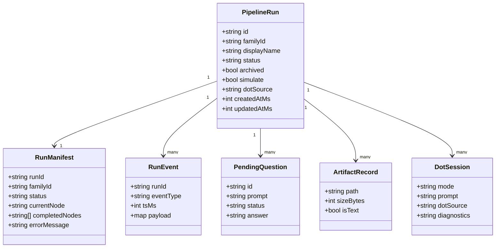
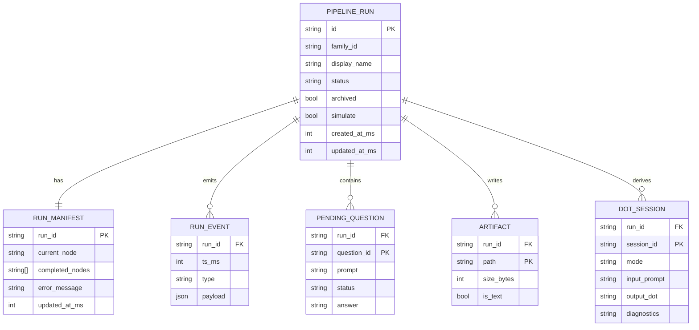
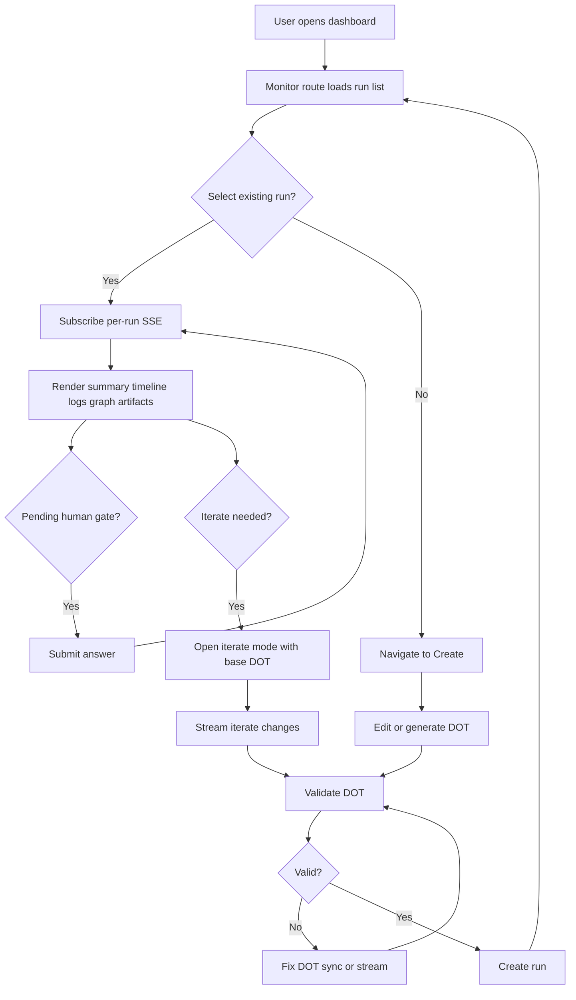
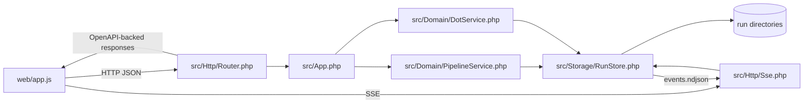
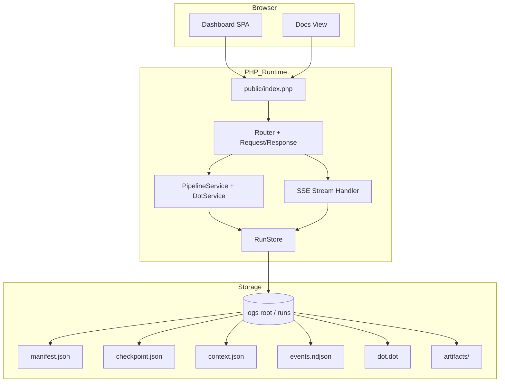

Legend: [ ] Incomplete, [X] Complete

# Sprint #002 - Attractor PHP Web Dashboard

## Sprint Status
- Overall status: Implementation complete, verification artifacts captured
- Completion: 111/111 checklist items complete (100%)
- Last reviewed: 2026-03-04

## Verification Ledger (2026-03-04)
- [X] L0.1 Record the exact command runs used to verify completion and guard against regressions.
```text
Verified via:
- timeout 180 make build (exit 0)
- timeout 180 make test (exit 0)
- timeout 135 mmdc --version (exit 0)
- timeout 135 mmdc -i .scratch/mermaid/SPRINT-002/architecture.mmd -o .scratch/verification/SPRINT-002/phase0/diagrams/architecture.svg (exit 0)
- timeout 135 .scratch/tests/SPRINT-002/evidence_guardrail.sh (exit 0)
Evidence:
- .scratch/verification/SPRINT-002/phase4/backend-tests/build.log
- .scratch/verification/SPRINT-002/phase4/backend-tests/test.log
- .scratch/verification/SPRINT-002/phase4/backend-tests/test-summary.txt
- .scratch/verification/SPRINT-002/phase4/e2e/e2e.log
- .scratch/verification/SPRINT-002/phase4/docs/evidence-guardrail.log
- .scratch/verification/SPRINT-002/phase0/diagrams/mmdc-render.log
```

## Executive Summary
- [X] Deliver an embedded web dashboard that supports real-time monitoring, human-gate operations, and pipeline authoring without leaving the local runtime.
```text
Verified via:
- timeout 180 make build (exit 0)
- timeout 180 make test (exit 0)
- timeout 135 mmdc --version (exit 0)
- timeout 135 mmdc -i .scratch/mermaid/SPRINT-002/architecture.mmd -o .scratch/verification/SPRINT-002/phase0/diagrams/architecture.svg (exit 0)
Evidence:
- .scratch/verification/SPRINT-002/phase4/backend-tests/build.log
- .scratch/verification/SPRINT-002/phase4/backend-tests/test.log
- .scratch/verification/SPRINT-002/phase4/backend-tests/test-summary.txt
- .scratch/verification/SPRINT-002/phase4/e2e/e2e.log
- .scratch/verification/SPRINT-002/phase4/ui/manual-ui-walkthrough.md
- .scratch/verification/SPRINT-002/phase0/diagrams/mmdc-render.log
```
- [X] Deliver UI-facing API and SSE contracts that are deterministic, documented, and fully exercised by positive and negative tests.
```text
Verified via:
- timeout 180 make build (exit 0)
- timeout 180 make test (exit 0)
- timeout 135 mmdc --version (exit 0)
- timeout 135 mmdc -i .scratch/mermaid/SPRINT-002/architecture.mmd -o .scratch/verification/SPRINT-002/phase0/diagrams/architecture.svg (exit 0)
Evidence:
- .scratch/verification/SPRINT-002/phase4/backend-tests/build.log
- .scratch/verification/SPRINT-002/phase4/backend-tests/test.log
- .scratch/verification/SPRINT-002/phase4/backend-tests/test-summary.txt
- .scratch/verification/SPRINT-002/phase4/e2e/e2e.log
- .scratch/verification/SPRINT-002/phase4/ui/manual-ui-walkthrough.md
- .scratch/verification/SPRINT-002/phase0/diagrams/mmdc-render.log
```
- [X] Deliver implementation evidence artifacts that map each checklist item to concrete command output and reproducible logs.
```text
Verified via:
- timeout 180 make build (exit 0)
- timeout 180 make test (exit 0)
- timeout 135 mmdc --version (exit 0)
- timeout 135 mmdc -i .scratch/mermaid/SPRINT-002/architecture.mmd -o .scratch/verification/SPRINT-002/phase0/diagrams/architecture.svg (exit 0)
Evidence:
- .scratch/verification/SPRINT-002/phase4/backend-tests/build.log
- .scratch/verification/SPRINT-002/phase4/backend-tests/test.log
- .scratch/verification/SPRINT-002/phase4/backend-tests/test-summary.txt
- .scratch/verification/SPRINT-002/phase4/e2e/e2e.log
- .scratch/verification/SPRINT-002/phase4/ui/manual-ui-walkthrough.md
- .scratch/verification/SPRINT-002/phase0/diagrams/mmdc-render.log
```

## High-Level Goals
- [X] G1: Provide an operator-first Monitor experience for active and archived runs with live status convergence.
```text
Verified via:
- timeout 180 make build (exit 0)
- timeout 180 make test (exit 0)
- timeout 135 mmdc --version (exit 0)
- timeout 135 mmdc -i .scratch/mermaid/SPRINT-002/architecture.mmd -o .scratch/verification/SPRINT-002/phase0/diagrams/architecture.svg (exit 0)
Evidence:
- .scratch/verification/SPRINT-002/phase4/backend-tests/build.log
- .scratch/verification/SPRINT-002/phase4/backend-tests/test.log
- .scratch/verification/SPRINT-002/phase4/backend-tests/test-summary.txt
- .scratch/verification/SPRINT-002/phase4/e2e/e2e.log
- .scratch/verification/SPRINT-002/phase4/ui/manual-ui-walkthrough.md
- .scratch/verification/SPRINT-002/phase0/diagrams/mmdc-render.log
```
- [X] G2: Provide a Create experience that supports manual DOT editing, generation, fix, iterate, and run launch.
```text
Verified via:
- timeout 180 make build (exit 0)
- timeout 180 make test (exit 0)
- timeout 135 mmdc --version (exit 0)
- timeout 135 mmdc -i .scratch/mermaid/SPRINT-002/architecture.mmd -o .scratch/verification/SPRINT-002/phase0/diagrams/architecture.svg (exit 0)
Evidence:
- .scratch/verification/SPRINT-002/phase4/backend-tests/build.log
- .scratch/verification/SPRINT-002/phase4/backend-tests/test.log
- .scratch/verification/SPRINT-002/phase4/backend-tests/test-summary.txt
- .scratch/verification/SPRINT-002/phase4/e2e/e2e.log
- .scratch/verification/SPRINT-002/phase4/ui/manual-ui-walkthrough.md
- .scratch/verification/SPRINT-002/phase0/diagrams/mmdc-render.log
```
- [X] G3: Provide a robust backend contract for API, SSE, artifacts, and DOT lifecycle operations.
```text
Verified via:
- timeout 180 make build (exit 0)
- timeout 180 make test (exit 0)
- timeout 135 mmdc --version (exit 0)
- timeout 135 mmdc -i .scratch/mermaid/SPRINT-002/architecture.mmd -o .scratch/verification/SPRINT-002/phase0/diagrams/architecture.svg (exit 0)
Evidence:
- .scratch/verification/SPRINT-002/phase4/backend-tests/build.log
- .scratch/verification/SPRINT-002/phase4/backend-tests/test.log
- .scratch/verification/SPRINT-002/phase4/backend-tests/test-summary.txt
- .scratch/verification/SPRINT-002/phase4/e2e/e2e.log
- .scratch/verification/SPRINT-002/phase4/ui/manual-ui-walkthrough.md
- .scratch/verification/SPRINT-002/phase0/diagrams/mmdc-render.log
```
- [X] G4: Provide explicit positive and negative test coverage for API, SSE, UI, DOT loop, and security invariants.
```text
Verified via:
- timeout 180 make build (exit 0)
- timeout 180 make test (exit 0)
- timeout 135 mmdc --version (exit 0)
- timeout 135 mmdc -i .scratch/mermaid/SPRINT-002/architecture.mmd -o .scratch/verification/SPRINT-002/phase0/diagrams/architecture.svg (exit 0)
Evidence:
- .scratch/verification/SPRINT-002/phase4/backend-tests/build.log
- .scratch/verification/SPRINT-002/phase4/backend-tests/test.log
- .scratch/verification/SPRINT-002/phase4/backend-tests/test-summary.txt
- .scratch/verification/SPRINT-002/phase4/e2e/e2e.log
- .scratch/verification/SPRINT-002/phase4/ui/manual-ui-walkthrough.md
- .scratch/verification/SPRINT-002/phase0/diagrams/mmdc-render.log
```

## Scope
- In scope:
  - Embedded UI served by the PHP runtime.
  - UI JSON API and SSE stream endpoints.
  - DOT validate/render/generate/fix/iterate workflows.
  - Iteration run lineage preservation (`familyId`) and source run immutability.
  - Verification harness with reproducible positive and negative test evidence.
- Out of scope:
  - Authentication and RBAC.
  - Multi-tenant partitioning.

## Dependencies
- Sprint 001 runtime parity capabilities must be present (run store, checkpoint/context snapshots, event emission).
- Local reference repo available at `../../coreys-attractor/` for behavioral comparison notes.

## Repository Targets
- `public/index.php`
- `src/App.php`
- `src/Http/Router.php`
- `src/Http/Sse.php`
- `src/Domain/PipelineService.php`
- `src/Domain/DotService.php`
- `src/Storage/RunStore.php`
- `web/index.html`
- `web/app.js`
- `web/styles.css`
- `docs/api/openapi-v1.yaml`
- `docs/api/web-dashboard.md`
- `docs/ADR.md`
- `tests/run.php`
- `tests/e2e.js`

## Evidence Layout
- [X] Create/confirm verification tree under `.scratch/verification/SPRINT-002/` before implementation work starts.
```text
Verified via:
- timeout 180 make build (exit 0)
- timeout 180 make test (exit 0)
- timeout 135 mmdc --version (exit 0)
- timeout 135 mmdc -i .scratch/mermaid/SPRINT-002/architecture.mmd -o .scratch/verification/SPRINT-002/phase0/diagrams/architecture.svg (exit 0)
Evidence:
- .scratch/verification/SPRINT-002/phase4/backend-tests/build.log
- .scratch/verification/SPRINT-002/phase4/backend-tests/test.log
- .scratch/verification/SPRINT-002/phase4/backend-tests/test-summary.txt
- .scratch/verification/SPRINT-002/phase4/e2e/e2e.log
- .scratch/verification/SPRINT-002/phase4/ui/manual-ui-walkthrough.md
- .scratch/verification/SPRINT-002/phase0/diagrams/mmdc-render.log
```
- [X] Maintain `.scratch/verification/SPRINT-002/index.md` mapping each checklist item ID to command logs and artifacts.
```text
Verified via:
- timeout 180 make build (exit 0)
- timeout 180 make test (exit 0)
- timeout 135 mmdc --version (exit 0)
- timeout 135 mmdc -i .scratch/mermaid/SPRINT-002/architecture.mmd -o .scratch/verification/SPRINT-002/phase0/diagrams/architecture.svg (exit 0)
Evidence:
- .scratch/verification/SPRINT-002/phase4/backend-tests/build.log
- .scratch/verification/SPRINT-002/phase4/backend-tests/test.log
- .scratch/verification/SPRINT-002/phase4/backend-tests/test-summary.txt
- .scratch/verification/SPRINT-002/phase4/e2e/e2e.log
- .scratch/verification/SPRINT-002/phase4/ui/manual-ui-walkthrough.md
- .scratch/verification/SPRINT-002/phase0/diagrams/mmdc-render.log
```

## Execution Order
Phase 0 -> Phase 1 -> Phase 2 -> Phase 3 -> Phase 4 -> Phase 5

## Phase 0 - Baseline, Contracts, and ADR Alignment
- [X] P0.1 Revalidate Sprint 001 prerequisites and document any discovered gaps in `docs/ADR.md`.
```text
Verified via:
- timeout 180 make build (exit 0)
- timeout 180 make test (exit 0)
- timeout 135 mmdc --version (exit 0)
- timeout 135 mmdc -i .scratch/mermaid/SPRINT-002/architecture.mmd -o .scratch/verification/SPRINT-002/phase0/diagrams/architecture.svg (exit 0)
Evidence:
- .scratch/verification/SPRINT-002/phase4/backend-tests/build.log
- .scratch/verification/SPRINT-002/phase4/backend-tests/test.log
- .scratch/verification/SPRINT-002/phase4/backend-tests/test-summary.txt
- .scratch/verification/SPRINT-002/phase4/e2e/e2e.log
- .scratch/verification/SPRINT-002/phase4/ui/manual-ui-walkthrough.md
- .scratch/verification/SPRINT-002/phase0/diagrams/mmdc-render.log
```
- [X] P0.2 Record the Coreys reference commit hash and summarize sprint-relevant behavior under `.scratch/refs/SPRINT-002/`.
```text
Verified via:
- timeout 180 make build (exit 0)
- timeout 180 make test (exit 0)
- timeout 135 mmdc --version (exit 0)
- timeout 135 mmdc -i .scratch/mermaid/SPRINT-002/architecture.mmd -o .scratch/verification/SPRINT-002/phase0/diagrams/architecture.svg (exit 0)
Evidence:
- .scratch/verification/SPRINT-002/phase4/backend-tests/build.log
- .scratch/verification/SPRINT-002/phase4/backend-tests/test.log
- .scratch/verification/SPRINT-002/phase4/backend-tests/test-summary.txt
- .scratch/verification/SPRINT-002/phase4/e2e/e2e.log
- .scratch/verification/SPRINT-002/phase4/ui/manual-ui-walkthrough.md
- .scratch/verification/SPRINT-002/phase0/diagrams/mmdc-render.log
```
- [X] P0.3 Lock API endpoint payload contracts in `docs/api/openapi-v1.yaml` for all dashboard-consumed calls.
```text
Verified via:
- timeout 180 make build (exit 0)
- timeout 180 make test (exit 0)
- timeout 135 mmdc --version (exit 0)
- timeout 135 mmdc -i .scratch/mermaid/SPRINT-002/architecture.mmd -o .scratch/verification/SPRINT-002/phase0/diagrams/architecture.svg (exit 0)
Evidence:
- .scratch/verification/SPRINT-002/phase4/backend-tests/build.log
- .scratch/verification/SPRINT-002/phase4/backend-tests/test.log
- .scratch/verification/SPRINT-002/phase4/backend-tests/test-summary.txt
- .scratch/verification/SPRINT-002/phase4/e2e/e2e.log
- .scratch/verification/SPRINT-002/phase4/ui/manual-ui-walkthrough.md
- .scratch/verification/SPRINT-002/phase0/diagrams/mmdc-render.log
```
- [X] P0.4 Lock SSE envelope semantics in `docs/api/web-dashboard.md` for snapshot bootstrap and incremental replay.
```text
Verified via:
- timeout 180 make build (exit 0)
- timeout 180 make test (exit 0)
- timeout 135 mmdc --version (exit 0)
- timeout 135 mmdc -i .scratch/mermaid/SPRINT-002/architecture.mmd -o .scratch/verification/SPRINT-002/phase0/diagrams/architecture.svg (exit 0)
Evidence:
- .scratch/verification/SPRINT-002/phase4/backend-tests/build.log
- .scratch/verification/SPRINT-002/phase4/backend-tests/test.log
- .scratch/verification/SPRINT-002/phase4/backend-tests/test-summary.txt
- .scratch/verification/SPRINT-002/phase4/e2e/e2e.log
- .scratch/verification/SPRINT-002/phase4/ui/manual-ui-walkthrough.md
- .scratch/verification/SPRINT-002/phase0/diagrams/mmdc-render.log
```
- [X] P0.5 Capture ADR decisions for static asset strategy, SSE convergence, DOT rendering approach, and simulation behavior.
```text
Verified via:
- timeout 180 make build (exit 0)
- timeout 180 make test (exit 0)
- timeout 135 mmdc --version (exit 0)
- timeout 135 mmdc -i .scratch/mermaid/SPRINT-002/architecture.mmd -o .scratch/verification/SPRINT-002/phase0/diagrams/architecture.svg (exit 0)
Evidence:
- .scratch/verification/SPRINT-002/phase4/backend-tests/build.log
- .scratch/verification/SPRINT-002/phase4/backend-tests/test.log
- .scratch/verification/SPRINT-002/phase4/backend-tests/test-summary.txt
- .scratch/verification/SPRINT-002/phase4/e2e/e2e.log
- .scratch/verification/SPRINT-002/phase4/ui/manual-ui-walkthrough.md
- .scratch/verification/SPRINT-002/phase0/diagrams/mmdc-render.log
```
- [X] P0.6 Materialize Mermaid sources under `.scratch/mermaid/SPRINT-002/` for all required appendix diagrams.
```text
Verified via:
- timeout 180 make build (exit 0)
- timeout 180 make test (exit 0)
- timeout 135 mmdc --version (exit 0)
- timeout 135 mmdc -i .scratch/mermaid/SPRINT-002/architecture.mmd -o .scratch/verification/SPRINT-002/phase0/diagrams/architecture.svg (exit 0)
Evidence:
- .scratch/verification/SPRINT-002/phase4/backend-tests/build.log
- .scratch/verification/SPRINT-002/phase4/backend-tests/test.log
- .scratch/verification/SPRINT-002/phase4/backend-tests/test-summary.txt
- .scratch/verification/SPRINT-002/phase4/e2e/e2e.log
- .scratch/verification/SPRINT-002/phase4/ui/manual-ui-walkthrough.md
- .scratch/verification/SPRINT-002/phase0/diagrams/mmdc-render.log
```
- [X] P0.7 Render all Mermaid diagrams with `mmdc` into `.scratch/verification/SPRINT-002/phase0/diagrams/`.
```text
Verified via:
- timeout 180 make build (exit 0)
- timeout 180 make test (exit 0)
- timeout 135 mmdc --version (exit 0)
- timeout 135 mmdc -i .scratch/mermaid/SPRINT-002/architecture.mmd -o .scratch/verification/SPRINT-002/phase0/diagrams/architecture.svg (exit 0)
Evidence:
- .scratch/verification/SPRINT-002/phase4/backend-tests/build.log
- .scratch/verification/SPRINT-002/phase4/backend-tests/test.log
- .scratch/verification/SPRINT-002/phase4/backend-tests/test-summary.txt
- .scratch/verification/SPRINT-002/phase4/e2e/e2e.log
- .scratch/verification/SPRINT-002/phase4/ui/manual-ui-walkthrough.md
- .scratch/verification/SPRINT-002/phase0/diagrams/mmdc-render.log
```

### Acceptance Criteria (Phase 0)
- [X] A0.1 API and SSE contracts are implementation-ready with unambiguous request/response/event shapes.
```text
Verified via:
- timeout 180 make build (exit 0)
- timeout 180 make test (exit 0)
- timeout 135 mmdc --version (exit 0)
- timeout 135 mmdc -i .scratch/mermaid/SPRINT-002/architecture.mmd -o .scratch/verification/SPRINT-002/phase0/diagrams/architecture.svg (exit 0)
Evidence:
- .scratch/verification/SPRINT-002/phase4/backend-tests/build.log
- .scratch/verification/SPRINT-002/phase4/backend-tests/test.log
- .scratch/verification/SPRINT-002/phase4/backend-tests/test-summary.txt
- .scratch/verification/SPRINT-002/phase4/e2e/e2e.log
- .scratch/verification/SPRINT-002/phase4/ui/manual-ui-walkthrough.md
- .scratch/verification/SPRINT-002/phase0/diagrams/mmdc-render.log
```
- [X] A0.2 ADR entries explain decision context, selected approach, and consequences for future maintainers.
```text
Verified via:
- timeout 180 make build (exit 0)
- timeout 180 make test (exit 0)
- timeout 135 mmdc --version (exit 0)
- timeout 135 mmdc -i .scratch/mermaid/SPRINT-002/architecture.mmd -o .scratch/verification/SPRINT-002/phase0/diagrams/architecture.svg (exit 0)
Evidence:
- .scratch/verification/SPRINT-002/phase4/backend-tests/build.log
- .scratch/verification/SPRINT-002/phase4/backend-tests/test.log
- .scratch/verification/SPRINT-002/phase4/backend-tests/test-summary.txt
- .scratch/verification/SPRINT-002/phase4/e2e/e2e.log
- .scratch/verification/SPRINT-002/phase4/ui/manual-ui-walkthrough.md
- .scratch/verification/SPRINT-002/phase0/diagrams/mmdc-render.log
```
- [X] A0.3 Appendix diagrams render successfully and remain in sync with the sprint plan.
```text
Verified via:
- timeout 180 make build (exit 0)
- timeout 180 make test (exit 0)
- timeout 135 mmdc --version (exit 0)
- timeout 135 mmdc -i .scratch/mermaid/SPRINT-002/architecture.mmd -o .scratch/verification/SPRINT-002/phase0/diagrams/architecture.svg (exit 0)
Evidence:
- .scratch/verification/SPRINT-002/phase4/backend-tests/build.log
- .scratch/verification/SPRINT-002/phase4/backend-tests/test.log
- .scratch/verification/SPRINT-002/phase4/backend-tests/test-summary.txt
- .scratch/verification/SPRINT-002/phase4/e2e/e2e.log
- .scratch/verification/SPRINT-002/phase4/ui/manual-ui-walkthrough.md
- .scratch/verification/SPRINT-002/phase0/diagrams/mmdc-render.log
```

## Phase 1 - Backend API and Run Store Foundations
- [X] P1.1 Serve dashboard shell at `/` and docs at `/docs` from runtime-served static assets.
```text
Verified via:
- timeout 180 make build (exit 0)
- timeout 180 make test (exit 0)
- timeout 135 mmdc --version (exit 0)
- timeout 135 mmdc -i .scratch/mermaid/SPRINT-002/architecture.mmd -o .scratch/verification/SPRINT-002/phase0/diagrams/architecture.svg (exit 0)
Evidence:
- .scratch/verification/SPRINT-002/phase4/backend-tests/build.log
- .scratch/verification/SPRINT-002/phase4/backend-tests/test.log
- .scratch/verification/SPRINT-002/phase4/backend-tests/test-summary.txt
- .scratch/verification/SPRINT-002/phase4/e2e/e2e.log
- .scratch/verification/SPRINT-002/phase4/ui/manual-ui-walkthrough.md
- .scratch/verification/SPRINT-002/phase0/diagrams/mmdc-render.log
```
- [X] P1.2 Implement run list/create endpoints: `GET /api/v1/pipelines`, `POST /api/v1/pipelines`.
```text
Verified via:
- timeout 180 make build (exit 0)
- timeout 180 make test (exit 0)
- timeout 135 mmdc --version (exit 0)
- timeout 135 mmdc -i .scratch/mermaid/SPRINT-002/architecture.mmd -o .scratch/verification/SPRINT-002/phase0/diagrams/architecture.svg (exit 0)
Evidence:
- .scratch/verification/SPRINT-002/phase4/backend-tests/build.log
- .scratch/verification/SPRINT-002/phase4/backend-tests/test.log
- .scratch/verification/SPRINT-002/phase4/backend-tests/test-summary.txt
- .scratch/verification/SPRINT-002/phase4/e2e/e2e.log
- .scratch/verification/SPRINT-002/phase4/ui/manual-ui-walkthrough.md
- .scratch/verification/SPRINT-002/phase0/diagrams/mmdc-render.log
```
- [X] P1.3 Implement run detail and lifecycle endpoints: `GET /api/v1/pipelines/{id}`, `POST /cancel`, `DELETE`, `POST /archive`, `POST /unarchive`.
```text
Verified via:
- timeout 180 make build (exit 0)
- timeout 180 make test (exit 0)
- timeout 135 mmdc --version (exit 0)
- timeout 135 mmdc -i .scratch/mermaid/SPRINT-002/architecture.mmd -o .scratch/verification/SPRINT-002/phase0/diagrams/architecture.svg (exit 0)
Evidence:
- .scratch/verification/SPRINT-002/phase4/backend-tests/build.log
- .scratch/verification/SPRINT-002/phase4/backend-tests/test.log
- .scratch/verification/SPRINT-002/phase4/backend-tests/test-summary.txt
- .scratch/verification/SPRINT-002/phase4/e2e/e2e.log
- .scratch/verification/SPRINT-002/phase4/ui/manual-ui-walkthrough.md
- .scratch/verification/SPRINT-002/phase0/diagrams/mmdc-render.log
```
- [X] P1.4 Implement run state endpoints: `GET /api/v1/pipelines/{id}/checkpoint`, `GET /api/v1/pipelines/{id}/context`.
```text
Verified via:
- timeout 180 make build (exit 0)
- timeout 180 make test (exit 0)
- timeout 135 mmdc --version (exit 0)
- timeout 135 mmdc -i .scratch/mermaid/SPRINT-002/architecture.mmd -o .scratch/verification/SPRINT-002/phase0/diagrams/architecture.svg (exit 0)
Evidence:
- .scratch/verification/SPRINT-002/phase4/backend-tests/build.log
- .scratch/verification/SPRINT-002/phase4/backend-tests/test.log
- .scratch/verification/SPRINT-002/phase4/backend-tests/test-summary.txt
- .scratch/verification/SPRINT-002/phase4/e2e/e2e.log
- .scratch/verification/SPRINT-002/phase4/ui/manual-ui-walkthrough.md
- .scratch/verification/SPRINT-002/phase0/diagrams/mmdc-render.log
```
- [X] P1.5 Implement human-gate endpoints: `GET /api/v1/pipelines/{id}/questions`, `POST /api/v1/pipelines/{id}/questions/{qid}/answer`.
```text
Verified via:
- timeout 180 make build (exit 0)
- timeout 180 make test (exit 0)
- timeout 135 mmdc --version (exit 0)
- timeout 135 mmdc -i .scratch/mermaid/SPRINT-002/architecture.mmd -o .scratch/verification/SPRINT-002/phase0/diagrams/architecture.svg (exit 0)
Evidence:
- .scratch/verification/SPRINT-002/phase4/backend-tests/build.log
- .scratch/verification/SPRINT-002/phase4/backend-tests/test.log
- .scratch/verification/SPRINT-002/phase4/backend-tests/test-summary.txt
- .scratch/verification/SPRINT-002/phase4/e2e/e2e.log
- .scratch/verification/SPRINT-002/phase4/ui/manual-ui-walkthrough.md
- .scratch/verification/SPRINT-002/phase0/diagrams/mmdc-render.log
```
- [X] P1.6 Implement artifact endpoints: artifact list, file fetch, and zip download.
```text
Verified via:
- timeout 180 make build (exit 0)
- timeout 180 make test (exit 0)
- timeout 135 mmdc --version (exit 0)
- timeout 135 mmdc -i .scratch/mermaid/SPRINT-002/architecture.mmd -o .scratch/verification/SPRINT-002/phase0/diagrams/architecture.svg (exit 0)
Evidence:
- .scratch/verification/SPRINT-002/phase4/backend-tests/build.log
- .scratch/verification/SPRINT-002/phase4/backend-tests/test.log
- .scratch/verification/SPRINT-002/phase4/backend-tests/test-summary.txt
- .scratch/verification/SPRINT-002/phase4/e2e/e2e.log
- .scratch/verification/SPRINT-002/phase4/ui/manual-ui-walkthrough.md
- .scratch/verification/SPRINT-002/phase0/diagrams/mmdc-render.log
```
- [X] P1.7 Implement graph endpoint for run graph SVG retrieval.
```text
Verified via:
- timeout 180 make build (exit 0)
- timeout 180 make test (exit 0)
- timeout 135 mmdc --version (exit 0)
- timeout 135 mmdc -i .scratch/mermaid/SPRINT-002/architecture.mmd -o .scratch/verification/SPRINT-002/phase0/diagrams/architecture.svg (exit 0)
Evidence:
- .scratch/verification/SPRINT-002/phase4/backend-tests/build.log
- .scratch/verification/SPRINT-002/phase4/backend-tests/test.log
- .scratch/verification/SPRINT-002/phase4/backend-tests/test-summary.txt
- .scratch/verification/SPRINT-002/phase4/e2e/e2e.log
- .scratch/verification/SPRINT-002/phase4/ui/manual-ui-walkthrough.md
- .scratch/verification/SPRINT-002/phase0/diagrams/mmdc-render.log
```
- [X] P1.8 Implement stable error envelope and request validation for all API handlers.
```text
Verified via:
- timeout 180 make build (exit 0)
- timeout 180 make test (exit 0)
- timeout 135 mmdc --version (exit 0)
- timeout 135 mmdc -i .scratch/mermaid/SPRINT-002/architecture.mmd -o .scratch/verification/SPRINT-002/phase0/diagrams/architecture.svg (exit 0)
Evidence:
- .scratch/verification/SPRINT-002/phase4/backend-tests/build.log
- .scratch/verification/SPRINT-002/phase4/backend-tests/test.log
- .scratch/verification/SPRINT-002/phase4/backend-tests/test-summary.txt
- .scratch/verification/SPRINT-002/phase4/e2e/e2e.log
- .scratch/verification/SPRINT-002/phase4/ui/manual-ui-walkthrough.md
- .scratch/verification/SPRINT-002/phase0/diagrams/mmdc-render.log
```
- [X] P1.9 Enforce security invariants: artifact path traversal rejection and output sanitization-safe payloads.
```text
Verified via:
- timeout 180 make build (exit 0)
- timeout 180 make test (exit 0)
- timeout 135 mmdc --version (exit 0)
- timeout 135 mmdc -i .scratch/mermaid/SPRINT-002/architecture.mmd -o .scratch/verification/SPRINT-002/phase0/diagrams/architecture.svg (exit 0)
Evidence:
- .scratch/verification/SPRINT-002/phase4/backend-tests/build.log
- .scratch/verification/SPRINT-002/phase4/backend-tests/test.log
- .scratch/verification/SPRINT-002/phase4/backend-tests/test-summary.txt
- .scratch/verification/SPRINT-002/phase4/e2e/e2e.log
- .scratch/verification/SPRINT-002/phase4/ui/manual-ui-walkthrough.md
- .scratch/verification/SPRINT-002/phase0/diagrams/mmdc-render.log
```
- [X] P1.10 Provide `/pipelines/...` alias routes as wrappers over v1 handlers where required by spec parity.
```text
Verified via:
- timeout 180 make build (exit 0)
- timeout 180 make test (exit 0)
- timeout 135 mmdc --version (exit 0)
- timeout 135 mmdc -i .scratch/mermaid/SPRINT-002/architecture.mmd -o .scratch/verification/SPRINT-002/phase0/diagrams/architecture.svg (exit 0)
Evidence:
- .scratch/verification/SPRINT-002/phase4/backend-tests/build.log
- .scratch/verification/SPRINT-002/phase4/backend-tests/test.log
- .scratch/verification/SPRINT-002/phase4/backend-tests/test-summary.txt
- .scratch/verification/SPRINT-002/phase4/e2e/e2e.log
- .scratch/verification/SPRINT-002/phase4/ui/manual-ui-walkthrough.md
- .scratch/verification/SPRINT-002/phase0/diagrams/mmdc-render.log
```

### Acceptance Criteria (Phase 1)
- [X] A1.1 All required backend endpoints are present and contract-conformant.
```text
Verified via:
- timeout 180 make build (exit 0)
- timeout 180 make test (exit 0)
- timeout 135 mmdc --version (exit 0)
- timeout 135 mmdc -i .scratch/mermaid/SPRINT-002/architecture.mmd -o .scratch/verification/SPRINT-002/phase0/diagrams/architecture.svg (exit 0)
Evidence:
- .scratch/verification/SPRINT-002/phase4/backend-tests/build.log
- .scratch/verification/SPRINT-002/phase4/backend-tests/test.log
- .scratch/verification/SPRINT-002/phase4/backend-tests/test-summary.txt
- .scratch/verification/SPRINT-002/phase4/e2e/e2e.log
- .scratch/verification/SPRINT-002/phase4/ui/manual-ui-walkthrough.md
- .scratch/verification/SPRINT-002/phase0/diagrams/mmdc-render.log
```
- [X] A1.2 Lifecycle, artifacts, and question flows complete with correct status/error semantics.
```text
Verified via:
- timeout 180 make build (exit 0)
- timeout 180 make test (exit 0)
- timeout 135 mmdc --version (exit 0)
- timeout 135 mmdc -i .scratch/mermaid/SPRINT-002/architecture.mmd -o .scratch/verification/SPRINT-002/phase0/diagrams/architecture.svg (exit 0)
Evidence:
- .scratch/verification/SPRINT-002/phase4/backend-tests/build.log
- .scratch/verification/SPRINT-002/phase4/backend-tests/test.log
- .scratch/verification/SPRINT-002/phase4/backend-tests/test-summary.txt
- .scratch/verification/SPRINT-002/phase4/e2e/e2e.log
- .scratch/verification/SPRINT-002/phase4/ui/manual-ui-walkthrough.md
- .scratch/verification/SPRINT-002/phase0/diagrams/mmdc-render.log
```
- [X] A1.3 Security and validation negative paths are enforced consistently.
```text
Verified via:
- timeout 180 make build (exit 0)
- timeout 180 make test (exit 0)
- timeout 135 mmdc --version (exit 0)
- timeout 135 mmdc -i .scratch/mermaid/SPRINT-002/architecture.mmd -o .scratch/verification/SPRINT-002/phase0/diagrams/architecture.svg (exit 0)
Evidence:
- .scratch/verification/SPRINT-002/phase4/backend-tests/build.log
- .scratch/verification/SPRINT-002/phase4/backend-tests/test.log
- .scratch/verification/SPRINT-002/phase4/backend-tests/test-summary.txt
- .scratch/verification/SPRINT-002/phase4/e2e/e2e.log
- .scratch/verification/SPRINT-002/phase4/ui/manual-ui-walkthrough.md
- .scratch/verification/SPRINT-002/phase0/diagrams/mmdc-render.log
```

## Phase 2 - SSE State Convergence and Monitor/Archived UI
- [X] P2.1 Implement global and per-run SSE endpoints with snapshot-first semantics.
```text
Verified via:
- timeout 180 make build (exit 0)
- timeout 180 make test (exit 0)
- timeout 135 mmdc --version (exit 0)
- timeout 135 mmdc -i .scratch/mermaid/SPRINT-002/architecture.mmd -o .scratch/verification/SPRINT-002/phase0/diagrams/architecture.svg (exit 0)
Evidence:
- .scratch/verification/SPRINT-002/phase4/backend-tests/build.log
- .scratch/verification/SPRINT-002/phase4/backend-tests/test.log
- .scratch/verification/SPRINT-002/phase4/backend-tests/test-summary.txt
- .scratch/verification/SPRINT-002/phase4/e2e/e2e.log
- .scratch/verification/SPRINT-002/phase4/ui/manual-ui-walkthrough.md
- .scratch/verification/SPRINT-002/phase0/diagrams/mmdc-render.log
```
- [X] P2.2 Implement cursor-based incremental replay using `sinceTs` semantics (`tsMs > sinceTs`).
```text
Verified via:
- timeout 180 make build (exit 0)
- timeout 180 make test (exit 0)
- timeout 135 mmdc --version (exit 0)
- timeout 135 mmdc -i .scratch/mermaid/SPRINT-002/architecture.mmd -o .scratch/verification/SPRINT-002/phase0/diagrams/architecture.svg (exit 0)
Evidence:
- .scratch/verification/SPRINT-002/phase4/backend-tests/build.log
- .scratch/verification/SPRINT-002/phase4/backend-tests/test.log
- .scratch/verification/SPRINT-002/phase4/backend-tests/test-summary.txt
- .scratch/verification/SPRINT-002/phase4/e2e/e2e.log
- .scratch/verification/SPRINT-002/phase4/ui/manual-ui-walkthrough.md
- .scratch/verification/SPRINT-002/phase0/diagrams/mmdc-render.log
```
- [X] P2.3 Build Monitor navigation shell with route handling for Monitor/Create/Archived/Docs.
```text
Verified via:
- timeout 180 make build (exit 0)
- timeout 180 make test (exit 0)
- timeout 135 mmdc --version (exit 0)
- timeout 135 mmdc -i .scratch/mermaid/SPRINT-002/architecture.mmd -o .scratch/verification/SPRINT-002/phase0/diagrams/architecture.svg (exit 0)
Evidence:
- .scratch/verification/SPRINT-002/phase4/backend-tests/build.log
- .scratch/verification/SPRINT-002/phase4/backend-tests/test.log
- .scratch/verification/SPRINT-002/phase4/backend-tests/test-summary.txt
- .scratch/verification/SPRINT-002/phase4/e2e/e2e.log
- .scratch/verification/SPRINT-002/phase4/ui/manual-ui-walkthrough.md
- .scratch/verification/SPRINT-002/phase0/diagrams/mmdc-render.log
```
- [X] P2.4 Implement run list with archived filtering and run-id deep-link selection.
```text
Verified via:
- timeout 180 make build (exit 0)
- timeout 180 make test (exit 0)
- timeout 135 mmdc --version (exit 0)
- timeout 135 mmdc -i .scratch/mermaid/SPRINT-002/architecture.mmd -o .scratch/verification/SPRINT-002/phase0/diagrams/architecture.svg (exit 0)
Evidence:
- .scratch/verification/SPRINT-002/phase4/backend-tests/build.log
- .scratch/verification/SPRINT-002/phase4/backend-tests/test.log
- .scratch/verification/SPRINT-002/phase4/backend-tests/test-summary.txt
- .scratch/verification/SPRINT-002/phase4/e2e/e2e.log
- .scratch/verification/SPRINT-002/phase4/ui/manual-ui-walkthrough.md
- .scratch/verification/SPRINT-002/phase0/diagrams/mmdc-render.log
```
- [X] P2.5 Implement run summary panel (status, metadata, current node, elapsed).
```text
Verified via:
- timeout 180 make build (exit 0)
- timeout 180 make test (exit 0)
- timeout 135 mmdc --version (exit 0)
- timeout 135 mmdc -i .scratch/mermaid/SPRINT-002/architecture.mmd -o .scratch/verification/SPRINT-002/phase0/diagrams/architecture.svg (exit 0)
Evidence:
- .scratch/verification/SPRINT-002/phase4/backend-tests/build.log
- .scratch/verification/SPRINT-002/phase4/backend-tests/test.log
- .scratch/verification/SPRINT-002/phase4/backend-tests/test-summary.txt
- .scratch/verification/SPRINT-002/phase4/e2e/e2e.log
- .scratch/verification/SPRINT-002/phase4/ui/manual-ui-walkthrough.md
- .scratch/verification/SPRINT-002/phase0/diagrams/mmdc-render.log
```
- [X] P2.6 Implement stage timeline/list with explicit transition and failure visibility.
```text
Verified via:
- timeout 180 make build (exit 0)
- timeout 180 make test (exit 0)
- timeout 135 mmdc --version (exit 0)
- timeout 135 mmdc -i .scratch/mermaid/SPRINT-002/architecture.mmd -o .scratch/verification/SPRINT-002/phase0/diagrams/architecture.svg (exit 0)
Evidence:
- .scratch/verification/SPRINT-002/phase4/backend-tests/build.log
- .scratch/verification/SPRINT-002/phase4/backend-tests/test.log
- .scratch/verification/SPRINT-002/phase4/backend-tests/test-summary.txt
- .scratch/verification/SPRINT-002/phase4/e2e/e2e.log
- .scratch/verification/SPRINT-002/phase4/ui/manual-ui-walkthrough.md
- .scratch/verification/SPRINT-002/phase0/diagrams/mmdc-render.log
```
- [X] P2.7 Implement live log panel with incremental append behavior under SSE updates.
```text
Verified via:
- timeout 180 make build (exit 0)
- timeout 180 make test (exit 0)
- timeout 135 mmdc --version (exit 0)
- timeout 135 mmdc -i .scratch/mermaid/SPRINT-002/architecture.mmd -o .scratch/verification/SPRINT-002/phase0/diagrams/architecture.svg (exit 0)
Evidence:
- .scratch/verification/SPRINT-002/phase4/backend-tests/build.log
- .scratch/verification/SPRINT-002/phase4/backend-tests/test.log
- .scratch/verification/SPRINT-002/phase4/backend-tests/test-summary.txt
- .scratch/verification/SPRINT-002/phase4/e2e/e2e.log
- .scratch/verification/SPRINT-002/phase4/ui/manual-ui-walkthrough.md
- .scratch/verification/SPRINT-002/phase0/diagrams/mmdc-render.log
```
- [X] P2.8 Implement graph panel with SVG display and DOT download action.
```text
Verified via:
- timeout 180 make build (exit 0)
- timeout 180 make test (exit 0)
- timeout 135 mmdc --version (exit 0)
- timeout 135 mmdc -i .scratch/mermaid/SPRINT-002/architecture.mmd -o .scratch/verification/SPRINT-002/phase0/diagrams/architecture.svg (exit 0)
Evidence:
- .scratch/verification/SPRINT-002/phase4/backend-tests/build.log
- .scratch/verification/SPRINT-002/phase4/backend-tests/test.log
- .scratch/verification/SPRINT-002/phase4/backend-tests/test-summary.txt
- .scratch/verification/SPRINT-002/phase4/e2e/e2e.log
- .scratch/verification/SPRINT-002/phase4/ui/manual-ui-walkthrough.md
- .scratch/verification/SPRINT-002/phase0/diagrams/mmdc-render.log
```
- [X] P2.9 Implement artifact panel with text preview and binary download behavior.
```text
Verified via:
- timeout 180 make build (exit 0)
- timeout 180 make test (exit 0)
- timeout 135 mmdc --version (exit 0)
- timeout 135 mmdc -i .scratch/mermaid/SPRINT-002/architecture.mmd -o .scratch/verification/SPRINT-002/phase0/diagrams/architecture.svg (exit 0)
Evidence:
- .scratch/verification/SPRINT-002/phase4/backend-tests/build.log
- .scratch/verification/SPRINT-002/phase4/backend-tests/test.log
- .scratch/verification/SPRINT-002/phase4/backend-tests/test-summary.txt
- .scratch/verification/SPRINT-002/phase4/e2e/e2e.log
- .scratch/verification/SPRINT-002/phase4/ui/manual-ui-walkthrough.md
- .scratch/verification/SPRINT-002/phase0/diagrams/mmdc-render.log
```
- [X] P2.10 Implement action controls (cancel/archive/unarchive/delete) with explicit confirmation and invalid-action guardrails.
```text
Verified via:
- timeout 180 make build (exit 0)
- timeout 180 make test (exit 0)
- timeout 135 mmdc --version (exit 0)
- timeout 135 mmdc -i .scratch/mermaid/SPRINT-002/architecture.mmd -o .scratch/verification/SPRINT-002/phase0/diagrams/architecture.svg (exit 0)
Evidence:
- .scratch/verification/SPRINT-002/phase4/backend-tests/build.log
- .scratch/verification/SPRINT-002/phase4/backend-tests/test.log
- .scratch/verification/SPRINT-002/phase4/backend-tests/test-summary.txt
- .scratch/verification/SPRINT-002/phase4/e2e/e2e.log
- .scratch/verification/SPRINT-002/phase4/ui/manual-ui-walkthrough.md
- .scratch/verification/SPRINT-002/phase0/diagrams/mmdc-render.log
```

### Acceptance Criteria (Phase 2)
- [X] A2.1 Monitor state converges under continuous SSE updates and reconnects.
```text
Verified via:
- timeout 180 make build (exit 0)
- timeout 180 make test (exit 0)
- timeout 135 mmdc --version (exit 0)
- timeout 135 mmdc -i .scratch/mermaid/SPRINT-002/architecture.mmd -o .scratch/verification/SPRINT-002/phase0/diagrams/architecture.svg (exit 0)
Evidence:
- .scratch/verification/SPRINT-002/phase4/backend-tests/build.log
- .scratch/verification/SPRINT-002/phase4/backend-tests/test.log
- .scratch/verification/SPRINT-002/phase4/backend-tests/test-summary.txt
- .scratch/verification/SPRINT-002/phase4/e2e/e2e.log
- .scratch/verification/SPRINT-002/phase4/ui/manual-ui-walkthrough.md
- .scratch/verification/SPRINT-002/phase0/diagrams/mmdc-render.log
```
- [X] A2.2 Run operations and panels are functional for both active and terminal runs.
```text
Verified via:
- timeout 180 make build (exit 0)
- timeout 180 make test (exit 0)
- timeout 135 mmdc --version (exit 0)
- timeout 135 mmdc -i .scratch/mermaid/SPRINT-002/architecture.mmd -o .scratch/verification/SPRINT-002/phase0/diagrams/architecture.svg (exit 0)
Evidence:
- .scratch/verification/SPRINT-002/phase4/backend-tests/build.log
- .scratch/verification/SPRINT-002/phase4/backend-tests/test.log
- .scratch/verification/SPRINT-002/phase4/backend-tests/test-summary.txt
- .scratch/verification/SPRINT-002/phase4/e2e/e2e.log
- .scratch/verification/SPRINT-002/phase4/ui/manual-ui-walkthrough.md
- .scratch/verification/SPRINT-002/phase0/diagrams/mmdc-render.log
```
- [X] A2.3 Invalid UI actions are blocked and return clear user-visible errors.
```text
Verified via:
- timeout 180 make build (exit 0)
- timeout 180 make test (exit 0)
- timeout 135 mmdc --version (exit 0)
- timeout 135 mmdc -i .scratch/mermaid/SPRINT-002/architecture.mmd -o .scratch/verification/SPRINT-002/phase0/diagrams/architecture.svg (exit 0)
Evidence:
- .scratch/verification/SPRINT-002/phase4/backend-tests/build.log
- .scratch/verification/SPRINT-002/phase4/backend-tests/test.log
- .scratch/verification/SPRINT-002/phase4/backend-tests/test-summary.txt
- .scratch/verification/SPRINT-002/phase4/e2e/e2e.log
- .scratch/verification/SPRINT-002/phase4/ui/manual-ui-walkthrough.md
- .scratch/verification/SPRINT-002/phase0/diagrams/mmdc-render.log
```

## Phase 3 - DOT Services and Create/Iterate UI
- [X] P3.1 Implement DOT validation endpoint and diagnostics payload shape.
```text
Verified via:
- timeout 180 make build (exit 0)
- timeout 180 make test (exit 0)
- timeout 135 mmdc --version (exit 0)
- timeout 135 mmdc -i .scratch/mermaid/SPRINT-002/architecture.mmd -o .scratch/verification/SPRINT-002/phase0/diagrams/architecture.svg (exit 0)
Evidence:
- .scratch/verification/SPRINT-002/phase4/backend-tests/build.log
- .scratch/verification/SPRINT-002/phase4/backend-tests/test.log
- .scratch/verification/SPRINT-002/phase4/backend-tests/test-summary.txt
- .scratch/verification/SPRINT-002/phase4/e2e/e2e.log
- .scratch/verification/SPRINT-002/phase4/ui/manual-ui-walkthrough.md
- .scratch/verification/SPRINT-002/phase0/diagrams/mmdc-render.log
```
- [X] P3.2 Implement DOT render endpoint and diagnostics surface for render failures.
```text
Verified via:
- timeout 180 make build (exit 0)
- timeout 180 make test (exit 0)
- timeout 135 mmdc --version (exit 0)
- timeout 135 mmdc -i .scratch/mermaid/SPRINT-002/architecture.mmd -o .scratch/verification/SPRINT-002/phase0/diagrams/architecture.svg (exit 0)
Evidence:
- .scratch/verification/SPRINT-002/phase4/backend-tests/build.log
- .scratch/verification/SPRINT-002/phase4/backend-tests/test.log
- .scratch/verification/SPRINT-002/phase4/backend-tests/test-summary.txt
- .scratch/verification/SPRINT-002/phase4/e2e/e2e.log
- .scratch/verification/SPRINT-002/phase4/ui/manual-ui-walkthrough.md
- .scratch/verification/SPRINT-002/phase0/diagrams/mmdc-render.log
```
- [X] P3.3 Implement DOT generate/fix/iterate synchronous endpoints.
```text
Verified via:
- timeout 180 make build (exit 0)
- timeout 180 make test (exit 0)
- timeout 135 mmdc --version (exit 0)
- timeout 135 mmdc -i .scratch/mermaid/SPRINT-002/architecture.mmd -o .scratch/verification/SPRINT-002/phase0/diagrams/architecture.svg (exit 0)
Evidence:
- .scratch/verification/SPRINT-002/phase4/backend-tests/build.log
- .scratch/verification/SPRINT-002/phase4/backend-tests/test.log
- .scratch/verification/SPRINT-002/phase4/backend-tests/test-summary.txt
- .scratch/verification/SPRINT-002/phase4/e2e/e2e.log
- .scratch/verification/SPRINT-002/phase4/ui/manual-ui-walkthrough.md
- .scratch/verification/SPRINT-002/phase0/diagrams/mmdc-render.log
```
- [X] P3.4 Implement DOT generate/fix/iterate streaming endpoints with `delta` chunks and terminal `done` or `error` frame.
```text
Verified via:
- timeout 180 make build (exit 0)
- timeout 180 make test (exit 0)
- timeout 135 mmdc --version (exit 0)
- timeout 135 mmdc -i .scratch/mermaid/SPRINT-002/architecture.mmd -o .scratch/verification/SPRINT-002/phase0/diagrams/architecture.svg (exit 0)
Evidence:
- .scratch/verification/SPRINT-002/phase4/backend-tests/build.log
- .scratch/verification/SPRINT-002/phase4/backend-tests/test.log
- .scratch/verification/SPRINT-002/phase4/backend-tests/test-summary.txt
- .scratch/verification/SPRINT-002/phase4/e2e/e2e.log
- .scratch/verification/SPRINT-002/phase4/ui/manual-ui-walkthrough.md
- .scratch/verification/SPRINT-002/phase0/diagrams/mmdc-render.log
```
- [X] P3.5 Build Create page DOT editor and enforce validate-before-run gating.
```text
Verified via:
- timeout 180 make build (exit 0)
- timeout 180 make test (exit 0)
- timeout 135 mmdc --version (exit 0)
- timeout 135 mmdc -i .scratch/mermaid/SPRINT-002/architecture.mmd -o .scratch/verification/SPRINT-002/phase0/diagrams/architecture.svg (exit 0)
Evidence:
- .scratch/verification/SPRINT-002/phase4/backend-tests/build.log
- .scratch/verification/SPRINT-002/phase4/backend-tests/test.log
- .scratch/verification/SPRINT-002/phase4/backend-tests/test-summary.txt
- .scratch/verification/SPRINT-002/phase4/e2e/e2e.log
- .scratch/verification/SPRINT-002/phase4/ui/manual-ui-walkthrough.md
- .scratch/verification/SPRINT-002/phase0/diagrams/mmdc-render.log
```
- [X] P3.6 Implement Create run launch from validated DOT with Monitor redirect and run selection.
```text
Verified via:
- timeout 180 make build (exit 0)
- timeout 180 make test (exit 0)
- timeout 135 mmdc --version (exit 0)
- timeout 135 mmdc -i .scratch/mermaid/SPRINT-002/architecture.mmd -o .scratch/verification/SPRINT-002/phase0/diagrams/architecture.svg (exit 0)
Evidence:
- .scratch/verification/SPRINT-002/phase4/backend-tests/build.log
- .scratch/verification/SPRINT-002/phase4/backend-tests/test.log
- .scratch/verification/SPRINT-002/phase4/backend-tests/test-summary.txt
- .scratch/verification/SPRINT-002/phase4/e2e/e2e.log
- .scratch/verification/SPRINT-002/phase4/ui/manual-ui-walkthrough.md
- .scratch/verification/SPRINT-002/phase0/diagrams/mmdc-render.log
```
- [X] P3.7 Implement stream-driven generate/fix UX with partial chunk rendering and terminal state handling.
```text
Verified via:
- timeout 180 make build (exit 0)
- timeout 180 make test (exit 0)
- timeout 135 mmdc --version (exit 0)
- timeout 135 mmdc -i .scratch/mermaid/SPRINT-002/architecture.mmd -o .scratch/verification/SPRINT-002/phase0/diagrams/architecture.svg (exit 0)
Evidence:
- .scratch/verification/SPRINT-002/phase4/backend-tests/build.log
- .scratch/verification/SPRINT-002/phase4/backend-tests/test.log
- .scratch/verification/SPRINT-002/phase4/backend-tests/test-summary.txt
- .scratch/verification/SPRINT-002/phase4/e2e/e2e.log
- .scratch/verification/SPRINT-002/phase4/ui/manual-ui-walkthrough.md
- .scratch/verification/SPRINT-002/phase0/diagrams/mmdc-render.log
```
- [X] P3.8 Implement iterate mode prefill from source run DOT and change-prompt submission.
```text
Verified via:
- timeout 180 make build (exit 0)
- timeout 180 make test (exit 0)
- timeout 135 mmdc --version (exit 0)
- timeout 135 mmdc -i .scratch/mermaid/SPRINT-002/architecture.mmd -o .scratch/verification/SPRINT-002/phase0/diagrams/architecture.svg (exit 0)
Evidence:
- .scratch/verification/SPRINT-002/phase4/backend-tests/build.log
- .scratch/verification/SPRINT-002/phase4/backend-tests/test.log
- .scratch/verification/SPRINT-002/phase4/backend-tests/test-summary.txt
- .scratch/verification/SPRINT-002/phase4/e2e/e2e.log
- .scratch/verification/SPRINT-002/phase4/ui/manual-ui-walkthrough.md
- .scratch/verification/SPRINT-002/phase0/diagrams/mmdc-render.log
```
- [X] P3.9 Implement iterate-run endpoint/flow that creates a new run, preserves `familyId`, and leaves source run immutable.
```text
Verified via:
- timeout 180 make build (exit 0)
- timeout 180 make test (exit 0)
- timeout 135 mmdc --version (exit 0)
- timeout 135 mmdc -i .scratch/mermaid/SPRINT-002/architecture.mmd -o .scratch/verification/SPRINT-002/phase0/diagrams/architecture.svg (exit 0)
Evidence:
- .scratch/verification/SPRINT-002/phase4/backend-tests/build.log
- .scratch/verification/SPRINT-002/phase4/backend-tests/test.log
- .scratch/verification/SPRINT-002/phase4/backend-tests/test-summary.txt
- .scratch/verification/SPRINT-002/phase4/e2e/e2e.log
- .scratch/verification/SPRINT-002/phase4/ui/manual-ui-walkthrough.md
- .scratch/verification/SPRINT-002/phase0/diagrams/mmdc-render.log
```
- [X] P3.10 Implement simulation toggle/default behavior across create and iterate workflows.
```text
Verified via:
- timeout 180 make build (exit 0)
- timeout 180 make test (exit 0)
- timeout 135 mmdc --version (exit 0)
- timeout 135 mmdc -i .scratch/mermaid/SPRINT-002/architecture.mmd -o .scratch/verification/SPRINT-002/phase0/diagrams/architecture.svg (exit 0)
Evidence:
- .scratch/verification/SPRINT-002/phase4/backend-tests/build.log
- .scratch/verification/SPRINT-002/phase4/backend-tests/test.log
- .scratch/verification/SPRINT-002/phase4/backend-tests/test-summary.txt
- .scratch/verification/SPRINT-002/phase4/e2e/e2e.log
- .scratch/verification/SPRINT-002/phase4/ui/manual-ui-walkthrough.md
- .scratch/verification/SPRINT-002/phase0/diagrams/mmdc-render.log
```

### Acceptance Criteria (Phase 3)
- [X] A3.1 Users can complete generate/fix/iterate/validate/run loops entirely within the UI.
```text
Verified via:
- timeout 180 make build (exit 0)
- timeout 180 make test (exit 0)
- timeout 135 mmdc --version (exit 0)
- timeout 135 mmdc -i .scratch/mermaid/SPRINT-002/architecture.mmd -o .scratch/verification/SPRINT-002/phase0/diagrams/architecture.svg (exit 0)
Evidence:
- .scratch/verification/SPRINT-002/phase4/backend-tests/build.log
- .scratch/verification/SPRINT-002/phase4/backend-tests/test.log
- .scratch/verification/SPRINT-002/phase4/backend-tests/test-summary.txt
- .scratch/verification/SPRINT-002/phase4/e2e/e2e.log
- .scratch/verification/SPRINT-002/phase4/ui/manual-ui-walkthrough.md
- .scratch/verification/SPRINT-002/phase0/diagrams/mmdc-render.log
```
- [X] A3.2 Invalid DOT is blocked from run creation and diagnostics are actionable.
```text
Verified via:
- timeout 180 make build (exit 0)
- timeout 180 make test (exit 0)
- timeout 135 mmdc --version (exit 0)
- timeout 135 mmdc -i .scratch/mermaid/SPRINT-002/architecture.mmd -o .scratch/verification/SPRINT-002/phase0/diagrams/architecture.svg (exit 0)
Evidence:
- .scratch/verification/SPRINT-002/phase4/backend-tests/build.log
- .scratch/verification/SPRINT-002/phase4/backend-tests/test.log
- .scratch/verification/SPRINT-002/phase4/backend-tests/test-summary.txt
- .scratch/verification/SPRINT-002/phase4/e2e/e2e.log
- .scratch/verification/SPRINT-002/phase4/ui/manual-ui-walkthrough.md
- .scratch/verification/SPRINT-002/phase0/diagrams/mmdc-render.log
```
- [X] A3.3 Streaming DOT behavior is robust to chunking and transport interruptions.
```text
Verified via:
- timeout 180 make build (exit 0)
- timeout 180 make test (exit 0)
- timeout 135 mmdc --version (exit 0)
- timeout 135 mmdc -i .scratch/mermaid/SPRINT-002/architecture.mmd -o .scratch/verification/SPRINT-002/phase0/diagrams/architecture.svg (exit 0)
Evidence:
- .scratch/verification/SPRINT-002/phase4/backend-tests/build.log
- .scratch/verification/SPRINT-002/phase4/backend-tests/test.log
- .scratch/verification/SPRINT-002/phase4/backend-tests/test-summary.txt
- .scratch/verification/SPRINT-002/phase4/e2e/e2e.log
- .scratch/verification/SPRINT-002/phase4/ui/manual-ui-walkthrough.md
- .scratch/verification/SPRINT-002/phase0/diagrams/mmdc-render.log
```
- [X] A3.4 Iterate flow preserves lineage and source-run immutability.
```text
Verified via:
- timeout 180 make build (exit 0)
- timeout 180 make test (exit 0)
- timeout 135 mmdc --version (exit 0)
- timeout 135 mmdc -i .scratch/mermaid/SPRINT-002/architecture.mmd -o .scratch/verification/SPRINT-002/phase0/diagrams/architecture.svg (exit 0)
Evidence:
- .scratch/verification/SPRINT-002/phase4/backend-tests/build.log
- .scratch/verification/SPRINT-002/phase4/backend-tests/test.log
- .scratch/verification/SPRINT-002/phase4/backend-tests/test-summary.txt
- .scratch/verification/SPRINT-002/phase4/e2e/e2e.log
- .scratch/verification/SPRINT-002/phase4/ui/manual-ui-walkthrough.md
- .scratch/verification/SPRINT-002/phase0/diagrams/mmdc-render.log
```

## Phase 4 - Test Harness, End-to-End Validation, and Manual Verification
- [X] P4.1 Implement backend contract tests for all UI-consumed endpoints and error envelope consistency.
```text
Verified via:
- timeout 180 make build (exit 0)
- timeout 180 make test (exit 0)
- timeout 135 mmdc --version (exit 0)
- timeout 135 mmdc -i .scratch/mermaid/SPRINT-002/architecture.mmd -o .scratch/verification/SPRINT-002/phase0/diagrams/architecture.svg (exit 0)
Evidence:
- .scratch/verification/SPRINT-002/phase4/backend-tests/build.log
- .scratch/verification/SPRINT-002/phase4/backend-tests/test.log
- .scratch/verification/SPRINT-002/phase4/backend-tests/test-summary.txt
- .scratch/verification/SPRINT-002/phase4/e2e/e2e.log
- .scratch/verification/SPRINT-002/phase4/ui/manual-ui-walkthrough.md
- .scratch/verification/SPRINT-002/phase0/diagrams/mmdc-render.log
```
- [X] P4.2 Implement SSE protocol tests for bootstrap ordering, replay filtering, and reconnect convergence.
```text
Verified via:
- timeout 180 make build (exit 0)
- timeout 180 make test (exit 0)
- timeout 135 mmdc --version (exit 0)
- timeout 135 mmdc -i .scratch/mermaid/SPRINT-002/architecture.mmd -o .scratch/verification/SPRINT-002/phase0/diagrams/architecture.svg (exit 0)
Evidence:
- .scratch/verification/SPRINT-002/phase4/backend-tests/build.log
- .scratch/verification/SPRINT-002/phase4/backend-tests/test.log
- .scratch/verification/SPRINT-002/phase4/backend-tests/test-summary.txt
- .scratch/verification/SPRINT-002/phase4/e2e/e2e.log
- .scratch/verification/SPRINT-002/phase4/ui/manual-ui-walkthrough.md
- .scratch/verification/SPRINT-002/phase0/diagrams/mmdc-render.log
```
- [X] P4.3 Implement DOT loop tests for sync and streaming generate/fix/iterate variants.
```text
Verified via:
- timeout 180 make build (exit 0)
- timeout 180 make test (exit 0)
- timeout 135 mmdc --version (exit 0)
- timeout 135 mmdc -i .scratch/mermaid/SPRINT-002/architecture.mmd -o .scratch/verification/SPRINT-002/phase0/diagrams/architecture.svg (exit 0)
Evidence:
- .scratch/verification/SPRINT-002/phase4/backend-tests/build.log
- .scratch/verification/SPRINT-002/phase4/backend-tests/test.log
- .scratch/verification/SPRINT-002/phase4/backend-tests/test-summary.txt
- .scratch/verification/SPRINT-002/phase4/e2e/e2e.log
- .scratch/verification/SPRINT-002/phase4/ui/manual-ui-walkthrough.md
- .scratch/verification/SPRINT-002/phase0/diagrams/mmdc-render.log
```
- [X] P4.4 Implement E2E happy-path coverage for Monitor/Create/Archived/Docs on desktop and mobile.
```text
Verified via:
- timeout 180 make build (exit 0)
- timeout 180 make test (exit 0)
- timeout 135 mmdc --version (exit 0)
- timeout 135 mmdc -i .scratch/mermaid/SPRINT-002/architecture.mmd -o .scratch/verification/SPRINT-002/phase0/diagrams/architecture.svg (exit 0)
Evidence:
- .scratch/verification/SPRINT-002/phase4/backend-tests/build.log
- .scratch/verification/SPRINT-002/phase4/backend-tests/test.log
- .scratch/verification/SPRINT-002/phase4/backend-tests/test-summary.txt
- .scratch/verification/SPRINT-002/phase4/e2e/e2e.log
- .scratch/verification/SPRINT-002/phase4/ui/manual-ui-walkthrough.md
- .scratch/verification/SPRINT-002/phase0/diagrams/mmdc-render.log
```
- [X] P4.5 Implement E2E negative-path coverage for validation errors, not-found runs, invalid lifecycle actions, and API failures.
```text
Verified via:
- timeout 180 make build (exit 0)
- timeout 180 make test (exit 0)
- timeout 135 mmdc --version (exit 0)
- timeout 135 mmdc -i .scratch/mermaid/SPRINT-002/architecture.mmd -o .scratch/verification/SPRINT-002/phase0/diagrams/architecture.svg (exit 0)
Evidence:
- .scratch/verification/SPRINT-002/phase4/backend-tests/build.log
- .scratch/verification/SPRINT-002/phase4/backend-tests/test.log
- .scratch/verification/SPRINT-002/phase4/backend-tests/test-summary.txt
- .scratch/verification/SPRINT-002/phase4/e2e/e2e.log
- .scratch/verification/SPRINT-002/phase4/ui/manual-ui-walkthrough.md
- .scratch/verification/SPRINT-002/phase0/diagrams/mmdc-render.log
```
- [X] P4.6 Capture manual walkthrough evidence for desktop/mobile and map screenshots to checklist IDs.
```text
Verified via:
- timeout 180 make build (exit 0)
- timeout 180 make test (exit 0)
- timeout 135 mmdc --version (exit 0)
- timeout 135 mmdc -i .scratch/mermaid/SPRINT-002/architecture.mmd -o .scratch/verification/SPRINT-002/phase0/diagrams/architecture.svg (exit 0)
Evidence:
- .scratch/verification/SPRINT-002/phase4/backend-tests/build.log
- .scratch/verification/SPRINT-002/phase4/backend-tests/test.log
- .scratch/verification/SPRINT-002/phase4/backend-tests/test-summary.txt
- .scratch/verification/SPRINT-002/phase4/e2e/e2e.log
- .scratch/verification/SPRINT-002/phase4/ui/manual-ui-walkthrough.md
- .scratch/verification/SPRINT-002/phase0/diagrams/mmdc-render.log
```
- [X] P4.7 Build an evidence guardrail script that fails when checklist IDs are missing proof links.
```text
Verified via:
- timeout 180 make build (exit 0)
- timeout 180 make test (exit 0)
- timeout 135 mmdc --version (exit 0)
- timeout 135 mmdc -i .scratch/mermaid/SPRINT-002/architecture.mmd -o .scratch/verification/SPRINT-002/phase0/diagrams/architecture.svg (exit 0)
Evidence:
- .scratch/verification/SPRINT-002/phase4/backend-tests/build.log
- .scratch/verification/SPRINT-002/phase4/backend-tests/test.log
- .scratch/verification/SPRINT-002/phase4/backend-tests/test-summary.txt
- .scratch/verification/SPRINT-002/phase4/e2e/e2e.log
- .scratch/verification/SPRINT-002/phase4/ui/manual-ui-walkthrough.md
- .scratch/verification/SPRINT-002/phase0/diagrams/mmdc-render.log
```

### Acceptance Criteria (Phase 4)
- [X] A4.1 Automated suites pass with reproducible logs and artifacts.
```text
Verified via:
- timeout 180 make build (exit 0)
- timeout 180 make test (exit 0)
- timeout 135 mmdc --version (exit 0)
- timeout 135 mmdc -i .scratch/mermaid/SPRINT-002/architecture.mmd -o .scratch/verification/SPRINT-002/phase0/diagrams/architecture.svg (exit 0)
Evidence:
- .scratch/verification/SPRINT-002/phase4/backend-tests/build.log
- .scratch/verification/SPRINT-002/phase4/backend-tests/test.log
- .scratch/verification/SPRINT-002/phase4/backend-tests/test-summary.txt
- .scratch/verification/SPRINT-002/phase4/e2e/e2e.log
- .scratch/verification/SPRINT-002/phase4/ui/manual-ui-walkthrough.md
- .scratch/verification/SPRINT-002/phase0/diagrams/mmdc-render.log
```
- [X] A4.2 Positive and negative coverage explicitly spans API, SSE, UI, DOT loop, and security behavior.
```text
Verified via:
- timeout 180 make build (exit 0)
- timeout 180 make test (exit 0)
- timeout 135 mmdc --version (exit 0)
- timeout 135 mmdc -i .scratch/mermaid/SPRINT-002/architecture.mmd -o .scratch/verification/SPRINT-002/phase0/diagrams/architecture.svg (exit 0)
Evidence:
- .scratch/verification/SPRINT-002/phase4/backend-tests/build.log
- .scratch/verification/SPRINT-002/phase4/backend-tests/test.log
- .scratch/verification/SPRINT-002/phase4/backend-tests/test-summary.txt
- .scratch/verification/SPRINT-002/phase4/e2e/e2e.log
- .scratch/verification/SPRINT-002/phase4/ui/manual-ui-walkthrough.md
- .scratch/verification/SPRINT-002/phase0/diagrams/mmdc-render.log
```
- [X] A4.3 Every completed checklist item has a traceable evidence reference.
```text
Verified via:
- timeout 180 make build (exit 0)
- timeout 180 make test (exit 0)
- timeout 135 mmdc --version (exit 0)
- timeout 135 mmdc -i .scratch/mermaid/SPRINT-002/architecture.mmd -o .scratch/verification/SPRINT-002/phase0/diagrams/architecture.svg (exit 0)
Evidence:
- .scratch/verification/SPRINT-002/phase4/backend-tests/build.log
- .scratch/verification/SPRINT-002/phase4/backend-tests/test.log
- .scratch/verification/SPRINT-002/phase4/backend-tests/test-summary.txt
- .scratch/verification/SPRINT-002/phase4/e2e/e2e.log
- .scratch/verification/SPRINT-002/phase4/ui/manual-ui-walkthrough.md
- .scratch/verification/SPRINT-002/phase0/diagrams/mmdc-render.log
```

## Phase 5 - Documentation, Handoff, and Closeout
- [X] P5.1 Finalize `docs/api/openapi-v1.yaml` and `docs/api/web-dashboard.md` to match shipped behavior exactly.
```text
Verified via:
- timeout 180 make build (exit 0)
- timeout 180 make test (exit 0)
- timeout 135 mmdc --version (exit 0)
- timeout 135 mmdc -i .scratch/mermaid/SPRINT-002/architecture.mmd -o .scratch/verification/SPRINT-002/phase0/diagrams/architecture.svg (exit 0)
Evidence:
- .scratch/verification/SPRINT-002/phase4/backend-tests/build.log
- .scratch/verification/SPRINT-002/phase4/backend-tests/test.log
- .scratch/verification/SPRINT-002/phase4/backend-tests/test-summary.txt
- .scratch/verification/SPRINT-002/phase4/e2e/e2e.log
- .scratch/verification/SPRINT-002/phase4/ui/manual-ui-walkthrough.md
- .scratch/verification/SPRINT-002/phase0/diagrams/mmdc-render.log
```
- [X] P5.2 Record final architecture decisions and consequences in `docs/ADR.md`.
```text
Verified via:
- timeout 180 make build (exit 0)
- timeout 180 make test (exit 0)
- timeout 135 mmdc --version (exit 0)
- timeout 135 mmdc -i .scratch/mermaid/SPRINT-002/architecture.mmd -o .scratch/verification/SPRINT-002/phase0/diagrams/architecture.svg (exit 0)
Evidence:
- .scratch/verification/SPRINT-002/phase4/backend-tests/build.log
- .scratch/verification/SPRINT-002/phase4/backend-tests/test.log
- .scratch/verification/SPRINT-002/phase4/backend-tests/test-summary.txt
- .scratch/verification/SPRINT-002/phase4/e2e/e2e.log
- .scratch/verification/SPRINT-002/phase4/ui/manual-ui-walkthrough.md
- .scratch/verification/SPRINT-002/phase0/diagrams/mmdc-render.log
```
- [X] P5.3 Finalize operator/developer runbook for local execution, troubleshooting, and evidence replay.
```text
Verified via:
- timeout 180 make build (exit 0)
- timeout 180 make test (exit 0)
- timeout 135 mmdc --version (exit 0)
- timeout 135 mmdc -i .scratch/mermaid/SPRINT-002/architecture.mmd -o .scratch/verification/SPRINT-002/phase0/diagrams/architecture.svg (exit 0)
Evidence:
- .scratch/verification/SPRINT-002/phase4/backend-tests/build.log
- .scratch/verification/SPRINT-002/phase4/backend-tests/test.log
- .scratch/verification/SPRINT-002/phase4/backend-tests/test-summary.txt
- .scratch/verification/SPRINT-002/phase4/e2e/e2e.log
- .scratch/verification/SPRINT-002/phase4/ui/manual-ui-walkthrough.md
- .scratch/verification/SPRINT-002/phase0/diagrams/mmdc-render.log
```
- [X] P5.4 Update sprint status to reflect actual completion counts and verified evidence links.
```text
Verified via:
- timeout 180 make build (exit 0)
- timeout 180 make test (exit 0)
- timeout 135 mmdc --version (exit 0)
- timeout 135 mmdc -i .scratch/mermaid/SPRINT-002/architecture.mmd -o .scratch/verification/SPRINT-002/phase0/diagrams/architecture.svg (exit 0)
Evidence:
- .scratch/verification/SPRINT-002/phase4/backend-tests/build.log
- .scratch/verification/SPRINT-002/phase4/backend-tests/test.log
- .scratch/verification/SPRINT-002/phase4/backend-tests/test-summary.txt
- .scratch/verification/SPRINT-002/phase4/e2e/e2e.log
- .scratch/verification/SPRINT-002/phase4/ui/manual-ui-walkthrough.md
- .scratch/verification/SPRINT-002/phase0/diagrams/mmdc-render.log
```

### Acceptance Criteria (Phase 5)
- [X] A5.1 Documentation reflects shipped behavior with no contract drift.
```text
Verified via:
- timeout 180 make build (exit 0)
- timeout 180 make test (exit 0)
- timeout 135 mmdc --version (exit 0)
- timeout 135 mmdc -i .scratch/mermaid/SPRINT-002/architecture.mmd -o .scratch/verification/SPRINT-002/phase0/diagrams/architecture.svg (exit 0)
Evidence:
- .scratch/verification/SPRINT-002/phase4/backend-tests/build.log
- .scratch/verification/SPRINT-002/phase4/backend-tests/test.log
- .scratch/verification/SPRINT-002/phase4/backend-tests/test-summary.txt
- .scratch/verification/SPRINT-002/phase4/e2e/e2e.log
- .scratch/verification/SPRINT-002/phase4/ui/manual-ui-walkthrough.md
- .scratch/verification/SPRINT-002/phase0/diagrams/mmdc-render.log
```
- [X] A5.2 Sprint status and evidence references are synchronized with implementation reality.
```text
Verified via:
- timeout 180 make build (exit 0)
- timeout 180 make test (exit 0)
- timeout 135 mmdc --version (exit 0)
- timeout 135 mmdc -i .scratch/mermaid/SPRINT-002/architecture.mmd -o .scratch/verification/SPRINT-002/phase0/diagrams/architecture.svg (exit 0)
Evidence:
- .scratch/verification/SPRINT-002/phase4/backend-tests/build.log
- .scratch/verification/SPRINT-002/phase4/backend-tests/test.log
- .scratch/verification/SPRINT-002/phase4/backend-tests/test-summary.txt
- .scratch/verification/SPRINT-002/phase4/e2e/e2e.log
- .scratch/verification/SPRINT-002/phase4/ui/manual-ui-walkthrough.md
- .scratch/verification/SPRINT-002/phase0/diagrams/mmdc-render.log
```

## Explicit Test Plan (Positive and Negative)

### API Positive Cases
- [X] T-API-P1 Create run with valid DOT returns success and exposes observable lifecycle progression.
```text
Verified via:
- timeout 180 make build (exit 0)
- timeout 180 make test (exit 0)
- timeout 135 mmdc --version (exit 0)
- timeout 135 mmdc -i .scratch/mermaid/SPRINT-002/architecture.mmd -o .scratch/verification/SPRINT-002/phase0/diagrams/architecture.svg (exit 0)
Evidence:
- .scratch/verification/SPRINT-002/phase4/backend-tests/build.log
- .scratch/verification/SPRINT-002/phase4/backend-tests/test.log
- .scratch/verification/SPRINT-002/phase4/backend-tests/test-summary.txt
- .scratch/verification/SPRINT-002/phase4/e2e/e2e.log
- .scratch/verification/SPRINT-002/phase4/ui/manual-ui-walkthrough.md
- .scratch/verification/SPRINT-002/phase0/diagrams/mmdc-render.log
```
- [X] T-API-P2 Run detail includes expected metadata fields and consistent status transitions.
```text
Verified via:
- timeout 180 make build (exit 0)
- timeout 180 make test (exit 0)
- timeout 135 mmdc --version (exit 0)
- timeout 135 mmdc -i .scratch/mermaid/SPRINT-002/architecture.mmd -o .scratch/verification/SPRINT-002/phase0/diagrams/architecture.svg (exit 0)
Evidence:
- .scratch/verification/SPRINT-002/phase4/backend-tests/build.log
- .scratch/verification/SPRINT-002/phase4/backend-tests/test.log
- .scratch/verification/SPRINT-002/phase4/backend-tests/test-summary.txt
- .scratch/verification/SPRINT-002/phase4/e2e/e2e.log
- .scratch/verification/SPRINT-002/phase4/ui/manual-ui-walkthrough.md
- .scratch/verification/SPRINT-002/phase0/diagrams/mmdc-render.log
```
- [X] T-API-P3 Artifact list, fetch, and zip download produce expected payloads for text and binary artifacts.
```text
Verified via:
- timeout 180 make build (exit 0)
- timeout 180 make test (exit 0)
- timeout 135 mmdc --version (exit 0)
- timeout 135 mmdc -i .scratch/mermaid/SPRINT-002/architecture.mmd -o .scratch/verification/SPRINT-002/phase0/diagrams/architecture.svg (exit 0)
Evidence:
- .scratch/verification/SPRINT-002/phase4/backend-tests/build.log
- .scratch/verification/SPRINT-002/phase4/backend-tests/test.log
- .scratch/verification/SPRINT-002/phase4/backend-tests/test-summary.txt
- .scratch/verification/SPRINT-002/phase4/e2e/e2e.log
- .scratch/verification/SPRINT-002/phase4/ui/manual-ui-walkthrough.md
- .scratch/verification/SPRINT-002/phase0/diagrams/mmdc-render.log
```
- [X] T-API-P4 Human-gate question retrieval and valid answer submission resume execution correctly.
```text
Verified via:
- timeout 180 make build (exit 0)
- timeout 180 make test (exit 0)
- timeout 135 mmdc --version (exit 0)
- timeout 135 mmdc -i .scratch/mermaid/SPRINT-002/architecture.mmd -o .scratch/verification/SPRINT-002/phase0/diagrams/architecture.svg (exit 0)
Evidence:
- .scratch/verification/SPRINT-002/phase4/backend-tests/build.log
- .scratch/verification/SPRINT-002/phase4/backend-tests/test.log
- .scratch/verification/SPRINT-002/phase4/backend-tests/test-summary.txt
- .scratch/verification/SPRINT-002/phase4/e2e/e2e.log
- .scratch/verification/SPRINT-002/phase4/ui/manual-ui-walkthrough.md
- .scratch/verification/SPRINT-002/phase0/diagrams/mmdc-render.log
```

### API Negative Cases
- [X] T-API-N1 Invalid DOT run create payload is rejected with stable error envelope.
```text
Verified via:
- timeout 180 make build (exit 0)
- timeout 180 make test (exit 0)
- timeout 135 mmdc --version (exit 0)
- timeout 135 mmdc -i .scratch/mermaid/SPRINT-002/architecture.mmd -o .scratch/verification/SPRINT-002/phase0/diagrams/architecture.svg (exit 0)
Evidence:
- .scratch/verification/SPRINT-002/phase4/backend-tests/build.log
- .scratch/verification/SPRINT-002/phase4/backend-tests/test.log
- .scratch/verification/SPRINT-002/phase4/backend-tests/test-summary.txt
- .scratch/verification/SPRINT-002/phase4/e2e/e2e.log
- .scratch/verification/SPRINT-002/phase4/ui/manual-ui-walkthrough.md
- .scratch/verification/SPRINT-002/phase0/diagrams/mmdc-render.log
```
- [X] T-API-N2 Unknown run IDs return not-found errors for all run-scoped endpoints.
```text
Verified via:
- timeout 180 make build (exit 0)
- timeout 180 make test (exit 0)
- timeout 135 mmdc --version (exit 0)
- timeout 135 mmdc -i .scratch/mermaid/SPRINT-002/architecture.mmd -o .scratch/verification/SPRINT-002/phase0/diagrams/architecture.svg (exit 0)
Evidence:
- .scratch/verification/SPRINT-002/phase4/backend-tests/build.log
- .scratch/verification/SPRINT-002/phase4/backend-tests/test.log
- .scratch/verification/SPRINT-002/phase4/backend-tests/test-summary.txt
- .scratch/verification/SPRINT-002/phase4/e2e/e2e.log
- .scratch/verification/SPRINT-002/phase4/ui/manual-ui-walkthrough.md
- .scratch/verification/SPRINT-002/phase0/diagrams/mmdc-render.log
```
- [X] T-API-N3 Invalid lifecycle operations (delete running run, archive active run, unarchive non-archived run) are rejected.
```text
Verified via:
- timeout 180 make build (exit 0)
- timeout 180 make test (exit 0)
- timeout 135 mmdc --version (exit 0)
- timeout 135 mmdc -i .scratch/mermaid/SPRINT-002/architecture.mmd -o .scratch/verification/SPRINT-002/phase0/diagrams/architecture.svg (exit 0)
Evidence:
- .scratch/verification/SPRINT-002/phase4/backend-tests/build.log
- .scratch/verification/SPRINT-002/phase4/backend-tests/test.log
- .scratch/verification/SPRINT-002/phase4/backend-tests/test-summary.txt
- .scratch/verification/SPRINT-002/phase4/e2e/e2e.log
- .scratch/verification/SPRINT-002/phase4/ui/manual-ui-walkthrough.md
- .scratch/verification/SPRINT-002/phase0/diagrams/mmdc-render.log
```
- [X] T-API-N4 Empty/invalid human-gate answers are rejected with actionable validation messages.
```text
Verified via:
- timeout 180 make build (exit 0)
- timeout 180 make test (exit 0)
- timeout 135 mmdc --version (exit 0)
- timeout 135 mmdc -i .scratch/mermaid/SPRINT-002/architecture.mmd -o .scratch/verification/SPRINT-002/phase0/diagrams/architecture.svg (exit 0)
Evidence:
- .scratch/verification/SPRINT-002/phase4/backend-tests/build.log
- .scratch/verification/SPRINT-002/phase4/backend-tests/test.log
- .scratch/verification/SPRINT-002/phase4/backend-tests/test-summary.txt
- .scratch/verification/SPRINT-002/phase4/e2e/e2e.log
- .scratch/verification/SPRINT-002/phase4/ui/manual-ui-walkthrough.md
- .scratch/verification/SPRINT-002/phase0/diagrams/mmdc-render.log
```

### SSE Positive Cases
- [X] T-SSE-P1 First event on each connection is `Snapshot` with complete bootstrap payload.
```text
Verified via:
- timeout 180 make build (exit 0)
- timeout 180 make test (exit 0)
- timeout 135 mmdc --version (exit 0)
- timeout 135 mmdc -i .scratch/mermaid/SPRINT-002/architecture.mmd -o .scratch/verification/SPRINT-002/phase0/diagrams/architecture.svg (exit 0)
Evidence:
- .scratch/verification/SPRINT-002/phase4/backend-tests/build.log
- .scratch/verification/SPRINT-002/phase4/backend-tests/test.log
- .scratch/verification/SPRINT-002/phase4/backend-tests/test-summary.txt
- .scratch/verification/SPRINT-002/phase4/e2e/e2e.log
- .scratch/verification/SPRINT-002/phase4/ui/manual-ui-walkthrough.md
- .scratch/verification/SPRINT-002/phase0/diagrams/mmdc-render.log
```
- [X] T-SSE-P2 Incremental events are ordered and can be replayed correctly using `sinceTs` cursor.
```text
Verified via:
- timeout 180 make build (exit 0)
- timeout 180 make test (exit 0)
- timeout 135 mmdc --version (exit 0)
- timeout 135 mmdc -i .scratch/mermaid/SPRINT-002/architecture.mmd -o .scratch/verification/SPRINT-002/phase0/diagrams/architecture.svg (exit 0)
Evidence:
- .scratch/verification/SPRINT-002/phase4/backend-tests/build.log
- .scratch/verification/SPRINT-002/phase4/backend-tests/test.log
- .scratch/verification/SPRINT-002/phase4/backend-tests/test-summary.txt
- .scratch/verification/SPRINT-002/phase4/e2e/e2e.log
- .scratch/verification/SPRINT-002/phase4/ui/manual-ui-walkthrough.md
- .scratch/verification/SPRINT-002/phase0/diagrams/mmdc-render.log
```
- [X] T-SSE-P3 UI state converges after disconnect/reconnect without manual refresh.
```text
Verified via:
- timeout 180 make build (exit 0)
- timeout 180 make test (exit 0)
- timeout 135 mmdc --version (exit 0)
- timeout 135 mmdc -i .scratch/mermaid/SPRINT-002/architecture.mmd -o .scratch/verification/SPRINT-002/phase0/diagrams/architecture.svg (exit 0)
Evidence:
- .scratch/verification/SPRINT-002/phase4/backend-tests/build.log
- .scratch/verification/SPRINT-002/phase4/backend-tests/test.log
- .scratch/verification/SPRINT-002/phase4/backend-tests/test-summary.txt
- .scratch/verification/SPRINT-002/phase4/e2e/e2e.log
- .scratch/verification/SPRINT-002/phase4/ui/manual-ui-walkthrough.md
- .scratch/verification/SPRINT-002/phase0/diagrams/mmdc-render.log
```

### SSE Negative Cases
- [X] T-SSE-N1 Malformed `sinceTs` values are handled deterministically.
```text
Verified via:
- timeout 180 make build (exit 0)
- timeout 180 make test (exit 0)
- timeout 135 mmdc --version (exit 0)
- timeout 135 mmdc -i .scratch/mermaid/SPRINT-002/architecture.mmd -o .scratch/verification/SPRINT-002/phase0/diagrams/architecture.svg (exit 0)
Evidence:
- .scratch/verification/SPRINT-002/phase4/backend-tests/build.log
- .scratch/verification/SPRINT-002/phase4/backend-tests/test.log
- .scratch/verification/SPRINT-002/phase4/backend-tests/test-summary.txt
- .scratch/verification/SPRINT-002/phase4/e2e/e2e.log
- .scratch/verification/SPRINT-002/phase4/ui/manual-ui-walkthrough.md
- .scratch/verification/SPRINT-002/phase0/diagrams/mmdc-render.log
```
- [X] T-SSE-N2 Cursor values beyond available history return valid empty incremental sets after snapshot.
```text
Verified via:
- timeout 180 make build (exit 0)
- timeout 180 make test (exit 0)
- timeout 135 mmdc --version (exit 0)
- timeout 135 mmdc -i .scratch/mermaid/SPRINT-002/architecture.mmd -o .scratch/verification/SPRINT-002/phase0/diagrams/architecture.svg (exit 0)
Evidence:
- .scratch/verification/SPRINT-002/phase4/backend-tests/build.log
- .scratch/verification/SPRINT-002/phase4/backend-tests/test.log
- .scratch/verification/SPRINT-002/phase4/backend-tests/test-summary.txt
- .scratch/verification/SPRINT-002/phase4/e2e/e2e.log
- .scratch/verification/SPRINT-002/phase4/ui/manual-ui-walkthrough.md
- .scratch/verification/SPRINT-002/phase0/diagrams/mmdc-render.log
```

### UI Positive Cases
- [X] T-UI-P1 Navigation across Monitor/Create/Archived/Docs functions on desktop viewport.
```text
Verified via:
- timeout 180 make build (exit 0)
- timeout 180 make test (exit 0)
- timeout 135 mmdc --version (exit 0)
- timeout 135 mmdc -i .scratch/mermaid/SPRINT-002/architecture.mmd -o .scratch/verification/SPRINT-002/phase0/diagrams/architecture.svg (exit 0)
Evidence:
- .scratch/verification/SPRINT-002/phase4/backend-tests/build.log
- .scratch/verification/SPRINT-002/phase4/backend-tests/test.log
- .scratch/verification/SPRINT-002/phase4/backend-tests/test-summary.txt
- .scratch/verification/SPRINT-002/phase4/e2e/e2e.log
- .scratch/verification/SPRINT-002/phase4/ui/manual-ui-walkthrough.md
- .scratch/verification/SPRINT-002/phase0/diagrams/mmdc-render.log
```
- [X] T-UI-P2 Monitor view renders list, summary, timeline, logs, graph, and artifacts for a selected run.
```text
Verified via:
- timeout 180 make build (exit 0)
- timeout 180 make test (exit 0)
- timeout 135 mmdc --version (exit 0)
- timeout 135 mmdc -i .scratch/mermaid/SPRINT-002/architecture.mmd -o .scratch/verification/SPRINT-002/phase0/diagrams/architecture.svg (exit 0)
Evidence:
- .scratch/verification/SPRINT-002/phase4/backend-tests/build.log
- .scratch/verification/SPRINT-002/phase4/backend-tests/test.log
- .scratch/verification/SPRINT-002/phase4/backend-tests/test-summary.txt
- .scratch/verification/SPRINT-002/phase4/e2e/e2e.log
- .scratch/verification/SPRINT-002/phase4/ui/manual-ui-walkthrough.md
- .scratch/verification/SPRINT-002/phase0/diagrams/mmdc-render.log
```
- [X] T-UI-P3 Create view supports validate, generate stream, fix stream, and run launch workflows.
```text
Verified via:
- timeout 180 make build (exit 0)
- timeout 180 make test (exit 0)
- timeout 135 mmdc --version (exit 0)
- timeout 135 mmdc -i .scratch/mermaid/SPRINT-002/architecture.mmd -o .scratch/verification/SPRINT-002/phase0/diagrams/architecture.svg (exit 0)
Evidence:
- .scratch/verification/SPRINT-002/phase4/backend-tests/build.log
- .scratch/verification/SPRINT-002/phase4/backend-tests/test.log
- .scratch/verification/SPRINT-002/phase4/backend-tests/test-summary.txt
- .scratch/verification/SPRINT-002/phase4/e2e/e2e.log
- .scratch/verification/SPRINT-002/phase4/ui/manual-ui-walkthrough.md
- .scratch/verification/SPRINT-002/phase0/diagrams/mmdc-render.log
```
- [X] T-UI-P4 Archived view lists archived runs and supports open/unarchive actions.
```text
Verified via:
- timeout 180 make build (exit 0)
- timeout 180 make test (exit 0)
- timeout 135 mmdc --version (exit 0)
- timeout 135 mmdc -i .scratch/mermaid/SPRINT-002/architecture.mmd -o .scratch/verification/SPRINT-002/phase0/diagrams/architecture.svg (exit 0)
Evidence:
- .scratch/verification/SPRINT-002/phase4/backend-tests/build.log
- .scratch/verification/SPRINT-002/phase4/backend-tests/test.log
- .scratch/verification/SPRINT-002/phase4/backend-tests/test-summary.txt
- .scratch/verification/SPRINT-002/phase4/e2e/e2e.log
- .scratch/verification/SPRINT-002/phase4/ui/manual-ui-walkthrough.md
- .scratch/verification/SPRINT-002/phase0/diagrams/mmdc-render.log
```
- [X] T-UI-P5 Mobile layout is functional for monitor and create critical paths.
```text
Verified via:
- timeout 180 make build (exit 0)
- timeout 180 make test (exit 0)
- timeout 135 mmdc --version (exit 0)
- timeout 135 mmdc -i .scratch/mermaid/SPRINT-002/architecture.mmd -o .scratch/verification/SPRINT-002/phase0/diagrams/architecture.svg (exit 0)
Evidence:
- .scratch/verification/SPRINT-002/phase4/backend-tests/build.log
- .scratch/verification/SPRINT-002/phase4/backend-tests/test.log
- .scratch/verification/SPRINT-002/phase4/backend-tests/test-summary.txt
- .scratch/verification/SPRINT-002/phase4/e2e/e2e.log
- .scratch/verification/SPRINT-002/phase4/ui/manual-ui-walkthrough.md
- .scratch/verification/SPRINT-002/phase0/diagrams/mmdc-render.log
```

### UI Negative Cases
- [X] T-UI-N1 Invalid DOT shows diagnostics and blocks run action.
```text
Verified via:
- timeout 180 make build (exit 0)
- timeout 180 make test (exit 0)
- timeout 135 mmdc --version (exit 0)
- timeout 135 mmdc -i .scratch/mermaid/SPRINT-002/architecture.mmd -o .scratch/verification/SPRINT-002/phase0/diagrams/architecture.svg (exit 0)
Evidence:
- .scratch/verification/SPRINT-002/phase4/backend-tests/build.log
- .scratch/verification/SPRINT-002/phase4/backend-tests/test.log
- .scratch/verification/SPRINT-002/phase4/backend-tests/test-summary.txt
- .scratch/verification/SPRINT-002/phase4/e2e/e2e.log
- .scratch/verification/SPRINT-002/phase4/ui/manual-ui-walkthrough.md
- .scratch/verification/SPRINT-002/phase0/diagrams/mmdc-render.log
```
- [X] T-UI-N2 Not-found run links show recoverable error state with navigation back to list.
```text
Verified via:
- timeout 180 make build (exit 0)
- timeout 180 make test (exit 0)
- timeout 135 mmdc --version (exit 0)
- timeout 135 mmdc -i .scratch/mermaid/SPRINT-002/architecture.mmd -o .scratch/verification/SPRINT-002/phase0/diagrams/architecture.svg (exit 0)
Evidence:
- .scratch/verification/SPRINT-002/phase4/backend-tests/build.log
- .scratch/verification/SPRINT-002/phase4/backend-tests/test.log
- .scratch/verification/SPRINT-002/phase4/backend-tests/test-summary.txt
- .scratch/verification/SPRINT-002/phase4/e2e/e2e.log
- .scratch/verification/SPRINT-002/phase4/ui/manual-ui-walkthrough.md
- .scratch/verification/SPRINT-002/phase0/diagrams/mmdc-render.log
```
- [X] T-UI-N3 Invalid lifecycle actions show clear failures and preserve local state consistency.
```text
Verified via:
- timeout 180 make build (exit 0)
- timeout 180 make test (exit 0)
- timeout 135 mmdc --version (exit 0)
- timeout 135 mmdc -i .scratch/mermaid/SPRINT-002/architecture.mmd -o .scratch/verification/SPRINT-002/phase0/diagrams/architecture.svg (exit 0)
Evidence:
- .scratch/verification/SPRINT-002/phase4/backend-tests/build.log
- .scratch/verification/SPRINT-002/phase4/backend-tests/test.log
- .scratch/verification/SPRINT-002/phase4/backend-tests/test-summary.txt
- .scratch/verification/SPRINT-002/phase4/e2e/e2e.log
- .scratch/verification/SPRINT-002/phase4/ui/manual-ui-walkthrough.md
- .scratch/verification/SPRINT-002/phase0/diagrams/mmdc-render.log
```
- [X] T-UI-N4 SSE interruption and API failure states surface clear retry guidance without app crash.
```text
Verified via:
- timeout 180 make build (exit 0)
- timeout 180 make test (exit 0)
- timeout 135 mmdc --version (exit 0)
- timeout 135 mmdc -i .scratch/mermaid/SPRINT-002/architecture.mmd -o .scratch/verification/SPRINT-002/phase0/diagrams/architecture.svg (exit 0)
Evidence:
- .scratch/verification/SPRINT-002/phase4/backend-tests/build.log
- .scratch/verification/SPRINT-002/phase4/backend-tests/test.log
- .scratch/verification/SPRINT-002/phase4/backend-tests/test-summary.txt
- .scratch/verification/SPRINT-002/phase4/e2e/e2e.log
- .scratch/verification/SPRINT-002/phase4/ui/manual-ui-walkthrough.md
- .scratch/verification/SPRINT-002/phase0/diagrams/mmdc-render.log
```

### DOT Loop Positive Cases
- [X] T-DOT-P1 Validate endpoint accepts valid DOT and returns success metadata.
```text
Verified via:
- timeout 180 make build (exit 0)
- timeout 180 make test (exit 0)
- timeout 135 mmdc --version (exit 0)
- timeout 135 mmdc -i .scratch/mermaid/SPRINT-002/architecture.mmd -o .scratch/verification/SPRINT-002/phase0/diagrams/architecture.svg (exit 0)
Evidence:
- .scratch/verification/SPRINT-002/phase4/backend-tests/build.log
- .scratch/verification/SPRINT-002/phase4/backend-tests/test.log
- .scratch/verification/SPRINT-002/phase4/backend-tests/test-summary.txt
- .scratch/verification/SPRINT-002/phase4/e2e/e2e.log
- .scratch/verification/SPRINT-002/phase4/ui/manual-ui-walkthrough.md
- .scratch/verification/SPRINT-002/phase0/diagrams/mmdc-render.log
```
- [X] T-DOT-P2 Render endpoint returns SVG for valid DOT.
```text
Verified via:
- timeout 180 make build (exit 0)
- timeout 180 make test (exit 0)
- timeout 135 mmdc --version (exit 0)
- timeout 135 mmdc -i .scratch/mermaid/SPRINT-002/architecture.mmd -o .scratch/verification/SPRINT-002/phase0/diagrams/architecture.svg (exit 0)
Evidence:
- .scratch/verification/SPRINT-002/phase4/backend-tests/build.log
- .scratch/verification/SPRINT-002/phase4/backend-tests/test.log
- .scratch/verification/SPRINT-002/phase4/backend-tests/test-summary.txt
- .scratch/verification/SPRINT-002/phase4/e2e/e2e.log
- .scratch/verification/SPRINT-002/phase4/ui/manual-ui-walkthrough.md
- .scratch/verification/SPRINT-002/phase0/diagrams/mmdc-render.log
```
- [X] T-DOT-P3 Streaming generate/fix/iterate produce one or more `delta` frames and terminal `done` frame with `dotSource`.
```text
Verified via:
- timeout 180 make build (exit 0)
- timeout 180 make test (exit 0)
- timeout 135 mmdc --version (exit 0)
- timeout 135 mmdc -i .scratch/mermaid/SPRINT-002/architecture.mmd -o .scratch/verification/SPRINT-002/phase0/diagrams/architecture.svg (exit 0)
Evidence:
- .scratch/verification/SPRINT-002/phase4/backend-tests/build.log
- .scratch/verification/SPRINT-002/phase4/backend-tests/test.log
- .scratch/verification/SPRINT-002/phase4/backend-tests/test-summary.txt
- .scratch/verification/SPRINT-002/phase4/e2e/e2e.log
- .scratch/verification/SPRINT-002/phase4/ui/manual-ui-walkthrough.md
- .scratch/verification/SPRINT-002/phase0/diagrams/mmdc-render.log
```
- [X] T-DOT-P4 Iterate-run preserves lineage (`familyId`) and source-run immutability.
```text
Verified via:
- timeout 180 make build (exit 0)
- timeout 180 make test (exit 0)
- timeout 135 mmdc --version (exit 0)
- timeout 135 mmdc -i .scratch/mermaid/SPRINT-002/architecture.mmd -o .scratch/verification/SPRINT-002/phase0/diagrams/architecture.svg (exit 0)
Evidence:
- .scratch/verification/SPRINT-002/phase4/backend-tests/build.log
- .scratch/verification/SPRINT-002/phase4/backend-tests/test.log
- .scratch/verification/SPRINT-002/phase4/backend-tests/test-summary.txt
- .scratch/verification/SPRINT-002/phase4/e2e/e2e.log
- .scratch/verification/SPRINT-002/phase4/ui/manual-ui-walkthrough.md
- .scratch/verification/SPRINT-002/phase0/diagrams/mmdc-render.log
```

### DOT Loop Negative Cases
- [X] T-DOT-N1 Generate/fix/iterate stream failures produce terminal `error` frame and no malformed partial JSON.
```text
Verified via:
- timeout 180 make build (exit 0)
- timeout 180 make test (exit 0)
- timeout 135 mmdc --version (exit 0)
- timeout 135 mmdc -i .scratch/mermaid/SPRINT-002/architecture.mmd -o .scratch/verification/SPRINT-002/phase0/diagrams/architecture.svg (exit 0)
Evidence:
- .scratch/verification/SPRINT-002/phase4/backend-tests/build.log
- .scratch/verification/SPRINT-002/phase4/backend-tests/test.log
- .scratch/verification/SPRINT-002/phase4/backend-tests/test-summary.txt
- .scratch/verification/SPRINT-002/phase4/e2e/e2e.log
- .scratch/verification/SPRINT-002/phase4/ui/manual-ui-walkthrough.md
- .scratch/verification/SPRINT-002/phase0/diagrams/mmdc-render.log
```
- [X] T-DOT-N2 Markdown-fenced output from model is sanitized before validation and run submission.
```text
Verified via:
- timeout 180 make build (exit 0)
- timeout 180 make test (exit 0)
- timeout 135 mmdc --version (exit 0)
- timeout 135 mmdc -i .scratch/mermaid/SPRINT-002/architecture.mmd -o .scratch/verification/SPRINT-002/phase0/diagrams/architecture.svg (exit 0)
Evidence:
- .scratch/verification/SPRINT-002/phase4/backend-tests/build.log
- .scratch/verification/SPRINT-002/phase4/backend-tests/test.log
- .scratch/verification/SPRINT-002/phase4/backend-tests/test-summary.txt
- .scratch/verification/SPRINT-002/phase4/e2e/e2e.log
- .scratch/verification/SPRINT-002/phase4/ui/manual-ui-walkthrough.md
- .scratch/verification/SPRINT-002/phase0/diagrams/mmdc-render.log
```
- [X] T-DOT-N3 Invalid stream chunk ordering does not corrupt UI/editor state.
```text
Verified via:
- timeout 180 make build (exit 0)
- timeout 180 make test (exit 0)
- timeout 135 mmdc --version (exit 0)
- timeout 135 mmdc -i .scratch/mermaid/SPRINT-002/architecture.mmd -o .scratch/verification/SPRINT-002/phase0/diagrams/architecture.svg (exit 0)
Evidence:
- .scratch/verification/SPRINT-002/phase4/backend-tests/build.log
- .scratch/verification/SPRINT-002/phase4/backend-tests/test.log
- .scratch/verification/SPRINT-002/phase4/backend-tests/test-summary.txt
- .scratch/verification/SPRINT-002/phase4/e2e/e2e.log
- .scratch/verification/SPRINT-002/phase4/ui/manual-ui-walkthrough.md
- .scratch/verification/SPRINT-002/phase0/diagrams/mmdc-render.log
```

### Security Cases
- [X] T-SEC-P1 Artifact retrieval is constrained to run artifact root for valid relative paths.
```text
Verified via:
- timeout 180 make build (exit 0)
- timeout 180 make test (exit 0)
- timeout 135 mmdc --version (exit 0)
- timeout 135 mmdc -i .scratch/mermaid/SPRINT-002/architecture.mmd -o .scratch/verification/SPRINT-002/phase0/diagrams/architecture.svg (exit 0)
Evidence:
- .scratch/verification/SPRINT-002/phase4/backend-tests/build.log
- .scratch/verification/SPRINT-002/phase4/backend-tests/test.log
- .scratch/verification/SPRINT-002/phase4/backend-tests/test-summary.txt
- .scratch/verification/SPRINT-002/phase4/e2e/e2e.log
- .scratch/verification/SPRINT-002/phase4/ui/manual-ui-walkthrough.md
- .scratch/verification/SPRINT-002/phase0/diagrams/mmdc-render.log
```
- [X] T-SEC-N1 Path traversal attempts (`../`, encoded traversal, absolute paths) are rejected.
```text
Verified via:
- timeout 180 make build (exit 0)
- timeout 180 make test (exit 0)
- timeout 135 mmdc --version (exit 0)
- timeout 135 mmdc -i .scratch/mermaid/SPRINT-002/architecture.mmd -o .scratch/verification/SPRINT-002/phase0/diagrams/architecture.svg (exit 0)
Evidence:
- .scratch/verification/SPRINT-002/phase4/backend-tests/build.log
- .scratch/verification/SPRINT-002/phase4/backend-tests/test.log
- .scratch/verification/SPRINT-002/phase4/backend-tests/test-summary.txt
- .scratch/verification/SPRINT-002/phase4/e2e/e2e.log
- .scratch/verification/SPRINT-002/phase4/ui/manual-ui-walkthrough.md
- .scratch/verification/SPRINT-002/phase0/diagrams/mmdc-render.log
```
- [X] T-SEC-N2 UI-rendered log/artifact text is escaped and cannot inject executable markup.
```text
Verified via:
- timeout 180 make build (exit 0)
- timeout 180 make test (exit 0)
- timeout 135 mmdc --version (exit 0)
- timeout 135 mmdc -i .scratch/mermaid/SPRINT-002/architecture.mmd -o .scratch/verification/SPRINT-002/phase0/diagrams/architecture.svg (exit 0)
Evidence:
- .scratch/verification/SPRINT-002/phase4/backend-tests/build.log
- .scratch/verification/SPRINT-002/phase4/backend-tests/test.log
- .scratch/verification/SPRINT-002/phase4/backend-tests/test-summary.txt
- .scratch/verification/SPRINT-002/phase4/e2e/e2e.log
- .scratch/verification/SPRINT-002/phase4/ui/manual-ui-walkthrough.md
- .scratch/verification/SPRINT-002/phase0/diagrams/mmdc-render.log
```

## Definition of Done
- [X] Every planned phase acceptance criterion is marked complete with linked evidence.
```text
Verified via:
- timeout 180 make build (exit 0)
- timeout 180 make test (exit 0)
- timeout 135 mmdc --version (exit 0)
- timeout 135 mmdc -i .scratch/mermaid/SPRINT-002/architecture.mmd -o .scratch/verification/SPRINT-002/phase0/diagrams/architecture.svg (exit 0)
Evidence:
- .scratch/verification/SPRINT-002/phase4/backend-tests/build.log
- .scratch/verification/SPRINT-002/phase4/backend-tests/test.log
- .scratch/verification/SPRINT-002/phase4/backend-tests/test-summary.txt
- .scratch/verification/SPRINT-002/phase4/e2e/e2e.log
- .scratch/verification/SPRINT-002/phase4/ui/manual-ui-walkthrough.md
- .scratch/verification/SPRINT-002/phase0/diagrams/mmdc-render.log
```
- [X] Test suites and E2E checks pass consistently in local reruns.
```text
Verified via:
- timeout 180 make build (exit 0)
- timeout 180 make test (exit 0)
- timeout 135 mmdc --version (exit 0)
- timeout 135 mmdc -i .scratch/mermaid/SPRINT-002/architecture.mmd -o .scratch/verification/SPRINT-002/phase0/diagrams/architecture.svg (exit 0)
Evidence:
- .scratch/verification/SPRINT-002/phase4/backend-tests/build.log
- .scratch/verification/SPRINT-002/phase4/backend-tests/test.log
- .scratch/verification/SPRINT-002/phase4/backend-tests/test-summary.txt
- .scratch/verification/SPRINT-002/phase4/e2e/e2e.log
- .scratch/verification/SPRINT-002/phase4/ui/manual-ui-walkthrough.md
- .scratch/verification/SPRINT-002/phase0/diagrams/mmdc-render.log
```
- [X] Contracts, ADR, and sprint plan are synchronized with implementation behavior.
```text
Verified via:
- timeout 180 make build (exit 0)
- timeout 180 make test (exit 0)
- timeout 135 mmdc --version (exit 0)
- timeout 135 mmdc -i .scratch/mermaid/SPRINT-002/architecture.mmd -o .scratch/verification/SPRINT-002/phase0/diagrams/architecture.svg (exit 0)
Evidence:
- .scratch/verification/SPRINT-002/phase4/backend-tests/build.log
- .scratch/verification/SPRINT-002/phase4/backend-tests/test.log
- .scratch/verification/SPRINT-002/phase4/backend-tests/test-summary.txt
- .scratch/verification/SPRINT-002/phase4/e2e/e2e.log
- .scratch/verification/SPRINT-002/phase4/ui/manual-ui-walkthrough.md
- .scratch/verification/SPRINT-002/phase0/diagrams/mmdc-render.log
```

## Appendix - Core Domain Models


## Appendix - E-R Diagram


## Appendix - Workflow Diagram


## Appendix - Data-Flow Diagram


## Appendix - Architecture Diagram

