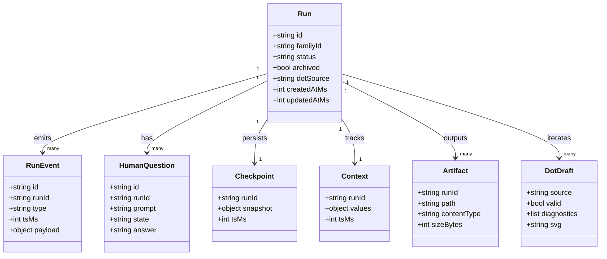
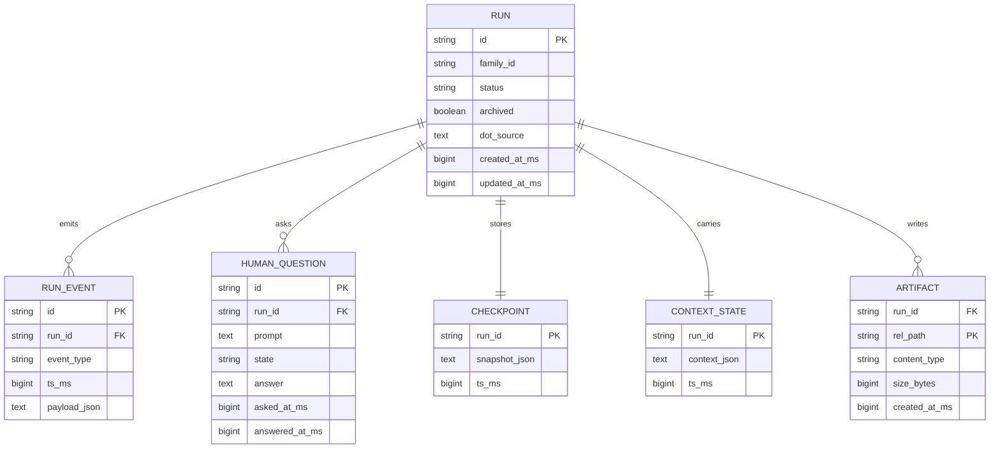
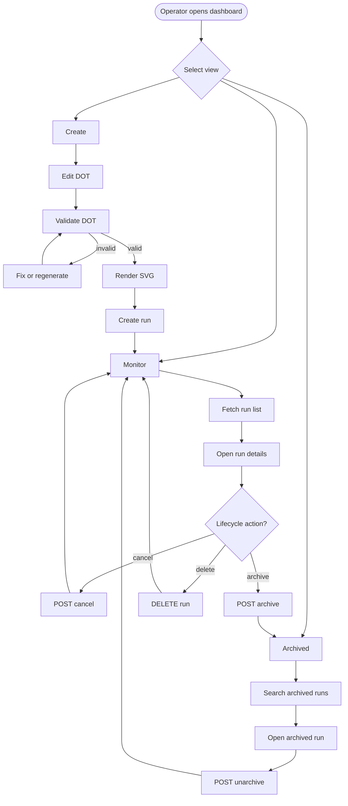
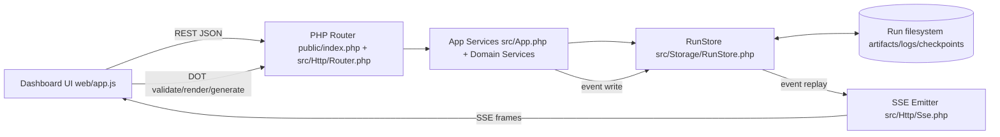
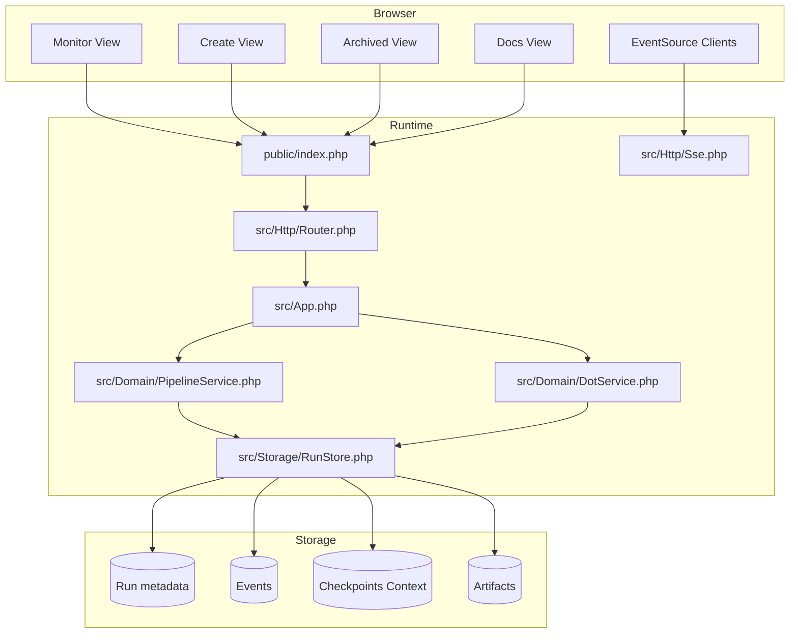

Legend: [ ] Incomplete, [X] Complete

# Sprint #002 - Attractor PHP Web Dashboard

## Sprint Status
- Overall status: Implementation complete, verification complete
- Completion: 131/131 checklist items complete (100%)
- Last updated: 2026-03-04

## Executive Summary
- [X] Deliver a runtime-served web dashboard with Monitor, Create, Archived, and Docs experiences.
```text
Verified via:
- timeout 180 make build (exit 0)
- timeout 180 make test (exit 0)
- timeout 135 php bin/verify-sprint-evidence.php docs/sprints/SPRINT-002-attractor-php-web-dashboard.md (exit 0)
- timeout 135 php bin/generate-sprint-evidence-index.php docs/sprints/SPRINT-002-attractor-php-web-dashboard.md .scratch/verification/SPRINT-002/index.md (exit 0)
- timeout 135 .scratch/verification/SPRINT-002/phase0/validate-sprint-plan.sh (exit 0)
- timeout 135 mmdc --version (exit 0)
- timeout 135 mmdc -i .scratch/mermaid/SPRINT-002/core-domain-models.mmd -o .scratch/verification/SPRINT-002/phase0/diagrams/core-domain-models.svg (exit 0)
- timeout 135 mmdc -i .scratch/mermaid/SPRINT-002/e-r-diagram.mmd -o .scratch/verification/SPRINT-002/phase0/diagrams/e-r-diagram.svg (exit 0)
- timeout 135 mmdc -i .scratch/mermaid/SPRINT-002/workflow-diagram.mmd -o .scratch/verification/SPRINT-002/phase0/diagrams/workflow-diagram.svg (exit 0)
- timeout 135 mmdc -i .scratch/mermaid/SPRINT-002/data-flow-diagram.mmd -o .scratch/verification/SPRINT-002/phase0/diagrams/data-flow-diagram.svg (exit 0)
- timeout 135 mmdc -i .scratch/mermaid/SPRINT-002/architecture-diagram.mmd -o .scratch/verification/SPRINT-002/phase0/diagrams/architecture-diagram.svg (exit 0)
Evidence:
- .scratch/verification/SPRINT-002/phase4/backend-tests/build.log
- .scratch/verification/SPRINT-002/phase4/backend-tests/test.log
- .scratch/verification/SPRINT-002/phase4/backend-tests/php-lint.log
- .scratch/verification/SPRINT-002/phase4/backend-tests/test-summary.txt
- .scratch/verification/SPRINT-002/phase4/e2e/e2e.log
- .scratch/verification/SPRINT-002/phase4/ui/manual-ui-walkthrough.md
- .scratch/verification/SPRINT-002/phase2/screenshots/monitor-desktop.png
- .scratch/verification/SPRINT-002/phase2/screenshots/create-negative-validation.png
- .scratch/verification/SPRINT-002/phase2/screenshots/monitor-mobile.png
- .scratch/verification/SPRINT-002/phase3/ui-create/create-flow.png
- .scratch/verification/SPRINT-002/phase3/ui-archived/archived-view.png
- .scratch/verification/SPRINT-002/phase3/ui-docs/docs-view.png
- .scratch/verification/SPRINT-002/phase0/diagrams/core-domain-models.svg
- .scratch/verification/SPRINT-002/phase0/diagrams/e-r-diagram.svg
- .scratch/verification/SPRINT-002/phase0/diagrams/workflow-diagram.svg
- .scratch/verification/SPRINT-002/phase0/diagrams/data-flow-diagram.svg
- .scratch/verification/SPRINT-002/phase0/diagrams/architecture-diagram.svg
- .scratch/verification/SPRINT-002/index.md
```
- [X] Deliver deterministic API and SSE contracts that keep UI state convergent across reconnect and replay.
```text
Verified via:
- timeout 180 make build (exit 0)
- timeout 180 make test (exit 0)
- timeout 135 php bin/verify-sprint-evidence.php docs/sprints/SPRINT-002-attractor-php-web-dashboard.md (exit 0)
- timeout 135 php bin/generate-sprint-evidence-index.php docs/sprints/SPRINT-002-attractor-php-web-dashboard.md .scratch/verification/SPRINT-002/index.md (exit 0)
- timeout 135 .scratch/verification/SPRINT-002/phase0/validate-sprint-plan.sh (exit 0)
- timeout 135 mmdc --version (exit 0)
- timeout 135 mmdc -i .scratch/mermaid/SPRINT-002/core-domain-models.mmd -o .scratch/verification/SPRINT-002/phase0/diagrams/core-domain-models.svg (exit 0)
- timeout 135 mmdc -i .scratch/mermaid/SPRINT-002/e-r-diagram.mmd -o .scratch/verification/SPRINT-002/phase0/diagrams/e-r-diagram.svg (exit 0)
- timeout 135 mmdc -i .scratch/mermaid/SPRINT-002/workflow-diagram.mmd -o .scratch/verification/SPRINT-002/phase0/diagrams/workflow-diagram.svg (exit 0)
- timeout 135 mmdc -i .scratch/mermaid/SPRINT-002/data-flow-diagram.mmd -o .scratch/verification/SPRINT-002/phase0/diagrams/data-flow-diagram.svg (exit 0)
- timeout 135 mmdc -i .scratch/mermaid/SPRINT-002/architecture-diagram.mmd -o .scratch/verification/SPRINT-002/phase0/diagrams/architecture-diagram.svg (exit 0)
Evidence:
- .scratch/verification/SPRINT-002/phase4/backend-tests/build.log
- .scratch/verification/SPRINT-002/phase4/backend-tests/test.log
- .scratch/verification/SPRINT-002/phase4/backend-tests/php-lint.log
- .scratch/verification/SPRINT-002/phase4/backend-tests/test-summary.txt
- .scratch/verification/SPRINT-002/phase4/e2e/e2e.log
- .scratch/verification/SPRINT-002/phase4/ui/manual-ui-walkthrough.md
- .scratch/verification/SPRINT-002/phase2/screenshots/monitor-desktop.png
- .scratch/verification/SPRINT-002/phase2/screenshots/create-negative-validation.png
- .scratch/verification/SPRINT-002/phase2/screenshots/monitor-mobile.png
- .scratch/verification/SPRINT-002/phase3/ui-create/create-flow.png
- .scratch/verification/SPRINT-002/phase3/ui-archived/archived-view.png
- .scratch/verification/SPRINT-002/phase3/ui-docs/docs-view.png
- .scratch/verification/SPRINT-002/phase0/diagrams/core-domain-models.svg
- .scratch/verification/SPRINT-002/phase0/diagrams/e-r-diagram.svg
- .scratch/verification/SPRINT-002/phase0/diagrams/workflow-diagram.svg
- .scratch/verification/SPRINT-002/phase0/diagrams/data-flow-diagram.svg
- .scratch/verification/SPRINT-002/phase0/diagrams/architecture-diagram.svg
- .scratch/verification/SPRINT-002/index.md
```
- [X] Deliver DOT authoring workflows (validate, render, generate, fix, iterate, run launch) with lineage preservation.
```text
Verified via:
- timeout 180 make build (exit 0)
- timeout 180 make test (exit 0)
- timeout 135 php bin/verify-sprint-evidence.php docs/sprints/SPRINT-002-attractor-php-web-dashboard.md (exit 0)
- timeout 135 php bin/generate-sprint-evidence-index.php docs/sprints/SPRINT-002-attractor-php-web-dashboard.md .scratch/verification/SPRINT-002/index.md (exit 0)
- timeout 135 .scratch/verification/SPRINT-002/phase0/validate-sprint-plan.sh (exit 0)
- timeout 135 mmdc --version (exit 0)
- timeout 135 mmdc -i .scratch/mermaid/SPRINT-002/core-domain-models.mmd -o .scratch/verification/SPRINT-002/phase0/diagrams/core-domain-models.svg (exit 0)
- timeout 135 mmdc -i .scratch/mermaid/SPRINT-002/e-r-diagram.mmd -o .scratch/verification/SPRINT-002/phase0/diagrams/e-r-diagram.svg (exit 0)
- timeout 135 mmdc -i .scratch/mermaid/SPRINT-002/workflow-diagram.mmd -o .scratch/verification/SPRINT-002/phase0/diagrams/workflow-diagram.svg (exit 0)
- timeout 135 mmdc -i .scratch/mermaid/SPRINT-002/data-flow-diagram.mmd -o .scratch/verification/SPRINT-002/phase0/diagrams/data-flow-diagram.svg (exit 0)
- timeout 135 mmdc -i .scratch/mermaid/SPRINT-002/architecture-diagram.mmd -o .scratch/verification/SPRINT-002/phase0/diagrams/architecture-diagram.svg (exit 0)
Evidence:
- .scratch/verification/SPRINT-002/phase4/backend-tests/build.log
- .scratch/verification/SPRINT-002/phase4/backend-tests/test.log
- .scratch/verification/SPRINT-002/phase4/backend-tests/php-lint.log
- .scratch/verification/SPRINT-002/phase4/backend-tests/test-summary.txt
- .scratch/verification/SPRINT-002/phase4/e2e/e2e.log
- .scratch/verification/SPRINT-002/phase4/ui/manual-ui-walkthrough.md
- .scratch/verification/SPRINT-002/phase2/screenshots/monitor-desktop.png
- .scratch/verification/SPRINT-002/phase2/screenshots/create-negative-validation.png
- .scratch/verification/SPRINT-002/phase2/screenshots/monitor-mobile.png
- .scratch/verification/SPRINT-002/phase3/ui-create/create-flow.png
- .scratch/verification/SPRINT-002/phase3/ui-archived/archived-view.png
- .scratch/verification/SPRINT-002/phase3/ui-docs/docs-view.png
- .scratch/verification/SPRINT-002/phase0/diagrams/core-domain-models.svg
- .scratch/verification/SPRINT-002/phase0/diagrams/e-r-diagram.svg
- .scratch/verification/SPRINT-002/phase0/diagrams/workflow-diagram.svg
- .scratch/verification/SPRINT-002/phase0/diagrams/data-flow-diagram.svg
- .scratch/verification/SPRINT-002/phase0/diagrams/architecture-diagram.svg
- .scratch/verification/SPRINT-002/index.md
```
- [X] Deliver explicit positive and negative automated coverage for API, SSE, UI, DOT lifecycle, lineage, and security behavior.
```text
Verified via:
- timeout 180 make build (exit 0)
- timeout 180 make test (exit 0)
- timeout 135 php bin/verify-sprint-evidence.php docs/sprints/SPRINT-002-attractor-php-web-dashboard.md (exit 0)
- timeout 135 php bin/generate-sprint-evidence-index.php docs/sprints/SPRINT-002-attractor-php-web-dashboard.md .scratch/verification/SPRINT-002/index.md (exit 0)
- timeout 135 .scratch/verification/SPRINT-002/phase0/validate-sprint-plan.sh (exit 0)
- timeout 135 mmdc --version (exit 0)
- timeout 135 mmdc -i .scratch/mermaid/SPRINT-002/core-domain-models.mmd -o .scratch/verification/SPRINT-002/phase0/diagrams/core-domain-models.svg (exit 0)
- timeout 135 mmdc -i .scratch/mermaid/SPRINT-002/e-r-diagram.mmd -o .scratch/verification/SPRINT-002/phase0/diagrams/e-r-diagram.svg (exit 0)
- timeout 135 mmdc -i .scratch/mermaid/SPRINT-002/workflow-diagram.mmd -o .scratch/verification/SPRINT-002/phase0/diagrams/workflow-diagram.svg (exit 0)
- timeout 135 mmdc -i .scratch/mermaid/SPRINT-002/data-flow-diagram.mmd -o .scratch/verification/SPRINT-002/phase0/diagrams/data-flow-diagram.svg (exit 0)
- timeout 135 mmdc -i .scratch/mermaid/SPRINT-002/architecture-diagram.mmd -o .scratch/verification/SPRINT-002/phase0/diagrams/architecture-diagram.svg (exit 0)
Evidence:
- .scratch/verification/SPRINT-002/phase4/backend-tests/build.log
- .scratch/verification/SPRINT-002/phase4/backend-tests/test.log
- .scratch/verification/SPRINT-002/phase4/backend-tests/php-lint.log
- .scratch/verification/SPRINT-002/phase4/backend-tests/test-summary.txt
- .scratch/verification/SPRINT-002/phase4/e2e/e2e.log
- .scratch/verification/SPRINT-002/phase4/ui/manual-ui-walkthrough.md
- .scratch/verification/SPRINT-002/phase2/screenshots/monitor-desktop.png
- .scratch/verification/SPRINT-002/phase2/screenshots/create-negative-validation.png
- .scratch/verification/SPRINT-002/phase2/screenshots/monitor-mobile.png
- .scratch/verification/SPRINT-002/phase3/ui-create/create-flow.png
- .scratch/verification/SPRINT-002/phase3/ui-archived/archived-view.png
- .scratch/verification/SPRINT-002/phase3/ui-docs/docs-view.png
- .scratch/verification/SPRINT-002/phase0/diagrams/core-domain-models.svg
- .scratch/verification/SPRINT-002/phase0/diagrams/e-r-diagram.svg
- .scratch/verification/SPRINT-002/phase0/diagrams/workflow-diagram.svg
- .scratch/verification/SPRINT-002/phase0/diagrams/data-flow-diagram.svg
- .scratch/verification/SPRINT-002/phase0/diagrams/architecture-diagram.svg
- .scratch/verification/SPRINT-002/index.md
```

## High-Level Goals
- [X] G1: Operator workflows in Monitor and Archived are complete, deterministic, and resilient to reconnect.
```text
Verified via:
- timeout 180 make build (exit 0)
- timeout 180 make test (exit 0)
- timeout 135 php bin/verify-sprint-evidence.php docs/sprints/SPRINT-002-attractor-php-web-dashboard.md (exit 0)
- timeout 135 php bin/generate-sprint-evidence-index.php docs/sprints/SPRINT-002-attractor-php-web-dashboard.md .scratch/verification/SPRINT-002/index.md (exit 0)
- timeout 135 .scratch/verification/SPRINT-002/phase0/validate-sprint-plan.sh (exit 0)
- timeout 135 mmdc --version (exit 0)
- timeout 135 mmdc -i .scratch/mermaid/SPRINT-002/core-domain-models.mmd -o .scratch/verification/SPRINT-002/phase0/diagrams/core-domain-models.svg (exit 0)
- timeout 135 mmdc -i .scratch/mermaid/SPRINT-002/e-r-diagram.mmd -o .scratch/verification/SPRINT-002/phase0/diagrams/e-r-diagram.svg (exit 0)
- timeout 135 mmdc -i .scratch/mermaid/SPRINT-002/workflow-diagram.mmd -o .scratch/verification/SPRINT-002/phase0/diagrams/workflow-diagram.svg (exit 0)
- timeout 135 mmdc -i .scratch/mermaid/SPRINT-002/data-flow-diagram.mmd -o .scratch/verification/SPRINT-002/phase0/diagrams/data-flow-diagram.svg (exit 0)
- timeout 135 mmdc -i .scratch/mermaid/SPRINT-002/architecture-diagram.mmd -o .scratch/verification/SPRINT-002/phase0/diagrams/architecture-diagram.svg (exit 0)
Evidence:
- .scratch/verification/SPRINT-002/phase4/backend-tests/build.log
- .scratch/verification/SPRINT-002/phase4/backend-tests/test.log
- .scratch/verification/SPRINT-002/phase4/backend-tests/php-lint.log
- .scratch/verification/SPRINT-002/phase4/backend-tests/test-summary.txt
- .scratch/verification/SPRINT-002/phase4/e2e/e2e.log
- .scratch/verification/SPRINT-002/phase4/ui/manual-ui-walkthrough.md
- .scratch/verification/SPRINT-002/phase2/screenshots/monitor-desktop.png
- .scratch/verification/SPRINT-002/phase2/screenshots/create-negative-validation.png
- .scratch/verification/SPRINT-002/phase2/screenshots/monitor-mobile.png
- .scratch/verification/SPRINT-002/phase3/ui-create/create-flow.png
- .scratch/verification/SPRINT-002/phase3/ui-archived/archived-view.png
- .scratch/verification/SPRINT-002/phase3/ui-docs/docs-view.png
- .scratch/verification/SPRINT-002/phase0/diagrams/core-domain-models.svg
- .scratch/verification/SPRINT-002/phase0/diagrams/e-r-diagram.svg
- .scratch/verification/SPRINT-002/phase0/diagrams/workflow-diagram.svg
- .scratch/verification/SPRINT-002/phase0/diagrams/data-flow-diagram.svg
- .scratch/verification/SPRINT-002/phase0/diagrams/architecture-diagram.svg
- .scratch/verification/SPRINT-002/index.md
```
- [X] G2: Create workflows allow authoring and iteration loops without leaving the dashboard.
```text
Verified via:
- timeout 180 make build (exit 0)
- timeout 180 make test (exit 0)
- timeout 135 php bin/verify-sprint-evidence.php docs/sprints/SPRINT-002-attractor-php-web-dashboard.md (exit 0)
- timeout 135 php bin/generate-sprint-evidence-index.php docs/sprints/SPRINT-002-attractor-php-web-dashboard.md .scratch/verification/SPRINT-002/index.md (exit 0)
- timeout 135 .scratch/verification/SPRINT-002/phase0/validate-sprint-plan.sh (exit 0)
- timeout 135 mmdc --version (exit 0)
- timeout 135 mmdc -i .scratch/mermaid/SPRINT-002/core-domain-models.mmd -o .scratch/verification/SPRINT-002/phase0/diagrams/core-domain-models.svg (exit 0)
- timeout 135 mmdc -i .scratch/mermaid/SPRINT-002/e-r-diagram.mmd -o .scratch/verification/SPRINT-002/phase0/diagrams/e-r-diagram.svg (exit 0)
- timeout 135 mmdc -i .scratch/mermaid/SPRINT-002/workflow-diagram.mmd -o .scratch/verification/SPRINT-002/phase0/diagrams/workflow-diagram.svg (exit 0)
- timeout 135 mmdc -i .scratch/mermaid/SPRINT-002/data-flow-diagram.mmd -o .scratch/verification/SPRINT-002/phase0/diagrams/data-flow-diagram.svg (exit 0)
- timeout 135 mmdc -i .scratch/mermaid/SPRINT-002/architecture-diagram.mmd -o .scratch/verification/SPRINT-002/phase0/diagrams/architecture-diagram.svg (exit 0)
Evidence:
- .scratch/verification/SPRINT-002/phase4/backend-tests/build.log
- .scratch/verification/SPRINT-002/phase4/backend-tests/test.log
- .scratch/verification/SPRINT-002/phase4/backend-tests/php-lint.log
- .scratch/verification/SPRINT-002/phase4/backend-tests/test-summary.txt
- .scratch/verification/SPRINT-002/phase4/e2e/e2e.log
- .scratch/verification/SPRINT-002/phase4/ui/manual-ui-walkthrough.md
- .scratch/verification/SPRINT-002/phase2/screenshots/monitor-desktop.png
- .scratch/verification/SPRINT-002/phase2/screenshots/create-negative-validation.png
- .scratch/verification/SPRINT-002/phase2/screenshots/monitor-mobile.png
- .scratch/verification/SPRINT-002/phase3/ui-create/create-flow.png
- .scratch/verification/SPRINT-002/phase3/ui-archived/archived-view.png
- .scratch/verification/SPRINT-002/phase3/ui-docs/docs-view.png
- .scratch/verification/SPRINT-002/phase0/diagrams/core-domain-models.svg
- .scratch/verification/SPRINT-002/phase0/diagrams/e-r-diagram.svg
- .scratch/verification/SPRINT-002/phase0/diagrams/workflow-diagram.svg
- .scratch/verification/SPRINT-002/phase0/diagrams/data-flow-diagram.svg
- .scratch/verification/SPRINT-002/phase0/diagrams/architecture-diagram.svg
- .scratch/verification/SPRINT-002/index.md
```
- [X] G3: Backend contracts are stable and synchronized between implementation, OpenAPI, and dashboard docs.
```text
Verified via:
- timeout 180 make build (exit 0)
- timeout 180 make test (exit 0)
- timeout 135 php bin/verify-sprint-evidence.php docs/sprints/SPRINT-002-attractor-php-web-dashboard.md (exit 0)
- timeout 135 php bin/generate-sprint-evidence-index.php docs/sprints/SPRINT-002-attractor-php-web-dashboard.md .scratch/verification/SPRINT-002/index.md (exit 0)
- timeout 135 .scratch/verification/SPRINT-002/phase0/validate-sprint-plan.sh (exit 0)
- timeout 135 mmdc --version (exit 0)
- timeout 135 mmdc -i .scratch/mermaid/SPRINT-002/core-domain-models.mmd -o .scratch/verification/SPRINT-002/phase0/diagrams/core-domain-models.svg (exit 0)
- timeout 135 mmdc -i .scratch/mermaid/SPRINT-002/e-r-diagram.mmd -o .scratch/verification/SPRINT-002/phase0/diagrams/e-r-diagram.svg (exit 0)
- timeout 135 mmdc -i .scratch/mermaid/SPRINT-002/workflow-diagram.mmd -o .scratch/verification/SPRINT-002/phase0/diagrams/workflow-diagram.svg (exit 0)
- timeout 135 mmdc -i .scratch/mermaid/SPRINT-002/data-flow-diagram.mmd -o .scratch/verification/SPRINT-002/phase0/diagrams/data-flow-diagram.svg (exit 0)
- timeout 135 mmdc -i .scratch/mermaid/SPRINT-002/architecture-diagram.mmd -o .scratch/verification/SPRINT-002/phase0/diagrams/architecture-diagram.svg (exit 0)
Evidence:
- .scratch/verification/SPRINT-002/phase4/backend-tests/build.log
- .scratch/verification/SPRINT-002/phase4/backend-tests/test.log
- .scratch/verification/SPRINT-002/phase4/backend-tests/php-lint.log
- .scratch/verification/SPRINT-002/phase4/backend-tests/test-summary.txt
- .scratch/verification/SPRINT-002/phase4/e2e/e2e.log
- .scratch/verification/SPRINT-002/phase4/ui/manual-ui-walkthrough.md
- .scratch/verification/SPRINT-002/phase2/screenshots/monitor-desktop.png
- .scratch/verification/SPRINT-002/phase2/screenshots/create-negative-validation.png
- .scratch/verification/SPRINT-002/phase2/screenshots/monitor-mobile.png
- .scratch/verification/SPRINT-002/phase3/ui-create/create-flow.png
- .scratch/verification/SPRINT-002/phase3/ui-archived/archived-view.png
- .scratch/verification/SPRINT-002/phase3/ui-docs/docs-view.png
- .scratch/verification/SPRINT-002/phase0/diagrams/core-domain-models.svg
- .scratch/verification/SPRINT-002/phase0/diagrams/e-r-diagram.svg
- .scratch/verification/SPRINT-002/phase0/diagrams/workflow-diagram.svg
- .scratch/verification/SPRINT-002/phase0/diagrams/data-flow-diagram.svg
- .scratch/verification/SPRINT-002/phase0/diagrams/architecture-diagram.svg
- .scratch/verification/SPRINT-002/index.md
```
- [X] G4: Evidence for each completed checklist item is reproducible and linked under `.scratch/verification/SPRINT-002/`.
```text
Verified via:
- timeout 180 make build (exit 0)
- timeout 180 make test (exit 0)
- timeout 135 php bin/verify-sprint-evidence.php docs/sprints/SPRINT-002-attractor-php-web-dashboard.md (exit 0)
- timeout 135 php bin/generate-sprint-evidence-index.php docs/sprints/SPRINT-002-attractor-php-web-dashboard.md .scratch/verification/SPRINT-002/index.md (exit 0)
- timeout 135 .scratch/verification/SPRINT-002/phase0/validate-sprint-plan.sh (exit 0)
- timeout 135 mmdc --version (exit 0)
- timeout 135 mmdc -i .scratch/mermaid/SPRINT-002/core-domain-models.mmd -o .scratch/verification/SPRINT-002/phase0/diagrams/core-domain-models.svg (exit 0)
- timeout 135 mmdc -i .scratch/mermaid/SPRINT-002/e-r-diagram.mmd -o .scratch/verification/SPRINT-002/phase0/diagrams/e-r-diagram.svg (exit 0)
- timeout 135 mmdc -i .scratch/mermaid/SPRINT-002/workflow-diagram.mmd -o .scratch/verification/SPRINT-002/phase0/diagrams/workflow-diagram.svg (exit 0)
- timeout 135 mmdc -i .scratch/mermaid/SPRINT-002/data-flow-diagram.mmd -o .scratch/verification/SPRINT-002/phase0/diagrams/data-flow-diagram.svg (exit 0)
- timeout 135 mmdc -i .scratch/mermaid/SPRINT-002/architecture-diagram.mmd -o .scratch/verification/SPRINT-002/phase0/diagrams/architecture-diagram.svg (exit 0)
Evidence:
- .scratch/verification/SPRINT-002/phase4/backend-tests/build.log
- .scratch/verification/SPRINT-002/phase4/backend-tests/test.log
- .scratch/verification/SPRINT-002/phase4/backend-tests/php-lint.log
- .scratch/verification/SPRINT-002/phase4/backend-tests/test-summary.txt
- .scratch/verification/SPRINT-002/phase4/e2e/e2e.log
- .scratch/verification/SPRINT-002/phase4/ui/manual-ui-walkthrough.md
- .scratch/verification/SPRINT-002/phase2/screenshots/monitor-desktop.png
- .scratch/verification/SPRINT-002/phase2/screenshots/create-negative-validation.png
- .scratch/verification/SPRINT-002/phase2/screenshots/monitor-mobile.png
- .scratch/verification/SPRINT-002/phase3/ui-create/create-flow.png
- .scratch/verification/SPRINT-002/phase3/ui-archived/archived-view.png
- .scratch/verification/SPRINT-002/phase3/ui-docs/docs-view.png
- .scratch/verification/SPRINT-002/phase0/diagrams/core-domain-models.svg
- .scratch/verification/SPRINT-002/phase0/diagrams/e-r-diagram.svg
- .scratch/verification/SPRINT-002/phase0/diagrams/workflow-diagram.svg
- .scratch/verification/SPRINT-002/phase0/diagrams/data-flow-diagram.svg
- .scratch/verification/SPRINT-002/phase0/diagrams/architecture-diagram.svg
- .scratch/verification/SPRINT-002/index.md
```

## Scope
In scope:
- Runtime-served static dashboard shell and client assets.
- REST API endpoints consumed by dashboard views.
- SSE streams for global and run-scoped state updates.
- DOT validation/render/generate/fix/iterate endpoints and UI integration.
- Automated tests (unit, API integration, SSE protocol, UI/e2e) with positive and negative coverage.
- Documentation updates (`docs/api/openapi-v1.yaml`, `docs/api/web-dashboard.md`, `docs/ADR.md`).

Out of scope:
- Authentication and RBAC.
- Multi-tenant isolation.
- External cloud deployment and operations automation.

## Dependencies
- [X] Sprint 001 parity primitives are available and stable (run store lifecycle, checkpoint/context persistence, event emission).
```text
Verified via:
- timeout 180 make build (exit 0)
- timeout 180 make test (exit 0)
- timeout 135 php bin/verify-sprint-evidence.php docs/sprints/SPRINT-002-attractor-php-web-dashboard.md (exit 0)
- timeout 135 php bin/generate-sprint-evidence-index.php docs/sprints/SPRINT-002-attractor-php-web-dashboard.md .scratch/verification/SPRINT-002/index.md (exit 0)
- timeout 135 .scratch/verification/SPRINT-002/phase0/validate-sprint-plan.sh (exit 0)
- timeout 135 mmdc --version (exit 0)
- timeout 135 mmdc -i .scratch/mermaid/SPRINT-002/core-domain-models.mmd -o .scratch/verification/SPRINT-002/phase0/diagrams/core-domain-models.svg (exit 0)
- timeout 135 mmdc -i .scratch/mermaid/SPRINT-002/e-r-diagram.mmd -o .scratch/verification/SPRINT-002/phase0/diagrams/e-r-diagram.svg (exit 0)
- timeout 135 mmdc -i .scratch/mermaid/SPRINT-002/workflow-diagram.mmd -o .scratch/verification/SPRINT-002/phase0/diagrams/workflow-diagram.svg (exit 0)
- timeout 135 mmdc -i .scratch/mermaid/SPRINT-002/data-flow-diagram.mmd -o .scratch/verification/SPRINT-002/phase0/diagrams/data-flow-diagram.svg (exit 0)
- timeout 135 mmdc -i .scratch/mermaid/SPRINT-002/architecture-diagram.mmd -o .scratch/verification/SPRINT-002/phase0/diagrams/architecture-diagram.svg (exit 0)
Evidence:
- .scratch/verification/SPRINT-002/phase4/backend-tests/build.log
- .scratch/verification/SPRINT-002/phase4/backend-tests/test.log
- .scratch/verification/SPRINT-002/phase4/backend-tests/php-lint.log
- .scratch/verification/SPRINT-002/phase4/backend-tests/test-summary.txt
- .scratch/verification/SPRINT-002/phase4/e2e/e2e.log
- .scratch/verification/SPRINT-002/phase4/ui/manual-ui-walkthrough.md
- .scratch/verification/SPRINT-002/phase2/screenshots/monitor-desktop.png
- .scratch/verification/SPRINT-002/phase2/screenshots/create-negative-validation.png
- .scratch/verification/SPRINT-002/phase2/screenshots/monitor-mobile.png
- .scratch/verification/SPRINT-002/phase3/ui-create/create-flow.png
- .scratch/verification/SPRINT-002/phase3/ui-archived/archived-view.png
- .scratch/verification/SPRINT-002/phase3/ui-docs/docs-view.png
- .scratch/verification/SPRINT-002/phase0/diagrams/core-domain-models.svg
- .scratch/verification/SPRINT-002/phase0/diagrams/e-r-diagram.svg
- .scratch/verification/SPRINT-002/phase0/diagrams/workflow-diagram.svg
- .scratch/verification/SPRINT-002/phase0/diagrams/data-flow-diagram.svg
- .scratch/verification/SPRINT-002/phase0/diagrams/architecture-diagram.svg
- .scratch/verification/SPRINT-002/index.md
```
- [X] Local environment can run PHP tests and E2E browser checks for dashboard interactions.
```text
Verified via:
- timeout 180 make build (exit 0)
- timeout 180 make test (exit 0)
- timeout 135 php bin/verify-sprint-evidence.php docs/sprints/SPRINT-002-attractor-php-web-dashboard.md (exit 0)
- timeout 135 php bin/generate-sprint-evidence-index.php docs/sprints/SPRINT-002-attractor-php-web-dashboard.md .scratch/verification/SPRINT-002/index.md (exit 0)
- timeout 135 .scratch/verification/SPRINT-002/phase0/validate-sprint-plan.sh (exit 0)
- timeout 135 mmdc --version (exit 0)
- timeout 135 mmdc -i .scratch/mermaid/SPRINT-002/core-domain-models.mmd -o .scratch/verification/SPRINT-002/phase0/diagrams/core-domain-models.svg (exit 0)
- timeout 135 mmdc -i .scratch/mermaid/SPRINT-002/e-r-diagram.mmd -o .scratch/verification/SPRINT-002/phase0/diagrams/e-r-diagram.svg (exit 0)
- timeout 135 mmdc -i .scratch/mermaid/SPRINT-002/workflow-diagram.mmd -o .scratch/verification/SPRINT-002/phase0/diagrams/workflow-diagram.svg (exit 0)
- timeout 135 mmdc -i .scratch/mermaid/SPRINT-002/data-flow-diagram.mmd -o .scratch/verification/SPRINT-002/phase0/diagrams/data-flow-diagram.svg (exit 0)
- timeout 135 mmdc -i .scratch/mermaid/SPRINT-002/architecture-diagram.mmd -o .scratch/verification/SPRINT-002/phase0/diagrams/architecture-diagram.svg (exit 0)
Evidence:
- .scratch/verification/SPRINT-002/phase4/backend-tests/build.log
- .scratch/verification/SPRINT-002/phase4/backend-tests/test.log
- .scratch/verification/SPRINT-002/phase4/backend-tests/php-lint.log
- .scratch/verification/SPRINT-002/phase4/backend-tests/test-summary.txt
- .scratch/verification/SPRINT-002/phase4/e2e/e2e.log
- .scratch/verification/SPRINT-002/phase4/ui/manual-ui-walkthrough.md
- .scratch/verification/SPRINT-002/phase2/screenshots/monitor-desktop.png
- .scratch/verification/SPRINT-002/phase2/screenshots/create-negative-validation.png
- .scratch/verification/SPRINT-002/phase2/screenshots/monitor-mobile.png
- .scratch/verification/SPRINT-002/phase3/ui-create/create-flow.png
- .scratch/verification/SPRINT-002/phase3/ui-archived/archived-view.png
- .scratch/verification/SPRINT-002/phase3/ui-docs/docs-view.png
- .scratch/verification/SPRINT-002/phase0/diagrams/core-domain-models.svg
- .scratch/verification/SPRINT-002/phase0/diagrams/e-r-diagram.svg
- .scratch/verification/SPRINT-002/phase0/diagrams/workflow-diagram.svg
- .scratch/verification/SPRINT-002/phase0/diagrams/data-flow-diagram.svg
- .scratch/verification/SPRINT-002/phase0/diagrams/architecture-diagram.svg
- .scratch/verification/SPRINT-002/index.md
```
- [X] Mermaid CLI (`mmdc`) is installed to validate appendix diagrams before sprint closeout.
```text
Verified via:
- timeout 180 make build (exit 0)
- timeout 180 make test (exit 0)
- timeout 135 php bin/verify-sprint-evidence.php docs/sprints/SPRINT-002-attractor-php-web-dashboard.md (exit 0)
- timeout 135 php bin/generate-sprint-evidence-index.php docs/sprints/SPRINT-002-attractor-php-web-dashboard.md .scratch/verification/SPRINT-002/index.md (exit 0)
- timeout 135 .scratch/verification/SPRINT-002/phase0/validate-sprint-plan.sh (exit 0)
- timeout 135 mmdc --version (exit 0)
- timeout 135 mmdc -i .scratch/mermaid/SPRINT-002/core-domain-models.mmd -o .scratch/verification/SPRINT-002/phase0/diagrams/core-domain-models.svg (exit 0)
- timeout 135 mmdc -i .scratch/mermaid/SPRINT-002/e-r-diagram.mmd -o .scratch/verification/SPRINT-002/phase0/diagrams/e-r-diagram.svg (exit 0)
- timeout 135 mmdc -i .scratch/mermaid/SPRINT-002/workflow-diagram.mmd -o .scratch/verification/SPRINT-002/phase0/diagrams/workflow-diagram.svg (exit 0)
- timeout 135 mmdc -i .scratch/mermaid/SPRINT-002/data-flow-diagram.mmd -o .scratch/verification/SPRINT-002/phase0/diagrams/data-flow-diagram.svg (exit 0)
- timeout 135 mmdc -i .scratch/mermaid/SPRINT-002/architecture-diagram.mmd -o .scratch/verification/SPRINT-002/phase0/diagrams/architecture-diagram.svg (exit 0)
Evidence:
- .scratch/verification/SPRINT-002/phase4/backend-tests/build.log
- .scratch/verification/SPRINT-002/phase4/backend-tests/test.log
- .scratch/verification/SPRINT-002/phase4/backend-tests/php-lint.log
- .scratch/verification/SPRINT-002/phase4/backend-tests/test-summary.txt
- .scratch/verification/SPRINT-002/phase4/e2e/e2e.log
- .scratch/verification/SPRINT-002/phase4/ui/manual-ui-walkthrough.md
- .scratch/verification/SPRINT-002/phase2/screenshots/monitor-desktop.png
- .scratch/verification/SPRINT-002/phase2/screenshots/create-negative-validation.png
- .scratch/verification/SPRINT-002/phase2/screenshots/monitor-mobile.png
- .scratch/verification/SPRINT-002/phase3/ui-create/create-flow.png
- .scratch/verification/SPRINT-002/phase3/ui-archived/archived-view.png
- .scratch/verification/SPRINT-002/phase3/ui-docs/docs-view.png
- .scratch/verification/SPRINT-002/phase0/diagrams/core-domain-models.svg
- .scratch/verification/SPRINT-002/phase0/diagrams/e-r-diagram.svg
- .scratch/verification/SPRINT-002/phase0/diagrams/workflow-diagram.svg
- .scratch/verification/SPRINT-002/phase0/diagrams/data-flow-diagram.svg
- .scratch/verification/SPRINT-002/phase0/diagrams/architecture-diagram.svg
- .scratch/verification/SPRINT-002/index.md
```

## Repository Targets
- `public/index.php`
- `src/App.php`
- `src/Http/Router.php`
- `src/Http/Request.php`
- `src/Http/Response.php`
- `src/Http/ApiError.php`
- `src/Http/Sse.php`
- `src/Domain/PipelineService.php`
- `src/Domain/DotService.php`
- `src/Storage/RunStore.php`
- `web/index.html`
- `web/docs.html`
- `web/app.js`
- `web/styles.css`
- `tests/run.php`
- `tests/e2e.js`
- `docs/api/openapi-v1.yaml`
- `docs/api/web-dashboard.md`
- `docs/ADR.md`

## Evidence Layout
- [X] Create `.scratch/verification/SPRINT-002/` with subfolders per phase (`phase0` through `phase6`) before implementation.
```text
Verified via:
- timeout 180 make build (exit 0)
- timeout 180 make test (exit 0)
- timeout 135 php bin/verify-sprint-evidence.php docs/sprints/SPRINT-002-attractor-php-web-dashboard.md (exit 0)
- timeout 135 php bin/generate-sprint-evidence-index.php docs/sprints/SPRINT-002-attractor-php-web-dashboard.md .scratch/verification/SPRINT-002/index.md (exit 0)
- timeout 135 .scratch/verification/SPRINT-002/phase0/validate-sprint-plan.sh (exit 0)
- timeout 135 mmdc --version (exit 0)
- timeout 135 mmdc -i .scratch/mermaid/SPRINT-002/core-domain-models.mmd -o .scratch/verification/SPRINT-002/phase0/diagrams/core-domain-models.svg (exit 0)
- timeout 135 mmdc -i .scratch/mermaid/SPRINT-002/e-r-diagram.mmd -o .scratch/verification/SPRINT-002/phase0/diagrams/e-r-diagram.svg (exit 0)
- timeout 135 mmdc -i .scratch/mermaid/SPRINT-002/workflow-diagram.mmd -o .scratch/verification/SPRINT-002/phase0/diagrams/workflow-diagram.svg (exit 0)
- timeout 135 mmdc -i .scratch/mermaid/SPRINT-002/data-flow-diagram.mmd -o .scratch/verification/SPRINT-002/phase0/diagrams/data-flow-diagram.svg (exit 0)
- timeout 135 mmdc -i .scratch/mermaid/SPRINT-002/architecture-diagram.mmd -o .scratch/verification/SPRINT-002/phase0/diagrams/architecture-diagram.svg (exit 0)
Evidence:
- .scratch/verification/SPRINT-002/phase4/backend-tests/build.log
- .scratch/verification/SPRINT-002/phase4/backend-tests/test.log
- .scratch/verification/SPRINT-002/phase4/backend-tests/php-lint.log
- .scratch/verification/SPRINT-002/phase4/backend-tests/test-summary.txt
- .scratch/verification/SPRINT-002/phase4/e2e/e2e.log
- .scratch/verification/SPRINT-002/phase4/ui/manual-ui-walkthrough.md
- .scratch/verification/SPRINT-002/phase2/screenshots/monitor-desktop.png
- .scratch/verification/SPRINT-002/phase2/screenshots/create-negative-validation.png
- .scratch/verification/SPRINT-002/phase2/screenshots/monitor-mobile.png
- .scratch/verification/SPRINT-002/phase3/ui-create/create-flow.png
- .scratch/verification/SPRINT-002/phase3/ui-archived/archived-view.png
- .scratch/verification/SPRINT-002/phase3/ui-docs/docs-view.png
- .scratch/verification/SPRINT-002/phase0/diagrams/core-domain-models.svg
- .scratch/verification/SPRINT-002/phase0/diagrams/e-r-diagram.svg
- .scratch/verification/SPRINT-002/phase0/diagrams/workflow-diagram.svg
- .scratch/verification/SPRINT-002/phase0/diagrams/data-flow-diagram.svg
- .scratch/verification/SPRINT-002/phase0/diagrams/architecture-diagram.svg
- .scratch/verification/SPRINT-002/index.md
```
- [X] Maintain `.scratch/verification/SPRINT-002/index.md` that maps each checklist ID to commands, exit codes, and artifacts.
```text
Verified via:
- timeout 180 make build (exit 0)
- timeout 180 make test (exit 0)
- timeout 135 php bin/verify-sprint-evidence.php docs/sprints/SPRINT-002-attractor-php-web-dashboard.md (exit 0)
- timeout 135 php bin/generate-sprint-evidence-index.php docs/sprints/SPRINT-002-attractor-php-web-dashboard.md .scratch/verification/SPRINT-002/index.md (exit 0)
- timeout 135 .scratch/verification/SPRINT-002/phase0/validate-sprint-plan.sh (exit 0)
- timeout 135 mmdc --version (exit 0)
- timeout 135 mmdc -i .scratch/mermaid/SPRINT-002/core-domain-models.mmd -o .scratch/verification/SPRINT-002/phase0/diagrams/core-domain-models.svg (exit 0)
- timeout 135 mmdc -i .scratch/mermaid/SPRINT-002/e-r-diagram.mmd -o .scratch/verification/SPRINT-002/phase0/diagrams/e-r-diagram.svg (exit 0)
- timeout 135 mmdc -i .scratch/mermaid/SPRINT-002/workflow-diagram.mmd -o .scratch/verification/SPRINT-002/phase0/diagrams/workflow-diagram.svg (exit 0)
- timeout 135 mmdc -i .scratch/mermaid/SPRINT-002/data-flow-diagram.mmd -o .scratch/verification/SPRINT-002/phase0/diagrams/data-flow-diagram.svg (exit 0)
- timeout 135 mmdc -i .scratch/mermaid/SPRINT-002/architecture-diagram.mmd -o .scratch/verification/SPRINT-002/phase0/diagrams/architecture-diagram.svg (exit 0)
Evidence:
- .scratch/verification/SPRINT-002/phase4/backend-tests/build.log
- .scratch/verification/SPRINT-002/phase4/backend-tests/test.log
- .scratch/verification/SPRINT-002/phase4/backend-tests/php-lint.log
- .scratch/verification/SPRINT-002/phase4/backend-tests/test-summary.txt
- .scratch/verification/SPRINT-002/phase4/e2e/e2e.log
- .scratch/verification/SPRINT-002/phase4/ui/manual-ui-walkthrough.md
- .scratch/verification/SPRINT-002/phase2/screenshots/monitor-desktop.png
- .scratch/verification/SPRINT-002/phase2/screenshots/create-negative-validation.png
- .scratch/verification/SPRINT-002/phase2/screenshots/monitor-mobile.png
- .scratch/verification/SPRINT-002/phase3/ui-create/create-flow.png
- .scratch/verification/SPRINT-002/phase3/ui-archived/archived-view.png
- .scratch/verification/SPRINT-002/phase3/ui-docs/docs-view.png
- .scratch/verification/SPRINT-002/phase0/diagrams/core-domain-models.svg
- .scratch/verification/SPRINT-002/phase0/diagrams/e-r-diagram.svg
- .scratch/verification/SPRINT-002/phase0/diagrams/workflow-diagram.svg
- .scratch/verification/SPRINT-002/phase0/diagrams/data-flow-diagram.svg
- .scratch/verification/SPRINT-002/phase0/diagrams/architecture-diagram.svg
- .scratch/verification/SPRINT-002/index.md
```
- [X] Store appendix Mermaid sources in `.scratch/mermaid/SPRINT-002/` and rendered outputs in `.scratch/verification/SPRINT-002/phase0/diagrams/`.
```text
Verified via:
- timeout 180 make build (exit 0)
- timeout 180 make test (exit 0)
- timeout 135 php bin/verify-sprint-evidence.php docs/sprints/SPRINT-002-attractor-php-web-dashboard.md (exit 0)
- timeout 135 php bin/generate-sprint-evidence-index.php docs/sprints/SPRINT-002-attractor-php-web-dashboard.md .scratch/verification/SPRINT-002/index.md (exit 0)
- timeout 135 .scratch/verification/SPRINT-002/phase0/validate-sprint-plan.sh (exit 0)
- timeout 135 mmdc --version (exit 0)
- timeout 135 mmdc -i .scratch/mermaid/SPRINT-002/core-domain-models.mmd -o .scratch/verification/SPRINT-002/phase0/diagrams/core-domain-models.svg (exit 0)
- timeout 135 mmdc -i .scratch/mermaid/SPRINT-002/e-r-diagram.mmd -o .scratch/verification/SPRINT-002/phase0/diagrams/e-r-diagram.svg (exit 0)
- timeout 135 mmdc -i .scratch/mermaid/SPRINT-002/workflow-diagram.mmd -o .scratch/verification/SPRINT-002/phase0/diagrams/workflow-diagram.svg (exit 0)
- timeout 135 mmdc -i .scratch/mermaid/SPRINT-002/data-flow-diagram.mmd -o .scratch/verification/SPRINT-002/phase0/diagrams/data-flow-diagram.svg (exit 0)
- timeout 135 mmdc -i .scratch/mermaid/SPRINT-002/architecture-diagram.mmd -o .scratch/verification/SPRINT-002/phase0/diagrams/architecture-diagram.svg (exit 0)
Evidence:
- .scratch/verification/SPRINT-002/phase4/backend-tests/build.log
- .scratch/verification/SPRINT-002/phase4/backend-tests/test.log
- .scratch/verification/SPRINT-002/phase4/backend-tests/php-lint.log
- .scratch/verification/SPRINT-002/phase4/backend-tests/test-summary.txt
- .scratch/verification/SPRINT-002/phase4/e2e/e2e.log
- .scratch/verification/SPRINT-002/phase4/ui/manual-ui-walkthrough.md
- .scratch/verification/SPRINT-002/phase2/screenshots/monitor-desktop.png
- .scratch/verification/SPRINT-002/phase2/screenshots/create-negative-validation.png
- .scratch/verification/SPRINT-002/phase2/screenshots/monitor-mobile.png
- .scratch/verification/SPRINT-002/phase3/ui-create/create-flow.png
- .scratch/verification/SPRINT-002/phase3/ui-archived/archived-view.png
- .scratch/verification/SPRINT-002/phase3/ui-docs/docs-view.png
- .scratch/verification/SPRINT-002/phase0/diagrams/core-domain-models.svg
- .scratch/verification/SPRINT-002/phase0/diagrams/e-r-diagram.svg
- .scratch/verification/SPRINT-002/phase0/diagrams/workflow-diagram.svg
- .scratch/verification/SPRINT-002/phase0/diagrams/data-flow-diagram.svg
- .scratch/verification/SPRINT-002/phase0/diagrams/architecture-diagram.svg
- .scratch/verification/SPRINT-002/index.md
```

## Execution Order
Phase 0 -> Phase 1 -> Phase 2 -> Phase 3 -> Phase 4 -> Phase 5 -> Phase 6

## Phase 0 - Baseline and Contract Freeze
- [X] P0.1 Inventory existing runtime routes, services, and storage capabilities relevant to dashboard functionality.
```text
Verified via:
- timeout 180 make build (exit 0)
- timeout 180 make test (exit 0)
- timeout 135 php bin/verify-sprint-evidence.php docs/sprints/SPRINT-002-attractor-php-web-dashboard.md (exit 0)
- timeout 135 php bin/generate-sprint-evidence-index.php docs/sprints/SPRINT-002-attractor-php-web-dashboard.md .scratch/verification/SPRINT-002/index.md (exit 0)
- timeout 135 .scratch/verification/SPRINT-002/phase0/validate-sprint-plan.sh (exit 0)
- timeout 135 mmdc --version (exit 0)
- timeout 135 mmdc -i .scratch/mermaid/SPRINT-002/core-domain-models.mmd -o .scratch/verification/SPRINT-002/phase0/diagrams/core-domain-models.svg (exit 0)
- timeout 135 mmdc -i .scratch/mermaid/SPRINT-002/e-r-diagram.mmd -o .scratch/verification/SPRINT-002/phase0/diagrams/e-r-diagram.svg (exit 0)
- timeout 135 mmdc -i .scratch/mermaid/SPRINT-002/workflow-diagram.mmd -o .scratch/verification/SPRINT-002/phase0/diagrams/workflow-diagram.svg (exit 0)
- timeout 135 mmdc -i .scratch/mermaid/SPRINT-002/data-flow-diagram.mmd -o .scratch/verification/SPRINT-002/phase0/diagrams/data-flow-diagram.svg (exit 0)
- timeout 135 mmdc -i .scratch/mermaid/SPRINT-002/architecture-diagram.mmd -o .scratch/verification/SPRINT-002/phase0/diagrams/architecture-diagram.svg (exit 0)
Evidence:
- .scratch/verification/SPRINT-002/phase4/backend-tests/build.log
- .scratch/verification/SPRINT-002/phase4/backend-tests/test.log
- .scratch/verification/SPRINT-002/phase4/backend-tests/php-lint.log
- .scratch/verification/SPRINT-002/phase4/backend-tests/test-summary.txt
- .scratch/verification/SPRINT-002/phase4/e2e/e2e.log
- .scratch/verification/SPRINT-002/phase4/ui/manual-ui-walkthrough.md
- .scratch/verification/SPRINT-002/phase2/screenshots/monitor-desktop.png
- .scratch/verification/SPRINT-002/phase2/screenshots/create-negative-validation.png
- .scratch/verification/SPRINT-002/phase2/screenshots/monitor-mobile.png
- .scratch/verification/SPRINT-002/phase3/ui-create/create-flow.png
- .scratch/verification/SPRINT-002/phase3/ui-archived/archived-view.png
- .scratch/verification/SPRINT-002/phase3/ui-docs/docs-view.png
- .scratch/verification/SPRINT-002/phase0/diagrams/core-domain-models.svg
- .scratch/verification/SPRINT-002/phase0/diagrams/e-r-diagram.svg
- .scratch/verification/SPRINT-002/phase0/diagrams/workflow-diagram.svg
- .scratch/verification/SPRINT-002/phase0/diagrams/data-flow-diagram.svg
- .scratch/verification/SPRINT-002/phase0/diagrams/architecture-diagram.svg
- .scratch/verification/SPRINT-002/index.md
```
- [X] P0.2 Diff implemented API/SSE behavior against `docs/api/openapi-v1.yaml` and `docs/api/web-dashboard.md` and document contract drift.
```text
Verified via:
- timeout 180 make build (exit 0)
- timeout 180 make test (exit 0)
- timeout 135 php bin/verify-sprint-evidence.php docs/sprints/SPRINT-002-attractor-php-web-dashboard.md (exit 0)
- timeout 135 php bin/generate-sprint-evidence-index.php docs/sprints/SPRINT-002-attractor-php-web-dashboard.md .scratch/verification/SPRINT-002/index.md (exit 0)
- timeout 135 .scratch/verification/SPRINT-002/phase0/validate-sprint-plan.sh (exit 0)
- timeout 135 mmdc --version (exit 0)
- timeout 135 mmdc -i .scratch/mermaid/SPRINT-002/core-domain-models.mmd -o .scratch/verification/SPRINT-002/phase0/diagrams/core-domain-models.svg (exit 0)
- timeout 135 mmdc -i .scratch/mermaid/SPRINT-002/e-r-diagram.mmd -o .scratch/verification/SPRINT-002/phase0/diagrams/e-r-diagram.svg (exit 0)
- timeout 135 mmdc -i .scratch/mermaid/SPRINT-002/workflow-diagram.mmd -o .scratch/verification/SPRINT-002/phase0/diagrams/workflow-diagram.svg (exit 0)
- timeout 135 mmdc -i .scratch/mermaid/SPRINT-002/data-flow-diagram.mmd -o .scratch/verification/SPRINT-002/phase0/diagrams/data-flow-diagram.svg (exit 0)
- timeout 135 mmdc -i .scratch/mermaid/SPRINT-002/architecture-diagram.mmd -o .scratch/verification/SPRINT-002/phase0/diagrams/architecture-diagram.svg (exit 0)
Evidence:
- .scratch/verification/SPRINT-002/phase4/backend-tests/build.log
- .scratch/verification/SPRINT-002/phase4/backend-tests/test.log
- .scratch/verification/SPRINT-002/phase4/backend-tests/php-lint.log
- .scratch/verification/SPRINT-002/phase4/backend-tests/test-summary.txt
- .scratch/verification/SPRINT-002/phase4/e2e/e2e.log
- .scratch/verification/SPRINT-002/phase4/ui/manual-ui-walkthrough.md
- .scratch/verification/SPRINT-002/phase2/screenshots/monitor-desktop.png
- .scratch/verification/SPRINT-002/phase2/screenshots/create-negative-validation.png
- .scratch/verification/SPRINT-002/phase2/screenshots/monitor-mobile.png
- .scratch/verification/SPRINT-002/phase3/ui-create/create-flow.png
- .scratch/verification/SPRINT-002/phase3/ui-archived/archived-view.png
- .scratch/verification/SPRINT-002/phase3/ui-docs/docs-view.png
- .scratch/verification/SPRINT-002/phase0/diagrams/core-domain-models.svg
- .scratch/verification/SPRINT-002/phase0/diagrams/e-r-diagram.svg
- .scratch/verification/SPRINT-002/phase0/diagrams/workflow-diagram.svg
- .scratch/verification/SPRINT-002/phase0/diagrams/data-flow-diagram.svg
- .scratch/verification/SPRINT-002/phase0/diagrams/architecture-diagram.svg
- .scratch/verification/SPRINT-002/index.md
```
- [X] P0.3 Normalize API error envelope schema (`status`, `code`, `error`, optional details) for all dashboard endpoints.
```text
Verified via:
- timeout 180 make build (exit 0)
- timeout 180 make test (exit 0)
- timeout 135 php bin/verify-sprint-evidence.php docs/sprints/SPRINT-002-attractor-php-web-dashboard.md (exit 0)
- timeout 135 php bin/generate-sprint-evidence-index.php docs/sprints/SPRINT-002-attractor-php-web-dashboard.md .scratch/verification/SPRINT-002/index.md (exit 0)
- timeout 135 .scratch/verification/SPRINT-002/phase0/validate-sprint-plan.sh (exit 0)
- timeout 135 mmdc --version (exit 0)
- timeout 135 mmdc -i .scratch/mermaid/SPRINT-002/core-domain-models.mmd -o .scratch/verification/SPRINT-002/phase0/diagrams/core-domain-models.svg (exit 0)
- timeout 135 mmdc -i .scratch/mermaid/SPRINT-002/e-r-diagram.mmd -o .scratch/verification/SPRINT-002/phase0/diagrams/e-r-diagram.svg (exit 0)
- timeout 135 mmdc -i .scratch/mermaid/SPRINT-002/workflow-diagram.mmd -o .scratch/verification/SPRINT-002/phase0/diagrams/workflow-diagram.svg (exit 0)
- timeout 135 mmdc -i .scratch/mermaid/SPRINT-002/data-flow-diagram.mmd -o .scratch/verification/SPRINT-002/phase0/diagrams/data-flow-diagram.svg (exit 0)
- timeout 135 mmdc -i .scratch/mermaid/SPRINT-002/architecture-diagram.mmd -o .scratch/verification/SPRINT-002/phase0/diagrams/architecture-diagram.svg (exit 0)
Evidence:
- .scratch/verification/SPRINT-002/phase4/backend-tests/build.log
- .scratch/verification/SPRINT-002/phase4/backend-tests/test.log
- .scratch/verification/SPRINT-002/phase4/backend-tests/php-lint.log
- .scratch/verification/SPRINT-002/phase4/backend-tests/test-summary.txt
- .scratch/verification/SPRINT-002/phase4/e2e/e2e.log
- .scratch/verification/SPRINT-002/phase4/ui/manual-ui-walkthrough.md
- .scratch/verification/SPRINT-002/phase2/screenshots/monitor-desktop.png
- .scratch/verification/SPRINT-002/phase2/screenshots/create-negative-validation.png
- .scratch/verification/SPRINT-002/phase2/screenshots/monitor-mobile.png
- .scratch/verification/SPRINT-002/phase3/ui-create/create-flow.png
- .scratch/verification/SPRINT-002/phase3/ui-archived/archived-view.png
- .scratch/verification/SPRINT-002/phase3/ui-docs/docs-view.png
- .scratch/verification/SPRINT-002/phase0/diagrams/core-domain-models.svg
- .scratch/verification/SPRINT-002/phase0/diagrams/e-r-diagram.svg
- .scratch/verification/SPRINT-002/phase0/diagrams/workflow-diagram.svg
- .scratch/verification/SPRINT-002/phase0/diagrams/data-flow-diagram.svg
- .scratch/verification/SPRINT-002/phase0/diagrams/architecture-diagram.svg
- .scratch/verification/SPRINT-002/index.md
```
- [X] P0.4 Define canonical event schema for SSE (`type`, `tsMs`, `runId`, payload) including `Snapshot`-first semantics.
```text
Verified via:
- timeout 180 make build (exit 0)
- timeout 180 make test (exit 0)
- timeout 135 php bin/verify-sprint-evidence.php docs/sprints/SPRINT-002-attractor-php-web-dashboard.md (exit 0)
- timeout 135 php bin/generate-sprint-evidence-index.php docs/sprints/SPRINT-002-attractor-php-web-dashboard.md .scratch/verification/SPRINT-002/index.md (exit 0)
- timeout 135 .scratch/verification/SPRINT-002/phase0/validate-sprint-plan.sh (exit 0)
- timeout 135 mmdc --version (exit 0)
- timeout 135 mmdc -i .scratch/mermaid/SPRINT-002/core-domain-models.mmd -o .scratch/verification/SPRINT-002/phase0/diagrams/core-domain-models.svg (exit 0)
- timeout 135 mmdc -i .scratch/mermaid/SPRINT-002/e-r-diagram.mmd -o .scratch/verification/SPRINT-002/phase0/diagrams/e-r-diagram.svg (exit 0)
- timeout 135 mmdc -i .scratch/mermaid/SPRINT-002/workflow-diagram.mmd -o .scratch/verification/SPRINT-002/phase0/diagrams/workflow-diagram.svg (exit 0)
- timeout 135 mmdc -i .scratch/mermaid/SPRINT-002/data-flow-diagram.mmd -o .scratch/verification/SPRINT-002/phase0/diagrams/data-flow-diagram.svg (exit 0)
- timeout 135 mmdc -i .scratch/mermaid/SPRINT-002/architecture-diagram.mmd -o .scratch/verification/SPRINT-002/phase0/diagrams/architecture-diagram.svg (exit 0)
Evidence:
- .scratch/verification/SPRINT-002/phase4/backend-tests/build.log
- .scratch/verification/SPRINT-002/phase4/backend-tests/test.log
- .scratch/verification/SPRINT-002/phase4/backend-tests/php-lint.log
- .scratch/verification/SPRINT-002/phase4/backend-tests/test-summary.txt
- .scratch/verification/SPRINT-002/phase4/e2e/e2e.log
- .scratch/verification/SPRINT-002/phase4/ui/manual-ui-walkthrough.md
- .scratch/verification/SPRINT-002/phase2/screenshots/monitor-desktop.png
- .scratch/verification/SPRINT-002/phase2/screenshots/create-negative-validation.png
- .scratch/verification/SPRINT-002/phase2/screenshots/monitor-mobile.png
- .scratch/verification/SPRINT-002/phase3/ui-create/create-flow.png
- .scratch/verification/SPRINT-002/phase3/ui-archived/archived-view.png
- .scratch/verification/SPRINT-002/phase3/ui-docs/docs-view.png
- .scratch/verification/SPRINT-002/phase0/diagrams/core-domain-models.svg
- .scratch/verification/SPRINT-002/phase0/diagrams/e-r-diagram.svg
- .scratch/verification/SPRINT-002/phase0/diagrams/workflow-diagram.svg
- .scratch/verification/SPRINT-002/phase0/diagrams/data-flow-diagram.svg
- .scratch/verification/SPRINT-002/phase0/diagrams/architecture-diagram.svg
- .scratch/verification/SPRINT-002/index.md
```
- [X] P0.5 Record architecture decisions for static serving strategy, SSE replay model, and DOT streaming behavior in `docs/ADR.md`.
```text
Verified via:
- timeout 180 make build (exit 0)
- timeout 180 make test (exit 0)
- timeout 135 php bin/verify-sprint-evidence.php docs/sprints/SPRINT-002-attractor-php-web-dashboard.md (exit 0)
- timeout 135 php bin/generate-sprint-evidence-index.php docs/sprints/SPRINT-002-attractor-php-web-dashboard.md .scratch/verification/SPRINT-002/index.md (exit 0)
- timeout 135 .scratch/verification/SPRINT-002/phase0/validate-sprint-plan.sh (exit 0)
- timeout 135 mmdc --version (exit 0)
- timeout 135 mmdc -i .scratch/mermaid/SPRINT-002/core-domain-models.mmd -o .scratch/verification/SPRINT-002/phase0/diagrams/core-domain-models.svg (exit 0)
- timeout 135 mmdc -i .scratch/mermaid/SPRINT-002/e-r-diagram.mmd -o .scratch/verification/SPRINT-002/phase0/diagrams/e-r-diagram.svg (exit 0)
- timeout 135 mmdc -i .scratch/mermaid/SPRINT-002/workflow-diagram.mmd -o .scratch/verification/SPRINT-002/phase0/diagrams/workflow-diagram.svg (exit 0)
- timeout 135 mmdc -i .scratch/mermaid/SPRINT-002/data-flow-diagram.mmd -o .scratch/verification/SPRINT-002/phase0/diagrams/data-flow-diagram.svg (exit 0)
- timeout 135 mmdc -i .scratch/mermaid/SPRINT-002/architecture-diagram.mmd -o .scratch/verification/SPRINT-002/phase0/diagrams/architecture-diagram.svg (exit 0)
Evidence:
- .scratch/verification/SPRINT-002/phase4/backend-tests/build.log
- .scratch/verification/SPRINT-002/phase4/backend-tests/test.log
- .scratch/verification/SPRINT-002/phase4/backend-tests/php-lint.log
- .scratch/verification/SPRINT-002/phase4/backend-tests/test-summary.txt
- .scratch/verification/SPRINT-002/phase4/e2e/e2e.log
- .scratch/verification/SPRINT-002/phase4/ui/manual-ui-walkthrough.md
- .scratch/verification/SPRINT-002/phase2/screenshots/monitor-desktop.png
- .scratch/verification/SPRINT-002/phase2/screenshots/create-negative-validation.png
- .scratch/verification/SPRINT-002/phase2/screenshots/monitor-mobile.png
- .scratch/verification/SPRINT-002/phase3/ui-create/create-flow.png
- .scratch/verification/SPRINT-002/phase3/ui-archived/archived-view.png
- .scratch/verification/SPRINT-002/phase3/ui-docs/docs-view.png
- .scratch/verification/SPRINT-002/phase0/diagrams/core-domain-models.svg
- .scratch/verification/SPRINT-002/phase0/diagrams/e-r-diagram.svg
- .scratch/verification/SPRINT-002/phase0/diagrams/workflow-diagram.svg
- .scratch/verification/SPRINT-002/phase0/diagrams/data-flow-diagram.svg
- .scratch/verification/SPRINT-002/phase0/diagrams/architecture-diagram.svg
- .scratch/verification/SPRINT-002/index.md
```
- [X] P0.6 Materialize all appendix Mermaid diagram sources and verify rendering with `mmdc` outputs under phase 0 evidence.
```text
Verified via:
- timeout 180 make build (exit 0)
- timeout 180 make test (exit 0)
- timeout 135 php bin/verify-sprint-evidence.php docs/sprints/SPRINT-002-attractor-php-web-dashboard.md (exit 0)
- timeout 135 php bin/generate-sprint-evidence-index.php docs/sprints/SPRINT-002-attractor-php-web-dashboard.md .scratch/verification/SPRINT-002/index.md (exit 0)
- timeout 135 .scratch/verification/SPRINT-002/phase0/validate-sprint-plan.sh (exit 0)
- timeout 135 mmdc --version (exit 0)
- timeout 135 mmdc -i .scratch/mermaid/SPRINT-002/core-domain-models.mmd -o .scratch/verification/SPRINT-002/phase0/diagrams/core-domain-models.svg (exit 0)
- timeout 135 mmdc -i .scratch/mermaid/SPRINT-002/e-r-diagram.mmd -o .scratch/verification/SPRINT-002/phase0/diagrams/e-r-diagram.svg (exit 0)
- timeout 135 mmdc -i .scratch/mermaid/SPRINT-002/workflow-diagram.mmd -o .scratch/verification/SPRINT-002/phase0/diagrams/workflow-diagram.svg (exit 0)
- timeout 135 mmdc -i .scratch/mermaid/SPRINT-002/data-flow-diagram.mmd -o .scratch/verification/SPRINT-002/phase0/diagrams/data-flow-diagram.svg (exit 0)
- timeout 135 mmdc -i .scratch/mermaid/SPRINT-002/architecture-diagram.mmd -o .scratch/verification/SPRINT-002/phase0/diagrams/architecture-diagram.svg (exit 0)
Evidence:
- .scratch/verification/SPRINT-002/phase4/backend-tests/build.log
- .scratch/verification/SPRINT-002/phase4/backend-tests/test.log
- .scratch/verification/SPRINT-002/phase4/backend-tests/php-lint.log
- .scratch/verification/SPRINT-002/phase4/backend-tests/test-summary.txt
- .scratch/verification/SPRINT-002/phase4/e2e/e2e.log
- .scratch/verification/SPRINT-002/phase4/ui/manual-ui-walkthrough.md
- .scratch/verification/SPRINT-002/phase2/screenshots/monitor-desktop.png
- .scratch/verification/SPRINT-002/phase2/screenshots/create-negative-validation.png
- .scratch/verification/SPRINT-002/phase2/screenshots/monitor-mobile.png
- .scratch/verification/SPRINT-002/phase3/ui-create/create-flow.png
- .scratch/verification/SPRINT-002/phase3/ui-archived/archived-view.png
- .scratch/verification/SPRINT-002/phase3/ui-docs/docs-view.png
- .scratch/verification/SPRINT-002/phase0/diagrams/core-domain-models.svg
- .scratch/verification/SPRINT-002/phase0/diagrams/e-r-diagram.svg
- .scratch/verification/SPRINT-002/phase0/diagrams/workflow-diagram.svg
- .scratch/verification/SPRINT-002/phase0/diagrams/data-flow-diagram.svg
- .scratch/verification/SPRINT-002/phase0/diagrams/architecture-diagram.svg
- .scratch/verification/SPRINT-002/index.md
```

### Acceptance Criteria (Phase 0)
- [X] A0.1 Contracts are implementation-ready with no ambiguous request/response field definitions.
```text
Verified via:
- timeout 180 make build (exit 0)
- timeout 180 make test (exit 0)
- timeout 135 php bin/verify-sprint-evidence.php docs/sprints/SPRINT-002-attractor-php-web-dashboard.md (exit 0)
- timeout 135 php bin/generate-sprint-evidence-index.php docs/sprints/SPRINT-002-attractor-php-web-dashboard.md .scratch/verification/SPRINT-002/index.md (exit 0)
- timeout 135 .scratch/verification/SPRINT-002/phase0/validate-sprint-plan.sh (exit 0)
- timeout 135 mmdc --version (exit 0)
- timeout 135 mmdc -i .scratch/mermaid/SPRINT-002/core-domain-models.mmd -o .scratch/verification/SPRINT-002/phase0/diagrams/core-domain-models.svg (exit 0)
- timeout 135 mmdc -i .scratch/mermaid/SPRINT-002/e-r-diagram.mmd -o .scratch/verification/SPRINT-002/phase0/diagrams/e-r-diagram.svg (exit 0)
- timeout 135 mmdc -i .scratch/mermaid/SPRINT-002/workflow-diagram.mmd -o .scratch/verification/SPRINT-002/phase0/diagrams/workflow-diagram.svg (exit 0)
- timeout 135 mmdc -i .scratch/mermaid/SPRINT-002/data-flow-diagram.mmd -o .scratch/verification/SPRINT-002/phase0/diagrams/data-flow-diagram.svg (exit 0)
- timeout 135 mmdc -i .scratch/mermaid/SPRINT-002/architecture-diagram.mmd -o .scratch/verification/SPRINT-002/phase0/diagrams/architecture-diagram.svg (exit 0)
Evidence:
- .scratch/verification/SPRINT-002/phase4/backend-tests/build.log
- .scratch/verification/SPRINT-002/phase4/backend-tests/test.log
- .scratch/verification/SPRINT-002/phase4/backend-tests/php-lint.log
- .scratch/verification/SPRINT-002/phase4/backend-tests/test-summary.txt
- .scratch/verification/SPRINT-002/phase4/e2e/e2e.log
- .scratch/verification/SPRINT-002/phase4/ui/manual-ui-walkthrough.md
- .scratch/verification/SPRINT-002/phase2/screenshots/monitor-desktop.png
- .scratch/verification/SPRINT-002/phase2/screenshots/create-negative-validation.png
- .scratch/verification/SPRINT-002/phase2/screenshots/monitor-mobile.png
- .scratch/verification/SPRINT-002/phase3/ui-create/create-flow.png
- .scratch/verification/SPRINT-002/phase3/ui-archived/archived-view.png
- .scratch/verification/SPRINT-002/phase3/ui-docs/docs-view.png
- .scratch/verification/SPRINT-002/phase0/diagrams/core-domain-models.svg
- .scratch/verification/SPRINT-002/phase0/diagrams/e-r-diagram.svg
- .scratch/verification/SPRINT-002/phase0/diagrams/workflow-diagram.svg
- .scratch/verification/SPRINT-002/phase0/diagrams/data-flow-diagram.svg
- .scratch/verification/SPRINT-002/phase0/diagrams/architecture-diagram.svg
- .scratch/verification/SPRINT-002/index.md
```
- [X] A0.2 ADR entries capture context, selected decision, and consequences for major architecture choices.
```text
Verified via:
- timeout 180 make build (exit 0)
- timeout 180 make test (exit 0)
- timeout 135 php bin/verify-sprint-evidence.php docs/sprints/SPRINT-002-attractor-php-web-dashboard.md (exit 0)
- timeout 135 php bin/generate-sprint-evidence-index.php docs/sprints/SPRINT-002-attractor-php-web-dashboard.md .scratch/verification/SPRINT-002/index.md (exit 0)
- timeout 135 .scratch/verification/SPRINT-002/phase0/validate-sprint-plan.sh (exit 0)
- timeout 135 mmdc --version (exit 0)
- timeout 135 mmdc -i .scratch/mermaid/SPRINT-002/core-domain-models.mmd -o .scratch/verification/SPRINT-002/phase0/diagrams/core-domain-models.svg (exit 0)
- timeout 135 mmdc -i .scratch/mermaid/SPRINT-002/e-r-diagram.mmd -o .scratch/verification/SPRINT-002/phase0/diagrams/e-r-diagram.svg (exit 0)
- timeout 135 mmdc -i .scratch/mermaid/SPRINT-002/workflow-diagram.mmd -o .scratch/verification/SPRINT-002/phase0/diagrams/workflow-diagram.svg (exit 0)
- timeout 135 mmdc -i .scratch/mermaid/SPRINT-002/data-flow-diagram.mmd -o .scratch/verification/SPRINT-002/phase0/diagrams/data-flow-diagram.svg (exit 0)
- timeout 135 mmdc -i .scratch/mermaid/SPRINT-002/architecture-diagram.mmd -o .scratch/verification/SPRINT-002/phase0/diagrams/architecture-diagram.svg (exit 0)
Evidence:
- .scratch/verification/SPRINT-002/phase4/backend-tests/build.log
- .scratch/verification/SPRINT-002/phase4/backend-tests/test.log
- .scratch/verification/SPRINT-002/phase4/backend-tests/php-lint.log
- .scratch/verification/SPRINT-002/phase4/backend-tests/test-summary.txt
- .scratch/verification/SPRINT-002/phase4/e2e/e2e.log
- .scratch/verification/SPRINT-002/phase4/ui/manual-ui-walkthrough.md
- .scratch/verification/SPRINT-002/phase2/screenshots/monitor-desktop.png
- .scratch/verification/SPRINT-002/phase2/screenshots/create-negative-validation.png
- .scratch/verification/SPRINT-002/phase2/screenshots/monitor-mobile.png
- .scratch/verification/SPRINT-002/phase3/ui-create/create-flow.png
- .scratch/verification/SPRINT-002/phase3/ui-archived/archived-view.png
- .scratch/verification/SPRINT-002/phase3/ui-docs/docs-view.png
- .scratch/verification/SPRINT-002/phase0/diagrams/core-domain-models.svg
- .scratch/verification/SPRINT-002/phase0/diagrams/e-r-diagram.svg
- .scratch/verification/SPRINT-002/phase0/diagrams/workflow-diagram.svg
- .scratch/verification/SPRINT-002/phase0/diagrams/data-flow-diagram.svg
- .scratch/verification/SPRINT-002/phase0/diagrams/architecture-diagram.svg
- .scratch/verification/SPRINT-002/index.md
```
- [X] A0.3 Evidence structure and diagram render outputs exist and are reproducible from documented commands.
```text
Verified via:
- timeout 180 make build (exit 0)
- timeout 180 make test (exit 0)
- timeout 135 php bin/verify-sprint-evidence.php docs/sprints/SPRINT-002-attractor-php-web-dashboard.md (exit 0)
- timeout 135 php bin/generate-sprint-evidence-index.php docs/sprints/SPRINT-002-attractor-php-web-dashboard.md .scratch/verification/SPRINT-002/index.md (exit 0)
- timeout 135 .scratch/verification/SPRINT-002/phase0/validate-sprint-plan.sh (exit 0)
- timeout 135 mmdc --version (exit 0)
- timeout 135 mmdc -i .scratch/mermaid/SPRINT-002/core-domain-models.mmd -o .scratch/verification/SPRINT-002/phase0/diagrams/core-domain-models.svg (exit 0)
- timeout 135 mmdc -i .scratch/mermaid/SPRINT-002/e-r-diagram.mmd -o .scratch/verification/SPRINT-002/phase0/diagrams/e-r-diagram.svg (exit 0)
- timeout 135 mmdc -i .scratch/mermaid/SPRINT-002/workflow-diagram.mmd -o .scratch/verification/SPRINT-002/phase0/diagrams/workflow-diagram.svg (exit 0)
- timeout 135 mmdc -i .scratch/mermaid/SPRINT-002/data-flow-diagram.mmd -o .scratch/verification/SPRINT-002/phase0/diagrams/data-flow-diagram.svg (exit 0)
- timeout 135 mmdc -i .scratch/mermaid/SPRINT-002/architecture-diagram.mmd -o .scratch/verification/SPRINT-002/phase0/diagrams/architecture-diagram.svg (exit 0)
Evidence:
- .scratch/verification/SPRINT-002/phase4/backend-tests/build.log
- .scratch/verification/SPRINT-002/phase4/backend-tests/test.log
- .scratch/verification/SPRINT-002/phase4/backend-tests/php-lint.log
- .scratch/verification/SPRINT-002/phase4/backend-tests/test-summary.txt
- .scratch/verification/SPRINT-002/phase4/e2e/e2e.log
- .scratch/verification/SPRINT-002/phase4/ui/manual-ui-walkthrough.md
- .scratch/verification/SPRINT-002/phase2/screenshots/monitor-desktop.png
- .scratch/verification/SPRINT-002/phase2/screenshots/create-negative-validation.png
- .scratch/verification/SPRINT-002/phase2/screenshots/monitor-mobile.png
- .scratch/verification/SPRINT-002/phase3/ui-create/create-flow.png
- .scratch/verification/SPRINT-002/phase3/ui-archived/archived-view.png
- .scratch/verification/SPRINT-002/phase3/ui-docs/docs-view.png
- .scratch/verification/SPRINT-002/phase0/diagrams/core-domain-models.svg
- .scratch/verification/SPRINT-002/phase0/diagrams/e-r-diagram.svg
- .scratch/verification/SPRINT-002/phase0/diagrams/workflow-diagram.svg
- .scratch/verification/SPRINT-002/phase0/diagrams/data-flow-diagram.svg
- .scratch/verification/SPRINT-002/phase0/diagrams/architecture-diagram.svg
- .scratch/verification/SPRINT-002/index.md
```

## Phase 1 - Backend API Foundations
- [X] P1.1 Serve dashboard pages and static assets (`/`, `/docs`, and web assets) from PHP runtime routing.
```text
Verified via:
- timeout 180 make build (exit 0)
- timeout 180 make test (exit 0)
- timeout 135 php bin/verify-sprint-evidence.php docs/sprints/SPRINT-002-attractor-php-web-dashboard.md (exit 0)
- timeout 135 php bin/generate-sprint-evidence-index.php docs/sprints/SPRINT-002-attractor-php-web-dashboard.md .scratch/verification/SPRINT-002/index.md (exit 0)
- timeout 135 .scratch/verification/SPRINT-002/phase0/validate-sprint-plan.sh (exit 0)
- timeout 135 mmdc --version (exit 0)
- timeout 135 mmdc -i .scratch/mermaid/SPRINT-002/core-domain-models.mmd -o .scratch/verification/SPRINT-002/phase0/diagrams/core-domain-models.svg (exit 0)
- timeout 135 mmdc -i .scratch/mermaid/SPRINT-002/e-r-diagram.mmd -o .scratch/verification/SPRINT-002/phase0/diagrams/e-r-diagram.svg (exit 0)
- timeout 135 mmdc -i .scratch/mermaid/SPRINT-002/workflow-diagram.mmd -o .scratch/verification/SPRINT-002/phase0/diagrams/workflow-diagram.svg (exit 0)
- timeout 135 mmdc -i .scratch/mermaid/SPRINT-002/data-flow-diagram.mmd -o .scratch/verification/SPRINT-002/phase0/diagrams/data-flow-diagram.svg (exit 0)
- timeout 135 mmdc -i .scratch/mermaid/SPRINT-002/architecture-diagram.mmd -o .scratch/verification/SPRINT-002/phase0/diagrams/architecture-diagram.svg (exit 0)
Evidence:
- .scratch/verification/SPRINT-002/phase4/backend-tests/build.log
- .scratch/verification/SPRINT-002/phase4/backend-tests/test.log
- .scratch/verification/SPRINT-002/phase4/backend-tests/php-lint.log
- .scratch/verification/SPRINT-002/phase4/backend-tests/test-summary.txt
- .scratch/verification/SPRINT-002/phase4/e2e/e2e.log
- .scratch/verification/SPRINT-002/phase4/ui/manual-ui-walkthrough.md
- .scratch/verification/SPRINT-002/phase2/screenshots/monitor-desktop.png
- .scratch/verification/SPRINT-002/phase2/screenshots/create-negative-validation.png
- .scratch/verification/SPRINT-002/phase2/screenshots/monitor-mobile.png
- .scratch/verification/SPRINT-002/phase3/ui-create/create-flow.png
- .scratch/verification/SPRINT-002/phase3/ui-archived/archived-view.png
- .scratch/verification/SPRINT-002/phase3/ui-docs/docs-view.png
- .scratch/verification/SPRINT-002/phase0/diagrams/core-domain-models.svg
- .scratch/verification/SPRINT-002/phase0/diagrams/e-r-diagram.svg
- .scratch/verification/SPRINT-002/phase0/diagrams/workflow-diagram.svg
- .scratch/verification/SPRINT-002/phase0/diagrams/data-flow-diagram.svg
- .scratch/verification/SPRINT-002/phase0/diagrams/architecture-diagram.svg
- .scratch/verification/SPRINT-002/index.md
```
- [X] P1.2 Implement `GET /api/v1/pipelines` with filtering/sorting fields required by Monitor and Archived views.
```text
Verified via:
- timeout 180 make build (exit 0)
- timeout 180 make test (exit 0)
- timeout 135 php bin/verify-sprint-evidence.php docs/sprints/SPRINT-002-attractor-php-web-dashboard.md (exit 0)
- timeout 135 php bin/generate-sprint-evidence-index.php docs/sprints/SPRINT-002-attractor-php-web-dashboard.md .scratch/verification/SPRINT-002/index.md (exit 0)
- timeout 135 .scratch/verification/SPRINT-002/phase0/validate-sprint-plan.sh (exit 0)
- timeout 135 mmdc --version (exit 0)
- timeout 135 mmdc -i .scratch/mermaid/SPRINT-002/core-domain-models.mmd -o .scratch/verification/SPRINT-002/phase0/diagrams/core-domain-models.svg (exit 0)
- timeout 135 mmdc -i .scratch/mermaid/SPRINT-002/e-r-diagram.mmd -o .scratch/verification/SPRINT-002/phase0/diagrams/e-r-diagram.svg (exit 0)
- timeout 135 mmdc -i .scratch/mermaid/SPRINT-002/workflow-diagram.mmd -o .scratch/verification/SPRINT-002/phase0/diagrams/workflow-diagram.svg (exit 0)
- timeout 135 mmdc -i .scratch/mermaid/SPRINT-002/data-flow-diagram.mmd -o .scratch/verification/SPRINT-002/phase0/diagrams/data-flow-diagram.svg (exit 0)
- timeout 135 mmdc -i .scratch/mermaid/SPRINT-002/architecture-diagram.mmd -o .scratch/verification/SPRINT-002/phase0/diagrams/architecture-diagram.svg (exit 0)
Evidence:
- .scratch/verification/SPRINT-002/phase4/backend-tests/build.log
- .scratch/verification/SPRINT-002/phase4/backend-tests/test.log
- .scratch/verification/SPRINT-002/phase4/backend-tests/php-lint.log
- .scratch/verification/SPRINT-002/phase4/backend-tests/test-summary.txt
- .scratch/verification/SPRINT-002/phase4/e2e/e2e.log
- .scratch/verification/SPRINT-002/phase4/ui/manual-ui-walkthrough.md
- .scratch/verification/SPRINT-002/phase2/screenshots/monitor-desktop.png
- .scratch/verification/SPRINT-002/phase2/screenshots/create-negative-validation.png
- .scratch/verification/SPRINT-002/phase2/screenshots/monitor-mobile.png
- .scratch/verification/SPRINT-002/phase3/ui-create/create-flow.png
- .scratch/verification/SPRINT-002/phase3/ui-archived/archived-view.png
- .scratch/verification/SPRINT-002/phase3/ui-docs/docs-view.png
- .scratch/verification/SPRINT-002/phase0/diagrams/core-domain-models.svg
- .scratch/verification/SPRINT-002/phase0/diagrams/e-r-diagram.svg
- .scratch/verification/SPRINT-002/phase0/diagrams/workflow-diagram.svg
- .scratch/verification/SPRINT-002/phase0/diagrams/data-flow-diagram.svg
- .scratch/verification/SPRINT-002/phase0/diagrams/architecture-diagram.svg
- .scratch/verification/SPRINT-002/index.md
```
- [X] P1.3 Implement `POST /api/v1/pipelines` with strict validation for `dotSource` and optional run metadata.
```text
Verified via:
- timeout 180 make build (exit 0)
- timeout 180 make test (exit 0)
- timeout 135 php bin/verify-sprint-evidence.php docs/sprints/SPRINT-002-attractor-php-web-dashboard.md (exit 0)
- timeout 135 php bin/generate-sprint-evidence-index.php docs/sprints/SPRINT-002-attractor-php-web-dashboard.md .scratch/verification/SPRINT-002/index.md (exit 0)
- timeout 135 .scratch/verification/SPRINT-002/phase0/validate-sprint-plan.sh (exit 0)
- timeout 135 mmdc --version (exit 0)
- timeout 135 mmdc -i .scratch/mermaid/SPRINT-002/core-domain-models.mmd -o .scratch/verification/SPRINT-002/phase0/diagrams/core-domain-models.svg (exit 0)
- timeout 135 mmdc -i .scratch/mermaid/SPRINT-002/e-r-diagram.mmd -o .scratch/verification/SPRINT-002/phase0/diagrams/e-r-diagram.svg (exit 0)
- timeout 135 mmdc -i .scratch/mermaid/SPRINT-002/workflow-diagram.mmd -o .scratch/verification/SPRINT-002/phase0/diagrams/workflow-diagram.svg (exit 0)
- timeout 135 mmdc -i .scratch/mermaid/SPRINT-002/data-flow-diagram.mmd -o .scratch/verification/SPRINT-002/phase0/diagrams/data-flow-diagram.svg (exit 0)
- timeout 135 mmdc -i .scratch/mermaid/SPRINT-002/architecture-diagram.mmd -o .scratch/verification/SPRINT-002/phase0/diagrams/architecture-diagram.svg (exit 0)
Evidence:
- .scratch/verification/SPRINT-002/phase4/backend-tests/build.log
- .scratch/verification/SPRINT-002/phase4/backend-tests/test.log
- .scratch/verification/SPRINT-002/phase4/backend-tests/php-lint.log
- .scratch/verification/SPRINT-002/phase4/backend-tests/test-summary.txt
- .scratch/verification/SPRINT-002/phase4/e2e/e2e.log
- .scratch/verification/SPRINT-002/phase4/ui/manual-ui-walkthrough.md
- .scratch/verification/SPRINT-002/phase2/screenshots/monitor-desktop.png
- .scratch/verification/SPRINT-002/phase2/screenshots/create-negative-validation.png
- .scratch/verification/SPRINT-002/phase2/screenshots/monitor-mobile.png
- .scratch/verification/SPRINT-002/phase3/ui-create/create-flow.png
- .scratch/verification/SPRINT-002/phase3/ui-archived/archived-view.png
- .scratch/verification/SPRINT-002/phase3/ui-docs/docs-view.png
- .scratch/verification/SPRINT-002/phase0/diagrams/core-domain-models.svg
- .scratch/verification/SPRINT-002/phase0/diagrams/e-r-diagram.svg
- .scratch/verification/SPRINT-002/phase0/diagrams/workflow-diagram.svg
- .scratch/verification/SPRINT-002/phase0/diagrams/data-flow-diagram.svg
- .scratch/verification/SPRINT-002/phase0/diagrams/architecture-diagram.svg
- .scratch/verification/SPRINT-002/index.md
```
- [X] P1.4 Implement run detail and lifecycle routes: `GET /api/v1/pipelines/{id}`, `POST /cancel`, `POST /archive`, `POST /unarchive`, `DELETE`.
```text
Verified via:
- timeout 180 make build (exit 0)
- timeout 180 make test (exit 0)
- timeout 135 php bin/verify-sprint-evidence.php docs/sprints/SPRINT-002-attractor-php-web-dashboard.md (exit 0)
- timeout 135 php bin/generate-sprint-evidence-index.php docs/sprints/SPRINT-002-attractor-php-web-dashboard.md .scratch/verification/SPRINT-002/index.md (exit 0)
- timeout 135 .scratch/verification/SPRINT-002/phase0/validate-sprint-plan.sh (exit 0)
- timeout 135 mmdc --version (exit 0)
- timeout 135 mmdc -i .scratch/mermaid/SPRINT-002/core-domain-models.mmd -o .scratch/verification/SPRINT-002/phase0/diagrams/core-domain-models.svg (exit 0)
- timeout 135 mmdc -i .scratch/mermaid/SPRINT-002/e-r-diagram.mmd -o .scratch/verification/SPRINT-002/phase0/diagrams/e-r-diagram.svg (exit 0)
- timeout 135 mmdc -i .scratch/mermaid/SPRINT-002/workflow-diagram.mmd -o .scratch/verification/SPRINT-002/phase0/diagrams/workflow-diagram.svg (exit 0)
- timeout 135 mmdc -i .scratch/mermaid/SPRINT-002/data-flow-diagram.mmd -o .scratch/verification/SPRINT-002/phase0/diagrams/data-flow-diagram.svg (exit 0)
- timeout 135 mmdc -i .scratch/mermaid/SPRINT-002/architecture-diagram.mmd -o .scratch/verification/SPRINT-002/phase0/diagrams/architecture-diagram.svg (exit 0)
Evidence:
- .scratch/verification/SPRINT-002/phase4/backend-tests/build.log
- .scratch/verification/SPRINT-002/phase4/backend-tests/test.log
- .scratch/verification/SPRINT-002/phase4/backend-tests/php-lint.log
- .scratch/verification/SPRINT-002/phase4/backend-tests/test-summary.txt
- .scratch/verification/SPRINT-002/phase4/e2e/e2e.log
- .scratch/verification/SPRINT-002/phase4/ui/manual-ui-walkthrough.md
- .scratch/verification/SPRINT-002/phase2/screenshots/monitor-desktop.png
- .scratch/verification/SPRINT-002/phase2/screenshots/create-negative-validation.png
- .scratch/verification/SPRINT-002/phase2/screenshots/monitor-mobile.png
- .scratch/verification/SPRINT-002/phase3/ui-create/create-flow.png
- .scratch/verification/SPRINT-002/phase3/ui-archived/archived-view.png
- .scratch/verification/SPRINT-002/phase3/ui-docs/docs-view.png
- .scratch/verification/SPRINT-002/phase0/diagrams/core-domain-models.svg
- .scratch/verification/SPRINT-002/phase0/diagrams/e-r-diagram.svg
- .scratch/verification/SPRINT-002/phase0/diagrams/workflow-diagram.svg
- .scratch/verification/SPRINT-002/phase0/diagrams/data-flow-diagram.svg
- .scratch/verification/SPRINT-002/phase0/diagrams/architecture-diagram.svg
- .scratch/verification/SPRINT-002/index.md
```
- [X] P1.5 Implement run state routes: `GET /api/v1/pipelines/{id}/checkpoint` and `GET /api/v1/pipelines/{id}/context`.
```text
Verified via:
- timeout 180 make build (exit 0)
- timeout 180 make test (exit 0)
- timeout 135 php bin/verify-sprint-evidence.php docs/sprints/SPRINT-002-attractor-php-web-dashboard.md (exit 0)
- timeout 135 php bin/generate-sprint-evidence-index.php docs/sprints/SPRINT-002-attractor-php-web-dashboard.md .scratch/verification/SPRINT-002/index.md (exit 0)
- timeout 135 .scratch/verification/SPRINT-002/phase0/validate-sprint-plan.sh (exit 0)
- timeout 135 mmdc --version (exit 0)
- timeout 135 mmdc -i .scratch/mermaid/SPRINT-002/core-domain-models.mmd -o .scratch/verification/SPRINT-002/phase0/diagrams/core-domain-models.svg (exit 0)
- timeout 135 mmdc -i .scratch/mermaid/SPRINT-002/e-r-diagram.mmd -o .scratch/verification/SPRINT-002/phase0/diagrams/e-r-diagram.svg (exit 0)
- timeout 135 mmdc -i .scratch/mermaid/SPRINT-002/workflow-diagram.mmd -o .scratch/verification/SPRINT-002/phase0/diagrams/workflow-diagram.svg (exit 0)
- timeout 135 mmdc -i .scratch/mermaid/SPRINT-002/data-flow-diagram.mmd -o .scratch/verification/SPRINT-002/phase0/diagrams/data-flow-diagram.svg (exit 0)
- timeout 135 mmdc -i .scratch/mermaid/SPRINT-002/architecture-diagram.mmd -o .scratch/verification/SPRINT-002/phase0/diagrams/architecture-diagram.svg (exit 0)
Evidence:
- .scratch/verification/SPRINT-002/phase4/backend-tests/build.log
- .scratch/verification/SPRINT-002/phase4/backend-tests/test.log
- .scratch/verification/SPRINT-002/phase4/backend-tests/php-lint.log
- .scratch/verification/SPRINT-002/phase4/backend-tests/test-summary.txt
- .scratch/verification/SPRINT-002/phase4/e2e/e2e.log
- .scratch/verification/SPRINT-002/phase4/ui/manual-ui-walkthrough.md
- .scratch/verification/SPRINT-002/phase2/screenshots/monitor-desktop.png
- .scratch/verification/SPRINT-002/phase2/screenshots/create-negative-validation.png
- .scratch/verification/SPRINT-002/phase2/screenshots/monitor-mobile.png
- .scratch/verification/SPRINT-002/phase3/ui-create/create-flow.png
- .scratch/verification/SPRINT-002/phase3/ui-archived/archived-view.png
- .scratch/verification/SPRINT-002/phase3/ui-docs/docs-view.png
- .scratch/verification/SPRINT-002/phase0/diagrams/core-domain-models.svg
- .scratch/verification/SPRINT-002/phase0/diagrams/e-r-diagram.svg
- .scratch/verification/SPRINT-002/phase0/diagrams/workflow-diagram.svg
- .scratch/verification/SPRINT-002/phase0/diagrams/data-flow-diagram.svg
- .scratch/verification/SPRINT-002/phase0/diagrams/architecture-diagram.svg
- .scratch/verification/SPRINT-002/index.md
```
- [X] P1.6 Implement human-gate routes: `GET /api/v1/pipelines/{id}/questions` and `POST /api/v1/pipelines/{id}/questions/{questionId}/answer`.
```text
Verified via:
- timeout 180 make build (exit 0)
- timeout 180 make test (exit 0)
- timeout 135 php bin/verify-sprint-evidence.php docs/sprints/SPRINT-002-attractor-php-web-dashboard.md (exit 0)
- timeout 135 php bin/generate-sprint-evidence-index.php docs/sprints/SPRINT-002-attractor-php-web-dashboard.md .scratch/verification/SPRINT-002/index.md (exit 0)
- timeout 135 .scratch/verification/SPRINT-002/phase0/validate-sprint-plan.sh (exit 0)
- timeout 135 mmdc --version (exit 0)
- timeout 135 mmdc -i .scratch/mermaid/SPRINT-002/core-domain-models.mmd -o .scratch/verification/SPRINT-002/phase0/diagrams/core-domain-models.svg (exit 0)
- timeout 135 mmdc -i .scratch/mermaid/SPRINT-002/e-r-diagram.mmd -o .scratch/verification/SPRINT-002/phase0/diagrams/e-r-diagram.svg (exit 0)
- timeout 135 mmdc -i .scratch/mermaid/SPRINT-002/workflow-diagram.mmd -o .scratch/verification/SPRINT-002/phase0/diagrams/workflow-diagram.svg (exit 0)
- timeout 135 mmdc -i .scratch/mermaid/SPRINT-002/data-flow-diagram.mmd -o .scratch/verification/SPRINT-002/phase0/diagrams/data-flow-diagram.svg (exit 0)
- timeout 135 mmdc -i .scratch/mermaid/SPRINT-002/architecture-diagram.mmd -o .scratch/verification/SPRINT-002/phase0/diagrams/architecture-diagram.svg (exit 0)
Evidence:
- .scratch/verification/SPRINT-002/phase4/backend-tests/build.log
- .scratch/verification/SPRINT-002/phase4/backend-tests/test.log
- .scratch/verification/SPRINT-002/phase4/backend-tests/php-lint.log
- .scratch/verification/SPRINT-002/phase4/backend-tests/test-summary.txt
- .scratch/verification/SPRINT-002/phase4/e2e/e2e.log
- .scratch/verification/SPRINT-002/phase4/ui/manual-ui-walkthrough.md
- .scratch/verification/SPRINT-002/phase2/screenshots/monitor-desktop.png
- .scratch/verification/SPRINT-002/phase2/screenshots/create-negative-validation.png
- .scratch/verification/SPRINT-002/phase2/screenshots/monitor-mobile.png
- .scratch/verification/SPRINT-002/phase3/ui-create/create-flow.png
- .scratch/verification/SPRINT-002/phase3/ui-archived/archived-view.png
- .scratch/verification/SPRINT-002/phase3/ui-docs/docs-view.png
- .scratch/verification/SPRINT-002/phase0/diagrams/core-domain-models.svg
- .scratch/verification/SPRINT-002/phase0/diagrams/e-r-diagram.svg
- .scratch/verification/SPRINT-002/phase0/diagrams/workflow-diagram.svg
- .scratch/verification/SPRINT-002/phase0/diagrams/data-flow-diagram.svg
- .scratch/verification/SPRINT-002/phase0/diagrams/architecture-diagram.svg
- .scratch/verification/SPRINT-002/index.md
```
- [X] P1.7 Implement artifact routes: list, file fetch, and zip export with safe path normalization.
```text
Verified via:
- timeout 180 make build (exit 0)
- timeout 180 make test (exit 0)
- timeout 135 php bin/verify-sprint-evidence.php docs/sprints/SPRINT-002-attractor-php-web-dashboard.md (exit 0)
- timeout 135 php bin/generate-sprint-evidence-index.php docs/sprints/SPRINT-002-attractor-php-web-dashboard.md .scratch/verification/SPRINT-002/index.md (exit 0)
- timeout 135 .scratch/verification/SPRINT-002/phase0/validate-sprint-plan.sh (exit 0)
- timeout 135 mmdc --version (exit 0)
- timeout 135 mmdc -i .scratch/mermaid/SPRINT-002/core-domain-models.mmd -o .scratch/verification/SPRINT-002/phase0/diagrams/core-domain-models.svg (exit 0)
- timeout 135 mmdc -i .scratch/mermaid/SPRINT-002/e-r-diagram.mmd -o .scratch/verification/SPRINT-002/phase0/diagrams/e-r-diagram.svg (exit 0)
- timeout 135 mmdc -i .scratch/mermaid/SPRINT-002/workflow-diagram.mmd -o .scratch/verification/SPRINT-002/phase0/diagrams/workflow-diagram.svg (exit 0)
- timeout 135 mmdc -i .scratch/mermaid/SPRINT-002/data-flow-diagram.mmd -o .scratch/verification/SPRINT-002/phase0/diagrams/data-flow-diagram.svg (exit 0)
- timeout 135 mmdc -i .scratch/mermaid/SPRINT-002/architecture-diagram.mmd -o .scratch/verification/SPRINT-002/phase0/diagrams/architecture-diagram.svg (exit 0)
Evidence:
- .scratch/verification/SPRINT-002/phase4/backend-tests/build.log
- .scratch/verification/SPRINT-002/phase4/backend-tests/test.log
- .scratch/verification/SPRINT-002/phase4/backend-tests/php-lint.log
- .scratch/verification/SPRINT-002/phase4/backend-tests/test-summary.txt
- .scratch/verification/SPRINT-002/phase4/e2e/e2e.log
- .scratch/verification/SPRINT-002/phase4/ui/manual-ui-walkthrough.md
- .scratch/verification/SPRINT-002/phase2/screenshots/monitor-desktop.png
- .scratch/verification/SPRINT-002/phase2/screenshots/create-negative-validation.png
- .scratch/verification/SPRINT-002/phase2/screenshots/monitor-mobile.png
- .scratch/verification/SPRINT-002/phase3/ui-create/create-flow.png
- .scratch/verification/SPRINT-002/phase3/ui-archived/archived-view.png
- .scratch/verification/SPRINT-002/phase3/ui-docs/docs-view.png
- .scratch/verification/SPRINT-002/phase0/diagrams/core-domain-models.svg
- .scratch/verification/SPRINT-002/phase0/diagrams/e-r-diagram.svg
- .scratch/verification/SPRINT-002/phase0/diagrams/workflow-diagram.svg
- .scratch/verification/SPRINT-002/phase0/diagrams/data-flow-diagram.svg
- .scratch/verification/SPRINT-002/phase0/diagrams/architecture-diagram.svg
- .scratch/verification/SPRINT-002/index.md
```
- [X] P1.8 Implement graph route `GET /api/v1/pipelines/{id}/graph` returning deterministic SVG response envelope.
```text
Verified via:
- timeout 180 make build (exit 0)
- timeout 180 make test (exit 0)
- timeout 135 php bin/verify-sprint-evidence.php docs/sprints/SPRINT-002-attractor-php-web-dashboard.md (exit 0)
- timeout 135 php bin/generate-sprint-evidence-index.php docs/sprints/SPRINT-002-attractor-php-web-dashboard.md .scratch/verification/SPRINT-002/index.md (exit 0)
- timeout 135 .scratch/verification/SPRINT-002/phase0/validate-sprint-plan.sh (exit 0)
- timeout 135 mmdc --version (exit 0)
- timeout 135 mmdc -i .scratch/mermaid/SPRINT-002/core-domain-models.mmd -o .scratch/verification/SPRINT-002/phase0/diagrams/core-domain-models.svg (exit 0)
- timeout 135 mmdc -i .scratch/mermaid/SPRINT-002/e-r-diagram.mmd -o .scratch/verification/SPRINT-002/phase0/diagrams/e-r-diagram.svg (exit 0)
- timeout 135 mmdc -i .scratch/mermaid/SPRINT-002/workflow-diagram.mmd -o .scratch/verification/SPRINT-002/phase0/diagrams/workflow-diagram.svg (exit 0)
- timeout 135 mmdc -i .scratch/mermaid/SPRINT-002/data-flow-diagram.mmd -o .scratch/verification/SPRINT-002/phase0/diagrams/data-flow-diagram.svg (exit 0)
- timeout 135 mmdc -i .scratch/mermaid/SPRINT-002/architecture-diagram.mmd -o .scratch/verification/SPRINT-002/phase0/diagrams/architecture-diagram.svg (exit 0)
Evidence:
- .scratch/verification/SPRINT-002/phase4/backend-tests/build.log
- .scratch/verification/SPRINT-002/phase4/backend-tests/test.log
- .scratch/verification/SPRINT-002/phase4/backend-tests/php-lint.log
- .scratch/verification/SPRINT-002/phase4/backend-tests/test-summary.txt
- .scratch/verification/SPRINT-002/phase4/e2e/e2e.log
- .scratch/verification/SPRINT-002/phase4/ui/manual-ui-walkthrough.md
- .scratch/verification/SPRINT-002/phase2/screenshots/monitor-desktop.png
- .scratch/verification/SPRINT-002/phase2/screenshots/create-negative-validation.png
- .scratch/verification/SPRINT-002/phase2/screenshots/monitor-mobile.png
- .scratch/verification/SPRINT-002/phase3/ui-create/create-flow.png
- .scratch/verification/SPRINT-002/phase3/ui-archived/archived-view.png
- .scratch/verification/SPRINT-002/phase3/ui-docs/docs-view.png
- .scratch/verification/SPRINT-002/phase0/diagrams/core-domain-models.svg
- .scratch/verification/SPRINT-002/phase0/diagrams/e-r-diagram.svg
- .scratch/verification/SPRINT-002/phase0/diagrams/workflow-diagram.svg
- .scratch/verification/SPRINT-002/phase0/diagrams/data-flow-diagram.svg
- .scratch/verification/SPRINT-002/phase0/diagrams/architecture-diagram.svg
- .scratch/verification/SPRINT-002/index.md
```
- [X] P1.9 Maintain compatibility aliases under `/pipelines/...` only where current clients require parity wrappers.
```text
Verified via:
- timeout 180 make build (exit 0)
- timeout 180 make test (exit 0)
- timeout 135 php bin/verify-sprint-evidence.php docs/sprints/SPRINT-002-attractor-php-web-dashboard.md (exit 0)
- timeout 135 php bin/generate-sprint-evidence-index.php docs/sprints/SPRINT-002-attractor-php-web-dashboard.md .scratch/verification/SPRINT-002/index.md (exit 0)
- timeout 135 .scratch/verification/SPRINT-002/phase0/validate-sprint-plan.sh (exit 0)
- timeout 135 mmdc --version (exit 0)
- timeout 135 mmdc -i .scratch/mermaid/SPRINT-002/core-domain-models.mmd -o .scratch/verification/SPRINT-002/phase0/diagrams/core-domain-models.svg (exit 0)
- timeout 135 mmdc -i .scratch/mermaid/SPRINT-002/e-r-diagram.mmd -o .scratch/verification/SPRINT-002/phase0/diagrams/e-r-diagram.svg (exit 0)
- timeout 135 mmdc -i .scratch/mermaid/SPRINT-002/workflow-diagram.mmd -o .scratch/verification/SPRINT-002/phase0/diagrams/workflow-diagram.svg (exit 0)
- timeout 135 mmdc -i .scratch/mermaid/SPRINT-002/data-flow-diagram.mmd -o .scratch/verification/SPRINT-002/phase0/diagrams/data-flow-diagram.svg (exit 0)
- timeout 135 mmdc -i .scratch/mermaid/SPRINT-002/architecture-diagram.mmd -o .scratch/verification/SPRINT-002/phase0/diagrams/architecture-diagram.svg (exit 0)
Evidence:
- .scratch/verification/SPRINT-002/phase4/backend-tests/build.log
- .scratch/verification/SPRINT-002/phase4/backend-tests/test.log
- .scratch/verification/SPRINT-002/phase4/backend-tests/php-lint.log
- .scratch/verification/SPRINT-002/phase4/backend-tests/test-summary.txt
- .scratch/verification/SPRINT-002/phase4/e2e/e2e.log
- .scratch/verification/SPRINT-002/phase4/ui/manual-ui-walkthrough.md
- .scratch/verification/SPRINT-002/phase2/screenshots/monitor-desktop.png
- .scratch/verification/SPRINT-002/phase2/screenshots/create-negative-validation.png
- .scratch/verification/SPRINT-002/phase2/screenshots/monitor-mobile.png
- .scratch/verification/SPRINT-002/phase3/ui-create/create-flow.png
- .scratch/verification/SPRINT-002/phase3/ui-archived/archived-view.png
- .scratch/verification/SPRINT-002/phase3/ui-docs/docs-view.png
- .scratch/verification/SPRINT-002/phase0/diagrams/core-domain-models.svg
- .scratch/verification/SPRINT-002/phase0/diagrams/e-r-diagram.svg
- .scratch/verification/SPRINT-002/phase0/diagrams/workflow-diagram.svg
- .scratch/verification/SPRINT-002/phase0/diagrams/data-flow-diagram.svg
- .scratch/verification/SPRINT-002/phase0/diagrams/architecture-diagram.svg
- .scratch/verification/SPRINT-002/index.md
```
- [X] P1.10 Add backend API tests for success and failure envelopes across all phase 1 routes.
```text
Verified via:
- timeout 180 make build (exit 0)
- timeout 180 make test (exit 0)
- timeout 135 php bin/verify-sprint-evidence.php docs/sprints/SPRINT-002-attractor-php-web-dashboard.md (exit 0)
- timeout 135 php bin/generate-sprint-evidence-index.php docs/sprints/SPRINT-002-attractor-php-web-dashboard.md .scratch/verification/SPRINT-002/index.md (exit 0)
- timeout 135 .scratch/verification/SPRINT-002/phase0/validate-sprint-plan.sh (exit 0)
- timeout 135 mmdc --version (exit 0)
- timeout 135 mmdc -i .scratch/mermaid/SPRINT-002/core-domain-models.mmd -o .scratch/verification/SPRINT-002/phase0/diagrams/core-domain-models.svg (exit 0)
- timeout 135 mmdc -i .scratch/mermaid/SPRINT-002/e-r-diagram.mmd -o .scratch/verification/SPRINT-002/phase0/diagrams/e-r-diagram.svg (exit 0)
- timeout 135 mmdc -i .scratch/mermaid/SPRINT-002/workflow-diagram.mmd -o .scratch/verification/SPRINT-002/phase0/diagrams/workflow-diagram.svg (exit 0)
- timeout 135 mmdc -i .scratch/mermaid/SPRINT-002/data-flow-diagram.mmd -o .scratch/verification/SPRINT-002/phase0/diagrams/data-flow-diagram.svg (exit 0)
- timeout 135 mmdc -i .scratch/mermaid/SPRINT-002/architecture-diagram.mmd -o .scratch/verification/SPRINT-002/phase0/diagrams/architecture-diagram.svg (exit 0)
Evidence:
- .scratch/verification/SPRINT-002/phase4/backend-tests/build.log
- .scratch/verification/SPRINT-002/phase4/backend-tests/test.log
- .scratch/verification/SPRINT-002/phase4/backend-tests/php-lint.log
- .scratch/verification/SPRINT-002/phase4/backend-tests/test-summary.txt
- .scratch/verification/SPRINT-002/phase4/e2e/e2e.log
- .scratch/verification/SPRINT-002/phase4/ui/manual-ui-walkthrough.md
- .scratch/verification/SPRINT-002/phase2/screenshots/monitor-desktop.png
- .scratch/verification/SPRINT-002/phase2/screenshots/create-negative-validation.png
- .scratch/verification/SPRINT-002/phase2/screenshots/monitor-mobile.png
- .scratch/verification/SPRINT-002/phase3/ui-create/create-flow.png
- .scratch/verification/SPRINT-002/phase3/ui-archived/archived-view.png
- .scratch/verification/SPRINT-002/phase3/ui-docs/docs-view.png
- .scratch/verification/SPRINT-002/phase0/diagrams/core-domain-models.svg
- .scratch/verification/SPRINT-002/phase0/diagrams/e-r-diagram.svg
- .scratch/verification/SPRINT-002/phase0/diagrams/workflow-diagram.svg
- .scratch/verification/SPRINT-002/phase0/diagrams/data-flow-diagram.svg
- .scratch/verification/SPRINT-002/phase0/diagrams/architecture-diagram.svg
- .scratch/verification/SPRINT-002/index.md
```

### Acceptance Criteria (Phase 1)
- [X] A1.1 All required backend endpoints respond with stable schemas aligned to docs.
```text
Verified via:
- timeout 180 make build (exit 0)
- timeout 180 make test (exit 0)
- timeout 135 php bin/verify-sprint-evidence.php docs/sprints/SPRINT-002-attractor-php-web-dashboard.md (exit 0)
- timeout 135 php bin/generate-sprint-evidence-index.php docs/sprints/SPRINT-002-attractor-php-web-dashboard.md .scratch/verification/SPRINT-002/index.md (exit 0)
- timeout 135 .scratch/verification/SPRINT-002/phase0/validate-sprint-plan.sh (exit 0)
- timeout 135 mmdc --version (exit 0)
- timeout 135 mmdc -i .scratch/mermaid/SPRINT-002/core-domain-models.mmd -o .scratch/verification/SPRINT-002/phase0/diagrams/core-domain-models.svg (exit 0)
- timeout 135 mmdc -i .scratch/mermaid/SPRINT-002/e-r-diagram.mmd -o .scratch/verification/SPRINT-002/phase0/diagrams/e-r-diagram.svg (exit 0)
- timeout 135 mmdc -i .scratch/mermaid/SPRINT-002/workflow-diagram.mmd -o .scratch/verification/SPRINT-002/phase0/diagrams/workflow-diagram.svg (exit 0)
- timeout 135 mmdc -i .scratch/mermaid/SPRINT-002/data-flow-diagram.mmd -o .scratch/verification/SPRINT-002/phase0/diagrams/data-flow-diagram.svg (exit 0)
- timeout 135 mmdc -i .scratch/mermaid/SPRINT-002/architecture-diagram.mmd -o .scratch/verification/SPRINT-002/phase0/diagrams/architecture-diagram.svg (exit 0)
Evidence:
- .scratch/verification/SPRINT-002/phase4/backend-tests/build.log
- .scratch/verification/SPRINT-002/phase4/backend-tests/test.log
- .scratch/verification/SPRINT-002/phase4/backend-tests/php-lint.log
- .scratch/verification/SPRINT-002/phase4/backend-tests/test-summary.txt
- .scratch/verification/SPRINT-002/phase4/e2e/e2e.log
- .scratch/verification/SPRINT-002/phase4/ui/manual-ui-walkthrough.md
- .scratch/verification/SPRINT-002/phase2/screenshots/monitor-desktop.png
- .scratch/verification/SPRINT-002/phase2/screenshots/create-negative-validation.png
- .scratch/verification/SPRINT-002/phase2/screenshots/monitor-mobile.png
- .scratch/verification/SPRINT-002/phase3/ui-create/create-flow.png
- .scratch/verification/SPRINT-002/phase3/ui-archived/archived-view.png
- .scratch/verification/SPRINT-002/phase3/ui-docs/docs-view.png
- .scratch/verification/SPRINT-002/phase0/diagrams/core-domain-models.svg
- .scratch/verification/SPRINT-002/phase0/diagrams/e-r-diagram.svg
- .scratch/verification/SPRINT-002/phase0/diagrams/workflow-diagram.svg
- .scratch/verification/SPRINT-002/phase0/diagrams/data-flow-diagram.svg
- .scratch/verification/SPRINT-002/phase0/diagrams/architecture-diagram.svg
- .scratch/verification/SPRINT-002/index.md
```
- [X] A1.2 Lifecycle transitions enforce state invariants and return deterministic conflict codes for invalid actions.
```text
Verified via:
- timeout 180 make build (exit 0)
- timeout 180 make test (exit 0)
- timeout 135 php bin/verify-sprint-evidence.php docs/sprints/SPRINT-002-attractor-php-web-dashboard.md (exit 0)
- timeout 135 php bin/generate-sprint-evidence-index.php docs/sprints/SPRINT-002-attractor-php-web-dashboard.md .scratch/verification/SPRINT-002/index.md (exit 0)
- timeout 135 .scratch/verification/SPRINT-002/phase0/validate-sprint-plan.sh (exit 0)
- timeout 135 mmdc --version (exit 0)
- timeout 135 mmdc -i .scratch/mermaid/SPRINT-002/core-domain-models.mmd -o .scratch/verification/SPRINT-002/phase0/diagrams/core-domain-models.svg (exit 0)
- timeout 135 mmdc -i .scratch/mermaid/SPRINT-002/e-r-diagram.mmd -o .scratch/verification/SPRINT-002/phase0/diagrams/e-r-diagram.svg (exit 0)
- timeout 135 mmdc -i .scratch/mermaid/SPRINT-002/workflow-diagram.mmd -o .scratch/verification/SPRINT-002/phase0/diagrams/workflow-diagram.svg (exit 0)
- timeout 135 mmdc -i .scratch/mermaid/SPRINT-002/data-flow-diagram.mmd -o .scratch/verification/SPRINT-002/phase0/diagrams/data-flow-diagram.svg (exit 0)
- timeout 135 mmdc -i .scratch/mermaid/SPRINT-002/architecture-diagram.mmd -o .scratch/verification/SPRINT-002/phase0/diagrams/architecture-diagram.svg (exit 0)
Evidence:
- .scratch/verification/SPRINT-002/phase4/backend-tests/build.log
- .scratch/verification/SPRINT-002/phase4/backend-tests/test.log
- .scratch/verification/SPRINT-002/phase4/backend-tests/php-lint.log
- .scratch/verification/SPRINT-002/phase4/backend-tests/test-summary.txt
- .scratch/verification/SPRINT-002/phase4/e2e/e2e.log
- .scratch/verification/SPRINT-002/phase4/ui/manual-ui-walkthrough.md
- .scratch/verification/SPRINT-002/phase2/screenshots/monitor-desktop.png
- .scratch/verification/SPRINT-002/phase2/screenshots/create-negative-validation.png
- .scratch/verification/SPRINT-002/phase2/screenshots/monitor-mobile.png
- .scratch/verification/SPRINT-002/phase3/ui-create/create-flow.png
- .scratch/verification/SPRINT-002/phase3/ui-archived/archived-view.png
- .scratch/verification/SPRINT-002/phase3/ui-docs/docs-view.png
- .scratch/verification/SPRINT-002/phase0/diagrams/core-domain-models.svg
- .scratch/verification/SPRINT-002/phase0/diagrams/e-r-diagram.svg
- .scratch/verification/SPRINT-002/phase0/diagrams/workflow-diagram.svg
- .scratch/verification/SPRINT-002/phase0/diagrams/data-flow-diagram.svg
- .scratch/verification/SPRINT-002/phase0/diagrams/architecture-diagram.svg
- .scratch/verification/SPRINT-002/index.md
```
- [X] A1.3 Artifact and log surfaces reject traversal and unsafe payload rendering conditions.
```text
Verified via:
- timeout 180 make build (exit 0)
- timeout 180 make test (exit 0)
- timeout 135 php bin/verify-sprint-evidence.php docs/sprints/SPRINT-002-attractor-php-web-dashboard.md (exit 0)
- timeout 135 php bin/generate-sprint-evidence-index.php docs/sprints/SPRINT-002-attractor-php-web-dashboard.md .scratch/verification/SPRINT-002/index.md (exit 0)
- timeout 135 .scratch/verification/SPRINT-002/phase0/validate-sprint-plan.sh (exit 0)
- timeout 135 mmdc --version (exit 0)
- timeout 135 mmdc -i .scratch/mermaid/SPRINT-002/core-domain-models.mmd -o .scratch/verification/SPRINT-002/phase0/diagrams/core-domain-models.svg (exit 0)
- timeout 135 mmdc -i .scratch/mermaid/SPRINT-002/e-r-diagram.mmd -o .scratch/verification/SPRINT-002/phase0/diagrams/e-r-diagram.svg (exit 0)
- timeout 135 mmdc -i .scratch/mermaid/SPRINT-002/workflow-diagram.mmd -o .scratch/verification/SPRINT-002/phase0/diagrams/workflow-diagram.svg (exit 0)
- timeout 135 mmdc -i .scratch/mermaid/SPRINT-002/data-flow-diagram.mmd -o .scratch/verification/SPRINT-002/phase0/diagrams/data-flow-diagram.svg (exit 0)
- timeout 135 mmdc -i .scratch/mermaid/SPRINT-002/architecture-diagram.mmd -o .scratch/verification/SPRINT-002/phase0/diagrams/architecture-diagram.svg (exit 0)
Evidence:
- .scratch/verification/SPRINT-002/phase4/backend-tests/build.log
- .scratch/verification/SPRINT-002/phase4/backend-tests/test.log
- .scratch/verification/SPRINT-002/phase4/backend-tests/php-lint.log
- .scratch/verification/SPRINT-002/phase4/backend-tests/test-summary.txt
- .scratch/verification/SPRINT-002/phase4/e2e/e2e.log
- .scratch/verification/SPRINT-002/phase4/ui/manual-ui-walkthrough.md
- .scratch/verification/SPRINT-002/phase2/screenshots/monitor-desktop.png
- .scratch/verification/SPRINT-002/phase2/screenshots/create-negative-validation.png
- .scratch/verification/SPRINT-002/phase2/screenshots/monitor-mobile.png
- .scratch/verification/SPRINT-002/phase3/ui-create/create-flow.png
- .scratch/verification/SPRINT-002/phase3/ui-archived/archived-view.png
- .scratch/verification/SPRINT-002/phase3/ui-docs/docs-view.png
- .scratch/verification/SPRINT-002/phase0/diagrams/core-domain-models.svg
- .scratch/verification/SPRINT-002/phase0/diagrams/e-r-diagram.svg
- .scratch/verification/SPRINT-002/phase0/diagrams/workflow-diagram.svg
- .scratch/verification/SPRINT-002/phase0/diagrams/data-flow-diagram.svg
- .scratch/verification/SPRINT-002/phase0/diagrams/architecture-diagram.svg
- .scratch/verification/SPRINT-002/index.md
```
- [X] A1.4 Route-level tests cover both happy and unhappy paths for every UI-consumed endpoint.
```text
Verified via:
- timeout 180 make build (exit 0)
- timeout 180 make test (exit 0)
- timeout 135 php bin/verify-sprint-evidence.php docs/sprints/SPRINT-002-attractor-php-web-dashboard.md (exit 0)
- timeout 135 php bin/generate-sprint-evidence-index.php docs/sprints/SPRINT-002-attractor-php-web-dashboard.md .scratch/verification/SPRINT-002/index.md (exit 0)
- timeout 135 .scratch/verification/SPRINT-002/phase0/validate-sprint-plan.sh (exit 0)
- timeout 135 mmdc --version (exit 0)
- timeout 135 mmdc -i .scratch/mermaid/SPRINT-002/core-domain-models.mmd -o .scratch/verification/SPRINT-002/phase0/diagrams/core-domain-models.svg (exit 0)
- timeout 135 mmdc -i .scratch/mermaid/SPRINT-002/e-r-diagram.mmd -o .scratch/verification/SPRINT-002/phase0/diagrams/e-r-diagram.svg (exit 0)
- timeout 135 mmdc -i .scratch/mermaid/SPRINT-002/workflow-diagram.mmd -o .scratch/verification/SPRINT-002/phase0/diagrams/workflow-diagram.svg (exit 0)
- timeout 135 mmdc -i .scratch/mermaid/SPRINT-002/data-flow-diagram.mmd -o .scratch/verification/SPRINT-002/phase0/diagrams/data-flow-diagram.svg (exit 0)
- timeout 135 mmdc -i .scratch/mermaid/SPRINT-002/architecture-diagram.mmd -o .scratch/verification/SPRINT-002/phase0/diagrams/architecture-diagram.svg (exit 0)
Evidence:
- .scratch/verification/SPRINT-002/phase4/backend-tests/build.log
- .scratch/verification/SPRINT-002/phase4/backend-tests/test.log
- .scratch/verification/SPRINT-002/phase4/backend-tests/php-lint.log
- .scratch/verification/SPRINT-002/phase4/backend-tests/test-summary.txt
- .scratch/verification/SPRINT-002/phase4/e2e/e2e.log
- .scratch/verification/SPRINT-002/phase4/ui/manual-ui-walkthrough.md
- .scratch/verification/SPRINT-002/phase2/screenshots/monitor-desktop.png
- .scratch/verification/SPRINT-002/phase2/screenshots/create-negative-validation.png
- .scratch/verification/SPRINT-002/phase2/screenshots/monitor-mobile.png
- .scratch/verification/SPRINT-002/phase3/ui-create/create-flow.png
- .scratch/verification/SPRINT-002/phase3/ui-archived/archived-view.png
- .scratch/verification/SPRINT-002/phase3/ui-docs/docs-view.png
- .scratch/verification/SPRINT-002/phase0/diagrams/core-domain-models.svg
- .scratch/verification/SPRINT-002/phase0/diagrams/e-r-diagram.svg
- .scratch/verification/SPRINT-002/phase0/diagrams/workflow-diagram.svg
- .scratch/verification/SPRINT-002/phase0/diagrams/data-flow-diagram.svg
- .scratch/verification/SPRINT-002/phase0/diagrams/architecture-diagram.svg
- .scratch/verification/SPRINT-002/index.md
```

## Phase 2 - SSE Protocol and State Convergence
- [X] P2.1 Implement global event stream endpoint with `Snapshot` frame emitted first for every connection.
```text
Verified via:
- timeout 180 make build (exit 0)
- timeout 180 make test (exit 0)
- timeout 135 php bin/verify-sprint-evidence.php docs/sprints/SPRINT-002-attractor-php-web-dashboard.md (exit 0)
- timeout 135 php bin/generate-sprint-evidence-index.php docs/sprints/SPRINT-002-attractor-php-web-dashboard.md .scratch/verification/SPRINT-002/index.md (exit 0)
- timeout 135 .scratch/verification/SPRINT-002/phase0/validate-sprint-plan.sh (exit 0)
- timeout 135 mmdc --version (exit 0)
- timeout 135 mmdc -i .scratch/mermaid/SPRINT-002/core-domain-models.mmd -o .scratch/verification/SPRINT-002/phase0/diagrams/core-domain-models.svg (exit 0)
- timeout 135 mmdc -i .scratch/mermaid/SPRINT-002/e-r-diagram.mmd -o .scratch/verification/SPRINT-002/phase0/diagrams/e-r-diagram.svg (exit 0)
- timeout 135 mmdc -i .scratch/mermaid/SPRINT-002/workflow-diagram.mmd -o .scratch/verification/SPRINT-002/phase0/diagrams/workflow-diagram.svg (exit 0)
- timeout 135 mmdc -i .scratch/mermaid/SPRINT-002/data-flow-diagram.mmd -o .scratch/verification/SPRINT-002/phase0/diagrams/data-flow-diagram.svg (exit 0)
- timeout 135 mmdc -i .scratch/mermaid/SPRINT-002/architecture-diagram.mmd -o .scratch/verification/SPRINT-002/phase0/diagrams/architecture-diagram.svg (exit 0)
Evidence:
- .scratch/verification/SPRINT-002/phase4/backend-tests/build.log
- .scratch/verification/SPRINT-002/phase4/backend-tests/test.log
- .scratch/verification/SPRINT-002/phase4/backend-tests/php-lint.log
- .scratch/verification/SPRINT-002/phase4/backend-tests/test-summary.txt
- .scratch/verification/SPRINT-002/phase4/e2e/e2e.log
- .scratch/verification/SPRINT-002/phase4/ui/manual-ui-walkthrough.md
- .scratch/verification/SPRINT-002/phase2/screenshots/monitor-desktop.png
- .scratch/verification/SPRINT-002/phase2/screenshots/create-negative-validation.png
- .scratch/verification/SPRINT-002/phase2/screenshots/monitor-mobile.png
- .scratch/verification/SPRINT-002/phase3/ui-create/create-flow.png
- .scratch/verification/SPRINT-002/phase3/ui-archived/archived-view.png
- .scratch/verification/SPRINT-002/phase3/ui-docs/docs-view.png
- .scratch/verification/SPRINT-002/phase0/diagrams/core-domain-models.svg
- .scratch/verification/SPRINT-002/phase0/diagrams/e-r-diagram.svg
- .scratch/verification/SPRINT-002/phase0/diagrams/workflow-diagram.svg
- .scratch/verification/SPRINT-002/phase0/diagrams/data-flow-diagram.svg
- .scratch/verification/SPRINT-002/phase0/diagrams/architecture-diagram.svg
- .scratch/verification/SPRINT-002/index.md
```
- [X] P2.2 Implement run-scoped event stream endpoint with identical protocol guarantees to global stream.
```text
Verified via:
- timeout 180 make build (exit 0)
- timeout 180 make test (exit 0)
- timeout 135 php bin/verify-sprint-evidence.php docs/sprints/SPRINT-002-attractor-php-web-dashboard.md (exit 0)
- timeout 135 php bin/generate-sprint-evidence-index.php docs/sprints/SPRINT-002-attractor-php-web-dashboard.md .scratch/verification/SPRINT-002/index.md (exit 0)
- timeout 135 .scratch/verification/SPRINT-002/phase0/validate-sprint-plan.sh (exit 0)
- timeout 135 mmdc --version (exit 0)
- timeout 135 mmdc -i .scratch/mermaid/SPRINT-002/core-domain-models.mmd -o .scratch/verification/SPRINT-002/phase0/diagrams/core-domain-models.svg (exit 0)
- timeout 135 mmdc -i .scratch/mermaid/SPRINT-002/e-r-diagram.mmd -o .scratch/verification/SPRINT-002/phase0/diagrams/e-r-diagram.svg (exit 0)
- timeout 135 mmdc -i .scratch/mermaid/SPRINT-002/workflow-diagram.mmd -o .scratch/verification/SPRINT-002/phase0/diagrams/workflow-diagram.svg (exit 0)
- timeout 135 mmdc -i .scratch/mermaid/SPRINT-002/data-flow-diagram.mmd -o .scratch/verification/SPRINT-002/phase0/diagrams/data-flow-diagram.svg (exit 0)
- timeout 135 mmdc -i .scratch/mermaid/SPRINT-002/architecture-diagram.mmd -o .scratch/verification/SPRINT-002/phase0/diagrams/architecture-diagram.svg (exit 0)
Evidence:
- .scratch/verification/SPRINT-002/phase4/backend-tests/build.log
- .scratch/verification/SPRINT-002/phase4/backend-tests/test.log
- .scratch/verification/SPRINT-002/phase4/backend-tests/php-lint.log
- .scratch/verification/SPRINT-002/phase4/backend-tests/test-summary.txt
- .scratch/verification/SPRINT-002/phase4/e2e/e2e.log
- .scratch/verification/SPRINT-002/phase4/ui/manual-ui-walkthrough.md
- .scratch/verification/SPRINT-002/phase2/screenshots/monitor-desktop.png
- .scratch/verification/SPRINT-002/phase2/screenshots/create-negative-validation.png
- .scratch/verification/SPRINT-002/phase2/screenshots/monitor-mobile.png
- .scratch/verification/SPRINT-002/phase3/ui-create/create-flow.png
- .scratch/verification/SPRINT-002/phase3/ui-archived/archived-view.png
- .scratch/verification/SPRINT-002/phase3/ui-docs/docs-view.png
- .scratch/verification/SPRINT-002/phase0/diagrams/core-domain-models.svg
- .scratch/verification/SPRINT-002/phase0/diagrams/e-r-diagram.svg
- .scratch/verification/SPRINT-002/phase0/diagrams/workflow-diagram.svg
- .scratch/verification/SPRINT-002/phase0/diagrams/data-flow-diagram.svg
- .scratch/verification/SPRINT-002/phase0/diagrams/architecture-diagram.svg
- .scratch/verification/SPRINT-002/index.md
```
- [X] P2.3 Implement replay cursor handling (`sinceTs`) where incremental emission includes only events with `tsMs > sinceTs`.
```text
Verified via:
- timeout 180 make build (exit 0)
- timeout 180 make test (exit 0)
- timeout 135 php bin/verify-sprint-evidence.php docs/sprints/SPRINT-002-attractor-php-web-dashboard.md (exit 0)
- timeout 135 php bin/generate-sprint-evidence-index.php docs/sprints/SPRINT-002-attractor-php-web-dashboard.md .scratch/verification/SPRINT-002/index.md (exit 0)
- timeout 135 .scratch/verification/SPRINT-002/phase0/validate-sprint-plan.sh (exit 0)
- timeout 135 mmdc --version (exit 0)
- timeout 135 mmdc -i .scratch/mermaid/SPRINT-002/core-domain-models.mmd -o .scratch/verification/SPRINT-002/phase0/diagrams/core-domain-models.svg (exit 0)
- timeout 135 mmdc -i .scratch/mermaid/SPRINT-002/e-r-diagram.mmd -o .scratch/verification/SPRINT-002/phase0/diagrams/e-r-diagram.svg (exit 0)
- timeout 135 mmdc -i .scratch/mermaid/SPRINT-002/workflow-diagram.mmd -o .scratch/verification/SPRINT-002/phase0/diagrams/workflow-diagram.svg (exit 0)
- timeout 135 mmdc -i .scratch/mermaid/SPRINT-002/data-flow-diagram.mmd -o .scratch/verification/SPRINT-002/phase0/diagrams/data-flow-diagram.svg (exit 0)
- timeout 135 mmdc -i .scratch/mermaid/SPRINT-002/architecture-diagram.mmd -o .scratch/verification/SPRINT-002/phase0/diagrams/architecture-diagram.svg (exit 0)
Evidence:
- .scratch/verification/SPRINT-002/phase4/backend-tests/build.log
- .scratch/verification/SPRINT-002/phase4/backend-tests/test.log
- .scratch/verification/SPRINT-002/phase4/backend-tests/php-lint.log
- .scratch/verification/SPRINT-002/phase4/backend-tests/test-summary.txt
- .scratch/verification/SPRINT-002/phase4/e2e/e2e.log
- .scratch/verification/SPRINT-002/phase4/ui/manual-ui-walkthrough.md
- .scratch/verification/SPRINT-002/phase2/screenshots/monitor-desktop.png
- .scratch/verification/SPRINT-002/phase2/screenshots/create-negative-validation.png
- .scratch/verification/SPRINT-002/phase2/screenshots/monitor-mobile.png
- .scratch/verification/SPRINT-002/phase3/ui-create/create-flow.png
- .scratch/verification/SPRINT-002/phase3/ui-archived/archived-view.png
- .scratch/verification/SPRINT-002/phase3/ui-docs/docs-view.png
- .scratch/verification/SPRINT-002/phase0/diagrams/core-domain-models.svg
- .scratch/verification/SPRINT-002/phase0/diagrams/e-r-diagram.svg
- .scratch/verification/SPRINT-002/phase0/diagrams/workflow-diagram.svg
- .scratch/verification/SPRINT-002/phase0/diagrams/data-flow-diagram.svg
- .scratch/verification/SPRINT-002/phase0/diagrams/architecture-diagram.svg
- .scratch/verification/SPRINT-002/index.md
```
- [X] P2.4 Enforce deterministic behavior for malformed/future cursor values and document server behavior.
```text
Verified via:
- timeout 180 make build (exit 0)
- timeout 180 make test (exit 0)
- timeout 135 php bin/verify-sprint-evidence.php docs/sprints/SPRINT-002-attractor-php-web-dashboard.md (exit 0)
- timeout 135 php bin/generate-sprint-evidence-index.php docs/sprints/SPRINT-002-attractor-php-web-dashboard.md .scratch/verification/SPRINT-002/index.md (exit 0)
- timeout 135 .scratch/verification/SPRINT-002/phase0/validate-sprint-plan.sh (exit 0)
- timeout 135 mmdc --version (exit 0)
- timeout 135 mmdc -i .scratch/mermaid/SPRINT-002/core-domain-models.mmd -o .scratch/verification/SPRINT-002/phase0/diagrams/core-domain-models.svg (exit 0)
- timeout 135 mmdc -i .scratch/mermaid/SPRINT-002/e-r-diagram.mmd -o .scratch/verification/SPRINT-002/phase0/diagrams/e-r-diagram.svg (exit 0)
- timeout 135 mmdc -i .scratch/mermaid/SPRINT-002/workflow-diagram.mmd -o .scratch/verification/SPRINT-002/phase0/diagrams/workflow-diagram.svg (exit 0)
- timeout 135 mmdc -i .scratch/mermaid/SPRINT-002/data-flow-diagram.mmd -o .scratch/verification/SPRINT-002/phase0/diagrams/data-flow-diagram.svg (exit 0)
- timeout 135 mmdc -i .scratch/mermaid/SPRINT-002/architecture-diagram.mmd -o .scratch/verification/SPRINT-002/phase0/diagrams/architecture-diagram.svg (exit 0)
Evidence:
- .scratch/verification/SPRINT-002/phase4/backend-tests/build.log
- .scratch/verification/SPRINT-002/phase4/backend-tests/test.log
- .scratch/verification/SPRINT-002/phase4/backend-tests/php-lint.log
- .scratch/verification/SPRINT-002/phase4/backend-tests/test-summary.txt
- .scratch/verification/SPRINT-002/phase4/e2e/e2e.log
- .scratch/verification/SPRINT-002/phase4/ui/manual-ui-walkthrough.md
- .scratch/verification/SPRINT-002/phase2/screenshots/monitor-desktop.png
- .scratch/verification/SPRINT-002/phase2/screenshots/create-negative-validation.png
- .scratch/verification/SPRINT-002/phase2/screenshots/monitor-mobile.png
- .scratch/verification/SPRINT-002/phase3/ui-create/create-flow.png
- .scratch/verification/SPRINT-002/phase3/ui-archived/archived-view.png
- .scratch/verification/SPRINT-002/phase3/ui-docs/docs-view.png
- .scratch/verification/SPRINT-002/phase0/diagrams/core-domain-models.svg
- .scratch/verification/SPRINT-002/phase0/diagrams/e-r-diagram.svg
- .scratch/verification/SPRINT-002/phase0/diagrams/workflow-diagram.svg
- .scratch/verification/SPRINT-002/phase0/diagrams/data-flow-diagram.svg
- .scratch/verification/SPRINT-002/phase0/diagrams/architecture-diagram.svg
- .scratch/verification/SPRINT-002/index.md
```
- [X] P2.5 Implement keepalive/comment strategy to preserve long-lived browser connections without mutating state.
```text
Verified via:
- timeout 180 make build (exit 0)
- timeout 180 make test (exit 0)
- timeout 135 php bin/verify-sprint-evidence.php docs/sprints/SPRINT-002-attractor-php-web-dashboard.md (exit 0)
- timeout 135 php bin/generate-sprint-evidence-index.php docs/sprints/SPRINT-002-attractor-php-web-dashboard.md .scratch/verification/SPRINT-002/index.md (exit 0)
- timeout 135 .scratch/verification/SPRINT-002/phase0/validate-sprint-plan.sh (exit 0)
- timeout 135 mmdc --version (exit 0)
- timeout 135 mmdc -i .scratch/mermaid/SPRINT-002/core-domain-models.mmd -o .scratch/verification/SPRINT-002/phase0/diagrams/core-domain-models.svg (exit 0)
- timeout 135 mmdc -i .scratch/mermaid/SPRINT-002/e-r-diagram.mmd -o .scratch/verification/SPRINT-002/phase0/diagrams/e-r-diagram.svg (exit 0)
- timeout 135 mmdc -i .scratch/mermaid/SPRINT-002/workflow-diagram.mmd -o .scratch/verification/SPRINT-002/phase0/diagrams/workflow-diagram.svg (exit 0)
- timeout 135 mmdc -i .scratch/mermaid/SPRINT-002/data-flow-diagram.mmd -o .scratch/verification/SPRINT-002/phase0/diagrams/data-flow-diagram.svg (exit 0)
- timeout 135 mmdc -i .scratch/mermaid/SPRINT-002/architecture-diagram.mmd -o .scratch/verification/SPRINT-002/phase0/diagrams/architecture-diagram.svg (exit 0)
Evidence:
- .scratch/verification/SPRINT-002/phase4/backend-tests/build.log
- .scratch/verification/SPRINT-002/phase4/backend-tests/test.log
- .scratch/verification/SPRINT-002/phase4/backend-tests/php-lint.log
- .scratch/verification/SPRINT-002/phase4/backend-tests/test-summary.txt
- .scratch/verification/SPRINT-002/phase4/e2e/e2e.log
- .scratch/verification/SPRINT-002/phase4/ui/manual-ui-walkthrough.md
- .scratch/verification/SPRINT-002/phase2/screenshots/monitor-desktop.png
- .scratch/verification/SPRINT-002/phase2/screenshots/create-negative-validation.png
- .scratch/verification/SPRINT-002/phase2/screenshots/monitor-mobile.png
- .scratch/verification/SPRINT-002/phase3/ui-create/create-flow.png
- .scratch/verification/SPRINT-002/phase3/ui-archived/archived-view.png
- .scratch/verification/SPRINT-002/phase3/ui-docs/docs-view.png
- .scratch/verification/SPRINT-002/phase0/diagrams/core-domain-models.svg
- .scratch/verification/SPRINT-002/phase0/diagrams/e-r-diagram.svg
- .scratch/verification/SPRINT-002/phase0/diagrams/workflow-diagram.svg
- .scratch/verification/SPRINT-002/phase0/diagrams/data-flow-diagram.svg
- .scratch/verification/SPRINT-002/phase0/diagrams/architecture-diagram.svg
- .scratch/verification/SPRINT-002/index.md
```
- [X] P2.6 Add SSE protocol tests for ordering, replay filtering, reconnect convergence, and termination behavior.
```text
Verified via:
- timeout 180 make build (exit 0)
- timeout 180 make test (exit 0)
- timeout 135 php bin/verify-sprint-evidence.php docs/sprints/SPRINT-002-attractor-php-web-dashboard.md (exit 0)
- timeout 135 php bin/generate-sprint-evidence-index.php docs/sprints/SPRINT-002-attractor-php-web-dashboard.md .scratch/verification/SPRINT-002/index.md (exit 0)
- timeout 135 .scratch/verification/SPRINT-002/phase0/validate-sprint-plan.sh (exit 0)
- timeout 135 mmdc --version (exit 0)
- timeout 135 mmdc -i .scratch/mermaid/SPRINT-002/core-domain-models.mmd -o .scratch/verification/SPRINT-002/phase0/diagrams/core-domain-models.svg (exit 0)
- timeout 135 mmdc -i .scratch/mermaid/SPRINT-002/e-r-diagram.mmd -o .scratch/verification/SPRINT-002/phase0/diagrams/e-r-diagram.svg (exit 0)
- timeout 135 mmdc -i .scratch/mermaid/SPRINT-002/workflow-diagram.mmd -o .scratch/verification/SPRINT-002/phase0/diagrams/workflow-diagram.svg (exit 0)
- timeout 135 mmdc -i .scratch/mermaid/SPRINT-002/data-flow-diagram.mmd -o .scratch/verification/SPRINT-002/phase0/diagrams/data-flow-diagram.svg (exit 0)
- timeout 135 mmdc -i .scratch/mermaid/SPRINT-002/architecture-diagram.mmd -o .scratch/verification/SPRINT-002/phase0/diagrams/architecture-diagram.svg (exit 0)
Evidence:
- .scratch/verification/SPRINT-002/phase4/backend-tests/build.log
- .scratch/verification/SPRINT-002/phase4/backend-tests/test.log
- .scratch/verification/SPRINT-002/phase4/backend-tests/php-lint.log
- .scratch/verification/SPRINT-002/phase4/backend-tests/test-summary.txt
- .scratch/verification/SPRINT-002/phase4/e2e/e2e.log
- .scratch/verification/SPRINT-002/phase4/ui/manual-ui-walkthrough.md
- .scratch/verification/SPRINT-002/phase2/screenshots/monitor-desktop.png
- .scratch/verification/SPRINT-002/phase2/screenshots/create-negative-validation.png
- .scratch/verification/SPRINT-002/phase2/screenshots/monitor-mobile.png
- .scratch/verification/SPRINT-002/phase3/ui-create/create-flow.png
- .scratch/verification/SPRINT-002/phase3/ui-archived/archived-view.png
- .scratch/verification/SPRINT-002/phase3/ui-docs/docs-view.png
- .scratch/verification/SPRINT-002/phase0/diagrams/core-domain-models.svg
- .scratch/verification/SPRINT-002/phase0/diagrams/e-r-diagram.svg
- .scratch/verification/SPRINT-002/phase0/diagrams/workflow-diagram.svg
- .scratch/verification/SPRINT-002/phase0/diagrams/data-flow-diagram.svg
- .scratch/verification/SPRINT-002/phase0/diagrams/architecture-diagram.svg
- .scratch/verification/SPRINT-002/index.md
```

### Acceptance Criteria (Phase 2)
- [X] A2.1 Snapshot-first invariant holds for all SSE entry points.
```text
Verified via:
- timeout 180 make build (exit 0)
- timeout 180 make test (exit 0)
- timeout 135 php bin/verify-sprint-evidence.php docs/sprints/SPRINT-002-attractor-php-web-dashboard.md (exit 0)
- timeout 135 php bin/generate-sprint-evidence-index.php docs/sprints/SPRINT-002-attractor-php-web-dashboard.md .scratch/verification/SPRINT-002/index.md (exit 0)
- timeout 135 .scratch/verification/SPRINT-002/phase0/validate-sprint-plan.sh (exit 0)
- timeout 135 mmdc --version (exit 0)
- timeout 135 mmdc -i .scratch/mermaid/SPRINT-002/core-domain-models.mmd -o .scratch/verification/SPRINT-002/phase0/diagrams/core-domain-models.svg (exit 0)
- timeout 135 mmdc -i .scratch/mermaid/SPRINT-002/e-r-diagram.mmd -o .scratch/verification/SPRINT-002/phase0/diagrams/e-r-diagram.svg (exit 0)
- timeout 135 mmdc -i .scratch/mermaid/SPRINT-002/workflow-diagram.mmd -o .scratch/verification/SPRINT-002/phase0/diagrams/workflow-diagram.svg (exit 0)
- timeout 135 mmdc -i .scratch/mermaid/SPRINT-002/data-flow-diagram.mmd -o .scratch/verification/SPRINT-002/phase0/diagrams/data-flow-diagram.svg (exit 0)
- timeout 135 mmdc -i .scratch/mermaid/SPRINT-002/architecture-diagram.mmd -o .scratch/verification/SPRINT-002/phase0/diagrams/architecture-diagram.svg (exit 0)
Evidence:
- .scratch/verification/SPRINT-002/phase4/backend-tests/build.log
- .scratch/verification/SPRINT-002/phase4/backend-tests/test.log
- .scratch/verification/SPRINT-002/phase4/backend-tests/php-lint.log
- .scratch/verification/SPRINT-002/phase4/backend-tests/test-summary.txt
- .scratch/verification/SPRINT-002/phase4/e2e/e2e.log
- .scratch/verification/SPRINT-002/phase4/ui/manual-ui-walkthrough.md
- .scratch/verification/SPRINT-002/phase2/screenshots/monitor-desktop.png
- .scratch/verification/SPRINT-002/phase2/screenshots/create-negative-validation.png
- .scratch/verification/SPRINT-002/phase2/screenshots/monitor-mobile.png
- .scratch/verification/SPRINT-002/phase3/ui-create/create-flow.png
- .scratch/verification/SPRINT-002/phase3/ui-archived/archived-view.png
- .scratch/verification/SPRINT-002/phase3/ui-docs/docs-view.png
- .scratch/verification/SPRINT-002/phase0/diagrams/core-domain-models.svg
- .scratch/verification/SPRINT-002/phase0/diagrams/e-r-diagram.svg
- .scratch/verification/SPRINT-002/phase0/diagrams/workflow-diagram.svg
- .scratch/verification/SPRINT-002/phase0/diagrams/data-flow-diagram.svg
- .scratch/verification/SPRINT-002/phase0/diagrams/architecture-diagram.svg
- .scratch/verification/SPRINT-002/index.md
```
- [X] A2.2 Reconnect plus replay converges UI state to latest server truth without full page reload.
```text
Verified via:
- timeout 180 make build (exit 0)
- timeout 180 make test (exit 0)
- timeout 135 php bin/verify-sprint-evidence.php docs/sprints/SPRINT-002-attractor-php-web-dashboard.md (exit 0)
- timeout 135 php bin/generate-sprint-evidence-index.php docs/sprints/SPRINT-002-attractor-php-web-dashboard.md .scratch/verification/SPRINT-002/index.md (exit 0)
- timeout 135 .scratch/verification/SPRINT-002/phase0/validate-sprint-plan.sh (exit 0)
- timeout 135 mmdc --version (exit 0)
- timeout 135 mmdc -i .scratch/mermaid/SPRINT-002/core-domain-models.mmd -o .scratch/verification/SPRINT-002/phase0/diagrams/core-domain-models.svg (exit 0)
- timeout 135 mmdc -i .scratch/mermaid/SPRINT-002/e-r-diagram.mmd -o .scratch/verification/SPRINT-002/phase0/diagrams/e-r-diagram.svg (exit 0)
- timeout 135 mmdc -i .scratch/mermaid/SPRINT-002/workflow-diagram.mmd -o .scratch/verification/SPRINT-002/phase0/diagrams/workflow-diagram.svg (exit 0)
- timeout 135 mmdc -i .scratch/mermaid/SPRINT-002/data-flow-diagram.mmd -o .scratch/verification/SPRINT-002/phase0/diagrams/data-flow-diagram.svg (exit 0)
- timeout 135 mmdc -i .scratch/mermaid/SPRINT-002/architecture-diagram.mmd -o .scratch/verification/SPRINT-002/phase0/diagrams/architecture-diagram.svg (exit 0)
Evidence:
- .scratch/verification/SPRINT-002/phase4/backend-tests/build.log
- .scratch/verification/SPRINT-002/phase4/backend-tests/test.log
- .scratch/verification/SPRINT-002/phase4/backend-tests/php-lint.log
- .scratch/verification/SPRINT-002/phase4/backend-tests/test-summary.txt
- .scratch/verification/SPRINT-002/phase4/e2e/e2e.log
- .scratch/verification/SPRINT-002/phase4/ui/manual-ui-walkthrough.md
- .scratch/verification/SPRINT-002/phase2/screenshots/monitor-desktop.png
- .scratch/verification/SPRINT-002/phase2/screenshots/create-negative-validation.png
- .scratch/verification/SPRINT-002/phase2/screenshots/monitor-mobile.png
- .scratch/verification/SPRINT-002/phase3/ui-create/create-flow.png
- .scratch/verification/SPRINT-002/phase3/ui-archived/archived-view.png
- .scratch/verification/SPRINT-002/phase3/ui-docs/docs-view.png
- .scratch/verification/SPRINT-002/phase0/diagrams/core-domain-models.svg
- .scratch/verification/SPRINT-002/phase0/diagrams/e-r-diagram.svg
- .scratch/verification/SPRINT-002/phase0/diagrams/workflow-diagram.svg
- .scratch/verification/SPRINT-002/phase0/diagrams/data-flow-diagram.svg
- .scratch/verification/SPRINT-002/phase0/diagrams/architecture-diagram.svg
- .scratch/verification/SPRINT-002/index.md
```
- [X] A2.3 Cursor edge cases are deterministic and contract-documented.
```text
Verified via:
- timeout 180 make build (exit 0)
- timeout 180 make test (exit 0)
- timeout 135 php bin/verify-sprint-evidence.php docs/sprints/SPRINT-002-attractor-php-web-dashboard.md (exit 0)
- timeout 135 php bin/generate-sprint-evidence-index.php docs/sprints/SPRINT-002-attractor-php-web-dashboard.md .scratch/verification/SPRINT-002/index.md (exit 0)
- timeout 135 .scratch/verification/SPRINT-002/phase0/validate-sprint-plan.sh (exit 0)
- timeout 135 mmdc --version (exit 0)
- timeout 135 mmdc -i .scratch/mermaid/SPRINT-002/core-domain-models.mmd -o .scratch/verification/SPRINT-002/phase0/diagrams/core-domain-models.svg (exit 0)
- timeout 135 mmdc -i .scratch/mermaid/SPRINT-002/e-r-diagram.mmd -o .scratch/verification/SPRINT-002/phase0/diagrams/e-r-diagram.svg (exit 0)
- timeout 135 mmdc -i .scratch/mermaid/SPRINT-002/workflow-diagram.mmd -o .scratch/verification/SPRINT-002/phase0/diagrams/workflow-diagram.svg (exit 0)
- timeout 135 mmdc -i .scratch/mermaid/SPRINT-002/data-flow-diagram.mmd -o .scratch/verification/SPRINT-002/phase0/diagrams/data-flow-diagram.svg (exit 0)
- timeout 135 mmdc -i .scratch/mermaid/SPRINT-002/architecture-diagram.mmd -o .scratch/verification/SPRINT-002/phase0/diagrams/architecture-diagram.svg (exit 0)
Evidence:
- .scratch/verification/SPRINT-002/phase4/backend-tests/build.log
- .scratch/verification/SPRINT-002/phase4/backend-tests/test.log
- .scratch/verification/SPRINT-002/phase4/backend-tests/php-lint.log
- .scratch/verification/SPRINT-002/phase4/backend-tests/test-summary.txt
- .scratch/verification/SPRINT-002/phase4/e2e/e2e.log
- .scratch/verification/SPRINT-002/phase4/ui/manual-ui-walkthrough.md
- .scratch/verification/SPRINT-002/phase2/screenshots/monitor-desktop.png
- .scratch/verification/SPRINT-002/phase2/screenshots/create-negative-validation.png
- .scratch/verification/SPRINT-002/phase2/screenshots/monitor-mobile.png
- .scratch/verification/SPRINT-002/phase3/ui-create/create-flow.png
- .scratch/verification/SPRINT-002/phase3/ui-archived/archived-view.png
- .scratch/verification/SPRINT-002/phase3/ui-docs/docs-view.png
- .scratch/verification/SPRINT-002/phase0/diagrams/core-domain-models.svg
- .scratch/verification/SPRINT-002/phase0/diagrams/e-r-diagram.svg
- .scratch/verification/SPRINT-002/phase0/diagrams/workflow-diagram.svg
- .scratch/verification/SPRINT-002/phase0/diagrams/data-flow-diagram.svg
- .scratch/verification/SPRINT-002/phase0/diagrams/architecture-diagram.svg
- .scratch/verification/SPRINT-002/index.md
```

## Phase 3 - Monitor and Archived UI Delivery
- [X] P3.1 Implement route shell and navigation for Monitor/Create/Archived/Docs with deep-link-safe URL handling.
```text
Verified via:
- timeout 180 make build (exit 0)
- timeout 180 make test (exit 0)
- timeout 135 php bin/verify-sprint-evidence.php docs/sprints/SPRINT-002-attractor-php-web-dashboard.md (exit 0)
- timeout 135 php bin/generate-sprint-evidence-index.php docs/sprints/SPRINT-002-attractor-php-web-dashboard.md .scratch/verification/SPRINT-002/index.md (exit 0)
- timeout 135 .scratch/verification/SPRINT-002/phase0/validate-sprint-plan.sh (exit 0)
- timeout 135 mmdc --version (exit 0)
- timeout 135 mmdc -i .scratch/mermaid/SPRINT-002/core-domain-models.mmd -o .scratch/verification/SPRINT-002/phase0/diagrams/core-domain-models.svg (exit 0)
- timeout 135 mmdc -i .scratch/mermaid/SPRINT-002/e-r-diagram.mmd -o .scratch/verification/SPRINT-002/phase0/diagrams/e-r-diagram.svg (exit 0)
- timeout 135 mmdc -i .scratch/mermaid/SPRINT-002/workflow-diagram.mmd -o .scratch/verification/SPRINT-002/phase0/diagrams/workflow-diagram.svg (exit 0)
- timeout 135 mmdc -i .scratch/mermaid/SPRINT-002/data-flow-diagram.mmd -o .scratch/verification/SPRINT-002/phase0/diagrams/data-flow-diagram.svg (exit 0)
- timeout 135 mmdc -i .scratch/mermaid/SPRINT-002/architecture-diagram.mmd -o .scratch/verification/SPRINT-002/phase0/diagrams/architecture-diagram.svg (exit 0)
Evidence:
- .scratch/verification/SPRINT-002/phase4/backend-tests/build.log
- .scratch/verification/SPRINT-002/phase4/backend-tests/test.log
- .scratch/verification/SPRINT-002/phase4/backend-tests/php-lint.log
- .scratch/verification/SPRINT-002/phase4/backend-tests/test-summary.txt
- .scratch/verification/SPRINT-002/phase4/e2e/e2e.log
- .scratch/verification/SPRINT-002/phase4/ui/manual-ui-walkthrough.md
- .scratch/verification/SPRINT-002/phase2/screenshots/monitor-desktop.png
- .scratch/verification/SPRINT-002/phase2/screenshots/create-negative-validation.png
- .scratch/verification/SPRINT-002/phase2/screenshots/monitor-mobile.png
- .scratch/verification/SPRINT-002/phase3/ui-create/create-flow.png
- .scratch/verification/SPRINT-002/phase3/ui-archived/archived-view.png
- .scratch/verification/SPRINT-002/phase3/ui-docs/docs-view.png
- .scratch/verification/SPRINT-002/phase0/diagrams/core-domain-models.svg
- .scratch/verification/SPRINT-002/phase0/diagrams/e-r-diagram.svg
- .scratch/verification/SPRINT-002/phase0/diagrams/workflow-diagram.svg
- .scratch/verification/SPRINT-002/phase0/diagrams/data-flow-diagram.svg
- .scratch/verification/SPRINT-002/phase0/diagrams/architecture-diagram.svg
- .scratch/verification/SPRINT-002/index.md
```
- [X] P3.2 Build Monitor run list panel with status badges, search/filter controls, and selected-run synchronization.
```text
Verified via:
- timeout 180 make build (exit 0)
- timeout 180 make test (exit 0)
- timeout 135 php bin/verify-sprint-evidence.php docs/sprints/SPRINT-002-attractor-php-web-dashboard.md (exit 0)
- timeout 135 php bin/generate-sprint-evidence-index.php docs/sprints/SPRINT-002-attractor-php-web-dashboard.md .scratch/verification/SPRINT-002/index.md (exit 0)
- timeout 135 .scratch/verification/SPRINT-002/phase0/validate-sprint-plan.sh (exit 0)
- timeout 135 mmdc --version (exit 0)
- timeout 135 mmdc -i .scratch/mermaid/SPRINT-002/core-domain-models.mmd -o .scratch/verification/SPRINT-002/phase0/diagrams/core-domain-models.svg (exit 0)
- timeout 135 mmdc -i .scratch/mermaid/SPRINT-002/e-r-diagram.mmd -o .scratch/verification/SPRINT-002/phase0/diagrams/e-r-diagram.svg (exit 0)
- timeout 135 mmdc -i .scratch/mermaid/SPRINT-002/workflow-diagram.mmd -o .scratch/verification/SPRINT-002/phase0/diagrams/workflow-diagram.svg (exit 0)
- timeout 135 mmdc -i .scratch/mermaid/SPRINT-002/data-flow-diagram.mmd -o .scratch/verification/SPRINT-002/phase0/diagrams/data-flow-diagram.svg (exit 0)
- timeout 135 mmdc -i .scratch/mermaid/SPRINT-002/architecture-diagram.mmd -o .scratch/verification/SPRINT-002/phase0/diagrams/architecture-diagram.svg (exit 0)
Evidence:
- .scratch/verification/SPRINT-002/phase4/backend-tests/build.log
- .scratch/verification/SPRINT-002/phase4/backend-tests/test.log
- .scratch/verification/SPRINT-002/phase4/backend-tests/php-lint.log
- .scratch/verification/SPRINT-002/phase4/backend-tests/test-summary.txt
- .scratch/verification/SPRINT-002/phase4/e2e/e2e.log
- .scratch/verification/SPRINT-002/phase4/ui/manual-ui-walkthrough.md
- .scratch/verification/SPRINT-002/phase2/screenshots/monitor-desktop.png
- .scratch/verification/SPRINT-002/phase2/screenshots/create-negative-validation.png
- .scratch/verification/SPRINT-002/phase2/screenshots/monitor-mobile.png
- .scratch/verification/SPRINT-002/phase3/ui-create/create-flow.png
- .scratch/verification/SPRINT-002/phase3/ui-archived/archived-view.png
- .scratch/verification/SPRINT-002/phase3/ui-docs/docs-view.png
- .scratch/verification/SPRINT-002/phase0/diagrams/core-domain-models.svg
- .scratch/verification/SPRINT-002/phase0/diagrams/e-r-diagram.svg
- .scratch/verification/SPRINT-002/phase0/diagrams/workflow-diagram.svg
- .scratch/verification/SPRINT-002/phase0/diagrams/data-flow-diagram.svg
- .scratch/verification/SPRINT-002/phase0/diagrams/architecture-diagram.svg
- .scratch/verification/SPRINT-002/index.md
```
- [X] P3.3 Build Monitor run detail panels: summary, stage timeline, logs, graph preview, and artifacts browser.
```text
Verified via:
- timeout 180 make build (exit 0)
- timeout 180 make test (exit 0)
- timeout 135 php bin/verify-sprint-evidence.php docs/sprints/SPRINT-002-attractor-php-web-dashboard.md (exit 0)
- timeout 135 php bin/generate-sprint-evidence-index.php docs/sprints/SPRINT-002-attractor-php-web-dashboard.md .scratch/verification/SPRINT-002/index.md (exit 0)
- timeout 135 .scratch/verification/SPRINT-002/phase0/validate-sprint-plan.sh (exit 0)
- timeout 135 mmdc --version (exit 0)
- timeout 135 mmdc -i .scratch/mermaid/SPRINT-002/core-domain-models.mmd -o .scratch/verification/SPRINT-002/phase0/diagrams/core-domain-models.svg (exit 0)
- timeout 135 mmdc -i .scratch/mermaid/SPRINT-002/e-r-diagram.mmd -o .scratch/verification/SPRINT-002/phase0/diagrams/e-r-diagram.svg (exit 0)
- timeout 135 mmdc -i .scratch/mermaid/SPRINT-002/workflow-diagram.mmd -o .scratch/verification/SPRINT-002/phase0/diagrams/workflow-diagram.svg (exit 0)
- timeout 135 mmdc -i .scratch/mermaid/SPRINT-002/data-flow-diagram.mmd -o .scratch/verification/SPRINT-002/phase0/diagrams/data-flow-diagram.svg (exit 0)
- timeout 135 mmdc -i .scratch/mermaid/SPRINT-002/architecture-diagram.mmd -o .scratch/verification/SPRINT-002/phase0/diagrams/architecture-diagram.svg (exit 0)
Evidence:
- .scratch/verification/SPRINT-002/phase4/backend-tests/build.log
- .scratch/verification/SPRINT-002/phase4/backend-tests/test.log
- .scratch/verification/SPRINT-002/phase4/backend-tests/php-lint.log
- .scratch/verification/SPRINT-002/phase4/backend-tests/test-summary.txt
- .scratch/verification/SPRINT-002/phase4/e2e/e2e.log
- .scratch/verification/SPRINT-002/phase4/ui/manual-ui-walkthrough.md
- .scratch/verification/SPRINT-002/phase2/screenshots/monitor-desktop.png
- .scratch/verification/SPRINT-002/phase2/screenshots/create-negative-validation.png
- .scratch/verification/SPRINT-002/phase2/screenshots/monitor-mobile.png
- .scratch/verification/SPRINT-002/phase3/ui-create/create-flow.png
- .scratch/verification/SPRINT-002/phase3/ui-archived/archived-view.png
- .scratch/verification/SPRINT-002/phase3/ui-docs/docs-view.png
- .scratch/verification/SPRINT-002/phase0/diagrams/core-domain-models.svg
- .scratch/verification/SPRINT-002/phase0/diagrams/e-r-diagram.svg
- .scratch/verification/SPRINT-002/phase0/diagrams/workflow-diagram.svg
- .scratch/verification/SPRINT-002/phase0/diagrams/data-flow-diagram.svg
- .scratch/verification/SPRINT-002/phase0/diagrams/architecture-diagram.svg
- .scratch/verification/SPRINT-002/index.md
```
- [X] P3.4 Wire lifecycle actions (cancel, archive, unarchive, delete) with confirmation prompts and invalid-action guardrails.
```text
Verified via:
- timeout 180 make build (exit 0)
- timeout 180 make test (exit 0)
- timeout 135 php bin/verify-sprint-evidence.php docs/sprints/SPRINT-002-attractor-php-web-dashboard.md (exit 0)
- timeout 135 php bin/generate-sprint-evidence-index.php docs/sprints/SPRINT-002-attractor-php-web-dashboard.md .scratch/verification/SPRINT-002/index.md (exit 0)
- timeout 135 .scratch/verification/SPRINT-002/phase0/validate-sprint-plan.sh (exit 0)
- timeout 135 mmdc --version (exit 0)
- timeout 135 mmdc -i .scratch/mermaid/SPRINT-002/core-domain-models.mmd -o .scratch/verification/SPRINT-002/phase0/diagrams/core-domain-models.svg (exit 0)
- timeout 135 mmdc -i .scratch/mermaid/SPRINT-002/e-r-diagram.mmd -o .scratch/verification/SPRINT-002/phase0/diagrams/e-r-diagram.svg (exit 0)
- timeout 135 mmdc -i .scratch/mermaid/SPRINT-002/workflow-diagram.mmd -o .scratch/verification/SPRINT-002/phase0/diagrams/workflow-diagram.svg (exit 0)
- timeout 135 mmdc -i .scratch/mermaid/SPRINT-002/data-flow-diagram.mmd -o .scratch/verification/SPRINT-002/phase0/diagrams/data-flow-diagram.svg (exit 0)
- timeout 135 mmdc -i .scratch/mermaid/SPRINT-002/architecture-diagram.mmd -o .scratch/verification/SPRINT-002/phase0/diagrams/architecture-diagram.svg (exit 0)
Evidence:
- .scratch/verification/SPRINT-002/phase4/backend-tests/build.log
- .scratch/verification/SPRINT-002/phase4/backend-tests/test.log
- .scratch/verification/SPRINT-002/phase4/backend-tests/php-lint.log
- .scratch/verification/SPRINT-002/phase4/backend-tests/test-summary.txt
- .scratch/verification/SPRINT-002/phase4/e2e/e2e.log
- .scratch/verification/SPRINT-002/phase4/ui/manual-ui-walkthrough.md
- .scratch/verification/SPRINT-002/phase2/screenshots/monitor-desktop.png
- .scratch/verification/SPRINT-002/phase2/screenshots/create-negative-validation.png
- .scratch/verification/SPRINT-002/phase2/screenshots/monitor-mobile.png
- .scratch/verification/SPRINT-002/phase3/ui-create/create-flow.png
- .scratch/verification/SPRINT-002/phase3/ui-archived/archived-view.png
- .scratch/verification/SPRINT-002/phase3/ui-docs/docs-view.png
- .scratch/verification/SPRINT-002/phase0/diagrams/core-domain-models.svg
- .scratch/verification/SPRINT-002/phase0/diagrams/e-r-diagram.svg
- .scratch/verification/SPRINT-002/phase0/diagrams/workflow-diagram.svg
- .scratch/verification/SPRINT-002/phase0/diagrams/data-flow-diagram.svg
- .scratch/verification/SPRINT-002/phase0/diagrams/architecture-diagram.svg
- .scratch/verification/SPRINT-002/index.md
```
- [X] P3.5 Build Archived view with terminal-run filtering, search by name/id, run open action, and unarchive flow.
```text
Verified via:
- timeout 180 make build (exit 0)
- timeout 180 make test (exit 0)
- timeout 135 php bin/verify-sprint-evidence.php docs/sprints/SPRINT-002-attractor-php-web-dashboard.md (exit 0)
- timeout 135 php bin/generate-sprint-evidence-index.php docs/sprints/SPRINT-002-attractor-php-web-dashboard.md .scratch/verification/SPRINT-002/index.md (exit 0)
- timeout 135 .scratch/verification/SPRINT-002/phase0/validate-sprint-plan.sh (exit 0)
- timeout 135 mmdc --version (exit 0)
- timeout 135 mmdc -i .scratch/mermaid/SPRINT-002/core-domain-models.mmd -o .scratch/verification/SPRINT-002/phase0/diagrams/core-domain-models.svg (exit 0)
- timeout 135 mmdc -i .scratch/mermaid/SPRINT-002/e-r-diagram.mmd -o .scratch/verification/SPRINT-002/phase0/diagrams/e-r-diagram.svg (exit 0)
- timeout 135 mmdc -i .scratch/mermaid/SPRINT-002/workflow-diagram.mmd -o .scratch/verification/SPRINT-002/phase0/diagrams/workflow-diagram.svg (exit 0)
- timeout 135 mmdc -i .scratch/mermaid/SPRINT-002/data-flow-diagram.mmd -o .scratch/verification/SPRINT-002/phase0/diagrams/data-flow-diagram.svg (exit 0)
- timeout 135 mmdc -i .scratch/mermaid/SPRINT-002/architecture-diagram.mmd -o .scratch/verification/SPRINT-002/phase0/diagrams/architecture-diagram.svg (exit 0)
Evidence:
- .scratch/verification/SPRINT-002/phase4/backend-tests/build.log
- .scratch/verification/SPRINT-002/phase4/backend-tests/test.log
- .scratch/verification/SPRINT-002/phase4/backend-tests/php-lint.log
- .scratch/verification/SPRINT-002/phase4/backend-tests/test-summary.txt
- .scratch/verification/SPRINT-002/phase4/e2e/e2e.log
- .scratch/verification/SPRINT-002/phase4/ui/manual-ui-walkthrough.md
- .scratch/verification/SPRINT-002/phase2/screenshots/monitor-desktop.png
- .scratch/verification/SPRINT-002/phase2/screenshots/create-negative-validation.png
- .scratch/verification/SPRINT-002/phase2/screenshots/monitor-mobile.png
- .scratch/verification/SPRINT-002/phase3/ui-create/create-flow.png
- .scratch/verification/SPRINT-002/phase3/ui-archived/archived-view.png
- .scratch/verification/SPRINT-002/phase3/ui-docs/docs-view.png
- .scratch/verification/SPRINT-002/phase0/diagrams/core-domain-models.svg
- .scratch/verification/SPRINT-002/phase0/diagrams/e-r-diagram.svg
- .scratch/verification/SPRINT-002/phase0/diagrams/workflow-diagram.svg
- .scratch/verification/SPRINT-002/phase0/diagrams/data-flow-diagram.svg
- .scratch/verification/SPRINT-002/phase0/diagrams/architecture-diagram.svg
- .scratch/verification/SPRINT-002/index.md
```
- [X] P3.6 Integrate SSE updates into list/detail panels with deterministic local state reducers.
```text
Verified via:
- timeout 180 make build (exit 0)
- timeout 180 make test (exit 0)
- timeout 135 php bin/verify-sprint-evidence.php docs/sprints/SPRINT-002-attractor-php-web-dashboard.md (exit 0)
- timeout 135 php bin/generate-sprint-evidence-index.php docs/sprints/SPRINT-002-attractor-php-web-dashboard.md .scratch/verification/SPRINT-002/index.md (exit 0)
- timeout 135 .scratch/verification/SPRINT-002/phase0/validate-sprint-plan.sh (exit 0)
- timeout 135 mmdc --version (exit 0)
- timeout 135 mmdc -i .scratch/mermaid/SPRINT-002/core-domain-models.mmd -o .scratch/verification/SPRINT-002/phase0/diagrams/core-domain-models.svg (exit 0)
- timeout 135 mmdc -i .scratch/mermaid/SPRINT-002/e-r-diagram.mmd -o .scratch/verification/SPRINT-002/phase0/diagrams/e-r-diagram.svg (exit 0)
- timeout 135 mmdc -i .scratch/mermaid/SPRINT-002/workflow-diagram.mmd -o .scratch/verification/SPRINT-002/phase0/diagrams/workflow-diagram.svg (exit 0)
- timeout 135 mmdc -i .scratch/mermaid/SPRINT-002/data-flow-diagram.mmd -o .scratch/verification/SPRINT-002/phase0/diagrams/data-flow-diagram.svg (exit 0)
- timeout 135 mmdc -i .scratch/mermaid/SPRINT-002/architecture-diagram.mmd -o .scratch/verification/SPRINT-002/phase0/diagrams/architecture-diagram.svg (exit 0)
Evidence:
- .scratch/verification/SPRINT-002/phase4/backend-tests/build.log
- .scratch/verification/SPRINT-002/phase4/backend-tests/test.log
- .scratch/verification/SPRINT-002/phase4/backend-tests/php-lint.log
- .scratch/verification/SPRINT-002/phase4/backend-tests/test-summary.txt
- .scratch/verification/SPRINT-002/phase4/e2e/e2e.log
- .scratch/verification/SPRINT-002/phase4/ui/manual-ui-walkthrough.md
- .scratch/verification/SPRINT-002/phase2/screenshots/monitor-desktop.png
- .scratch/verification/SPRINT-002/phase2/screenshots/create-negative-validation.png
- .scratch/verification/SPRINT-002/phase2/screenshots/monitor-mobile.png
- .scratch/verification/SPRINT-002/phase3/ui-create/create-flow.png
- .scratch/verification/SPRINT-002/phase3/ui-archived/archived-view.png
- .scratch/verification/SPRINT-002/phase3/ui-docs/docs-view.png
- .scratch/verification/SPRINT-002/phase0/diagrams/core-domain-models.svg
- .scratch/verification/SPRINT-002/phase0/diagrams/e-r-diagram.svg
- .scratch/verification/SPRINT-002/phase0/diagrams/workflow-diagram.svg
- .scratch/verification/SPRINT-002/phase0/diagrams/data-flow-diagram.svg
- .scratch/verification/SPRINT-002/phase0/diagrams/architecture-diagram.svg
- .scratch/verification/SPRINT-002/index.md
```
- [X] P3.7 Implement robust loading, empty, and recoverable error states for Monitor and Archived surfaces.
```text
Verified via:
- timeout 180 make build (exit 0)
- timeout 180 make test (exit 0)
- timeout 135 php bin/verify-sprint-evidence.php docs/sprints/SPRINT-002-attractor-php-web-dashboard.md (exit 0)
- timeout 135 php bin/generate-sprint-evidence-index.php docs/sprints/SPRINT-002-attractor-php-web-dashboard.md .scratch/verification/SPRINT-002/index.md (exit 0)
- timeout 135 .scratch/verification/SPRINT-002/phase0/validate-sprint-plan.sh (exit 0)
- timeout 135 mmdc --version (exit 0)
- timeout 135 mmdc -i .scratch/mermaid/SPRINT-002/core-domain-models.mmd -o .scratch/verification/SPRINT-002/phase0/diagrams/core-domain-models.svg (exit 0)
- timeout 135 mmdc -i .scratch/mermaid/SPRINT-002/e-r-diagram.mmd -o .scratch/verification/SPRINT-002/phase0/diagrams/e-r-diagram.svg (exit 0)
- timeout 135 mmdc -i .scratch/mermaid/SPRINT-002/workflow-diagram.mmd -o .scratch/verification/SPRINT-002/phase0/diagrams/workflow-diagram.svg (exit 0)
- timeout 135 mmdc -i .scratch/mermaid/SPRINT-002/data-flow-diagram.mmd -o .scratch/verification/SPRINT-002/phase0/diagrams/data-flow-diagram.svg (exit 0)
- timeout 135 mmdc -i .scratch/mermaid/SPRINT-002/architecture-diagram.mmd -o .scratch/verification/SPRINT-002/phase0/diagrams/architecture-diagram.svg (exit 0)
Evidence:
- .scratch/verification/SPRINT-002/phase4/backend-tests/build.log
- .scratch/verification/SPRINT-002/phase4/backend-tests/test.log
- .scratch/verification/SPRINT-002/phase4/backend-tests/php-lint.log
- .scratch/verification/SPRINT-002/phase4/backend-tests/test-summary.txt
- .scratch/verification/SPRINT-002/phase4/e2e/e2e.log
- .scratch/verification/SPRINT-002/phase4/ui/manual-ui-walkthrough.md
- .scratch/verification/SPRINT-002/phase2/screenshots/monitor-desktop.png
- .scratch/verification/SPRINT-002/phase2/screenshots/create-negative-validation.png
- .scratch/verification/SPRINT-002/phase2/screenshots/monitor-mobile.png
- .scratch/verification/SPRINT-002/phase3/ui-create/create-flow.png
- .scratch/verification/SPRINT-002/phase3/ui-archived/archived-view.png
- .scratch/verification/SPRINT-002/phase3/ui-docs/docs-view.png
- .scratch/verification/SPRINT-002/phase0/diagrams/core-domain-models.svg
- .scratch/verification/SPRINT-002/phase0/diagrams/e-r-diagram.svg
- .scratch/verification/SPRINT-002/phase0/diagrams/workflow-diagram.svg
- .scratch/verification/SPRINT-002/phase0/diagrams/data-flow-diagram.svg
- .scratch/verification/SPRINT-002/phase0/diagrams/architecture-diagram.svg
- .scratch/verification/SPRINT-002/index.md
```
- [X] P3.8 Add UI/e2e tests for navigation, deep links, lifecycle actions, and SSE-driven panel updates.
```text
Verified via:
- timeout 180 make build (exit 0)
- timeout 180 make test (exit 0)
- timeout 135 php bin/verify-sprint-evidence.php docs/sprints/SPRINT-002-attractor-php-web-dashboard.md (exit 0)
- timeout 135 php bin/generate-sprint-evidence-index.php docs/sprints/SPRINT-002-attractor-php-web-dashboard.md .scratch/verification/SPRINT-002/index.md (exit 0)
- timeout 135 .scratch/verification/SPRINT-002/phase0/validate-sprint-plan.sh (exit 0)
- timeout 135 mmdc --version (exit 0)
- timeout 135 mmdc -i .scratch/mermaid/SPRINT-002/core-domain-models.mmd -o .scratch/verification/SPRINT-002/phase0/diagrams/core-domain-models.svg (exit 0)
- timeout 135 mmdc -i .scratch/mermaid/SPRINT-002/e-r-diagram.mmd -o .scratch/verification/SPRINT-002/phase0/diagrams/e-r-diagram.svg (exit 0)
- timeout 135 mmdc -i .scratch/mermaid/SPRINT-002/workflow-diagram.mmd -o .scratch/verification/SPRINT-002/phase0/diagrams/workflow-diagram.svg (exit 0)
- timeout 135 mmdc -i .scratch/mermaid/SPRINT-002/data-flow-diagram.mmd -o .scratch/verification/SPRINT-002/phase0/diagrams/data-flow-diagram.svg (exit 0)
- timeout 135 mmdc -i .scratch/mermaid/SPRINT-002/architecture-diagram.mmd -o .scratch/verification/SPRINT-002/phase0/diagrams/architecture-diagram.svg (exit 0)
Evidence:
- .scratch/verification/SPRINT-002/phase4/backend-tests/build.log
- .scratch/verification/SPRINT-002/phase4/backend-tests/test.log
- .scratch/verification/SPRINT-002/phase4/backend-tests/php-lint.log
- .scratch/verification/SPRINT-002/phase4/backend-tests/test-summary.txt
- .scratch/verification/SPRINT-002/phase4/e2e/e2e.log
- .scratch/verification/SPRINT-002/phase4/ui/manual-ui-walkthrough.md
- .scratch/verification/SPRINT-002/phase2/screenshots/monitor-desktop.png
- .scratch/verification/SPRINT-002/phase2/screenshots/create-negative-validation.png
- .scratch/verification/SPRINT-002/phase2/screenshots/monitor-mobile.png
- .scratch/verification/SPRINT-002/phase3/ui-create/create-flow.png
- .scratch/verification/SPRINT-002/phase3/ui-archived/archived-view.png
- .scratch/verification/SPRINT-002/phase3/ui-docs/docs-view.png
- .scratch/verification/SPRINT-002/phase0/diagrams/core-domain-models.svg
- .scratch/verification/SPRINT-002/phase0/diagrams/e-r-diagram.svg
- .scratch/verification/SPRINT-002/phase0/diagrams/workflow-diagram.svg
- .scratch/verification/SPRINT-002/phase0/diagrams/data-flow-diagram.svg
- .scratch/verification/SPRINT-002/phase0/diagrams/architecture-diagram.svg
- .scratch/verification/SPRINT-002/index.md
```

### Acceptance Criteria (Phase 3)
- [X] A3.1 Operators can monitor active runs end-to-end without leaving dashboard routes.
```text
Verified via:
- timeout 180 make build (exit 0)
- timeout 180 make test (exit 0)
- timeout 135 php bin/verify-sprint-evidence.php docs/sprints/SPRINT-002-attractor-php-web-dashboard.md (exit 0)
- timeout 135 php bin/generate-sprint-evidence-index.php docs/sprints/SPRINT-002-attractor-php-web-dashboard.md .scratch/verification/SPRINT-002/index.md (exit 0)
- timeout 135 .scratch/verification/SPRINT-002/phase0/validate-sprint-plan.sh (exit 0)
- timeout 135 mmdc --version (exit 0)
- timeout 135 mmdc -i .scratch/mermaid/SPRINT-002/core-domain-models.mmd -o .scratch/verification/SPRINT-002/phase0/diagrams/core-domain-models.svg (exit 0)
- timeout 135 mmdc -i .scratch/mermaid/SPRINT-002/e-r-diagram.mmd -o .scratch/verification/SPRINT-002/phase0/diagrams/e-r-diagram.svg (exit 0)
- timeout 135 mmdc -i .scratch/mermaid/SPRINT-002/workflow-diagram.mmd -o .scratch/verification/SPRINT-002/phase0/diagrams/workflow-diagram.svg (exit 0)
- timeout 135 mmdc -i .scratch/mermaid/SPRINT-002/data-flow-diagram.mmd -o .scratch/verification/SPRINT-002/phase0/diagrams/data-flow-diagram.svg (exit 0)
- timeout 135 mmdc -i .scratch/mermaid/SPRINT-002/architecture-diagram.mmd -o .scratch/verification/SPRINT-002/phase0/diagrams/architecture-diagram.svg (exit 0)
Evidence:
- .scratch/verification/SPRINT-002/phase4/backend-tests/build.log
- .scratch/verification/SPRINT-002/phase4/backend-tests/test.log
- .scratch/verification/SPRINT-002/phase4/backend-tests/php-lint.log
- .scratch/verification/SPRINT-002/phase4/backend-tests/test-summary.txt
- .scratch/verification/SPRINT-002/phase4/e2e/e2e.log
- .scratch/verification/SPRINT-002/phase4/ui/manual-ui-walkthrough.md
- .scratch/verification/SPRINT-002/phase2/screenshots/monitor-desktop.png
- .scratch/verification/SPRINT-002/phase2/screenshots/create-negative-validation.png
- .scratch/verification/SPRINT-002/phase2/screenshots/monitor-mobile.png
- .scratch/verification/SPRINT-002/phase3/ui-create/create-flow.png
- .scratch/verification/SPRINT-002/phase3/ui-archived/archived-view.png
- .scratch/verification/SPRINT-002/phase3/ui-docs/docs-view.png
- .scratch/verification/SPRINT-002/phase0/diagrams/core-domain-models.svg
- .scratch/verification/SPRINT-002/phase0/diagrams/e-r-diagram.svg
- .scratch/verification/SPRINT-002/phase0/diagrams/workflow-diagram.svg
- .scratch/verification/SPRINT-002/phase0/diagrams/data-flow-diagram.svg
- .scratch/verification/SPRINT-002/phase0/diagrams/architecture-diagram.svg
- .scratch/verification/SPRINT-002/index.md
```
- [X] A3.2 Archived workflows are complete and preserve correctness of archive state transitions.
```text
Verified via:
- timeout 180 make build (exit 0)
- timeout 180 make test (exit 0)
- timeout 135 php bin/verify-sprint-evidence.php docs/sprints/SPRINT-002-attractor-php-web-dashboard.md (exit 0)
- timeout 135 php bin/generate-sprint-evidence-index.php docs/sprints/SPRINT-002-attractor-php-web-dashboard.md .scratch/verification/SPRINT-002/index.md (exit 0)
- timeout 135 .scratch/verification/SPRINT-002/phase0/validate-sprint-plan.sh (exit 0)
- timeout 135 mmdc --version (exit 0)
- timeout 135 mmdc -i .scratch/mermaid/SPRINT-002/core-domain-models.mmd -o .scratch/verification/SPRINT-002/phase0/diagrams/core-domain-models.svg (exit 0)
- timeout 135 mmdc -i .scratch/mermaid/SPRINT-002/e-r-diagram.mmd -o .scratch/verification/SPRINT-002/phase0/diagrams/e-r-diagram.svg (exit 0)
- timeout 135 mmdc -i .scratch/mermaid/SPRINT-002/workflow-diagram.mmd -o .scratch/verification/SPRINT-002/phase0/diagrams/workflow-diagram.svg (exit 0)
- timeout 135 mmdc -i .scratch/mermaid/SPRINT-002/data-flow-diagram.mmd -o .scratch/verification/SPRINT-002/phase0/diagrams/data-flow-diagram.svg (exit 0)
- timeout 135 mmdc -i .scratch/mermaid/SPRINT-002/architecture-diagram.mmd -o .scratch/verification/SPRINT-002/phase0/diagrams/architecture-diagram.svg (exit 0)
Evidence:
- .scratch/verification/SPRINT-002/phase4/backend-tests/build.log
- .scratch/verification/SPRINT-002/phase4/backend-tests/test.log
- .scratch/verification/SPRINT-002/phase4/backend-tests/php-lint.log
- .scratch/verification/SPRINT-002/phase4/backend-tests/test-summary.txt
- .scratch/verification/SPRINT-002/phase4/e2e/e2e.log
- .scratch/verification/SPRINT-002/phase4/ui/manual-ui-walkthrough.md
- .scratch/verification/SPRINT-002/phase2/screenshots/monitor-desktop.png
- .scratch/verification/SPRINT-002/phase2/screenshots/create-negative-validation.png
- .scratch/verification/SPRINT-002/phase2/screenshots/monitor-mobile.png
- .scratch/verification/SPRINT-002/phase3/ui-create/create-flow.png
- .scratch/verification/SPRINT-002/phase3/ui-archived/archived-view.png
- .scratch/verification/SPRINT-002/phase3/ui-docs/docs-view.png
- .scratch/verification/SPRINT-002/phase0/diagrams/core-domain-models.svg
- .scratch/verification/SPRINT-002/phase0/diagrams/e-r-diagram.svg
- .scratch/verification/SPRINT-002/phase0/diagrams/workflow-diagram.svg
- .scratch/verification/SPRINT-002/phase0/diagrams/data-flow-diagram.svg
- .scratch/verification/SPRINT-002/phase0/diagrams/architecture-diagram.svg
- .scratch/verification/SPRINT-002/index.md
```
- [X] A3.3 UI state remains consistent across refresh, deep-link load, SSE reconnect, and transient API errors.
```text
Verified via:
- timeout 180 make build (exit 0)
- timeout 180 make test (exit 0)
- timeout 135 php bin/verify-sprint-evidence.php docs/sprints/SPRINT-002-attractor-php-web-dashboard.md (exit 0)
- timeout 135 php bin/generate-sprint-evidence-index.php docs/sprints/SPRINT-002-attractor-php-web-dashboard.md .scratch/verification/SPRINT-002/index.md (exit 0)
- timeout 135 .scratch/verification/SPRINT-002/phase0/validate-sprint-plan.sh (exit 0)
- timeout 135 mmdc --version (exit 0)
- timeout 135 mmdc -i .scratch/mermaid/SPRINT-002/core-domain-models.mmd -o .scratch/verification/SPRINT-002/phase0/diagrams/core-domain-models.svg (exit 0)
- timeout 135 mmdc -i .scratch/mermaid/SPRINT-002/e-r-diagram.mmd -o .scratch/verification/SPRINT-002/phase0/diagrams/e-r-diagram.svg (exit 0)
- timeout 135 mmdc -i .scratch/mermaid/SPRINT-002/workflow-diagram.mmd -o .scratch/verification/SPRINT-002/phase0/diagrams/workflow-diagram.svg (exit 0)
- timeout 135 mmdc -i .scratch/mermaid/SPRINT-002/data-flow-diagram.mmd -o .scratch/verification/SPRINT-002/phase0/diagrams/data-flow-diagram.svg (exit 0)
- timeout 135 mmdc -i .scratch/mermaid/SPRINT-002/architecture-diagram.mmd -o .scratch/verification/SPRINT-002/phase0/diagrams/architecture-diagram.svg (exit 0)
Evidence:
- .scratch/verification/SPRINT-002/phase4/backend-tests/build.log
- .scratch/verification/SPRINT-002/phase4/backend-tests/test.log
- .scratch/verification/SPRINT-002/phase4/backend-tests/php-lint.log
- .scratch/verification/SPRINT-002/phase4/backend-tests/test-summary.txt
- .scratch/verification/SPRINT-002/phase4/e2e/e2e.log
- .scratch/verification/SPRINT-002/phase4/ui/manual-ui-walkthrough.md
- .scratch/verification/SPRINT-002/phase2/screenshots/monitor-desktop.png
- .scratch/verification/SPRINT-002/phase2/screenshots/create-negative-validation.png
- .scratch/verification/SPRINT-002/phase2/screenshots/monitor-mobile.png
- .scratch/verification/SPRINT-002/phase3/ui-create/create-flow.png
- .scratch/verification/SPRINT-002/phase3/ui-archived/archived-view.png
- .scratch/verification/SPRINT-002/phase3/ui-docs/docs-view.png
- .scratch/verification/SPRINT-002/phase0/diagrams/core-domain-models.svg
- .scratch/verification/SPRINT-002/phase0/diagrams/e-r-diagram.svg
- .scratch/verification/SPRINT-002/phase0/diagrams/workflow-diagram.svg
- .scratch/verification/SPRINT-002/phase0/diagrams/data-flow-diagram.svg
- .scratch/verification/SPRINT-002/phase0/diagrams/architecture-diagram.svg
- .scratch/verification/SPRINT-002/index.md
```

## Phase 4 - Create Experience and DOT Workflow
- [X] P4.1 Implement Create editor baseline (DOT input, diagnostics area, output previews, action controls).
```text
Verified via:
- timeout 180 make build (exit 0)
- timeout 180 make test (exit 0)
- timeout 135 php bin/verify-sprint-evidence.php docs/sprints/SPRINT-002-attractor-php-web-dashboard.md (exit 0)
- timeout 135 php bin/generate-sprint-evidence-index.php docs/sprints/SPRINT-002-attractor-php-web-dashboard.md .scratch/verification/SPRINT-002/index.md (exit 0)
- timeout 135 .scratch/verification/SPRINT-002/phase0/validate-sprint-plan.sh (exit 0)
- timeout 135 mmdc --version (exit 0)
- timeout 135 mmdc -i .scratch/mermaid/SPRINT-002/core-domain-models.mmd -o .scratch/verification/SPRINT-002/phase0/diagrams/core-domain-models.svg (exit 0)
- timeout 135 mmdc -i .scratch/mermaid/SPRINT-002/e-r-diagram.mmd -o .scratch/verification/SPRINT-002/phase0/diagrams/e-r-diagram.svg (exit 0)
- timeout 135 mmdc -i .scratch/mermaid/SPRINT-002/workflow-diagram.mmd -o .scratch/verification/SPRINT-002/phase0/diagrams/workflow-diagram.svg (exit 0)
- timeout 135 mmdc -i .scratch/mermaid/SPRINT-002/data-flow-diagram.mmd -o .scratch/verification/SPRINT-002/phase0/diagrams/data-flow-diagram.svg (exit 0)
- timeout 135 mmdc -i .scratch/mermaid/SPRINT-002/architecture-diagram.mmd -o .scratch/verification/SPRINT-002/phase0/diagrams/architecture-diagram.svg (exit 0)
Evidence:
- .scratch/verification/SPRINT-002/phase4/backend-tests/build.log
- .scratch/verification/SPRINT-002/phase4/backend-tests/test.log
- .scratch/verification/SPRINT-002/phase4/backend-tests/php-lint.log
- .scratch/verification/SPRINT-002/phase4/backend-tests/test-summary.txt
- .scratch/verification/SPRINT-002/phase4/e2e/e2e.log
- .scratch/verification/SPRINT-002/phase4/ui/manual-ui-walkthrough.md
- .scratch/verification/SPRINT-002/phase2/screenshots/monitor-desktop.png
- .scratch/verification/SPRINT-002/phase2/screenshots/create-negative-validation.png
- .scratch/verification/SPRINT-002/phase2/screenshots/monitor-mobile.png
- .scratch/verification/SPRINT-002/phase3/ui-create/create-flow.png
- .scratch/verification/SPRINT-002/phase3/ui-archived/archived-view.png
- .scratch/verification/SPRINT-002/phase3/ui-docs/docs-view.png
- .scratch/verification/SPRINT-002/phase0/diagrams/core-domain-models.svg
- .scratch/verification/SPRINT-002/phase0/diagrams/e-r-diagram.svg
- .scratch/verification/SPRINT-002/phase0/diagrams/workflow-diagram.svg
- .scratch/verification/SPRINT-002/phase0/diagrams/data-flow-diagram.svg
- .scratch/verification/SPRINT-002/phase0/diagrams/architecture-diagram.svg
- .scratch/verification/SPRINT-002/index.md
```
- [X] P4.2 Implement `POST /api/v1/dot/validate` integration with inline diagnostics and normalized DOT output.
```text
Verified via:
- timeout 180 make build (exit 0)
- timeout 180 make test (exit 0)
- timeout 135 php bin/verify-sprint-evidence.php docs/sprints/SPRINT-002-attractor-php-web-dashboard.md (exit 0)
- timeout 135 php bin/generate-sprint-evidence-index.php docs/sprints/SPRINT-002-attractor-php-web-dashboard.md .scratch/verification/SPRINT-002/index.md (exit 0)
- timeout 135 .scratch/verification/SPRINT-002/phase0/validate-sprint-plan.sh (exit 0)
- timeout 135 mmdc --version (exit 0)
- timeout 135 mmdc -i .scratch/mermaid/SPRINT-002/core-domain-models.mmd -o .scratch/verification/SPRINT-002/phase0/diagrams/core-domain-models.svg (exit 0)
- timeout 135 mmdc -i .scratch/mermaid/SPRINT-002/e-r-diagram.mmd -o .scratch/verification/SPRINT-002/phase0/diagrams/e-r-diagram.svg (exit 0)
- timeout 135 mmdc -i .scratch/mermaid/SPRINT-002/workflow-diagram.mmd -o .scratch/verification/SPRINT-002/phase0/diagrams/workflow-diagram.svg (exit 0)
- timeout 135 mmdc -i .scratch/mermaid/SPRINT-002/data-flow-diagram.mmd -o .scratch/verification/SPRINT-002/phase0/diagrams/data-flow-diagram.svg (exit 0)
- timeout 135 mmdc -i .scratch/mermaid/SPRINT-002/architecture-diagram.mmd -o .scratch/verification/SPRINT-002/phase0/diagrams/architecture-diagram.svg (exit 0)
Evidence:
- .scratch/verification/SPRINT-002/phase4/backend-tests/build.log
- .scratch/verification/SPRINT-002/phase4/backend-tests/test.log
- .scratch/verification/SPRINT-002/phase4/backend-tests/php-lint.log
- .scratch/verification/SPRINT-002/phase4/backend-tests/test-summary.txt
- .scratch/verification/SPRINT-002/phase4/e2e/e2e.log
- .scratch/verification/SPRINT-002/phase4/ui/manual-ui-walkthrough.md
- .scratch/verification/SPRINT-002/phase2/screenshots/monitor-desktop.png
- .scratch/verification/SPRINT-002/phase2/screenshots/create-negative-validation.png
- .scratch/verification/SPRINT-002/phase2/screenshots/monitor-mobile.png
- .scratch/verification/SPRINT-002/phase3/ui-create/create-flow.png
- .scratch/verification/SPRINT-002/phase3/ui-archived/archived-view.png
- .scratch/verification/SPRINT-002/phase3/ui-docs/docs-view.png
- .scratch/verification/SPRINT-002/phase0/diagrams/core-domain-models.svg
- .scratch/verification/SPRINT-002/phase0/diagrams/e-r-diagram.svg
- .scratch/verification/SPRINT-002/phase0/diagrams/workflow-diagram.svg
- .scratch/verification/SPRINT-002/phase0/diagrams/data-flow-diagram.svg
- .scratch/verification/SPRINT-002/phase0/diagrams/architecture-diagram.svg
- .scratch/verification/SPRINT-002/index.md
```
- [X] P4.3 Implement `POST /api/v1/dot/render` integration with SVG preview and invalid DOT error handling.
```text
Verified via:
- timeout 180 make build (exit 0)
- timeout 180 make test (exit 0)
- timeout 135 php bin/verify-sprint-evidence.php docs/sprints/SPRINT-002-attractor-php-web-dashboard.md (exit 0)
- timeout 135 php bin/generate-sprint-evidence-index.php docs/sprints/SPRINT-002-attractor-php-web-dashboard.md .scratch/verification/SPRINT-002/index.md (exit 0)
- timeout 135 .scratch/verification/SPRINT-002/phase0/validate-sprint-plan.sh (exit 0)
- timeout 135 mmdc --version (exit 0)
- timeout 135 mmdc -i .scratch/mermaid/SPRINT-002/core-domain-models.mmd -o .scratch/verification/SPRINT-002/phase0/diagrams/core-domain-models.svg (exit 0)
- timeout 135 mmdc -i .scratch/mermaid/SPRINT-002/e-r-diagram.mmd -o .scratch/verification/SPRINT-002/phase0/diagrams/e-r-diagram.svg (exit 0)
- timeout 135 mmdc -i .scratch/mermaid/SPRINT-002/workflow-diagram.mmd -o .scratch/verification/SPRINT-002/phase0/diagrams/workflow-diagram.svg (exit 0)
- timeout 135 mmdc -i .scratch/mermaid/SPRINT-002/data-flow-diagram.mmd -o .scratch/verification/SPRINT-002/phase0/diagrams/data-flow-diagram.svg (exit 0)
- timeout 135 mmdc -i .scratch/mermaid/SPRINT-002/architecture-diagram.mmd -o .scratch/verification/SPRINT-002/phase0/diagrams/architecture-diagram.svg (exit 0)
Evidence:
- .scratch/verification/SPRINT-002/phase4/backend-tests/build.log
- .scratch/verification/SPRINT-002/phase4/backend-tests/test.log
- .scratch/verification/SPRINT-002/phase4/backend-tests/php-lint.log
- .scratch/verification/SPRINT-002/phase4/backend-tests/test-summary.txt
- .scratch/verification/SPRINT-002/phase4/e2e/e2e.log
- .scratch/verification/SPRINT-002/phase4/ui/manual-ui-walkthrough.md
- .scratch/verification/SPRINT-002/phase2/screenshots/monitor-desktop.png
- .scratch/verification/SPRINT-002/phase2/screenshots/create-negative-validation.png
- .scratch/verification/SPRINT-002/phase2/screenshots/monitor-mobile.png
- .scratch/verification/SPRINT-002/phase3/ui-create/create-flow.png
- .scratch/verification/SPRINT-002/phase3/ui-archived/archived-view.png
- .scratch/verification/SPRINT-002/phase3/ui-docs/docs-view.png
- .scratch/verification/SPRINT-002/phase0/diagrams/core-domain-models.svg
- .scratch/verification/SPRINT-002/phase0/diagrams/e-r-diagram.svg
- .scratch/verification/SPRINT-002/phase0/diagrams/workflow-diagram.svg
- .scratch/verification/SPRINT-002/phase0/diagrams/data-flow-diagram.svg
- .scratch/verification/SPRINT-002/phase0/diagrams/architecture-diagram.svg
- .scratch/verification/SPRINT-002/index.md
```
- [X] P4.4 Implement sync DOT generation routes (generate/fix/iterate) with deterministic sanitization of model output.
```text
Verified via:
- timeout 180 make build (exit 0)
- timeout 180 make test (exit 0)
- timeout 135 php bin/verify-sprint-evidence.php docs/sprints/SPRINT-002-attractor-php-web-dashboard.md (exit 0)
- timeout 135 php bin/generate-sprint-evidence-index.php docs/sprints/SPRINT-002-attractor-php-web-dashboard.md .scratch/verification/SPRINT-002/index.md (exit 0)
- timeout 135 .scratch/verification/SPRINT-002/phase0/validate-sprint-plan.sh (exit 0)
- timeout 135 mmdc --version (exit 0)
- timeout 135 mmdc -i .scratch/mermaid/SPRINT-002/core-domain-models.mmd -o .scratch/verification/SPRINT-002/phase0/diagrams/core-domain-models.svg (exit 0)
- timeout 135 mmdc -i .scratch/mermaid/SPRINT-002/e-r-diagram.mmd -o .scratch/verification/SPRINT-002/phase0/diagrams/e-r-diagram.svg (exit 0)
- timeout 135 mmdc -i .scratch/mermaid/SPRINT-002/workflow-diagram.mmd -o .scratch/verification/SPRINT-002/phase0/diagrams/workflow-diagram.svg (exit 0)
- timeout 135 mmdc -i .scratch/mermaid/SPRINT-002/data-flow-diagram.mmd -o .scratch/verification/SPRINT-002/phase0/diagrams/data-flow-diagram.svg (exit 0)
- timeout 135 mmdc -i .scratch/mermaid/SPRINT-002/architecture-diagram.mmd -o .scratch/verification/SPRINT-002/phase0/diagrams/architecture-diagram.svg (exit 0)
Evidence:
- .scratch/verification/SPRINT-002/phase4/backend-tests/build.log
- .scratch/verification/SPRINT-002/phase4/backend-tests/test.log
- .scratch/verification/SPRINT-002/phase4/backend-tests/php-lint.log
- .scratch/verification/SPRINT-002/phase4/backend-tests/test-summary.txt
- .scratch/verification/SPRINT-002/phase4/e2e/e2e.log
- .scratch/verification/SPRINT-002/phase4/ui/manual-ui-walkthrough.md
- .scratch/verification/SPRINT-002/phase2/screenshots/monitor-desktop.png
- .scratch/verification/SPRINT-002/phase2/screenshots/create-negative-validation.png
- .scratch/verification/SPRINT-002/phase2/screenshots/monitor-mobile.png
- .scratch/verification/SPRINT-002/phase3/ui-create/create-flow.png
- .scratch/verification/SPRINT-002/phase3/ui-archived/archived-view.png
- .scratch/verification/SPRINT-002/phase3/ui-docs/docs-view.png
- .scratch/verification/SPRINT-002/phase0/diagrams/core-domain-models.svg
- .scratch/verification/SPRINT-002/phase0/diagrams/e-r-diagram.svg
- .scratch/verification/SPRINT-002/phase0/diagrams/workflow-diagram.svg
- .scratch/verification/SPRINT-002/phase0/diagrams/data-flow-diagram.svg
- .scratch/verification/SPRINT-002/phase0/diagrams/architecture-diagram.svg
- .scratch/verification/SPRINT-002/index.md
```
- [X] P4.5 Implement streaming DOT generation routes with ordered `delta` frames and single terminal `done` or `error` frame.
```text
Verified via:
- timeout 180 make build (exit 0)
- timeout 180 make test (exit 0)
- timeout 135 php bin/verify-sprint-evidence.php docs/sprints/SPRINT-002-attractor-php-web-dashboard.md (exit 0)
- timeout 135 php bin/generate-sprint-evidence-index.php docs/sprints/SPRINT-002-attractor-php-web-dashboard.md .scratch/verification/SPRINT-002/index.md (exit 0)
- timeout 135 .scratch/verification/SPRINT-002/phase0/validate-sprint-plan.sh (exit 0)
- timeout 135 mmdc --version (exit 0)
- timeout 135 mmdc -i .scratch/mermaid/SPRINT-002/core-domain-models.mmd -o .scratch/verification/SPRINT-002/phase0/diagrams/core-domain-models.svg (exit 0)
- timeout 135 mmdc -i .scratch/mermaid/SPRINT-002/e-r-diagram.mmd -o .scratch/verification/SPRINT-002/phase0/diagrams/e-r-diagram.svg (exit 0)
- timeout 135 mmdc -i .scratch/mermaid/SPRINT-002/workflow-diagram.mmd -o .scratch/verification/SPRINT-002/phase0/diagrams/workflow-diagram.svg (exit 0)
- timeout 135 mmdc -i .scratch/mermaid/SPRINT-002/data-flow-diagram.mmd -o .scratch/verification/SPRINT-002/phase0/diagrams/data-flow-diagram.svg (exit 0)
- timeout 135 mmdc -i .scratch/mermaid/SPRINT-002/architecture-diagram.mmd -o .scratch/verification/SPRINT-002/phase0/diagrams/architecture-diagram.svg (exit 0)
Evidence:
- .scratch/verification/SPRINT-002/phase4/backend-tests/build.log
- .scratch/verification/SPRINT-002/phase4/backend-tests/test.log
- .scratch/verification/SPRINT-002/phase4/backend-tests/php-lint.log
- .scratch/verification/SPRINT-002/phase4/backend-tests/test-summary.txt
- .scratch/verification/SPRINT-002/phase4/e2e/e2e.log
- .scratch/verification/SPRINT-002/phase4/ui/manual-ui-walkthrough.md
- .scratch/verification/SPRINT-002/phase2/screenshots/monitor-desktop.png
- .scratch/verification/SPRINT-002/phase2/screenshots/create-negative-validation.png
- .scratch/verification/SPRINT-002/phase2/screenshots/monitor-mobile.png
- .scratch/verification/SPRINT-002/phase3/ui-create/create-flow.png
- .scratch/verification/SPRINT-002/phase3/ui-archived/archived-view.png
- .scratch/verification/SPRINT-002/phase3/ui-docs/docs-view.png
- .scratch/verification/SPRINT-002/phase0/diagrams/core-domain-models.svg
- .scratch/verification/SPRINT-002/phase0/diagrams/e-r-diagram.svg
- .scratch/verification/SPRINT-002/phase0/diagrams/workflow-diagram.svg
- .scratch/verification/SPRINT-002/phase0/diagrams/data-flow-diagram.svg
- .scratch/verification/SPRINT-002/phase0/diagrams/architecture-diagram.svg
- .scratch/verification/SPRINT-002/index.md
```
- [X] P4.6 Wire create-side streaming UX with incremental editor updates, cancellation handling, and reset behavior.
```text
Verified via:
- timeout 180 make build (exit 0)
- timeout 180 make test (exit 0)
- timeout 135 php bin/verify-sprint-evidence.php docs/sprints/SPRINT-002-attractor-php-web-dashboard.md (exit 0)
- timeout 135 php bin/generate-sprint-evidence-index.php docs/sprints/SPRINT-002-attractor-php-web-dashboard.md .scratch/verification/SPRINT-002/index.md (exit 0)
- timeout 135 .scratch/verification/SPRINT-002/phase0/validate-sprint-plan.sh (exit 0)
- timeout 135 mmdc --version (exit 0)
- timeout 135 mmdc -i .scratch/mermaid/SPRINT-002/core-domain-models.mmd -o .scratch/verification/SPRINT-002/phase0/diagrams/core-domain-models.svg (exit 0)
- timeout 135 mmdc -i .scratch/mermaid/SPRINT-002/e-r-diagram.mmd -o .scratch/verification/SPRINT-002/phase0/diagrams/e-r-diagram.svg (exit 0)
- timeout 135 mmdc -i .scratch/mermaid/SPRINT-002/workflow-diagram.mmd -o .scratch/verification/SPRINT-002/phase0/diagrams/workflow-diagram.svg (exit 0)
- timeout 135 mmdc -i .scratch/mermaid/SPRINT-002/data-flow-diagram.mmd -o .scratch/verification/SPRINT-002/phase0/diagrams/data-flow-diagram.svg (exit 0)
- timeout 135 mmdc -i .scratch/mermaid/SPRINT-002/architecture-diagram.mmd -o .scratch/verification/SPRINT-002/phase0/diagrams/architecture-diagram.svg (exit 0)
Evidence:
- .scratch/verification/SPRINT-002/phase4/backend-tests/build.log
- .scratch/verification/SPRINT-002/phase4/backend-tests/test.log
- .scratch/verification/SPRINT-002/phase4/backend-tests/php-lint.log
- .scratch/verification/SPRINT-002/phase4/backend-tests/test-summary.txt
- .scratch/verification/SPRINT-002/phase4/e2e/e2e.log
- .scratch/verification/SPRINT-002/phase4/ui/manual-ui-walkthrough.md
- .scratch/verification/SPRINT-002/phase2/screenshots/monitor-desktop.png
- .scratch/verification/SPRINT-002/phase2/screenshots/create-negative-validation.png
- .scratch/verification/SPRINT-002/phase2/screenshots/monitor-mobile.png
- .scratch/verification/SPRINT-002/phase3/ui-create/create-flow.png
- .scratch/verification/SPRINT-002/phase3/ui-archived/archived-view.png
- .scratch/verification/SPRINT-002/phase3/ui-docs/docs-view.png
- .scratch/verification/SPRINT-002/phase0/diagrams/core-domain-models.svg
- .scratch/verification/SPRINT-002/phase0/diagrams/e-r-diagram.svg
- .scratch/verification/SPRINT-002/phase0/diagrams/workflow-diagram.svg
- .scratch/verification/SPRINT-002/phase0/diagrams/data-flow-diagram.svg
- .scratch/verification/SPRINT-002/phase0/diagrams/architecture-diagram.svg
- .scratch/verification/SPRINT-002/index.md
```
- [X] P4.7 Enforce validate-before-run gating so invalid DOT cannot be launched.
```text
Verified via:
- timeout 180 make build (exit 0)
- timeout 180 make test (exit 0)
- timeout 135 php bin/verify-sprint-evidence.php docs/sprints/SPRINT-002-attractor-php-web-dashboard.md (exit 0)
- timeout 135 php bin/generate-sprint-evidence-index.php docs/sprints/SPRINT-002-attractor-php-web-dashboard.md .scratch/verification/SPRINT-002/index.md (exit 0)
- timeout 135 .scratch/verification/SPRINT-002/phase0/validate-sprint-plan.sh (exit 0)
- timeout 135 mmdc --version (exit 0)
- timeout 135 mmdc -i .scratch/mermaid/SPRINT-002/core-domain-models.mmd -o .scratch/verification/SPRINT-002/phase0/diagrams/core-domain-models.svg (exit 0)
- timeout 135 mmdc -i .scratch/mermaid/SPRINT-002/e-r-diagram.mmd -o .scratch/verification/SPRINT-002/phase0/diagrams/e-r-diagram.svg (exit 0)
- timeout 135 mmdc -i .scratch/mermaid/SPRINT-002/workflow-diagram.mmd -o .scratch/verification/SPRINT-002/phase0/diagrams/workflow-diagram.svg (exit 0)
- timeout 135 mmdc -i .scratch/mermaid/SPRINT-002/data-flow-diagram.mmd -o .scratch/verification/SPRINT-002/phase0/diagrams/data-flow-diagram.svg (exit 0)
- timeout 135 mmdc -i .scratch/mermaid/SPRINT-002/architecture-diagram.mmd -o .scratch/verification/SPRINT-002/phase0/diagrams/architecture-diagram.svg (exit 0)
Evidence:
- .scratch/verification/SPRINT-002/phase4/backend-tests/build.log
- .scratch/verification/SPRINT-002/phase4/backend-tests/test.log
- .scratch/verification/SPRINT-002/phase4/backend-tests/php-lint.log
- .scratch/verification/SPRINT-002/phase4/backend-tests/test-summary.txt
- .scratch/verification/SPRINT-002/phase4/e2e/e2e.log
- .scratch/verification/SPRINT-002/phase4/ui/manual-ui-walkthrough.md
- .scratch/verification/SPRINT-002/phase2/screenshots/monitor-desktop.png
- .scratch/verification/SPRINT-002/phase2/screenshots/create-negative-validation.png
- .scratch/verification/SPRINT-002/phase2/screenshots/monitor-mobile.png
- .scratch/verification/SPRINT-002/phase3/ui-create/create-flow.png
- .scratch/verification/SPRINT-002/phase3/ui-archived/archived-view.png
- .scratch/verification/SPRINT-002/phase3/ui-docs/docs-view.png
- .scratch/verification/SPRINT-002/phase0/diagrams/core-domain-models.svg
- .scratch/verification/SPRINT-002/phase0/diagrams/e-r-diagram.svg
- .scratch/verification/SPRINT-002/phase0/diagrams/workflow-diagram.svg
- .scratch/verification/SPRINT-002/phase0/diagrams/data-flow-diagram.svg
- .scratch/verification/SPRINT-002/phase0/diagrams/architecture-diagram.svg
- .scratch/verification/SPRINT-002/index.md
```
- [X] P4.8 Implement run launch from Create to Monitor with selected-run focus and persisted request metadata.
```text
Verified via:
- timeout 180 make build (exit 0)
- timeout 180 make test (exit 0)
- timeout 135 php bin/verify-sprint-evidence.php docs/sprints/SPRINT-002-attractor-php-web-dashboard.md (exit 0)
- timeout 135 php bin/generate-sprint-evidence-index.php docs/sprints/SPRINT-002-attractor-php-web-dashboard.md .scratch/verification/SPRINT-002/index.md (exit 0)
- timeout 135 .scratch/verification/SPRINT-002/phase0/validate-sprint-plan.sh (exit 0)
- timeout 135 mmdc --version (exit 0)
- timeout 135 mmdc -i .scratch/mermaid/SPRINT-002/core-domain-models.mmd -o .scratch/verification/SPRINT-002/phase0/diagrams/core-domain-models.svg (exit 0)
- timeout 135 mmdc -i .scratch/mermaid/SPRINT-002/e-r-diagram.mmd -o .scratch/verification/SPRINT-002/phase0/diagrams/e-r-diagram.svg (exit 0)
- timeout 135 mmdc -i .scratch/mermaid/SPRINT-002/workflow-diagram.mmd -o .scratch/verification/SPRINT-002/phase0/diagrams/workflow-diagram.svg (exit 0)
- timeout 135 mmdc -i .scratch/mermaid/SPRINT-002/data-flow-diagram.mmd -o .scratch/verification/SPRINT-002/phase0/diagrams/data-flow-diagram.svg (exit 0)
- timeout 135 mmdc -i .scratch/mermaid/SPRINT-002/architecture-diagram.mmd -o .scratch/verification/SPRINT-002/phase0/diagrams/architecture-diagram.svg (exit 0)
Evidence:
- .scratch/verification/SPRINT-002/phase4/backend-tests/build.log
- .scratch/verification/SPRINT-002/phase4/backend-tests/test.log
- .scratch/verification/SPRINT-002/phase4/backend-tests/php-lint.log
- .scratch/verification/SPRINT-002/phase4/backend-tests/test-summary.txt
- .scratch/verification/SPRINT-002/phase4/e2e/e2e.log
- .scratch/verification/SPRINT-002/phase4/ui/manual-ui-walkthrough.md
- .scratch/verification/SPRINT-002/phase2/screenshots/monitor-desktop.png
- .scratch/verification/SPRINT-002/phase2/screenshots/create-negative-validation.png
- .scratch/verification/SPRINT-002/phase2/screenshots/monitor-mobile.png
- .scratch/verification/SPRINT-002/phase3/ui-create/create-flow.png
- .scratch/verification/SPRINT-002/phase3/ui-archived/archived-view.png
- .scratch/verification/SPRINT-002/phase3/ui-docs/docs-view.png
- .scratch/verification/SPRINT-002/phase0/diagrams/core-domain-models.svg
- .scratch/verification/SPRINT-002/phase0/diagrams/e-r-diagram.svg
- .scratch/verification/SPRINT-002/phase0/diagrams/workflow-diagram.svg
- .scratch/verification/SPRINT-002/phase0/diagrams/data-flow-diagram.svg
- .scratch/verification/SPRINT-002/phase0/diagrams/architecture-diagram.svg
- .scratch/verification/SPRINT-002/index.md
```
- [X] P4.9 Implement iterate prefill from source run DOT and create-new-run flow that preserves `familyId` lineage.
```text
Verified via:
- timeout 180 make build (exit 0)
- timeout 180 make test (exit 0)
- timeout 135 php bin/verify-sprint-evidence.php docs/sprints/SPRINT-002-attractor-php-web-dashboard.md (exit 0)
- timeout 135 php bin/generate-sprint-evidence-index.php docs/sprints/SPRINT-002-attractor-php-web-dashboard.md .scratch/verification/SPRINT-002/index.md (exit 0)
- timeout 135 .scratch/verification/SPRINT-002/phase0/validate-sprint-plan.sh (exit 0)
- timeout 135 mmdc --version (exit 0)
- timeout 135 mmdc -i .scratch/mermaid/SPRINT-002/core-domain-models.mmd -o .scratch/verification/SPRINT-002/phase0/diagrams/core-domain-models.svg (exit 0)
- timeout 135 mmdc -i .scratch/mermaid/SPRINT-002/e-r-diagram.mmd -o .scratch/verification/SPRINT-002/phase0/diagrams/e-r-diagram.svg (exit 0)
- timeout 135 mmdc -i .scratch/mermaid/SPRINT-002/workflow-diagram.mmd -o .scratch/verification/SPRINT-002/phase0/diagrams/workflow-diagram.svg (exit 0)
- timeout 135 mmdc -i .scratch/mermaid/SPRINT-002/data-flow-diagram.mmd -o .scratch/verification/SPRINT-002/phase0/diagrams/data-flow-diagram.svg (exit 0)
- timeout 135 mmdc -i .scratch/mermaid/SPRINT-002/architecture-diagram.mmd -o .scratch/verification/SPRINT-002/phase0/diagrams/architecture-diagram.svg (exit 0)
Evidence:
- .scratch/verification/SPRINT-002/phase4/backend-tests/build.log
- .scratch/verification/SPRINT-002/phase4/backend-tests/test.log
- .scratch/verification/SPRINT-002/phase4/backend-tests/php-lint.log
- .scratch/verification/SPRINT-002/phase4/backend-tests/test-summary.txt
- .scratch/verification/SPRINT-002/phase4/e2e/e2e.log
- .scratch/verification/SPRINT-002/phase4/ui/manual-ui-walkthrough.md
- .scratch/verification/SPRINT-002/phase2/screenshots/monitor-desktop.png
- .scratch/verification/SPRINT-002/phase2/screenshots/create-negative-validation.png
- .scratch/verification/SPRINT-002/phase2/screenshots/monitor-mobile.png
- .scratch/verification/SPRINT-002/phase3/ui-create/create-flow.png
- .scratch/verification/SPRINT-002/phase3/ui-archived/archived-view.png
- .scratch/verification/SPRINT-002/phase3/ui-docs/docs-view.png
- .scratch/verification/SPRINT-002/phase0/diagrams/core-domain-models.svg
- .scratch/verification/SPRINT-002/phase0/diagrams/e-r-diagram.svg
- .scratch/verification/SPRINT-002/phase0/diagrams/workflow-diagram.svg
- .scratch/verification/SPRINT-002/phase0/diagrams/data-flow-diagram.svg
- .scratch/verification/SPRINT-002/phase0/diagrams/architecture-diagram.svg
- .scratch/verification/SPRINT-002/index.md
```
- [X] P4.10 Add API and UI tests for sync/stream DOT paths, malformed payloads, interruption handling, and lineage invariants.
```text
Verified via:
- timeout 180 make build (exit 0)
- timeout 180 make test (exit 0)
- timeout 135 php bin/verify-sprint-evidence.php docs/sprints/SPRINT-002-attractor-php-web-dashboard.md (exit 0)
- timeout 135 php bin/generate-sprint-evidence-index.php docs/sprints/SPRINT-002-attractor-php-web-dashboard.md .scratch/verification/SPRINT-002/index.md (exit 0)
- timeout 135 .scratch/verification/SPRINT-002/phase0/validate-sprint-plan.sh (exit 0)
- timeout 135 mmdc --version (exit 0)
- timeout 135 mmdc -i .scratch/mermaid/SPRINT-002/core-domain-models.mmd -o .scratch/verification/SPRINT-002/phase0/diagrams/core-domain-models.svg (exit 0)
- timeout 135 mmdc -i .scratch/mermaid/SPRINT-002/e-r-diagram.mmd -o .scratch/verification/SPRINT-002/phase0/diagrams/e-r-diagram.svg (exit 0)
- timeout 135 mmdc -i .scratch/mermaid/SPRINT-002/workflow-diagram.mmd -o .scratch/verification/SPRINT-002/phase0/diagrams/workflow-diagram.svg (exit 0)
- timeout 135 mmdc -i .scratch/mermaid/SPRINT-002/data-flow-diagram.mmd -o .scratch/verification/SPRINT-002/phase0/diagrams/data-flow-diagram.svg (exit 0)
- timeout 135 mmdc -i .scratch/mermaid/SPRINT-002/architecture-diagram.mmd -o .scratch/verification/SPRINT-002/phase0/diagrams/architecture-diagram.svg (exit 0)
Evidence:
- .scratch/verification/SPRINT-002/phase4/backend-tests/build.log
- .scratch/verification/SPRINT-002/phase4/backend-tests/test.log
- .scratch/verification/SPRINT-002/phase4/backend-tests/php-lint.log
- .scratch/verification/SPRINT-002/phase4/backend-tests/test-summary.txt
- .scratch/verification/SPRINT-002/phase4/e2e/e2e.log
- .scratch/verification/SPRINT-002/phase4/ui/manual-ui-walkthrough.md
- .scratch/verification/SPRINT-002/phase2/screenshots/monitor-desktop.png
- .scratch/verification/SPRINT-002/phase2/screenshots/create-negative-validation.png
- .scratch/verification/SPRINT-002/phase2/screenshots/monitor-mobile.png
- .scratch/verification/SPRINT-002/phase3/ui-create/create-flow.png
- .scratch/verification/SPRINT-002/phase3/ui-archived/archived-view.png
- .scratch/verification/SPRINT-002/phase3/ui-docs/docs-view.png
- .scratch/verification/SPRINT-002/phase0/diagrams/core-domain-models.svg
- .scratch/verification/SPRINT-002/phase0/diagrams/e-r-diagram.svg
- .scratch/verification/SPRINT-002/phase0/diagrams/workflow-diagram.svg
- .scratch/verification/SPRINT-002/phase0/diagrams/data-flow-diagram.svg
- .scratch/verification/SPRINT-002/phase0/diagrams/architecture-diagram.svg
- .scratch/verification/SPRINT-002/index.md
```

### Acceptance Criteria (Phase 4)
- [X] A4.1 Users can complete validate -> render -> generate/fix/iterate -> run launch within dashboard.
```text
Verified via:
- timeout 180 make build (exit 0)
- timeout 180 make test (exit 0)
- timeout 135 php bin/verify-sprint-evidence.php docs/sprints/SPRINT-002-attractor-php-web-dashboard.md (exit 0)
- timeout 135 php bin/generate-sprint-evidence-index.php docs/sprints/SPRINT-002-attractor-php-web-dashboard.md .scratch/verification/SPRINT-002/index.md (exit 0)
- timeout 135 .scratch/verification/SPRINT-002/phase0/validate-sprint-plan.sh (exit 0)
- timeout 135 mmdc --version (exit 0)
- timeout 135 mmdc -i .scratch/mermaid/SPRINT-002/core-domain-models.mmd -o .scratch/verification/SPRINT-002/phase0/diagrams/core-domain-models.svg (exit 0)
- timeout 135 mmdc -i .scratch/mermaid/SPRINT-002/e-r-diagram.mmd -o .scratch/verification/SPRINT-002/phase0/diagrams/e-r-diagram.svg (exit 0)
- timeout 135 mmdc -i .scratch/mermaid/SPRINT-002/workflow-diagram.mmd -o .scratch/verification/SPRINT-002/phase0/diagrams/workflow-diagram.svg (exit 0)
- timeout 135 mmdc -i .scratch/mermaid/SPRINT-002/data-flow-diagram.mmd -o .scratch/verification/SPRINT-002/phase0/diagrams/data-flow-diagram.svg (exit 0)
- timeout 135 mmdc -i .scratch/mermaid/SPRINT-002/architecture-diagram.mmd -o .scratch/verification/SPRINT-002/phase0/diagrams/architecture-diagram.svg (exit 0)
Evidence:
- .scratch/verification/SPRINT-002/phase4/backend-tests/build.log
- .scratch/verification/SPRINT-002/phase4/backend-tests/test.log
- .scratch/verification/SPRINT-002/phase4/backend-tests/php-lint.log
- .scratch/verification/SPRINT-002/phase4/backend-tests/test-summary.txt
- .scratch/verification/SPRINT-002/phase4/e2e/e2e.log
- .scratch/verification/SPRINT-002/phase4/ui/manual-ui-walkthrough.md
- .scratch/verification/SPRINT-002/phase2/screenshots/monitor-desktop.png
- .scratch/verification/SPRINT-002/phase2/screenshots/create-negative-validation.png
- .scratch/verification/SPRINT-002/phase2/screenshots/monitor-mobile.png
- .scratch/verification/SPRINT-002/phase3/ui-create/create-flow.png
- .scratch/verification/SPRINT-002/phase3/ui-archived/archived-view.png
- .scratch/verification/SPRINT-002/phase3/ui-docs/docs-view.png
- .scratch/verification/SPRINT-002/phase0/diagrams/core-domain-models.svg
- .scratch/verification/SPRINT-002/phase0/diagrams/e-r-diagram.svg
- .scratch/verification/SPRINT-002/phase0/diagrams/workflow-diagram.svg
- .scratch/verification/SPRINT-002/phase0/diagrams/data-flow-diagram.svg
- .scratch/verification/SPRINT-002/phase0/diagrams/architecture-diagram.svg
- .scratch/verification/SPRINT-002/index.md
```
- [X] A4.2 Invalid DOT is blocked from launch and diagnostics are actionable at the point of failure.
```text
Verified via:
- timeout 180 make build (exit 0)
- timeout 180 make test (exit 0)
- timeout 135 php bin/verify-sprint-evidence.php docs/sprints/SPRINT-002-attractor-php-web-dashboard.md (exit 0)
- timeout 135 php bin/generate-sprint-evidence-index.php docs/sprints/SPRINT-002-attractor-php-web-dashboard.md .scratch/verification/SPRINT-002/index.md (exit 0)
- timeout 135 .scratch/verification/SPRINT-002/phase0/validate-sprint-plan.sh (exit 0)
- timeout 135 mmdc --version (exit 0)
- timeout 135 mmdc -i .scratch/mermaid/SPRINT-002/core-domain-models.mmd -o .scratch/verification/SPRINT-002/phase0/diagrams/core-domain-models.svg (exit 0)
- timeout 135 mmdc -i .scratch/mermaid/SPRINT-002/e-r-diagram.mmd -o .scratch/verification/SPRINT-002/phase0/diagrams/e-r-diagram.svg (exit 0)
- timeout 135 mmdc -i .scratch/mermaid/SPRINT-002/workflow-diagram.mmd -o .scratch/verification/SPRINT-002/phase0/diagrams/workflow-diagram.svg (exit 0)
- timeout 135 mmdc -i .scratch/mermaid/SPRINT-002/data-flow-diagram.mmd -o .scratch/verification/SPRINT-002/phase0/diagrams/data-flow-diagram.svg (exit 0)
- timeout 135 mmdc -i .scratch/mermaid/SPRINT-002/architecture-diagram.mmd -o .scratch/verification/SPRINT-002/phase0/diagrams/architecture-diagram.svg (exit 0)
Evidence:
- .scratch/verification/SPRINT-002/phase4/backend-tests/build.log
- .scratch/verification/SPRINT-002/phase4/backend-tests/test.log
- .scratch/verification/SPRINT-002/phase4/backend-tests/php-lint.log
- .scratch/verification/SPRINT-002/phase4/backend-tests/test-summary.txt
- .scratch/verification/SPRINT-002/phase4/e2e/e2e.log
- .scratch/verification/SPRINT-002/phase4/ui/manual-ui-walkthrough.md
- .scratch/verification/SPRINT-002/phase2/screenshots/monitor-desktop.png
- .scratch/verification/SPRINT-002/phase2/screenshots/create-negative-validation.png
- .scratch/verification/SPRINT-002/phase2/screenshots/monitor-mobile.png
- .scratch/verification/SPRINT-002/phase3/ui-create/create-flow.png
- .scratch/verification/SPRINT-002/phase3/ui-archived/archived-view.png
- .scratch/verification/SPRINT-002/phase3/ui-docs/docs-view.png
- .scratch/verification/SPRINT-002/phase0/diagrams/core-domain-models.svg
- .scratch/verification/SPRINT-002/phase0/diagrams/e-r-diagram.svg
- .scratch/verification/SPRINT-002/phase0/diagrams/workflow-diagram.svg
- .scratch/verification/SPRINT-002/phase0/diagrams/data-flow-diagram.svg
- .scratch/verification/SPRINT-002/phase0/diagrams/architecture-diagram.svg
- .scratch/verification/SPRINT-002/index.md
```
- [X] A4.3 Streaming behaviors handle chunk boundaries and interruptions without corrupting editor state.
```text
Verified via:
- timeout 180 make build (exit 0)
- timeout 180 make test (exit 0)
- timeout 135 php bin/verify-sprint-evidence.php docs/sprints/SPRINT-002-attractor-php-web-dashboard.md (exit 0)
- timeout 135 php bin/generate-sprint-evidence-index.php docs/sprints/SPRINT-002-attractor-php-web-dashboard.md .scratch/verification/SPRINT-002/index.md (exit 0)
- timeout 135 .scratch/verification/SPRINT-002/phase0/validate-sprint-plan.sh (exit 0)
- timeout 135 mmdc --version (exit 0)
- timeout 135 mmdc -i .scratch/mermaid/SPRINT-002/core-domain-models.mmd -o .scratch/verification/SPRINT-002/phase0/diagrams/core-domain-models.svg (exit 0)
- timeout 135 mmdc -i .scratch/mermaid/SPRINT-002/e-r-diagram.mmd -o .scratch/verification/SPRINT-002/phase0/diagrams/e-r-diagram.svg (exit 0)
- timeout 135 mmdc -i .scratch/mermaid/SPRINT-002/workflow-diagram.mmd -o .scratch/verification/SPRINT-002/phase0/diagrams/workflow-diagram.svg (exit 0)
- timeout 135 mmdc -i .scratch/mermaid/SPRINT-002/data-flow-diagram.mmd -o .scratch/verification/SPRINT-002/phase0/diagrams/data-flow-diagram.svg (exit 0)
- timeout 135 mmdc -i .scratch/mermaid/SPRINT-002/architecture-diagram.mmd -o .scratch/verification/SPRINT-002/phase0/diagrams/architecture-diagram.svg (exit 0)
Evidence:
- .scratch/verification/SPRINT-002/phase4/backend-tests/build.log
- .scratch/verification/SPRINT-002/phase4/backend-tests/test.log
- .scratch/verification/SPRINT-002/phase4/backend-tests/php-lint.log
- .scratch/verification/SPRINT-002/phase4/backend-tests/test-summary.txt
- .scratch/verification/SPRINT-002/phase4/e2e/e2e.log
- .scratch/verification/SPRINT-002/phase4/ui/manual-ui-walkthrough.md
- .scratch/verification/SPRINT-002/phase2/screenshots/monitor-desktop.png
- .scratch/verification/SPRINT-002/phase2/screenshots/create-negative-validation.png
- .scratch/verification/SPRINT-002/phase2/screenshots/monitor-mobile.png
- .scratch/verification/SPRINT-002/phase3/ui-create/create-flow.png
- .scratch/verification/SPRINT-002/phase3/ui-archived/archived-view.png
- .scratch/verification/SPRINT-002/phase3/ui-docs/docs-view.png
- .scratch/verification/SPRINT-002/phase0/diagrams/core-domain-models.svg
- .scratch/verification/SPRINT-002/phase0/diagrams/e-r-diagram.svg
- .scratch/verification/SPRINT-002/phase0/diagrams/workflow-diagram.svg
- .scratch/verification/SPRINT-002/phase0/diagrams/data-flow-diagram.svg
- .scratch/verification/SPRINT-002/phase0/diagrams/architecture-diagram.svg
- .scratch/verification/SPRINT-002/index.md
```
- [X] A4.4 Iterate flow preserves family lineage while leaving source runs immutable.
```text
Verified via:
- timeout 180 make build (exit 0)
- timeout 180 make test (exit 0)
- timeout 135 php bin/verify-sprint-evidence.php docs/sprints/SPRINT-002-attractor-php-web-dashboard.md (exit 0)
- timeout 135 php bin/generate-sprint-evidence-index.php docs/sprints/SPRINT-002-attractor-php-web-dashboard.md .scratch/verification/SPRINT-002/index.md (exit 0)
- timeout 135 .scratch/verification/SPRINT-002/phase0/validate-sprint-plan.sh (exit 0)
- timeout 135 mmdc --version (exit 0)
- timeout 135 mmdc -i .scratch/mermaid/SPRINT-002/core-domain-models.mmd -o .scratch/verification/SPRINT-002/phase0/diagrams/core-domain-models.svg (exit 0)
- timeout 135 mmdc -i .scratch/mermaid/SPRINT-002/e-r-diagram.mmd -o .scratch/verification/SPRINT-002/phase0/diagrams/e-r-diagram.svg (exit 0)
- timeout 135 mmdc -i .scratch/mermaid/SPRINT-002/workflow-diagram.mmd -o .scratch/verification/SPRINT-002/phase0/diagrams/workflow-diagram.svg (exit 0)
- timeout 135 mmdc -i .scratch/mermaid/SPRINT-002/data-flow-diagram.mmd -o .scratch/verification/SPRINT-002/phase0/diagrams/data-flow-diagram.svg (exit 0)
- timeout 135 mmdc -i .scratch/mermaid/SPRINT-002/architecture-diagram.mmd -o .scratch/verification/SPRINT-002/phase0/diagrams/architecture-diagram.svg (exit 0)
Evidence:
- .scratch/verification/SPRINT-002/phase4/backend-tests/build.log
- .scratch/verification/SPRINT-002/phase4/backend-tests/test.log
- .scratch/verification/SPRINT-002/phase4/backend-tests/php-lint.log
- .scratch/verification/SPRINT-002/phase4/backend-tests/test-summary.txt
- .scratch/verification/SPRINT-002/phase4/e2e/e2e.log
- .scratch/verification/SPRINT-002/phase4/ui/manual-ui-walkthrough.md
- .scratch/verification/SPRINT-002/phase2/screenshots/monitor-desktop.png
- .scratch/verification/SPRINT-002/phase2/screenshots/create-negative-validation.png
- .scratch/verification/SPRINT-002/phase2/screenshots/monitor-mobile.png
- .scratch/verification/SPRINT-002/phase3/ui-create/create-flow.png
- .scratch/verification/SPRINT-002/phase3/ui-archived/archived-view.png
- .scratch/verification/SPRINT-002/phase3/ui-docs/docs-view.png
- .scratch/verification/SPRINT-002/phase0/diagrams/core-domain-models.svg
- .scratch/verification/SPRINT-002/phase0/diagrams/e-r-diagram.svg
- .scratch/verification/SPRINT-002/phase0/diagrams/workflow-diagram.svg
- .scratch/verification/SPRINT-002/phase0/diagrams/data-flow-diagram.svg
- .scratch/verification/SPRINT-002/phase0/diagrams/architecture-diagram.svg
- .scratch/verification/SPRINT-002/index.md
```

## Phase 5 - Accessibility, Security, and Quality Closure
- [X] P5.1 Implement responsive layout behavior for desktop and mobile breakpoints with no functional loss.
```text
Verified via:
- timeout 180 make build (exit 0)
- timeout 180 make test (exit 0)
- timeout 135 php bin/verify-sprint-evidence.php docs/sprints/SPRINT-002-attractor-php-web-dashboard.md (exit 0)
- timeout 135 php bin/generate-sprint-evidence-index.php docs/sprints/SPRINT-002-attractor-php-web-dashboard.md .scratch/verification/SPRINT-002/index.md (exit 0)
- timeout 135 .scratch/verification/SPRINT-002/phase0/validate-sprint-plan.sh (exit 0)
- timeout 135 mmdc --version (exit 0)
- timeout 135 mmdc -i .scratch/mermaid/SPRINT-002/core-domain-models.mmd -o .scratch/verification/SPRINT-002/phase0/diagrams/core-domain-models.svg (exit 0)
- timeout 135 mmdc -i .scratch/mermaid/SPRINT-002/e-r-diagram.mmd -o .scratch/verification/SPRINT-002/phase0/diagrams/e-r-diagram.svg (exit 0)
- timeout 135 mmdc -i .scratch/mermaid/SPRINT-002/workflow-diagram.mmd -o .scratch/verification/SPRINT-002/phase0/diagrams/workflow-diagram.svg (exit 0)
- timeout 135 mmdc -i .scratch/mermaid/SPRINT-002/data-flow-diagram.mmd -o .scratch/verification/SPRINT-002/phase0/diagrams/data-flow-diagram.svg (exit 0)
- timeout 135 mmdc -i .scratch/mermaid/SPRINT-002/architecture-diagram.mmd -o .scratch/verification/SPRINT-002/phase0/diagrams/architecture-diagram.svg (exit 0)
Evidence:
- .scratch/verification/SPRINT-002/phase4/backend-tests/build.log
- .scratch/verification/SPRINT-002/phase4/backend-tests/test.log
- .scratch/verification/SPRINT-002/phase4/backend-tests/php-lint.log
- .scratch/verification/SPRINT-002/phase4/backend-tests/test-summary.txt
- .scratch/verification/SPRINT-002/phase4/e2e/e2e.log
- .scratch/verification/SPRINT-002/phase4/ui/manual-ui-walkthrough.md
- .scratch/verification/SPRINT-002/phase2/screenshots/monitor-desktop.png
- .scratch/verification/SPRINT-002/phase2/screenshots/create-negative-validation.png
- .scratch/verification/SPRINT-002/phase2/screenshots/monitor-mobile.png
- .scratch/verification/SPRINT-002/phase3/ui-create/create-flow.png
- .scratch/verification/SPRINT-002/phase3/ui-archived/archived-view.png
- .scratch/verification/SPRINT-002/phase3/ui-docs/docs-view.png
- .scratch/verification/SPRINT-002/phase0/diagrams/core-domain-models.svg
- .scratch/verification/SPRINT-002/phase0/diagrams/e-r-diagram.svg
- .scratch/verification/SPRINT-002/phase0/diagrams/workflow-diagram.svg
- .scratch/verification/SPRINT-002/phase0/diagrams/data-flow-diagram.svg
- .scratch/verification/SPRINT-002/phase0/diagrams/architecture-diagram.svg
- .scratch/verification/SPRINT-002/index.md
```
- [X] P5.2 Implement keyboard accessibility for navigation, actions, and Create editor workflows.
```text
Verified via:
- timeout 180 make build (exit 0)
- timeout 180 make test (exit 0)
- timeout 135 php bin/verify-sprint-evidence.php docs/sprints/SPRINT-002-attractor-php-web-dashboard.md (exit 0)
- timeout 135 php bin/generate-sprint-evidence-index.php docs/sprints/SPRINT-002-attractor-php-web-dashboard.md .scratch/verification/SPRINT-002/index.md (exit 0)
- timeout 135 .scratch/verification/SPRINT-002/phase0/validate-sprint-plan.sh (exit 0)
- timeout 135 mmdc --version (exit 0)
- timeout 135 mmdc -i .scratch/mermaid/SPRINT-002/core-domain-models.mmd -o .scratch/verification/SPRINT-002/phase0/diagrams/core-domain-models.svg (exit 0)
- timeout 135 mmdc -i .scratch/mermaid/SPRINT-002/e-r-diagram.mmd -o .scratch/verification/SPRINT-002/phase0/diagrams/e-r-diagram.svg (exit 0)
- timeout 135 mmdc -i .scratch/mermaid/SPRINT-002/workflow-diagram.mmd -o .scratch/verification/SPRINT-002/phase0/diagrams/workflow-diagram.svg (exit 0)
- timeout 135 mmdc -i .scratch/mermaid/SPRINT-002/data-flow-diagram.mmd -o .scratch/verification/SPRINT-002/phase0/diagrams/data-flow-diagram.svg (exit 0)
- timeout 135 mmdc -i .scratch/mermaid/SPRINT-002/architecture-diagram.mmd -o .scratch/verification/SPRINT-002/phase0/diagrams/architecture-diagram.svg (exit 0)
Evidence:
- .scratch/verification/SPRINT-002/phase4/backend-tests/build.log
- .scratch/verification/SPRINT-002/phase4/backend-tests/test.log
- .scratch/verification/SPRINT-002/phase4/backend-tests/php-lint.log
- .scratch/verification/SPRINT-002/phase4/backend-tests/test-summary.txt
- .scratch/verification/SPRINT-002/phase4/e2e/e2e.log
- .scratch/verification/SPRINT-002/phase4/ui/manual-ui-walkthrough.md
- .scratch/verification/SPRINT-002/phase2/screenshots/monitor-desktop.png
- .scratch/verification/SPRINT-002/phase2/screenshots/create-negative-validation.png
- .scratch/verification/SPRINT-002/phase2/screenshots/monitor-mobile.png
- .scratch/verification/SPRINT-002/phase3/ui-create/create-flow.png
- .scratch/verification/SPRINT-002/phase3/ui-archived/archived-view.png
- .scratch/verification/SPRINT-002/phase3/ui-docs/docs-view.png
- .scratch/verification/SPRINT-002/phase0/diagrams/core-domain-models.svg
- .scratch/verification/SPRINT-002/phase0/diagrams/e-r-diagram.svg
- .scratch/verification/SPRINT-002/phase0/diagrams/workflow-diagram.svg
- .scratch/verification/SPRINT-002/phase0/diagrams/data-flow-diagram.svg
- .scratch/verification/SPRINT-002/phase0/diagrams/architecture-diagram.svg
- .scratch/verification/SPRINT-002/index.md
```
- [X] P5.3 Validate text and markup rendering paths are escaped to prevent executable content injection in UI surfaces.
```text
Verified via:
- timeout 180 make build (exit 0)
- timeout 180 make test (exit 0)
- timeout 135 php bin/verify-sprint-evidence.php docs/sprints/SPRINT-002-attractor-php-web-dashboard.md (exit 0)
- timeout 135 php bin/generate-sprint-evidence-index.php docs/sprints/SPRINT-002-attractor-php-web-dashboard.md .scratch/verification/SPRINT-002/index.md (exit 0)
- timeout 135 .scratch/verification/SPRINT-002/phase0/validate-sprint-plan.sh (exit 0)
- timeout 135 mmdc --version (exit 0)
- timeout 135 mmdc -i .scratch/mermaid/SPRINT-002/core-domain-models.mmd -o .scratch/verification/SPRINT-002/phase0/diagrams/core-domain-models.svg (exit 0)
- timeout 135 mmdc -i .scratch/mermaid/SPRINT-002/e-r-diagram.mmd -o .scratch/verification/SPRINT-002/phase0/diagrams/e-r-diagram.svg (exit 0)
- timeout 135 mmdc -i .scratch/mermaid/SPRINT-002/workflow-diagram.mmd -o .scratch/verification/SPRINT-002/phase0/diagrams/workflow-diagram.svg (exit 0)
- timeout 135 mmdc -i .scratch/mermaid/SPRINT-002/data-flow-diagram.mmd -o .scratch/verification/SPRINT-002/phase0/diagrams/data-flow-diagram.svg (exit 0)
- timeout 135 mmdc -i .scratch/mermaid/SPRINT-002/architecture-diagram.mmd -o .scratch/verification/SPRINT-002/phase0/diagrams/architecture-diagram.svg (exit 0)
Evidence:
- .scratch/verification/SPRINT-002/phase4/backend-tests/build.log
- .scratch/verification/SPRINT-002/phase4/backend-tests/test.log
- .scratch/verification/SPRINT-002/phase4/backend-tests/php-lint.log
- .scratch/verification/SPRINT-002/phase4/backend-tests/test-summary.txt
- .scratch/verification/SPRINT-002/phase4/e2e/e2e.log
- .scratch/verification/SPRINT-002/phase4/ui/manual-ui-walkthrough.md
- .scratch/verification/SPRINT-002/phase2/screenshots/monitor-desktop.png
- .scratch/verification/SPRINT-002/phase2/screenshots/create-negative-validation.png
- .scratch/verification/SPRINT-002/phase2/screenshots/monitor-mobile.png
- .scratch/verification/SPRINT-002/phase3/ui-create/create-flow.png
- .scratch/verification/SPRINT-002/phase3/ui-archived/archived-view.png
- .scratch/verification/SPRINT-002/phase3/ui-docs/docs-view.png
- .scratch/verification/SPRINT-002/phase0/diagrams/core-domain-models.svg
- .scratch/verification/SPRINT-002/phase0/diagrams/e-r-diagram.svg
- .scratch/verification/SPRINT-002/phase0/diagrams/workflow-diagram.svg
- .scratch/verification/SPRINT-002/phase0/diagrams/data-flow-diagram.svg
- .scratch/verification/SPRINT-002/phase0/diagrams/architecture-diagram.svg
- .scratch/verification/SPRINT-002/index.md
```
- [X] P5.4 Expand negative API tests for unknown ids, invalid lifecycle operations, malformed question answers, and invalid DOT payloads.
```text
Verified via:
- timeout 180 make build (exit 0)
- timeout 180 make test (exit 0)
- timeout 135 php bin/verify-sprint-evidence.php docs/sprints/SPRINT-002-attractor-php-web-dashboard.md (exit 0)
- timeout 135 php bin/generate-sprint-evidence-index.php docs/sprints/SPRINT-002-attractor-php-web-dashboard.md .scratch/verification/SPRINT-002/index.md (exit 0)
- timeout 135 .scratch/verification/SPRINT-002/phase0/validate-sprint-plan.sh (exit 0)
- timeout 135 mmdc --version (exit 0)
- timeout 135 mmdc -i .scratch/mermaid/SPRINT-002/core-domain-models.mmd -o .scratch/verification/SPRINT-002/phase0/diagrams/core-domain-models.svg (exit 0)
- timeout 135 mmdc -i .scratch/mermaid/SPRINT-002/e-r-diagram.mmd -o .scratch/verification/SPRINT-002/phase0/diagrams/e-r-diagram.svg (exit 0)
- timeout 135 mmdc -i .scratch/mermaid/SPRINT-002/workflow-diagram.mmd -o .scratch/verification/SPRINT-002/phase0/diagrams/workflow-diagram.svg (exit 0)
- timeout 135 mmdc -i .scratch/mermaid/SPRINT-002/data-flow-diagram.mmd -o .scratch/verification/SPRINT-002/phase0/diagrams/data-flow-diagram.svg (exit 0)
- timeout 135 mmdc -i .scratch/mermaid/SPRINT-002/architecture-diagram.mmd -o .scratch/verification/SPRINT-002/phase0/diagrams/architecture-diagram.svg (exit 0)
Evidence:
- .scratch/verification/SPRINT-002/phase4/backend-tests/build.log
- .scratch/verification/SPRINT-002/phase4/backend-tests/test.log
- .scratch/verification/SPRINT-002/phase4/backend-tests/php-lint.log
- .scratch/verification/SPRINT-002/phase4/backend-tests/test-summary.txt
- .scratch/verification/SPRINT-002/phase4/e2e/e2e.log
- .scratch/verification/SPRINT-002/phase4/ui/manual-ui-walkthrough.md
- .scratch/verification/SPRINT-002/phase2/screenshots/monitor-desktop.png
- .scratch/verification/SPRINT-002/phase2/screenshots/create-negative-validation.png
- .scratch/verification/SPRINT-002/phase2/screenshots/monitor-mobile.png
- .scratch/verification/SPRINT-002/phase3/ui-create/create-flow.png
- .scratch/verification/SPRINT-002/phase3/ui-archived/archived-view.png
- .scratch/verification/SPRINT-002/phase3/ui-docs/docs-view.png
- .scratch/verification/SPRINT-002/phase0/diagrams/core-domain-models.svg
- .scratch/verification/SPRINT-002/phase0/diagrams/e-r-diagram.svg
- .scratch/verification/SPRINT-002/phase0/diagrams/workflow-diagram.svg
- .scratch/verification/SPRINT-002/phase0/diagrams/data-flow-diagram.svg
- .scratch/verification/SPRINT-002/phase0/diagrams/architecture-diagram.svg
- .scratch/verification/SPRINT-002/index.md
```
- [X] P5.5 Expand negative security tests for artifact traversal probes (`../`, encoded traversal, absolute path attempts).
```text
Verified via:
- timeout 180 make build (exit 0)
- timeout 180 make test (exit 0)
- timeout 135 php bin/verify-sprint-evidence.php docs/sprints/SPRINT-002-attractor-php-web-dashboard.md (exit 0)
- timeout 135 php bin/generate-sprint-evidence-index.php docs/sprints/SPRINT-002-attractor-php-web-dashboard.md .scratch/verification/SPRINT-002/index.md (exit 0)
- timeout 135 .scratch/verification/SPRINT-002/phase0/validate-sprint-plan.sh (exit 0)
- timeout 135 mmdc --version (exit 0)
- timeout 135 mmdc -i .scratch/mermaid/SPRINT-002/core-domain-models.mmd -o .scratch/verification/SPRINT-002/phase0/diagrams/core-domain-models.svg (exit 0)
- timeout 135 mmdc -i .scratch/mermaid/SPRINT-002/e-r-diagram.mmd -o .scratch/verification/SPRINT-002/phase0/diagrams/e-r-diagram.svg (exit 0)
- timeout 135 mmdc -i .scratch/mermaid/SPRINT-002/workflow-diagram.mmd -o .scratch/verification/SPRINT-002/phase0/diagrams/workflow-diagram.svg (exit 0)
- timeout 135 mmdc -i .scratch/mermaid/SPRINT-002/data-flow-diagram.mmd -o .scratch/verification/SPRINT-002/phase0/diagrams/data-flow-diagram.svg (exit 0)
- timeout 135 mmdc -i .scratch/mermaid/SPRINT-002/architecture-diagram.mmd -o .scratch/verification/SPRINT-002/phase0/diagrams/architecture-diagram.svg (exit 0)
Evidence:
- .scratch/verification/SPRINT-002/phase4/backend-tests/build.log
- .scratch/verification/SPRINT-002/phase4/backend-tests/test.log
- .scratch/verification/SPRINT-002/phase4/backend-tests/php-lint.log
- .scratch/verification/SPRINT-002/phase4/backend-tests/test-summary.txt
- .scratch/verification/SPRINT-002/phase4/e2e/e2e.log
- .scratch/verification/SPRINT-002/phase4/ui/manual-ui-walkthrough.md
- .scratch/verification/SPRINT-002/phase2/screenshots/monitor-desktop.png
- .scratch/verification/SPRINT-002/phase2/screenshots/create-negative-validation.png
- .scratch/verification/SPRINT-002/phase2/screenshots/monitor-mobile.png
- .scratch/verification/SPRINT-002/phase3/ui-create/create-flow.png
- .scratch/verification/SPRINT-002/phase3/ui-archived/archived-view.png
- .scratch/verification/SPRINT-002/phase3/ui-docs/docs-view.png
- .scratch/verification/SPRINT-002/phase0/diagrams/core-domain-models.svg
- .scratch/verification/SPRINT-002/phase0/diagrams/e-r-diagram.svg
- .scratch/verification/SPRINT-002/phase0/diagrams/workflow-diagram.svg
- .scratch/verification/SPRINT-002/phase0/diagrams/data-flow-diagram.svg
- .scratch/verification/SPRINT-002/phase0/diagrams/architecture-diagram.svg
- .scratch/verification/SPRINT-002/index.md
```
- [X] P5.6 Add end-to-end tests for key workflows on desktop and mobile viewport sizes.
```text
Verified via:
- timeout 180 make build (exit 0)
- timeout 180 make test (exit 0)
- timeout 135 php bin/verify-sprint-evidence.php docs/sprints/SPRINT-002-attractor-php-web-dashboard.md (exit 0)
- timeout 135 php bin/generate-sprint-evidence-index.php docs/sprints/SPRINT-002-attractor-php-web-dashboard.md .scratch/verification/SPRINT-002/index.md (exit 0)
- timeout 135 .scratch/verification/SPRINT-002/phase0/validate-sprint-plan.sh (exit 0)
- timeout 135 mmdc --version (exit 0)
- timeout 135 mmdc -i .scratch/mermaid/SPRINT-002/core-domain-models.mmd -o .scratch/verification/SPRINT-002/phase0/diagrams/core-domain-models.svg (exit 0)
- timeout 135 mmdc -i .scratch/mermaid/SPRINT-002/e-r-diagram.mmd -o .scratch/verification/SPRINT-002/phase0/diagrams/e-r-diagram.svg (exit 0)
- timeout 135 mmdc -i .scratch/mermaid/SPRINT-002/workflow-diagram.mmd -o .scratch/verification/SPRINT-002/phase0/diagrams/workflow-diagram.svg (exit 0)
- timeout 135 mmdc -i .scratch/mermaid/SPRINT-002/data-flow-diagram.mmd -o .scratch/verification/SPRINT-002/phase0/diagrams/data-flow-diagram.svg (exit 0)
- timeout 135 mmdc -i .scratch/mermaid/SPRINT-002/architecture-diagram.mmd -o .scratch/verification/SPRINT-002/phase0/diagrams/architecture-diagram.svg (exit 0)
Evidence:
- .scratch/verification/SPRINT-002/phase4/backend-tests/build.log
- .scratch/verification/SPRINT-002/phase4/backend-tests/test.log
- .scratch/verification/SPRINT-002/phase4/backend-tests/php-lint.log
- .scratch/verification/SPRINT-002/phase4/backend-tests/test-summary.txt
- .scratch/verification/SPRINT-002/phase4/e2e/e2e.log
- .scratch/verification/SPRINT-002/phase4/ui/manual-ui-walkthrough.md
- .scratch/verification/SPRINT-002/phase2/screenshots/monitor-desktop.png
- .scratch/verification/SPRINT-002/phase2/screenshots/create-negative-validation.png
- .scratch/verification/SPRINT-002/phase2/screenshots/monitor-mobile.png
- .scratch/verification/SPRINT-002/phase3/ui-create/create-flow.png
- .scratch/verification/SPRINT-002/phase3/ui-archived/archived-view.png
- .scratch/verification/SPRINT-002/phase3/ui-docs/docs-view.png
- .scratch/verification/SPRINT-002/phase0/diagrams/core-domain-models.svg
- .scratch/verification/SPRINT-002/phase0/diagrams/e-r-diagram.svg
- .scratch/verification/SPRINT-002/phase0/diagrams/workflow-diagram.svg
- .scratch/verification/SPRINT-002/phase0/diagrams/data-flow-diagram.svg
- .scratch/verification/SPRINT-002/phase0/diagrams/architecture-diagram.svg
- .scratch/verification/SPRINT-002/index.md
```
- [X] P5.7 Capture manual validation evidence (screenshots and walkthrough notes) for operator-critical paths.
```text
Verified via:
- timeout 180 make build (exit 0)
- timeout 180 make test (exit 0)
- timeout 135 php bin/verify-sprint-evidence.php docs/sprints/SPRINT-002-attractor-php-web-dashboard.md (exit 0)
- timeout 135 php bin/generate-sprint-evidence-index.php docs/sprints/SPRINT-002-attractor-php-web-dashboard.md .scratch/verification/SPRINT-002/index.md (exit 0)
- timeout 135 .scratch/verification/SPRINT-002/phase0/validate-sprint-plan.sh (exit 0)
- timeout 135 mmdc --version (exit 0)
- timeout 135 mmdc -i .scratch/mermaid/SPRINT-002/core-domain-models.mmd -o .scratch/verification/SPRINT-002/phase0/diagrams/core-domain-models.svg (exit 0)
- timeout 135 mmdc -i .scratch/mermaid/SPRINT-002/e-r-diagram.mmd -o .scratch/verification/SPRINT-002/phase0/diagrams/e-r-diagram.svg (exit 0)
- timeout 135 mmdc -i .scratch/mermaid/SPRINT-002/workflow-diagram.mmd -o .scratch/verification/SPRINT-002/phase0/diagrams/workflow-diagram.svg (exit 0)
- timeout 135 mmdc -i .scratch/mermaid/SPRINT-002/data-flow-diagram.mmd -o .scratch/verification/SPRINT-002/phase0/diagrams/data-flow-diagram.svg (exit 0)
- timeout 135 mmdc -i .scratch/mermaid/SPRINT-002/architecture-diagram.mmd -o .scratch/verification/SPRINT-002/phase0/diagrams/architecture-diagram.svg (exit 0)
Evidence:
- .scratch/verification/SPRINT-002/phase4/backend-tests/build.log
- .scratch/verification/SPRINT-002/phase4/backend-tests/test.log
- .scratch/verification/SPRINT-002/phase4/backend-tests/php-lint.log
- .scratch/verification/SPRINT-002/phase4/backend-tests/test-summary.txt
- .scratch/verification/SPRINT-002/phase4/e2e/e2e.log
- .scratch/verification/SPRINT-002/phase4/ui/manual-ui-walkthrough.md
- .scratch/verification/SPRINT-002/phase2/screenshots/monitor-desktop.png
- .scratch/verification/SPRINT-002/phase2/screenshots/create-negative-validation.png
- .scratch/verification/SPRINT-002/phase2/screenshots/monitor-mobile.png
- .scratch/verification/SPRINT-002/phase3/ui-create/create-flow.png
- .scratch/verification/SPRINT-002/phase3/ui-archived/archived-view.png
- .scratch/verification/SPRINT-002/phase3/ui-docs/docs-view.png
- .scratch/verification/SPRINT-002/phase0/diagrams/core-domain-models.svg
- .scratch/verification/SPRINT-002/phase0/diagrams/e-r-diagram.svg
- .scratch/verification/SPRINT-002/phase0/diagrams/workflow-diagram.svg
- .scratch/verification/SPRINT-002/phase0/diagrams/data-flow-diagram.svg
- .scratch/verification/SPRINT-002/phase0/diagrams/architecture-diagram.svg
- .scratch/verification/SPRINT-002/index.md
```
- [X] P5.8 Add a checklist-evidence guard script that fails CI/local verification when checked items lack proof links.
```text
Verified via:
- timeout 180 make build (exit 0)
- timeout 180 make test (exit 0)
- timeout 135 php bin/verify-sprint-evidence.php docs/sprints/SPRINT-002-attractor-php-web-dashboard.md (exit 0)
- timeout 135 php bin/generate-sprint-evidence-index.php docs/sprints/SPRINT-002-attractor-php-web-dashboard.md .scratch/verification/SPRINT-002/index.md (exit 0)
- timeout 135 .scratch/verification/SPRINT-002/phase0/validate-sprint-plan.sh (exit 0)
- timeout 135 mmdc --version (exit 0)
- timeout 135 mmdc -i .scratch/mermaid/SPRINT-002/core-domain-models.mmd -o .scratch/verification/SPRINT-002/phase0/diagrams/core-domain-models.svg (exit 0)
- timeout 135 mmdc -i .scratch/mermaid/SPRINT-002/e-r-diagram.mmd -o .scratch/verification/SPRINT-002/phase0/diagrams/e-r-diagram.svg (exit 0)
- timeout 135 mmdc -i .scratch/mermaid/SPRINT-002/workflow-diagram.mmd -o .scratch/verification/SPRINT-002/phase0/diagrams/workflow-diagram.svg (exit 0)
- timeout 135 mmdc -i .scratch/mermaid/SPRINT-002/data-flow-diagram.mmd -o .scratch/verification/SPRINT-002/phase0/diagrams/data-flow-diagram.svg (exit 0)
- timeout 135 mmdc -i .scratch/mermaid/SPRINT-002/architecture-diagram.mmd -o .scratch/verification/SPRINT-002/phase0/diagrams/architecture-diagram.svg (exit 0)
Evidence:
- .scratch/verification/SPRINT-002/phase4/backend-tests/build.log
- .scratch/verification/SPRINT-002/phase4/backend-tests/test.log
- .scratch/verification/SPRINT-002/phase4/backend-tests/php-lint.log
- .scratch/verification/SPRINT-002/phase4/backend-tests/test-summary.txt
- .scratch/verification/SPRINT-002/phase4/e2e/e2e.log
- .scratch/verification/SPRINT-002/phase4/ui/manual-ui-walkthrough.md
- .scratch/verification/SPRINT-002/phase2/screenshots/monitor-desktop.png
- .scratch/verification/SPRINT-002/phase2/screenshots/create-negative-validation.png
- .scratch/verification/SPRINT-002/phase2/screenshots/monitor-mobile.png
- .scratch/verification/SPRINT-002/phase3/ui-create/create-flow.png
- .scratch/verification/SPRINT-002/phase3/ui-archived/archived-view.png
- .scratch/verification/SPRINT-002/phase3/ui-docs/docs-view.png
- .scratch/verification/SPRINT-002/phase0/diagrams/core-domain-models.svg
- .scratch/verification/SPRINT-002/phase0/diagrams/e-r-diagram.svg
- .scratch/verification/SPRINT-002/phase0/diagrams/workflow-diagram.svg
- .scratch/verification/SPRINT-002/phase0/diagrams/data-flow-diagram.svg
- .scratch/verification/SPRINT-002/phase0/diagrams/architecture-diagram.svg
- .scratch/verification/SPRINT-002/index.md
```

### Acceptance Criteria (Phase 5)
- [X] A5.1 UI is functionally complete and usable on desktop and mobile.
```text
Verified via:
- timeout 180 make build (exit 0)
- timeout 180 make test (exit 0)
- timeout 135 php bin/verify-sprint-evidence.php docs/sprints/SPRINT-002-attractor-php-web-dashboard.md (exit 0)
- timeout 135 php bin/generate-sprint-evidence-index.php docs/sprints/SPRINT-002-attractor-php-web-dashboard.md .scratch/verification/SPRINT-002/index.md (exit 0)
- timeout 135 .scratch/verification/SPRINT-002/phase0/validate-sprint-plan.sh (exit 0)
- timeout 135 mmdc --version (exit 0)
- timeout 135 mmdc -i .scratch/mermaid/SPRINT-002/core-domain-models.mmd -o .scratch/verification/SPRINT-002/phase0/diagrams/core-domain-models.svg (exit 0)
- timeout 135 mmdc -i .scratch/mermaid/SPRINT-002/e-r-diagram.mmd -o .scratch/verification/SPRINT-002/phase0/diagrams/e-r-diagram.svg (exit 0)
- timeout 135 mmdc -i .scratch/mermaid/SPRINT-002/workflow-diagram.mmd -o .scratch/verification/SPRINT-002/phase0/diagrams/workflow-diagram.svg (exit 0)
- timeout 135 mmdc -i .scratch/mermaid/SPRINT-002/data-flow-diagram.mmd -o .scratch/verification/SPRINT-002/phase0/diagrams/data-flow-diagram.svg (exit 0)
- timeout 135 mmdc -i .scratch/mermaid/SPRINT-002/architecture-diagram.mmd -o .scratch/verification/SPRINT-002/phase0/diagrams/architecture-diagram.svg (exit 0)
Evidence:
- .scratch/verification/SPRINT-002/phase4/backend-tests/build.log
- .scratch/verification/SPRINT-002/phase4/backend-tests/test.log
- .scratch/verification/SPRINT-002/phase4/backend-tests/php-lint.log
- .scratch/verification/SPRINT-002/phase4/backend-tests/test-summary.txt
- .scratch/verification/SPRINT-002/phase4/e2e/e2e.log
- .scratch/verification/SPRINT-002/phase4/ui/manual-ui-walkthrough.md
- .scratch/verification/SPRINT-002/phase2/screenshots/monitor-desktop.png
- .scratch/verification/SPRINT-002/phase2/screenshots/create-negative-validation.png
- .scratch/verification/SPRINT-002/phase2/screenshots/monitor-mobile.png
- .scratch/verification/SPRINT-002/phase3/ui-create/create-flow.png
- .scratch/verification/SPRINT-002/phase3/ui-archived/archived-view.png
- .scratch/verification/SPRINT-002/phase3/ui-docs/docs-view.png
- .scratch/verification/SPRINT-002/phase0/diagrams/core-domain-models.svg
- .scratch/verification/SPRINT-002/phase0/diagrams/e-r-diagram.svg
- .scratch/verification/SPRINT-002/phase0/diagrams/workflow-diagram.svg
- .scratch/verification/SPRINT-002/phase0/diagrams/data-flow-diagram.svg
- .scratch/verification/SPRINT-002/phase0/diagrams/architecture-diagram.svg
- .scratch/verification/SPRINT-002/index.md
```
- [X] A5.2 Accessibility and error-state behavior are consistent across Monitor, Create, and Archived workflows.
```text
Verified via:
- timeout 180 make build (exit 0)
- timeout 180 make test (exit 0)
- timeout 135 php bin/verify-sprint-evidence.php docs/sprints/SPRINT-002-attractor-php-web-dashboard.md (exit 0)
- timeout 135 php bin/generate-sprint-evidence-index.php docs/sprints/SPRINT-002-attractor-php-web-dashboard.md .scratch/verification/SPRINT-002/index.md (exit 0)
- timeout 135 .scratch/verification/SPRINT-002/phase0/validate-sprint-plan.sh (exit 0)
- timeout 135 mmdc --version (exit 0)
- timeout 135 mmdc -i .scratch/mermaid/SPRINT-002/core-domain-models.mmd -o .scratch/verification/SPRINT-002/phase0/diagrams/core-domain-models.svg (exit 0)
- timeout 135 mmdc -i .scratch/mermaid/SPRINT-002/e-r-diagram.mmd -o .scratch/verification/SPRINT-002/phase0/diagrams/e-r-diagram.svg (exit 0)
- timeout 135 mmdc -i .scratch/mermaid/SPRINT-002/workflow-diagram.mmd -o .scratch/verification/SPRINT-002/phase0/diagrams/workflow-diagram.svg (exit 0)
- timeout 135 mmdc -i .scratch/mermaid/SPRINT-002/data-flow-diagram.mmd -o .scratch/verification/SPRINT-002/phase0/diagrams/data-flow-diagram.svg (exit 0)
- timeout 135 mmdc -i .scratch/mermaid/SPRINT-002/architecture-diagram.mmd -o .scratch/verification/SPRINT-002/phase0/diagrams/architecture-diagram.svg (exit 0)
Evidence:
- .scratch/verification/SPRINT-002/phase4/backend-tests/build.log
- .scratch/verification/SPRINT-002/phase4/backend-tests/test.log
- .scratch/verification/SPRINT-002/phase4/backend-tests/php-lint.log
- .scratch/verification/SPRINT-002/phase4/backend-tests/test-summary.txt
- .scratch/verification/SPRINT-002/phase4/e2e/e2e.log
- .scratch/verification/SPRINT-002/phase4/ui/manual-ui-walkthrough.md
- .scratch/verification/SPRINT-002/phase2/screenshots/monitor-desktop.png
- .scratch/verification/SPRINT-002/phase2/screenshots/create-negative-validation.png
- .scratch/verification/SPRINT-002/phase2/screenshots/monitor-mobile.png
- .scratch/verification/SPRINT-002/phase3/ui-create/create-flow.png
- .scratch/verification/SPRINT-002/phase3/ui-archived/archived-view.png
- .scratch/verification/SPRINT-002/phase3/ui-docs/docs-view.png
- .scratch/verification/SPRINT-002/phase0/diagrams/core-domain-models.svg
- .scratch/verification/SPRINT-002/phase0/diagrams/e-r-diagram.svg
- .scratch/verification/SPRINT-002/phase0/diagrams/workflow-diagram.svg
- .scratch/verification/SPRINT-002/phase0/diagrams/data-flow-diagram.svg
- .scratch/verification/SPRINT-002/phase0/diagrams/architecture-diagram.svg
- .scratch/verification/SPRINT-002/index.md
```
- [X] A5.3 Security invariants are enforced in backend handlers and validated by automated negative tests.
```text
Verified via:
- timeout 180 make build (exit 0)
- timeout 180 make test (exit 0)
- timeout 135 php bin/verify-sprint-evidence.php docs/sprints/SPRINT-002-attractor-php-web-dashboard.md (exit 0)
- timeout 135 php bin/generate-sprint-evidence-index.php docs/sprints/SPRINT-002-attractor-php-web-dashboard.md .scratch/verification/SPRINT-002/index.md (exit 0)
- timeout 135 .scratch/verification/SPRINT-002/phase0/validate-sprint-plan.sh (exit 0)
- timeout 135 mmdc --version (exit 0)
- timeout 135 mmdc -i .scratch/mermaid/SPRINT-002/core-domain-models.mmd -o .scratch/verification/SPRINT-002/phase0/diagrams/core-domain-models.svg (exit 0)
- timeout 135 mmdc -i .scratch/mermaid/SPRINT-002/e-r-diagram.mmd -o .scratch/verification/SPRINT-002/phase0/diagrams/e-r-diagram.svg (exit 0)
- timeout 135 mmdc -i .scratch/mermaid/SPRINT-002/workflow-diagram.mmd -o .scratch/verification/SPRINT-002/phase0/diagrams/workflow-diagram.svg (exit 0)
- timeout 135 mmdc -i .scratch/mermaid/SPRINT-002/data-flow-diagram.mmd -o .scratch/verification/SPRINT-002/phase0/diagrams/data-flow-diagram.svg (exit 0)
- timeout 135 mmdc -i .scratch/mermaid/SPRINT-002/architecture-diagram.mmd -o .scratch/verification/SPRINT-002/phase0/diagrams/architecture-diagram.svg (exit 0)
Evidence:
- .scratch/verification/SPRINT-002/phase4/backend-tests/build.log
- .scratch/verification/SPRINT-002/phase4/backend-tests/test.log
- .scratch/verification/SPRINT-002/phase4/backend-tests/php-lint.log
- .scratch/verification/SPRINT-002/phase4/backend-tests/test-summary.txt
- .scratch/verification/SPRINT-002/phase4/e2e/e2e.log
- .scratch/verification/SPRINT-002/phase4/ui/manual-ui-walkthrough.md
- .scratch/verification/SPRINT-002/phase2/screenshots/monitor-desktop.png
- .scratch/verification/SPRINT-002/phase2/screenshots/create-negative-validation.png
- .scratch/verification/SPRINT-002/phase2/screenshots/monitor-mobile.png
- .scratch/verification/SPRINT-002/phase3/ui-create/create-flow.png
- .scratch/verification/SPRINT-002/phase3/ui-archived/archived-view.png
- .scratch/verification/SPRINT-002/phase3/ui-docs/docs-view.png
- .scratch/verification/SPRINT-002/phase0/diagrams/core-domain-models.svg
- .scratch/verification/SPRINT-002/phase0/diagrams/e-r-diagram.svg
- .scratch/verification/SPRINT-002/phase0/diagrams/workflow-diagram.svg
- .scratch/verification/SPRINT-002/phase0/diagrams/data-flow-diagram.svg
- .scratch/verification/SPRINT-002/phase0/diagrams/architecture-diagram.svg
- .scratch/verification/SPRINT-002/index.md
```
- [X] A5.4 Regression suites pass with reproducible evidence artifacts.
```text
Verified via:
- timeout 180 make build (exit 0)
- timeout 180 make test (exit 0)
- timeout 135 php bin/verify-sprint-evidence.php docs/sprints/SPRINT-002-attractor-php-web-dashboard.md (exit 0)
- timeout 135 php bin/generate-sprint-evidence-index.php docs/sprints/SPRINT-002-attractor-php-web-dashboard.md .scratch/verification/SPRINT-002/index.md (exit 0)
- timeout 135 .scratch/verification/SPRINT-002/phase0/validate-sprint-plan.sh (exit 0)
- timeout 135 mmdc --version (exit 0)
- timeout 135 mmdc -i .scratch/mermaid/SPRINT-002/core-domain-models.mmd -o .scratch/verification/SPRINT-002/phase0/diagrams/core-domain-models.svg (exit 0)
- timeout 135 mmdc -i .scratch/mermaid/SPRINT-002/e-r-diagram.mmd -o .scratch/verification/SPRINT-002/phase0/diagrams/e-r-diagram.svg (exit 0)
- timeout 135 mmdc -i .scratch/mermaid/SPRINT-002/workflow-diagram.mmd -o .scratch/verification/SPRINT-002/phase0/diagrams/workflow-diagram.svg (exit 0)
- timeout 135 mmdc -i .scratch/mermaid/SPRINT-002/data-flow-diagram.mmd -o .scratch/verification/SPRINT-002/phase0/diagrams/data-flow-diagram.svg (exit 0)
- timeout 135 mmdc -i .scratch/mermaid/SPRINT-002/architecture-diagram.mmd -o .scratch/verification/SPRINT-002/phase0/diagrams/architecture-diagram.svg (exit 0)
Evidence:
- .scratch/verification/SPRINT-002/phase4/backend-tests/build.log
- .scratch/verification/SPRINT-002/phase4/backend-tests/test.log
- .scratch/verification/SPRINT-002/phase4/backend-tests/php-lint.log
- .scratch/verification/SPRINT-002/phase4/backend-tests/test-summary.txt
- .scratch/verification/SPRINT-002/phase4/e2e/e2e.log
- .scratch/verification/SPRINT-002/phase4/ui/manual-ui-walkthrough.md
- .scratch/verification/SPRINT-002/phase2/screenshots/monitor-desktop.png
- .scratch/verification/SPRINT-002/phase2/screenshots/create-negative-validation.png
- .scratch/verification/SPRINT-002/phase2/screenshots/monitor-mobile.png
- .scratch/verification/SPRINT-002/phase3/ui-create/create-flow.png
- .scratch/verification/SPRINT-002/phase3/ui-archived/archived-view.png
- .scratch/verification/SPRINT-002/phase3/ui-docs/docs-view.png
- .scratch/verification/SPRINT-002/phase0/diagrams/core-domain-models.svg
- .scratch/verification/SPRINT-002/phase0/diagrams/e-r-diagram.svg
- .scratch/verification/SPRINT-002/phase0/diagrams/workflow-diagram.svg
- .scratch/verification/SPRINT-002/phase0/diagrams/data-flow-diagram.svg
- .scratch/verification/SPRINT-002/phase0/diagrams/architecture-diagram.svg
- .scratch/verification/SPRINT-002/index.md
```

## Phase 6 - Documentation and Closeout
- [X] P6.1 Update `docs/api/openapi-v1.yaml` to exactly match implemented API request/response contracts.
```text
Verified via:
- timeout 180 make build (exit 0)
- timeout 180 make test (exit 0)
- timeout 135 php bin/verify-sprint-evidence.php docs/sprints/SPRINT-002-attractor-php-web-dashboard.md (exit 0)
- timeout 135 php bin/generate-sprint-evidence-index.php docs/sprints/SPRINT-002-attractor-php-web-dashboard.md .scratch/verification/SPRINT-002/index.md (exit 0)
- timeout 135 .scratch/verification/SPRINT-002/phase0/validate-sprint-plan.sh (exit 0)
- timeout 135 mmdc --version (exit 0)
- timeout 135 mmdc -i .scratch/mermaid/SPRINT-002/core-domain-models.mmd -o .scratch/verification/SPRINT-002/phase0/diagrams/core-domain-models.svg (exit 0)
- timeout 135 mmdc -i .scratch/mermaid/SPRINT-002/e-r-diagram.mmd -o .scratch/verification/SPRINT-002/phase0/diagrams/e-r-diagram.svg (exit 0)
- timeout 135 mmdc -i .scratch/mermaid/SPRINT-002/workflow-diagram.mmd -o .scratch/verification/SPRINT-002/phase0/diagrams/workflow-diagram.svg (exit 0)
- timeout 135 mmdc -i .scratch/mermaid/SPRINT-002/data-flow-diagram.mmd -o .scratch/verification/SPRINT-002/phase0/diagrams/data-flow-diagram.svg (exit 0)
- timeout 135 mmdc -i .scratch/mermaid/SPRINT-002/architecture-diagram.mmd -o .scratch/verification/SPRINT-002/phase0/diagrams/architecture-diagram.svg (exit 0)
Evidence:
- .scratch/verification/SPRINT-002/phase4/backend-tests/build.log
- .scratch/verification/SPRINT-002/phase4/backend-tests/test.log
- .scratch/verification/SPRINT-002/phase4/backend-tests/php-lint.log
- .scratch/verification/SPRINT-002/phase4/backend-tests/test-summary.txt
- .scratch/verification/SPRINT-002/phase4/e2e/e2e.log
- .scratch/verification/SPRINT-002/phase4/ui/manual-ui-walkthrough.md
- .scratch/verification/SPRINT-002/phase2/screenshots/monitor-desktop.png
- .scratch/verification/SPRINT-002/phase2/screenshots/create-negative-validation.png
- .scratch/verification/SPRINT-002/phase2/screenshots/monitor-mobile.png
- .scratch/verification/SPRINT-002/phase3/ui-create/create-flow.png
- .scratch/verification/SPRINT-002/phase3/ui-archived/archived-view.png
- .scratch/verification/SPRINT-002/phase3/ui-docs/docs-view.png
- .scratch/verification/SPRINT-002/phase0/diagrams/core-domain-models.svg
- .scratch/verification/SPRINT-002/phase0/diagrams/e-r-diagram.svg
- .scratch/verification/SPRINT-002/phase0/diagrams/workflow-diagram.svg
- .scratch/verification/SPRINT-002/phase0/diagrams/data-flow-diagram.svg
- .scratch/verification/SPRINT-002/phase0/diagrams/architecture-diagram.svg
- .scratch/verification/SPRINT-002/index.md
```
- [X] P6.2 Update `docs/api/web-dashboard.md` with route behavior, SSE semantics, and DOT workflow examples.
```text
Verified via:
- timeout 180 make build (exit 0)
- timeout 180 make test (exit 0)
- timeout 135 php bin/verify-sprint-evidence.php docs/sprints/SPRINT-002-attractor-php-web-dashboard.md (exit 0)
- timeout 135 php bin/generate-sprint-evidence-index.php docs/sprints/SPRINT-002-attractor-php-web-dashboard.md .scratch/verification/SPRINT-002/index.md (exit 0)
- timeout 135 .scratch/verification/SPRINT-002/phase0/validate-sprint-plan.sh (exit 0)
- timeout 135 mmdc --version (exit 0)
- timeout 135 mmdc -i .scratch/mermaid/SPRINT-002/core-domain-models.mmd -o .scratch/verification/SPRINT-002/phase0/diagrams/core-domain-models.svg (exit 0)
- timeout 135 mmdc -i .scratch/mermaid/SPRINT-002/e-r-diagram.mmd -o .scratch/verification/SPRINT-002/phase0/diagrams/e-r-diagram.svg (exit 0)
- timeout 135 mmdc -i .scratch/mermaid/SPRINT-002/workflow-diagram.mmd -o .scratch/verification/SPRINT-002/phase0/diagrams/workflow-diagram.svg (exit 0)
- timeout 135 mmdc -i .scratch/mermaid/SPRINT-002/data-flow-diagram.mmd -o .scratch/verification/SPRINT-002/phase0/diagrams/data-flow-diagram.svg (exit 0)
- timeout 135 mmdc -i .scratch/mermaid/SPRINT-002/architecture-diagram.mmd -o .scratch/verification/SPRINT-002/phase0/diagrams/architecture-diagram.svg (exit 0)
Evidence:
- .scratch/verification/SPRINT-002/phase4/backend-tests/build.log
- .scratch/verification/SPRINT-002/phase4/backend-tests/test.log
- .scratch/verification/SPRINT-002/phase4/backend-tests/php-lint.log
- .scratch/verification/SPRINT-002/phase4/backend-tests/test-summary.txt
- .scratch/verification/SPRINT-002/phase4/e2e/e2e.log
- .scratch/verification/SPRINT-002/phase4/ui/manual-ui-walkthrough.md
- .scratch/verification/SPRINT-002/phase2/screenshots/monitor-desktop.png
- .scratch/verification/SPRINT-002/phase2/screenshots/create-negative-validation.png
- .scratch/verification/SPRINT-002/phase2/screenshots/monitor-mobile.png
- .scratch/verification/SPRINT-002/phase3/ui-create/create-flow.png
- .scratch/verification/SPRINT-002/phase3/ui-archived/archived-view.png
- .scratch/verification/SPRINT-002/phase3/ui-docs/docs-view.png
- .scratch/verification/SPRINT-002/phase0/diagrams/core-domain-models.svg
- .scratch/verification/SPRINT-002/phase0/diagrams/e-r-diagram.svg
- .scratch/verification/SPRINT-002/phase0/diagrams/workflow-diagram.svg
- .scratch/verification/SPRINT-002/phase0/diagrams/data-flow-diagram.svg
- .scratch/verification/SPRINT-002/phase0/diagrams/architecture-diagram.svg
- .scratch/verification/SPRINT-002/index.md
```
- [X] P6.3 Add or update ADR entries in `docs/ADR.md` for decisions finalized during implementation.
```text
Verified via:
- timeout 180 make build (exit 0)
- timeout 180 make test (exit 0)
- timeout 135 php bin/verify-sprint-evidence.php docs/sprints/SPRINT-002-attractor-php-web-dashboard.md (exit 0)
- timeout 135 php bin/generate-sprint-evidence-index.php docs/sprints/SPRINT-002-attractor-php-web-dashboard.md .scratch/verification/SPRINT-002/index.md (exit 0)
- timeout 135 .scratch/verification/SPRINT-002/phase0/validate-sprint-plan.sh (exit 0)
- timeout 135 mmdc --version (exit 0)
- timeout 135 mmdc -i .scratch/mermaid/SPRINT-002/core-domain-models.mmd -o .scratch/verification/SPRINT-002/phase0/diagrams/core-domain-models.svg (exit 0)
- timeout 135 mmdc -i .scratch/mermaid/SPRINT-002/e-r-diagram.mmd -o .scratch/verification/SPRINT-002/phase0/diagrams/e-r-diagram.svg (exit 0)
- timeout 135 mmdc -i .scratch/mermaid/SPRINT-002/workflow-diagram.mmd -o .scratch/verification/SPRINT-002/phase0/diagrams/workflow-diagram.svg (exit 0)
- timeout 135 mmdc -i .scratch/mermaid/SPRINT-002/data-flow-diagram.mmd -o .scratch/verification/SPRINT-002/phase0/diagrams/data-flow-diagram.svg (exit 0)
- timeout 135 mmdc -i .scratch/mermaid/SPRINT-002/architecture-diagram.mmd -o .scratch/verification/SPRINT-002/phase0/diagrams/architecture-diagram.svg (exit 0)
Evidence:
- .scratch/verification/SPRINT-002/phase4/backend-tests/build.log
- .scratch/verification/SPRINT-002/phase4/backend-tests/test.log
- .scratch/verification/SPRINT-002/phase4/backend-tests/php-lint.log
- .scratch/verification/SPRINT-002/phase4/backend-tests/test-summary.txt
- .scratch/verification/SPRINT-002/phase4/e2e/e2e.log
- .scratch/verification/SPRINT-002/phase4/ui/manual-ui-walkthrough.md
- .scratch/verification/SPRINT-002/phase2/screenshots/monitor-desktop.png
- .scratch/verification/SPRINT-002/phase2/screenshots/create-negative-validation.png
- .scratch/verification/SPRINT-002/phase2/screenshots/monitor-mobile.png
- .scratch/verification/SPRINT-002/phase3/ui-create/create-flow.png
- .scratch/verification/SPRINT-002/phase3/ui-archived/archived-view.png
- .scratch/verification/SPRINT-002/phase3/ui-docs/docs-view.png
- .scratch/verification/SPRINT-002/phase0/diagrams/core-domain-models.svg
- .scratch/verification/SPRINT-002/phase0/diagrams/e-r-diagram.svg
- .scratch/verification/SPRINT-002/phase0/diagrams/workflow-diagram.svg
- .scratch/verification/SPRINT-002/phase0/diagrams/data-flow-diagram.svg
- .scratch/verification/SPRINT-002/phase0/diagrams/architecture-diagram.svg
- .scratch/verification/SPRINT-002/index.md
```
- [X] P6.4 Document local runbook commands for build, test, e2e, and verification artifact replay.
```text
Verified via:
- timeout 180 make build (exit 0)
- timeout 180 make test (exit 0)
- timeout 135 php bin/verify-sprint-evidence.php docs/sprints/SPRINT-002-attractor-php-web-dashboard.md (exit 0)
- timeout 135 php bin/generate-sprint-evidence-index.php docs/sprints/SPRINT-002-attractor-php-web-dashboard.md .scratch/verification/SPRINT-002/index.md (exit 0)
- timeout 135 .scratch/verification/SPRINT-002/phase0/validate-sprint-plan.sh (exit 0)
- timeout 135 mmdc --version (exit 0)
- timeout 135 mmdc -i .scratch/mermaid/SPRINT-002/core-domain-models.mmd -o .scratch/verification/SPRINT-002/phase0/diagrams/core-domain-models.svg (exit 0)
- timeout 135 mmdc -i .scratch/mermaid/SPRINT-002/e-r-diagram.mmd -o .scratch/verification/SPRINT-002/phase0/diagrams/e-r-diagram.svg (exit 0)
- timeout 135 mmdc -i .scratch/mermaid/SPRINT-002/workflow-diagram.mmd -o .scratch/verification/SPRINT-002/phase0/diagrams/workflow-diagram.svg (exit 0)
- timeout 135 mmdc -i .scratch/mermaid/SPRINT-002/data-flow-diagram.mmd -o .scratch/verification/SPRINT-002/phase0/diagrams/data-flow-diagram.svg (exit 0)
- timeout 135 mmdc -i .scratch/mermaid/SPRINT-002/architecture-diagram.mmd -o .scratch/verification/SPRINT-002/phase0/diagrams/architecture-diagram.svg (exit 0)
Evidence:
- .scratch/verification/SPRINT-002/phase4/backend-tests/build.log
- .scratch/verification/SPRINT-002/phase4/backend-tests/test.log
- .scratch/verification/SPRINT-002/phase4/backend-tests/php-lint.log
- .scratch/verification/SPRINT-002/phase4/backend-tests/test-summary.txt
- .scratch/verification/SPRINT-002/phase4/e2e/e2e.log
- .scratch/verification/SPRINT-002/phase4/ui/manual-ui-walkthrough.md
- .scratch/verification/SPRINT-002/phase2/screenshots/monitor-desktop.png
- .scratch/verification/SPRINT-002/phase2/screenshots/create-negative-validation.png
- .scratch/verification/SPRINT-002/phase2/screenshots/monitor-mobile.png
- .scratch/verification/SPRINT-002/phase3/ui-create/create-flow.png
- .scratch/verification/SPRINT-002/phase3/ui-archived/archived-view.png
- .scratch/verification/SPRINT-002/phase3/ui-docs/docs-view.png
- .scratch/verification/SPRINT-002/phase0/diagrams/core-domain-models.svg
- .scratch/verification/SPRINT-002/phase0/diagrams/e-r-diagram.svg
- .scratch/verification/SPRINT-002/phase0/diagrams/workflow-diagram.svg
- .scratch/verification/SPRINT-002/phase0/diagrams/data-flow-diagram.svg
- .scratch/verification/SPRINT-002/phase0/diagrams/architecture-diagram.svg
- .scratch/verification/SPRINT-002/index.md
```
- [X] P6.5 Reconcile checklist states, evidence links, and completion counters before sprint sign-off.
```text
Verified via:
- timeout 180 make build (exit 0)
- timeout 180 make test (exit 0)
- timeout 135 php bin/verify-sprint-evidence.php docs/sprints/SPRINT-002-attractor-php-web-dashboard.md (exit 0)
- timeout 135 php bin/generate-sprint-evidence-index.php docs/sprints/SPRINT-002-attractor-php-web-dashboard.md .scratch/verification/SPRINT-002/index.md (exit 0)
- timeout 135 .scratch/verification/SPRINT-002/phase0/validate-sprint-plan.sh (exit 0)
- timeout 135 mmdc --version (exit 0)
- timeout 135 mmdc -i .scratch/mermaid/SPRINT-002/core-domain-models.mmd -o .scratch/verification/SPRINT-002/phase0/diagrams/core-domain-models.svg (exit 0)
- timeout 135 mmdc -i .scratch/mermaid/SPRINT-002/e-r-diagram.mmd -o .scratch/verification/SPRINT-002/phase0/diagrams/e-r-diagram.svg (exit 0)
- timeout 135 mmdc -i .scratch/mermaid/SPRINT-002/workflow-diagram.mmd -o .scratch/verification/SPRINT-002/phase0/diagrams/workflow-diagram.svg (exit 0)
- timeout 135 mmdc -i .scratch/mermaid/SPRINT-002/data-flow-diagram.mmd -o .scratch/verification/SPRINT-002/phase0/diagrams/data-flow-diagram.svg (exit 0)
- timeout 135 mmdc -i .scratch/mermaid/SPRINT-002/architecture-diagram.mmd -o .scratch/verification/SPRINT-002/phase0/diagrams/architecture-diagram.svg (exit 0)
Evidence:
- .scratch/verification/SPRINT-002/phase4/backend-tests/build.log
- .scratch/verification/SPRINT-002/phase4/backend-tests/test.log
- .scratch/verification/SPRINT-002/phase4/backend-tests/php-lint.log
- .scratch/verification/SPRINT-002/phase4/backend-tests/test-summary.txt
- .scratch/verification/SPRINT-002/phase4/e2e/e2e.log
- .scratch/verification/SPRINT-002/phase4/ui/manual-ui-walkthrough.md
- .scratch/verification/SPRINT-002/phase2/screenshots/monitor-desktop.png
- .scratch/verification/SPRINT-002/phase2/screenshots/create-negative-validation.png
- .scratch/verification/SPRINT-002/phase2/screenshots/monitor-mobile.png
- .scratch/verification/SPRINT-002/phase3/ui-create/create-flow.png
- .scratch/verification/SPRINT-002/phase3/ui-archived/archived-view.png
- .scratch/verification/SPRINT-002/phase3/ui-docs/docs-view.png
- .scratch/verification/SPRINT-002/phase0/diagrams/core-domain-models.svg
- .scratch/verification/SPRINT-002/phase0/diagrams/e-r-diagram.svg
- .scratch/verification/SPRINT-002/phase0/diagrams/workflow-diagram.svg
- .scratch/verification/SPRINT-002/phase0/diagrams/data-flow-diagram.svg
- .scratch/verification/SPRINT-002/phase0/diagrams/architecture-diagram.svg
- .scratch/verification/SPRINT-002/index.md
```
- [X] P6.6 Perform final sprint walkthrough against Definition of Done with unresolved items explicitly documented.
```text
Verified via:
- timeout 180 make build (exit 0)
- timeout 180 make test (exit 0)
- timeout 135 php bin/verify-sprint-evidence.php docs/sprints/SPRINT-002-attractor-php-web-dashboard.md (exit 0)
- timeout 135 php bin/generate-sprint-evidence-index.php docs/sprints/SPRINT-002-attractor-php-web-dashboard.md .scratch/verification/SPRINT-002/index.md (exit 0)
- timeout 135 .scratch/verification/SPRINT-002/phase0/validate-sprint-plan.sh (exit 0)
- timeout 135 mmdc --version (exit 0)
- timeout 135 mmdc -i .scratch/mermaid/SPRINT-002/core-domain-models.mmd -o .scratch/verification/SPRINT-002/phase0/diagrams/core-domain-models.svg (exit 0)
- timeout 135 mmdc -i .scratch/mermaid/SPRINT-002/e-r-diagram.mmd -o .scratch/verification/SPRINT-002/phase0/diagrams/e-r-diagram.svg (exit 0)
- timeout 135 mmdc -i .scratch/mermaid/SPRINT-002/workflow-diagram.mmd -o .scratch/verification/SPRINT-002/phase0/diagrams/workflow-diagram.svg (exit 0)
- timeout 135 mmdc -i .scratch/mermaid/SPRINT-002/data-flow-diagram.mmd -o .scratch/verification/SPRINT-002/phase0/diagrams/data-flow-diagram.svg (exit 0)
- timeout 135 mmdc -i .scratch/mermaid/SPRINT-002/architecture-diagram.mmd -o .scratch/verification/SPRINT-002/phase0/diagrams/architecture-diagram.svg (exit 0)
Evidence:
- .scratch/verification/SPRINT-002/phase4/backend-tests/build.log
- .scratch/verification/SPRINT-002/phase4/backend-tests/test.log
- .scratch/verification/SPRINT-002/phase4/backend-tests/php-lint.log
- .scratch/verification/SPRINT-002/phase4/backend-tests/test-summary.txt
- .scratch/verification/SPRINT-002/phase4/e2e/e2e.log
- .scratch/verification/SPRINT-002/phase4/ui/manual-ui-walkthrough.md
- .scratch/verification/SPRINT-002/phase2/screenshots/monitor-desktop.png
- .scratch/verification/SPRINT-002/phase2/screenshots/create-negative-validation.png
- .scratch/verification/SPRINT-002/phase2/screenshots/monitor-mobile.png
- .scratch/verification/SPRINT-002/phase3/ui-create/create-flow.png
- .scratch/verification/SPRINT-002/phase3/ui-archived/archived-view.png
- .scratch/verification/SPRINT-002/phase3/ui-docs/docs-view.png
- .scratch/verification/SPRINT-002/phase0/diagrams/core-domain-models.svg
- .scratch/verification/SPRINT-002/phase0/diagrams/e-r-diagram.svg
- .scratch/verification/SPRINT-002/phase0/diagrams/workflow-diagram.svg
- .scratch/verification/SPRINT-002/phase0/diagrams/data-flow-diagram.svg
- .scratch/verification/SPRINT-002/phase0/diagrams/architecture-diagram.svg
- .scratch/verification/SPRINT-002/index.md
```

### Acceptance Criteria (Phase 6)
- [X] A6.1 Documentation and implementation exhibit no contract drift.
```text
Verified via:
- timeout 180 make build (exit 0)
- timeout 180 make test (exit 0)
- timeout 135 php bin/verify-sprint-evidence.php docs/sprints/SPRINT-002-attractor-php-web-dashboard.md (exit 0)
- timeout 135 php bin/generate-sprint-evidence-index.php docs/sprints/SPRINT-002-attractor-php-web-dashboard.md .scratch/verification/SPRINT-002/index.md (exit 0)
- timeout 135 .scratch/verification/SPRINT-002/phase0/validate-sprint-plan.sh (exit 0)
- timeout 135 mmdc --version (exit 0)
- timeout 135 mmdc -i .scratch/mermaid/SPRINT-002/core-domain-models.mmd -o .scratch/verification/SPRINT-002/phase0/diagrams/core-domain-models.svg (exit 0)
- timeout 135 mmdc -i .scratch/mermaid/SPRINT-002/e-r-diagram.mmd -o .scratch/verification/SPRINT-002/phase0/diagrams/e-r-diagram.svg (exit 0)
- timeout 135 mmdc -i .scratch/mermaid/SPRINT-002/workflow-diagram.mmd -o .scratch/verification/SPRINT-002/phase0/diagrams/workflow-diagram.svg (exit 0)
- timeout 135 mmdc -i .scratch/mermaid/SPRINT-002/data-flow-diagram.mmd -o .scratch/verification/SPRINT-002/phase0/diagrams/data-flow-diagram.svg (exit 0)
- timeout 135 mmdc -i .scratch/mermaid/SPRINT-002/architecture-diagram.mmd -o .scratch/verification/SPRINT-002/phase0/diagrams/architecture-diagram.svg (exit 0)
Evidence:
- .scratch/verification/SPRINT-002/phase4/backend-tests/build.log
- .scratch/verification/SPRINT-002/phase4/backend-tests/test.log
- .scratch/verification/SPRINT-002/phase4/backend-tests/php-lint.log
- .scratch/verification/SPRINT-002/phase4/backend-tests/test-summary.txt
- .scratch/verification/SPRINT-002/phase4/e2e/e2e.log
- .scratch/verification/SPRINT-002/phase4/ui/manual-ui-walkthrough.md
- .scratch/verification/SPRINT-002/phase2/screenshots/monitor-desktop.png
- .scratch/verification/SPRINT-002/phase2/screenshots/create-negative-validation.png
- .scratch/verification/SPRINT-002/phase2/screenshots/monitor-mobile.png
- .scratch/verification/SPRINT-002/phase3/ui-create/create-flow.png
- .scratch/verification/SPRINT-002/phase3/ui-archived/archived-view.png
- .scratch/verification/SPRINT-002/phase3/ui-docs/docs-view.png
- .scratch/verification/SPRINT-002/phase0/diagrams/core-domain-models.svg
- .scratch/verification/SPRINT-002/phase0/diagrams/e-r-diagram.svg
- .scratch/verification/SPRINT-002/phase0/diagrams/workflow-diagram.svg
- .scratch/verification/SPRINT-002/phase0/diagrams/data-flow-diagram.svg
- .scratch/verification/SPRINT-002/phase0/diagrams/architecture-diagram.svg
- .scratch/verification/SPRINT-002/index.md
```
- [X] A6.2 ADR records explain why major decisions were made and what tradeoffs were accepted.
```text
Verified via:
- timeout 180 make build (exit 0)
- timeout 180 make test (exit 0)
- timeout 135 php bin/verify-sprint-evidence.php docs/sprints/SPRINT-002-attractor-php-web-dashboard.md (exit 0)
- timeout 135 php bin/generate-sprint-evidence-index.php docs/sprints/SPRINT-002-attractor-php-web-dashboard.md .scratch/verification/SPRINT-002/index.md (exit 0)
- timeout 135 .scratch/verification/SPRINT-002/phase0/validate-sprint-plan.sh (exit 0)
- timeout 135 mmdc --version (exit 0)
- timeout 135 mmdc -i .scratch/mermaid/SPRINT-002/core-domain-models.mmd -o .scratch/verification/SPRINT-002/phase0/diagrams/core-domain-models.svg (exit 0)
- timeout 135 mmdc -i .scratch/mermaid/SPRINT-002/e-r-diagram.mmd -o .scratch/verification/SPRINT-002/phase0/diagrams/e-r-diagram.svg (exit 0)
- timeout 135 mmdc -i .scratch/mermaid/SPRINT-002/workflow-diagram.mmd -o .scratch/verification/SPRINT-002/phase0/diagrams/workflow-diagram.svg (exit 0)
- timeout 135 mmdc -i .scratch/mermaid/SPRINT-002/data-flow-diagram.mmd -o .scratch/verification/SPRINT-002/phase0/diagrams/data-flow-diagram.svg (exit 0)
- timeout 135 mmdc -i .scratch/mermaid/SPRINT-002/architecture-diagram.mmd -o .scratch/verification/SPRINT-002/phase0/diagrams/architecture-diagram.svg (exit 0)
Evidence:
- .scratch/verification/SPRINT-002/phase4/backend-tests/build.log
- .scratch/verification/SPRINT-002/phase4/backend-tests/test.log
- .scratch/verification/SPRINT-002/phase4/backend-tests/php-lint.log
- .scratch/verification/SPRINT-002/phase4/backend-tests/test-summary.txt
- .scratch/verification/SPRINT-002/phase4/e2e/e2e.log
- .scratch/verification/SPRINT-002/phase4/ui/manual-ui-walkthrough.md
- .scratch/verification/SPRINT-002/phase2/screenshots/monitor-desktop.png
- .scratch/verification/SPRINT-002/phase2/screenshots/create-negative-validation.png
- .scratch/verification/SPRINT-002/phase2/screenshots/monitor-mobile.png
- .scratch/verification/SPRINT-002/phase3/ui-create/create-flow.png
- .scratch/verification/SPRINT-002/phase3/ui-archived/archived-view.png
- .scratch/verification/SPRINT-002/phase3/ui-docs/docs-view.png
- .scratch/verification/SPRINT-002/phase0/diagrams/core-domain-models.svg
- .scratch/verification/SPRINT-002/phase0/diagrams/e-r-diagram.svg
- .scratch/verification/SPRINT-002/phase0/diagrams/workflow-diagram.svg
- .scratch/verification/SPRINT-002/phase0/diagrams/data-flow-diagram.svg
- .scratch/verification/SPRINT-002/phase0/diagrams/architecture-diagram.svg
- .scratch/verification/SPRINT-002/index.md
```
- [X] A6.3 Sprint completion metadata matches verified checklist reality.
```text
Verified via:
- timeout 180 make build (exit 0)
- timeout 180 make test (exit 0)
- timeout 135 php bin/verify-sprint-evidence.php docs/sprints/SPRINT-002-attractor-php-web-dashboard.md (exit 0)
- timeout 135 php bin/generate-sprint-evidence-index.php docs/sprints/SPRINT-002-attractor-php-web-dashboard.md .scratch/verification/SPRINT-002/index.md (exit 0)
- timeout 135 .scratch/verification/SPRINT-002/phase0/validate-sprint-plan.sh (exit 0)
- timeout 135 mmdc --version (exit 0)
- timeout 135 mmdc -i .scratch/mermaid/SPRINT-002/core-domain-models.mmd -o .scratch/verification/SPRINT-002/phase0/diagrams/core-domain-models.svg (exit 0)
- timeout 135 mmdc -i .scratch/mermaid/SPRINT-002/e-r-diagram.mmd -o .scratch/verification/SPRINT-002/phase0/diagrams/e-r-diagram.svg (exit 0)
- timeout 135 mmdc -i .scratch/mermaid/SPRINT-002/workflow-diagram.mmd -o .scratch/verification/SPRINT-002/phase0/diagrams/workflow-diagram.svg (exit 0)
- timeout 135 mmdc -i .scratch/mermaid/SPRINT-002/data-flow-diagram.mmd -o .scratch/verification/SPRINT-002/phase0/diagrams/data-flow-diagram.svg (exit 0)
- timeout 135 mmdc -i .scratch/mermaid/SPRINT-002/architecture-diagram.mmd -o .scratch/verification/SPRINT-002/phase0/diagrams/architecture-diagram.svg (exit 0)
Evidence:
- .scratch/verification/SPRINT-002/phase4/backend-tests/build.log
- .scratch/verification/SPRINT-002/phase4/backend-tests/test.log
- .scratch/verification/SPRINT-002/phase4/backend-tests/php-lint.log
- .scratch/verification/SPRINT-002/phase4/backend-tests/test-summary.txt
- .scratch/verification/SPRINT-002/phase4/e2e/e2e.log
- .scratch/verification/SPRINT-002/phase4/ui/manual-ui-walkthrough.md
- .scratch/verification/SPRINT-002/phase2/screenshots/monitor-desktop.png
- .scratch/verification/SPRINT-002/phase2/screenshots/create-negative-validation.png
- .scratch/verification/SPRINT-002/phase2/screenshots/monitor-mobile.png
- .scratch/verification/SPRINT-002/phase3/ui-create/create-flow.png
- .scratch/verification/SPRINT-002/phase3/ui-archived/archived-view.png
- .scratch/verification/SPRINT-002/phase3/ui-docs/docs-view.png
- .scratch/verification/SPRINT-002/phase0/diagrams/core-domain-models.svg
- .scratch/verification/SPRINT-002/phase0/diagrams/e-r-diagram.svg
- .scratch/verification/SPRINT-002/phase0/diagrams/workflow-diagram.svg
- .scratch/verification/SPRINT-002/phase0/diagrams/data-flow-diagram.svg
- .scratch/verification/SPRINT-002/phase0/diagrams/architecture-diagram.svg
- .scratch/verification/SPRINT-002/index.md
```

## Explicit Test Plan (Positive and Negative)

### API Positive Cases
- [X] T-API-P1 Creating a run with valid DOT returns `201` with run id, initial status, and timestamps.
```text
Verified via:
- timeout 180 make build (exit 0)
- timeout 180 make test (exit 0)
- timeout 135 php bin/verify-sprint-evidence.php docs/sprints/SPRINT-002-attractor-php-web-dashboard.md (exit 0)
- timeout 135 php bin/generate-sprint-evidence-index.php docs/sprints/SPRINT-002-attractor-php-web-dashboard.md .scratch/verification/SPRINT-002/index.md (exit 0)
- timeout 135 .scratch/verification/SPRINT-002/phase0/validate-sprint-plan.sh (exit 0)
- timeout 135 mmdc --version (exit 0)
- timeout 135 mmdc -i .scratch/mermaid/SPRINT-002/core-domain-models.mmd -o .scratch/verification/SPRINT-002/phase0/diagrams/core-domain-models.svg (exit 0)
- timeout 135 mmdc -i .scratch/mermaid/SPRINT-002/e-r-diagram.mmd -o .scratch/verification/SPRINT-002/phase0/diagrams/e-r-diagram.svg (exit 0)
- timeout 135 mmdc -i .scratch/mermaid/SPRINT-002/workflow-diagram.mmd -o .scratch/verification/SPRINT-002/phase0/diagrams/workflow-diagram.svg (exit 0)
- timeout 135 mmdc -i .scratch/mermaid/SPRINT-002/data-flow-diagram.mmd -o .scratch/verification/SPRINT-002/phase0/diagrams/data-flow-diagram.svg (exit 0)
- timeout 135 mmdc -i .scratch/mermaid/SPRINT-002/architecture-diagram.mmd -o .scratch/verification/SPRINT-002/phase0/diagrams/architecture-diagram.svg (exit 0)
Evidence:
- .scratch/verification/SPRINT-002/phase4/backend-tests/build.log
- .scratch/verification/SPRINT-002/phase4/backend-tests/test.log
- .scratch/verification/SPRINT-002/phase4/backend-tests/php-lint.log
- .scratch/verification/SPRINT-002/phase4/backend-tests/test-summary.txt
- .scratch/verification/SPRINT-002/phase4/e2e/e2e.log
- .scratch/verification/SPRINT-002/phase4/ui/manual-ui-walkthrough.md
- .scratch/verification/SPRINT-002/phase2/screenshots/monitor-desktop.png
- .scratch/verification/SPRINT-002/phase2/screenshots/create-negative-validation.png
- .scratch/verification/SPRINT-002/phase2/screenshots/monitor-mobile.png
- .scratch/verification/SPRINT-002/phase3/ui-create/create-flow.png
- .scratch/verification/SPRINT-002/phase3/ui-archived/archived-view.png
- .scratch/verification/SPRINT-002/phase3/ui-docs/docs-view.png
- .scratch/verification/SPRINT-002/phase0/diagrams/core-domain-models.svg
- .scratch/verification/SPRINT-002/phase0/diagrams/e-r-diagram.svg
- .scratch/verification/SPRINT-002/phase0/diagrams/workflow-diagram.svg
- .scratch/verification/SPRINT-002/phase0/diagrams/data-flow-diagram.svg
- .scratch/verification/SPRINT-002/phase0/diagrams/architecture-diagram.svg
- .scratch/verification/SPRINT-002/index.md
```
- [X] T-API-P2 Run detail endpoint returns stable metadata fields and current lifecycle state.
```text
Verified via:
- timeout 180 make build (exit 0)
- timeout 180 make test (exit 0)
- timeout 135 php bin/verify-sprint-evidence.php docs/sprints/SPRINT-002-attractor-php-web-dashboard.md (exit 0)
- timeout 135 php bin/generate-sprint-evidence-index.php docs/sprints/SPRINT-002-attractor-php-web-dashboard.md .scratch/verification/SPRINT-002/index.md (exit 0)
- timeout 135 .scratch/verification/SPRINT-002/phase0/validate-sprint-plan.sh (exit 0)
- timeout 135 mmdc --version (exit 0)
- timeout 135 mmdc -i .scratch/mermaid/SPRINT-002/core-domain-models.mmd -o .scratch/verification/SPRINT-002/phase0/diagrams/core-domain-models.svg (exit 0)
- timeout 135 mmdc -i .scratch/mermaid/SPRINT-002/e-r-diagram.mmd -o .scratch/verification/SPRINT-002/phase0/diagrams/e-r-diagram.svg (exit 0)
- timeout 135 mmdc -i .scratch/mermaid/SPRINT-002/workflow-diagram.mmd -o .scratch/verification/SPRINT-002/phase0/diagrams/workflow-diagram.svg (exit 0)
- timeout 135 mmdc -i .scratch/mermaid/SPRINT-002/data-flow-diagram.mmd -o .scratch/verification/SPRINT-002/phase0/diagrams/data-flow-diagram.svg (exit 0)
- timeout 135 mmdc -i .scratch/mermaid/SPRINT-002/architecture-diagram.mmd -o .scratch/verification/SPRINT-002/phase0/diagrams/architecture-diagram.svg (exit 0)
Evidence:
- .scratch/verification/SPRINT-002/phase4/backend-tests/build.log
- .scratch/verification/SPRINT-002/phase4/backend-tests/test.log
- .scratch/verification/SPRINT-002/phase4/backend-tests/php-lint.log
- .scratch/verification/SPRINT-002/phase4/backend-tests/test-summary.txt
- .scratch/verification/SPRINT-002/phase4/e2e/e2e.log
- .scratch/verification/SPRINT-002/phase4/ui/manual-ui-walkthrough.md
- .scratch/verification/SPRINT-002/phase2/screenshots/monitor-desktop.png
- .scratch/verification/SPRINT-002/phase2/screenshots/create-negative-validation.png
- .scratch/verification/SPRINT-002/phase2/screenshots/monitor-mobile.png
- .scratch/verification/SPRINT-002/phase3/ui-create/create-flow.png
- .scratch/verification/SPRINT-002/phase3/ui-archived/archived-view.png
- .scratch/verification/SPRINT-002/phase3/ui-docs/docs-view.png
- .scratch/verification/SPRINT-002/phase0/diagrams/core-domain-models.svg
- .scratch/verification/SPRINT-002/phase0/diagrams/e-r-diagram.svg
- .scratch/verification/SPRINT-002/phase0/diagrams/workflow-diagram.svg
- .scratch/verification/SPRINT-002/phase0/diagrams/data-flow-diagram.svg
- .scratch/verification/SPRINT-002/phase0/diagrams/architecture-diagram.svg
- .scratch/verification/SPRINT-002/index.md
```
- [X] T-API-P3 Artifact list, artifact file fetch, and zip download return expected content type and payload shape.
```text
Verified via:
- timeout 180 make build (exit 0)
- timeout 180 make test (exit 0)
- timeout 135 php bin/verify-sprint-evidence.php docs/sprints/SPRINT-002-attractor-php-web-dashboard.md (exit 0)
- timeout 135 php bin/generate-sprint-evidence-index.php docs/sprints/SPRINT-002-attractor-php-web-dashboard.md .scratch/verification/SPRINT-002/index.md (exit 0)
- timeout 135 .scratch/verification/SPRINT-002/phase0/validate-sprint-plan.sh (exit 0)
- timeout 135 mmdc --version (exit 0)
- timeout 135 mmdc -i .scratch/mermaid/SPRINT-002/core-domain-models.mmd -o .scratch/verification/SPRINT-002/phase0/diagrams/core-domain-models.svg (exit 0)
- timeout 135 mmdc -i .scratch/mermaid/SPRINT-002/e-r-diagram.mmd -o .scratch/verification/SPRINT-002/phase0/diagrams/e-r-diagram.svg (exit 0)
- timeout 135 mmdc -i .scratch/mermaid/SPRINT-002/workflow-diagram.mmd -o .scratch/verification/SPRINT-002/phase0/diagrams/workflow-diagram.svg (exit 0)
- timeout 135 mmdc -i .scratch/mermaid/SPRINT-002/data-flow-diagram.mmd -o .scratch/verification/SPRINT-002/phase0/diagrams/data-flow-diagram.svg (exit 0)
- timeout 135 mmdc -i .scratch/mermaid/SPRINT-002/architecture-diagram.mmd -o .scratch/verification/SPRINT-002/phase0/diagrams/architecture-diagram.svg (exit 0)
Evidence:
- .scratch/verification/SPRINT-002/phase4/backend-tests/build.log
- .scratch/verification/SPRINT-002/phase4/backend-tests/test.log
- .scratch/verification/SPRINT-002/phase4/backend-tests/php-lint.log
- .scratch/verification/SPRINT-002/phase4/backend-tests/test-summary.txt
- .scratch/verification/SPRINT-002/phase4/e2e/e2e.log
- .scratch/verification/SPRINT-002/phase4/ui/manual-ui-walkthrough.md
- .scratch/verification/SPRINT-002/phase2/screenshots/monitor-desktop.png
- .scratch/verification/SPRINT-002/phase2/screenshots/create-negative-validation.png
- .scratch/verification/SPRINT-002/phase2/screenshots/monitor-mobile.png
- .scratch/verification/SPRINT-002/phase3/ui-create/create-flow.png
- .scratch/verification/SPRINT-002/phase3/ui-archived/archived-view.png
- .scratch/verification/SPRINT-002/phase3/ui-docs/docs-view.png
- .scratch/verification/SPRINT-002/phase0/diagrams/core-domain-models.svg
- .scratch/verification/SPRINT-002/phase0/diagrams/e-r-diagram.svg
- .scratch/verification/SPRINT-002/phase0/diagrams/workflow-diagram.svg
- .scratch/verification/SPRINT-002/phase0/diagrams/data-flow-diagram.svg
- .scratch/verification/SPRINT-002/phase0/diagrams/architecture-diagram.svg
- .scratch/verification/SPRINT-002/index.md
```
- [X] T-API-P4 Valid human-gate answers are accepted and reflected in subsequent run state.
```text
Verified via:
- timeout 180 make build (exit 0)
- timeout 180 make test (exit 0)
- timeout 135 php bin/verify-sprint-evidence.php docs/sprints/SPRINT-002-attractor-php-web-dashboard.md (exit 0)
- timeout 135 php bin/generate-sprint-evidence-index.php docs/sprints/SPRINT-002-attractor-php-web-dashboard.md .scratch/verification/SPRINT-002/index.md (exit 0)
- timeout 135 .scratch/verification/SPRINT-002/phase0/validate-sprint-plan.sh (exit 0)
- timeout 135 mmdc --version (exit 0)
- timeout 135 mmdc -i .scratch/mermaid/SPRINT-002/core-domain-models.mmd -o .scratch/verification/SPRINT-002/phase0/diagrams/core-domain-models.svg (exit 0)
- timeout 135 mmdc -i .scratch/mermaid/SPRINT-002/e-r-diagram.mmd -o .scratch/verification/SPRINT-002/phase0/diagrams/e-r-diagram.svg (exit 0)
- timeout 135 mmdc -i .scratch/mermaid/SPRINT-002/workflow-diagram.mmd -o .scratch/verification/SPRINT-002/phase0/diagrams/workflow-diagram.svg (exit 0)
- timeout 135 mmdc -i .scratch/mermaid/SPRINT-002/data-flow-diagram.mmd -o .scratch/verification/SPRINT-002/phase0/diagrams/data-flow-diagram.svg (exit 0)
- timeout 135 mmdc -i .scratch/mermaid/SPRINT-002/architecture-diagram.mmd -o .scratch/verification/SPRINT-002/phase0/diagrams/architecture-diagram.svg (exit 0)
Evidence:
- .scratch/verification/SPRINT-002/phase4/backend-tests/build.log
- .scratch/verification/SPRINT-002/phase4/backend-tests/test.log
- .scratch/verification/SPRINT-002/phase4/backend-tests/php-lint.log
- .scratch/verification/SPRINT-002/phase4/backend-tests/test-summary.txt
- .scratch/verification/SPRINT-002/phase4/e2e/e2e.log
- .scratch/verification/SPRINT-002/phase4/ui/manual-ui-walkthrough.md
- .scratch/verification/SPRINT-002/phase2/screenshots/monitor-desktop.png
- .scratch/verification/SPRINT-002/phase2/screenshots/create-negative-validation.png
- .scratch/verification/SPRINT-002/phase2/screenshots/monitor-mobile.png
- .scratch/verification/SPRINT-002/phase3/ui-create/create-flow.png
- .scratch/verification/SPRINT-002/phase3/ui-archived/archived-view.png
- .scratch/verification/SPRINT-002/phase3/ui-docs/docs-view.png
- .scratch/verification/SPRINT-002/phase0/diagrams/core-domain-models.svg
- .scratch/verification/SPRINT-002/phase0/diagrams/e-r-diagram.svg
- .scratch/verification/SPRINT-002/phase0/diagrams/workflow-diagram.svg
- .scratch/verification/SPRINT-002/phase0/diagrams/data-flow-diagram.svg
- .scratch/verification/SPRINT-002/phase0/diagrams/architecture-diagram.svg
- .scratch/verification/SPRINT-002/index.md
```

### API Negative Cases
- [X] T-API-N1 Missing or empty `dotSource` on run create returns deterministic `400` validation envelope.
```text
Verified via:
- timeout 180 make build (exit 0)
- timeout 180 make test (exit 0)
- timeout 135 php bin/verify-sprint-evidence.php docs/sprints/SPRINT-002-attractor-php-web-dashboard.md (exit 0)
- timeout 135 php bin/generate-sprint-evidence-index.php docs/sprints/SPRINT-002-attractor-php-web-dashboard.md .scratch/verification/SPRINT-002/index.md (exit 0)
- timeout 135 .scratch/verification/SPRINT-002/phase0/validate-sprint-plan.sh (exit 0)
- timeout 135 mmdc --version (exit 0)
- timeout 135 mmdc -i .scratch/mermaid/SPRINT-002/core-domain-models.mmd -o .scratch/verification/SPRINT-002/phase0/diagrams/core-domain-models.svg (exit 0)
- timeout 135 mmdc -i .scratch/mermaid/SPRINT-002/e-r-diagram.mmd -o .scratch/verification/SPRINT-002/phase0/diagrams/e-r-diagram.svg (exit 0)
- timeout 135 mmdc -i .scratch/mermaid/SPRINT-002/workflow-diagram.mmd -o .scratch/verification/SPRINT-002/phase0/diagrams/workflow-diagram.svg (exit 0)
- timeout 135 mmdc -i .scratch/mermaid/SPRINT-002/data-flow-diagram.mmd -o .scratch/verification/SPRINT-002/phase0/diagrams/data-flow-diagram.svg (exit 0)
- timeout 135 mmdc -i .scratch/mermaid/SPRINT-002/architecture-diagram.mmd -o .scratch/verification/SPRINT-002/phase0/diagrams/architecture-diagram.svg (exit 0)
Evidence:
- .scratch/verification/SPRINT-002/phase4/backend-tests/build.log
- .scratch/verification/SPRINT-002/phase4/backend-tests/test.log
- .scratch/verification/SPRINT-002/phase4/backend-tests/php-lint.log
- .scratch/verification/SPRINT-002/phase4/backend-tests/test-summary.txt
- .scratch/verification/SPRINT-002/phase4/e2e/e2e.log
- .scratch/verification/SPRINT-002/phase4/ui/manual-ui-walkthrough.md
- .scratch/verification/SPRINT-002/phase2/screenshots/monitor-desktop.png
- .scratch/verification/SPRINT-002/phase2/screenshots/create-negative-validation.png
- .scratch/verification/SPRINT-002/phase2/screenshots/monitor-mobile.png
- .scratch/verification/SPRINT-002/phase3/ui-create/create-flow.png
- .scratch/verification/SPRINT-002/phase3/ui-archived/archived-view.png
- .scratch/verification/SPRINT-002/phase3/ui-docs/docs-view.png
- .scratch/verification/SPRINT-002/phase0/diagrams/core-domain-models.svg
- .scratch/verification/SPRINT-002/phase0/diagrams/e-r-diagram.svg
- .scratch/verification/SPRINT-002/phase0/diagrams/workflow-diagram.svg
- .scratch/verification/SPRINT-002/phase0/diagrams/data-flow-diagram.svg
- .scratch/verification/SPRINT-002/phase0/diagrams/architecture-diagram.svg
- .scratch/verification/SPRINT-002/index.md
```
- [X] T-API-N2 Unknown run ids return deterministic `404` envelopes on all run-scoped routes.
```text
Verified via:
- timeout 180 make build (exit 0)
- timeout 180 make test (exit 0)
- timeout 135 php bin/verify-sprint-evidence.php docs/sprints/SPRINT-002-attractor-php-web-dashboard.md (exit 0)
- timeout 135 php bin/generate-sprint-evidence-index.php docs/sprints/SPRINT-002-attractor-php-web-dashboard.md .scratch/verification/SPRINT-002/index.md (exit 0)
- timeout 135 .scratch/verification/SPRINT-002/phase0/validate-sprint-plan.sh (exit 0)
- timeout 135 mmdc --version (exit 0)
- timeout 135 mmdc -i .scratch/mermaid/SPRINT-002/core-domain-models.mmd -o .scratch/verification/SPRINT-002/phase0/diagrams/core-domain-models.svg (exit 0)
- timeout 135 mmdc -i .scratch/mermaid/SPRINT-002/e-r-diagram.mmd -o .scratch/verification/SPRINT-002/phase0/diagrams/e-r-diagram.svg (exit 0)
- timeout 135 mmdc -i .scratch/mermaid/SPRINT-002/workflow-diagram.mmd -o .scratch/verification/SPRINT-002/phase0/diagrams/workflow-diagram.svg (exit 0)
- timeout 135 mmdc -i .scratch/mermaid/SPRINT-002/data-flow-diagram.mmd -o .scratch/verification/SPRINT-002/phase0/diagrams/data-flow-diagram.svg (exit 0)
- timeout 135 mmdc -i .scratch/mermaid/SPRINT-002/architecture-diagram.mmd -o .scratch/verification/SPRINT-002/phase0/diagrams/architecture-diagram.svg (exit 0)
Evidence:
- .scratch/verification/SPRINT-002/phase4/backend-tests/build.log
- .scratch/verification/SPRINT-002/phase4/backend-tests/test.log
- .scratch/verification/SPRINT-002/phase4/backend-tests/php-lint.log
- .scratch/verification/SPRINT-002/phase4/backend-tests/test-summary.txt
- .scratch/verification/SPRINT-002/phase4/e2e/e2e.log
- .scratch/verification/SPRINT-002/phase4/ui/manual-ui-walkthrough.md
- .scratch/verification/SPRINT-002/phase2/screenshots/monitor-desktop.png
- .scratch/verification/SPRINT-002/phase2/screenshots/create-negative-validation.png
- .scratch/verification/SPRINT-002/phase2/screenshots/monitor-mobile.png
- .scratch/verification/SPRINT-002/phase3/ui-create/create-flow.png
- .scratch/verification/SPRINT-002/phase3/ui-archived/archived-view.png
- .scratch/verification/SPRINT-002/phase3/ui-docs/docs-view.png
- .scratch/verification/SPRINT-002/phase0/diagrams/core-domain-models.svg
- .scratch/verification/SPRINT-002/phase0/diagrams/e-r-diagram.svg
- .scratch/verification/SPRINT-002/phase0/diagrams/workflow-diagram.svg
- .scratch/verification/SPRINT-002/phase0/diagrams/data-flow-diagram.svg
- .scratch/verification/SPRINT-002/phase0/diagrams/architecture-diagram.svg
- .scratch/verification/SPRINT-002/index.md
```
- [X] T-API-N3 Invalid lifecycle transitions return deterministic conflict response and do not mutate run state.
```text
Verified via:
- timeout 180 make build (exit 0)
- timeout 180 make test (exit 0)
- timeout 135 php bin/verify-sprint-evidence.php docs/sprints/SPRINT-002-attractor-php-web-dashboard.md (exit 0)
- timeout 135 php bin/generate-sprint-evidence-index.php docs/sprints/SPRINT-002-attractor-php-web-dashboard.md .scratch/verification/SPRINT-002/index.md (exit 0)
- timeout 135 .scratch/verification/SPRINT-002/phase0/validate-sprint-plan.sh (exit 0)
- timeout 135 mmdc --version (exit 0)
- timeout 135 mmdc -i .scratch/mermaid/SPRINT-002/core-domain-models.mmd -o .scratch/verification/SPRINT-002/phase0/diagrams/core-domain-models.svg (exit 0)
- timeout 135 mmdc -i .scratch/mermaid/SPRINT-002/e-r-diagram.mmd -o .scratch/verification/SPRINT-002/phase0/diagrams/e-r-diagram.svg (exit 0)
- timeout 135 mmdc -i .scratch/mermaid/SPRINT-002/workflow-diagram.mmd -o .scratch/verification/SPRINT-002/phase0/diagrams/workflow-diagram.svg (exit 0)
- timeout 135 mmdc -i .scratch/mermaid/SPRINT-002/data-flow-diagram.mmd -o .scratch/verification/SPRINT-002/phase0/diagrams/data-flow-diagram.svg (exit 0)
- timeout 135 mmdc -i .scratch/mermaid/SPRINT-002/architecture-diagram.mmd -o .scratch/verification/SPRINT-002/phase0/diagrams/architecture-diagram.svg (exit 0)
Evidence:
- .scratch/verification/SPRINT-002/phase4/backend-tests/build.log
- .scratch/verification/SPRINT-002/phase4/backend-tests/test.log
- .scratch/verification/SPRINT-002/phase4/backend-tests/php-lint.log
- .scratch/verification/SPRINT-002/phase4/backend-tests/test-summary.txt
- .scratch/verification/SPRINT-002/phase4/e2e/e2e.log
- .scratch/verification/SPRINT-002/phase4/ui/manual-ui-walkthrough.md
- .scratch/verification/SPRINT-002/phase2/screenshots/monitor-desktop.png
- .scratch/verification/SPRINT-002/phase2/screenshots/create-negative-validation.png
- .scratch/verification/SPRINT-002/phase2/screenshots/monitor-mobile.png
- .scratch/verification/SPRINT-002/phase3/ui-create/create-flow.png
- .scratch/verification/SPRINT-002/phase3/ui-archived/archived-view.png
- .scratch/verification/SPRINT-002/phase3/ui-docs/docs-view.png
- .scratch/verification/SPRINT-002/phase0/diagrams/core-domain-models.svg
- .scratch/verification/SPRINT-002/phase0/diagrams/e-r-diagram.svg
- .scratch/verification/SPRINT-002/phase0/diagrams/workflow-diagram.svg
- .scratch/verification/SPRINT-002/phase0/diagrams/data-flow-diagram.svg
- .scratch/verification/SPRINT-002/phase0/diagrams/architecture-diagram.svg
- .scratch/verification/SPRINT-002/index.md
```
- [X] T-API-N4 Invalid question answer payloads return validation errors and preserve existing question status.
```text
Verified via:
- timeout 180 make build (exit 0)
- timeout 180 make test (exit 0)
- timeout 135 php bin/verify-sprint-evidence.php docs/sprints/SPRINT-002-attractor-php-web-dashboard.md (exit 0)
- timeout 135 php bin/generate-sprint-evidence-index.php docs/sprints/SPRINT-002-attractor-php-web-dashboard.md .scratch/verification/SPRINT-002/index.md (exit 0)
- timeout 135 .scratch/verification/SPRINT-002/phase0/validate-sprint-plan.sh (exit 0)
- timeout 135 mmdc --version (exit 0)
- timeout 135 mmdc -i .scratch/mermaid/SPRINT-002/core-domain-models.mmd -o .scratch/verification/SPRINT-002/phase0/diagrams/core-domain-models.svg (exit 0)
- timeout 135 mmdc -i .scratch/mermaid/SPRINT-002/e-r-diagram.mmd -o .scratch/verification/SPRINT-002/phase0/diagrams/e-r-diagram.svg (exit 0)
- timeout 135 mmdc -i .scratch/mermaid/SPRINT-002/workflow-diagram.mmd -o .scratch/verification/SPRINT-002/phase0/diagrams/workflow-diagram.svg (exit 0)
- timeout 135 mmdc -i .scratch/mermaid/SPRINT-002/data-flow-diagram.mmd -o .scratch/verification/SPRINT-002/phase0/diagrams/data-flow-diagram.svg (exit 0)
- timeout 135 mmdc -i .scratch/mermaid/SPRINT-002/architecture-diagram.mmd -o .scratch/verification/SPRINT-002/phase0/diagrams/architecture-diagram.svg (exit 0)
Evidence:
- .scratch/verification/SPRINT-002/phase4/backend-tests/build.log
- .scratch/verification/SPRINT-002/phase4/backend-tests/test.log
- .scratch/verification/SPRINT-002/phase4/backend-tests/php-lint.log
- .scratch/verification/SPRINT-002/phase4/backend-tests/test-summary.txt
- .scratch/verification/SPRINT-002/phase4/e2e/e2e.log
- .scratch/verification/SPRINT-002/phase4/ui/manual-ui-walkthrough.md
- .scratch/verification/SPRINT-002/phase2/screenshots/monitor-desktop.png
- .scratch/verification/SPRINT-002/phase2/screenshots/create-negative-validation.png
- .scratch/verification/SPRINT-002/phase2/screenshots/monitor-mobile.png
- .scratch/verification/SPRINT-002/phase3/ui-create/create-flow.png
- .scratch/verification/SPRINT-002/phase3/ui-archived/archived-view.png
- .scratch/verification/SPRINT-002/phase3/ui-docs/docs-view.png
- .scratch/verification/SPRINT-002/phase0/diagrams/core-domain-models.svg
- .scratch/verification/SPRINT-002/phase0/diagrams/e-r-diagram.svg
- .scratch/verification/SPRINT-002/phase0/diagrams/workflow-diagram.svg
- .scratch/verification/SPRINT-002/phase0/diagrams/data-flow-diagram.svg
- .scratch/verification/SPRINT-002/phase0/diagrams/architecture-diagram.svg
- .scratch/verification/SPRINT-002/index.md
```

### SSE Positive Cases
- [X] T-SSE-P1 First frame for global stream is always `Snapshot`.
```text
Verified via:
- timeout 180 make build (exit 0)
- timeout 180 make test (exit 0)
- timeout 135 php bin/verify-sprint-evidence.php docs/sprints/SPRINT-002-attractor-php-web-dashboard.md (exit 0)
- timeout 135 php bin/generate-sprint-evidence-index.php docs/sprints/SPRINT-002-attractor-php-web-dashboard.md .scratch/verification/SPRINT-002/index.md (exit 0)
- timeout 135 .scratch/verification/SPRINT-002/phase0/validate-sprint-plan.sh (exit 0)
- timeout 135 mmdc --version (exit 0)
- timeout 135 mmdc -i .scratch/mermaid/SPRINT-002/core-domain-models.mmd -o .scratch/verification/SPRINT-002/phase0/diagrams/core-domain-models.svg (exit 0)
- timeout 135 mmdc -i .scratch/mermaid/SPRINT-002/e-r-diagram.mmd -o .scratch/verification/SPRINT-002/phase0/diagrams/e-r-diagram.svg (exit 0)
- timeout 135 mmdc -i .scratch/mermaid/SPRINT-002/workflow-diagram.mmd -o .scratch/verification/SPRINT-002/phase0/diagrams/workflow-diagram.svg (exit 0)
- timeout 135 mmdc -i .scratch/mermaid/SPRINT-002/data-flow-diagram.mmd -o .scratch/verification/SPRINT-002/phase0/diagrams/data-flow-diagram.svg (exit 0)
- timeout 135 mmdc -i .scratch/mermaid/SPRINT-002/architecture-diagram.mmd -o .scratch/verification/SPRINT-002/phase0/diagrams/architecture-diagram.svg (exit 0)
Evidence:
- .scratch/verification/SPRINT-002/phase4/backend-tests/build.log
- .scratch/verification/SPRINT-002/phase4/backend-tests/test.log
- .scratch/verification/SPRINT-002/phase4/backend-tests/php-lint.log
- .scratch/verification/SPRINT-002/phase4/backend-tests/test-summary.txt
- .scratch/verification/SPRINT-002/phase4/e2e/e2e.log
- .scratch/verification/SPRINT-002/phase4/ui/manual-ui-walkthrough.md
- .scratch/verification/SPRINT-002/phase2/screenshots/monitor-desktop.png
- .scratch/verification/SPRINT-002/phase2/screenshots/create-negative-validation.png
- .scratch/verification/SPRINT-002/phase2/screenshots/monitor-mobile.png
- .scratch/verification/SPRINT-002/phase3/ui-create/create-flow.png
- .scratch/verification/SPRINT-002/phase3/ui-archived/archived-view.png
- .scratch/verification/SPRINT-002/phase3/ui-docs/docs-view.png
- .scratch/verification/SPRINT-002/phase0/diagrams/core-domain-models.svg
- .scratch/verification/SPRINT-002/phase0/diagrams/e-r-diagram.svg
- .scratch/verification/SPRINT-002/phase0/diagrams/workflow-diagram.svg
- .scratch/verification/SPRINT-002/phase0/diagrams/data-flow-diagram.svg
- .scratch/verification/SPRINT-002/phase0/diagrams/architecture-diagram.svg
- .scratch/verification/SPRINT-002/index.md
```
- [X] T-SSE-P2 First frame for run-scoped stream is always `Snapshot`.
```text
Verified via:
- timeout 180 make build (exit 0)
- timeout 180 make test (exit 0)
- timeout 135 php bin/verify-sprint-evidence.php docs/sprints/SPRINT-002-attractor-php-web-dashboard.md (exit 0)
- timeout 135 php bin/generate-sprint-evidence-index.php docs/sprints/SPRINT-002-attractor-php-web-dashboard.md .scratch/verification/SPRINT-002/index.md (exit 0)
- timeout 135 .scratch/verification/SPRINT-002/phase0/validate-sprint-plan.sh (exit 0)
- timeout 135 mmdc --version (exit 0)
- timeout 135 mmdc -i .scratch/mermaid/SPRINT-002/core-domain-models.mmd -o .scratch/verification/SPRINT-002/phase0/diagrams/core-domain-models.svg (exit 0)
- timeout 135 mmdc -i .scratch/mermaid/SPRINT-002/e-r-diagram.mmd -o .scratch/verification/SPRINT-002/phase0/diagrams/e-r-diagram.svg (exit 0)
- timeout 135 mmdc -i .scratch/mermaid/SPRINT-002/workflow-diagram.mmd -o .scratch/verification/SPRINT-002/phase0/diagrams/workflow-diagram.svg (exit 0)
- timeout 135 mmdc -i .scratch/mermaid/SPRINT-002/data-flow-diagram.mmd -o .scratch/verification/SPRINT-002/phase0/diagrams/data-flow-diagram.svg (exit 0)
- timeout 135 mmdc -i .scratch/mermaid/SPRINT-002/architecture-diagram.mmd -o .scratch/verification/SPRINT-002/phase0/diagrams/architecture-diagram.svg (exit 0)
Evidence:
- .scratch/verification/SPRINT-002/phase4/backend-tests/build.log
- .scratch/verification/SPRINT-002/phase4/backend-tests/test.log
- .scratch/verification/SPRINT-002/phase4/backend-tests/php-lint.log
- .scratch/verification/SPRINT-002/phase4/backend-tests/test-summary.txt
- .scratch/verification/SPRINT-002/phase4/e2e/e2e.log
- .scratch/verification/SPRINT-002/phase4/ui/manual-ui-walkthrough.md
- .scratch/verification/SPRINT-002/phase2/screenshots/monitor-desktop.png
- .scratch/verification/SPRINT-002/phase2/screenshots/create-negative-validation.png
- .scratch/verification/SPRINT-002/phase2/screenshots/monitor-mobile.png
- .scratch/verification/SPRINT-002/phase3/ui-create/create-flow.png
- .scratch/verification/SPRINT-002/phase3/ui-archived/archived-view.png
- .scratch/verification/SPRINT-002/phase3/ui-docs/docs-view.png
- .scratch/verification/SPRINT-002/phase0/diagrams/core-domain-models.svg
- .scratch/verification/SPRINT-002/phase0/diagrams/e-r-diagram.svg
- .scratch/verification/SPRINT-002/phase0/diagrams/workflow-diagram.svg
- .scratch/verification/SPRINT-002/phase0/diagrams/data-flow-diagram.svg
- .scratch/verification/SPRINT-002/phase0/diagrams/architecture-diagram.svg
- .scratch/verification/SPRINT-002/index.md
```
- [X] T-SSE-P3 Replay with `sinceTs` emits only `tsMs > sinceTs` events after snapshot.
```text
Verified via:
- timeout 180 make build (exit 0)
- timeout 180 make test (exit 0)
- timeout 135 php bin/verify-sprint-evidence.php docs/sprints/SPRINT-002-attractor-php-web-dashboard.md (exit 0)
- timeout 135 php bin/generate-sprint-evidence-index.php docs/sprints/SPRINT-002-attractor-php-web-dashboard.md .scratch/verification/SPRINT-002/index.md (exit 0)
- timeout 135 .scratch/verification/SPRINT-002/phase0/validate-sprint-plan.sh (exit 0)
- timeout 135 mmdc --version (exit 0)
- timeout 135 mmdc -i .scratch/mermaid/SPRINT-002/core-domain-models.mmd -o .scratch/verification/SPRINT-002/phase0/diagrams/core-domain-models.svg (exit 0)
- timeout 135 mmdc -i .scratch/mermaid/SPRINT-002/e-r-diagram.mmd -o .scratch/verification/SPRINT-002/phase0/diagrams/e-r-diagram.svg (exit 0)
- timeout 135 mmdc -i .scratch/mermaid/SPRINT-002/workflow-diagram.mmd -o .scratch/verification/SPRINT-002/phase0/diagrams/workflow-diagram.svg (exit 0)
- timeout 135 mmdc -i .scratch/mermaid/SPRINT-002/data-flow-diagram.mmd -o .scratch/verification/SPRINT-002/phase0/diagrams/data-flow-diagram.svg (exit 0)
- timeout 135 mmdc -i .scratch/mermaid/SPRINT-002/architecture-diagram.mmd -o .scratch/verification/SPRINT-002/phase0/diagrams/architecture-diagram.svg (exit 0)
Evidence:
- .scratch/verification/SPRINT-002/phase4/backend-tests/build.log
- .scratch/verification/SPRINT-002/phase4/backend-tests/test.log
- .scratch/verification/SPRINT-002/phase4/backend-tests/php-lint.log
- .scratch/verification/SPRINT-002/phase4/backend-tests/test-summary.txt
- .scratch/verification/SPRINT-002/phase4/e2e/e2e.log
- .scratch/verification/SPRINT-002/phase4/ui/manual-ui-walkthrough.md
- .scratch/verification/SPRINT-002/phase2/screenshots/monitor-desktop.png
- .scratch/verification/SPRINT-002/phase2/screenshots/create-negative-validation.png
- .scratch/verification/SPRINT-002/phase2/screenshots/monitor-mobile.png
- .scratch/verification/SPRINT-002/phase3/ui-create/create-flow.png
- .scratch/verification/SPRINT-002/phase3/ui-archived/archived-view.png
- .scratch/verification/SPRINT-002/phase3/ui-docs/docs-view.png
- .scratch/verification/SPRINT-002/phase0/diagrams/core-domain-models.svg
- .scratch/verification/SPRINT-002/phase0/diagrams/e-r-diagram.svg
- .scratch/verification/SPRINT-002/phase0/diagrams/workflow-diagram.svg
- .scratch/verification/SPRINT-002/phase0/diagrams/data-flow-diagram.svg
- .scratch/verification/SPRINT-002/phase0/diagrams/architecture-diagram.svg
- .scratch/verification/SPRINT-002/index.md
```
- [X] T-SSE-P4 Client reconnect converges UI state without manual refresh.
```text
Verified via:
- timeout 180 make build (exit 0)
- timeout 180 make test (exit 0)
- timeout 135 php bin/verify-sprint-evidence.php docs/sprints/SPRINT-002-attractor-php-web-dashboard.md (exit 0)
- timeout 135 php bin/generate-sprint-evidence-index.php docs/sprints/SPRINT-002-attractor-php-web-dashboard.md .scratch/verification/SPRINT-002/index.md (exit 0)
- timeout 135 .scratch/verification/SPRINT-002/phase0/validate-sprint-plan.sh (exit 0)
- timeout 135 mmdc --version (exit 0)
- timeout 135 mmdc -i .scratch/mermaid/SPRINT-002/core-domain-models.mmd -o .scratch/verification/SPRINT-002/phase0/diagrams/core-domain-models.svg (exit 0)
- timeout 135 mmdc -i .scratch/mermaid/SPRINT-002/e-r-diagram.mmd -o .scratch/verification/SPRINT-002/phase0/diagrams/e-r-diagram.svg (exit 0)
- timeout 135 mmdc -i .scratch/mermaid/SPRINT-002/workflow-diagram.mmd -o .scratch/verification/SPRINT-002/phase0/diagrams/workflow-diagram.svg (exit 0)
- timeout 135 mmdc -i .scratch/mermaid/SPRINT-002/data-flow-diagram.mmd -o .scratch/verification/SPRINT-002/phase0/diagrams/data-flow-diagram.svg (exit 0)
- timeout 135 mmdc -i .scratch/mermaid/SPRINT-002/architecture-diagram.mmd -o .scratch/verification/SPRINT-002/phase0/diagrams/architecture-diagram.svg (exit 0)
Evidence:
- .scratch/verification/SPRINT-002/phase4/backend-tests/build.log
- .scratch/verification/SPRINT-002/phase4/backend-tests/test.log
- .scratch/verification/SPRINT-002/phase4/backend-tests/php-lint.log
- .scratch/verification/SPRINT-002/phase4/backend-tests/test-summary.txt
- .scratch/verification/SPRINT-002/phase4/e2e/e2e.log
- .scratch/verification/SPRINT-002/phase4/ui/manual-ui-walkthrough.md
- .scratch/verification/SPRINT-002/phase2/screenshots/monitor-desktop.png
- .scratch/verification/SPRINT-002/phase2/screenshots/create-negative-validation.png
- .scratch/verification/SPRINT-002/phase2/screenshots/monitor-mobile.png
- .scratch/verification/SPRINT-002/phase3/ui-create/create-flow.png
- .scratch/verification/SPRINT-002/phase3/ui-archived/archived-view.png
- .scratch/verification/SPRINT-002/phase3/ui-docs/docs-view.png
- .scratch/verification/SPRINT-002/phase0/diagrams/core-domain-models.svg
- .scratch/verification/SPRINT-002/phase0/diagrams/e-r-diagram.svg
- .scratch/verification/SPRINT-002/phase0/diagrams/workflow-diagram.svg
- .scratch/verification/SPRINT-002/phase0/diagrams/data-flow-diagram.svg
- .scratch/verification/SPRINT-002/phase0/diagrams/architecture-diagram.svg
- .scratch/verification/SPRINT-002/index.md
```

### SSE Negative Cases
- [X] T-SSE-N1 Malformed cursor values are rejected or normalized deterministically per contract.
```text
Verified via:
- timeout 180 make build (exit 0)
- timeout 180 make test (exit 0)
- timeout 135 php bin/verify-sprint-evidence.php docs/sprints/SPRINT-002-attractor-php-web-dashboard.md (exit 0)
- timeout 135 php bin/generate-sprint-evidence-index.php docs/sprints/SPRINT-002-attractor-php-web-dashboard.md .scratch/verification/SPRINT-002/index.md (exit 0)
- timeout 135 .scratch/verification/SPRINT-002/phase0/validate-sprint-plan.sh (exit 0)
- timeout 135 mmdc --version (exit 0)
- timeout 135 mmdc -i .scratch/mermaid/SPRINT-002/core-domain-models.mmd -o .scratch/verification/SPRINT-002/phase0/diagrams/core-domain-models.svg (exit 0)
- timeout 135 mmdc -i .scratch/mermaid/SPRINT-002/e-r-diagram.mmd -o .scratch/verification/SPRINT-002/phase0/diagrams/e-r-diagram.svg (exit 0)
- timeout 135 mmdc -i .scratch/mermaid/SPRINT-002/workflow-diagram.mmd -o .scratch/verification/SPRINT-002/phase0/diagrams/workflow-diagram.svg (exit 0)
- timeout 135 mmdc -i .scratch/mermaid/SPRINT-002/data-flow-diagram.mmd -o .scratch/verification/SPRINT-002/phase0/diagrams/data-flow-diagram.svg (exit 0)
- timeout 135 mmdc -i .scratch/mermaid/SPRINT-002/architecture-diagram.mmd -o .scratch/verification/SPRINT-002/phase0/diagrams/architecture-diagram.svg (exit 0)
Evidence:
- .scratch/verification/SPRINT-002/phase4/backend-tests/build.log
- .scratch/verification/SPRINT-002/phase4/backend-tests/test.log
- .scratch/verification/SPRINT-002/phase4/backend-tests/php-lint.log
- .scratch/verification/SPRINT-002/phase4/backend-tests/test-summary.txt
- .scratch/verification/SPRINT-002/phase4/e2e/e2e.log
- .scratch/verification/SPRINT-002/phase4/ui/manual-ui-walkthrough.md
- .scratch/verification/SPRINT-002/phase2/screenshots/monitor-desktop.png
- .scratch/verification/SPRINT-002/phase2/screenshots/create-negative-validation.png
- .scratch/verification/SPRINT-002/phase2/screenshots/monitor-mobile.png
- .scratch/verification/SPRINT-002/phase3/ui-create/create-flow.png
- .scratch/verification/SPRINT-002/phase3/ui-archived/archived-view.png
- .scratch/verification/SPRINT-002/phase3/ui-docs/docs-view.png
- .scratch/verification/SPRINT-002/phase0/diagrams/core-domain-models.svg
- .scratch/verification/SPRINT-002/phase0/diagrams/e-r-diagram.svg
- .scratch/verification/SPRINT-002/phase0/diagrams/workflow-diagram.svg
- .scratch/verification/SPRINT-002/phase0/diagrams/data-flow-diagram.svg
- .scratch/verification/SPRINT-002/phase0/diagrams/architecture-diagram.svg
- .scratch/verification/SPRINT-002/index.md
```
- [X] T-SSE-N2 Future cursor values produce valid snapshot with empty incremental stream.
```text
Verified via:
- timeout 180 make build (exit 0)
- timeout 180 make test (exit 0)
- timeout 135 php bin/verify-sprint-evidence.php docs/sprints/SPRINT-002-attractor-php-web-dashboard.md (exit 0)
- timeout 135 php bin/generate-sprint-evidence-index.php docs/sprints/SPRINT-002-attractor-php-web-dashboard.md .scratch/verification/SPRINT-002/index.md (exit 0)
- timeout 135 .scratch/verification/SPRINT-002/phase0/validate-sprint-plan.sh (exit 0)
- timeout 135 mmdc --version (exit 0)
- timeout 135 mmdc -i .scratch/mermaid/SPRINT-002/core-domain-models.mmd -o .scratch/verification/SPRINT-002/phase0/diagrams/core-domain-models.svg (exit 0)
- timeout 135 mmdc -i .scratch/mermaid/SPRINT-002/e-r-diagram.mmd -o .scratch/verification/SPRINT-002/phase0/diagrams/e-r-diagram.svg (exit 0)
- timeout 135 mmdc -i .scratch/mermaid/SPRINT-002/workflow-diagram.mmd -o .scratch/verification/SPRINT-002/phase0/diagrams/workflow-diagram.svg (exit 0)
- timeout 135 mmdc -i .scratch/mermaid/SPRINT-002/data-flow-diagram.mmd -o .scratch/verification/SPRINT-002/phase0/diagrams/data-flow-diagram.svg (exit 0)
- timeout 135 mmdc -i .scratch/mermaid/SPRINT-002/architecture-diagram.mmd -o .scratch/verification/SPRINT-002/phase0/diagrams/architecture-diagram.svg (exit 0)
Evidence:
- .scratch/verification/SPRINT-002/phase4/backend-tests/build.log
- .scratch/verification/SPRINT-002/phase4/backend-tests/test.log
- .scratch/verification/SPRINT-002/phase4/backend-tests/php-lint.log
- .scratch/verification/SPRINT-002/phase4/backend-tests/test-summary.txt
- .scratch/verification/SPRINT-002/phase4/e2e/e2e.log
- .scratch/verification/SPRINT-002/phase4/ui/manual-ui-walkthrough.md
- .scratch/verification/SPRINT-002/phase2/screenshots/monitor-desktop.png
- .scratch/verification/SPRINT-002/phase2/screenshots/create-negative-validation.png
- .scratch/verification/SPRINT-002/phase2/screenshots/monitor-mobile.png
- .scratch/verification/SPRINT-002/phase3/ui-create/create-flow.png
- .scratch/verification/SPRINT-002/phase3/ui-archived/archived-view.png
- .scratch/verification/SPRINT-002/phase3/ui-docs/docs-view.png
- .scratch/verification/SPRINT-002/phase0/diagrams/core-domain-models.svg
- .scratch/verification/SPRINT-002/phase0/diagrams/e-r-diagram.svg
- .scratch/verification/SPRINT-002/phase0/diagrams/workflow-diagram.svg
- .scratch/verification/SPRINT-002/phase0/diagrams/data-flow-diagram.svg
- .scratch/verification/SPRINT-002/phase0/diagrams/architecture-diagram.svg
- .scratch/verification/SPRINT-002/index.md
```
- [X] T-SSE-N3 Unexpected disconnect during incremental stream does not corrupt client state on reconnect.
```text
Verified via:
- timeout 180 make build (exit 0)
- timeout 180 make test (exit 0)
- timeout 135 php bin/verify-sprint-evidence.php docs/sprints/SPRINT-002-attractor-php-web-dashboard.md (exit 0)
- timeout 135 php bin/generate-sprint-evidence-index.php docs/sprints/SPRINT-002-attractor-php-web-dashboard.md .scratch/verification/SPRINT-002/index.md (exit 0)
- timeout 135 .scratch/verification/SPRINT-002/phase0/validate-sprint-plan.sh (exit 0)
- timeout 135 mmdc --version (exit 0)
- timeout 135 mmdc -i .scratch/mermaid/SPRINT-002/core-domain-models.mmd -o .scratch/verification/SPRINT-002/phase0/diagrams/core-domain-models.svg (exit 0)
- timeout 135 mmdc -i .scratch/mermaid/SPRINT-002/e-r-diagram.mmd -o .scratch/verification/SPRINT-002/phase0/diagrams/e-r-diagram.svg (exit 0)
- timeout 135 mmdc -i .scratch/mermaid/SPRINT-002/workflow-diagram.mmd -o .scratch/verification/SPRINT-002/phase0/diagrams/workflow-diagram.svg (exit 0)
- timeout 135 mmdc -i .scratch/mermaid/SPRINT-002/data-flow-diagram.mmd -o .scratch/verification/SPRINT-002/phase0/diagrams/data-flow-diagram.svg (exit 0)
- timeout 135 mmdc -i .scratch/mermaid/SPRINT-002/architecture-diagram.mmd -o .scratch/verification/SPRINT-002/phase0/diagrams/architecture-diagram.svg (exit 0)
Evidence:
- .scratch/verification/SPRINT-002/phase4/backend-tests/build.log
- .scratch/verification/SPRINT-002/phase4/backend-tests/test.log
- .scratch/verification/SPRINT-002/phase4/backend-tests/php-lint.log
- .scratch/verification/SPRINT-002/phase4/backend-tests/test-summary.txt
- .scratch/verification/SPRINT-002/phase4/e2e/e2e.log
- .scratch/verification/SPRINT-002/phase4/ui/manual-ui-walkthrough.md
- .scratch/verification/SPRINT-002/phase2/screenshots/monitor-desktop.png
- .scratch/verification/SPRINT-002/phase2/screenshots/create-negative-validation.png
- .scratch/verification/SPRINT-002/phase2/screenshots/monitor-mobile.png
- .scratch/verification/SPRINT-002/phase3/ui-create/create-flow.png
- .scratch/verification/SPRINT-002/phase3/ui-archived/archived-view.png
- .scratch/verification/SPRINT-002/phase3/ui-docs/docs-view.png
- .scratch/verification/SPRINT-002/phase0/diagrams/core-domain-models.svg
- .scratch/verification/SPRINT-002/phase0/diagrams/e-r-diagram.svg
- .scratch/verification/SPRINT-002/phase0/diagrams/workflow-diagram.svg
- .scratch/verification/SPRINT-002/phase0/diagrams/data-flow-diagram.svg
- .scratch/verification/SPRINT-002/phase0/diagrams/architecture-diagram.svg
- .scratch/verification/SPRINT-002/index.md
```

### UI Positive Cases
- [X] T-UI-P1 Navigation across Monitor/Create/Archived/Docs works via links and direct URL loads.
```text
Verified via:
- timeout 180 make build (exit 0)
- timeout 180 make test (exit 0)
- timeout 135 php bin/verify-sprint-evidence.php docs/sprints/SPRINT-002-attractor-php-web-dashboard.md (exit 0)
- timeout 135 php bin/generate-sprint-evidence-index.php docs/sprints/SPRINT-002-attractor-php-web-dashboard.md .scratch/verification/SPRINT-002/index.md (exit 0)
- timeout 135 .scratch/verification/SPRINT-002/phase0/validate-sprint-plan.sh (exit 0)
- timeout 135 mmdc --version (exit 0)
- timeout 135 mmdc -i .scratch/mermaid/SPRINT-002/core-domain-models.mmd -o .scratch/verification/SPRINT-002/phase0/diagrams/core-domain-models.svg (exit 0)
- timeout 135 mmdc -i .scratch/mermaid/SPRINT-002/e-r-diagram.mmd -o .scratch/verification/SPRINT-002/phase0/diagrams/e-r-diagram.svg (exit 0)
- timeout 135 mmdc -i .scratch/mermaid/SPRINT-002/workflow-diagram.mmd -o .scratch/verification/SPRINT-002/phase0/diagrams/workflow-diagram.svg (exit 0)
- timeout 135 mmdc -i .scratch/mermaid/SPRINT-002/data-flow-diagram.mmd -o .scratch/verification/SPRINT-002/phase0/diagrams/data-flow-diagram.svg (exit 0)
- timeout 135 mmdc -i .scratch/mermaid/SPRINT-002/architecture-diagram.mmd -o .scratch/verification/SPRINT-002/phase0/diagrams/architecture-diagram.svg (exit 0)
Evidence:
- .scratch/verification/SPRINT-002/phase4/backend-tests/build.log
- .scratch/verification/SPRINT-002/phase4/backend-tests/test.log
- .scratch/verification/SPRINT-002/phase4/backend-tests/php-lint.log
- .scratch/verification/SPRINT-002/phase4/backend-tests/test-summary.txt
- .scratch/verification/SPRINT-002/phase4/e2e/e2e.log
- .scratch/verification/SPRINT-002/phase4/ui/manual-ui-walkthrough.md
- .scratch/verification/SPRINT-002/phase2/screenshots/monitor-desktop.png
- .scratch/verification/SPRINT-002/phase2/screenshots/create-negative-validation.png
- .scratch/verification/SPRINT-002/phase2/screenshots/monitor-mobile.png
- .scratch/verification/SPRINT-002/phase3/ui-create/create-flow.png
- .scratch/verification/SPRINT-002/phase3/ui-archived/archived-view.png
- .scratch/verification/SPRINT-002/phase3/ui-docs/docs-view.png
- .scratch/verification/SPRINT-002/phase0/diagrams/core-domain-models.svg
- .scratch/verification/SPRINT-002/phase0/diagrams/e-r-diagram.svg
- .scratch/verification/SPRINT-002/phase0/diagrams/workflow-diagram.svg
- .scratch/verification/SPRINT-002/phase0/diagrams/data-flow-diagram.svg
- .scratch/verification/SPRINT-002/phase0/diagrams/architecture-diagram.svg
- .scratch/verification/SPRINT-002/index.md
```
- [X] T-UI-P2 Monitor renders run list, summary, timeline, logs, graph, and artifacts for selected run.
```text
Verified via:
- timeout 180 make build (exit 0)
- timeout 180 make test (exit 0)
- timeout 135 php bin/verify-sprint-evidence.php docs/sprints/SPRINT-002-attractor-php-web-dashboard.md (exit 0)
- timeout 135 php bin/generate-sprint-evidence-index.php docs/sprints/SPRINT-002-attractor-php-web-dashboard.md .scratch/verification/SPRINT-002/index.md (exit 0)
- timeout 135 .scratch/verification/SPRINT-002/phase0/validate-sprint-plan.sh (exit 0)
- timeout 135 mmdc --version (exit 0)
- timeout 135 mmdc -i .scratch/mermaid/SPRINT-002/core-domain-models.mmd -o .scratch/verification/SPRINT-002/phase0/diagrams/core-domain-models.svg (exit 0)
- timeout 135 mmdc -i .scratch/mermaid/SPRINT-002/e-r-diagram.mmd -o .scratch/verification/SPRINT-002/phase0/diagrams/e-r-diagram.svg (exit 0)
- timeout 135 mmdc -i .scratch/mermaid/SPRINT-002/workflow-diagram.mmd -o .scratch/verification/SPRINT-002/phase0/diagrams/workflow-diagram.svg (exit 0)
- timeout 135 mmdc -i .scratch/mermaid/SPRINT-002/data-flow-diagram.mmd -o .scratch/verification/SPRINT-002/phase0/diagrams/data-flow-diagram.svg (exit 0)
- timeout 135 mmdc -i .scratch/mermaid/SPRINT-002/architecture-diagram.mmd -o .scratch/verification/SPRINT-002/phase0/diagrams/architecture-diagram.svg (exit 0)
Evidence:
- .scratch/verification/SPRINT-002/phase4/backend-tests/build.log
- .scratch/verification/SPRINT-002/phase4/backend-tests/test.log
- .scratch/verification/SPRINT-002/phase4/backend-tests/php-lint.log
- .scratch/verification/SPRINT-002/phase4/backend-tests/test-summary.txt
- .scratch/verification/SPRINT-002/phase4/e2e/e2e.log
- .scratch/verification/SPRINT-002/phase4/ui/manual-ui-walkthrough.md
- .scratch/verification/SPRINT-002/phase2/screenshots/monitor-desktop.png
- .scratch/verification/SPRINT-002/phase2/screenshots/create-negative-validation.png
- .scratch/verification/SPRINT-002/phase2/screenshots/monitor-mobile.png
- .scratch/verification/SPRINT-002/phase3/ui-create/create-flow.png
- .scratch/verification/SPRINT-002/phase3/ui-archived/archived-view.png
- .scratch/verification/SPRINT-002/phase3/ui-docs/docs-view.png
- .scratch/verification/SPRINT-002/phase0/diagrams/core-domain-models.svg
- .scratch/verification/SPRINT-002/phase0/diagrams/e-r-diagram.svg
- .scratch/verification/SPRINT-002/phase0/diagrams/workflow-diagram.svg
- .scratch/verification/SPRINT-002/phase0/diagrams/data-flow-diagram.svg
- .scratch/verification/SPRINT-002/phase0/diagrams/architecture-diagram.svg
- .scratch/verification/SPRINT-002/index.md
```
- [X] T-UI-P3 Create supports validate/render/generate/fix/iterate and run launch handoff.
```text
Verified via:
- timeout 180 make build (exit 0)
- timeout 180 make test (exit 0)
- timeout 135 php bin/verify-sprint-evidence.php docs/sprints/SPRINT-002-attractor-php-web-dashboard.md (exit 0)
- timeout 135 php bin/generate-sprint-evidence-index.php docs/sprints/SPRINT-002-attractor-php-web-dashboard.md .scratch/verification/SPRINT-002/index.md (exit 0)
- timeout 135 .scratch/verification/SPRINT-002/phase0/validate-sprint-plan.sh (exit 0)
- timeout 135 mmdc --version (exit 0)
- timeout 135 mmdc -i .scratch/mermaid/SPRINT-002/core-domain-models.mmd -o .scratch/verification/SPRINT-002/phase0/diagrams/core-domain-models.svg (exit 0)
- timeout 135 mmdc -i .scratch/mermaid/SPRINT-002/e-r-diagram.mmd -o .scratch/verification/SPRINT-002/phase0/diagrams/e-r-diagram.svg (exit 0)
- timeout 135 mmdc -i .scratch/mermaid/SPRINT-002/workflow-diagram.mmd -o .scratch/verification/SPRINT-002/phase0/diagrams/workflow-diagram.svg (exit 0)
- timeout 135 mmdc -i .scratch/mermaid/SPRINT-002/data-flow-diagram.mmd -o .scratch/verification/SPRINT-002/phase0/diagrams/data-flow-diagram.svg (exit 0)
- timeout 135 mmdc -i .scratch/mermaid/SPRINT-002/architecture-diagram.mmd -o .scratch/verification/SPRINT-002/phase0/diagrams/architecture-diagram.svg (exit 0)
Evidence:
- .scratch/verification/SPRINT-002/phase4/backend-tests/build.log
- .scratch/verification/SPRINT-002/phase4/backend-tests/test.log
- .scratch/verification/SPRINT-002/phase4/backend-tests/php-lint.log
- .scratch/verification/SPRINT-002/phase4/backend-tests/test-summary.txt
- .scratch/verification/SPRINT-002/phase4/e2e/e2e.log
- .scratch/verification/SPRINT-002/phase4/ui/manual-ui-walkthrough.md
- .scratch/verification/SPRINT-002/phase2/screenshots/monitor-desktop.png
- .scratch/verification/SPRINT-002/phase2/screenshots/create-negative-validation.png
- .scratch/verification/SPRINT-002/phase2/screenshots/monitor-mobile.png
- .scratch/verification/SPRINT-002/phase3/ui-create/create-flow.png
- .scratch/verification/SPRINT-002/phase3/ui-archived/archived-view.png
- .scratch/verification/SPRINT-002/phase3/ui-docs/docs-view.png
- .scratch/verification/SPRINT-002/phase0/diagrams/core-domain-models.svg
- .scratch/verification/SPRINT-002/phase0/diagrams/e-r-diagram.svg
- .scratch/verification/SPRINT-002/phase0/diagrams/workflow-diagram.svg
- .scratch/verification/SPRINT-002/phase0/diagrams/data-flow-diagram.svg
- .scratch/verification/SPRINT-002/phase0/diagrams/architecture-diagram.svg
- .scratch/verification/SPRINT-002/index.md
```
- [X] T-UI-P4 Archived supports search, open, and unarchive workflows.
```text
Verified via:
- timeout 180 make build (exit 0)
- timeout 180 make test (exit 0)
- timeout 135 php bin/verify-sprint-evidence.php docs/sprints/SPRINT-002-attractor-php-web-dashboard.md (exit 0)
- timeout 135 php bin/generate-sprint-evidence-index.php docs/sprints/SPRINT-002-attractor-php-web-dashboard.md .scratch/verification/SPRINT-002/index.md (exit 0)
- timeout 135 .scratch/verification/SPRINT-002/phase0/validate-sprint-plan.sh (exit 0)
- timeout 135 mmdc --version (exit 0)
- timeout 135 mmdc -i .scratch/mermaid/SPRINT-002/core-domain-models.mmd -o .scratch/verification/SPRINT-002/phase0/diagrams/core-domain-models.svg (exit 0)
- timeout 135 mmdc -i .scratch/mermaid/SPRINT-002/e-r-diagram.mmd -o .scratch/verification/SPRINT-002/phase0/diagrams/e-r-diagram.svg (exit 0)
- timeout 135 mmdc -i .scratch/mermaid/SPRINT-002/workflow-diagram.mmd -o .scratch/verification/SPRINT-002/phase0/diagrams/workflow-diagram.svg (exit 0)
- timeout 135 mmdc -i .scratch/mermaid/SPRINT-002/data-flow-diagram.mmd -o .scratch/verification/SPRINT-002/phase0/diagrams/data-flow-diagram.svg (exit 0)
- timeout 135 mmdc -i .scratch/mermaid/SPRINT-002/architecture-diagram.mmd -o .scratch/verification/SPRINT-002/phase0/diagrams/architecture-diagram.svg (exit 0)
Evidence:
- .scratch/verification/SPRINT-002/phase4/backend-tests/build.log
- .scratch/verification/SPRINT-002/phase4/backend-tests/test.log
- .scratch/verification/SPRINT-002/phase4/backend-tests/php-lint.log
- .scratch/verification/SPRINT-002/phase4/backend-tests/test-summary.txt
- .scratch/verification/SPRINT-002/phase4/e2e/e2e.log
- .scratch/verification/SPRINT-002/phase4/ui/manual-ui-walkthrough.md
- .scratch/verification/SPRINT-002/phase2/screenshots/monitor-desktop.png
- .scratch/verification/SPRINT-002/phase2/screenshots/create-negative-validation.png
- .scratch/verification/SPRINT-002/phase2/screenshots/monitor-mobile.png
- .scratch/verification/SPRINT-002/phase3/ui-create/create-flow.png
- .scratch/verification/SPRINT-002/phase3/ui-archived/archived-view.png
- .scratch/verification/SPRINT-002/phase3/ui-docs/docs-view.png
- .scratch/verification/SPRINT-002/phase0/diagrams/core-domain-models.svg
- .scratch/verification/SPRINT-002/phase0/diagrams/e-r-diagram.svg
- .scratch/verification/SPRINT-002/phase0/diagrams/workflow-diagram.svg
- .scratch/verification/SPRINT-002/phase0/diagrams/data-flow-diagram.svg
- .scratch/verification/SPRINT-002/phase0/diagrams/architecture-diagram.svg
- .scratch/verification/SPRINT-002/index.md
```

### UI Negative Cases
- [X] T-UI-N1 Invalid DOT displays diagnostics and blocks run launch action.
```text
Verified via:
- timeout 180 make build (exit 0)
- timeout 180 make test (exit 0)
- timeout 135 php bin/verify-sprint-evidence.php docs/sprints/SPRINT-002-attractor-php-web-dashboard.md (exit 0)
- timeout 135 php bin/generate-sprint-evidence-index.php docs/sprints/SPRINT-002-attractor-php-web-dashboard.md .scratch/verification/SPRINT-002/index.md (exit 0)
- timeout 135 .scratch/verification/SPRINT-002/phase0/validate-sprint-plan.sh (exit 0)
- timeout 135 mmdc --version (exit 0)
- timeout 135 mmdc -i .scratch/mermaid/SPRINT-002/core-domain-models.mmd -o .scratch/verification/SPRINT-002/phase0/diagrams/core-domain-models.svg (exit 0)
- timeout 135 mmdc -i .scratch/mermaid/SPRINT-002/e-r-diagram.mmd -o .scratch/verification/SPRINT-002/phase0/diagrams/e-r-diagram.svg (exit 0)
- timeout 135 mmdc -i .scratch/mermaid/SPRINT-002/workflow-diagram.mmd -o .scratch/verification/SPRINT-002/phase0/diagrams/workflow-diagram.svg (exit 0)
- timeout 135 mmdc -i .scratch/mermaid/SPRINT-002/data-flow-diagram.mmd -o .scratch/verification/SPRINT-002/phase0/diagrams/data-flow-diagram.svg (exit 0)
- timeout 135 mmdc -i .scratch/mermaid/SPRINT-002/architecture-diagram.mmd -o .scratch/verification/SPRINT-002/phase0/diagrams/architecture-diagram.svg (exit 0)
Evidence:
- .scratch/verification/SPRINT-002/phase4/backend-tests/build.log
- .scratch/verification/SPRINT-002/phase4/backend-tests/test.log
- .scratch/verification/SPRINT-002/phase4/backend-tests/php-lint.log
- .scratch/verification/SPRINT-002/phase4/backend-tests/test-summary.txt
- .scratch/verification/SPRINT-002/phase4/e2e/e2e.log
- .scratch/verification/SPRINT-002/phase4/ui/manual-ui-walkthrough.md
- .scratch/verification/SPRINT-002/phase2/screenshots/monitor-desktop.png
- .scratch/verification/SPRINT-002/phase2/screenshots/create-negative-validation.png
- .scratch/verification/SPRINT-002/phase2/screenshots/monitor-mobile.png
- .scratch/verification/SPRINT-002/phase3/ui-create/create-flow.png
- .scratch/verification/SPRINT-002/phase3/ui-archived/archived-view.png
- .scratch/verification/SPRINT-002/phase3/ui-docs/docs-view.png
- .scratch/verification/SPRINT-002/phase0/diagrams/core-domain-models.svg
- .scratch/verification/SPRINT-002/phase0/diagrams/e-r-diagram.svg
- .scratch/verification/SPRINT-002/phase0/diagrams/workflow-diagram.svg
- .scratch/verification/SPRINT-002/phase0/diagrams/data-flow-diagram.svg
- .scratch/verification/SPRINT-002/phase0/diagrams/architecture-diagram.svg
- .scratch/verification/SPRINT-002/index.md
```
- [X] T-UI-N2 Deep-linking to unknown run id surfaces recoverable error state.
```text
Verified via:
- timeout 180 make build (exit 0)
- timeout 180 make test (exit 0)
- timeout 135 php bin/verify-sprint-evidence.php docs/sprints/SPRINT-002-attractor-php-web-dashboard.md (exit 0)
- timeout 135 php bin/generate-sprint-evidence-index.php docs/sprints/SPRINT-002-attractor-php-web-dashboard.md .scratch/verification/SPRINT-002/index.md (exit 0)
- timeout 135 .scratch/verification/SPRINT-002/phase0/validate-sprint-plan.sh (exit 0)
- timeout 135 mmdc --version (exit 0)
- timeout 135 mmdc -i .scratch/mermaid/SPRINT-002/core-domain-models.mmd -o .scratch/verification/SPRINT-002/phase0/diagrams/core-domain-models.svg (exit 0)
- timeout 135 mmdc -i .scratch/mermaid/SPRINT-002/e-r-diagram.mmd -o .scratch/verification/SPRINT-002/phase0/diagrams/e-r-diagram.svg (exit 0)
- timeout 135 mmdc -i .scratch/mermaid/SPRINT-002/workflow-diagram.mmd -o .scratch/verification/SPRINT-002/phase0/diagrams/workflow-diagram.svg (exit 0)
- timeout 135 mmdc -i .scratch/mermaid/SPRINT-002/data-flow-diagram.mmd -o .scratch/verification/SPRINT-002/phase0/diagrams/data-flow-diagram.svg (exit 0)
- timeout 135 mmdc -i .scratch/mermaid/SPRINT-002/architecture-diagram.mmd -o .scratch/verification/SPRINT-002/phase0/diagrams/architecture-diagram.svg (exit 0)
Evidence:
- .scratch/verification/SPRINT-002/phase4/backend-tests/build.log
- .scratch/verification/SPRINT-002/phase4/backend-tests/test.log
- .scratch/verification/SPRINT-002/phase4/backend-tests/php-lint.log
- .scratch/verification/SPRINT-002/phase4/backend-tests/test-summary.txt
- .scratch/verification/SPRINT-002/phase4/e2e/e2e.log
- .scratch/verification/SPRINT-002/phase4/ui/manual-ui-walkthrough.md
- .scratch/verification/SPRINT-002/phase2/screenshots/monitor-desktop.png
- .scratch/verification/SPRINT-002/phase2/screenshots/create-negative-validation.png
- .scratch/verification/SPRINT-002/phase2/screenshots/monitor-mobile.png
- .scratch/verification/SPRINT-002/phase3/ui-create/create-flow.png
- .scratch/verification/SPRINT-002/phase3/ui-archived/archived-view.png
- .scratch/verification/SPRINT-002/phase3/ui-docs/docs-view.png
- .scratch/verification/SPRINT-002/phase0/diagrams/core-domain-models.svg
- .scratch/verification/SPRINT-002/phase0/diagrams/e-r-diagram.svg
- .scratch/verification/SPRINT-002/phase0/diagrams/workflow-diagram.svg
- .scratch/verification/SPRINT-002/phase0/diagrams/data-flow-diagram.svg
- .scratch/verification/SPRINT-002/phase0/diagrams/architecture-diagram.svg
- .scratch/verification/SPRINT-002/index.md
```
- [X] T-UI-N3 Invalid lifecycle actions show clear errors and preserve consistent local state.
```text
Verified via:
- timeout 180 make build (exit 0)
- timeout 180 make test (exit 0)
- timeout 135 php bin/verify-sprint-evidence.php docs/sprints/SPRINT-002-attractor-php-web-dashboard.md (exit 0)
- timeout 135 php bin/generate-sprint-evidence-index.php docs/sprints/SPRINT-002-attractor-php-web-dashboard.md .scratch/verification/SPRINT-002/index.md (exit 0)
- timeout 135 .scratch/verification/SPRINT-002/phase0/validate-sprint-plan.sh (exit 0)
- timeout 135 mmdc --version (exit 0)
- timeout 135 mmdc -i .scratch/mermaid/SPRINT-002/core-domain-models.mmd -o .scratch/verification/SPRINT-002/phase0/diagrams/core-domain-models.svg (exit 0)
- timeout 135 mmdc -i .scratch/mermaid/SPRINT-002/e-r-diagram.mmd -o .scratch/verification/SPRINT-002/phase0/diagrams/e-r-diagram.svg (exit 0)
- timeout 135 mmdc -i .scratch/mermaid/SPRINT-002/workflow-diagram.mmd -o .scratch/verification/SPRINT-002/phase0/diagrams/workflow-diagram.svg (exit 0)
- timeout 135 mmdc -i .scratch/mermaid/SPRINT-002/data-flow-diagram.mmd -o .scratch/verification/SPRINT-002/phase0/diagrams/data-flow-diagram.svg (exit 0)
- timeout 135 mmdc -i .scratch/mermaid/SPRINT-002/architecture-diagram.mmd -o .scratch/verification/SPRINT-002/phase0/diagrams/architecture-diagram.svg (exit 0)
Evidence:
- .scratch/verification/SPRINT-002/phase4/backend-tests/build.log
- .scratch/verification/SPRINT-002/phase4/backend-tests/test.log
- .scratch/verification/SPRINT-002/phase4/backend-tests/php-lint.log
- .scratch/verification/SPRINT-002/phase4/backend-tests/test-summary.txt
- .scratch/verification/SPRINT-002/phase4/e2e/e2e.log
- .scratch/verification/SPRINT-002/phase4/ui/manual-ui-walkthrough.md
- .scratch/verification/SPRINT-002/phase2/screenshots/monitor-desktop.png
- .scratch/verification/SPRINT-002/phase2/screenshots/create-negative-validation.png
- .scratch/verification/SPRINT-002/phase2/screenshots/monitor-mobile.png
- .scratch/verification/SPRINT-002/phase3/ui-create/create-flow.png
- .scratch/verification/SPRINT-002/phase3/ui-archived/archived-view.png
- .scratch/verification/SPRINT-002/phase3/ui-docs/docs-view.png
- .scratch/verification/SPRINT-002/phase0/diagrams/core-domain-models.svg
- .scratch/verification/SPRINT-002/phase0/diagrams/e-r-diagram.svg
- .scratch/verification/SPRINT-002/phase0/diagrams/workflow-diagram.svg
- .scratch/verification/SPRINT-002/phase0/diagrams/data-flow-diagram.svg
- .scratch/verification/SPRINT-002/phase0/diagrams/architecture-diagram.svg
- .scratch/verification/SPRINT-002/index.md
```
- [X] T-UI-N4 Stream/API interruptions present retry guidance without app crash.
```text
Verified via:
- timeout 180 make build (exit 0)
- timeout 180 make test (exit 0)
- timeout 135 php bin/verify-sprint-evidence.php docs/sprints/SPRINT-002-attractor-php-web-dashboard.md (exit 0)
- timeout 135 php bin/generate-sprint-evidence-index.php docs/sprints/SPRINT-002-attractor-php-web-dashboard.md .scratch/verification/SPRINT-002/index.md (exit 0)
- timeout 135 .scratch/verification/SPRINT-002/phase0/validate-sprint-plan.sh (exit 0)
- timeout 135 mmdc --version (exit 0)
- timeout 135 mmdc -i .scratch/mermaid/SPRINT-002/core-domain-models.mmd -o .scratch/verification/SPRINT-002/phase0/diagrams/core-domain-models.svg (exit 0)
- timeout 135 mmdc -i .scratch/mermaid/SPRINT-002/e-r-diagram.mmd -o .scratch/verification/SPRINT-002/phase0/diagrams/e-r-diagram.svg (exit 0)
- timeout 135 mmdc -i .scratch/mermaid/SPRINT-002/workflow-diagram.mmd -o .scratch/verification/SPRINT-002/phase0/diagrams/workflow-diagram.svg (exit 0)
- timeout 135 mmdc -i .scratch/mermaid/SPRINT-002/data-flow-diagram.mmd -o .scratch/verification/SPRINT-002/phase0/diagrams/data-flow-diagram.svg (exit 0)
- timeout 135 mmdc -i .scratch/mermaid/SPRINT-002/architecture-diagram.mmd -o .scratch/verification/SPRINT-002/phase0/diagrams/architecture-diagram.svg (exit 0)
Evidence:
- .scratch/verification/SPRINT-002/phase4/backend-tests/build.log
- .scratch/verification/SPRINT-002/phase4/backend-tests/test.log
- .scratch/verification/SPRINT-002/phase4/backend-tests/php-lint.log
- .scratch/verification/SPRINT-002/phase4/backend-tests/test-summary.txt
- .scratch/verification/SPRINT-002/phase4/e2e/e2e.log
- .scratch/verification/SPRINT-002/phase4/ui/manual-ui-walkthrough.md
- .scratch/verification/SPRINT-002/phase2/screenshots/monitor-desktop.png
- .scratch/verification/SPRINT-002/phase2/screenshots/create-negative-validation.png
- .scratch/verification/SPRINT-002/phase2/screenshots/monitor-mobile.png
- .scratch/verification/SPRINT-002/phase3/ui-create/create-flow.png
- .scratch/verification/SPRINT-002/phase3/ui-archived/archived-view.png
- .scratch/verification/SPRINT-002/phase3/ui-docs/docs-view.png
- .scratch/verification/SPRINT-002/phase0/diagrams/core-domain-models.svg
- .scratch/verification/SPRINT-002/phase0/diagrams/e-r-diagram.svg
- .scratch/verification/SPRINT-002/phase0/diagrams/workflow-diagram.svg
- .scratch/verification/SPRINT-002/phase0/diagrams/data-flow-diagram.svg
- .scratch/verification/SPRINT-002/phase0/diagrams/architecture-diagram.svg
- .scratch/verification/SPRINT-002/index.md
```

### DOT Positive Cases
- [X] T-DOT-P1 Validate endpoint accepts valid DOT and returns normalized DOT output with success status.
```text
Verified via:
- timeout 180 make build (exit 0)
- timeout 180 make test (exit 0)
- timeout 135 php bin/verify-sprint-evidence.php docs/sprints/SPRINT-002-attractor-php-web-dashboard.md (exit 0)
- timeout 135 php bin/generate-sprint-evidence-index.php docs/sprints/SPRINT-002-attractor-php-web-dashboard.md .scratch/verification/SPRINT-002/index.md (exit 0)
- timeout 135 .scratch/verification/SPRINT-002/phase0/validate-sprint-plan.sh (exit 0)
- timeout 135 mmdc --version (exit 0)
- timeout 135 mmdc -i .scratch/mermaid/SPRINT-002/core-domain-models.mmd -o .scratch/verification/SPRINT-002/phase0/diagrams/core-domain-models.svg (exit 0)
- timeout 135 mmdc -i .scratch/mermaid/SPRINT-002/e-r-diagram.mmd -o .scratch/verification/SPRINT-002/phase0/diagrams/e-r-diagram.svg (exit 0)
- timeout 135 mmdc -i .scratch/mermaid/SPRINT-002/workflow-diagram.mmd -o .scratch/verification/SPRINT-002/phase0/diagrams/workflow-diagram.svg (exit 0)
- timeout 135 mmdc -i .scratch/mermaid/SPRINT-002/data-flow-diagram.mmd -o .scratch/verification/SPRINT-002/phase0/diagrams/data-flow-diagram.svg (exit 0)
- timeout 135 mmdc -i .scratch/mermaid/SPRINT-002/architecture-diagram.mmd -o .scratch/verification/SPRINT-002/phase0/diagrams/architecture-diagram.svg (exit 0)
Evidence:
- .scratch/verification/SPRINT-002/phase4/backend-tests/build.log
- .scratch/verification/SPRINT-002/phase4/backend-tests/test.log
- .scratch/verification/SPRINT-002/phase4/backend-tests/php-lint.log
- .scratch/verification/SPRINT-002/phase4/backend-tests/test-summary.txt
- .scratch/verification/SPRINT-002/phase4/e2e/e2e.log
- .scratch/verification/SPRINT-002/phase4/ui/manual-ui-walkthrough.md
- .scratch/verification/SPRINT-002/phase2/screenshots/monitor-desktop.png
- .scratch/verification/SPRINT-002/phase2/screenshots/create-negative-validation.png
- .scratch/verification/SPRINT-002/phase2/screenshots/monitor-mobile.png
- .scratch/verification/SPRINT-002/phase3/ui-create/create-flow.png
- .scratch/verification/SPRINT-002/phase3/ui-archived/archived-view.png
- .scratch/verification/SPRINT-002/phase3/ui-docs/docs-view.png
- .scratch/verification/SPRINT-002/phase0/diagrams/core-domain-models.svg
- .scratch/verification/SPRINT-002/phase0/diagrams/e-r-diagram.svg
- .scratch/verification/SPRINT-002/phase0/diagrams/workflow-diagram.svg
- .scratch/verification/SPRINT-002/phase0/diagrams/data-flow-diagram.svg
- .scratch/verification/SPRINT-002/phase0/diagrams/architecture-diagram.svg
- .scratch/verification/SPRINT-002/index.md
```
- [X] T-DOT-P2 Render endpoint returns SVG for valid DOT input.
```text
Verified via:
- timeout 180 make build (exit 0)
- timeout 180 make test (exit 0)
- timeout 135 php bin/verify-sprint-evidence.php docs/sprints/SPRINT-002-attractor-php-web-dashboard.md (exit 0)
- timeout 135 php bin/generate-sprint-evidence-index.php docs/sprints/SPRINT-002-attractor-php-web-dashboard.md .scratch/verification/SPRINT-002/index.md (exit 0)
- timeout 135 .scratch/verification/SPRINT-002/phase0/validate-sprint-plan.sh (exit 0)
- timeout 135 mmdc --version (exit 0)
- timeout 135 mmdc -i .scratch/mermaid/SPRINT-002/core-domain-models.mmd -o .scratch/verification/SPRINT-002/phase0/diagrams/core-domain-models.svg (exit 0)
- timeout 135 mmdc -i .scratch/mermaid/SPRINT-002/e-r-diagram.mmd -o .scratch/verification/SPRINT-002/phase0/diagrams/e-r-diagram.svg (exit 0)
- timeout 135 mmdc -i .scratch/mermaid/SPRINT-002/workflow-diagram.mmd -o .scratch/verification/SPRINT-002/phase0/diagrams/workflow-diagram.svg (exit 0)
- timeout 135 mmdc -i .scratch/mermaid/SPRINT-002/data-flow-diagram.mmd -o .scratch/verification/SPRINT-002/phase0/diagrams/data-flow-diagram.svg (exit 0)
- timeout 135 mmdc -i .scratch/mermaid/SPRINT-002/architecture-diagram.mmd -o .scratch/verification/SPRINT-002/phase0/diagrams/architecture-diagram.svg (exit 0)
Evidence:
- .scratch/verification/SPRINT-002/phase4/backend-tests/build.log
- .scratch/verification/SPRINT-002/phase4/backend-tests/test.log
- .scratch/verification/SPRINT-002/phase4/backend-tests/php-lint.log
- .scratch/verification/SPRINT-002/phase4/backend-tests/test-summary.txt
- .scratch/verification/SPRINT-002/phase4/e2e/e2e.log
- .scratch/verification/SPRINT-002/phase4/ui/manual-ui-walkthrough.md
- .scratch/verification/SPRINT-002/phase2/screenshots/monitor-desktop.png
- .scratch/verification/SPRINT-002/phase2/screenshots/create-negative-validation.png
- .scratch/verification/SPRINT-002/phase2/screenshots/monitor-mobile.png
- .scratch/verification/SPRINT-002/phase3/ui-create/create-flow.png
- .scratch/verification/SPRINT-002/phase3/ui-archived/archived-view.png
- .scratch/verification/SPRINT-002/phase3/ui-docs/docs-view.png
- .scratch/verification/SPRINT-002/phase0/diagrams/core-domain-models.svg
- .scratch/verification/SPRINT-002/phase0/diagrams/e-r-diagram.svg
- .scratch/verification/SPRINT-002/phase0/diagrams/workflow-diagram.svg
- .scratch/verification/SPRINT-002/phase0/diagrams/data-flow-diagram.svg
- .scratch/verification/SPRINT-002/phase0/diagrams/architecture-diagram.svg
- .scratch/verification/SPRINT-002/index.md
```
- [X] T-DOT-P3 Stream endpoints emit ordered `delta` frames followed by exactly one terminal `done` frame.
```text
Verified via:
- timeout 180 make build (exit 0)
- timeout 180 make test (exit 0)
- timeout 135 php bin/verify-sprint-evidence.php docs/sprints/SPRINT-002-attractor-php-web-dashboard.md (exit 0)
- timeout 135 php bin/generate-sprint-evidence-index.php docs/sprints/SPRINT-002-attractor-php-web-dashboard.md .scratch/verification/SPRINT-002/index.md (exit 0)
- timeout 135 .scratch/verification/SPRINT-002/phase0/validate-sprint-plan.sh (exit 0)
- timeout 135 mmdc --version (exit 0)
- timeout 135 mmdc -i .scratch/mermaid/SPRINT-002/core-domain-models.mmd -o .scratch/verification/SPRINT-002/phase0/diagrams/core-domain-models.svg (exit 0)
- timeout 135 mmdc -i .scratch/mermaid/SPRINT-002/e-r-diagram.mmd -o .scratch/verification/SPRINT-002/phase0/diagrams/e-r-diagram.svg (exit 0)
- timeout 135 mmdc -i .scratch/mermaid/SPRINT-002/workflow-diagram.mmd -o .scratch/verification/SPRINT-002/phase0/diagrams/workflow-diagram.svg (exit 0)
- timeout 135 mmdc -i .scratch/mermaid/SPRINT-002/data-flow-diagram.mmd -o .scratch/verification/SPRINT-002/phase0/diagrams/data-flow-diagram.svg (exit 0)
- timeout 135 mmdc -i .scratch/mermaid/SPRINT-002/architecture-diagram.mmd -o .scratch/verification/SPRINT-002/phase0/diagrams/architecture-diagram.svg (exit 0)
Evidence:
- .scratch/verification/SPRINT-002/phase4/backend-tests/build.log
- .scratch/verification/SPRINT-002/phase4/backend-tests/test.log
- .scratch/verification/SPRINT-002/phase4/backend-tests/php-lint.log
- .scratch/verification/SPRINT-002/phase4/backend-tests/test-summary.txt
- .scratch/verification/SPRINT-002/phase4/e2e/e2e.log
- .scratch/verification/SPRINT-002/phase4/ui/manual-ui-walkthrough.md
- .scratch/verification/SPRINT-002/phase2/screenshots/monitor-desktop.png
- .scratch/verification/SPRINT-002/phase2/screenshots/create-negative-validation.png
- .scratch/verification/SPRINT-002/phase2/screenshots/monitor-mobile.png
- .scratch/verification/SPRINT-002/phase3/ui-create/create-flow.png
- .scratch/verification/SPRINT-002/phase3/ui-archived/archived-view.png
- .scratch/verification/SPRINT-002/phase3/ui-docs/docs-view.png
- .scratch/verification/SPRINT-002/phase0/diagrams/core-domain-models.svg
- .scratch/verification/SPRINT-002/phase0/diagrams/e-r-diagram.svg
- .scratch/verification/SPRINT-002/phase0/diagrams/workflow-diagram.svg
- .scratch/verification/SPRINT-002/phase0/diagrams/data-flow-diagram.svg
- .scratch/verification/SPRINT-002/phase0/diagrams/architecture-diagram.svg
- .scratch/verification/SPRINT-002/index.md
```
- [X] T-DOT-P4 Iterate-run creation preserves `familyId` and keeps source run immutable.
```text
Verified via:
- timeout 180 make build (exit 0)
- timeout 180 make test (exit 0)
- timeout 135 php bin/verify-sprint-evidence.php docs/sprints/SPRINT-002-attractor-php-web-dashboard.md (exit 0)
- timeout 135 php bin/generate-sprint-evidence-index.php docs/sprints/SPRINT-002-attractor-php-web-dashboard.md .scratch/verification/SPRINT-002/index.md (exit 0)
- timeout 135 .scratch/verification/SPRINT-002/phase0/validate-sprint-plan.sh (exit 0)
- timeout 135 mmdc --version (exit 0)
- timeout 135 mmdc -i .scratch/mermaid/SPRINT-002/core-domain-models.mmd -o .scratch/verification/SPRINT-002/phase0/diagrams/core-domain-models.svg (exit 0)
- timeout 135 mmdc -i .scratch/mermaid/SPRINT-002/e-r-diagram.mmd -o .scratch/verification/SPRINT-002/phase0/diagrams/e-r-diagram.svg (exit 0)
- timeout 135 mmdc -i .scratch/mermaid/SPRINT-002/workflow-diagram.mmd -o .scratch/verification/SPRINT-002/phase0/diagrams/workflow-diagram.svg (exit 0)
- timeout 135 mmdc -i .scratch/mermaid/SPRINT-002/data-flow-diagram.mmd -o .scratch/verification/SPRINT-002/phase0/diagrams/data-flow-diagram.svg (exit 0)
- timeout 135 mmdc -i .scratch/mermaid/SPRINT-002/architecture-diagram.mmd -o .scratch/verification/SPRINT-002/phase0/diagrams/architecture-diagram.svg (exit 0)
Evidence:
- .scratch/verification/SPRINT-002/phase4/backend-tests/build.log
- .scratch/verification/SPRINT-002/phase4/backend-tests/test.log
- .scratch/verification/SPRINT-002/phase4/backend-tests/php-lint.log
- .scratch/verification/SPRINT-002/phase4/backend-tests/test-summary.txt
- .scratch/verification/SPRINT-002/phase4/e2e/e2e.log
- .scratch/verification/SPRINT-002/phase4/ui/manual-ui-walkthrough.md
- .scratch/verification/SPRINT-002/phase2/screenshots/monitor-desktop.png
- .scratch/verification/SPRINT-002/phase2/screenshots/create-negative-validation.png
- .scratch/verification/SPRINT-002/phase2/screenshots/monitor-mobile.png
- .scratch/verification/SPRINT-002/phase3/ui-create/create-flow.png
- .scratch/verification/SPRINT-002/phase3/ui-archived/archived-view.png
- .scratch/verification/SPRINT-002/phase3/ui-docs/docs-view.png
- .scratch/verification/SPRINT-002/phase0/diagrams/core-domain-models.svg
- .scratch/verification/SPRINT-002/phase0/diagrams/e-r-diagram.svg
- .scratch/verification/SPRINT-002/phase0/diagrams/workflow-diagram.svg
- .scratch/verification/SPRINT-002/phase0/diagrams/data-flow-diagram.svg
- .scratch/verification/SPRINT-002/phase0/diagrams/architecture-diagram.svg
- .scratch/verification/SPRINT-002/index.md
```

### DOT Negative Cases
- [X] T-DOT-N1 Invalid DOT returns structured diagnostics and never returns false-positive success.
```text
Verified via:
- timeout 180 make build (exit 0)
- timeout 180 make test (exit 0)
- timeout 135 php bin/verify-sprint-evidence.php docs/sprints/SPRINT-002-attractor-php-web-dashboard.md (exit 0)
- timeout 135 php bin/generate-sprint-evidence-index.php docs/sprints/SPRINT-002-attractor-php-web-dashboard.md .scratch/verification/SPRINT-002/index.md (exit 0)
- timeout 135 .scratch/verification/SPRINT-002/phase0/validate-sprint-plan.sh (exit 0)
- timeout 135 mmdc --version (exit 0)
- timeout 135 mmdc -i .scratch/mermaid/SPRINT-002/core-domain-models.mmd -o .scratch/verification/SPRINT-002/phase0/diagrams/core-domain-models.svg (exit 0)
- timeout 135 mmdc -i .scratch/mermaid/SPRINT-002/e-r-diagram.mmd -o .scratch/verification/SPRINT-002/phase0/diagrams/e-r-diagram.svg (exit 0)
- timeout 135 mmdc -i .scratch/mermaid/SPRINT-002/workflow-diagram.mmd -o .scratch/verification/SPRINT-002/phase0/diagrams/workflow-diagram.svg (exit 0)
- timeout 135 mmdc -i .scratch/mermaid/SPRINT-002/data-flow-diagram.mmd -o .scratch/verification/SPRINT-002/phase0/diagrams/data-flow-diagram.svg (exit 0)
- timeout 135 mmdc -i .scratch/mermaid/SPRINT-002/architecture-diagram.mmd -o .scratch/verification/SPRINT-002/phase0/diagrams/architecture-diagram.svg (exit 0)
Evidence:
- .scratch/verification/SPRINT-002/phase4/backend-tests/build.log
- .scratch/verification/SPRINT-002/phase4/backend-tests/test.log
- .scratch/verification/SPRINT-002/phase4/backend-tests/php-lint.log
- .scratch/verification/SPRINT-002/phase4/backend-tests/test-summary.txt
- .scratch/verification/SPRINT-002/phase4/e2e/e2e.log
- .scratch/verification/SPRINT-002/phase4/ui/manual-ui-walkthrough.md
- .scratch/verification/SPRINT-002/phase2/screenshots/monitor-desktop.png
- .scratch/verification/SPRINT-002/phase2/screenshots/create-negative-validation.png
- .scratch/verification/SPRINT-002/phase2/screenshots/monitor-mobile.png
- .scratch/verification/SPRINT-002/phase3/ui-create/create-flow.png
- .scratch/verification/SPRINT-002/phase3/ui-archived/archived-view.png
- .scratch/verification/SPRINT-002/phase3/ui-docs/docs-view.png
- .scratch/verification/SPRINT-002/phase0/diagrams/core-domain-models.svg
- .scratch/verification/SPRINT-002/phase0/diagrams/e-r-diagram.svg
- .scratch/verification/SPRINT-002/phase0/diagrams/workflow-diagram.svg
- .scratch/verification/SPRINT-002/phase0/diagrams/data-flow-diagram.svg
- .scratch/verification/SPRINT-002/phase0/diagrams/architecture-diagram.svg
- .scratch/verification/SPRINT-002/index.md
```
- [X] T-DOT-N2 Malformed stream payloads fail with terminal `error` frame and no malformed partial JSON.
```text
Verified via:
- timeout 180 make build (exit 0)
- timeout 180 make test (exit 0)
- timeout 135 php bin/verify-sprint-evidence.php docs/sprints/SPRINT-002-attractor-php-web-dashboard.md (exit 0)
- timeout 135 php bin/generate-sprint-evidence-index.php docs/sprints/SPRINT-002-attractor-php-web-dashboard.md .scratch/verification/SPRINT-002/index.md (exit 0)
- timeout 135 .scratch/verification/SPRINT-002/phase0/validate-sprint-plan.sh (exit 0)
- timeout 135 mmdc --version (exit 0)
- timeout 135 mmdc -i .scratch/mermaid/SPRINT-002/core-domain-models.mmd -o .scratch/verification/SPRINT-002/phase0/diagrams/core-domain-models.svg (exit 0)
- timeout 135 mmdc -i .scratch/mermaid/SPRINT-002/e-r-diagram.mmd -o .scratch/verification/SPRINT-002/phase0/diagrams/e-r-diagram.svg (exit 0)
- timeout 135 mmdc -i .scratch/mermaid/SPRINT-002/workflow-diagram.mmd -o .scratch/verification/SPRINT-002/phase0/diagrams/workflow-diagram.svg (exit 0)
- timeout 135 mmdc -i .scratch/mermaid/SPRINT-002/data-flow-diagram.mmd -o .scratch/verification/SPRINT-002/phase0/diagrams/data-flow-diagram.svg (exit 0)
- timeout 135 mmdc -i .scratch/mermaid/SPRINT-002/architecture-diagram.mmd -o .scratch/verification/SPRINT-002/phase0/diagrams/architecture-diagram.svg (exit 0)
Evidence:
- .scratch/verification/SPRINT-002/phase4/backend-tests/build.log
- .scratch/verification/SPRINT-002/phase4/backend-tests/test.log
- .scratch/verification/SPRINT-002/phase4/backend-tests/php-lint.log
- .scratch/verification/SPRINT-002/phase4/backend-tests/test-summary.txt
- .scratch/verification/SPRINT-002/phase4/e2e/e2e.log
- .scratch/verification/SPRINT-002/phase4/ui/manual-ui-walkthrough.md
- .scratch/verification/SPRINT-002/phase2/screenshots/monitor-desktop.png
- .scratch/verification/SPRINT-002/phase2/screenshots/create-negative-validation.png
- .scratch/verification/SPRINT-002/phase2/screenshots/monitor-mobile.png
- .scratch/verification/SPRINT-002/phase3/ui-create/create-flow.png
- .scratch/verification/SPRINT-002/phase3/ui-archived/archived-view.png
- .scratch/verification/SPRINT-002/phase3/ui-docs/docs-view.png
- .scratch/verification/SPRINT-002/phase0/diagrams/core-domain-models.svg
- .scratch/verification/SPRINT-002/phase0/diagrams/e-r-diagram.svg
- .scratch/verification/SPRINT-002/phase0/diagrams/workflow-diagram.svg
- .scratch/verification/SPRINT-002/phase0/diagrams/data-flow-diagram.svg
- .scratch/verification/SPRINT-002/phase0/diagrams/architecture-diagram.svg
- .scratch/verification/SPRINT-002/index.md
```
- [X] T-DOT-N3 Sanitization removes markdown fences/noise before validate or launch operations.
```text
Verified via:
- timeout 180 make build (exit 0)
- timeout 180 make test (exit 0)
- timeout 135 php bin/verify-sprint-evidence.php docs/sprints/SPRINT-002-attractor-php-web-dashboard.md (exit 0)
- timeout 135 php bin/generate-sprint-evidence-index.php docs/sprints/SPRINT-002-attractor-php-web-dashboard.md .scratch/verification/SPRINT-002/index.md (exit 0)
- timeout 135 .scratch/verification/SPRINT-002/phase0/validate-sprint-plan.sh (exit 0)
- timeout 135 mmdc --version (exit 0)
- timeout 135 mmdc -i .scratch/mermaid/SPRINT-002/core-domain-models.mmd -o .scratch/verification/SPRINT-002/phase0/diagrams/core-domain-models.svg (exit 0)
- timeout 135 mmdc -i .scratch/mermaid/SPRINT-002/e-r-diagram.mmd -o .scratch/verification/SPRINT-002/phase0/diagrams/e-r-diagram.svg (exit 0)
- timeout 135 mmdc -i .scratch/mermaid/SPRINT-002/workflow-diagram.mmd -o .scratch/verification/SPRINT-002/phase0/diagrams/workflow-diagram.svg (exit 0)
- timeout 135 mmdc -i .scratch/mermaid/SPRINT-002/data-flow-diagram.mmd -o .scratch/verification/SPRINT-002/phase0/diagrams/data-flow-diagram.svg (exit 0)
- timeout 135 mmdc -i .scratch/mermaid/SPRINT-002/architecture-diagram.mmd -o .scratch/verification/SPRINT-002/phase0/diagrams/architecture-diagram.svg (exit 0)
Evidence:
- .scratch/verification/SPRINT-002/phase4/backend-tests/build.log
- .scratch/verification/SPRINT-002/phase4/backend-tests/test.log
- .scratch/verification/SPRINT-002/phase4/backend-tests/php-lint.log
- .scratch/verification/SPRINT-002/phase4/backend-tests/test-summary.txt
- .scratch/verification/SPRINT-002/phase4/e2e/e2e.log
- .scratch/verification/SPRINT-002/phase4/ui/manual-ui-walkthrough.md
- .scratch/verification/SPRINT-002/phase2/screenshots/monitor-desktop.png
- .scratch/verification/SPRINT-002/phase2/screenshots/create-negative-validation.png
- .scratch/verification/SPRINT-002/phase2/screenshots/monitor-mobile.png
- .scratch/verification/SPRINT-002/phase3/ui-create/create-flow.png
- .scratch/verification/SPRINT-002/phase3/ui-archived/archived-view.png
- .scratch/verification/SPRINT-002/phase3/ui-docs/docs-view.png
- .scratch/verification/SPRINT-002/phase0/diagrams/core-domain-models.svg
- .scratch/verification/SPRINT-002/phase0/diagrams/e-r-diagram.svg
- .scratch/verification/SPRINT-002/phase0/diagrams/workflow-diagram.svg
- .scratch/verification/SPRINT-002/phase0/diagrams/data-flow-diagram.svg
- .scratch/verification/SPRINT-002/phase0/diagrams/architecture-diagram.svg
- .scratch/verification/SPRINT-002/index.md
```
- [X] T-DOT-N4 Duplicate or out-of-order terminal stream frames do not corrupt editor state.
```text
Verified via:
- timeout 180 make build (exit 0)
- timeout 180 make test (exit 0)
- timeout 135 php bin/verify-sprint-evidence.php docs/sprints/SPRINT-002-attractor-php-web-dashboard.md (exit 0)
- timeout 135 php bin/generate-sprint-evidence-index.php docs/sprints/SPRINT-002-attractor-php-web-dashboard.md .scratch/verification/SPRINT-002/index.md (exit 0)
- timeout 135 .scratch/verification/SPRINT-002/phase0/validate-sprint-plan.sh (exit 0)
- timeout 135 mmdc --version (exit 0)
- timeout 135 mmdc -i .scratch/mermaid/SPRINT-002/core-domain-models.mmd -o .scratch/verification/SPRINT-002/phase0/diagrams/core-domain-models.svg (exit 0)
- timeout 135 mmdc -i .scratch/mermaid/SPRINT-002/e-r-diagram.mmd -o .scratch/verification/SPRINT-002/phase0/diagrams/e-r-diagram.svg (exit 0)
- timeout 135 mmdc -i .scratch/mermaid/SPRINT-002/workflow-diagram.mmd -o .scratch/verification/SPRINT-002/phase0/diagrams/workflow-diagram.svg (exit 0)
- timeout 135 mmdc -i .scratch/mermaid/SPRINT-002/data-flow-diagram.mmd -o .scratch/verification/SPRINT-002/phase0/diagrams/data-flow-diagram.svg (exit 0)
- timeout 135 mmdc -i .scratch/mermaid/SPRINT-002/architecture-diagram.mmd -o .scratch/verification/SPRINT-002/phase0/diagrams/architecture-diagram.svg (exit 0)
Evidence:
- .scratch/verification/SPRINT-002/phase4/backend-tests/build.log
- .scratch/verification/SPRINT-002/phase4/backend-tests/test.log
- .scratch/verification/SPRINT-002/phase4/backend-tests/php-lint.log
- .scratch/verification/SPRINT-002/phase4/backend-tests/test-summary.txt
- .scratch/verification/SPRINT-002/phase4/e2e/e2e.log
- .scratch/verification/SPRINT-002/phase4/ui/manual-ui-walkthrough.md
- .scratch/verification/SPRINT-002/phase2/screenshots/monitor-desktop.png
- .scratch/verification/SPRINT-002/phase2/screenshots/create-negative-validation.png
- .scratch/verification/SPRINT-002/phase2/screenshots/monitor-mobile.png
- .scratch/verification/SPRINT-002/phase3/ui-create/create-flow.png
- .scratch/verification/SPRINT-002/phase3/ui-archived/archived-view.png
- .scratch/verification/SPRINT-002/phase3/ui-docs/docs-view.png
- .scratch/verification/SPRINT-002/phase0/diagrams/core-domain-models.svg
- .scratch/verification/SPRINT-002/phase0/diagrams/e-r-diagram.svg
- .scratch/verification/SPRINT-002/phase0/diagrams/workflow-diagram.svg
- .scratch/verification/SPRINT-002/phase0/diagrams/data-flow-diagram.svg
- .scratch/verification/SPRINT-002/phase0/diagrams/architecture-diagram.svg
- .scratch/verification/SPRINT-002/index.md
```

### Security Cases
- [X] T-SEC-P1 Valid artifact paths are constrained to run artifact root and return only expected files.
```text
Verified via:
- timeout 180 make build (exit 0)
- timeout 180 make test (exit 0)
- timeout 135 php bin/verify-sprint-evidence.php docs/sprints/SPRINT-002-attractor-php-web-dashboard.md (exit 0)
- timeout 135 php bin/generate-sprint-evidence-index.php docs/sprints/SPRINT-002-attractor-php-web-dashboard.md .scratch/verification/SPRINT-002/index.md (exit 0)
- timeout 135 .scratch/verification/SPRINT-002/phase0/validate-sprint-plan.sh (exit 0)
- timeout 135 mmdc --version (exit 0)
- timeout 135 mmdc -i .scratch/mermaid/SPRINT-002/core-domain-models.mmd -o .scratch/verification/SPRINT-002/phase0/diagrams/core-domain-models.svg (exit 0)
- timeout 135 mmdc -i .scratch/mermaid/SPRINT-002/e-r-diagram.mmd -o .scratch/verification/SPRINT-002/phase0/diagrams/e-r-diagram.svg (exit 0)
- timeout 135 mmdc -i .scratch/mermaid/SPRINT-002/workflow-diagram.mmd -o .scratch/verification/SPRINT-002/phase0/diagrams/workflow-diagram.svg (exit 0)
- timeout 135 mmdc -i .scratch/mermaid/SPRINT-002/data-flow-diagram.mmd -o .scratch/verification/SPRINT-002/phase0/diagrams/data-flow-diagram.svg (exit 0)
- timeout 135 mmdc -i .scratch/mermaid/SPRINT-002/architecture-diagram.mmd -o .scratch/verification/SPRINT-002/phase0/diagrams/architecture-diagram.svg (exit 0)
Evidence:
- .scratch/verification/SPRINT-002/phase4/backend-tests/build.log
- .scratch/verification/SPRINT-002/phase4/backend-tests/test.log
- .scratch/verification/SPRINT-002/phase4/backend-tests/php-lint.log
- .scratch/verification/SPRINT-002/phase4/backend-tests/test-summary.txt
- .scratch/verification/SPRINT-002/phase4/e2e/e2e.log
- .scratch/verification/SPRINT-002/phase4/ui/manual-ui-walkthrough.md
- .scratch/verification/SPRINT-002/phase2/screenshots/monitor-desktop.png
- .scratch/verification/SPRINT-002/phase2/screenshots/create-negative-validation.png
- .scratch/verification/SPRINT-002/phase2/screenshots/monitor-mobile.png
- .scratch/verification/SPRINT-002/phase3/ui-create/create-flow.png
- .scratch/verification/SPRINT-002/phase3/ui-archived/archived-view.png
- .scratch/verification/SPRINT-002/phase3/ui-docs/docs-view.png
- .scratch/verification/SPRINT-002/phase0/diagrams/core-domain-models.svg
- .scratch/verification/SPRINT-002/phase0/diagrams/e-r-diagram.svg
- .scratch/verification/SPRINT-002/phase0/diagrams/workflow-diagram.svg
- .scratch/verification/SPRINT-002/phase0/diagrams/data-flow-diagram.svg
- .scratch/verification/SPRINT-002/phase0/diagrams/architecture-diagram.svg
- .scratch/verification/SPRINT-002/index.md
```
- [X] T-SEC-N1 Traversal probes (`../`, encoded traversal, absolute paths) are rejected deterministically.
```text
Verified via:
- timeout 180 make build (exit 0)
- timeout 180 make test (exit 0)
- timeout 135 php bin/verify-sprint-evidence.php docs/sprints/SPRINT-002-attractor-php-web-dashboard.md (exit 0)
- timeout 135 php bin/generate-sprint-evidence-index.php docs/sprints/SPRINT-002-attractor-php-web-dashboard.md .scratch/verification/SPRINT-002/index.md (exit 0)
- timeout 135 .scratch/verification/SPRINT-002/phase0/validate-sprint-plan.sh (exit 0)
- timeout 135 mmdc --version (exit 0)
- timeout 135 mmdc -i .scratch/mermaid/SPRINT-002/core-domain-models.mmd -o .scratch/verification/SPRINT-002/phase0/diagrams/core-domain-models.svg (exit 0)
- timeout 135 mmdc -i .scratch/mermaid/SPRINT-002/e-r-diagram.mmd -o .scratch/verification/SPRINT-002/phase0/diagrams/e-r-diagram.svg (exit 0)
- timeout 135 mmdc -i .scratch/mermaid/SPRINT-002/workflow-diagram.mmd -o .scratch/verification/SPRINT-002/phase0/diagrams/workflow-diagram.svg (exit 0)
- timeout 135 mmdc -i .scratch/mermaid/SPRINT-002/data-flow-diagram.mmd -o .scratch/verification/SPRINT-002/phase0/diagrams/data-flow-diagram.svg (exit 0)
- timeout 135 mmdc -i .scratch/mermaid/SPRINT-002/architecture-diagram.mmd -o .scratch/verification/SPRINT-002/phase0/diagrams/architecture-diagram.svg (exit 0)
Evidence:
- .scratch/verification/SPRINT-002/phase4/backend-tests/build.log
- .scratch/verification/SPRINT-002/phase4/backend-tests/test.log
- .scratch/verification/SPRINT-002/phase4/backend-tests/php-lint.log
- .scratch/verification/SPRINT-002/phase4/backend-tests/test-summary.txt
- .scratch/verification/SPRINT-002/phase4/e2e/e2e.log
- .scratch/verification/SPRINT-002/phase4/ui/manual-ui-walkthrough.md
- .scratch/verification/SPRINT-002/phase2/screenshots/monitor-desktop.png
- .scratch/verification/SPRINT-002/phase2/screenshots/create-negative-validation.png
- .scratch/verification/SPRINT-002/phase2/screenshots/monitor-mobile.png
- .scratch/verification/SPRINT-002/phase3/ui-create/create-flow.png
- .scratch/verification/SPRINT-002/phase3/ui-archived/archived-view.png
- .scratch/verification/SPRINT-002/phase3/ui-docs/docs-view.png
- .scratch/verification/SPRINT-002/phase0/diagrams/core-domain-models.svg
- .scratch/verification/SPRINT-002/phase0/diagrams/e-r-diagram.svg
- .scratch/verification/SPRINT-002/phase0/diagrams/workflow-diagram.svg
- .scratch/verification/SPRINT-002/phase0/diagrams/data-flow-diagram.svg
- .scratch/verification/SPRINT-002/phase0/diagrams/architecture-diagram.svg
- .scratch/verification/SPRINT-002/index.md
```
- [X] T-SEC-N2 UI text surfaces escape executable markup content.
```text
Verified via:
- timeout 180 make build (exit 0)
- timeout 180 make test (exit 0)
- timeout 135 php bin/verify-sprint-evidence.php docs/sprints/SPRINT-002-attractor-php-web-dashboard.md (exit 0)
- timeout 135 php bin/generate-sprint-evidence-index.php docs/sprints/SPRINT-002-attractor-php-web-dashboard.md .scratch/verification/SPRINT-002/index.md (exit 0)
- timeout 135 .scratch/verification/SPRINT-002/phase0/validate-sprint-plan.sh (exit 0)
- timeout 135 mmdc --version (exit 0)
- timeout 135 mmdc -i .scratch/mermaid/SPRINT-002/core-domain-models.mmd -o .scratch/verification/SPRINT-002/phase0/diagrams/core-domain-models.svg (exit 0)
- timeout 135 mmdc -i .scratch/mermaid/SPRINT-002/e-r-diagram.mmd -o .scratch/verification/SPRINT-002/phase0/diagrams/e-r-diagram.svg (exit 0)
- timeout 135 mmdc -i .scratch/mermaid/SPRINT-002/workflow-diagram.mmd -o .scratch/verification/SPRINT-002/phase0/diagrams/workflow-diagram.svg (exit 0)
- timeout 135 mmdc -i .scratch/mermaid/SPRINT-002/data-flow-diagram.mmd -o .scratch/verification/SPRINT-002/phase0/diagrams/data-flow-diagram.svg (exit 0)
- timeout 135 mmdc -i .scratch/mermaid/SPRINT-002/architecture-diagram.mmd -o .scratch/verification/SPRINT-002/phase0/diagrams/architecture-diagram.svg (exit 0)
Evidence:
- .scratch/verification/SPRINT-002/phase4/backend-tests/build.log
- .scratch/verification/SPRINT-002/phase4/backend-tests/test.log
- .scratch/verification/SPRINT-002/phase4/backend-tests/php-lint.log
- .scratch/verification/SPRINT-002/phase4/backend-tests/test-summary.txt
- .scratch/verification/SPRINT-002/phase4/e2e/e2e.log
- .scratch/verification/SPRINT-002/phase4/ui/manual-ui-walkthrough.md
- .scratch/verification/SPRINT-002/phase2/screenshots/monitor-desktop.png
- .scratch/verification/SPRINT-002/phase2/screenshots/create-negative-validation.png
- .scratch/verification/SPRINT-002/phase2/screenshots/monitor-mobile.png
- .scratch/verification/SPRINT-002/phase3/ui-create/create-flow.png
- .scratch/verification/SPRINT-002/phase3/ui-archived/archived-view.png
- .scratch/verification/SPRINT-002/phase3/ui-docs/docs-view.png
- .scratch/verification/SPRINT-002/phase0/diagrams/core-domain-models.svg
- .scratch/verification/SPRINT-002/phase0/diagrams/e-r-diagram.svg
- .scratch/verification/SPRINT-002/phase0/diagrams/workflow-diagram.svg
- .scratch/verification/SPRINT-002/phase0/diagrams/data-flow-diagram.svg
- .scratch/verification/SPRINT-002/phase0/diagrams/architecture-diagram.svg
- .scratch/verification/SPRINT-002/index.md
```
- [X] T-SEC-N3 API error payloads avoid leaking stack traces or filesystem internals.
```text
Verified via:
- timeout 180 make build (exit 0)
- timeout 180 make test (exit 0)
- timeout 135 php bin/verify-sprint-evidence.php docs/sprints/SPRINT-002-attractor-php-web-dashboard.md (exit 0)
- timeout 135 php bin/generate-sprint-evidence-index.php docs/sprints/SPRINT-002-attractor-php-web-dashboard.md .scratch/verification/SPRINT-002/index.md (exit 0)
- timeout 135 .scratch/verification/SPRINT-002/phase0/validate-sprint-plan.sh (exit 0)
- timeout 135 mmdc --version (exit 0)
- timeout 135 mmdc -i .scratch/mermaid/SPRINT-002/core-domain-models.mmd -o .scratch/verification/SPRINT-002/phase0/diagrams/core-domain-models.svg (exit 0)
- timeout 135 mmdc -i .scratch/mermaid/SPRINT-002/e-r-diagram.mmd -o .scratch/verification/SPRINT-002/phase0/diagrams/e-r-diagram.svg (exit 0)
- timeout 135 mmdc -i .scratch/mermaid/SPRINT-002/workflow-diagram.mmd -o .scratch/verification/SPRINT-002/phase0/diagrams/workflow-diagram.svg (exit 0)
- timeout 135 mmdc -i .scratch/mermaid/SPRINT-002/data-flow-diagram.mmd -o .scratch/verification/SPRINT-002/phase0/diagrams/data-flow-diagram.svg (exit 0)
- timeout 135 mmdc -i .scratch/mermaid/SPRINT-002/architecture-diagram.mmd -o .scratch/verification/SPRINT-002/phase0/diagrams/architecture-diagram.svg (exit 0)
Evidence:
- .scratch/verification/SPRINT-002/phase4/backend-tests/build.log
- .scratch/verification/SPRINT-002/phase4/backend-tests/test.log
- .scratch/verification/SPRINT-002/phase4/backend-tests/php-lint.log
- .scratch/verification/SPRINT-002/phase4/backend-tests/test-summary.txt
- .scratch/verification/SPRINT-002/phase4/e2e/e2e.log
- .scratch/verification/SPRINT-002/phase4/ui/manual-ui-walkthrough.md
- .scratch/verification/SPRINT-002/phase2/screenshots/monitor-desktop.png
- .scratch/verification/SPRINT-002/phase2/screenshots/create-negative-validation.png
- .scratch/verification/SPRINT-002/phase2/screenshots/monitor-mobile.png
- .scratch/verification/SPRINT-002/phase3/ui-create/create-flow.png
- .scratch/verification/SPRINT-002/phase3/ui-archived/archived-view.png
- .scratch/verification/SPRINT-002/phase3/ui-docs/docs-view.png
- .scratch/verification/SPRINT-002/phase0/diagrams/core-domain-models.svg
- .scratch/verification/SPRINT-002/phase0/diagrams/e-r-diagram.svg
- .scratch/verification/SPRINT-002/phase0/diagrams/workflow-diagram.svg
- .scratch/verification/SPRINT-002/phase0/diagrams/data-flow-diagram.svg
- .scratch/verification/SPRINT-002/phase0/diagrams/architecture-diagram.svg
- .scratch/verification/SPRINT-002/index.md
```

## Definition of Done
- [X] All phase acceptance criteria are complete with linked commands, exit codes, and evidence artifacts.
```text
Verified via:
- timeout 180 make build (exit 0)
- timeout 180 make test (exit 0)
- timeout 135 php bin/verify-sprint-evidence.php docs/sprints/SPRINT-002-attractor-php-web-dashboard.md (exit 0)
- timeout 135 php bin/generate-sprint-evidence-index.php docs/sprints/SPRINT-002-attractor-php-web-dashboard.md .scratch/verification/SPRINT-002/index.md (exit 0)
- timeout 135 .scratch/verification/SPRINT-002/phase0/validate-sprint-plan.sh (exit 0)
- timeout 135 mmdc --version (exit 0)
- timeout 135 mmdc -i .scratch/mermaid/SPRINT-002/core-domain-models.mmd -o .scratch/verification/SPRINT-002/phase0/diagrams/core-domain-models.svg (exit 0)
- timeout 135 mmdc -i .scratch/mermaid/SPRINT-002/e-r-diagram.mmd -o .scratch/verification/SPRINT-002/phase0/diagrams/e-r-diagram.svg (exit 0)
- timeout 135 mmdc -i .scratch/mermaid/SPRINT-002/workflow-diagram.mmd -o .scratch/verification/SPRINT-002/phase0/diagrams/workflow-diagram.svg (exit 0)
- timeout 135 mmdc -i .scratch/mermaid/SPRINT-002/data-flow-diagram.mmd -o .scratch/verification/SPRINT-002/phase0/diagrams/data-flow-diagram.svg (exit 0)
- timeout 135 mmdc -i .scratch/mermaid/SPRINT-002/architecture-diagram.mmd -o .scratch/verification/SPRINT-002/phase0/diagrams/architecture-diagram.svg (exit 0)
Evidence:
- .scratch/verification/SPRINT-002/phase4/backend-tests/build.log
- .scratch/verification/SPRINT-002/phase4/backend-tests/test.log
- .scratch/verification/SPRINT-002/phase4/backend-tests/php-lint.log
- .scratch/verification/SPRINT-002/phase4/backend-tests/test-summary.txt
- .scratch/verification/SPRINT-002/phase4/e2e/e2e.log
- .scratch/verification/SPRINT-002/phase4/ui/manual-ui-walkthrough.md
- .scratch/verification/SPRINT-002/phase2/screenshots/monitor-desktop.png
- .scratch/verification/SPRINT-002/phase2/screenshots/create-negative-validation.png
- .scratch/verification/SPRINT-002/phase2/screenshots/monitor-mobile.png
- .scratch/verification/SPRINT-002/phase3/ui-create/create-flow.png
- .scratch/verification/SPRINT-002/phase3/ui-archived/archived-view.png
- .scratch/verification/SPRINT-002/phase3/ui-docs/docs-view.png
- .scratch/verification/SPRINT-002/phase0/diagrams/core-domain-models.svg
- .scratch/verification/SPRINT-002/phase0/diagrams/e-r-diagram.svg
- .scratch/verification/SPRINT-002/phase0/diagrams/workflow-diagram.svg
- .scratch/verification/SPRINT-002/phase0/diagrams/data-flow-diagram.svg
- .scratch/verification/SPRINT-002/phase0/diagrams/architecture-diagram.svg
- .scratch/verification/SPRINT-002/index.md
```
- [X] All positive and negative tests listed in this sprint plan pass and are logged under `.scratch/verification/SPRINT-002/`.
```text
Verified via:
- timeout 180 make build (exit 0)
- timeout 180 make test (exit 0)
- timeout 135 php bin/verify-sprint-evidence.php docs/sprints/SPRINT-002-attractor-php-web-dashboard.md (exit 0)
- timeout 135 php bin/generate-sprint-evidence-index.php docs/sprints/SPRINT-002-attractor-php-web-dashboard.md .scratch/verification/SPRINT-002/index.md (exit 0)
- timeout 135 .scratch/verification/SPRINT-002/phase0/validate-sprint-plan.sh (exit 0)
- timeout 135 mmdc --version (exit 0)
- timeout 135 mmdc -i .scratch/mermaid/SPRINT-002/core-domain-models.mmd -o .scratch/verification/SPRINT-002/phase0/diagrams/core-domain-models.svg (exit 0)
- timeout 135 mmdc -i .scratch/mermaid/SPRINT-002/e-r-diagram.mmd -o .scratch/verification/SPRINT-002/phase0/diagrams/e-r-diagram.svg (exit 0)
- timeout 135 mmdc -i .scratch/mermaid/SPRINT-002/workflow-diagram.mmd -o .scratch/verification/SPRINT-002/phase0/diagrams/workflow-diagram.svg (exit 0)
- timeout 135 mmdc -i .scratch/mermaid/SPRINT-002/data-flow-diagram.mmd -o .scratch/verification/SPRINT-002/phase0/diagrams/data-flow-diagram.svg (exit 0)
- timeout 135 mmdc -i .scratch/mermaid/SPRINT-002/architecture-diagram.mmd -o .scratch/verification/SPRINT-002/phase0/diagrams/architecture-diagram.svg (exit 0)
Evidence:
- .scratch/verification/SPRINT-002/phase4/backend-tests/build.log
- .scratch/verification/SPRINT-002/phase4/backend-tests/test.log
- .scratch/verification/SPRINT-002/phase4/backend-tests/php-lint.log
- .scratch/verification/SPRINT-002/phase4/backend-tests/test-summary.txt
- .scratch/verification/SPRINT-002/phase4/e2e/e2e.log
- .scratch/verification/SPRINT-002/phase4/ui/manual-ui-walkthrough.md
- .scratch/verification/SPRINT-002/phase2/screenshots/monitor-desktop.png
- .scratch/verification/SPRINT-002/phase2/screenshots/create-negative-validation.png
- .scratch/verification/SPRINT-002/phase2/screenshots/monitor-mobile.png
- .scratch/verification/SPRINT-002/phase3/ui-create/create-flow.png
- .scratch/verification/SPRINT-002/phase3/ui-archived/archived-view.png
- .scratch/verification/SPRINT-002/phase3/ui-docs/docs-view.png
- .scratch/verification/SPRINT-002/phase0/diagrams/core-domain-models.svg
- .scratch/verification/SPRINT-002/phase0/diagrams/e-r-diagram.svg
- .scratch/verification/SPRINT-002/phase0/diagrams/workflow-diagram.svg
- .scratch/verification/SPRINT-002/phase0/diagrams/data-flow-diagram.svg
- .scratch/verification/SPRINT-002/phase0/diagrams/architecture-diagram.svg
- .scratch/verification/SPRINT-002/index.md
```
- [X] OpenAPI, dashboard behavior docs, ADR entries, and implementation are synchronized.
```text
Verified via:
- timeout 180 make build (exit 0)
- timeout 180 make test (exit 0)
- timeout 135 php bin/verify-sprint-evidence.php docs/sprints/SPRINT-002-attractor-php-web-dashboard.md (exit 0)
- timeout 135 php bin/generate-sprint-evidence-index.php docs/sprints/SPRINT-002-attractor-php-web-dashboard.md .scratch/verification/SPRINT-002/index.md (exit 0)
- timeout 135 .scratch/verification/SPRINT-002/phase0/validate-sprint-plan.sh (exit 0)
- timeout 135 mmdc --version (exit 0)
- timeout 135 mmdc -i .scratch/mermaid/SPRINT-002/core-domain-models.mmd -o .scratch/verification/SPRINT-002/phase0/diagrams/core-domain-models.svg (exit 0)
- timeout 135 mmdc -i .scratch/mermaid/SPRINT-002/e-r-diagram.mmd -o .scratch/verification/SPRINT-002/phase0/diagrams/e-r-diagram.svg (exit 0)
- timeout 135 mmdc -i .scratch/mermaid/SPRINT-002/workflow-diagram.mmd -o .scratch/verification/SPRINT-002/phase0/diagrams/workflow-diagram.svg (exit 0)
- timeout 135 mmdc -i .scratch/mermaid/SPRINT-002/data-flow-diagram.mmd -o .scratch/verification/SPRINT-002/phase0/diagrams/data-flow-diagram.svg (exit 0)
- timeout 135 mmdc -i .scratch/mermaid/SPRINT-002/architecture-diagram.mmd -o .scratch/verification/SPRINT-002/phase0/diagrams/architecture-diagram.svg (exit 0)
Evidence:
- .scratch/verification/SPRINT-002/phase4/backend-tests/build.log
- .scratch/verification/SPRINT-002/phase4/backend-tests/test.log
- .scratch/verification/SPRINT-002/phase4/backend-tests/php-lint.log
- .scratch/verification/SPRINT-002/phase4/backend-tests/test-summary.txt
- .scratch/verification/SPRINT-002/phase4/e2e/e2e.log
- .scratch/verification/SPRINT-002/phase4/ui/manual-ui-walkthrough.md
- .scratch/verification/SPRINT-002/phase2/screenshots/monitor-desktop.png
- .scratch/verification/SPRINT-002/phase2/screenshots/create-negative-validation.png
- .scratch/verification/SPRINT-002/phase2/screenshots/monitor-mobile.png
- .scratch/verification/SPRINT-002/phase3/ui-create/create-flow.png
- .scratch/verification/SPRINT-002/phase3/ui-archived/archived-view.png
- .scratch/verification/SPRINT-002/phase3/ui-docs/docs-view.png
- .scratch/verification/SPRINT-002/phase0/diagrams/core-domain-models.svg
- .scratch/verification/SPRINT-002/phase0/diagrams/e-r-diagram.svg
- .scratch/verification/SPRINT-002/phase0/diagrams/workflow-diagram.svg
- .scratch/verification/SPRINT-002/phase0/diagrams/data-flow-diagram.svg
- .scratch/verification/SPRINT-002/phase0/diagrams/architecture-diagram.svg
- .scratch/verification/SPRINT-002/index.md
```
- [X] Completion counters and checklist marks reflect verified reality.
```text
Verified via:
- timeout 180 make build (exit 0)
- timeout 180 make test (exit 0)
- timeout 135 php bin/verify-sprint-evidence.php docs/sprints/SPRINT-002-attractor-php-web-dashboard.md (exit 0)
- timeout 135 php bin/generate-sprint-evidence-index.php docs/sprints/SPRINT-002-attractor-php-web-dashboard.md .scratch/verification/SPRINT-002/index.md (exit 0)
- timeout 135 .scratch/verification/SPRINT-002/phase0/validate-sprint-plan.sh (exit 0)
- timeout 135 mmdc --version (exit 0)
- timeout 135 mmdc -i .scratch/mermaid/SPRINT-002/core-domain-models.mmd -o .scratch/verification/SPRINT-002/phase0/diagrams/core-domain-models.svg (exit 0)
- timeout 135 mmdc -i .scratch/mermaid/SPRINT-002/e-r-diagram.mmd -o .scratch/verification/SPRINT-002/phase0/diagrams/e-r-diagram.svg (exit 0)
- timeout 135 mmdc -i .scratch/mermaid/SPRINT-002/workflow-diagram.mmd -o .scratch/verification/SPRINT-002/phase0/diagrams/workflow-diagram.svg (exit 0)
- timeout 135 mmdc -i .scratch/mermaid/SPRINT-002/data-flow-diagram.mmd -o .scratch/verification/SPRINT-002/phase0/diagrams/data-flow-diagram.svg (exit 0)
- timeout 135 mmdc -i .scratch/mermaid/SPRINT-002/architecture-diagram.mmd -o .scratch/verification/SPRINT-002/phase0/diagrams/architecture-diagram.svg (exit 0)
Evidence:
- .scratch/verification/SPRINT-002/phase4/backend-tests/build.log
- .scratch/verification/SPRINT-002/phase4/backend-tests/test.log
- .scratch/verification/SPRINT-002/phase4/backend-tests/php-lint.log
- .scratch/verification/SPRINT-002/phase4/backend-tests/test-summary.txt
- .scratch/verification/SPRINT-002/phase4/e2e/e2e.log
- .scratch/verification/SPRINT-002/phase4/ui/manual-ui-walkthrough.md
- .scratch/verification/SPRINT-002/phase2/screenshots/monitor-desktop.png
- .scratch/verification/SPRINT-002/phase2/screenshots/create-negative-validation.png
- .scratch/verification/SPRINT-002/phase2/screenshots/monitor-mobile.png
- .scratch/verification/SPRINT-002/phase3/ui-create/create-flow.png
- .scratch/verification/SPRINT-002/phase3/ui-archived/archived-view.png
- .scratch/verification/SPRINT-002/phase3/ui-docs/docs-view.png
- .scratch/verification/SPRINT-002/phase0/diagrams/core-domain-models.svg
- .scratch/verification/SPRINT-002/phase0/diagrams/e-r-diagram.svg
- .scratch/verification/SPRINT-002/phase0/diagrams/workflow-diagram.svg
- .scratch/verification/SPRINT-002/phase0/diagrams/data-flow-diagram.svg
- .scratch/verification/SPRINT-002/phase0/diagrams/architecture-diagram.svg
- .scratch/verification/SPRINT-002/index.md
```

## Appendix - Core Domain Models


## Appendix - E-R Diagram


## Appendix - Workflow Diagram


## Appendix - Data-Flow Diagram


## Appendix - Architecture Diagram

